# Day 25: 2D衝突判定(AABB→円→回転矩形のSAT)

Phase 5(ゲームが作れる状態に)の1日目。あわせて**フォルダ構成を整理する**。

## 今日のゴール

`F6` で衝突デモに切り替わり、円・矩形・回転矩形が飛び交って**当たると赤くなる**。
`F8` で押し戻しを入れると重ならなくなる。

そしてタイトルバーに出る数字が、Day 26 の出発点になる。

```
衝突:1000体 組:499,500 接触:2855 判定:12.01ms
```

**1000 体で 12ms**。60fps の予算 16.6ms の 7 割を当たり判定だけで使い切る。
卒業制作は「敵が数百体押し寄せる」題材なので、これは他人事ではない。

## 事前に読む資料

ロードマップでは資料の指定が無い日なので、実装に直結するものを挙げておく。

- [SAT (Separating Axis Theorem)](https://dyn4j.org/2010/01/sat/)(dyn4j)
  分離軸定理の説明として一番わかりやすい。図が多く、投影の式もそのまま使える。
  要点4はこの記事の 2D 版をなぞっている
- [2D collision detection](https://developer.mozilla.org/ja/docs/Games/Techniques/2D_collision_detection)(MDN)
  AABB と円だけの短い記事。**まずこれで足りることのほうが多い**、という感覚を持つのに良い
- *Real-Time Collision Detection*(Christer Ericson)
  この分野の定番書。形の組み合わせごとの判定が網羅されている。
  Phase 7(3D の物理)で本格的に要るので、手元にあるなら 4 章と 5 章に目を通しておくとよい

## 理論の要点

### 1. 形は「安い順」に並べて選ぶ

同じ「当たり判定」でも、形によってコストが1桁違う。実測すると、

| 判定 | 1回あたり |
|---|---|
| AABB(当たったかだけ) | 7.4ns |
| 円と円(当たったかだけ) | 10.6ns |
| 円と円(法線と深さまで) | 20.0ns |
| 円と AABB | 29.7ns |
| AABB と AABB(法線と深さまで) | 44.0ns |
| 円と OBB | 73.9ns |
| **OBB と OBB(SAT)** | **120.8ns** |

いちばん安いものといちばん高いものの差は **16 倍**。
だから設計としては、

- **円で済むなら円にする**。2D の当たり判定は円で足りることが驚くほど多い
- 回転が要るときだけ OBB を使い、**まず外接 AABB で足切り**する
- そもそも組の数を減らす(Day 26)

の順で効いてくる。今日はこの表を自分の手で作るのが目的でもある。

### 2. AABB — 区間の重なりを2回見るだけ

軸に平行と決めてしまうと、判定は X と Y で「区間が重なっているか」を見るだけになる。

```csharp
a.Min.X <= b.Max.X && a.Max.X >= b.Min.X
&& a.Min.Y <= b.Max.Y && a.Max.Y >= b.Min.Y
```

回らないので当たり判定そのものには使いにくいが、
AABB がどこにでも出てくるのは**ほかの形の「外接箱」として使える**から。
高い判定の前に AABB で弾いておけば、ほとんどの組は安いほうで終わる。

法線まで求めるときは、**重なりが小さいほうの軸で押し戻す**。
深くめり込んだ軸へ押すと、箱が反対側へ突き抜ける。

### 3. 円 — 平方根を取らない

```csharp
float radii = a.Radius + b.Radius;
return (b.Center - a.Center).LengthSquared() <= radii * radii;
```

距離を求めるには `sqrt` が要るが、
「距離が半径の和より小さいか」を知りたいだけなら**二乗のまま比べれば足りる**。
`sqrt` は加減乗算の 10 倍以上かかるので、総当たりで何十万回も呼ぶ場面では効く。

押し戻す向きが要るときだけ `sqrt` を取る。**当たっていない組では取らない**、という順番が大事。

そして**退化した配置を必ず潰しておく**。中心が完全に重なると向きが決まらず、
`delta / distance` が NaN になる。NaN は伝播して、その物体は以降どこへも描かれなくなる。

```csharp
if (distance < 1e-6f)
{
    // 向きは決め打ちでよいので、必ず何か返す
    return Contact2D.Touching(Vector2.UnitX, radii);
}
```

同じ話が円と AABB にもある。**円が箱の中に完全に入る**と最近点が中心そのものになり、
距離が 0 になる。高速で飛び込んだ弾で普通に起きるので、
ここを書き忘れると「たまに弾が壁の中で止まる」。

### 4. SAT(分離軸定理)— 全部の判定を貫く1つの考え方

> 凸な形が2つあるとき、当たっていないなら
> **「その軸に投影すると2つが重ならない」軸が必ず存在する**

逆に言えば、**候補の軸を全部試して1本も分離できなければ当たっている**。

矩形は向かい合う辺が平行なので、4辺あっても軸は2本。
OBB 同士なら 2 + 2 = **4軸**で判定できる。

各軸でやることは同じ。

1. それぞれの箱をその軸に投影して「半径」を出す
2. 中心間の距離を同じ軸に投影する
3. 半径の和より離れていたら、**その時点で当たっていない**(打ち切り)
4. 全軸で重なっていたら当たり。重なりが最小の軸が押し戻す向き

投影半径の式が要点で、軸 n に対して

```
半径 = |dot(n, 箱のX軸)| * halfX + |dot(n, 箱のY軸)| * halfY
```

「箱の辺を n に射影した長さの合計」。絶対値なのは、向きではなく広がりを見たいから。

3 で即座に抜けられるので、**離れている組ほど速い**。
当たっている組だけが4軸全部を回る。

この見方をすると、ほかの形も同じ定理の適用先が違うだけと読める。

| 形 | 試すべき軸 |
|---|---|
| AABB 同士 | X と Y の2本(固定) |
| OBB 同士 | それぞれの X 軸と Y 軸で4本 |
| 円と多角形 | 各辺の法線 + **円の中心から最近点への1本** |
| 一般の凸多角形 | 辺の数だけ |

別々の公式を覚えるのではなく、同じ骨格の特殊化と見ると整理しやすい。
Day 44 の 3D の SAT(15軸)も同じ話になる。

### 5. 難しい形は、知っている形に変換する

円と OBB は、専用の式を導くより**箱の座標系に持ち込む**ほうが早い。

```csharp
Vector2 localCenter = box.ToLocal(circle.Center);
var localBox = new Aabb2D(-box.HalfSize, box.HalfSize);
Contact2D local = Test(new Circle2D(localCenter, circle.Radius), localBox);
```

円は回しても円のままなので、箱を戻す回転を円にかければ**円 vs AABB に落ちる**。
最後に法線だけワールドへ戻す。

同じ手口はあちこちで使う。カプセル(Day 45)は「線分と点の距離」に落とし、
三角形との判定は重心座標に落とす。**新しい形が来たら、まず既知の形に落とせないか考える**。

### 6. 「当たったか」だけでは足りない

判定関数は最初から**法線と貫通深さ**を返す形にしておく。

```csharp
internal readonly struct Contact2D
{
    public readonly bool Hit;
    public readonly Vector2 Normal;   // a を b から引き離す向き(長さ1)
    public readonly float Depth;      // めり込み量
}
```

`bool` だけだと、当たったあと何もできない。
押し戻すにも、跳ね返すにも、ダメージ表示を出すにも向きと量が要る。

**「どちらから見た法線か」は必ずコメントに書く**。
ここを取り違えると、物体がめり込む方向へ押されて相手を突き抜けていく。
引数の順番が逆になる組み合わせ(`Test(円, 箱)` しか無いのに `Test(箱, 円)` が要る場面)では、
呼び出し側で**符号を反転する**必要がある。

なお、法線を出す計算はタダではない。要点1の表で
**AABB の接触計算(44.0ns)が円(20.0ns)より高い**のはそのためで、
「AABB は円より安い」は判定だけの話。逆転する。

### 7. 総当たりは O(n²)。どこで破綻するか

今日の判定は素朴な二重ループ。`j` を `i+1` から始めて同じ組を2回試さないようにしても、
組の数は n(n-1)/2 で増える。実測すると、

| 体数 | 組 | 1ステップ | 1組あたり | 接触 |
|---|---|---|---|---|
| 120 | 7,140 | 0.173ms | 24.2ns | 52 |
| 250 | 31,125 | 0.750ms | 24.1ns | 212 |
| 500 | 124,750 | 2.976ms | 23.9ns | 792 |
| 1,000 | 499,500 | **12.009ms** | 24.0ns | 2,855 |
| 2,000 | 1,999,000 | **47.298ms** | 23.7ns | 11,236 |

**1組あたりのコストは体数によらず 24ns で一定**。
つまり増えているのは純粋に組の数だけで、これが O(n²) の姿そのもの。

60fps の予算 16.6ms を超えるのは **1,000〜2,000 体の間**。
卒業制作の「敵が数百体」は、この壁のすぐ手前にいる。

そして重要なのは、**接触している組は 2,000 体でも 11,236 / 1,999,000 = 0.6% しかない**こと。
99.4% は「調べたけど当たっていなかった」で捨てている。
**この無駄を消すのが Day 26 の空間分割**で、
「近くにあるものだけ調べる」ようにすれば O(n²) から抜けられる。

## 前Dayからの差分概要

### フォルダを分けた

Day 24 まで 33 個の .cs がフラットに並んでいた。Phase 6 でさらに増えるので、
Phase の切れ目である今日、役割ごとに分ける。

```
reference/Day25/
  Core/      GameLoop / Input* 4本 / Handle / ResourcePool / ResourceManager   (8)
  Scene/     Transform / Component / Components / GameObject / Scene /
             ComponentRegistry / SceneSerializer                                (7)
  Ecs/       Entity / ComponentStore / World / EcsComponents / EcsSystems       (5)
  Render/    Camera / OrbitCameraController / Shader / Texture / TextureAtlas /
             Material / Mesh / Vertex / VertexAttribute / Primitives /
             SpriteBatch / SpriteVertex                                        (12)
  Physics/   Shapes2D / Collision2D                                        (2・新規)
  Program.cs
  shaders/
```

**名前空間は `HonyaEngine` のまま**。C# はフォルダと名前空間が一致しなくてよい。
`HonyaEngine.Rendering` のように切ると全ファイルに `using` が増えて、
写経の差分が濁る(プロジェクト規約「名前空間は Phase 単位で固定」にも反する)。

`Program.cs` は根に置いたままにした。**唯一「写経で中身が変わるファイル」**なので、
`git diff --no-index reference/Day24/Program.cs reference/Day25/Program.cs` が
そのまま使えるほうがよい。

移動したファイルは**中身を1文字も変えていない**。
今日実際に書くのは下の3つだけになる。

### 新規ファイル

| ファイル | 行数(うち実コード) | 役割 |
|---|---|---|
| `Physics/Shapes2D.cs` | 156 (79) | `Aabb2D` / `Circle2D` / `Obb2D` |
| `Physics/Collision2D.cs` | 284 (131) | `Contact2D` と6通りの判定。SAT |

### 変更ファイル

| ファイル | 差分 | 内容 |
|---|---|---|
| `Program.cs` | +574 / -7 | 衝突デモ(`Body` / `UpdateBodies` / `RenderBodies`)、自己チェック、計測 |

### 新しい素材

`assets/textures/sprite-box.png`(64x64、210 バイト)。
**枠が見える半透明の四角**にしてある。押し戻しを切ったときに
どれだけ重なっているかが目で分かるようにするため。

これを追加したことで `SpriteNames` が5つになったが、
背景のスプライトは4種類までしか使わないようにしてある(`BackgroundSpriteKinds`)。
箱は衝突デモ専用。

### キーの変更

| キー | 動作 |
|---|---|
| `F6` | 衝突デモ ON/OFF |
| `F7` | 形の切り替え(混在 → 円 → 矩形 → 回転矩形) |
| `F8` | 押し戻し ON/OFF |
| `F9` | 衝突判定の自己チェックと計測 |

衝突デモ中は `PageUp` / `PageDown` が体数を変える(±60、Shift 併用で ±500)。

### 写経する順番

1. **フォルダを作ってファイルを移す** — 中身は変えない。
   `dotnet build` が通ることだけ確認する
2. **`Physics/Shapes2D.cs`** — 構造体3つ。`Obb2D` が三角関数を
   コンストラクタで1回だけ計算しているところに注目
3. **`Physics/Collision2D.cs`** — 安い順に上から。
   SAT(`Test(Obb2D, Obb2D)` と `TestAxis`)が本丸
4. **`Program.cs`** — `Body` → `UpdateBodies`(総当たりの二重ループ)→
   `Test(in Body, in Body)`(組み合わせの分岐)→ `RenderBodies` → `RunCollisionCheck`

## 設計書

Day 24 の時点でクラスが 33 個になり、「どこに何があるか」を頭に置いておくのが難しくなった。
フォルダを分けた今日に合わせて、**現時点のエンジン全体の姿**を図にしておく。

写経の前に読み込む必要はない。**途中で「これは誰が呼ぶんだったか」と迷ったときに戻ってくる場所**として使う。
Day 26 以降もこの節を更新していくので、差分を追えば設計が育っていく過程がそのまま残る。

### 全体構成 — 5つの層と依存の向き

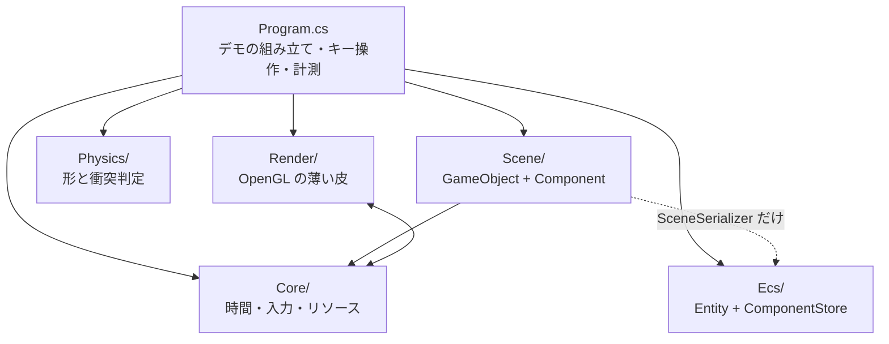

| 層 | 依存先 | 備考 |
|---|---|---|
| `Physics/` | **なし** | `System.Numerics` だけ。そのまま別プロジェクトへ持ち出せる |
| `Ecs/` | **なし** | 同上。Day 23 で「他に依存しないので先に5つ書ける」と書いたとおり |
| `Scene/` | `Core`(`InputSnapshot`)、`Ecs`(`SceneSerializer` のみ) | **描画を一切知らない**。`SpriteRenderer` は絵の種類と大きさを持つデータでしかない |
| `Render/` | `Core`(`Handle` / `ResourceManager`) | `Material` がハンドルを解くために管理側を呼ぶ |
| `Core/` | `Render`(`Texture` / `Shader`) | `ResourceManager` が両者の実体を握っている |
| `Program.cs` | 全部 | 組み立て役。3018行あるが、その大半はデモ・計測・自己チェック |

**`Core` と `Render` が相互参照になっている**のは、この図を描いて初めて見えたことで、
きれいな形ではない。`ResourceManager`(Core)が `Texture`(Render)を作り、
`Material`(Render)が `ResourceManager`(Core)を呼ぶ、という往復になっている。

名前空間が `HonyaEngine` 1つなので今は問題なく動くが、**アセンブリを分けようとした瞬間に破綻する**。
直すなら「`ResourcePool` と `Handle` だけを下層に置き、`ResourceManager` は Render 側に上げる」
のが素直で、Phase 6 でアセットの種類が増えたときに検討する。
今日の時点では**そういう歪みがあることを記録しておくだけ**にする。

### Core — 時間・入力・リソース

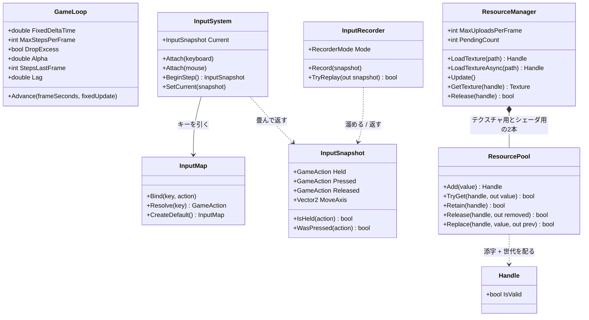

`ResourcePool` と `Handle` は総称型(`ResourcePool<T>` / `Handle<T>`)。
`T` が何かを知らないまま添字と世代だけを管理するので、`Texture` にも `Shader` にも同じものが使える。

この層で押さえるべき責務の線引き:

- **`GameLoop` は時間しか知らない**。何を更新するかは `Action<float>` で渡される
- **`InputSystem` はデバイスのイベントを畳むだけ**。ゲームとしての意味づけは `InputMap` が持つ
- **`InputSnapshot` は値**。だから記録・再生で丸ごと差し替えられる(Day 20 の肝)

### Render — OpenGL の薄い皮

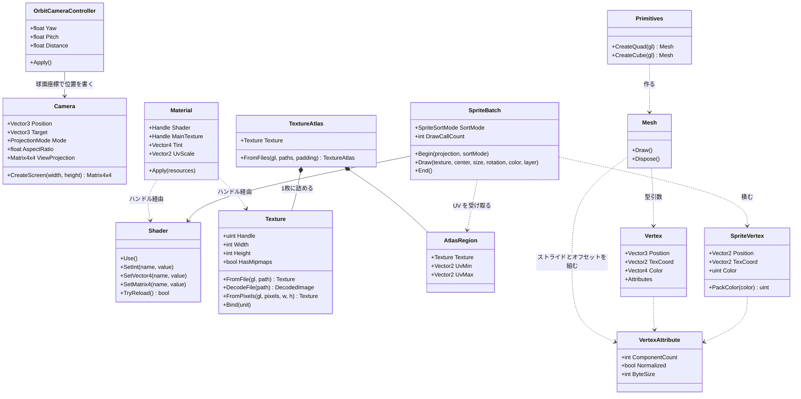

**`Material` が何も所有していない**のは Day 15 から一貫している(Day15.md の要点2)。
持っているのはハンドルだけで、実体の寿命は `ResourceManager` にある。

**3D の道(`Mesh` + `Material`)と 2D の道(`SpriteBatch`)が並列**なのも見てのとおりで、
両者は `Shader` と `Texture` を共有しているだけで互いを知らない。
`Mesh` は「形が決まっていて毎フレーム変わらないもの」、
`SpriteBatch` は「毎フレーム頂点を作り直すもの」という使い分けになっている。

### Scene — GameObject + Component

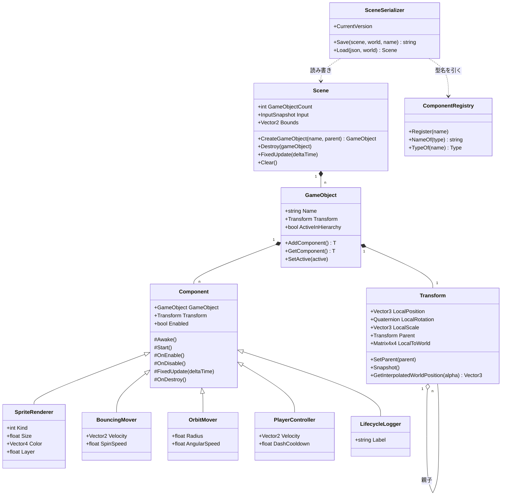

`Transform` だけが `GameObject` の固定メンバーで、ほかは全部 `Component` として付け外しする
(Day 22 の要点2)。`SceneSerializer` が `ComponentRegistry` を経由するのは、
**JSON の文字列から直接 `Type` を作らせない**ため(Day 24 の要点2)。

### Ecs と Physics — どこにも依存しない2つ

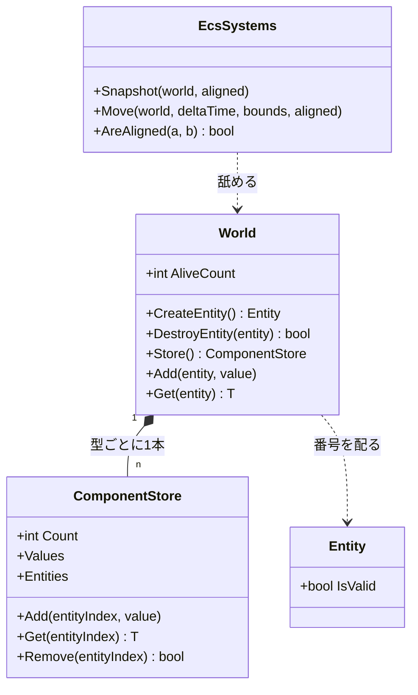

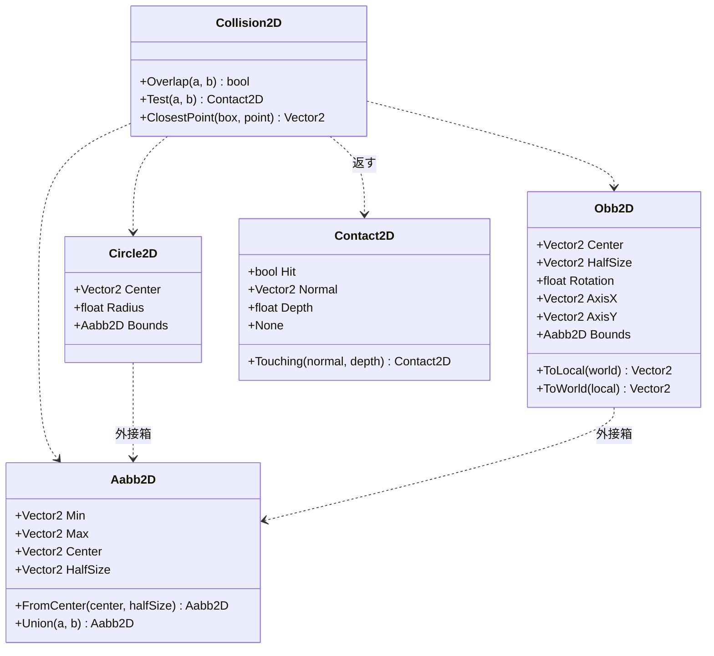

**形は全部 `readonly struct`、判定は `static` メソッドだけ**。状態を持たないので、
どのスレッドから何回呼んでも同じ答えが返る。Day 26 で空間分割を入れるとき、
この性質のおかげで**判定そのものには一切手を入れずに済む**。

### 1フレームの流れ

Silk.NET のウィンドウから `OnUpdate` と `OnRender` が交互に呼ばれる。
**状態を変えるのは `OnUpdate` 側だけ**、というのが Day 19 で引いた線。

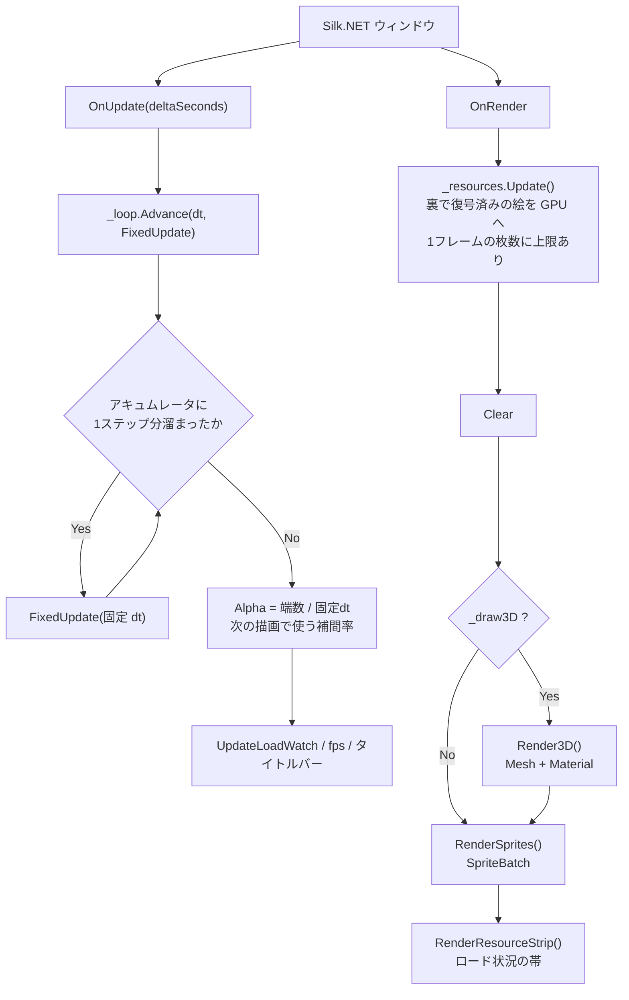

`OnRender` の先頭で `_resources.Update()` を呼ぶのが要点で、
**GL は描画スレッドからしか触れない**ため、裏で復号し終えた画素をここで GPU に上げている
(Day 21 の要点5・6)。

### FixedUpdate の中身 — 入力の出どころと3つのバックエンド

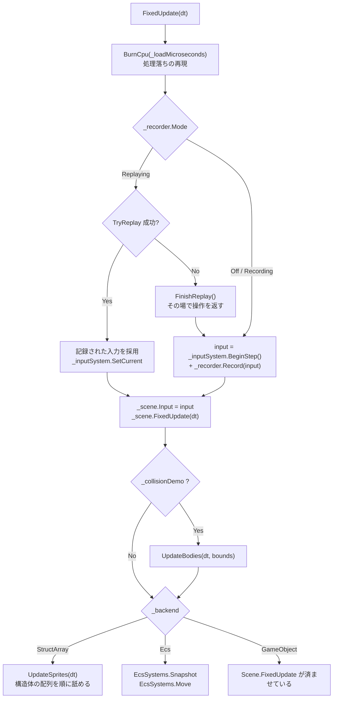

**入力がどこから来たかを、この関数から下は誰も気にしない**のがポイント(Day 20 の要点1)。
`InputSnapshot` という値に畳んであるので、記録の再生と実操作を1行で差し替えられる。

`Scene.FixedUpdate` を `_backend` の分岐より前で必ず呼んでいるのは、
**プレイヤーと階層の実演がどのモードでも Scene 側にいる**ため。

### Scene.FixedUpdate の4段階

順番に意味がある。入れ替えると壊れる。

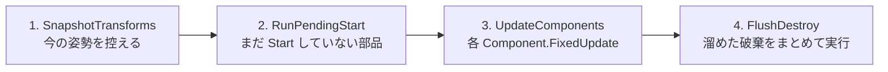

| 段 | なぜその位置か |
|---|---|
| 1 | **動かす前**に控えないと、補間の始点が終点と同じになって補間が効かない |
| 2 | `Start` の中で新しいオブジェクトが生まれるので、**開始時点の件数だけ**回す |
| 3 | ここも開始時点の件数で止める。このステップで生まれたものは次のステップから |
| 4 | 更新中にリストから消すと**走査中のインデックスがずれる**(Day 22 の要点5)。<br/>まとめて `RemoveAll` するのは、1個ずつ消すと O(n^2) になるため |

### 非同期テクスチャロードの流れ

`Q` キーで走る道。**GL を呼ぶ部分と呼ばない部分の境目**が、
そのままスレッドの境目になっている(Day 21 の要点5)。

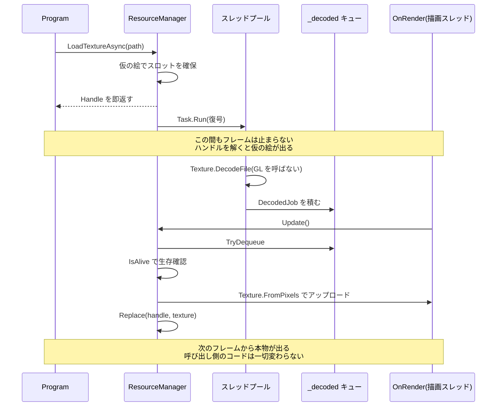

`Update()` が `MaxUploadsPerFrame` で枚数を絞っているのが肝で、
**復号を非同期にしても、アップロードをまとめてやるとそこでカクつく**(Day 21 の要点6)。

### 衝突判定のディスパッチ

`UpdateBodies` は「動かす → 総当たり → 押し戻す」の3段。
形の組み合わせごとの振り分けは `Test(in Body, in Body)` が一手に引き受ける。

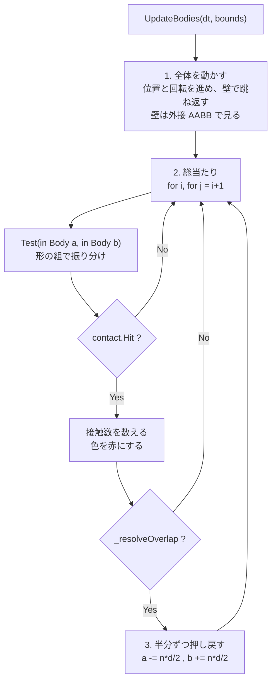

`Test(in Body, in Body)` の中身は形の組み合わせ表そのもの。**3種類で6通り**になる。

| a \ b | Circle | Box | RotatedBox |
|---|---|---|---|
| **Circle** | `Test(Circle, Circle)` | `Test(Circle, Aabb)` | `Test(Circle, Obb)` |
| **Box** | 上を**符号反転** | `Test(Aabb, Aabb)` | OBB 同士へ寄せる |
| **RotatedBox** | 上を**符号反転** | OBB 同士へ寄せる | `Test(Obb, Obb)` SAT |

- **専用の速い経路**(AABB 同士、円同士)と**一般形**(OBB 同士の SAT)を併存させ、
  組み合わせの穴は一般形で埋める。`F9` の自己チェックで**両者の答えが一致すること**を確認している
- 引数の順が逆になる組(`Test(Box, Circle)`)は**法線の符号を反転**して返す。
  ここを間違えると物体がめり込む方向へ押される(要点6)
- 種類を1つ足すと表が1行1列増える。3D で球・箱・カプセル・平面・地形と並べると 15 通りになり、
  **その表を埋めることが物理エンジンを書くこと**になる(Phase 7)

## 完成条件

```
dotnet run --project reference/Day25 -c Release
```

### `F6`: 衝突デモ

**見やすくするなら先に `G`(3D背景オフ)と `PageDown` 連打(スプライト 0)**。
コンソールにもその案内が出る。

- 水色 … 誰にも当たっていない
- 赤 … 誰かに当たっている
- 円は円の絵、矩形は枠の見える四角

120 体だと 4 割くらいが赤くなる。

### `F8`: 押し戻しを切る

四角が**重なったまま**すり抜けていくのが見える。
枠があるので、どれだけめり込んでいるかが分かる。
戻すと、押し合ってじわじわ離れる。

### `F7`: 形を回してみる

回転矩形だけにすると、**角が刺さったときだけ**赤くなるのが分かる。
円だけにすると判定が軽くなり、`判定:` の数字が下がる(要点1)。

### `Shift` + `PageUp`: 壁にぶつかる

500 → 1000 → 1500 → 2000 と増やして、タイトルバーの `判定:` を見る。

```
衝突:500体  組:124,750    判定:2.98ms
衝突:1000体 組:499,500    判定:12.01ms
衝突:2000体 組:1,999,000  判定:47.30ms
```

**体数が2倍で判定が約4倍**。fps がはっきり落ちるところまで上げてみること。
これが Day 26 でグリッドを作る動機になる。

### `F9`: 自己チェックと計測

18 項目すべて `OK` になり、続けて形ごとのコストが出る。

```
[OK] AABB: 浅い軸で押す(X)  深さ 4 法線 <1, 0>
[OK] OBB: 45度の角が刺さっているのを検出  深さ 1.142
[OK] OBB(回転0) と AABB の答えが一致  SAT 深さ 4 法線 <1, 0>
[OK] 円同士: 中心が重なっても NaN にならない
[OK] 押し戻すと重なりが消える
  すべて合格
```

`OBB(回転0) と AABB の答えが一致` は、
**専用の速い経路と一般形が食い違っていない**ことの確認。
最適化した経路を足したら、必ず一般形と突き合わせておく。

## 改造課題

### 課題1(易): AABB の接触計算を速くする

要点1の表で、**AABB の接触計算(44.0ns)が円(20.0ns)より高い**のは妙に見える。
原因は `Aabb2D` が `Min` / `Max` で持っていて、
`Center` と `HalfSize` を**呼ばれるたびに計算し直している**こと
(それと `MathF.CopySign`)。

中心と半径ベクトルで持つ `Aabb2D` を別に書いて、`F9` で測り比べてみる。
どちらが速いかだけでなく、**`Min` / `Max` のほうが書きやすい場面**
(2つを包む箱を作る、点が入っているか調べる)もあることに気づけるとよい。

**表現の選び方でコストが変わる**のは、Day 23 で ECS を書いたときと同じ話。

### 課題2(中): 外接 AABB で足切りする

OBB 同士の判定(120.8ns)の前に、外接 AABB(`Obb2D.Bounds`)で弾く。

```csharp
if (!Collision2D.Overlap(a.Bounds, b.Bounds)) { return Contact2D.None; }
```

`F7` で回転矩形だけにして、`判定:` がどう変わるかを測る。

考えどころは**いつ速くなり、いつ遅くなるか**。
外れている組が多いほど得をし、当たっている組が多いほど損をする
(足切りを通ってから本判定もやることになるため)。
体数を変えながら測ると、損得が入れ替わる密度がある。

### 課題3(難): 連続衝突判定(すり抜けの解消)

`Shift` + `PageUp` で体を減らし、代わりに速度を 10 倍にすると、
**細い箱を弾がすり抜ける**ようになる。
1ステップで動く距離が相手の厚みを超えると、
「動く前」も「動いた後」も当たっていない状態になるため。

対策は2段階ある。

1. **掃過ボリューム(swept volume)で足切り** — 移動前と移動後を包む AABB を作り、
   それが重なる組だけ詳しく調べる
2. **円と円の連続判定** — 相対速度を使って「いつ当たるか」を2次方程式で解く。
   `t` が 0〜1 に入れば、そのステップの途中で当たっている

1 だけでも「すり抜けたことに気づける」ようになる。
2 まで書くと、当たった瞬間まで戻して処理できる。

**なぜ多くのゲームがここを妥協するのか**(弾を大きめの円にする、
壁を厚くする、ステップを細かくする)も考えてみてほしい。

## 動作確認済み環境

- Windows 11 / .NET 10 / Silk.NET 2.23.0
- GL_RENDERER: NVIDIA GeForce RTX 3070/PCIe/SSE2
- 960x640、VSync オフ、`-c Release`、シミュレーション 60Hz

### 判定 1 回あたりのコスト(200 万回の平均、当たり 5〜6 割の配置)

| 判定 | 1回あたり |
|---|---|
| AABB(当たったかだけ) | 7.4ns |
| 円と円(当たったかだけ) | 10.6ns |
| 円と円 | 20.0ns |
| 円と AABB | 29.7ns |
| AABB と AABB | 44.0ns |
| 円と OBB | 73.9ns |
| OBB と OBB | 120.8ns |

### 総当たりの伸び方

| 体数 | 組 | 1ステップ | 1組あたり | 接触した組 |
|---|---|---|---|---|
| 120 | 7,140 | 0.173ms | 24.2ns | 52 |
| 250 | 31,125 | 0.750ms | 24.1ns | 212 |
| 500 | 124,750 | 2.976ms | 23.9ns | 792 |
| 1,000 | 499,500 | 12.009ms | 24.0ns | 2,855 |
| 2,000 | 1,999,000 | 47.298ms | 23.7ns | 11,236 |

移動と壁の跳ね返りを含めた「1ステップの当たり判定処理」全体の時間。
形は混在(円・矩形・回転矩形が 1/3 ずつ)。

2,000 体でも**実際に接触しているのは 0.6%** で、残りは無駄に調べている。

### 自己チェック(18 項目すべて合格)

```
[OK] 円同士: ちょうど接するのは当たり扱い
[OK] 円同士: 中心が重なっても NaN にならない  <1, 0> 20
[OK] AABB: 浅い軸で押す(X)  深さ 4 法線 <1, 0>
[OK] 円とAABB: 円が中にあっても向きが決まる  <-1, 0> 深さ 11
[OK] OBB: 45度の角が刺さっているのを検出  深さ 1.142
[OK] OBB(回転0) と AABB の答えが一致  SAT 深さ 4 法線 <1, 0>
[OK] 押し戻すと重なりが消える
```

### 検証の途中で分かったこと

- **AABB の接触計算は円より高い**(44.0ns 対 20.0ns)。
  「AABB がいちばん安い」は判定だけの話(7.4ns)で、
  法線と深さまで求めると逆転する。
  原因は `Min`/`Max` 表現から毎回 `Center`/`HalfSize` を計算し直していることと
  `MathF.CopySign`。**表現の選び方が効く**(課題1)
- **1組あたりのコストは体数によらず 24ns で一定**だった。
  最初の測定では 120 体だけ 58ns と出て「小さいほうが遅い」ように見えたが、
  これは**.NET の段階的 JIT**で、最初に測った構成だけ最適化前のコードで走っていたため。
  全構成をあらかじめ回してから測り直したら一定になった。
  ベンチマークは**測る対象を全部温めてから**始めること
- 当たり判定のテストは**期待値のほうを間違えやすい**。
  最初に書いた「円と AABB」の確認は、円を x=24 に置いていて
  そもそも届いていなかった(箱の右辺は x=10、円の左端は 18)。
  実装ではなくテストが間違っていた。**手で図を描いて数えたほうが速い**
