# Day 26: 空間分割とブロードフェーズ(均一グリッド)

Phase 5(ゲームが作れる状態に)の2日目。Day 25 で作った O(n²) の壁を壊す。

## 今日のゴール

`F6` の衝突デモで `F10` を押すと、同じ絵のまま**判定時間が 30 分の 1 になる**。

```
総当たり  衝突:2000体 候補:1,999,000/1,999,000 判定:47.54ms
グリッド  衝突:2000体 候補:12,560/1,999,000    判定:1.43ms
```

体数の上限も 2000 から **20000** に上げる。
Day 25 で「60fps の予算 16.6ms を超えるのは 1,000〜2,000 体の間」と書いた壁が、
そのまま **20,000 体**まで動く(そこで 15.8ms。壁が消えたのではなく、10 倍先へ移った)。

`F11` を押すと、判定を絞っている格子そのものが見える。

## 事前に読む資料

ロードマップでは資料の指定が無い日なので、実装に直結するものを挙げておく。

- [Spatial Partition](https://gameprogrammingpatterns.com/spatial-partition.html)
  (*Game Programming Patterns*, Robert Nystrom。[日本語版](https://gpp.craftbeer.style/spatial-partition/))
  **今日いちばん近い資料**。均一グリッドの実装を1章まるごと使って説明していて、
  「なぜ O(n²) が問題なのか」から入る。無料で全文が読める
- [Broadphase Collision Detection](https://www.toptal.com/game/video-game-physics-part-ii-collision-detection-for-solid-objects)
  ブロードフェーズとナローフェーズの分け方。今日の設計そのもの
- [Optimized Spatial Hashing for Collision Detection of Deformable Objects](https://matthias-research.github.io/pages/publications/tetraedra.pdf)
  (Teschner et al., 2003)
  世界の広さを決めずに済ませる「空間ハッシュ」の原論文。3ページ目までで足りる。
  **均一グリッドの弱点(世界が有限でないと困る)をどう外すか**が分かる
- *Real-Time Collision Detection*(Christer Ericson)7章
  空間分割の教科書。グリッド・階層グリッド・SAP・BVH が並べて比較されている。
  手元にあるなら 7.1(均一グリッド)と 7.5(SAP)を読むと、今日の選択の位置づけが分かる

## 理論の要点

### 1. ブロードフェーズとナローフェーズ — 責任が非対称

当たり判定を2段に分ける。

| 段 | やること | 出るもの | 間違えたときの扱い |
|---|---|---|---|
| **ブロードフェーズ** | 調べる価値のある組を選ぶ | 番号の組 | **余分に出すのは可 / 取りこぼしは不可** |
| **ナローフェーズ** | その組を本当に判定する | 法線と深さ | どちらも不可 |

この非対称が全部を決めている。ブロードフェーズは
**「当たっているかもしれない組」を全部含んでいればよく、正確である必要はない**。
だから外接 AABB という雑な近似で足りるし、格子という雑な区切りで足りる。

逆に、**取りこぼしだけは絶対に許されない**。
1組落とすと、その2体はその瞬間すり抜ける。
Day 25 のナローフェーズにバグがあれば「めり込んだまま止まる」と目に見えるが、
ブロードフェーズのバグは**何百体も飛び交う中の1組が1フレームだけ抜ける**形で出る。
気づくのは「たまに敵が壁を抜ける」という報告が来たとき。

だから今日は**確かめ方を先に決める**(要点6)。

### 2. 均一グリッド — 世界を格子に切って、同じマスの中だけ見る

いちばん単純な空間分割。世界を等間隔のマスに切り、
それぞれの物体を**自分が重なっているマス全部**に登録する。
判定するのは、同じマスに入っている組だけ。

```
   0    1    2    3
 +----+----+----+----+
0|    | A  | AB |  B |     A は 1,2 に登録
 +----+----+----+----+     B は 2,3 に登録
1|    | C  |    |    |     → 候補は (A,B) だけ。C は最初から候補外
 +----+----+----+----+
```

実装で引っかかるところが2つある。

**(a) 中心のマスだけに入れてはいけない**
「物体の中心があるマス」だけに登録して、周囲 3×3 を調べる作りも見かける。
これは**物体がマスより小さいときにしか正しくない**。
大きい物体が来た瞬間に取りこぼす。外接 AABB が重なるマス全部に入れるほうが、
大きさに関係なく正しい。

**(b) またがるぶん、同じ組が何度も見つかる**
A と B が2つのマスを共有していたら、同じ組が2回出てくる。
重複を消す手が2つ要る。

1. **`j > i` のときだけ組にする** — (i,j) と (j,i) の2回を1回にする
2. **「印」を付ける** — i を調べている間に見つけた j に通し番号を書き込み、
   同じ通し番号ならもう見つけた相手として飛ばす

1 だけでは 2 のケースが消えない(どちらも `j > i` を満たすため)。ここは実際に踏む。

```csharp
int stamp = ++_stamp;              // i ごとに新しい番号
...
if (_mark[j] == stamp) { continue; }  // この i では既に見つけた相手
_mark[j] = stamp;
```

**毎回配列をクリアしないで済ませる**ために通し番号を増やしていくのがコツ。
`HashSet` を使うより2桁速い。グラフ探索の visited でも同じ手を使う。

### 3. 配列3本で作る — List のマス配列は使わない

素直に書くと `List<int>[] _cells` になるが、これは毎フレーム作り直すには重い。
マスの数だけ `List` があり、それぞれが内部で配列を持ち、追加のたびに容量を見る。
**代わりに、カウンティングソートで1本の配列に並べ替える**。

```
1. 数える     : 各マスに何個入るかを数える           → [0,2,0,3,1,...]
2. 接頭辞和   : 数を「開始位置」に変える             → [0,0,2,2,5,6,...]
3. 詰める     : もう一度なめて、所定の位置へ書き込む → [A,B, C,D,E, F,...]
```

できあがるのは
- `_entries` … マス順に並んだ体の番号(1本の `int[]`)
- `_cellStart` … 各マスの開始位置(`_cellStart[c]` 〜 `_cellStart[c+1]` がマス c の中身)

の2本だけ。**割り当てはゼロ**(配列は使い回す)で、走査は連続したメモリになる。

`_cellStart` の長さを「マス数 + 1」にして末尾に番兵を置くと、
最後のマスを特別扱いせずに済む。この形は ECS のストア(Day 23)や
スパース行列(CSR 形式)と同じで、**可変長のリストを2本の配列で表す**定番の型。

### 4. マスの大きさが性能の全部を決める

実測(4000 体、Release):

| マス | 格子 | 登録 | 最大/マス | 同居した組 | 候補 | 合計 |
|---|---|---|---|---|---|---|
| 4px | 240x160 | 181,422 | 14 | 29,676 | 24,781 | 5.68ms |
| 8px | 120x80 | 58,971 | 13 | 34,396 | 24,800 | 3.57ms |
| **16px** | 60x40 | 23,189 | 17 | 46,042 | 24,868 | **2.99ms** |
| **32px** | 30x20 | 11,358 | 29 | 72,527 | 24,733 | **2.98ms** |
| 64px | 15x10 | 7,022 | 59 | 143,247 | 24,798 | 3.40ms |
| 128px | 8x5 | 5,336 | 160 | 353,107 | 24,670 | 4.84ms |
| 256px | 4x3 | 4,614 | 525 | 957,840 | 24,869 | 8.48ms |

**両端で遅くなる谷型**になる。理由が左右で違うのが面白いところ。

- **小さすぎる側**(4px): `登録` の欄を見る。1個が何十枚ものマスにまたがるので、
  登録の総数が体数の 45 倍になっている。**構築そのものが重い**
- **大きすぎる側**(256px): `同居した組` を見る。1マスに 525 個入っているので、
  そのマスの中で総当たりが起きている。**元の O(n²) に戻っていく**

`候補` の欄が**どの行でもほぼ 24,800 で一定**なのが効いている。
最後に外接 AABB で足切りしているので、マスの大きさを変えても
ナローフェーズを呼ぶ回数は変わらない。**変わっているのはそこへ至るコストだけ**。

目安は「物体の平均的な直径くらい」。この配置では自動選択が 22.3px を選び、
測定上の最適(16〜32px)に入っている。
ただし**目安は測り始める場所でしかない**ので、`F12` で掃引して確かめる。

### 5. O(n²) から O(n) へ。ただし「密度が一定なら」

体数を振った実測(形は混在、押し戻しあり):

| 体数 | 総当たり | グリッド | うち広域 | 候補 | 接触 | 倍率 |
|---|---|---|---|---|---|---|
| 250 | 0.75ms | 0.09ms | 0.07ms | 289 | 240 | 8.2x |
| 500 | 3.00ms | 0.20ms | 0.15ms | 898 | 765 | 14.9x |
| 1,000 | 12.26ms | 0.44ms | 0.25ms | 3,093 | 2,369 | 27.8x |
| 2,000 | 47.54ms | 1.43ms | 0.71ms | 12,560 | 7,425 | 33.2x |
| 4,000 | 187.37ms | 2.91ms | 1.46ms | 24,880 | 14,641 | 64.4x |
| 8,000 | — | 6.00ms | 3.02ms | 49,615 | 29,264 | — |
| 16,000 | — | 12.46ms | 6.45ms | 100,548 | 59,099 | — |

**総当たりは体数が2倍で時間が4倍**(0.75 → 3.00 → 12.26 → 47.54 → 187.37)。
組あたり 24ns で一定なので、増えているのは純粋に組の数だけ。

**グリッドは 2,000 体から上でぴったり2倍ずつ**
(1.43 → 2.91 → 6.00 → 12.46)。候補の数も同じく2倍ずつ増えている。
これが O(n) の姿。

ただし条件がある。この表は**体を増やすたびに小さくして、画面の詰まり具合を一定に保っている**
(2,000 体を基準に、面積の合計が変わらないよう一辺を `1/√n` で縮める)。
大きさを固定したまま増やすと、こうなる:

| 体数 | グリッド | 候補 | 接触 | 候補/体 | 最大/マス |
|---|---|---|---|---|---|
| 2,000 | 1.45ms | 12,359 | 7,269 | 6.2 | 21 |
| 4,000 | 5.06ms | 51,321 | 23,487 | 12.8 | 41 |
| 8,000 | 18.17ms | 217,661 | 69,721 | 27.2 | 81 |

**2倍で 3.5 倍**。O(n²) に戻り始めている。
`候補/体` が 6.2 → 12.8 → 27.2 と倍々になっているのが原因で、
密度が上がったぶん「近くにいる相手」そのものが増えている。

つまり空間分割は **「物が空間に散らばっている」ことに賭けた最適化**で、
賭けが外れると効かない。
現実のゲームで賭けが外れる典型は、**全員が同じ場所に集まる**とき——
ボス戦で敵が1点に群がる、狭い通路に押し込まれる、といった場面になる。
そこが実際に問題になるなら、階層グリッドや BVH(要点7)へ進むことになる。

### 6. 正しさは「総当たりと同じ答えか」で確かめる

要点1で書いたとおり、ブロードフェーズのバグは絵に出ない。
だから確かめ方はひとつしかない。

> **総当たりは遅いが絶対に正しい。だから正解表として使える。**

`F12` の自己チェックがやっているのはこれで、
1,000 体をばらまいて「AABB が重なる組の集合」を総当たりで作り、
グリッドの出力と**集合として一致するか**を見る。

そのうえで、**マスの大きさを変えても答えが変わらないこと**を確かめる。

```
[OK] マス      4px: 総当たりと同じ組  3693 組(正解 3693 組)
[OK] マス     13px: 総当たりと同じ組  3693 組(正解 3693 組)
[OK] マス   4000px: 総当たりと同じ組  3693 組(正解 3693 組)
```

マスの大きさは**性能の調整つまみであって、仕様ではない**。
ここで答えが変わるなら、それは調整の失敗ではなくバグ。
4000px(=世界全体が1マス)でも通ることが、
「グリッドは総当たりの一般化になっている」ことの確認にもなっている。

最適化を入れるときは、いつもこの形にする。
Day 25 の「回転 0 の OBB と AABB の答えが一致」も同じ考え方だった。

### 7. なぜ均一グリッドなのか — 他の選択肢と比べる

| 方式 | 得意 | 苦手 | 構築 |
|---|---|---|---|
| **均一グリッド** | 大きさが揃っていて散らばっている | 偏り、極端な大きさの差 | O(n)、毎フレーム作り直せる |
| 空間ハッシュ | 世界が無限に広い | ハッシュ衝突の分だけ余分な候補 | O(n) |
| 四分木 / 八分木 | 偏りに強い | ポインタ追跡、境界にまたがる物体の扱い | O(n log n) |
| BVH | 静的な物が大量にある | 動くと作り直しか回転が要る | O(n log n) |
| Sweep and Prune | 1軸に細長い世界、動きが小さい | 全方向に散らばると効かない | 挿入ソートで O(n)(ほぼ整列済みなら) |

今日の題材(卒業制作の見下ろし型アクション)は
**大きさが揃った敵が画面に散らばる**ので、均一グリッドが素直に当たる。
構築が O(n) で毎フレーム作り直せるのも、全員が毎フレーム動く前提と噛み合う。

そして重要なのは、**均一グリッドは他の方式の土台になる**こと。
階層グリッド(大きさごとに複数のグリッドを持つ)は均一グリッドを何枚か重ねたものだし、
空間ハッシュはマス番号をハッシュに置き換えただけで、実装はほとんど同じ。
Day 46 の 3D 版も、マスが立方体になるだけで構造は変わらない。

## 前Dayからの差分概要

### 新規ファイル

| ファイル | 行数(うち実コード) | 役割 |
|---|---|---|
| `Physics/SpatialGrid.cs` | 386 (199) | `BroadPair` と均一グリッド。構築と候補列挙 |

`Physics/` は今日も**どこにも依存しない**まま。
`SpatialGrid` が受け取るのは `ReadOnlySpan<Aabb2D>` だけで、
`Body` も速度も形も知らない。返すのも番号の組だけ。
このおかげで Day 46 の 3D 版は、この型を丸ごと持っていける。

### 変更ファイル

| ファイル | 差分 | 内容 |
|---|---|---|
| `Program.cs` | +712 / -36 | ブロードフェーズの切り替え、マスの可視化、自己チェックと掃引ベンチ |

`Program.cs` の変更を4つに分けると:

1. **`UpdateBodies` の中身が3段になった** — 動かす / 組を絞る / 判定する。
   総当たりとグリッドで**共通の1組ぶんの処理**(`Resolve`)を local function に出した。
   ここを共通にしておかないと、2つの方式で答えが食い違ったときに原因が絞れない
2. **体数の上限が 2000 → 20000**。あわせて、体を増やすときは
   **面積の合計が変わらないように小さくする**(要点5)
3. **マスの可視化**(`RenderCells`)— 混んでいるマスほど赤くする
4. **自己チェックと掃引ベンチ**(`RunBroadphaseCheck` / `BenchmarkBroadphase`)

### キーの追加

| キー | 動作 |
|---|---|
| `F10` | 総当たり ⇄ 均一グリッド |
| `F11` | マスの可視化 ON/OFF |
| `F12` | ブロードフェーズの自己チェックと計測(数秒かかる) |
| `,` / `.` | マスの大きさを1段小さく / 大きく(端まで行くと自動へ戻る) |
| `-` | 体の大きさ(面積を一定に保つ ⇄ 固定) |

`PageUp` / `PageDown` は Day 25 と同じ(衝突デモ中は体数 ±60、Shift 併用で ±500)。

### 写経する順番

1. **`Physics/SpatialGrid.cs`** — 上から順に。
   `Build` の3パス(数える → 接頭辞和 → 詰める)と
   `CollectPairs` の重複除去(`j > i` と印)が本丸。
   `CellRange` のクランプは短いが、世界の外に出た物体の扱いを決めている
2. **`Program.cs`** — 依存の順に。
   1. フィールド(`Broadphase` / `Grid` / `_bodyBounds` / `_cellSizeOverride` ほか)と定数(`MaxBodies` / `DensityReferenceBodies`)
   2. `InitializeBodies` — 面積を一定に保つ `sizeScale`
   3. `UpdateBodies` — **今日の主役**。3段に分かれ、`Resolve` が共通化される
   4. `SetBodyCount` — 上限と警告
   5. `RenderCells` / `RenderBodies` — 可視化
   6. `CycleCellSize` / `BroadphaseLabel` / `OnKeyDown` / タイトルバー / 起動時のヘルプ
   7. `RunBroadphaseCheck` → `BenchmarkBroadphase` — **ここは飛ばさない**。
      要点6のとおり、今日の実装は「確かめる側」とセットで意味を持つ

## 設計書

Day 25 から**変わったのは `Physics/` だけ**。クラスが1つ(と組を表す小さな構造体が1つ)増えた。
それ以外の層——`Core` / `Scene` / `Ecs` / `Render`——は1文字も動いていない。

Day 25 の設計書を丸ごと引き継ぎ、差分の当たった図にだけ手を入れてある。
変わった図は次の3つ。

| 図 | 何が変わったか |
|---|---|
| `Ecs と Physics` のクラス図 | `SpatialGrid` と `BroadPair` を追加 |
| `衝突判定のディスパッチ` | 総当たりの二重ループが「ブロードフェーズ + ナローフェーズ」に割れた |
| `均一グリッドの中身`(新規) | `Build` の3パスと `CollectPairs` の重複除去 |

写経の前に読み込む必要はない。**途中で「これは誰が呼ぶんだったか」と迷ったときに戻ってくる場所**として使う。

### 全体構成 — 5つの層と依存の向き

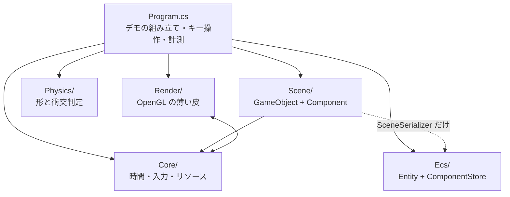

| 層 | 依存先 | 備考 |
|---|---|---|
| `Physics/` | **なし** | `System.Numerics` だけ。そのまま別プロジェクトへ持ち出せる |
| `Ecs/` | **なし** | 同上。Day 23 で「他に依存しないので先に5つ書ける」と書いたとおり |
| `Scene/` | `Core`(`InputSnapshot`)、`Ecs`(`SceneSerializer` のみ) | **描画を一切知らない**。`SpriteRenderer` は絵の種類と大きさを持つデータでしかない |
| `Render/` | `Core`(`Handle` / `ResourceManager`) | `Material` がハンドルを解くために管理側を呼ぶ |
| `Core/` | `Render`(`Texture` / `Shader`) | `ResourceManager` が両者の実体を握っている |
| `Program.cs` | 全部 | 組み立て役。3697行あるが、その大半はデモ・計測・自己チェック |

**`Core` と `Render` が相互参照になっている**のは、この図を描いて初めて見えたことで、
きれいな形ではない。`ResourceManager`(Core)が `Texture`(Render)を作り、
`Material`(Render)が `ResourceManager`(Core)を呼ぶ、という往復になっている。

名前空間が `HonyaEngine` 1つなので今は問題なく動くが、**アセンブリを分けようとした瞬間に破綻する**。
直すなら「`ResourcePool` と `Handle` だけを下層に置き、`ResourceManager` は Render 側に上げる」
のが素直で、Phase 6 でアセットの種類が増えたときに検討する。
今日の時点では**そういう歪みがあることを記録しておくだけ**にする。

### Core — 時間・入力・リソース

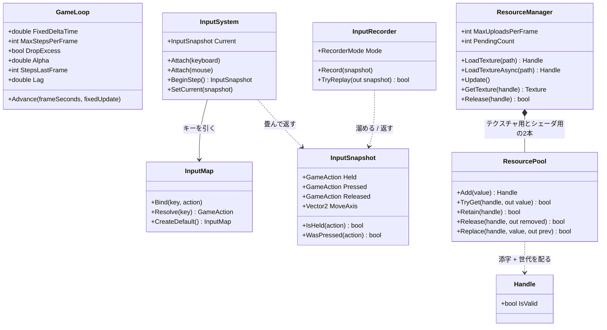

`ResourcePool` と `Handle` は総称型(`ResourcePool<T>` / `Handle<T>`)。
`T` が何かを知らないまま添字と世代だけを管理するので、`Texture` にも `Shader` にも同じものが使える。

この層で押さえるべき責務の線引き:

- **`GameLoop` は時間しか知らない**。何を更新するかは `Action<float>` で渡される
- **`InputSystem` はデバイスのイベントを畳むだけ**。ゲームとしての意味づけは `InputMap` が持つ
- **`InputSnapshot` は値**。だから記録・再生で丸ごと差し替えられる(Day 20 の肝)

### Render — OpenGL の薄い皮

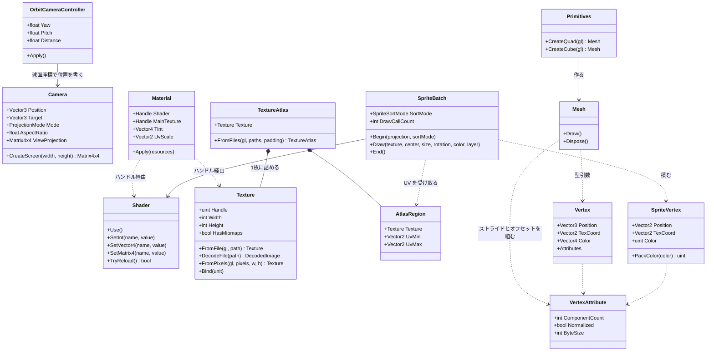

**`Material` が何も所有していない**のは Day 15 から一貫している(Day15.md の要点2)。
持っているのはハンドルだけで、実体の寿命は `ResourceManager` にある。

**3D の道(`Mesh` + `Material`)と 2D の道(`SpriteBatch`)が並列**なのも見てのとおりで、
両者は `Shader` と `Texture` を共有しているだけで互いを知らない。
`Mesh` は「形が決まっていて毎フレーム変わらないもの」、
`SpriteBatch` は「毎フレーム頂点を作り直すもの」という使い分けになっている。

### Scene — GameObject + Component

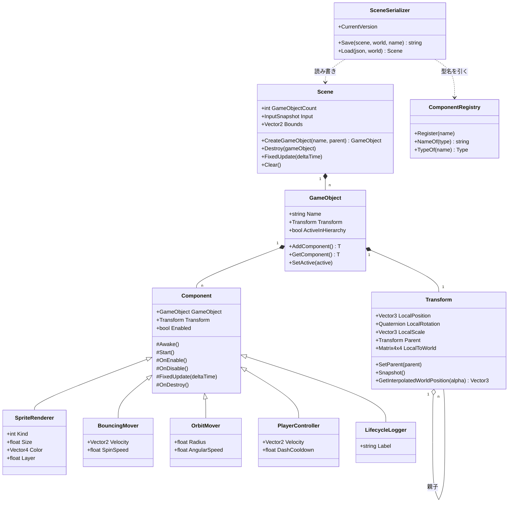

`Transform` だけが `GameObject` の固定メンバーで、ほかは全部 `Component` として付け外しする
(Day 22 の要点2)。`SceneSerializer` が `ComponentRegistry` を経由するのは、
**JSON の文字列から直接 `Type` を作らせない**ため(Day 24 の要点2)。

### Ecs と Physics — どこにも依存しない2つ(今日 `Physics` が増えた)

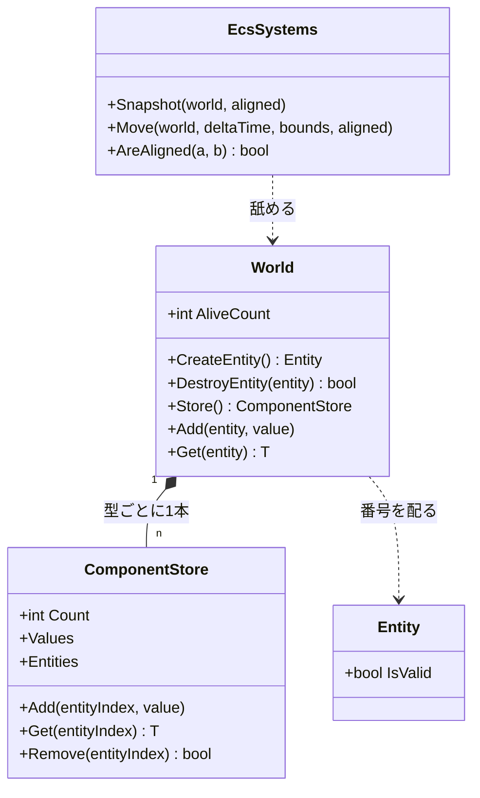

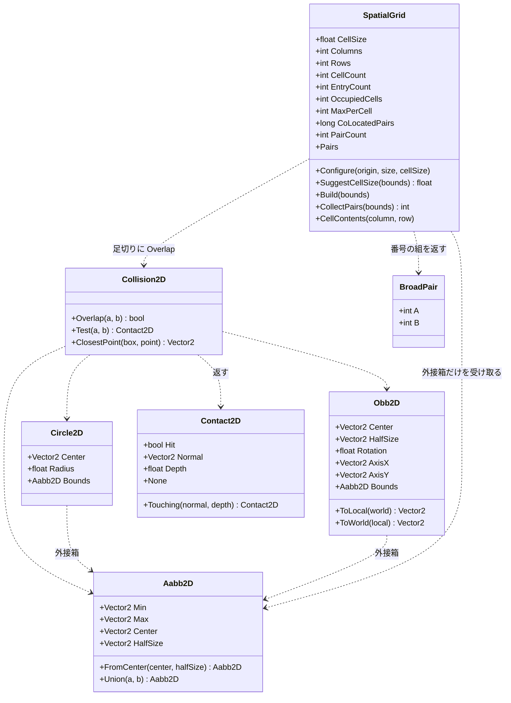

**形は全部 `readonly struct`、判定は `static` メソッドだけ**。状態を持たないので、
どのスレッドから何回呼んでも同じ答えが返る。Day 26 で空間分割を入れたとき、
この性質のおかげで**判定そのものには一切手を入れずに済んだ**——
`Collision2D.cs` と `Shapes2D.cs` の差分は 0 行になっている。

`SpatialGrid` だけが唯一 `class`(参照型)で、しかも状態を持つ。
配列を4本(`_cellStart` / `_cursor` / `_entries` / `_mark`)使い回すためで、
**毎フレーム作り直しても割り当てが起きない**ようにするにはこうするしかない。
そのぶん「1つのインスタンスを複数スレッドから同時に使えない」という制約が付く。
状態を持つと何が失われるかが、同じフォルダの中で見比べられる形になっている。

矢印の向きにも注目してほしい。**`SpatialGrid` から `Body` への線が無い**。
受け取るのは `ReadOnlySpan<Aabb2D>`、返すのは番号の組だけで、
速度も形も質量も知らない。この細さのおかげで、
Day 46 の 3D 版は `Aabb2D` を `Aabb3D` に変えるだけで済む。

### 1フレームの流れ

Silk.NET のウィンドウから `OnUpdate` と `OnRender` が交互に呼ばれる。
**状態を変えるのは `OnUpdate` 側だけ**、というのが Day 19 で引いた線。

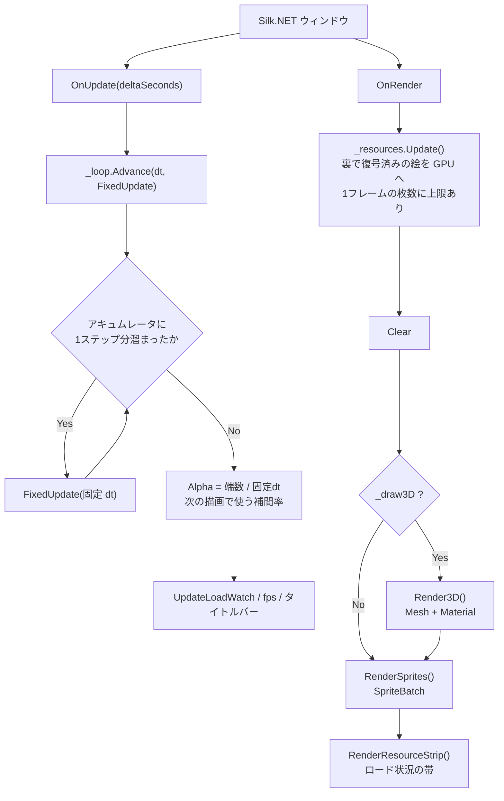

`OnRender` の先頭で `_resources.Update()` を呼ぶのが要点で、
**GL は描画スレッドからしか触れない**ため、裏で復号し終えた画素をここで GPU に上げている
(Day 21 の要点5・6)。

### FixedUpdate の中身 — 入力の出どころと3つのバックエンド

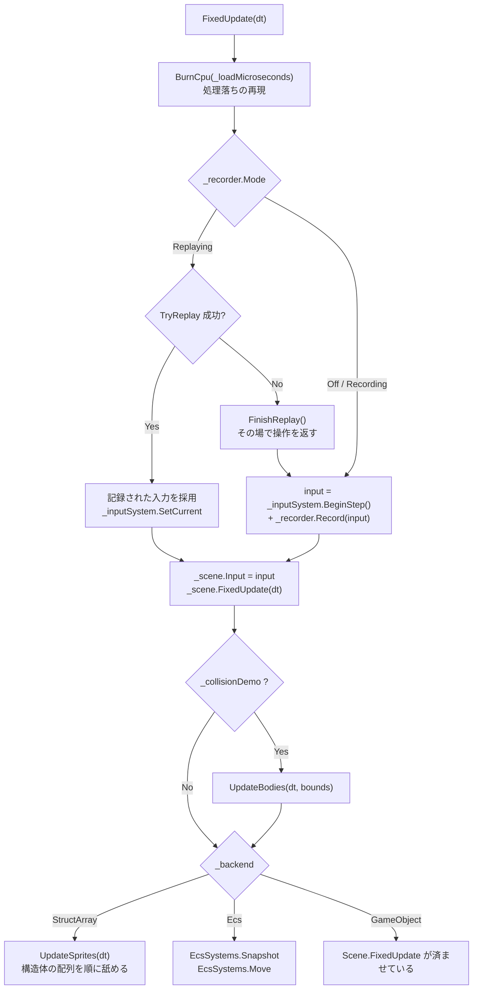

**入力がどこから来たかを、この関数から下は誰も気にしない**のがポイント(Day 20 の要点1)。
`InputSnapshot` という値に畳んであるので、記録の再生と実操作を1行で差し替えられる。

`Scene.FixedUpdate` を `_backend` の分岐より前で必ず呼んでいるのは、
**プレイヤーと階層の実演がどのモードでも Scene 側にいる**ため。

### Scene.FixedUpdate の4段階

順番に意味がある。入れ替えると壊れる。

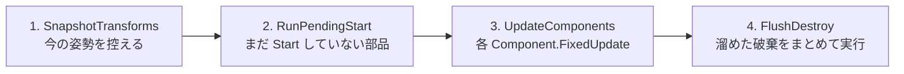

| 段 | なぜその位置か |
|---|---|
| 1 | **動かす前**に控えないと、補間の始点が終点と同じになって補間が効かない |
| 2 | `Start` の中で新しいオブジェクトが生まれるので、**開始時点の件数だけ**回す |
| 3 | ここも開始時点の件数で止める。このステップで生まれたものは次のステップから |
| 4 | 更新中にリストから消すと**走査中のインデックスがずれる**(Day 22 の要点5)。<br/>まとめて `RemoveAll` するのは、1個ずつ消すと O(n^2) になるため |

### 非同期テクスチャロードの流れ

`Q` キーで走る道。**GL を呼ぶ部分と呼ばない部分の境目**が、
そのままスレッドの境目になっている(Day 21 の要点5)。

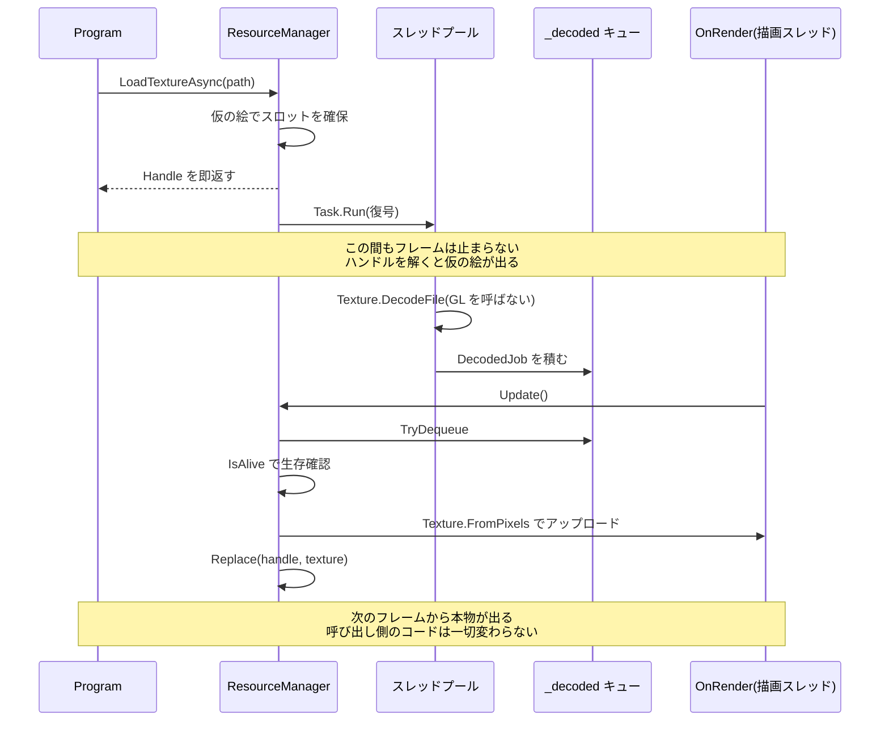

`Update()` が `MaxUploadsPerFrame` で枚数を絞っているのが肝で、
**復号を非同期にしても、アップロードをまとめてやるとそこでカクつく**(Day 21 の要点6)。

### 衝突判定の3段 — ブロードフェーズが割り込んだ

Day 25 の `UpdateBodies` は「動かす → 総当たり → 押し戻す」の3段だった。
今日、真ん中が**「組を絞る」と「絞った組を判定する」に割れる**。

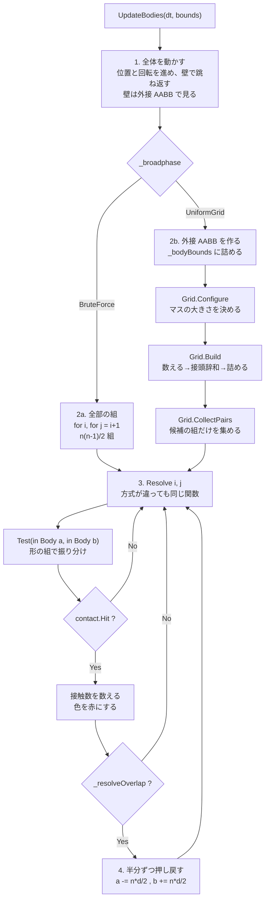

図で見てほしいのは**2つの経路が `Resolve` で合流している**ところ。
方式ごとにナローフェーズを書き分けると、
「答えが違う」となったときに原因がブロードフェーズなのか判定なのか分からなくなる。
合流させておけば、**違いが出たら必ず組の選び方が原因**と言い切れる。
`F12` の自己チェックが「接触数が一致」だけで意味を持つのはこの形のおかげ。

もうひとつ、**押し戻し(4段目)がグリッドの構築より後にある**ことに注意。
押し戻すと位置が動くので、ステップの頭で組んだ格子は少しずつ古くなる。
押し戻し量は 1 ステップぶんの重なりぶんしかないので実用上は問題にならないが、
厳密にやるなら「判定を全部済ませてから、まとめて押し戻す」形にする。
Phase 7 のインパルス解決がその形になる。

### 均一グリッドの中身 — 2つの関数しかない

`SpatialGrid` の公開メソッドは実質 `Build` と `CollectPairs` の2つだけ。
中で何が起きているかは、コードを読むより図のほうが早い。

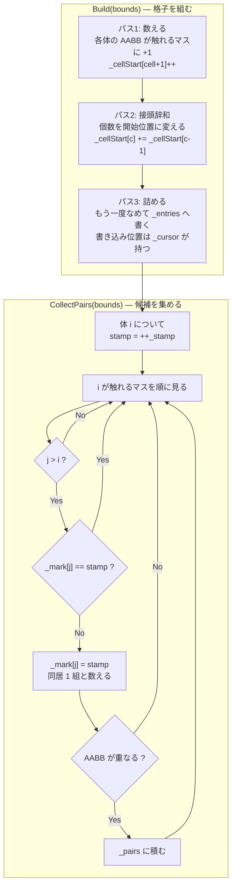

3つの絞りが直列に並んでいるのが分かる。

| 絞り | 落とすもの | 4000 体での実測(マス 32px) |
|---|---|---|
| 格子 | 別のマスにいる組 | 7,998,000 → 72,527 |
| `j > i` と印 | 同じ組の重複 | (上の数に含まれる) |
| AABB | 同じマスだが離れている組 | 72,527 → 24,733 |

**最後の AABB がまだ 3 分の 1 に減らしている**のが面白いところで、
「同じマスにいる」は「近い」でしかない。
7.4ns の AABB 判定を挟むことで、24〜120ns のナローフェーズを 5 万回節約している。

`j > i` の条件だけでは重複が消えないことは、実際に印を外すと確かめられる
(自己チェックの「重複した組が無い」が落ちる)。

`Test(in Body, in Body)` の中身は形の組み合わせ表そのもの。**3種類で6通り**になる。

| a \ b | Circle | Box | RotatedBox |
|---|---|---|---|
| **Circle** | `Test(Circle, Circle)` | `Test(Circle, Aabb)` | `Test(Circle, Obb)` |
| **Box** | 上を**符号反転** | `Test(Aabb, Aabb)` | OBB 同士へ寄せる |
| **RotatedBox** | 上を**符号反転** | OBB 同士へ寄せる | `Test(Obb, Obb)` SAT |

- **専用の速い経路**(AABB 同士、円同士)と**一般形**(OBB 同士の SAT)を併存させ、
  組み合わせの穴は一般形で埋める。`F9` の自己チェックで**両者の答えが一致すること**を確認している
- 引数の順が逆になる組(`Test(Box, Circle)`)は**法線の符号を反転**して返す。
  ここを間違えると物体がめり込む方向へ押される(要点6)
- 種類を1つ足すと表が1行1列増える。3D で球・箱・カプセル・平面・地形と並べると 15 通りになり、
  **その表を埋めることが物理エンジンを書くこと**になる(Phase 7)

## 完成条件

```
dotnet run --project reference/Day26 -c Release
```

**FPS を見るなら必ず `-c Release`**。Debug ビルドでは数字が意味を持たない。

### `F6` → `F10`: 同じ絵のまま速くなる

`F6` で衝突デモに入り、`G`(3D背景オフ)と `PageDown` 連打(スプライト 0)で見やすくする。
`Shift` + `PageUp` で 2000 体まで上げてから `F10` を押す。

```
総当たり  衝突:2000体 総当たり                候補:1,999,000/1,999,000 広域:0.00ms 判定:47.54ms
グリッド  衝突:2000体 格子31x21@32自動 最大23/マス 候補:12,560/1,999,000    広域:0.74ms 判定:1.46ms
```

**絵はまったく変わらないのに数字だけが変わる**のを確認する。
変わったら、それは絞り方のバグ(`F12` で捕まえられる)。

そのまま `Shift` + `PageUp` を押し続けて 20000 体まで上げる。

```
衝突:8000体  格子61x41@16自動 最大24/マス 候補: 50,080 広域:3.08ms 判定: 5.94ms
衝突:16000体 格子87x58@11自動 最大23/マス 候補:100,702 広域:6.54ms 判定:12.44ms
衝突:20000体 格子97x65@10自動 最大23/マス 候補:125,912 広域:8.38ms 判定:15.77ms
```

Day 25 では 2000 体が上限で、そこで既に 47ms かかっていた。
そして 20000 体でまた 60fps の予算に当たる——**壁は消えていない。10 倍先へ動いただけ**。
`最大/マス` が体数によらず 23〜24 で一定なのは、
面積を保つように小さくしているから(要点5)。マスの大きさも自動で 32 → 10px と付いてきている。

### `F11`: 格子を見る

マスが見えるようになり、混んでいるマスほど赤くなる。

- `,` を押してマスを小さくしていくと、**1個の体が何枚ものマスにまたがる**のが見える。
  タイトルバーの `格子` の数字が増え、`判定` も増える
- `.` を押して大きくしていくと、画面が数枚の巨大なマスになり、
  `最大/マス` が3桁になって `判定` が跳ね上がる
- 端まで行くと `自動` に戻る

**赤いマスが広がっていたらマスを小さくする合図**、
というのが数字を見ずに調整するときの目安になる。

### `-`: 密度を上げるとどうなるか

`-` で「大きさを固定」に切り替えてから体数を増やすと、
体が小さくならないので画面が詰まっていく。

```
面積一定  8000体  判定:6.00ms   候補:49,615
大きさ固定 8000体 判定:18.17ms  候補:217,661
```

**空間分割は「散らばっている」ことに賭けた最適化**(要点5)。
賭けが外れると効かなくなる、というのがここで見える。

### `F12`: 自己チェックと計測

20 項目すべて `OK` になり、続けて3つの表が出る(数秒かかる)。

```
[OK] 小さな例: 組は 3 つ  3 組: (0,1)(2,3)(4,5)
[OK] 小さな例: 世界の外でも拾う(4,5)
[OK] 小さな例: 同じマスでも離れていれば候補にしない(6,7)
[OK] 小さな例: 大物が複数マスに登録されている  登録 89 / 体 8
[OK] マス      4px: 総当たりと同じ組  3693 組(正解 3693 組)
[OK] マス   4000px: 総当たりと同じ組  3693 組(正解 3693 組)
[OK] 1ステップの接触数が一致  総当たり 757 / グリッド 757
[OK] ナローフェーズの回数は減っている  124,750 → 922(99.3% 削減)
  すべて合格
```

いちばん大事なのは **`マス 4000px` の行**。
世界全体が1マス、つまり全員が同居している状態でも答えが変わらない。
これが通るということは、**グリッドは総当たりの一般化になっている**。

## 改造課題

### 課題1(易): `List<int>[]` で書いて、測り比べる

`SpatialGrid.Build` の3パスを、素直な形に書き換える。

```csharp
private List<int>[] _cells = [];   // マスの数だけ List を持つ

// Build
foreach (var list in _cells) { list.Clear(); }
for (int i = 0; i < bounds.Length; i++)
{
    // 触れるマス全部に Add
}
```

`F12` の掃引で `広域` の欄がどう変わるかを見る。

考えどころは**どこで差が付くか**。`Clear` はマスの数だけ、`Add` は登録の数だけ走る。
マスを小さくすると `Clear` が効いてきて、大きくすると差が縮む
(4px と 256px で比べると分かりやすい)。

さらに、**GC が動くかどうか**も見てみるとよい。
`GC.CollectionCount(0)` をベンチの前後で取って表示すれば、
配列版が本当に割り当てゼロなのかが確かめられる。

### 課題2(中): 隣のマスまで見る版に変えて、なぜ遅いかを説明する

要点2で「中心のマスだけに入れて周囲 3×3 を見る作りは、物体がマスより小さいときにしか正しくない」
と書いた。実際にその版を書いてみる。

```csharp
// Build: 中心のマスにだけ入れる
// CollectPairs: 自分のマスと周囲 8 マスを見る
```

まず `F12` の自己チェックが**どこで落ちるか**を確認する
(「マスをまたぐ大物(2,3)」が落ちるはず)。
次に、マスの大きさを「いちばん大きい体より大きく」取れば正しくなることを確かめる。

そのうえで測ると、**正しい設定にしたときには元の版より遅い**ことが多い。
理由は要点4の表にある——大きい体に合わせてマスを取ると、
小さい体にとってはマスが大きすぎて1マスに入りすぎる。
**「大きさがばらばらだと均一グリッドは苦しい」**というのが結論で、
そこから階層グリッド(大きさごとに別のグリッドを持つ)の動機が出てくる。

### 課題3(難): Sweep and Prune を書いて、どちらが速いか測る

もう一つの定番のブロードフェーズを実装して、同じ土俵で比べる。

1. 全部の体の AABB を X 軸の `Min` で並べ替える
2. 前から順に見て、「自分の `Max` より `Min` が小さい」相手とだけ組にする
3. その組について Y 軸でも重なっているかを見る

```csharp
for (int i = 0; i < count; i++)
{
    for (int j = i + 1; j < count; j++)
    {
        if (sorted[j].Min.X > sorted[i].Max.X) { break; }   // ここで打ち切れる
        // Y の重なりを見て、通れば候補
    }
}
```

見どころは3つ。

- **並べ替えのコスト**。毎フレーム `Array.Sort` すると O(n log n) かかるが、
  1ステップで動く距離は小さいので**ほぼ整列済み**になる。
  挿入ソートに変えると O(n) 近くまで落ちる(これが SAP の本来の姿)
- **どんな配置で勝つか**。横に長い世界(横スクロール)では SAP が強く、
  正方形の画面に散らばる今日の配置ではグリッドが強い。**測って確かめる**
- **X 軸を選ぶ理由**。物が最も散らばっている軸を選ぶのが正解で、
  実際のエンジンは分散を計算して軸を決める

余裕があれば `F10` を3状態(総当たり / グリッド / SAP)にして、
`F12` の表に列を足すところまでやる。
**3つが同じ接触数を返すこと**を先に確かめるのを忘れないように(要点6)。

## 動作確認済み環境

- Windows 11 / .NET 10 / Silk.NET 2.23.0
- GL_RENDERER: NVIDIA GeForce RTX 3070/PCIe/SSE2
- 960x640、VSync オフ、`-c Release`、シミュレーション 60Hz

### 体数を振る(形は混在、押し戻しあり)

| 体数 | 総当たり | グリッド | うち広域 | 候補 | 接触 | 倍率 |
|---|---|---|---|---|---|---|
| 250 | 0.75ms | 0.09ms | 0.07ms | 289 | 240 | 8.2x |
| 500 | 3.00ms | 0.20ms | 0.15ms | 898 | 765 | 14.9x |
| 1,000 | 12.26ms | 0.44ms | 0.25ms | 3,093 | 2,369 | 27.8x |
| 2,000 | 47.54ms | 1.43ms | 0.71ms | 12,560 | 7,425 | 33.2x |
| 4,000 | 187.37ms | 2.91ms | 1.46ms | 24,880 | 14,641 | 64.4x |
| 8,000 | — | 6.00ms | 3.02ms | 49,615 | 29,264 | — |
| 16,000 | — | 12.46ms | 6.45ms | 100,548 | 59,099 | — |

総当たりは 4,000 体で 1 ステップ 0.19 秒。**測ること自体が苦痛になる**ので、
そこから上はグリッドだけにしてある。

### マスの大きさを振る(4,000 体)

| マス | 格子 | 登録 | 最大/マス | 同居 | 候補 | 広域 | 合計 |
|---|---|---|---|---|---|---|---|
| 4px | 240x160 | 181,422 | 14 | 29,676 | 24,781 | 4.20ms | 5.68ms |
| 8px | 120x80 | 58,971 | 13 | 34,396 | 24,800 | 2.11ms | 3.57ms |
| 16px | 60x40 | 23,189 | 17 | 46,042 | 24,868 | 1.52ms | 2.99ms |
| 32px | 30x20 | 11,358 | 29 | 72,527 | 24,733 | 1.52ms | 2.98ms |
| 64px | 15x10 | 7,022 | 59 | 143,247 | 24,798 | 1.92ms | 3.40ms |
| 128px | 8x5 | 5,336 | 160 | 353,107 | 24,670 | 3.37ms | 4.84ms |
| 256px | 4x3 | 4,614 | 525 | 957,840 | 24,869 | 7.01ms | 8.48ms |

自動で選ばれる値は 22.3px。

### 大きさを固定したまま増やす(密度が上がる)

| 体数 | グリッド | 候補 | 接触 | 候補/体 | 最大/マス |
|---|---|---|---|---|---|
| 2,000 | 1.45ms | 12,359 | 7,269 | 6.2 | 21 |
| 4,000 | 5.06ms | 51,321 | 23,487 | 12.8 | 41 |
| 8,000 | 18.17ms | 217,661 | 69,721 | 27.2 | 81 |

### デモを動かしたときの表示(グリッド、自動、形は混在)

| 体数 | 格子 | 最大/マス | 候補 | 広域 | 判定 |
|---|---|---|---|---|---|
| 2,000 | 31x21 @32px | 23 | 12,560 | 0.74ms | 1.46ms |
| 8,000 | 61x41 @16px | 24 | 50,080 | 3.08ms | 5.94ms |
| 16,000 | 87x58 @11px | 23 | 100,702 | 6.54ms | 12.44ms |
| 20,000 | 97x65 @10px | 23 | 125,912 | 8.38ms | 15.77ms |

**20,000 体で 15.77ms**。60fps の予算 16.6ms のほぼ全部を当たり判定が使う。
Day 25 の壁(1,000〜2,000 体)が 10 倍先へ移っただけで、壁そのものは残っている。
ここから先へ進むには、判定を並列化するか(Phase 7)、
そもそも判定しなくてよい相手を増やす(レイヤ分け、休眠状態)ことになる。

### 検証の途中で分かったこと

- **Day 25 の「段階的 JIT」の罠を、そのまま踏み直した**。
  最初のベンチは全構成を 20 ステップずつ測っていて、
  250 体と 500 体だけ組あたり 34ns(他は 24ns)と出た。
  温めを増やし、**軽い構成ほど回数を増やす**ように変えたら、
  全構成できっちり 24ns にそろった。
  ベンチマークの回数は「何回」ではなく**「合計でどれくらい時間を使うか」で決める**
- **`j > i` だけでは重複が消えない**。書いているときは
  「小さいほうから見るなら1回のはず」と思い込みやすいが、
  2つのマスを共有していれば、どちらのマスでも `j > i` は成り立つ。
  自己チェックの「重複した組が無い」が最初に落ちたのがここ
- **AABB の足切りが思ったより効く**。「同じマスにいる」で絞れば十分だろうと考えていたが、
  4,000 体・マス 32px で 72,527 組 → 24,733 組と、まだ3分の1に減る。
  安い判定を1枚挟むことの価値は、実際に数えるまで過小評価しがち
- **マスの大きさは、思ったより広い範囲で平らだった**。16px と 32px が同着で、
  8px と 64px も 15% 落ちるだけ。**外すと痛いのは「桁で外したとき」**なので、
  自動選択の目安が多少ずれていても問題にならない
