# Day 27: オーディオ再生

Phase 5(ゲームが作れる状態に)の3日目。**音が出るようになる**。

## 今日のゴール

`5` で効果音が鳴り、`0` で BGM がループする。
そして `F6` の衝突デモで `6` を押すと、体が壁に当たるたびに音が鳴る——
**画面の左で当たれば左から、小さい体ほど高い音で**。

体を 2000 まで増やすと、タイトルバーがこうなる。

```
音:32/32 要求:194 発音:4 間引き:189 奪取:4
```

**1ステップに 194 回鳴らそうとして、実際に鳴らしたのは 4 回**。
`7` で上限を外すと、その 194 回が全部鳴って**音が割れる**——
しかも1ステップが 2.48ms から 2.97ms に伸びる。
Day 26 で 2 万体を動かせるようにしたことが、そのまま音の設計問題になっている。

## 事前に読む資料

ロードマップでは資料の指定が無い日なので、実装に直結するものを挙げておく。

- [WAVE PCM soundfile format](http://soundfile.sapp.org/doc/WaveFormat/)(Stanford CCRMA)
  **1ページに全部載っている**。今日書く `WavFile.cs` はこの図をコードにしただけ。
  ただしこのページは「fmt の次に data が来る」前提で書かれているので、
  それだけでは足りない(要点1)
- [OpenAL Programmer's Guide](https://www.openal.org/documentation/OpenAL_Programmers_Guide.pdf)
  Device / Context / Buffer / Source の関係。2 章と 3 章だけでよい
- [OpenAL Soft](https://openal-soft.org/) の [ドキュメント](https://github.com/kcat/openal-soft/wiki)
  実際に使う実装のほう。**仕様に無い拡張**(EFX のリバーブなど)がここにある
- [Game Audio Programming: Principles and Practices](https://www.gameaudioprogramming.com/)
  ボイス管理・優先度・スティールといった「鳴らし方」の話。
  今日の要点4・5はこの分野の定番の知恵をなぞっている

## 理論の要点

### 1. WAV(RIFF)は「知らない箱を飛ばせる」形式

WAV の中身は、`名前(4バイト) + 長さ(4バイト) + 中身` という箱が並んでいるだけ。

```
"RIFF" | 全体の長さ | "WAVE"
  "fmt " | 16  | チャンネル数・サンプルレート・ビット深度…
  "LIST" | 26  | 制作ソフト名など。**知らないので飛ばす**
  "data" | ... | PCM 本体
```

素朴に書くと「`fmt ` を読んで、次の `data` を読む」になる。
サンプルの WAV ではこれで動くのに、
**編集ソフトで保存し直した瞬間に読めなくなる**——間に `LIST` や `fact` が挟まるため。

正しくは「知らない名前が来たら、長さのぶんだけ飛ばして次へ」。
**未知のものを安全に飛ばせることがチャンク形式の値打ちそのもの**で、
PNG も RIFF も glTF(Day 32)も同じ考え方で作られている。

引っかかりやすい細部が2つ。

- **チャンクは偶数バイト境界にそろう**。長さが奇数なら 1 バイトの詰め物が入る。
  忘れると、その次のチャンク名が 1 バイトずれて全部読めなくなる
- **8bit は符号なし、16bit は符号付き**。8bit は 0〜255 で中央が 128、
  16bit は -32768〜32767 で中央が 0。歴史的経緯だが、
  間違えると「8bit の音だけ盛大に歪む」

なぜ PNG(Day 16)は既製品に任せたのに WAV は自分で書くのか。
**難しさが2桁違う**から。PNG は zlib 展開とフィルタ復元が要るが、
非圧縮 PCM の WAV は**ヘッダを飛ばして残りをそのまま渡すだけ**で終わる。
実コード 83 行。この規模のものを外部依存にする理由は無い。

### 2. バッファとソースを分ける — Texture と Material と同じ形

OpenAL の登場人物は3つしかない。

| 名前 | 何か | 数 |
|---|---|---|
| **Device** | サウンドカード | 1つ開く |
| **Context** | 描画でいう GL コンテキスト | 1つ、カレントにして使う |
| **Buffer** | 音のデータ | 音の種類だけ |
| **Source** | 「今それを鳴らしている人」 | 同時発音数だけ |

肝は**バッファとソースが別**なこと。

```
AudioClip (バッファ) … 波形。1つだけメモリに載る
ボイス   (ソース)   … 再生位置・音量・ピッチ・定位を持つ。同時に何人でも
```

敵が 30 体同時に死んでも、爆発音の波形は1つしか載らない。
逆にこの分け方をしないと、**同じ音を重ねて鳴らせない**
(再生位置が1つしかないので、2発目が1発目を頭から巻き戻す)。

Day 15 の `Texture`(データ)と `Material`(使い方)がまったく同じ形で、
Day 21 の `ResourcePool` と `Handle` もこの分離の上に乗っている。
**新しいリソースの種類が来たら、まずこの線を引く**。

### 3. `alSourcePlay` だけが3桁高い

今日いちばん意外な数字。実測(RTX 3070 機、OpenAL Soft 1.23.1):

| 呼び出し | 1回あたり |
|---|---|
| `alGetError` | 39ns |
| `SetSourceProperty(Gain)` | 87ns |
| `SetSourceProperty(Pitch)` | 92ns |
| `SetSourceProperty(Position)` | 96ns |
| `GetSourceProperty(State)` | 62ns |
| `SetSourceProperty(Buffer)` | 346ns |
| `alSourceStop` | 66ns |
| **`alSourcePlay`** | **7,347ns** |

他は全部 100ns 前後なのに、**再生開始だけ 7.3μs**。
理由は、これが**ミキサースレッドとの同期**を伴うから。
OpenAL Soft は別スレッドで音を混ぜ続けていて、
`alSourcePlay` はそのスレッドに新しいボイスを引き渡し、
受け取ったことを確認するまで戻らない。

**この 7.3μs は「連打したときの数字」で、実際にはもっと安いことも多い**。
デモで測り直すと(2000 体、上限を外して 1ステップに 193 発):

| 体数 | 要求/step | 上限4のとき | 上限なしのとき | 差 | 1発あたり |
|---|---|---|---|---|---|
| 500 | 24.4 | 0.50ms | 0.49ms | 0.00ms | — |
| 2,000 | 194.3 | 2.48ms | 2.97ms | +0.49ms | 2.6μs |
| 8,000 | 364.2 | 6.07ms | 8.39ms | +2.32ms | 6.5μs |

**鳴らす回数が多いほど、1発あたりも高くなっている**。
ミキサーが追いつかなくなるほど待ちが増えるので、
同期待ちのある呼び出しでは普通に起きる。
「1回いくら」が固定だと思って掛け算すると外す。

どちらの数字を取っても、Day 25・26 と並べれば桁は動かない。

```
当たり判定 1 回        24ns
音を 1 発鳴らす   2,600〜7,300ns   ← 100〜300 倍
```

**1ステップに 300 発鳴らせば 1〜2ms** 持っていかれる。
「音くらい何回鳴らしてもいいだろう」が通らないことが、これで決まる。

だから今日の設計は**発音の回数を絞ることが中心**になる(要点5)。

### 4. ボイスは有限。足りなければ「奪う」

同時に作れるソースの数には上限がある(実装依存。OpenAL Soft の既定は 256)。
そのうえ要点3のとおり生成も再生開始も安くないので、
**起動時に固定数だけ作って使い回す**のが定石になる。ここでは 32 本。

空きが無いときにどうするかが設計の分かれ目で、選択肢は2つ。

- **鳴らさない**(新しい音を捨てる)
- **奪う**(鳴っている音を止めて枠を取る)

どちらも正解になりうるが、**新しい音のほうが情報量が多い**ことが多い
(たった今起きたことだから)ので、奪うほうを既定にする。
奪う相手の選び方が、そのまま手触りになる。

1. **ループしているものは奪わない** — BGM が効果音に消されては困る
2. **優先度がいちばん低いもの** — プレイヤーの被弾音は雑魚の足音より偉い
3. **同じ優先度なら、いちばん古くから鳴っているもの** — 古い音ほど「もう聞こえた」

実務ではもう1つ「今どれくらい小さく鳴っているか」を見ることが多い。
遠くの小さな音を先に消したほうが、消えたことに気づかれにくい。

そして**枠を使い回すなら世代が要る**。

```csharp
internal readonly struct VoiceId
{
    private readonly int _index;
    private readonly int _generation;
}
```

添字だけを配ると、自分の音が終わって枠が別の音に取られたあと、
`Stop()` が**その別人を止めてしまう**。
Day 21 で `Handle<T>` に世代を持たせたのとまったく同じ問題なので、同じ手で解く。

なお、**効果音の 9 割は札を受け取る必要がない**。
札が要るのは、あとから止めたり位置を追わせたりするもの——
BGM、ループするエンジン音、詠唱中の音——だけになる。

### 5. 同じ音が同時に大量に鳴ると、音として壊れる

Day 26 で 2 万体を動かせるようにした結果、
「壁に当たったら鳴らす」と素直に書くと**1ステップに 100 回以上**要求が飛ぶ。
実測で 2000 体なら 194 回、8000 体なら 364 回。

問題は3つあって、どれも別の話。

**(a) 単純に重い**(要点3)。2000 体で +0.49ms、8000 体で +2.32ms。

**(b) 音圧が線形に足される**。同じ波形が同じ瞬間に始まると位相までそろうので、
N 個重ねると振幅が N 倍になる。10 個で 10 倍、つまり +20dB。
**まず間違いなく割れる**。ばらばらの音なら √N 程度で済むのとは話が違う。

**(c) 情報として区別できない**。10 個同時に鳴っても、
人間には「1個大きく鳴った」としか聞こえない。**払ったコストが無駄になる**。

対策は素直に2つ。

- **1ステップに同じクリップを鳴らす回数に上限を置く**(ここでは 4)。
  4 から上は増やしても区別が付かない
- **ピッチをわずかに揺らす**(±6%)。位相がずれるので(b)が緩み、
  「同じ音の繰り返し」の機械的な感じも消える

後者は**同じ WAV を別の音に聞こえさせる**手でもあって、
今日は体の大きさでピッチを変えている(小さい体ほど高い)。
実際のゲームでも、足音1つに 4〜6 個の波形を用意してランダムに選び、
さらにピッチと音量を振る、という作りが定番になっている。
**音の種類を増やすより、1つを変化させるほうが安上がりで効果が高い**。

### 6. 定位はモノラルにしか効かない

OpenAL は**ステレオのバッファに 3D 定位を適用しない**。
左右がすでに決まっているものを勝手に動かせないので当然といえば当然だが、
「位置を設定したのに真ん中から聞こえる」という形で出るので原因が分かりにくい。

結論は単純で、**効果音はモノラルで作る**。
ステレオにするのは BGM と環境音だけ。

2D の定位は、リスナーを原点に置いて**ソースを円周上に並べる**。

```csharp
float x = pan;                                  // -1(左)〜 +1(右)
float z = -MathF.Sqrt(1.0f - (x * x));          // 距離が 1 になるように
al.SetSourceProperty(source, SourceVector3.Position, x, 0.0f, z);
```

単に x を動かすと、端へ行くほどリスナーから遠ざかって小さくなる。
円周に載せれば**距離減衰の影響を受けずに定位だけが変わる**。

あわせて `SourceRelative = true` を立てて、
**リスナーから見た相対位置**として扱う。見下ろし型の 2D では、
ワールド座標をそのまま渡すよりこのほうが素直
(カメラが動いても音の左右が勝手に変わらない)。

### 7. 音が出ない環境で落ちてはいけない

音が出ない状況はいくらでもある。リモートデスクトップ、
サウンドを持たないマシン、ドライバが死んでいるとき、
そもそもネイティブライブラリが見つからないとき。

**そこで例外を投げるゲームは論外**なので、
`AudioSystem` は初期化に失敗したら `IsAvailable` を `false` にして、
以降の呼び出しが**黙って何もしない**ようにしてある。
呼び出し側に `if (audio is not null)` を書かせない、という方針。

```csharp
public VoiceId Play(...)
{
    if (!IsAvailable || _al is null)
    {
        return VoiceId.None;
    }
    ...
}
```

同じ考え方は「鳴らせなかったとき」にも及ぶ。
ボイスが足りない・間引かれたときも `VoiceId.None` を返すだけで、例外は投げない。
**音が多すぎたときだけ落ちる**という、再現しにくいバグを自分で仕込まないため。

なお `AudioSystem` は `ResourceManager`(Day 21)に相乗りしていない。
`ResourceManager` は `GL` を握っているので、そこへ OpenAL を足すと
**`Core` がグラフィックスと音の両方を知る**ことになり、
Day 25 の設計書で記録した `Core` ⇔ `Render` の相互参照をもう一段悪くする。
代わりに `ResourcePool<T>`(何も知らない総称型)だけを借りて、
音のリソースは `AudioSystem` が自分で持つ形にした。

## 前Dayからの差分概要

### 新規ファイル

| ファイル | 行数(うち実コード) | 役割 |
|---|---|---|
| `Audio/WavFile.cs` | 168 (83) | `WavData` と RIFF パーサ |
| `Audio/AudioClip.cs` | 98 (47) | OpenAL のバッファ1つ |
| `Audio/AudioSystem.cs` | 576 (345) | `VoiceId`、デバイス、ボイスプール、間引き |

`Audio/` は `Core/`(`Handle` / `ResourcePool`)だけに依存する。
`Render/` も `Physics/` も知らない。

### 新しい素材

`assets/audio/` に5つ。**わざとフォーマットをばらしてある**——
パーサが全部の経路を通ることを確かめるため。

| ファイル | 形式 | 長さ | 用途 |
|---|---|---|---|
| `bounce.wav` | 44100Hz 1ch 16bit | 0.08s | 壁に当たった音 |
| `hit.wav` | 44100Hz 1ch 16bit | 0.18s | 体が当たった音(計測にも使う) |
| `pickup.wav` | 22050Hz 1ch **8bit** | 0.22s | 拾った音。8bit の経路 |
| `stereo-ping.wav` | 44100Hz **2ch** 16bit | 0.60s | 定位が効かないことの実演 |
| `music-loop.wav` | 22050Hz 1ch 16bit | 4.00s | BGM。継ぎ目が分からないようにループ |

**全部その場で合成したもの**で、外部から持ってきていない
(卒業制作では [Kenney](https://kenney.nl/) の CC0 素材を使う)。
波形は素朴で、

- `bounce` … 760Hz から少し下がる正弦波 + 指数の減衰
- `hit` … ホワイトノイズを一次ローパスで鈍らせたもの + 120Hz の正弦
- `pickup` … 矩形波の3音アルペジオ(C5 E5 B5)
- `music-loop` … のこぎり波のベース + 矩形波のアルペジオ、120BPM で 2 小節

だけでできている。**先頭に数ミリ秒の立ち上がりを付ける**のがコツで、
これが無いと波形が 0 から不連続に飛んで「プチッ」と鳴る。
ループの継ぎ目も同じ理由で、末尾を数ミリ秒フェードしてある。

### 変更ファイル

| ファイル | 差分 | 内容 |
|---|---|---|
| `Program.cs` | +480 / -1 | 音の初期化と後始末、壁に当たったときの発音、キー、自己チェックと計測 |
| `Day27.csproj` | +2 パッケージ | `Silk.NET.OpenAL` と `Silk.NET.OpenAL.Soft.Native` |

`Silk.NET.OpenAL.Soft.Native` は **OpenAL Soft の本体(`soft_oal.dll`)**。
OpenAL は仕様であって実装ではないので、どれかの実装が別途要る。
昔は Creative のドライバが Windows に入っていたが、今は同梱するのが普通。

### キーの追加

| キー | 動作 |
|---|---|
| `5` | 効果音を1発鳴らす |
| `6` | 壁に当たったときの音 ON/OFF |
| `7` | 同じ音の1ステップあたり上限(0 → 1 → 2 → 4 → 8 → 0) |
| `8` | ピッチの揺らぎ ON/OFF |
| `9` | 左右の定位 ON/OFF |
| `0` | BGM の再生 / 停止 |
| `[` / `]` | 全体の音量 |
| `F1` | オーディオの自己チェックと計測 |

### 写経する順番

依存の順に並べる。上から順に写せば、途中でビルドが通らなくなることはない。

1. **`Day27.csproj`** — パッケージを2つ足す。**最初にやる**(以降が全部これに依存する)
2. **`Audio/WavFile.cs`** — `WavData` → `WavFile.Parse`。
   チャンクを飛ばすループと、奇数長の詰め物が要点
3. **`Audio/AudioClip.cs`** — `WavData` を OpenAL のバッファへ。短い
4. **`Audio/AudioSystem.cs`** — 今日の本体。上から順に。
   `VoiceId` → コンストラクタ(デバイス/コンテキスト/ソースの用意)→
   `Load` → `Update` → `Play` → `AcquireVoice`(**奪う**)→ 後始末
5. **`Program.cs`** — 依存の順に。
   1. フィールド(`_audio` / クリップ5本 / `_musicVoice` / `_collisionSfx` / `_panning` / `_soundRequests`)
   2. `OnLoad` — `AudioSystem` の生成とクリップの読み込み、一覧の表示
   3. `FixedUpdate` の頭 — `_audio.Update()`
   4. `UpdateBodies` の移動ループ — `bounced` を立てて `PlayBounce` を呼ぶ
   5. `PlayBounce` — 定位・ピッチ・音量の割り当て
   6. `OnKeyDown` / タイトルバー / 起動時のヘルプ / `OnClosing`
   7. `RunAudioCheck` → `BenchmarkAudio`

## 設計書

**層が1つ増えた**。Day 25 で 5 つ(`Core` / `Scene` / `Ecs` / `Render` / `Physics`)、
Day 26 でそのまま、今日 `Audio/` が加わって 6 つになる。

Day 26 の設計書を丸ごと引き継ぎ、差分の当たった図にだけ手を入れてある。
変わった図は次の4つ。

| 図 | 何が変わったか |
|---|---|
| 全体構成 | `Audio/` を追加。**Day 25 で記録した歪みを繰り返さない**選択をした |
| `Audio`(新規) | `WavFile` / `AudioClip` / `AudioSystem` / `VoiceId` |
| `FixedUpdate の中身` | 先頭に `_audio.Update()` が入った |
| `衝突判定の3段` | 壁に当たったところで発音の要求が出るようになった |

写経の前に読み込む必要はない。**途中で「これは誰が呼ぶんだったか」と迷ったときに戻ってくる場所**として使う。

### 全体構成 — 6つの層と依存の向き

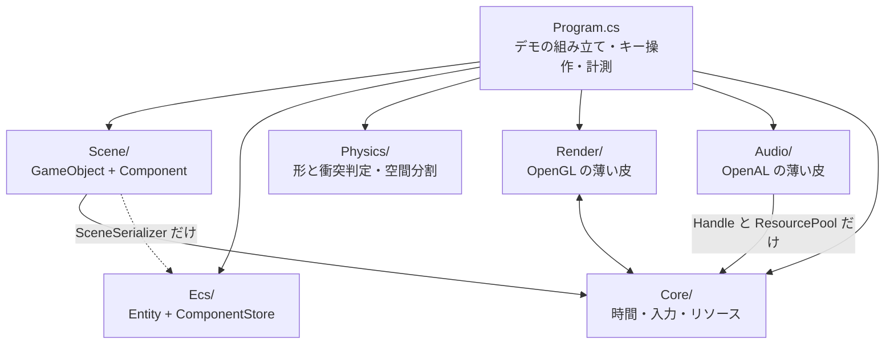

| 層 | 依存先 | 備考 |
|---|---|---|
| `Physics/` | **なし** | `System.Numerics` だけ。そのまま別プロジェクトへ持ち出せる |
| `Ecs/` | **なし** | 同上。Day 23 で「他に依存しないので先に5つ書ける」と書いたとおり |
| `Scene/` | `Core`(`InputSnapshot`)、`Ecs`(`SceneSerializer` のみ) | **描画を一切知らない**。`SpriteRenderer` は絵の種類と大きさを持つデータでしかない |
| `Render/` | `Core`(`Handle` / `ResourceManager`) | `Material` がハンドルを解くために管理側を呼ぶ |
| **`Audio/`** | `Core`(`Handle` / `ResourcePool` **のみ**) | **一方通行**。`Core` は `Audio` を知らない |
| `Core/` | `Render`(`Texture` / `Shader`) | `ResourceManager` が両者の実体を握っている |
| `Program.cs` | 全部 | 組み立て役。4176行あるが、その大半はデモ・計測・自己チェック |

**`Core` と `Render` が相互参照になっている**のは、この図を描いて初めて見えたことで、
きれいな形ではない。`ResourceManager`(Core)が `Texture`(Render)を作り、
`Material`(Render)が `ResourceManager`(Core)を呼ぶ、という往復になっている。

名前空間が `HonyaEngine` 1つなので今は問題なく動くが、**アセンブリを分けようとした瞬間に破綻する**。
直すなら「`ResourcePool` と `Handle` だけを下層に置き、`ResourceManager` は Render 側に上げる」
のが素直で、Phase 6 でアセットの種類が増えたときに検討する。

**Day 27 の判断**: 音を足すとき、この歪みを繰り返さないようにした。

音のリソースも「パスをキーにして使い回し、ハンドルで配る」という点でテクスチャと同じなので、
`ResourceManager` に `LoadAudio` を足すのが自然に見える。
だがそうすると `ResourceManager`(= `Core`)が **GL と OpenAL の両方を握る**ことになり、
上の相互参照が「`Core` ⇔ `Render` + `Core` ⇔ `Audio`」に増える。

そこで `AudioSystem` は、`Core` から**総称型の `ResourcePool<T>` と `Handle<T>` だけを借りて**、
音のリソースは自分で持つ形にした。`ResourcePool<T>` は `T` が何かを知らないので、
借りても依存が増えない。結果、`Audio/` → `Core/` の**一方通行**が保たれている。

図に描いておくと、こういう判断が「なんとなく」ではなくできるようになる。
**設計書は、次に何かを足すときのために書いている**。

### Core — 時間・入力・リソース

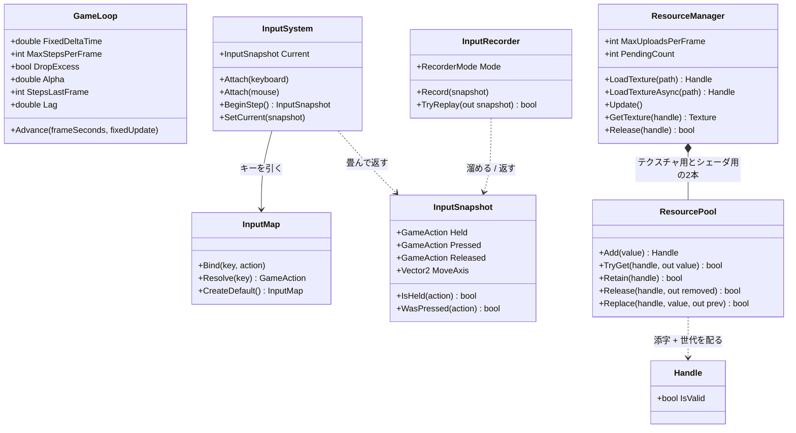

`ResourcePool` と `Handle` は総称型(`ResourcePool<T>` / `Handle<T>`)。
`T` が何かを知らないまま添字と世代だけを管理するので、`Texture` にも `Shader` にも同じものが使える。

この層で押さえるべき責務の線引き:

- **`GameLoop` は時間しか知らない**。何を更新するかは `Action<float>` で渡される
- **`InputSystem` はデバイスのイベントを畳むだけ**。ゲームとしての意味づけは `InputMap` が持つ
- **`InputSnapshot` は値**。だから記録・再生で丸ごと差し替えられる(Day 20 の肝)

### Render — OpenGL の薄い皮

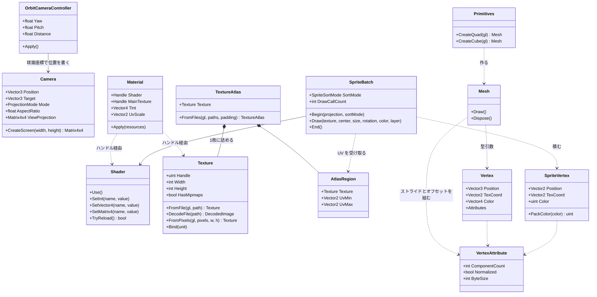

**`Material` が何も所有していない**のは Day 15 から一貫している(Day15.md の要点2)。
持っているのはハンドルだけで、実体の寿命は `ResourceManager` にある。

**3D の道(`Mesh` + `Material`)と 2D の道(`SpriteBatch`)が並列**なのも見てのとおりで、
両者は `Shader` と `Texture` を共有しているだけで互いを知らない。
`Mesh` は「形が決まっていて毎フレーム変わらないもの」、
`SpriteBatch` は「毎フレーム頂点を作り直すもの」という使い分けになっている。

### Scene — GameObject + Component

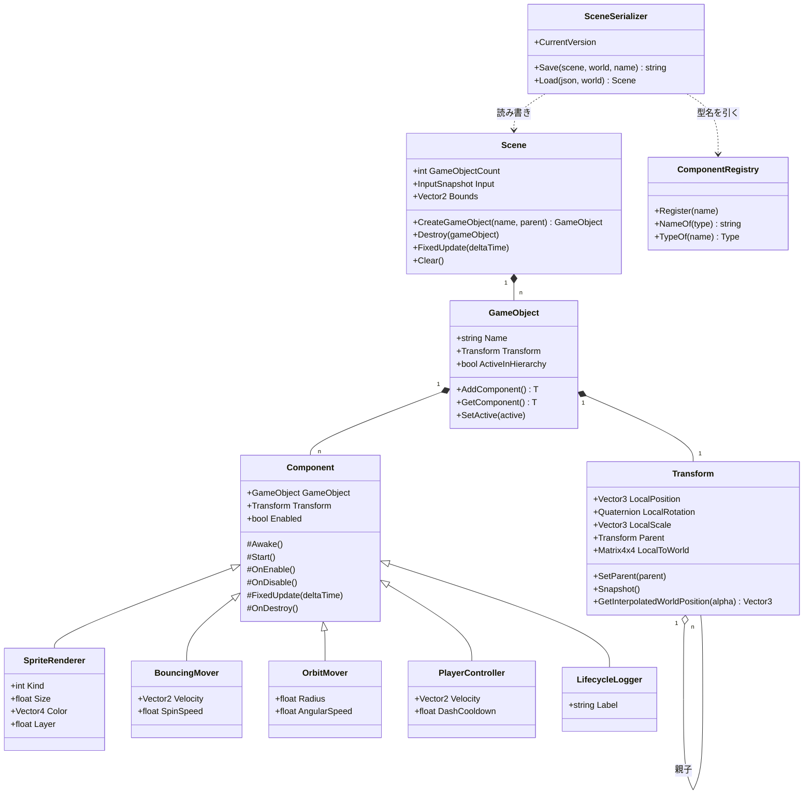

`Transform` だけが `GameObject` の固定メンバーで、ほかは全部 `Component` として付け外しする
(Day 22 の要点2)。`SceneSerializer` が `ComponentRegistry` を経由するのは、
**JSON の文字列から直接 `Type` を作らせない**ため(Day 24 の要点2)。

### Ecs と Physics — どこにも依存しない2つ(今日 `Physics` が増えた)

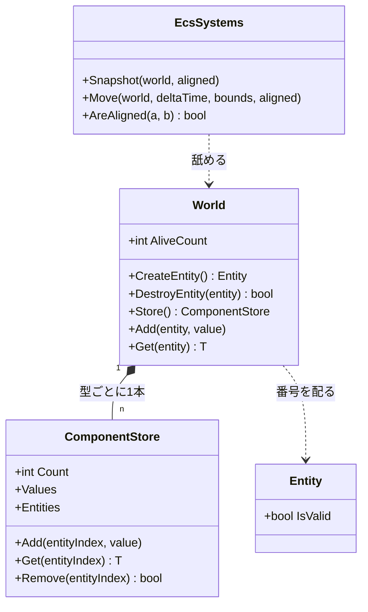

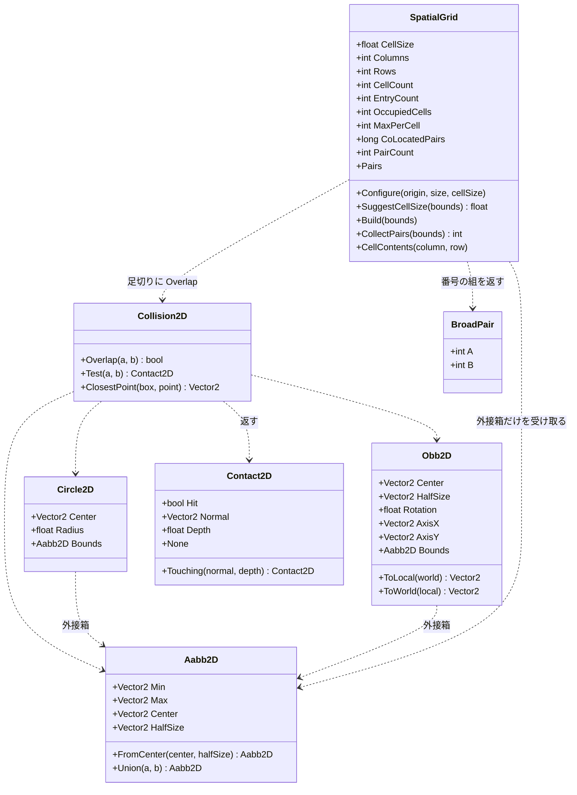

**形は全部 `readonly struct`、判定は `static` メソッドだけ**。状態を持たないので、
どのスレッドから何回呼んでも同じ答えが返る。Day 26 で空間分割を入れたとき、
この性質のおかげで**判定そのものには一切手を入れずに済んだ**——
`Collision2D.cs` と `Shapes2D.cs` の差分は 0 行になっている。

`SpatialGrid` だけが唯一 `class`(参照型)で、しかも状態を持つ。
配列を4本(`_cellStart` / `_cursor` / `_entries` / `_mark`)使い回すためで、
**毎フレーム作り直しても割り当てが起きない**ようにするにはこうするしかない。
そのぶん「1つのインスタンスを複数スレッドから同時に使えない」という制約が付く。
状態を持つと何が失われるかが、同じフォルダの中で見比べられる形になっている。

矢印の向きにも注目してほしい。**`SpatialGrid` から `Body` への線が無い**。
受け取るのは `ReadOnlySpan<Aabb2D>`、返すのは番号の組だけで、
速度も形も質量も知らない。この細さのおかげで、
Day 46 の 3D 版は `Aabb2D` を `Aabb3D` に変えるだけで済む。

### Audio — OpenAL の薄い皮

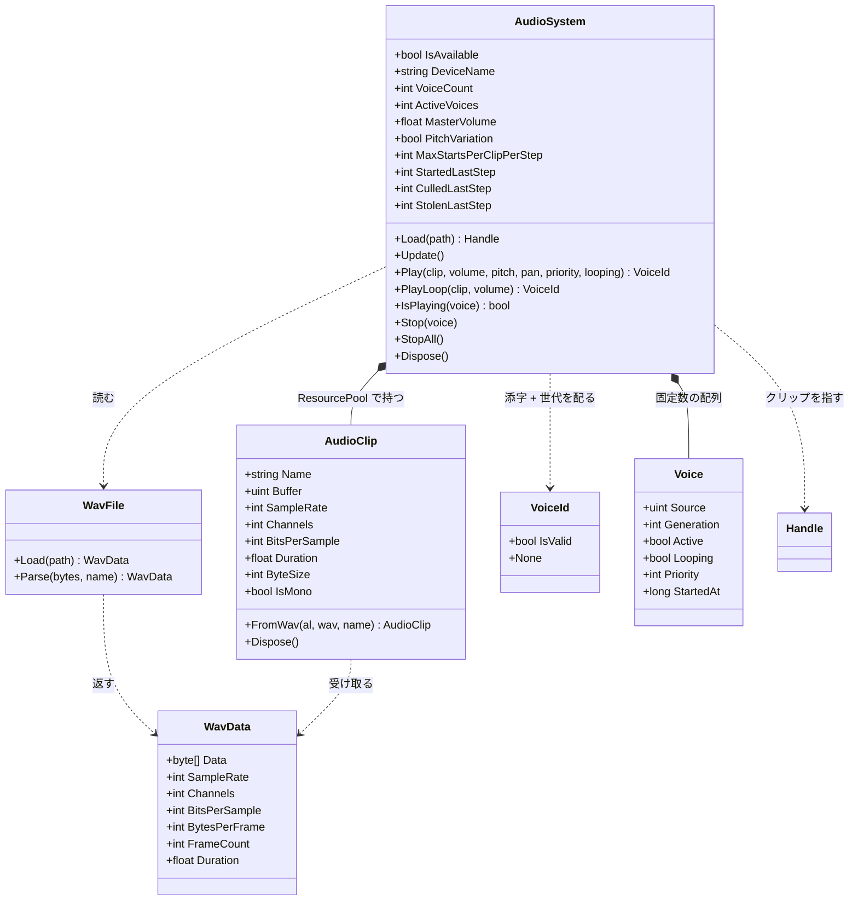

`Voice` は `AudioSystem` の中の `private struct`。外からは `VoiceId` 越しにしか触れない。

この層で押さえるべき線引きは3つ。

- **`WavFile` は OpenAL を知らない**。ただのバイト列パーサなので、
  ファイルが無くてもメモリ上のバイト列で試せる(自己チェックがそうしている)
- **`AudioClip` はデータ、`Voice` は再生**(要点2)。
  `Texture` と `Material`、`Mesh` と描画呼び出しと同じ分け方
- **`VoiceId` は `Handle<T>` と同じ構造**(添字 + 世代)だが**別の型**。
  `Handle<T>` は `ResourcePool<T>` のためのもので、ボイスはプールではないので流用しない。
  同じ手口を別の場所で使い直している、と読むのが正しい

### 1フレームの流れ

Silk.NET のウィンドウから `OnUpdate` と `OnRender` が交互に呼ばれる。
**状態を変えるのは `OnUpdate` 側だけ**、というのが Day 19 で引いた線。

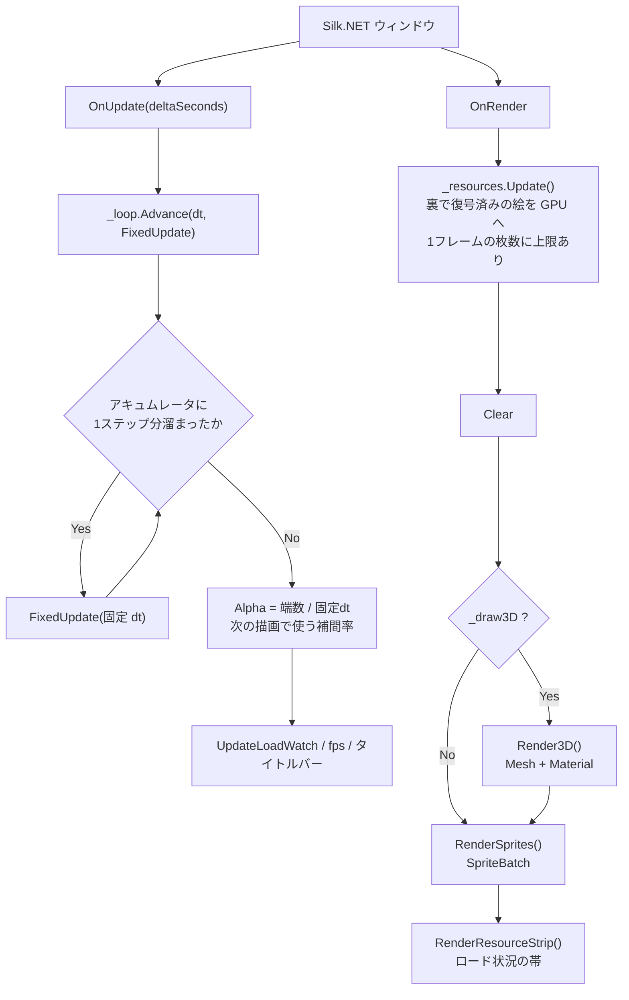

`OnRender` の先頭で `_resources.Update()` を呼ぶのが要点で、
**GL は描画スレッドからしか触れない**ため、裏で復号し終えた画素をここで GPU に上げている
(Day 21 の要点5・6)。

### FixedUpdate の中身 — 入力の出どころと3つのバックエンド

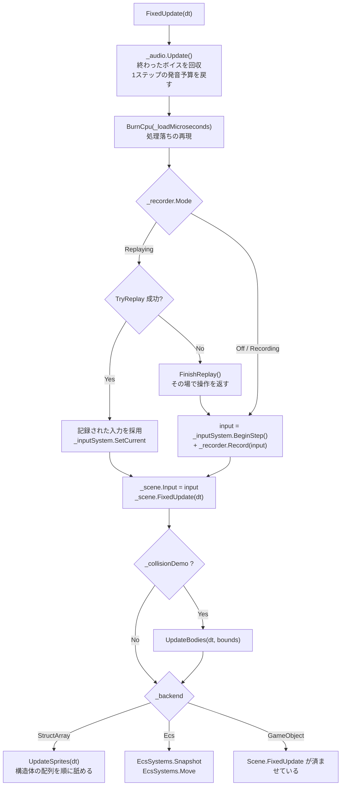

**音の後始末を先頭に置いた**のは、音を要求するのがこの下だから。
予算を戻す場所と使う場所を近くに置くと、「いつリセットされるのか」を追う必要がなくなる。
描画側(`OnRender`)に置くと、シミュレーションが 5Hz のときに
「1フレームに複数ステップぶんの音が要求されるのに予算は 1 回ぶん」というずれが起きる。

**入力がどこから来たかを、この関数から下は誰も気にしない**のがポイント(Day 20 の要点1)。
`InputSnapshot` という値に畳んであるので、記録の再生と実操作を1行で差し替えられる。

`Scene.FixedUpdate` を `_backend` の分岐より前で必ず呼んでいるのは、
**プレイヤーと階層の実演がどのモードでも Scene 側にいる**ため。

### Scene.FixedUpdate の4段階

順番に意味がある。入れ替えると壊れる。

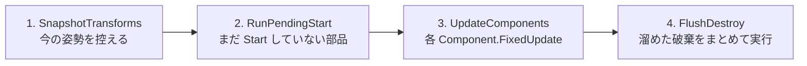

| 段 | なぜその位置か |
|---|---|
| 1 | **動かす前**に控えないと、補間の始点が終点と同じになって補間が効かない |
| 2 | `Start` の中で新しいオブジェクトが生まれるので、**開始時点の件数だけ**回す |
| 3 | ここも開始時点の件数で止める。このステップで生まれたものは次のステップから |
| 4 | 更新中にリストから消すと**走査中のインデックスがずれる**(Day 22 の要点5)。<br/>まとめて `RemoveAll` するのは、1個ずつ消すと O(n^2) になるため |

### 非同期テクスチャロードの流れ

`Q` キーで走る道。**GL を呼ぶ部分と呼ばない部分の境目**が、
そのままスレッドの境目になっている(Day 21 の要点5)。

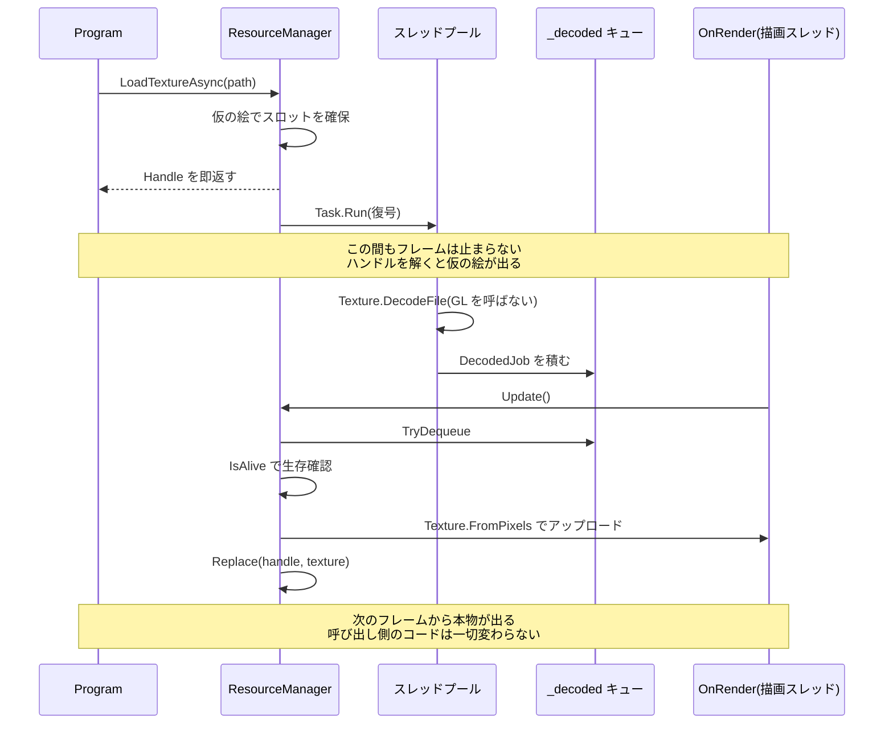

`Update()` が `MaxUploadsPerFrame` で枚数を絞っているのが肝で、
**復号を非同期にしても、アップロードをまとめてやるとそこでカクつく**(Day 21 の要点6)。

### 衝突判定の3段 — ブロードフェーズが割り込んだ

Day 25 の `UpdateBodies` は「動かす → 総当たり → 押し戻す」の3段だった。
今日、真ん中が**「組を絞る」と「絞った組を判定する」に割れる**。

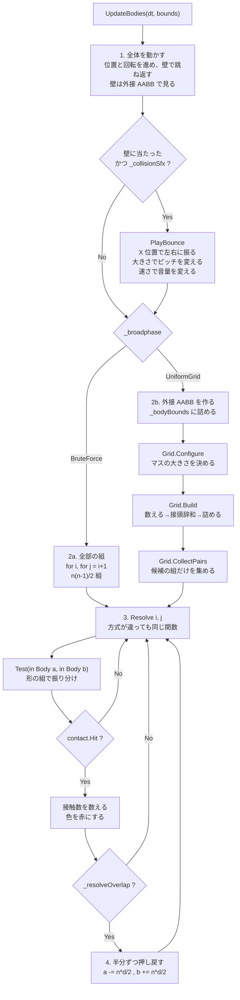

発音の要求が**移動の段にある**ことに注意。
「壁に当たった」はブロードフェーズの外で分かることなので、
組の絞り込みとは無関係にここで出る。
体どうしの接触音を鳴らすなら `Resolve` の中になるが、
2000 体で 7,425 組が接触しているので**要求だけで 7,425 回**になる。
要点3の 7.3μs を掛けると 54ms。今日は壁だけにしてある。

図で見てほしいのは**2つの経路が `Resolve` で合流している**ところ。
方式ごとにナローフェーズを書き分けると、
「答えが違う」となったときに原因がブロードフェーズなのか判定なのか分からなくなる。
合流させておけば、**違いが出たら必ず組の選び方が原因**と言い切れる。
`F12` の自己チェックが「接触数が一致」だけで意味を持つのはこの形のおかげ。

もうひとつ、**押し戻し(4段目)がグリッドの構築より後にある**ことに注意。
押し戻すと位置が動くので、ステップの頭で組んだ格子は少しずつ古くなる。
押し戻し量は 1 ステップぶんの重なりぶんしかないので実用上は問題にならないが、
厳密にやるなら「判定を全部済ませてから、まとめて押し戻す」形にする。
Phase 7 のインパルス解決がその形になる。

### 均一グリッドの中身 — 2つの関数しかない

`SpatialGrid` の公開メソッドは実質 `Build` と `CollectPairs` の2つだけ。
中で何が起きているかは、コードを読むより図のほうが早い。

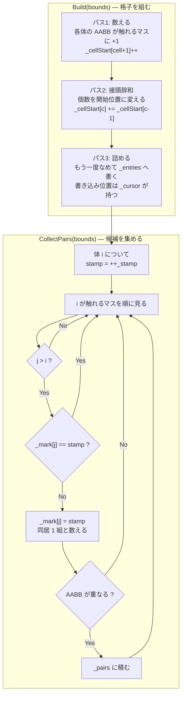

3つの絞りが直列に並んでいるのが分かる。

| 絞り | 落とすもの | 4000 体での実測(マス 32px) |
|---|---|---|
| 格子 | 別のマスにいる組 | 7,998,000 → 72,527 |
| `j > i` と印 | 同じ組の重複 | (上の数に含まれる) |
| AABB | 同じマスだが離れている組 | 72,527 → 24,733 |

**最後の AABB がまだ 3 分の 1 に減らしている**のが面白いところで、
「同じマスにいる」は「近い」でしかない。
7.4ns の AABB 判定を挟むことで、24〜120ns のナローフェーズを 5 万回節約している。

`j > i` の条件だけでは重複が消えないことは、実際に印を外すと確かめられる
(自己チェックの「重複した組が無い」が落ちる)。

`Test(in Body, in Body)` の中身は形の組み合わせ表そのもの。**3種類で6通り**になる。

| a \ b | Circle | Box | RotatedBox |
|---|---|---|---|
| **Circle** | `Test(Circle, Circle)` | `Test(Circle, Aabb)` | `Test(Circle, Obb)` |
| **Box** | 上を**符号反転** | `Test(Aabb, Aabb)` | OBB 同士へ寄せる |
| **RotatedBox** | 上を**符号反転** | OBB 同士へ寄せる | `Test(Obb, Obb)` SAT |

- **専用の速い経路**(AABB 同士、円同士)と**一般形**(OBB 同士の SAT)を併存させ、
  組み合わせの穴は一般形で埋める。`F9` の自己チェックで**両者の答えが一致すること**を確認している
- 引数の順が逆になる組(`Test(Box, Circle)`)は**法線の符号を反転**して返す。
  ここを間違えると物体がめり込む方向へ押される(要点6)
- 種類を1つ足すと表が1行1列増える。3D で球・箱・カプセル・平面・地形と並べると 15 通りになり、
  **その表を埋めることが物理エンジンを書くこと**になる(Phase 7)

### 音を1発鳴らすまで — 3つの関門

`Play` を呼んでから実際に音が出るまでに、3回ふるいにかけられる。
**呼んだのに鳴らないことは普通に起きる**ので、どこで落ちたかを数えられるようにしてある。

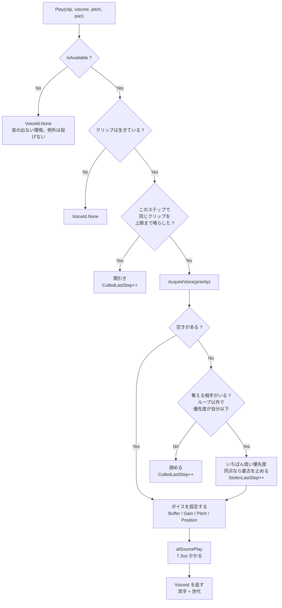

**「諦める」が2箇所ある**のが要点。
間引き(`C`)は「同じ音が多すぎる」で落とし、
`F` は「ボイスが足りず、しかも自分より偉い音しか鳴っていない」で落とす。
前者は音として意味が無いから落とすので**積極的**、
後者は資源が足りないから落とすので**消極的**。
タイトルバーで両方を分けて数えているのは、この2つが違う対処を要求するため
(前者は上限を調整する、後者はボイスを増やす)。
## 完成条件

```
dotnet run --project reference/Day27 -c Release
```

起動時に、読み込んだクリップの一覧がコンソールに出る。
**フォーマットがばらばらであることを確認する**——ここが全部同じだと、
パーサの分岐が試されていない。

```
オーディオ: OpenAL Soft / 1.1 ALSOFT 1.23.1 / ボイス 32
  bounce       44100Hz 1ch 16bit  0.08s   7,056B
  hit          44100Hz 1ch 16bit  0.18s  15,876B
  pickup       22050Hz 1ch  8bit  0.22s   4,959B
  stereo-ping  44100Hz 2ch 16bit  0.60s 105,840B
  music-loop   22050Hz 1ch 16bit  4.00s 176,400B
```

音が出ない環境なら「使えるデバイスがありません(音なしで続行します)」と出て、
**そのまま普通に遊べる**(要点7)。

### `5` と `0`: まず鳴らす

`5` で効果音が1発、`0` で BGM がループする。
`[` `]` で音量を変えられる。

BGM は 4 秒で一周する。**継ぎ目が分かるかどうか**を聞いてみてほしい。
末尾を数ミリ秒フェードしてあるので、プチッとは鳴らないはず。

### `F6` → `6`: 壁に当たる音

衝突デモを出して `6` を押す。`G` と `PageDown` で見やすくしておくとよい。

体が壁で跳ね返るたびに音が鳴る。**画面の左で跳ねれば左から鳴る**(`9` で切れる)。
**小さい体ほど高い音**になっているので、大きさが耳で分かる。

`Shift` + `PageUp` で 2000 体まで増やすと、タイトルバーがこうなる。

```
音:32/32 要求:194 発音:4 間引き:189 奪取:4
```

**194 回要求して 4 回しか鳴っていない**。それでも音は成立している——
というより、4 回に絞っているからこそ成立している。

### `7`: 間引きを外す

上限を 8 → 0(無制限)まで開けていく。

| 上限 | 聞こえ方 |
|---|---|
| 1 | 数が減ったのが分かる。まばら |
| 4(既定) | 「たくさん当たっている」感じが出る |
| 8 | 4 との違いはほとんど分からない |
| 0(無制限) | **音が割れる**。1つの大きな塊になって、粒が消える |

無制限にすると `発音:` が 3 桁になり、`判定:` も上がる。

| 体数 | 要求/step | 上限4のとき | 上限なしのとき |
|---|---|---|---|
| 500 | 24.4 | 0.50ms | 0.49ms |
| 2,000 | 194.3 | 2.48ms | **2.97ms** |
| 8,000 | 364.2 | 6.07ms | **8.39ms** |

**音として悪くなるのに、コストは上がる**というのが要点5の意味。
500 体では差が出ないことにも注目——
**問題が出るのは「数が増えてから」**なので、少ない数で試して満足すると見逃す。

### `8`: ピッチの揺らぎを切る

上限を 8 くらいにしてから `8` を押す。
揺らぎを切ると**同じ音が重なって「ビーン」という金属的な響き**になる。
位相がそろって足し合わされているため。戻すと粒が分かれて聞こえる。

### `F1`: 自己チェックと計測

16 項目すべて `OK` になり、続けて呼び出しコストが出る。

```
[OK] pickup.wav       22050Hz 1ch 8bit  0.22s / 4,959 フレーム
[OK] 知らないチャンク(LIST)を飛ばせる  400 バイト
[OK] 奇数長チャンクの詰め物を飛ばせる  200 バイト
[OK] 24bit を弾く
[OK] ボイスの数を超えない  32 / 32
[OK] 足りなければ奪う  8 回
[OK] 古い札は無効になっている  voice#0.g3 → voice#0.g4
[OK] ループは奪われない  voice#0.g5
[OK] 1ステップに 2 回まで  発音 2
  すべて合格

### 呼び出し 1 回あたりのコスト ###
  Play(間引かれる):      115ns
  Play(空きあり)  :     8328ns
  Play(奪う)      :    11180ns
  Update()        :     2349ns
```

**`Play(間引かれる)` と `Play(空きあり)` の差が 70 倍**あることを確認する。
間引きは「音を良くするため」だけでなく、**そのままコストの話**でもある。

## 改造課題

### 課題1(易): ステレオのクリップに定位を付けようとしてみる

`stereo-ping.wav` を `5` キーで鳴らすように変えて、`pan` を -1 と +1 で振ってみる。

```csharp
_audio.Play(_stereoClip, 0.8f, 1.0f, -1.0f);   // 左のはず
_audio.Play(_stereoClip, 0.8f, 1.0f, +1.0f);   // 右のはず
```

**何も変わらない**。要点6のとおり、ステレオのバッファには 3D 定位が効かない。

そのうえで、`AudioClip.IsMono` を見て
「ステレオのクリップに `pan` を渡したら1回だけ警告を出す」ようにしてみる。
**黙って効かない**のがいちばん困るので、気づける形にしておく。
実際のエンジンでも、アセットのインポート時に
「3D で使う音がステレオになっている」を警告するのが定番になっている。

### 課題2(中): 体どうしの接触でも音を鳴らす

いまは壁に当たったときだけ鳴らしている。`Resolve` の中で
「新しく接触が始まった組」でも鳴らすようにしてみる。

まず素直に `Resolve` の中で `_audio.Play(_hitClip, ...)` を呼ぶ。
2000 体で **1ステップに 7,425 回**要求が飛ぶ。
`要求:` の数字と `判定:` の変化を見る(間引かれる側でも 115ns 掛かる)。

次に、**呼ぶ前に絞る**。要点3のとおり `Play` の中で弾くのでは遅い場合がある。

```csharp
// 例: 相対速度が小さい接触は音にしない
if (relativeSpeed < 60.0f) { /* 鳴らさない */ }
```

考えどころは**「押し戻しているだけの接触」と「今ぶつかった接触」の区別**。
いまの実装は、重なっている間ずっと接触として数え続けるので、
そのまま鳴らすと**接触している間じゅう鳴りっぱなし**になる。
「前のステップで接触していなかった組だけ鳴らす」には、
接触の集合をステップをまたいで持つ必要がある。
これは Phase 7 で `OnCollisionEnter` 相当を作るときの前段になる。

### 課題3(難): 発音をまとめて 1 回にする

要点3の `alSourcePlay` 7.3μs は、**1本ずつ鳴らすときの数字**。
OpenAL には複数のソースをまとめて再生する `alSourcePlayv` があり、
ミキサースレッドとの同期を1回で済ませられる。実測すると:

| 方法 | 1本あたり |
|---|---|
| `alSourcePlay` を 32 回 | 7,347ns |
| `alSourcePlayv` で 32 本まとめて | **1,981ns** |

**3.7 倍速い**。

`AudioSystem` を、
1. `Play` はボイスを確保して設定するところまでで、**再生開始はしない**
2. ステップの終わりに `FlushPlays()` で、始めるボイスをまとめて `alSourcePlayv` に渡す

という形に変える。Silk.NET では
`al.SourcePlay(int count, uint* sources)` のポインタ版がそれにあたる。

考えどころが3つある。

- **`Play` が返した直後は、まだ鳴っていない**。`IsPlaying` の意味が変わる
- **どこで `FlushPlays` を呼ぶか**。`FixedUpdate` の末尾が素直だが、
  キー操作から鳴らした音は1ステップ遅れる
- **本当に速くなるか**。1ステップに 4 発しか鳴らさないなら、
  4 × 7.3μs = 29μs が 4 × 2.0μs = 8μs になるだけ。
  **21μs のために設計を複雑にする価値があるか**を、測ってから決める

最後の問いがいちばん大事で、これは Day 18 のスプライトバッチと同じ話
(まとめると速いが、まとめる手間と遅延を払う)。
**測ってから決める**という順番だけは守る。

## 動作確認済み環境

- Windows 11 / .NET 10 / Silk.NET 2.23.0 / Silk.NET.OpenAL.Soft.Native 1.23.1
- OpenAL Soft 1.23.1(`1.1 ALSOFT 1.23.1`)、ボイス 32 本
- 960x640、VSync オフ、`-c Release`、シミュレーション 60Hz

### OpenAL の呼び出しコスト

| 呼び出し | 1回あたり |
|---|---|
| `alGetError` | 39ns |
| `SetSourceProperty(Gain)` | 87ns |
| `SetSourceProperty(Pitch)` | 92ns |
| `SetSourceProperty(Position)` | 96ns |
| `GetSourceProperty(State)` | 62ns |
| `SetSourceProperty(Buffer)` | 346ns |
| `alSourceStop` | 66ns |
| **`alSourcePlay`** | **7,347ns** |
| `alSourcePlayv`(32 本まとめて、1本あたり) | 1,981ns |

### `AudioSystem` の呼び出しコスト(連打したとき)

| 呼び出し | 1回あたり |
|---|---|
| `Play`(間引かれる) | 115ns |
| `Play`(空きがある) | 8,328ns |
| `Play`(奪う) | 11,180ns |
| `Update`(ボイス 32 本の回収) | 2,349ns |

### 衝突デモでの発音(形は混在、押し戻しあり、120 ステップの平均)

| 体数 | 上限 | 要求/step | 発音/step | 間引き/step | 奪取/step | 1ステップ |
|---|---|---|---|---|---|---|
| 500 | 4 | 24.4 | 4.0 | 20.1 | 3.7 | 0.50ms |
| 500 | なし | 24.4 | 24.1 | 0.2 | 24.1 | 0.49ms |
| 2,000 | 4 | 194.3 | 4.2 | 188.7 | 4.2 | 2.48ms |
| 2,000 | なし | 194.3 | 192.7 | 1.6 | 192.7 | 2.97ms |
| 8,000 | 4 | 364.2 | 5.6 | 357.0 | 4.2 | 6.07ms |
| 8,000 | なし | 364.2 | 361.0 | 3.2 | 361.0 | 8.39ms |

### 自己チェック(16 項目すべて合格)

```
[OK] bounce.wav       44100Hz 1ch 16bit  0.08s / 3,528 フレーム
[OK] pickup.wav       22050Hz 1ch 8bit  0.22s / 4,959 フレーム
[OK] stereo-ping.wav  44100Hz 2ch 16bit  0.60s / 26,460 フレーム
[OK] 知らないチャンク(LIST)を飛ばせる  400 バイト
[OK] 奇数長チャンクの詰め物を飛ばせる  200 バイト
[OK] WAV でないものを弾く
[OK] 24bit を弾く
[OK] ボイスの数を超えない  32 / 32
[OK] 足りなければ奪う  8 回
[OK] 古い札は無効になっている  voice#0.g3 → voice#0.g4
[OK] ループは奪われない  voice#0.g5
[OK] 1ステップに 2 回まで  発音 2
[OK] 残りは間引かれる  間引き 8
[OK] 再生中の状態になる  voice#0.g7
```

### 検証の途中で分かったこと

- **`alSourcePlay` だけが 3 桁高い**。他の OpenAL 呼び出しが 40〜350ns なのに、
  再生開始だけ 7.3μs。ミキサースレッドとの同期が入るためで、
  「音の API はどれも安い」と思い込んでいると設計を間違える。
  **1つだけ極端に高い呼び出しがある**という形は、GL の `glFinish` や
  `glGetError` の同期待ちと同じで、API を新しく使うときは
  **まず全部の呼び出しコストを測る**のが安全
- **その 7.3μs は「連打したときの数字」だった**。
  連打する計測では 8.3μs(`AudioSystem.Play` 全体)出るのに、
  デモで上限を外して測ると 2000 体で 2.6μs、8000 体で 6.5μs にしかならない。
  **同期待ちのある呼び出しは、呼ぶ頻度で1回あたりが変わる**。
  マイクロベンチの数字をそのまま掛け算すると外すので、
  最後は**本物の負荷で測り直す**
- **奪うコスト(11.2μs)と空きがあるとき(8.3μs)の差は 2.9μs**しかなかった。
  「奪うのは高い」と身構えていたが、`alSourceStop` は 66ns なので、
  差の大半は結局 `alSourcePlay` のほう。
  **ボイスを増やして奪う回数を減らす**のは、思ったほど効かない
- **8bit WAV は符号なし**。生成した `pickup.wav` が最初ノイズになり、
  中央を 0 として書いていたのが原因だった。
  16bit と 8bit で符号の扱いが違うのは仕様なので、**両方の経路を試す素材**を
  最初から用意しておくと、この手のずれがすぐ見つかる
- **立ち上がりを付けないとプチッと鳴る**。合成した波形をそのまま鳴らすと、
  先頭で振幅が 0 から不連続に飛ぶ。数ミリ秒のフェードインを入れるだけで消える。
  ループの継ぎ目も同じ理由
