# Day 28: テキスト描画

Phase 5(ゲームが作れる状態に)の4日目。**画面に文字が出る**。

## 今日のゴール

`;` を押すと、タイトルバーに押し込んでいた数字が**画面の中**に出る。
もう2回押すと見本帳が出て、日本語も 48px の見出しも中央ぞろえも並ぶ。

```
Day28   512.3 fps   DC:4
構造体配列  更新:0.12ms  GO:12  E:0  スプライト:1000
文字:208字  棚5段  使用率16.8%  焼:0  積:87枚  描画:0.39ms
```

**フォントは同梱していない**。`C:\Windows\Fonts` からメイリオを探して開き、
**使った文字だけ**をその場で焼いて 1 枚のアトラスに詰める。
日本語は常用漢字だけで 2136 字あり、全部焼くと 30.5ms かかる——
つまり**起動時に全部焼くという選択肢が無い**ことが、今日の設計を決めている。

## 事前に読む資料

ロードマップでは資料の指定が無い日なので、実装に直結するものを挙げておく。

- [Text Rendering](https://learnopengl.com/In-Practice/Text-Rendering)(LearnOpenGL)
  **今日といちばん近い資料**。FreeType でグリフを焼いてクアッドを並べる、という
  構成がそのまま同じ。`GL_UNPACK_ALIGNMENT` の罠(要点4)もここに出てくる
- [stb_truetype.h](https://github.com/nothings/stb/blob/master/stb_truetype.h) の冒頭コメント
  今日使うライブラリ本体。**関数一覧の前にある解説**が、
  フォントの単位系(em、フォント単位、スケール)の説明として簡潔でよい
- [Text Rendering Hates You](https://faultlore.com/blah/text-hates-you/)
  文字を「ちゃんと」出そうとすると何が待っているか——
  合字、異体字、右横書き、結合文字、書記素クラスタ。
  **今日やらないことの一覧**として読むとよい
- [Valve の SDF 論文](https://steamcdn-a.akamaihd.net/apps/valve/2007/SIGGRAPH2007_AlphaTestedMagnification.pdf)
  拡大に強い文字の定番手法。改造課題3で触れる

## 理論の要点

### 1. 文字は「ベースライン + 送り」で並ぶ

四角を並べるのとの違いは、**そろえる線が上端ではない**こと。

```
        ┌───┐                    ┌───┐
   ─────┤ A ├──┬───┬─────────────┤ 漢 ├──   ← ascent(上端)
        │   │  │ g │             │    │
   ═════╧═══╧══╪═══╪═════════════╧════╧══   ← ベースライン
               │   │
   ────────────┴───┴──────────────────────   ← descent(下端)
        |<----->|
        Advance(次の原点まで)
```

上端をそろえて置くと、`g` や `p` のように下へ伸びる字でがたつく。
そろえるのは**ベースライン**で、そこからの上下は各グリフが持っている。

フォントから読む数字は5つ。

| 数字 | 単位 | 意味 |
|---|---|---|
| `ascent` | フォント全体 | ベースラインから上へどれだけ使うか |
| `descent` | フォント全体 | 下へどれだけ使うか |
| `lineGap` | フォント全体 | 行と行の間に足す余白(0 のフォントも多い) |
| `Advance` | グリフごと | 次の文字の原点までの距離 |
| `Offset` | グリフごと | 原点から絵の左上まで |

**行送りを自分で決めてはいけない**。「文字の高さ + 4px」のように書くと、
フォントを差し替えた瞬間に行がくっついたり離れたりする。
行送りは `ascent + |descent| + lineGap` で、**フォントが持っている情報**。

実測(メイリオ、16px 指定):

```
ascent 11.31 / descent 4.69 / 行送り 16.00
```

`Advance` と絵の幅が**別物**なのも大事なところ。空白は絵を持たないが送りはある
(実測 3.62px)し、`j` のように絵が原点より左へはみ出す字もある。

### 2. フォント単位からピクセルへ

TrueType の座標は「フォント単位」という解像度非依存の整数で入っている。
1em が 1000 だったり 2048 だったりする。ピクセルにするには倍率を掛ける。

```csharp
float scale = font.ScaleFor(32.0f);   // メイリオでは 0.0104166...
float 幅ピクセル = フォント単位 * scale;
```

引っかかるのは**「32px」が何の 32px か**。
`ScaleForPixelHeight` が返すのは「`ascent + |descent|` が 32px になる倍率」で、
em の高さでも、実際に描かれる字の高さでもない。
だから **16px を指定しても、字は 16px より小さく見える**(メイリオでは 11.31 + 4.69)。

フォントの見た目の大きさが規格化されていないのは、そもそもそういうもの。
「同じ px 指定でもフォントによって大きさが違う」のはバグではない。

### 3. 使った文字だけ焼く — Day 17 の棚詰めを実行中にやる

日本語は文字数が桁違いに多い。実測すると:

| | 焼く時間 | 1文字あたり | アトラスの使用率 |
|---|---|---|---|
| ASCII 95字(16px) | 1.0ms | 10.5us | 512x512 の 5.1% |
| 常用漢字 2136字(16px) | **30.5ms** | 14.3us | 1024x1024 の 27.9%(512 には入らない) |

**ASCII なら起動時に全部焼いてよい**。1ms なら誰も気づかない。
**日本語はそうはいかない**——30.5ms は 60fps の 2 フレーム分で、そこで確実に止まる。
しかも実際に使うのはゲーム1本でせいぜい数百字なので、大半が無駄になる。

だから**来た文字を、来たときに焼く**。

```
1. 辞書を引く → あればそれを返す(61ns)
2. 無ければ焼いて、棚に置いて、テクスチャに送る(14.3us)
```

**234 倍の差**があるので、キャッシュが効いているかどうかがそのまま性能になる。

Day 17 の `TextureAtlas` も棚詰めだったが、**あちらは全部そろってから詰めた**ので
高さの降順に並べ替えられた(段の無駄が小さい)。
今日は来た順なので、低い字のあとに高い字が来ると段が丸ごと高くなる。
それでも実用になるのは、**同じ大きさの文字ばかり来る**という使われ方に助けられているから。

そして**キーには大きさが入る**。

```csharp
long key = ((long)pixelHeight << 32) | (uint)codepoint;
```

同じ「あ」でも 16px と 32px では別の絵なので、別々に焼く。
つまり**サイズを増やすとアトラスを食う**。
大きさを自由にしたいなら SDF(改造課題3)へ進むことになる。

### 4. 1チャンネルで足りる。そして `GL_UNPACK_ALIGNMENT` の罠

グリフが持っているのは色ではなく、
**「その画素のどれだけが字で覆われているか」という 0〜255 の値ひとつ**だけ。
色は描くときに頂点から掛ける。だから 1 チャンネル(`GL_R8`)で足りる。

```glsl
float coverage = texture(uTexture, vTexCoord).r;
FragColor = vec4(vColor.rgb, vColor.a * coverage);
```

RGBA で持つと、同じ値を 4 回書くために 4 倍のメモリを使うことになる
(512x512 なら 1MB が 256KB で済む)。
ついでに、**この式がアンチエイリアスの正体**でもある——
輪郭の画素だけが中途半端な被覆率を持ち、そのまま半透明になる。

そして今日いちばん有名な罠。

> OpenGL は既定で「各行は4バイト境界にそろっている」と思って読む。

RGBA なら1画素4バイトなので必ずそろうが、**1チャンネルだとそろわない**。
幅 11 のグリフを送ると、GL は「1行 12 バイト」のつもりで読み進めるので、
2行目以降が1バイトずつずれて**字が斜めに崩れる**。

たちが悪いのは、**幅がたまたま4の倍数の字だけ正しく出る**こと。
「一部の漢字だけ壊れる」という形で出るので、原因にたどり着きにくい。

直し方は1行。

```csharp
gl.PixelStore(PixelStoreParameter.UnpackAlignment, 1);
// ... TexSubImage2D ...
gl.PixelStore(PixelStoreParameter.UnpackAlignment, 4);   // 戻す
```

**戻すのを忘れない**。GL の状態はグローバルなので、
変えっぱなしにすると遠く離れた場所のテクスチャ読み込みが壊れる。

### 5. ピクセルに合わせないとにじむ

字の輪郭が画素の境目からずれると、線形補間で隣の画素へにじむ。
1px の線が 2px の薄い線になり、全体がぼやけて見える。

```csharp
if (PixelSnap)
{
    left = MathF.Round(left);
    top = MathF.Round(top);
}
```

**丸める順番**に注意がいる。`SpriteBatch` は中心で受け取るので、
先に中心を出してから丸めると、幅が奇数の字で 0.5px ずれる。
**左上を丸めてから中心を出す**。

ただし常に丸めればよいわけではない。
**止まっている字は丸め、動く字は丸めない**——
スクロールする字幕を丸めると 1px 単位でかくかく動く。
UI は前者、演出は後者、が実務上の落としどころ。

見本帳(`;` を3回)で、丸めた行と 0.5px ずらした行を並べて出しているので見比べられる。

### 6. カーニングは高い。日本語ではほぼ効かないのに

"AV" や "To" は、送りのとおりに並べると離れて見える。
フォントは「この組み合わせならこれだけ詰めろ」という表を持っていて、それがカーニング。

実測すると、**払っているコストが釣り合っていない**。

| | 24文字を測る | 24文字を積む |
|---|---|---|
| カーニングあり | 4,057ns | 9,726ns |
| カーニングなし | **207ns** | **1,029ns** |
| 倍率 | **20倍** | **9.5倍** |

理由は `stbtt_GetCodepointKernAdvance` の中身にある。
1文字ごとに**グリフ番号を2回引き直し**(9MB のフォントの文字対応表を二分探索)、
そのうえで kern テーブルをもう一度二分探索する。

そして**日本語は全角送りなので、ほとんどの組で 0 が返る**。
実測でも "AVAV" が 58.04px → 56.20px と 1.84px 詰まるだけで、
かな漢字ではまず動かない。

対策は3つあり、どれも素直。

- **(前の文字, 次の文字) をキーにキャッシュする** — 同じ組は何度も出てくる
- **どちらかが CJK なら飛ばす** — 2 行で書ける
- **そもそも切る** — UI が日本語だけならこれで十分

今日は既定を「あり」にしてある。**コストが見える状態にしておくため**で、
見本帳で効き目を見て、計測で値段を見てから決められるようにしている(改造課題1)。

### 7. 「1文字」は思ったより難しい

C# の `char` は 16bit なので、**1文字が `char` 2個になることがある**(サロゲートペア)。
絵文字や一部の漢字(𠮟 = U+20B9F)がこれにあたる。
`char` をそのまま回すと、2個をばらばらの文字として引きに行って両方とも豆腐になる。

```csharp
foreach (Rune rune in line.EnumerateRunes())   // UTF-32 のコードポイント単位
```

日本語の常用漢字は 16bit で表せる範囲に収まるので普段は困らないが、
**困らないうちに正しく書いておく**類の話。

そして `Rune` でもまだ足りない。

| 単位 | 例 | 今日 |
|---|---|---|
| `char`(UTF-16) | 𠮟 は 2 個 | 使わない |
| `Rune`(コードポイント) | 𠮟 は 1 個 | **これ** |
| 書記素クラスタ | 👨‍👩‍👧 は 1 個(結合文字で 5 コードポイント) | 扱わない |

さらに、**フォントが持っていない文字**は避けて通れない。
メイリオにも游ゴシックにも絵文字は入っていないので、グリフ番号 0(`.notdef`)に落ち、
四角い枠——いわゆる豆腐——が出る。

これを「別のフォントで出す」のがフォントフォールバックで、
CJK と絵文字が混ざる文章では必須になる(改造課題2)。
今日は**豆腐を出す**ところまで。
**黙って消えるより、抜けが見えるほうがよい**。

## 前Dayからの差分概要

### 新規ファイル

| ファイル | 行数(うち実コード) | 役割 |
|---|---|---|
| `Text/FontFace.cs` | 351 (147) | `SystemFonts` / `GlyphMetrics` / `FontFace` |
| `Text/GlyphAtlas.cs` | 257 (125) | `Glyph` と動的アトラス(棚詰め) |
| `Text/TextRenderer.cs` | 264 (147) | `TextAlign` とレイアウト |
| `shaders/text.frag` | 21 | 1チャンネルを被覆率として読む |

`Text/` は `Render/`(`Texture` / `AtlasRegion` / `SpriteBatch`)の上に乗る。
**`Render/` は `Text/` を知らない**——`SpriteBatch` から見れば文字はただの四角。

### 変更ファイル

| ファイル | 差分 | 内容 |
|---|---|---|
| `Render/Texture.cs` | +115 | `CreateR8` と `UploadR8`(要点4) |
| `Program.cs` | +610 / -3 | フォントの用意、画面内の表示、見本帳、自己チェックと計測 |
| `Day28.csproj` | +1 パッケージ | `StbTrueTypeSharp` |

`Program.cs` の `-3` は、ウィンドウのタイトルが `Day25` / `Day26` のままだったのを直したぶん。
**Day 26 と Day 27 で更新し忘れていた**ので、ここでまとめて直してある。

### フォントは同梱しない

`assets/` に何も足していない。**システムのフォントを探して使う**(要点3の前提)。

```
meiryo.ttc → YuGothM.ttc → YuGothR.ttc → BIZ-UDGothicR.ttc → msgothic.ttc
  → segoeui.ttf → consola.ttf → arial.ttf
```

日本語を持つものを先に置き、「あ」を持っているかで判定する。
どれも持っていなければ、開けたものの中で最初のものを使う——
**日本語が出せないくらいなら落ちる、よりは、英数字だけでも出す**。

`.ttc` は TrueType Collection で、1つのファイルに複数のフォントが入っている
(メイリオなら4つ)。読むときに何番目かを指定する必要がある。

フォントを同梱すればどの環境でも同じ絵になるが、日本語フォントは 6〜14MB あって、
`assets/` 全部で 1.5MB のリポジトリには重すぎる。
Windows には必ず入っているので、そちらを借りる判断にした。

### キーの追加

| キー | 動作 |
|---|---|
| `;` | 画面内の表示(なし → 情報 → 情報+アトラス → 見本帳) |
| `/` | テキストの自己チェックと計測 |

### 写経する順番

依存の順に並べる。上から順に写せば、途中でビルドが通らなくなることはない。

1. **`Day28.csproj`** — `StbTrueTypeSharp` を足す。**最初にやる**
2. **`Render/Texture.cs`** — `CreateR8` と `UploadR8` を追加。
   `GL_UNPACK_ALIGNMENT` を 1 にして戻すところが要点(要点4)
3. **`shaders/text.frag`** — 新規。GLSL の本体は 7 行。
   **頂点シェーダは `sprite.vert` を使い回す**ので、そちらは触らない
4. **`Text/FontFace.cs`** — `SystemFonts` → `GlyphMetrics` → `FontFace`。
   `GCHandle` で配列を固定している理由(stb がポインタを覚える)に注目
5. **`Text/GlyphAtlas.cs`** — `Glyph` → `GlyphAtlas`。
   `TryAllocate` の棚詰めと、`Bake` の上下反転が本丸
6. **`Text/TextRenderer.cs`** — `TextAlign` → `TextRenderer`。
   `Layout` が測る側と描く側の両方から呼ばれている形に注目
7. **`Program.cs`** — 依存の順に。
   1. フィールド(`_font` / `_glyphAtlas` / `_text` / `_textBatch` / `_textShader` / `_overlay` / `UiFontSize`)
   2. `OnLoad` — シェーダの読み込みとフォントの用意、一覧の表示
   3. `OnRender` — `_glyphAtlas.BeginFrame()` と `RenderText()` の呼び出し
   4. `RenderText` / `DrawOverlayInfo` / `DrawTextSample` / `DrawAtlasView` / `Line` / `OverlayLabel`
   5. `OnKeyDown` / 起動時のヘルプ / `OnClosing` / ウィンドウのタイトル
   6. `RunTextCheck` → `BenchmarkText`

## 設計書

**また層が1つ増えた**。Day 27 で 6 つ、今日 `Text/` が加わって 7 つになる。

`Text/` は今までの層と少し性格が違う。
`Audio/` や `Physics/` が**自分で完結している**のに対して、
`Text/` は <b>`Render/` を土台にして、その上に積む</b>——
グリフは `Texture` に焼かれ、`AtlasRegion` として切り出され、`SpriteBatch` に積まれる。
**文字専用の描画経路をひとつも作っていない**のがこの日の設計上の要点で、
そのぶん `Text/` は薄く済んでいる。

Day 27 の設計書を丸ごと引き継ぎ、差分の当たった図にだけ手を入れてある。
変わった図は次の4つ。

| 図 | 何が変わったか |
|---|---|
| 全体構成 | `Text/` を追加。**`Render` の上に乗る**唯一の層 |
| `Render` のクラス図 | `Texture` に R8 の生成と部分更新を追加 |
| `Text`(新規) | `SystemFonts` / `FontFace` / `GlyphAtlas` / `TextRenderer` |
| `1フレームの流れ` | `OnRender` の末尾に `RenderText` が入った |

写経の前に読み込む必要はない。**途中で「これは誰が呼ぶんだったか」と迷ったときに戻ってくる場所**として使う。

### 全体構成 — 7つの層と依存の向き

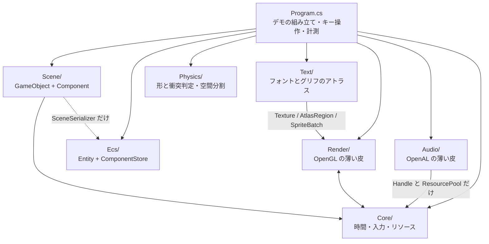

| 層 | 依存先 | 備考 |
|---|---|---|
| `Physics/` | **なし** | `System.Numerics` だけ。そのまま別プロジェクトへ持ち出せる |
| `Ecs/` | **なし** | 同上。Day 23 で「他に依存しないので先に5つ書ける」と書いたとおり |
| `Scene/` | `Core`(`InputSnapshot`)、`Ecs`(`SceneSerializer` のみ) | **描画を一切知らない**。`SpriteRenderer` は絵の種類と大きさを持つデータでしかない |
| `Render/` | `Core`(`Handle` / `ResourceManager`) | `Material` がハンドルを解くために管理側を呼ぶ |
| **`Text/`** | `Render`(`Texture` / `AtlasRegion` / `SpriteBatch`) | **一方通行**。`Render` は `Text` を知らない |
| `Audio/` | `Core`(`Handle` / `ResourcePool` **のみ**) | **一方通行**。`Core` は `Audio` を知らない |
| `Core/` | `Render`(`Texture` / `Shader`) | `ResourceManager` が両者の実体を握っている |
| `Program.cs` | 全部 | 組み立て役。4785行あるが、その大半はデモ・計測・自己チェック |

**`Text/` だけが他の層の上に乗っている**。
`Physics/` も `Audio/` も自分で完結していて、単体で別プロジェクトへ持ち出せるが、
`Text/` は `Render/` が無いと成立しない——グリフを置く先が `Texture` で、
積む先が `SpriteBatch` だから。

これは歪みではなく**素直な積み方**で、`Text` → `Render` の一方通行になっている。
逆向き(`SpriteBatch` が文字を知っている)にすると、
描画の中核が「文字とは何か」を抱え込むことになる。
`SpriteBatch` から見れば、文字は**ただの四角**でしかない。

**`Core` と `Render` が相互参照になっている**のは、この図を描いて初めて見えたことで、
きれいな形ではない。`ResourceManager`(Core)が `Texture`(Render)を作り、
`Material`(Render)が `ResourceManager`(Core)を呼ぶ、という往復になっている。

名前空間が `HonyaEngine` 1つなので今は問題なく動くが、**アセンブリを分けようとした瞬間に破綻する**。
直すなら「`ResourcePool` と `Handle` だけを下層に置き、`ResourceManager` は Render 側に上げる」
のが素直で、Phase 6 でアセットの種類が増えたときに検討する。

**Day 27 の判断**: 音を足すとき、この歪みを繰り返さないようにした。

音のリソースも「パスをキーにして使い回し、ハンドルで配る」という点でテクスチャと同じなので、
`ResourceManager` に `LoadAudio` を足すのが自然に見える。
だがそうすると `ResourceManager`(= `Core`)が **GL と OpenAL の両方を握る**ことになり、
上の相互参照が「`Core` ⇔ `Render` + `Core` ⇔ `Audio`」に増える。

そこで `AudioSystem` は、`Core` から**総称型の `ResourcePool<T>` と `Handle<T>` だけを借りて**、
音のリソースは自分で持つ形にした。`ResourcePool<T>` は `T` が何かを知らないので、
借りても依存が増えない。結果、`Audio/` → `Core/` の**一方通行**が保たれている。

図に描いておくと、こういう判断が「なんとなく」ではなくできるようになる。
**設計書は、次に何かを足すときのために書いている**。

### Core — 時間・入力・リソース

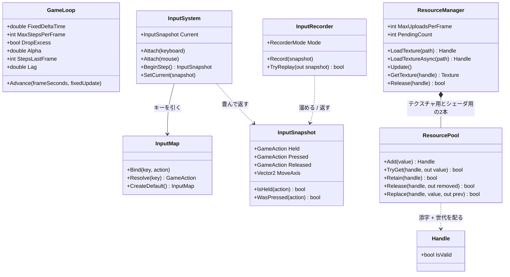

`ResourcePool` と `Handle` は総称型(`ResourcePool<T>` / `Handle<T>`)。
`T` が何かを知らないまま添字と世代だけを管理するので、`Texture` にも `Shader` にも同じものが使える。

この層で押さえるべき責務の線引き:

- **`GameLoop` は時間しか知らない**。何を更新するかは `Action<float>` で渡される
- **`InputSystem` はデバイスのイベントを畳むだけ**。ゲームとしての意味づけは `InputMap` が持つ
- **`InputSnapshot` は値**。だから記録・再生で丸ごと差し替えられる(Day 20 の肝)

### Render — OpenGL の薄い皮

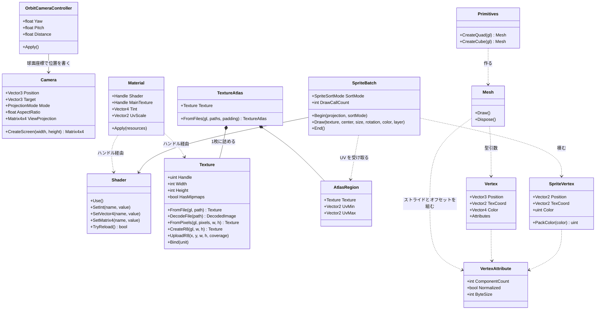

**Day 28 で `Texture` に足したのは2つだけ**。
`CreateR8` が1チャンネルの空テクスチャを作り、`UploadR8` がその一部を書き換える。
どちらもグリフのために足したものだが、**`Texture` はグリフを知らない**——
「1チャンネル」「一部だけ更新」という一般の機能として置いてある。
同じものが Phase 6 のシャドウマップ(Day 33)でも要る。

**`Material` が何も所有していない**のは Day 15 から一貫している(Day15.md の要点2)。
持っているのはハンドルだけで、実体の寿命は `ResourceManager` にある。

**3D の道(`Mesh` + `Material`)と 2D の道(`SpriteBatch`)が並列**なのも見てのとおりで、
両者は `Shader` と `Texture` を共有しているだけで互いを知らない。
`Mesh` は「形が決まっていて毎フレーム変わらないもの」、
`SpriteBatch` は「毎フレーム頂点を作り直すもの」という使い分けになっている。

### Scene — GameObject + Component

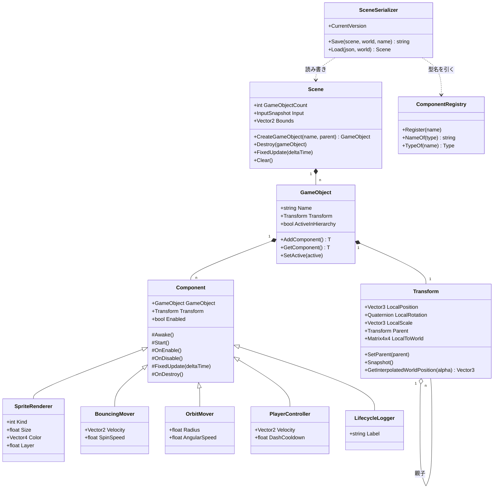

`Transform` だけが `GameObject` の固定メンバーで、ほかは全部 `Component` として付け外しする
(Day 22 の要点2)。`SceneSerializer` が `ComponentRegistry` を経由するのは、
**JSON の文字列から直接 `Type` を作らせない**ため(Day 24 の要点2)。

### Ecs と Physics — どこにも依存しない2つ(今日 `Physics` が増えた)

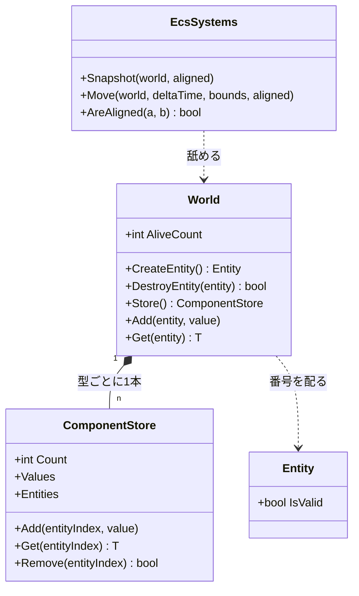

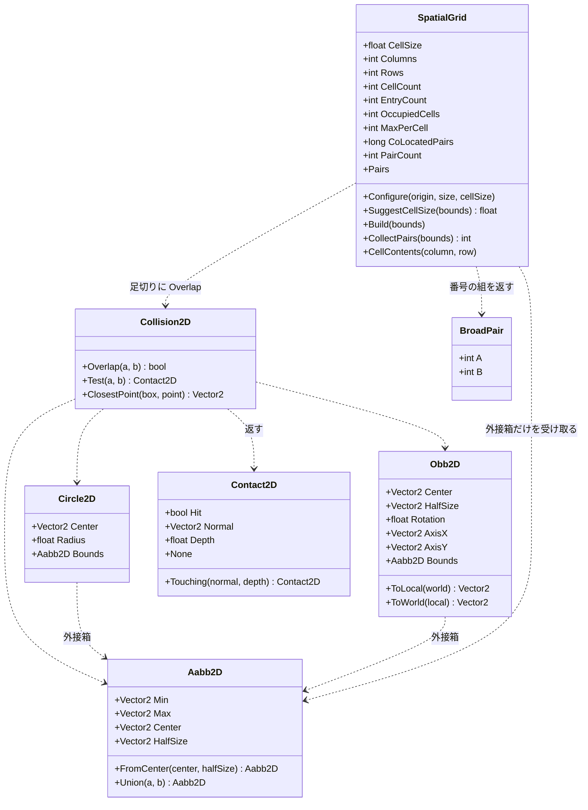

**形は全部 `readonly struct`、判定は `static` メソッドだけ**。状態を持たないので、
どのスレッドから何回呼んでも同じ答えが返る。Day 26 で空間分割を入れたとき、
この性質のおかげで**判定そのものには一切手を入れずに済んだ**——
`Collision2D.cs` と `Shapes2D.cs` の差分は 0 行になっている。

`SpatialGrid` だけが唯一 `class`(参照型)で、しかも状態を持つ。
配列を4本(`_cellStart` / `_cursor` / `_entries` / `_mark`)使い回すためで、
**毎フレーム作り直しても割り当てが起きない**ようにするにはこうするしかない。
そのぶん「1つのインスタンスを複数スレッドから同時に使えない」という制約が付く。
状態を持つと何が失われるかが、同じフォルダの中で見比べられる形になっている。

矢印の向きにも注目してほしい。**`SpatialGrid` から `Body` への線が無い**。
受け取るのは `ReadOnlySpan<Aabb2D>`、返すのは番号の組だけで、
速度も形も質量も知らない。この細さのおかげで、
Day 46 の 3D 版は `Aabb2D` を `Aabb3D` に変えるだけで済む。

### Audio — OpenAL の薄い皮

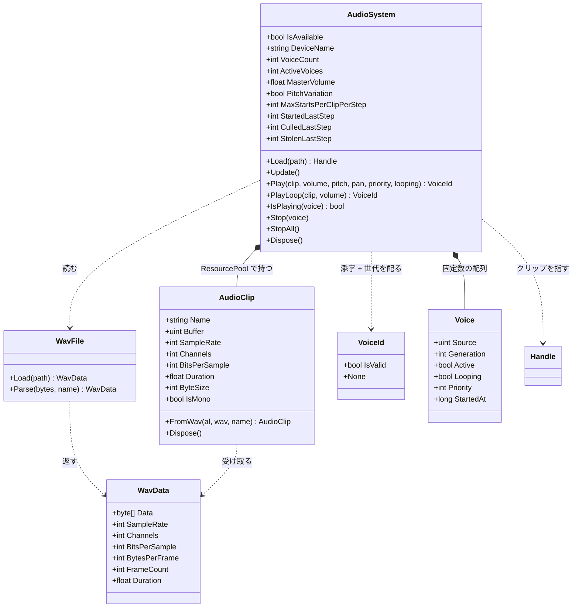

`Voice` は `AudioSystem` の中の `private struct`。外からは `VoiceId` 越しにしか触れない。

この層で押さえるべき線引きは3つ。

- **`WavFile` は OpenAL を知らない**。ただのバイト列パーサなので、
  ファイルが無くてもメモリ上のバイト列で試せる(自己チェックがそうしている)
- **`AudioClip` はデータ、`Voice` は再生**(要点2)。
  `Texture` と `Material`、`Mesh` と描画呼び出しと同じ分け方
- **`VoiceId` は `Handle<T>` と同じ構造**(添字 + 世代)だが**別の型**。
  `Handle<T>` は `ResourcePool<T>` のためのもので、ボイスはプールではないので流用しない。
  同じ手口を別の場所で使い直している、と読むのが正しい

### Text — Render の上に積む層

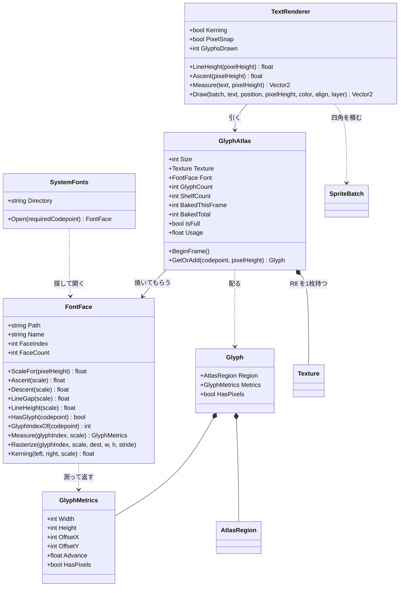

4つのクラスが、**それぞれ1つのことしかしない**ように切ってある。

| クラス | 知っていること | 知らないこと |
|---|---|---|
| `SystemFonts` | どこにフォントがあるか | 描き方 |
| `FontFace` | フォントの中身(寸法とアウトライン) | GL、アトラス、レイアウト |
| `GlyphAtlas` | どこに置いたか、何を焼いたか | 文字の並べ方 |
| `TextRenderer` | 並べ方(送り・行送り・整列) | フォントの中身、GL |

この切り方の値打ちは、**差し替えたときにどこまで壊れるか**で分かる。
SDF に変える(改造課題3)なら `GlyphAtlas` と `text.frag` だけが変わり、
`TextRenderer` は 1 行も触らない。
フォントフォールバックを入れる(改造課題2)なら `FontFace` を複数持つだけで、
`GlyphAtlas` の棚詰めには影響しない。

**`GlyphMetrics` が `FontFace` と `TextRenderer` の共通語**になっている。
「原点からどれだけずらして、次にどれだけ進むか」——
この5つの数字さえあれば、フォントの実装が何であれ字を並べられる。

### 1フレームの流れ

Silk.NET のウィンドウから `OnUpdate` と `OnRender` が交互に呼ばれる。
**状態を変えるのは `OnUpdate` 側だけ**、というのが Day 19 で引いた線。

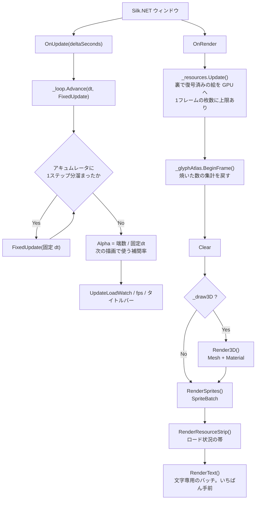

**`RenderText` がいちばん最後**なのは、UI が何よりも手前に出るものだから。
バッチが別なのは、シェーダが違うため——
グリフのアトラスは1チャンネルなので `sprite.frag` では真っ黒になる。
**バッチは「同じ設定で描けるものをまとめる」仕組み**なので、
シェーダが違えば別のバッチになるのは定義どおりの帰結。

`OnRender` の先頭で `_resources.Update()` を呼ぶのが要点で、
**GL は描画スレッドからしか触れない**ため、裏で復号し終えた画素をここで GPU に上げている
(Day 21 の要点5・6)。

### FixedUpdate の中身 — 入力の出どころと3つのバックエンド

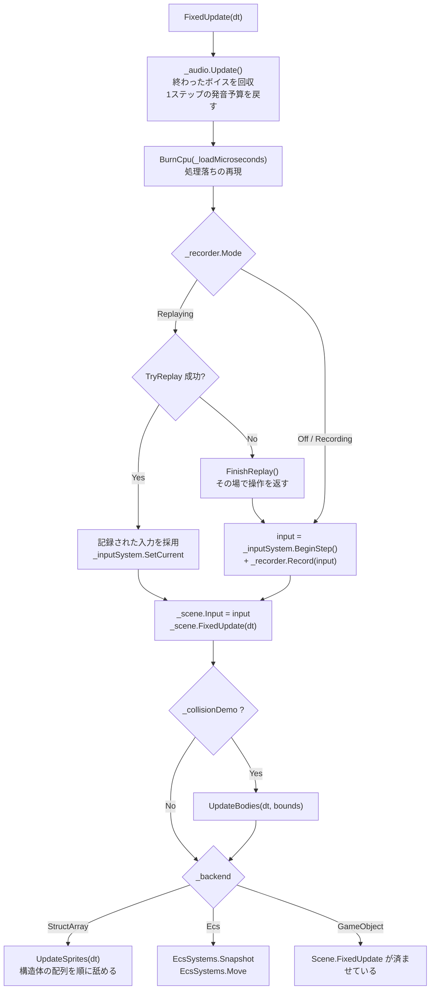

**音の後始末を先頭に置いた**のは、音を要求するのがこの下だから。
予算を戻す場所と使う場所を近くに置くと、「いつリセットされるのか」を追う必要がなくなる。
描画側(`OnRender`)に置くと、シミュレーションが 5Hz のときに
「1フレームに複数ステップぶんの音が要求されるのに予算は 1 回ぶん」というずれが起きる。

**入力がどこから来たかを、この関数から下は誰も気にしない**のがポイント(Day 20 の要点1)。
`InputSnapshot` という値に畳んであるので、記録の再生と実操作を1行で差し替えられる。

`Scene.FixedUpdate` を `_backend` の分岐より前で必ず呼んでいるのは、
**プレイヤーと階層の実演がどのモードでも Scene 側にいる**ため。

### Scene.FixedUpdate の4段階

順番に意味がある。入れ替えると壊れる。

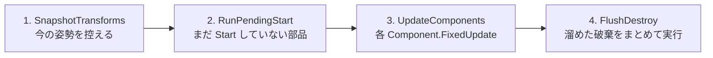

| 段 | なぜその位置か |
|---|---|
| 1 | **動かす前**に控えないと、補間の始点が終点と同じになって補間が効かない |
| 2 | `Start` の中で新しいオブジェクトが生まれるので、**開始時点の件数だけ**回す |
| 3 | ここも開始時点の件数で止める。このステップで生まれたものは次のステップから |
| 4 | 更新中にリストから消すと**走査中のインデックスがずれる**(Day 22 の要点5)。<br/>まとめて `RemoveAll` するのは、1個ずつ消すと O(n^2) になるため |

### 非同期テクスチャロードの流れ

`Q` キーで走る道。**GL を呼ぶ部分と呼ばない部分の境目**が、
そのままスレッドの境目になっている(Day 21 の要点5)。

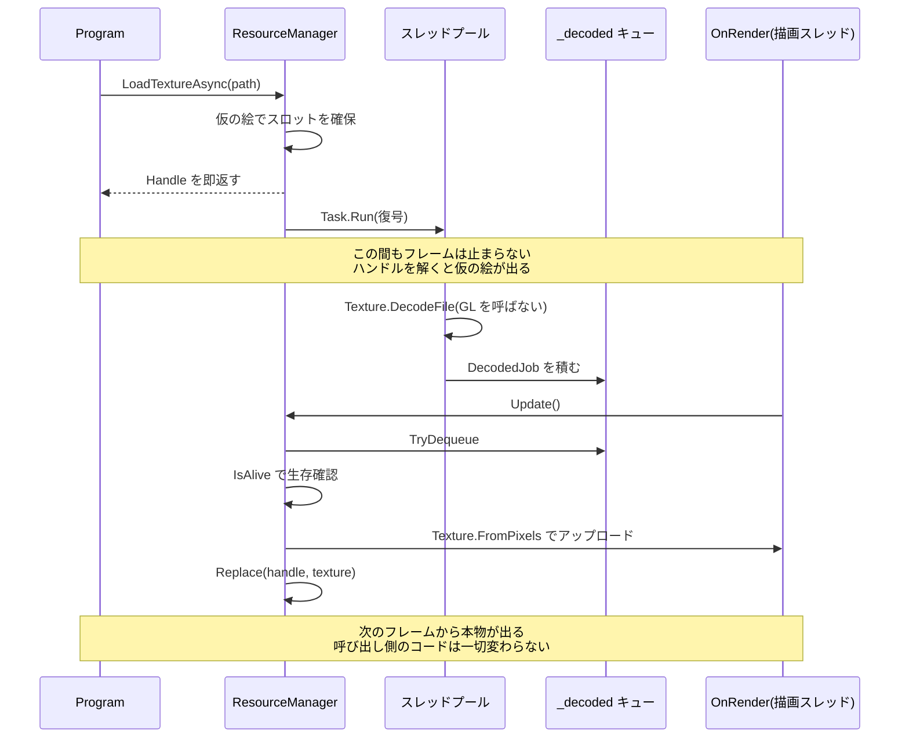

`Update()` が `MaxUploadsPerFrame` で枚数を絞っているのが肝で、
**復号を非同期にしても、アップロードをまとめてやるとそこでカクつく**(Day 21 の要点6)。

### 衝突判定の3段 — ブロードフェーズが割り込んだ

Day 25 の `UpdateBodies` は「動かす → 総当たり → 押し戻す」の3段だった。
今日、真ん中が**「組を絞る」と「絞った組を判定する」に割れる**。

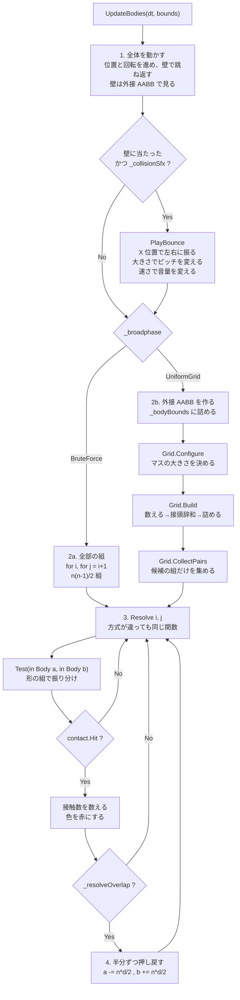

発音の要求が**移動の段にある**ことに注意。
「壁に当たった」はブロードフェーズの外で分かることなので、
組の絞り込みとは無関係にここで出る。
体どうしの接触音を鳴らすなら `Resolve` の中になるが、
2000 体で 7,425 組が接触しているので**要求だけで 7,425 回**になる。
要点3の 7.3μs を掛けると 54ms。今日は壁だけにしてある。

図で見てほしいのは**2つの経路が `Resolve` で合流している**ところ。
方式ごとにナローフェーズを書き分けると、
「答えが違う」となったときに原因がブロードフェーズなのか判定なのか分からなくなる。
合流させておけば、**違いが出たら必ず組の選び方が原因**と言い切れる。
`F12` の自己チェックが「接触数が一致」だけで意味を持つのはこの形のおかげ。

もうひとつ、**押し戻し(4段目)がグリッドの構築より後にある**ことに注意。
押し戻すと位置が動くので、ステップの頭で組んだ格子は少しずつ古くなる。
押し戻し量は 1 ステップぶんの重なりぶんしかないので実用上は問題にならないが、
厳密にやるなら「判定を全部済ませてから、まとめて押し戻す」形にする。
Phase 7 のインパルス解決がその形になる。

### 均一グリッドの中身 — 2つの関数しかない

`SpatialGrid` の公開メソッドは実質 `Build` と `CollectPairs` の2つだけ。
中で何が起きているかは、コードを読むより図のほうが早い。

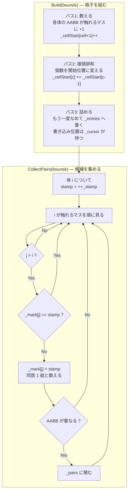

3つの絞りが直列に並んでいるのが分かる。

| 絞り | 落とすもの | 4000 体での実測(マス 32px) |
|---|---|---|
| 格子 | 別のマスにいる組 | 7,998,000 → 72,527 |
| `j > i` と印 | 同じ組の重複 | (上の数に含まれる) |
| AABB | 同じマスだが離れている組 | 72,527 → 24,733 |

**最後の AABB がまだ 3 分の 1 に減らしている**のが面白いところで、
「同じマスにいる」は「近い」でしかない。
7.4ns の AABB 判定を挟むことで、24〜120ns のナローフェーズを 5 万回節約している。

`j > i` の条件だけでは重複が消えないことは、実際に印を外すと確かめられる
(自己チェックの「重複した組が無い」が落ちる)。

`Test(in Body, in Body)` の中身は形の組み合わせ表そのもの。**3種類で6通り**になる。

| a \ b | Circle | Box | RotatedBox |
|---|---|---|---|
| **Circle** | `Test(Circle, Circle)` | `Test(Circle, Aabb)` | `Test(Circle, Obb)` |
| **Box** | 上を**符号反転** | `Test(Aabb, Aabb)` | OBB 同士へ寄せる |
| **RotatedBox** | 上を**符号反転** | OBB 同士へ寄せる | `Test(Obb, Obb)` SAT |

- **専用の速い経路**(AABB 同士、円同士)と**一般形**(OBB 同士の SAT)を併存させ、
  組み合わせの穴は一般形で埋める。`F9` の自己チェックで**両者の答えが一致すること**を確認している
- 引数の順が逆になる組(`Test(Box, Circle)`)は**法線の符号を反転**して返す。
  ここを間違えると物体がめり込む方向へ押される(要点6)
- 種類を1つ足すと表が1行1列増える。3D で球・箱・カプセル・平面・地形と並べると 15 通りになり、
  **その表を埋めることが物理エンジンを書くこと**になる(Phase 7)

### 音を1発鳴らすまで — 3つの関門

`Play` を呼んでから実際に音が出るまでに、3回ふるいにかけられる。
**呼んだのに鳴らないことは普通に起きる**ので、どこで落ちたかを数えられるようにしてある。

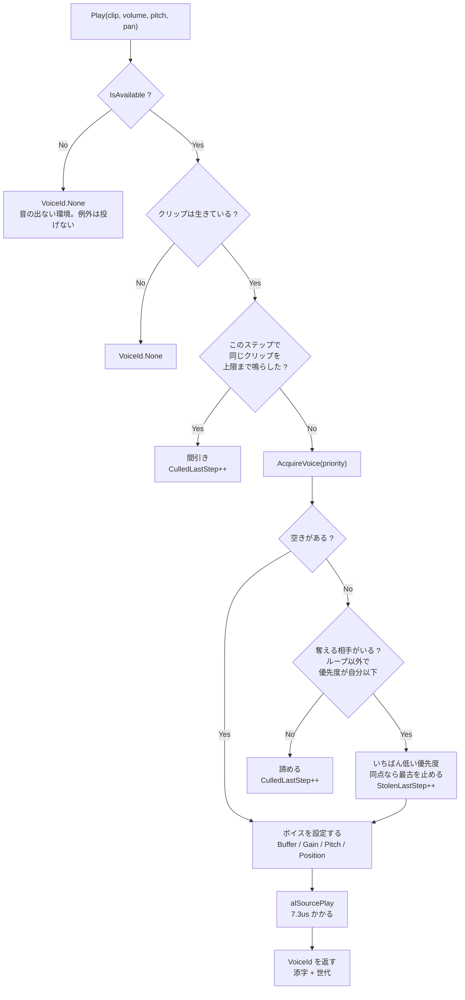

**「諦める」が2箇所ある**のが要点。
間引き(`C`)は「同じ音が多すぎる」で落とし、
`F` は「ボイスが足りず、しかも自分より偉い音しか鳴っていない」で落とす。
前者は音として意味が無いから落とすので**積極的**、
後者は資源が足りないから落とすので**消極的**。
タイトルバーで両方を分けて数えているのは、この2つが違う対処を要求するため
(前者は上限を調整する、後者はボイスを増やす)。

### 1文字が画面に出るまで — 4つの層を通り抜ける

`Draw("あ", ...)` を呼んでから画面に出るまでに何が起きるか。
**初回だけ通る道**(焼く)と、**毎回通る道**(引く・積む)が分かれているのが要点。

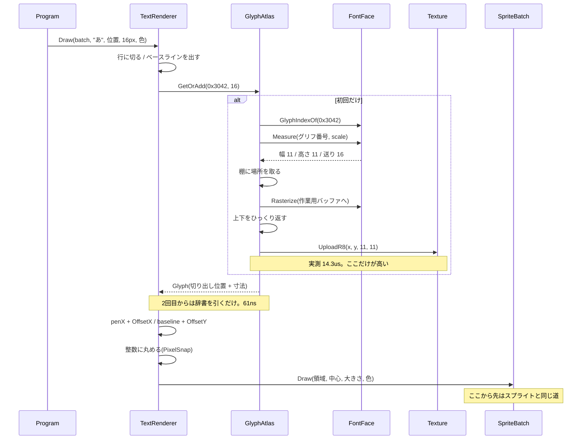

図で見てほしいのは、**`alt` の中が初回にしか走らない**こと。
14.3us と 61ns の差は 234 倍あり、**キャッシュを持つかどうかがそのまま性能**になる。
だからアトラスは「使い回すためのもの」であって、
描画をまとめるため(Day 17 の動機)だけのものではない。

もうひとつ、**`TextRenderer` から `Texture` への線が無い**。
グリフを焼く判断も、GL を触るのも、全部 `GlyphAtlas` の中で閉じている。
`TextRenderer` から見れば「文字を渡すと切り出し位置が返ってくる」だけで、
それが今焼かれたものか、100 フレーム前に焼かれたものかを知らない。
## 完成条件

```
dotnet run --project reference/Day28 -c Release
```

起動時に、見つかったフォントがコンソールに出る。

```
フォント: メイリオ  C:\WINDOWS\Fonts\meiryo.ttc
  ファイル内のフォント数 4 / 使用 0 番目 / 日本語 あり
  16px: ascent 11.31 / descent 4.69 / 行送り 16.00
```

**`ファイル内のフォント数 4`** を確認する。`.ttc` に4つ入っているという意味で、
ここが 1 なら単体の `.ttf` を開いている。

フォントが1つも見つからなければ「見つかりませんでした(文字なしで続行します)」と出て、
**そのまま普通に遊べる**。

### `;` 1回目: 情報が画面に出る

タイトルバーに押し込んでいた数字が画面の左上に出る。

```
Day28   512.3 fps   DC:4
構造体配列  更新:0.12ms  GO:12  E:0  スプライト:1000
音:0/32  要求:0  発音:0  間引き:0
文字:87字  棚3段  使用率9.4%  焼:0  積:87枚  描画:0.12ms
```

**`焼:` が 0 になっている**のを確認する。1フレーム目は数十になり、
そのあとは 0 のまま——**同じ文字は2度焼かない**からで、
数字が動くと(`512.3` → `498.1`)そこで初めて新しい数字を焼く。

`F6` で衝突デモを出すと行が増え、数字が毎フレーム変わるので、
**焼く必要のある文字がひととおり出そろうまで `焼:` が動く**のが見える。

### `;` 2回目: アトラスが見える

右下にアトラスの中身が出る。**棚詰めがそのまま見える**。

- 段の高さが「その段でいちばん高い字」で決まっている
- 右端に余りが出ている(次の字が入らなかったぶん)
- 大きさの違う字を混ぜる(見本帳を一度出してから戻る)と、段の高さがばらばらになる

`G` と `PageDown` で背景を消すと見やすい。

### `;` 3回目: 見本帳

見たいことを1画面に並べてある。

| 見るところ | 何が分かるか |
|---|---|
| 日本語の行 | ひらがな・カタカナ・漢字・記号が出る |
| 48px の見出し | 大きさは指定できるが、**アトラスを食う**(`;` 2回目で確認) |
| 整列の3つ | 同じ y に左・中央・右。中央と右は**行の幅を先に測っている** |
| カーニング(上下2行) | 上が詰まっている。"AVATAR" の A と V の間で分かりやすい |
| ピクセル丸め(上下2行) | 下は 0.5px ずらしてある。**にじんで太く見える** |
| 最後の行 | 絵文字が豆腐(四角)になる |

見本帳を出したあとに `;` を押してアトラスへ戻ると、
**48px の字が大きな段を作っている**のが見える。

### `/`: 自己チェックと計測

20 項目すべて `OK` になり、続けてコストが出る。

```
[OK] 32px 指定で ascent+descent が 32px  32.00px
[OK] 行送り >= ascent+descent  行送り 32.00px / lineGap 0.00px
[OK] 空白は絵を持たないが送りはある  送り 3.62px
[OK] 2回目は焼き直さない  焼いた回数 1
[OK] 大きさが違えば別のグリフ  16px と 17px で 1 回
[OK] UV の幅が画素幅と一致  11.00px / 11px
[OK] グリフを焼いても GL エラーが出ない  NoError
[OK] Measure と Draw の大きさが一致  167.15x16.00
[OK] サロゲートペアを1文字として数える  char 2 個 / 幅 10.67px
[OK] 幅がグリフ1つぶんと一致  10.67px / 1グリフ 10.67px
[OK] 満杯になっても落ちない  200字 / 4段
  すべて合格

### 文字まわりのコスト ###
  焼く(ASCII 95字、16px):    10.5us  (合計 1.0ms / 512px 中 使用率 5.1%)
  焼く(16px、初回)      :    14.3us  (2136字で 30.5ms / 1024px 中 使用率 27.9%)
  焼く(48px、初回)      :    23.1us
  引く(キャッシュあり)  :      60ns
  Measure(24文字)       :    4205ns
  Measure(カーニングなし):     216ns
  Draw に積む(24文字)   :    9852ns
  Draw(カーニングなし)  :    1036ns
```

いちばん大事なのは **`Measure と Draw の大きさが一致`**。
測る側と描く側が別の答えを出すと、枠から字がはみ出したり中央ぞろえがずれたりする。
今日は両方を同じ `Layout` に通しているので一致するが、
**速さのために片方だけ最適化した瞬間に崩れる**ところなので、
確かめる仕掛けを先に置いてある。

## 改造課題

### 課題1(易): カーニングを安くする

要点6のとおり、カーニングは**20倍**のコストを払って **1.84px** を得ている。
日本語の UI ではほとんど効かないのに、値段だけは全部払っている。

まず、なぜ高いのかを確かめる。`FontFace.Kerning` は
`stbtt_GetCodepointKernAdvance` を呼んでいて、その中では

1. 左の文字 → グリフ番号(9MB のフォントの対応表を二分探索)
2. 右の文字 → グリフ番号(同上)
3. kern テーブルを二分探索

が毎回走る。**1 と 2 の結果は `GlyphAtlas` が既に持っている**ので、二度手間になっている。

やることは3段階。

```csharp
// (a) 組をキーにキャッシュする
private readonly Dictionary<long, float> _kerning = [];

// (b) どちらかが CJK なら 0 と決め打つ
static bool IsCjk(int cp) => cp >= 0x3000 && cp <= 0x9FFF;
```

(a) と (b) を入れて `/` で測り直す。
**どちらがどれだけ効くか**を分けて測ること——
(b) だけで日本語の行はほぼ 0 になるが、英字の行は変わらない。

そのうえで、**(c) 最初からグリフ番号で引く API を通す**
(`stbtt_GetGlyphKernAdvance` にはグリフ番号を渡せる)ところまで行くと、
1 と 2 が丸ごと消える。`GlyphAtlas` にグリフ番号を持たせる必要が出てくるので、
**どのクラスが何を知るべきか**を考え直す練習になる。

### 課題2(中): フォントフォールバック — 絵文字を出す

見本帳の最後の行が豆腐になるのは、メイリオが絵文字を持っていないから。
Windows には `seguiemj.ttf`(Segoe UI Emoji)が入っているので、
**「メイリオに無ければそちらで焼く」**ようにする。

設計の分かれ道がここにある。

- **フォントごとにアトラスを分ける** — 単純だが、テクスチャが増えて
  バッチが切れる(Day 17 の話がそのまま戻ってくる)
- **1枚のアトラスに混ぜ、キーにフォント番号を足す** — バッチは1回のまま。
  `GlyphAtlas` が `FontFace` を1つしか持っていない前提を崩す必要がある

```csharp
// 後者ならキーはこうなる
long key = ((long)fontIndex << 40) | ((long)pixelHeight << 32) | (uint)codepoint;
```

**どちらを選ぶかは「フォントが何枚まで増えるか」で決まる**。
2〜3枚なら後者、多言語対応で 10 枚を超えるなら前者、が目安になる。

そこまで書けたら、**Segoe UI Emoji はカラー絵文字を持っている**ことにも気づく
(`CBDT`/`sbix` テーブル)。stb_truetype はこれを読まないので、
出るのは白黒の輪郭だけになる。**「対応した」と「同じに見える」は別**。

### 課題3(難): SDF フォントにする

要点3のとおり、いまは**大きさごとに別のグリフ**を焼いている。
16px と 17px と 48px で3回焼くので、拡大縮小するUIとは相性が悪い。

SDF(Signed Distance Field)は、被覆率の代わりに
**「その画素から字の輪郭までの距離」**を焼く。
距離は拡大しても線形に補間できるので、**1つのアトラスから任意の大きさが出せる**。

1. `stbtt_GetGlyphSDF` でグリフを SDF として焼く(stb が持っている)
2. `text.frag` を書き換える

```glsl
float distance = texture(uTexture, vTexCoord).r;
float width = fwidth(distance);                       // 画面上での変化の速さ
float alpha = smoothstep(0.5 - width, 0.5 + width, distance);
FragColor = vec4(vColor.rgb, vColor.a * alpha);
```

`fwidth` が肝で、**拡大率に応じて輪郭のぼかし幅を自動で変える**。
これが無いと、拡大したときに輪郭がぼやけるか、縮小したときにギザギザになる。

見どころは3つ。

- **小さい字では負ける**。SDF は 1 画素に満たない細部を表現できないので、
  16px の漢字では従来の焼き方のほうがはっきり出る。
  **だから実務では「本文はビットマップ、見出しは SDF」と使い分ける**
- **アトラスの節約になるか測る**。SDF は 1 サイズで済むが、
  余白(距離を持たせる範囲)が要るので 1 グリフは大きくなる。
  **何サイズ使うと元が取れるか**が分かれ目
- **輪郭・影が1行で足せる**。距離が分かっているので、
  `smoothstep` のしきい値を変えるだけで縁取りになる。
  ビットマップだと焼き直しが要る

### そのほか、今日やらなかったこと

`Text/` は**横書きの日本語と英語を、折り返しなしで並べる**ところまでしかやっていない。
ゲームUIとしてはこの先が要る場面がある。

| やっていないこと | どこで要るか |
|---|---|
| 折り返し(word wrap) | 長い説明文。英語は単語単位、日本語は禁則処理が要る |
| 右横書き・縦書き | アラビア語、縦書きの演出 |
| 合字・異体字(GSUB) | `fi` の合字、`葛` の2種類 |
| 書記素クラスタ | 👨‍👩‍👧 のような結合文字を1文字として扱う |

**どれも「文字を出す」の続きではなく、別の問題**になっている。
`Text Rendering Hates You`(事前に読む資料)が、この辺りを一覧にしてくれている。

## 動作確認済み環境

- Windows 11 / .NET 10 / Silk.NET 2.23.0 / StbTrueTypeSharp 1.26.12
- フォント: メイリオ(`C:\Windows\Fonts\meiryo.ttc`、4面中0番)
- 960x640、VSync オフ、`-c Release`、シミュレーション 60Hz

### フォントのメトリクス(メイリオ)

| 指定 | ascent | descent | 行送り | lineGap |
|---|---|---|---|---|
| 16px | 11.31 | 4.69 | 16.00 | 0.00 |
| 32px | 22.61 | 9.39 | 32.00 | 0.00 |

`ascent + descent` がちょうど指定値になり、`lineGap` が 0 なので行送りも同じ値になる。
**フォントによってはここが一致しない**(`lineGap` を持つフォントでは行送りのほうが大きい)。

### 文字まわりのコスト

| 呼び出し | 1回あたり | 備考 |
|---|---|---|
| 焼く(ASCII 95字、16px) | 10.5us | 合計 1.0ms / 512px 中 5.1% |
| 焼く(常用漢字 2136字、16px) | 14.3us | 合計 **30.5ms** / 1024px 中 27.9% |
| 焼く(48px) | 23.1us | |
| 引く(キャッシュあり) | **60ns** | 焼くのと **234倍** の差 |
| `Measure`(24文字) | 4,205ns | カーニングあり |
| `Measure`(カーニングなし) | **216ns** | **20倍** の差 |
| `Draw` に積む(24文字) | 9,852ns | カーニングあり |
| `Draw`(カーニングなし) | **1,036ns** | **9.5倍** の差 |

### 実際の画面での測定

情報表示 + アトラス表示(5行 + アトラス1枚、208字が焼かれた状態):

| 内訳 | 時間 |
|---|---|
| 積む(レイアウト + `SpriteBatch.Draw`) | 0.367ms |
| `End`(GL への送信 + ドローコール) | 0.020ms |
| 合計 | **0.387ms** |

**送るより並べるほうが 18 倍高い**。
文字は1枚ずつ位置を計算するので CPU 側が重く、
GPU 側から見れば数百枚の四角でしかない。
Day 18 のスプライトが「送るほうが重い」だったのと**逆になっている**。

なお 0.387ms のうち大半はカーニング(要点6)と、
**左ぞろえでも行の幅を測っていること**による。
`Layout` は戻り値の大きさを出すために必ず1回測ってから描くので、
実質2回なめている。改造課題1でここも軽くなる。

### 自己チェック(20 項目すべて合格)

```
フォント: メイリオ(4 面中 0 番)
[OK] ascent は正  22.61px
[OK] descent は正(下向きの量として)  9.39px
[OK] 32px 指定で ascent+descent が 32px  32.00px
[OK] 行送り >= ascent+descent  行送り 32.00px / lineGap 0.00px
[OK] 英字を持っている
[OK] ひらがなを持っている  あ
[OK] 漢字を持っている  漢
[--] 絵文字 U+1F600: なし(豆腐になる)
[OK] 空白は絵を持たないが送りはある  送り 3.62px
[OK] 2回目は焼き直さない  焼いた回数 1
[OK] 大きさが違えば別のグリフ  16px と 17px で 1 回
[OK] UV が 0..1 に収まっている  (0.000,0.000)-(0.021,0.020)
[OK] UV の幅が画素幅と一致  11.00px / 11px
[OK] グリフを焼いても GL エラーが出ない  NoError
[OK] Measure と Draw の大きさが一致  167.15x16.00
[OK] 2行の高さは1行の2倍  16.00 → 32.00
[OK] 2行の幅は広いほうの行  53.33px
[OK] CRLF でも同じ
[--] カーニング: AVAV が 58.04px → 56.20px(1.84px 詰まった)
[OK] サロゲートペアを1文字として数える  char 2 個 / 幅 10.67px
[OK] 幅がグリフ1つぶんと一致  10.67px / 1グリフ 10.67px
[OK] 満杯になっても落ちない  200字 / 4段
[OK] 満杯でも送りは返す  21.33px
```

### 検証の途中で分かったこと

- **カーニングが 20 倍のコストを持っていた**。これは測るまで想像していなかった。
  「送りに数値を1つ足すだけ」に見えるのに、
  中では**文字対応表の二分探索が2回**走っている。
  そして日本語では 0 が返るので、**払ったぶんが丸ごと無駄**になる。
  **安そうに見える呼び出しほど、中で何をしているか確かめる**
- **`Measure` と `Draw` の比が 2.4 倍だった**。`Draw` の中で `Measure` 相当を
  1回やっているので、理屈どおり。
  左ぞろえでは要らない計算だが、**戻り値の大きさを出すために必要**という
  設計上の理由がある。速さのためにここを分けると、
  「測った幅と描いた幅が違う」という最悪のバグを呼び込む
- **`dotnet format` を構文エラーのあるファイルに掛けると、
  インデントが壊れたまま保存される**。
  途中で編集を誤った状態のまま整形を走らせて、
  数百行が左詰めになった。**整形の前にビルドを通す**——
  スキルの手順が「整形 → ビルド」の順に書いてあるが、
  **実際には「ビルド → 整形 → ビルド」でないと危ない**
- **`.ttc` を単体の `.ttf` として開くと失敗する**。
  メイリオは4つのフォントが1ファイルに入っているので、
  `stbtt_GetFontOffsetForIndex` で何番目かを指定する必要がある。
  ここを飛ばすと `stbtt_InitFont` が 0 を返して読めない
- **ウィンドウのタイトルが `Day25` のままだった**。
  Day 26 と Day 27 で更新し忘れていて、今日画面に `Day28` と出したときに気づいた。
  **同じ情報を2箇所に書くと必ず片方が古くなる**という、ありふれた形の実例
