# Day 29: 卒業制作(前半) — 見下ろし型アクションの骨格

Phase 5(ゲームが作れる状態に)の5日目。**このエンジンでゲームを作り始める**。

## 今日のゴール

`Enter` で卒業制作に切り替わる。矢印キーで動くと、**攻撃は勝手に飛ぶ**。
敵が四方から湧いて押し寄せ、倒すと経験値のジェムが落ちる。
HP が尽きたらゲームオーバー。生き延びた時間がスコアになる。

```
0:52   HP 64 / 100   Lv.3  12/31
敵 58  弾 3  ジェム 42  撃破 67
格子 33x27  最大7/マス  候補 23
```

Day 25〜28 で作ったものが、ここで初めて**ゲームの必然として**要る。

| | Day 29 での役どころ |
|---|---|
| Day 25 当たり判定 | 弾と敵、敵とプレイヤー、敵どうしの押し合い |
| Day 26 空間分割 | **これが無いと成立しない**。500 体で 129,286 組 → 594 組 |
| Day 27 音 | 敵が死ぬたびに鳴らす。間引きが無いと即破綻する |
| Day 28 文字 | 残り時間・HP・レベル。数字が出せないとゲームにならない |

そして **500 体の敵と HUD が、ドローコール1回**で出る(Day 17〜18)。

## 事前に読む資料

ロードマップでは資料の指定が無い日なので、実装に直結するものを挙げておく。

- [Vampire Survivors](https://store.steampowered.com/app/1794680/)(または [Brotato](https://store.steampowered.com/app/1942280/))
  **まず遊ぶ**。1時間でよい。
  「自動攻撃 + 移動だけ」がなぜ成立するのか、
  敵の数がどう増えるのか、レベルアップで何が起きるのかを体で知っておくと、
  数字を決めるときの拠り所になる
- [Game Programming Patterns: Update Method](https://gameprogrammingpatterns.com/update-method.html)
  今日の `Update` が 11 段に分かれている形の背景。
  [日本語版](https://gpp.craftbeer.style/update-method/)あり
- [Juice it or lose it](https://www.youtube.com/watch?v=Fy0aCDmgnxg)(GDC、13分)
  同じゲームが「手応え」だけでどう変わるか。
  今日入れた**被弾時の点滅**と**殴られた敵が白く光る**のは、この話の最小版
- [The Art of Game Balance](https://www.gamedeveloper.com/design/the-art-of-balancing-game-difficulty)
  難易度曲線の考え方。要点6で決めた「押し返せる時間」と「押し負ける時間」の話

## 理論の要点

### 1. エンジンとゲームの境目は「窓を出さずに回せるか」で測れる

`Game/` はエンジンの層ではない。**エンジンを使う側**として、外に立つ。

境目がちゃんと引けているかは、ひとつの問いで確かめられる。

> **窓を出さずにゲームを回せるか?**

回せる。`SurvivorGame` は `GL` も `Silk.NET` も `AudioSystem` も知らないので、
入力を作って `Update` を呼ぶだけで何分ぶんでも進められる。

```csharp
var game = new SurvivorGame();
game.Start(new Vector2(960, 640));
for (int step = 0; step < 60 * 600; step++)   // 600 秒ぶん
{
    game.Update(1.0f / 60.0f, snapshot);
}
```

これが**実利になる**。時間で難しくなるゲームは、
終盤を見るのに毎回そこまで遊ぶ必要が出てくる。
今日の自己チェックは 600 秒ぶんを一瞬で回して、
「放置すると 97.6 秒で死ぬ」「逃げ回ると 151.5 秒生きる」を機械に確かめさせている。

音も同じ理由で外に出した。ゲームは**何が起きたかだけを投げる**。

```csharp
public Action<GameEvent, Vector2>? OnEvent { get; set; }
```

`SurvivorGame` が直接 `_audio.Play` を呼んでいたら、
テストのたびにデバイスを開くことになり、音の出ない環境では動かせない。
そして画面を光らせる・振動させるといった反応を足すときも、**足す場所が同じ1箇所**になる。

### 2. 構造体の配列 + 末尾入れ替え

敵・弾・ジェムはどれも `struct` の配列で持ち、数だけを別に数える。

```csharp
public Enemy[] Enemies { get; }        // 1200 個ぶん確保しておく
public int EnemyCount { get; private set; }
```

消すときは**末尾と入れ替えて縮める**。

```csharp
private void RemoveEnemy(int index) => Enemies[index] = Enemies[--EnemyCount];
```

前へ詰めると O(n) かかるうえ、走査中の添字が全部ずれる。
末尾と入れ替えれば O(1)。順番は変わるが、**敵に順番の意味は無い**ので困らない。
Day 23 の `ComponentStore` がまったく同じことをしている(あちらの要点4)。

**呼んだあとは `i--` して同じ添字をもう一度見る**のを忘れないこと。
忘れると、入れ替えで新しく来たものを飛ばす。
自己チェックの「倒した敵が配列に残っていない」はこれを見ている。

そして今日は **Day 23 の ECS を使っていない**。
ECS が効くのは「部品の組み合わせが実行時に変わる」ときで、
今日のように**敵は敵、弾は弾と決まっている**なら、
種類ごとに配列を1本持つほうが素直で速い。

Day 23 で「ECS は構造体の配列の一般化」と書いた。
**一般化が要らない場面では特殊形のままでよい**——
ECS が無駄だったのではなく、**どちらを選ぶか判断できるようになった**という話になる。

### 3. 格子は1回組んで、4通りに使う

Day 26 の `SpatialGrid` に、今日 `Query` を足した。

| メソッド | 何を返すか | いつ使うか |
|---|---|---|
| `CollectPairs` | **全部の組** | 敵どうしの押し合い(全員対全員) |
| `Query` | **1つの箱の近くにいるもの** | 弾が当たった敵、いちばん近い敵、爆風の範囲 |

**1対多は組の列挙では表せない**。
弾1発について「近くにいる敵」を知りたいだけなのに、
全部の組を作ってから絞るのは無駄になる。

`SurvivorGame.Update` は、1ステップに1回組んだ格子を4通りに使う。

```
Build            … 敵の外接 AABB を詰める
 ├ CollectPairs  … 敵どうしの押し合い
 ├ Query × 1     … 狙う敵を探す
 ├ Query × 弾数  … 当たった敵を探す
 └ Query × 1     … プレイヤーに触れた敵
```

実測(敵 509 体):

| | 組の数 |
|---|---|
| 総当たりなら | 129,286 組 |
| 格子の候補 | **594 組** |

**99.5% 減っている**。

そして `Query` は**候補までしか返さない**。
同じマスにいるだけで実際には離れている相手も混ざるので、
本判定は呼び出し側でやる。
`CollectPairs` が外接 AABB で足切りしていたのと違うのは、
**呼び出し側が持っている形(円なのか箱なのか)で判定したほうが正確で速い**から。
ブロードフェーズは絞るところまで、が線引きになる。

### 4. 押し合いが「群れ」を作る

敵の AI は**プレイヤーへまっすぐ向かうだけ**。経路探索も隊列も無い。
それでも押し寄せてくるように見えるのは、**敵どうしが押し合っている**から。

押し合いが無いと、全員が最短距離を進むので**1本の線の上に完全に重なる**。
何百体いても1体に見える。押し離すだけで、勝手に前線ができて回り込みが起きる。

```csharp
Vector2 push = contact.Normal * (contact.Depth * 0.5f * GameBalance.EnemySeparation);
a.Position -= push;
b.Position += push;
```

`EnemySeparation` を 1.0(重なりを1ステップで完全に解消)にすると、
密集したときに弾かれるように吹き飛ぶ。0.35 くらいで少しずつ押すほうが、
押し合ってじわじわ広がる動きになる。

**1体ずつの賢さに使う予算を、体数と押し合いに回している**のがこの題材の設計で、
だからこそ Day 26 の空間分割が「あると速い」ではなく
「無いと成立しない」になる。

### 5. 無敵時間が無いとゲームにならない

敵が重なって押し寄せる題材なので、素直に判定すると
**1秒で 60 回ダメージを受ける**。接触ダメージ 6 なら 1 秒で 360、
100 の HP は 0.3 秒で消える。

```csharp
Health -= Enemies[e].Damage;
InvulnerableFor = GameBalance.PlayerInvulnerableTime;   // 0.75 秒
break;   // 同じステップで何体に触っていても、ダメージは1回ぶん
```

`break` も要る。囲まれると同じステップで複数体と接触するので、
それを全部数えると無敵時間があっても即死する。

**0.75 秒で 6 ダメージ = 8 ダメージ/秒**。
100 の HP なら、囲まれ続けて 12.5 秒。
「じわじわ減る」に収まって、立て直す余地が残る。

そして**無敵の間は点滅させる**(`GameView`)。
数字を出さずに状態を伝える定番で、これが無いと
「ダメージが入っていない」のか「表示が壊れている」のか分からない。

### 6. 難易度は「湧く速さ」と「倒せる速さ」の釣り合い

この題材の難易度曲線は、ほぼ2つの数字で決まる。

```
倒せる速さ = 1 / 発射間隔        (雑魚が1発で倒せるなら)
湧く速さ   = 1回の数 / 湧き間隔
```

今日の値だと:

| | 開始時 | 120 秒後(ramp 完了) |
|---|---|---|
| 湧く速さ | 1.1 体/秒 | **20 体/秒** |
| 倒せる速さ | 3.3 体/秒 | 3.3 体/秒 |

**開始時は押し返せて、途中から押し負ける**。
交差するのがだいたい 90 秒あたりで、そこから敵が溜まり始める。

実測した増え方:

| 経過 | 敵 | 撃破 | 1ステップ |
|---|---|---|---|
| 15s | 11 | 6 | 0.004ms |
| 60s | 25 | 41 | 0.005ms |
| 90s | 58 | 67 | 0.008ms |
| 120s | 144 | 97 | 0.017ms |
| 150s | **458** | 143 | 0.046ms |

**最初にこの釣り合いを外した**。湧き間隔 0.5 秒(2 体/秒)、
発射間隔 0.45 秒・雑魚は 2 発(1.1 体/秒)にしていて、
**開始した瞬間から押し負ける**設定になっていた。
結果は「放置しても逃げても 30 秒で死ぬ」ゲームで、
敵が数百体になる場面が**一度も来なかった**。

数字を1箇所(`GameBalance`)に集めてあるおかげで、直すのは 5 行で済んだ。
**調整値が散らばっていたら、この修正はできていない**。

### 7. 手応えは「1発で倒せるか」と「反応が返るか」

同じ数字でも、見せ方で体感がまるで変わる。今日入れたのは3つだけ。

**(a) いちばん数の多い敵は1発で倒せるようにする**
2発必要だと「撃っているのに減らない」と感じる。
雑魚の体力 10 に対して弾のダメージを 12 にしてあるのはこのため。
歯ごたえは**硬い敵**(体力 34)で付ける。

**(b) 殴られた敵を 0.08 秒だけ白くする**
これが無いと、硬い敵に弾が当たっているのか外れているのかが分からない。
0.08 秒という短さでも、当たっているという手応えは十分に出る。

**(c) ジェムを吸い寄せる**
落ちた場所まで取りに行かせると、敵の中へ突っ込むことになって
**「倒したのに損をする」**感じになる。
近づいたら勝手に来るようにすると、倒すこと自体が報酬になる。

最初は吸い寄せ範囲を 96px にしていて、150 秒で Lv.5 までしか行かず、
拾えていないジェムが 70 個も残った。130px に広げたら流れるようになった。
**逃げながら戦う遊びなので、倒した場所へ戻る余裕は無い**。

## 前Dayからの差分概要

### 新規ファイル

| ファイル | 行数(うち実コード) | 役割 |
|---|---|---|
| `Game/GameBalance.cs` | 190 (41) | 調整値。**数字を1箇所に集める**だけ |
| `Game/SurvivorGame.cs` | 701 (399) | 状態と更新。`Enemy` / `Projectile` / `Gem` / `GamePhase` |
| `Game/GameView.cs` | 308 (194) | 描画と HUD。**状態を1文字も書き換えない** |

`Game/` はエンジンの層ではなく、**エンジンを使う側**。
`SurvivorGame` は `GL` も `Silk.NET` も `AudioSystem` も知らない。

### 変更ファイル

| ファイル | 差分 | 内容 |
|---|---|---|
| `Physics/SpatialGrid.cs` | +104 / -14 | `Query`(単発の問い合わせ)を追加、印の確保を `Build` へ移動 |
| `Program.cs` | +453 / -5 | ゲームモードの出入り、描画、音の対応表、自己チェックと計測 |

`Program.cs` の `-5` は、スプライトの添字の定数を増やしたぶんと
タイトルバーの分岐。

### 素材は増やしていない

**Kenney のドット絵は入れていない**。既にある5つの絵を色と大きさで使い分けている。

| 絵 | 使い道 |
|---|---|
| `sprite-star` | プレイヤー(向いている方向へ回る) |
| `sprite-circle` | 雑魚(赤)・速い敵(黄)・弾(黄白) |
| `sprite-ring` | 硬い敵(紫)。**形でも見分けが付く**ように環にした |
| `sprite-diamond` | 経験値のジェム(緑) |
| `sprite-box` | HUD の帯 |

**今日は骨格の日**なので、絵に手を入れるのは後回しにしてある。
ロードマップが挙げている [Kenney](https://kenney.nl/)(CC0)の
「Tiny Dungeon」「Roguelike Characters」への差し替えは、
Day 30 の「仕上げ」でやるほうが素直
(絵を替えると当たり判定の半径も見直すことになるので、遊びが固まってからのほうがよい)。

### キーの追加

| キー | 動作 |
|---|---|
| `Enter` | 前へ進む(デモ → タイトル → 開始 → やり直し) |
| `Backspace` | 後ろへ戻る(プレイ中 → タイトル → デモ) |
| `Tab` | 卒業制作の自己チェックと計測(ゲームモード中のみ) |
| `End` | **30 秒早送り**(ゲームモード中のみ)。終盤の数百体を見るため |
| 矢印キー | 移動(Day 20 の `InputMap` のまま) |

**キーの意味を2つに分ける**のが意図。1つのキーで往復させると、
今どちらへ動くのかが分からなくなる。

### 写経する順番

依存の順に並べる。上から順に写せば、途中でビルドが通らなくなることはない。

1. **`Physics/SpatialGrid.cs`** — `Query` と `EnsureMark` を追加。
   `CollectPairs` から印の確保を `Build` へ移した差分もある(**忘れやすい**)
2. **`Game/GameBalance.cs`** — 定数だけ。他に依存しないので先に置ける
3. **`Game/SurvivorGame.cs`** — 今日の本体。上から順に。
   `GamePhase` → `Enemy` / `Projectile` / `Gem` → `SurvivorGame` の順で、
   フィールド → `Start` → `Update`(11 段)→ 各段の中身 → `Remove*`
4. **`Game/GameView.cs`** — `DrawWorld` → `DrawHudShapes` → `DrawHudText` → `DrawBar`
5. **`Program.cs`** — 依存の順に。
   1. スプライトの添字の定数(`RingSprite` / `StarSprite` / `DiamondSprite`)
   2. フィールド(`_game` / `_gameView` / `_playing` / `_gameMilliseconds`)
   3. `OnLoad` — ゲームの生成と、`OnEvent` を音に変える対応表
   4. `FixedUpdate` — ゲームモードならデモを回さない分岐
   5. `OnRender` / `RenderGame` — ゲームの描画
   6. `EnterGame` / `LeaveGame` / `OnKeyDown` / 起動時のヘルプ / タイトルバー
   7. `RunGameCheck` → `KitePattern` → `RunSteps` → `BenchmarkGame`

## 設計書

**今日入るのは「層」ではない**。`Game/` はエンジンの一部ではなく、
<b>エンジンを使う側</b>——今まで `Program.cs` が担っていた役どころが、
ちゃんとした形になって独立した。

これまで7つの層(`Core` / `Scene` / `Ecs` / `Render` / `Audio` / `Text` / `Physics`)は、
どれも「誰かに使われるためのもの」だった。
`Game/` は初めて<b>使う側</b>として立つ。
だから依存の向きも一方通行で、**エンジンは `Game/` を知らない**。

これが効いているかどうかは、ひとつの問いで確かめられる。

> **窓を出さずにゲームを回せるか?**

回せる。<see cref="SurvivorGame"/> は `GL` も `Silk.NET` も `AudioSystem` も知らないので、
入力を作って `Update` を呼ぶだけで何分ぶんでも進められる
(自己チェックが 600 秒ぶんを一瞬で回している)。
**分けたことの実利がここに出る**。

Day 28 の設計書を丸ごと引き継ぎ、差分の当たった図にだけ手を入れてある。
変わった図は次の5つ。

| 図 | 何が変わったか |
|---|---|
| 全体構成 | `Game/` を追加。**エンジンの外側**に置く |
| `Physics` のクラス図 | `SpatialGrid` に `Query`(単発の問い合わせ)を追加 |
| `Game`(新規) | `SurvivorGame` / `GameView` / `GameBalance` と3つの構造体 |
| `FixedUpdate の中身` | ゲームモードならデモを回さない分岐が入った |
| `ゲームの1ステップ`(新規) | 11 段の順番と、格子を4通りに使い回すところ |

写経の前に読み込む必要はない。**途中で「これは誰が呼ぶんだったか」と迷ったときに戻ってくる場所**として使う。

### 全体構成 — 7つの層と、その上のゲーム

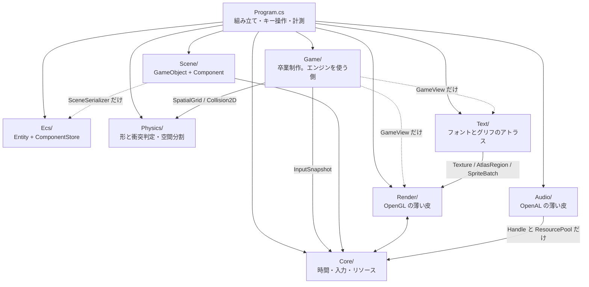
```mermaid
graph TD
    G["Game/<br/>卒業制作。エンジンを使う側"]
    P["Program.cs<br/>組み立て・キー操作・計測"]
    S["Scene/<br/>GameObject + Component"]
    E["Ecs/<br/>Entity + ComponentStore"]
    PH["Physics/<br/>形と衝突判定・空間分割"]
    T["Text/<br/>フォントとグリフのアトラス"]
    R["Render/<br/>OpenGL の薄い皮"]
    A["Audio/<br/>OpenAL の薄い皮"]
    C["Core/<br/>時間・入力・リソース"]

    P --> G
    P --> S
    P --> E
    P --> PH
    P --> T
    P --> R
    P --> A
    P --> C
    G -->|SpatialGrid / Collision2D| PH
    G -->|InputSnapshot| C
    G -.->|GameView だけ| T
    G -.->|GameView だけ| R
    S --> C
    S -.->|SceneSerializer だけ| E
    T -->|Texture / AtlasRegion / SpriteBatch| R
    R <--> C
    A -->|Handle と ResourcePool だけ| C
```

**`Game` から `Audio` への線が無い**のが今日いちばん見てほしいところ。
音は鳴るが、鳴らしているのは `Program` で、ゲームは
「弾を撃った」「敵が死んだ」を <c>OnEvent</c> で外へ投げるだけ。

```csharp
public Action<GameEvent, Vector2>? OnEvent { get; set; }
```

こうしておくと、**自己チェックで 600 秒ぶんを無音で回せる**。
`SurvivorGame` が直接 `_audio.Play` を呼んでいたら、
テストのたびにデバイスを開くことになり、
音の出ない環境ではそもそも動かせない。

同じ理由で `SurvivorGame` は `GameView` も知らない。
**状態を進めるものと、状態を見るもの**が分かれている(Day 19 の線)。

| 層 | 依存先 | 備考 |
|---|---|---|
| `Physics/` | **なし** | `System.Numerics` だけ。そのまま別プロジェクトへ持ち出せる |
| `Ecs/` | **なし** | 同上。Day 23 で「他に依存しないので先に5つ書ける」と書いたとおり |
| `Scene/` | `Core`(`InputSnapshot`)、`Ecs`(`SceneSerializer` のみ) | **描画を一切知らない**。`SpriteRenderer` は絵の種類と大きさを持つデータでしかない |
| `Render/` | `Core`(`Handle` / `ResourceManager`) | `Material` がハンドルを解くために管理側を呼ぶ |
| `Text/` | `Render`(`Texture` / `AtlasRegion` / `SpriteBatch`) | **一方通行**。`Render` は `Text` を知らない |
| `Audio/` | `Core`(`Handle` / `ResourcePool` **のみ**) | **一方通行**。`Core` は `Audio` を知らない |
| **`Game/`** | `Physics` / `Core`(入力)。描画側だけ `Render` と `Text` | **エンジンは `Game` を知らない**。窓も GL も音も知らない |
| `Core/` | `Render`(`Texture` / `Shader`) | `ResourceManager` が両者の実体を握っている |
| `Program.cs` | 全部 | 組み立て役。5249行あるが、その大半はデモ・計測・自己チェック |

`Game/` の中でも線が引いてある。

| ファイル | 知っていること | 知らないこと |
|---|---|---|
| `GameBalance` | 数字だけ | 全部 |
| `SurvivorGame` | 形と当たり判定、空間分割、入力 | 描画、音、窓、GL |
| `GameView` | スプライトの積み方、文字の出し方 | ゲームを進める方法(読むだけ) |

**`GameView` が状態を1文字も書き換えない**のは意図的で、
だから描画を丸ごと止めてもゲームは同じように進む。
自己チェックが窓を出さずに回せるのはこの性質のおかげ。

**`Text/` だけが他の層の上に乗っている**。
`Physics/` も `Audio/` も自分で完結していて、単体で別プロジェクトへ持ち出せるが、
`Text/` は `Render/` が無いと成立しない——グリフを置く先が `Texture` で、
積む先が `SpriteBatch` だから。

これは歪みではなく**素直な積み方**で、`Text` → `Render` の一方通行になっている。
逆向き(`SpriteBatch` が文字を知っている)にすると、
描画の中核が「文字とは何か」を抱え込むことになる。
`SpriteBatch` から見れば、文字は**ただの四角**でしかない。

**`Core` と `Render` が相互参照になっている**のは、この図を描いて初めて見えたことで、
きれいな形ではない。`ResourceManager`(Core)が `Texture`(Render)を作り、
`Material`(Render)が `ResourceManager`(Core)を呼ぶ、という往復になっている。

名前空間が `HonyaEngine` 1つなので今は問題なく動くが、**アセンブリを分けようとした瞬間に破綻する**。
直すなら「`ResourcePool` と `Handle` だけを下層に置き、`ResourceManager` は Render 側に上げる」
のが素直で、Phase 6 でアセットの種類が増えたときに検討する。

**Day 27 の判断**: 音を足すとき、この歪みを繰り返さないようにした。

音のリソースも「パスをキーにして使い回し、ハンドルで配る」という点でテクスチャと同じなので、
`ResourceManager` に `LoadAudio` を足すのが自然に見える。
だがそうすると `ResourceManager`(= `Core`)が **GL と OpenAL の両方を握る**ことになり、
上の相互参照が「`Core` ⇔ `Render` + `Core` ⇔ `Audio`」に増える。

そこで `AudioSystem` は、`Core` から**総称型の `ResourcePool<T>` と `Handle<T>` だけを借りて**、
音のリソースは自分で持つ形にした。`ResourcePool<T>` は `T` が何かを知らないので、
借りても依存が増えない。結果、`Audio/` → `Core/` の**一方通行**が保たれている。

図に描いておくと、こういう判断が「なんとなく」ではなくできるようになる。
**設計書は、次に何かを足すときのために書いている**。

### Core — 時間・入力・リソース

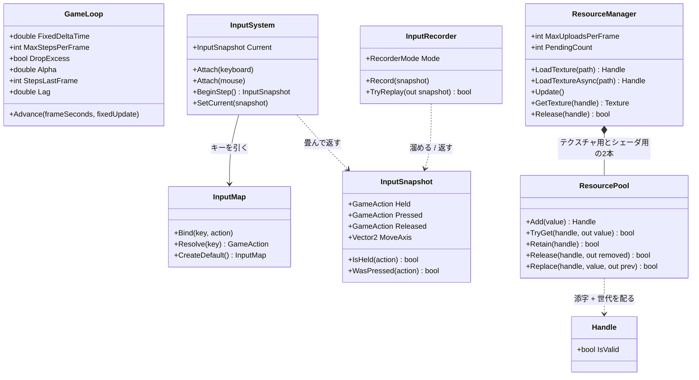
```mermaid
classDiagram
    class GameLoop {
        +double FixedDeltaTime
        +int MaxStepsPerFrame
        +bool DropExcess
        +double Alpha
        +int StepsLastFrame
        +double Lag
        +Advance(frameSeconds, fixedUpdate)
    }
    class InputSystem {
        +InputSnapshot Current
        +Attach(keyboard)
        +Attach(mouse)
        +BeginStep() InputSnapshot
        +SetCurrent(snapshot)
    }
    class InputMap {
        +Bind(key, action)
        +Resolve(key) GameAction
        +CreateDefault() InputMap
    }
    class InputSnapshot {
        +GameAction Held
        +GameAction Pressed
        +GameAction Released
        +Vector2 MoveAxis
        +IsHeld(action) bool
        +WasPressed(action) bool
    }
    class InputRecorder {
        +RecorderMode Mode
        +Record(snapshot)
        +TryReplay(out snapshot) bool
    }
    class Handle {
        +bool IsValid
    }
    class ResourcePool {
        +Add(value) Handle
        +TryGet(handle, out value) bool
        +Retain(handle) bool
        +Release(handle, out removed) bool
        +Replace(handle, value, out prev) bool
    }
    class ResourceManager {
        +int MaxUploadsPerFrame
        +int PendingCount
        +LoadTexture(path) Handle
        +LoadTextureAsync(path) Handle
        +Update()
        +GetTexture(handle) Texture
        +Release(handle) bool
    }

    InputSystem --> InputMap : キーを引く
    InputSystem ..> InputSnapshot : 畳んで返す
    InputRecorder ..> InputSnapshot : 溜める / 返す
    ResourceManager *-- ResourcePool : テクスチャ用とシェーダ用の2本
    ResourcePool ..> Handle : 添字 + 世代を配る
```

`ResourcePool` と `Handle` は総称型(`ResourcePool<T>` / `Handle<T>`)。
`T` が何かを知らないまま添字と世代だけを管理するので、`Texture` にも `Shader` にも同じものが使える。

この層で押さえるべき責務の線引き:

- **`GameLoop` は時間しか知らない**。何を更新するかは `Action<float>` で渡される
- **`InputSystem` はデバイスのイベントを畳むだけ**。ゲームとしての意味づけは `InputMap` が持つ
- **`InputSnapshot` は値**。だから記録・再生で丸ごと差し替えられる(Day 20 の肝)

### Render — OpenGL の薄い皮

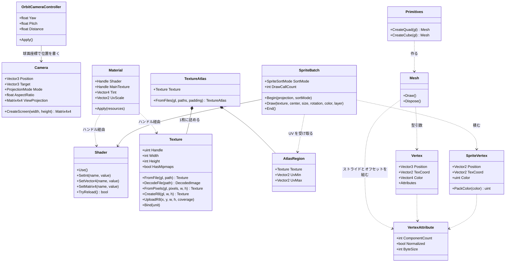
```mermaid
classDiagram
    class Camera {
        +Vector3 Position
        +Vector3 Target
        +ProjectionMode Mode
        +float AspectRatio
        +Matrix4x4 ViewProjection
        +CreateScreen(width, height) Matrix4x4
    }
    class OrbitCameraController {
        +float Yaw
        +float Pitch
        +float Distance
        +Apply()
    }
    class Shader {
        +Use()
        +SetInt(name, value)
        +SetVector4(name, value)
        +SetMatrix4(name, value)
        +TryReload() bool
    }
    class Texture {
        +uint Handle
        +int Width
        +int Height
        +bool HasMipmaps
        +FromFile(gl, path) Texture
        +DecodeFile(path) DecodedImage
        +FromPixels(gl, pixels, w, h) Texture
        +CreateR8(gl, w, h) Texture
        +UploadR8(x, y, w, h, coverage)
        +Bind(unit)
    }
    class TextureAtlas {
        +Texture Texture
        +FromFiles(gl, paths, padding) TextureAtlas
    }
    class AtlasRegion {
        +Texture Texture
        +Vector2 UvMin
        +Vector2 UvMax
    }
    class Material {
        +Handle Shader
        +Handle MainTexture
        +Vector4 Tint
        +Vector2 UvScale
        +Apply(resources)
    }
    class Mesh {
        +Draw()
        +Dispose()
    }
    class Vertex {
        +Vector3 Position
        +Vector2 TexCoord
        +Vector4 Color
        +Attributes
    }
    class SpriteVertex {
        +Vector2 Position
        +Vector2 TexCoord
        +uint Color
        +PackColor(color) uint
    }
    class VertexAttribute {
        +int ComponentCount
        +bool Normalized
        +int ByteSize
    }
    class SpriteBatch {
        +SpriteSortMode SortMode
        +int DrawCallCount
        +Begin(projection, sortMode)
        +Draw(texture, center, size, rotation, color, layer)
        +End()
    }
    class Primitives {
        +CreateQuad(gl) Mesh
        +CreateCube(gl) Mesh
    }

    OrbitCameraController --> Camera : 球面座標で位置を書く
    Material ..> Shader : ハンドル経由
    Material ..> Texture : ハンドル経由
    Mesh ..> VertexAttribute : ストライドとオフセットを組む
    Vertex ..> VertexAttribute
    SpriteVertex ..> VertexAttribute
    Mesh ..> Vertex : 型引数
    Primitives ..> Mesh : 作る
    TextureAtlas *-- AtlasRegion
    TextureAtlas *-- Texture : 1枚に詰める
    SpriteBatch --> Shader
    SpriteBatch ..> SpriteVertex : 積む
    SpriteBatch ..> AtlasRegion : UV を受け取る
```

**Day 28 で `Texture` に足したのは2つだけ**。
`CreateR8` が1チャンネルの空テクスチャを作り、`UploadR8` がその一部を書き換える。
どちらもグリフのために足したものだが、**`Texture` はグリフを知らない**——
「1チャンネル」「一部だけ更新」という一般の機能として置いてある。
同じものが Phase 6 のシャドウマップ(Day 33)でも要る。

**`Material` が何も所有していない**のは Day 15 から一貫している(Day15.md の要点2)。
持っているのはハンドルだけで、実体の寿命は `ResourceManager` にある。

**3D の道(`Mesh` + `Material`)と 2D の道(`SpriteBatch`)が並列**なのも見てのとおりで、
両者は `Shader` と `Texture` を共有しているだけで互いを知らない。
`Mesh` は「形が決まっていて毎フレーム変わらないもの」、
`SpriteBatch` は「毎フレーム頂点を作り直すもの」という使い分けになっている。

### Scene — GameObject + Component

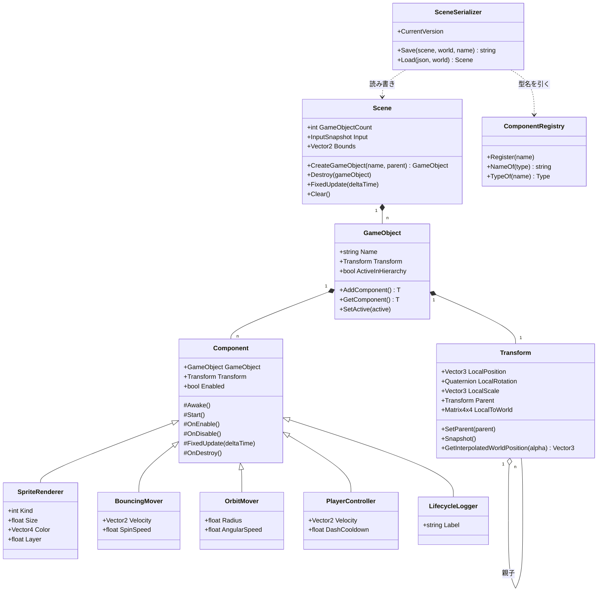
```mermaid
classDiagram
    class Scene {
        +int GameObjectCount
        +InputSnapshot Input
        +Vector2 Bounds
        +CreateGameObject(name, parent) GameObject
        +Destroy(gameObject)
        +FixedUpdate(deltaTime)
        +Clear()
    }
    class GameObject {
        +string Name
        +Transform Transform
        +bool ActiveInHierarchy
        +AddComponent() T
        +GetComponent() T
        +SetActive(active)
    }
    class Transform {
        +Vector3 LocalPosition
        +Quaternion LocalRotation
        +Vector3 LocalScale
        +Transform Parent
        +Matrix4x4 LocalToWorld
        +SetParent(parent)
        +Snapshot()
        +GetInterpolatedWorldPosition(alpha) Vector3
    }
    class Component {
        +GameObject GameObject
        +Transform Transform
        +bool Enabled
        #Awake()
        #Start()
        #OnEnable()
        #OnDisable()
        #FixedUpdate(deltaTime)
        #OnDestroy()
    }
    class SpriteRenderer {
        +int Kind
        +float Size
        +Vector4 Color
        +float Layer
    }
    class BouncingMover {
        +Vector2 Velocity
        +float SpinSpeed
    }
    class OrbitMover {
        +float Radius
        +float AngularSpeed
    }
    class PlayerController {
        +Vector2 Velocity
        +float DashCooldown
    }
    class LifecycleLogger {
        +string Label
    }
    class ComponentRegistry {
        +Register(name)
        +NameOf(type) string
        +TypeOf(name) Type
    }
    class SceneSerializer {
        +CurrentVersion
        +Save(scene, world, name) string
        +Load(json, world) Scene
    }

    Scene "1" *-- "n" GameObject
    GameObject "1" *-- "1" Transform
    GameObject "1" *-- "n" Component
    Transform "1" o-- "n" Transform : 親子
    Component <|-- SpriteRenderer
    Component <|-- BouncingMover
    Component <|-- OrbitMover
    Component <|-- PlayerController
    Component <|-- LifecycleLogger
    SceneSerializer ..> Scene : 読み書き
    SceneSerializer ..> ComponentRegistry : 型名を引く
```

`Transform` だけが `GameObject` の固定メンバーで、ほかは全部 `Component` として付け外しする
(Day 22 の要点2)。`SceneSerializer` が `ComponentRegistry` を経由するのは、
**JSON の文字列から直接 `Type` を作らせない**ため(Day 24 の要点2)。

### Ecs と Physics — どこにも依存しない2つ(今日 `Physics` が増えた)

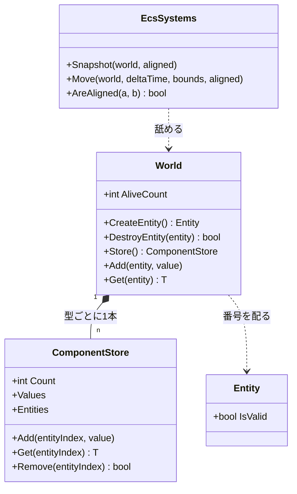
```mermaid
classDiagram
    class Entity {
        +bool IsValid
    }
    class World {
        +int AliveCount
        +CreateEntity() Entity
        +DestroyEntity(entity) bool
        +Store() ComponentStore
        +Add(entity, value)
        +Get(entity) T
    }
    class ComponentStore {
        +int Count
        +Values
        +Entities
        +Add(entityIndex, value)
        +Get(entityIndex) T
        +Remove(entityIndex) bool
    }
    class EcsSystems {
        +Snapshot(world, aligned)
        +Move(world, deltaTime, bounds, aligned)
        +AreAligned(a, b) bool
    }

    World "1" *-- "n" ComponentStore : 型ごとに1本
    World ..> Entity : 番号を配る
    EcsSystems ..> World : 舐める
```

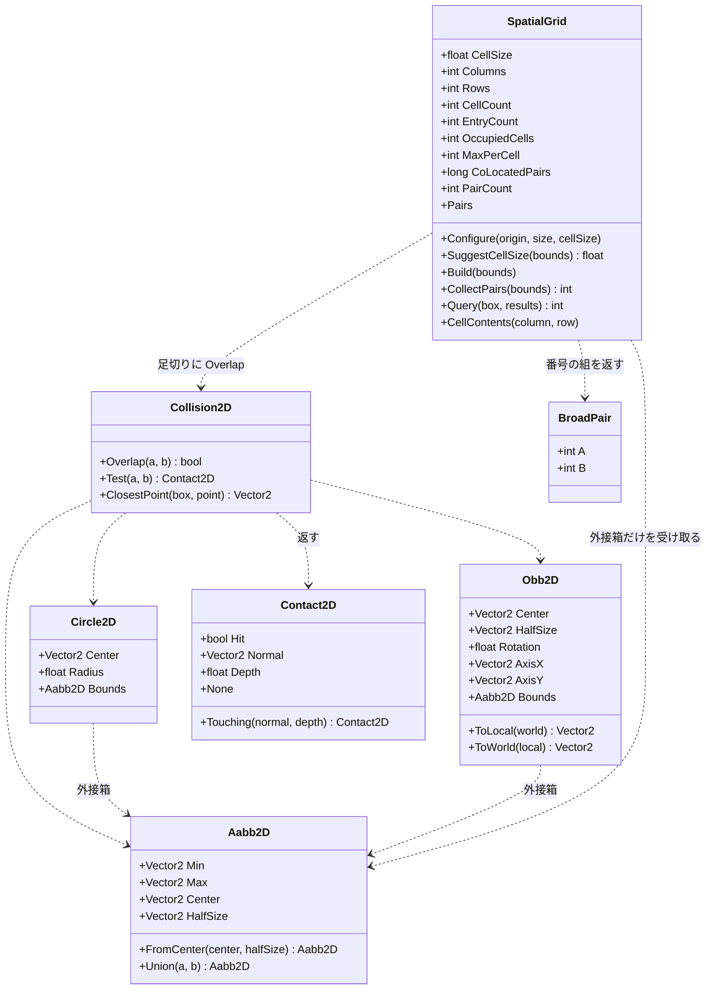
```mermaid
classDiagram
    class Aabb2D {
        +Vector2 Min
        +Vector2 Max
        +Vector2 Center
        +Vector2 HalfSize
        +FromCenter(center, halfSize) Aabb2D
        +Union(a, b) Aabb2D
    }
    class Circle2D {
        +Vector2 Center
        +float Radius
        +Aabb2D Bounds
    }
    class Obb2D {
        +Vector2 Center
        +Vector2 HalfSize
        +float Rotation
        +Vector2 AxisX
        +Vector2 AxisY
        +Aabb2D Bounds
        +ToLocal(world) Vector2
        +ToWorld(local) Vector2
    }
    class Contact2D {
        +bool Hit
        +Vector2 Normal
        +float Depth
        +None
        +Touching(normal, depth) Contact2D
    }
    class Collision2D {
        +Overlap(a, b) bool
        +Test(a, b) Contact2D
        +ClosestPoint(box, point) Vector2
    }
    class BroadPair {
        +int A
        +int B
    }
    class SpatialGrid {
        +float CellSize
        +int Columns
        +int Rows
        +int CellCount
        +int EntryCount
        +int OccupiedCells
        +int MaxPerCell
        +long CoLocatedPairs
        +int PairCount
        +Pairs
        +Configure(origin, size, cellSize)
        +SuggestCellSize(bounds) float
        +Build(bounds)
        +CollectPairs(bounds) int
        +Query(box, results) int
        +CellContents(column, row)
    }

    Collision2D ..> Aabb2D
    Collision2D ..> Circle2D
    Collision2D ..> Obb2D
    Collision2D ..> Contact2D : 返す
    Circle2D ..> Aabb2D : 外接箱
    Obb2D ..> Aabb2D : 外接箱
    SpatialGrid ..> Aabb2D : 外接箱だけを受け取る
    SpatialGrid ..> Collision2D : 足切りに Overlap
    SpatialGrid ..> BroadPair : 番号の組を返す
```

**形は全部 `readonly struct`、判定は `static` メソッドだけ**。状態を持たないので、
どのスレッドから何回呼んでも同じ答えが返る。Day 26 で空間分割を入れたとき、
この性質のおかげで**判定そのものには一切手を入れずに済んだ**——
`Collision2D.cs` と `Shapes2D.cs` の差分は 0 行になっている。

**Day 29 で足したのは `Query` だけ**。
`CollectPairs` が「全部の組」を返すのに対して、
`Query` は「この箱の近くにいるもの」を返す。
1回組んだ格子を、**総当たりの置き換え**としても
**単発の近傍探索**としても使えるようになった——
卒業制作では同じ格子を1ステップに4通りで使っている。

`SpatialGrid` だけが唯一 `class`(参照型)で、しかも状態を持つ。
配列を4本(`_cellStart` / `_cursor` / `_entries` / `_mark`)使い回すためで、
**毎フレーム作り直しても割り当てが起きない**ようにするにはこうするしかない。
そのぶん「1つのインスタンスを複数スレッドから同時に使えない」という制約が付く。
状態を持つと何が失われるかが、同じフォルダの中で見比べられる形になっている。

矢印の向きにも注目してほしい。**`SpatialGrid` から `Body` への線が無い**。
受け取るのは `ReadOnlySpan<Aabb2D>`、返すのは番号の組だけで、
速度も形も質量も知らない。この細さのおかげで、
Day 46 の 3D 版は `Aabb2D` を `Aabb3D` に変えるだけで済む。

### Audio — OpenAL の薄い皮

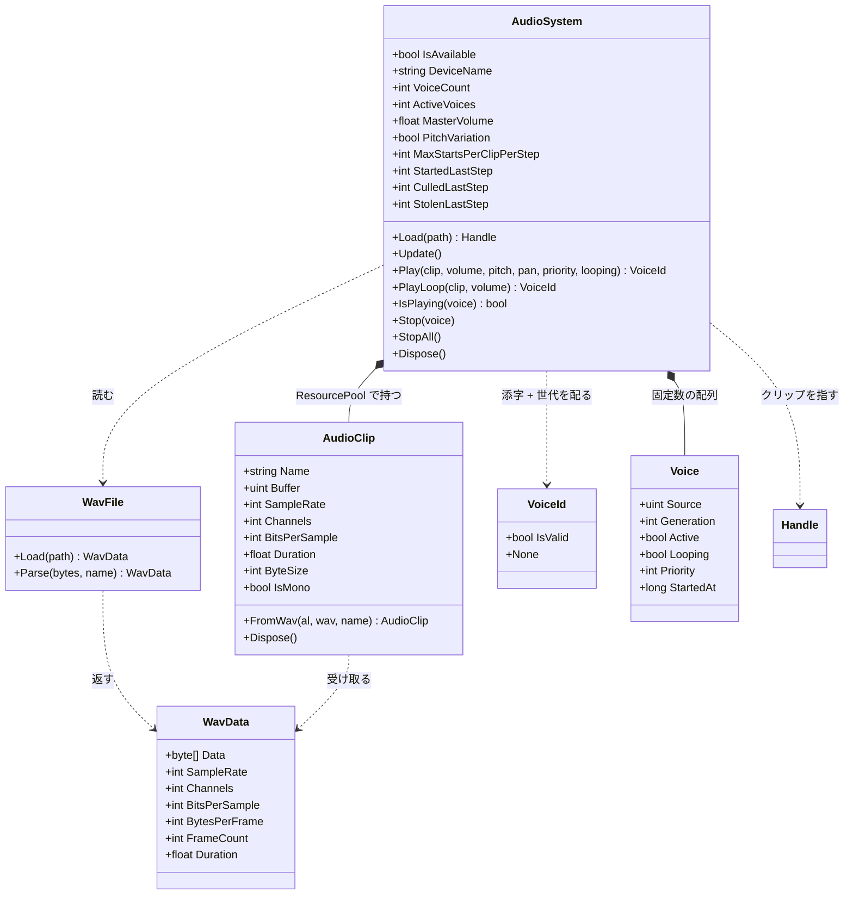
```mermaid
classDiagram
    class WavData {
        +byte[] Data
        +int SampleRate
        +int Channels
        +int BitsPerSample
        +int BytesPerFrame
        +int FrameCount
        +float Duration
    }
    class WavFile {
        +Load(path) WavData
        +Parse(bytes, name) WavData
    }
    class AudioClip {
        +string Name
        +uint Buffer
        +int SampleRate
        +int Channels
        +int BitsPerSample
        +float Duration
        +int ByteSize
        +bool IsMono
        +FromWav(al, wav, name) AudioClip
        +Dispose()
    }
    class VoiceId {
        +bool IsValid
        +None
    }
    class AudioSystem {
        +bool IsAvailable
        +string DeviceName
        +int VoiceCount
        +int ActiveVoices
        +float MasterVolume
        +bool PitchVariation
        +int MaxStartsPerClipPerStep
        +int StartedLastStep
        +int CulledLastStep
        +int StolenLastStep
        +Load(path) Handle
        +Update()
        +Play(clip, volume, pitch, pan, priority, looping) VoiceId
        +PlayLoop(clip, volume) VoiceId
        +IsPlaying(voice) bool
        +Stop(voice)
        +StopAll()
        +Dispose()
    }
    class Voice {
        +uint Source
        +int Generation
        +bool Active
        +bool Looping
        +int Priority
        +long StartedAt
    }

    WavFile ..> WavData : 返す
    AudioClip ..> WavData : 受け取る
    AudioSystem ..> WavFile : 読む
    AudioSystem *-- AudioClip : ResourcePool で持つ
    AudioSystem *-- Voice : 固定数の配列
    AudioSystem ..> VoiceId : 添字 + 世代を配る
    AudioSystem ..> Handle : クリップを指す
```

`Voice` は `AudioSystem` の中の `private struct`。外からは `VoiceId` 越しにしか触れない。

この層で押さえるべき線引きは3つ。

- **`WavFile` は OpenAL を知らない**。ただのバイト列パーサなので、
  ファイルが無くてもメモリ上のバイト列で試せる(自己チェックがそうしている)
- **`AudioClip` はデータ、`Voice` は再生**(要点2)。
  `Texture` と `Material`、`Mesh` と描画呼び出しと同じ分け方
- **`VoiceId` は `Handle<T>` と同じ構造**(添字 + 世代)だが**別の型**。
  `Handle<T>` は `ResourcePool<T>` のためのもので、ボイスはプールではないので流用しない。
  同じ手口を別の場所で使い直している、と読むのが正しい

### Text — Render の上に積む層

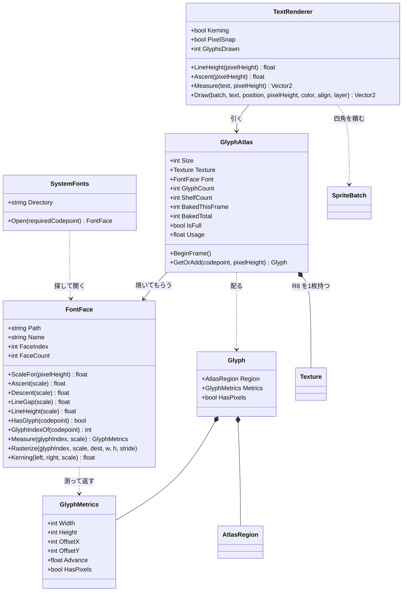
```mermaid
classDiagram
    class SystemFonts {
        +string Directory
        +Open(requiredCodepoint) FontFace
    }
    class FontFace {
        +string Path
        +string Name
        +int FaceIndex
        +int FaceCount
        +ScaleFor(pixelHeight) float
        +Ascent(scale) float
        +Descent(scale) float
        +LineGap(scale) float
        +LineHeight(scale) float
        +HasGlyph(codepoint) bool
        +GlyphIndexOf(codepoint) int
        +Measure(glyphIndex, scale) GlyphMetrics
        +Rasterize(glyphIndex, scale, dest, w, h, stride)
        +Kerning(left, right, scale) float
    }
    class GlyphMetrics {
        +int Width
        +int Height
        +int OffsetX
        +int OffsetY
        +float Advance
        +bool HasPixels
    }
    class Glyph {
        +AtlasRegion Region
        +GlyphMetrics Metrics
        +bool HasPixels
    }
    class GlyphAtlas {
        +int Size
        +Texture Texture
        +FontFace Font
        +int GlyphCount
        +int ShelfCount
        +int BakedThisFrame
        +int BakedTotal
        +bool IsFull
        +float Usage
        +BeginFrame()
        +GetOrAdd(codepoint, pixelHeight) Glyph
    }
    class TextRenderer {
        +bool Kerning
        +bool PixelSnap
        +int GlyphsDrawn
        +LineHeight(pixelHeight) float
        +Ascent(pixelHeight) float
        +Measure(text, pixelHeight) Vector2
        +Draw(batch, text, position, pixelHeight, color, align, layer) Vector2
    }

    SystemFonts ..> FontFace : 探して開く
    FontFace ..> GlyphMetrics : 測って返す
    GlyphAtlas --> FontFace : 焼いてもらう
    GlyphAtlas *-- Texture : R8 を1枚持つ
    GlyphAtlas ..> Glyph : 配る
    Glyph *-- AtlasRegion
    Glyph *-- GlyphMetrics
    TextRenderer --> GlyphAtlas : 引く
    TextRenderer ..> SpriteBatch : 四角を積む
```

4つのクラスが、**それぞれ1つのことしかしない**ように切ってある。

| クラス | 知っていること | 知らないこと |
|---|---|---|
| `SystemFonts` | どこにフォントがあるか | 描き方 |
| `FontFace` | フォントの中身(寸法とアウトライン) | GL、アトラス、レイアウト |
| `GlyphAtlas` | どこに置いたか、何を焼いたか | 文字の並べ方 |
| `TextRenderer` | 並べ方(送り・行送り・整列) | フォントの中身、GL |

この切り方の値打ちは、**差し替えたときにどこまで壊れるか**で分かる。
SDF に変える(改造課題3)なら `GlyphAtlas` と `text.frag` だけが変わり、
`TextRenderer` は 1 行も触らない。
フォントフォールバックを入れる(改造課題2)なら `FontFace` を複数持つだけで、
`GlyphAtlas` の棚詰めには影響しない。

**`GlyphMetrics` が `FontFace` と `TextRenderer` の共通語**になっている。
「原点からどれだけずらして、次にどれだけ進むか」——
この5つの数字さえあれば、フォントの実装が何であれ字を並べられる。

### Game — エンジンを使う側

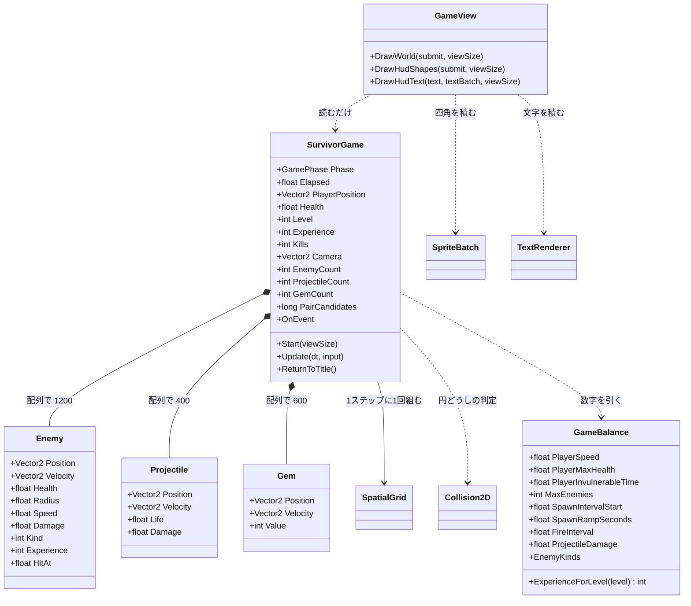
```mermaid
classDiagram
    class GameBalance {
        +float PlayerSpeed
        +float PlayerMaxHealth
        +float PlayerInvulnerableTime
        +int MaxEnemies
        +float SpawnIntervalStart
        +float SpawnRampSeconds
        +float FireInterval
        +float ProjectileDamage
        +EnemyKinds
        +ExperienceForLevel(level) int
    }
    class Enemy {
        +Vector2 Position
        +Vector2 Velocity
        +float Health
        +float Radius
        +float Speed
        +float Damage
        +int Kind
        +int Experience
        +float HitAt
    }
    class Projectile {
        +Vector2 Position
        +Vector2 Velocity
        +float Life
        +float Damage
    }
    class Gem {
        +Vector2 Position
        +Vector2 Velocity
        +int Value
    }
    class SurvivorGame {
        +GamePhase Phase
        +float Elapsed
        +Vector2 PlayerPosition
        +float Health
        +int Level
        +int Experience
        +int Kills
        +Vector2 Camera
        +int EnemyCount
        +int ProjectileCount
        +int GemCount
        +long PairCandidates
        +OnEvent
        +Start(viewSize)
        +Update(dt, input)
        +ReturnToTitle()
    }
    class GameView {
        +DrawWorld(submit, viewSize)
        +DrawHudShapes(submit, viewSize)
        +DrawHudText(text, textBatch, viewSize)
    }

    SurvivorGame *-- Enemy : 配列で 1200
    SurvivorGame *-- Projectile : 配列で 400
    SurvivorGame *-- Gem : 配列で 600
    SurvivorGame --> SpatialGrid : 1ステップに1回組む
    SurvivorGame ..> Collision2D : 円どうしの判定
    SurvivorGame ..> GameBalance : 数字を引く
    GameView ..> SurvivorGame : 読むだけ
    GameView ..> SpriteBatch : 四角を積む
    GameView ..> TextRenderer : 文字を積む
```

**`Enemy` / `Projectile` / `Gem` が `struct`** なのが要点。
1200 体ぶんの参照を辿ると、メモリ上ばらばらの場所を読むことになる
(Day 22 で実測した 17 倍がこれ)。構造体の配列なら、
更新ループは連続したメモリを頭から舐めるだけで済む。

**Day 23 の ECS は使っていない**。
ECS が効くのは「部品の組み合わせが実行時に変わる」ときで、
今日のように<b>敵は敵、弾は弾と決まっている</b>なら、
種類ごとに配列を1本持つほうが素直で速い。
Day 23 で「ECS は構造体の配列の一般化」と書いたが、
**一般化が要らない場面では特殊形のままでよい**——
これは ECS が無駄だったという話ではなく、
<b>どちらを選ぶかを判断できるようになった</b>という話になる。

`GameBalance` に矢印が集まっているのも意図したもの。
遊んで気になったことは全部ここを触ることになるので、
**数字がコードの中に散らばっていると調整が苦行になる**。

### 1フレームの流れ

Silk.NET のウィンドウから `OnUpdate` と `OnRender` が交互に呼ばれる。
**状態を変えるのは `OnUpdate` 側だけ**、というのが Day 19 で引いた線。

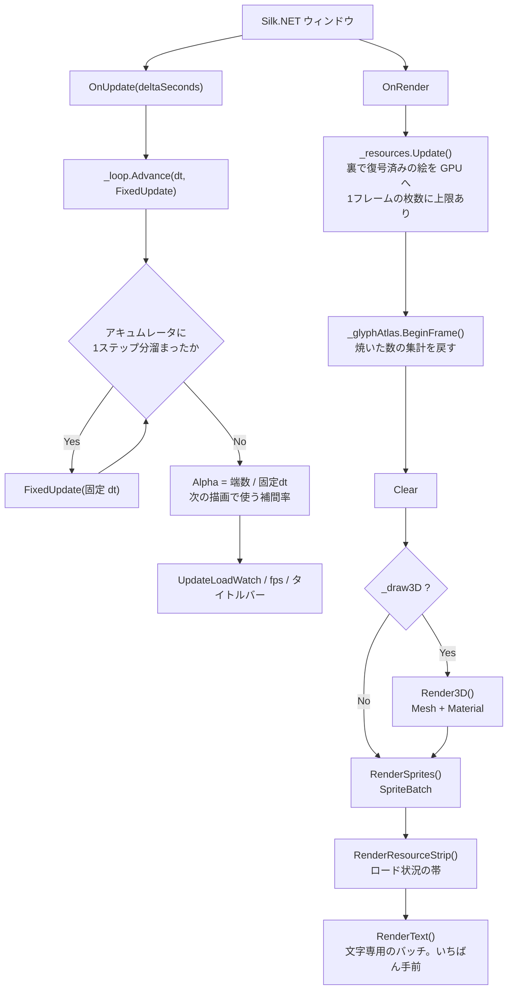
```mermaid
flowchart TD
    W["Silk.NET ウィンドウ"] --> U["OnUpdate(deltaSeconds)"]
    U --> A["_loop.Advance(dt, FixedUpdate)"]
    A --> Q{"アキュムレータに<br/>1ステップ分溜まったか"}
    Q -->|Yes| F["FixedUpdate(固定 dt)"]
    F --> Q
    Q -->|No| AL["Alpha = 端数 / 固定dt<br/>次の描画で使う補間率"]
    AL --> LW["UpdateLoadWatch / fps / タイトルバー"]

    W --> R["OnRender"]
    R --> RU["_resources.Update()<br/>裏で復号済みの絵を GPU へ<br/>1フレームの枚数に上限あり"]
    RU --> GA["_glyphAtlas.BeginFrame()<br/>焼いた数の集計を戻す"]
    GA --> CL["Clear"]
    CL --> D3{"_draw3D ?"}
    D3 -->|Yes| R3["Render3D()<br/>Mesh + Material"]
    D3 -->|No| RS
    R3 --> RS["RenderSprites()<br/>SpriteBatch"]
    RS --> ST["RenderResourceStrip()<br/>ロード状況の帯"]
    ST --> TX["RenderText()<br/>文字専用のバッチ。いちばん手前"]
```

**Day 29 で分岐が1つ増えた**。ゲームモード(Enter)のときは
`Render3D` も `RenderSprites` も `RenderResourceStrip` も通らず、
`RenderGame()` だけになる。
デモの重い部分を裏で回したまま遊ぶと、
「ゲームが重い」のか「デモが重い」のか分からなくなるため。

**`RenderText` がいちばん最後**なのは、UI が何よりも手前に出るものだから。
バッチが別なのは、シェーダが違うため——
グリフのアトラスは1チャンネルなので `sprite.frag` では真っ黒になる。
**バッチは「同じ設定で描けるものをまとめる」仕組み**なので、
シェーダが違えば別のバッチになるのは定義どおりの帰結。

`OnRender` の先頭で `_resources.Update()` を呼ぶのが要点で、
**GL は描画スレッドからしか触れない**ため、裏で復号し終えた画素をここで GPU に上げている
(Day 21 の要点5・6)。

### FixedUpdate の中身 — 入力の出どころと3つのバックエンド

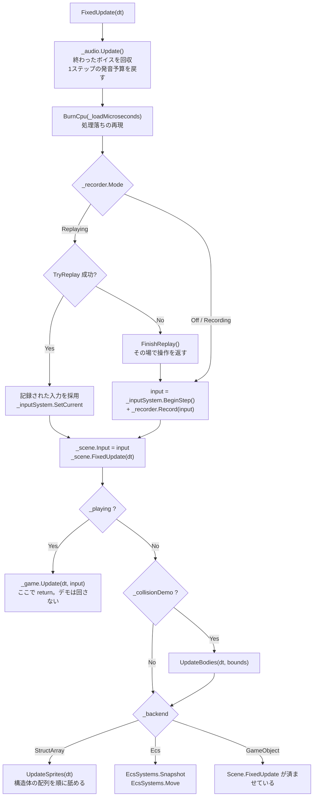
```mermaid
flowchart TD
    S["FixedUpdate(dt)"] --> AU["_audio.Update()<br/>終わったボイスを回収<br/>1ステップの発音予算を戻す"]
    AU --> B["BurnCpu(_loadMicroseconds)<br/>処理落ちの再現"]
    B --> M{"_recorder.Mode"}
    M -->|Replaying| TR{"TryReplay 成功?"}
    TR -->|Yes| SC["記録された入力を採用<br/>_inputSystem.SetCurrent"]
    TR -->|No| FR["FinishReplay()<br/>その場で操作を返す"]
    FR --> BS
    M -->|Off / Recording| BS["input = _inputSystem.BeginStep()<br/>+ _recorder.Record(input)"]
    SC --> SF
    BS --> SF["_scene.Input = input<br/>_scene.FixedUpdate(dt)"]
    SF --> PG{"_playing ?"}
    PG -->|Yes| GM["_game.Update(dt, input)<br/>ここで return。デモは回さない"]
    PG -->|No| CD{"_collisionDemo ?"}
    CD -->|Yes| UB["UpdateBodies(dt, bounds)"]
    CD -->|No| BK
    UB --> BK{"_backend"}
    BK -->|StructArray| US["UpdateSprites(dt)<br/>構造体の配列を順に舐める"]
    BK -->|Ecs| ES["EcsSystems.Snapshot<br/>EcsSystems.Move"]
    BK -->|GameObject| GO["Scene.FixedUpdate が済ませている"]
```

**音の後始末を先頭に置いた**のは、音を要求するのがこの下だから。
予算を戻す場所と使う場所を近くに置くと、「いつリセットされるのか」を追う必要がなくなる。
描画側(`OnRender`)に置くと、シミュレーションが 5Hz のときに
「1フレームに複数ステップぶんの音が要求されるのに予算は 1 回ぶん」というずれが起きる。

**入力がどこから来たかを、この関数から下は誰も気にしない**のがポイント(Day 20 の要点1)。
`InputSnapshot` という値に畳んであるので、記録の再生と実操作を1行で差し替えられる。

`Scene.FixedUpdate` を `_backend` の分岐より前で必ず呼んでいるのは、
**プレイヤーと階層の実演がどのモードでも Scene 側にいる**ため。

### Scene.FixedUpdate の4段階

順番に意味がある。入れ替えると壊れる。

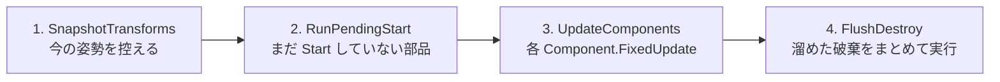
```mermaid
flowchart LR
    A["1. SnapshotTransforms<br/>今の姿勢を控える"]
    B["2. RunPendingStart<br/>まだ Start していない部品"]
    C["3. UpdateComponents<br/>各 Component.FixedUpdate"]
    D["4. FlushDestroy<br/>溜めた破棄をまとめて実行"]
    A --> B --> C --> D
```

| 段 | なぜその位置か |
|---|---|
| 1 | **動かす前**に控えないと、補間の始点が終点と同じになって補間が効かない |
| 2 | `Start` の中で新しいオブジェクトが生まれるので、**開始時点の件数だけ**回す |
| 3 | ここも開始時点の件数で止める。このステップで生まれたものは次のステップから |
| 4 | 更新中にリストから消すと**走査中のインデックスがずれる**(Day 22 の要点5)。<br/>まとめて `RemoveAll` するのは、1個ずつ消すと O(n^2) になるため |

### 非同期テクスチャロードの流れ

`Q` キーで走る道。**GL を呼ぶ部分と呼ばない部分の境目**が、
そのままスレッドの境目になっている(Day 21 の要点5)。

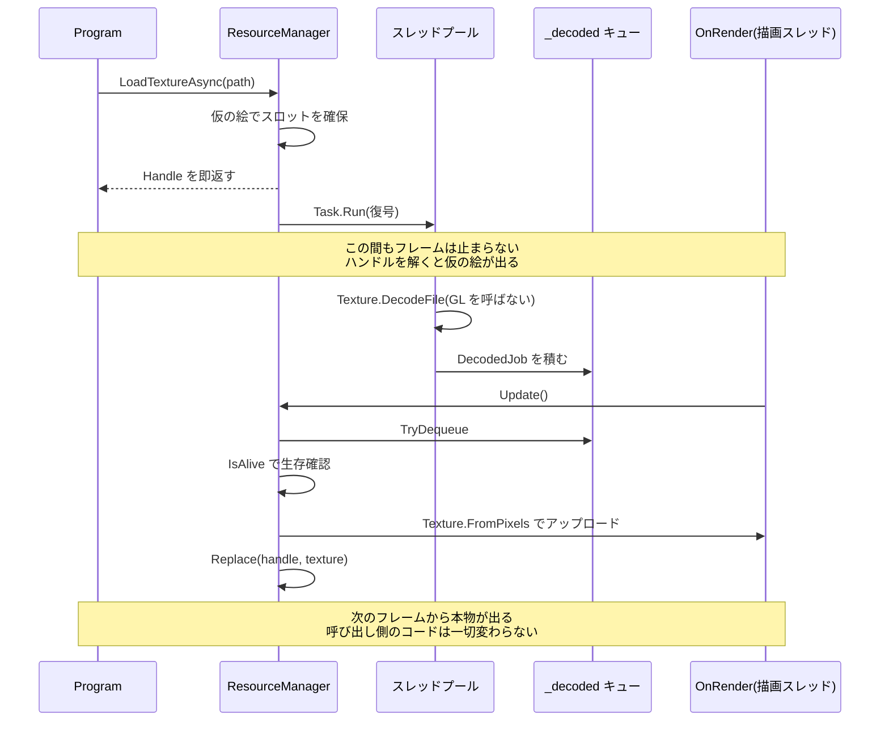
```mermaid
sequenceDiagram
    participant P as Program
    participant RM as ResourceManager
    participant TP as スレッドプール
    participant Q as _decoded キュー
    participant GL as OnRender(描画スレッド)

    P->>RM: LoadTextureAsync(path)
    RM->>RM: 仮の絵でスロットを確保
    RM-->>P: Handle を即返す
    RM->>TP: Task.Run(復号)
    Note over P,GL: この間もフレームは止まらない<br/>ハンドルを解くと仮の絵が出る
    TP->>TP: Texture.DecodeFile(GL を呼ばない)
    TP->>Q: DecodedJob を積む
    GL->>RM: Update()
    RM->>Q: TryDequeue
    RM->>RM: IsAlive で生存確認
    RM->>GL: Texture.FromPixels でアップロード
    RM->>RM: Replace(handle, texture)
    Note over P,GL: 次のフレームから本物が出る<br/>呼び出し側のコードは一切変わらない
```

`Update()` が `MaxUploadsPerFrame` で枚数を絞っているのが肝で、
**復号を非同期にしても、アップロードをまとめてやるとそこでカクつく**(Day 21 の要点6)。

### 衝突判定の3段 — ブロードフェーズが割り込んだ

Day 25 の `UpdateBodies` は「動かす → 総当たり → 押し戻す」の3段だった。
今日、真ん中が**「組を絞る」と「絞った組を判定する」に割れる**。

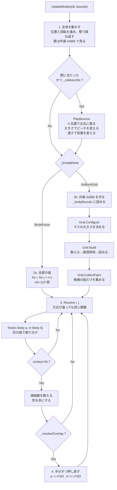
```mermaid
flowchart TD
    S["UpdateBodies(dt, bounds)"] --> MV["1. 全体を動かす<br/>位置と回転を進め、壁で跳ね返す<br/>壁は外接 AABB で見る"]
    MV --> SFX{"壁に当たった<br/>かつ _collisionSfx ?"}
    SFX -->|Yes| PB["PlayBounce<br/>X 位置で左右に振る<br/>大きさでピッチを変える<br/>速さで音量を変える"]
    SFX -->|No| BP
    PB --> BP{"_broadphase"}

    BP -->|BruteForce| BF["2a. 全部の組<br/>for i, for j = i+1<br/>n(n-1)/2 組"]
    BP -->|UniformGrid| GB["2b. 外接 AABB を作る<br/>_bodyBounds に詰める"]
    GB --> GC["Grid.Configure<br/>マスの大きさを決める"]
    GC --> GD["Grid.Build<br/>数える→接頭辞和→詰める"]
    GD --> GP["Grid.CollectPairs<br/>候補の組だけを集める"]

    BF --> NR["3. Resolve i, j<br/>方式が違っても同じ関数"]
    GP --> NR
    NR --> T["Test(in Body a, in Body b)<br/>形の組で振り分け"]
    T --> H{"contact.Hit ?"}
    H -->|No| NR
    H -->|Yes| CNT["接触数を数える<br/>色を赤にする"]
    CNT --> RV{"_resolveOverlap ?"}
    RV -->|Yes| PS["4. 半分ずつ押し戻す<br/>a -= n*d/2 , b += n*d/2"]
    RV -->|No| NR
    PS --> NR
```

発音の要求が**移動の段にある**ことに注意。
「壁に当たった」はブロードフェーズの外で分かることなので、
組の絞り込みとは無関係にここで出る。
体どうしの接触音を鳴らすなら `Resolve` の中になるが、
2000 体で 7,425 組が接触しているので**要求だけで 7,425 回**になる。
要点3の 7.3μs を掛けると 54ms。今日は壁だけにしてある。

図で見てほしいのは**2つの経路が `Resolve` で合流している**ところ。
方式ごとにナローフェーズを書き分けると、
「答えが違う」となったときに原因がブロードフェーズなのか判定なのか分からなくなる。
合流させておけば、**違いが出たら必ず組の選び方が原因**と言い切れる。
`F12` の自己チェックが「接触数が一致」だけで意味を持つのはこの形のおかげ。

もうひとつ、**押し戻し(4段目)がグリッドの構築より後にある**ことに注意。
押し戻すと位置が動くので、ステップの頭で組んだ格子は少しずつ古くなる。
押し戻し量は 1 ステップぶんの重なりぶんしかないので実用上は問題にならないが、
厳密にやるなら「判定を全部済ませてから、まとめて押し戻す」形にする。
Phase 7 のインパルス解決がその形になる。

### 均一グリッドの中身 — 2つの関数しかない

`SpatialGrid` の公開メソッドは実質 `Build` と `CollectPairs` の2つだけ。
中で何が起きているかは、コードを読むより図のほうが早い。

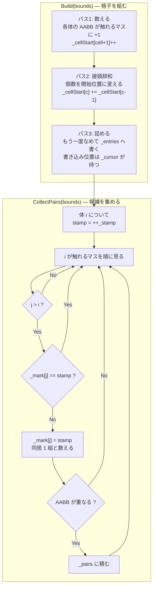
```mermaid
flowchart TD
    subgraph B["Build(bounds) — 格子を組む"]
        B1["パス1: 数える<br/>各体の AABB が触れるマスに +1<br/>_cellStart[cell+1]++"]
        B2["パス2: 接頭辞和<br/>個数を開始位置に変える<br/>_cellStart[c] += _cellStart[c-1]"]
        B3["パス3: 詰める<br/>もう一度なめて _entries へ書く<br/>書き込み位置は _cursor が持つ"]
        B1 --> B2 --> B3
    end

    subgraph C["CollectPairs(bounds) — 候補を集める"]
        C1["体 i について<br/>stamp = ++_stamp"]
        C2["i が触れるマスを順に見る"]
        C3{"j > i ?"}
        C4{"_mark[j] == stamp ?"}
        C5["_mark[j] = stamp<br/>同居 1 組と数える"]
        C6{"AABB が重なる ?"}
        C7["_pairs に積む"]
        C1 --> C2 --> C3
        C3 -->|No| C2
        C3 -->|Yes| C4
        C4 -->|Yes| C2
        C4 -->|No| C5 --> C6
        C6 -->|No| C2
        C6 -->|Yes| C7 --> C2
    end

    B3 --> C1
```

3つの絞りが直列に並んでいるのが分かる。

| 絞り | 落とすもの | 4000 体での実測(マス 32px) |
|---|---|---|
| 格子 | 別のマスにいる組 | 7,998,000 → 72,527 |
| `j > i` と印 | 同じ組の重複 | (上の数に含まれる) |
| AABB | 同じマスだが離れている組 | 72,527 → 24,733 |

**最後の AABB がまだ 3 分の 1 に減らしている**のが面白いところで、
「同じマスにいる」は「近い」でしかない。
7.4ns の AABB 判定を挟むことで、24〜120ns のナローフェーズを 5 万回節約している。

`j > i` の条件だけでは重複が消えないことは、実際に印を外すと確かめられる
(自己チェックの「重複した組が無い」が落ちる)。

`Test(in Body, in Body)` の中身は形の組み合わせ表そのもの。**3種類で6通り**になる。

| a \ b | Circle | Box | RotatedBox |
|---|---|---|---|
| **Circle** | `Test(Circle, Circle)` | `Test(Circle, Aabb)` | `Test(Circle, Obb)` |
| **Box** | 上を**符号反転** | `Test(Aabb, Aabb)` | OBB 同士へ寄せる |
| **RotatedBox** | 上を**符号反転** | OBB 同士へ寄せる | `Test(Obb, Obb)` SAT |

- **専用の速い経路**(AABB 同士、円同士)と**一般形**(OBB 同士の SAT)を併存させ、
  組み合わせの穴は一般形で埋める。`F9` の自己チェックで**両者の答えが一致すること**を確認している
- 引数の順が逆になる組(`Test(Box, Circle)`)は**法線の符号を反転**して返す。
  ここを間違えると物体がめり込む方向へ押される(要点6)
- 種類を1つ足すと表が1行1列増える。3D で球・箱・カプセル・平面・地形と並べると 15 通りになり、
  **その表を埋めることが物理エンジンを書くこと**になる(Phase 7)

### 音を1発鳴らすまで — 3つの関門

`Play` を呼んでから実際に音が出るまでに、3回ふるいにかけられる。
**呼んだのに鳴らないことは普通に起きる**ので、どこで落ちたかを数えられるようにしてある。

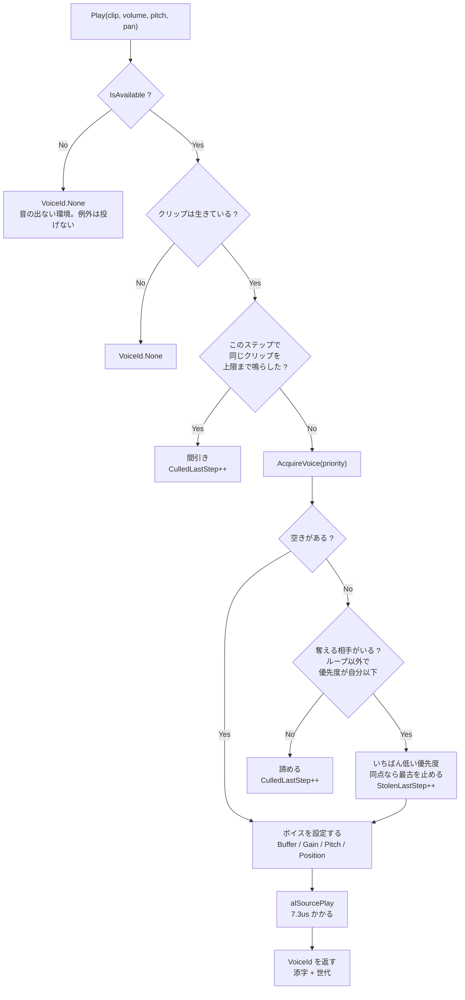
```mermaid
flowchart TD
    S["Play(clip, volume, pitch, pan)"] --> A{"IsAvailable ?"}
    A -->|No| N1["VoiceId.None<br/>音の出ない環境。例外は投げない"]
    A -->|Yes| B{"クリップは生きている ?"}
    B -->|No| N2["VoiceId.None"]
    B -->|Yes| C{"このステップで<br/>同じクリップを<br/>上限まで鳴らした ?"}
    C -->|Yes| N3["間引き<br/>CulledLastStep++"]
    C -->|No| D["AcquireVoice(priority)"]
    D --> E{"空きがある ?"}
    E -->|Yes| G["ボイスを設定する<br/>Buffer / Gain / Pitch / Position"]
    E -->|No| F{"奪える相手がいる ?<br/>ループ以外で<br/>優先度が自分以下"}
    F -->|No| N4["諦める<br/>CulledLastStep++"]
    F -->|Yes| ST["いちばん低い優先度<br/>同点なら最古を止める<br/>StolenLastStep++"]
    ST --> G
    G --> H["alSourcePlay<br/>7.3us かかる"]
    H --> I["VoiceId を返す<br/>添字 + 世代"]
```

**「諦める」が2箇所ある**のが要点。
間引き(`C`)は「同じ音が多すぎる」で落とし、
`F` は「ボイスが足りず、しかも自分より偉い音しか鳴っていない」で落とす。
前者は音として意味が無いから落とすので**積極的**、
後者は資源が足りないから落とすので**消極的**。
タイトルバーで両方を分けて数えているのは、この2つが違う対処を要求するため
(前者は上限を調整する、後者はボイスを増やす)。

### 1文字が画面に出るまで — 4つの層を通り抜ける

`Draw("あ", ...)` を呼んでから画面に出るまでに何が起きるか。
**初回だけ通る道**(焼く)と、**毎回通る道**(引く・積む)が分かれているのが要点。

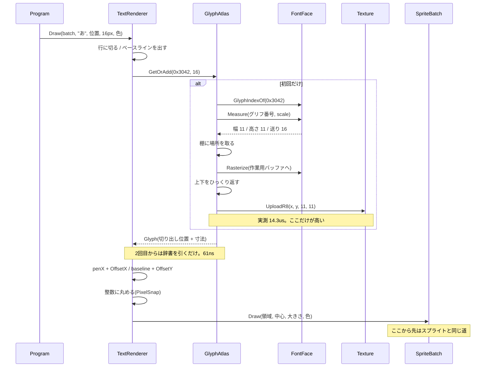
```mermaid
sequenceDiagram
    participant P as Program
    participant TR as TextRenderer
    participant GA as GlyphAtlas
    participant FF as FontFace
    participant TX as Texture
    participant SB as SpriteBatch

    P->>TR: Draw(batch, "あ", 位置, 16px, 色)
    TR->>TR: 行に切る / ベースラインを出す
    TR->>GA: GetOrAdd(0x3042, 16)

    alt 初回だけ
        GA->>FF: GlyphIndexOf(0x3042)
        GA->>FF: Measure(グリフ番号, scale)
        FF-->>GA: 幅 11 / 高さ 11 / 送り 16
        GA->>GA: 棚に場所を取る
        GA->>FF: Rasterize(作業用バッファへ)
        GA->>GA: 上下をひっくり返す
        GA->>TX: UploadR8(x, y, 11, 11)
        Note over GA,TX: 実測 14.3us。ここだけが高い
    end

    GA-->>TR: Glyph(切り出し位置 + 寸法)
    Note over TR,GA: 2回目からは辞書を引くだけ。61ns

    TR->>TR: penX + OffsetX / baseline + OffsetY
    TR->>TR: 整数に丸める(PixelSnap)
    TR->>SB: Draw(領域, 中心, 大きさ, 色)
    Note over SB: ここから先はスプライトと同じ道
```

図で見てほしいのは、**`alt` の中が初回にしか走らない**こと。
14.3us と 61ns の差は 234 倍あり、**キャッシュを持つかどうかがそのまま性能**になる。
だからアトラスは「使い回すためのもの」であって、
描画をまとめるため(Day 17 の動機)だけのものではない。

もうひとつ、**`TextRenderer` から `Texture` への線が無い**。
グリフを焼く判断も、GL を触るのも、全部 `GlyphAtlas` の中で閉じている。
`TextRenderer` から見れば「文字を渡すと切り出し位置が返ってくる」だけで、

### ゲームの1ステップ — 11 段の順番と、格子の使い回し

`SurvivorGame.Update` は 11 段でできている。**順番に意味がある**。

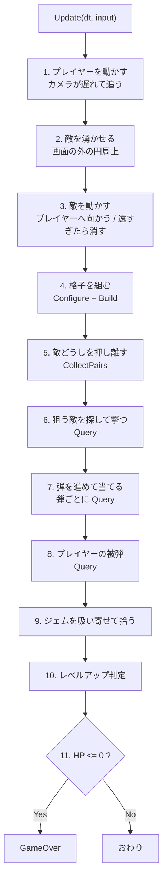
```mermaid
flowchart TD
    S["Update(dt, input)"] --> P1["1. プレイヤーを動かす<br/>カメラが遅れて追う"]
    P1 --> P2["2. 敵を湧かせる<br/>画面の外の円周上"]
    P2 --> P3["3. 敵を動かす<br/>プレイヤーへ向かう / 遠すぎたら消す"]
    P3 --> P4["4. 格子を組む<br/>Configure + Build"]
    P4 --> P5["5. 敵どうしを押し離す<br/>CollectPairs"]
    P5 --> P6["6. 狙う敵を探して撃つ<br/>Query"]
    P6 --> P7["7. 弾を進めて当てる<br/>弾ごとに Query"]
    P7 --> P8["8. プレイヤーの被弾<br/>Query"]
    P8 --> P9["9. ジェムを吸い寄せて拾う"]
    P9 --> P10["10. レベルアップ判定"]
    P10 --> P11{"11. HP <= 0 ?"}
    P11 -->|Yes| GO["GameOver"]
    P11 -->|No| E["おわり"]
```

入れ替えると壊れるところ:

| 順番 | なぜそこか |
|---|---|
| 4 が 3 の後 | 動かす前に組むと、**1ステップ古い位置**で判定することになる |
| 5〜8 が 4 の後 | 全部**同じ格子**を使う。組み直すと4倍のコストになる |
| 10 が 9 の後 | ジェムを拾ってからでないと、レベルが1ステップ遅れる |

**格子を1回組んで4通りに使う**のが今日いちばんの節約になっている。

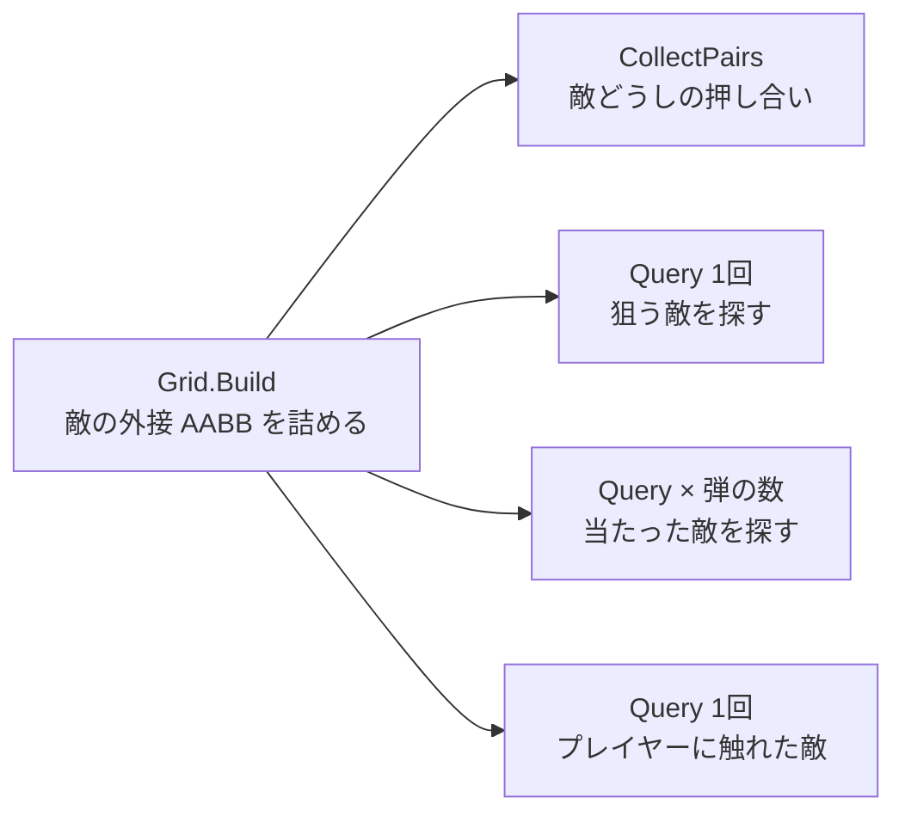
```mermaid
flowchart LR
    B["Grid.Build<br/>敵の外接 AABB を詰める"]
    B --> Q1["CollectPairs<br/>敵どうしの押し合い"]
    B --> Q2["Query 1回<br/>狙う敵を探す"]
    B --> Q3["Query × 弾の数<br/>当たった敵を探す"]
    B --> Q4["Query 1回<br/>プレイヤーに触れた敵"]
```

実測(敵 509 体):

| | 組の数 |
|---|---|
| 総当たりなら | 129,286 組 |
| 格子の候補 | **594 組** |

**99.5% 減っている**。押し合いは「全員対全員」なので、
格子が無ければこの演出はそもそも載らない(Day 26 の要点5)。

そして 2〜4 は `CollectPairs` ではなく `Query` を使う。
**1対多は組の列挙では表せない**——
弾1発について「近くにいる敵」を知りたいだけなので、
全部の組を作ってから絞るのは無駄になる。
## 完成条件

```
dotnet run --project reference/Day29 -c Release
```

起動したら `Enter`。タイトルが出るのでもう一度 `Enter` で始まる。

### 遊ぶ

矢印キーで移動。**攻撃は勝手に飛ぶ**ので、考えるのは「どこへ動くか」だけ。

見てほしいのは4つ。

| いつ | 何が見えるか |
|---|---|
| 開始〜60 秒 | 押し返せる。敵は 25 体くらいで安定する |
| 90 秒あたり | 湧く速さが倒せる速さを追い越す。敵が溜まり始める |
| 120 秒 | 144 体。**押し合いで前線ができている**のが見える |
| 150 秒 | 458 体。逃げ道を探す遊びになる |

途中で `Backspace` を押すとタイトルへ、もう一度押すとデモへ戻る。

### `End`: 30 秒早送り

150 秒まで遊ぶのは大変なので、**時間を飛ばせる**ようにしてある。
5 回押せば 150 秒。数百体が押し寄せるところがすぐ見られる。

```
早送り: 150秒 / 敵 458 体
```

窓を出さずにゲームを回せる作りにしてあるので(要点1)、
1800 ステップは一瞬で終わる。

### 数字を見る

画面の左下に、ゲームとしては要らない行が出ている。

```
敵 458  弾 0  ジェム 56  撃破 143
格子 33x27  最大20/マス  候補 466
```

**`候補 466`** が今日の見どころ。458 体の総当たりなら 104,653 組になるところが、
格子で 466 組まで落ちている。Day 26 で作ったものが効いていることが、
遊びながら数字で確かめられる。

タイトルバーには `DC:` も出る。**500 体の敵と HUD の帯が、ドローコール1回**。
Day 17 のアトラスと Day 18 のバッチがそのまま効いている
(文字だけはシェーダが違うので別バッチ。Day 28 の要点4)。

### 音を聞く

敵を倒すたびに音が鳴る。終盤は 1 ステップに十数体が死ぬので、
**Day 27 の間引きが無いと破綻する**。
タイトルバーの `間引き:` を見ると、要求のうちどれだけが落とされているかが分かる。

被弾音とレベルアップ音だけは優先度を上げてあるので、
**雑魚の死亡音に埋もれない**(Day 27 の要点4)。

### `Tab`: 自己チェックと計測

13 項目すべて `OK` になり、続けて時間の進み方が出る。

```
[OK] 放置すると死ぬ  97.6秒で力尽きた(5856 ステップ)
[OK] 逃げ回ると長く生きる  放置 97.6秒 → 移動 151.5秒
[OK] 倒した敵が配列に残っていない  生存 509 体
[OK] 押し合いで座標が壊れない
[OK] 同じ入力なら同じ結果  撃破 29/29  敵 18/18
[OK] 格子で候補が減っている  594 組(総当たりなら 129,286 組)
  すべて合格
```

いちばん大事なのは **`同じ入力なら同じ結果`**。
これが崩れるとリプレイもテストも成り立たない(Day 19 の要点6)。
そして **`逃げ回ると長く生きる`** ——
ここが同じなら、遊ぶ側の判断がスコアに効いていないことになる。

## 改造課題

### 課題1(易): 数字を触って、遊びがどう変わるかを見る

`GameBalance.cs` の数字を1つずつ動かして、`Tab` で測る。

```csharp
public const float FireInterval = 0.30f;      // → 0.20f にすると?
public const float SpawnIntervalStart = 0.9f; // → 0.5f にすると?
public const float EnemySeparation = 0.35f;   // → 1.0f にすると?
```

見どころは**数字と体感が線形でない**こと。

- `FireInterval` を 3 分の 2 にすると、倒せる速さは 1.5 倍になるが、
  生き延びる時間は 1.5 倍にはならない(**湧く速さが指数的に増える**ので)
- `EnemySeparation` を 1.0 にすると、密集した瞬間に敵が弾かれて飛ぶ。
  **押し合いは「じわじわ」でないと群れに見えない**

そのうえで、**自分が面白いと思う数字**にしてみる。
「2分で死ぬ」を「5分で死ぬ」にするには何を触ればよいか、
**触る場所が1箇所に集まっている**ことの値打ちが分かる。

### 課題2(中): 敵の種類を1つ足す

`GameBalance.EnemyKinds` に4種類目を足して、`GameView.EnemyColors` に色を足す。

```csharp
// 例: 遠くから来て、途中で止まる「射手」
(11.0f, 70.0f, 14.0f, 4.0f, 3),
```

まず足すだけなら**2箇所を直せば動く**。ここまでは 5 分で終わる。

そこから先が本題で、**「役割が違う」敵にするには何が要るか**を考える。

- 一定距離で止まる → `Enemy` に「止まる距離」が要る
- 弾を撃つ → 敵側にも発射のタイマーが要る。**`Projectile` を敵と共用するか、分けるか**
- 分けるなら「プレイヤーに当たる弾」の判定が増える

ここで初めて **Day 23 の ECS が効き始める**——
敵ごとに持つものが変わってくると、
「全部の敵が全部のフィールドを持つ」構造体の配列が無駄になる。
**どこで乗り換えるべきか**を、自分の手で感じてほしいところ。

### 課題3(難): 弾を「武器」として抽象化して、Day 30 に備える

いまは弾が1種類しかなく、`UpdateWeapon` に直接書いてある。
Day 30 でレベルアップ時に武器を選ばせるには、ここを開く必要がある。

考えどころは**どこまで抽象化するか**。

```csharp
// 案A: 種類を enum にして switch
enum WeaponKind { Bolt, Orbit, Aura, Shotgun }

// 案B: インターフェースにする
interface IWeapon { void Update(float dt, SurvivorGame game); }

// 案C: データにする(発射数・角度・貫通・追尾を数字で持つ)
struct WeaponStats { int Count; float Spread; int Pierce; float Homing; }
```

**案Cがいちばん遠くまで行ける**が、いちばん書きにくい。
案Aは速いが、武器が 8 個を超えたあたりで `switch` が読めなくなる。
案Bは素直だが、**周回する武器(オービット)のように弾を持たないもの**が入りにくい。

まず案Aで2種類作ってみて、3種類目で困るところを見つけてから決めるのがよい。
**先に抽象化すると、たいてい間違った軸で切る**。

そのうえで、**同じ武器を強くする**軸(ダメージ・発射数・間隔)と
**新しい武器を増やす**軸を分けて考えると、Day 30 の選択画面が設計しやすくなる。

## 動作確認済み環境

- Windows 11 / .NET 10 / Silk.NET 2.23.0
- GL_RENDERER: NVIDIA GeForce RTX 3070/PCIe/SSE2
- 960x640、VSync オフ、`-c Release`、シミュレーション 60Hz

### 自己チェック(13 項目すべて合格)

```
[OK] 放置すると死ぬ  97.6秒で力尽きた(5856 ステップ)
[OK] 逃げ回ると長く生きる  放置 97.6秒 → 移動 151.5秒
[OK] 敵が配列を超えない  509 / 1200
[OK] 弾が配列を超えない  2 / 400
[OK] ジェムが配列を超えない  75 / 600
[OK] 倒した敵が配列に残っていない  生存 509 体
[OK] 押し合いで座標が壊れない
[OK] プレイヤーの座標が壊れない  <-4.7683716E-07, 1448.5309>
[OK] 敵を倒せている  148 体
[OK] レベルが上がる  Lv.5
[OK] 敵が押し寄せている  509 体
[OK] 同じ入力なら同じ結果  撃破 29/29  敵 18/18
[OK] 格子で候補が減っている  594 組(総当たりなら 129,286 組)
```

### 時間が進むとどうなるか(逃げ続けた場合)

| 経過 | 敵 | 弾 | ジェム | 候補 | 最大/マス | 撃破 | Lv | 1ステップ |
|---|---|---|---|---|---|---|---|---|
| 15s | 11 | 2 | 5 | 0 | 2 | 6 | 1 | 0.004ms |
| 30s | 10 | 0 | 11 | 0 | 2 | 15 | 1 | 0.004ms |
| 60s | 25 | 2 | 33 | 1 | 4 | 41 | 2 | 0.005ms |
| 90s | 58 | 3 | 42 | 23 | 7 | 67 | 3 | 0.008ms |
| 120s | 144 | 1 | 54 | 112 | 14 | 97 | 4 | 0.017ms |
| 150s | **458** | 0 | 56 | 466 | 20 | 143 | 5 | 0.046ms |
| 180s | — | | | | | | | 155.5 秒で力尽きた(撃破 150) |

**1ステップ 0.046ms** で 458 体。60fps の予算 16.6ms の 0.3% しか使っていない。
Day 26 で「20,000 体で 15.8ms」を測ったので、体数だけならまだ 40 倍の余裕がある。

`弾` が常に 0〜3 なのは、**敵に囲まれていると撃った瞬間に当たる**から。
序盤ほど弾が飛んでいる時間が長い。

### 実際に描いたときの数

390 体が出ている状態でのフレーム(早送りで 140 秒まで進めた直後):

| | |
|---|---|
| 敵 | 390 |
| ジェム | 74 |
| ドローコール | **1** |
| ゲームの1ステップ | 0.055ms |
| 焼いたグリフ | 94 字 |
| GL エラー | なし |

**ドローコール1回**。敵も弾もジェムも HUD の帯も、全部同じアトラスの絵なので
1回で描き切れる(Day 17 の要点)。文字だけはシェーダが違うので別バッチになる。

### 検証の途中で分かったこと

- **最初のバランスは「開始 30 秒で死ぬ」ゲームだった**。
  湧く速さ 2 体/秒に対して倒せる速さが 1.1 体/秒で、
  **開始した瞬間から押し負ける**設定になっていた。
  結果、敵が数百体になる場面が一度も来ず、**その日の主題が画面に出なかった**。
  数字を `GameBalance` に集めてあったので直すのは 5 行で済んだが、
  **散らばっていたら気づいても直せなかった**
- **自動で遊ばせる入力が、人の遊び方に似ていなかった**。
  最初は 0.75 秒ごとに向きを変える正方形の動きにしていて、
  それだと**その場で足踏みしているのと同じ**になる。
  「逃げても放置しても同じ秒数で死ぬ」という結果が出て、
  最初はバランスのせいだと思った。3.3 秒ごとに 8 方向へ回る形に変えたら、
  放置 97.6 秒 / 移動 151.5 秒とはっきり差が出た。
  **自動テストの入力そのものを疑う**必要がある
- **ジェムの吸い寄せ範囲が狭すぎた**。96px だと 150 秒で Lv.5 までしか行かず、
  拾えていないジェムが 70 個も残った。
  逃げながら戦う遊びなので、**倒した場所へ戻る余裕が無い**ことを見落としていた。
  130px にしたら流れるようになった
- **`DrawHud` を1つの関数にしたら、閉じたバッチに積んで落ちた**。
  図形(スプライトのバッチ)と文字(文字のバッチ)はシェーダが違うので、
  同じ関数から両方を積むと、片方の `End` のあとにもう片方を積むことになる。
  `DrawHudShapes` と `DrawHudText` に分けて解決した。
  **バッチが違うということは、呼ぶタイミングも違う**
