# Day 30: 卒業制作(後半) — レベルアップと武器追加、仕上げ

Phase 5 の最終日。**このエンジンでゲームが1本できあがる**。

## 今日のゴール

レベルアップすると**時間が止まり**、3つの選択肢が出る。
↑↓ で選んで Enter。武器を覚えるか、育てるか、体を強くするか。

```
レベルアップ! Lv.4
   ↑↓ で選んで Enter

▶ オービット Lv.2 → 3     数 1 → 2  威力 77 → 99/秒
  ボルト Lv.2 → 3         数 1 → 2  威力 15 → 18  間隔 0.27 → 0.24秒
  引き寄せ                ジェムを拾う範囲 +35%
```

武器は3種類。**当たり方が全部違う**。

| | どう当たるか | 当たり判定の置き場所 |
|---|---|---|
| **ボルト** | いちばん近い敵へ弾を撃つ | 飛んでいる弾(`Projectile`) |
| **オービット** | 周りを回る球が触れた敵を削る | その場で計算。**残らない** |
| **オーラ** | 周囲の敵をまとめて削る | プレイヤーの周り。**位置すら持たない** |

そして BGM が流れる。ゲームオーバー画面には、生き延びた時間と持っていた武器が出る。

**Phase 5 のマイルストーン到達**——
このエンジンで、敵が数百体押し寄せる見下ろし型アクションが1本完成した。

## 事前に読む資料

ロードマップでは資料の指定が無い日なので、実装に直結するものを挙げておく。

- [Vampire Survivors](https://store.steampowered.com/app/1794680/) を**レベルアップに注目して**遊ぶ
  選択肢が何個出るか、何秒で読めるか、何を選んでも「強くなった」と感じるか。
  今日決める数字は、ほとんどここから来ている
- [Game Programming Patterns: Type Object](https://gameprogrammingpatterns.com/type-object.html)
  「武器の種類」をコードで書くかデータで持つか、という今日の分かれ道の背景。
  [日本語版](https://gpp.craftbeer.style/type-object/)あり
- [The Chemistry Of Game Design](https://www.gamedeveloper.com/design/the-chemistry-of-game-design)(Daniel Cook)
  「選択肢は、選んだあとに世界の見え方が変わるときだけ意味を持つ」という話。
  3つの武器の当たり方を全部変えたのはこの考え方による
- [Randomness in game design](https://www.gamedeveloper.com/design/the-two-kinds-of-randomness-in-games)
  選択肢の抽選をどう作るか。要点5(種を外から渡す)の背景

## 理論の要点

### 1. 選ばせるには、時間を止めるしかない

レベルアップで選択肢を出すなら、**時間を止める**。
止めないと、読んでいる間に殺される。

```csharp
public void Update(float dt, in InputSnapshot input)
{
    if (Phase == GamePhase.LevelUp)
    {
        PausedSeconds += dt;   // 止まっていた時間は数えるが、スコアには入れない
        UpdateChoice(input);
        return;                // 敵も弾もジェムも動かない
    }
    ...
}
```

`GamePhase` に状態を1つ足すだけで済むのは、
**更新の入口が1箇所しかない**から(Day 19 で `FixedUpdate` に集約した効果)。
更新があちこちに散らばっていると、「止める」は全部の場所を直すことになる。

そして**経過時間は進めない**。`Elapsed` がスコアなので、
選択画面で粘るほど高得点になってしまう。
止まっていた時間は `PausedSeconds` に別で数えておく——
**捨てるのではなく、別の名前で取っておく**のが後から効く。

もうひとつ、Day 29 は `while` でレベルを一気に上げていた。

```csharp
while (Experience >= ExperienceToNext) { ... }   // Day 29
```

選択を挟むならこれはできない。**1回に1レベルずつ**処理して、
選び終わってから次のレベルを見る。経験値は減らしてあるので、
次の `Update` でまたレベルアップの判定に入る。

### 2. 状態として持つものと、状態から決まるもの

武器が持つのは**4つだけ**。

```csharp
internal struct WeaponState
{
    public WeaponKind Kind;
    public int Level;
    public float Timer;
    public float Angle;   // オービットの回転角
}
```

威力も間隔も個数も持っていない。それらは
`Weapons.StatsFor(kind, level)` が**レベルから計算して返す**。

```
状態として持つもの … 種類・レベル・タイマー・角度
状態から決まるもの … 威力・間隔・個数・半径・速度
```

分けておくと、成長カーブを触るときに `StatsFor` の1箇所で済む。
逆に `WeaponState` に威力を持たせると、レベルアップのたびに
「どの数字をいくつ足すか」があちこちに散らばり、
**セーブしたデータと計算式がずれる**という一段面倒な問題も抱え込む。

同じ考え方は、Day 21 の `Handle`(添字だけ持ち、実体はプールが持つ)や
Day 28 の `GlyphAtlas`(レベルではなくサイズをキーにして焼く)にも出ている。
**持つものを減らせるなら減らす**。

### 3. 成長のさせ方は3種類を混ぜる

レベルアップのたびに同じ変化しか起きないと、「また少し強くなった」しか感想が出ない。
今日使っているのは3つ。

| 型 | 例 | 効き方 |
|---|---|---|
| **足し算** | ダメージ +3/Lv | 分かりやすいが、後半で効かなくなる |
| **掛け算** | 間隔 ×0.90/Lv | 複利で効く。**上げすぎると壊れる** |
| **段** | Lv3 と Lv5 で +1発 | 節目に大きな変化が来る |

ボルトはこの3つを全部使っている。

```csharp
interval: GameBalance.FireInterval * MathF.Pow(0.90f, step),   // 掛け算
damage:   GameBalance.ProjectileDamage + (3.0f * step),         // 足し算
count:    1 + (level >= 3 ? 1 : 0) + (level >= 5 ? 1 : 0),      // 段
```

掛け算が危ないのは、**他の掛け算と噛み合ったとき**。
間隔 ×0.9 と弾数 +1 が同時に来ると、毎秒のダメージは 1.1 × 2 = 2.2 倍になる。
足し算だけで組むと退屈だが、掛け算だけで組むと**必ずどこかで壊れる**。

### 4. 選択肢は「何が変わるか」まで見せる

「オービット Lv.3」とだけ出しても、遊ぶ側は判断できない。

```csharp
public static string DescribeNext(WeaponKind kind, int currentLevel)
{
    WeaponStats now = StatsFor(kind, currentLevel);
    WeaponStats next = StatsFor(kind, currentLevel + 1);
    // **変わったところだけ**を並べる
}
```

`StatsFor` を2回呼んで差を取るのがミソで、
**表示のために別の表を持たない**。
別に持つと「威力 +3 と書いてあるのに +2 しか上がらない」がいつか必ず起きる。

同じ理由で、選択肢の文字は `UpgradeOption` を作るときに一緒に決めている。
「何をするか」と「何と出すか」が離れていると、**ずれたときに嘘になる**。

そして**変わったところだけ**を出す。全部の数字を並べると読まれない——
3つの選択肢を読む時間は、実際には 2〜3 秒しかない。

### 5. 乱数の種は外から渡す

Day 29 の `SurvivorGame` は `new Random(29)` を固定で持っていた。
自己チェックが同じ結果を出せるので都合がよかったが、
**遊ぶ側から見ると毎回まったく同じ試合**になる。決定性のありがたみに気を取られて、
致命的な副作用を見落としていた。

答えは「決定性を捨てる」ではなく<b>「種を外から渡す」</b>。

```csharp
public void Start(Vector2 viewSize, int seed = 29)
{
    _random = new Random(seed);
    _choiceRandom = new Random(seed * 7919);
    ...
}
```

遊ぶときは `Program` が時計から渡し、確かめるときは既定値のまま呼ぶ。
Day 19 で入力を `InputSnapshot` に畳んだのと同じ形で、
**外から差し替えられる場所を1つ作れば、両方が成り立つ**。

乱数を2本に分けているのにも理由がある。1本で済ませると、
**レベルアップの回数が変わるだけでそのあとの湧きが全部ずれる**。
分けておけば「選択だけ違う同じ試合」を比べられる。

### 6. 抽選は「並べてから選ぶ」

選択肢を3つ、重複なしで引く。素朴に書くとこうなる。

```csharp
// これは書いてはいけない
while (選んだ数 < 3)
{
    var candidate = 適当に1つ引く();
    if (!すでに選んだ) 追加する();
}
```

**候補が3つ未満のときに終わらない**。
「全部の武器が最大レベルで、パッシブが2種類しかない」ような状況で無限ループになる。

正しくは**候補を全部並べてから、シャッフルして先頭から取る**。

```csharp
for (int i = pool.Count - 1; i > 0; i--)
{
    int j = _choiceRandom.Next(i + 1);
    (pool[i], pool[j]) = (pool[j], pool[i]);   // Fisher-Yates
}
```

候補の数によらず必ず終わり、しかも一様に混ざる。

そして**パッシブに上限を作らない**。
武器を全部最大まで育てたあとも選ぶものが残るようにするためで、
これが無いと「選択肢が0個」という状態が生まれてゲームが止まる。

### 7. 刻んで判定できるのは、ゆっくり動くものだけ

今日いちばん手痛かったところ。

オービットの球は最初、他の武器と同じように 0.22 秒ごとに当たり判定していた。
結果、**オービットだけで 40 秒遊んで撃破 0 体**になった。

理由は単純で、球は 1 秒に 200px 以上動く。

```
t=0.00s   球はここ ●
                    ← この間 50px。敵がいても一度も判定されない
t=0.22s              球はここ ●
```

球の直径は 22px しかないので、50px 飛べば当然すり抜ける。
**Day 25 の改造課題3(速い弾が細い壁をすり抜ける)と同じ話が、攻撃側で起きた**。

直し方は同じ2択。

1. 移動前と移動後を結んだ範囲で判定する(連続衝突判定)
2. **毎ステップ判定して、ダメージを時間で割る**

2 を採った。触れている間ずっと削る形になるので、
「巻き付いて削る武器」という手触りにも合う。

代償として `WeaponStats.Damage` の単位が武器で変わる
(オービットだけ「毎秒」、他は「1回あたり」)。
気持ち悪いが、**当たり方が連続と離散で分かれている以上、揃えると片方が嘘になる**。

## 前Dayからの差分概要

### 新規ファイル

| ファイル | 行数(うち実コード) | 役割 |
|---|---|---|
| `Game/Weapon.cs` | 239 (108) | `WeaponKind` / `WeaponState` / `WeaponStats` / `Weapons`(成長カーブ) |
| `Game/Upgrade.cs` | 84 (48) | `UpgradeKind` / `UpgradeOption`(選択肢と、見せる文字) |

**エンジン(`Core` 〜 `Physics`)には1文字も触っていない**。
Phase 5 の締めくくりとして、いちばん確かめたかったのがこれになる。

### 変更ファイル

| ファイル | 差分 | 内容 |
|---|---|---|
| `Game/GameBalance.cs` | +52 / -2 | 選択の枠(3択・武器上限)、パッシブの効き幅、走る敵の速度 |
| `Game/SurvivorGame.cs` | +488 / -36 | `GamePhase.LevelUp`、武器3種、抽選と適用、種を受け取る `Start` |
| `Game/GameView.cs` | +202 / -4 | 選択画面、オービットとオーラの絵、武器一覧 |
| `Program.cs` | +219 / -29 | Enter の意味に「決定」を追加、BGM、自己チェックの拡張 |

### 数字の置き場所を分けた

Day 29 の `GameBalance` は「数字を1箇所に集める」ためのものだった。
武器が増えると**1箇所には収まらなくなる**——
「レベル 4 のオービットは球が何個か」は数字であると同時に**式**で、
定数の一覧に置くと読めなくなる。

```
GameBalance … プレイヤー・敵・湧き・経験値・選択の枠
Weapons     … 武器の成長カーブ(レベル → 性能)
```

**「1箇所」という原則が嘘になったとき、嘘のまま守るより、線を引き直す**。

### キーは増えていない

| キー | 動作(Day 29 からの変化) |
|---|---|
| `↑` `↓` | 移動 / **選択中は選択肢を動かす** |
| `Enter` | 前へ進む / **選択中は決定** |
| `Backspace` | 後ろへ戻る(変化なし) |
| `Tab` | 自己チェックと計測(項目が 13 → 22 に増えた) |
| `End` | 30 秒早送り(**選択も自動で進む**ようになった) |

新しいキーを1つも足していないのは、
**選択中は時間が止まっていて、移動キーが空いている**から。
専用のキーを増やすより、状態で意味を変えるほうが覚えることが少ない。

### 写経する順番

依存の順に並べる。上から順に写せば、途中でビルドが通らなくなることはない。

1. **`Game/Weapon.cs`** — `WeaponKind` → `WeaponState` → `WeaponStats` → `Weapons`。
   `StatsFor` の成長カーブと `OrbitPosition` が要点
2. **`Game/GameBalance.cs`** — 選択の枠とパッシブの効き幅を追加。
   走る敵の速度が `96 → 140` に変わっているのを見落とさないこと
3. **`Game/Upgrade.cs`** — `UpgradeKind` → `UpgradeOption`。
   `GameBalance` の定数を文字に混ぜているので、2 のあとに置く
4. **`Game/SurvivorGame.cs`** — 今日の本体。
   1. `GamePhase.LevelUp` を追加
   2. 乱数を `Start` で作り直す(種を受け取る)
   3. 公開する状態(`Weapons` / `Choices` / `MaxHealth` / `SpeedMultiplier` ほか)
   4. `Update` の頭に選択待ちの分岐
   5. `UpdateWeapon` → `UpdateWeapons` / `FireBolt` / `StrikeOrbit` / `StrikeAura`
   6. `CheckLevelUp` → `RollChoices` / `UpdateChoice` / `ConfirmChoice` / `Apply` / `AddWeapon`
   7. `LevelOf` / `SetSingleWeapon`
5. **`Game/GameView.cs`** — オーラとオービットの絵 → `AngleOfOrbit` →
   HP バーの分母 → 暗幕と選択肢の枠 → `WeaponSummary` / `DrawChoices`
6. **`Program.cs`** — 描画条件を `!= Title` に、`EnterGame` に決定を追加、
   `StartMusic`、タイトルバー、`RunSteps` の自動選択、自己チェックの追加分

## 設計書

**エンジンの層は1つも増えていない**。今日増えたのは `Game/` の中身だけで、
`Core` / `Scene` / `Ecs` / `Render` / `Audio` / `Text` / `Physics` は
**1文字も変わっていない**。

これが Phase 5 の締めくくりとして、いちばん確かめたかったことになる。

> **ゲームを1本作り切るのに、エンジンを直さずに済んだか?**

済んだ。Day 29 で `SpatialGrid.Query` を足したのが最後で、
Day 30 は<b>持っているものだけで組み上がった</b>。
武器を3種類に増やしても、レベルアップの選択画面を足しても、
BGM を流しても、エンジン側には触っていない。

**エンジンが「できあがった」とは、そういう意味**になる。
機能が揃ったことではなく、**次に作るものが、直さずに載ること**。

Day 29 の設計書を丸ごと引き継ぎ、差分の当たった図にだけ手を入れてある。
変わった図は次の3つ。

| 図 | 何が変わったか |
|---|---|
| 全体構成 | 依存の向きは同じ。**`Game/` の中身だけ**が増えた |
| `Game` のクラス図 | `Weapon` / `Upgrade` を追加。武器3種と選択肢5種 |
| `ゲームの1ステップ` | 選択待ちの分岐と、武器の当たり方の違い |

写経の前に読み込む必要はない。**途中で「これは誰が呼ぶんだったか」と迷ったときに戻ってくる場所**として使う。

### 全体構成 — 7つの層と、その上のゲーム

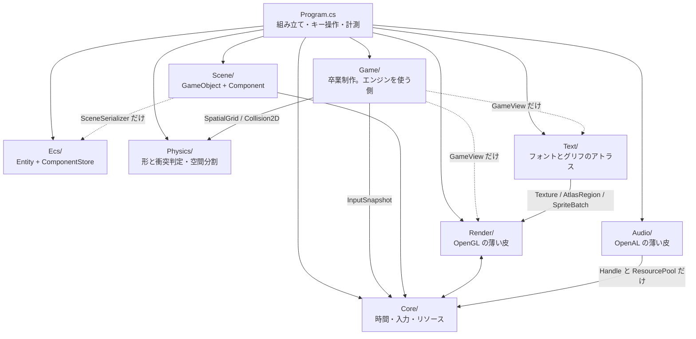
```mermaid
graph TD
    G["Game/<br/>卒業制作。エンジンを使う側"]
    P["Program.cs<br/>組み立て・キー操作・計測"]
    S["Scene/<br/>GameObject + Component"]
    E["Ecs/<br/>Entity + ComponentStore"]
    PH["Physics/<br/>形と衝突判定・空間分割"]
    T["Text/<br/>フォントとグリフのアトラス"]
    R["Render/<br/>OpenGL の薄い皮"]
    A["Audio/<br/>OpenAL の薄い皮"]
    C["Core/<br/>時間・入力・リソース"]

    P --> G
    P --> S
    P --> E
    P --> PH
    P --> T
    P --> R
    P --> A
    P --> C
    G -->|SpatialGrid / Collision2D| PH
    G -->|InputSnapshot| C
    G -.->|GameView だけ| T
    G -.->|GameView だけ| R
    S --> C
    S -.->|SceneSerializer だけ| E
    T -->|Texture / AtlasRegion / SpriteBatch| R
    R <--> C
    A -->|Handle と ResourcePool だけ| C
```

**Day 30 でこの図は変わっていない**。矢印も層も Day 29 のまま。
中身(武器・選択肢・BGM)が増えただけで、**依存の形は動かなかった**。

**`Game` から `Audio` への線が無い**のが Day 29 から見てほしいところ。
音は鳴るが、鳴らしているのは `Program` で、ゲームは
「弾を撃った」「敵が死んだ」を <c>OnEvent</c> で外へ投げるだけ。

```csharp
public Action<GameEvent, Vector2>? OnEvent { get; set; }
```

こうしておくと、**自己チェックで 600 秒ぶんを無音で回せる**。
`SurvivorGame` が直接 `_audio.Play` を呼んでいたら、
テストのたびにデバイスを開くことになり、
音の出ない環境ではそもそも動かせない。

同じ理由で `SurvivorGame` は `GameView` も知らない。
**状態を進めるものと、状態を見るもの**が分かれている(Day 19 の線)。

| 層 | 依存先 | 備考 |
|---|---|---|
| `Physics/` | **なし** | `System.Numerics` だけ。そのまま別プロジェクトへ持ち出せる |
| `Ecs/` | **なし** | 同上。Day 23 で「他に依存しないので先に5つ書ける」と書いたとおり |
| `Scene/` | `Core`(`InputSnapshot`)、`Ecs`(`SceneSerializer` のみ) | **描画を一切知らない**。`SpriteRenderer` は絵の種類と大きさを持つデータでしかない |
| `Render/` | `Core`(`Handle` / `ResourceManager`) | `Material` がハンドルを解くために管理側を呼ぶ |
| `Text/` | `Render`(`Texture` / `AtlasRegion` / `SpriteBatch`) | **一方通行**。`Render` は `Text` を知らない |
| `Audio/` | `Core`(`Handle` / `ResourcePool` **のみ**) | **一方通行**。`Core` は `Audio` を知らない |
| **`Game/`** | `Physics` / `Core`(入力)。描画側だけ `Render` と `Text` | **エンジンは `Game` を知らない**。窓も GL も音も知らない |
| `Core/` | `Render`(`Texture` / `Shader`) | `ResourceManager` が両者の実体を握っている |
| `Program.cs` | 全部 | 組み立て役。5437行あるが、その大半はデモ・計測・自己チェック |

`Game/` の中でも線が引いてある。

| ファイル | 知っていること | 知らないこと |
|---|---|---|
| `GameBalance` | プレイヤー・敵・湧き・経験値の数字 | 全部 |
| `Weapons` | 武器の成長カーブ(レベル → 性能) | ゲームの状態 |
| `UpgradeOption` | 選択肢の中身と、見せる文字 | 適用の仕方 |
| `SurvivorGame` | 形と当たり判定、空間分割、入力、成長 | 描画、音、窓、GL |
| `GameView` | スプライトの積み方、文字の出し方 | ゲームを進める方法(読むだけ) |

**`GameView` が状態を1文字も書き換えない**のは意図的で、
だから描画を丸ごと止めてもゲームは同じように進む。
自己チェックが窓を出さずに回せるのはこの性質のおかげ。

**`Text/` だけが他の層の上に乗っている**。
`Physics/` も `Audio/` も自分で完結していて、単体で別プロジェクトへ持ち出せるが、
`Text/` は `Render/` が無いと成立しない——グリフを置く先が `Texture` で、
積む先が `SpriteBatch` だから。

これは歪みではなく**素直な積み方**で、`Text` → `Render` の一方通行になっている。
逆向き(`SpriteBatch` が文字を知っている)にすると、
描画の中核が「文字とは何か」を抱え込むことになる。
`SpriteBatch` から見れば、文字は**ただの四角**でしかない。

**`Core` と `Render` が相互参照になっている**のは、この図を描いて初めて見えたことで、
きれいな形ではない。`ResourceManager`(Core)が `Texture`(Render)を作り、
`Material`(Render)が `ResourceManager`(Core)を呼ぶ、という往復になっている。

名前空間が `HonyaEngine` 1つなので今は問題なく動くが、**アセンブリを分けようとした瞬間に破綻する**。
直すなら「`ResourcePool` と `Handle` だけを下層に置き、`ResourceManager` は Render 側に上げる」
のが素直で、Phase 6 でアセットの種類が増えたときに検討する。

**Day 27 の判断**: 音を足すとき、この歪みを繰り返さないようにした。

音のリソースも「パスをキーにして使い回し、ハンドルで配る」という点でテクスチャと同じなので、
`ResourceManager` に `LoadAudio` を足すのが自然に見える。
だがそうすると `ResourceManager`(= `Core`)が **GL と OpenAL の両方を握る**ことになり、
上の相互参照が「`Core` ⇔ `Render` + `Core` ⇔ `Audio`」に増える。

そこで `AudioSystem` は、`Core` から**総称型の `ResourcePool<T>` と `Handle<T>` だけを借りて**、
音のリソースは自分で持つ形にした。`ResourcePool<T>` は `T` が何かを知らないので、
借りても依存が増えない。結果、`Audio/` → `Core/` の**一方通行**が保たれている。

図に描いておくと、こういう判断が「なんとなく」ではなくできるようになる。
**設計書は、次に何かを足すときのために書いている**。

### Core — 時間・入力・リソース

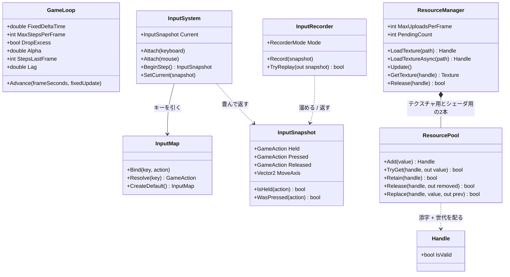
```mermaid
classDiagram
    class GameLoop {
        +double FixedDeltaTime
        +int MaxStepsPerFrame
        +bool DropExcess
        +double Alpha
        +int StepsLastFrame
        +double Lag
        +Advance(frameSeconds, fixedUpdate)
    }
    class InputSystem {
        +InputSnapshot Current
        +Attach(keyboard)
        +Attach(mouse)
        +BeginStep() InputSnapshot
        +SetCurrent(snapshot)
    }
    class InputMap {
        +Bind(key, action)
        +Resolve(key) GameAction
        +CreateDefault() InputMap
    }
    class InputSnapshot {
        +GameAction Held
        +GameAction Pressed
        +GameAction Released
        +Vector2 MoveAxis
        +IsHeld(action) bool
        +WasPressed(action) bool
    }
    class InputRecorder {
        +RecorderMode Mode
        +Record(snapshot)
        +TryReplay(out snapshot) bool
    }
    class Handle {
        +bool IsValid
    }
    class ResourcePool {
        +Add(value) Handle
        +TryGet(handle, out value) bool
        +Retain(handle) bool
        +Release(handle, out removed) bool
        +Replace(handle, value, out prev) bool
    }
    class ResourceManager {
        +int MaxUploadsPerFrame
        +int PendingCount
        +LoadTexture(path) Handle
        +LoadTextureAsync(path) Handle
        +Update()
        +GetTexture(handle) Texture
        +Release(handle) bool
    }

    InputSystem --> InputMap : キーを引く
    InputSystem ..> InputSnapshot : 畳んで返す
    InputRecorder ..> InputSnapshot : 溜める / 返す
    ResourceManager *-- ResourcePool : テクスチャ用とシェーダ用の2本
    ResourcePool ..> Handle : 添字 + 世代を配る
```

`ResourcePool` と `Handle` は総称型(`ResourcePool<T>` / `Handle<T>`)。
`T` が何かを知らないまま添字と世代だけを管理するので、`Texture` にも `Shader` にも同じものが使える。

この層で押さえるべき責務の線引き:

- **`GameLoop` は時間しか知らない**。何を更新するかは `Action<float>` で渡される
- **`InputSystem` はデバイスのイベントを畳むだけ**。ゲームとしての意味づけは `InputMap` が持つ
- **`InputSnapshot` は値**。だから記録・再生で丸ごと差し替えられる(Day 20 の肝)

### Render — OpenGL の薄い皮

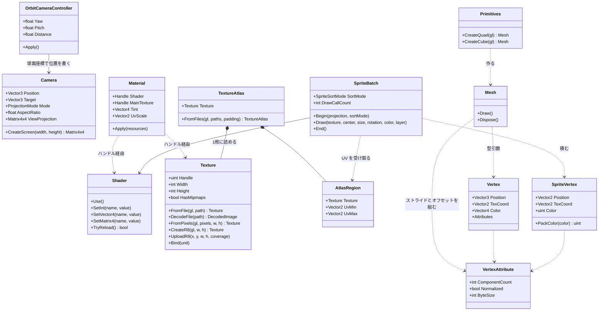
```mermaid
classDiagram
    class Camera {
        +Vector3 Position
        +Vector3 Target
        +ProjectionMode Mode
        +float AspectRatio
        +Matrix4x4 ViewProjection
        +CreateScreen(width, height) Matrix4x4
    }
    class OrbitCameraController {
        +float Yaw
        +float Pitch
        +float Distance
        +Apply()
    }
    class Shader {
        +Use()
        +SetInt(name, value)
        +SetVector4(name, value)
        +SetMatrix4(name, value)
        +TryReload() bool
    }
    class Texture {
        +uint Handle
        +int Width
        +int Height
        +bool HasMipmaps
        +FromFile(gl, path) Texture
        +DecodeFile(path) DecodedImage
        +FromPixels(gl, pixels, w, h) Texture
        +CreateR8(gl, w, h) Texture
        +UploadR8(x, y, w, h, coverage)
        +Bind(unit)
    }
    class TextureAtlas {
        +Texture Texture
        +FromFiles(gl, paths, padding) TextureAtlas
    }
    class AtlasRegion {
        +Texture Texture
        +Vector2 UvMin
        +Vector2 UvMax
    }
    class Material {
        +Handle Shader
        +Handle MainTexture
        +Vector4 Tint
        +Vector2 UvScale
        +Apply(resources)
    }
    class Mesh {
        +Draw()
        +Dispose()
    }
    class Vertex {
        +Vector3 Position
        +Vector2 TexCoord
        +Vector4 Color
        +Attributes
    }
    class SpriteVertex {
        +Vector2 Position
        +Vector2 TexCoord
        +uint Color
        +PackColor(color) uint
    }
    class VertexAttribute {
        +int ComponentCount
        +bool Normalized
        +int ByteSize
    }
    class SpriteBatch {
        +SpriteSortMode SortMode
        +int DrawCallCount
        +Begin(projection, sortMode)
        +Draw(texture, center, size, rotation, color, layer)
        +End()
    }
    class Primitives {
        +CreateQuad(gl) Mesh
        +CreateCube(gl) Mesh
    }

    OrbitCameraController --> Camera : 球面座標で位置を書く
    Material ..> Shader : ハンドル経由
    Material ..> Texture : ハンドル経由
    Mesh ..> VertexAttribute : ストライドとオフセットを組む
    Vertex ..> VertexAttribute
    SpriteVertex ..> VertexAttribute
    Mesh ..> Vertex : 型引数
    Primitives ..> Mesh : 作る
    TextureAtlas *-- AtlasRegion
    TextureAtlas *-- Texture : 1枚に詰める
    SpriteBatch --> Shader
    SpriteBatch ..> SpriteVertex : 積む
    SpriteBatch ..> AtlasRegion : UV を受け取る
```

**Day 28 で `Texture` に足したのは2つだけ**。
`CreateR8` が1チャンネルの空テクスチャを作り、`UploadR8` がその一部を書き換える。
どちらもグリフのために足したものだが、**`Texture` はグリフを知らない**——
「1チャンネル」「一部だけ更新」という一般の機能として置いてある。
同じものが Phase 6 のシャドウマップ(Day 33)でも要る。

**`Material` が何も所有していない**のは Day 15 から一貫している(Day15.md の要点2)。
持っているのはハンドルだけで、実体の寿命は `ResourceManager` にある。

**3D の道(`Mesh` + `Material`)と 2D の道(`SpriteBatch`)が並列**なのも見てのとおりで、
両者は `Shader` と `Texture` を共有しているだけで互いを知らない。
`Mesh` は「形が決まっていて毎フレーム変わらないもの」、
`SpriteBatch` は「毎フレーム頂点を作り直すもの」という使い分けになっている。

### Scene — GameObject + Component

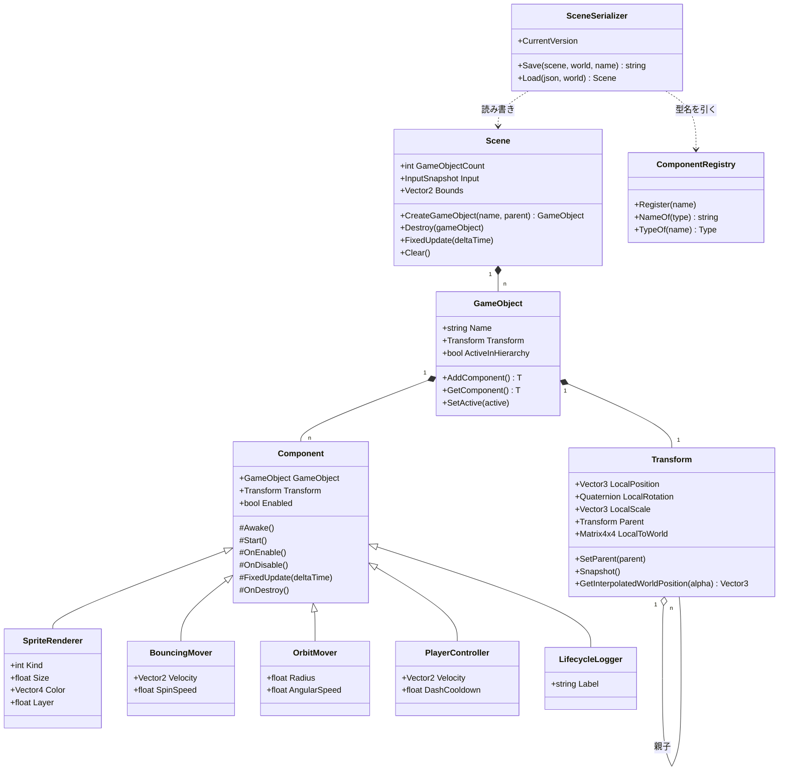
```mermaid
classDiagram
    class Scene {
        +int GameObjectCount
        +InputSnapshot Input
        +Vector2 Bounds
        +CreateGameObject(name, parent) GameObject
        +Destroy(gameObject)
        +FixedUpdate(deltaTime)
        +Clear()
    }
    class GameObject {
        +string Name
        +Transform Transform
        +bool ActiveInHierarchy
        +AddComponent() T
        +GetComponent() T
        +SetActive(active)
    }
    class Transform {
        +Vector3 LocalPosition
        +Quaternion LocalRotation
        +Vector3 LocalScale
        +Transform Parent
        +Matrix4x4 LocalToWorld
        +SetParent(parent)
        +Snapshot()
        +GetInterpolatedWorldPosition(alpha) Vector3
    }
    class Component {
        +GameObject GameObject
        +Transform Transform
        +bool Enabled
        #Awake()
        #Start()
        #OnEnable()
        #OnDisable()
        #FixedUpdate(deltaTime)
        #OnDestroy()
    }
    class SpriteRenderer {
        +int Kind
        +float Size
        +Vector4 Color
        +float Layer
    }
    class BouncingMover {
        +Vector2 Velocity
        +float SpinSpeed
    }
    class OrbitMover {
        +float Radius
        +float AngularSpeed
    }
    class PlayerController {
        +Vector2 Velocity
        +float DashCooldown
    }
    class LifecycleLogger {
        +string Label
    }
    class ComponentRegistry {
        +Register(name)
        +NameOf(type) string
        +TypeOf(name) Type
    }
    class SceneSerializer {
        +CurrentVersion
        +Save(scene, world, name) string
        +Load(json, world) Scene
    }

    Scene "1" *-- "n" GameObject
    GameObject "1" *-- "1" Transform
    GameObject "1" *-- "n" Component
    Transform "1" o-- "n" Transform : 親子
    Component <|-- SpriteRenderer
    Component <|-- BouncingMover
    Component <|-- OrbitMover
    Component <|-- PlayerController
    Component <|-- LifecycleLogger
    SceneSerializer ..> Scene : 読み書き
    SceneSerializer ..> ComponentRegistry : 型名を引く
```

`Transform` だけが `GameObject` の固定メンバーで、ほかは全部 `Component` として付け外しする
(Day 22 の要点2)。`SceneSerializer` が `ComponentRegistry` を経由するのは、
**JSON の文字列から直接 `Type` を作らせない**ため(Day 24 の要点2)。

### Ecs と Physics — どこにも依存しない2つ(今日 `Physics` が増えた)

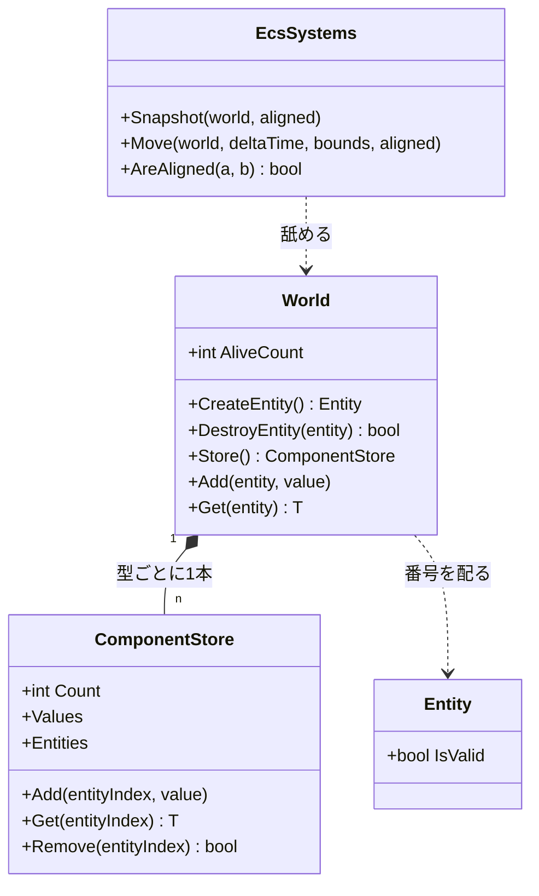
```mermaid
classDiagram
    class Entity {
        +bool IsValid
    }
    class World {
        +int AliveCount
        +CreateEntity() Entity
        +DestroyEntity(entity) bool
        +Store() ComponentStore
        +Add(entity, value)
        +Get(entity) T
    }
    class ComponentStore {
        +int Count
        +Values
        +Entities
        +Add(entityIndex, value)
        +Get(entityIndex) T
        +Remove(entityIndex) bool
    }
    class EcsSystems {
        +Snapshot(world, aligned)
        +Move(world, deltaTime, bounds, aligned)
        +AreAligned(a, b) bool
    }

    World "1" *-- "n" ComponentStore : 型ごとに1本
    World ..> Entity : 番号を配る
    EcsSystems ..> World : 舐める
```

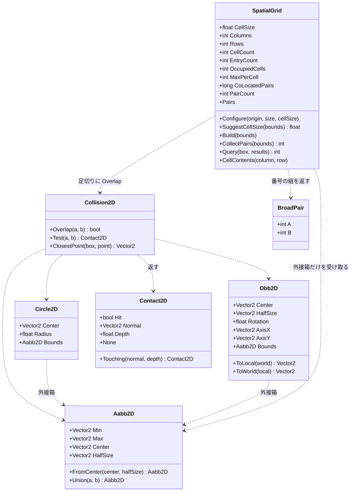
```mermaid
classDiagram
    class Aabb2D {
        +Vector2 Min
        +Vector2 Max
        +Vector2 Center
        +Vector2 HalfSize
        +FromCenter(center, halfSize) Aabb2D
        +Union(a, b) Aabb2D
    }
    class Circle2D {
        +Vector2 Center
        +float Radius
        +Aabb2D Bounds
    }
    class Obb2D {
        +Vector2 Center
        +Vector2 HalfSize
        +float Rotation
        +Vector2 AxisX
        +Vector2 AxisY
        +Aabb2D Bounds
        +ToLocal(world) Vector2
        +ToWorld(local) Vector2
    }
    class Contact2D {
        +bool Hit
        +Vector2 Normal
        +float Depth
        +None
        +Touching(normal, depth) Contact2D
    }
    class Collision2D {
        +Overlap(a, b) bool
        +Test(a, b) Contact2D
        +ClosestPoint(box, point) Vector2
    }
    class BroadPair {
        +int A
        +int B
    }
    class SpatialGrid {
        +float CellSize
        +int Columns
        +int Rows
        +int CellCount
        +int EntryCount
        +int OccupiedCells
        +int MaxPerCell
        +long CoLocatedPairs
        +int PairCount
        +Pairs
        +Configure(origin, size, cellSize)
        +SuggestCellSize(bounds) float
        +Build(bounds)
        +CollectPairs(bounds) int
        +Query(box, results) int
        +CellContents(column, row)
    }

    Collision2D ..> Aabb2D
    Collision2D ..> Circle2D
    Collision2D ..> Obb2D
    Collision2D ..> Contact2D : 返す
    Circle2D ..> Aabb2D : 外接箱
    Obb2D ..> Aabb2D : 外接箱
    SpatialGrid ..> Aabb2D : 外接箱だけを受け取る
    SpatialGrid ..> Collision2D : 足切りに Overlap
    SpatialGrid ..> BroadPair : 番号の組を返す
```

**形は全部 `readonly struct`、判定は `static` メソッドだけ**。状態を持たないので、
どのスレッドから何回呼んでも同じ答えが返る。Day 26 で空間分割を入れたとき、
この性質のおかげで**判定そのものには一切手を入れずに済んだ**——
`Collision2D.cs` と `Shapes2D.cs` の差分は 0 行になっている。

**Day 29 で足したのは `Query` だけ**。
`CollectPairs` が「全部の組」を返すのに対して、
`Query` は「この箱の近くにいるもの」を返す。
1回組んだ格子を、**総当たりの置き換え**としても
**単発の近傍探索**としても使えるようになった——
卒業制作では同じ格子を1ステップに4通りで使っている。

`SpatialGrid` だけが唯一 `class`(参照型)で、しかも状態を持つ。
配列を4本(`_cellStart` / `_cursor` / `_entries` / `_mark`)使い回すためで、
**毎フレーム作り直しても割り当てが起きない**ようにするにはこうするしかない。
そのぶん「1つのインスタンスを複数スレッドから同時に使えない」という制約が付く。
状態を持つと何が失われるかが、同じフォルダの中で見比べられる形になっている。

矢印の向きにも注目してほしい。**`SpatialGrid` から `Body` への線が無い**。
受け取るのは `ReadOnlySpan<Aabb2D>`、返すのは番号の組だけで、
速度も形も質量も知らない。この細さのおかげで、
Day 46 の 3D 版は `Aabb2D` を `Aabb3D` に変えるだけで済む。

### Audio — OpenAL の薄い皮

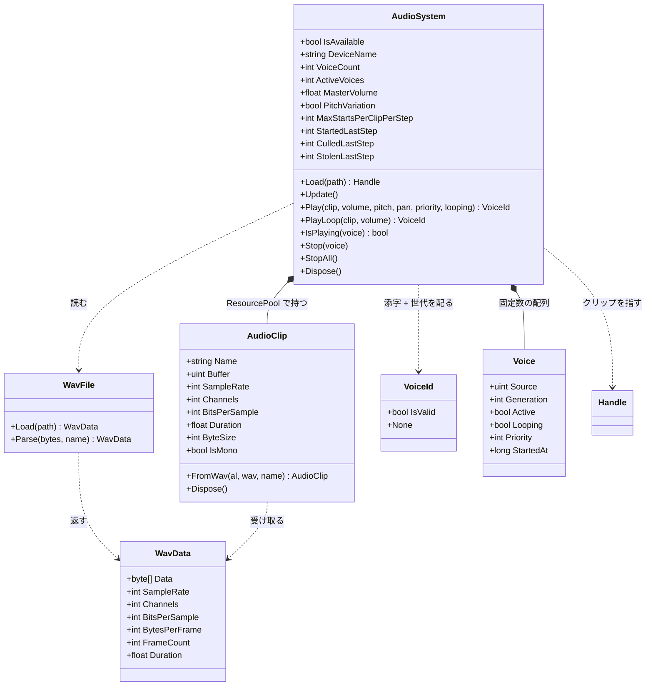
```mermaid
classDiagram
    class WavData {
        +byte[] Data
        +int SampleRate
        +int Channels
        +int BitsPerSample
        +int BytesPerFrame
        +int FrameCount
        +float Duration
    }
    class WavFile {
        +Load(path) WavData
        +Parse(bytes, name) WavData
    }
    class AudioClip {
        +string Name
        +uint Buffer
        +int SampleRate
        +int Channels
        +int BitsPerSample
        +float Duration
        +int ByteSize
        +bool IsMono
        +FromWav(al, wav, name) AudioClip
        +Dispose()
    }
    class VoiceId {
        +bool IsValid
        +None
    }
    class AudioSystem {
        +bool IsAvailable
        +string DeviceName
        +int VoiceCount
        +int ActiveVoices
        +float MasterVolume
        +bool PitchVariation
        +int MaxStartsPerClipPerStep
        +int StartedLastStep
        +int CulledLastStep
        +int StolenLastStep
        +Load(path) Handle
        +Update()
        +Play(clip, volume, pitch, pan, priority, looping) VoiceId
        +PlayLoop(clip, volume) VoiceId
        +IsPlaying(voice) bool
        +Stop(voice)
        +StopAll()
        +Dispose()
    }
    class Voice {
        +uint Source
        +int Generation
        +bool Active
        +bool Looping
        +int Priority
        +long StartedAt
    }

    WavFile ..> WavData : 返す
    AudioClip ..> WavData : 受け取る
    AudioSystem ..> WavFile : 読む
    AudioSystem *-- AudioClip : ResourcePool で持つ
    AudioSystem *-- Voice : 固定数の配列
    AudioSystem ..> VoiceId : 添字 + 世代を配る
    AudioSystem ..> Handle : クリップを指す
```

`Voice` は `AudioSystem` の中の `private struct`。外からは `VoiceId` 越しにしか触れない。

この層で押さえるべき線引きは3つ。

- **`WavFile` は OpenAL を知らない**。ただのバイト列パーサなので、
  ファイルが無くてもメモリ上のバイト列で試せる(自己チェックがそうしている)
- **`AudioClip` はデータ、`Voice` は再生**(要点2)。
  `Texture` と `Material`、`Mesh` と描画呼び出しと同じ分け方
- **`VoiceId` は `Handle<T>` と同じ構造**(添字 + 世代)だが**別の型**。
  `Handle<T>` は `ResourcePool<T>` のためのもので、ボイスはプールではないので流用しない。
  同じ手口を別の場所で使い直している、と読むのが正しい

### Text — Render の上に積む層

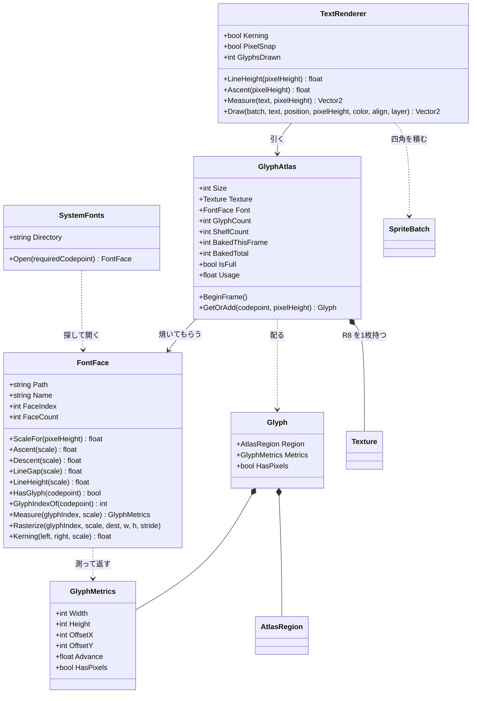
```mermaid
classDiagram
    class SystemFonts {
        +string Directory
        +Open(requiredCodepoint) FontFace
    }
    class FontFace {
        +string Path
        +string Name
        +int FaceIndex
        +int FaceCount
        +ScaleFor(pixelHeight) float
        +Ascent(scale) float
        +Descent(scale) float
        +LineGap(scale) float
        +LineHeight(scale) float
        +HasGlyph(codepoint) bool
        +GlyphIndexOf(codepoint) int
        +Measure(glyphIndex, scale) GlyphMetrics
        +Rasterize(glyphIndex, scale, dest, w, h, stride)
        +Kerning(left, right, scale) float
    }
    class GlyphMetrics {
        +int Width
        +int Height
        +int OffsetX
        +int OffsetY
        +float Advance
        +bool HasPixels
    }
    class Glyph {
        +AtlasRegion Region
        +GlyphMetrics Metrics
        +bool HasPixels
    }
    class GlyphAtlas {
        +int Size
        +Texture Texture
        +FontFace Font
        +int GlyphCount
        +int ShelfCount
        +int BakedThisFrame
        +int BakedTotal
        +bool IsFull
        +float Usage
        +BeginFrame()
        +GetOrAdd(codepoint, pixelHeight) Glyph
    }
    class TextRenderer {
        +bool Kerning
        +bool PixelSnap
        +int GlyphsDrawn
        +LineHeight(pixelHeight) float
        +Ascent(pixelHeight) float
        +Measure(text, pixelHeight) Vector2
        +Draw(batch, text, position, pixelHeight, color, align, layer) Vector2
    }

    SystemFonts ..> FontFace : 探して開く
    FontFace ..> GlyphMetrics : 測って返す
    GlyphAtlas --> FontFace : 焼いてもらう
    GlyphAtlas *-- Texture : R8 を1枚持つ
    GlyphAtlas ..> Glyph : 配る
    Glyph *-- AtlasRegion
    Glyph *-- GlyphMetrics
    TextRenderer --> GlyphAtlas : 引く
    TextRenderer ..> SpriteBatch : 四角を積む
```

4つのクラスが、**それぞれ1つのことしかしない**ように切ってある。

| クラス | 知っていること | 知らないこと |
|---|---|---|
| `SystemFonts` | どこにフォントがあるか | 描き方 |
| `FontFace` | フォントの中身(寸法とアウトライン) | GL、アトラス、レイアウト |
| `GlyphAtlas` | どこに置いたか、何を焼いたか | 文字の並べ方 |
| `TextRenderer` | 並べ方(送り・行送り・整列) | フォントの中身、GL |

この切り方の値打ちは、**差し替えたときにどこまで壊れるか**で分かる。
SDF に変える(改造課題3)なら `GlyphAtlas` と `text.frag` だけが変わり、
`TextRenderer` は 1 行も触らない。
フォントフォールバックを入れる(改造課題2)なら `FontFace` を複数持つだけで、
`GlyphAtlas` の棚詰めには影響しない。

**`GlyphMetrics` が `FontFace` と `TextRenderer` の共通語**になっている。
「原点からどれだけずらして、次にどれだけ進むか」——
この5つの数字さえあれば、フォントの実装が何であれ字を並べられる。

### Game — エンジンを使う側

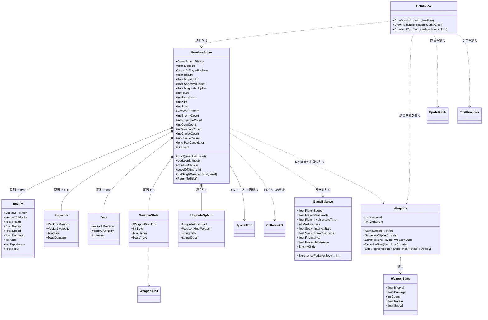
```mermaid
classDiagram
    class GameBalance {
        +float PlayerSpeed
        +float PlayerMaxHealth
        +float PlayerInvulnerableTime
        +int MaxEnemies
        +float SpawnIntervalStart
        +float SpawnRampSeconds
        +float FireInterval
        +float ProjectileDamage
        +EnemyKinds
        +ExperienceForLevel(level) int
    }
    class Enemy {
        +Vector2 Position
        +Vector2 Velocity
        +float Health
        +float Radius
        +float Speed
        +float Damage
        +int Kind
        +int Experience
        +float HitAt
    }
    class Projectile {
        +Vector2 Position
        +Vector2 Velocity
        +float Life
        +float Damage
    }
    class Gem {
        +Vector2 Position
        +Vector2 Velocity
        +int Value
    }
    class WeaponState {
        +WeaponKind Kind
        +int Level
        +float Timer
        +float Angle
    }
    class WeaponStats {
        +float Interval
        +float Damage
        +int Count
        +float Radius
        +float Speed
    }
    class Weapons {
        +int MaxLevel
        +int KindCount
        +NameOf(kind) string
        +SummaryOf(kind) string
        +StatsFor(kind, level) WeaponStats
        +DescribeNext(kind, level) string
        +OrbitPosition(center, angle, index, stats) Vector2
    }
    class UpgradeOption {
        +UpgradeKind Kind
        +WeaponKind Weapon
        +string Title
        +string Detail
    }
    class SurvivorGame {
        +GamePhase Phase
        +float Elapsed
        +Vector2 PlayerPosition
        +float Health
        +float MaxHealth
        +float SpeedMultiplier
        +float MagnetMultiplier
        +int Level
        +int Experience
        +int Kills
        +int Seed
        +Vector2 Camera
        +int EnemyCount
        +int ProjectileCount
        +int GemCount
        +int WeaponCount
        +int ChoiceCount
        +int ChoiceCursor
        +long PairCandidates
        +OnEvent
        +Start(viewSize, seed)
        +Update(dt, input)
        +ConfirmChoice()
        +LevelOf(kind) int
        +SetSingleWeapon(kind, level)
        +ReturnToTitle()
    }
    class GameView {
        +DrawWorld(submit, viewSize)
        +DrawHudShapes(submit, viewSize)
        +DrawHudText(text, textBatch, viewSize)
    }

    SurvivorGame *-- Enemy : 配列で 1200
    SurvivorGame *-- Projectile : 配列で 400
    SurvivorGame *-- Gem : 配列で 600
    SurvivorGame *-- WeaponState : 配列で 3
    SurvivorGame *-- UpgradeOption : 選択肢 3
    SurvivorGame --> SpatialGrid : 1ステップに1回組む
    SurvivorGame ..> Collision2D : 円どうしの判定
    SurvivorGame ..> GameBalance : 数字を引く
    SurvivorGame ..> Weapons : レベルから性能を引く
    WeaponState ..> WeaponKind
    Weapons ..> WeaponStats : 返す
    GameView ..> SurvivorGame : 読むだけ
    GameView ..> Weapons : 球の位置を引く
    GameView ..> SpriteBatch : 四角を積む
    GameView ..> TextRenderer : 文字を積む
```

**`WeaponState` が3つのフィールドしか持っていない**のが Day 30 の設計の要。
威力も間隔も個数も持たず、`Weapons.StatsFor(kind, level)` が
**レベルから計算して返す**。

```
状態として持つもの   … 種類・レベル・タイマー・角度
状態から決まるもの   … 威力・間隔・個数・半径・速度
```

分けておくと、成長カーブを触るときに `StatsFor` の1箇所で済む。
逆に `WeaponState` に威力を持たせると、
レベルアップのたびに「どの数字をいくつ足すか」があちこちに散らばる。

**`GameView` から `Weapons` への線**にも意味がある。
オービットの球の位置は当たり判定と絵の両方が要るので、
`Weapons.OrbitPosition` という1つの式を両方から呼ぶ。
別々に書くと、**見えているところと当たるところがずれる**——
しかもずれは小さいので、しばらく気づかない。

**`Enemy` / `Projectile` / `Gem` が `struct`** なのが要点。
1200 体ぶんの参照を辿ると、メモリ上ばらばらの場所を読むことになる
(Day 22 で実測した 17 倍がこれ)。構造体の配列なら、
更新ループは連続したメモリを頭から舐めるだけで済む。

**Day 23 の ECS は使っていない**。
ECS が効くのは「部品の組み合わせが実行時に変わる」ときで、
今日のように<b>敵は敵、弾は弾と決まっている</b>なら、
種類ごとに配列を1本持つほうが素直で速い。
Day 23 で「ECS は構造体の配列の一般化」と書いたが、
**一般化が要らない場面では特殊形のままでよい**——
これは ECS が無駄だったという話ではなく、
<b>どちらを選ぶかを判断できるようになった</b>という話になる。

`GameBalance` に矢印が集まっているのも意図したもの。
遊んで気になったことは全部ここを触ることになるので、
**数字がコードの中に散らばっていると調整が苦行になる**。

### 1フレームの流れ

Silk.NET のウィンドウから `OnUpdate` と `OnRender` が交互に呼ばれる。
**状態を変えるのは `OnUpdate` 側だけ**、というのが Day 19 で引いた線。

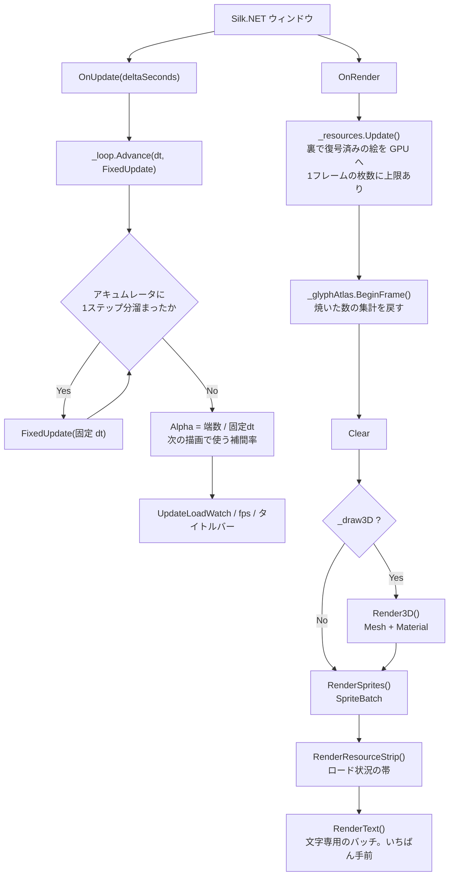
```mermaid
flowchart TD
    W["Silk.NET ウィンドウ"] --> U["OnUpdate(deltaSeconds)"]
    U --> A["_loop.Advance(dt, FixedUpdate)"]
    A --> Q{"アキュムレータに<br/>1ステップ分溜まったか"}
    Q -->|Yes| F["FixedUpdate(固定 dt)"]
    F --> Q
    Q -->|No| AL["Alpha = 端数 / 固定dt<br/>次の描画で使う補間率"]
    AL --> LW["UpdateLoadWatch / fps / タイトルバー"]

    W --> R["OnRender"]
    R --> RU["_resources.Update()<br/>裏で復号済みの絵を GPU へ<br/>1フレームの枚数に上限あり"]
    RU --> GA["_glyphAtlas.BeginFrame()<br/>焼いた数の集計を戻す"]
    GA --> CL["Clear"]
    CL --> D3{"_draw3D ?"}
    D3 -->|Yes| R3["Render3D()<br/>Mesh + Material"]
    D3 -->|No| RS
    R3 --> RS["RenderSprites()<br/>SpriteBatch"]
    RS --> ST["RenderResourceStrip()<br/>ロード状況の帯"]
    ST --> TX["RenderText()<br/>文字専用のバッチ。いちばん手前"]
```

**Day 29 で分岐が1つ増えた**。ゲームモード(Enter)のときは
`Render3D` も `RenderSprites` も `RenderResourceStrip` も通らず、
`RenderGame()` だけになる。
デモの重い部分を裏で回したまま遊ぶと、
「ゲームが重い」のか「デモが重い」のか分からなくなるため。

**`RenderText` がいちばん最後**なのは、UI が何よりも手前に出るものだから。
バッチが別なのは、シェーダが違うため——
グリフのアトラスは1チャンネルなので `sprite.frag` では真っ黒になる。
**バッチは「同じ設定で描けるものをまとめる」仕組み**なので、
シェーダが違えば別のバッチになるのは定義どおりの帰結。

`OnRender` の先頭で `_resources.Update()` を呼ぶのが要点で、
**GL は描画スレッドからしか触れない**ため、裏で復号し終えた画素をここで GPU に上げている
(Day 21 の要点5・6)。

### FixedUpdate の中身 — 入力の出どころと3つのバックエンド

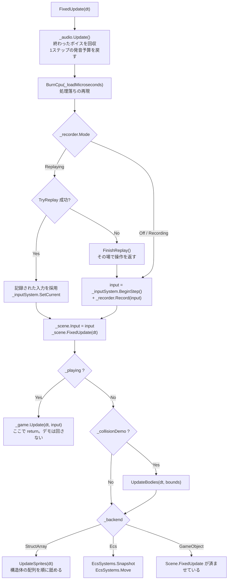
```mermaid
flowchart TD
    S["FixedUpdate(dt)"] --> AU["_audio.Update()<br/>終わったボイスを回収<br/>1ステップの発音予算を戻す"]
    AU --> B["BurnCpu(_loadMicroseconds)<br/>処理落ちの再現"]
    B --> M{"_recorder.Mode"}
    M -->|Replaying| TR{"TryReplay 成功?"}
    TR -->|Yes| SC["記録された入力を採用<br/>_inputSystem.SetCurrent"]
    TR -->|No| FR["FinishReplay()<br/>その場で操作を返す"]
    FR --> BS
    M -->|Off / Recording| BS["input = _inputSystem.BeginStep()<br/>+ _recorder.Record(input)"]
    SC --> SF
    BS --> SF["_scene.Input = input<br/>_scene.FixedUpdate(dt)"]
    SF --> PG{"_playing ?"}
    PG -->|Yes| GM["_game.Update(dt, input)<br/>ここで return。デモは回さない"]
    PG -->|No| CD{"_collisionDemo ?"}
    CD -->|Yes| UB["UpdateBodies(dt, bounds)"]
    CD -->|No| BK
    UB --> BK{"_backend"}
    BK -->|StructArray| US["UpdateSprites(dt)<br/>構造体の配列を順に舐める"]
    BK -->|Ecs| ES["EcsSystems.Snapshot<br/>EcsSystems.Move"]
    BK -->|GameObject| GO["Scene.FixedUpdate が済ませている"]
```

**音の後始末を先頭に置いた**のは、音を要求するのがこの下だから。
予算を戻す場所と使う場所を近くに置くと、「いつリセットされるのか」を追う必要がなくなる。
描画側(`OnRender`)に置くと、シミュレーションが 5Hz のときに
「1フレームに複数ステップぶんの音が要求されるのに予算は 1 回ぶん」というずれが起きる。

**入力がどこから来たかを、この関数から下は誰も気にしない**のがポイント(Day 20 の要点1)。
`InputSnapshot` という値に畳んであるので、記録の再生と実操作を1行で差し替えられる。

`Scene.FixedUpdate` を `_backend` の分岐より前で必ず呼んでいるのは、
**プレイヤーと階層の実演がどのモードでも Scene 側にいる**ため。

### Scene.FixedUpdate の4段階

順番に意味がある。入れ替えると壊れる。

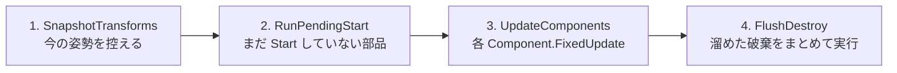
```mermaid
flowchart LR
    A["1. SnapshotTransforms<br/>今の姿勢を控える"]
    B["2. RunPendingStart<br/>まだ Start していない部品"]
    C["3. UpdateComponents<br/>各 Component.FixedUpdate"]
    D["4. FlushDestroy<br/>溜めた破棄をまとめて実行"]
    A --> B --> C --> D
```

| 段 | なぜその位置か |
|---|---|
| 1 | **動かす前**に控えないと、補間の始点が終点と同じになって補間が効かない |
| 2 | `Start` の中で新しいオブジェクトが生まれるので、**開始時点の件数だけ**回す |
| 3 | ここも開始時点の件数で止める。このステップで生まれたものは次のステップから |
| 4 | 更新中にリストから消すと**走査中のインデックスがずれる**(Day 22 の要点5)。<br/>まとめて `RemoveAll` するのは、1個ずつ消すと O(n^2) になるため |

### 非同期テクスチャロードの流れ

`Q` キーで走る道。**GL を呼ぶ部分と呼ばない部分の境目**が、
そのままスレッドの境目になっている(Day 21 の要点5)。

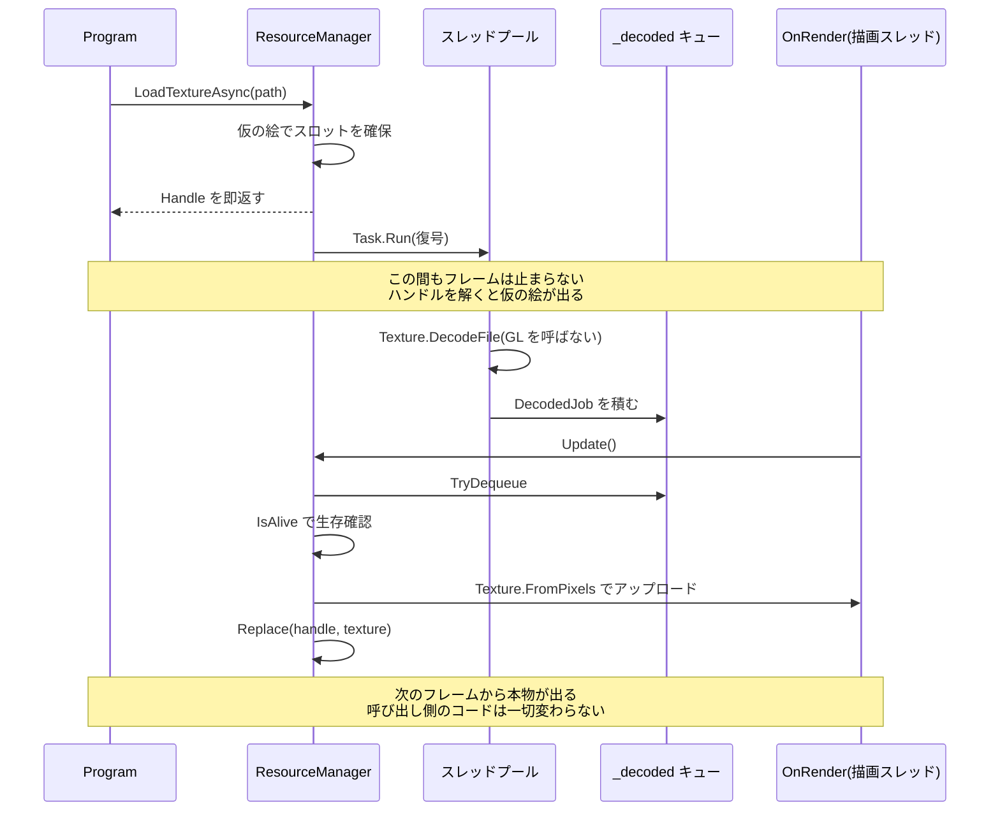
```mermaid
sequenceDiagram
    participant P as Program
    participant RM as ResourceManager
    participant TP as スレッドプール
    participant Q as _decoded キュー
    participant GL as OnRender(描画スレッド)

    P->>RM: LoadTextureAsync(path)
    RM->>RM: 仮の絵でスロットを確保
    RM-->>P: Handle を即返す
    RM->>TP: Task.Run(復号)
    Note over P,GL: この間もフレームは止まらない<br/>ハンドルを解くと仮の絵が出る
    TP->>TP: Texture.DecodeFile(GL を呼ばない)
    TP->>Q: DecodedJob を積む
    GL->>RM: Update()
    RM->>Q: TryDequeue
    RM->>RM: IsAlive で生存確認
    RM->>GL: Texture.FromPixels でアップロード
    RM->>RM: Replace(handle, texture)
    Note over P,GL: 次のフレームから本物が出る<br/>呼び出し側のコードは一切変わらない
```

`Update()` が `MaxUploadsPerFrame` で枚数を絞っているのが肝で、
**復号を非同期にしても、アップロードをまとめてやるとそこでカクつく**(Day 21 の要点6)。

### 衝突判定の3段 — ブロードフェーズが割り込んだ

Day 25 の `UpdateBodies` は「動かす → 総当たり → 押し戻す」の3段だった。
今日、真ん中が**「組を絞る」と「絞った組を判定する」に割れる**。

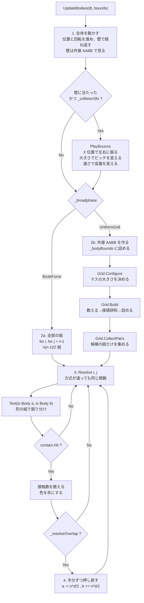
```mermaid
flowchart TD
    S["UpdateBodies(dt, bounds)"] --> MV["1. 全体を動かす<br/>位置と回転を進め、壁で跳ね返す<br/>壁は外接 AABB で見る"]
    MV --> SFX{"壁に当たった<br/>かつ _collisionSfx ?"}
    SFX -->|Yes| PB["PlayBounce<br/>X 位置で左右に振る<br/>大きさでピッチを変える<br/>速さで音量を変える"]
    SFX -->|No| BP
    PB --> BP{"_broadphase"}

    BP -->|BruteForce| BF["2a. 全部の組<br/>for i, for j = i+1<br/>n(n-1)/2 組"]
    BP -->|UniformGrid| GB["2b. 外接 AABB を作る<br/>_bodyBounds に詰める"]
    GB --> GC["Grid.Configure<br/>マスの大きさを決める"]
    GC --> GD["Grid.Build<br/>数える→接頭辞和→詰める"]
    GD --> GP["Grid.CollectPairs<br/>候補の組だけを集める"]

    BF --> NR["3. Resolve i, j<br/>方式が違っても同じ関数"]
    GP --> NR
    NR --> T["Test(in Body a, in Body b)<br/>形の組で振り分け"]
    T --> H{"contact.Hit ?"}
    H -->|No| NR
    H -->|Yes| CNT["接触数を数える<br/>色を赤にする"]
    CNT --> RV{"_resolveOverlap ?"}
    RV -->|Yes| PS["4. 半分ずつ押し戻す<br/>a -= n*d/2 , b += n*d/2"]
    RV -->|No| NR
    PS --> NR
```

発音の要求が**移動の段にある**ことに注意。
「壁に当たった」はブロードフェーズの外で分かることなので、
組の絞り込みとは無関係にここで出る。
体どうしの接触音を鳴らすなら `Resolve` の中になるが、
2000 体で 7,425 組が接触しているので**要求だけで 7,425 回**になる。
要点3の 7.3μs を掛けると 54ms。今日は壁だけにしてある。

図で見てほしいのは**2つの経路が `Resolve` で合流している**ところ。
方式ごとにナローフェーズを書き分けると、
「答えが違う」となったときに原因がブロードフェーズなのか判定なのか分からなくなる。
合流させておけば、**違いが出たら必ず組の選び方が原因**と言い切れる。
`F12` の自己チェックが「接触数が一致」だけで意味を持つのはこの形のおかげ。

もうひとつ、**押し戻し(4段目)がグリッドの構築より後にある**ことに注意。
押し戻すと位置が動くので、ステップの頭で組んだ格子は少しずつ古くなる。
押し戻し量は 1 ステップぶんの重なりぶんしかないので実用上は問題にならないが、
厳密にやるなら「判定を全部済ませてから、まとめて押し戻す」形にする。
Phase 7 のインパルス解決がその形になる。

### 均一グリッドの中身 — 2つの関数しかない

`SpatialGrid` の公開メソッドは実質 `Build` と `CollectPairs` の2つだけ。
中で何が起きているかは、コードを読むより図のほうが早い。

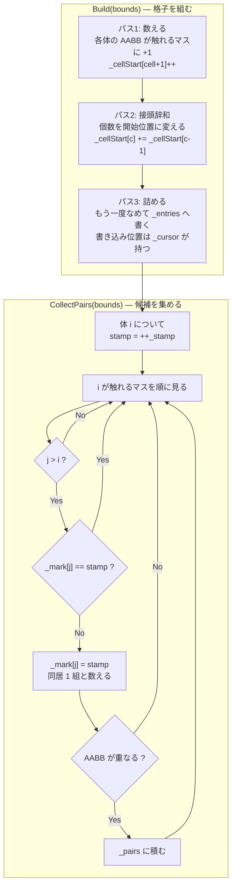
```mermaid
flowchart TD
    subgraph B["Build(bounds) — 格子を組む"]
        B1["パス1: 数える<br/>各体の AABB が触れるマスに +1<br/>_cellStart[cell+1]++"]
        B2["パス2: 接頭辞和<br/>個数を開始位置に変える<br/>_cellStart[c] += _cellStart[c-1]"]
        B3["パス3: 詰める<br/>もう一度なめて _entries へ書く<br/>書き込み位置は _cursor が持つ"]
        B1 --> B2 --> B3
    end

    subgraph C["CollectPairs(bounds) — 候補を集める"]
        C1["体 i について<br/>stamp = ++_stamp"]
        C2["i が触れるマスを順に見る"]
        C3{"j > i ?"}
        C4{"_mark[j] == stamp ?"}
        C5["_mark[j] = stamp<br/>同居 1 組と数える"]
        C6{"AABB が重なる ?"}
        C7["_pairs に積む"]
        C1 --> C2 --> C3
        C3 -->|No| C2
        C3 -->|Yes| C4
        C4 -->|Yes| C2
        C4 -->|No| C5 --> C6
        C6 -->|No| C2
        C6 -->|Yes| C7 --> C2
    end

    B3 --> C1
```

3つの絞りが直列に並んでいるのが分かる。

| 絞り | 落とすもの | 4000 体での実測(マス 32px) |
|---|---|---|
| 格子 | 別のマスにいる組 | 7,998,000 → 72,527 |
| `j > i` と印 | 同じ組の重複 | (上の数に含まれる) |
| AABB | 同じマスだが離れている組 | 72,527 → 24,733 |

**最後の AABB がまだ 3 分の 1 に減らしている**のが面白いところで、
「同じマスにいる」は「近い」でしかない。
7.4ns の AABB 判定を挟むことで、24〜120ns のナローフェーズを 5 万回節約している。

`j > i` の条件だけでは重複が消えないことは、実際に印を外すと確かめられる
(自己チェックの「重複した組が無い」が落ちる)。

`Test(in Body, in Body)` の中身は形の組み合わせ表そのもの。**3種類で6通り**になる。

| a \ b | Circle | Box | RotatedBox |
|---|---|---|---|
| **Circle** | `Test(Circle, Circle)` | `Test(Circle, Aabb)` | `Test(Circle, Obb)` |
| **Box** | 上を**符号反転** | `Test(Aabb, Aabb)` | OBB 同士へ寄せる |
| **RotatedBox** | 上を**符号反転** | OBB 同士へ寄せる | `Test(Obb, Obb)` SAT |

- **専用の速い経路**(AABB 同士、円同士)と**一般形**(OBB 同士の SAT)を併存させ、
  組み合わせの穴は一般形で埋める。`F9` の自己チェックで**両者の答えが一致すること**を確認している
- 引数の順が逆になる組(`Test(Box, Circle)`)は**法線の符号を反転**して返す。
  ここを間違えると物体がめり込む方向へ押される(要点6)
- 種類を1つ足すと表が1行1列増える。3D で球・箱・カプセル・平面・地形と並べると 15 通りになり、
  **その表を埋めることが物理エンジンを書くこと**になる(Phase 7)

### 音を1発鳴らすまで — 3つの関門

`Play` を呼んでから実際に音が出るまでに、3回ふるいにかけられる。
**呼んだのに鳴らないことは普通に起きる**ので、どこで落ちたかを数えられるようにしてある。

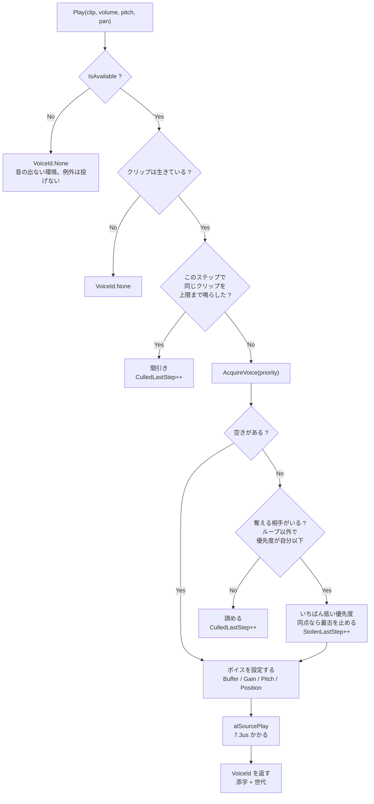
```mermaid
flowchart TD
    S["Play(clip, volume, pitch, pan)"] --> A{"IsAvailable ?"}
    A -->|No| N1["VoiceId.None<br/>音の出ない環境。例外は投げない"]
    A -->|Yes| B{"クリップは生きている ?"}
    B -->|No| N2["VoiceId.None"]
    B -->|Yes| C{"このステップで<br/>同じクリップを<br/>上限まで鳴らした ?"}
    C -->|Yes| N3["間引き<br/>CulledLastStep++"]
    C -->|No| D["AcquireVoice(priority)"]
    D --> E{"空きがある ?"}
    E -->|Yes| G["ボイスを設定する<br/>Buffer / Gain / Pitch / Position"]
    E -->|No| F{"奪える相手がいる ?<br/>ループ以外で<br/>優先度が自分以下"}
    F -->|No| N4["諦める<br/>CulledLastStep++"]
    F -->|Yes| ST["いちばん低い優先度<br/>同点なら最古を止める<br/>StolenLastStep++"]
    ST --> G
    G --> H["alSourcePlay<br/>7.3us かかる"]
    H --> I["VoiceId を返す<br/>添字 + 世代"]
```

**「諦める」が2箇所ある**のが要点。
間引き(`C`)は「同じ音が多すぎる」で落とし、
`F` は「ボイスが足りず、しかも自分より偉い音しか鳴っていない」で落とす。
前者は音として意味が無いから落とすので**積極的**、
後者は資源が足りないから落とすので**消極的**。
タイトルバーで両方を分けて数えているのは、この2つが違う対処を要求するため
(前者は上限を調整する、後者はボイスを増やす)。

### 1文字が画面に出るまで — 4つの層を通り抜ける

`Draw("あ", ...)` を呼んでから画面に出るまでに何が起きるか。
**初回だけ通る道**(焼く)と、**毎回通る道**(引く・積む)が分かれているのが要点。

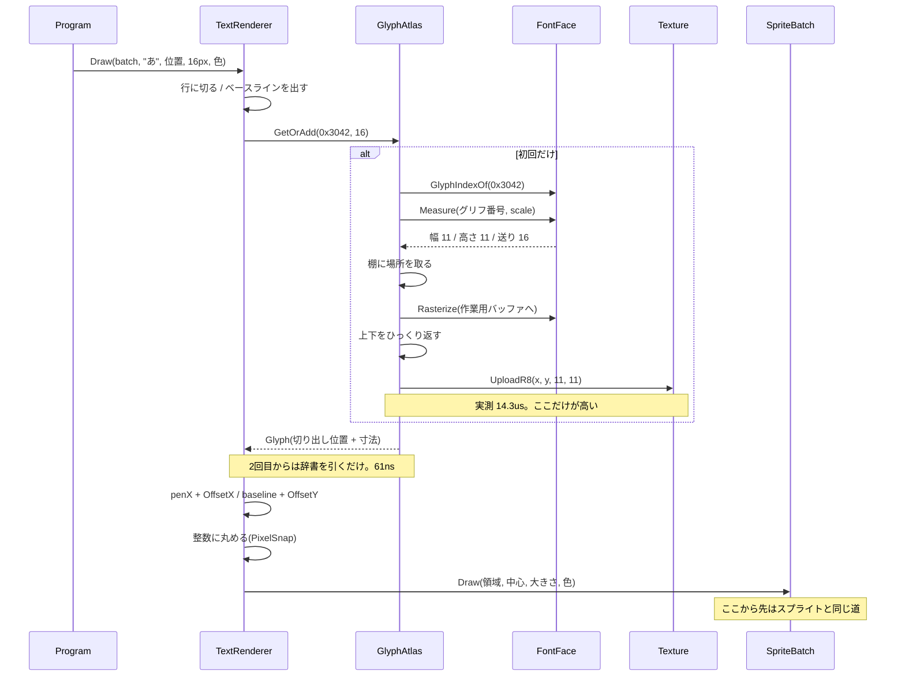
```mermaid
sequenceDiagram
    participant P as Program
    participant TR as TextRenderer
    participant GA as GlyphAtlas
    participant FF as FontFace
    participant TX as Texture
    participant SB as SpriteBatch

    P->>TR: Draw(batch, "あ", 位置, 16px, 色)
    TR->>TR: 行に切る / ベースラインを出す
    TR->>GA: GetOrAdd(0x3042, 16)

    alt 初回だけ
        GA->>FF: GlyphIndexOf(0x3042)
        GA->>FF: Measure(グリフ番号, scale)
        FF-->>GA: 幅 11 / 高さ 11 / 送り 16
        GA->>GA: 棚に場所を取る
        GA->>FF: Rasterize(作業用バッファへ)
        GA->>GA: 上下をひっくり返す
        GA->>TX: UploadR8(x, y, 11, 11)
        Note over GA,TX: 実測 14.3us。ここだけが高い
    end

    GA-->>TR: Glyph(切り出し位置 + 寸法)
    Note over TR,GA: 2回目からは辞書を引くだけ。61ns

    TR->>TR: penX + OffsetX / baseline + OffsetY
    TR->>TR: 整数に丸める(PixelSnap)
    TR->>SB: Draw(領域, 中心, 大きさ, 色)
    Note over SB: ここから先はスプライトと同じ道
```

図で見てほしいのは、**`alt` の中が初回にしか走らない**こと。
14.3us と 61ns の差は 234 倍あり、**キャッシュを持つかどうかがそのまま性能**になる。
だからアトラスは「使い回すためのもの」であって、
描画をまとめるため(Day 17 の動機)だけのものではない。

もうひとつ、**`TextRenderer` から `Texture` への線が無い**。
グリフを焼く判断も、GL を触るのも、全部 `GlyphAtlas` の中で閉じている。
`TextRenderer` から見れば「文字を渡すと切り出し位置が返ってくる」だけで、

### ゲームの1ステップ — 11 段の順番と、格子の使い回し

`SurvivorGame.Update` は 11 段でできている。**順番に意味がある**。

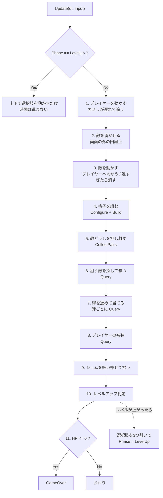
```mermaid
flowchart TD
    S["Update(dt, input)"] --> LU{"Phase == LevelUp ?"}
    LU -->|Yes| C1["上下で選択肢を動かすだけ<br/>時間は進まない"]
    LU -->|No| P1["1. プレイヤーを動かす<br/>カメラが遅れて追う"]
    P1 --> P2["2. 敵を湧かせる<br/>画面の外の円周上"]
    P2 --> P3["3. 敵を動かす<br/>プレイヤーへ向かう / 遠すぎたら消す"]
    P3 --> P4["4. 格子を組む<br/>Configure + Build"]
    P4 --> P5["5. 敵どうしを押し離す<br/>CollectPairs"]
    P5 --> P6["6. 狙う敵を探して撃つ<br/>Query"]
    P6 --> P7["7. 弾を進めて当てる<br/>弾ごとに Query"]
    P7 --> P8["8. プレイヤーの被弾<br/>Query"]
    P8 --> P9["9. ジェムを吸い寄せて拾う"]
    P9 --> P10["10. レベルアップ判定"]
    P10 --> P11{"11. HP <= 0 ?"}
    P11 -->|Yes| GO["GameOver"]
    P11 -->|No| E["おわり"]
    P10 -.->|レベルが上がったら| LV["選択肢を3つ引いて<br/>Phase = LevelUp"]
```

**10 でレベルが上がったら、そこで止まる**。
Day 29 は `while` で一気に上げていたが、選択を挟むならそれはできない——
1回に1レベルずつ処理して、選び終わってから次のレベルを見る。

入れ替えると壊れるところ:

| 順番 | なぜそこか |
|---|---|
| 4 が 3 の後 | 動かす前に組むと、**1ステップ古い位置**で判定することになる |
| 5〜8 が 4 の後 | 全部**同じ格子**を使う。組み直すと4倍のコストになる |
| 10 が 9 の後 | ジェムを拾ってからでないと、レベルが1ステップ遅れる |

**格子を1回組んで4通りに使う**のが今日いちばんの節約になっている。

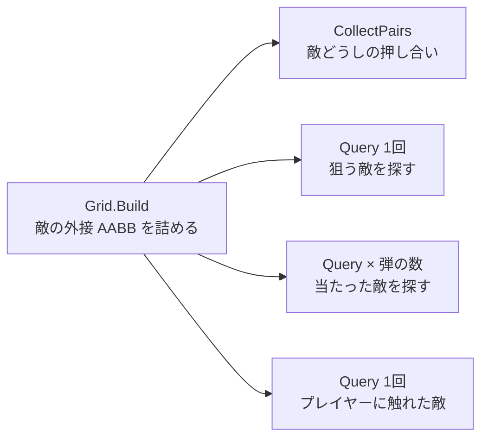
```mermaid
flowchart LR
    B["Grid.Build<br/>敵の外接 AABB を詰める"]
    B --> Q1["CollectPairs<br/>敵どうしの押し合い"]
    B --> Q2["Query 1回<br/>狙う敵を探す"]
    B --> Q3["Query × 弾の数<br/>当たった敵を探す"]
    B --> Q4["Query 1回<br/>プレイヤーに触れた敵"]
```

実測(敵 509 体):

| | 組の数 |
|---|---|
| 総当たりなら | 129,286 組 |
| 格子の候補 | **594 組** |

**99.5% 減っている**。押し合いは「全員対全員」なので、
格子が無ければこの演出はそもそも載らない(Day 26 の要点5)。

そして 2〜4 は `CollectPairs` ではなく `Query` を使う。
**1対多は組の列挙では表せない**——
弾1発について「近くにいる敵」を知りたいだけなので、
全部の組を作ってから絞るのは無駄になる。

### 武器3種 — 当たり判定をどこに置くか

3つの武器の違いは、突き詰めると<b>当たり判定をどこに置くか</b>だけになる。

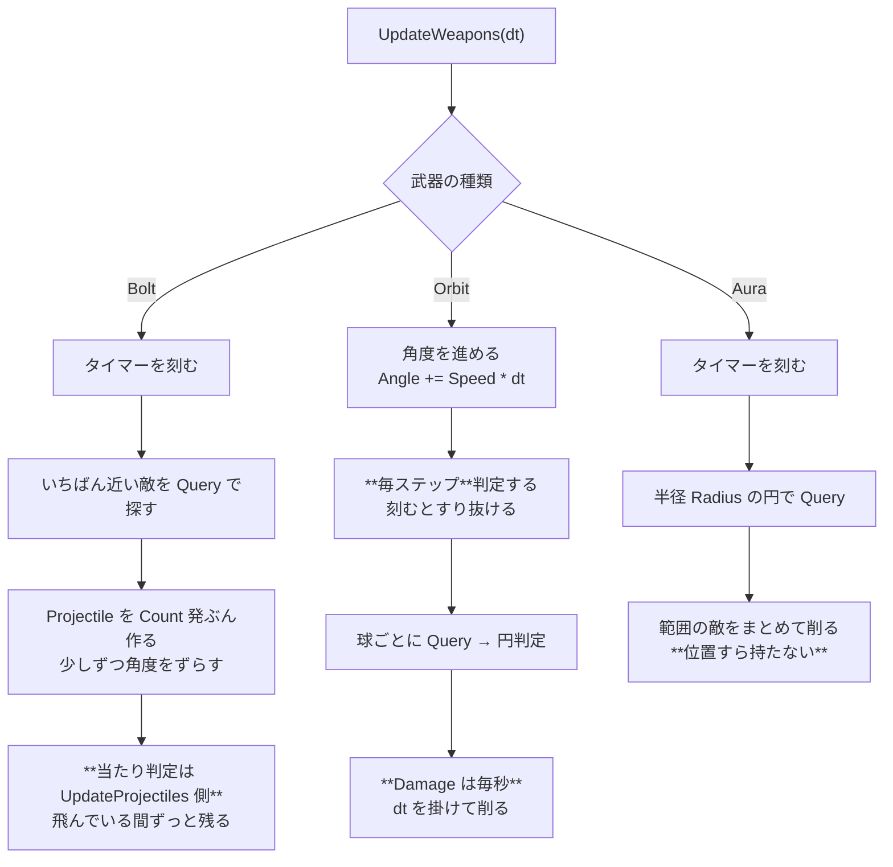
```mermaid
flowchart TD
    W["UpdateWeapons(dt)"] --> K{"武器の種類"}

    K -->|Bolt| B1["タイマーを刻む"]
    B1 --> B2["いちばん近い敵を Query で探す"]
    B2 --> B3["Projectile を Count 発ぶん作る<br/>少しずつ角度をずらす"]
    B3 --> B4["**当たり判定は UpdateProjectiles 側**<br/>飛んでいる間ずっと残る"]

    K -->|Orbit| O1["角度を進める<br/>Angle += Speed * dt"]
    O1 --> O2["**毎ステップ**判定する<br/>刻むとすり抜ける"]
    O2 --> O3["球ごとに Query → 円判定"]
    O3 --> O4["**Damage は毎秒**<br/>dt を掛けて削る"]

    K -->|Aura| A1["タイマーを刻む"]
    A1 --> A2["半径 Radius の円で Query"]
    A2 --> A3["範囲の敵をまとめて削る<br/>**位置すら持たない**"]
```

| | 当たり判定の置き場所 | 残るか | 刻むか |
|---|---|---|---|
| ボルト | `Projectile` の配列 | 寿命まで残る | 発射を刻む |
| オービット | その場で計算 | **残らない** | **刻まない**(毎ステップ) |
| オーラ | プレイヤーの周り | 残らない | 削りを刻む |

**「武器 = 弾を出すもの」と決めつけて設計すると、オービットとオーラが入らない**
(Day 29 の改造課題3で触れた分かれ道)。
今日の形は、`WeaponState` を「種類とレベルとタイマー」だけにして、
<b>当たり方は種類ごとの関数に任せる</b>——
つまり案A(enum + 分岐)を選んでいる。

3種類のうちはこれが読みやすい。5種類を超えたら、
`WeaponStats` のフィールドの意味が武器ごとに違うのが苦しくなるので、
そこが案C(完全にデータで持つ)へ移る目安になる。

### オービットだけ刻まない理由

これは実装中に実際に踏んだところ。**最初は 0.22 秒ごとに判定していて、
オービットだけで 40 秒遊んで撃破 0 体**になった。

```mermaid
flowchart LR
    T1["t=0.00s<br/>球はここ"] -->|"0.22秒で 50px 進む"| T2["t=0.22s<br/>球はここ"]
    E["敵はこの間にいた<br/>**一度も判定されない**"]
    T1 -.-> E
    T2 -.-> E
```

球は 1 秒に 200px 以上動く。0.22 秒ごとに位置を見ると、
**1回の判定の間に 50px 飛ぶ**。球の直径は 22px しかないので、
その間にいた敵はすり抜ける。

Day 25 の改造課題3(速い弾が細い壁をすり抜ける)とまったく同じ話が、
**攻撃側で起きた**ことになる。直し方も同じ2択で、

1. 移動前と移動後を結んだ範囲で判定する(連続衝突判定)
2. **毎ステップ判定して、ダメージを時間で割る**

ここでは 2 を採った。触れている間ずっと削る形になるので、
「巻き付いて削る武器」という手触りにも合う。
そのぶん `WeaponStats.Damage` の単位が武器で変わる
(オービットだけ「毎秒」)——**気持ち悪いが、揃えると片方が嘘になる**。
## 完成条件

```
dotnet run --project reference/Day30 -c Release
```

`Enter` でタイトル、もう一度 `Enter` で開始。BGM が流れる。

### 遊ぶ

最初はボルト1本。40 秒くらいで最初のレベルアップが来る。

**時間が止まって、3つの選択肢が出る**。↑↓ で選んで Enter。

見てほしいのは、**どれを選んでも遊びが変わる**こと。

| 選ぶもの | 何が変わるか |
|---|---|
| オービット | 周りに球が回り出す。**近づいてきた敵が勝手に溶ける** |
| オーラ | 足元に薄い円が出る。**囲まれるほど効く** |
| ボルト Lv.3 | 弾が2発になる。**扇状に飛ぶので、群れに当たる** |
| 軽い足 | 逃げやすくなる。**攻撃力は上がらない** |
| 引き寄せ | ジェムが遠くから飛んでくる。**レベルが速く上がる** |

`種 1234567` のようにコンソールに出るのが、その試合の乱数の種。
**同じ種なら同じ試合**になる(要点5)。

### 難易度の曲線

| 経過 | 何が起きるか |
|---|---|
| 〜60 秒 | 押し返せる。敵は 20 体くらいで安定する |
| 90 秒 | 湧く速さが倒せる速さを追い越す。溜まり始める |
| 120 秒 | 100 体を超える。**武器を育てていないと押し切られる** |
| 150 秒 | 300 体以上。逃げ道を探す遊びになる |

`End` で 30 秒ずつ飛ばせる。**選択も自動で進む**ので、
5 回押すと「そこそこ育った状態の 150 秒」がすぐ見られる。

### 数字を見る

画面の左下と右上に、ゲームとしては要らない行が出ている。

```
ボルト Lv.3  オーラ Lv.2                 ← 右上: 持っている武器
敵 362  弾 0  ジェム 46  撃破 194
格子 33x27  最大18/マス  候補 344        ← 左下: エンジンの数字
```

362 体の総当たりなら 65,341 組になるところが、格子で 344 組。
そして**ドローコール1回**——敵も弾も球もジェムも HUD の帯も、
全部同じアトラスの絵なので1回で描き切れる(Day 17〜18)。

### `Tab`: 自己チェックと計測

22 項目すべて `OK` になる。最初に3つの種で試合を回すので、10 秒ほどかかる。

```
[--] 種  11: 放置  137.4秒(Lv. 9 撃破  423) / 移動  300.0秒(Lv.11 撃破  676)
[--] 種  29: 放置  300.0秒(Lv.20 撃破 3234) / 移動  151.3秒(Lv. 6 撃破  167)
[--] 種  47: 放置  120.5秒(Lv. 7 撃破  236) / 移動  231.3秒(Lv. 8 撃破  328)
[OK] どの試合でも育って倒せる  3 試合 x 2 通り、Lv.5 以上 / 撃破 100 以上
[OK] 逃げ回るほうが長く生きる(3試合の平均)  放置 185.9秒 → 移動 227.5秒
[OK] レベルアップで止まる  38.8秒 / Lv.2
[OK] 止まっている間は時間が進まない  38.83秒 → 38.83秒
[OK] 選択肢が重複しない  引き寄せ / 軽い足 / オーラ を習得
[OK] ボルト だけで倒せる  38.6秒で 18 体
[OK] オービット だけで倒せる  42.4秒で 4 体
[OK] オーラ だけで倒せる  30.6秒で 5 体
  すべて合格
```

いちばん見てほしいのは **`[--]` の3行**。
同じ設定なのに、**放置が 120 秒のときも 300 秒のときもある**。
引いた強化が噛み合うかどうかで結果が倍以上ぶれる——
これは狙いどおりだが、**1試合の結果では何も言えない**ということでもある。
だから比較は3つの種の平均で見ている(要点5)。

そして `ボルト / オービット / オーラ だけで倒せる` の3行。
**混ざった状態では確かめられない**——ボルトが動いているせいで、
オーラが1体も削っていないことに気づけない。
実際、この3行を書いたおかげで**オービットのすり抜け**(要点7)が見つかった。

## 改造課題

### 課題1(易): 4つ目の武器を足す

`Weapon.cs` の3箇所を直せば動く。

```csharp
enum WeaponKind { Bolt, Orbit, Aura, Mine }   // 1. 種類を足す
public const int KindCount = 4;                // 2. 数を直す
// 3. NameOf / SummaryOf / StatsFor に分岐を足す
```

例として「地雷」——**その場に置いて、触れた敵を巻き込む**。
`Projectile` を速度 0 で作り、寿命を長くすれば、既にあるものだけで作れる。

やってみると**どこを直したか**が分かる。
`GameView` の色、`UpdateWeapons` の分岐、`RollChoices` の候補——
種類を1つ足すのに何箇所さわったかが、そのまま
「案A(enum + 分岐)の限界がどこにあるか」の答えになる。

3 種類のうちは分岐で読みやすいが、
**8 種類あたりで `switch` が読めなくなる**のを自分の手で確かめてほしい。

### 課題2(中): 選択肢に「レア度」を入れる

いまの抽選は候補を等確率で混ぜているだけ。
強い選択肢ほど出にくくすると、**引きの良し悪しが遊びになる**。

```csharp
// 案: 候補に重みを持たせて、重み付きで引く
pool.Add((UpgradeOption.NewWeapon(weapon), weight: 3));
pool.Add((UpgradeOption.MaxHealth(), weight: 10));
```

重み付きの抽選は「重みの合計までの乱数を引いて、前から引き算していく」で書ける。
ただし**要点6の罠がここにも出る**——重複なしで3つ引くとき、
「引いて被ったら引き直す」にすると、重みが偏っているほど終わらなくなる。
1つ引くたびに候補から取り除いて、合計を引き直すのが正解。

そのうえで、**レベルが上がるほど良いものが出やすくする**と、
序盤と終盤で選択画面の意味が変わる。
`Tab` の3試合を回して、**平均生存時間がどう動くか**を測ってから決めるとよい。

### 課題3(難): 選んだものを保存して、次の試合に引き継ぐ

いま試合が終わると全部消える。
「前回の記録」や「解放した武器」を残すと、遊ぶ理由がもう一段増える。

Day 24 の `SceneSerializer` がそのまま使える形になっている——
`SurvivorGame` の状態は全部ただの数字と配列なので、JSON にできる。

考えどころは**何を残すか**。

| 残すもの | 何が起きるか |
|---|---|
| 最高記録だけ | 一番安全。**遊びは変わらない** |
| 解放した武器 | 次の試合の選択肢が増える。**初回が単調になる** |
| 永続の強化 | 遊ぶほど強くなる。**下手でもいつか勝てる代わりに、上達の意味が薄れる** |

3つ目は Vampire Survivors がやっていることで、
**繰り返し遊ばせる仕掛け**として強力な反面、
「上手くなった」と「強化を買った」の区別が付かなくなる。
どちらを取るかは好みの問題なので、**自分の答えを決めてから書く**こと。

保存先は `Path.GetTempPath()` ではなく
`Environment.SpecialFolder.ApplicationData` の下にするのが行儀がよい
(Day 24 は実演なので temp にしてある)。

## 動作確認済み環境

- Windows 11 / .NET 10 / Silk.NET 2.23.0
- GL_RENDERER: NVIDIA GeForce RTX 3070/PCIe/SSE2
- 960x640、VSync オフ、`-c Release`、シミュレーション 60Hz

### 自己チェック(22 項目すべて合格)

```
[--] 種  11: 放置  137.4秒(Lv. 9 撃破  423) / 移動  300.0秒(Lv.11 撃破  676)
[--] 種  29: 放置  300.0秒(Lv.20 撃破 3234) / 移動  151.3秒(Lv. 6 撃破  167)
[--] 種  47: 放置  120.5秒(Lv. 7 撃破  236) / 移動  231.3秒(Lv. 8 撃破  328)
[OK] どの試合でも育って倒せる  3 試合 x 2 通り、Lv.5 以上 / 撃破 100 以上
[OK] 逃げ回るほうが長く生きる(3試合の平均)  放置 185.9秒 → 移動 227.5秒
[OK] 敵が配列を超えない  442 / 1200
[OK] 弾が配列を超えない  2 / 400
[OK] ジェムが配列を超えない  50 / 600
[OK] 倒した敵が配列に残っていない  生存 442 体
[OK] 押し合いで座標が壊れない
[OK] プレイヤーの座標が壊れない  <-79.88848, 1614.4534>
[OK] 敵を倒せている  165 体
[OK] レベルが上がる  Lv.6
[OK] 敵が押し寄せている  442 体
[OK] 同じ入力なら同じ結果  撃破 29/29  敵 18/18
[OK] 格子で候補が減っている  497 組(総当たりなら 97,461 組)
[OK] レベルアップで止まる  38.8秒 / Lv.2
[OK] 止まっている間は時間が進まない  38.83秒 → 38.83秒(止まった合計 0.0秒)
[OK] 選択肢が 3 つ出る  3 個
[OK] 選択肢が重複しない  引き寄せ / 軽い足 / オーラ を習得
[OK] 選ぶと反映される  「引き寄せ」
[OK] 選び終わると再開する
[OK] ボルト だけで倒せる  38.6秒で 18 体
[OK] オービット だけで倒せる  42.4秒で 4 体
[OK] オーラ だけで倒せる  30.6秒で 5 体
[OK] 長く遊んでも武器が育つ  2 種類 / Lv.6 / 151.3秒
```

### 時間が進むとどうなるか(逃げ続けて、選択は自動)

| 経過 | 敵 | 弾 | ジェム | 候補 | 撃破 | Lv | 武器 | 1ステップ |
|---|---|---|---|---|---|---|---|---|
| 15s | 11 | 2 | 5 | 0 | 6 | 1 | B1 | 0.004ms |
| 30s | 10 | 0 | 11 | 0 | 15 | 1 | B1 | 0.004ms |
| 60s | 24 | 2 | 22 | 4 | 42 | 3 | B1 | 0.005ms |
| 90s | 47 | 3 | 34 | 28 | 68 | 4 | B1 A1 | 0.007ms |
| 120s | 112 | 1 | 42 | 60 | 98 | 5 | B1 A2 | 0.011ms |
| 150s | **362** | 0 | 46 | 344 | 159 | 6 | B1 A2 | 0.037ms |
| 180s | — | | | | | | | 165.0 秒で力尽きた(撃破 175) |

`B` = ボルト、`O` = オービット、`A` = オーラ。数字はレベル。

**1ステップ 0.037ms** で 362 体。60fps の予算 16.6ms の 0.2% しか使っていない。
Day 26 で測った「20,000 体で 15.8ms」からすると、体数だけならまだ大きな余裕がある。

### 実際に描いたときの数

| | 選択画面(敵 15 体) | 終盤(敵 463 体) |
|---|---|---|
| ドローコール | **1** | **1** |
| ゲームの1ステップ | 0.004ms | 0.000ms(止まっている) |
| 焼いたグリフ | 159 字 | 142 字 |
| GL エラー | なし | なし |

**選択画面でもドローコールは1回**。暗幕も選択肢の枠も、
`sprite-box` を色違いで積んでいるだけなので、バッチが切れない。

### 検証の途中で分かったこと

- **オービットだけで 40 秒遊んで撃破 0 体**だった。
  0.22 秒ごとに位置を見て判定していたが、球は 1 秒に 200px 以上動くので、
  1回の判定の間に 50px 飛んでいた。球の直径は 22px なので当然すり抜ける。
  Day 25 の改造課題3と同じ話が攻撃側で起きた形で、
  **「刻んで判定する」が通じるのは、判定するものがゆっくり動くときだけ**。
  この不具合は「3種類の武器を単体で試す」チェックを書いたから見つかった——
  混ざった状態ではボルトが敵を倒し続けるので、絶対に気づけない
- **走る敵をプレイヤーより速くしたら、逆効果だった**。
  「完璧に逃げ続けると死なない」を直そうとして 190(プレイヤーは 180)にしたら、
  追いつく敵は**動いている人だけを罰する**ので、
  自動で確かめると「放置のほうが長生きする」という結果になった
  (放置 219 秒 / 移動 191 秒)。
  速い敵の役目は「立ち止まっているとすぐ距離を詰められる」ことであって、
  「逃げても無駄」ではない。140 に戻したら順序が正しくなった
- **1試合の結果では何も言えなかった**。
  選択肢を入れたことで、引いた強化しだいに生存時間が倍以上ぶれるようになった
  (種 29 の放置は 300 秒を生き延びて Lv.20、種 47 の放置は 120 秒)。
  最初は1試合ずつ比べていて、たまたま放置側が早くオーラを引いただけの結果を
  「バランスが壊れている」と読み違えた。
  **種を変えて何度か回して平均を見る**——乱数を外から渡せるようにしてあると、
  これが数行で書ける
- **Day 29 の乱数は種が固定だった**。決定性のありがたみ(自己チェックが同じ結果を出す)
  に気を取られて、**遊ぶ側から見ると毎回同じ試合**という副作用を見落としていた。
  答えは「決定性を捨てる」ではなく「種を外から渡す」で、
  Day 19 で入力を値に畳んだのとまったく同じ形になる
- **エンジンには1文字も触らずに済んだ**。
  武器を3種類に増やしても、選択画面を足しても、BGM を流しても、
  `Core` 〜 `Physics` は Day 29 のまま。
  Phase 5 で確かめたかったのは機能の数ではなく、
  **次に作るものが直さずに載るか**だった
