# Day 31: FBOとRender To Texture、HDRパイプライン(ACESトーンマッピング、ブルーム)

**Phase 6(デモ必須編)の1日目**。Day 30 でエンジン本体は完成した。
ここからの 10 日は「AAA デモとして見せる」ための描画を積んでいく。

## 今日のゴール

描いた絵が画面へ直行しなくなる。いったんテクスチャに描き、
**明部を抜く → ぼかす → 露出・トーンマップ・ガンマ**を通ってから画面に出る。

3D の背景に、明るさ **0.25 から 32 まで** の階段が並ぶ。

```
 Shift+3 でトーンマップを切り替えると、階段の見え方が変わる

 なし       ▓ ▒ █ █ █ █ █ █     1.0 から右が全部おなじ白
 Reinhard   ▓ ▒ ░ ░ ▒ ▓ █ █     右まで見分けはつくが全体が眠い
 ACES       ▓ ▒ ░ ░ ▒ █ █ █     4 あたりまで段差が戻り、暗部も締まる
            ↑                   ↑
          0.25                 32
```

そして Shift+1 でシーンバッファを 8bit に落とすと、
**露出をいくら下げても上の段は戻ってこない**。畳む前に 1.0 で切られているから。

これが「なぜ中間バッファを浮動小数点にするのか」の答えそのものになる。

## 事前に読む資料

- [ゲームグラフィックス特論 B-14: 遅延レンダリング](https://tokoik.github.io/gg/)(**前半のみ**)
  FBO と Render To Texture の作り方。後半の G-Buffer は Day 51 で読む
- **西川本 Ch7「HDRレンダリング」**
  なぜ 8bit では足りないのか、トーンマッピングとブルームが何を模しているか。
  今日の理論の要点1〜4はほぼこの章の内容
- [LearnOpenGL: Framebuffers](https://learnopengl.com/Advanced-OpenGL/Framebuffers) /
  [HDR](https://learnopengl.com/Advanced-Lighting/HDR) /
  [Bloom](https://learnopengl.com/Advanced-Lighting/Bloom)
  実装の最短経路。今日書くコードの骨格はこの3本と同じ
- [Krzysztof Narkowicz: ACES Filmic Tone Mapping Curve](https://knarkowicz.wordpress.com/2016/01/06/aces-filmic-tone-mapping-curve/)
  `composite.frag` に写す5つの定数の出どころ。**元の ACES は 3x3 行列を2回挟む重い変換**で、
  それを1本の有理式に当てはめたのがこの記事
- [LearnOpenGL: Gamma Correction](https://learnopengl.com/Advanced-Lighting/Gamma-Correction)
  要点2(リニアワークフロー)の背景。**今日いちばん事故りやすいところ**

## 理論の要点

### 1. フレームバッファを差し替えると、描いた絵をもう一度読める

Day 14 からずっと、描画の行き先は「既定のフレームバッファ」——
ウィンドウが用意した、画面に直結した描き込み先——だった。
これは `glBindFramebuffer(GL_FRAMEBUFFER, 0)` の状態で、
**0 番だけが特別扱い**で「窓」を指す。

自分でフレームバッファを作ると、行き先をテクスチャに差し替えられる。

```csharp
_gl.BindFramebuffer(FramebufferTarget.Framebuffer, _handle);
_gl.Viewport(0, 0, (uint)Width, (uint)Height);   // ← 忘れると壊れる
```

フレームバッファ自体は入れ物でしかなく、中身は「アタッチメント」として外から挿す。
今日挿すのは2つ。

| アタッチメント | 何にするか | なぜ |
|---|---|---|
| カラー | **テクスチャ** | あとで読むから |
| デプス | **レンダーバッファ** | 読まないから |

読まないものにテクスチャの機能(フィルタ、ミップマップ、サンプラ)を持たせても無駄で、
レンダーバッファは「描き込み専用のメモリ」として GPU が圧縮などの最適化をかけやすい。
深度を読みたくなったら(影は Day 33、SSAO は Day 37)そこでテクスチャに変える。

**ビューポートは付いてこない**のが最初の罠。
ビューポートは「クリップ座標をどのピクセル範囲に写すか」という別の状態なので、
半分の大きさのバッファに切り替えたのに設定を忘れると、
**左下 1/4 にだけ絵が入り、残りが黒いまま**になる。

もうひとつ、**完全性(completeness)の確認は必ず書く**。

```csharp
GLEnum status = _gl.CheckFramebufferStatus(FramebufferTarget.Framebuffer);
if (status != GLEnum.FramebufferComplete) { throw ... }
```

不完全なフレームバッファに描いても**エラーは出ず、ただ何も起きない**。
画面が真っ黒になるだけで、原因を教えてもらえない。

そして、ここから先が全部開く。

| 何ができるようになるか | いつ |
|---|---|
| 画面全体に効く処理(トーンマップ、ブルーム) | **今日** |
| 影(光の位置から深度だけを描いて保存) | Day 33 |
| 環境マップ(別の視点から描いて貼る) | Day 36 |
| 遅延レンダリング(位置・法線・色を別々に貯める) | Day 51 |

**1回では終わらない描画**が、全部ここから始まる。

### 2. 8bit のバッファは、明るさを 1.0 で切る

これが今日いちばんの動機。

8bit(`RGBA8`)は 0.0〜1.0 を 256 段で刻むだけなので、2つのことが同時に起きる。

- **1.0 を超える明るさは、書いた瞬間に 1.0 に丸められる**
- **暗いところは 1/255 刻みしか無く、露出を上げると縞になる**

露出もトーンマッピングも「1.0 を超えたぶんをどう畳むか」の話なので、
**畳む前に切られていたら何もできない**。

現実の明るさは月明かりから太陽まで 10 桁以上の幅がある。
画面が出せるのはそのうちの狭い一区間だけなので、
「どの区間を切り出すか(露出)」と「区間の外をどう畳むか(トーンマップ)」を
決める必要がある。**その2つを決める材料が、8bit では残っていない**。

`Shift+8` の自己チェックが、これを数値で確かめる。

```
[OK] RGBA16F: **4.0 が 4.0 のまま入る**  実際 4.000
[OK] RGBA8: **4.0 は 1.0 に丸められる**  実際 1.000
[OK] RGBA8: 暗部は 1/255 刻みに丸められる  実際 0.25098(64/255 = 0.25098)
```

`RGBA16F` を選ぶのは、32bit float より**帯域が半分**で、
色の精度としてはまず足りるから。半精度は仮数部 10bit なので
**相対誤差 1/1024 程度**——明るさが 100 でも 0.1 でも「その値に対して 0.1%」の精度が保たれる。
8bit が「0.5 付近でも 0.01 付近でも 1/255」と絶対値で刻むのと、ここが決定的に違う。

### 3. リニアワークフロー: 掛け算しかしないうちは、間違っていても気づかない

**今日いちばん事故りやすいのがここ**。

PNG の中の 128 は「明るさ 0.5」ではない。
ディスプレイのガンマ(だいたい 2.2 乗)を打ち消すようにあらかじめ曲げてある値で、
実際の明るさは 0.5^2.2 ≒ 0.22 にあたる。

Day 30 まではこの曲がった値のまま掛け算していた。それでも破綻しなかったのは、
**掛け算がガンマと交換できる**から。

```
   a^2.2 × b^2.2 = (a × b)^2.2      ← リニアで掛けてから戻すのと、そのまま掛けるのが一致する
```

だが**足し算は交換できない**。

```
   a^2.2 + b^2.2 ≠ (a + b)^2.2
```

ブルームは足し算で、トーンマップは非線形な畳み込み。
**今日から足し算が入るので、曲がったままでは合わなくなる**。

そこで、明るさを扱うところは全部リニアに揃える。

| どこ | どうするか |
|---|---|
| テクスチャ | 内部形式を `Srgb8Alpha8` に。**GPU が読むときに戻す(無料)** |
| 頂点色 | フラグメントシェーダで `pow(c, 2.2)` |
| `uTint`(マテリアル色) | **変換しない**。1 を超えてよい「明るさの倍率」という意味に変えた |
| `glClearColor` | C# 側で 2.2 乗して渡す(シェーダを通らないので) |
| 出口 | `composite.frag` で `pow(c, 1/2.2)` して符号化に戻す |

**アルファは変換しない**。α は色ではなく「どれだけ混ぜるか」の割合で、
ガンマ符号化の対象ではない。ここを一緒に `pow` すると半透明が濃くなる。

`uTint` だけ扱いが違うのは、発光するものが `Tint = (6, 5.2, 2.2)` のような
1 を超える値を入れるため。sRGB として扱うと 6.0 が 2.2 乗されて 60 になってしまう。
「見た目で選ぶ色」と「明るさの倍率」を同じ uniform に載せているのが本来おかしく、
PBR(Day 35)ではベースカラーと発光を別の入力に分けることになる。

**揃え忘れると「移行したら色が変になった」が起きる**。
実際、床のマテリアルは Day 30 の `(0.45, 0.50, 0.60)` をそのまま置いておくと
2.2 乗ぶん明るくなるので、リニアへ直した数字に書き換えてある。

### 4. トーンマッピングは物理ではなく、好みの問題

トーンマッピングは「0〜∞ の明るさを 0〜1 に畳む」関数。
写真の現像でネガの濃度を印画紙の濃度に写す作業と同じ役割で、名前もそこから来ている。

**どう畳むかに正解は無い**。だから流儀がいくつもある。今日は2つ書く。

```glsl
vec3 Reinhard(vec3 x) { return x / (1.0 + x); }
```

0 は 0 に、1 は 0.5 に、∞ は 1 に写る。単調増加で必ず 1 未満に収まる。
短くて軽いが、**中間の明るさが軒並み暗くなる**ので全体が眠くなる。

```glsl
vec3 AcesFilmic(vec3 x)
{
    const float a = 2.51, b = 0.03, c = 2.43, d = 0.59, e = 0.14;
    return clamp((x * (a * x + b)) / (x * (c * x + d) + e), 0.0, 1.0);
}
```

映画のフィルムに近い畳み方の近似。Reinhard との違いは**両端の形**にある。

- 暗部で少し持ち上がる(足がついている)ので、影が潰れずコントラストが立つ
- 明部が S 字で緩やかに寝るので、白飛びの手前に「粘り」が出る

ゲームで「フィルムっぽい」と言われる絵は、だいたいこの形をしている。

**ACES にも白飛びする点(ホワイトポイント)はある**。
この近似式は 7 くらいで 1.0 に達するので、8 から右は白のまま。
そこを見たければ露出を下げる——
**「畳み方」と「どこを切り出すか」は別の道具**で、両方いる。

順番も決まっている。

```
   露出 → ブルーム加算 → トーンマップ → ガンマ
```

- **露出はトーンマップより前**。トーンマップは「1.0 付近をどう扱うか」の関数なので、
  その前に「何を 1.0 とみなすか」を決めておく必要がある
- **ブルームもトーンマップより前**。あとで足すと、
  すでに畳まれた絵の上に光を重ねることになり、滲みが白い板になる
- **ガンマはいちばん最後**。トーンマップの曲線はリニアな値を入れる前提なので、
  先にガンマをかけると暗部が持ち上がりすぎて全体が白っぽくなる

### 5. ブルームは「1.0 を超えていること」を伝える唯一の手段

画面が出せる最大の白は 1.0 で頭打ちなので、
**「まぶしい」は周りへの滲みでしか表現できない**。
レンズやまつ毛や眼球の中で光が散る現象を真似ている。

しきい値は 1.0 のあたりに置く。0.5 まで下げると
「明るくない部分」まで滲んで画面全体が霞む。

しきい値でスパッと切ると**「ここから光る」という輪郭線**が出るので、
`smoothstep` でなめらかに立ち上げる(ソフトニー)。
球のハイライトのように明るさが少しずつ変わる面だと、
カメラが動くたびにその線が面の上を這うのがはっきり見える。

明るさの判定は**人の目の感度で重み付け**する。

```glsl
float luminance = dot(color, vec3(0.2126, 0.7152, 0.0722));   // Rec.709
```

単純平均にすると、同じ数値の青が緑と同じだけ光ることになって不自然になる。

削るのは**明るさだけで、色は保つ**。

```glsl
FragColor = vec4(color * weight, 1.0);   // しきい値ぶんを「引く」のではなく「掛ける」
```

引くと色が薄くなる(飽和した赤がピンクへ寄る)。掛けるだけなら色相はそのまま残る。

### 6. ガウスぼかしは縦横に分けると劇的に安くなる

2次元のガウス関数は縦と横の掛け算に分解できる。

```
   G(x, y) = G(x) × G(y)
```

だから「横だけぼかす」→「縦だけぼかす」の2回で、2次元のぼかしと同じ結果になる。
手間はまるで違う。

| 半径 N のぼかし | 1ピクセルあたりのサンプリング回数 | N=4 なら |
|---|---|---|
| 2次元まとめて | (2N+1)² | 81 回 |
| 縦横に分けて | (2N+1) × 2 | **18 回** |

効くのは「分解できる」フィルタだけで、中央値フィルタやバイラテラルフィルタは分解できない。
ガウスがどこでも使われるのは、この性質があるからでもある。

実装で必ずぶつかるのが **ping-pong**。
GPU は「同じテクスチャを読みながら同じテクスチャへ書く」ことを許さない
(読み書きの順序が保証されないので結果が未定義になる)ので、
2枚を交互に使う。

そして**ぼかし用のバッファは画面の半分**にする。
ぼかしたものを縮めても分からないので、ピクセル数 1/4 = コスト 1/4。
おまけに「縮めて拡大する」こと自体が弱いぼかしとして働くので、
同じタップ数でより広く滲む。**質を落とさずに 4 倍安くなる**、後処理では珍しく素直な最適化。

### 7. 後処理は、シーンが残した GL の状態を畳んでから走らせる

OpenGL の状態はグローバルなので、直前に何が描かれたかで挙動が変わる。
フルスクリーンの板にとって、次の4つはどれも「効いていたら困る」もの。

| 残っていると | どうなるか |
|---|---|
| 深度テスト | シーンの深度が残っているので、板が奥と判定されて消える |
| ブレンド | 半透明として画面に混ざる |
| 背面カリング | 板の向き次第で消える |
| ワイヤーフレーム(`W` キー) | 板の輪郭線しか出ず、**画面がほぼ真っ黒になる** |

**後処理が真っ黒のときは、まずこの4つを疑う**。

畳んだら元に戻す。戻さないと `Z` / `C` / `W` キーの設定が次のフレームから効かなくなる。

```csharp
_gl.GetInteger(GetPName.PolygonMode, polygonModes);   // ← int を 2 個返す
```

`GL_POLYGON_MODE` は表面用と裏面用の **int を2個**返すので、
`out int` の版を使うと GL が 2 個目を書き込む先が無く、その場のメモリを踏む。
返る個数は `glGet` の項目ごとに決まっているので、必ず仕様を見て器を用意する。

もうひとつ、フルスクリーンの板には**頂点バッファが要らない**。

```glsl
vec2 uv = vec2((gl_VertexID << 1) & 2, gl_VertexID & 2);
gl_Position = vec4(uv * 2.0 - 1.0, 0.0, 1.0);
```

頂点3個ぶんの座標を頂点番号から計算する。
**四角形(三角形2枚)ではなく、はみ出した三角形1枚**にするのが定番で、
四角形だと対角線上のピクセルが2つの三角形の境目になり、
GPU が 2x2 のピクセル単位で処理する都合でその線上だけ2回走る。
三角形1枚なら境目そのものが無い。

ただし**コアプロファイルでは VAO が 0 のまま描画すると `GL_INVALID_OPERATION`** になるので、
中身が空の VAO を1個だけ作ってバインドする。

## 前Dayからの差分概要

### 新規ファイル

| ファイル | 役割 |
|---|---|
| `Render/Framebuffer.cs` | 画面ではなくテクスチャへ描くための入れ物。カラー(テクスチャ)+デプス(レンダーバッファ)、リサイズ、完全性チェック |
| `Render/PostProcess.cs` | HDR パイプライン本体。バッファ4枚と 10 パスの手順、露出・トーンマップ・ブルームの設定 |
| `shaders/fullscreen.vert` | 頂点バッファ無しのフルスクリーン三角形 |
| `shaders/bright.frag` | 明部の抽出(しきい値+ソフトニー) |
| `shaders/blur.frag` | 分離型ガウスぼかし。方向を uniform で渡すのでシェーダは1本 |
| `shaders/composite.frag` | 露出 → ブルーム加算 → トーンマップ → ガンマ。**唯一、画面へ書くパス** |

### 変更ファイル

| ファイル | 変更 |
|---|---|
| `Render/Texture.cs` | `RenderTargetFormat` 列挙を追加。カラーテクスチャの内部形式を `Srgb8Alpha8` へ。`CreateTarget`(描き込み先の空テクスチャ)を追加 |
| `shaders/textured.frag` | 頂点色を sRGB→リニアへ。`uTint` は**変換しない**(明るさの倍率という意味に変更) |
| `shaders/sprite.frag` | 頂点色を sRGB→リニアへ |
| `shaders/text.frag` | 同上。被覆率(R8)は色ではないので変換しない |
| `Program.cs` | `PostProcess` の生成・リサイズ・破棄、`OnRender` を `Begin`/`End` で挟む、発光する立方体と明るさの階段、`Shift+数字` のスイッチ、`RunHdrCheck`、床マテリアルの色をリニアへ |

### キーは Shift + 数字にまとめた

文字キーはもう空きが無いので、今日のスイッチは全部 `Shift` 併用にした。

| キー | 何が変わるか |
|---|---|
| `Shift+1` | シーンバッファ `RGBA16F` ⇄ `RGBA8` — **今日の見せ場** |
| `Shift+2` | ブルーム ON/OFF |
| `Shift+3` | トーンマップ(なし → Reinhard → ACES) |
| `Shift+4` | 表示する段(最終 → シーンのみ → 明部 → ぼかし後) |
| `Shift+5` / `Shift+6` | 露出 ÷1.3 / ×1.3 |
| `Shift+7` | ブルームのしきい値(0.7 → 1.0 → 1.5 → 2.5) |
| `Shift+8` | HDR の自己チェック |
| `F5` | シェーダのリロード(**後処理も含む**) |

実装上の注意が1つ。C# の `switch` は上から順に照合するので、
**ガード付きの `case Key.Number1 when shift:` を、
ガード無しの `case Key.Number1:`(シミュレーションレート)より先に書く**。
逆に書くとコンパイルエラーになる。

### 写経する順番

依存の下から。シェーダを先に置くのは、`PostProcess` が起動時に名前で読むため。

1. **`shaders/fullscreen.vert`**(新規)
   頂点バッファ無しのフルスクリーン三角形。`gl_VertexID` から座標を作る
2. **`shaders/bright.frag`**(新規)
   明部の抽出。輝度の重み付けとソフトニー
3. **`shaders/blur.frag`**(新規)
   分離型ガウス。`uDirection` で横/縦を切り替える
4. **`shaders/composite.frag`**(新規)
   Reinhard と ACES、露出、ブルーム加算、ガンマ。**今日いちばん長いシェーダ**
5. **`shaders/textured.frag`**(変更)
   `SrgbToLinear` を追加して頂点色に適用。`uTint` はそのまま掛ける
6. **`shaders/sprite.frag`**(変更)
   同じ変換を頂点色に。アルファは触らない
7. **`shaders/text.frag`**(変更)
   同上。被覆率は変換しない
8. **`Render/Texture.cs`**(変更)
   `RenderTargetFormat` 列挙 → `FromPixels` の内部形式を `Srgb8Alpha8` へ → `CreateTarget` を追加。
   **`Framebuffer` がこの2つを使う**ので先に書く
9. **`Render/Framebuffer.cs`**(新規)
   FBO の生成・アタッチ・完全性チェック・リサイズ。`Texture.CreateTarget` を呼ぶ
10. **`Render/PostProcess.cs`**(新規)
    バッファ4枚と 10 パス。`Framebuffer` を使うので後
11. **`Program.cs`**(変更)
    ヘッダのコメント → `Emitters` / `LadderSteps` → `_post` / `_emissiveMaterial` / `ClearColor` の
    フィールド → `OnLoad`(`PostProcess` 生成と発光マテリアル、床の色をリニアへ) →
    `OnFramebufferResize` → `OnRender`(`Begin`/`End` で挟む) →
    `RenderEmitters` / `RenderLadder` → `SrgbToLinear` → `DrawOverlayInfo` の HDR 行 →
    `ToneMapLabel` / `DebugViewLabel` → `OnKeyDown`(`shift` を switch の外へ出す + Shift 群 + F5) →
    `RunHdrCheck` → `OnClosing` → 起動時のコンソール出力とウィンドウタイトル
12. **`Day31.csproj`**(リネームのみ)
    中身は Day 30 と同じ。ファイル名を変えるだけで出力アセンブリ名が付いてくる

## 設計書

**Phase 6 の1日目**。層は増えていないが、`Render/` の中に**新しい種類の部品**が2つ入った。

| 増えたもの | 何をするか |
|---|---|
| `Framebuffer` | 画面ではなくテクスチャへ描くための入れ物 |
| `PostProcess` | シーンバッファ → 明部抽出 → ぼかし → 露出・トーンマップ・ガンマ |

これまでの `Render/` は「1枚の絵を描く道具」しか持っていなかった
(`Mesh` / `Material` / `SpriteBatch`)。今日入ったのは
**「描いた絵をもう一度読む」ための道具**で、性格がまるで違う。

Day 30 の設計書を丸ごと引き継ぎ、差分の当たった図にだけ手を入れてある。
変わった図は次の3つ。

| 図 | 何が変わったか |
|---|---|
| 全体構成 | 層も矢印も同じ。`Render/` の中身だけが増えた |
| `Render` のクラス図 | `Framebuffer` / `PostProcess` / `RenderTargetFormat` を追加 |
| 1フレームの流れ | 描画全体が `_post.Begin` 〜 `_post.End` に挟まれた |

そして新しく1つ足した。

| 図 | 何のために |
|---|---|
| HDR パイプラインの中身 | **10 回のフルスクリーンパス**がどう繋がっているか |

写経の前に読み込む必要はない。**途中で「これは誰が呼ぶんだったか」と迷ったときに戻ってくる場所**として使う。

### 全体構成 — 7つの層と、その上のゲーム

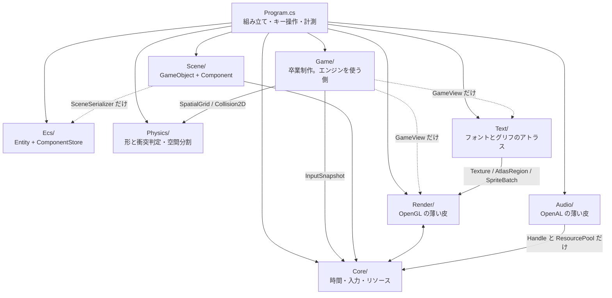
```mermaid
graph TD
    G["Game/<br/>卒業制作。エンジンを使う側"]
    P["Program.cs<br/>組み立て・キー操作・計測"]
    S["Scene/<br/>GameObject + Component"]
    E["Ecs/<br/>Entity + ComponentStore"]
    PH["Physics/<br/>形と衝突判定・空間分割"]
    T["Text/<br/>フォントとグリフのアトラス"]
    R["Render/<br/>OpenGL の薄い皮"]
    A["Audio/<br/>OpenAL の薄い皮"]
    C["Core/<br/>時間・入力・リソース"]

    P --> G
    P --> S
    P --> E
    P --> PH
    P --> T
    P --> R
    P --> A
    P --> C
    G -->|SpatialGrid / Collision2D| PH
    G -->|InputSnapshot| C
    G -.->|GameView だけ| T
    G -.->|GameView だけ| R
    S --> C
    S -.->|SceneSerializer だけ| E
    T -->|Texture / AtlasRegion / SpriteBatch| R
    R <--> C
    A -->|Handle と ResourcePool だけ| C
```

**Day 31 でもこの図は変わっていない**。矢印も層も Day 29 のまま。

後処理は `Render/` の中で閉じている。`PostProcess` が知っているのは
`GL` と `Framebuffer` と `Shader` と `ResourceManager` だけで、
**シーンに何が入っているかを一切知らない**。だから
`Program` が「今日はゲームを描く」「今日はデモを描く」と切り替えても、
後処理側は1行も変わらない。

**これが Render To Texture のいちばんの配当**で、
画面全体に効く処理(影・SSAO・被写界深度・ディファード)は
今後すべてこの位置に差し込むことになる。

**`Game` から `Audio` への線が無い**のが Day 29 から見てほしいところ。
音は鳴るが、鳴らしているのは `Program` で、ゲームは
「弾を撃った」「敵が死んだ」を <c>OnEvent</c> で外へ投げるだけ。

```csharp
public Action<GameEvent, Vector2>? OnEvent { get; set; }
```

こうしておくと、**自己チェックで 600 秒ぶんを無音で回せる**。
`SurvivorGame` が直接 `_audio.Play` を呼んでいたら、
テストのたびにデバイスを開くことになり、
音の出ない環境ではそもそも動かせない。

同じ理由で `SurvivorGame` は `GameView` も知らない。
**状態を進めるものと、状態を見るもの**が分かれている(Day 19 の線)。

| 層 | 依存先 | 備考 |
|---|---|---|
| `Physics/` | **なし** | `System.Numerics` だけ。そのまま別プロジェクトへ持ち出せる |
| `Ecs/` | **なし** | 同上。Day 23 で「他に依存しないので先に5つ書ける」と書いたとおり |
| `Scene/` | `Core`(`InputSnapshot`)、`Ecs`(`SceneSerializer` のみ) | **描画を一切知らない**。`SpriteRenderer` は絵の種類と大きさを持つデータでしかない |
| `Render/` | `Core`(`Handle` / `ResourceManager`) | `Material` がハンドルを解くために管理側を呼ぶ |
| `Text/` | `Render`(`Texture` / `AtlasRegion` / `SpriteBatch`) | **一方通行**。`Render` は `Text` を知らない |
| `Audio/` | `Core`(`Handle` / `ResourcePool` **のみ**) | **一方通行**。`Core` は `Audio` を知らない |
| **`Game/`** | `Physics` / `Core`(入力)。描画側だけ `Render` と `Text` | **エンジンは `Game` を知らない**。窓も GL も音も知らない |
| `Core/` | `Render`(`Texture` / `Shader`) | `ResourceManager` が両者の実体を握っている |
| `Program.cs` | 全部 | 組み立て役。5850行あるが、その大半はデモ・計測・自己チェック |

`Game/` の中でも線が引いてある。

| ファイル | 知っていること | 知らないこと |
|---|---|---|
| `GameBalance` | プレイヤー・敵・湧き・経験値の数字 | 全部 |
| `Weapons` | 武器の成長カーブ(レベル → 性能) | ゲームの状態 |
| `UpgradeOption` | 選択肢の中身と、見せる文字 | 適用の仕方 |
| `SurvivorGame` | 形と当たり判定、空間分割、入力、成長 | 描画、音、窓、GL |
| `GameView` | スプライトの積み方、文字の出し方 | ゲームを進める方法(読むだけ) |

**`GameView` が状態を1文字も書き換えない**のは意図的で、
だから描画を丸ごと止めてもゲームは同じように進む。
自己チェックが窓を出さずに回せるのはこの性質のおかげ。

**`Text/` だけが他の層の上に乗っている**。
`Physics/` も `Audio/` も自分で完結していて、単体で別プロジェクトへ持ち出せるが、
`Text/` は `Render/` が無いと成立しない——グリフを置く先が `Texture` で、
積む先が `SpriteBatch` だから。

これは歪みではなく**素直な積み方**で、`Text` → `Render` の一方通行になっている。
逆向き(`SpriteBatch` が文字を知っている)にすると、
描画の中核が「文字とは何か」を抱え込むことになる。
`SpriteBatch` から見れば、文字は**ただの四角**でしかない。

**`Core` と `Render` が相互参照になっている**のは、この図を描いて初めて見えたことで、
きれいな形ではない。`ResourceManager`(Core)が `Texture`(Render)を作り、
`Material`(Render)が `ResourceManager`(Core)を呼ぶ、という往復になっている。

名前空間が `HonyaEngine` 1つなので今は問題なく動くが、**アセンブリを分けようとした瞬間に破綻する**。
直すなら「`ResourcePool` と `Handle` だけを下層に置き、`ResourceManager` は Render 側に上げる」
のが素直で、Phase 6 でアセットの種類が増えたときに検討する。

**Day 27 の判断**: 音を足すとき、この歪みを繰り返さないようにした。

音のリソースも「パスをキーにして使い回し、ハンドルで配る」という点でテクスチャと同じなので、
`ResourceManager` に `LoadAudio` を足すのが自然に見える。
だがそうすると `ResourceManager`(= `Core`)が **GL と OpenAL の両方を握る**ことになり、
上の相互参照が「`Core` ⇔ `Render` + `Core` ⇔ `Audio`」に増える。

そこで `AudioSystem` は、`Core` から**総称型の `ResourcePool<T>` と `Handle<T>` だけを借りて**、
音のリソースは自分で持つ形にした。`ResourcePool<T>` は `T` が何かを知らないので、
借りても依存が増えない。結果、`Audio/` → `Core/` の**一方通行**が保たれている。

図に描いておくと、こういう判断が「なんとなく」ではなくできるようになる。
**設計書は、次に何かを足すときのために書いている**。

### Core — 時間・入力・リソース

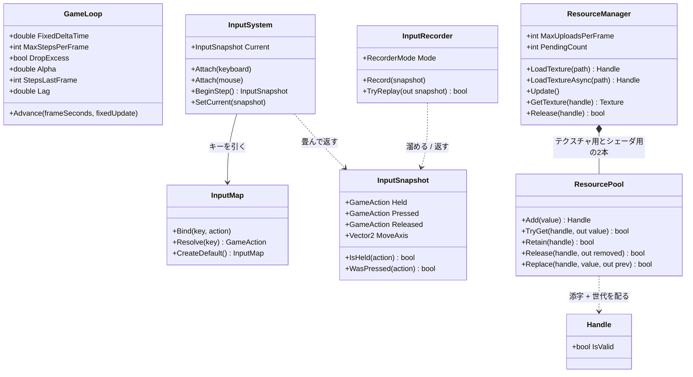
```mermaid
classDiagram
    class GameLoop {
        +double FixedDeltaTime
        +int MaxStepsPerFrame
        +bool DropExcess
        +double Alpha
        +int StepsLastFrame
        +double Lag
        +Advance(frameSeconds, fixedUpdate)
    }
    class InputSystem {
        +InputSnapshot Current
        +Attach(keyboard)
        +Attach(mouse)
        +BeginStep() InputSnapshot
        +SetCurrent(snapshot)
    }
    class InputMap {
        +Bind(key, action)
        +Resolve(key) GameAction
        +CreateDefault() InputMap
    }
    class InputSnapshot {
        +GameAction Held
        +GameAction Pressed
        +GameAction Released
        +Vector2 MoveAxis
        +IsHeld(action) bool
        +WasPressed(action) bool
    }
    class InputRecorder {
        +RecorderMode Mode
        +Record(snapshot)
        +TryReplay(out snapshot) bool
    }
    class Handle {
        +bool IsValid
    }
    class ResourcePool {
        +Add(value) Handle
        +TryGet(handle, out value) bool
        +Retain(handle) bool
        +Release(handle, out removed) bool
        +Replace(handle, value, out prev) bool
    }
    class ResourceManager {
        +int MaxUploadsPerFrame
        +int PendingCount
        +LoadTexture(path) Handle
        +LoadTextureAsync(path) Handle
        +Update()
        +GetTexture(handle) Texture
        +Release(handle) bool
    }

    InputSystem --> InputMap : キーを引く
    InputSystem ..> InputSnapshot : 畳んで返す
    InputRecorder ..> InputSnapshot : 溜める / 返す
    ResourceManager *-- ResourcePool : テクスチャ用とシェーダ用の2本
    ResourcePool ..> Handle : 添字 + 世代を配る
```

`ResourcePool` と `Handle` は総称型(`ResourcePool<T>` / `Handle<T>`)。
`T` が何かを知らないまま添字と世代だけを管理するので、`Texture` にも `Shader` にも同じものが使える。

この層で押さえるべき責務の線引き:

- **`GameLoop` は時間しか知らない**。何を更新するかは `Action<float>` で渡される
- **`InputSystem` はデバイスのイベントを畳むだけ**。ゲームとしての意味づけは `InputMap` が持つ
- **`InputSnapshot` は値**。だから記録・再生で丸ごと差し替えられる(Day 20 の肝)

### Render — OpenGL の薄い皮

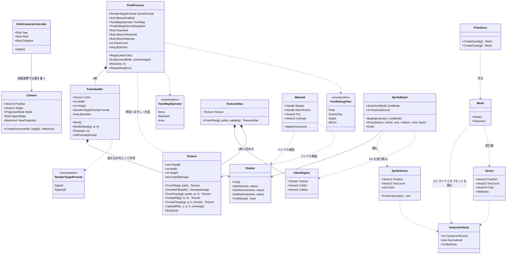
```mermaid
classDiagram
    class Camera {
        +Vector3 Position
        +Vector3 Target
        +ProjectionMode Mode
        +float AspectRatio
        +Matrix4x4 ViewProjection
        +CreateScreen(width, height) Matrix4x4
    }
    class OrbitCameraController {
        +float Yaw
        +float Pitch
        +float Distance
        +Apply()
    }
    class Shader {
        +Use()
        +SetInt(name, value)
        +SetVector4(name, value)
        +SetMatrix4(name, value)
        +TryReload() bool
    }
    class Texture {
        +uint Handle
        +int Width
        +int Height
        +bool HasMipmaps
        +FromFile(gl, path) Texture
        +DecodeFile(path) DecodedImage
        +FromPixels(gl, pixels, w, h) Texture
        +CreateR8(gl, w, h) Texture
        +CreateTarget(gl, w, h, format) Texture
        +UploadR8(x, y, w, h, coverage)
        +Bind(unit)
    }
    class RenderTargetFormat {
        <<enumeration>>
        Rgba8
        Rgba16F
    }
    class Framebuffer {
        +Texture Color
        +int Width
        +int Height
        +RenderTargetFormat Format
        +long ByteSize
        +Bind()
        +BindDefault(gl, w, h)
        +Resize(w, h)
        +SetFormat(format)
    }
    class PostProcess {
        +RenderTargetFormat SceneFormat
        +bool BloomEnabled
        +ToneMapOperator ToneMap
        +PostDebugView DebugView
        +float Exposure
        +float BloomThreshold
        +float BloomIntensity
        +int PassCount
        +long ByteSize
        +Begin(clearColor)
        +End(screenWidth, screenHeight)
        +Resize(w, h)
        +ReloadShaders()
    }
    class ToneMapOperator {
        <<enumeration>>
        None
        Reinhard
        Aces
    }
    class PostDebugView {
        <<enumeration>>
        Final
        SceneOnly
        Bright
        Bloom
    }
    class TextureAtlas {
        +Texture Texture
        +FromFiles(gl, paths, padding) TextureAtlas
    }
    class AtlasRegion {
        +Texture Texture
        +Vector2 UvMin
        +Vector2 UvMax
    }
    class Material {
        +Handle Shader
        +Handle MainTexture
        +Vector4 Tint
        +Vector2 UvScale
        +Apply(resources)
    }
    class Mesh {
        +Draw()
        +Dispose()
    }
    class Vertex {
        +Vector3 Position
        +Vector2 TexCoord
        +Vector4 Color
        +Attributes
    }
    class SpriteVertex {
        +Vector2 Position
        +Vector2 TexCoord
        +uint Color
        +PackColor(color) uint
    }
    class VertexAttribute {
        +int ComponentCount
        +bool Normalized
        +int ByteSize
    }
    class SpriteBatch {
        +SpriteSortMode SortMode
        +int DrawCallCount
        +Begin(projection, sortMode)
        +Draw(texture, center, size, rotation, color, layer)
        +End()
    }
    class Primitives {
        +CreateQuad(gl) Mesh
        +CreateCube(gl) Mesh
    }

    OrbitCameraController --> Camera : 球面座標で位置を書く
    Material ..> Shader : ハンドル経由
    Material ..> Texture : ハンドル経由
    Mesh ..> VertexAttribute : ストライドとオフセットを組む
    Vertex ..> VertexAttribute
    SpriteVertex ..> VertexAttribute
    Mesh ..> Vertex : 型引数
    Primitives ..> Mesh : 作る
    TextureAtlas *-- AtlasRegion
    TextureAtlas *-- Texture : 1枚に詰める
    SpriteBatch --> Shader
    SpriteBatch ..> SpriteVertex : 積む
    SpriteBatch ..> AtlasRegion : UV を受け取る
    Framebuffer *-- Texture : 描き込み先として所有
    Framebuffer ..> RenderTargetFormat
    PostProcess *-- Framebuffer : 4枚
    PostProcess ..> Shader : 明部 / ぼかし / 合成
    PostProcess ..> ToneMapOperator
    PostProcess ..> PostDebugView
```

**Day 28 で `Texture` に足したのは2つだけ**。
`CreateR8` が1チャンネルの空テクスチャを作り、`UploadR8` がその一部を書き換える。
どちらもグリフのために足したものだが、**`Texture` はグリフを知らない**——
「1チャンネル」「一部だけ更新」という一般の機能として置いてある。
同じものが Phase 6 のシャドウマップ(Day 33)でも要る。

**Day 31 で足したのは `CreateTarget` 1つ**。同じ理屈で、
`Texture` は「これがレンダーターゲットである」ことを知らない。
中身を渡さずに場所だけ確保し、ミップマップを作らず、ClampToEdge にする——
それだけの機能として置いてあるので、
影(Day 33)でも環境マップ(Day 36)でも G-Buffer(Day 51)でも同じものが使える。

**`Framebuffer` が `Texture` を所有している**のは、今までの `Render/` に無かった関係。
`Material` は「持たない(ハンドルだけ)」で通してきたが、
フレームバッファのカラーアタッチメントは
**そのフレームバッファと同じ大きさ・同じ形式でなければならない**ので、
外から差し替えられると壊れる。**所有すべきものは所有する**。

**`PostProcess` はシェーダだけ `ResourceManager` に預けている**。
バッファ(4枚)は自分で持ち、シェーダは借りる——
シェーダは F5 でリロードしたいので、管理の窓口に載せておく必要がある。

**`Material` が何も所有していない**のは Day 15 から一貫している(Day15.md の要点2)。
持っているのはハンドルだけで、実体の寿命は `ResourceManager` にある。

**3D の道(`Mesh` + `Material`)と 2D の道(`SpriteBatch`)が並列**なのも見てのとおりで、
両者は `Shader` と `Texture` を共有しているだけで互いを知らない。
`Mesh` は「形が決まっていて毎フレーム変わらないもの」、
`SpriteBatch` は「毎フレーム頂点を作り直すもの」という使い分けになっている。

### Scene — GameObject + Component

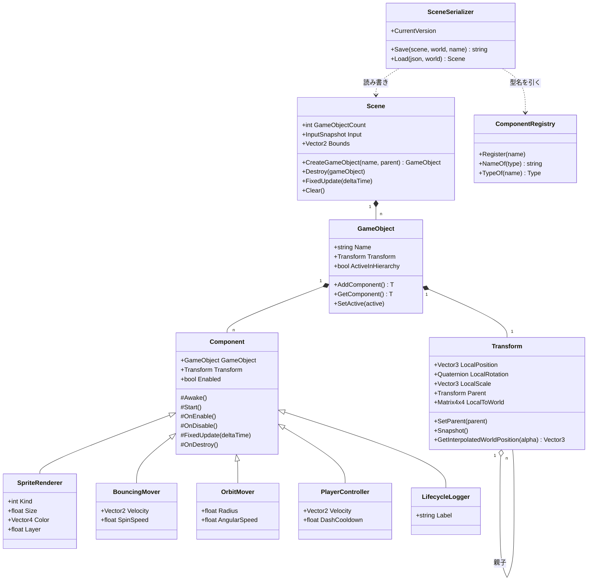
```mermaid
classDiagram
    class Scene {
        +int GameObjectCount
        +InputSnapshot Input
        +Vector2 Bounds
        +CreateGameObject(name, parent) GameObject
        +Destroy(gameObject)
        +FixedUpdate(deltaTime)
        +Clear()
    }
    class GameObject {
        +string Name
        +Transform Transform
        +bool ActiveInHierarchy
        +AddComponent() T
        +GetComponent() T
        +SetActive(active)
    }
    class Transform {
        +Vector3 LocalPosition
        +Quaternion LocalRotation
        +Vector3 LocalScale
        +Transform Parent
        +Matrix4x4 LocalToWorld
        +SetParent(parent)
        +Snapshot()
        +GetInterpolatedWorldPosition(alpha) Vector3
    }
    class Component {
        +GameObject GameObject
        +Transform Transform
        +bool Enabled
        #Awake()
        #Start()
        #OnEnable()
        #OnDisable()
        #FixedUpdate(deltaTime)
        #OnDestroy()
    }
    class SpriteRenderer {
        +int Kind
        +float Size
        +Vector4 Color
        +float Layer
    }
    class BouncingMover {
        +Vector2 Velocity
        +float SpinSpeed
    }
    class OrbitMover {
        +float Radius
        +float AngularSpeed
    }
    class PlayerController {
        +Vector2 Velocity
        +float DashCooldown
    }
    class LifecycleLogger {
        +string Label
    }
    class ComponentRegistry {
        +Register(name)
        +NameOf(type) string
        +TypeOf(name) Type
    }
    class SceneSerializer {
        +CurrentVersion
        +Save(scene, world, name) string
        +Load(json, world) Scene
    }

    Scene "1" *-- "n" GameObject
    GameObject "1" *-- "1" Transform
    GameObject "1" *-- "n" Component
    Transform "1" o-- "n" Transform : 親子
    Component <|-- SpriteRenderer
    Component <|-- BouncingMover
    Component <|-- OrbitMover
    Component <|-- PlayerController
    Component <|-- LifecycleLogger
    SceneSerializer ..> Scene : 読み書き
    SceneSerializer ..> ComponentRegistry : 型名を引く
```

`Transform` だけが `GameObject` の固定メンバーで、ほかは全部 `Component` として付け外しする
(Day 22 の要点2)。`SceneSerializer` が `ComponentRegistry` を経由するのは、
**JSON の文字列から直接 `Type` を作らせない**ため(Day 24 の要点2)。

### Ecs と Physics — どこにも依存しない2つ(今日 `Physics` が増えた)

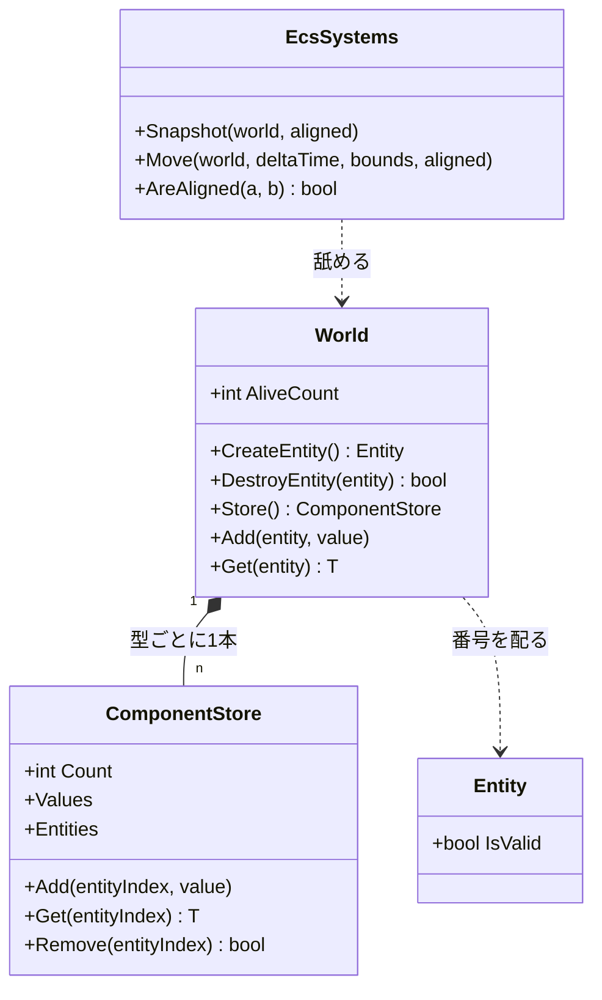
```mermaid
classDiagram
    class Entity {
        +bool IsValid
    }
    class World {
        +int AliveCount
        +CreateEntity() Entity
        +DestroyEntity(entity) bool
        +Store() ComponentStore
        +Add(entity, value)
        +Get(entity) T
    }
    class ComponentStore {
        +int Count
        +Values
        +Entities
        +Add(entityIndex, value)
        +Get(entityIndex) T
        +Remove(entityIndex) bool
    }
    class EcsSystems {
        +Snapshot(world, aligned)
        +Move(world, deltaTime, bounds, aligned)
        +AreAligned(a, b) bool
    }

    World "1" *-- "n" ComponentStore : 型ごとに1本
    World ..> Entity : 番号を配る
    EcsSystems ..> World : 舐める
```

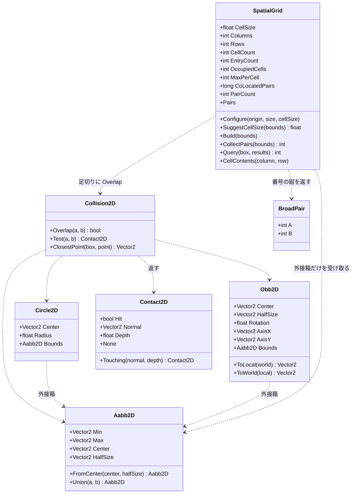
```mermaid
classDiagram
    class Aabb2D {
        +Vector2 Min
        +Vector2 Max
        +Vector2 Center
        +Vector2 HalfSize
        +FromCenter(center, halfSize) Aabb2D
        +Union(a, b) Aabb2D
    }
    class Circle2D {
        +Vector2 Center
        +float Radius
        +Aabb2D Bounds
    }
    class Obb2D {
        +Vector2 Center
        +Vector2 HalfSize
        +float Rotation
        +Vector2 AxisX
        +Vector2 AxisY
        +Aabb2D Bounds
        +ToLocal(world) Vector2
        +ToWorld(local) Vector2
    }
    class Contact2D {
        +bool Hit
        +Vector2 Normal
        +float Depth
        +None
        +Touching(normal, depth) Contact2D
    }
    class Collision2D {
        +Overlap(a, b) bool
        +Test(a, b) Contact2D
        +ClosestPoint(box, point) Vector2
    }
    class BroadPair {
        +int A
        +int B
    }
    class SpatialGrid {
        +float CellSize
        +int Columns
        +int Rows
        +int CellCount
        +int EntryCount
        +int OccupiedCells
        +int MaxPerCell
        +long CoLocatedPairs
        +int PairCount
        +Pairs
        +Configure(origin, size, cellSize)
        +SuggestCellSize(bounds) float
        +Build(bounds)
        +CollectPairs(bounds) int
        +Query(box, results) int
        +CellContents(column, row)
    }

    Collision2D ..> Aabb2D
    Collision2D ..> Circle2D
    Collision2D ..> Obb2D
    Collision2D ..> Contact2D : 返す
    Circle2D ..> Aabb2D : 外接箱
    Obb2D ..> Aabb2D : 外接箱
    SpatialGrid ..> Aabb2D : 外接箱だけを受け取る
    SpatialGrid ..> Collision2D : 足切りに Overlap
    SpatialGrid ..> BroadPair : 番号の組を返す
```

**形は全部 `readonly struct`、判定は `static` メソッドだけ**。状態を持たないので、
どのスレッドから何回呼んでも同じ答えが返る。Day 26 で空間分割を入れたとき、
この性質のおかげで**判定そのものには一切手を入れずに済んだ**——
`Collision2D.cs` と `Shapes2D.cs` の差分は 0 行になっている。

**Day 29 で足したのは `Query` だけ**。
`CollectPairs` が「全部の組」を返すのに対して、
`Query` は「この箱の近くにいるもの」を返す。
1回組んだ格子を、**総当たりの置き換え**としても
**単発の近傍探索**としても使えるようになった——
卒業制作では同じ格子を1ステップに4通りで使っている。

`SpatialGrid` だけが唯一 `class`(参照型)で、しかも状態を持つ。
配列を4本(`_cellStart` / `_cursor` / `_entries` / `_mark`)使い回すためで、
**毎フレーム作り直しても割り当てが起きない**ようにするにはこうするしかない。
そのぶん「1つのインスタンスを複数スレッドから同時に使えない」という制約が付く。
状態を持つと何が失われるかが、同じフォルダの中で見比べられる形になっている。

矢印の向きにも注目してほしい。**`SpatialGrid` から `Body` への線が無い**。
受け取るのは `ReadOnlySpan<Aabb2D>`、返すのは番号の組だけで、
速度も形も質量も知らない。この細さのおかげで、
Day 46 の 3D 版は `Aabb2D` を `Aabb3D` に変えるだけで済む。

### Audio — OpenAL の薄い皮

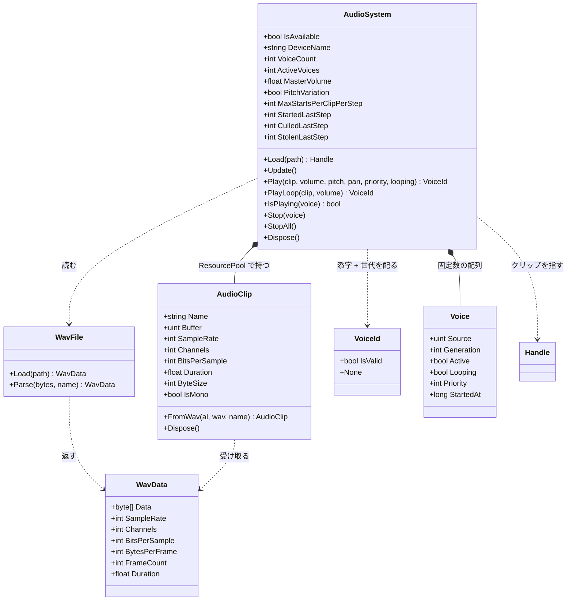
```mermaid
classDiagram
    class WavData {
        +byte[] Data
        +int SampleRate
        +int Channels
        +int BitsPerSample
        +int BytesPerFrame
        +int FrameCount
        +float Duration
    }
    class WavFile {
        +Load(path) WavData
        +Parse(bytes, name) WavData
    }
    class AudioClip {
        +string Name
        +uint Buffer
        +int SampleRate
        +int Channels
        +int BitsPerSample
        +float Duration
        +int ByteSize
        +bool IsMono
        +FromWav(al, wav, name) AudioClip
        +Dispose()
    }
    class VoiceId {
        +bool IsValid
        +None
    }
    class AudioSystem {
        +bool IsAvailable
        +string DeviceName
        +int VoiceCount
        +int ActiveVoices
        +float MasterVolume
        +bool PitchVariation
        +int MaxStartsPerClipPerStep
        +int StartedLastStep
        +int CulledLastStep
        +int StolenLastStep
        +Load(path) Handle
        +Update()
        +Play(clip, volume, pitch, pan, priority, looping) VoiceId
        +PlayLoop(clip, volume) VoiceId
        +IsPlaying(voice) bool
        +Stop(voice)
        +StopAll()
        +Dispose()
    }
    class Voice {
        +uint Source
        +int Generation
        +bool Active
        +bool Looping
        +int Priority
        +long StartedAt
    }

    WavFile ..> WavData : 返す
    AudioClip ..> WavData : 受け取る
    AudioSystem ..> WavFile : 読む
    AudioSystem *-- AudioClip : ResourcePool で持つ
    AudioSystem *-- Voice : 固定数の配列
    AudioSystem ..> VoiceId : 添字 + 世代を配る
    AudioSystem ..> Handle : クリップを指す
```

`Voice` は `AudioSystem` の中の `private struct`。外からは `VoiceId` 越しにしか触れない。

この層で押さえるべき線引きは3つ。

- **`WavFile` は OpenAL を知らない**。ただのバイト列パーサなので、
  ファイルが無くてもメモリ上のバイト列で試せる(自己チェックがそうしている)
- **`AudioClip` はデータ、`Voice` は再生**(要点2)。
  `Texture` と `Material`、`Mesh` と描画呼び出しと同じ分け方
- **`VoiceId` は `Handle<T>` と同じ構造**(添字 + 世代)だが**別の型**。
  `Handle<T>` は `ResourcePool<T>` のためのもので、ボイスはプールではないので流用しない。
  同じ手口を別の場所で使い直している、と読むのが正しい

### Text — Render の上に積む層

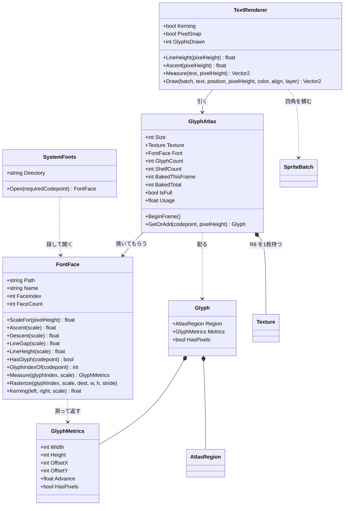
```mermaid
classDiagram
    class SystemFonts {
        +string Directory
        +Open(requiredCodepoint) FontFace
    }
    class FontFace {
        +string Path
        +string Name
        +int FaceIndex
        +int FaceCount
        +ScaleFor(pixelHeight) float
        +Ascent(scale) float
        +Descent(scale) float
        +LineGap(scale) float
        +LineHeight(scale) float
        +HasGlyph(codepoint) bool
        +GlyphIndexOf(codepoint) int
        +Measure(glyphIndex, scale) GlyphMetrics
        +Rasterize(glyphIndex, scale, dest, w, h, stride)
        +Kerning(left, right, scale) float
    }
    class GlyphMetrics {
        +int Width
        +int Height
        +int OffsetX
        +int OffsetY
        +float Advance
        +bool HasPixels
    }
    class Glyph {
        +AtlasRegion Region
        +GlyphMetrics Metrics
        +bool HasPixels
    }
    class GlyphAtlas {
        +int Size
        +Texture Texture
        +FontFace Font
        +int GlyphCount
        +int ShelfCount
        +int BakedThisFrame
        +int BakedTotal
        +bool IsFull
        +float Usage
        +BeginFrame()
        +GetOrAdd(codepoint, pixelHeight) Glyph
    }
    class TextRenderer {
        +bool Kerning
        +bool PixelSnap
        +int GlyphsDrawn
        +LineHeight(pixelHeight) float
        +Ascent(pixelHeight) float
        +Measure(text, pixelHeight) Vector2
        +Draw(batch, text, position, pixelHeight, color, align, layer) Vector2
    }

    SystemFonts ..> FontFace : 探して開く
    FontFace ..> GlyphMetrics : 測って返す
    GlyphAtlas --> FontFace : 焼いてもらう
    GlyphAtlas *-- Texture : R8 を1枚持つ
    GlyphAtlas ..> Glyph : 配る
    Glyph *-- AtlasRegion
    Glyph *-- GlyphMetrics
    TextRenderer --> GlyphAtlas : 引く
    TextRenderer ..> SpriteBatch : 四角を積む
```

4つのクラスが、**それぞれ1つのことしかしない**ように切ってある。

| クラス | 知っていること | 知らないこと |
|---|---|---|
| `SystemFonts` | どこにフォントがあるか | 描き方 |
| `FontFace` | フォントの中身(寸法とアウトライン) | GL、アトラス、レイアウト |
| `GlyphAtlas` | どこに置いたか、何を焼いたか | 文字の並べ方 |
| `TextRenderer` | 並べ方(送り・行送り・整列) | フォントの中身、GL |

この切り方の値打ちは、**差し替えたときにどこまで壊れるか**で分かる。
SDF に変える(改造課題3)なら `GlyphAtlas` と `text.frag` だけが変わり、
`TextRenderer` は 1 行も触らない。
フォントフォールバックを入れる(改造課題2)なら `FontFace` を複数持つだけで、
`GlyphAtlas` の棚詰めには影響しない。

**`GlyphMetrics` が `FontFace` と `TextRenderer` の共通語**になっている。
「原点からどれだけずらして、次にどれだけ進むか」——
この5つの数字さえあれば、フォントの実装が何であれ字を並べられる。

### Game — エンジンを使う側

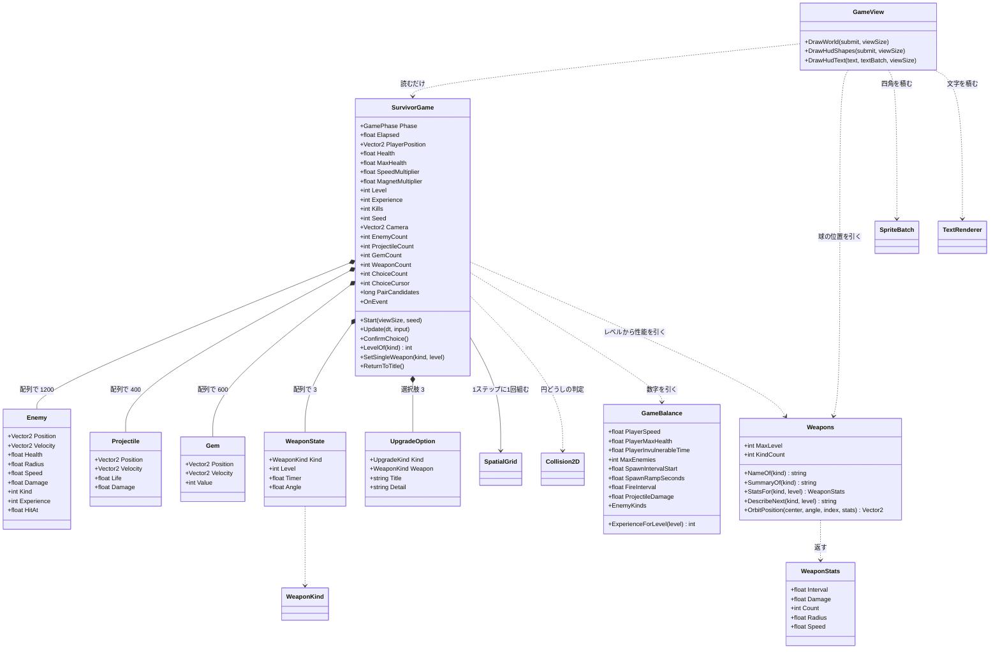
```mermaid
classDiagram
    class GameBalance {
        +float PlayerSpeed
        +float PlayerMaxHealth
        +float PlayerInvulnerableTime
        +int MaxEnemies
        +float SpawnIntervalStart
        +float SpawnRampSeconds
        +float FireInterval
        +float ProjectileDamage
        +EnemyKinds
        +ExperienceForLevel(level) int
    }
    class Enemy {
        +Vector2 Position
        +Vector2 Velocity
        +float Health
        +float Radius
        +float Speed
        +float Damage
        +int Kind
        +int Experience
        +float HitAt
    }
    class Projectile {
        +Vector2 Position
        +Vector2 Velocity
        +float Life
        +float Damage
    }
    class Gem {
        +Vector2 Position
        +Vector2 Velocity
        +int Value
    }
    class WeaponState {
        +WeaponKind Kind
        +int Level
        +float Timer
        +float Angle
    }
    class WeaponStats {
        +float Interval
        +float Damage
        +int Count
        +float Radius
        +float Speed
    }
    class Weapons {
        +int MaxLevel
        +int KindCount
        +NameOf(kind) string
        +SummaryOf(kind) string
        +StatsFor(kind, level) WeaponStats
        +DescribeNext(kind, level) string
        +OrbitPosition(center, angle, index, stats) Vector2
    }
    class UpgradeOption {
        +UpgradeKind Kind
        +WeaponKind Weapon
        +string Title
        +string Detail
    }
    class SurvivorGame {
        +GamePhase Phase
        +float Elapsed
        +Vector2 PlayerPosition
        +float Health
        +float MaxHealth
        +float SpeedMultiplier
        +float MagnetMultiplier
        +int Level
        +int Experience
        +int Kills
        +int Seed
        +Vector2 Camera
        +int EnemyCount
        +int ProjectileCount
        +int GemCount
        +int WeaponCount
        +int ChoiceCount
        +int ChoiceCursor
        +long PairCandidates
        +OnEvent
        +Start(viewSize, seed)
        +Update(dt, input)
        +ConfirmChoice()
        +LevelOf(kind) int
        +SetSingleWeapon(kind, level)
        +ReturnToTitle()
    }
    class GameView {
        +DrawWorld(submit, viewSize)
        +DrawHudShapes(submit, viewSize)
        +DrawHudText(text, textBatch, viewSize)
    }

    SurvivorGame *-- Enemy : 配列で 1200
    SurvivorGame *-- Projectile : 配列で 400
    SurvivorGame *-- Gem : 配列で 600
    SurvivorGame *-- WeaponState : 配列で 3
    SurvivorGame *-- UpgradeOption : 選択肢 3
    SurvivorGame --> SpatialGrid : 1ステップに1回組む
    SurvivorGame ..> Collision2D : 円どうしの判定
    SurvivorGame ..> GameBalance : 数字を引く
    SurvivorGame ..> Weapons : レベルから性能を引く
    WeaponState ..> WeaponKind
    Weapons ..> WeaponStats : 返す
    GameView ..> SurvivorGame : 読むだけ
    GameView ..> Weapons : 球の位置を引く
    GameView ..> SpriteBatch : 四角を積む
    GameView ..> TextRenderer : 文字を積む
```

**`WeaponState` が3つのフィールドしか持っていない**のが Day 30 の設計の要。
威力も間隔も個数も持たず、`Weapons.StatsFor(kind, level)` が
**レベルから計算して返す**。

```
状態として持つもの   … 種類・レベル・タイマー・角度
状態から決まるもの   … 威力・間隔・個数・半径・速度
```

分けておくと、成長カーブを触るときに `StatsFor` の1箇所で済む。
逆に `WeaponState` に威力を持たせると、
レベルアップのたびに「どの数字をいくつ足すか」があちこちに散らばる。

**`GameView` から `Weapons` への線**にも意味がある。
オービットの球の位置は当たり判定と絵の両方が要るので、
`Weapons.OrbitPosition` という1つの式を両方から呼ぶ。
別々に書くと、**見えているところと当たるところがずれる**——
しかもずれは小さいので、しばらく気づかない。

**`Enemy` / `Projectile` / `Gem` が `struct`** なのが要点。
1200 体ぶんの参照を辿ると、メモリ上ばらばらの場所を読むことになる
(Day 22 で実測した 17 倍がこれ)。構造体の配列なら、
更新ループは連続したメモリを頭から舐めるだけで済む。

**Day 23 の ECS は使っていない**。
ECS が効くのは「部品の組み合わせが実行時に変わる」ときで、
今日のように<b>敵は敵、弾は弾と決まっている</b>なら、
種類ごとに配列を1本持つほうが素直で速い。
Day 23 で「ECS は構造体の配列の一般化」と書いたが、
**一般化が要らない場面では特殊形のままでよい**——
これは ECS が無駄だったという話ではなく、
<b>どちらを選ぶかを判断できるようになった</b>という話になる。

`GameBalance` に矢印が集まっているのも意図したもの。
遊んで気になったことは全部ここを触ることになるので、
**数字がコードの中に散らばっていると調整が苦行になる**。

### 1フレームの流れ

Silk.NET のウィンドウから `OnUpdate` と `OnRender` が交互に呼ばれる。
**状態を変えるのは `OnUpdate` 側だけ**、というのが Day 19 で引いた線。

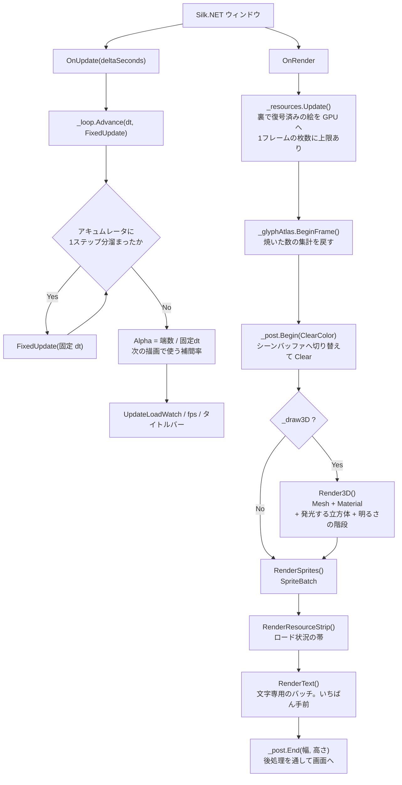
```mermaid
flowchart TD
    W["Silk.NET ウィンドウ"] --> U["OnUpdate(deltaSeconds)"]
    U --> A["_loop.Advance(dt, FixedUpdate)"]
    A --> Q{"アキュムレータに<br/>1ステップ分溜まったか"}
    Q -->|Yes| F["FixedUpdate(固定 dt)"]
    F --> Q
    Q -->|No| AL["Alpha = 端数 / 固定dt<br/>次の描画で使う補間率"]
    AL --> LW["UpdateLoadWatch / fps / タイトルバー"]

    W --> R["OnRender"]
    R --> RU["_resources.Update()<br/>裏で復号済みの絵を GPU へ<br/>1フレームの枚数に上限あり"]
    RU --> GA["_glyphAtlas.BeginFrame()<br/>焼いた数の集計を戻す"]
    GA --> PB["_post.Begin(ClearColor)<br/>シーンバッファへ切り替えて Clear"]
    PB --> D3{"_draw3D ?"}
    D3 -->|Yes| R3["Render3D()<br/>Mesh + Material<br/>+ 発光する立方体 + 明るさの階段"]
    D3 -->|No| RS
    R3 --> RS["RenderSprites()<br/>SpriteBatch"]
    RS --> ST["RenderResourceStrip()<br/>ロード状況の帯"]
    ST --> TX["RenderText()<br/>文字専用のバッチ。いちばん手前"]
    TX --> PE["_post.End(幅, 高さ)<br/>後処理を通して画面へ"]
```

**Day 29 で分岐が1つ増えた**。ゲームモード(Enter)のときは
`Render3D` も `RenderSprites` も `RenderResourceStrip` も通らず、
`RenderGame()` だけになる。
デモの重い部分を裏で回したまま遊ぶと、
「ゲームが重い」のか「デモが重い」のか分からなくなるため。

**`RenderText` がいちばん最後**なのは、UI が何よりも手前に出るものだから。
バッチが別なのは、シェーダが違うため——
グリフのアトラスは1チャンネルなので `sprite.frag` では真っ黒になる。
**バッチは「同じ設定で描けるものをまとめる」仕組み**なので、
シェーダが違えば別のバッチになるのは定義どおりの帰結。

`OnRender` の先頭で `_resources.Update()` を呼ぶのが要点で、
**GL は描画スレッドからしか触れない**ため、裏で復号し終えた画素をここで GPU に上げている
(Day 21 の要点5・6)。

**Day 31 で `Clear` が `_post.Begin` に変わった**。
`Begin` と `End` の間にあるコードは1行も変わっていない——
`Clear` の代わりにフレームバッファを差し替えるようになっただけで、
`Render3D` も `RenderSprites` も `RenderText` も「自分がどこへ描いているか」を知らない。

そのぶん**UI もトーンマップを通ってしまう**。露出を上げれば HUD の文字も白飛びする。
実際のエンジンは後処理のあとに UI を描くが、ここでは
「画面に出るものが全部1本のパイプラインを通る」形をまず見ることを優先した。
分けるのは Day 38(カラーグレーディング)で扱う。

### HDR パイプラインの中身 — 10 回のフルスクリーンパス

`_post.End()` の中で何が起きているか。**入力と出力を全部書き出す**と、
ping-pong の必然性がそのまま見える。

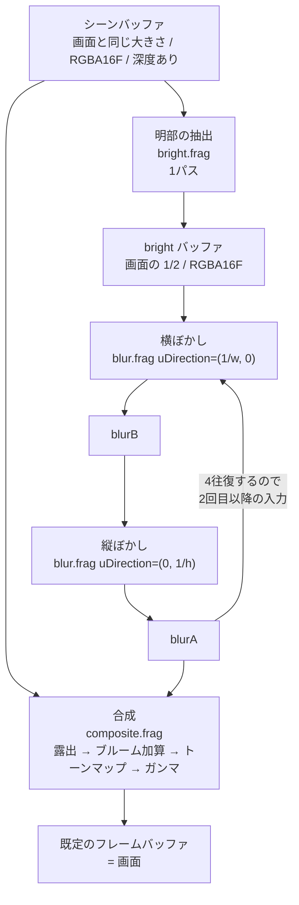
```mermaid
flowchart TD
    SC["シーンバッファ<br/>画面と同じ大きさ / RGBA16F / 深度あり"]
    SC --> BR["明部の抽出<br/>bright.frag<br/>1パス"]
    BR --> BF["bright バッファ<br/>画面の 1/2 / RGBA16F"]
    BF --> H1["横ぼかし<br/>blur.frag uDirection=(1/w, 0)"]
    H1 --> BB["blurB"]
    BB --> V1["縦ぼかし<br/>blur.frag uDirection=(0, 1/h)"]
    V1 --> BA["blurA"]
    BA -->|"4往復するので<br/>2回目以降の入力"| H1
    SC --> CO["合成<br/>composite.frag<br/>露出 → ブルーム加算 → トーンマップ → ガンマ"]
    BA --> CO
    CO --> OUT["既定のフレームバッファ<br/>= 画面"]
```

パスの数は **1(明部)+ 4×2(ぼかし)+ 1(合成)= 10**。
画面に出ている `パス:10` はこれを数えている。

**なぜ `blurA` と `blurB` の2枚が要るのか**。
GPU は「同じテクスチャを読みながら同じテクスチャへ書く」ことを許さない
(読み書きの順序が保証されないので結果が未定義になる)。
だから横ぼかしの結果を別の場所に置き、それを読んで縦ぼかしを書く、を繰り返す。
これが ping-pong で、後処理を書き始めると必ず最初にぶつかる制約になる。

**`bright` を `blurA`/`blurB` と別に持っている**のは、
中間バッファの表示(Shift+4)で「ぼかす前の明部」を見たいから。
表示のためだけに 1/2 サイズのバッファ1枚(1920x1080 なら 4MB)を払っている。
本番用に絞るなら、`bright` を捨てて `blurA` に直接書けば1枚減らせる。

**バッファの大きさが2種類ある**ことにも意味がある。

| バッファ | 大きさ | 形式 | 深度 | なぜ |
|---|---|---|---|---|
| scene | 画面と同じ | RGBA16F | あり | 3D を描くので深度が要る。原寸でないと絵がぼける |
| bright / blurA / blurB | 画面の 1/2 | RGBA16F | **なし** | **ぼかしたものを縮めても分からない**。板1枚なので深度も要らない |

半分にするとピクセル数が 1/4 になり、ぼかし 8 パスのコストがそのまま 1/4 になる。
おまけに「縮めて拡大する」こと自体が弱いぼかしとして働くので、
同じタップ数でより広く滲む。**質を落とさずに 4 倍安くなる**、後処理では珍しく素直な最適化。

### FixedUpdate の中身 — 入力の出どころと3つのバックエンド

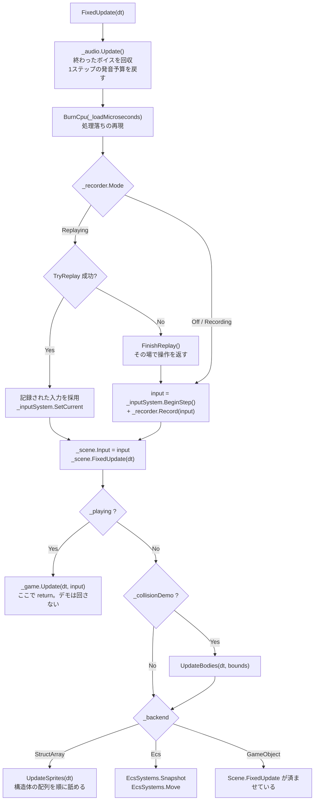
```mermaid
flowchart TD
    S["FixedUpdate(dt)"] --> AU["_audio.Update()<br/>終わったボイスを回収<br/>1ステップの発音予算を戻す"]
    AU --> B["BurnCpu(_loadMicroseconds)<br/>処理落ちの再現"]
    B --> M{"_recorder.Mode"}
    M -->|Replaying| TR{"TryReplay 成功?"}
    TR -->|Yes| SC["記録された入力を採用<br/>_inputSystem.SetCurrent"]
    TR -->|No| FR["FinishReplay()<br/>その場で操作を返す"]
    FR --> BS
    M -->|Off / Recording| BS["input = _inputSystem.BeginStep()<br/>+ _recorder.Record(input)"]
    SC --> SF
    BS --> SF["_scene.Input = input<br/>_scene.FixedUpdate(dt)"]
    SF --> PG{"_playing ?"}
    PG -->|Yes| GM["_game.Update(dt, input)<br/>ここで return。デモは回さない"]
    PG -->|No| CD{"_collisionDemo ?"}
    CD -->|Yes| UB["UpdateBodies(dt, bounds)"]
    CD -->|No| BK
    UB --> BK{"_backend"}
    BK -->|StructArray| US["UpdateSprites(dt)<br/>構造体の配列を順に舐める"]
    BK -->|Ecs| ES["EcsSystems.Snapshot<br/>EcsSystems.Move"]
    BK -->|GameObject| GO["Scene.FixedUpdate が済ませている"]
```

**音の後始末を先頭に置いた**のは、音を要求するのがこの下だから。
予算を戻す場所と使う場所を近くに置くと、「いつリセットされるのか」を追う必要がなくなる。
描画側(`OnRender`)に置くと、シミュレーションが 5Hz のときに
「1フレームに複数ステップぶんの音が要求されるのに予算は 1 回ぶん」というずれが起きる。

**入力がどこから来たかを、この関数から下は誰も気にしない**のがポイント(Day 20 の要点1)。
`InputSnapshot` という値に畳んであるので、記録の再生と実操作を1行で差し替えられる。

`Scene.FixedUpdate` を `_backend` の分岐より前で必ず呼んでいるのは、
**プレイヤーと階層の実演がどのモードでも Scene 側にいる**ため。

### Scene.FixedUpdate の4段階

順番に意味がある。入れ替えると壊れる。

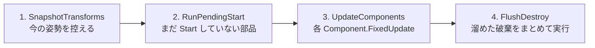
```mermaid
flowchart LR
    A["1. SnapshotTransforms<br/>今の姿勢を控える"]
    B["2. RunPendingStart<br/>まだ Start していない部品"]
    C["3. UpdateComponents<br/>各 Component.FixedUpdate"]
    D["4. FlushDestroy<br/>溜めた破棄をまとめて実行"]
    A --> B --> C --> D
```

| 段 | なぜその位置か |
|---|---|
| 1 | **動かす前**に控えないと、補間の始点が終点と同じになって補間が効かない |
| 2 | `Start` の中で新しいオブジェクトが生まれるので、**開始時点の件数だけ**回す |
| 3 | ここも開始時点の件数で止める。このステップで生まれたものは次のステップから |
| 4 | 更新中にリストから消すと**走査中のインデックスがずれる**(Day 22 の要点5)。<br/>まとめて `RemoveAll` するのは、1個ずつ消すと O(n^2) になるため |

### 非同期テクスチャロードの流れ

`Q` キーで走る道。**GL を呼ぶ部分と呼ばない部分の境目**が、
そのままスレッドの境目になっている(Day 21 の要点5)。

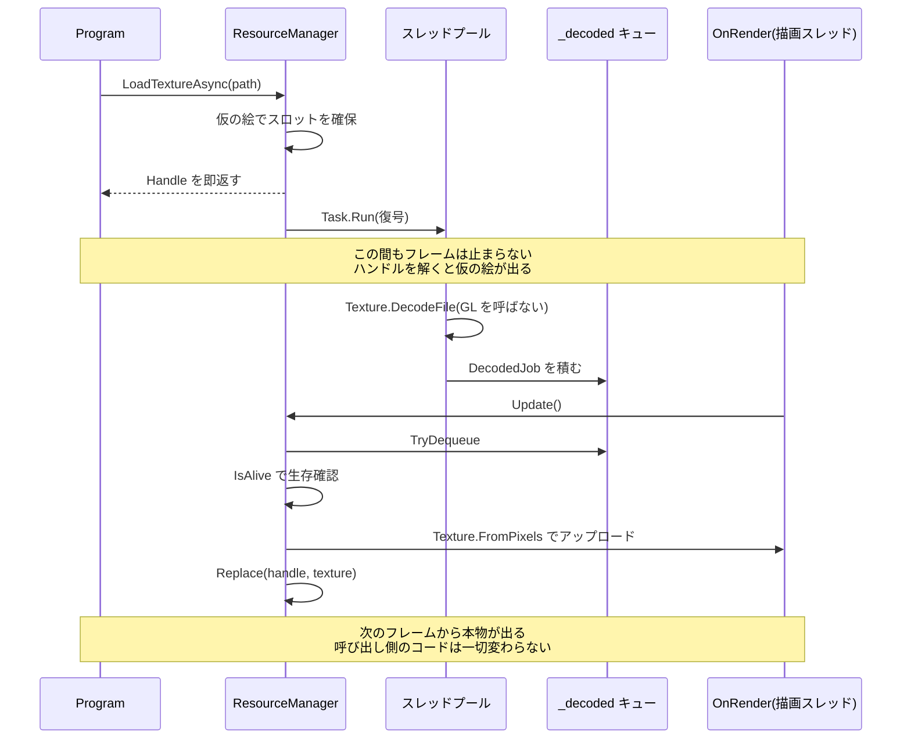
```mermaid
sequenceDiagram
    participant P as Program
    participant RM as ResourceManager
    participant TP as スレッドプール
    participant Q as _decoded キュー
    participant GL as OnRender(描画スレッド)

    P->>RM: LoadTextureAsync(path)
    RM->>RM: 仮の絵でスロットを確保
    RM-->>P: Handle を即返す
    RM->>TP: Task.Run(復号)
    Note over P,GL: この間もフレームは止まらない<br/>ハンドルを解くと仮の絵が出る
    TP->>TP: Texture.DecodeFile(GL を呼ばない)
    TP->>Q: DecodedJob を積む
    GL->>RM: Update()
    RM->>Q: TryDequeue
    RM->>RM: IsAlive で生存確認
    RM->>GL: Texture.FromPixels でアップロード
    RM->>RM: Replace(handle, texture)
    Note over P,GL: 次のフレームから本物が出る<br/>呼び出し側のコードは一切変わらない
```

`Update()` が `MaxUploadsPerFrame` で枚数を絞っているのが肝で、
**復号を非同期にしても、アップロードをまとめてやるとそこでカクつく**(Day 21 の要点6)。

### 衝突判定の3段 — ブロードフェーズが割り込んだ

Day 25 の `UpdateBodies` は「動かす → 総当たり → 押し戻す」の3段だった。
今日、真ん中が**「組を絞る」と「絞った組を判定する」に割れる**。

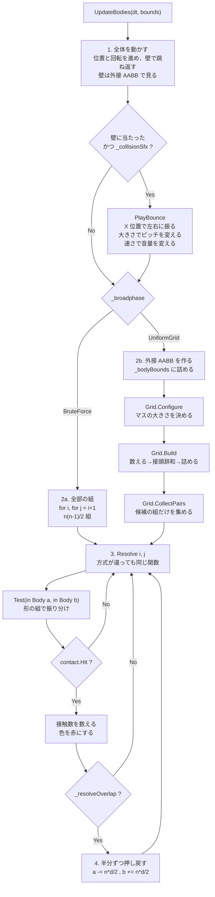
```mermaid
flowchart TD
    S["UpdateBodies(dt, bounds)"] --> MV["1. 全体を動かす<br/>位置と回転を進め、壁で跳ね返す<br/>壁は外接 AABB で見る"]
    MV --> SFX{"壁に当たった<br/>かつ _collisionSfx ?"}
    SFX -->|Yes| PB["PlayBounce<br/>X 位置で左右に振る<br/>大きさでピッチを変える<br/>速さで音量を変える"]
    SFX -->|No| BP
    PB --> BP{"_broadphase"}

    BP -->|BruteForce| BF["2a. 全部の組<br/>for i, for j = i+1<br/>n(n-1)/2 組"]
    BP -->|UniformGrid| GB["2b. 外接 AABB を作る<br/>_bodyBounds に詰める"]
    GB --> GC["Grid.Configure<br/>マスの大きさを決める"]
    GC --> GD["Grid.Build<br/>数える→接頭辞和→詰める"]
    GD --> GP["Grid.CollectPairs<br/>候補の組だけを集める"]

    BF --> NR["3. Resolve i, j<br/>方式が違っても同じ関数"]
    GP --> NR
    NR --> T["Test(in Body a, in Body b)<br/>形の組で振り分け"]
    T --> H{"contact.Hit ?"}
    H -->|No| NR
    H -->|Yes| CNT["接触数を数える<br/>色を赤にする"]
    CNT --> RV{"_resolveOverlap ?"}
    RV -->|Yes| PS["4. 半分ずつ押し戻す<br/>a -= n*d/2 , b += n*d/2"]
    RV -->|No| NR
    PS --> NR
```

発音の要求が**移動の段にある**ことに注意。
「壁に当たった」はブロードフェーズの外で分かることなので、
組の絞り込みとは無関係にここで出る。
体どうしの接触音を鳴らすなら `Resolve` の中になるが、
2000 体で 7,425 組が接触しているので**要求だけで 7,425 回**になる。
要点3の 7.3μs を掛けると 54ms。今日は壁だけにしてある。

図で見てほしいのは**2つの経路が `Resolve` で合流している**ところ。
方式ごとにナローフェーズを書き分けると、
「答えが違う」となったときに原因がブロードフェーズなのか判定なのか分からなくなる。
合流させておけば、**違いが出たら必ず組の選び方が原因**と言い切れる。
`F12` の自己チェックが「接触数が一致」だけで意味を持つのはこの形のおかげ。

もうひとつ、**押し戻し(4段目)がグリッドの構築より後にある**ことに注意。
押し戻すと位置が動くので、ステップの頭で組んだ格子は少しずつ古くなる。
押し戻し量は 1 ステップぶんの重なりぶんしかないので実用上は問題にならないが、
厳密にやるなら「判定を全部済ませてから、まとめて押し戻す」形にする。
Phase 7 のインパルス解決がその形になる。

### 均一グリッドの中身 — 2つの関数しかない

`SpatialGrid` の公開メソッドは実質 `Build` と `CollectPairs` の2つだけ。
中で何が起きているかは、コードを読むより図のほうが早い。

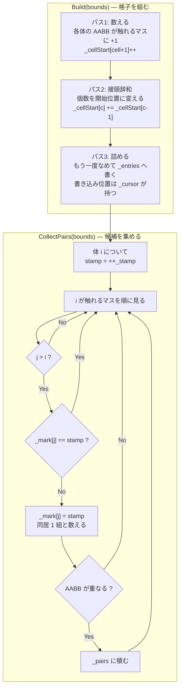
```mermaid
flowchart TD
    subgraph B["Build(bounds) — 格子を組む"]
        B1["パス1: 数える<br/>各体の AABB が触れるマスに +1<br/>_cellStart[cell+1]++"]
        B2["パス2: 接頭辞和<br/>個数を開始位置に変える<br/>_cellStart[c] += _cellStart[c-1]"]
        B3["パス3: 詰める<br/>もう一度なめて _entries へ書く<br/>書き込み位置は _cursor が持つ"]
        B1 --> B2 --> B3
    end

    subgraph C["CollectPairs(bounds) — 候補を集める"]
        C1["体 i について<br/>stamp = ++_stamp"]
        C2["i が触れるマスを順に見る"]
        C3{"j > i ?"}
        C4{"_mark[j] == stamp ?"}
        C5["_mark[j] = stamp<br/>同居 1 組と数える"]
        C6{"AABB が重なる ?"}
        C7["_pairs に積む"]
        C1 --> C2 --> C3
        C3 -->|No| C2
        C3 -->|Yes| C4
        C4 -->|Yes| C2
        C4 -->|No| C5 --> C6
        C6 -->|No| C2
        C6 -->|Yes| C7 --> C2
    end

    B3 --> C1
```

3つの絞りが直列に並んでいるのが分かる。

| 絞り | 落とすもの | 4000 体での実測(マス 32px) |
|---|---|---|
| 格子 | 別のマスにいる組 | 7,998,000 → 72,527 |
| `j > i` と印 | 同じ組の重複 | (上の数に含まれる) |
| AABB | 同じマスだが離れている組 | 72,527 → 24,733 |

**最後の AABB がまだ 3 分の 1 に減らしている**のが面白いところで、
「同じマスにいる」は「近い」でしかない。
7.4ns の AABB 判定を挟むことで、24〜120ns のナローフェーズを 5 万回節約している。

`j > i` の条件だけでは重複が消えないことは、実際に印を外すと確かめられる
(自己チェックの「重複した組が無い」が落ちる)。

`Test(in Body, in Body)` の中身は形の組み合わせ表そのもの。**3種類で6通り**になる。

| a \ b | Circle | Box | RotatedBox |
|---|---|---|---|
| **Circle** | `Test(Circle, Circle)` | `Test(Circle, Aabb)` | `Test(Circle, Obb)` |
| **Box** | 上を**符号反転** | `Test(Aabb, Aabb)` | OBB 同士へ寄せる |
| **RotatedBox** | 上を**符号反転** | OBB 同士へ寄せる | `Test(Obb, Obb)` SAT |

- **専用の速い経路**(AABB 同士、円同士)と**一般形**(OBB 同士の SAT)を併存させ、
  組み合わせの穴は一般形で埋める。`F9` の自己チェックで**両者の答えが一致すること**を確認している
- 引数の順が逆になる組(`Test(Box, Circle)`)は**法線の符号を反転**して返す。
  ここを間違えると物体がめり込む方向へ押される(要点6)
- 種類を1つ足すと表が1行1列増える。3D で球・箱・カプセル・平面・地形と並べると 15 通りになり、
  **その表を埋めることが物理エンジンを書くこと**になる(Phase 7)

### 音を1発鳴らすまで — 3つの関門

`Play` を呼んでから実際に音が出るまでに、3回ふるいにかけられる。
**呼んだのに鳴らないことは普通に起きる**ので、どこで落ちたかを数えられるようにしてある。

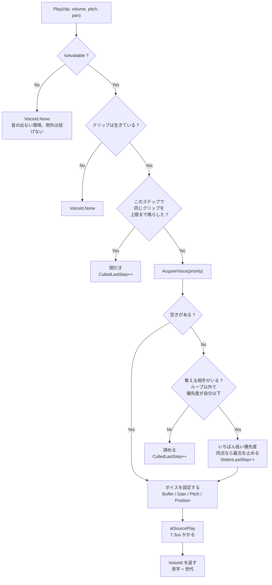
```mermaid
flowchart TD
    S["Play(clip, volume, pitch, pan)"] --> A{"IsAvailable ?"}
    A -->|No| N1["VoiceId.None<br/>音の出ない環境。例外は投げない"]
    A -->|Yes| B{"クリップは生きている ?"}
    B -->|No| N2["VoiceId.None"]
    B -->|Yes| C{"このステップで<br/>同じクリップを<br/>上限まで鳴らした ?"}
    C -->|Yes| N3["間引き<br/>CulledLastStep++"]
    C -->|No| D["AcquireVoice(priority)"]
    D --> E{"空きがある ?"}
    E -->|Yes| G["ボイスを設定する<br/>Buffer / Gain / Pitch / Position"]
    E -->|No| F{"奪える相手がいる ?<br/>ループ以外で<br/>優先度が自分以下"}
    F -->|No| N4["諦める<br/>CulledLastStep++"]
    F -->|Yes| ST["いちばん低い優先度<br/>同点なら最古を止める<br/>StolenLastStep++"]
    ST --> G
    G --> H["alSourcePlay<br/>7.3us かかる"]
    H --> I["VoiceId を返す<br/>添字 + 世代"]
```

**「諦める」が2箇所ある**のが要点。
間引き(`C`)は「同じ音が多すぎる」で落とし、
`F` は「ボイスが足りず、しかも自分より偉い音しか鳴っていない」で落とす。
前者は音として意味が無いから落とすので**積極的**、
後者は資源が足りないから落とすので**消極的**。
タイトルバーで両方を分けて数えているのは、この2つが違う対処を要求するため
(前者は上限を調整する、後者はボイスを増やす)。

### 1文字が画面に出るまで — 4つの層を通り抜ける

`Draw("あ", ...)` を呼んでから画面に出るまでに何が起きるか。
**初回だけ通る道**(焼く)と、**毎回通る道**(引く・積む)が分かれているのが要点。

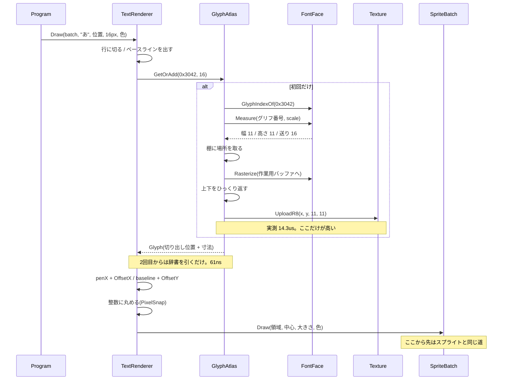
```mermaid
sequenceDiagram
    participant P as Program
    participant TR as TextRenderer
    participant GA as GlyphAtlas
    participant FF as FontFace
    participant TX as Texture
    participant SB as SpriteBatch

    P->>TR: Draw(batch, "あ", 位置, 16px, 色)
    TR->>TR: 行に切る / ベースラインを出す
    TR->>GA: GetOrAdd(0x3042, 16)

    alt 初回だけ
        GA->>FF: GlyphIndexOf(0x3042)
        GA->>FF: Measure(グリフ番号, scale)
        FF-->>GA: 幅 11 / 高さ 11 / 送り 16
        GA->>GA: 棚に場所を取る
        GA->>FF: Rasterize(作業用バッファへ)
        GA->>GA: 上下をひっくり返す
        GA->>TX: UploadR8(x, y, 11, 11)
        Note over GA,TX: 実測 14.3us。ここだけが高い
    end

    GA-->>TR: Glyph(切り出し位置 + 寸法)
    Note over TR,GA: 2回目からは辞書を引くだけ。61ns

    TR->>TR: penX + OffsetX / baseline + OffsetY
    TR->>TR: 整数に丸める(PixelSnap)
    TR->>SB: Draw(領域, 中心, 大きさ, 色)
    Note over SB: ここから先はスプライトと同じ道
```

図で見てほしいのは、**`alt` の中が初回にしか走らない**こと。
14.3us と 61ns の差は 234 倍あり、**キャッシュを持つかどうかがそのまま性能**になる。
だからアトラスは「使い回すためのもの」であって、
描画をまとめるため(Day 17 の動機)だけのものではない。

もうひとつ、**`TextRenderer` から `Texture` への線が無い**。
グリフを焼く判断も、GL を触るのも、全部 `GlyphAtlas` の中で閉じている。
`TextRenderer` から見れば「文字を渡すと切り出し位置が返ってくる」だけで、

### ゲームの1ステップ — 11 段の順番と、格子の使い回し

`SurvivorGame.Update` は 11 段でできている。**順番に意味がある**。

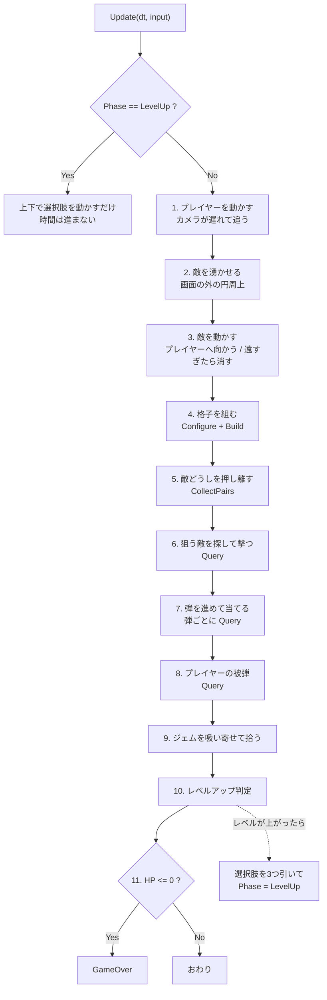
```mermaid
flowchart TD
    S["Update(dt, input)"] --> LU{"Phase == LevelUp ?"}
    LU -->|Yes| C1["上下で選択肢を動かすだけ<br/>時間は進まない"]
    LU -->|No| P1["1. プレイヤーを動かす<br/>カメラが遅れて追う"]
    P1 --> P2["2. 敵を湧かせる<br/>画面の外の円周上"]
    P2 --> P3["3. 敵を動かす<br/>プレイヤーへ向かう / 遠すぎたら消す"]
    P3 --> P4["4. 格子を組む<br/>Configure + Build"]
    P4 --> P5["5. 敵どうしを押し離す<br/>CollectPairs"]
    P5 --> P6["6. 狙う敵を探して撃つ<br/>Query"]
    P6 --> P7["7. 弾を進めて当てる<br/>弾ごとに Query"]
    P7 --> P8["8. プレイヤーの被弾<br/>Query"]
    P8 --> P9["9. ジェムを吸い寄せて拾う"]
    P9 --> P10["10. レベルアップ判定"]
    P10 --> P11{"11. HP <= 0 ?"}
    P11 -->|Yes| GO["GameOver"]
    P11 -->|No| E["おわり"]
    P10 -.->|レベルが上がったら| LV["選択肢を3つ引いて<br/>Phase = LevelUp"]
```

**10 でレベルが上がったら、そこで止まる**。
Day 29 は `while` で一気に上げていたが、選択を挟むならそれはできない——
1回に1レベルずつ処理して、選び終わってから次のレベルを見る。

入れ替えると壊れるところ:

| 順番 | なぜそこか |
|---|---|
| 4 が 3 の後 | 動かす前に組むと、**1ステップ古い位置**で判定することになる |
| 5〜8 が 4 の後 | 全部**同じ格子**を使う。組み直すと4倍のコストになる |
| 10 が 9 の後 | ジェムを拾ってからでないと、レベルが1ステップ遅れる |

**格子を1回組んで4通りに使う**のが今日いちばんの節約になっている。

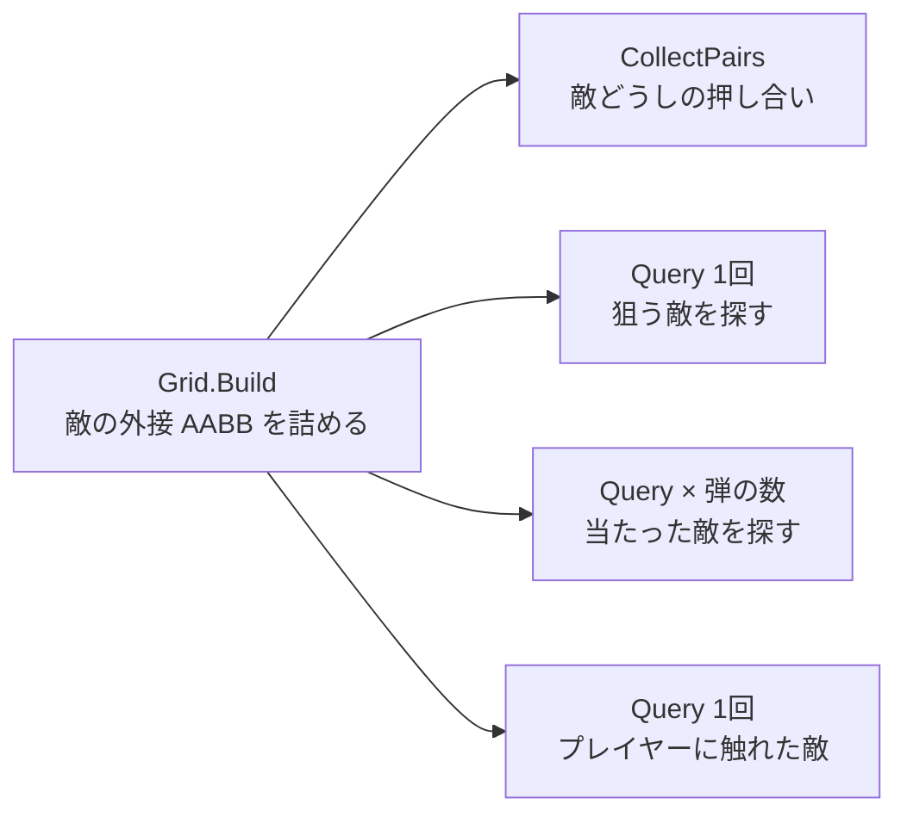
```mermaid
flowchart LR
    B["Grid.Build<br/>敵の外接 AABB を詰める"]
    B --> Q1["CollectPairs<br/>敵どうしの押し合い"]
    B --> Q2["Query 1回<br/>狙う敵を探す"]
    B --> Q3["Query × 弾の数<br/>当たった敵を探す"]
    B --> Q4["Query 1回<br/>プレイヤーに触れた敵"]
```

実測(敵 509 体):

| | 組の数 |
|---|---|
| 総当たりなら | 129,286 組 |
| 格子の候補 | **594 組** |

**99.5% 減っている**。押し合いは「全員対全員」なので、
格子が無ければこの演出はそもそも載らない(Day 26 の要点5)。

そして 2〜4 は `CollectPairs` ではなく `Query` を使う。
**1対多は組の列挙では表せない**——
弾1発について「近くにいる敵」を知りたいだけなので、
全部の組を作ってから絞るのは無駄になる。

### 武器3種 — 当たり判定をどこに置くか

3つの武器の違いは、突き詰めると<b>当たり判定をどこに置くか</b>だけになる。

```mermaid
flowchart TD
    W["UpdateWeapons(dt)"] --> K{"武器の種類"}

    K -->|Bolt| B1["タイマーを刻む"]
    B1 --> B2["いちばん近い敵を Query で探す"]
    B2 --> B3["Projectile を Count 発ぶん作る<br/>少しずつ角度をずらす"]
    B3 --> B4["**当たり判定は UpdateProjectiles 側**<br/>飛んでいる間ずっと残る"]

    K -->|Orbit| O1["角度を進める<br/>Angle += Speed * dt"]
    O1 --> O2["**毎ステップ**判定する<br/>刻むとすり抜ける"]
    O2 --> O3["球ごとに Query → 円判定"]
    O3 --> O4["**Damage は毎秒**<br/>dt を掛けて削る"]

    K -->|Aura| A1["タイマーを刻む"]
    A1 --> A2["半径 Radius の円で Query"]
    A2 --> A3["範囲の敵をまとめて削る<br/>**位置すら持たない**"]
```

| | 当たり判定の置き場所 | 残るか | 刻むか |
|---|---|---|---|
| ボルト | `Projectile` の配列 | 寿命まで残る | 発射を刻む |
| オービット | その場で計算 | **残らない** | **刻まない**(毎ステップ) |
| オーラ | プレイヤーの周り | 残らない | 削りを刻む |

**「武器 = 弾を出すもの」と決めつけて設計すると、オービットとオーラが入らない**
(Day 29 の改造課題3で触れた分かれ道)。
今日の形は、`WeaponState` を「種類とレベルとタイマー」だけにして、
<b>当たり方は種類ごとの関数に任せる</b>——
つまり案A(enum + 分岐)を選んでいる。

3種類のうちはこれが読みやすい。5種類を超えたら、
`WeaponStats` のフィールドの意味が武器ごとに違うのが苦しくなるので、
そこが案C(完全にデータで持つ)へ移る目安になる。

### オービットだけ刻まない理由

これは実装中に実際に踏んだところ。**最初は 0.22 秒ごとに判定していて、
オービットだけで 40 秒遊んで撃破 0 体**になった。

```mermaid
flowchart LR
    T1["t=0.00s<br/>球はここ"] -->|"0.22秒で 50px 進む"| T2["t=0.22s<br/>球はここ"]
    E["敵はこの間にいた<br/>**一度も判定されない**"]
    T1 -.-> E
    T2 -.-> E
```

球は 1 秒に 200px 以上動く。0.22 秒ごとに位置を見ると、
**1回の判定の間に 50px 飛ぶ**。球の直径は 22px しかないので、
その間にいた敵はすり抜ける。

Day 25 の改造課題3(速い弾が細い壁をすり抜ける)とまったく同じ話が、
**攻撃側で起きた**ことになる。直し方も同じ2択で、

1. 移動前と移動後を結んだ範囲で判定する(連続衝突判定)
2. **毎ステップ判定して、ダメージを時間で割る**

ここでは 2 を採った。触れている間ずっと削る形になるので、
「巻き付いて削る武器」という手触りにも合う。
そのぶん `WeaponStats.Damage` の単位が武器で変わる
(オービットだけ「毎秒」)——**気持ち悪いが、揃えると片方が嘘になる**。
## 完成条件

```
dotnet run --project reference/Day31 -c Release
```

起動したら、まず**スプライトを消して 3D だけにする**と見やすい。

```
Shift+PageDown        … スプライトを 0 に(Shift 併用で1万枚単位)
Space                  … 止める
```

### 1. 明るさの階段が見える

画面の奥に、白い板が8枚並んでいる。左から **0.25 / 0.5 / 1 / 2 / 4 / 8 / 16 / 32**。
隣どうしがちょうど 2 倍(写真でいう「1段」)になっている。

そのほかに、光っている立方体が3つ(電球色・青・赤)。
`Tint` に 1 を超える値が入っているのはこの4種類だけで、
床も立方体もスプライトも 1.0 以下のまま。

### 2. `Shift+3`: トーンマップを切り替える

| 設定 | 階段がどう見えるか |
|---|---|
| **なし** | 3枚目(1.0)から右が**全部おなじ白**。4枚目以降の情報が絵に出ていない |
| **Reinhard** | 右まで見分けはつくが、中間が持ち上がって全体が眠くなる |
| **ACES** | 4 のあたりまで段差が戻る。**暗部も締まる**ので床の格子がはっきりする |

「なし」と「ACES」を往復するのがいちばん分かりやすい。
**同じシーンなのに、畳み方だけで読み取れる情報量が変わる**。

### 3. `Shift+5` で露出を下げる — ここが今日の山

ACES のまま `Shift+5` を数回押して露出を **0.20** あたりまで下げる。

```
HDR:16F  ACES  露出:0.20  ブルーム:閾1.0  [最終]  パス:10  10.0MB
```

階段の右側(8, 16, 32)に**段差が戻ってくる**。
明るさそのものの差は 0.95 / 0.98 / 1.00 と細かいが、
**滲みの大きさがはっきり違う**ので、3枚が別物だと目で分かる。
畳む前の値が残っているので、露出を下げれば見えるようになる。

そこで `Shift+1` を押して 8bit に落とす。

```
HDR:8bit  ACES  露出:0.20  ブルーム:閾1.0  [最終]  パス:10  7.6MB
```

**3枚目(1.0)から右が全部おなじ灰色に潰れる**。
光っていた立方体も、ただの薄い板になる。ブルームも1ミリも出ない。
露出をさらに下げても、絵が暗くなるだけで**何も戻ってこない**。

> 畳む前に 1.0 で切られていたら、あとから何をしても復元できない。

これが「なぜ中間バッファを浮動小数点にするのか」の答えになる。
`Shift+1` でもう一度 16F に戻すと、そのまま復活する。

### 4. `Shift+4`: パイプラインの途中を見る

| 表示 | 何が映るか |
|---|---|
| 最終 | ふつうの絵 |
| シーンのみ | ブルームを足さないもの。滲みの効き目が分かる |
| **明部** | 1.0 を超えているところ**だけ**。階段の右半分と3つの立方体、あとは真っ黒 |
| ぼかし後 | それを4往復ぼかしたもの。これが最終結果に足されている |

「明部」がいちばん見て気持ちがいい。
**1.0 を超えているものが画面のどこにあるか**が一目で分かる。

### 5. `Shift+8`: 自己チェック

6項目すべて `OK` になる。

```
[HDR の自己チェック]
  [OK] RGBA16F: 暗部 0.25 がそのまま残る  実際 0.250
  [OK] RGBA16F: 1.0 がそのまま残る  実際 1.000
  [OK] RGBA16F: **4.0 が 4.0 のまま入る**  実際 4.000
  [OK] RGBA8: 1.0 までは入る  実際 1.000
  [OK] RGBA8: **4.0 は 1.0 に丸められる**  実際 1.000
  [OK] RGBA8: 暗部は 1/255 刻みに丸められる  実際 0.25098(64/255 = 0.25098)
  すべて合格
  中間バッファ合計 10.0MB(960x640)
```

`0.25098` が `64/255` にぴったり一致するのが、8bit の刻みそのもの。
**「なんとなく潰れている」ではなく、どこで何段に丸められたかが数字で出る**。

### 6. Day 30 と見比べる

トーンマップを「なし」、ブルームを OFF、露出 1.00 にすると、
**Day 30 とほぼ同じ絵**になる。

```
dotnet run --project reference/Day30 -c Release
```

を別ウィンドウで並べて確かめられる。要点3のとおり、
リニアに直して掛け算し、最後にガンマで戻すのは
**掛け算しかしていない経路では完全に元へ戻る**ため。

ぴったり同じにはならない箇所が2つある。

| 違うところ | なぜ |
|---|---|
| 半透明の重なり | アルファ合成が sRGB 空間からリニア空間に移った。**こちらのほうが正しい** |
| 文字の太さ | 同じ理由。輪郭の半透明画素の混ざり方が変わる |

「絵が変わっていない」ことを確かめるのが、今日の作業がちゃんと通った証拠になる。
**変わってしまったら、要点3の表のどれかを揃え忘れている**。

## 改造課題

### 課題1(易): ブルームの強さを調整できるようにする

`PostProcess.BloomIntensity` は 0.55 固定にしてある。
`Shift+7` がしきい値を巡回するのと同じ形で、強さも変えられるようにする。

見てほしいのは**しきい値と強さの役割の違い**。

- しきい値を下げる … **滲む対象が増える**。画面全体が霞む
- 強さを上げる … **滲みが濃くなる**。対象は変わらない

同じ「ブルームが強い」でも中身が違うので、
片方だけで調整しようとすると必ずどこかで破綻する。

余裕があれば `BlurIterations`(現在4)も変えてみる。
往復を増やすと滲みが広がるが、パス数が線形に増える(`パス:` の表示で分かる)。

### 課題2(中): UI を後処理の外に出す

いまは HUD の文字もトーンマップを通っている。
露出を上げると文字まで白飛びするのがその証拠。

`_post.End()` を呼んだ**あと**に `RenderText()` を呼ぶように変える。

引っかかるのは2つ。

1. `End()` は既定のフレームバッファを bind したままにするので、そこは都合がよい
2. しかし `End()` は深度テストとブレンドを**元に戻して**帰るので、
   文字を描く前の状態がシーン依存になる。`SpriteBatch` はブレンドを自分で有効にするが、
   **深度テストは面倒を見ていない**

直したら、露出を上げても文字が白いままであることを確かめる。
そのうえで「じゃあ UI にブルームをかけたくなったらどうするか」を考えてみると、
Day 38 でやることの見当がつく。

### 課題3(難): 露出を自動にする(オートエクスポージャ)

いまは露出を手で決めている。実際のゲームは
**画面の平均的な明るさから自動で決める**(明るい屋外から暗い洞窟に入ると、
最初はまぶしくて、だんだん目が慣れる、あの挙動)。

手順はこうなる。

1. シーンバッファのミップマップを作る(`glGenerateMipmap`)。
   **いちばん小さいレベル(1x1)が画面全体の平均**になる
2. その1テクセルを読む。ただし `glReadPixels` は**GPU の完了を待つ**ので、
   毎フレームやるとパイプラインが止まる。1フレーム遅れで読むか、
   ピクセルバッファオブジェクト(PBO)を使う
3. 目標露出 = `0.18 / 平均輝度`(0.18 は写真の「中間グレー」)
4. **いきなり切り替えず、時定数をつけて追従させる**。
   これをやらないと、明るいものが横切るたびに画面全体が明滅する

3 と 4 が本体で、1 と 2 は道具。
特に 4 は「正しい値に一瞬で合わせると、絵として破綻する」典型例になっている。

平均ではなく**対数平均**(輝度の log を平均してから exp で戻す)を使うと、
1つの強い光源に引きずられにくくなる。余裕があればそちらも試す。

## 動作確認済み環境

- Windows 11 Home / .NET 10
- GL_RENDERER: NVIDIA GeForce RTX 3070/PCIe/SSE2
- GL_VERSION: 3.3.0 NVIDIA 596.49

### 自己チェック(6項目すべて合格)

```
[HDR の自己チェック]
  [OK] RGBA16F: 暗部 0.25 がそのまま残る  実際 0.250
  [OK] RGBA16F: 1.0 がそのまま残る  実際 1.000
  [OK] RGBA16F: **4.0 が 4.0 のまま入る**  実際 4.000
  [OK] RGBA8: 1.0 までは入る  実際 1.000
  [OK] RGBA8: **4.0 は 1.0 に丸められる**  実際 1.000
  [OK] RGBA8: 暗部は 1/255 刻みに丸められる  実際 0.25098(64/255 = 0.25098)
  すべて合格
  中間バッファ合計 10.0MB(960x640)
```

### 後処理の代償(1920x1080、スプライト 1000 枚、3D 背景あり)

`glFinish()` を挟んで **GPU の完了まで含めた** 800 フレームの平均。

| 設定 | 1フレーム | Day 30 との差 |
|---|---|---|
| Day 30(後処理なし) | 0.341 ms | — |
| 合成のみ(パス 1) | 0.398 ms | +0.06 ms |
| ブルームあり(パス 10) | **0.672 ms** | **+0.33 ms** |

ブルームの9パスが 0.27ms、合成の1パスが 0.06ms。
**60fps の予算(16.7ms)の 2%** で、AAA デモの最低条件が1つ揃う計算になる。

VRAM は 1920x1080 で **33.6MB**。

| バッファ | 大きさ | 内訳 |
|---|---|---|
| scene | 1920x1080 | カラー RGBA16F 15.8MB + 深度 5.9MB |
| bright / blurA / blurB | 960x540 | RGBA16F 3.95MB × 3 |

`glFinish()` を挟まずに測ると、ブルームありでも 0.38ms 程度しか出ない。
このデモは CPU 側(1000 枚のスプライトの組み立て)がボトルネックで、
**GPU が裏で走っているぶんが frame time に現れない**ため。
後処理のように「CPU の仕事はほぼゼロ、GPU だけが働く」ものを測るときは、
同期を入れないと**足したはずのコストが消えて見える**。

### 検証の途中で分かったこと

**`GL_POLYGON_MODE` は int を2個返す**。
`GetInteger(GetPName.PolygonMode, out int)` と書いても**コンパイルは通り、警告も出ない**。
GL は 2 個目を書き込む先が無いままメモリを踏むので、
「たいてい動くが、たまに壊れる」という最悪の形になる。
`Span<int>` を受け取る版を使う。

**ACES の白飛びする点は 7 あたり**。
最初は「ACES にすれば 32 まで見分けがつく」と書いていたが、実際に測ると
このカーブフィットは x=8 で 1.0 に達していた。
**トーンマップは無限を 0〜1 に写すが、実用上のホワイトポイントは有限**で、
そこから先を見たければ露出で切り出す区間を動かすしかない。
「畳み方」と「どこを切り出すか」が別の道具である理由がここにある。

**階段を詰めて並べるとブルームが隣へ滲んで、段の境目が読めなくなる**。
最初は隙間 0.08 で並べていたが、滲みが仕事をしすぎて1本の光る帯になった。
0.28 まで広げて、ようやく段として読めるようになった。
**効果を見せるための題材は、効果に負けない間隔で並べる**。
