# Day 32: glTF 2.0 の読み込み(静的メッシュ + PBR マテリアル)と高品質アセット導入

Phase 6 の2日目。**エンジンに本物のモデルが載る**。

## 今日のゴール

Khronos 公式のサンプルモデルを `Shift+0` で切り替えて眺められる。

```
 Shift+0 で巡回

  DamagedHelmet   15,452三角形  テクスチャ5枚   glb 埋め込み・JPEG
  WaterBottle      4,510三角形  テクスチャ4枚   glb 埋め込み・PNG
  Lantern          5,394三角形  テクスチャ4枚   ノード4個・親子あり
  BoxTextured         12三角形  テクスチャ1枚   .gltf + .bin + .png の3ファイル
  (モデル無し)                                  Day 31 までのデモに戻る
```

そして `Shift+9` で、読み込んだマップを1枚ずつ画面に出せる。

```
 通常 → ベースカラー → 法線(頂点) → メタリック → ラフネス → AO → 発光 → 法線マップ
```

**今日はベースカラーしか絵に使わない**。残りは読み込んで持っておくだけで、
使い始めるのは法線が Day 34、メタリック/ラフネスが Day 35、AO が Day 37。
先に器を作っておくと、その日の差分がシェーダだけで済む。

併せて `Vertex` に法線が戻り、平行光源1つぶんのランバート反射が付く
(Day 9 でソフトウェアラスタライザに書いたものの GPU 版)。

## 事前に読む資料

ロードマップでは資料の指定が無い日なので、実装に直結するものを挙げておく。

- [glTF 2.0 仕様](https://registry.khronos.org/glTF/specs/2.0/glTF-2.0.html)
  **今日いちばん使う**。全部読む必要は無く、
  「Concepts → Geometry」「Concepts → Materials」「Binary glTF Layout」の3節でよい
- [glTF Tutorial](https://github.com/KhronosGroup/glTF-Tutorials/tree/main/gltfTutorial)
  仕様を読む前の地図。**"A Minimal glTF File" と "Buffers, BufferViews, and Accessors"** の2章が要点
- [glTF 2.0 Quick Reference Guide (PDF)](https://www.khronos.org/files/gltf20-reference-guide.pdf)
  1枚絵でファイル構造が載っている。**写経中はこれを開いておくと速い**
- [glTF Sample Assets](https://github.com/KhronosGroup/glTF-Sample-Assets)
  今日使う4体の出どころ。「どの機能を試すためのモデルか」が README に書いてある
- [LearnOpenGL: Basic Lighting](https://learnopengl.com/Lighting/Basic-Lighting)
  法線行列(逆転置)の導出はここが短い。要点5の背景

## 素材について

`assets/models/` に Khronos のサンプルを4体置いた。**入手元とライセンスは
`assets/models/LICENSE.md`** に記録してある。

| モデル | サイズ | ライセンス |
|---|---|---|
| DamagedHelmet.glb | 3.7MB | CC BY-NC 4.0(非商用) |
| WaterBottle.glb | 9.0MB | CC0 |
| Lantern.glb | 9.6MB | CC0 |
| BoxTextured(3ファイル) | 8KB | CC BY 4.0 |

**`.glb` は Git LFS で管理する**ことにした(`.gitattributes`)。
Phase 6 は素材がそのまま重くなり、Day 36 の IBL では 1 枚 20〜50MB の HDRI が入る。
通常の blob として置くと、**以後すべてのクローンが恒久的にその重さを払う**。

LFS へ移せるのは**最初のコミットの前だけ**で、
一度通常の blob として push すると、あとから移すには履歴の書き換えが要る。

クローンした側は一度だけこれが要る。

```
git lfs install
git lfs pull
```

引いていない場合、`assets/models/*.glb` は 130 バイトのテキスト(ポインタ)になっている。
`Program.OnLoad` はモデルの読み込みに失敗しても起動を続けるので、
**素材が無くても他の Day の機能は触れる**。

Poly Haven など他の CC0 素材を足すときも、置くのは同じ場所でよい。
`.gltf` と `.glb` はローダがどちらも受ける。

## 理論の要点

### 1. glTF は「読み込んだあとの姿」で書かれている

Day 10 で OBJ ローダを書いた。あれはテキストを行ごとに読んで `v` / `vt` / `f` を拾うだけで、
100 行に満たなかった。glTF はそれよりずっと大きいが、**大きい理由がはっきりしている**。

| | OBJ(1992) | glTF 2.0(2017) |
|---|---|---|
| 形式 | テキスト | JSON + バイナリ |
| 読み込み | 数値を1個ずつ parse | **バイト列をそのまま GPU へ** |
| マテリアル | 別ファイル(.mtl)、実装依存 | 仕様に組み込み。**PBR で定義** |
| 階層 | 無い | ノードの木 |
| テクスチャ | パスだけ | 埋め込みも可。サンプラの設定も持つ |

glTF が "the JPEG of 3D" と呼ばれるのは、**実行時にそのまま使える形**で入っているから。

OBJ は「頂点の位置の配列」と「面の定義」が別々なので、
読み込んだあとに GPU 向けの頂点配列へ組み直す必要があった(Day10.md の要点2)。
glTF は組み直したあとの姿——**頂点バッファとインデックスバッファそのもの**——が入っている。

だから読み込みの仕事は「解析」ではなく「**どこからどこまでを、どういう意味で読むか**」の解決になる。

### 2. accessor → bufferView → buffer の3段

glTF の骨格はこの3段で、ここさえ掴めば残りは細部になる。

```
  accessor   … 「float の VEC3 が 14556 個」        = 意味と個数
      ↓
  bufferView … 「buffer の 1024 バイト目から 174672 バイト」= 場所
      ↓
  buffer     … バイト列そのもの
```

面倒に見えるが、この分け方のおかげで**1本のバイト列を複数の意味で切り出せる**。
位置と法線と UV が同じ `buffer` に同居し、それぞれの `bufferView` が違う範囲を指す。

`buffer` の出どころは3通りあり、**全部に対応しないとサンプルすら読めない**。

| どこから | いつ使われるか |
|---|---|
| glb の BIN チャンク | `.glb` なら常にこれ(`uri` が無い) |
| 外部ファイル | `.gltf` + `.bin`。Poly Haven の配布はたいていこれ |
| data URI(base64) | `.gltf` 1ファイルで完結させたいとき。バイト数は 4/3 に増える |

**オフセットが2段ある**のが引っかかりどころで、
`bufferView.byteOffset` と `accessor.byteOffset` を足して初めて実際の位置になる。

そして `byteStride`。glTF は「位置・法線・UV を1頂点ずつ交互に並べる(interleaved)」書き方も許していて、
その場合 `bufferView` に `byteStride` が入る。0(または未指定)なら詰めて並んでいる。

```csharp
return (buffer, start, stride > 0 ? stride : elementSize);
```

**これを無視して決め打ちしても、今日の4体は全部 stride 無しなので動いてしまう**。
「動いたから正しい」が言えない類の分岐で、仕様を読んでいないと存在にすら気づかない。

### 3. glb は zip ではない

`.glb` の中身は「ヘッダ + チャンクの並び」だけ。

```
  [magic "glTF"][version 2][全体の長さ]       12 バイト
  [チャンク長][型 "JSON"][JSON 本体]
  [チャンク長][型 "BIN\0"][バイナリ本体]      ← 無いこともある
```

**なぜ圧縮しないのか**。バイナリチャンクは頂点バッファの並びそのものなので、
ファイルから読んだメモリの一部を、コピーも変換もせず GPU へ渡せる。
圧縮すると必ず展開の1手間が入る。

読むときの作法が2つある。

- **拡張子ではなく先頭4バイトで判別する**。拡張子は人が付け替えられるが、マジックナンバーは嘘をつかない
- **未知の型のチャンクは読み飛ばす**。仕様がそう要求していて、将来チャンクが増えても古いローダが壊れない

チャンクは4バイト境界にそろえる決まりなので、詰め物のぶん進めるのを忘れない。

```csharp
offset += (length + 3) & ~3;
```

### 4. マテリアルが仕様に入っている — metallic-roughness

OBJ の `.mtl` は「実装が好きに解釈してよい」ものだった。
glTF は**材質の意味まで仕様で決めている**のが決定的な違いで、
だからファイルを渡すだけで同じ見た目が出る。

使うのは **metallic-roughness ワークフロー**。

| | 何を表すか |
|---|---|
| ベースカラー | 非金属なら拡散色、金属なら反射色 |
| メタリック | 0 = 非金属(誘電体)、1 = 金属。**中間はほぼ物理的に無い** |
| ラフネス | 0 = 鏡、1 = つや消し |

「拡散色 + 鏡面色」で表す昔ながらのやり方に比べ、
**物理的に破綻した組み合わせを作りにくい**のが利点になる
(拡散も鏡面も真っ白、のようなことができない)。

メタリックとラフネスは**1枚のテクスチャに詰めて**配る。

```
  R = 空き(AO を入れる流儀もある)
  G = ラフネス
  B = メタリック
```

チャンネルの割り当ては仕様で決まっているので、**入れ替えると静かに壊れる**。
`Shift+9` でメタリックとラフネスを個別に出せるようにしてあるのは、これを目で確かめるため。

### 5. 色のテクスチャとデータのテクスチャは、読み方が違う

**今日いちばん間違えやすいところ**。Day 31 で `Texture` を全部 `Srgb8Alpha8` にしたが、
glTF は1つのモデルの中に色とデータを混ぜて持つので、そのままでは立ち行かない。

| マップ | 中身 | 読み方 |
|---|---|---|
| ベースカラー | **色** | sRGB(GPU が 2.2 乗を戻す) |
| 発光 | **色** | sRGB |
| 法線 | データ(向き) | **リニア** |
| メタリック/ラフネス | データ(数値) | **リニア** |
| AO | データ(遮蔽率) | **リニア** |

法線マップを sRGB で読むと、`(0.5, 0.5, 1.0)` が `(0.22, 0.22, 1.0)` になり、
面の傾きが実際より強く出る。ラフネスを sRGB で読むと、
「少しざらついた面」が軒並みつるつるになる。

**どちらもエラーにならず、絵が微妙におかしくなるだけ**なので気付きにくい。
キャッシュのキーにも混ぜておかないと、
同じ PNG を「色として」読んだあとに「データとして」読んだとき、
先に読んだほうが返ってくる。

```csharp
private static string MakeMemoryKey(string baseKey, bool generateMipmaps, bool srgb) =>
    baseKey + (generateMipmaps ? "" : "|nomip") + (srgb ? "" : "|linear");
```

**キャッシュのキーは「同じ結果になる条件」全部**、という Day 21 の話がそのまま効く。

### 6. 法線はモデル行列では運べない

`Vertex` に法線が戻ったので、世界空間へ運ぶ必要が出てくる。
位置は `uModel` で運べるが、**法線は同じ行列では運べない**。

理由は「法線は面に垂直だが、**垂直という関係は変換で保たれない**」から。
x 方向だけ 2 倍に伸ばすと、斜めの面は寝るのに、
同じ行列を法線に掛けると法線は逆に立ってしまう。

正しい変換は **モデル行列の左上 3x3 の逆行列の転置**(法線行列)。
導出は「面上のベクトル `t` と法線 `n` の内積 0 を、変換後も 0 にする行列は何か」を解くだけで、
答えが `(M^-1)^T` になる。

```csharp
return Matrix4x4.Invert(model, out Matrix4x4 inverse)
    ? Matrix4x4.Transpose(inverse)
    : model;
```

**一様スケールと回転しか使っていなければ `M` と一致する**ので、
手を抜いても大半のモデルは正しく見える——これも「動いたから正しい」が言えない分岐。
glTF は非一様スケールを持つノードを普通に含むので、ここで払っておく。

送るときにもう1つ罠がある。GLSL の `mat3` は「3 float の列が3本」で詰めて並ぶが、
`Matrix4x4` のメモリから左上を取ると **4 float ごとに飛び飛び**になる。
`SetMatrix4` のようにポインタをそのまま渡すと、2列目以降が1つずつずれる。
`SetMatrix3` で詰め直しているのはこのため。

### 7. モデルの大きさは読むまで分からない

glTF の単位は「**1.0 = 1 メートル**」と仕様で決まっている。
決まってはいるが、実際に来るものはこうなる。

| モデル | 境界球の半径 |
|---|---|
| WaterBottle | 0.15m |
| DamagedHelmet | 1.64m |
| Lantern | **15.17m** |

100 倍の幅がある。固定の倍率を書くと、どれか1つにしか合わない。

そこで**境界箱を読み込み時に取って、そこから倍率とカメラを決める**。

```csharp
float scale = targetRadius / model.BoundsRadius;
_orbit.Distance = targetRadius * 2.6f;
```

境界箱は**世界行列を通したあと**で取る。
ローカルのままだと、ノードの平行移動(街灯の本体は 13m 上にある)が反映されない。

**モデル側を動かす**のは、カメラを動かすと
ニアクリップとファークリップも一緒に調整することになるから(Day16.md の要点5)。
触るものが少ないほうを選ぶ。

## 前Dayからの差分概要

### 新規ファイル

| ファイル | 役割 |
|---|---|
| `Model/Model.cs` | 読み込み済みのモデル1体。**パーツの平らな一覧**と境界箱。テクスチャの参照を返す責任も持つ |
| `Model/GltfLoader.cs` | glTF 2.0 の読み込み本体。glb/gltf、3段の間接参照、ノードの木、マテリアル、サンプラ |

### 変更ファイル

| ファイル | 変更 |
|---|---|
| `Render/Vertex.cs` | **法線を末尾に追加**(location 3)。1頂点 36 → 48 バイト |
| `Render/Primitives.cs` | 立方体と板に法線を持たせる。立方体は面の外積から求める |
| `Render/Shader.cs` | `SetMatrix3` を追加(法線行列用。**詰め直しが要る**) |
| `Render/Texture.cs` | `FromPixels` / `FromFile` に `srgb` 引数。`DecodeBytes`(メモリ上の PNG/JPEG)を追加 |
| `Core/ResourceManager.cs` | `LoadTexture` に `srgb`。`LoadTextureFromMemory` を追加。キャッシュのキーに sRGB を混ぜる |
| `Render/Material.cs` | metallic-roughness の値5つと補助マップ4枚。`Apply` がユニット 1〜4 に割り当てる |
| `shaders/textured.vert` | 法線属性と `uNormalMatrix` |
| `shaders/textured.frag` | 平行光源のランバート反射、PBR のマップ、表示成分の切り替え |
| `Program.cs` | モデルの読み込み・切り替え・描画・画面合わせ、平行光源、`Shift+0/9/-`、`RunGltfCheck`、発光マテリアルを emissive で表すよう変更 |

### リポジトリの設定

| ファイル | 変更 |
|---|---|
| `.gitattributes` | `*.glb` / `*.hdr` / `*.exr` / `*.ktx2` を Git LFS へ |
| `assets/models/` | サンプル4体と `LICENSE.md`(**写経の対象外**) |

### Day 31 の発光する立方体の表し方が変わった

今日から陰影が付くので、Day 31 のやり方(`Tint` に 1.0 を超える値)だと
**光源のはずのものまで影の側が暗くなる**。

glTF の言い方に合わせて「ベースカラーは黒、発光がその色」にした。

```csharp
BaseColorFactor = new Vector4(0.0f, 0.0f, 0.0f, 1.0f),   // 拡散反射しない
// 描くたびに EmissiveFactor = 明るさ
```

**これが「光っているもの」の正しい書き方**で、
Day 31 で `Tint` を流用していたのは陰影が無かったから許されていた。
明るさの階段の数値(0.25〜32)は変わらないので、Day 31 の見え方はそのまま残る。

### 写経する順番

依存の下から。`Vertex` を最初に置くのは、**ここを変えないと他が全部通らない**ため。

1. **`Render/Vertex.cs`**(変更)
   `Normal` を末尾に追加し、`Attributes` に `Float(3)` を1本足す。
   4引数のコンストラクタを足して、既存の3引数版はそれに委譲する
2. **`Render/Primitives.cs`**(変更)
   板は `UnitZ` 固定、立方体は `AddFace` の中で外積から求める
3. **`Render/Shader.cs`**(変更)
   `SetMatrix3` を追加。**`SetMatrix4` の直後**に置く
4. **`Render/Texture.cs`**(変更)
   `DecodeBytes` を追加 → `FromFile` / `FromPixels` に `srgb` 引数 →
   内部形式を `srgb ? Srgb8Alpha8 : Rgba8` に
5. **`Core/ResourceManager.cs`**(変更)
   `LoadTexture` に `srgb` → `LoadTextureFromMemory` を追加 →
   `MakeTextureKey` を `MakeMemoryKey` に分けて sRGB を混ぜる。
   **`LoadTextureAsync` のキー生成も直す**(引数が増えたのでコンパイルが通らなくなる)
6. **`Render/Material.cs`**(変更)
   `Name` と PBR のプロパティ → `Apply` の追記 → `BindMap`。
   **`Texture.cs` と `ResourceManager.cs` より後**(ハンドルを解くのに要る)
7. **`Model/Model.cs`**(新規)
   `Part` レコード、境界箱、`Dispose` でのテクスチャ返却。
   `Material` が要るので6の後
8. **`Model/GltfLoader.cs`**(新規)
   glb のほどき方 → `LoadContext` → ノードの木 → プリミティブ → アクセサ →
   buffer/uri → マテリアル → テクスチャ/サンプラ → `Describe`。
   **今日いちばん長い1ファイル(899行)**
9. **`shaders/textured.vert`**(変更)
   `aNormal` と `uNormalMatrix`、`vNormal` の出力
10. **`shaders/textured.frag`**(変更)
    マップ5枚の uniform → PBR の値 → 平行光源 → 表示成分の分岐 → ランバート反射
11. **`Program.cs`**(変更)
    ヘッダ → `ModelPaths` / `_model` / ライトのフィールド →
    `OnLoad`(発光マテリアルを emissive へ、`SetModel(0)`)→
    `OnRender` の分岐 → `Render3D` のライト設定 →
    `RenderModel` / `SetModel` / `FrameModel` → `Draw` と `NormalMatrix` →
    `DebugChannelLabel` / `ModelLabel` → HUD の行 →
    `OnKeyDown`(`Shift+0/9/-`)→ `RunGltfCheck` → `OnClosing` → 操作説明
12. **`Day32.csproj`**(リネームのみ)
    中身は Day 31 と同じ

`.gitattributes` と `assets/models/` はリポジトリ側の設定と素材なので、写経の対象外。

## 設計書

**層が1つ増えた**。`Model/` が `Render/` の上に乗る形で入り、
`Text/` とちょうど同じ位置づけになる。

| 増えたもの | 何をするか |
|---|---|
| `Model/GltfLoader` | glTF 2.0 を読んで `Mesh` + `Material` + 世界行列に変換する |
| `Model/Model` | 読み終わったモデル1体。**平らなパーツの一覧** |

`Render/` 側も、頂点フォーマットとマテリアルが太った。

| 変わったもの | 何が増えたか |
|---|---|
| `Vertex` | **法線**(4本目の属性)。Day 14 で落としていたものが戻った |
| `Material` | metallic-roughness の値5つと、補助マップ4枚 |
| `Texture` | **sRGB かどうかの引数**。色とデータでテクスチャの読み方が変わる |
| `Shader` | `SetMatrix3`(法線行列を送るため) |
| `ResourceManager` | `LoadTextureFromMemory`(glb の中の画像を読むため) |

Day 31 の設計書を丸ごと引き継ぎ、差分の当たった図にだけ手を入れてある。
変わった図は次の3つ。

| 図 | 何が変わったか |
|---|---|
| 全体構成 | **`Model/` が1つ増えた**。依存は `Render` と `Core` への一方通行 |
| `Render` のクラス図 | `Vertex` / `Material` / `Shader` / `Texture` に追記 |
| 1フレームの流れ | モデル表示中はデモを出さない分岐が入った |

そして新しく2つ足した。

| 図 | 何のために |
|---|---|
| `Model` のクラス図 | 新しい層の中身 |
| glTF を1体読むまで | **accessor → bufferView → buffer の3段**と、ノードの木の歩き方 |

写経の前に読み込む必要はない。**途中で「これは誰が呼ぶんだったか」と迷ったときに戻ってくる場所**として使う。

### 全体構成 — 8つの層と、その上のゲーム

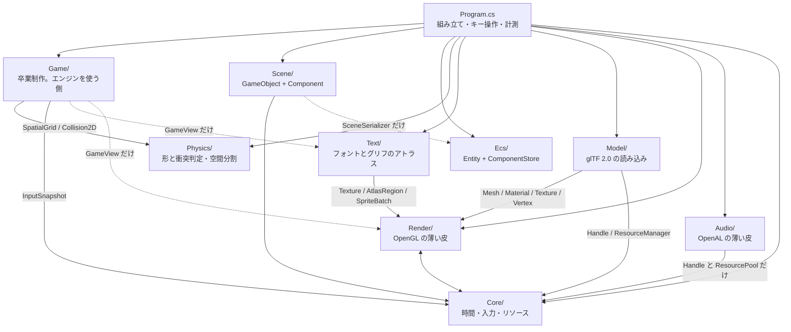
```mermaid
graph TD
    G["Game/<br/>卒業制作。エンジンを使う側"]
    P["Program.cs<br/>組み立て・キー操作・計測"]
    S["Scene/<br/>GameObject + Component"]
    E["Ecs/<br/>Entity + ComponentStore"]
    PH["Physics/<br/>形と衝突判定・空間分割"]
    T["Text/<br/>フォントとグリフのアトラス"]
    MD["Model/<br/>glTF 2.0 の読み込み"]
    R["Render/<br/>OpenGL の薄い皮"]
    A["Audio/<br/>OpenAL の薄い皮"]
    C["Core/<br/>時間・入力・リソース"]

    P --> G
    P --> S
    P --> E
    P --> PH
    P --> T
    P --> MD
    P --> R
    P --> A
    P --> C
    MD -->|"Mesh / Material / Texture / Vertex"| R
    MD -->|"Handle / ResourceManager"| C
    G -->|SpatialGrid / Collision2D| PH
    G -->|InputSnapshot| C
    G -.->|GameView だけ| T
    G -.->|GameView だけ| R
    S --> C
    S -.->|SceneSerializer だけ| E
    T -->|Texture / AtlasRegion / SpriteBatch| R
    R <--> C
    A -->|Handle と ResourcePool だけ| C
```

**Day 32 で `Model/` が1つ増えた**。矢印の向きは変わっていない。

`Model/` は `Text/` とまったく同じ位置に入る——
**`Render/` の上に乗り、`Render/` からは知られていない**一方通行。
`Text/` がグリフを `Texture` に焼いて `SpriteBatch` に積むように、
`Model/` は glTF を `Mesh` と `Material` に変換する。
どちらも「素材の形式を、描画の言葉に翻訳する層」で、性格が揃っている。

**逆向き(`Render` が glTF を知っている)にしなかった**のが要点。
そうすると `Mesh` が「glTF から作られたか、コードで作られたか」を抱え込むことになり、
Day 41 で FBX を足したくなったときに `Render/` を触る羽目になる。
`Primitives`(コードで作る)と `GltfLoader`(ファイルから作る)が
**同じ `Mesh` を作る2つの入口**として並んでいるのが、今の形。

後処理は `Render/` の中で閉じている。`PostProcess` が知っているのは
`GL` と `Framebuffer` と `Shader` と `ResourceManager` だけで、
**シーンに何が入っているかを一切知らない**。だから
`Program` が「今日はゲームを描く」「今日はデモを描く」と切り替えても、
後処理側は1行も変わらない。

**これが Render To Texture のいちばんの配当**で、
画面全体に効く処理(影・SSAO・被写界深度・ディファード)は
今後すべてこの位置に差し込むことになる。

**`Game` から `Audio` への線が無い**のが Day 29 から見てほしいところ。
音は鳴るが、鳴らしているのは `Program` で、ゲームは
「弾を撃った」「敵が死んだ」を <c>OnEvent</c> で外へ投げるだけ。

```csharp
public Action<GameEvent, Vector2>? OnEvent { get; set; }
```

こうしておくと、**自己チェックで 600 秒ぶんを無音で回せる**。
`SurvivorGame` が直接 `_audio.Play` を呼んでいたら、
テストのたびにデバイスを開くことになり、
音の出ない環境ではそもそも動かせない。

同じ理由で `SurvivorGame` は `GameView` も知らない。
**状態を進めるものと、状態を見るもの**が分かれている(Day 19 の線)。

| 層 | 依存先 | 備考 |
|---|---|---|
| `Physics/` | **なし** | `System.Numerics` だけ。そのまま別プロジェクトへ持ち出せる |
| `Ecs/` | **なし** | 同上。Day 23 で「他に依存しないので先に5つ書ける」と書いたとおり |
| `Scene/` | `Core`(`InputSnapshot`)、`Ecs`(`SceneSerializer` のみ) | **描画を一切知らない**。`SpriteRenderer` は絵の種類と大きさを持つデータでしかない |
| `Render/` | `Core`(`Handle` / `ResourceManager`) | `Material` がハンドルを解くために管理側を呼ぶ |
| `Text/` | `Render`(`Texture` / `AtlasRegion` / `SpriteBatch`) | **一方通行**。`Render` は `Text` を知らない |
| **`Model/`** | `Render`(`Mesh` / `Material` / `Texture` / `Vertex`)、`Core`(`Handle` / `ResourceManager`) | **一方通行**。`Render` は glTF を知らない |
| `Audio/` | `Core`(`Handle` / `ResourcePool` **のみ**) | **一方通行**。`Core` は `Audio` を知らない |
| **`Game/`** | `Physics` / `Core`(入力)。描画側だけ `Render` と `Text` | **エンジンは `Game` を知らない**。窓も GL も音も知らない |
| `Core/` | `Render`(`Texture` / `Shader`) | `ResourceManager` が両者の実体を握っている |
| `Program.cs` | 全部 | 組み立て役。6320行あるが、その大半はデモ・計測・自己チェック |

`Game/` の中でも線が引いてある。

| ファイル | 知っていること | 知らないこと |
|---|---|---|
| `GameBalance` | プレイヤー・敵・湧き・経験値の数字 | 全部 |
| `Weapons` | 武器の成長カーブ(レベル → 性能) | ゲームの状態 |
| `UpgradeOption` | 選択肢の中身と、見せる文字 | 適用の仕方 |
| `SurvivorGame` | 形と当たり判定、空間分割、入力、成長 | 描画、音、窓、GL |
| `GameView` | スプライトの積み方、文字の出し方 | ゲームを進める方法(読むだけ) |

**`GameView` が状態を1文字も書き換えない**のは意図的で、
だから描画を丸ごと止めてもゲームは同じように進む。
自己チェックが窓を出さずに回せるのはこの性質のおかげ。

**`Text/` だけが他の層の上に乗っている**。
`Physics/` も `Audio/` も自分で完結していて、単体で別プロジェクトへ持ち出せるが、
`Text/` は `Render/` が無いと成立しない——グリフを置く先が `Texture` で、
積む先が `SpriteBatch` だから。

これは歪みではなく**素直な積み方**で、`Text` → `Render` の一方通行になっている。
逆向き(`SpriteBatch` が文字を知っている)にすると、
描画の中核が「文字とは何か」を抱え込むことになる。
`SpriteBatch` から見れば、文字は**ただの四角**でしかない。

**`Core` と `Render` が相互参照になっている**のは、この図を描いて初めて見えたことで、
きれいな形ではない。`ResourceManager`(Core)が `Texture`(Render)を作り、
`Material`(Render)が `ResourceManager`(Core)を呼ぶ、という往復になっている。

名前空間が `HonyaEngine` 1つなので今は問題なく動くが、**アセンブリを分けようとした瞬間に破綻する**。
直すなら「`ResourcePool` と `Handle` だけを下層に置き、`ResourceManager` は Render 側に上げる」
のが素直で、Phase 6 でアセットの種類が増えたときに検討する。

**Day 27 の判断**: 音を足すとき、この歪みを繰り返さないようにした。

音のリソースも「パスをキーにして使い回し、ハンドルで配る」という点でテクスチャと同じなので、
`ResourceManager` に `LoadAudio` を足すのが自然に見える。
だがそうすると `ResourceManager`(= `Core`)が **GL と OpenAL の両方を握る**ことになり、
上の相互参照が「`Core` ⇔ `Render` + `Core` ⇔ `Audio`」に増える。

そこで `AudioSystem` は、`Core` から**総称型の `ResourcePool<T>` と `Handle<T>` だけを借りて**、
音のリソースは自分で持つ形にした。`ResourcePool<T>` は `T` が何かを知らないので、
借りても依存が増えない。結果、`Audio/` → `Core/` の**一方通行**が保たれている。

図に描いておくと、こういう判断が「なんとなく」ではなくできるようになる。
**設計書は、次に何かを足すときのために書いている**。

### Core — 時間・入力・リソース

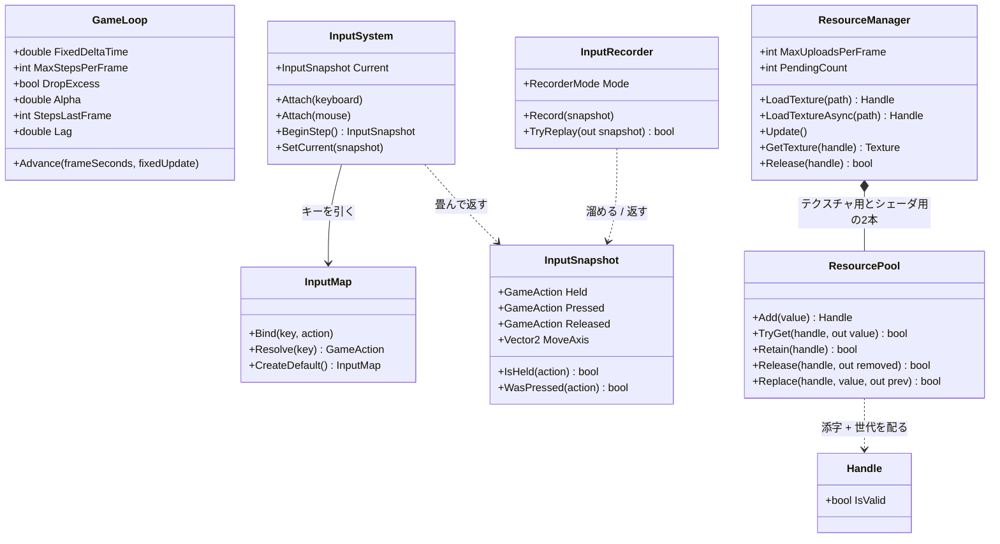
```mermaid
classDiagram
    class GameLoop {
        +double FixedDeltaTime
        +int MaxStepsPerFrame
        +bool DropExcess
        +double Alpha
        +int StepsLastFrame
        +double Lag
        +Advance(frameSeconds, fixedUpdate)
    }
    class InputSystem {
        +InputSnapshot Current
        +Attach(keyboard)
        +Attach(mouse)
        +BeginStep() InputSnapshot
        +SetCurrent(snapshot)
    }
    class InputMap {
        +Bind(key, action)
        +Resolve(key) GameAction
        +CreateDefault() InputMap
    }
    class InputSnapshot {
        +GameAction Held
        +GameAction Pressed
        +GameAction Released
        +Vector2 MoveAxis
        +IsHeld(action) bool
        +WasPressed(action) bool
    }
    class InputRecorder {
        +RecorderMode Mode
        +Record(snapshot)
        +TryReplay(out snapshot) bool
    }
    class Handle {
        +bool IsValid
    }
    class ResourcePool {
        +Add(value) Handle
        +TryGet(handle, out value) bool
        +Retain(handle) bool
        +Release(handle, out removed) bool
        +Replace(handle, value, out prev) bool
    }
    class ResourceManager {
        +int MaxUploadsPerFrame
        +int PendingCount
        +LoadTexture(path) Handle
        +LoadTextureAsync(path) Handle
        +Update()
        +GetTexture(handle) Texture
        +Release(handle) bool
    }

    InputSystem --> InputMap : キーを引く
    InputSystem ..> InputSnapshot : 畳んで返す
    InputRecorder ..> InputSnapshot : 溜める / 返す
    ResourceManager *-- ResourcePool : テクスチャ用とシェーダ用の2本
    ResourcePool ..> Handle : 添字 + 世代を配る
```

`ResourcePool` と `Handle` は総称型(`ResourcePool<T>` / `Handle<T>`)。
`T` が何かを知らないまま添字と世代だけを管理するので、`Texture` にも `Shader` にも同じものが使える。

この層で押さえるべき責務の線引き:

- **`GameLoop` は時間しか知らない**。何を更新するかは `Action<float>` で渡される
- **`InputSystem` はデバイスのイベントを畳むだけ**。ゲームとしての意味づけは `InputMap` が持つ
- **`InputSnapshot` は値**。だから記録・再生で丸ごと差し替えられる(Day 20 の肝)

### Render — OpenGL の薄い皮

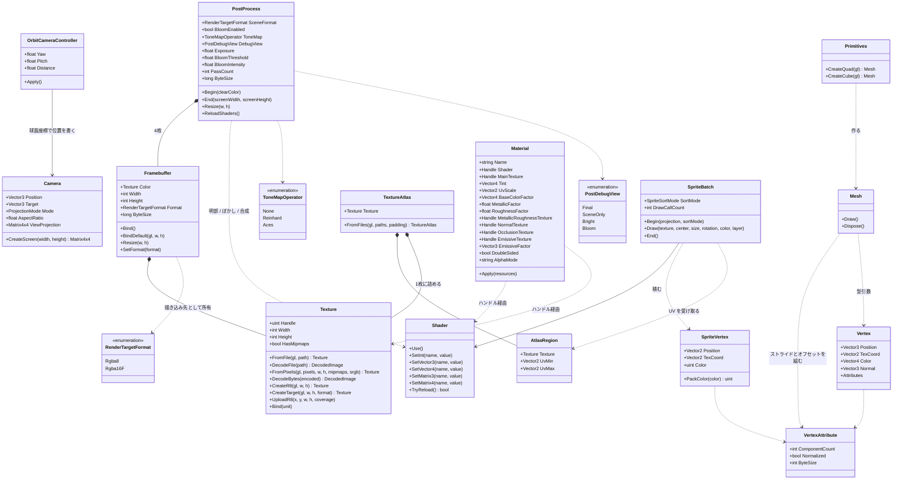
```mermaid
classDiagram
    class Camera {
        +Vector3 Position
        +Vector3 Target
        +ProjectionMode Mode
        +float AspectRatio
        +Matrix4x4 ViewProjection
        +CreateScreen(width, height) Matrix4x4
    }
    class OrbitCameraController {
        +float Yaw
        +float Pitch
        +float Distance
        +Apply()
    }
    class Shader {
        +Use()
        +SetInt(name, value)
        +SetVector3(name, value)
        +SetVector4(name, value)
        +SetMatrix3(name, value)
        +SetMatrix4(name, value)
        +TryReload() bool
    }
    class Texture {
        +uint Handle
        +int Width
        +int Height
        +bool HasMipmaps
        +FromFile(gl, path) Texture
        +DecodeFile(path) DecodedImage
        +FromPixels(gl, pixels, w, h, mipmaps, srgb) Texture
        +DecodeBytes(encoded) DecodedImage
        +CreateR8(gl, w, h) Texture
        +CreateTarget(gl, w, h, format) Texture
        +UploadR8(x, y, w, h, coverage)
        +Bind(unit)
    }
    class RenderTargetFormat {
        <<enumeration>>
        Rgba8
        Rgba16F
    }
    class Framebuffer {
        +Texture Color
        +int Width
        +int Height
        +RenderTargetFormat Format
        +long ByteSize
        +Bind()
        +BindDefault(gl, w, h)
        +Resize(w, h)
        +SetFormat(format)
    }
    class PostProcess {
        +RenderTargetFormat SceneFormat
        +bool BloomEnabled
        +ToneMapOperator ToneMap
        +PostDebugView DebugView
        +float Exposure
        +float BloomThreshold
        +float BloomIntensity
        +int PassCount
        +long ByteSize
        +Begin(clearColor)
        +End(screenWidth, screenHeight)
        +Resize(w, h)
        +ReloadShaders()
    }
    class ToneMapOperator {
        <<enumeration>>
        None
        Reinhard
        Aces
    }
    class PostDebugView {
        <<enumeration>>
        Final
        SceneOnly
        Bright
        Bloom
    }
    class TextureAtlas {
        +Texture Texture
        +FromFiles(gl, paths, padding) TextureAtlas
    }
    class AtlasRegion {
        +Texture Texture
        +Vector2 UvMin
        +Vector2 UvMax
    }
    class Material {
        +string Name
        +Handle Shader
        +Handle MainTexture
        +Vector4 Tint
        +Vector2 UvScale
        +Vector4 BaseColorFactor
        +float MetallicFactor
        +float RoughnessFactor
        +Handle MetallicRoughnessTexture
        +Handle NormalTexture
        +Handle OcclusionTexture
        +Handle EmissiveTexture
        +Vector3 EmissiveFactor
        +bool DoubleSided
        +string AlphaMode
        +Apply(resources)
    }
    class Mesh {
        +Draw()
        +Dispose()
    }
    class Vertex {
        +Vector3 Position
        +Vector2 TexCoord
        +Vector4 Color
        +Vector3 Normal
        +Attributes
    }
    class SpriteVertex {
        +Vector2 Position
        +Vector2 TexCoord
        +uint Color
        +PackColor(color) uint
    }
    class VertexAttribute {
        +int ComponentCount
        +bool Normalized
        +int ByteSize
    }
    class SpriteBatch {
        +SpriteSortMode SortMode
        +int DrawCallCount
        +Begin(projection, sortMode)
        +Draw(texture, center, size, rotation, color, layer)
        +End()
    }
    class Primitives {
        +CreateQuad(gl) Mesh
        +CreateCube(gl) Mesh
    }

    OrbitCameraController --> Camera : 球面座標で位置を書く
    Material ..> Shader : ハンドル経由
    Material ..> Texture : ハンドル経由
    Mesh ..> VertexAttribute : ストライドとオフセットを組む
    Vertex ..> VertexAttribute
    SpriteVertex ..> VertexAttribute
    Mesh ..> Vertex : 型引数
    Primitives ..> Mesh : 作る
    TextureAtlas *-- AtlasRegion
    TextureAtlas *-- Texture : 1枚に詰める
    SpriteBatch --> Shader
    SpriteBatch ..> SpriteVertex : 積む
    SpriteBatch ..> AtlasRegion : UV を受け取る
    Framebuffer *-- Texture : 描き込み先として所有
    Framebuffer ..> RenderTargetFormat
    PostProcess *-- Framebuffer : 4枚
    PostProcess ..> Shader : 明部 / ぼかし / 合成
    PostProcess ..> ToneMapOperator
    PostProcess ..> PostDebugView
```

**Day 28 で `Texture` に足したのは2つだけ**。
`CreateR8` が1チャンネルの空テクスチャを作り、`UploadR8` がその一部を書き換える。
どちらもグリフのために足したものだが、**`Texture` はグリフを知らない**——
「1チャンネル」「一部だけ更新」という一般の機能として置いてある。
同じものが Phase 6 のシャドウマップ(Day 33)でも要る。

**Day 32 で `Vertex` に法線が戻った**。Day 9 でソフトウェアラスタライザに持たせ、
Day 14 で GPU へ移したときに落としていたもの。陰影を付けていなかったので要らなかったが、
glTF のモデルは必ず持っているので、**無いと読んだデータの一部を捨てることになる**。

**末尾に足した**ので location は 0〜2 が動かず、既存のシェーダは無傷で済んだ。
位置の次に置くほうが意味の並びとしては素直だが、
そのために `sprite.vert` まで書き換える理由は無い。

**`Material` が急に太った**のが今日いちばん目に付く差分で、
これは glTF の材質定義をそのまま写したから。
「シェーダ + そのシェーダに渡す値」という Day 15 からの位置づけは変わっていない——
渡す値の種類が、仕様に合わせて増えただけになる。

**Day 31 で足したのは `CreateTarget` 1つ**。同じ理屈で、
`Texture` は「これがレンダーターゲットである」ことを知らない。
中身を渡さずに場所だけ確保し、ミップマップを作らず、ClampToEdge にする——
それだけの機能として置いてあるので、
影(Day 33)でも環境マップ(Day 36)でも G-Buffer(Day 51)でも同じものが使える。

**`Framebuffer` が `Texture` を所有している**のは、今までの `Render/` に無かった関係。
`Material` は「持たない(ハンドルだけ)」で通してきたが、
フレームバッファのカラーアタッチメントは
**そのフレームバッファと同じ大きさ・同じ形式でなければならない**ので、
外から差し替えられると壊れる。**所有すべきものは所有する**。

**`PostProcess` はシェーダだけ `ResourceManager` に預けている**。
バッファ(4枚)は自分で持ち、シェーダは借りる——
シェーダは F5 でリロードしたいので、管理の窓口に載せておく必要がある。

**`Material` が何も所有していない**のは Day 15 から一貫している(Day15.md の要点2)。
持っているのはハンドルだけで、実体の寿命は `ResourceManager` にある。

**3D の道(`Mesh` + `Material`)と 2D の道(`SpriteBatch`)が並列**なのも見てのとおりで、
両者は `Shader` と `Texture` を共有しているだけで互いを知らない。
`Mesh` は「形が決まっていて毎フレーム変わらないもの」、
`SpriteBatch` は「毎フレーム頂点を作り直すもの」という使い分けになっている。

### Scene — GameObject + Component

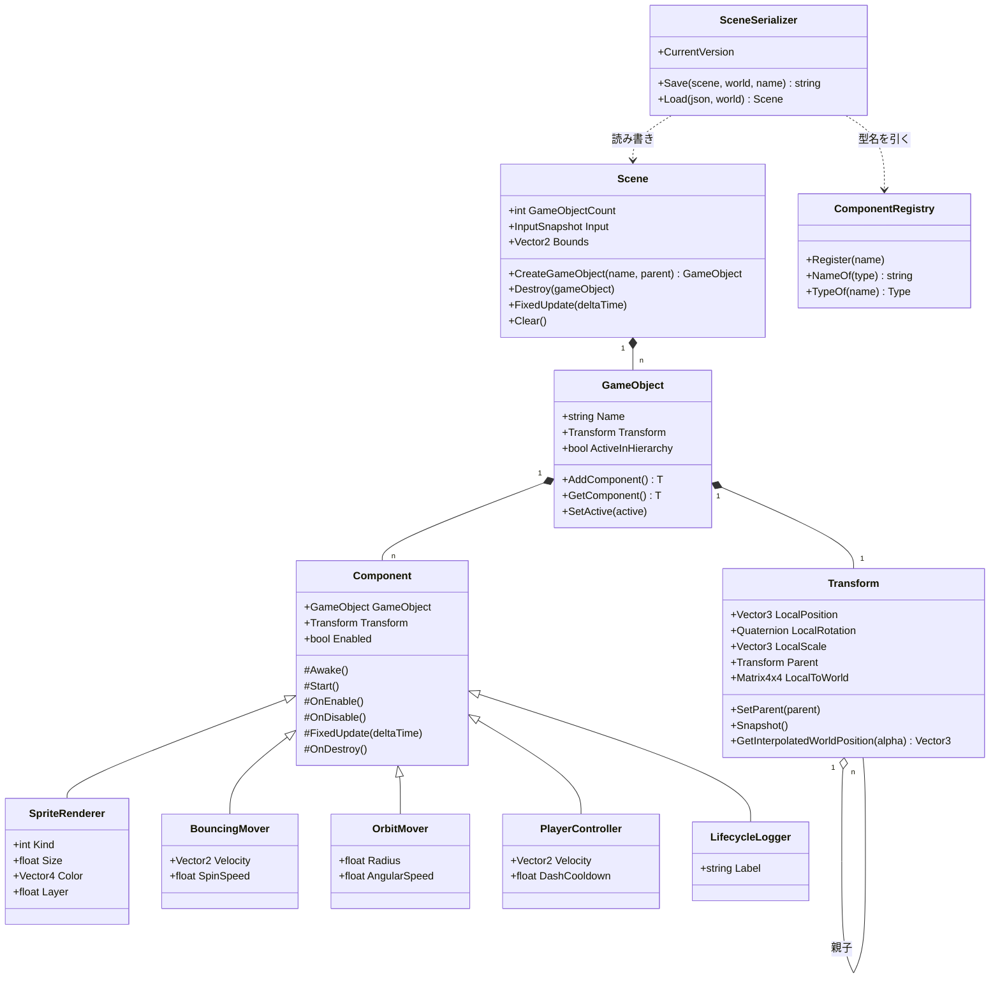
```mermaid
classDiagram
    class Scene {
        +int GameObjectCount
        +InputSnapshot Input
        +Vector2 Bounds
        +CreateGameObject(name, parent) GameObject
        +Destroy(gameObject)
        +FixedUpdate(deltaTime)
        +Clear()
    }
    class GameObject {
        +string Name
        +Transform Transform
        +bool ActiveInHierarchy
        +AddComponent() T
        +GetComponent() T
        +SetActive(active)
    }
    class Transform {
        +Vector3 LocalPosition
        +Quaternion LocalRotation
        +Vector3 LocalScale
        +Transform Parent
        +Matrix4x4 LocalToWorld
        +SetParent(parent)
        +Snapshot()
        +GetInterpolatedWorldPosition(alpha) Vector3
    }
    class Component {
        +GameObject GameObject
        +Transform Transform
        +bool Enabled
        #Awake()
        #Start()
        #OnEnable()
        #OnDisable()
        #FixedUpdate(deltaTime)
        #OnDestroy()
    }
    class SpriteRenderer {
        +int Kind
        +float Size
        +Vector4 Color
        +float Layer
    }
    class BouncingMover {
        +Vector2 Velocity
        +float SpinSpeed
    }
    class OrbitMover {
        +float Radius
        +float AngularSpeed
    }
    class PlayerController {
        +Vector2 Velocity
        +float DashCooldown
    }
    class LifecycleLogger {
        +string Label
    }
    class ComponentRegistry {
        +Register(name)
        +NameOf(type) string
        +TypeOf(name) Type
    }
    class SceneSerializer {
        +CurrentVersion
        +Save(scene, world, name) string
        +Load(json, world) Scene
    }

    Scene "1" *-- "n" GameObject
    GameObject "1" *-- "1" Transform
    GameObject "1" *-- "n" Component
    Transform "1" o-- "n" Transform : 親子
    Component <|-- SpriteRenderer
    Component <|-- BouncingMover
    Component <|-- OrbitMover
    Component <|-- PlayerController
    Component <|-- LifecycleLogger
    SceneSerializer ..> Scene : 読み書き
    SceneSerializer ..> ComponentRegistry : 型名を引く
```

`Transform` だけが `GameObject` の固定メンバーで、ほかは全部 `Component` として付け外しする
(Day 22 の要点2)。`SceneSerializer` が `ComponentRegistry` を経由するのは、
**JSON の文字列から直接 `Type` を作らせない**ため(Day 24 の要点2)。

### Ecs と Physics — どこにも依存しない2つ(今日 `Physics` が増えた)

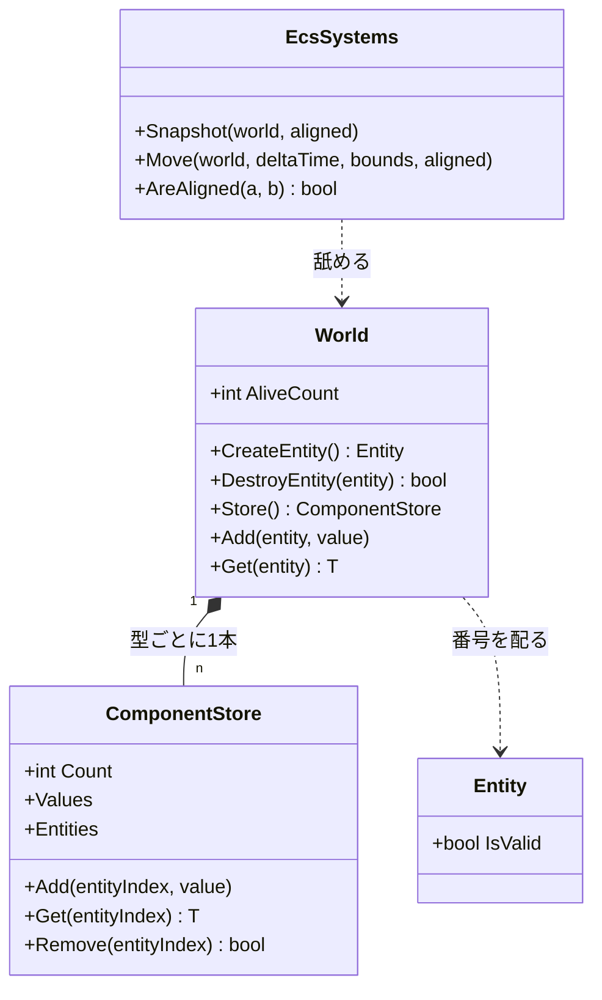
```mermaid
classDiagram
    class Entity {
        +bool IsValid
    }
    class World {
        +int AliveCount
        +CreateEntity() Entity
        +DestroyEntity(entity) bool
        +Store() ComponentStore
        +Add(entity, value)
        +Get(entity) T
    }
    class ComponentStore {
        +int Count
        +Values
        +Entities
        +Add(entityIndex, value)
        +Get(entityIndex) T
        +Remove(entityIndex) bool
    }
    class EcsSystems {
        +Snapshot(world, aligned)
        +Move(world, deltaTime, bounds, aligned)
        +AreAligned(a, b) bool
    }

    World "1" *-- "n" ComponentStore : 型ごとに1本
    World ..> Entity : 番号を配る
    EcsSystems ..> World : 舐める
```

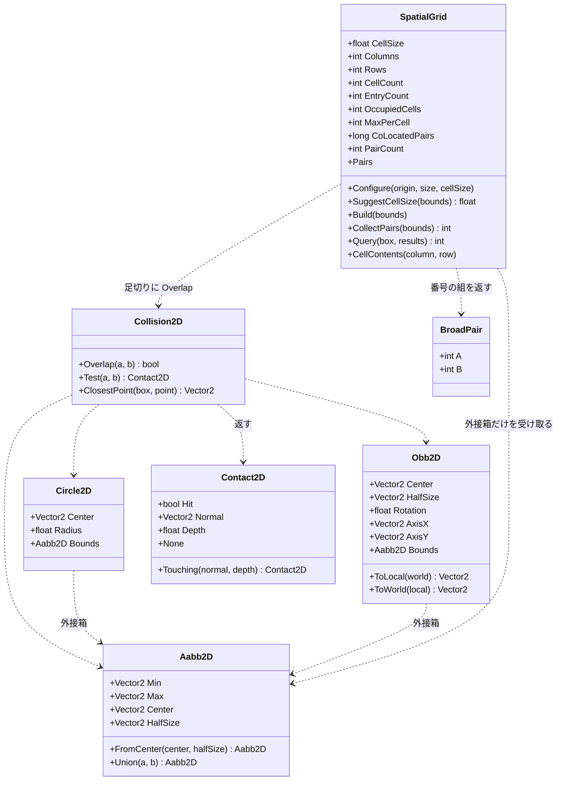
```mermaid
classDiagram
    class Aabb2D {
        +Vector2 Min
        +Vector2 Max
        +Vector2 Center
        +Vector2 HalfSize
        +FromCenter(center, halfSize) Aabb2D
        +Union(a, b) Aabb2D
    }
    class Circle2D {
        +Vector2 Center
        +float Radius
        +Aabb2D Bounds
    }
    class Obb2D {
        +Vector2 Center
        +Vector2 HalfSize
        +float Rotation
        +Vector2 AxisX
        +Vector2 AxisY
        +Aabb2D Bounds
        +ToLocal(world) Vector2
        +ToWorld(local) Vector2
    }
    class Contact2D {
        +bool Hit
        +Vector2 Normal
        +float Depth
        +None
        +Touching(normal, depth) Contact2D
    }
    class Collision2D {
        +Overlap(a, b) bool
        +Test(a, b) Contact2D
        +ClosestPoint(box, point) Vector2
    }
    class BroadPair {
        +int A
        +int B
    }
    class SpatialGrid {
        +float CellSize
        +int Columns
        +int Rows
        +int CellCount
        +int EntryCount
        +int OccupiedCells
        +int MaxPerCell
        +long CoLocatedPairs
        +int PairCount
        +Pairs
        +Configure(origin, size, cellSize)
        +SuggestCellSize(bounds) float
        +Build(bounds)
        +CollectPairs(bounds) int
        +Query(box, results) int
        +CellContents(column, row)
    }

    Collision2D ..> Aabb2D
    Collision2D ..> Circle2D
    Collision2D ..> Obb2D
    Collision2D ..> Contact2D : 返す
    Circle2D ..> Aabb2D : 外接箱
    Obb2D ..> Aabb2D : 外接箱
    SpatialGrid ..> Aabb2D : 外接箱だけを受け取る
    SpatialGrid ..> Collision2D : 足切りに Overlap
    SpatialGrid ..> BroadPair : 番号の組を返す
```

**形は全部 `readonly struct`、判定は `static` メソッドだけ**。状態を持たないので、
どのスレッドから何回呼んでも同じ答えが返る。Day 26 で空間分割を入れたとき、
この性質のおかげで**判定そのものには一切手を入れずに済んだ**——
`Collision2D.cs` と `Shapes2D.cs` の差分は 0 行になっている。

**Day 29 で足したのは `Query` だけ**。
`CollectPairs` が「全部の組」を返すのに対して、
`Query` は「この箱の近くにいるもの」を返す。
1回組んだ格子を、**総当たりの置き換え**としても
**単発の近傍探索**としても使えるようになった——
卒業制作では同じ格子を1ステップに4通りで使っている。

`SpatialGrid` だけが唯一 `class`(参照型)で、しかも状態を持つ。
配列を4本(`_cellStart` / `_cursor` / `_entries` / `_mark`)使い回すためで、
**毎フレーム作り直しても割り当てが起きない**ようにするにはこうするしかない。
そのぶん「1つのインスタンスを複数スレッドから同時に使えない」という制約が付く。
状態を持つと何が失われるかが、同じフォルダの中で見比べられる形になっている。

矢印の向きにも注目してほしい。**`SpatialGrid` から `Body` への線が無い**。
受け取るのは `ReadOnlySpan<Aabb2D>`、返すのは番号の組だけで、
速度も形も質量も知らない。この細さのおかげで、
Day 46 の 3D 版は `Aabb2D` を `Aabb3D` に変えるだけで済む。

### Audio — OpenAL の薄い皮

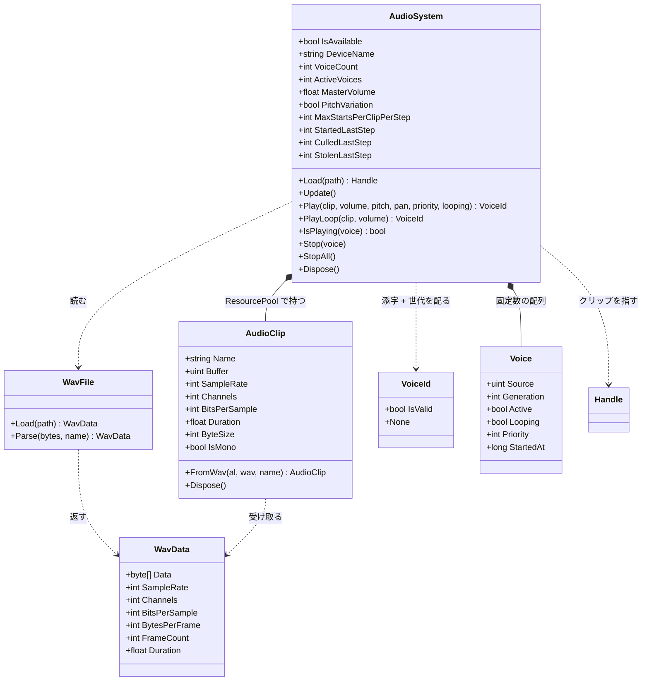
```mermaid
classDiagram
    class WavData {
        +byte[] Data
        +int SampleRate
        +int Channels
        +int BitsPerSample
        +int BytesPerFrame
        +int FrameCount
        +float Duration
    }
    class WavFile {
        +Load(path) WavData
        +Parse(bytes, name) WavData
    }
    class AudioClip {
        +string Name
        +uint Buffer
        +int SampleRate
        +int Channels
        +int BitsPerSample
        +float Duration
        +int ByteSize
        +bool IsMono
        +FromWav(al, wav, name) AudioClip
        +Dispose()
    }
    class VoiceId {
        +bool IsValid
        +None
    }
    class AudioSystem {
        +bool IsAvailable
        +string DeviceName
        +int VoiceCount
        +int ActiveVoices
        +float MasterVolume
        +bool PitchVariation
        +int MaxStartsPerClipPerStep
        +int StartedLastStep
        +int CulledLastStep
        +int StolenLastStep
        +Load(path) Handle
        +Update()
        +Play(clip, volume, pitch, pan, priority, looping) VoiceId
        +PlayLoop(clip, volume) VoiceId
        +IsPlaying(voice) bool
        +Stop(voice)
        +StopAll()
        +Dispose()
    }
    class Voice {
        +uint Source
        +int Generation
        +bool Active
        +bool Looping
        +int Priority
        +long StartedAt
    }

    WavFile ..> WavData : 返す
    AudioClip ..> WavData : 受け取る
    AudioSystem ..> WavFile : 読む
    AudioSystem *-- AudioClip : ResourcePool で持つ
    AudioSystem *-- Voice : 固定数の配列
    AudioSystem ..> VoiceId : 添字 + 世代を配る
    AudioSystem ..> Handle : クリップを指す
```

`Voice` は `AudioSystem` の中の `private struct`。外からは `VoiceId` 越しにしか触れない。

この層で押さえるべき線引きは3つ。

- **`WavFile` は OpenAL を知らない**。ただのバイト列パーサなので、
  ファイルが無くてもメモリ上のバイト列で試せる(自己チェックがそうしている)
- **`AudioClip` はデータ、`Voice` は再生**(要点2)。
  `Texture` と `Material`、`Mesh` と描画呼び出しと同じ分け方
- **`VoiceId` は `Handle<T>` と同じ構造**(添字 + 世代)だが**別の型**。
  `Handle<T>` は `ResourcePool<T>` のためのもので、ボイスはプールではないので流用しない。
  同じ手口を別の場所で使い直している、と読むのが正しい

### Text — Render の上に積む層

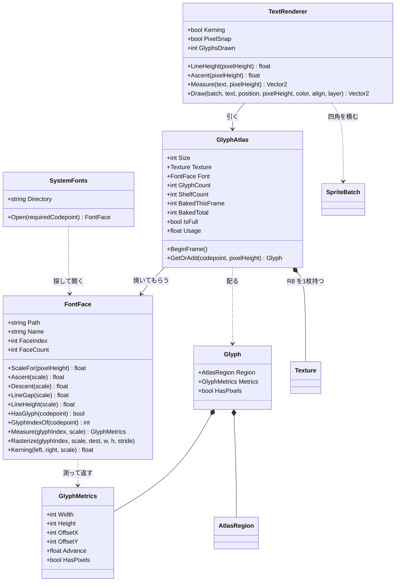
```mermaid
classDiagram
    class SystemFonts {
        +string Directory
        +Open(requiredCodepoint) FontFace
    }
    class FontFace {
        +string Path
        +string Name
        +int FaceIndex
        +int FaceCount
        +ScaleFor(pixelHeight) float
        +Ascent(scale) float
        +Descent(scale) float
        +LineGap(scale) float
        +LineHeight(scale) float
        +HasGlyph(codepoint) bool
        +GlyphIndexOf(codepoint) int
        +Measure(glyphIndex, scale) GlyphMetrics
        +Rasterize(glyphIndex, scale, dest, w, h, stride)
        +Kerning(left, right, scale) float
    }
    class GlyphMetrics {
        +int Width
        +int Height
        +int OffsetX
        +int OffsetY
        +float Advance
        +bool HasPixels
    }
    class Glyph {
        +AtlasRegion Region
        +GlyphMetrics Metrics
        +bool HasPixels
    }
    class GlyphAtlas {
        +int Size
        +Texture Texture
        +FontFace Font
        +int GlyphCount
        +int ShelfCount
        +int BakedThisFrame
        +int BakedTotal
        +bool IsFull
        +float Usage
        +BeginFrame()
        +GetOrAdd(codepoint, pixelHeight) Glyph
    }
    class TextRenderer {
        +bool Kerning
        +bool PixelSnap
        +int GlyphsDrawn
        +LineHeight(pixelHeight) float
        +Ascent(pixelHeight) float
        +Measure(text, pixelHeight) Vector2
        +Draw(batch, text, position, pixelHeight, color, align, layer) Vector2
    }

    SystemFonts ..> FontFace : 探して開く
    FontFace ..> GlyphMetrics : 測って返す
    GlyphAtlas --> FontFace : 焼いてもらう
    GlyphAtlas *-- Texture : R8 を1枚持つ
    GlyphAtlas ..> Glyph : 配る
    Glyph *-- AtlasRegion
    Glyph *-- GlyphMetrics
    TextRenderer --> GlyphAtlas : 引く
    TextRenderer ..> SpriteBatch : 四角を積む
```

4つのクラスが、**それぞれ1つのことしかしない**ように切ってある。

| クラス | 知っていること | 知らないこと |
|---|---|---|
| `SystemFonts` | どこにフォントがあるか | 描き方 |
| `FontFace` | フォントの中身(寸法とアウトライン) | GL、アトラス、レイアウト |
| `GlyphAtlas` | どこに置いたか、何を焼いたか | 文字の並べ方 |
| `TextRenderer` | 並べ方(送り・行送り・整列) | フォントの中身、GL |

この切り方の値打ちは、**差し替えたときにどこまで壊れるか**で分かる。
SDF に変える(改造課題3)なら `GlyphAtlas` と `text.frag` だけが変わり、
`TextRenderer` は 1 行も触らない。
フォントフォールバックを入れる(改造課題2)なら `FontFace` を複数持つだけで、
`GlyphAtlas` の棚詰めには影響しない。

**`GlyphMetrics` が `FontFace` と `TextRenderer` の共通語**になっている。
「原点からどれだけずらして、次にどれだけ進むか」——
この5つの数字さえあれば、フォントの実装が何であれ字を並べられる。

### Model — glTF を描画の言葉へ翻訳する層

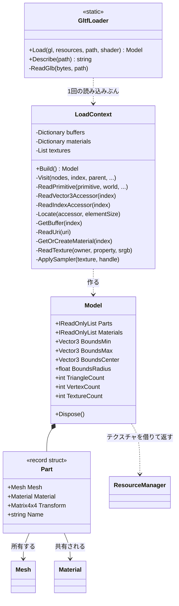
```mermaid
classDiagram
    class GltfLoader {
        <<static>>
        +Load(gl, resources, path, shader) Model
        +Describe(path) string
        -ReadGlb(bytes, path)
    }
    class LoadContext {
        -Dictionary buffers
        -Dictionary materials
        -List textures
        +Build() Model
        -Visit(nodes, index, parent, ...)
        -ReadPrimitive(primitive, world, ...)
        -ReadVector3Accessor(index)
        -ReadIndexAccessor(index)
        -Locate(accessor, elementSize)
        -GetBuffer(index)
        -ReadUri(uri)
        -GetOrCreateMaterial(index)
        -ReadTexture(owner, property, srgb)
        -ApplySampler(texture, handle)
    }
    class Model {
        +IReadOnlyList Parts
        +IReadOnlyList Materials
        +Vector3 BoundsMin
        +Vector3 BoundsMax
        +Vector3 BoundsCenter
        +float BoundsRadius
        +int TriangleCount
        +int VertexCount
        +int TextureCount
        +Dispose()
    }
    class Part {
        <<record struct>>
        +Mesh Mesh
        +Material Material
        +Matrix4x4 Transform
        +string Name
    }

    GltfLoader ..> LoadContext : 1回の読み込みぶん
    LoadContext ..> Model : 作る
    Model *-- Part
    Part --> Mesh : 所有する
    Part --> Material : 共有される
    Model ..> ResourceManager : テクスチャを借りて返す
```

**`LoadContext` を切り出したのは、引数が増えすぎたから**。
`gl` / `resources` / `path` / `directory` / `root` / `embedded` / `shader` の7つを
静的メソッド間で渡し回すと、どの関数も先頭3行が引数の受け渡しになる。
**読み込み1回ぶんの寿命を持つ入れ物**にまとめると、
buffer のキャッシュとマテリアルの使い回しも自然にそこへ収まる。

**`Model` が木ではなく平らな一覧を持つ**のが設計の分かれ目。
glTF の中身はノードの木だが、**静的なモデルに階層は要らない**——
読み込み時に根から行列を掛け合わせて世界行列を確定させてしまえば、
描くときは順に回すだけになる。

木のまま持つべきなのは、あとから関節を動かす場合(スキニング。Day 41)。
そのときは `Model` に木を残す形へ戻すことになるが、
**要るまで持たない**ほうが今は読みやすい。

**`Model` が `ResourceManager` を握っている**のは、
テクスチャの参照カウントを返すため(Day 21 の要点3)。
`Mesh` は自分で作ったので所有するが、テクスチャは借り物なので返す必要がある。
ここを忘れると、モデルを切り替えるたびに 2K テクスチャが数枚ずつ残り、
**絵は正しいのに VRAM だけ増え続ける**。
自己チェックの最後の1行(「全部畳んだらテクスチャの数が元に戻る」)は、これを見ている。

### glTF を1体読むまで — 3段の間接参照とノードの木

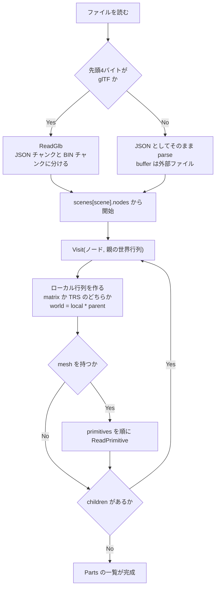
```mermaid
flowchart TD
    F["ファイルを読む"] --> M{"先頭4バイトが<br/>glTF か"}
    M -->|Yes| GLB["ReadGlb<br/>JSON チャンクと BIN チャンクに分ける"]
    M -->|No| TXT["JSON としてそのまま parse<br/>buffer は外部ファイル"]
    GLB --> SC["scenes[scene].nodes から開始"]
    TXT --> SC
    SC --> V["Visit(ノード, 親の世界行列)"]
    V --> TR["ローカル行列を作る<br/>matrix か TRS のどちらか<br/>world = local * parent"]
    TR --> HM{"mesh を持つか"}
    HM -->|Yes| PR["primitives を順に ReadPrimitive"]
    HM -->|No| CH
    PR --> CH{"children があるか"}
    CH -->|Yes| V
    CH -->|No| DONE["Parts の一覧が完成"]
```

ノードの処理は**行列を掛けながら降りるだけ**で、Day 22 の `Transform` と同じ話。
違うのは、こちらは**降り切った時点で結果を確定させてしまう**こと。

プリミティブ1個を頂点配列にするところが、glTF のいちばん機械的な部分になる。

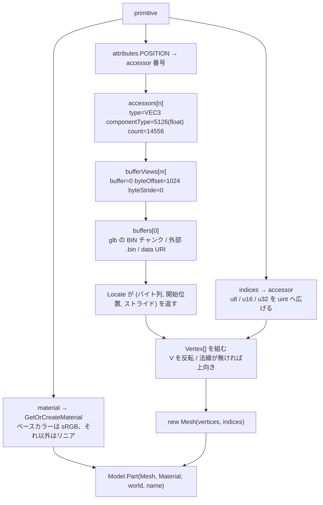
```mermaid
flowchart TD
    P["primitive"] --> A["attributes.POSITION → accessor 番号"]
    A --> AC["accessors[n]<br/>type=VEC3 componentType=5126(float) count=14556"]
    AC --> BV["bufferViews[m]<br/>buffer=0 byteOffset=1024 byteStride=0"]
    BV --> B["buffers[0]<br/>glb の BIN チャンク / 外部 .bin / data URI"]
    B --> READ["Locate が (バイト列, 開始位置, ストライド) を返す"]
    READ --> VTX["Vertex[] を組む<br/>V を反転 / 法線が無ければ上向き"]
    P --> IDX["indices → accessor<br/>u8 / u16 / u32 を uint へ広げる"]
    IDX --> VTX
    P --> MAT["material → GetOrCreateMaterial<br/>ベースカラーは sRGB、それ以外はリニア"]
    VTX --> MESH["new Mesh(vertices, indices)"]
    MAT --> PART["Model.Part(Mesh, Material, world, name)"]
    MESH --> PART
```

**`byteStride` が肝**。glTF は「位置・法線・UV を1頂点ずつ交互に並べる」書き方も許していて、
その場合 `bufferView` に `byteStride` が入る。0(または未指定)なら詰めて並んでいる。

これを無視して「詰めて並んでいる」と決め打ちしても、
**今日の4体は全部 stride 無しなので動いてしまう**。
つまり「動いたから正しい」が言えない類の分岐で、
仕様を読んでいないと存在にすら気づかない。

**`accessor` を経由する意味**は、1本のバイト列を複数の意味で切り出せること。
位置と法線と UV が同じ `buffer` に同居し、
それぞれの `bufferView` が違う範囲を指す。
OBJ が「v の配列」「vt の配列」を別々のテキスト行として持っていたのに対し、
glTF は**メモリ上の並びをそのまま記述している**ので、読み込み後の組み直しが要らない。

### Game — エンジンを使う側

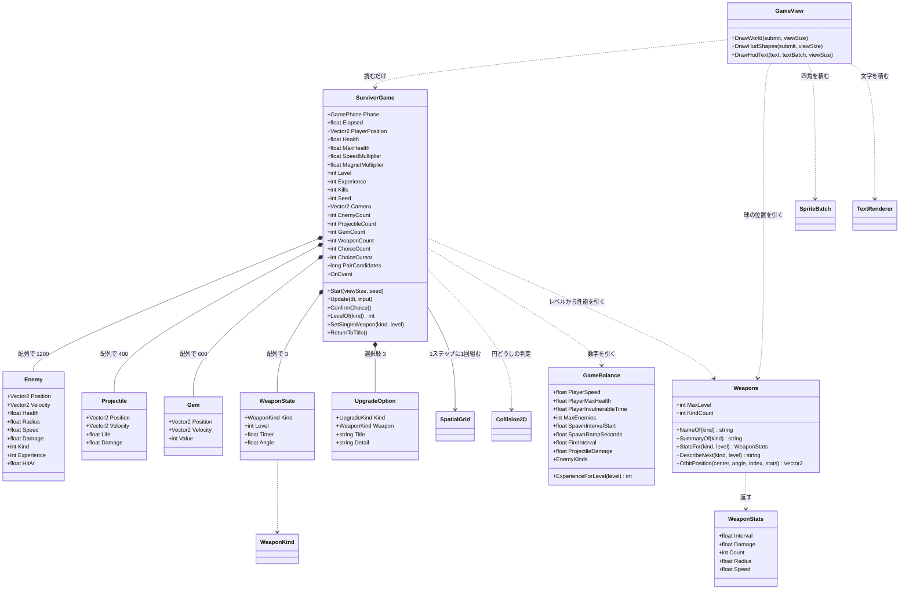
```mermaid
classDiagram
    class GameBalance {
        +float PlayerSpeed
        +float PlayerMaxHealth
        +float PlayerInvulnerableTime
        +int MaxEnemies
        +float SpawnIntervalStart
        +float SpawnRampSeconds
        +float FireInterval
        +float ProjectileDamage
        +EnemyKinds
        +ExperienceForLevel(level) int
    }
    class Enemy {
        +Vector2 Position
        +Vector2 Velocity
        +float Health
        +float Radius
        +float Speed
        +float Damage
        +int Kind
        +int Experience
        +float HitAt
    }
    class Projectile {
        +Vector2 Position
        +Vector2 Velocity
        +float Life
        +float Damage
    }
    class Gem {
        +Vector2 Position
        +Vector2 Velocity
        +int Value
    }
    class WeaponState {
        +WeaponKind Kind
        +int Level
        +float Timer
        +float Angle
    }
    class WeaponStats {
        +float Interval
        +float Damage
        +int Count
        +float Radius
        +float Speed
    }
    class Weapons {
        +int MaxLevel
        +int KindCount
        +NameOf(kind) string
        +SummaryOf(kind) string
        +StatsFor(kind, level) WeaponStats
        +DescribeNext(kind, level) string
        +OrbitPosition(center, angle, index, stats) Vector2
    }
    class UpgradeOption {
        +UpgradeKind Kind
        +WeaponKind Weapon
        +string Title
        +string Detail
    }
    class SurvivorGame {
        +GamePhase Phase
        +float Elapsed
        +Vector2 PlayerPosition
        +float Health
        +float MaxHealth
        +float SpeedMultiplier
        +float MagnetMultiplier
        +int Level
        +int Experience
        +int Kills
        +int Seed
        +Vector2 Camera
        +int EnemyCount
        +int ProjectileCount
        +int GemCount
        +int WeaponCount
        +int ChoiceCount
        +int ChoiceCursor
        +long PairCandidates
        +OnEvent
        +Start(viewSize, seed)
        +Update(dt, input)
        +ConfirmChoice()
        +LevelOf(kind) int
        +SetSingleWeapon(kind, level)
        +ReturnToTitle()
    }
    class GameView {
        +DrawWorld(submit, viewSize)
        +DrawHudShapes(submit, viewSize)
        +DrawHudText(text, textBatch, viewSize)
    }

    SurvivorGame *-- Enemy : 配列で 1200
    SurvivorGame *-- Projectile : 配列で 400
    SurvivorGame *-- Gem : 配列で 600
    SurvivorGame *-- WeaponState : 配列で 3
    SurvivorGame *-- UpgradeOption : 選択肢 3
    SurvivorGame --> SpatialGrid : 1ステップに1回組む
    SurvivorGame ..> Collision2D : 円どうしの判定
    SurvivorGame ..> GameBalance : 数字を引く
    SurvivorGame ..> Weapons : レベルから性能を引く
    WeaponState ..> WeaponKind
    Weapons ..> WeaponStats : 返す
    GameView ..> SurvivorGame : 読むだけ
    GameView ..> Weapons : 球の位置を引く
    GameView ..> SpriteBatch : 四角を積む
    GameView ..> TextRenderer : 文字を積む
```

**`WeaponState` が3つのフィールドしか持っていない**のが Day 30 の設計の要。
威力も間隔も個数も持たず、`Weapons.StatsFor(kind, level)` が
**レベルから計算して返す**。

```
状態として持つもの   … 種類・レベル・タイマー・角度
状態から決まるもの   … 威力・間隔・個数・半径・速度
```

分けておくと、成長カーブを触るときに `StatsFor` の1箇所で済む。
逆に `WeaponState` に威力を持たせると、
レベルアップのたびに「どの数字をいくつ足すか」があちこちに散らばる。

**`GameView` から `Weapons` への線**にも意味がある。
オービットの球の位置は当たり判定と絵の両方が要るので、
`Weapons.OrbitPosition` という1つの式を両方から呼ぶ。
別々に書くと、**見えているところと当たるところがずれる**——
しかもずれは小さいので、しばらく気づかない。

**`Enemy` / `Projectile` / `Gem` が `struct`** なのが要点。
1200 体ぶんの参照を辿ると、メモリ上ばらばらの場所を読むことになる
(Day 22 で実測した 17 倍がこれ)。構造体の配列なら、
更新ループは連続したメモリを頭から舐めるだけで済む。

**Day 23 の ECS は使っていない**。
ECS が効くのは「部品の組み合わせが実行時に変わる」ときで、
今日のように<b>敵は敵、弾は弾と決まっている</b>なら、
種類ごとに配列を1本持つほうが素直で速い。
Day 23 で「ECS は構造体の配列の一般化」と書いたが、
**一般化が要らない場面では特殊形のままでよい**——
これは ECS が無駄だったという話ではなく、
<b>どちらを選ぶかを判断できるようになった</b>という話になる。

`GameBalance` に矢印が集まっているのも意図したもの。
遊んで気になったことは全部ここを触ることになるので、
**数字がコードの中に散らばっていると調整が苦行になる**。

### 1フレームの流れ

Silk.NET のウィンドウから `OnUpdate` と `OnRender` が交互に呼ばれる。
**状態を変えるのは `OnUpdate` 側だけ**、というのが Day 19 で引いた線。

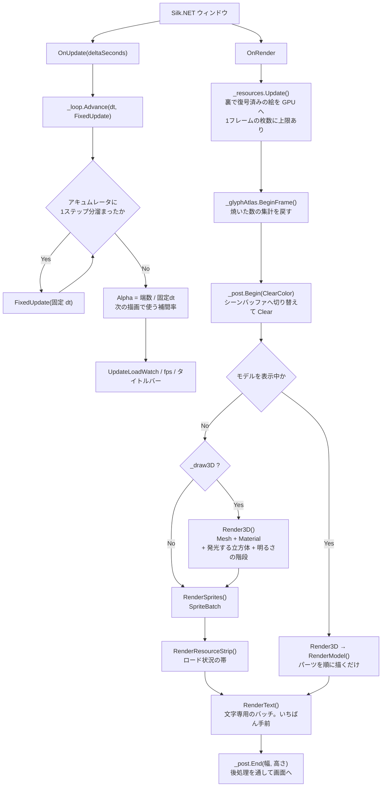
```mermaid
flowchart TD
    W["Silk.NET ウィンドウ"] --> U["OnUpdate(deltaSeconds)"]
    U --> A["_loop.Advance(dt, FixedUpdate)"]
    A --> Q{"アキュムレータに<br/>1ステップ分溜まったか"}
    Q -->|Yes| F["FixedUpdate(固定 dt)"]
    F --> Q
    Q -->|No| AL["Alpha = 端数 / 固定dt<br/>次の描画で使う補間率"]
    AL --> LW["UpdateLoadWatch / fps / タイトルバー"]

    W --> R["OnRender"]
    R --> RU["_resources.Update()<br/>裏で復号済みの絵を GPU へ<br/>1フレームの枚数に上限あり"]
    RU --> GA["_glyphAtlas.BeginFrame()<br/>焼いた数の集計を戻す"]
    GA --> PB["_post.Begin(ClearColor)<br/>シーンバッファへ切り替えて Clear"]
    PB --> MD{"モデルを表示中か"}
    MD -->|Yes| RM["Render3D → RenderModel()<br/>パーツを順に描くだけ"]
    MD -->|No| D3{"_draw3D ?"}
    D3 -->|Yes| R3["Render3D()<br/>Mesh + Material<br/>+ 発光する立方体 + 明るさの階段"]
    D3 -->|No| RS
    R3 --> RS["RenderSprites()<br/>SpriteBatch"]
    RS --> ST["RenderResourceStrip()<br/>ロード状況の帯"]
    ST --> TX["RenderText()<br/>文字専用のバッチ。いちばん手前"]
    RM --> TX
    TX --> PE["_post.End(幅, 高さ)<br/>後処理を通して画面へ"]
```

**Day 29 で分岐が1つ増えた**。ゲームモード(Enter)のときは
`Render3D` も `RenderSprites` も `RenderResourceStrip` も通らず、
`RenderGame()` だけになる。
デモの重い部分を裏で回したまま遊ぶと、
「ゲームが重い」のか「デモが重い」のか分からなくなるため。

**`RenderText` がいちばん最後**なのは、UI が何よりも手前に出るものだから。
バッチが別なのは、シェーダが違うため——
グリフのアトラスは1チャンネルなので `sprite.frag` では真っ黒になる。
**バッチは「同じ設定で描けるものをまとめる」仕組み**なので、
シェーダが違えば別のバッチになるのは定義どおりの帰結。

`OnRender` の先頭で `_resources.Update()` を呼ぶのが要点で、
**GL は描画スレッドからしか触れない**ため、裏で復号し終えた画素をここで GPU に上げている
(Day 21 の要点5・6)。

**Day 32 で分岐が1つ増えた**。モデルを表示している間は、
スプライトの群れも明るさの階段も出さない。
ゲームモード(`_playing`)で同じことをしているのと理由も同じで、
**重ねると、どちらの陰影を見ているのか分からなくなる**。
Day 31 までのデモは `Shift+0` を「モデル無し」まで回すと戻る。

**Day 31 で `Clear` が `_post.Begin` に変わった**。
`Begin` と `End` の間にあるコードは1行も変わっていない——
`Clear` の代わりにフレームバッファを差し替えるようになっただけで、
`Render3D` も `RenderSprites` も `RenderText` も「自分がどこへ描いているか」を知らない。

そのぶん**UI もトーンマップを通ってしまう**。露出を上げれば HUD の文字も白飛びする。
実際のエンジンは後処理のあとに UI を描くが、ここでは
「画面に出るものが全部1本のパイプラインを通る」形をまず見ることを優先した。
分けるのは Day 38(カラーグレーディング)で扱う。

### HDR パイプラインの中身 — 10 回のフルスクリーンパス

`_post.End()` の中で何が起きているか。**入力と出力を全部書き出す**と、
ping-pong の必然性がそのまま見える。

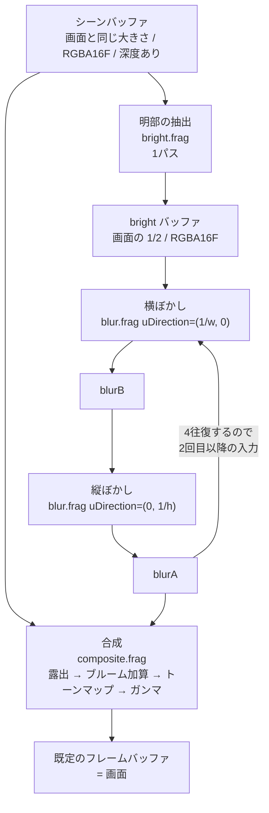
```mermaid
flowchart TD
    SC["シーンバッファ<br/>画面と同じ大きさ / RGBA16F / 深度あり"]
    SC --> BR["明部の抽出<br/>bright.frag<br/>1パス"]
    BR --> BF["bright バッファ<br/>画面の 1/2 / RGBA16F"]
    BF --> H1["横ぼかし<br/>blur.frag uDirection=(1/w, 0)"]
    H1 --> BB["blurB"]
    BB --> V1["縦ぼかし<br/>blur.frag uDirection=(0, 1/h)"]
    V1 --> BA["blurA"]
    BA -->|"4往復するので<br/>2回目以降の入力"| H1
    SC --> CO["合成<br/>composite.frag<br/>露出 → ブルーム加算 → トーンマップ → ガンマ"]
    BA --> CO
    CO --> OUT["既定のフレームバッファ<br/>= 画面"]
```

パスの数は **1(明部)+ 4×2(ぼかし)+ 1(合成)= 10**。
画面に出ている `パス:10` はこれを数えている。

**なぜ `blurA` と `blurB` の2枚が要るのか**。
GPU は「同じテクスチャを読みながら同じテクスチャへ書く」ことを許さない
(読み書きの順序が保証されないので結果が未定義になる)。
だから横ぼかしの結果を別の場所に置き、それを読んで縦ぼかしを書く、を繰り返す。
これが ping-pong で、後処理を書き始めると必ず最初にぶつかる制約になる。

**`bright` を `blurA`/`blurB` と別に持っている**のは、
中間バッファの表示(Shift+4)で「ぼかす前の明部」を見たいから。
表示のためだけに 1/2 サイズのバッファ1枚(1920x1080 なら 4MB)を払っている。
本番用に絞るなら、`bright` を捨てて `blurA` に直接書けば1枚減らせる。

**バッファの大きさが2種類ある**ことにも意味がある。

| バッファ | 大きさ | 形式 | 深度 | なぜ |
|---|---|---|---|---|
| scene | 画面と同じ | RGBA16F | あり | 3D を描くので深度が要る。原寸でないと絵がぼける |
| bright / blurA / blurB | 画面の 1/2 | RGBA16F | **なし** | **ぼかしたものを縮めても分からない**。板1枚なので深度も要らない |

半分にするとピクセル数が 1/4 になり、ぼかし 8 パスのコストがそのまま 1/4 になる。
おまけに「縮めて拡大する」こと自体が弱いぼかしとして働くので、
同じタップ数でより広く滲む。**質を落とさずに 4 倍安くなる**、後処理では珍しく素直な最適化。

### FixedUpdate の中身 — 入力の出どころと3つのバックエンド

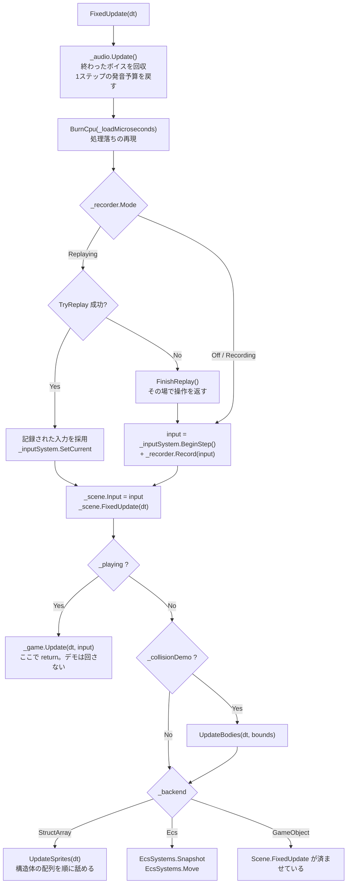
```mermaid
flowchart TD
    S["FixedUpdate(dt)"] --> AU["_audio.Update()<br/>終わったボイスを回収<br/>1ステップの発音予算を戻す"]
    AU --> B["BurnCpu(_loadMicroseconds)<br/>処理落ちの再現"]
    B --> M{"_recorder.Mode"}
    M -->|Replaying| TR{"TryReplay 成功?"}
    TR -->|Yes| SC["記録された入力を採用<br/>_inputSystem.SetCurrent"]
    TR -->|No| FR["FinishReplay()<br/>その場で操作を返す"]
    FR --> BS
    M -->|Off / Recording| BS["input = _inputSystem.BeginStep()<br/>+ _recorder.Record(input)"]
    SC --> SF
    BS --> SF["_scene.Input = input<br/>_scene.FixedUpdate(dt)"]
    SF --> PG{"_playing ?"}
    PG -->|Yes| GM["_game.Update(dt, input)<br/>ここで return。デモは回さない"]
    PG -->|No| CD{"_collisionDemo ?"}
    CD -->|Yes| UB["UpdateBodies(dt, bounds)"]
    CD -->|No| BK
    UB --> BK{"_backend"}
    BK -->|StructArray| US["UpdateSprites(dt)<br/>構造体の配列を順に舐める"]
    BK -->|Ecs| ES["EcsSystems.Snapshot<br/>EcsSystems.Move"]
    BK -->|GameObject| GO["Scene.FixedUpdate が済ませている"]
```

**音の後始末を先頭に置いた**のは、音を要求するのがこの下だから。
予算を戻す場所と使う場所を近くに置くと、「いつリセットされるのか」を追う必要がなくなる。
描画側(`OnRender`)に置くと、シミュレーションが 5Hz のときに
「1フレームに複数ステップぶんの音が要求されるのに予算は 1 回ぶん」というずれが起きる。

**入力がどこから来たかを、この関数から下は誰も気にしない**のがポイント(Day 20 の要点1)。
`InputSnapshot` という値に畳んであるので、記録の再生と実操作を1行で差し替えられる。

`Scene.FixedUpdate` を `_backend` の分岐より前で必ず呼んでいるのは、
**プレイヤーと階層の実演がどのモードでも Scene 側にいる**ため。

### Scene.FixedUpdate の4段階

順番に意味がある。入れ替えると壊れる。

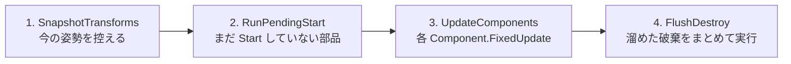
```mermaid
flowchart LR
    A["1. SnapshotTransforms<br/>今の姿勢を控える"]
    B["2. RunPendingStart<br/>まだ Start していない部品"]
    C["3. UpdateComponents<br/>各 Component.FixedUpdate"]
    D["4. FlushDestroy<br/>溜めた破棄をまとめて実行"]
    A --> B --> C --> D
```

| 段 | なぜその位置か |
|---|---|
| 1 | **動かす前**に控えないと、補間の始点が終点と同じになって補間が効かない |
| 2 | `Start` の中で新しいオブジェクトが生まれるので、**開始時点の件数だけ**回す |
| 3 | ここも開始時点の件数で止める。このステップで生まれたものは次のステップから |
| 4 | 更新中にリストから消すと**走査中のインデックスがずれる**(Day 22 の要点5)。<br/>まとめて `RemoveAll` するのは、1個ずつ消すと O(n^2) になるため |

### 非同期テクスチャロードの流れ

`Q` キーで走る道。**GL を呼ぶ部分と呼ばない部分の境目**が、
そのままスレッドの境目になっている(Day 21 の要点5)。

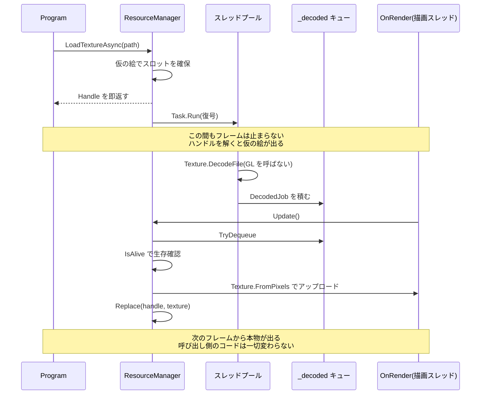
```mermaid
sequenceDiagram
    participant P as Program
    participant RM as ResourceManager
    participant TP as スレッドプール
    participant Q as _decoded キュー
    participant GL as OnRender(描画スレッド)

    P->>RM: LoadTextureAsync(path)
    RM->>RM: 仮の絵でスロットを確保
    RM-->>P: Handle を即返す
    RM->>TP: Task.Run(復号)
    Note over P,GL: この間もフレームは止まらない<br/>ハンドルを解くと仮の絵が出る
    TP->>TP: Texture.DecodeFile(GL を呼ばない)
    TP->>Q: DecodedJob を積む
    GL->>RM: Update()
    RM->>Q: TryDequeue
    RM->>RM: IsAlive で生存確認
    RM->>GL: Texture.FromPixels でアップロード
    RM->>RM: Replace(handle, texture)
    Note over P,GL: 次のフレームから本物が出る<br/>呼び出し側のコードは一切変わらない
```

`Update()` が `MaxUploadsPerFrame` で枚数を絞っているのが肝で、
**復号を非同期にしても、アップロードをまとめてやるとそこでカクつく**(Day 21 の要点6)。

### 衝突判定の3段 — ブロードフェーズが割り込んだ

Day 25 の `UpdateBodies` は「動かす → 総当たり → 押し戻す」の3段だった。
今日、真ん中が**「組を絞る」と「絞った組を判定する」に割れる**。

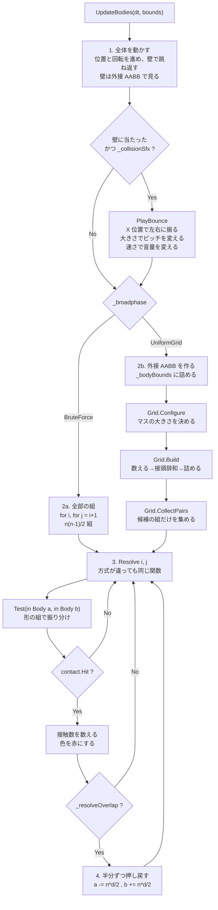
```mermaid
flowchart TD
    S["UpdateBodies(dt, bounds)"] --> MV["1. 全体を動かす<br/>位置と回転を進め、壁で跳ね返す<br/>壁は外接 AABB で見る"]
    MV --> SFX{"壁に当たった<br/>かつ _collisionSfx ?"}
    SFX -->|Yes| PB["PlayBounce<br/>X 位置で左右に振る<br/>大きさでピッチを変える<br/>速さで音量を変える"]
    SFX -->|No| BP
    PB --> BP{"_broadphase"}

    BP -->|BruteForce| BF["2a. 全部の組<br/>for i, for j = i+1<br/>n(n-1)/2 組"]
    BP -->|UniformGrid| GB["2b. 外接 AABB を作る<br/>_bodyBounds に詰める"]
    GB --> GC["Grid.Configure<br/>マスの大きさを決める"]
    GC --> GD["Grid.Build<br/>数える→接頭辞和→詰める"]
    GD --> GP["Grid.CollectPairs<br/>候補の組だけを集める"]

    BF --> NR["3. Resolve i, j<br/>方式が違っても同じ関数"]
    GP --> NR
    NR --> T["Test(in Body a, in Body b)<br/>形の組で振り分け"]
    T --> H{"contact.Hit ?"}
    H -->|No| NR
    H -->|Yes| CNT["接触数を数える<br/>色を赤にする"]
    CNT --> RV{"_resolveOverlap ?"}
    RV -->|Yes| PS["4. 半分ずつ押し戻す<br/>a -= n*d/2 , b += n*d/2"]
    RV -->|No| NR
    PS --> NR
```

発音の要求が**移動の段にある**ことに注意。
「壁に当たった」はブロードフェーズの外で分かることなので、
組の絞り込みとは無関係にここで出る。
体どうしの接触音を鳴らすなら `Resolve` の中になるが、
2000 体で 7,425 組が接触しているので**要求だけで 7,425 回**になる。
要点3の 7.3μs を掛けると 54ms。今日は壁だけにしてある。

図で見てほしいのは**2つの経路が `Resolve` で合流している**ところ。
方式ごとにナローフェーズを書き分けると、
「答えが違う」となったときに原因がブロードフェーズなのか判定なのか分からなくなる。
合流させておけば、**違いが出たら必ず組の選び方が原因**と言い切れる。
`F12` の自己チェックが「接触数が一致」だけで意味を持つのはこの形のおかげ。

もうひとつ、**押し戻し(4段目)がグリッドの構築より後にある**ことに注意。
押し戻すと位置が動くので、ステップの頭で組んだ格子は少しずつ古くなる。
押し戻し量は 1 ステップぶんの重なりぶんしかないので実用上は問題にならないが、
厳密にやるなら「判定を全部済ませてから、まとめて押し戻す」形にする。
Phase 7 のインパルス解決がその形になる。

### 均一グリッドの中身 — 2つの関数しかない

`SpatialGrid` の公開メソッドは実質 `Build` と `CollectPairs` の2つだけ。
中で何が起きているかは、コードを読むより図のほうが早い。

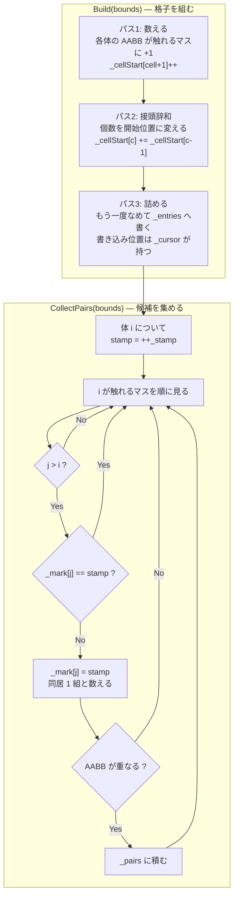
```mermaid
flowchart TD
    subgraph B["Build(bounds) — 格子を組む"]
        B1["パス1: 数える<br/>各体の AABB が触れるマスに +1<br/>_cellStart[cell+1]++"]
        B2["パス2: 接頭辞和<br/>個数を開始位置に変える<br/>_cellStart[c] += _cellStart[c-1]"]
        B3["パス3: 詰める<br/>もう一度なめて _entries へ書く<br/>書き込み位置は _cursor が持つ"]
        B1 --> B2 --> B3
    end

    subgraph C["CollectPairs(bounds) — 候補を集める"]
        C1["体 i について<br/>stamp = ++_stamp"]
        C2["i が触れるマスを順に見る"]
        C3{"j > i ?"}
        C4{"_mark[j] == stamp ?"}
        C5["_mark[j] = stamp<br/>同居 1 組と数える"]
        C6{"AABB が重なる ?"}
        C7["_pairs に積む"]
        C1 --> C2 --> C3
        C3 -->|No| C2
        C3 -->|Yes| C4
        C4 -->|Yes| C2
        C4 -->|No| C5 --> C6
        C6 -->|No| C2
        C6 -->|Yes| C7 --> C2
    end

    B3 --> C1
```

3つの絞りが直列に並んでいるのが分かる。

| 絞り | 落とすもの | 4000 体での実測(マス 32px) |
|---|---|---|
| 格子 | 別のマスにいる組 | 7,998,000 → 72,527 |
| `j > i` と印 | 同じ組の重複 | (上の数に含まれる) |
| AABB | 同じマスだが離れている組 | 72,527 → 24,733 |

**最後の AABB がまだ 3 分の 1 に減らしている**のが面白いところで、
「同じマスにいる」は「近い」でしかない。
7.4ns の AABB 判定を挟むことで、24〜120ns のナローフェーズを 5 万回節約している。

`j > i` の条件だけでは重複が消えないことは、実際に印を外すと確かめられる
(自己チェックの「重複した組が無い」が落ちる)。

`Test(in Body, in Body)` の中身は形の組み合わせ表そのもの。**3種類で6通り**になる。

| a \ b | Circle | Box | RotatedBox |
|---|---|---|---|
| **Circle** | `Test(Circle, Circle)` | `Test(Circle, Aabb)` | `Test(Circle, Obb)` |
| **Box** | 上を**符号反転** | `Test(Aabb, Aabb)` | OBB 同士へ寄せる |
| **RotatedBox** | 上を**符号反転** | OBB 同士へ寄せる | `Test(Obb, Obb)` SAT |

- **専用の速い経路**(AABB 同士、円同士)と**一般形**(OBB 同士の SAT)を併存させ、
  組み合わせの穴は一般形で埋める。`F9` の自己チェックで**両者の答えが一致すること**を確認している
- 引数の順が逆になる組(`Test(Box, Circle)`)は**法線の符号を反転**して返す。
  ここを間違えると物体がめり込む方向へ押される(要点6)
- 種類を1つ足すと表が1行1列増える。3D で球・箱・カプセル・平面・地形と並べると 15 通りになり、
  **その表を埋めることが物理エンジンを書くこと**になる(Phase 7)

### 音を1発鳴らすまで — 3つの関門

`Play` を呼んでから実際に音が出るまでに、3回ふるいにかけられる。
**呼んだのに鳴らないことは普通に起きる**ので、どこで落ちたかを数えられるようにしてある。

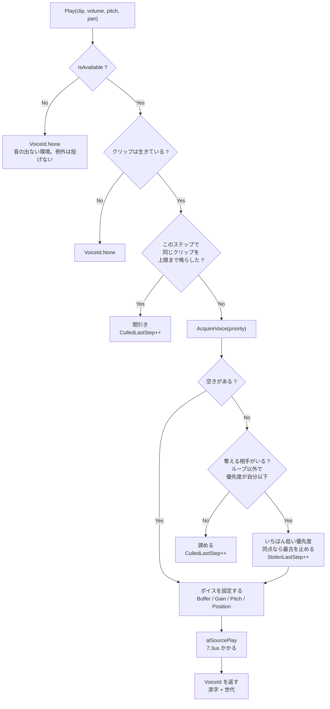
```mermaid
flowchart TD
    S["Play(clip, volume, pitch, pan)"] --> A{"IsAvailable ?"}
    A -->|No| N1["VoiceId.None<br/>音の出ない環境。例外は投げない"]
    A -->|Yes| B{"クリップは生きている ?"}
    B -->|No| N2["VoiceId.None"]
    B -->|Yes| C{"このステップで<br/>同じクリップを<br/>上限まで鳴らした ?"}
    C -->|Yes| N3["間引き<br/>CulledLastStep++"]
    C -->|No| D["AcquireVoice(priority)"]
    D --> E{"空きがある ?"}
    E -->|Yes| G["ボイスを設定する<br/>Buffer / Gain / Pitch / Position"]
    E -->|No| F{"奪える相手がいる ?<br/>ループ以外で<br/>優先度が自分以下"}
    F -->|No| N4["諦める<br/>CulledLastStep++"]
    F -->|Yes| ST["いちばん低い優先度<br/>同点なら最古を止める<br/>StolenLastStep++"]
    ST --> G
    G --> H["alSourcePlay<br/>7.3us かかる"]
    H --> I["VoiceId を返す<br/>添字 + 世代"]
```

**「諦める」が2箇所ある**のが要点。
間引き(`C`)は「同じ音が多すぎる」で落とし、
`F` は「ボイスが足りず、しかも自分より偉い音しか鳴っていない」で落とす。
前者は音として意味が無いから落とすので**積極的**、
後者は資源が足りないから落とすので**消極的**。
タイトルバーで両方を分けて数えているのは、この2つが違う対処を要求するため
(前者は上限を調整する、後者はボイスを増やす)。

### 1文字が画面に出るまで — 4つの層を通り抜ける

`Draw("あ", ...)` を呼んでから画面に出るまでに何が起きるか。
**初回だけ通る道**(焼く)と、**毎回通る道**(引く・積む)が分かれているのが要点。

```mermaid
sequenceDiagram
    participant P as Program
    participant TR as TextRenderer
    participant GA as GlyphAtlas
    participant FF as FontFace
    participant TX as Texture
    participant SB as SpriteBatch

    P->>TR: Draw(batch, "あ", 位置, 16px, 色)
    TR->>TR: 行に切る / ベースラインを出す
    TR->>GA: GetOrAdd(0x3042, 16)

    alt 初回だけ
        GA->>FF: GlyphIndexOf(0x3042)
        GA->>FF: Measure(グリフ番号, scale)
        FF-->>GA: 幅 11 / 高さ 11 / 送り 16
        GA->>GA: 棚に場所を取る
        GA->>FF: Rasterize(作業用バッファへ)
        GA->>GA: 上下をひっくり返す
        GA->>TX: UploadR8(x, y, 11, 11)
        Note over GA,TX: 実測 14.3us。ここだけが高い
    end

    GA-->>TR: Glyph(切り出し位置 + 寸法)
    Note over TR,GA: 2回目からは辞書を引くだけ。61ns

    TR->>TR: penX + OffsetX / baseline + OffsetY
    TR->>TR: 整数に丸める(PixelSnap)
    TR->>SB: Draw(領域, 中心, 大きさ, 色)
    Note over SB: ここから先はスプライトと同じ道
```

図で見てほしいのは、**`alt` の中が初回にしか走らない**こと。
14.3us と 61ns の差は 234 倍あり、**キャッシュを持つかどうかがそのまま性能**になる。
だからアトラスは「使い回すためのもの」であって、
描画をまとめるため(Day 17 の動機)だけのものではない。

もうひとつ、**`TextRenderer` から `Texture` への線が無い**。
グリフを焼く判断も、GL を触るのも、全部 `GlyphAtlas` の中で閉じている。
`TextRenderer` から見れば「文字を渡すと切り出し位置が返ってくる」だけで、

### ゲームの1ステップ — 11 段の順番と、格子の使い回し

`SurvivorGame.Update` は 11 段でできている。**順番に意味がある**。

```mermaid
flowchart TD
    S["Update(dt, input)"] --> LU{"Phase == LevelUp ?"}
    LU -->|Yes| C1["上下で選択肢を動かすだけ<br/>時間は進まない"]
    LU -->|No| P1["1. プレイヤーを動かす<br/>カメラが遅れて追う"]
    P1 --> P2["2. 敵を湧かせる<br/>画面の外の円周上"]
    P2 --> P3["3. 敵を動かす<br/>プレイヤーへ向かう / 遠すぎたら消す"]
    P3 --> P4["4. 格子を組む<br/>Configure + Build"]
    P4 --> P5["5. 敵どうしを押し離す<br/>CollectPairs"]
    P5 --> P6["6. 狙う敵を探して撃つ<br/>Query"]
    P6 --> P7["7. 弾を進めて当てる<br/>弾ごとに Query"]
    P7 --> P8["8. プレイヤーの被弾<br/>Query"]
    P8 --> P9["9. ジェムを吸い寄せて拾う"]
    P9 --> P10["10. レベルアップ判定"]
    P10 --> P11{"11. HP <= 0 ?"}
    P11 -->|Yes| GO["GameOver"]
    P11 -->|No| E["おわり"]
    P10 -.->|レベルが上がったら| LV["選択肢を3つ引いて<br/>Phase = LevelUp"]
```

**10 でレベルが上がったら、そこで止まる**。
Day 29 は `while` で一気に上げていたが、選択を挟むならそれはできない——
1回に1レベルずつ処理して、選び終わってから次のレベルを見る。

入れ替えると壊れるところ:

| 順番 | なぜそこか |
|---|---|
| 4 が 3 の後 | 動かす前に組むと、**1ステップ古い位置**で判定することになる |
| 5〜8 が 4 の後 | 全部**同じ格子**を使う。組み直すと4倍のコストになる |
| 10 が 9 の後 | ジェムを拾ってからでないと、レベルが1ステップ遅れる |

**格子を1回組んで4通りに使う**のが今日いちばんの節約になっている。

```mermaid
flowchart LR
    B["Grid.Build<br/>敵の外接 AABB を詰める"]
    B --> Q1["CollectPairs<br/>敵どうしの押し合い"]
    B --> Q2["Query 1回<br/>狙う敵を探す"]
    B --> Q3["Query × 弾の数<br/>当たった敵を探す"]
    B --> Q4["Query 1回<br/>プレイヤーに触れた敵"]
```

実測(敵 509 体):

| | 組の数 |
|---|---|
| 総当たりなら | 129,286 組 |
| 格子の候補 | **594 組** |

**99.5% 減っている**。押し合いは「全員対全員」なので、
格子が無ければこの演出はそもそも載らない(Day 26 の要点5)。

そして 2〜4 は `CollectPairs` ではなく `Query` を使う。
**1対多は組の列挙では表せない**——
弾1発について「近くにいる敵」を知りたいだけなので、
全部の組を作ってから絞るのは無駄になる。

### 武器3種 — 当たり判定をどこに置くか

3つの武器の違いは、突き詰めると<b>当たり判定をどこに置くか</b>だけになる。

```mermaid
flowchart TD
    W["UpdateWeapons(dt)"] --> K{"武器の種類"}

    K -->|Bolt| B1["タイマーを刻む"]
    B1 --> B2["いちばん近い敵を Query で探す"]
    B2 --> B3["Projectile を Count 発ぶん作る<br/>少しずつ角度をずらす"]
    B3 --> B4["**当たり判定は UpdateProjectiles 側**<br/>飛んでいる間ずっと残る"]

    K -->|Orbit| O1["角度を進める<br/>Angle += Speed * dt"]
    O1 --> O2["**毎ステップ**判定する<br/>刻むとすり抜ける"]
    O2 --> O3["球ごとに Query → 円判定"]
    O3 --> O4["**Damage は毎秒**<br/>dt を掛けて削る"]

    K -->|Aura| A1["タイマーを刻む"]
    A1 --> A2["半径 Radius の円で Query"]
    A2 --> A3["範囲の敵をまとめて削る<br/>**位置すら持たない**"]
```

| | 当たり判定の置き場所 | 残るか | 刻むか |
|---|---|---|---|
| ボルト | `Projectile` の配列 | 寿命まで残る | 発射を刻む |
| オービット | その場で計算 | **残らない** | **刻まない**(毎ステップ) |
| オーラ | プレイヤーの周り | 残らない | 削りを刻む |

**「武器 = 弾を出すもの」と決めつけて設計すると、オービットとオーラが入らない**
(Day 29 の改造課題3で触れた分かれ道)。
今日の形は、`WeaponState` を「種類とレベルとタイマー」だけにして、
<b>当たり方は種類ごとの関数に任せる</b>——
つまり案A(enum + 分岐)を選んでいる。

3種類のうちはこれが読みやすい。5種類を超えたら、
`WeaponStats` のフィールドの意味が武器ごとに違うのが苦しくなるので、
そこが案C(完全にデータで持つ)へ移る目安になる。

### オービットだけ刻まない理由

これは実装中に実際に踏んだところ。**最初は 0.22 秒ごとに判定していて、
オービットだけで 40 秒遊んで撃破 0 体**になった。

```mermaid
flowchart LR
    T1["t=0.00s<br/>球はここ"] -->|"0.22秒で 50px 進む"| T2["t=0.22s<br/>球はここ"]
    E["敵はこの間にいた<br/>**一度も判定されない**"]
    T1 -.-> E
    T2 -.-> E
```

球は 1 秒に 200px 以上動く。0.22 秒ごとに位置を見ると、
**1回の判定の間に 50px 飛ぶ**。球の直径は 22px しかないので、
その間にいた敵はすり抜ける。

Day 25 の改造課題3(速い弾が細い壁をすり抜ける)とまったく同じ話が、
**攻撃側で起きた**ことになる。直し方も同じ2択で、

1. 移動前と移動後を結んだ範囲で判定する(連続衝突判定)
2. **毎ステップ判定して、ダメージを時間で割る**

ここでは 2 を採った。触れている間ずっと削る形になるので、
「巻き付いて削る武器」という手触りにも合う。
そのぶん `WeaponStats.Damage` の単位が武器で変わる
(オービットだけ「毎秒」)——**気持ち悪いが、揃えると片方が嘘になる**。
## 完成条件

```
git lfs install     # 一度だけ
git lfs pull        # assets/models/*.glb を実体化する

dotnet run --project reference/Day32 -c Release
```

起動すると **DamagedHelmet** が画面の真ん中に出る。
左ドラッグで回し、ホイールで寄れる。

### 1. コンソールに構成が出る

```
モデル: DamagedHelmet.glb  1156ms
  glb  3685KB  nodes:1  meshes:1  materials:1  textures:5  images:5  accessors:4  generator:Khronos Blender glTF 2.0 exporter
  パーツ 1 / 三角形 15,452 / 頂点 14,556 / マテリアル 1 / テクスチャ 5
  境界 (-0.95, -0.90, -1.19)〜(0.94, 0.90, 0.81)  半径 1.64m
  [Material_MR] metallic 1.00 / roughness 1.00 / OPAQUE
    マップ: ベース MR 法線 AO 発光
```

**`マップ: ベース MR 法線 AO 発光` の5つが揃っている**のがいちばん見たいところ。
今日はベースカラーしか絵に使っていないが、読み込みは全部通っている。

### 2. `Shift+0`: 4体を巡回する

| モデル | 見てほしいこと |
|---|---|
| **DamagedHelmet** | glb 埋め込み・JPEG。読み込みが 1.2 秒かかる(要点は下の計測) |
| **WaterBottle** | 高さ 0.3m の小物。**それでも画面いっぱいに映る**(境界箱から合わせている) |
| **Lantern** | パーツ3個(`DC:3`)。**支柱・鎖・ランタンが正しい位置関係**で組み上がる |
| **BoxTextured** | `.gltf` + `.bin` + `.png` の3ファイル。**外部参照と `matrix` 形式のノード** |
| (モデル無し) | Day 31 までのデモに戻る。明るさの階段とスプライトが復活する |

Lantern がいちばん確認になる。**3つのパーツはファイル上ばらばらの位置に置かれていて、
親ノードの回転を掛け忘れると、位置は合っているのに向きだけ裏返る**。
組み上がっていれば、ノードの木を正しく歩けている。

そして Lantern の**ランタンの火が滲む**。
これは発光マップが Day 31 の HDR パイプラインへそのまま流れているためで、
2日ぶんの仕事が繋がったところになる。

### 3. `Shift+9`: 読み込んだマップを1枚ずつ見る

DamagedHelmet を出したまま `Shift+9` を押していく。

| 表示 | 期待される見た目 |
|---|---|
| ベースカラー | 陰影の無い、塗りそのまま |
| 法線(頂点) | 面の向きが色になる。**上向きが薄緑、手前が水色** |
| メタリック | 金属部分だけ白い。バイザーは黒 |
| ラフネス | つるつるなところが黒、ざらざらが白 |
| AO | くぼみが黒い。**焼き込まれた影** |
| 発光 | ほぼ真っ黒に、計器のところだけ光る |
| **法線マップ** | **一面が薄い青紫**(0.5, 0.5, 1.0)で、傷や凹凸のところだけ色がずれる |

法線マップが薄紫一色なら正しく読めている。
**緑や茶色に見えたら sRGB で読んでいる**(要点5)。

メタリックとラフネスを見比べるのも大事で、
**この2つが入れ替わっていても完成した絵はそれっぽく見えてしまう**。
1枚ずつ出せるようにしてあるのはこのため。

### 4. `Shift+-`: 自己チェック

4体すべてを読み、30 項目すべて `OK` になる。

```
[glTF の自己チェック]
  [OK] DamagedHelmet.glb: 読めた  glb  3685KB  nodes:1  meshes:1  ... generator:Khronos Blender glTF 2.0 exporter
  [OK] DamagedHelmet.glb: 三角形が 15,000 個以上  実際 15,452
  ...
  [OK] Lantern: 3つのパーツが別々の位置にある(親子の掛け合わせが効いている)
  [OK] BoxTextured: matrix 形式のノードが単位行列になっていない
  [OK] 水筒より街灯のほうが大きい  WaterBottle 0.15m / Lantern 15.17m
  [OK] 2回目の読み込みでテクスチャが増えない(重複排除が効いている)  21 → 21
  [OK] そのぶんキャッシュヒットが増える  1 → 7
  [OK] 全部畳んだらテクスチャの数が元に戻る  7 → 7
  すべて合格
```

**最後の1行がいちばん見たい行**。
`Model.Dispose` の `Release` が足りていないと、ここが `7 → 21` のように増えたままになる。
絵には一切出ないので、数えないと気づけない。

「1体読めた」は「その1体が読めた」でしかない——
glb と gltf、埋め込みと外部参照、TRS と `matrix`、ノード1個と親子つき。
**通っていない経路は必ず後で壊れる**ので、4体まとめて回す形にしてある。

## 改造課題

### 課題1(易): TANGENT を読んで、接線を色で出す

WaterBottle と Lantern は `TANGENT`(VEC4)を持っている。
`Vertex` に足して、`Shift+9` に「接線」の表示を追加する。

W 成分が **+1 か -1 しか入っていない**ことに気づくはず。
これは従接線(bitangent)の向きで、`cross(N, T) * w` で求める——
3本目のベクトルを持たずに済ませるための工夫になっている。

**接線が無いモデル(DamagedHelmet)をどうするか**が本題。
glTF の仕様は「法線マップがあって TANGENT が無ければ、実行時に計算せよ」と言っている。
計算式は仕様の "Meshes" 節にある。
これを書いておくと Day 34 がそのまま楽になる。

### 課題2(中): パーツをマテリアル順に並べ替えて、ドローコールを減らす

いまは `Model.Parts` をノードの順に描いている。
マテリアルが同じパーツが飛び飛びに並ぶと、そのたびにテクスチャの差し替えが起きる。

読み込みの最後に**マテリアルでソートしてから確定させる**ようにして、
`Material.Apply` の呼び出し回数を数えてみる。

今日の4体では**差が出ない**(マテリアルが1個ずつしかない)。
それが分かるのが課題の要点で、**Sponza のような大きなシーンを入れて初めて効く**。

- [Sponza](https://github.com/KhronosGroup/glTF-Sample-Assets/tree/main/Models/Sponza) はマテリアル 25 個・パーツ 103 個

「効くと分かっている最適化を、効かない題材で測ってしまう」のは
Day 18 のバッチでも通った道になる。

### 課題3(難): モデルの読み込みを非同期にする

DamagedHelmet の読み込みは 1.2 秒かかり、その間フレームが完全に止まる。
Day 21 で作った非同期ロードは**テクスチャ1枚ずつ**の仕組みなので、そのままでは載らない。

モデル1体の読み込みは、性質の違う4つが混ざっている。

| 仕事 | どのスレッドでできるか |
|---|---|
| ファイルを読む / JSON を parse | **どこでも** |
| 頂点配列を組む | **どこでも** |
| 画像を復号する(いちばん重い) | **どこでも** |
| GPU へ上げる(Mesh / Texture) | **描画スレッドだけ** |

つまり**上の3つをワーカーへ出し、最後だけ描画スレッドで消化する**形になる。
`ResourceManager.Update` が1フレームの枚数に上限を持っている(Day21.md の要点6)のと
同じ考え方で、メッシュのアップロードにも上限が要る。

読み込み中に何を表示するかも決める必要がある。
仮の絵(紫の市松)に相当するものが、モデルには無い——
**箱を出すか、何も出さないか、前のモデルを残すか**。
実際のゲームがローディング画面を挟む理由がここで腹に落ちる。

## 動作確認済み環境

- Windows 11 Home / .NET 10
- GL_RENDERER: NVIDIA GeForce RTX 3070/PCIe/SSE2
- GL_VERSION: 3.3.0 NVIDIA 596.49

### 自己チェック(30 項目すべて合格)

```
[glTF の自己チェック]
  [OK] DamagedHelmet.glb: 読めた / パーツ 1 / 三角形 15,452 / マテリアル 1 / 半径 1.645m
  [OK] WaterBottle.glb:   読めた / パーツ 1 / 三角形  4,510 / マテリアル 1 / 半径 0.151m
  [OK] Lantern.glb:       読めた / パーツ 3 / 三角形  5,394 / マテリアル 1 / 半径 15.166m
  [OK] BoxTextured.gltf:  読めた / パーツ 1 / 三角形     12 / マテリアル 1 / 半径 0.866m
  [OK] Lantern: 3つのパーツが別々の位置にある(親子の掛け合わせが効いている)
  [OK] BoxTextured: matrix 形式のノードが単位行列になっていない
  [OK] 水筒より街灯のほうが大きい  WaterBottle 0.15m / Lantern 15.17m
  [OK] 2回目の読み込みでテクスチャが増えない(重複排除が効いている)  21 → 21
  [OK] そのぶんキャッシュヒットが増える  1 → 7
  [OK] 全部畳んだらテクスチャの数が元に戻る  7 → 7
  すべて合格
```

### 読み込みと描画の実測(1920x1080、`glFinish()` 込みの 400 フレーム平均)

| モデル | 三角形 | 読み込み | 1フレーム |
|---|---|---|---|
| DamagedHelmet | 15,452 | **1156 ms** | 0.516 ms |
| WaterBottle | 4,510 | 375 ms | 0.489 ms |
| Lantern | 5,394 | 409 ms | 0.499 ms |
| BoxTextured | 12 | 2 ms | 0.476 ms |
| モデル無し(Day 31 のデモ) | — | — | 0.896 ms |

**描画はどれも誤差の範囲**。1万5千三角形は、1000 枚のスプライトを積む Day 31 のデモより軽い
(そちらは CPU 側で毎フレーム 4000 頂点を組み直している)。
**今日のコストは描画ではなく読み込みに全部乗っている**。

読み込みの内訳を見ると、時間はほぼ**画像の復号**で消えている。

| モデル | 画像 | 展開後 | 読み込み |
|---|---|---|---|
| DamagedHelmet | 2048x2048 の **JPEG** 5枚 | 80MB | 1156 ms(1枚あたり 231ms) |
| WaterBottle | 2048x2048 の PNG 4枚 | 64MB | 375 ms(1枚あたり 94ms) |

同じ画素数なのに **JPEG のほうが 2.5 倍遅い**。
`StbImageSharp` の JPEG デコーダが SIMD 化されていないためで、
「圧縮率が高いほうが速い」とは限らない、という実例になっている。

ファイルサイズは逆で、DamagedHelmet は 3.7MB、WaterBottle は 8.7MB。
**ディスクから読む量と、復号にかかる時間は別の話**。

### 検証の途中で分かったこと

**平行光源の強さは 1.0 の少し上に置く**。
最初は「太陽なので明るく」と 2.6 にしていたら、
**モデル全体が発光体のように滲んだ**。Day 31 のブルームはしきい値 1.0 を超えたものを
「まぶしいもの」として拾うので、普通の物体が 1.0 を超えると絵が壊れる。

1.15 に落とすと、光に正対した白い面が ACES で 0.92 前後に収まり、
滲むのは Lantern の火のような**本当に発光しているものだけ**になった。
**明るさの基準を決めるのは光源側の仕事**で、露出(Shift+5/6)はそのあとの調整。

**`uniform` が未使用だと GLSL に消される**。
`uNormalMap` を宣言してバインドまでしていたのに、
シェーダの中で1回も読んでいなかったため最適化で削除され、
起動のたびに `[警告] uniform 'uNormalMap' が見つかりません` が2行出ていた。

Day 14 で書いた警告がここで効いた形になる。
対処として `Shift+9` に「法線マップ」の表示を足した——
**読み込んだものを目で確かめられるようにする**ほうが、警告を消すより筋がよい。

**モデルを切り替えたらカメラも戻す**。
`FrameModel` がモデルに合わせて距離と注視点を寄せるので、
「モデル無し」に戻したときにそのままだと、
明るさの階段が画面いっぱいに映って何も分からなくなっていた。

**glTF の `matrix` は列優先**。
`System.Numerics.Matrix4x4` は行優先なので、
16 個の float を宣言順にそのまま流し込むと転置になる——
そしてそれがちょうど正しい(Day14.md の要点4と同じ打ち消し合い)。
BoxTextured だけがこの形式なので、**他の3体では気づけない**。
