# Day 33: シャドウマッピング(デプスシャドウ → PCF ソフトシャドウ)

Phase 6 の3日目。**モデルが床に影を落とす**。

## 今日のゴール

`Ctrl + 数字` で影の作りをひとつずつ壊しながら見られる。

```
  Ctrl+1  影 ON / OFF
  Ctrl+2  解像度      512 / 1024 / 2048 / 4096
  Ctrl+3  PCF         1タップ / 3x3 / 5x5 / 7x7
  Ctrl+4  深度バイアス 0(アクネが出る) / 0.0005 / 0.0015 / 0.006
  Ctrl+5  傾きに比例したバイアス
  Ctrl+6  深度パスの表カリング(ピーターパンの実演)
  Ctrl+7  シャドウマップそのものを画面の隅に出す
  Ctrl+8  光の届く範囲  3 / 6 / 12 / 24m
  Ctrl+9  光の向きを 30 度ずつ回す
  Ctrl+0  自己チェックと計測
```

**「きれいな影を出す」より「影が壊れる原因を全部見る」ほうが今日の主題**。
シャドウマッピングは仕組み自体は 30 行で書けるが、
そのままではまず間違いなく縞模様(シャドウアクネ)とギザギザ(エイリアス)が出る。
この2つの正体と対処が Day 33 の中身になる。

`Shift+9` を8回押すと **影の係数だけ**を白黒で見られる。
絵として合成する前に見るのが、影を直すときのいちばん近道になる。

## 事前に読む資料

- [ゲームグラフィックス特論 B-12: 影](https://tokoik.github.io/gg/)
  シャドウボリューム(ステンシルで影の体積を切る古典手法)との対比が載っている。
  **今日はシャドウマッピング側だけ**やるが、
  「なぜ今どこもシャドウマップなのか」は対比を見ると腹に落ちる
- **西川善司『「3Dゲームエンジン」が作れる本』Ch4「デプスシャドウ技法とその進化形」**
  今日のいちばん近い解説。**アクネとピーターパンの図が分かりやすい**。
  後半の「進化形」(PCF・VSM・カスケード)は Day 39 以降の下準備として眺めておく
- [LearnOpenGL: Shadow Mapping](https://learnopengl.com/Advanced-Lighting/Shadows/Shadow-Mapping)
  **コードで追いたいならここが最短**。今日の実装とほぼ同じ構成で、
  バイアスと PCF の節はそのまま対応する
- [OpenGL Wiki: Framebuffer Object](https://www.khronos.org/opengl/wiki/Framebuffer_Object)
  `glDrawBuffer(GL_NONE)` が要る理由の一次情報。
  「深度だけのフレームバッファ」でつまずいたらここを見る
- [Common Techniques to Improve Shadow Depth Maps (Microsoft Learn)](https://learn.microsoft.com/en-us/windows/win32/dxtecharts/common-techniques-to-improve-shadow-depth-maps)
  DirectX の文書だが**内容は API に依らない**。
  バイアス・カスケード・テクセルスナップの実務的な扱いがまとまっている。
  今日の範囲を超えるが、Day 39 で戻ってくる価値がある

## 理論の要点

### 1. 影とは「光から見えているか」の問い

影があるかどうかは、突き詰めると1つの問いに尽きる。

> この点は、光から**まっすぐ見えている**か?

見えていれば光が当たり、途中に何かが挟まっていれば影になる。
レイトレーシングならその場で光へレイを飛ばせばよいが、**ラスタライザにレイは無い**。

そこで発想を裏返す。**カメラを光の位置に置いて1回描き、
いちばん手前の深度だけを覚えておく**。
本描画では、各ピクセルの世界座標を光の座標系へ写して、覚えておいた深度と比べる。
自分のほうが奥なら、間に何かがある——つまり影。

```
1パス目(深度パス)   光の目 → 深度テクスチャ(色は書かない)
2パス目(本描画)     ピクセルの世界座標 → 光の座標系 → 深度を引いて比べる
```

Day 31 で作った Render To Texture が、そのまま土台になる。
`Framebuffer` のコメントに「深度を読みたくなったら(影、SSAO)テクスチャに変える」と
書いてあったのがこの日で、**書いた土台がそのまま次を呼ぶ**という設計の配当が出る。

### 2. 平行光源には位置が無い。「どこを写すか」を自分で決める

カメラの投影行列は、視野角と縦横比と near/far から**一意に決まる**。
光の投影行列にはそれが無い。

- 太陽は無限遠にあるので「カメラを光の位置に置く」ができない
- 平行光線なので遠近感が付いてはいけない → **正射影**
- では正射影の箱は**どれだけの広さ**にするのか? → **誰も決めてくれない**

今日は「注目したい球」を1つ決めて、そこから組み立てる。

```
中心   = カメラの注視点
半径   = Ctrl+8 で切り替え(既定 6m)
視点   = 中心 - 光の向き × 半径 × 2
投影   = 正射影(幅・高さ = 半径 × 2、near = 半径 × 0.5、far = 半径 × 3.5)
```

`center - direction * radius * 2` の「2」は絵に影響しない。
正射影なので視点をどれだけ引いても大きさは変わらず、
**ニアクリップより手前のものが消える**ことだけが問題になるので、余裕を持って引いている。

**この箱の広さがそのまま影の品質になる**。
世界全体を入れれば影は粗くなり、狭くすれば細かくなるが範囲外の影が消える。
この綱引きが「シャドウマップの調整」と呼ばれるものの大半で、
実際のエンジンは**視錐台を距離で分割して箱を何段も作る**(カスケードシャドウマップ)。
今日は1段だけにして、`Ctrl+8` で手を動かして綱引きを体感する。

### 3. シャドウアクネ — なぜ縞になるのか

バイアスを 0 にする(`Ctrl+4`)と、床とモデルの表面に**細かい縞模様**が出る。
これがシャドウアクネで、影を実装すると 100% 出る。

原因は**解像度が有限**であること。
シャドウマップの1テクセルは、光から見て**ある広さの領域**の深度を
たった1つの値で代表している。斜めの面ではその領域の中で本当の深度が連続的に変わるので、

```
    テクセルが代表する深度 ┄┄┄┄┄┄┄┄┄
                          ／ ← 実際の面
   代表値より手前の点 → 影でない
   代表値より奥の点   → 「自分が自分を遮っている」= 影
```

半々に生まれて縞になる。**自分自身が原因**なので、
「モデルを増やしたら出た」ではなく最初から出る。

対処は2つある。

| 手 | やること | 代償 |
|---|---|---|
| **深度バイアス** | 比較の前に自分の深度を手前へずらす | 入れすぎると影が本体から離れる(**ピーターパン**) |
| **表カリング** | 深度パスで表を捨て、**裏だけ焼く** | **閉じた立体にしか使えない**。薄いものは浮く |

バイアスは**面の傾きに比例させる**のが定石。
光に正対していれば1テクセル内の深度差はほぼ 0、光と平行に近い面では大きい。
`dot(N, L)` がそのまま傾きの指標になるので、

```glsl
float bias = uShadowBias + (uShadowSlopeBias * (1.0 - ndotl));
```

表カリングのほうは理屈が気持ちいい。
裏面だけを焼けば記録されるのは物体の**向こう側**の深度になり、
表面との間に**物体の厚みぶんの隙間**ができる。バイアス無しでもアクネが出ない。

だが床のような1枚板は裏が無いので**丸ごと影を落とさなくなる**し、
薄い物体は厚みが足りず影が浮く。**板を含むシーンでは既定を OFF にしてバイアスで対処する**——
今日もそうしている。`Ctrl+6` で切り替えて、床の影がどうなるか見るとよい。

### 4. NDC は -1〜1、深度バッファは 0〜1

光の座標系へ写した位置から、シャドウマップを引くまでの式。

```glsl
vec3 proj = vLightSpacePos.xyz / vLightSpacePos.w;   // 透視除算(正射影なら w = 1)
proj = (proj * 0.5) + 0.5;                           // -1〜1 → 0〜1
float closest = texture(uShadowMap, proj.xy).r;
bool inShadow = (proj.z - bias) > closest;
```

**xy だけ変換して z を忘れる**のが今日いちばん出やすい間違い。
`proj.z` が -1〜1 のままだと、深度バッファの 0〜1 とスケールが合わず、
**全部が影になる**か**まったく影が出ない**かのどちらかになる。
どちらも「実装できていない」ように見えるだけで、原因を教えてくれない。

透視除算を書いておくのは、平行光源では無意味(w は必ず 1)だが、
**点光源の影は透視投影を使う**ので、そのまま持っていけるようにするため。

そして箱の外。`proj.z > 1.0`(遠クリップより奥)は明示的に「影なし」を返し、
`proj.xy` が 0〜1 の外に出る場合は**テクスチャのラップに任せる**。
深度テクスチャを `ClampToBorder` + 縁の色 1.0(= いちばん奥)で作ってあるので、
外を引けば必ず「何にも遮られていない」が返る。

`ClampToEdge` にすると**端のテクセルの深度**が返り、
箱の縁の影が外側へ筋になって伸びる、という分かりやすい壊れ方をする。

### 5. 解像度の呪い — 1テクセルが覆うワールドの長さ

影のギザギザの大きさは、たった1つの数字で決まる。

```
1テクセルが覆うワールドの長さ = 光の箱の幅 ÷ 解像度 = (半径 × 2) ÷ 解像度
```

画面(HUD)に `0.6cm/tx` として出しているのがこれで、既定の半径 6m・2048 なら
`12m ÷ 2048 = 0.586cm`。**影の輪郭はこの粒で階段になる**。

| 半径 | 解像度 | 1テクセル | VRAM |
|---|---|---|---|
| 6m | 512 | 2.3cm | 0.8MB |
| 6m | 2048 | 0.6cm | 12.0MB |
| 6m | 4096 | 0.3cm | 48.0MB |
| 24m | 2048 | 2.3cm | 12.0MB |

**解像度を4倍にするのと、箱を1/4にするのは同じ効果**——
ただし VRAM の代償は前者だけが払う。
だから実際のエンジンはまず箱を絞る。カスケードシャドウマップは
「手前ほど小さい箱を使う」という、この表をそのまま制度にしたもの。

### 6. PCF — 比較してから平均する

ギザギザを目立たなくする定番が PCF(Percentage-Closer Filtering)。
やることは「1テクセルではなく周りも読んで平均する」だけだが、
**順番が肝**になる。

```
✗ 深度を平均してから比較する   手前 0.2 と奥 0.9 の平均 0.55 は、どこにも存在しない面
✓ 比較してから平均する         0/1 を平均した 0.55 は「55% が影」という意味を持つ
```

3x3 なら 0, 1/9, 2/9, … 1 の 10 段。境目が階調になるので、
ギザギザが「にじみ」に置き換わる。

**影が柔らかくなるのではなく、ギザギザが目立たなくなるだけ**というのが正確なところ。
本物の半影(光源の大きさで決まるボケ。近くは硬く、遠いほど柔らかい)は別の話で、
そちらは Day 39 以降になる。

この「順番」が、深度テクスチャのフィルタを **Nearest にする理由**でもある。
`Linear` にすると GPU が深度を4つ平均して返してくるので、
**比較する前に平均してしまう**——上の ✗ そのものになる。

> なお GPU には「読むときに比較まで済ませる」専用の仕掛けがあり
> (`sampler2DShadow` + `GL_TEXTURE_COMPARE_MODE`)、
> そちらでは `Linear` がタダで 2x2 の PCF になる。改造課題2で扱う。

### 7. 深度だけのフレームバッファ — `glDrawBuffer(GL_NONE)`

シャドウマップは「光から見た深度」しか使わないので、色は1バイトも要らない。
カラーアタッチメントを1枚も持たないフレームバッファは合法だが、**1行だけ作法が要る**。

```csharp
_gl.DrawBuffer(DrawBufferMode.None);
_gl.ReadBuffer(ReadBufferMode.None);
```

OpenGL のフレームバッファは既定で「0 番のカラーアタッチメントへ描く」つもりでいる。
カラーが無いのにそのままにすると、
**「描く先が無い」で不完全**(`GL_FRAMEBUFFER_INCOMPLETE_DRAW_BUFFER`)になる。

Day 31 で書いた完全性チェックが、ここで例外として教えてくれる。
チェックが無ければ「影が出ない」だけになり、
光源行列を疑って何時間も溶かすことになっていた——**あの5行の配当**。

色を書かないぶん、深度パスは安い。
実測(RTX 3070、立方体6個 + 床)では **4096x4096 でも 0.044ms**で、
解像度を上げてもほとんど変わらない。
**影の代償は「焼く」側ではなく、本描画で PCF を引く側に出る**。

## 前Dayからの差分概要

### 新規ファイル

| ファイル | 役割 |
|---|---|
| `Render/ShadowMap.cs` | **今日の主役**。深度専用 FBO の所有、光源行列の組み立て、`Begin`/`Draw`/`End`、本描画への uniform 配布、デバッグ表示 |
| `shaders/depth.vert` | 位置だけを光の座標系へ写す。**属性は location 0 だけ宣言する** |
| `shaders/depth.frag` | **中身が空**。深度は自動で書かれるので、色を出力しない |
| `shaders/shadow-view.frag` | シャドウマップを画面の隅に出す(`Ctrl+7`) |

### 変更ファイル

| ファイル | 変更 |
|---|---|
| `Render/Texture.cs` | `TextureWrap.ClampToBorder` を追加。`CreateDepthTarget`(深度テクスチャ)。`SetWrap` を switch へ |
| `Render/Framebuffer.cs` | **深度テクスチャだけの形**を追加。`CreateDepthOnly` / `Depth` / `glDrawBuffer(GL_NONE)`。`Create` を2つに割る |
| `shaders/textured.vert` | `uLightSpaceMatrix`、`vWorldPos`、`vLightSpacePos` |
| `shaders/textured.frag` | `ShadowFactor()`(投影・バイアス・PCF)、影の係数の表示(成分 8)、直接光にだけ影を掛ける |
| `Program.cs` | 深度パス、モデル表示中の床、影の uniform、`Ctrl+0〜9`、HUD の1行、`RunShadowCheck`、**平行光源の向きを 90 度回した** |

変更ファイルへの追加が 827 行、新規ファイルが 477 行で、合わせて約 1300 行。
うち **4割がコメント**(528 行)なので、実際に打つ量は Day 32 と同程度になる。

### 平行光源の向きを 90 度回した

Day 32 までの光の向きは `(-0.45, -0.72, -0.53)`。
これは既定のカメラ(`OrbitCameraController` の Yaw 0.6)と
**ほぼ同じ方角から照らしている**——つまり光が視線とだいたい同じ向きに進む。

陰影を見るだけなら問題なかったが、影が付くと事情が変わる。
**影は光の進む向きへ伸びるので、物体の真後ろに隠れて1ピクセルも見えない**。

```
Day 32 まで  (-0.45, -0.72, -0.53)   影がカメラから見て真後ろ → 見えない
Day 33 から  (-0.53, -0.72,  0.45)   90 度回して横へ倒す     → 全体が見える
```

**照明の位置は絵の一部**で、「正しく実装したのに何も見えない」の原因になりうる。
これは実装の話ではなく画作りの話だが、
**影のデバッグでいちばん最初に疑うべきこと**なので、ここに書いておく。

なお立方体の陰影の付き方が Day 32 と変わるが、明るさの階段(0.25〜32)と
発光する箱は `EmissiveFactor` で描いているので、Day 31 の見え方はそのまま残る。

### 写経する順番

依存の下から。`Texture` を最初に置くのは、**深度テクスチャが無いと器が作れない**ため。

1. **`Render/Texture.cs`**(変更)
   `TextureWrap` に `ClampToBorder` を追加 → `SetWrap` を三項演算子から `switch` へ →
   `CreateDepthTarget` を **`CreateTarget` の直後**に追加
2. **`Render/Framebuffer.cs`**(変更)
   `_depthOnly` フィールド → private コンストラクタ → `CreateDepthOnly` →
   `Depth` プロパティ → `ByteSize` の分岐 →
   **`Create` を `CreateColorAttachments` と `CreateDepthOnlyAttachments` に割る**
   (完全性チェックは `Create` に残す)→ `Destroy` で `Depth` も畳む
3. **`shaders/depth.vert`**(新規)/ **`shaders/depth.frag`**(新規)
   合わせて 40 行。**frag の `main` が空**なのを確かめる
4. **`shaders/shadow-view.frag`**(新規)
   深度を 0〜1 に引き伸ばして白黒で出すだけ
5. **`Render/ShadowMap.cs`**(新規)
   フィールド → `Begin`(光源行列)→ `Draw` → `End` → `Apply` → `DrawDebug` →
   `SetResolution` → `Dispose`。**今日いちばん長い1ファイル(405行)**
6. **`shaders/textured.vert`**(変更)
   `uLightSpaceMatrix` と2本の `out` → `main` で `worldPos` を先に出す
7. **`shaders/textured.frag`**(変更)
   影の uniform 6本 → `ShadowFactor()` → `main` で `toLight` と `shadow` →
   成分 8 の表示 → **`lambert * shadow`**
8. **`Program.cs`**(変更)
   `_shadow` / `_shadowMilliseconds` のフィールド → `_lightDirection` の向きを変更 →
   `_debugChannel` のコメント → `OnLoad`(`ShadowMap` の生成)→
   `OnRender`(`RenderShadowPass` と `DrawDebug`)→ `RenderShadowPass` →
   `Render3D` の `_shadow.Apply` → `FloorMatrix` / `CubeMatrix` の切り出し →
   `RenderModel` に床 → `ShadowLabel` と成分 8 →
   HUD の行(**先頭の `Day32` → `Day33` も忘れずに**)→
   `OnKeyDown`(`ctrl` の判定と `Ctrl+0〜9`)→ `RunShadowCheck` /
   `ReadShadowDepth` / `BenchmarkDepthPass` → `OnClosing` → 操作説明
9. **`Day33.csproj`**(リネームのみ)
   中身は Day 32 と同じ

## 設計書

**クラスが1つ増えただけ**で、層の構成は Day 32 のまま。
`Render/` の中に `ShadowMap` が入り、`PostProcess` と横に並ぶ。

| 増えたもの | 何をするか |
|---|---|
| `Render/ShadowMap` | 深度専用 FBO を持ち、光源行列を作り、本描画へ uniform を配る |

`Render/` の既存クラスも2つ太った。

| 変わったもの | 何が増えたか |
|---|---|
| `Framebuffer` | **深度テクスチャだけの形**。`CreateDepthOnly` / `Depth` |
| `Texture` | `CreateDepthTarget` と `TextureWrap.ClampToBorder` |

Day 32 の設計書を丸ごと引き継ぎ、差分の当たった図にだけ手を入れてある。
変わった図は次の2つ。

| 図 | 何が変わったか |
|---|---|
| `Render` のクラス図 | `ShadowMap` を追加。`Framebuffer` / `Texture` に追記 |
| 1フレームの流れ | **深度パスが先頭に入った**。デバッグ表示は後処理の外 |

そして新しく1つ足した。

| 図 | 何のために |
|---|---|
| 影が1枚出るまで | **2パスの分担と、5つの落とし穴がどこで効くか** |

写経の前に読み込む必要はない。**途中で「これは誰が呼ぶんだったか」と迷ったときに戻ってくる場所**として使う。

### 全体構成 — 8つの層と、その上のゲーム

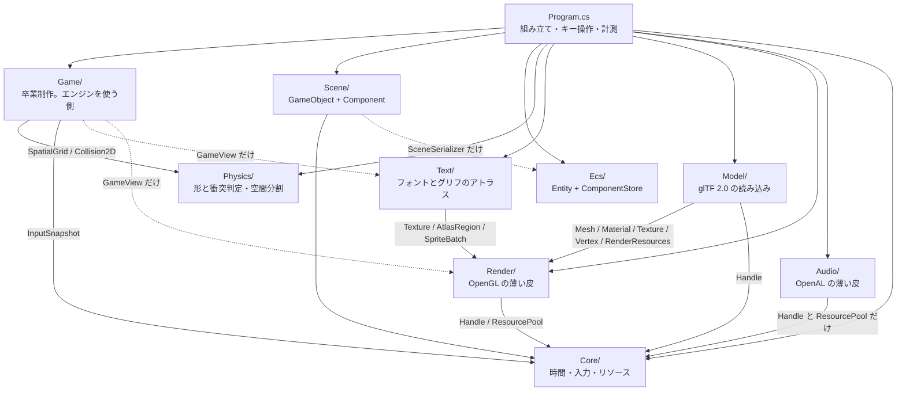

**Day 33 でクラスの増減は無い**(`ShadowMap` は `Render/` の中)。

**Day 32 で `Model/` が1つ増えた**。矢印の向きは変わっていない。

`Model/` は `Text/` とまったく同じ位置に入る——
**`Render/` の上に乗り、`Render/` からは知られていない**一方通行。
`Text/` がグリフを `Texture` に焼いて `SpriteBatch` に積むように、
`Model/` は glTF を `Mesh` と `Material` に変換する。
どちらも「素材の形式を、描画の言葉に翻訳する層」で、性格が揃っている。

**逆向き(`Render` が glTF を知っている)にしなかった**のが要点。
そうすると `Mesh` が「glTF から作られたか、コードで作られたか」を抱え込むことになり、
Day 41 で FBX を足したくなったときに `Render/` を触る羽目になる。
`Primitives`(コードで作る)と `GltfLoader`(ファイルから作る)が
**同じ `Mesh` を作る2つの入口**として並んでいるのが、今の形。

**Day 31 で矢印を1本直した**。層は Day 29 のままだが、
`Core` ⇔ `Render` の相互参照が `Render` → `Core` の一方通行になった——
`ResourceManager` を `Render/RenderResources` へ引っ越したのがそれ(下の「相互参照だった話」)。

`Core/` の中身を実際に調べると、`Silk.NET.OpenGL` を using しているファイルは1つも無い。
**いま `Core/` は本当に時間・入力・ハンドルだけの層**になっている。

後処理は `Render/` の中で閉じている。`PostProcess` が知っているのは
`GL` と `Framebuffer` と `Shader` と `RenderResources` だけで、
**シーンに何が入っているかを一切知らない**。だから
`Program` が「今日はゲームを描く」「今日はデモを描く」と切り替えても、
後処理側は1行も変わらない。

**Day 33 の `ShadowMap` は、この方針をそのまま踏襲している**。
持っているのは深度バッファと光源行列だけで、
「何を影として落とすか」は `Begin` と `End` の間で外から描いてもらう。

```csharp
_shadow.Begin(_lightDirection, _orbit.Target);
// ここで好きなものを _shadow.Draw(mesh, model) する
_shadow.End(width, height);
```

`PostProcess.Begin` / `End` と同じ形にしてあるので、
**「シーンを知らないパス」の作り方が2例そろった**ことになる。
2例あると形が見えてくるのがよいところで、
Day 37 の SSAO も Day 52 の G-Buffer も、この形で足せる。

**これが Render To Texture のいちばんの配当**で、
画面全体に効く処理(影・SSAO・被写界深度・ディファード)は
今後すべてこの位置に差し込むことになる。

**`Game` から `Audio` への線が無い**のが Day 29 から見てほしいところ。
音は鳴るが、鳴らしているのは `Program` で、ゲームは
「弾を撃った」「敵が死んだ」を <c>OnEvent</c> で外へ投げるだけ。

```csharp
public Action<GameEvent, Vector2>? OnEvent { get; set; }
```

こうしておくと、**自己チェックで 600 秒ぶんを無音で回せる**。
`SurvivorGame` が直接 `_audio.Play` を呼んでいたら、
テストのたびにデバイスを開くことになり、
音の出ない環境ではそもそも動かせない。

同じ理由で `SurvivorGame` は `GameView` も知らない。
**状態を進めるものと、状態を見るもの**が分かれている(Day 19 の線)。

| 層 | 依存先 | 備考 |
|---|---|---|
| `Physics/` | **なし** | `System.Numerics` だけ。そのまま別プロジェクトへ持ち出せる |
| `Ecs/` | **なし** | 同上。Day 23 で「他に依存しないので先に5つ書ける」と書いたとおり |
| `Scene/` | `Core`(`InputSnapshot`)、`Ecs`(`SceneSerializer` のみ) | **描画を一切知らない**。`SpriteRenderer` は絵の種類と大きさを持つデータでしかない |
| `Render/` | `Core`(`Handle` / `ResourcePool`) | `RenderResources` が箱を借りる。**GL を触るのは全部この層** |
| `Text/` | `Render`(`Texture` / `AtlasRegion` / `SpriteBatch`) | **一方通行**。`Render` は `Text` を知らない |
| **`Model/`** | `Render`(`Mesh` / `Material` / `Texture` / `Vertex` / `RenderResources`)、`Core`(`Handle`) | **一方通行**。`Render` は glTF を知らない |
| `Audio/` | `Core`(`Handle` / `ResourcePool` **のみ**) | **一方通行**。`Core` は `Audio` を知らない |
| **`Game/`** | `Physics` / `Core`(入力)。描画側だけ `Render` と `Text` | **エンジンは `Game` を知らない**。窓も GL も音も知らない |
| `Core/` | **なし** | Day 31 の引っ越しで一方通行になった(下の「相互参照だった話」) |
| `Program.cs` | 全部 | 組み立て役。6600行あるが、その大半はデモ・計測・自己チェック |

`Game/` の中でも線が引いてある。

| ファイル | 知っていること | 知らないこと |
|---|---|---|
| `GameBalance` | プレイヤー・敵・湧き・経験値の数字 | 全部 |
| `Weapons` | 武器の成長カーブ(レベル → 性能) | ゲームの状態 |
| `UpgradeOption` | 選択肢の中身と、見せる文字 | 適用の仕方 |
| `SurvivorGame` | 形と当たり判定、空間分割、入力、成長 | 描画、音、窓、GL |
| `GameView` | スプライトの積み方、文字の出し方 | ゲームを進める方法(読むだけ) |

**`GameView` が状態を1文字も書き換えない**のは意図的で、
だから描画を丸ごと止めてもゲームは同じように進む。
自己チェックが窓を出さずに回せるのはこの性質のおかげ。

**`Text/` だけが他の層の上に乗っている**。
`Physics/` も `Audio/` も自分で完結していて、単体で別プロジェクトへ持ち出せるが、
`Text/` は `Render/` が無いと成立しない——グリフを置く先が `Texture` で、
積む先が `SpriteBatch` だから。

これは歪みではなく**素直な積み方**で、`Text` → `Render` の一方通行になっている。
逆向き(`SpriteBatch` が文字を知っている)にすると、
描画の中核が「文字とは何か」を抱え込むことになる。
`SpriteBatch` から見れば、文字は**ただの四角**でしかない。

**`Core` と `Render` が相互参照だった話**(Day 25 で見つけ、Day 31 で直した)。

`ResourceManager`(Core)が `Texture`(Render)を作り、
`Material`(Render)が `ResourceManager`(Core)を呼ぶ、という往復になっていた。
名前空間が `HonyaEngine` 1つなので動きはするが、
**アセンブリを分けようとした瞬間に破綻する**形だった。

直し方は Day 25 の設計書に書いたとおりで、
**`ResourcePool` と `Handle` だけを下層に残し、窓口は `Render/` へ上げる**。
Day 31 でそれを実行し、`Core/ResourceManager.cs` は `Render/RenderResources.cs` になった。
名前も変えたのは、中で持っているのが `Texture` と `Shader` だけ——
つまり全部 GL のもので、「全リソースの窓口」という名前が中身と合っていなかったため。

**Day 27 の判断**: 音を足すとき、この歪みを繰り返さないようにした。

音のリソースも「パスをキーにして使い回し、ハンドルで配る」という点でテクスチャと同じなので、
当時の `ResourceManager` に `LoadAudio` を足すのが自然に見える。
だがそうすると `ResourceManager`(= 当時は `Core`)が **GL と OpenAL の両方を握る**ことになり、
当時の相互参照が「`Core` ⇔ `Render` + `Core` ⇔ `Audio`」に増える。

そこで `AudioSystem` は、`Core` から**総称型の `ResourcePool<T>` と `Handle<T>` だけを借りて**、
音のリソースは自分で持つ形にした。`ResourcePool<T>` は `T` が何かを知らないので、
借りても依存が増えない。結果、`Audio/` → `Core/` の**一方通行**が保たれている。

図に描いておくと、こういう判断が「なんとなく」ではなくできるようになる。
**設計書は、次に何かを足すときのために書いている**。

### Core — 時間・入力・リソース

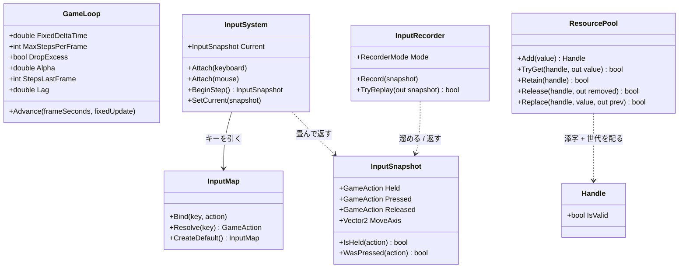

**`ResourceManager` がこの図から消えた**(Day 31 で `Render/RenderResources` へ引っ越した)。
実物は `Render` のクラス図のほうに載せてある。

`ResourcePool` と `Handle` は総称型(`ResourcePool<T>` / `Handle<T>`)。
`T` が何かを知らないまま添字と世代だけを管理するので、`Texture` にも `Shader` にも同じものが使える。
**`T` を知らないから下層に残せた**——引っ越しでこの2つだけ `Core/` に残したのはそのため。

この層で押さえるべき責務の線引き:

- **`GameLoop` は時間しか知らない**。何を更新するかは `Action<float>` で渡される
- **`InputSystem` はデバイスのイベントを畳むだけ**。ゲームとしての意味づけは `InputMap` が持つ
- **`InputSnapshot` は値**。だから記録・再生で丸ごと差し替えられる(Day 20 の肝)
- **`Core/` は GL を1行も知らない**。`Silk.NET.OpenGL` を using しているファイルが無い、が実際の姿

### Render — OpenGL の薄い皮

```mermaid
classDiagram
    class Camera {
        +Vector3 Position
        +Vector3 Target
        +ProjectionMode Mode
        +float AspectRatio
        +Matrix4x4 ViewProjection
        +CreateScreen(width, height) Matrix4x4
    }
    class OrbitCameraController {
        +float Yaw
        +float Pitch
        +float Distance
        +Apply()
    }
    class Shader {
        +Use()
        +SetInt(name, value)
        +SetVector3(name, value)
        +SetVector4(name, value)
        +SetMatrix3(name, value)
        +SetMatrix4(name, value)
        +TryReload() bool
    }
    class Texture {
        +uint Handle
        +int Width
        +int Height
        +bool HasMipmaps
        +FromFile(gl, path) Texture
        +DecodeFile(path) DecodedImage
        +FromPixels(gl, pixels, w, h, mipmaps, srgb) Texture
        +DecodeBytes(encoded) DecodedImage
        +CreateR8(gl, w, h) Texture
        +CreateTarget(gl, w, h, format) Texture
        +CreateDepthTarget(gl, w, h) Texture
        +UploadR8(x, y, w, h, coverage)
        +SetFilter(filter)
        +SetWrap(wrap)
        +Bind(unit)
    }
    class TextureWrap {
        <<enumeration>>
        Repeat
        ClampToEdge
        ClampToBorder
    }
    class RenderResources {
        +int MaxUploadsPerFrame
        +int PendingCount
        +Texture Placeholder
        +LoadTexture(path, mipmaps, srgb) Handle
        +LoadTextureFromMemory(key, bytes, mipmaps, srgb) Handle
        +LoadTextureAsync(path) Handle
        +LoadShader(vert, frag) Handle
        +Update()
        +GetTexture(handle) Texture
        +GetShader(handle) Shader
        +Retain(handle) bool
        +Release(handle) bool
    }
    class RenderTargetFormat {
        <<enumeration>>
        Rgba8
        Rgba16F
    }
    class Framebuffer {
        +Texture Color
        +Texture Depth
        +int Width
        +int Height
        +RenderTargetFormat Format
        +long ByteSize
        +CreateDepthOnly(gl, w, h) Framebuffer
        +Bind()
        +BindDefault(gl, w, h)
        +Resize(w, h)
        +SetFormat(format)
    }
    class ShadowMap {
        +bool Enabled
        +int Resolution
        +Framebuffer Target
        +Matrix4x4 LightSpaceMatrix
        +int PcfRadius
        +int TapCount
        +float DepthBias
        +bool SlopeBias
        +bool CullFrontFaces
        +float Radius
        +float WorldPerTexel
        +bool ShowMap
        +int DrawCalls
        +long ByteSize
        +Begin(lightDirection, center)
        +Draw(mesh, model)
        +End(screenWidth, screenHeight)
        +Apply(shader, unit)
        +DrawDebug(screenWidth, screenHeight)
        +SetResolution(resolution)
    }
    class PostProcess {
        +RenderTargetFormat SceneFormat
        +bool BloomEnabled
        +ToneMapOperator ToneMap
        +PostDebugView DebugView
        +float Exposure
        +float BloomThreshold
        +float BloomIntensity
        +int PassCount
        +long ByteSize
        +Begin(clearColor)
        +End(screenWidth, screenHeight)
        +Resize(w, h)
        +ReloadShaders()
    }
    class ToneMapOperator {
        <<enumeration>>
        None
        Reinhard
        Aces
    }
    class PostDebugView {
        <<enumeration>>
        Final
        SceneOnly
        Bright
        Bloom
    }
    class TextureAtlas {
        +Texture Texture
        +FromFiles(gl, paths, padding) TextureAtlas
    }
    class AtlasRegion {
        +Texture Texture
        +Vector2 UvMin
        +Vector2 UvMax
    }
    class Material {
        +string Name
        +Handle Shader
        +Handle MainTexture
        +Vector4 Tint
        +Vector2 UvScale
        +Vector4 BaseColorFactor
        +float MetallicFactor
        +float RoughnessFactor
        +Handle MetallicRoughnessTexture
        +Handle NormalTexture
        +Handle OcclusionTexture
        +Handle EmissiveTexture
        +Vector3 EmissiveFactor
        +bool DoubleSided
        +string AlphaMode
        +Apply(resources)
    }
    class Mesh {
        +Draw()
        +Dispose()
    }
    class Vertex {
        +Vector3 Position
        +Vector2 TexCoord
        +Vector4 Color
        +Vector3 Normal
        +Attributes
    }
    class SpriteVertex {
        +Vector2 Position
        +Vector2 TexCoord
        +uint Color
        +PackColor(color) uint
    }
    class VertexAttribute {
        +int ComponentCount
        +bool Normalized
        +int ByteSize
    }
    class SpriteBatch {
        +SpriteSortMode SortMode
        +int DrawCallCount
        +Begin(projection, sortMode)
        +Draw(texture, center, size, rotation, color, layer)
        +End()
    }
    class Primitives {
        +CreateQuad(gl) Mesh
        +CreateCube(gl) Mesh
    }

    OrbitCameraController --> Camera : 球面座標で位置を書く
    Material ..> Shader : ハンドル経由
    Material ..> Texture : ハンドル経由
    Mesh ..> VertexAttribute : ストライドとオフセットを組む
    Vertex ..> VertexAttribute
    SpriteVertex ..> VertexAttribute
    Mesh ..> Vertex : 型引数
    Primitives ..> Mesh : 作る
    TextureAtlas *-- AtlasRegion
    TextureAtlas *-- Texture : 1枚に詰める
    SpriteBatch --> Shader
    SpriteBatch ..> SpriteVertex : 積む
    SpriteBatch ..> AtlasRegion : UV を受け取る
    Framebuffer *-- Texture : 描き込み先として所有
    Framebuffer ..> RenderTargetFormat
    Texture ..> TextureWrap
    PostProcess *-- Framebuffer : 4枚
    PostProcess ..> Shader : 明部 / ぼかし / 合成
    PostProcess ..> ToneMapOperator
    PostProcess ..> PostDebugView
    PostProcess ..> RenderResources : シェーダを借りる
    ShadowMap *-- Framebuffer : 深度専用を1枚
    ShadowMap ..> RenderResources : シェーダを借りる
    ShadowMap ..> Camera : 正射影行列を借りる
    ShadowMap ..> Shader : 深度 / 表示
    RenderResources ..> Texture : 作る / 配る
    RenderResources ..> Shader : 作る / 配る
```

**Day 28 で `Texture` に足したのは2つだけ**。
`CreateR8` が1チャンネルの空テクスチャを作り、`UploadR8` がその一部を書き換える。
どちらもグリフのために足したものだが、**`Texture` はグリフを知らない**——
「1チャンネル」「一部だけ更新」という一般の機能として置いてある。
同じものが Phase 6 のシャドウマップ(Day 33)でも要る。

**Day 32 で `Vertex` に法線が戻った**。Day 9 でソフトウェアラスタライザに持たせ、
Day 14 で GPU へ移したときに落としていたもの。陰影を付けていなかったので要らなかったが、
glTF のモデルは必ず持っているので、**無いと読んだデータの一部を捨てることになる**。

**末尾に足した**ので location は 0〜2 が動かず、既存のシェーダは無傷で済んだ。
位置の次に置くほうが意味の並びとしては素直だが、
そのために `sprite.vert` まで書き換える理由は無い。

**`Material` が急に太った**のが今日いちばん目に付く差分で、
これは glTF の材質定義をそのまま写したから。
「シェーダ + そのシェーダに渡す値」という Day 15 からの位置づけは変わっていない——
渡す値の種類が、仕様に合わせて増えただけになる。

**Day 31 で足したのは `CreateTarget` 1つ**。同じ理屈で、
`Texture` は「これがレンダーターゲットである」ことを知らない。
中身を渡さずに場所だけ確保し、ミップマップを作らず、ClampToEdge にする——
それだけの機能として置いてあるので、
影(Day 33)でも環境マップ(Day 36)でも G-Buffer(Day 52)でも同じものが使える。

**Day 33 で足したのは `CreateDepthTarget` 1つ**。
`CreateTarget` との違いは3つとも影のための必然になっている。

| | `CreateTarget`(Day 31) | `CreateDepthTarget`(Day 33) |
|---|---|---|
| 内部形式 | RGBA8 / RGBA16F | **DepthComponent24** |
| フィルタ | Linear | **Nearest**(深度を平均しても意味が無い。要点6) |
| ラップ | ClampToEdge | **ClampToBorder + 白**(箱の外は「遮るものなし」) |

`Texture` が「これがシャドウマップである」ことを知らないのは同じで、
Day 37 の SSAO が深度を読むときも、そのまま同じものが使える。

**`Framebuffer` が3つ目の形を持った**。
Day 31 の「カラーテクスチャ + 深度レンダーバッファ」に加えて、
**カラーを1枚も持たない**形が入った。
`Depth` プロパティが深度専用のときだけ入るので、
**「読むならテクスチャ、読まないならレンダーバッファ」の区別がそのまま型に出る**。

**`ShadowMap` が `Camera` を借りている**のが、この層で新しい関係。
光の正射影行列は `Camera.CreateOrthographic` がそのまま使える——
「カメラ」という名前だが中身は**投影行列の作り方の置き場**なので、
光の目に使っても筋が通る。Day 14 で `static` メソッドとして切り出しておいた形が効いた。

**`Framebuffer` が `Texture` を所有している**のは、今までの `Render/` に無かった関係。
`Material` は「持たない(ハンドルだけ)」で通してきたが、
フレームバッファのカラーアタッチメントは
**そのフレームバッファと同じ大きさ・同じ形式でなければならない**ので、
外から差し替えられると壊れる。**所有すべきものは所有する**。

**`PostProcess` と `ShadowMap` はシェーダだけ `RenderResources` に預けている**。
バッファ(4枚 / 1枚)は自分で持ち、シェーダは借りる——
シェーダは F5 でリロードしたいので、管理の窓口に載せておく必要がある。

**バッファを所有し、シェーダを借りる**——この分担が2クラスで一致しているのは偶然ではなく、
「大きさや形式に強い制約があるものは所有、共有して使い回すものは借りる」という
Day 21 からの線がそのまま出ている。

**`Material` が何も所有していない**のは Day 15 から一貫している(Day15.md の要点2)。
持っているのはハンドルだけで、実体の寿命は `RenderResources` にある。

**3D の道(`Mesh` + `Material`)と 2D の道(`SpriteBatch`)が並列**なのも見てのとおりで、
両者は `Shader` と `Texture` を共有しているだけで互いを知らない。
`Mesh` は「形が決まっていて毎フレーム変わらないもの」、
`SpriteBatch` は「毎フレーム頂点を作り直すもの」という使い分けになっている。

### Scene — GameObject + Component

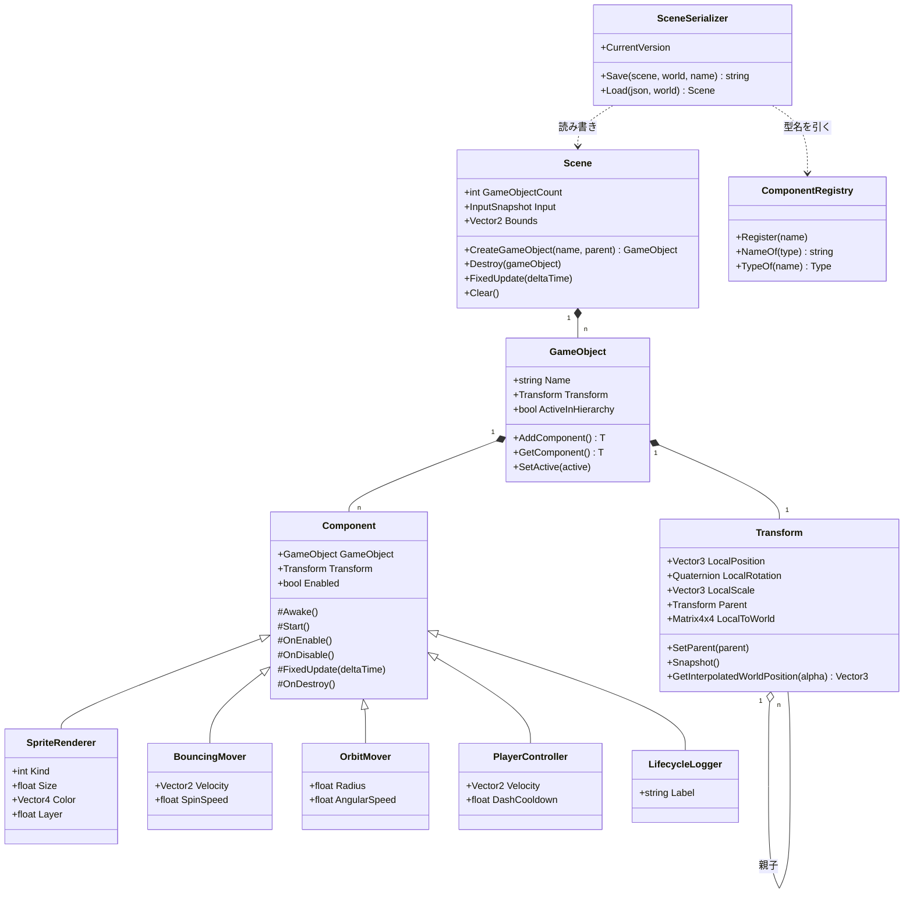

`Transform` だけが `GameObject` の固定メンバーで、ほかは全部 `Component` として付け外しする
(Day 22 の要点2)。`SceneSerializer` が `ComponentRegistry` を経由するのは、
**JSON の文字列から直接 `Type` を作らせない**ため(Day 24 の要点2)。

### Ecs と Physics — どこにも依存しない2つ(今日 `Physics` が増えた)

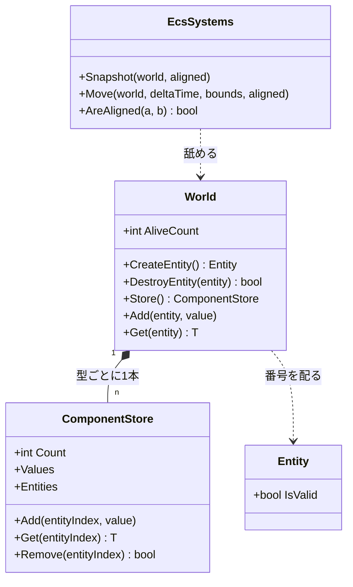

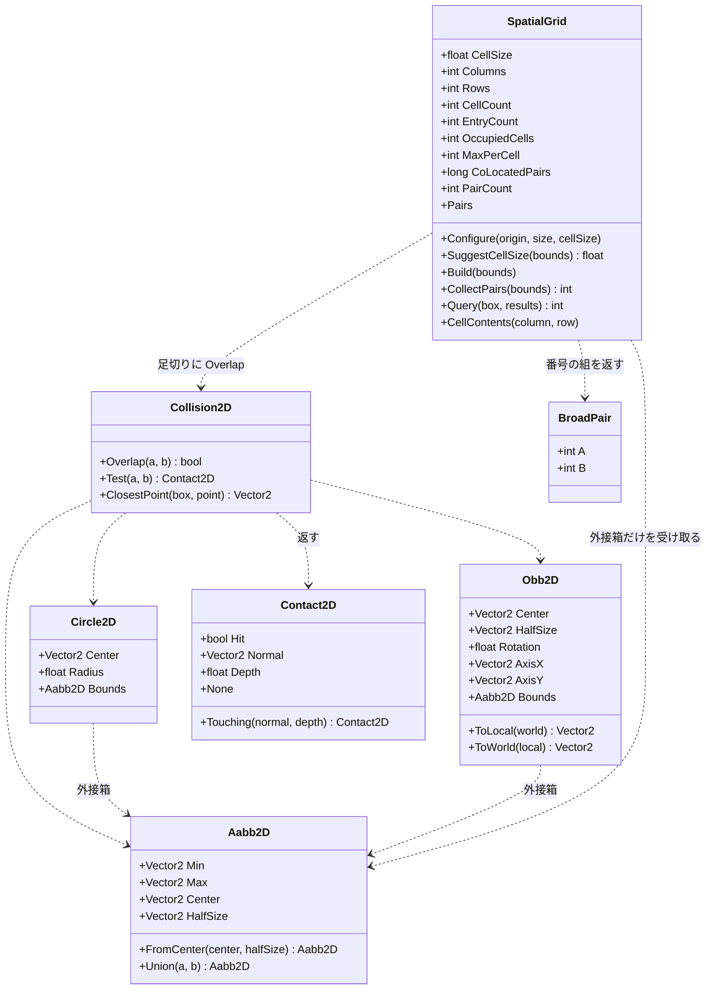

**形は全部 `readonly struct`、判定は `static` メソッドだけ**。状態を持たないので、
どのスレッドから何回呼んでも同じ答えが返る。Day 26 で空間分割を入れたとき、
この性質のおかげで**判定そのものには一切手を入れずに済んだ**——
`Collision2D.cs` と `Shapes2D.cs` の差分は 0 行になっている。

**Day 29 で足したのは `Query` だけ**。
`CollectPairs` が「全部の組」を返すのに対して、
`Query` は「この箱の近くにいるもの」を返す。
1回組んだ格子を、**総当たりの置き換え**としても
**単発の近傍探索**としても使えるようになった——
卒業制作では同じ格子を1ステップに4通りで使っている。

`SpatialGrid` だけが唯一 `class`(参照型)で、しかも状態を持つ。
配列を4本(`_cellStart` / `_cursor` / `_entries` / `_mark`)使い回すためで、
**毎フレーム作り直しても割り当てが起きない**ようにするにはこうするしかない。
そのぶん「1つのインスタンスを複数スレッドから同時に使えない」という制約が付く。
状態を持つと何が失われるかが、同じフォルダの中で見比べられる形になっている。

矢印の向きにも注目してほしい。**`SpatialGrid` から `Body` への線が無い**。
受け取るのは `ReadOnlySpan<Aabb2D>`、返すのは番号の組だけで、
速度も形も質量も知らない。この細さのおかげで、
Day 46 の 3D 版は `Aabb2D` を `Aabb3D` に変えるだけで済む。

### Audio — OpenAL の薄い皮

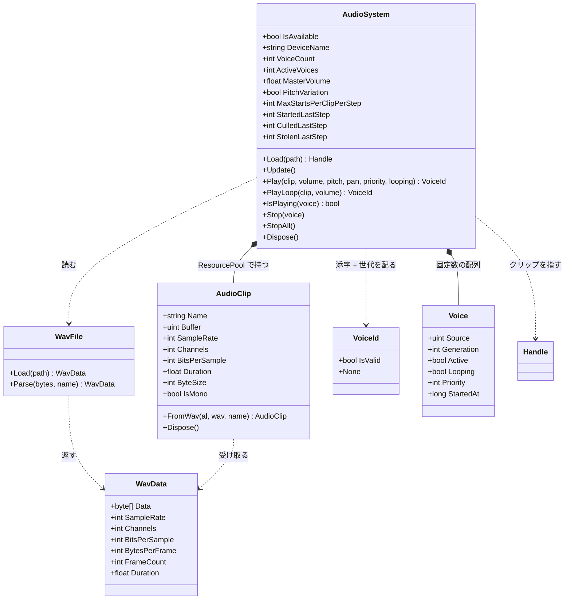

`Voice` は `AudioSystem` の中の `private struct`。外からは `VoiceId` 越しにしか触れない。

この層で押さえるべき線引きは3つ。

- **`WavFile` は OpenAL を知らない**。ただのバイト列パーサなので、
  ファイルが無くてもメモリ上のバイト列で試せる(自己チェックがそうしている)
- **`AudioClip` はデータ、`Voice` は再生**(要点2)。
  `Texture` と `Material`、`Mesh` と描画呼び出しと同じ分け方
- **`VoiceId` は `Handle<T>` と同じ構造**(添字 + 世代)だが**別の型**。
  `Handle<T>` は `ResourcePool<T>` のためのもので、ボイスはプールではないので流用しない。
  同じ手口を別の場所で使い直している、と読むのが正しい

### Text — Render の上に積む層

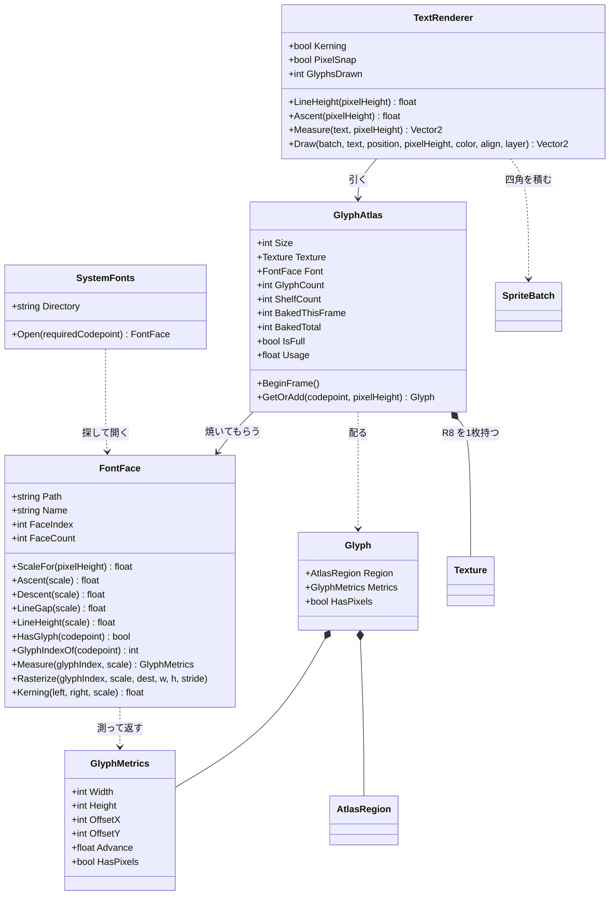

4つのクラスが、**それぞれ1つのことしかしない**ように切ってある。

| クラス | 知っていること | 知らないこと |
|---|---|---|
| `SystemFonts` | どこにフォントがあるか | 描き方 |
| `FontFace` | フォントの中身(寸法とアウトライン) | GL、アトラス、レイアウト |
| `GlyphAtlas` | どこに置いたか、何を焼いたか | 文字の並べ方 |
| `TextRenderer` | 並べ方(送り・行送り・整列) | フォントの中身、GL |

この切り方の値打ちは、**差し替えたときにどこまで壊れるか**で分かる。
SDF に変える(改造課題3)なら `GlyphAtlas` と `text.frag` だけが変わり、
`TextRenderer` は 1 行も触らない。
フォントフォールバックを入れる(改造課題2)なら `FontFace` を複数持つだけで、
`GlyphAtlas` の棚詰めには影響しない。

**`GlyphMetrics` が `FontFace` と `TextRenderer` の共通語**になっている。
「原点からどれだけずらして、次にどれだけ進むか」——
この5つの数字さえあれば、フォントの実装が何であれ字を並べられる。

### Model — glTF を描画の言葉へ翻訳する層

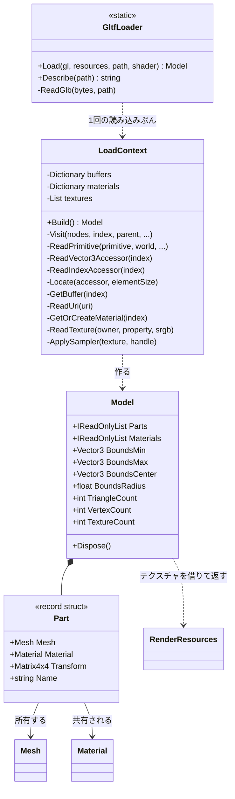

**`LoadContext` を切り出したのは、引数が増えすぎたから**。
`gl` / `resources` / `path` / `directory` / `root` / `embedded` / `shader` の7つを
静的メソッド間で渡し回すと、どの関数も先頭3行が引数の受け渡しになる。
**読み込み1回ぶんの寿命を持つ入れ物**にまとめると、
buffer のキャッシュとマテリアルの使い回しも自然にそこへ収まる。

**`Model` が木ではなく平らな一覧を持つ**のが設計の分かれ目。
glTF の中身はノードの木だが、**静的なモデルに階層は要らない**——
読み込み時に根から行列を掛け合わせて世界行列を確定させてしまえば、
描くときは順に回すだけになる。

木のまま持つべきなのは、あとから関節を動かす場合(スキニング。Day 41)。
そのときは `Model` に木を残す形へ戻すことになるが、
**要るまで持たない**ほうが今は読みやすい。

**`Model` が `RenderResources` を握っている**のは、
テクスチャの参照カウントを返すため(Day 21 の要点3)。
`Mesh` は自分で作ったので所有するが、テクスチャは借り物なので返す必要がある。
ここを忘れると、モデルを切り替えるたびに 2K テクスチャが数枚ずつ残り、
**絵は正しいのに VRAM だけ増え続ける**。
自己チェックの最後の1行(「全部畳んだらテクスチャの数が元に戻る」)は、これを見ている。

### glTF を1体読むまで — 3段の間接参照とノードの木

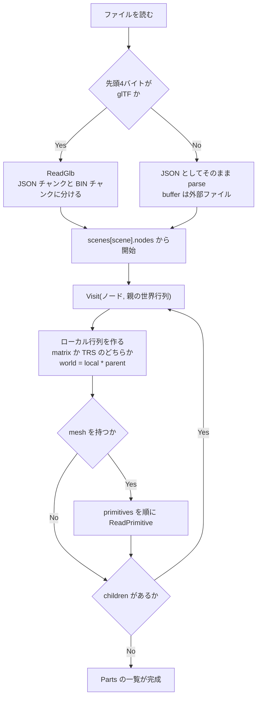

ノードの処理は**行列を掛けながら降りるだけ**で、Day 22 の `Transform` と同じ話。
違うのは、こちらは**降り切った時点で結果を確定させてしまう**こと。

プリミティブ1個を頂点配列にするところが、glTF のいちばん機械的な部分になる。

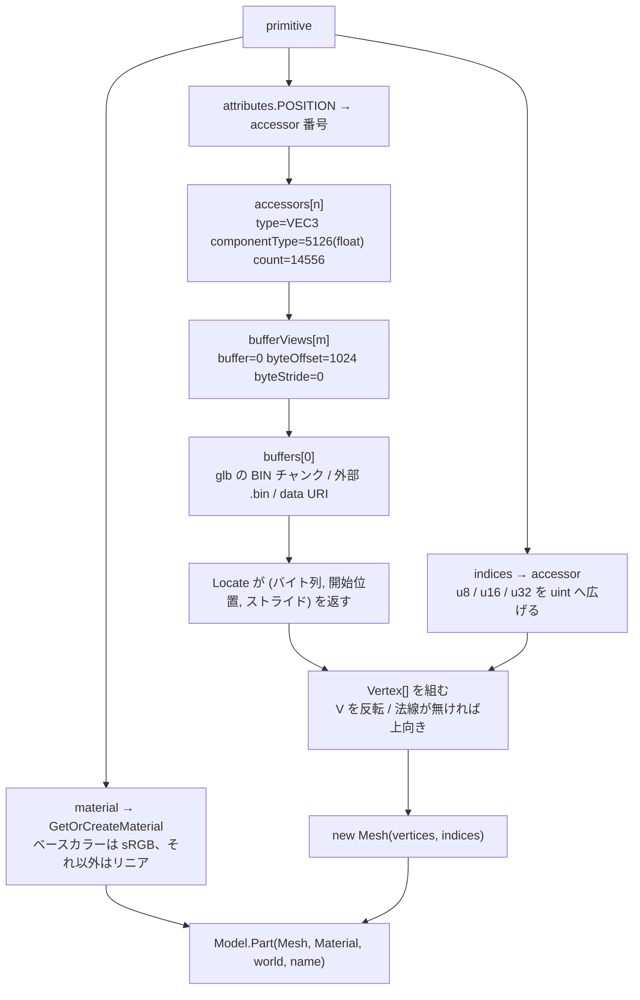

**`byteStride` が肝**。glTF は「位置・法線・UV を1頂点ずつ交互に並べる」書き方も許していて、
その場合 `bufferView` に `byteStride` が入る。0(または未指定)なら詰めて並んでいる。

これを無視して「詰めて並んでいる」と決め打ちしても、
**今日の4体は全部 stride 無しなので動いてしまう**。
つまり「動いたから正しい」が言えない類の分岐で、
仕様を読んでいないと存在にすら気づかない。

**`accessor` を経由する意味**は、1本のバイト列を複数の意味で切り出せること。
位置と法線と UV が同じ `buffer` に同居し、
それぞれの `bufferView` が違う範囲を指す。
OBJ が「v の配列」「vt の配列」を別々のテキスト行として持っていたのに対し、
glTF は**メモリ上の並びをそのまま記述している**ので、読み込み後の組み直しが要らない。

### Game — エンジンを使う側

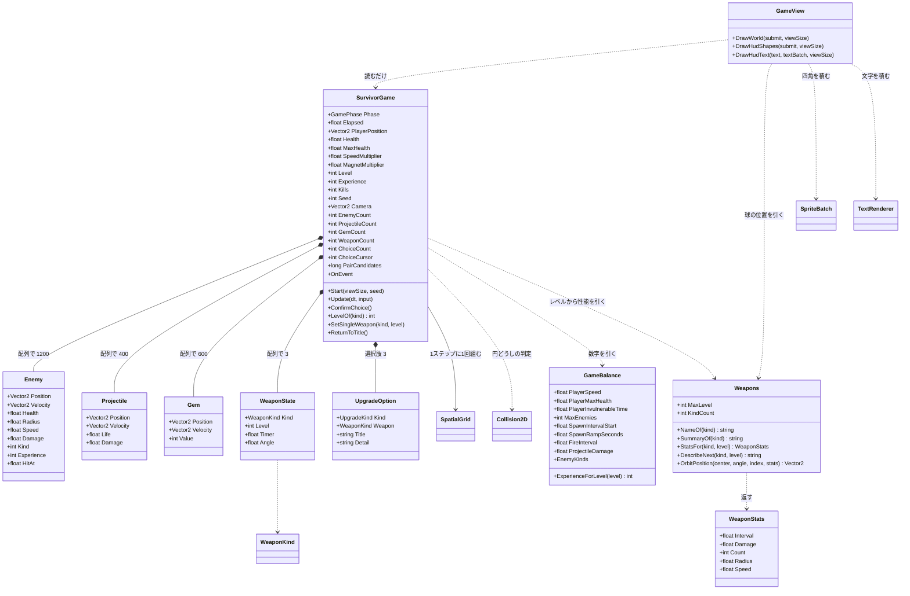

**`WeaponState` が3つのフィールドしか持っていない**のが Day 30 の設計の要。
威力も間隔も個数も持たず、`Weapons.StatsFor(kind, level)` が
**レベルから計算して返す**。

```
状態として持つもの   … 種類・レベル・タイマー・角度
状態から決まるもの   … 威力・間隔・個数・半径・速度
```

分けておくと、成長カーブを触るときに `StatsFor` の1箇所で済む。
逆に `WeaponState` に威力を持たせると、
レベルアップのたびに「どの数字をいくつ足すか」があちこちに散らばる。

**`GameView` から `Weapons` への線**にも意味がある。
オービットの球の位置は当たり判定と絵の両方が要るので、
`Weapons.OrbitPosition` という1つの式を両方から呼ぶ。
別々に書くと、**見えているところと当たるところがずれる**——
しかもずれは小さいので、しばらく気づかない。

**`Enemy` / `Projectile` / `Gem` が `struct`** なのが要点。
1200 体ぶんの参照を辿ると、メモリ上ばらばらの場所を読むことになる
(Day 22 で実測した 17 倍がこれ)。構造体の配列なら、
更新ループは連続したメモリを頭から舐めるだけで済む。

**Day 23 の ECS は使っていない**。
ECS が効くのは「部品の組み合わせが実行時に変わる」ときで、
今日のように<b>敵は敵、弾は弾と決まっている</b>なら、
種類ごとに配列を1本持つほうが素直で速い。
Day 23 で「ECS は構造体の配列の一般化」と書いたが、
**一般化が要らない場面では特殊形のままでよい**——
これは ECS が無駄だったという話ではなく、
<b>どちらを選ぶかを判断できるようになった</b>という話になる。

`GameBalance` に矢印が集まっているのも意図したもの。
遊んで気になったことは全部ここを触ることになるので、
**数字がコードの中に散らばっていると調整が苦行になる**。

### 1フレームの流れ

Silk.NET のウィンドウから `OnUpdate` と `OnRender` が交互に呼ばれる。
**状態を変えるのは `OnUpdate` 側だけ**、というのが Day 19 で引いた線。

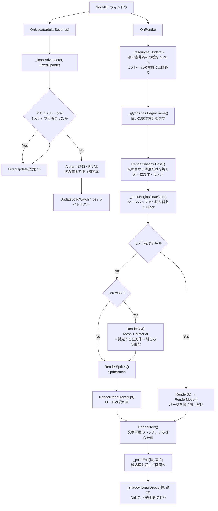

**Day 33 で先頭に1パス増えた**。`RenderShadowPass` が
`_post.Begin` より前に来るのは、**画面にもシーンバッファにも描かない**から。
行き先はシャドウマップで、後処理とはまったく別の道になる。

**`DrawDebug` は後処理の外**に置いてある。
シャドウマップの表示は「見たままの値」であってほしいので、
露出やトーンマップを通してはいけない。
HUD の文字が後処理を通ってしまう(下の弱点)のとは、扱いを分けた。

**Day 29 で分岐が1つ増えた**。ゲームモード(Enter)のときは
`Render3D` も `RenderSprites` も `RenderResourceStrip` も通らず、
`RenderGame()` だけになる。
デモの重い部分を裏で回したまま遊ぶと、
「ゲームが重い」のか「デモが重い」のか分からなくなるため。

**`RenderText` がいちばん最後**なのは、UI が何よりも手前に出るものだから。
バッチが別なのは、シェーダが違うため——
グリフのアトラスは1チャンネルなので `sprite.frag` では真っ黒になる。
**バッチは「同じ設定で描けるものをまとめる」仕組み**なので、
シェーダが違えば別のバッチになるのは定義どおりの帰結。

`OnRender` の先頭で `_resources.Update()` を呼ぶのが要点で、
**GL は描画スレッドからしか触れない**ため、裏で復号し終えた画素をここで GPU に上げている
(Day 21 の要点5・6)。

**Day 32 で分岐が1つ増えた**。モデルを表示している間は、
スプライトの群れも明るさの階段も出さない。
ゲームモード(`_playing`)で同じことをしているのと理由も同じで、
**重ねると、どちらの陰影を見ているのか分からなくなる**。
Day 31 までのデモは `Shift+0` を「モデル無し」まで回すと戻る。

**Day 31 で `Clear` が `_post.Begin` に変わった**。
`Begin` と `End` の間にあるコードは1行も変わっていない——
`Clear` の代わりにフレームバッファを差し替えるようになっただけで、
`Render3D` も `RenderSprites` も `RenderText` も「自分がどこへ描いているか」を知らない。

そのぶん**UI もトーンマップを通ってしまう**。露出を上げれば HUD の文字も白飛びする。
実際のエンジンは後処理のあとに UI を描くが、ここでは
「画面に出るものが全部1本のパイプラインを通る」形をまず見ることを優先した。
分けるのは Day 38(カラーグレーディング)で扱う。

### 影が1枚出るまで — 2つのパスと、5つの落とし穴

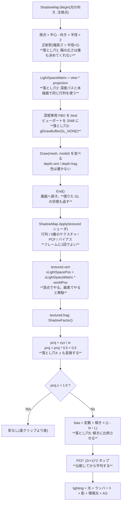

**落とし穴が5つとも「絵からは原因が読めない」**のが、影を難しくしている。

| 落とし穴 | 症状 | 見分け方 |
|---|---|---|
| 1. 箱が広すぎ/狭すぎ | ギザギザ / 画面の端で影が消える | HUD の `cm/tx` を見る |
| 2. 行列がずれる | 影が丸ごとずれる | `Ctrl+7` でマップは焼けているのに合わない |
| 3. `glDrawBuffer` 忘れ | 影がまったく出ない | **例外が出る**(完全性チェック。Day 31 の配当) |
| 4. `z` を変換し忘れ | 全部影 / まったく影なし | `Shift+9` を8回で係数を見ると一目 |
| 5. バイアス無し/過多 | 縞模様 / 影が浮く | `Ctrl+4` で 0 と 0.006 を往復する |

**3 だけが例外で教えてくれる**。残り4つは「影がおかしい」としか分からないので、
`Ctrl+7`(マップを見る)と `Shift+9`×8(係数を見る)の2つを先に作っておく。
デバッグ表示は本体より先に書いてよい類のもので、
今日はそれが**キー2つで済む**ところまで来ている。

### HDR パイプラインの中身 — 10 回のフルスクリーンパス

`_post.End()` の中で何が起きているか。**入力と出力を全部書き出す**と、
ping-pong の必然性がそのまま見える。

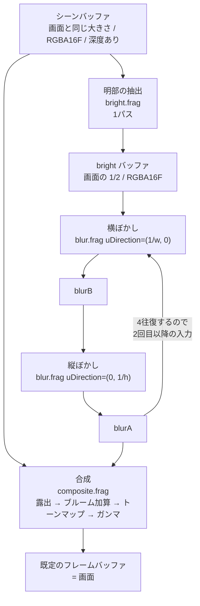

パスの数は **1(明部)+ 4×2(ぼかし)+ 1(合成)= 10**。
画面に出ている `パス:10` はこれを数えている。

**なぜ `blurA` と `blurB` の2枚が要るのか**。
GPU は「同じテクスチャを読みながら同じテクスチャへ書く」ことを許さない
(読み書きの順序が保証されないので結果が未定義になる)。
だから横ぼかしの結果を別の場所に置き、それを読んで縦ぼかしを書く、を繰り返す。
これが ping-pong で、後処理を書き始めると必ず最初にぶつかる制約になる。

**`bright` を `blurA`/`blurB` と別に持っている**のは、
中間バッファの表示(Shift+4)で「ぼかす前の明部」を見たいから。
表示のためだけに 1/2 サイズのバッファ1枚(1920x1080 なら 4MB)を払っている。
本番用に絞るなら、`bright` を捨てて `blurA` に直接書けば1枚減らせる。

**バッファの大きさが2種類ある**ことにも意味がある。

| バッファ | 大きさ | 形式 | 深度 | なぜ |
|---|---|---|---|---|
| scene | 画面と同じ | RGBA16F | あり | 3D を描くので深度が要る。原寸でないと絵がぼける |
| bright / blurA / blurB | 画面の 1/2 | RGBA16F | **なし** | **ぼかしたものを縮めても分からない**。板1枚なので深度も要らない |

半分にするとピクセル数が 1/4 になり、ぼかし 8 パスのコストがそのまま 1/4 になる。
おまけに「縮めて拡大する」こと自体が弱いぼかしとして働くので、
同じタップ数でより広く滲む。**質を落とさずに 4 倍安くなる**、後処理では珍しく素直な最適化。

### FixedUpdate の中身 — 入力の出どころと3つのバックエンド

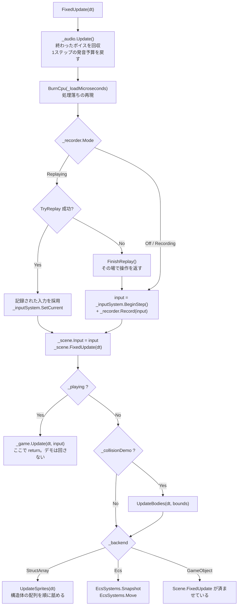

**音の後始末を先頭に置いた**のは、音を要求するのがこの下だから。
予算を戻す場所と使う場所を近くに置くと、「いつリセットされるのか」を追う必要がなくなる。
描画側(`OnRender`)に置くと、シミュレーションが 5Hz のときに
「1フレームに複数ステップぶんの音が要求されるのに予算は 1 回ぶん」というずれが起きる。

**入力がどこから来たかを、この関数から下は誰も気にしない**のがポイント(Day 20 の要点1)。
`InputSnapshot` という値に畳んであるので、記録の再生と実操作を1行で差し替えられる。

`Scene.FixedUpdate` を `_backend` の分岐より前で必ず呼んでいるのは、
**プレイヤーと階層の実演がどのモードでも Scene 側にいる**ため。

### Scene.FixedUpdate の4段階

順番に意味がある。入れ替えると壊れる。

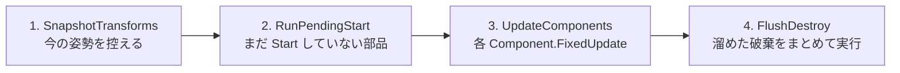

| 段 | なぜその位置か |
|---|---|
| 1 | **動かす前**に控えないと、補間の始点が終点と同じになって補間が効かない |
| 2 | `Start` の中で新しいオブジェクトが生まれるので、**開始時点の件数だけ**回す |
| 3 | ここも開始時点の件数で止める。このステップで生まれたものは次のステップから |
| 4 | 更新中にリストから消すと**走査中のインデックスがずれる**(Day 22 の要点5)。<br/>まとめて `RemoveAll` するのは、1個ずつ消すと O(n^2) になるため |

### 非同期テクスチャロードの流れ

`Q` キーで走る道。**GL を呼ぶ部分と呼ばない部分の境目**が、
そのままスレッドの境目になっている(Day 21 の要点5)。

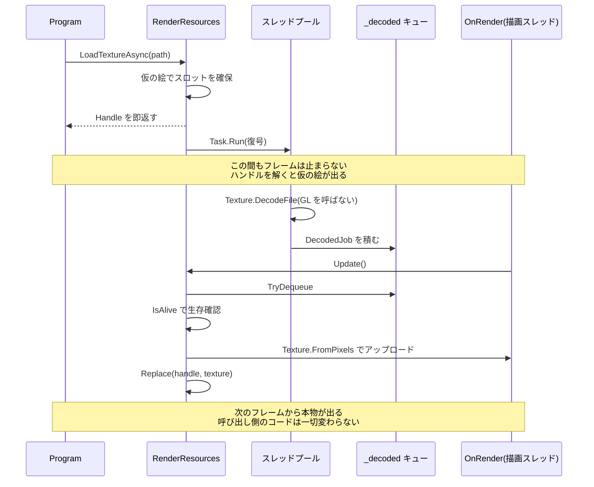

`Update()` が `MaxUploadsPerFrame` で枚数を絞っているのが肝で、
**復号を非同期にしても、アップロードをまとめてやるとそこでカクつく**(Day 21 の要点6)。

### 衝突判定の3段 — ブロードフェーズが割り込んだ

Day 25 の `UpdateBodies` は「動かす → 総当たり → 押し戻す」の3段だった。
今日、真ん中が**「組を絞る」と「絞った組を判定する」に割れる**。

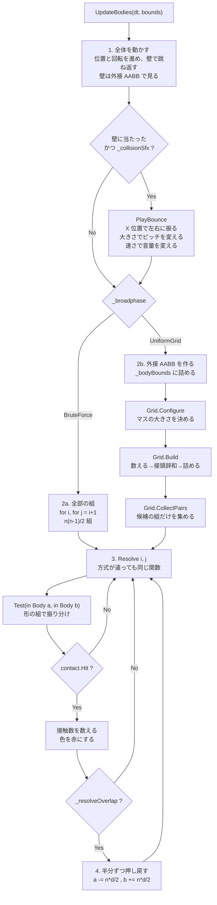

発音の要求が**移動の段にある**ことに注意。
「壁に当たった」はブロードフェーズの外で分かることなので、
組の絞り込みとは無関係にここで出る。
体どうしの接触音を鳴らすなら `Resolve` の中になるが、
2000 体で 7,425 組が接触しているので**要求だけで 7,425 回**になる。
要点3の 7.3μs を掛けると 54ms。今日は壁だけにしてある。

図で見てほしいのは**2つの経路が `Resolve` で合流している**ところ。
方式ごとにナローフェーズを書き分けると、
「答えが違う」となったときに原因がブロードフェーズなのか判定なのか分からなくなる。
合流させておけば、**違いが出たら必ず組の選び方が原因**と言い切れる。
`F12` の自己チェックが「接触数が一致」だけで意味を持つのはこの形のおかげ。

もうひとつ、**押し戻し(4段目)がグリッドの構築より後にある**ことに注意。
押し戻すと位置が動くので、ステップの頭で組んだ格子は少しずつ古くなる。
押し戻し量は 1 ステップぶんの重なりぶんしかないので実用上は問題にならないが、
厳密にやるなら「判定を全部済ませてから、まとめて押し戻す」形にする。
Phase 7 のインパルス解決がその形になる。

### 均一グリッドの中身 — 2つの関数しかない

`SpatialGrid` の公開メソッドは実質 `Build` と `CollectPairs` の2つだけ。
中で何が起きているかは、コードを読むより図のほうが早い。

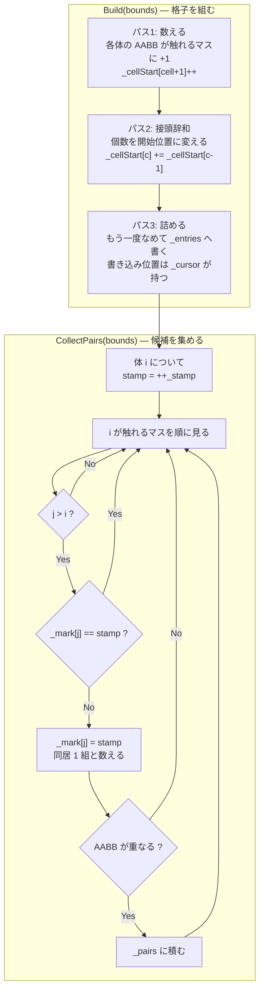

3つの絞りが直列に並んでいるのが分かる。

| 絞り | 落とすもの | 4000 体での実測(マス 32px) |
|---|---|---|
| 格子 | 別のマスにいる組 | 7,998,000 → 72,527 |
| `j > i` と印 | 同じ組の重複 | (上の数に含まれる) |
| AABB | 同じマスだが離れている組 | 72,527 → 24,733 |

**最後の AABB がまだ 3 分の 1 に減らしている**のが面白いところで、
「同じマスにいる」は「近い」でしかない。
7.4ns の AABB 判定を挟むことで、24〜120ns のナローフェーズを 5 万回節約している。

`j > i` の条件だけでは重複が消えないことは、実際に印を外すと確かめられる
(自己チェックの「重複した組が無い」が落ちる)。

`Test(in Body, in Body)` の中身は形の組み合わせ表そのもの。**3種類で6通り**になる。

| a \ b | Circle | Box | RotatedBox |
|---|---|---|---|
| **Circle** | `Test(Circle, Circle)` | `Test(Circle, Aabb)` | `Test(Circle, Obb)` |
| **Box** | 上を**符号反転** | `Test(Aabb, Aabb)` | OBB 同士へ寄せる |
| **RotatedBox** | 上を**符号反転** | OBB 同士へ寄せる | `Test(Obb, Obb)` SAT |

- **専用の速い経路**(AABB 同士、円同士)と**一般形**(OBB 同士の SAT)を併存させ、
  組み合わせの穴は一般形で埋める。`F9` の自己チェックで**両者の答えが一致すること**を確認している
- 引数の順が逆になる組(`Test(Box, Circle)`)は**法線の符号を反転**して返す。
  ここを間違えると物体がめり込む方向へ押される(要点6)
- 種類を1つ足すと表が1行1列増える。3D で球・箱・カプセル・平面・地形と並べると 15 通りになり、
  **その表を埋めることが物理エンジンを書くこと**になる(Phase 7)

### 音を1発鳴らすまで — 3つの関門

`Play` を呼んでから実際に音が出るまでに、3回ふるいにかけられる。
**呼んだのに鳴らないことは普通に起きる**ので、どこで落ちたかを数えられるようにしてある。

```mermaid
flowchart TD
    S["Play(clip, volume, pitch, pan)"] --> A{"IsAvailable ?"}
    A -->|No| N1["VoiceId.None<br/>音の出ない環境。例外は投げない"]
    A -->|Yes| B{"クリップは生きている ?"}
    B -->|No| N2["VoiceId.None"]
    B -->|Yes| C{"このステップで<br/>同じクリップを<br/>上限まで鳴らした ?"}
    C -->|Yes| N3["間引き<br/>CulledLastStep++"]
    C -->|No| D["AcquireVoice(priority)"]
    D --> E{"空きがある ?"}
    E -->|Yes| G["ボイスを設定する<br/>Buffer / Gain / Pitch / Position"]
    E -->|No| F{"奪える相手がいる ?<br/>ループ以外で<br/>優先度が自分以下"}
    F -->|No| N4["諦める<br/>CulledLastStep++"]
    F -->|Yes| ST["いちばん低い優先度<br/>同点なら最古を止める<br/>StolenLastStep++"]
    ST --> G
    G --> H["alSourcePlay<br/>7.3us かかる"]
    H --> I["VoiceId を返す<br/>添字 + 世代"]
```

**「諦める」が2箇所ある**のが要点。
間引き(`C`)は「同じ音が多すぎる」で落とし、
`F` は「ボイスが足りず、しかも自分より偉い音しか鳴っていない」で落とす。
前者は音として意味が無いから落とすので**積極的**、
後者は資源が足りないから落とすので**消極的**。
タイトルバーで両方を分けて数えているのは、この2つが違う対処を要求するため
(前者は上限を調整する、後者はボイスを増やす)。

### 1文字が画面に出るまで — 4つの層を通り抜ける

`Draw("あ", ...)` を呼んでから画面に出るまでに何が起きるか。
**初回だけ通る道**(焼く)と、**毎回通る道**(引く・積む)が分かれているのが要点。

```mermaid
sequenceDiagram
    participant P as Program
    participant TR as TextRenderer
    participant GA as GlyphAtlas
    participant FF as FontFace
    participant TX as Texture
    participant SB as SpriteBatch

    P->>TR: Draw(batch, "あ", 位置, 16px, 色)
    TR->>TR: 行に切る / ベースラインを出す
    TR->>GA: GetOrAdd(0x3042, 16)

    alt 初回だけ
        GA->>FF: GlyphIndexOf(0x3042)
        GA->>FF: Measure(グリフ番号, scale)
        FF-->>GA: 幅 11 / 高さ 11 / 送り 16
        GA->>GA: 棚に場所を取る
        GA->>FF: Rasterize(作業用バッファへ)
        GA->>GA: 上下をひっくり返す
        GA->>TX: UploadR8(x, y, 11, 11)
        Note over GA,TX: 実測 14.3us。ここだけが高い
    end

    GA-->>TR: Glyph(切り出し位置 + 寸法)
    Note over TR,GA: 2回目からは辞書を引くだけ。61ns

    TR->>TR: penX + OffsetX / baseline + OffsetY
    TR->>TR: 整数に丸める(PixelSnap)
    TR->>SB: Draw(領域, 中心, 大きさ, 色)
    Note over SB: ここから先はスプライトと同じ道
```

図で見てほしいのは、**`alt` の中が初回にしか走らない**こと。
14.3us と 61ns の差は 234 倍あり、**キャッシュを持つかどうかがそのまま性能**になる。
だからアトラスは「使い回すためのもの」であって、
描画をまとめるため(Day 17 の動機)だけのものではない。

もうひとつ、**`TextRenderer` から `Texture` への線が無い**。
グリフを焼く判断も、GL を触るのも、全部 `GlyphAtlas` の中で閉じている。
`TextRenderer` から見れば「文字を渡すと切り出し位置が返ってくる」だけで、

### ゲームの1ステップ — 11 段の順番と、格子の使い回し

`SurvivorGame.Update` は 11 段でできている。**順番に意味がある**。

```mermaid
flowchart TD
    S["Update(dt, input)"] --> LU{"Phase == LevelUp ?"}
    LU -->|Yes| C1["上下で選択肢を動かすだけ<br/>時間は進まない"]
    LU -->|No| P1["1. プレイヤーを動かす<br/>カメラが遅れて追う"]
    P1 --> P2["2. 敵を湧かせる<br/>画面の外の円周上"]
    P2 --> P3["3. 敵を動かす<br/>プレイヤーへ向かう / 遠すぎたら消す"]
    P3 --> P4["4. 格子を組む<br/>Configure + Build"]
    P4 --> P5["5. 敵どうしを押し離す<br/>CollectPairs"]
    P5 --> P6["6. 狙う敵を探して撃つ<br/>Query"]
    P6 --> P7["7. 弾を進めて当てる<br/>弾ごとに Query"]
    P7 --> P8["8. プレイヤーの被弾<br/>Query"]
    P8 --> P9["9. ジェムを吸い寄せて拾う"]
    P9 --> P10["10. レベルアップ判定"]
    P10 --> P11{"11. HP <= 0 ?"}
    P11 -->|Yes| GO["GameOver"]
    P11 -->|No| E["おわり"]
    P10 -.->|レベルが上がったら| LV["選択肢を3つ引いて<br/>Phase = LevelUp"]
```

**10 でレベルが上がったら、そこで止まる**。
Day 29 は `while` で一気に上げていたが、選択を挟むならそれはできない——
1回に1レベルずつ処理して、選び終わってから次のレベルを見る。

入れ替えると壊れるところ:

| 順番 | なぜそこか |
|---|---|
| 4 が 3 の後 | 動かす前に組むと、**1ステップ古い位置**で判定することになる |
| 5〜8 が 4 の後 | 全部**同じ格子**を使う。組み直すと4倍のコストになる |
| 10 が 9 の後 | ジェムを拾ってからでないと、レベルが1ステップ遅れる |

**格子を1回組んで4通りに使う**のが今日いちばんの節約になっている。

```mermaid
flowchart LR
    B["Grid.Build<br/>敵の外接 AABB を詰める"]
    B --> Q1["CollectPairs<br/>敵どうしの押し合い"]
    B --> Q2["Query 1回<br/>狙う敵を探す"]
    B --> Q3["Query × 弾の数<br/>当たった敵を探す"]
    B --> Q4["Query 1回<br/>プレイヤーに触れた敵"]
```

実測(敵 509 体):

| | 組の数 |
|---|---|
| 総当たりなら | 129,286 組 |
| 格子の候補 | **594 組** |

**99.5% 減っている**。押し合いは「全員対全員」なので、
格子が無ければこの演出はそもそも載らない(Day 26 の要点5)。

そして 2〜4 は `CollectPairs` ではなく `Query` を使う。
**1対多は組の列挙では表せない**——
弾1発について「近くにいる敵」を知りたいだけなので、
全部の組を作ってから絞るのは無駄になる。

### 武器3種 — 当たり判定をどこに置くか

3つの武器の違いは、突き詰めると<b>当たり判定をどこに置くか</b>だけになる。

```mermaid
flowchart TD
    W["UpdateWeapons(dt)"] --> K{"武器の種類"}

    K -->|Bolt| B1["タイマーを刻む"]
    B1 --> B2["いちばん近い敵を Query で探す"]
    B2 --> B3["Projectile を Count 発ぶん作る<br/>少しずつ角度をずらす"]
    B3 --> B4["**当たり判定は UpdateProjectiles 側**<br/>飛んでいる間ずっと残る"]

    K -->|Orbit| O1["角度を進める<br/>Angle += Speed * dt"]
    O1 --> O2["**毎ステップ**判定する<br/>刻むとすり抜ける"]
    O2 --> O3["球ごとに Query → 円判定"]
    O3 --> O4["**Damage は毎秒**<br/>dt を掛けて削る"]

    K -->|Aura| A1["タイマーを刻む"]
    A1 --> A2["半径 Radius の円で Query"]
    A2 --> A3["範囲の敵をまとめて削る<br/>**位置すら持たない**"]
```

| | 当たり判定の置き場所 | 残るか | 刻むか |
|---|---|---|---|
| ボルト | `Projectile` の配列 | 寿命まで残る | 発射を刻む |
| オービット | その場で計算 | **残らない** | **刻まない**(毎ステップ) |
| オーラ | プレイヤーの周り | 残らない | 削りを刻む |

**「武器 = 弾を出すもの」と決めつけて設計すると、オービットとオーラが入らない**
(Day 29 の改造課題3で触れた分かれ道)。
今日の形は、`WeaponState` を「種類とレベルとタイマー」だけにして、
<b>当たり方は種類ごとの関数に任せる</b>——
つまり案A(enum + 分岐)を選んでいる。

3種類のうちはこれが読みやすい。5種類を超えたら、
`WeaponStats` のフィールドの意味が武器ごとに違うのが苦しくなるので、
そこが案C(完全にデータで持つ)へ移る目安になる。

### オービットだけ刻まない理由

これは実装中に実際に踏んだところ。**最初は 0.22 秒ごとに判定していて、
オービットだけで 40 秒遊んで撃破 0 体**になった。

```mermaid
flowchart LR
    T1["t=0.00s<br/>球はここ"] -->|"0.22秒で 50px 進む"| T2["t=0.22s<br/>球はここ"]
    E["敵はこの間にいた<br/>**一度も判定されない**"]
    T1 -.-> E
    T2 -.-> E
```

球は 1 秒に 200px 以上動く。0.22 秒ごとに位置を見ると、
**1回の判定の間に 50px 飛ぶ**。球の直径は 22px しかないので、
その間にいた敵はすり抜ける。

Day 25 の改造課題3(速い弾が細い壁をすり抜ける)とまったく同じ話が、
**攻撃側で起きた**ことになる。直し方も同じ2択で、

1. 移動前と移動後を結んだ範囲で判定する(連続衝突判定)
2. **毎ステップ判定して、ダメージを時間で割る**

ここでは 2 を採った。触れている間ずっと削る形になるので、
「巻き付いて削る武器」という手触りにも合う。
そのぶん `WeaponStats.Damage` の単位が武器で変わる
(オービットだけ「毎秒」)——**気持ち悪いが、揃えると片方が嘘になる**。
## 完成条件

```
git lfs install     # 一度だけ
git lfs pull        # assets/models/*.glb を実体化する

dotnet run --project reference/Day33 -c Release
```

起動すると **DamagedHelmet が床の上に立ち、左下へ影が落ちている**。
Day 32 との違いは影1つだが、床が入ったことで「置かれている」感じが一気に出る。

### 1. 影が見える

| 見るところ | 期待 |
|---|---|
| 床 | 兜の形の影が**左手前へ**倒れている。輪郭は少しにじんでいる(3x3 PCF) |
| 兜の下面 | 影の側は真っ黒ではなく、環境光ぶん(0.13, 0.16, 0.22)だけ残る |
| HUD 2行目 | `影:2048 PCF:3x3 範囲:6m バイアス:0.0015+傾き 0.6cm/tx 12.0MB 影パス:2回 …ms` |

**影が真っ黒にならない**のが今日の1つの見どころ。
影は直接光にだけ掛けていて、環境光には掛けていない
(現実の影が黒くないのは、空や周囲からの光が回り込んでいるから)。
ここを間違えて環境光にも掛けると、影の中が夜になる。

`影パス:2回` は深度パスのドローコール数。モデル1パーツ + 床で2回。
`Shift+0` で Lantern に切り替えると `4回`(3パーツ + 床)になる。

### 2. `Ctrl+4`: バイアスを 0 にしてアクネを出す

**今日いちばん見てほしい壊れ方**。1回押して `0.0000` にすると、
床と兜の表面に細かい縞模様(モアレ)が広がる。

```
バイアス 0.0000  → 面全体に縞。「影が出た」のではなく「自分が自分を遮った」
バイアス 0.0005  → ほとんど消えるが、床の遠くにまだ残る
バイアス 0.0015  → 消える(既定)
バイアス 0.0060  → 影が兜から離れて浮く(ピーターパン)
```

`Ctrl+5` で傾きに比例したバイアスを切ると、0.0015 のままでも
**床の遠く(光に対して寝ているところ)に縞が戻る**。
必要なバイアスが傾きに比例することが、切り替えるだけで見える。

`Ctrl+6` で表カリングに変えると、**バイアス 0 でもアクネが消える**。
同時に**床の影が丸ごと消える**のも確かめてほしい——
床は1枚板で裏が無いので、表を捨てると何も焼かれない。
「閉じた立体にしか使えない」が絵として出る。

### 3. `Ctrl+2` / `Ctrl+8`: ギザギザと VRAM の綱引き

`Ctrl+3` を3回押して **1タップ**(PCF なし)にしてから、解像度を動かす。

| 設定 | 1テクセル | 見え方 |
|---|---|---|
| 512 / 半径6m | 2.3cm | 影の輪郭が**はっきり階段**になる |
| 2048 / 半径6m | 0.6cm | 階段は残るが目立たない |
| 2048 / 半径24m | 2.3cm | **512 と同じ粗さ**。VRAM は 12MB のまま |

**「解像度を4倍」と「箱を1/4」が同じ効果**で、VRAM を払うのは前者だけ。
HUD の `cm/tx` がその数字そのものなので、押しながら数字を見るとよい。

半径 3m まで絞ると影は最も細かくなるが、
**カメラを引くと画面の端から影が消える**(箱の外に出る)。
`ClampToBorder` が効いて、外は「遮るものなし」になる。

### 4. `Ctrl+7`: シャドウマップそのものを見る

右下に焼いたシャドウマップが出る。**影がおかしいときの最初の1歩**。

```
真っ白           → 何も焼かれていない。深度パスに物体が来ていないか、行列が外れている
モデルの形が出る → 深度パスは正しい。疑うのは本描画側の座標変換か比較
```

**平行光源なので線形補正が要らない**のがここの気持ちよさで、
正射影の深度は距離にそのまま比例する
(透視投影の深度は 1/z に比例するので、見るときに戻す必要がある)。

背景が上から下へなめらかな階調になっているのが床で、
その中心にモデルの断面が明るく浮かぶ。

### 5. `Shift+9` を8回: 影の係数だけを見る

成分の巡回に「影の係数」が増えた。白 = 当たっている、黒 = 影。

**色を混ぜない状態がいちばん読み取りやすい**。
アクネの縞も、PCF の階調も、バイアスの入れすぎで影が痩せるのも、
完成した絵の上では「なんとなくおかしい」で終わってしまう。

### 6. `Ctrl+0`: 自己チェックと計測

15 項目すべて `OK` になり、解像度ごとの深度パスが出る。

```
[シャドウマッピングの自己チェック]
  [OK] 深度テクスチャが挿さっている
  [OK] カラーアタッチメントは無い
  ...
  [OK] 中央のテクセルに立方体の**上面**が焼けている  実際 0.4444 / 期待 0.4444
  [OK] **表カリングにすると裏面(下面)が焼ける**  実際 0.5556 / 期待 0.5556(表のとき 0.4444)
  ...
  すべて合格
```

**中央のテクセルの2行が今日の核心**。
1辺 2 の立方体を真上から焼くと、上面(y=+1)と下面(y=-1)の深度差は
ちょうど 2 ワールド単位 = 0.1111(深度の範囲 18 のうち)。
`0.4444` と `0.5556` の差が **0.1111** になっているのが、
「表カリングは物体の厚みぶん奥を焼く」の数値そのものになる。

## 改造課題

### 課題1(易): テクセルスナップで、カメラを動かしたときの揺れを止める

`Ctrl+8` で半径を 3m にして、左ドラッグでカメラをゆっくり回すと、
影の輪郭が**ちらちら泳ぐ**のが見える。

光の箱の中心がカメラの注視点に追随しているので、
**1フレームごとにシャドウマップの格子がずれる**のが原因。
同じ面が、あるフレームではテクセルの中央に、次のフレームでは境目に来る。

直し方は「箱の中心をテクセルの格子に吸着させる」。
`ShadowMap.Begin` で光源行列を作ったあと、中心を光の座標系へ写し、
`WorldPerTexel` の整数倍に丸めて、そのぶん平行移動を足し戻す。

```csharp
// おおよその流れ
Vector3 lightSpaceCenter = Vector3.Transform(center, view);
float texel = WorldPerTexel;
lightSpaceCenter.X = MathF.Floor(lightSpaceCenter.X / texel) * texel;
lightSpaceCenter.Y = MathF.Floor(lightSpaceCenter.Y / texel) * texel;
// 丸めたぶんを view に足し戻す
```

**注視点そのものを丸めてはいけない**(カメラが飛ぶ)のが引っかかりどころ。
丸めるのは光の座標系での位置で、しかも Z は丸めない。

### 課題2(中): ハードウェア PCF(`sampler2DShadow`)に置き換える

GPU には「読むときに比較まで済ませる」専用の仕掛けがある。

```csharp
// テクスチャ側
gl.TexParameter(target, TextureParameterName.TextureCompareMode,
    (int)TextureCompareMode.CompareRefToTexture);
gl.TexParameter(target, TextureParameterName.TextureCompareFunc, (int)DepthFunction.Lequal);
texture.SetFilter(TextureFilter.Linear);   // ← 今度は Linear が正しい
```

```glsl
uniform sampler2DShadow uShadowMap;
float lit = texture(uShadowMap, vec3(proj.xy, proj.z - bias));   // 0〜1 が返る
```

**タップ数が 1/4 になるのに、3x3 相当のなめらかさが出る**——
GPU が 2x2 の比較結果をハードウェアで補間してくれるため。

見どころは2つ。**`Linear` が今度は正しい設定になる**理由(要点6の「順番」)と、
**返り値が 0 か 1 ではなく 0.25 刻みになる**こと。
既存の手書き PCF と切り替えられるようにして、
同じ 9 タップでどれだけなめらかさが違うか見比べるとよい。

### 課題3(難): カスケードシャドウマップ(2段)

要点2と5の綱引きに、本気で答える。

視錐台を距離で2つに割り(たとえば near〜15m と 15m〜60m)、
それぞれに別の光源行列とシャドウマップを持たせる。
本描画では、そのピクセルのビュー空間の深度を見てどちらを引くか選ぶ。

```
段0: 半径 6m  / 2048  → 0.6cm/tx   手前だけ担当
段1: 半径 30m / 2048  → 2.9cm/tx   遠くを担当
```

**手前は細かく、遠くは粗く**。遠くの影は小さく映るので、粗くても気づかれない。

難しいのは3つ。
1. **境目**。段が切り替わるところに線が出る。実務では2段をブレンドする
2. **どこで割るか**。等分割だと手前が粗い。対数分割(`near * (far/near)^(i/n)`)が定番
3. **深度パスが段の数だけ増える**。今日 0.05ms のものが 0.1ms になる

Day 39〜40 のデモで広い屋外を出すなら、ここは避けて通れない。
**先に1段で全部の落とし穴を踏んでおくと、2段目は同じ話の繰り返し**になる。

## 動作確認済み環境

- Windows 11 Home / .NET 10
- GL_RENDERER: NVIDIA GeForce RTX 3070/PCIe/SSE2
- GL_VERSION: 3.3.0 NVIDIA 596.49

### 自己チェック(15 項目すべて合格)

```
[シャドウマッピングの自己チェック]
  [OK] 深度テクスチャが挿さっている
  [OK] カラーアタッチメントは無い
  [OK] 正方形になっている  2048x2048
  [OK] 中心が NDC の原点に来る  (0.000, 0.000)
  [OK] w が 1(正射影なので透視除算が要らない)  w = 1.000
  [OK] 中心の深度が範囲のちょうど中央(0.5)  実際 0.500
  [OK] **光に近いほど深度が小さい**  6m 上 0.167 < 中心 0.500
  [OK] 半径ちょうどの点が NDC の端(±1)  実際 -1.000
  [OK] 半径の外は NDC からはみ出す(= 影の判定に載らない)  実際 -1.500
  [OK] 中央のテクセルに立方体の**上面**が焼けている  実際 0.4444 / 期待 0.4444
  [OK] 何も無い隅は 1.0(クリア値のまま)  実際 1.0000
  [OK] **表カリングにすると裏面(下面)が焼ける**  実際 0.5556 / 期待 0.5556(表のとき 0.4444)
  [OK] 解像度を2倍にすると1テクセルの担当が半分になる  0.59cm → 0.29cm
  [OK] VRAM は4倍になる  48.0MB
  [OK] 光の箱を4倍広げると1テクセルの担当も4倍になる(= 影が粗くなる)  0.6cm → 2.3cm
  すべて合格
```

### 深度パスの実測(立方体6個 + 床、`glFinish()` 込みの 120 回平均)

| 解像度 | 深度パス | VRAM | 1テクセル |
|---|---|---|---|
| 512x512 | 0.050 ms | 0.8MB | 2.3cm |
| 1024x1024 | 0.045 ms | 3.0MB | 1.2cm |
| 2048x2048 | 0.044 ms | 12.0MB | 0.6cm |
| 4096x4096 | 0.044 ms | 48.0MB | 0.3cm |

**解像度を 64 倍にしても時間が変わらない**。
深度だけを書くパスは GPU の得意技(画素シェーダが何も出力しない)で、
この規模では**ドローコールを積む CPU 側の時間**が全部になっている。

「影を細かくしたら重くなるはず」という直感が外れるところで、
**代償は VRAM に出る**(0.8MB → 48MB)というのが正しい読み方になる。

### PCF のタップ数と1フレーム(960x640、`glFinish()` 込みの 300 フレーム平均)

| 設定 | 1フレーム |
|---|---|
| 影 OFF | 0.154 ms |
| 1タップ | 0.196 ms |
| 3x3(9タップ) | 0.185 ms |
| 5x5(25タップ) | 0.195 ms |
| 7x7(49タップ) | 0.216 ms |

**9タップから 49 タップへ増やしても 0.03ms しか増えない**。
1タップと 3x3 の逆転(0.196 → 0.185)は誤差の範囲で、この規模では有意差が出ていない。

影を付けること自体のコスト(0.154 → 0.19)のほうが、タップ数より大きい。
シャドウマップの読み込みはキャッシュに素直に乗る(隣のピクセルは隣のテクセルを読む)ので、
**タップ数がそのまま時間にはならない**。

ただしこれは 960x640 の話で、**影を受けるピクセルの数に比例する**。
1920x1080 なら 3.4 倍、4K なら 13.5 倍になるので、
Day 39 以降で画面を大きくしたら測り直すこと。

### 検証の途中で分かったこと

**影が出ないと思ったら、影が真後ろにあった**。

実装を終えて最初に走らせたとき、床にも兜にも影が1ピクセルも出なかった。
シャドウマップは正しく焼けていて(`Ctrl+7` で確認)、
CPU 側で光源行列を計算し直しても値は合っていた。

原因は**光の向きとカメラの向きがほぼ揃っていた**こと。
Day 32 までの光 `(-0.45, -0.72, -0.53)` は、既定のカメラ(Yaw 0.6)と同じ方角から差していた。
影は光の進む向きへ伸びるので、**物体の真後ろに完全に隠れていた**。

- **原因のかなり上位に来るのに、コードを何度読んでも見つからない**類の話
- 切り分けは光を回すのが速い(`Ctrl+9`)。今日それをキーに割り当てているのはこのため
- 結局、既定の光の向きを 90 度回して恒久的に直した(差分概要を参照)

**シャドウマップは画面の大きさと関係無い**。
`OnFramebufferResize` に手を入れそうになったが、要らない——
シャドウマップは「光から見た絵」なので、ウィンドウをどう変えても 2048x2048 のまま。
後処理のバッファ(画面に追随する)と扱いが違うことに、書きながら気づいた。

**深度パスは GL の状態を借りっぱなしにしない**。
`ShadowMap.Begin` で深度テストとカリングを有効にした最初の版では、
`C` キー(カリング)や `W` キー(ワイヤーフレーム)の設定が
**影パスの都合で書き換わったまま本描画へ流れていた**。

`PostProcess.End` が同じ用心をしていたのを見落としていた形で、
OpenGL の状態がグローバルである以上、
**借りたら返す**を毎回書くしかない(Day31.md の `End` のコメント)。

**床を足さないと影が確かめられない**。
Day 32 はモデルだけを宙に浮かべていた。陰影しか無いうちはそれで足りたが、
影は**他の物体の上に落ちて初めて見える**。
落ちる先が無いと「影が出ていない」のか「落ちる先が無い」のか区別が付かないので、
モデル表示中も床を1枚敷くようにした。
