# Day 34: 法線マップ・視差マッピング(接空間の理解)

Phase 6 の4日目。**平らなポリゴンに凹凸が出る**。

## 今日のゴール

`Alt+5` でレンガの板が出て、`Alt+2` で視差の方式を切り替えられる。

```
  Alt+5  材質テストの板(レンガ)。**視差はここでしか確かめられない**
  Alt+1  法線マップ ON / OFF
  Alt+2  視差   なし / 単純視差 / 急峻視差 / 視差遮蔽(POM)
  Alt+3  視差の深さ  0.02 / 0.05 / 0.10 / 0.18
  Alt+4  レイマーチの刻み  4〜8 / 8〜32 / 16〜64
  Alt+6  板の繰り返し  1 / 2 / 4
  Alt+7  ファイルの接線 / 生成した接線 を切り替え
  Alt+8  法線マップの緑を反転(DirectX 形式の素材の見え方)
  Alt+9  最終法線をすぐ見る    Alt+0  接空間の自己チェック
```

今日の主題は**接空間**の1つに尽きる。
法線マップも視差マッピングも「面に貼り付いた座標系」が土台で、
そこが分かっていないとどちらも動かない。

そして Day 32 で読み込むだけしていた法線マップが、**やっと絵に効く**。
器を先に作っておいたので、今日の差分はシェーダと接線の用意で済んでいる。

## 事前に読む資料

- [ゲームグラフィックス特論 B-10: テクスチャマッピング(2) さまざまな材質](https://tokoik.github.io/gg/)
  **バンプマッピングから法線マップまでの流れ**が載っている。
  Phase 3(Day 15)でマテリアルの抽象化をやったときにも読んだ回で、
  今日は後半の「法線をテクスチャで置き換える」が本題
- **西川善司『「3Dゲームエンジン」が作れる本』Ch3「法線マップとその進化形」**
  今日のいちばん近い解説。**接空間の図が分かりやすい**。
  「進化形」として視差マッピング・視差遮蔽マッピングまで扱っているので、
  今日の範囲がそのまま1章に収まっている
- [LearnOpenGL: Normal Mapping](https://learnopengl.com/Advanced-Lighting/Normal-Mapping) /
  [Parallax Mapping](https://learnopengl.com/Advanced-Lighting/Parallax-Mapping)
  **コードで追いたいならここが最短**。今日の実装とほぼ同じ構成で、
  単純視差 → 急峻視差 → POM の順に進むところまで対応する
- [Foundations of Game Engine Development, Vol.2 の接線空間の章(Eric Lengyel)](https://foundationsofgameenginedev.com/)
  接線の導出(連立方程式を解く形)の出どころ。
  同じ導出が [Lengyel の Web 記事](http://www.terathon.com/code/tangent.html)にもある
- [MikkTSpace](http://www.mikktspace.com/)
  **接線の事実上の標準実装**。Blender も glTF も、
  法線マップを焼くときはこれで接線を作っている。
  今日書く生成は素直な平均版なので、**そことは細部が食い違う**——
  なぜ標準実装が要るのかがここに書いてある

## 理論の要点

### 1. 法線マップは「向きの地図」で、接空間に住んでいる

法線マップに入っている RGB は色ではなく、**その画素で面がどちらを向いているか**。
ただし世界での向きではない。**面に貼り付いた座標系**での向きになっている。

なぜ世界の向きを直接入れないのか。**入れたら貼り回せなくなる**から。
「上を向いている」を世界座標で書いてしまうと、壁に貼った瞬間に嘘になる。
面に対する相対的な向きで書いておけば、**どの面に貼っても意味が変わらない**。

その座標系が接空間で、軸は3本。

```
  T(接線 / Tangent)     … UV の U が増える向き
  B(従接線 / Bitangent) … UV の V が増える向き
  N(法線 / Normal)      … 面の向き
```

**U と V が基準になっている**のが肝で、
「面のどっちが右か」を決められるのはテクスチャ座標しかない。
だから接空間は**メッシュの形と UV の張り方の両方**で決まる。

### 2. 接線は「連立方程式を1つ解く」と出る

三角形1枚には頂点が3つあり、それぞれ位置と UV を持っている。
2辺を、位置の差と UV の差で書くと:

```
  E1 = T * du1 + B * dv1
  E2 = T * du2 + B * dv2
```

未知が T と B の2本、式も2本なので解ける。

```
  r = 1 / (du1*dv2 - du2*dv1)
  T = (E1*dv2 - E2*dv1) * r
  B = (E2*du1 - E1*du2) * r
```

`r` の分母は 2x2 行列の行列式で、**UV の三角形の面積の2倍**にあたる。
だから **UV が潰れている三角形では 0 になって NaN が出る**。
NaN は頂点で足し込むときに周りへ伝染するので、そこは捨てる。

頂点は複数の三角形に共有されるので、面ごとに出した T を**足し込んで平均**する。
法線を頂点で共有するときと同じ理屈で、これで面の境目が滑らかに繋がる。

最後に**グラム・シュミットで法線に直交させる**。
足し込んだ T は法線と直角になっていない(共有する面ごとに少しずつ傾いている)ので、
法線の向きの成分を引いて、面に乗った成分だけを残す。

```
  T = normalize(T - N * dot(N, T))
```

### 3. B は持たない。持つのは符号1個

3本のうち2本が決まれば3本目は外積で出るので、B は保存しない。

```
  B = cross(N, T) * w        // w は +1 か -1
```

`w` に **±1 しか入らない**のは、外積の向きが合っているか、逆かの2択だから。

逆になるのは **UV が鏡像になっている面**。
左右対称のキャラクタで、片側の UV を裏返して使い回すのは定番の手で、
そのとき裏返した側は「V が増える向き」が反転する。

**符号を落とすと、鏡像の側だけ凹凸が反転する**。
左右対称のモデルで「右半分だけ変」という壊れ方はほぼこれ。
今日の WaterBottle は 2426 頂点が `w = -1` になっていて、
自己チェック(Alt+0)がその数を出す。

### 4. 高さマップから法線マップは作れる。逆は難しい

法線マップは**傾きの地図**で、高さマップは**高さの地図**。
傾きは高さの微分なので、後者から前者は素直に作れる。

```
  dx = h(x+1, y) - h(x-1, y)
  dy = h(x, y+1) - h(x, y-1)
  N  = normalize(-dx, -dy, 1)
```

**符号がマイナス**なのは、右へ行くほど高くなる面(dx > 0)の法線は左へ傾くから。
坂を登るとき、地面は自分のほうを向いている。

**Z が 1 固定なのが「法線マップはだいたい薄紫」の正体**。
平らなところは (0, 0, 1) で、0〜1 に写すと (0.5, 0.5, 1.0) = 薄い青紫になる。
一面その色に見えるのは**ほとんどの画素が平らだから**であって、
「そういう色の画像」なのではない。

今日の自己チェックは、生成した法線マップの
**過半数(64%)が平ら**であることと、
**強く傾いた画素の割合(21.9%)が面取りの帯の面積(22.6%)と一致する**ことを確かめる。
模様のパラメータから予言できる数字が、焼いた結果と合う。

逆(法線マップ → 高さマップ)は積分になるので簡単ではない。
だから**視差マッピングをやるには高さマップが別に要る**。
そして glTF のコア仕様には高さテクスチャが無い(要点7)。

### 5. 緑の向きに2つの流儀がある(OpenGL と DirectX)

法線マップの緑成分には、**互いに逆の2つの約束**が流通している。

| 流儀 | 緑が大きい = |
|---|---|
| OpenGL 形式(Y+) | V が増える向きへ傾く |
| DirectX 形式(Y−) | V が減る向きへ傾く |

**画像としては見分けが付かない**。並べて置いても、どちらも薄紫の似た絵になる。
貼ってから「なんとなく凹凸が逆」と気づくのが定番の踏み方で、
`Alt+8` でわざと反転させて、その見え方を作れるようにしてある。

見分け方は1つだけある。**斜めから照らして、出っ張りが出っ張って見えるか**。
影の付き方が「光と反対側が暗い」なら正しく、
「光の側が暗い」なら反転している。

### 6. 視差マッピングは、UV をずらすだけ

法線マップは向きを変えるだけなので、**面はどこまでも平ら**。
斜めから見ると「絵が描いてあるだけ」だとすぐ分かる。

視差マッピングはそこへ一歩踏み込んで、
**本当に凹凸があったなら見えていたはずの点**を探しに行く。

```
        視線 V
         \
   ───────\──────────  ← 実際のポリゴン(平ら)
           \
            *          ← 本当はここが見えるはず(高さマップの谷)
```

板は平らなままなので、**形は1ミリも変わらない**。
変わるのは「どのテクセルを読むか」だけ。だから輪郭は平らなままで、面の中だけが立体に見える。

今日は3方式を切り替えられるようにした。

| 方式 | やること | 読む回数 | 弱点 |
|---|---|---|---|
| **単純視差** | その場の高さを1回読んで、視線の傾きぶんずらす | 1 | 深い溝で大きく外す |
| **急峻視差** | 視線を刻んで進み、高さの下へ潜った点を探す | 8〜32 | 層の境目で**縞になる** |
| **視差遮蔽(POM)** | 急峻視差の**最後の1歩を線形補間で戻す** | 8〜32 + 1 | 縁の破綻(下記) |

POM が足すのは3行だけなのに、急峻視差の縞がきれいに消える。
**レイマーチの最後だけ補間**は定石で、Day 37 の SSAO でも同じ発想が出てくる。

**共通の弱点は輪郭**。形を変えていないので、板の縁では嘘がばれる。
深さを上げるほど目立つので、`Alt+3` で 0.18 にすると縁の破綻が見える。
本当に形を変えるにはテセレーション+ディスプレイスメントが要る。

### 7. 視差の入力(高さマップ)は、モデルから来ない

| 要るもの | glTF から来るか |
|---|---|
| 法線マップ | **来る**(DamagedHelmet などが持っている) |
| 高さマップ | **来ない** |

glTF のコア仕様にも Khronos の主要な拡張にも、視差用の高さテクスチャは無い
(`KHR_materials_displacement` は提案止まり)。
だから読み込んだモデルには絶対に付いてこない。

そこで今日は `SurfaceMaps` で**3枚とも手で作る**。得が2つある。

1. **法線マップが高さマップから出てくる**ことが手を動かして分かる(要点4)
2. **3枚が必ず辻褄の合った素材になる**ので、
   「実装が間違っている」のか「素材が合っていない」のかで迷わない

そして**接線が無いモデルのほうが多い**、というのも今日の実感になる。

| モデル | TANGENT |
|---|---|
| DamagedHelmet | **無し**(生成する) |
| WaterBottle | 有り |
| Lantern | 有り |
| BoxTextured | **無し**(生成する) |

「エクスポータが出してくれるはず」と決め打ちすると、
**いちばん有名なモデルでいきなり法線マップが効かなくなる**。

## 前Dayからの差分概要

### 新規ファイル

| ファイル | 役割 |
|---|---|
| `Render/SurfaceMaps.cs` | レンガの**高さ・法線・ベースカラーを手で焼く**。3枚とも1つの高さ関数から出る |

### 変更ファイル

| ファイル | 変更 |
|---|---|
| `Render/Vertex.cs` | **接線を末尾に追加**(location 4、VEC4)。1頂点 48 → 64 バイト |
| `Render/Primitives.cs` | 板と立方体に接線を持たせる。立方体は「左下 → 右下」から求める |
| `Render/Mesh.cs` | `ReadVertices`(GPU から頂点を読み返す)。**自己チェック用** |
| `Render/RenderResources.cs` | `LoadTextureFromPixels`(生の RGBA から作る) |
| `Render/Material.cs` | `NormalScale` / `HeightTexture` / `ParallaxScale`。`Apply` がユニット 6 に割り当てる |
| `Model/Model.cs` | `FileTangentParts` / `GeneratedTangentParts`(接線の出どころ) |
| `Model/GltfLoader.cs` | TANGENT の読み込み、**接線の生成**、`normalTexture.scale`、`forceGenerateTangents` |
| `shaders/textured.vert` | 接線属性、TBN の組み立て、接空間の視線 |
| `shaders/textured.frag` | 法線マップの適用、視差の3方式、成分 9〜12 |
| `Program.cs` | 材質テストの板、視差の設定、`Alt+0〜9`、HUD の1行、`RunTangentCheck` |

変更ファイルへの追加が 1262 行、新規ファイルが 335 行で、合わせて約 1600 行。
**Day 33 より2割ほど大きい**——法線マップと視差マッピングは別々の技法だが、
どちらも接空間が土台なので、分けると同じ説明を2回することになる。

### Day 33 の空行を1つ直した

`Program.cs` の `OnRender` 末尾に、余分な空行が1行残っていた。
Day 33 の作成時に検証用の一時コードを外した跡で、
`dotnet format whitespace` は閉じ括弧の直前の空行を落とさないため通ってしまっていた。

**写経の差分に無意味な1行が乗る**ので、Day 33 側も一緒に直してある。

### 写経する順番

依存の下から。`Vertex` を最初に置くのは、**ここを変えないと他が全部通らない**ため。

1. **`Render/Vertex.cs`**(変更)
   `Tangent`(`Vector4`)を末尾に追加 → `Attributes` に `Float(4)` を1本 →
   5引数のコンストラクタを足して、既存の4引数版はそれに委譲する
2. **`Render/Primitives.cs`**(変更)
   板は `(1,0,0,1)` 固定、立方体は `AddFace` の中で「左下 → 右下」から求める
3. **`Render/Mesh.cs`**(変更)
   `_vertexCount` を覚える → `VertexCount` → `ReadVertices`。
   **`Draw` の直前**に置く
4. **`Render/RenderResources.cs`**(変更)
   `LoadTextureFromPixels` を `LoadTextureFromMemory` の直後に
5. **`Render/SurfaceMaps.cs`**(新規)
   `HeightAt` → `CreateHeight` → `CreateNormal` → `CreateBaseColor` →
   `BrickColor` / `Noise` / `Hash` / `Smoothstep` / `Wrap`。
   **`Wrap` を忘れるとタイルの継ぎ目に縦線が出る**(下の「検証の途中で分かったこと」)
6. **`Render/Material.cs`**(変更)
   `NormalScale` / `HeightTexture` / `ParallaxScale` → `Apply` の追記。
   **ユニット 5 は飛ばす**(シャドウマップが使っている)
7. **`Model/Model.cs`**(変更)
   `FileTangentParts` / `GeneratedTangentParts` を `VertexCount` の直後に
8. **`Model/GltfLoader.cs`**(変更)
   `Load` に `forceGenerateTangents` → `LoadContext` のフィールドと2つのカウンタ →
   `ReadPrimitive` の TANGENT 読み込みと生成の呼び出し → **`GenerateTangents`** →
   `ReadVector4Accessor` → `normalTexture.scale`
9. **`shaders/textured.vert`**(変更)
   `aTangent` と `uCameraPosition` → 3本の `out` → `main` の TBN
10. **`shaders/textured.frag`**(変更)
    uniform 群 → **`ParallaxUv`** → **`PerturbNormal`** →
    `main` の先頭で `uv` を決める → 各マップを `uv` で読むよう差し替え →
    成分 9〜12
11. **`Program.cs`**(変更)
    Day 34 のフィールド → `OnLoad`(3枚の生成とマテリアル)→
    **`OnRender` に `else if (_surfaceDemo)` の枝を足す**(`_model is not null` の直前)→
    `Render3D` のフレーム uniform と分岐 → `RenderSurfaceDemo` →
    深度パスの分岐 → `SetModel`(接線の出どころを出す)→
    `DebugChannelLabel` / `ParallaxLabel` / `TangentLabel` → HUD の行 →
    `OnKeyDown`(`alt` の判定と `Alt+0〜9`)→ `RunTangentCheck` と補助3つ → 操作説明
12. **`Day34.csproj`**(リネームのみ)
    中身は Day 33 と同じ

## 設計書

**クラスが1つ増えただけ**で、層の構成は Day 33 のまま。
`Render/` の中に `SurfaceMaps` が入る。

| 増えたもの | 何をするか |
|---|---|
| `Render/SurfaceMaps` | 高さ・法線・色を手で焼く。**GL を1行も触らない**(バイト列を返すだけ) |

`Render/` と `Model/` の既存クラスも太った。

| 変わったもの | 何が増えたか |
|---|---|
| `Vertex` | **接線**(5本目の属性)。1頂点 64 バイト |
| `Material` | `NormalScale` / `HeightTexture` / `ParallaxScale` |
| `Mesh` | `ReadVertices`(**GPU から読み返す**) |
| `RenderResources` | `LoadTextureFromPixels` |
| `GltfLoader` | TANGENT の読み込みと、**接線の生成** |
| `Model` | 接線の出どころ(ファイル / 生成)の数 |

Day 33 の設計書を丸ごと引き継ぎ、差分の当たった図にだけ手を入れてある。
変わった図は次の3つ。

| 図 | 何が変わったか |
|---|---|
| `Render` のクラス図 | `SurfaceMaps` を追加。`Vertex` / `Material` / `Mesh` / `RenderResources` に追記 |
| `Model` のクラス図 | `GltfLoader` に接線の生成、`Model` に出どころの数 |
| 1フレームの流れ | 材質テストの板の分岐が入った |

そして新しく1つ足した。

| 図 | 何のために |
|---|---|
| 接空間ができるまで | **接線がどこで作られ、どこで使われるか**。CPU とシェーダにまたがる |

写経の前に読み込む必要はない。**途中で「これは誰が呼ぶんだったか」と迷ったときに戻ってくる場所**として使う。

### 全体構成 — 8つの層と、その上のゲーム

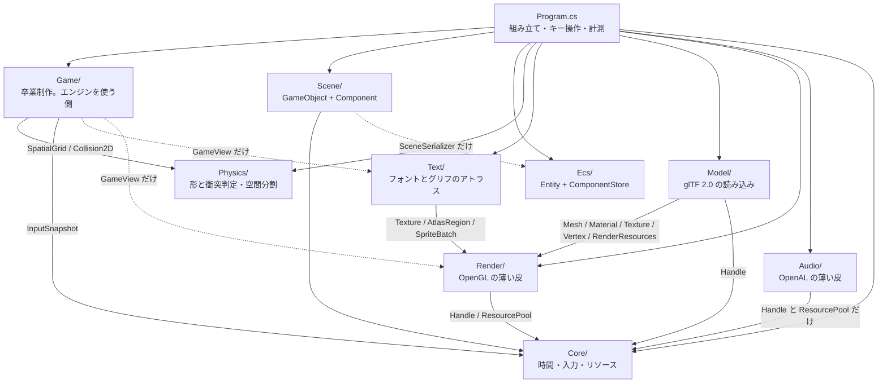

**Day 34 でもクラスの増減は無い**(`SurfaceMaps` は `Render/` の中)。
層が増えないまま機能だけが積み上がるのは、
Day 25 で層を切り分けた配当が続いている、と読める。

**Day 33 でクラスの増減は無かった**(`ShadowMap` は `Render/` の中)。

**Day 32 で `Model/` が1つ増えた**。矢印の向きは変わっていない。

`Model/` は `Text/` とまったく同じ位置に入る——
**`Render/` の上に乗り、`Render/` からは知られていない**一方通行。
`Text/` がグリフを `Texture` に焼いて `SpriteBatch` に積むように、
`Model/` は glTF を `Mesh` と `Material` に変換する。
どちらも「素材の形式を、描画の言葉に翻訳する層」で、性格が揃っている。

**逆向き(`Render` が glTF を知っている)にしなかった**のが要点。
そうすると `Mesh` が「glTF から作られたか、コードで作られたか」を抱え込むことになり、
Day 41 で FBX を足したくなったときに `Render/` を触る羽目になる。
`Primitives`(コードで作る)と `GltfLoader`(ファイルから作る)が
**同じ `Mesh` を作る2つの入口**として並んでいるのが、今の形。

**Day 31 で矢印を1本直した**。層は Day 29 のままだが、
`Core` ⇔ `Render` の相互参照が `Render` → `Core` の一方通行になった——
`ResourceManager` を `Render/RenderResources` へ引っ越したのがそれ(下の「相互参照だった話」)。

`Core/` の中身を実際に調べると、`Silk.NET.OpenGL` を using しているファイルは1つも無い。
**いま `Core/` は本当に時間・入力・ハンドルだけの層**になっている。

後処理は `Render/` の中で閉じている。`PostProcess` が知っているのは
`GL` と `Framebuffer` と `Shader` と `RenderResources` だけで、
**シーンに何が入っているかを一切知らない**。だから
`Program` が「今日はゲームを描く」「今日はデモを描く」と切り替えても、
後処理側は1行も変わらない。

**Day 33 の `ShadowMap` は、この方針をそのまま踏襲している**。
持っているのは深度バッファと光源行列だけで、
「何を影として落とすか」は `Begin` と `End` の間で外から描いてもらう。

```csharp
_shadow.Begin(_lightDirection, _orbit.Target);
// ここで好きなものを _shadow.Draw(mesh, model) する
_shadow.End(width, height);
```

`PostProcess.Begin` / `End` と同じ形にしてあるので、
**「シーンを知らないパス」の作り方が2例そろった**ことになる。
2例あると形が見えてくるのがよいところで、
Day 37 の SSAO も Day 52 の G-Buffer も、この形で足せる。

**これが Render To Texture のいちばんの配当**で、
画面全体に効く処理(影・SSAO・被写界深度・ディファード)は
今後すべてこの位置に差し込むことになる。

**`Game` から `Audio` への線が無い**のが Day 29 から見てほしいところ。
音は鳴るが、鳴らしているのは `Program` で、ゲームは
「弾を撃った」「敵が死んだ」を <c>OnEvent</c> で外へ投げるだけ。

```csharp
public Action<GameEvent, Vector2>? OnEvent { get; set; }
```

こうしておくと、**自己チェックで 600 秒ぶんを無音で回せる**。
`SurvivorGame` が直接 `_audio.Play` を呼んでいたら、
テストのたびにデバイスを開くことになり、
音の出ない環境ではそもそも動かせない。

同じ理由で `SurvivorGame` は `GameView` も知らない。
**状態を進めるものと、状態を見るもの**が分かれている(Day 19 の線)。

| 層 | 依存先 | 備考 |
|---|---|---|
| `Physics/` | **なし** | `System.Numerics` だけ。そのまま別プロジェクトへ持ち出せる |
| `Ecs/` | **なし** | 同上。Day 23 で「他に依存しないので先に5つ書ける」と書いたとおり |
| `Scene/` | `Core`(`InputSnapshot`)、`Ecs`(`SceneSerializer` のみ) | **描画を一切知らない**。`SpriteRenderer` は絵の種類と大きさを持つデータでしかない |
| `Render/` | `Core`(`Handle` / `ResourcePool`) | `RenderResources` が箱を借りる。**GL を触るのは全部この層** |
| `Text/` | `Render`(`Texture` / `AtlasRegion` / `SpriteBatch`) | **一方通行**。`Render` は `Text` を知らない |
| **`Model/`** | `Render`(`Mesh` / `Material` / `Texture` / `Vertex` / `RenderResources`)、`Core`(`Handle`) | **一方通行**。`Render` は glTF を知らない |
| `Audio/` | `Core`(`Handle` / `ResourcePool` **のみ**) | **一方通行**。`Core` は `Audio` を知らない |
| **`Game/`** | `Physics` / `Core`(入力)。描画側だけ `Render` と `Text` | **エンジンは `Game` を知らない**。窓も GL も音も知らない |
| `Core/` | **なし** | Day 31 の引っ越しで一方通行になった(下の「相互参照だった話」) |
| `Program.cs` | 全部 | 組み立て役。7100行あるが、その大半はデモ・計測・自己チェック |

`Game/` の中でも線が引いてある。

| ファイル | 知っていること | 知らないこと |
|---|---|---|
| `GameBalance` | プレイヤー・敵・湧き・経験値の数字 | 全部 |
| `Weapons` | 武器の成長カーブ(レベル → 性能) | ゲームの状態 |
| `UpgradeOption` | 選択肢の中身と、見せる文字 | 適用の仕方 |
| `SurvivorGame` | 形と当たり判定、空間分割、入力、成長 | 描画、音、窓、GL |
| `GameView` | スプライトの積み方、文字の出し方 | ゲームを進める方法(読むだけ) |

**`GameView` が状態を1文字も書き換えない**のは意図的で、
だから描画を丸ごと止めてもゲームは同じように進む。
自己チェックが窓を出さずに回せるのはこの性質のおかげ。

**`Text/` だけが他の層の上に乗っている**。
`Physics/` も `Audio/` も自分で完結していて、単体で別プロジェクトへ持ち出せるが、
`Text/` は `Render/` が無いと成立しない——グリフを置く先が `Texture` で、
積む先が `SpriteBatch` だから。

これは歪みではなく**素直な積み方**で、`Text` → `Render` の一方通行になっている。
逆向き(`SpriteBatch` が文字を知っている)にすると、
描画の中核が「文字とは何か」を抱え込むことになる。
`SpriteBatch` から見れば、文字は**ただの四角**でしかない。

**`Core` と `Render` が相互参照だった話**(Day 25 で見つけ、Day 31 で直した)。

`ResourceManager`(Core)が `Texture`(Render)を作り、
`Material`(Render)が `ResourceManager`(Core)を呼ぶ、という往復になっていた。
名前空間が `HonyaEngine` 1つなので動きはするが、
**アセンブリを分けようとした瞬間に破綻する**形だった。

直し方は Day 25 の設計書に書いたとおりで、
**`ResourcePool` と `Handle` だけを下層に残し、窓口は `Render/` へ上げる**。
Day 31 でそれを実行し、`Core/ResourceManager.cs` は `Render/RenderResources.cs` になった。
名前も変えたのは、中で持っているのが `Texture` と `Shader` だけ——
つまり全部 GL のもので、「全リソースの窓口」という名前が中身と合っていなかったため。

**Day 27 の判断**: 音を足すとき、この歪みを繰り返さないようにした。

音のリソースも「パスをキーにして使い回し、ハンドルで配る」という点でテクスチャと同じなので、
当時の `ResourceManager` に `LoadAudio` を足すのが自然に見える。
だがそうすると `ResourceManager`(= 当時は `Core`)が **GL と OpenAL の両方を握る**ことになり、
当時の相互参照が「`Core` ⇔ `Render` + `Core` ⇔ `Audio`」に増える。

そこで `AudioSystem` は、`Core` から**総称型の `ResourcePool<T>` と `Handle<T>` だけを借りて**、
音のリソースは自分で持つ形にした。`ResourcePool<T>` は `T` が何かを知らないので、
借りても依存が増えない。結果、`Audio/` → `Core/` の**一方通行**が保たれている。

図に描いておくと、こういう判断が「なんとなく」ではなくできるようになる。
**設計書は、次に何かを足すときのために書いている**。

### Core — 時間・入力・リソース

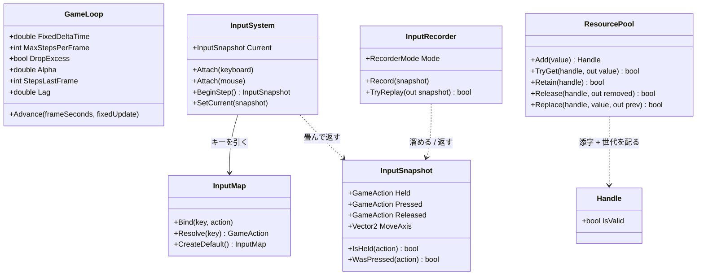

**`ResourceManager` がこの図から消えた**(Day 31 で `Render/RenderResources` へ引っ越した)。
実物は `Render` のクラス図のほうに載せてある。

`ResourcePool` と `Handle` は総称型(`ResourcePool<T>` / `Handle<T>`)。
`T` が何かを知らないまま添字と世代だけを管理するので、`Texture` にも `Shader` にも同じものが使える。
**`T` を知らないから下層に残せた**——引っ越しでこの2つだけ `Core/` に残したのはそのため。

この層で押さえるべき責務の線引き:

- **`GameLoop` は時間しか知らない**。何を更新するかは `Action<float>` で渡される
- **`InputSystem` はデバイスのイベントを畳むだけ**。ゲームとしての意味づけは `InputMap` が持つ
- **`InputSnapshot` は値**。だから記録・再生で丸ごと差し替えられる(Day 20 の肝)
- **`Core/` は GL を1行も知らない**。`Silk.NET.OpenGL` を using しているファイルが無い、が実際の姿

### Render — OpenGL の薄い皮

```mermaid
classDiagram
    class Camera {
        +Vector3 Position
        +Vector3 Target
        +ProjectionMode Mode
        +float AspectRatio
        +Matrix4x4 ViewProjection
        +CreateScreen(width, height) Matrix4x4
    }
    class OrbitCameraController {
        +float Yaw
        +float Pitch
        +float Distance
        +Apply()
    }
    class Shader {
        +Use()
        +SetInt(name, value)
        +SetVector3(name, value)
        +SetVector4(name, value)
        +SetMatrix3(name, value)
        +SetMatrix4(name, value)
        +TryReload() bool
    }
    class Texture {
        +uint Handle
        +int Width
        +int Height
        +bool HasMipmaps
        +FromFile(gl, path) Texture
        +DecodeFile(path) DecodedImage
        +FromPixels(gl, pixels, w, h, mipmaps, srgb) Texture
        +DecodeBytes(encoded) DecodedImage
        +CreateR8(gl, w, h) Texture
        +CreateTarget(gl, w, h, format) Texture
        +CreateDepthTarget(gl, w, h) Texture
        +UploadR8(x, y, w, h, coverage)
        +SetFilter(filter)
        +SetWrap(wrap)
        +Bind(unit)
    }
    class TextureWrap {
        <<enumeration>>
        Repeat
        ClampToEdge
        ClampToBorder
    }
    class RenderResources {
        +int MaxUploadsPerFrame
        +int PendingCount
        +Texture Placeholder
        +LoadTexture(path, mipmaps, srgb) Handle
        +LoadTextureFromMemory(key, bytes, mipmaps, srgb) Handle
        +LoadTextureFromPixels(key, rgba, w, h, mipmaps, srgb) Handle
        +LoadTextureAsync(path) Handle
        +LoadShader(vert, frag) Handle
        +Update()
        +GetTexture(handle) Texture
        +GetShader(handle) Shader
        +Retain(handle) bool
        +Release(handle) bool
    }
    class RenderTargetFormat {
        <<enumeration>>
        Rgba8
        Rgba16F
    }
    class Framebuffer {
        +Texture Color
        +Texture Depth
        +int Width
        +int Height
        +RenderTargetFormat Format
        +long ByteSize
        +CreateDepthOnly(gl, w, h) Framebuffer
        +Bind()
        +BindDefault(gl, w, h)
        +Resize(w, h)
        +SetFormat(format)
    }
    class ShadowMap {
        +bool Enabled
        +int Resolution
        +Framebuffer Target
        +Matrix4x4 LightSpaceMatrix
        +int PcfRadius
        +int TapCount
        +float DepthBias
        +bool SlopeBias
        +bool CullFrontFaces
        +float Radius
        +float WorldPerTexel
        +bool ShowMap
        +int DrawCalls
        +long ByteSize
        +Begin(lightDirection, center)
        +Draw(mesh, model)
        +End(screenWidth, screenHeight)
        +Apply(shader, unit)
        +DrawDebug(screenWidth, screenHeight)
        +SetResolution(resolution)
    }
    class PostProcess {
        +RenderTargetFormat SceneFormat
        +bool BloomEnabled
        +ToneMapOperator ToneMap
        +PostDebugView DebugView
        +float Exposure
        +float BloomThreshold
        +float BloomIntensity
        +int PassCount
        +long ByteSize
        +Begin(clearColor)
        +End(screenWidth, screenHeight)
        +Resize(w, h)
        +ReloadShaders()
    }
    class ToneMapOperator {
        <<enumeration>>
        None
        Reinhard
        Aces
    }
    class PostDebugView {
        <<enumeration>>
        Final
        SceneOnly
        Bright
        Bloom
    }
    class TextureAtlas {
        +Texture Texture
        +FromFiles(gl, paths, padding) TextureAtlas
    }
    class AtlasRegion {
        +Texture Texture
        +Vector2 UvMin
        +Vector2 UvMax
    }
    class Material {
        +string Name
        +Handle Shader
        +Handle MainTexture
        +Vector4 Tint
        +Vector2 UvScale
        +Vector4 BaseColorFactor
        +float MetallicFactor
        +float RoughnessFactor
        +Handle MetallicRoughnessTexture
        +Handle NormalTexture
        +Handle OcclusionTexture
        +Handle EmissiveTexture
        +Vector3 EmissiveFactor
        +float NormalScale
        +Handle HeightTexture
        +float ParallaxScale
        +bool DoubleSided
        +string AlphaMode
        +Apply(resources)
    }
    class Mesh {
        +int VertexCount
        +Draw()
        +ReadVertices() TVertex[]
        +Dispose()
    }
    class Vertex {
        +Vector3 Position
        +Vector2 TexCoord
        +Vector4 Color
        +Vector3 Normal
        +Vector4 Tangent
        +Attributes
    }
    class SurfaceMaps {
        <<static>>
        +int Size
        +float MortarWidth
        +CreateHeight() byte[]
        +CreateNormal(strength) byte[]
        +CreateBaseColor() byte[]
        -HeightAt(x, y) float
        -Noise(x, y, cells) float
        -Wrap(value, period) int
    }
    class SpriteVertex {
        +Vector2 Position
        +Vector2 TexCoord
        +uint Color
        +PackColor(color) uint
    }
    class VertexAttribute {
        +int ComponentCount
        +bool Normalized
        +int ByteSize
    }
    class SpriteBatch {
        +SpriteSortMode SortMode
        +int DrawCallCount
        +Begin(projection, sortMode)
        +Draw(texture, center, size, rotation, color, layer)
        +End()
    }
    class Primitives {
        +CreateQuad(gl) Mesh
        +CreateCube(gl) Mesh
    }

    OrbitCameraController --> Camera : 球面座標で位置を書く
    Material ..> Shader : ハンドル経由
    Material ..> Texture : ハンドル経由
    Mesh ..> VertexAttribute : ストライドとオフセットを組む
    Vertex ..> VertexAttribute
    SpriteVertex ..> VertexAttribute
    Mesh ..> Vertex : 型引数
    Primitives ..> Mesh : 作る
    TextureAtlas *-- AtlasRegion
    TextureAtlas *-- Texture : 1枚に詰める
    SpriteBatch --> Shader
    SpriteBatch ..> SpriteVertex : 積む
    SpriteBatch ..> AtlasRegion : UV を受け取る
    Framebuffer *-- Texture : 描き込み先として所有
    Framebuffer ..> RenderTargetFormat
    Texture ..> TextureWrap
    PostProcess *-- Framebuffer : 4枚
    PostProcess ..> Shader : 明部 / ぼかし / 合成
    PostProcess ..> ToneMapOperator
    PostProcess ..> PostDebugView
    PostProcess ..> RenderResources : シェーダを借りる
    ShadowMap *-- Framebuffer : 深度専用を1枚
    ShadowMap ..> RenderResources : シェーダを借りる
    ShadowMap ..> Camera : 正射影行列を借りる
    ShadowMap ..> Shader : 深度 / 表示
    RenderResources ..> Texture : 作る / 配る
    RenderResources ..> Shader : 作る / 配る
    SurfaceMaps ..> RenderResources : 焼いたバイト列を預ける
```

**Day 28 で `Texture` に足したのは2つだけ**。
`CreateR8` が1チャンネルの空テクスチャを作り、`UploadR8` がその一部を書き換える。
どちらもグリフのために足したものだが、**`Texture` はグリフを知らない**——
「1チャンネル」「一部だけ更新」という一般の機能として置いてある。
同じものが Phase 6 のシャドウマップ(Day 33)でも要る。

**Day 32 で `Vertex` に法線が戻った**。Day 9 でソフトウェアラスタライザに持たせ、
Day 14 で GPU へ移したときに落としていたもの。陰影を付けていなかったので要らなかったが、
glTF のモデルは必ず持っているので、**無いと読んだデータの一部を捨てることになる**。

**末尾に足した**ので location は 0〜2 が動かず、既存のシェーダは無傷で済んだ。
位置の次に置くほうが意味の並びとしては素直だが、
そのために `sprite.vert` まで書き換える理由は無い。

**Day 34 で接線が同じやり方で足された**(location 4)。
2回続けて末尾に足せたので、この置き方は当たりだったと言える。
1頂点 64 バイトになり、DamagedHelmet で 930KB。

**`Vector4` なのは glTF の仕様に合わせたから**で、
w には ±1 しか入らない(要点3)。
「3本目の軸を持たずに済ませるための符号1個」がそのままフィールドになっている。

**`depth.vert`(Day 33)は無傷**なのも見どころ。
あちらは location 0 しか宣言していないので、
属性が4本になろうと5本になろうと影響を受けない。
**宣言しない自由**があるから、末尾に足す戦略が効き続けている。

**`SurfaceMaps` が GL を1行も知らない**のが、この層で新しい置き方。
返すのはただの `byte[]` で、テクスチャにするのは `RenderResources` の仕事になる。

```
SurfaceMaps.CreateNormal()  →  byte[]  →  RenderResources.LoadTextureFromPixels()  →  Handle
```

分けてあるので**スレッドを選ばない**(Day 21 の `Texture.DecodeFile` と同じ性質)。
起動時に3枚焼くだけなので今は同期でよいが、
枚数が増えたらそのまま `Task.Run` へ載せられる形になっている。

`Texture.FromPixels` を直接呼ばずに窓口を通すのは、
**寿命の管理とキャッシュを1箇所に残す**ため。
ここを通さずに `new` すると、そのテクスチャだけ `Dispose` の対象から外れる。

**`Mesh.ReadVertices` は「持たない」ほうへ倒した結果**(Day 34)。
自己チェックで頂点の中身を見たいが、CPU 側に控えを持つと
DamagedHelmet だけで 930KB を**使うかどうか分からないのに常に払う**。
GPU から読み返す(`glGetBufferSubData`)なら払うのは呼んだときだけで済む。
代わりに**遅い**(描画キューが空になるまで待つ)ので、検査専用の窓口になっている。

当たり判定やレイキャストで頂点が要り用になる Phase 7 で、
「持つ」へ倒し直すことを考えればよい。

**`Material` が急に太った**のが Day 32 でいちばん目に付く差分で、
これは glTF の材質定義をそのまま写したから。
「シェーダ + そのシェーダに渡す値」という Day 15 からの位置づけは変わっていない——
渡す値の種類が、仕様に合わせて増えただけになる。

**Day 31 で足したのは `CreateTarget` 1つ**。同じ理屈で、
`Texture` は「これがレンダーターゲットである」ことを知らない。
中身を渡さずに場所だけ確保し、ミップマップを作らず、ClampToEdge にする——
それだけの機能として置いてあるので、
影(Day 33)でも環境マップ(Day 36)でも G-Buffer(Day 52)でも同じものが使える。

**Day 33 で足したのは `CreateDepthTarget` 1つ**。
`CreateTarget` との違いは3つとも影のための必然になっている。

| | `CreateTarget`(Day 31) | `CreateDepthTarget`(Day 33) |
|---|---|---|
| 内部形式 | RGBA8 / RGBA16F | **DepthComponent24** |
| フィルタ | Linear | **Nearest**(深度を平均しても意味が無い。要点6) |
| ラップ | ClampToEdge | **ClampToBorder + 白**(箱の外は「遮るものなし」) |

`Texture` が「これがシャドウマップである」ことを知らないのは同じで、
Day 37 の SSAO が深度を読むときも、そのまま同じものが使える。

**`Framebuffer` が3つ目の形を持った**。
Day 31 の「カラーテクスチャ + 深度レンダーバッファ」に加えて、
**カラーを1枚も持たない**形が入った。
`Depth` プロパティが深度専用のときだけ入るので、
**「読むならテクスチャ、読まないならレンダーバッファ」の区別がそのまま型に出る**。

**`ShadowMap` が `Camera` を借りている**のが、この層で新しい関係。
光の正射影行列は `Camera.CreateOrthographic` がそのまま使える——
「カメラ」という名前だが中身は**投影行列の作り方の置き場**なので、
光の目に使っても筋が通る。Day 14 で `static` メソッドとして切り出しておいた形が効いた。

**`Framebuffer` が `Texture` を所有している**のは、今までの `Render/` に無かった関係。
`Material` は「持たない(ハンドルだけ)」で通してきたが、
フレームバッファのカラーアタッチメントは
**そのフレームバッファと同じ大きさ・同じ形式でなければならない**ので、
外から差し替えられると壊れる。**所有すべきものは所有する**。

**`PostProcess` と `ShadowMap` はシェーダだけ `RenderResources` に預けている**。
バッファ(4枚 / 1枚)は自分で持ち、シェーダは借りる——
シェーダは F5 でリロードしたいので、管理の窓口に載せておく必要がある。

**バッファを所有し、シェーダを借りる**——この分担が2クラスで一致しているのは偶然ではなく、
「大きさや形式に強い制約があるものは所有、共有して使い回すものは借りる」という
Day 21 からの線がそのまま出ている。

**`Material` が何も所有していない**のは Day 15 から一貫している(Day15.md の要点2)。
持っているのはハンドルだけで、実体の寿命は `RenderResources` にある。

**3D の道(`Mesh` + `Material`)と 2D の道(`SpriteBatch`)が並列**なのも見てのとおりで、
両者は `Shader` と `Texture` を共有しているだけで互いを知らない。
`Mesh` は「形が決まっていて毎フレーム変わらないもの」、
`SpriteBatch` は「毎フレーム頂点を作り直すもの」という使い分けになっている。

### Scene — GameObject + Component

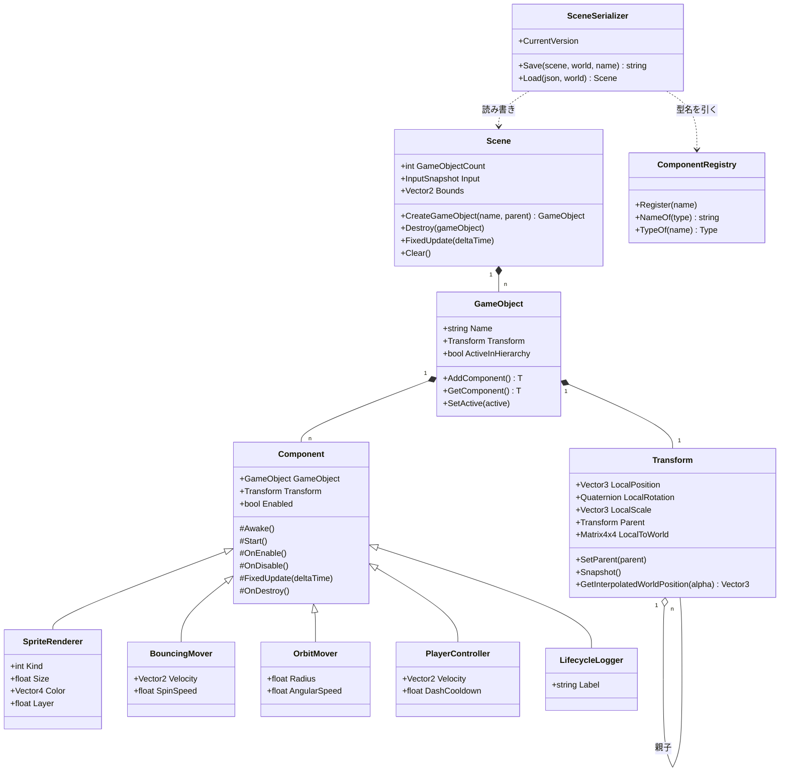

`Transform` だけが `GameObject` の固定メンバーで、ほかは全部 `Component` として付け外しする
(Day 22 の要点2)。`SceneSerializer` が `ComponentRegistry` を経由するのは、
**JSON の文字列から直接 `Type` を作らせない**ため(Day 24 の要点2)。

### Ecs と Physics — どこにも依存しない2つ(今日 `Physics` が増えた)

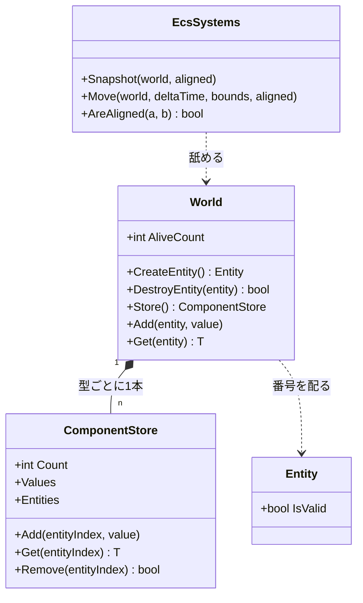

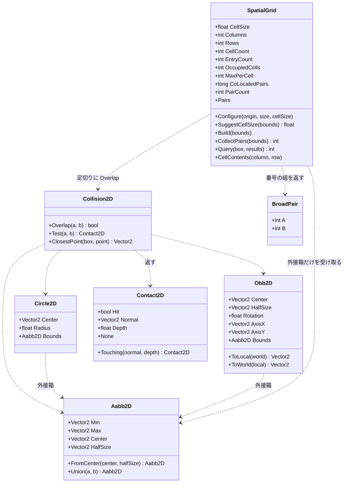

**形は全部 `readonly struct`、判定は `static` メソッドだけ**。状態を持たないので、
どのスレッドから何回呼んでも同じ答えが返る。Day 26 で空間分割を入れたとき、
この性質のおかげで**判定そのものには一切手を入れずに済んだ**——
`Collision2D.cs` と `Shapes2D.cs` の差分は 0 行になっている。

**Day 29 で足したのは `Query` だけ**。
`CollectPairs` が「全部の組」を返すのに対して、
`Query` は「この箱の近くにいるもの」を返す。
1回組んだ格子を、**総当たりの置き換え**としても
**単発の近傍探索**としても使えるようになった——
卒業制作では同じ格子を1ステップに4通りで使っている。

`SpatialGrid` だけが唯一 `class`(参照型)で、しかも状態を持つ。
配列を4本(`_cellStart` / `_cursor` / `_entries` / `_mark`)使い回すためで、
**毎フレーム作り直しても割り当てが起きない**ようにするにはこうするしかない。
そのぶん「1つのインスタンスを複数スレッドから同時に使えない」という制約が付く。
状態を持つと何が失われるかが、同じフォルダの中で見比べられる形になっている。

矢印の向きにも注目してほしい。**`SpatialGrid` から `Body` への線が無い**。
受け取るのは `ReadOnlySpan<Aabb2D>`、返すのは番号の組だけで、
速度も形も質量も知らない。この細さのおかげで、
Day 46 の 3D 版は `Aabb2D` を `Aabb3D` に変えるだけで済む。

### Audio — OpenAL の薄い皮

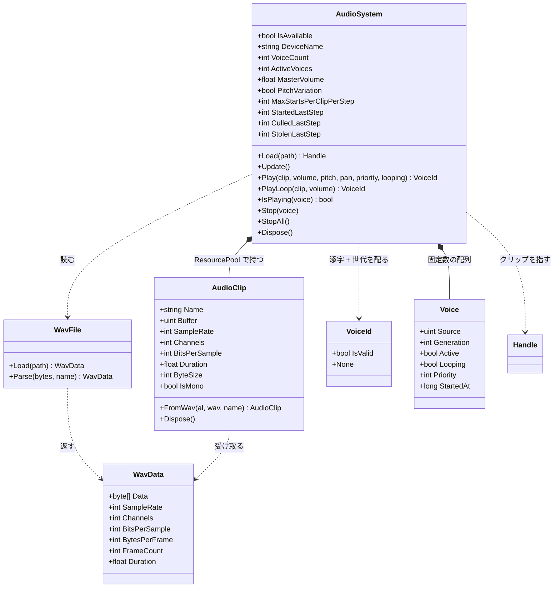

`Voice` は `AudioSystem` の中の `private struct`。外からは `VoiceId` 越しにしか触れない。

この層で押さえるべき線引きは3つ。

- **`WavFile` は OpenAL を知らない**。ただのバイト列パーサなので、
  ファイルが無くてもメモリ上のバイト列で試せる(自己チェックがそうしている)
- **`AudioClip` はデータ、`Voice` は再生**(要点2)。
  `Texture` と `Material`、`Mesh` と描画呼び出しと同じ分け方
- **`VoiceId` は `Handle<T>` と同じ構造**(添字 + 世代)だが**別の型**。
  `Handle<T>` は `ResourcePool<T>` のためのもので、ボイスはプールではないので流用しない。
  同じ手口を別の場所で使い直している、と読むのが正しい

### Text — Render の上に積む層

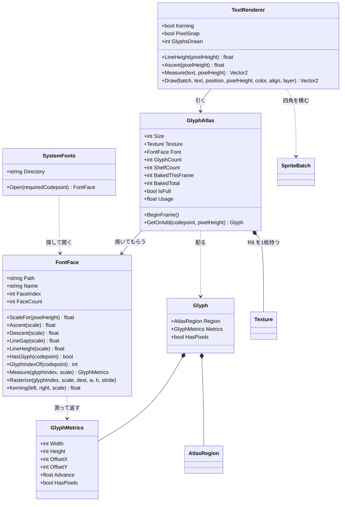

4つのクラスが、**それぞれ1つのことしかしない**ように切ってある。

| クラス | 知っていること | 知らないこと |
|---|---|---|
| `SystemFonts` | どこにフォントがあるか | 描き方 |
| `FontFace` | フォントの中身(寸法とアウトライン) | GL、アトラス、レイアウト |
| `GlyphAtlas` | どこに置いたか、何を焼いたか | 文字の並べ方 |
| `TextRenderer` | 並べ方(送り・行送り・整列) | フォントの中身、GL |

この切り方の値打ちは、**差し替えたときにどこまで壊れるか**で分かる。
SDF に変える(改造課題3)なら `GlyphAtlas` と `text.frag` だけが変わり、
`TextRenderer` は 1 行も触らない。
フォントフォールバックを入れる(改造課題2)なら `FontFace` を複数持つだけで、
`GlyphAtlas` の棚詰めには影響しない。

**`GlyphMetrics` が `FontFace` と `TextRenderer` の共通語**になっている。
「原点からどれだけずらして、次にどれだけ進むか」——
この5つの数字さえあれば、フォントの実装が何であれ字を並べられる。

### Model — glTF を描画の言葉へ翻訳する層

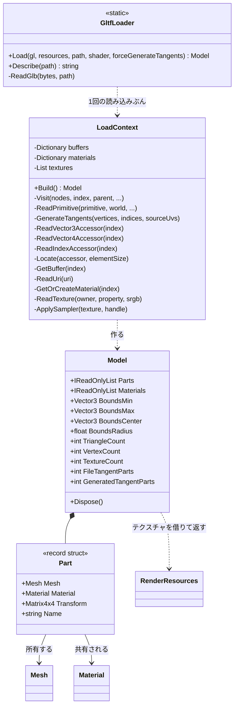

**Day 34 で `GenerateTangents` が入った**。ここに置いたのは、
**接線が「読み込みの一部」だから**——ファイルにあれば読み、無ければ作る、という
同じ場所で決まるべき話になる。

`Render/` 側(たとえば `Mesh` のコンストラクタ)で作る手もあるが、
そうすると `Mesh` が UV の反転規約(Day 32)を知る必要が出てくる。
**規約を知っているのはローダだけ**という線を守ると、置き場所は自然にここになる。

`Model` が接線の出どころ(ファイル / 生成)の数を持つのは、
**HUD と自己チェックで区別を出すため**。
「法線マップが効かない」の原因の筆頭がここなので、
数を見えるところに出しておく価値がある。

**`LoadContext` を切り出したのは、引数が増えすぎたから**。
`gl` / `resources` / `path` / `directory` / `root` / `embedded` / `shader` の7つを
静的メソッド間で渡し回すと、どの関数も先頭3行が引数の受け渡しになる。
**読み込み1回ぶんの寿命を持つ入れ物**にまとめると、
buffer のキャッシュとマテリアルの使い回しも自然にそこへ収まる。

**`Model` が木ではなく平らな一覧を持つ**のが設計の分かれ目。
glTF の中身はノードの木だが、**静的なモデルに階層は要らない**——
読み込み時に根から行列を掛け合わせて世界行列を確定させてしまえば、
描くときは順に回すだけになる。

木のまま持つべきなのは、あとから関節を動かす場合(スキニング。Day 41)。
そのときは `Model` に木を残す形へ戻すことになるが、
**要るまで持たない**ほうが今は読みやすい。

**`Model` が `RenderResources` を握っている**のは、
テクスチャの参照カウントを返すため(Day 21 の要点3)。
`Mesh` は自分で作ったので所有するが、テクスチャは借り物なので返す必要がある。
ここを忘れると、モデルを切り替えるたびに 2K テクスチャが数枚ずつ残り、
**絵は正しいのに VRAM だけ増え続ける**。
自己チェックの最後の1行(「全部畳んだらテクスチャの数が元に戻る」)は、これを見ている。

### glTF を1体読むまで — 3段の間接参照とノードの木

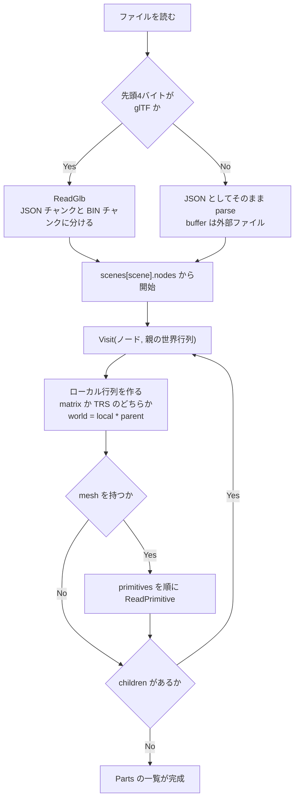

ノードの処理は**行列を掛けながら降りるだけ**で、Day 22 の `Transform` と同じ話。
違うのは、こちらは**降り切った時点で結果を確定させてしまう**こと。

プリミティブ1個を頂点配列にするところが、glTF のいちばん機械的な部分になる。

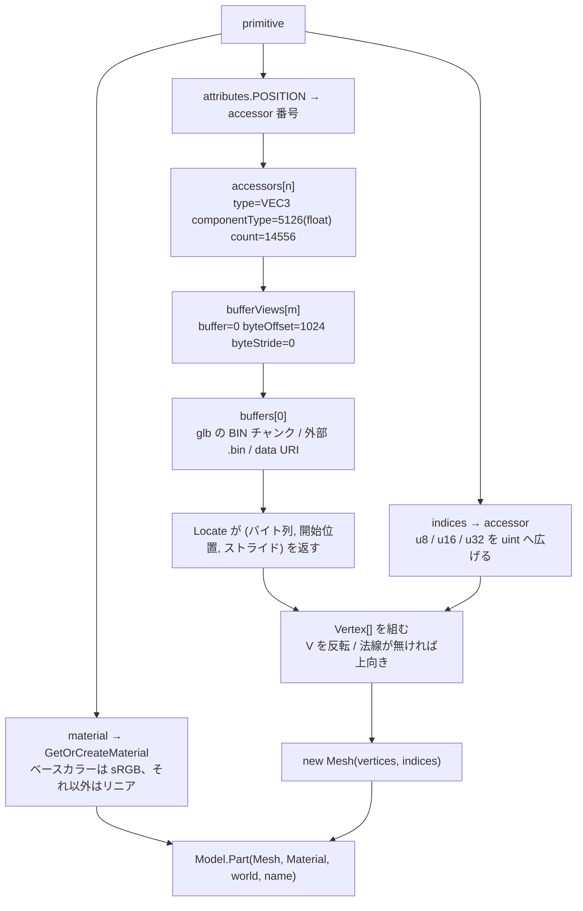

**`byteStride` が肝**。glTF は「位置・法線・UV を1頂点ずつ交互に並べる」書き方も許していて、
その場合 `bufferView` に `byteStride` が入る。0(または未指定)なら詰めて並んでいる。

これを無視して「詰めて並んでいる」と決め打ちしても、
**今日の4体は全部 stride 無しなので動いてしまう**。
つまり「動いたから正しい」が言えない類の分岐で、
仕様を読んでいないと存在にすら気づかない。

**`accessor` を経由する意味**は、1本のバイト列を複数の意味で切り出せること。
位置と法線と UV が同じ `buffer` に同居し、
それぞれの `bufferView` が違う範囲を指す。
OBJ が「v の配列」「vt の配列」を別々のテキスト行として持っていたのに対し、
glTF は**メモリ上の並びをそのまま記述している**ので、読み込み後の組み直しが要らない。

### Game — エンジンを使う側

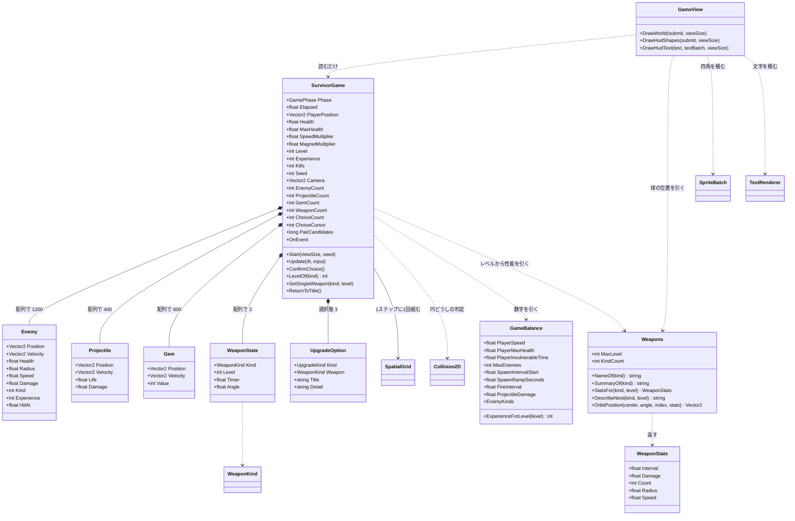

**`WeaponState` が3つのフィールドしか持っていない**のが Day 30 の設計の要。
威力も間隔も個数も持たず、`Weapons.StatsFor(kind, level)` が
**レベルから計算して返す**。

```
状態として持つもの   … 種類・レベル・タイマー・角度
状態から決まるもの   … 威力・間隔・個数・半径・速度
```

分けておくと、成長カーブを触るときに `StatsFor` の1箇所で済む。
逆に `WeaponState` に威力を持たせると、
レベルアップのたびに「どの数字をいくつ足すか」があちこちに散らばる。

**`GameView` から `Weapons` への線**にも意味がある。
オービットの球の位置は当たり判定と絵の両方が要るので、
`Weapons.OrbitPosition` という1つの式を両方から呼ぶ。
別々に書くと、**見えているところと当たるところがずれる**——
しかもずれは小さいので、しばらく気づかない。

**`Enemy` / `Projectile` / `Gem` が `struct`** なのが要点。
1200 体ぶんの参照を辿ると、メモリ上ばらばらの場所を読むことになる
(Day 22 で実測した 17 倍がこれ)。構造体の配列なら、
更新ループは連続したメモリを頭から舐めるだけで済む。

**Day 23 の ECS は使っていない**。
ECS が効くのは「部品の組み合わせが実行時に変わる」ときで、
今日のように<b>敵は敵、弾は弾と決まっている</b>なら、
種類ごとに配列を1本持つほうが素直で速い。
Day 23 で「ECS は構造体の配列の一般化」と書いたが、
**一般化が要らない場面では特殊形のままでよい**——
これは ECS が無駄だったという話ではなく、
<b>どちらを選ぶかを判断できるようになった</b>という話になる。

`GameBalance` に矢印が集まっているのも意図したもの。
遊んで気になったことは全部ここを触ることになるので、
**数字がコードの中に散らばっていると調整が苦行になる**。

### 1フレームの流れ

Silk.NET のウィンドウから `OnUpdate` と `OnRender` が交互に呼ばれる。
**状態を変えるのは `OnUpdate` 側だけ**、というのが Day 19 で引いた線。

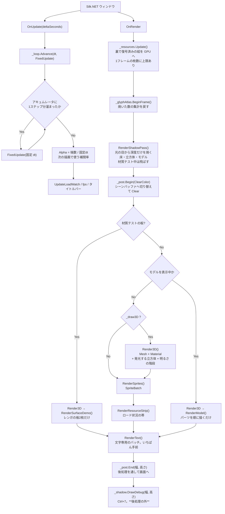

**Day 33 で先頭に1パス増えた**。`RenderShadowPass` が
`_post.Begin` より前に来るのは、**画面にもシーンバッファにも描かない**から。
行き先はシャドウマップで、後処理とはまったく別の道になる。

**`DrawDebug` は後処理の外**に置いてある。
シャドウマップの表示は「見たままの値」であってほしいので、
露出やトーンマップを通してはいけない。
HUD の文字が後処理を通ってしまう(下の弱点)のとは、扱いを分けた。

**Day 29 で分岐が1つ増えた**。ゲームモード(Enter)のときは
`Render3D` も `RenderSprites` も `RenderResourceStrip` も通らず、
`RenderGame()` だけになる。
デモの重い部分を裏で回したまま遊ぶと、
「ゲームが重い」のか「デモが重い」のか分からなくなるため。

**`RenderText` がいちばん最後**なのは、UI が何よりも手前に出るものだから。
バッチが別なのは、シェーダが違うため——
グリフのアトラスは1チャンネルなので `sprite.frag` では真っ黒になる。
**バッチは「同じ設定で描けるものをまとめる」仕組み**なので、
シェーダが違えば別のバッチになるのは定義どおりの帰結。

`OnRender` の先頭で `_resources.Update()` を呼ぶのが要点で、
**GL は描画スレッドからしか触れない**ため、裏で復号し終えた画素をここで GPU に上げている
(Day 21 の要点5・6)。

**Day 34 でまた分岐が1つ増えた**。材質テストの板(Alt+5)を出している間は、
モデルもデモも出さない。理由は Day 32・33 と同じで、
**重ねると、どの陰影がどこから来ているのか分からなくなる**。

分岐が3段になったのは、**デモが増えるたびに「それだけを見せる」を選んできた**結果。
「全部同時に出す」ほうがコードは短いが、学習用としては
1つずつ切り分けて見られるほうが値打ちがある、という判断が積み重なっている。

**Day 32 で分岐が1つ増えた**。モデルを表示している間は、
スプライトの群れも明るさの階段も出さない。
ゲームモード(`_playing`)で同じことをしているのと理由も同じで、
**重ねると、どちらの陰影を見ているのか分からなくなる**。
Day 31 までのデモは `Shift+0` を「モデル無し」まで回すと戻る。

**Day 31 で `Clear` が `_post.Begin` に変わった**。
`Begin` と `End` の間にあるコードは1行も変わっていない——
`Clear` の代わりにフレームバッファを差し替えるようになっただけで、
`Render3D` も `RenderSprites` も `RenderText` も「自分がどこへ描いているか」を知らない。

そのぶん**UI もトーンマップを通ってしまう**。露出を上げれば HUD の文字も白飛びする。
実際のエンジンは後処理のあとに UI を描くが、ここでは
「画面に出るものが全部1本のパイプラインを通る」形をまず見ることを優先した。
分けるのは Day 38(カラーグレーディング)で扱う。

### 影が1枚出るまで — 2つのパスと、5つの落とし穴

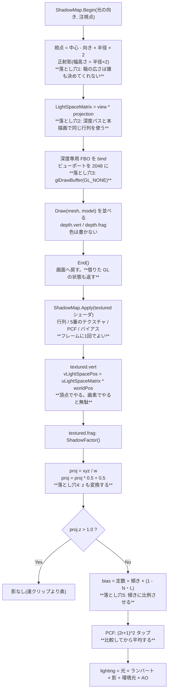

**落とし穴が5つとも「絵からは原因が読めない」**のが、影を難しくしている。

| 落とし穴 | 症状 | 見分け方 |
|---|---|---|
| 1. 箱が広すぎ/狭すぎ | ギザギザ / 画面の端で影が消える | HUD の `cm/tx` を見る |
| 2. 行列がずれる | 影が丸ごとずれる | `Ctrl+7` でマップは焼けているのに合わない |
| 3. `glDrawBuffer` 忘れ | 影がまったく出ない | **例外が出る**(完全性チェック。Day 31 の配当) |
| 4. `z` を変換し忘れ | 全部影 / まったく影なし | `Shift+9` を8回で係数を見ると一目 |
| 5. バイアス無し/過多 | 縞模様 / 影が浮く | `Ctrl+4` で 0 と 0.006 を往復する |

**3 だけが例外で教えてくれる**。残り4つは「影がおかしい」としか分からないので、
`Ctrl+7`(マップを見る)と `Shift+9`×8(係数を見る)の2つを先に作っておく。
デバッグ表示は本体より先に書いてよい類のもので、
今日はそれが**キー2つで済む**ところまで来ている。

### 接空間ができるまで — CPU とシェーダにまたがる1本の道

法線マップが1枚効くまでに、**4つの場所**を通る。
どこか1つでも規約がずれると、絵は出るが凹凸だけがおかしくなる。

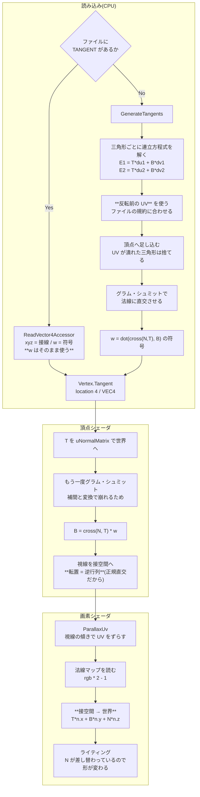

**規約が食い違いやすい場所が4つある**。どれも絵は出るので、間違いに気づきにくい。

| 場所 | 間違えると | 気づき方 |
|---|---|---|
| UV の V を反転したときの `w` | **凹凸が全部裏返る** | 出っ張りが出っ張って見えるか |
| 生成に使う UV(反転前 / 後) | **モデルによって効いたり効かなかったり** | ファイル有りと無しで見比べる |
| 法線マップの緑の流儀 | 凹凸が裏返る(上と同じ症状) | `Alt+8` でわざと再現できる |
| `cross(N, T)` の順序 | 従接線が逆を向く | 自己チェックの「V の増える向きと一致」 |

**症状が全部同じ**(凹凸が裏返る)なのが厄介なところで、
だから今日の自己チェック(Alt+0)は
「立方体の6面すべてで `cross(N,T)*w` が V の向きと一致するか」を見ている。
**手で答えが書ける形**で1つ確かめておくと、切り分けの起点になる。

### HDR パイプラインの中身 — 10 回のフルスクリーンパス

`_post.End()` の中で何が起きているか。**入力と出力を全部書き出す**と、
ping-pong の必然性がそのまま見える。

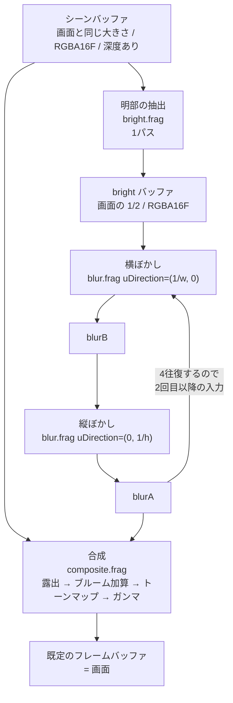

パスの数は **1(明部)+ 4×2(ぼかし)+ 1(合成)= 10**。
画面に出ている `パス:10` はこれを数えている。

**なぜ `blurA` と `blurB` の2枚が要るのか**。
GPU は「同じテクスチャを読みながら同じテクスチャへ書く」ことを許さない
(読み書きの順序が保証されないので結果が未定義になる)。
だから横ぼかしの結果を別の場所に置き、それを読んで縦ぼかしを書く、を繰り返す。
これが ping-pong で、後処理を書き始めると必ず最初にぶつかる制約になる。

**`bright` を `blurA`/`blurB` と別に持っている**のは、
中間バッファの表示(Shift+4)で「ぼかす前の明部」を見たいから。
表示のためだけに 1/2 サイズのバッファ1枚(1920x1080 なら 4MB)を払っている。
本番用に絞るなら、`bright` を捨てて `blurA` に直接書けば1枚減らせる。

**バッファの大きさが2種類ある**ことにも意味がある。

| バッファ | 大きさ | 形式 | 深度 | なぜ |
|---|---|---|---|---|
| scene | 画面と同じ | RGBA16F | あり | 3D を描くので深度が要る。原寸でないと絵がぼける |
| bright / blurA / blurB | 画面の 1/2 | RGBA16F | **なし** | **ぼかしたものを縮めても分からない**。板1枚なので深度も要らない |

半分にするとピクセル数が 1/4 になり、ぼかし 8 パスのコストがそのまま 1/4 になる。
おまけに「縮めて拡大する」こと自体が弱いぼかしとして働くので、
同じタップ数でより広く滲む。**質を落とさずに 4 倍安くなる**、後処理では珍しく素直な最適化。

### FixedUpdate の中身 — 入力の出どころと3つのバックエンド

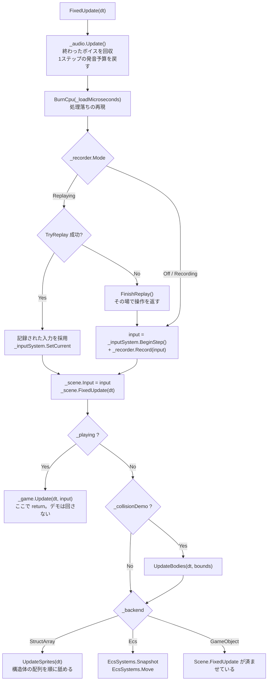

**音の後始末を先頭に置いた**のは、音を要求するのがこの下だから。
予算を戻す場所と使う場所を近くに置くと、「いつリセットされるのか」を追う必要がなくなる。
描画側(`OnRender`)に置くと、シミュレーションが 5Hz のときに
「1フレームに複数ステップぶんの音が要求されるのに予算は 1 回ぶん」というずれが起きる。

**入力がどこから来たかを、この関数から下は誰も気にしない**のがポイント(Day 20 の要点1)。
`InputSnapshot` という値に畳んであるので、記録の再生と実操作を1行で差し替えられる。

`Scene.FixedUpdate` を `_backend` の分岐より前で必ず呼んでいるのは、
**プレイヤーと階層の実演がどのモードでも Scene 側にいる**ため。

### Scene.FixedUpdate の4段階

順番に意味がある。入れ替えると壊れる。

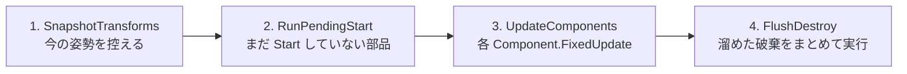

| 段 | なぜその位置か |
|---|---|
| 1 | **動かす前**に控えないと、補間の始点が終点と同じになって補間が効かない |
| 2 | `Start` の中で新しいオブジェクトが生まれるので、**開始時点の件数だけ**回す |
| 3 | ここも開始時点の件数で止める。このステップで生まれたものは次のステップから |
| 4 | 更新中にリストから消すと**走査中のインデックスがずれる**(Day 22 の要点5)。<br/>まとめて `RemoveAll` するのは、1個ずつ消すと O(n^2) になるため |

### 非同期テクスチャロードの流れ

`Q` キーで走る道。**GL を呼ぶ部分と呼ばない部分の境目**が、
そのままスレッドの境目になっている(Day 21 の要点5)。

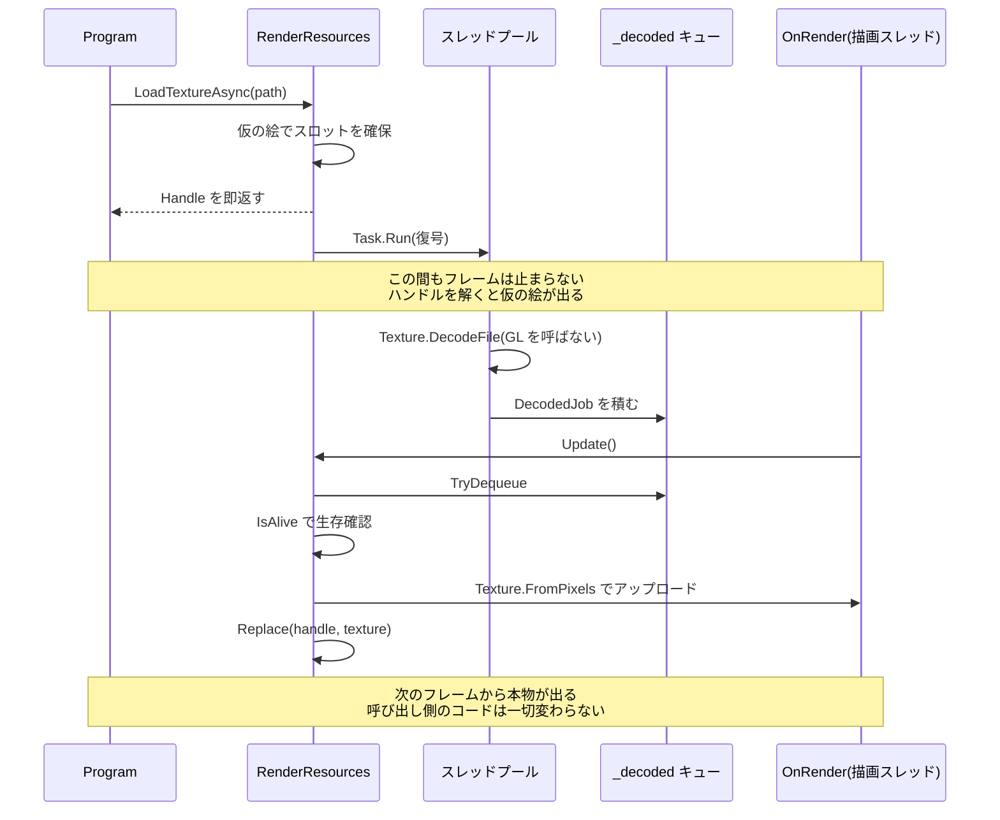

`Update()` が `MaxUploadsPerFrame` で枚数を絞っているのが肝で、
**復号を非同期にしても、アップロードをまとめてやるとそこでカクつく**(Day 21 の要点6)。

### 衝突判定の3段 — ブロードフェーズが割り込んだ

Day 25 の `UpdateBodies` は「動かす → 総当たり → 押し戻す」の3段だった。
今日、真ん中が**「組を絞る」と「絞った組を判定する」に割れる**。

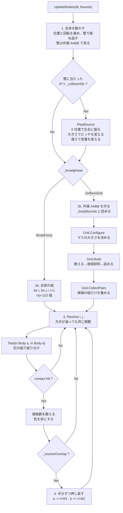

発音の要求が**移動の段にある**ことに注意。
「壁に当たった」はブロードフェーズの外で分かることなので、
組の絞り込みとは無関係にここで出る。
体どうしの接触音を鳴らすなら `Resolve` の中になるが、
2000 体で 7,425 組が接触しているので**要求だけで 7,425 回**になる。
要点3の 7.3μs を掛けると 54ms。今日は壁だけにしてある。

図で見てほしいのは**2つの経路が `Resolve` で合流している**ところ。
方式ごとにナローフェーズを書き分けると、
「答えが違う」となったときに原因がブロードフェーズなのか判定なのか分からなくなる。
合流させておけば、**違いが出たら必ず組の選び方が原因**と言い切れる。
`F12` の自己チェックが「接触数が一致」だけで意味を持つのはこの形のおかげ。

もうひとつ、**押し戻し(4段目)がグリッドの構築より後にある**ことに注意。
押し戻すと位置が動くので、ステップの頭で組んだ格子は少しずつ古くなる。
押し戻し量は 1 ステップぶんの重なりぶんしかないので実用上は問題にならないが、
厳密にやるなら「判定を全部済ませてから、まとめて押し戻す」形にする。
Phase 7 のインパルス解決がその形になる。

### 均一グリッドの中身 — 2つの関数しかない

`SpatialGrid` の公開メソッドは実質 `Build` と `CollectPairs` の2つだけ。
中で何が起きているかは、コードを読むより図のほうが早い。

```mermaid
flowchart TD
    subgraph B["Build(bounds) — 格子を組む"]
        B1["パス1: 数える<br/>各体の AABB が触れるマスに +1<br/>_cellStart[cell+1]++"]
        B2["パス2: 接頭辞和<br/>個数を開始位置に変える<br/>_cellStart[c] += _cellStart[c-1]"]
        B3["パス3: 詰める<br/>もう一度なめて _entries へ書く<br/>書き込み位置は _cursor が持つ"]
        B1 --> B2 --> B3
    end

    subgraph C["CollectPairs(bounds) — 候補を集める"]
        C1["体 i について<br/>stamp = ++_stamp"]
        C2["i が触れるマスを順に見る"]
        C3{"j > i ?"}
        C4{"_mark[j] == stamp ?"}
        C5["_mark[j] = stamp<br/>同居 1 組と数える"]
        C6{"AABB が重なる ?"}
        C7["_pairs に積む"]
        C1 --> C2 --> C3
        C3 -->|No| C2
        C3 -->|Yes| C4
        C4 -->|Yes| C2
        C4 -->|No| C5 --> C6
        C6 -->|No| C2
        C6 -->|Yes| C7 --> C2
    end

    B3 --> C1
```

3つの絞りが直列に並んでいるのが分かる。

| 絞り | 落とすもの | 4000 体での実測(マス 32px) |
|---|---|---|
| 格子 | 別のマスにいる組 | 7,998,000 → 72,527 |
| `j > i` と印 | 同じ組の重複 | (上の数に含まれる) |
| AABB | 同じマスだが離れている組 | 72,527 → 24,733 |

**最後の AABB がまだ 3 分の 1 に減らしている**のが面白いところで、
「同じマスにいる」は「近い」でしかない。
7.4ns の AABB 判定を挟むことで、24〜120ns のナローフェーズを 5 万回節約している。

`j > i` の条件だけでは重複が消えないことは、実際に印を外すと確かめられる
(自己チェックの「重複した組が無い」が落ちる)。

`Test(in Body, in Body)` の中身は形の組み合わせ表そのもの。**3種類で6通り**になる。

| a \ b | Circle | Box | RotatedBox |
|---|---|---|---|
| **Circle** | `Test(Circle, Circle)` | `Test(Circle, Aabb)` | `Test(Circle, Obb)` |
| **Box** | 上を**符号反転** | `Test(Aabb, Aabb)` | OBB 同士へ寄せる |
| **RotatedBox** | 上を**符号反転** | OBB 同士へ寄せる | `Test(Obb, Obb)` SAT |

- **専用の速い経路**(AABB 同士、円同士)と**一般形**(OBB 同士の SAT)を併存させ、
  組み合わせの穴は一般形で埋める。`F9` の自己チェックで**両者の答えが一致すること**を確認している
- 引数の順が逆になる組(`Test(Box, Circle)`)は**法線の符号を反転**して返す。
  ここを間違えると物体がめり込む方向へ押される(要点6)
- 種類を1つ足すと表が1行1列増える。3D で球・箱・カプセル・平面・地形と並べると 15 通りになり、
  **その表を埋めることが物理エンジンを書くこと**になる(Phase 7)

### 音を1発鳴らすまで — 3つの関門

`Play` を呼んでから実際に音が出るまでに、3回ふるいにかけられる。
**呼んだのに鳴らないことは普通に起きる**ので、どこで落ちたかを数えられるようにしてある。

```mermaid
flowchart TD
    S["Play(clip, volume, pitch, pan)"] --> A{"IsAvailable ?"}
    A -->|No| N1["VoiceId.None<br/>音の出ない環境。例外は投げない"]
    A -->|Yes| B{"クリップは生きている ?"}
    B -->|No| N2["VoiceId.None"]
    B -->|Yes| C{"このステップで<br/>同じクリップを<br/>上限まで鳴らした ?"}
    C -->|Yes| N3["間引き<br/>CulledLastStep++"]
    C -->|No| D["AcquireVoice(priority)"]
    D --> E{"空きがある ?"}
    E -->|Yes| G["ボイスを設定する<br/>Buffer / Gain / Pitch / Position"]
    E -->|No| F{"奪える相手がいる ?<br/>ループ以外で<br/>優先度が自分以下"}
    F -->|No| N4["諦める<br/>CulledLastStep++"]
    F -->|Yes| ST["いちばん低い優先度<br/>同点なら最古を止める<br/>StolenLastStep++"]
    ST --> G
    G --> H["alSourcePlay<br/>7.3us かかる"]
    H --> I["VoiceId を返す<br/>添字 + 世代"]
```

**「諦める」が2箇所ある**のが要点。
間引き(`C`)は「同じ音が多すぎる」で落とし、
`F` は「ボイスが足りず、しかも自分より偉い音しか鳴っていない」で落とす。
前者は音として意味が無いから落とすので**積極的**、
後者は資源が足りないから落とすので**消極的**。
タイトルバーで両方を分けて数えているのは、この2つが違う対処を要求するため
(前者は上限を調整する、後者はボイスを増やす)。

### 1文字が画面に出るまで — 4つの層を通り抜ける

`Draw("あ", ...)` を呼んでから画面に出るまでに何が起きるか。
**初回だけ通る道**(焼く)と、**毎回通る道**(引く・積む)が分かれているのが要点。

```mermaid
sequenceDiagram
    participant P as Program
    participant TR as TextRenderer
    participant GA as GlyphAtlas
    participant FF as FontFace
    participant TX as Texture
    participant SB as SpriteBatch

    P->>TR: Draw(batch, "あ", 位置, 16px, 色)
    TR->>TR: 行に切る / ベースラインを出す
    TR->>GA: GetOrAdd(0x3042, 16)

    alt 初回だけ
        GA->>FF: GlyphIndexOf(0x3042)
        GA->>FF: Measure(グリフ番号, scale)
        FF-->>GA: 幅 11 / 高さ 11 / 送り 16
        GA->>GA: 棚に場所を取る
        GA->>FF: Rasterize(作業用バッファへ)
        GA->>GA: 上下をひっくり返す
        GA->>TX: UploadR8(x, y, 11, 11)
        Note over GA,TX: 実測 14.3us。ここだけが高い
    end

    GA-->>TR: Glyph(切り出し位置 + 寸法)
    Note over TR,GA: 2回目からは辞書を引くだけ。61ns

    TR->>TR: penX + OffsetX / baseline + OffsetY
    TR->>TR: 整数に丸める(PixelSnap)
    TR->>SB: Draw(領域, 中心, 大きさ, 色)
    Note over SB: ここから先はスプライトと同じ道
```

図で見てほしいのは、**`alt` の中が初回にしか走らない**こと。
14.3us と 61ns の差は 234 倍あり、**キャッシュを持つかどうかがそのまま性能**になる。
だからアトラスは「使い回すためのもの」であって、
描画をまとめるため(Day 17 の動機)だけのものではない。

もうひとつ、**`TextRenderer` から `Texture` への線が無い**。
グリフを焼く判断も、GL を触るのも、全部 `GlyphAtlas` の中で閉じている。
`TextRenderer` から見れば「文字を渡すと切り出し位置が返ってくる」だけで、

### ゲームの1ステップ — 11 段の順番と、格子の使い回し

`SurvivorGame.Update` は 11 段でできている。**順番に意味がある**。

```mermaid
flowchart TD
    S["Update(dt, input)"] --> LU{"Phase == LevelUp ?"}
    LU -->|Yes| C1["上下で選択肢を動かすだけ<br/>時間は進まない"]
    LU -->|No| P1["1. プレイヤーを動かす<br/>カメラが遅れて追う"]
    P1 --> P2["2. 敵を湧かせる<br/>画面の外の円周上"]
    P2 --> P3["3. 敵を動かす<br/>プレイヤーへ向かう / 遠すぎたら消す"]
    P3 --> P4["4. 格子を組む<br/>Configure + Build"]
    P4 --> P5["5. 敵どうしを押し離す<br/>CollectPairs"]
    P5 --> P6["6. 狙う敵を探して撃つ<br/>Query"]
    P6 --> P7["7. 弾を進めて当てる<br/>弾ごとに Query"]
    P7 --> P8["8. プレイヤーの被弾<br/>Query"]
    P8 --> P9["9. ジェムを吸い寄せて拾う"]
    P9 --> P10["10. レベルアップ判定"]
    P10 --> P11{"11. HP <= 0 ?"}
    P11 -->|Yes| GO["GameOver"]
    P11 -->|No| E["おわり"]
    P10 -.->|レベルが上がったら| LV["選択肢を3つ引いて<br/>Phase = LevelUp"]
```

**10 でレベルが上がったら、そこで止まる**。
Day 29 は `while` で一気に上げていたが、選択を挟むならそれはできない——
1回に1レベルずつ処理して、選び終わってから次のレベルを見る。

入れ替えると壊れるところ:

| 順番 | なぜそこか |
|---|---|
| 4 が 3 の後 | 動かす前に組むと、**1ステップ古い位置**で判定することになる |
| 5〜8 が 4 の後 | 全部**同じ格子**を使う。組み直すと4倍のコストになる |
| 10 が 9 の後 | ジェムを拾ってからでないと、レベルが1ステップ遅れる |

**格子を1回組んで4通りに使う**のが今日いちばんの節約になっている。

```mermaid
flowchart LR
    B["Grid.Build<br/>敵の外接 AABB を詰める"]
    B --> Q1["CollectPairs<br/>敵どうしの押し合い"]
    B --> Q2["Query 1回<br/>狙う敵を探す"]
    B --> Q3["Query × 弾の数<br/>当たった敵を探す"]
    B --> Q4["Query 1回<br/>プレイヤーに触れた敵"]
```

実測(敵 509 体):

| | 組の数 |
|---|---|
| 総当たりなら | 129,286 組 |
| 格子の候補 | **594 組** |

**99.5% 減っている**。押し合いは「全員対全員」なので、
格子が無ければこの演出はそもそも載らない(Day 26 の要点5)。

そして 2〜4 は `CollectPairs` ではなく `Query` を使う。
**1対多は組の列挙では表せない**——
弾1発について「近くにいる敵」を知りたいだけなので、
全部の組を作ってから絞るのは無駄になる。

### 武器3種 — 当たり判定をどこに置くか

3つの武器の違いは、突き詰めると<b>当たり判定をどこに置くか</b>だけになる。

```mermaid
flowchart TD
    W["UpdateWeapons(dt)"] --> K{"武器の種類"}

    K -->|Bolt| B1["タイマーを刻む"]
    B1 --> B2["いちばん近い敵を Query で探す"]
    B2 --> B3["Projectile を Count 発ぶん作る<br/>少しずつ角度をずらす"]
    B3 --> B4["**当たり判定は UpdateProjectiles 側**<br/>飛んでいる間ずっと残る"]

    K -->|Orbit| O1["角度を進める<br/>Angle += Speed * dt"]
    O1 --> O2["**毎ステップ**判定する<br/>刻むとすり抜ける"]
    O2 --> O3["球ごとに Query → 円判定"]
    O3 --> O4["**Damage は毎秒**<br/>dt を掛けて削る"]

    K -->|Aura| A1["タイマーを刻む"]
    A1 --> A2["半径 Radius の円で Query"]
    A2 --> A3["範囲の敵をまとめて削る<br/>**位置すら持たない**"]
```

| | 当たり判定の置き場所 | 残るか | 刻むか |
|---|---|---|---|
| ボルト | `Projectile` の配列 | 寿命まで残る | 発射を刻む |
| オービット | その場で計算 | **残らない** | **刻まない**(毎ステップ) |
| オーラ | プレイヤーの周り | 残らない | 削りを刻む |

**「武器 = 弾を出すもの」と決めつけて設計すると、オービットとオーラが入らない**
(Day 29 の改造課題3で触れた分かれ道)。
今日の形は、`WeaponState` を「種類とレベルとタイマー」だけにして、
<b>当たり方は種類ごとの関数に任せる</b>——
つまり案A(enum + 分岐)を選んでいる。

3種類のうちはこれが読みやすい。5種類を超えたら、
`WeaponStats` のフィールドの意味が武器ごとに違うのが苦しくなるので、
そこが案C(完全にデータで持つ)へ移る目安になる。

### オービットだけ刻まない理由

これは実装中に実際に踏んだところ。**最初は 0.22 秒ごとに判定していて、
オービットだけで 40 秒遊んで撃破 0 体**になった。

```mermaid
flowchart LR
    T1["t=0.00s<br/>球はここ"] -->|"0.22秒で 50px 進む"| T2["t=0.22s<br/>球はここ"]
    E["敵はこの間にいた<br/>**一度も判定されない**"]
    T1 -.-> E
    T2 -.-> E
```

球は 1 秒に 200px 以上動く。0.22 秒ごとに位置を見ると、
**1回の判定の間に 50px 飛ぶ**。球の直径は 22px しかないので、
その間にいた敵はすり抜ける。

Day 25 の改造課題3(速い弾が細い壁をすり抜ける)とまったく同じ話が、
**攻撃側で起きた**ことになる。直し方も同じ2択で、

1. 移動前と移動後を結んだ範囲で判定する(連続衝突判定)
2. **毎ステップ判定して、ダメージを時間で割る**

ここでは 2 を採った。触れている間ずっと削る形になるので、
「巻き付いて削る武器」という手触りにも合う。
そのぶん `WeaponStats.Damage` の単位が武器で変わる
(オービットだけ「毎秒」)——**気持ち悪いが、揃えると片方が嘘になる**。
## 完成条件

```
dotnet run --project reference/Day34 -c Release
```

起動すると Day 33 と同じ DamagedHelmet が出る。**そこが今日の1つ目の見どころ**。

### 1. 接線が生成されていることをコンソールで確かめる

```
モデル: DamagedHelmet.glb  1043ms
  ...
  接線: ファイル 0 パーツ / 生成 1 パーツ
```

**DamagedHelmet は TANGENT を持っていない**。
持っていると思い込んだままだと、法線マップは一切効かない
(接線が全部 (1,0,0) の既定値になるので、凹凸が変な方向に付く)。

`Shift+0` で WaterBottle に切り替えると `ファイル 1 パーツ / 生成 0 パーツ` に変わる。
**モデルによって経路が違う**ことが1行で分かるようにしてある。

### 2. `Alt+1`: 法線マップの ON / OFF

DamagedHelmet を出したまま切り替える。**違いは意外と小さい**。

このモデルの法線マップは細かい傷が主なので、この距離では
「表面のざらつきが少し増える」くらいにしか見えない。
ホイールで寄ると差が開く。

**はっきり見たいなら `Alt+9`**(最終法線を表示)。
パネルの継ぎ目・リベット・バイザーの枠が線としてくっきり出る。
`Shift+9` を2回押して成分 2(頂点法線)に切り替えると、
**同じ形が つるっとした面**になる——この差が法線マップの仕事そのもの。

### 3. `Alt+5`: 材質テストの板

レンガの壁と、手前に寝た床が出る。**視差はこの床でしか確かめられない**。

| 見るところ | 期待 |
|---|---|
| 立っている壁 | 法線マップの陰影。目地が影で落ちくぼんで見える |
| **手前の床** | 斜めから見ているので、**視差が効く**。レンガの角が立体に見える |
| HUD 1行目 | `法線マップ:ON 視差遮蔽(POM) 深さ:0.050 刻み:8〜32 接線:生成1` |

`Alt+2` で視差を「なし」にすると、床のレンガが**ぺったり平らな長方形**に戻る。
往復させると、視差マッピングが何をしているのかがいちばん分かりやすい。

**正面の壁ではほとんど何も起きない**のも確かめてほしい。
視差は「視線が寝ているほど UV のずれが大きい」技法なので、
正面から見ている面では原理的に効かない。
「実装したのに効かない」の原因はほぼこれになる。

### 4. `Alt+2` / `Alt+4`: 3方式の違いを出す

`Alt+4` を1回押して刻みを **4〜8**(粗い)にしてから、`Alt+2` で回す。

| 方式 | 床の見え方 |
|---|---|
| なし | 平らな長方形 |
| 単純視差 | 少し立体に見えるが、**溝の底が正しくない**(浅い) |
| 急峻視差 | 立体になるが、**斜面に階段状の縞**が出る |
| 視差遮蔽(POM) | **縞が消える**。同じ刻み数なのに |

急峻視差と POM の差は**コード3行**で、レイマーチの最後だけ線形補間を足したもの。
刻みを粗くするほど差が開くので、Alt+4 で往復させると効き目が見える。

### 5. `Alt+3`: 深さを上げて、視差マッピングの限界を見る

深さを 0.18 にすると、床のレンガがはっきり立体になる代わりに
**板の縁がぐにゃりと歪む**。

視差マッピングは形を変えていないので、
**輪郭は最後まで平らなまま**。深くするほどその嘘がばれる。
本当に形を変えるにはテセレーション+ディスプレイスメントが要り、
そこはこのロードマップの範囲外になる。

### 6. `Alt+8`: 緑を反転して、DirectX 形式の見え方を作る

板を出したまま `Alt+8`。**目地が溝ではなく畝(うね)に見えるようになる**。

影の付き方で見分けられる。
正しいときは「光と反対側が暗い」、反転していると「光の側が暗い」。
**画像を眺めても分からない**のがこの間違いの厄介なところで、
素材を買ってきて貼ったときに最初に疑うのがここになる。

### 7. `Alt+7`: ファイルの接線と、生成した接線を見比べる

`Shift+0` で WaterBottle にしてから `Alt+7`。
**見た目はほとんど変わらない**(自己チェックで一致率 98.0%)。

変わらないことが分かるのが値打ちで、
だから TANGENT を持たない DamagedHelmet でも安心して生成に回せる。
残りの 2% がどこかは `Shift+9` を9回押して接線 T を見ると分かる——
UV の継ぎ目のあたりで色が食い違う。

### 8. `Alt+0`: 自己チェック

17 項目すべて `OK` になる。

```
[接空間の自己チェック]
  [OK] 立方体: **cross(N, T) * w が V の増える向きと一致**(6面すべて)
  [OK] DamagedHelmet: TANGENT を持たないので生成に回る  生成 1 パーツ
  [OK] w が ±1 だけ  外れ 0 個(うち -1 が 2426 個)
  [OK] ファイルの接線と生成した接線が **9割以上で 15 度以内**  一致率 98.0%
  [OK] 生成した法線マップ: 強く傾いた画素の割合が**面取りの帯の面積と一致**
       実測 21.9% / 予測 22.6%(目地幅 6% から計算)
  すべて合格
```

**最後の1行がいちばん面白い**。法線マップのうち強く傾いている画素の割合は、
模様のパラメータだけから予言できる——レンガ1個を単位正方形と見ると、
4辺から幅 6% の帯が面取りの部分なので、その面積は `1 - (1 - 0.12)^2 = 22.6%`。
焼いた結果が 21.9% で合っている。

**`w = -1` が 2426 個**あるのも見どころで、
WaterBottle のラベル部分は UV が鏡像になっている。
符号を落とすと、そこだけ凹凸が反転する。

## 改造課題

### 課題1(易): 高さマップから AO(環境遮蔽)を焼く

視差の溝は形として見えるが、**溝の中が暗くならない**。
現実の溝は周りに囲まれていて、空からの光が入りにくい。

高さマップの周囲を数点サンプルして、
「自分より高いものがどれだけあるか」を数えれば、粗い AO が作れる。

```csharp
// おおよその流れ
float occlusion = 0;
for (16 方向) {
    float neighbour = HeightAt(x + dx, y + dy);
    occlusion += neighbour > here ? 1 : 0;
}
occlusion = 1 - (occlusion / 16);
```

`SurfaceMaps.CreateOcclusion` として足して、
マテリアルの `OcclusionTexture` に挿すだけで絵に効く(器は Day 32 で作ってある)。

**環境光にだけ掛かる**ことを確かめるのが本題(`textured.frag` の要点)。
直接光にも掛けると溝が真っ黒になる。

### 課題2(中): 視差の縁を `discard` で切る

深さを上げると板の縁が歪む(完成条件5)。
**ずらした UV が 0〜1 の外に出たら捨てる**と、歪みの代わりに穴が開く。

```glsl
if (uv.x < 0.0 || uv.x > 1.0 || uv.y < 0.0 || uv.y > 1.0) discard;
```

やってみると分かるが、**これは解決ではない**。
歪みが穴になっただけで、しかもタイリング(`Alt+6` で 2 以上)しているときは
そもそも 0〜1 の外が正しい隣のタイルなので、**中身に穴が開く**。

本当に効かせるには「タイルの外」ではなく「板の外」を判定する必要があり、
そのためには UV とは別に「板の中でのどこか」を頂点から渡すことになる。
**素朴な対処がなぜ効かないのか**を確かめるのが目的の課題。

### 課題3(難): 接線を持たないモデルで、MikkTSpace との差を測る

生成した接線とファイルの接線は 98% 一致した(自己チェック)。
残り 2% がどこで、なぜ食い違うのかを調べる。

やること。
1. **食い違う頂点を色で出す**。成分を1つ足して、
   `dot(生成, ファイル)` が 0.966 未満の頂点を赤くする
2. **UV の継ぎ目に集中している**ことを確かめる。
   継ぎ目では同じ位置の頂点が UV 上で分かれていて、
   面の足し込み方が実装によって違う
3. **MikkTSpace が何をしているか**を読む。
   要点は「UV の継ぎ目で頂点を分割し、法線マップを焼いたときと同じ分割を再現する」こと

ここまで来ると「**なぜ標準実装が必要なのか**」が腹に落ちる。
接線の作り方に正解は無く、**焼いたときと同じ作り方をする**ことだけが正解になる。
だから MikkTSpace という「共通の作り方」が事実上の標準になった。

## 動作確認済み環境

- Windows 11 Home / .NET 10
- GL_RENDERER: NVIDIA GeForce RTX 3070/PCIe/SSE2
- GL_VERSION: 3.3.0 NVIDIA 596.49

### 自己チェック(17 項目すべて合格)

```
[接空間の自己チェック]
  [OK] 板の接線が +X、w が +1
  [OK] 立方体: 接線が単位ベクトル
  [OK] 立方体: 接線が法線と直交している
  [OK] 立方体: w が ±1
  [OK] 立方体: cross(N, T) * w が V の増える向きと一致(6面すべて)
  [OK] WaterBottle: ファイルが TANGENT を持っている  ファイル 1 / 生成 0
  [OK] WaterBottle: 無視すると生成側に回る  ファイル 0 / 生成 1
  [OK] DamagedHelmet: TANGENT を持たないので生成に回る  生成 1 パーツ
  [OK] 生成した接線が単位ベクトル(誤差 1e-3 未満)  最大誤差 1.19E-007
  [OK] 生成した接線が法線と直交(内積の絶対値 1e-3 未満)  最大 |N・T| 8.94E-008
  [OK] NaN が1つも無い  0 個
  [OK] w が ±1 だけ  外れ 0 個(うち -1 が 2426 個)
  [OK] ファイルの接線と生成した接線が 9割以上で 15 度以内  一致率 98.0%
  [OK] 生成した法線マップ: 平らなところが薄紫 (128, 128, 255) 付近  実際 (131, 131, 255)
  [OK] 生成した法線マップ: Z が全画素で正(面の外を向く)
  [OK] 生成した法線マップ: 過半数の画素が平ら  平ら 167,276 / 急 57,396 / 全体 262,144
  [OK] 生成した法線マップ: 強く傾いた画素の割合が面取りの帯の面積と一致
       実測 21.9% / 予測 22.6%(目地幅 6% から計算)
  すべて合格
```

### 素材の生成と読み込み

| 項目 | 実測 |
|---|---|
| 512x512 を3枚(色 / 法線 / 高さ) | **191 ms**(起動時に1回) |
| DamagedHelmet の読み込み | 1043〜1144 ms(Day 33 と同程度) |

**接線の生成は読み込み時間に埋もれる**。
DamagedHelmet の 14556 頂点・15452 三角形に対して、
三角形1周と頂点1周だけなので、画像の復号(1秒近く)に比べれば誤差になる。
「接線の生成は重い」と身構える必要は無い、というのが実感。

### 検証の途中で分かったこと

**タイルの継ぎ目に縦線が出た**。

`Alt+6` で板の繰り返しを 2 にしたら、壁の真ん中に縦の筋が入った。
レンガの模様そのものは繋がっていたので、原因を掴むのに手間取った。

犯人は2つ。どちらも「番号を折り返していない」ことだった。

- **ざらつきのノイズ** … 格子の番号 63 の次が 64 になり、0 と違う値を引いていた
- **レンガの色** … 半個ずらした段では列番号が 4 に届き、0 と違う色になっていた

模様は繋がっているのに**ざらつきと色だけが途切れる**ので、
「継ぎ目がある」と気づいてから原因に辿り着くまでが遠い。
タイルとして貼るテクスチャを手で作るときは、
**すべての番号に折り返しを入れる**のが唯一の予防になる(`SurfaceMaps.Wrap`)。

**UV の V を反転しているのに、接線の w は反転しない**。

glTF ローダは V を反転して頂点に入れている(Day 32)。
それなら従接線の向きも反転するので w も反転すべきに見えるが、**逆**。

法線マップの緑は「ファイルの従接線に沿った傾き」を表していて、
UV の反転と画像の上下反転は打ち消し合うので、
シェーダが読むテクセルは**ファイルの想定どおりの場所**になる。
つまり緑の意味もファイルの従接線のままなので、w もそのままが正しい。

同じ理由で、**接線を生成するときは反転前の UV を使う**。
反転後の UV で作ると生成側だけ符号が逆になり、
ファイルが TANGENT を持つモデルと持たないモデルで凹凸が逆になる——
**モデルによって効いたり効かなかったりする**という、いちばん厄介な壊れ方になる。

**自己チェックの閾値を当て推量で書いていた**。

「傾いている画素は一部だけ(3割未満)」という項目を書いたら、
実測 36% で落ちた。閾値を緩めれば通るが、それでは検査の意味が無い。

数字を見直すと、傾いた画素の割合は**面取りの帯の面積そのもの**だった。
レンガ1個を単位正方形と見て、4辺から幅 6% の帯なので `1 - 0.88^2 = 22.6%`。

**当て推量の閾値を、模様のパラメータから計算した予測値に置き換えた**。
「なんとなく少ないはず」ではなく「22.6% になるはず」を確かめる項目になり、
面取りの幅を変えたら追随する検査になった。

**Day 33 の空行が1行残っていた**。

Day 34 の作業中に、Day 33 の `Program.cs` へ余分な空行が
1行残っていることに気づいた(検証用の一時コードを外した跡)。
`dotnet format whitespace` は閉じ括弧の直前の空行を落とさないので、
整形を通しても残る。

**写経の差分に無意味な1行が乗る**ので、Day 33 側も直してある。
