# Day 36: 環境マッピング(キューブマップ)とイメージベースドライティング

Phase 6 の6日目。**まわりの景色が光になる**。

## 今日のゴール

`Ctrl+Alt+9` で材質グリッドが出て、**Day 35 で真っ黒だった金属の行に景色が映る**。

```
  Ctrl+Alt+9  材質グリッド + IBL。**今日の到達点はこの1枚**
  Ctrl+Alt+1  IBL ON / OFF(OFF で Day 35 の「環境光は定数」に戻る)
  Ctrl+Alt+2  空の表示   Ctrl+Alt+3  環境光の強さ
  Ctrl+Alt+4  空に事前フィルタの段を出す(粗さとぼけの対応を見る)
  Ctrl+Alt+5  太陽を 30 度回して焼き直す
  Ctrl+Alt+6  空を 8bit に落として焼き直す(HDR が要る理由)
  Ctrl+Alt+7  焼いた3枚を1枚ずつ見る
  Ctrl+Alt+8  事前フィルタを使わず原寸を引く    Ctrl+Alt+0  IBL の自己チェック
```

Day 35 の最後に「金属の行が黒いのは正しい。映り込む景色が無いから」と書いた。
今日はその景色を用意する。

**費用対効果がロードマップ中で最大**の項目でもある(4章の仕分け表)。
HDRI を1枚差し替えるだけでシーンの説得力が一段変わるのは、
拡散も鏡面も「まわり全部」から来るようになるため。

## 事前に読む資料

- [ゲームグラフィックス特論 B-11: 環境による照明(環境マッピング・IBL)](https://tokoik.github.io/gg/)
  **今日の本命**。キューブマップの仕組みから、環境を光源として扱う考え方まで。
  「環境マッピングは反射だけの技法ではない」という視点がここで手に入る
- [LearnOpenGL: IBL — Diffuse irradiance](https://learnopengl.com/PBR/IBL/Diffuse-irradiance) /
  [Specular IBL](https://learnopengl.com/PBR/IBL/Specular-IBL)
  **コードで追うならここが最短**。今日の実装とほぼ同じ構成で、
  正距円筒 → キューブ → 放射照度 → 事前フィルタ → BRDF の表 の順に進む
- [Real Shading in Unreal Engine 4(Brian Karis, SIGGRAPH 2013)](https://cdn2.unrealengine.com/Resources/files/2013SiggraphPresentationsNotes-26915738.pdf)
  **分割和近似の一次資料**。Day 35 で `k = (r+1)²/8` の出どころとして読んだのと同じ資料の、
  今度は後半。「なぜ2つに割ってよいのか」と「割ったことで何を諦めたのか」が書いてある
- [Poly Haven(CC0 の HDRI)](https://polyhaven.com/hdris)
  **今日は使わない**が、Day 39 で差し込む先。
  今日は空を手で焼くので、素材のダウンロードは要らない
- [OpenGL 4.6 Specification, 8.13 Cube Map Texture Selection](https://registry.khronos.org/OpenGL/specs/gl/glspec46.core.pdf)
  面の並びと、方向ベクトルから面・UV を選ぶ規則の一次資料。
  **符号がばらばらで覚えられない**ので、必要なときに引く表として

## 理論の要点

### 1. IBL は「光源を増やす」のではなく「光源を積分する」

Day 35 の時点で、光は平行光源1本だけだった。金属はハイライト以外が黒く、
環境光は**向きを持たない定数**だった。

現実の物体は、まわりのあらゆる方向から光を受けている。
空、壁、床、自分の手——それを全部足し合わせるのがレンダリング方程式の本体で、

```
  Lo(V) = ∫ f(V, L) * Li(L) * (N・L) dω
```

平行光源1本なら積分が消えて掛け算1回になる(Day 35)。
IBL はこの積分を、**環境の絵(キューブマップ)を Li として真面目に解く**。

「光源を 1000 個置く」のとは違う。**方向ごとの明るさが1枚の絵に入っている**ので、
光源の数ではなく積分の刻み数の問題になる。

### 2. キューブマップは「方向を渡すと色が返る関数」

方向を絵に写す方法として、GPU は立方体の6面を選んだ。

```glsl
  vec3 color = texture(uEnvironment, direction).rgb;   // UV ではなく方向
```

正距円筒(横長1枚)と比べた利点は**歪みが一様**なこと。
正距円筒は極が極端に引き伸ばされ、テクセルが無駄になる。
それでも HDRI が正距円筒で配られるのは、1枚で完結して扱いやすいから——
なので実務では**読み込んだあとキューブへ焼き直す**のが定番の入口になる。

<b>面の並びと向きは RenderMan(1980 年代)由来</b>で、**Y が上下逆**という
有名な落とし穴が付いてくる。素直に「上は +Y」で6面のカメラを組むと、
焼いた環境が上下反転する。しかも空が上にあるうちは気づきにくく、
「なぜか地面が天井から照らしてくる」という形で後から出てくる。

対処は「焼くときの上方向を反転させる」か「読むときに Y を反転する」かの2つ。
**片方だけやる**のが正解で、両方やると元に戻る。
このリファレンスは前者(`CubeMap.FaceViews`)にした——
読む側(空・本描画・事前フィルタ)を素直に書けるので、規約が散らばらない。

### 3. 拡散は「法線だけ」で決まる。だから1枚に焼ける

拡散反射の積分は、視線に依存しない。

```
  E(N) = ∫ Li(L) (N・L) dω          … 放射照度(irradiance)
```

入っているのは <b>N だけ</b>。つまり「方向を渡すと放射照度が返る関数」で、
これはまさにキューブマップの形をしている。

しかも**とても滑らか**。cos で重み付けした半球の平均なので、
元の環境にどんな細かい模様があっても全部ならされる。
だから <b>32x32 の6面で足りる</b>——本番のシェーダは1回引くだけで済む。

焼く側で <c>1/π</c>(ランバート BRDF の正規化)まで済ませてしまうと、
使う側は `irradiance * albedo` と書ける。
**掛け忘れ・掛けすぎがいちばん起きやすい定数**なので、出口を1つにしておく。

### 4. 鏡面は3変数。**分割和**で2つに割る

鏡面の積分は N・V・粗さの3つに依存するので、素直に表にはできない。

Karis(2013)の**分割和近似**は、これを2つの積に割る。

```
  ∫ f L (N・L) dω  ≈  [ ∫ L(l) D(l) dω ] × [ ∫ f(V,L) (N・L) dω ]
                       ~~~~~~~~~~~~~~~~      ~~~~~~~~~~~~~~~~~~~~~
                       環境を粗さでぼかす     材質だけで決まる係数
```

左は<b>事前フィルタ環境マップ</b>。粗さごとにぼかした環境を、
ミップの段に1つずつ入れる(粗さ 0, 0.25, 0.5, 0.75, 1.0)。

右は<b>BRDF の表</b>。ここがうまい。Schlick のフレネル

```
  F = F0 + (1 - F0) * (1 - V・H)^5
```

は F0 について1次なので、積分の外へ出せる:

```
  ∫ f (N・L) dω = F0 * A + B
```

**A と B は F0 に依存しない**——つまり材質の色に依存しない。
残る変数は `N・V` と `roughness` だけなので、<b>2次元の表1枚で全材質ぶん</b>をまかなえる。
環境にもモデルにも依存しないので、**一度焼けばどのシーンでも使い回せる**。

**厳密ではない**。破綻が見えるのは「粗い金属を極端に浅い角度から見たとき」くらいで、
実写と並べても分からない程度に収まる。
代償として `N = V = R` と置いている(<b>斜めから見ても映り込みが伸びない</b>)。

### 5. HDR でないと IBL は効かない

環境マップに入っているのは色ではなく**明るさ**。太陽は 300 前後、空は 1〜3、地面は 0.1 以下。

この開きが 8bit では表せない。1.0 で切ると<b>太陽と白い雲の区別が付かなくなる</b>——
そして環境光の大半は太陽が担っているので、切った瞬間に
「全体的にぼんやり明るいだけ」の環境になる。

`Ctrl+Alt+6` で実際に切って焼き直せる。Day 31 で
シーンバッファを 8bit に落としたときと同じ実験を、今度は**光源の側**で行う形になる。
**PBR と HDR と IBL が3点セットで語られる**のは、この依存関係のため。

### 6. 事前計算には順番がある

焼く順は入れ替えられない。前の結果が次の入力になる。

```
  空の画像(CPU) → 環境キューブ → ミップ生成 → 放射照度
                                    ~~~~~~~~ ↘ 事前フィルタ
```

**ミップ生成が挟まる**のが見落としやすいところ。
事前フィルタは 1024 点をランダムに引くので、太陽(1テクセルで 300)に
当たった数点だけが桁違いに効いて、**隣のテクセルで当たり外れが変わる**——
ぼかしたはずの面に白い点が散る(ファイアフライ)。

対処は「1サンプルが担当する立体角に見合った大きさのミップから引く」こと。
そのために元の環境マップにミップが要る。

BRDF の表だけは独立していて、**環境が変わっても焼き直さなくてよい**。

### 7. 動く太陽と IBL は相性が悪い

`Ctrl+Alt+5` で太陽を 30 度回すと、空・影・平行光源が一緒に動く……が、
**そこでフレームが止まる**。焼き直しに 700ms 前後かかる。

これは実装の粗さではなく、IBL の性質そのもの。
事前計算した3枚は「環境が動かない」という前提の上に立っている。
時間帯が変わるゲームで IBL をどう扱うかは、それだけで大きな設計問題になる
(時間帯ごとに焼いておいて補間する、1フレームに1面ずつ焼く、
球面調和で持って係数だけ補間する、など)。

今日は「止まる」ことを体感するところまでにする。

## 前Dayからの差分概要

### 新規ファイル

| ファイル | 役割 |
|---|---|
| `Render/CubeMap.cs` | **6面のテクスチャ**。作る・焼き先にする・読み返す。面のビュー行列もここ |
| `Render/SkyImage.cs` | **HDR の空を手で焼く**。正距円筒の float 画像。CPU 側の積分も持つ |
| `Render/EnvironmentMap.cs` | **IBL 一式**。環境 / 放射照度 / 事前フィルタ / BRDF の表を焼いて配る |
| `shaders/cube.vert` | 焼くとき共通。**位置がそのまま方向になる** |
| `shaders/equirect.frag` | 正距円筒 → キューブ |
| `shaders/irradiance.frag` | 放射照度(拡散ぶん) |
| `shaders/prefilter.frag` | 事前フィルタ(鏡面ぶんの環境側) |
| `shaders/skybox.vert` / `skybox.frag` | 空を描く。**深度を 1.0 に固定する技** |

### 変更ファイル

| ファイル | 変更 |
|---|---|
| `Render/Texture.cs` | `FromFloatPixels`(RGB16F / RG16F)。**1.0 を超える値を持てるテクスチャ** |
| `Render/Pbr.cs` | `IblK` / `GeometrySmithIbl` / `FresnelSchlickRoughness` / **`IntegrateBrdf`** |
| `shaders/textured.frag` | 環境光を IBL に差し替え、uniform 6本、成分 18〜20 |
| `Program.cs` | 環境マップの生成と焼き、空の描画、`Ctrl+Alt+0〜9`、HUD の1行、`RunIblCheck` |

変更ファイルへの追加が 894 行、新規ファイルが 1383 行で、**合わせて約 2300 行**。

**Day 34(約 1600 行)・Day 35(約 1700 行)より 4 割ほど大きい**。
分けるなら「キューブマップ + 空 + 拡散 IBL」と「鏡面 IBL」で切れるが、
**前半だけでは金属が黒いまま**——Day 35 の宿題が片付かない。
1日ぶんとしては大きいので、写経は2回に分けてもよい
(下の「写経する順番」の 1〜6 と 7〜10 がちょうどその境目になっている)。

### 写経する順番

依存の下から。**シェーダを先に全部書いてしまう**のが今日のコツで、
`EnvironmentMap` はそれらを読み込むところから始まる。

1. **`Render/Texture.cs`**(変更)
   `FromFloatPixels` を `FromPixels` と `CreateR8` の間に。
   **`UnpackAlignment` を 1 にする**のを忘れないこと(成分数を変えたときに行がずれる)
2. **`Render/CubeMap.cs`**(新規)
   `Create` → `FullMipCount` → `EnableSeamless` → **`FaceViews`**(上方向の反転) →
   `FaceProjection` → `Bind` → `GenerateMipmaps` → `ReadFace` → `SetFilter` → `Dispose`
3. **`Render/SkyImage.cs`**(新規)
   `Create` → **`Sample`** → `IntegrateIrradiance` → `Smoothstep`。
   `Create` の中の **`phi = (u - 0.5) * 2π`** が `equirect.frag` と対の約束になる
4. **`shaders/cube.vert`** / **`shaders/equirect.frag`**(新規)
   `DirectionToUv` が 3 の裏返し。**片方だけ直すと空が回る**
5. **`shaders/irradiance.frag`**(新規)
   **`textureLod` で段を 0 に固定する**こと。`texture` だと粗いミップを引かれる
   (下の「検証の途中で分かったこと」)
6. **`shaders/prefilter.frag`**(新規)
   `RadicalInverseVdC` → `Hammersley` → `ImportanceSampleGgx` → `DistributionGgx` →
   `main`(ちらつき対策のミップ選択)
7. **`shaders/skybox.vert`** / **`skybox.frag`**(新規)
   `gl_Position = clip.xyww` が肝
8. **`Render/Pbr.cs`**(変更)
   `IblK` → `GeometrySmithIbl` → `FresnelSchlickRoughness` → **`IntegrateBrdf`**。
   `Basis` の直前に置く
9. **`Render/EnvironmentMap.cs`**(新規)
   定数 → フィールド → コンストラクタ → プロパティ群 → **`Bake`** → `Apply` →
   `DrawSkybox` → **`RenderToCube`** → `BakeBrdfLut` → `SetCap` → `Dispose`
10. **`shaders/textured.frag`**(変更)
    成分のコメントに 18〜20 → Day 36 の uniform 6本 →
    `FresnelSchlickRoughness` を `CookTorrance` の直前へ →
    `main` の環境光を丸ごと差し替え
11. **`Program.cs`**(変更)
    Day 36 のフィールド → `OnLoad`(生成と焼き)→ `OnRender`(空を先に描く)→
    `Render3D` の `_env.Apply` → `RenderMaterialGrid` の `uIblIntensity` →
    `IblLabel` → `DebugChannelLabel` の 18〜20 → 巡回を 18 → 21 → HUD の行 →
    `OnKeyDown`(`ctrl && alt` の 10 個。**`when ctrl` より必ず上**)→
    **`RunIblCheck`** と補助3つ → `_env.Dispose()` → 操作説明 →
    クラス要約に Day 36 の項
12. **`Day36.csproj`**(リネームのみ)
    中身は Day 35 と同じ

## 設計書

**クラスが3つ増えた**。層の構成は Day 35 のままで、全部 `Render/` の中に入る。

| 増えたもの | 何をするか |
|---|---|
| `Render/CubeMap` | 6面のテクスチャ。**GL の面の並びと向きの約束をここに閉じ込める** |
| `Render/SkyImage` | HDR の空を焼く。**GL を1行も触らない**(<see cref="SurfaceMaps"/> と同じ形) |
| `Render/EnvironmentMap` | IBL 一式。焼いて、配って、空を描く |

`Render/` の既存クラスも太った。

| 変わったもの | 何が増えたか |
|---|---|
| `Texture` | `FromFloatPixels`(RGB16F / RG16F)。**1.0 を超える値を持てる 2D** |
| `Pbr` | `IblK` / `GeometrySmithIbl` / `FresnelSchlickRoughness` / `IntegrateBrdf` |

`EnvironmentMap` は `PostProcess`(Day 31)と `ShadowMap`(Day 33)に続く
**3つ目の「自分でバッファを持ち、シェーダは借りる」クラス**になる。
分担が3クラスで一致しているのは偶然ではなく、
「大きさや形式に強い制約があるものは所有、共有して使い回すものは借りる」という
Day 21 からの線がそのまま出ている。

**設計の歪みが1つ増えた**。`EnvironmentMap` は `Framebuffer` を使わず、
**生の FBO を1つ自分で持っている**。理由は `Framebuffer` が
「自分でテクスチャを作って所有する」形になっていて、
外から用意したキューブマップの1面を挿す口が無いため。

本来は `Framebuffer` に「外のテクスチャを挿す」モードを足すのが筋だが、
今日はそちらを直すと差分が広がるので、生の FBO を持つほうを取った。
**Day 52(ディファードレンダリング)で複数のカラーアタッチメントが要る**ときに、
まとめて整理するのがよさそう。

Day 35 の設計書を丸ごと引き継ぎ、差分の当たった図にだけ手を入れてある。
変わった図は次の3つ。

| 図 | 何が変わったか |
|---|---|
| `Render` のクラス図 | `CubeMap` / `SkyImage` / `EnvironmentMap` を追加。`Texture` / `Pbr` に追記 |
| 1フレームの流れ | **空を描くのがいちばん先**に入った |
| 1画素の色が決まるまで | 環境光の枝が IBL に差し替わった |

そして新しく1つ足した。

| 図 | 何のために |
|---|---|
| IBL が焼き上がるまで | **5段の事前計算と、その順番が動かせない理由** |

写経の前に読み込む必要はない。**途中で「これは誰が呼ぶんだったか」と迷ったときに戻ってくる場所**として使う。

### 全体構成 — 8つの層と、その上のゲーム

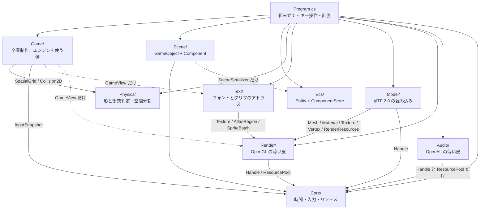

**Day 34 でもクラスの増減は無い**(`SurfaceMaps` は `Render/` の中)。
層が増えないまま機能だけが積み上がるのは、
Day 25 で層を切り分けた配当が続いている、と読める。

**Day 33 でクラスの増減は無かった**(`ShadowMap` は `Render/` の中)。

**Day 32 で `Model/` が1つ増えた**。矢印の向きは変わっていない。

`Model/` は `Text/` とまったく同じ位置に入る——
**`Render/` の上に乗り、`Render/` からは知られていない**一方通行。
`Text/` がグリフを `Texture` に焼いて `SpriteBatch` に積むように、
`Model/` は glTF を `Mesh` と `Material` に変換する。
どちらも「素材の形式を、描画の言葉に翻訳する層」で、性格が揃っている。

**逆向き(`Render` が glTF を知っている)にしなかった**のが要点。
そうすると `Mesh` が「glTF から作られたか、コードで作られたか」を抱え込むことになり、
Day 41 で FBX を足したくなったときに `Render/` を触る羽目になる。
`Primitives`(コードで作る)と `GltfLoader`(ファイルから作る)が
**同じ `Mesh` を作る2つの入口**として並んでいるのが、今の形。

**Day 31 で矢印を1本直した**。層は Day 29 のままだが、
`Core` ⇔ `Render` の相互参照が `Render` → `Core` の一方通行になった——
`ResourceManager` を `Render/RenderResources` へ引っ越したのがそれ(下の「相互参照だった話」)。

`Core/` の中身を実際に調べると、`Silk.NET.OpenGL` を using しているファイルは1つも無い。
**いま `Core/` は本当に時間・入力・ハンドルだけの層**になっている。

後処理は `Render/` の中で閉じている。`PostProcess` が知っているのは
`GL` と `Framebuffer` と `Shader` と `RenderResources` だけで、
**シーンに何が入っているかを一切知らない**。だから
`Program` が「今日はゲームを描く」「今日はデモを描く」と切り替えても、
後処理側は1行も変わらない。

**Day 33 の `ShadowMap` は、この方針をそのまま踏襲している**。
持っているのは深度バッファと光源行列だけで、
「何を影として落とすか」は `Begin` と `End` の間で外から描いてもらう。

```csharp
_shadow.Begin(_lightDirection, _orbit.Target);
// ここで好きなものを _shadow.Draw(mesh, model) する
_shadow.End(width, height);
```

`PostProcess.Begin` / `End` と同じ形にしてあるので、
**「シーンを知らないパス」の作り方が2例そろった**ことになる。
2例あると形が見えてくるのがよいところで、
Day 37 の SSAO も Day 52 の G-Buffer も、この形で足せる。

**これが Render To Texture のいちばんの配当**で、
画面全体に効く処理(影・SSAO・被写界深度・ディファード)は
今後すべてこの位置に差し込むことになる。

**`Game` から `Audio` への線が無い**のが Day 29 から見てほしいところ。
音は鳴るが、鳴らしているのは `Program` で、ゲームは
「弾を撃った」「敵が死んだ」を <c>OnEvent</c> で外へ投げるだけ。

```csharp
public Action<GameEvent, Vector2>? OnEvent { get; set; }
```

こうしておくと、**自己チェックで 600 秒ぶんを無音で回せる**。
`SurvivorGame` が直接 `_audio.Play` を呼んでいたら、
テストのたびにデバイスを開くことになり、
音の出ない環境ではそもそも動かせない。

同じ理由で `SurvivorGame` は `GameView` も知らない。
**状態を進めるものと、状態を見るもの**が分かれている(Day 19 の線)。

| 層 | 依存先 | 備考 |
|---|---|---|
| `Physics/` | **なし** | `System.Numerics` だけ。そのまま別プロジェクトへ持ち出せる |
| `Ecs/` | **なし** | 同上。Day 23 で「他に依存しないので先に5つ書ける」と書いたとおり |
| `Scene/` | `Core`(`InputSnapshot`)、`Ecs`(`SceneSerializer` のみ) | **描画を一切知らない**。`SpriteRenderer` は絵の種類と大きさを持つデータでしかない |
| `Render/` | `Core`(`Handle` / `ResourcePool`) | `RenderResources` が箱を借りる。**GL を触るのは全部この層** |
| `Text/` | `Render`(`Texture` / `AtlasRegion` / `SpriteBatch`) | **一方通行**。`Render` は `Text` を知らない |
| **`Model/`** | `Render`(`Mesh` / `Material` / `Texture` / `Vertex` / `RenderResources`)、`Core`(`Handle`) | **一方通行**。`Render` は glTF を知らない |
| `Audio/` | `Core`(`Handle` / `ResourcePool` **のみ**) | **一方通行**。`Core` は `Audio` を知らない |
| **`Game/`** | `Physics` / `Core`(入力)。描画側だけ `Render` と `Text` | **エンジンは `Game` を知らない**。窓も GL も音も知らない |
| `Core/` | **なし** | Day 31 の引っ越しで一方通行になった(下の「相互参照だった話」) |
| `Program.cs` | 全部 | 組み立て役。7100行あるが、その大半はデモ・計測・自己チェック |

`Game/` の中でも線が引いてある。

| ファイル | 知っていること | 知らないこと |
|---|---|---|
| `GameBalance` | プレイヤー・敵・湧き・経験値の数字 | 全部 |
| `Weapons` | 武器の成長カーブ(レベル → 性能) | ゲームの状態 |
| `UpgradeOption` | 選択肢の中身と、見せる文字 | 適用の仕方 |
| `SurvivorGame` | 形と当たり判定、空間分割、入力、成長 | 描画、音、窓、GL |
| `GameView` | スプライトの積み方、文字の出し方 | ゲームを進める方法(読むだけ) |

**`GameView` が状態を1文字も書き換えない**のは意図的で、
だから描画を丸ごと止めてもゲームは同じように進む。
自己チェックが窓を出さずに回せるのはこの性質のおかげ。

**`Text/` だけが他の層の上に乗っている**。
`Physics/` も `Audio/` も自分で完結していて、単体で別プロジェクトへ持ち出せるが、
`Text/` は `Render/` が無いと成立しない——グリフを置く先が `Texture` で、
積む先が `SpriteBatch` だから。

これは歪みではなく**素直な積み方**で、`Text` → `Render` の一方通行になっている。
逆向き(`SpriteBatch` が文字を知っている)にすると、
描画の中核が「文字とは何か」を抱え込むことになる。
`SpriteBatch` から見れば、文字は**ただの四角**でしかない。

**`Core` と `Render` が相互参照だった話**(Day 25 で見つけ、Day 31 で直した)。

`ResourceManager`(Core)が `Texture`(Render)を作り、
`Material`(Render)が `ResourceManager`(Core)を呼ぶ、という往復になっていた。
名前空間が `HonyaEngine` 1つなので動きはするが、
**アセンブリを分けようとした瞬間に破綻する**形だった。

直し方は Day 25 の設計書に書いたとおりで、
**`ResourcePool` と `Handle` だけを下層に残し、窓口は `Render/` へ上げる**。
Day 31 でそれを実行し、`Core/ResourceManager.cs` は `Render/RenderResources.cs` になった。
名前も変えたのは、中で持っているのが `Texture` と `Shader` だけ——
つまり全部 GL のもので、「全リソースの窓口」という名前が中身と合っていなかったため。

**Day 27 の判断**: 音を足すとき、この歪みを繰り返さないようにした。

音のリソースも「パスをキーにして使い回し、ハンドルで配る」という点でテクスチャと同じなので、
当時の `ResourceManager` に `LoadAudio` を足すのが自然に見える。
だがそうすると `ResourceManager`(= 当時は `Core`)が **GL と OpenAL の両方を握る**ことになり、
当時の相互参照が「`Core` ⇔ `Render` + `Core` ⇔ `Audio`」に増える。

そこで `AudioSystem` は、`Core` から**総称型の `ResourcePool<T>` と `Handle<T>` だけを借りて**、
音のリソースは自分で持つ形にした。`ResourcePool<T>` は `T` が何かを知らないので、
借りても依存が増えない。結果、`Audio/` → `Core/` の**一方通行**が保たれている。

図に描いておくと、こういう判断が「なんとなく」ではなくできるようになる。
**設計書は、次に何かを足すときのために書いている**。

### Core — 時間・入力・リソース

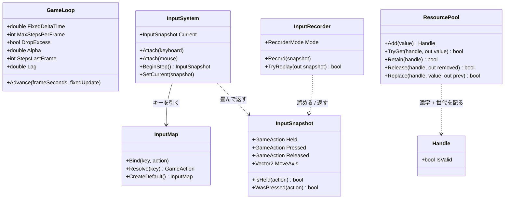

**`ResourceManager` がこの図から消えた**(Day 31 で `Render/RenderResources` へ引っ越した)。
実物は `Render` のクラス図のほうに載せてある。

`ResourcePool` と `Handle` は総称型(`ResourcePool<T>` / `Handle<T>`)。
`T` が何かを知らないまま添字と世代だけを管理するので、`Texture` にも `Shader` にも同じものが使える。
**`T` を知らないから下層に残せた**——引っ越しでこの2つだけ `Core/` に残したのはそのため。

この層で押さえるべき責務の線引き:

- **`GameLoop` は時間しか知らない**。何を更新するかは `Action<float>` で渡される
- **`InputSystem` はデバイスのイベントを畳むだけ**。ゲームとしての意味づけは `InputMap` が持つ
- **`InputSnapshot` は値**。だから記録・再生で丸ごと差し替えられる(Day 20 の肝)
- **`Core/` は GL を1行も知らない**。`Silk.NET.OpenGL` を using しているファイルが無い、が実際の姿

### Render — OpenGL の薄い皮

```mermaid
classDiagram
    class Camera {
        +Vector3 Position
        +Vector3 Target
        +ProjectionMode Mode
        +float AspectRatio
        +Matrix4x4 ViewProjection
        +CreateScreen(width, height) Matrix4x4
    }
    class OrbitCameraController {
        +float Yaw
        +float Pitch
        +float Distance
        +Apply()
    }
    class Shader {
        +Use()
        +SetInt(name, value)
        +SetVector3(name, value)
        +SetVector4(name, value)
        +SetMatrix3(name, value)
        +SetMatrix4(name, value)
        +TryReload() bool
    }
    class Texture {
        +uint Handle
        +int Width
        +int Height
        +bool HasMipmaps
        +FromFile(gl, path) Texture
        +DecodeFile(path) DecodedImage
        +FromPixels(gl, pixels, w, h, mipmaps, srgb) Texture
        +FromFloatPixels(gl, data, w, h, components) Texture
        +DecodeBytes(encoded) DecodedImage
        +CreateR8(gl, w, h) Texture
        +CreateTarget(gl, w, h, format) Texture
        +CreateDepthTarget(gl, w, h) Texture
        +UploadR8(x, y, w, h, coverage)
        +SetFilter(filter)
        +SetWrap(wrap)
        +Bind(unit)
    }
    class TextureWrap {
        <<enumeration>>
        Repeat
        ClampToEdge
        ClampToBorder
    }
    class RenderResources {
        +int MaxUploadsPerFrame
        +int PendingCount
        +Texture Placeholder
        +LoadTexture(path, mipmaps, srgb) Handle
        +LoadTextureFromMemory(key, bytes, mipmaps, srgb) Handle
        +LoadTextureFromPixels(key, rgba, w, h, mipmaps, srgb) Handle
        +LoadTextureAsync(path) Handle
        +LoadShader(vert, frag) Handle
        +Update()
        +GetTexture(handle) Texture
        +GetShader(handle) Shader
        +Retain(handle) bool
        +Release(handle) bool
    }
    class RenderTargetFormat {
        <<enumeration>>
        Rgba8
        Rgba16F
    }
    class Framebuffer {
        +Texture Color
        +Texture Depth
        +int Width
        +int Height
        +RenderTargetFormat Format
        +long ByteSize
        +CreateDepthOnly(gl, w, h) Framebuffer
        +Bind()
        +BindDefault(gl, w, h)
        +Resize(w, h)
        +SetFormat(format)
    }
    class ShadowMap {
        +bool Enabled
        +int Resolution
        +Framebuffer Target
        +Matrix4x4 LightSpaceMatrix
        +int PcfRadius
        +int TapCount
        +float DepthBias
        +bool SlopeBias
        +bool CullFrontFaces
        +float Radius
        +float WorldPerTexel
        +bool ShowMap
        +int DrawCalls
        +long ByteSize
        +Begin(lightDirection, center)
        +Draw(mesh, model)
        +End(screenWidth, screenHeight)
        +Apply(shader, unit)
        +DrawDebug(screenWidth, screenHeight)
        +SetResolution(resolution)
    }
    class PostProcess {
        +RenderTargetFormat SceneFormat
        +bool BloomEnabled
        +ToneMapOperator ToneMap
        +PostDebugView DebugView
        +float Exposure
        +float BloomThreshold
        +float BloomIntensity
        +int PassCount
        +long ByteSize
        +Begin(clearColor)
        +End(screenWidth, screenHeight)
        +Resize(w, h)
        +ReloadShaders()
    }
    class ToneMapOperator {
        <<enumeration>>
        None
        Reinhard
        Aces
    }
    class PostDebugView {
        <<enumeration>>
        Final
        SceneOnly
        Bright
        Bloom
    }
    class TextureAtlas {
        +Texture Texture
        +FromFiles(gl, paths, padding) TextureAtlas
    }
    class AtlasRegion {
        +Texture Texture
        +Vector2 UvMin
        +Vector2 UvMax
    }
    class Material {
        +string Name
        +Handle Shader
        +Handle MainTexture
        +Vector4 Tint
        +Vector2 UvScale
        +Vector4 BaseColorFactor
        +float MetallicFactor
        +float RoughnessFactor
        +Handle MetallicRoughnessTexture
        +Handle NormalTexture
        +Handle OcclusionTexture
        +Handle EmissiveTexture
        +Vector3 EmissiveFactor
        +float NormalScale
        +Handle HeightTexture
        +float ParallaxScale
        +bool DoubleSided
        +string AlphaMode
        +Apply(resources)
    }
    class Mesh {
        +int VertexCount
        +Draw()
        +ReadVertices() TVertex[]
        +ReadIndices() uint[]
        +Dispose()
    }
    class Vertex {
        +Vector3 Position
        +Vector2 TexCoord
        +Vector4 Color
        +Vector3 Normal
        +Vector4 Tangent
        +Attributes
    }
    class SurfaceMaps {
        <<static>>
        +int Size
        +float MortarWidth
        +CreateHeight() byte[]
        +CreateNormal(strength) byte[]
        +CreateBaseColor() byte[]
        -HeightAt(x, y) float
        -Noise(x, y, cells) float
        -Wrap(value, period) int
    }
    class SpriteVertex {
        +Vector2 Position
        +Vector2 TexCoord
        +uint Color
        +PackColor(color) uint
    }
    class VertexAttribute {
        +int ComponentCount
        +bool Normalized
        +int ByteSize
    }
    class SpriteBatch {
        +SpriteSortMode SortMode
        +int DrawCallCount
        +Begin(projection, sortMode)
        +Draw(texture, center, size, rotation, color, layer)
        +End()
    }
    class Primitives {
        +CreateQuad(gl) Mesh
        +CreateCube(gl) Mesh
        +CreateSphere(gl, slices, stacks) Mesh
    }
    class Pbr {
        <<static>>
        +float DielectricF0
        +float MinRoughness
        +Alpha(roughness, perceptual) float
        +DistributionGgx(nDotH, alpha) float
        +DirectK(roughness) float
        +GeometrySchlickGgx(nDotX, k) float
        +GeometrySmith(nDotV, nDotL, roughness) float
        +FresnelSchlick(cosTheta, f0) Vector3
        +F0Of(baseColor, metallic, dielectricF0) Vector3
        +Evaluate(n, v, l, baseColor, metallic, roughness) Vector3
        +IntegrateNdf(alpha, steps) double
        +Hammersley(i, count) Vector2
        +ImportanceSampleGgx(xi, n, alpha) Vector3
        +DirectionalAlbedo(n, v, baseColor, metallic, roughness) Vector3
        +IblK(roughness) float
        +GeometrySmithIbl(nDotV, nDotL, roughness) float
        +FresnelSchlickRoughness(cosTheta, f0, roughness) Vector3
        +IntegrateBrdf(nDotV, roughness, samples) Vector2
    }
    class CubeMap {
        +uint Handle
        +int Size
        +int MipLevels
        +long ByteSize
        +Create(gl, size, mipLevels) CubeMap
        +FullMipCount(size) int
        +EnableSeamless(gl)
        +FaceViews(eye) Matrix4x4[]
        +FaceProjection() Matrix4x4
        +Bind(unit)
        +GenerateMipmaps()
        +ReadFace(face, mip) float[]
    }
    class SkyImage {
        <<static>>
        +int Width
        +int Height
        +Create(sunDirection, clampToLdr) float[]
        +Sample(direction, toSun) Vector3
        +IntegrateIrradiance(n, toSun, steps) Vector3
    }
    class EnvironmentMap {
        +int EnvironmentSize
        +int IrradianceSize
        +int PrefilterSize
        +int PrefilterMipCount
        +int BrdfLutSize
        +CubeMap Environment
        +CubeMap Irradiance
        +CubeMap Prefiltered
        +Texture BrdfLut
        +bool Enabled
        +bool SkyboxVisible
        +float Intensity
        +int SkyboxMip
        +bool UsePrefilter
        +bool ClampSkyToLdr
        +double BakeMilliseconds
        +long ByteSize
        +Bake(sunDirection, screenWidth, screenHeight)
        +Apply(shader)
        +DrawSkybox(camera, restoreDepthTest, restoreCulling)
    }

    OrbitCameraController --> Camera : 球面座標で位置を書く
    Material ..> Shader : ハンドル経由
    Material ..> Texture : ハンドル経由
    Mesh ..> VertexAttribute : ストライドとオフセットを組む
    Vertex ..> VertexAttribute
    SpriteVertex ..> VertexAttribute
    Mesh ..> Vertex : 型引数
    Primitives ..> Mesh : 作る
    TextureAtlas *-- AtlasRegion
    TextureAtlas *-- Texture : 1枚に詰める
    SpriteBatch --> Shader
    SpriteBatch ..> SpriteVertex : 積む
    SpriteBatch ..> AtlasRegion : UV を受け取る
    Framebuffer *-- Texture : 描き込み先として所有
    Framebuffer ..> RenderTargetFormat
    Texture ..> TextureWrap
    PostProcess *-- Framebuffer : 4枚
    PostProcess ..> Shader : 明部 / ぼかし / 合成
    PostProcess ..> ToneMapOperator
    PostProcess ..> PostDebugView
    PostProcess ..> RenderResources : シェーダを借りる
    ShadowMap *-- Framebuffer : 深度専用を1枚
    ShadowMap ..> RenderResources : シェーダを借りる
    ShadowMap ..> Camera : 正射影行列を借りる
    ShadowMap ..> Shader : 深度 / 表示
    RenderResources ..> Texture : 作る / 配る
    RenderResources ..> Shader : 作る / 配る
    SurfaceMaps ..> RenderResources : 焼いたバイト列を預ける
    EnvironmentMap *-- CubeMap : 環境 / 放射照度 / 事前フィルタ の3枚
    EnvironmentMap *-- Texture : 元の正距円筒 と BRDF の表
    EnvironmentMap ..> RenderResources : シェーダを借りる
    EnvironmentMap ..> SkyImage : 空を焼いてもらう
    EnvironmentMap ..> Camera : 空を描くときのビュー射影
    EnvironmentMap ..> Primitives : 焼く用の立方体
```

**`Pbr` はどこからも矢印が出ていない**。これは描き忘れではなく、
**依存が1本も無い**ことをそのまま表している——
`GL` も `Handle` も `Material` も知らず、入力は `Vector3` と `float` だけ。

呼ぶのは `Program.RunPbrCheck` だけで、**本番の描画からは1度も呼ばれない**。
同じ式が `textured.frag` にあり、そちらが毎フレーム数百万回走る。

「同じものを2か所に書く」のは普段なら避けるべきだが、今日は取った。

| | GLSL 側(`textured.frag`) | C# 側(`Pbr`) |
|---|---|---|
| 役割 | **本番**。1フレームに数百万回 | **定義と検算**。押したときだけ |
| 確かめられること | 絵になった結果だけ | **半球を 8192 点に刻んだ積分** |
| 直したとき動くもの | 見た目 | 自己チェックの数字 |

GPU の中は覗けないので、「D の積分が 1 か」「入ってきた以上の光を返していないか」を
確かめる場所が CPU 側に要る。式が数行で、しかも**この先動かない**(物理の定義)ので、
二重管理の代償より検算できる価値のほうが大きいと判断した。

**片方だけ直す**のがいちばん怖い壊し方なので、自己チェックの最後で
`textured.frag` を実際に読んで、共有している定数(`MIN_ROUGHNESS`)と
`α = roughness²` の式が両方に入っていることを見ている。
値そのものは突き合わせられないが、**「同じ約束でいるか」は機械で確かめられる**。

**`Pbr` に IBL 用が4つ増えた**(Day 36)。
`GeometrySmithIbl` は `GeometrySmith` と **k だけが違う**——
直接光は `(r+1)²/8`、IBL は `α/2`。同じ幾何減衰なのに係数が2通りあるのは、
Day 35 の要点5 で触れた「理屈と当てはめのつぎはぎ」がそのまま出ているところ。
**取り違えると金属の縁が暗くなりすぎる**が、症状が地味なので気づきにくい。

`IntegrateBrdf` は Day 35 の `DirectionalAlbedo` とほとんど同じ積分で、
違うのは<b>フレネルを2つに割る</b>ことだけ。
Day 35 の計画書で「Day 36 の LUT がまさにそれ」と書いた回収になっている。

**`CubeMap` が抱えているのは「GL の約束」**(Day 36)。
面の並び、上下反転、90 度の画角、シームレス——
どれも**知らないと必ず踏む**が、一度書けば二度と考えたくない類のもの。
1つのクラスに閉じ込めておくと、
読む側(空・本描画・事前フィルタ)が素直に書ける。

**`SkyImage` は `SurfaceMaps`(Day 34)と同じ形**をしている。
GL を1行も知らず、返すのはただの配列で、テクスチャにするのは呼ぶ側の仕事。
違いは `byte[]` ではなく `float[]` なこと——**1.0 を超える値を運ぶ**ため。

そしてもう1つ、`SurfaceMaps` に無かったものを持っている:
<b>同じ関数を積分する CPU 版</b>(`IntegrateIrradiance`)。
GPU が焼いた放射照度が正しいかは絵からは判定できないので、
**答えを2通りの方法で出して突き合わせる**ために置いてある。
Day 35 で `Pbr` を CPU にも持った判断の、そのまま2例目になる。

**`Primitives` に球が入った**のは、材質を見比べる形が球しかないため。
立方体は面ごとに法線が一定なので、1つの面の中でハイライトが動かない——
粗さを変えても広がりが見えず、金属度の効きも読み取れない。
球は**法線があらゆる向きを1個の中で通る**ので、
フレネル(縁ほど明るい)も粗さ(ハイライトの広がり)も1個に全部出る。

そして球は、**接線を手で決められない最初の形**でもある。
板と立方体は「左下 → 右下 が U」と目で追えたが、曲面では
`∂P/∂u` を実際に計算するしかない。その結果 **`w` が -1 になる**——
Day 34 で入れた「符号1個を持つ」仕組みが、ここではじめて -1 の側で使われる。


**Day 28 で `Texture` に足したのは2つだけ**。
`CreateR8` が1チャンネルの空テクスチャを作り、`UploadR8` がその一部を書き換える。
どちらもグリフのために足したものだが、**`Texture` はグリフを知らない**——
「1チャンネル」「一部だけ更新」という一般の機能として置いてある。
同じものが Phase 6 のシャドウマップ(Day 33)でも要る。

**Day 32 で `Vertex` に法線が戻った**。Day 9 でソフトウェアラスタライザに持たせ、
Day 14 で GPU へ移したときに落としていたもの。陰影を付けていなかったので要らなかったが、
glTF のモデルは必ず持っているので、**無いと読んだデータの一部を捨てることになる**。

**末尾に足した**ので location は 0〜2 が動かず、既存のシェーダは無傷で済んだ。
位置の次に置くほうが意味の並びとしては素直だが、
そのために `sprite.vert` まで書き換える理由は無い。

**Day 34 で接線が同じやり方で足された**(location 4)。
2回続けて末尾に足せたので、この置き方は当たりだったと言える。
1頂点 64 バイトになり、DamagedHelmet で 930KB。

**`Vector4` なのは glTF の仕様に合わせたから**で、
w には ±1 しか入らない(要点3)。
「3本目の軸を持たずに済ませるための符号1個」がそのままフィールドになっている。

**`depth.vert`(Day 33)は無傷**なのも見どころ。
あちらは location 0 しか宣言していないので、
属性が4本になろうと5本になろうと影響を受けない。
**宣言しない自由**があるから、末尾に足す戦略が効き続けている。

**`SurfaceMaps` が GL を1行も知らない**のが、この層で新しい置き方。
返すのはただの `byte[]` で、テクスチャにするのは `RenderResources` の仕事になる。

```
SurfaceMaps.CreateNormal()  →  byte[]  →  RenderResources.LoadTextureFromPixels()  →  Handle
```

分けてあるので**スレッドを選ばない**(Day 21 の `Texture.DecodeFile` と同じ性質)。
起動時に3枚焼くだけなので今は同期でよいが、
枚数が増えたらそのまま `Task.Run` へ載せられる形になっている。

`Texture.FromPixels` を直接呼ばずに窓口を通すのは、
**寿命の管理とキャッシュを1箇所に残す**ため。
ここを通さずに `new` すると、そのテクスチャだけ `Dispose` の対象から外れる。

**`Mesh.ReadVertices` は「持たない」ほうへ倒した結果**(Day 34)。
自己チェックで頂点の中身を見たいが、CPU 側に控えを持つと
DamagedHelmet だけで 930KB を**使うかどうか分からないのに常に払う**。
GPU から読み返す(`glGetBufferSubData`)なら払うのは呼んだときだけで済む。
代わりに**遅い**(描画キューが空になるまで待つ)ので、検査専用の窓口になっている。

当たり判定やレイキャストで頂点が要り用になる Phase 7 で、
「持つ」へ倒し直すことを考えればよい。

**`Material` が急に太った**のが Day 32 でいちばん目に付く差分で、
これは glTF の材質定義をそのまま写したから。
「シェーダ + そのシェーダに渡す値」という Day 15 からの位置づけは変わっていない——
渡す値の種類が、仕様に合わせて増えただけになる。

**Day 31 で足したのは `CreateTarget` 1つ**。同じ理屈で、
`Texture` は「これがレンダーターゲットである」ことを知らない。
中身を渡さずに場所だけ確保し、ミップマップを作らず、ClampToEdge にする——
それだけの機能として置いてあるので、
影(Day 33)でも環境マップ(Day 36)でも G-Buffer(Day 52)でも同じものが使える。

**Day 33 で足したのは `CreateDepthTarget` 1つ**。
`CreateTarget` との違いは3つとも影のための必然になっている。

| | `CreateTarget`(Day 31) | `CreateDepthTarget`(Day 33) |
|---|---|---|
| 内部形式 | RGBA8 / RGBA16F | **DepthComponent24** |
| フィルタ | Linear | **Nearest**(深度を平均しても意味が無い。要点6) |
| ラップ | ClampToEdge | **ClampToBorder + 白**(箱の外は「遮るものなし」) |

`Texture` が「これがシャドウマップである」ことを知らないのは同じで、
Day 37 の SSAO が深度を読むときも、そのまま同じものが使える。

**`Framebuffer` が3つ目の形を持った**。
Day 31 の「カラーテクスチャ + 深度レンダーバッファ」に加えて、
**カラーを1枚も持たない**形が入った。
`Depth` プロパティが深度専用のときだけ入るので、
**「読むならテクスチャ、読まないならレンダーバッファ」の区別がそのまま型に出る**。

**`ShadowMap` が `Camera` を借りている**のが、この層で新しい関係。
光の正射影行列は `Camera.CreateOrthographic` がそのまま使える——
「カメラ」という名前だが中身は**投影行列の作り方の置き場**なので、
光の目に使っても筋が通る。Day 14 で `static` メソッドとして切り出しておいた形が効いた。

**`Framebuffer` が `Texture` を所有している**のは、今までの `Render/` に無かった関係。
`Material` は「持たない(ハンドルだけ)」で通してきたが、
フレームバッファのカラーアタッチメントは
**そのフレームバッファと同じ大きさ・同じ形式でなければならない**ので、
外から差し替えられると壊れる。**所有すべきものは所有する**。

**`PostProcess` と `ShadowMap` はシェーダだけ `RenderResources` に預けている**。
バッファ(4枚 / 1枚)は自分で持ち、シェーダは借りる——
シェーダは F5 でリロードしたいので、管理の窓口に載せておく必要がある。

**バッファを所有し、シェーダを借りる**——この分担が2クラスで一致しているのは偶然ではなく、
「大きさや形式に強い制約があるものは所有、共有して使い回すものは借りる」という
Day 21 からの線がそのまま出ている。

**`Material` が何も所有していない**のは Day 15 から一貫している(Day15.md の要点2)。
持っているのはハンドルだけで、実体の寿命は `RenderResources` にある。

**3D の道(`Mesh` + `Material`)と 2D の道(`SpriteBatch`)が並列**なのも見てのとおりで、
両者は `Shader` と `Texture` を共有しているだけで互いを知らない。
`Mesh` は「形が決まっていて毎フレーム変わらないもの」、
`SpriteBatch` は「毎フレーム頂点を作り直すもの」という使い分けになっている。

### Scene — GameObject + Component

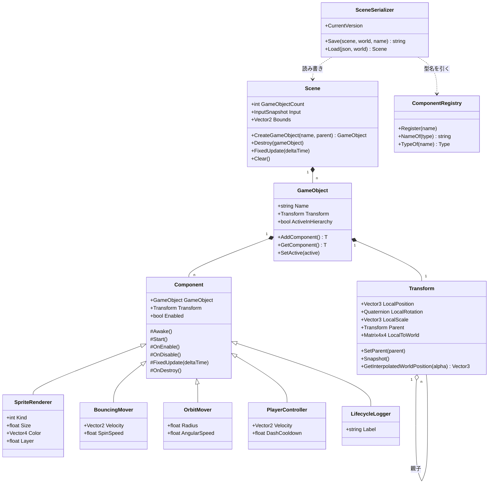

`Transform` だけが `GameObject` の固定メンバーで、ほかは全部 `Component` として付け外しする
(Day 22 の要点2)。`SceneSerializer` が `ComponentRegistry` を経由するのは、
**JSON の文字列から直接 `Type` を作らせない**ため(Day 24 の要点2)。

### Ecs と Physics — どこにも依存しない2つ(今日 `Physics` が増えた)

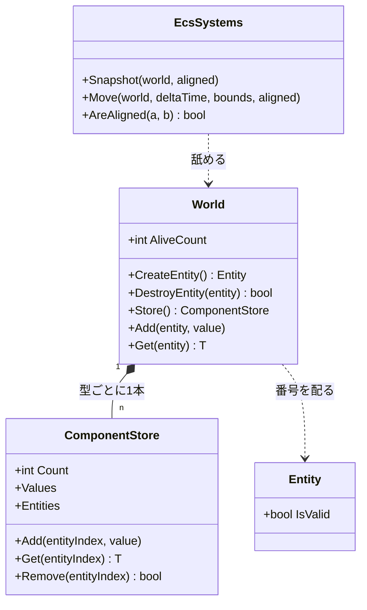

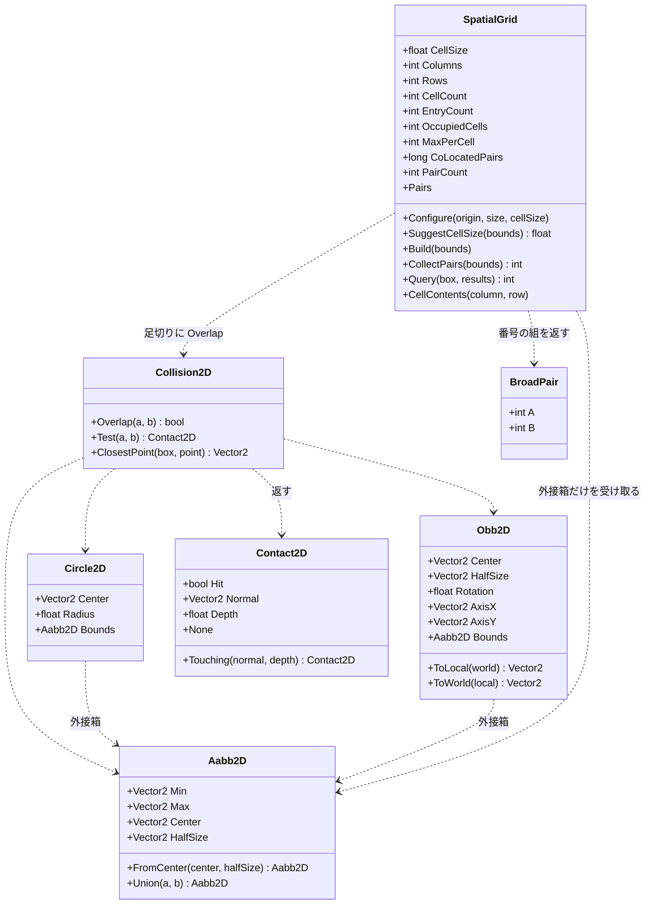

**形は全部 `readonly struct`、判定は `static` メソッドだけ**。状態を持たないので、
どのスレッドから何回呼んでも同じ答えが返る。Day 26 で空間分割を入れたとき、
この性質のおかげで**判定そのものには一切手を入れずに済んだ**——
`Collision2D.cs` と `Shapes2D.cs` の差分は 0 行になっている。

**Day 29 で足したのは `Query` だけ**。
`CollectPairs` が「全部の組」を返すのに対して、
`Query` は「この箱の近くにいるもの」を返す。
1回組んだ格子を、**総当たりの置き換え**としても
**単発の近傍探索**としても使えるようになった——
卒業制作では同じ格子を1ステップに4通りで使っている。

`SpatialGrid` だけが唯一 `class`(参照型)で、しかも状態を持つ。
配列を4本(`_cellStart` / `_cursor` / `_entries` / `_mark`)使い回すためで、
**毎フレーム作り直しても割り当てが起きない**ようにするにはこうするしかない。
そのぶん「1つのインスタンスを複数スレッドから同時に使えない」という制約が付く。
状態を持つと何が失われるかが、同じフォルダの中で見比べられる形になっている。

矢印の向きにも注目してほしい。**`SpatialGrid` から `Body` への線が無い**。
受け取るのは `ReadOnlySpan<Aabb2D>`、返すのは番号の組だけで、
速度も形も質量も知らない。この細さのおかげで、
Day 46 の 3D 版は `Aabb2D` を `Aabb3D` に変えるだけで済む。

### Audio — OpenAL の薄い皮

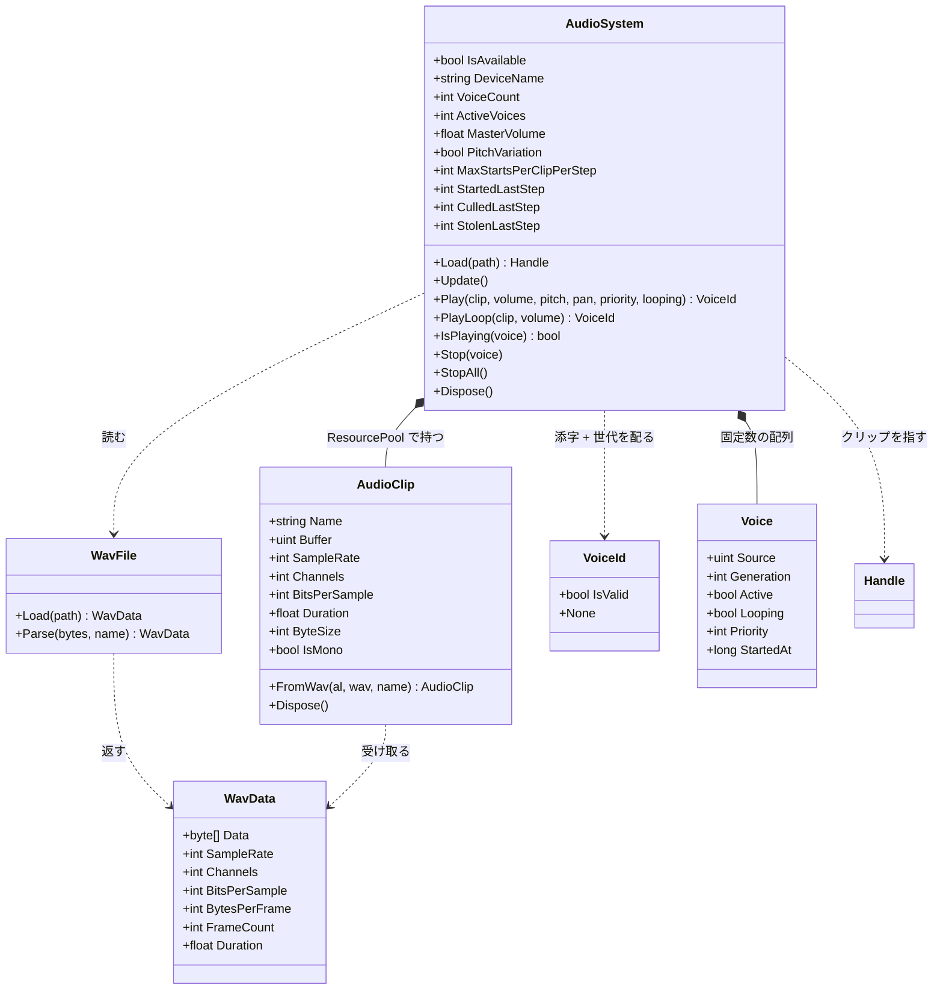

`Voice` は `AudioSystem` の中の `private struct`。外からは `VoiceId` 越しにしか触れない。

この層で押さえるべき線引きは3つ。

- **`WavFile` は OpenAL を知らない**。ただのバイト列パーサなので、
  ファイルが無くてもメモリ上のバイト列で試せる(自己チェックがそうしている)
- **`AudioClip` はデータ、`Voice` は再生**(要点2)。
  `Texture` と `Material`、`Mesh` と描画呼び出しと同じ分け方
- **`VoiceId` は `Handle<T>` と同じ構造**(添字 + 世代)だが**別の型**。
  `Handle<T>` は `ResourcePool<T>` のためのもので、ボイスはプールではないので流用しない。
  同じ手口を別の場所で使い直している、と読むのが正しい

### Text — Render の上に積む層

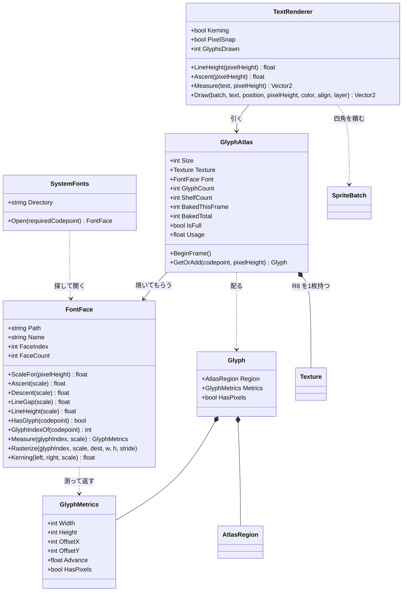

4つのクラスが、**それぞれ1つのことしかしない**ように切ってある。

| クラス | 知っていること | 知らないこと |
|---|---|---|
| `SystemFonts` | どこにフォントがあるか | 描き方 |
| `FontFace` | フォントの中身(寸法とアウトライン) | GL、アトラス、レイアウト |
| `GlyphAtlas` | どこに置いたか、何を焼いたか | 文字の並べ方 |
| `TextRenderer` | 並べ方(送り・行送り・整列) | フォントの中身、GL |

この切り方の値打ちは、**差し替えたときにどこまで壊れるか**で分かる。
SDF に変える(改造課題3)なら `GlyphAtlas` と `text.frag` だけが変わり、
`TextRenderer` は 1 行も触らない。
フォントフォールバックを入れる(改造課題2)なら `FontFace` を複数持つだけで、
`GlyphAtlas` の棚詰めには影響しない。

**`GlyphMetrics` が `FontFace` と `TextRenderer` の共通語**になっている。
「原点からどれだけずらして、次にどれだけ進むか」——
この5つの数字さえあれば、フォントの実装が何であれ字を並べられる。

### Model — glTF を描画の言葉へ翻訳する層

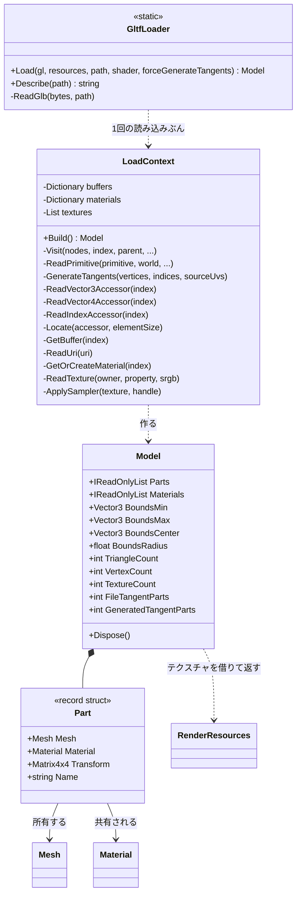

**Day 34 で `GenerateTangents` が入った**。ここに置いたのは、
**接線が「読み込みの一部」だから**——ファイルにあれば読み、無ければ作る、という
同じ場所で決まるべき話になる。

`Render/` 側(たとえば `Mesh` のコンストラクタ)で作る手もあるが、
そうすると `Mesh` が UV の反転規約(Day 32)を知る必要が出てくる。
**規約を知っているのはローダだけ**という線を守ると、置き場所は自然にここになる。

`Model` が接線の出どころ(ファイル / 生成)の数を持つのは、
**HUD と自己チェックで区別を出すため**。
「法線マップが効かない」の原因の筆頭がここなので、
数を見えるところに出しておく価値がある。

**`LoadContext` を切り出したのは、引数が増えすぎたから**。
`gl` / `resources` / `path` / `directory` / `root` / `embedded` / `shader` の7つを
静的メソッド間で渡し回すと、どの関数も先頭3行が引数の受け渡しになる。
**読み込み1回ぶんの寿命を持つ入れ物**にまとめると、
buffer のキャッシュとマテリアルの使い回しも自然にそこへ収まる。

**`Model` が木ではなく平らな一覧を持つ**のが設計の分かれ目。
glTF の中身はノードの木だが、**静的なモデルに階層は要らない**——
読み込み時に根から行列を掛け合わせて世界行列を確定させてしまえば、
描くときは順に回すだけになる。

木のまま持つべきなのは、あとから関節を動かす場合(スキニング。Day 41)。
そのときは `Model` に木を残す形へ戻すことになるが、
**要るまで持たない**ほうが今は読みやすい。

**`Model` が `RenderResources` を握っている**のは、
テクスチャの参照カウントを返すため(Day 21 の要点3)。
`Mesh` は自分で作ったので所有するが、テクスチャは借り物なので返す必要がある。
ここを忘れると、モデルを切り替えるたびに 2K テクスチャが数枚ずつ残り、
**絵は正しいのに VRAM だけ増え続ける**。
自己チェックの最後の1行(「全部畳んだらテクスチャの数が元に戻る」)は、これを見ている。

### glTF を1体読むまで — 3段の間接参照とノードの木

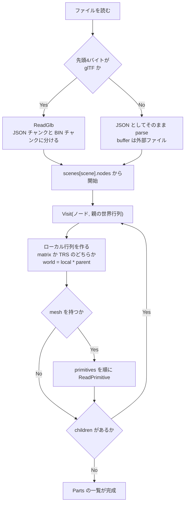

ノードの処理は**行列を掛けながら降りるだけ**で、Day 22 の `Transform` と同じ話。
違うのは、こちらは**降り切った時点で結果を確定させてしまう**こと。

プリミティブ1個を頂点配列にするところが、glTF のいちばん機械的な部分になる。

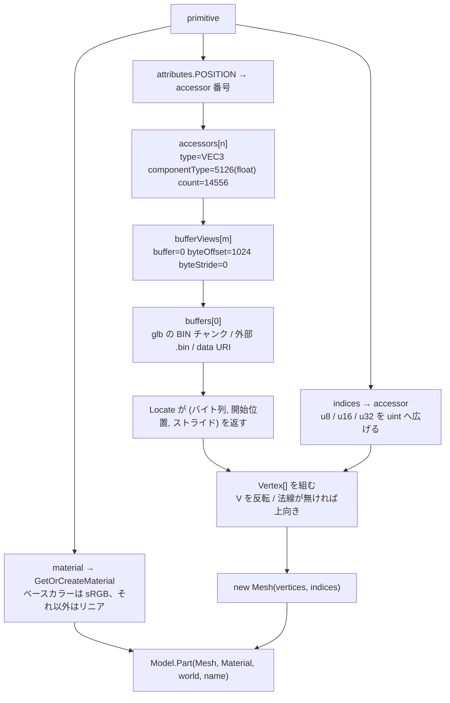

**`byteStride` が肝**。glTF は「位置・法線・UV を1頂点ずつ交互に並べる」書き方も許していて、
その場合 `bufferView` に `byteStride` が入る。0(または未指定)なら詰めて並んでいる。

これを無視して「詰めて並んでいる」と決め打ちしても、
**今日の4体は全部 stride 無しなので動いてしまう**。
つまり「動いたから正しい」が言えない類の分岐で、
仕様を読んでいないと存在にすら気づかない。

**`accessor` を経由する意味**は、1本のバイト列を複数の意味で切り出せること。
位置と法線と UV が同じ `buffer` に同居し、
それぞれの `bufferView` が違う範囲を指す。
OBJ が「v の配列」「vt の配列」を別々のテキスト行として持っていたのに対し、
glTF は**メモリ上の並びをそのまま記述している**ので、読み込み後の組み直しが要らない。

### Game — エンジンを使う側

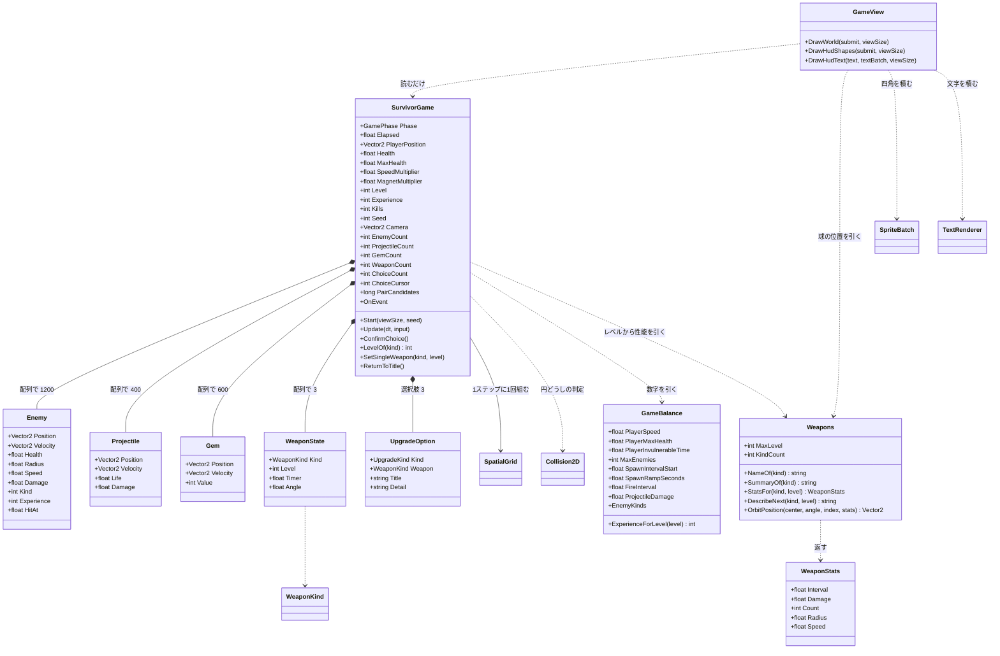

**`WeaponState` が3つのフィールドしか持っていない**のが Day 30 の設計の要。
威力も間隔も個数も持たず、`Weapons.StatsFor(kind, level)` が
**レベルから計算して返す**。

```
状態として持つもの   … 種類・レベル・タイマー・角度
状態から決まるもの   … 威力・間隔・個数・半径・速度
```

分けておくと、成長カーブを触るときに `StatsFor` の1箇所で済む。
逆に `WeaponState` に威力を持たせると、
レベルアップのたびに「どの数字をいくつ足すか」があちこちに散らばる。

**`GameView` から `Weapons` への線**にも意味がある。
オービットの球の位置は当たり判定と絵の両方が要るので、
`Weapons.OrbitPosition` という1つの式を両方から呼ぶ。
別々に書くと、**見えているところと当たるところがずれる**——
しかもずれは小さいので、しばらく気づかない。

**`Enemy` / `Projectile` / `Gem` が `struct`** なのが要点。
1200 体ぶんの参照を辿ると、メモリ上ばらばらの場所を読むことになる
(Day 22 で実測した 17 倍がこれ)。構造体の配列なら、
更新ループは連続したメモリを頭から舐めるだけで済む。

**Day 23 の ECS は使っていない**。
ECS が効くのは「部品の組み合わせが実行時に変わる」ときで、
今日のように<b>敵は敵、弾は弾と決まっている</b>なら、
種類ごとに配列を1本持つほうが素直で速い。
Day 23 で「ECS は構造体の配列の一般化」と書いたが、
**一般化が要らない場面では特殊形のままでよい**——
これは ECS が無駄だったという話ではなく、
<b>どちらを選ぶかを判断できるようになった</b>という話になる。

`GameBalance` に矢印が集まっているのも意図したもの。
遊んで気になったことは全部ここを触ることになるので、
**数字がコードの中に散らばっていると調整が苦行になる**。

### 1フレームの流れ

Silk.NET のウィンドウから `OnUpdate` と `OnRender` が交互に呼ばれる。
**状態を変えるのは `OnUpdate` 側だけ**、というのが Day 19 で引いた線。

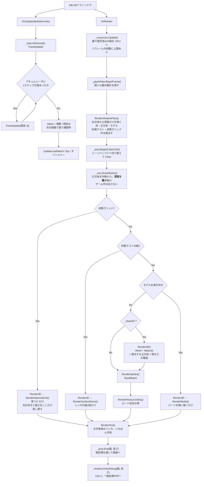

**Day 33 で先頭に1パス増えた**。`RenderShadowPass` が
`_post.Begin` より前に来るのは、**画面にもシーンバッファにも描かない**から。
行き先はシャドウマップで、後処理とはまったく別の道になる。

**`DrawDebug` は後処理の外**に置いてある。
シャドウマップの表示は「見たままの値」であってほしいので、
露出やトーンマップを通してはいけない。
HUD の文字が後処理を通ってしまう(下の弱点)のとは、扱いを分けた。

**Day 29 で分岐が1つ増えた**。ゲームモード(Enter)のときは
`Render3D` も `RenderSprites` も `RenderResourceStrip` も通らず、
`RenderGame()` だけになる。
デモの重い部分を裏で回したまま遊ぶと、
「ゲームが重い」のか「デモが重い」のか分からなくなるため。

**`RenderText` がいちばん最後**なのは、UI が何よりも手前に出るものだから。
バッチが別なのは、シェーダが違うため——
グリフのアトラスは1チャンネルなので `sprite.frag` では真っ黒になる。
**バッチは「同じ設定で描けるものをまとめる」仕組み**なので、
シェーダが違えば別のバッチになるのは定義どおりの帰結。

`OnRender` の先頭で `_resources.Update()` を呼ぶのが要点で、
**GL は描画スレッドからしか触れない**ため、裏で復号し終えた画素をここで GPU に上げている
(Day 21 の要点5・6)。

**Day 34 でまた分岐が1つ増えた**。材質テストの板(Alt+5)を出している間は、
モデルもデモも出さない。理由は Day 32・33 と同じで、
**重ねると、どの陰影がどこから来ているのか分からなくなる**。

**Day 35 でさらに1つ増えて4段になった**。材質グリッド(Ctrl+Shift+5)がいちばん外側に来る。

そして今日の分岐は、**中で uniform を差し替える**のが今までと違う。
`RenderMaterialGrid` は光の向きと強さを自分で上書きしてから描く——
デモの太陽は画面の奥から手前へ進むので、正面から見るグリッドが逆光になるため
(「検証の途中で分かったこと」)。

分岐の中で全体設定を書き換えるのは本来まずい形で、
**次にどこかで `uLightDirection` を読む人が居たら破綻する**。
いまは1フレームに1回しか描かないので成り立っているが、
Day 39 で光源が複数になったら「ライトの集合をパスごとに持つ」形へ整理する必要がある。

**Day 36 で先頭にもう1つ増えた**。空(`_env.DrawSkybox`)が
分岐より前に来るのは、**どの分岐でも背景が要る**から。

深度を書かずに描いているので、あとから描いたものが必ず手前に来る。
いちばん最後に描いて深度テストで隠れた画素を省くほうが速いが、
**分岐が4つある末尾すべてに足す**ことになるので、前に1回置くほうを取った。
フルスクリーン1枚ぶんの塗りつぶしなので、実測でも差が出ない。

**ゲームモードでは出さない**。見下ろし型の 2D に空が映っても意味が無く、
「エンジンの機能のうちゲームが要るものだけを通る」という Day 29 の線から外れる。

分岐が4段になったのは、**デモが増えるたびに「それだけを見せる」を選んできた**結果。
「全部同時に出す」ほうがコードは短いが、学習用としては
1つずつ切り分けて見られるほうが値打ちがある、という判断が積み重なっている。

**Day 32 で分岐が1つ増えた**。モデルを表示している間は、
スプライトの群れも明るさの階段も出さない。
ゲームモード(`_playing`)で同じことをしているのと理由も同じで、
**重ねると、どちらの陰影を見ているのか分からなくなる**。
Day 31 までのデモは `Shift+0` を「モデル無し」まで回すと戻る。

**Day 31 で `Clear` が `_post.Begin` に変わった**。
`Begin` と `End` の間にあるコードは1行も変わっていない——
`Clear` の代わりにフレームバッファを差し替えるようになっただけで、
`Render3D` も `RenderSprites` も `RenderText` も「自分がどこへ描いているか」を知らない。

そのぶん**UI もトーンマップを通ってしまう**。露出を上げれば HUD の文字も白飛びする。
実際のエンジンは後処理のあとに UI を描くが、ここでは
「画面に出るものが全部1本のパイプラインを通る」形をまず見ることを優先した。
分けるのは Day 38(カラーグレーディング)で扱う。

### 影が1枚出るまで — 2つのパスと、5つの落とし穴

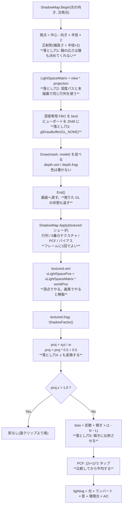

**落とし穴が5つとも「絵からは原因が読めない」**のが、影を難しくしている。

| 落とし穴 | 症状 | 見分け方 |
|---|---|---|
| 1. 箱が広すぎ/狭すぎ | ギザギザ / 画面の端で影が消える | HUD の `cm/tx` を見る |
| 2. 行列がずれる | 影が丸ごとずれる | `Ctrl+7` でマップは焼けているのに合わない |
| 3. `glDrawBuffer` 忘れ | 影がまったく出ない | **例外が出る**(完全性チェック。Day 31 の配当) |
| 4. `z` を変換し忘れ | 全部影 / まったく影なし | `Shift+9` を8回で係数を見ると一目 |
| 5. バイアス無し/過多 | 縞模様 / 影が浮く | `Ctrl+4` で 0 と 0.006 を往復する |

**3 だけが例外で教えてくれる**。残り4つは「影がおかしい」としか分からないので、
`Ctrl+7`(マップを見る)と `Shift+9`×8(係数を見る)の2つを先に作っておく。
デバッグ表示は本体より先に書いてよい類のもので、
今日はそれが**キー2つで済む**ところまで来ている。

### 接空間ができるまで — CPU とシェーダにまたがる1本の道

法線マップが1枚効くまでに、**4つの場所**を通る。
どこか1つでも規約がずれると、絵は出るが凹凸だけがおかしくなる。

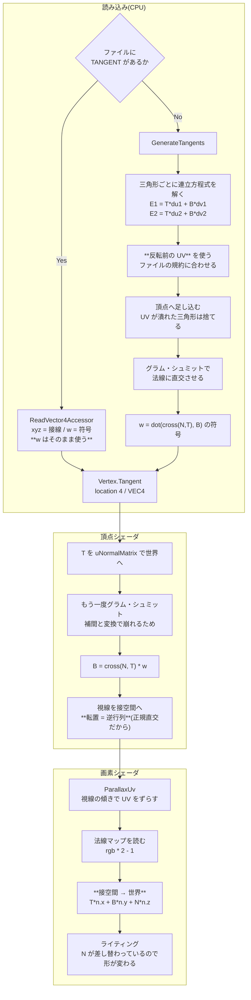

**規約が食い違いやすい場所が4つある**。どれも絵は出るので、間違いに気づきにくい。

| 場所 | 間違えると | 気づき方 |
|---|---|---|
| UV の V を反転したときの `w` | **凹凸が全部裏返る** | 出っ張りが出っ張って見えるか |
| 生成に使う UV(反転前 / 後) | **モデルによって効いたり効かなかったり** | ファイル有りと無しで見比べる |
| 法線マップの緑の流儀 | 凹凸が裏返る(上と同じ症状) | `Alt+8` でわざと再現できる |
| `cross(N, T)` の順序 | 従接線が逆を向く | 自己チェックの「V の増える向きと一致」 |

**症状が全部同じ**(凹凸が裏返る)なのが厄介なところで、
だから今日の自己チェック(Alt+0)は
「立方体の6面すべてで `cross(N,T)*w` が V の向きと一致するか」を見ている。
**手で答えが書ける形**で1つ確かめておくと、切り分けの起点になる。

### IBL が焼き上がるまで — 5段の事前計算

`EnvironmentMap.Bake` の中身。**順番は動かせない**——前の結果が次の入力になる。

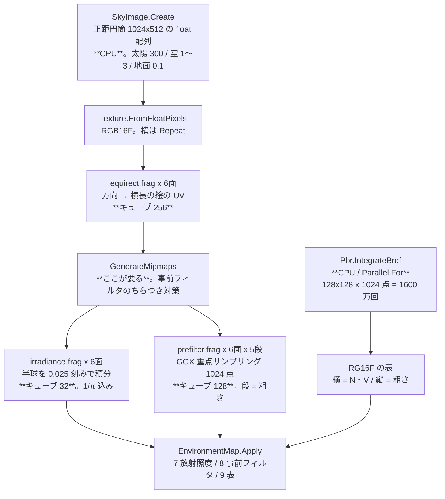

**入れ替えられない理由**が段ごとにある。

| 段 | 前の段に何を依存しているか |
|---|---|
| 正距円筒 → キューブ | 空の絵が要る。**ここで方位と上下の約束が確定する** |
| ミップ生成 | キューブが要る。**飛ばすと事前フィルタに白い点が散る** |
| 放射照度 | キューブが要る。**ミップは引かない**(`textureLod` で 0 に固定) |
| 事前フィルタ | キューブとそのミップが要る |
| BRDF の表 | **何にも依存しない**。だから初回だけ焼けばよい |

いちばん最後だけが独立しているのは、**そこに環境の情報が入っていない**から。
入っているのは「この材質は、あらゆる方向から来る光をどれだけ返すか」という
材質の性質だけで、空を差し替えても変わらない(要点4)。

**`Ctrl+Alt+5` の焼き直しに BRDF の表が入っていない**のはこのため。
1600 万回の積分が毎回走ったら、太陽を回すたびに 700ms ではなく 1.5 秒止まることになる。

**ミップ生成が真ん中に挟まる**のがいちばん見落としやすい。
事前フィルタは 1024 点をランダムに引くので、太陽(1テクセルで 300)に
当たった数点だけが桁違いに効き、**隣のテクセルで当たり外れが変わる**。
「1サンプルが担当する立体角に見合った大きさのミップから引く」ことで均すのだが、
そのミップが無ければ何も起きない——**エラーも出ない**。
症状は「ぼかしたはずの面に白い点が散る」で、
ファイアフライ(firefly)と呼ばれる、モンテカルロ積分では定番の壊れ方になる。

**放射照度だけがミップを引いてはいけない**、というのが裏返しの落とし穴。
こちらは `texture()` を使うと GPU が勝手に粗い段を選び、
地平線の明るい空が地面側へにじむ。
同じキューブマップに対して、**片方はミップを使い、片方は使ってはいけない**——
用途で正解が反対になるので、コメントに理由を書いておかないと後で必ず迷う
(「検証の途中で分かったこと」)。

**焼く先の差し替えは生の FBO でやっている**。
`glFramebufferTexture2D` に「面」と「ミップ」を直接渡せるので、
6面 x 5段 = 30 通りの描き込み先を1つの FBO で回せる。
`Framebuffer` を使わない理由は設計書の冒頭に書いたとおりで、
**外のテクスチャを挿す口が無い**から。

### 1画素の色が決まるまで — BRDF が座っている場所

`textured.frag` の `main` が、1画素につき1回走る。
Day 31 から積み上げてきたものが**全部この1本の中**に並んでいるので、
今日足した BRDF がどこに座っているのかを1枚にしておく。

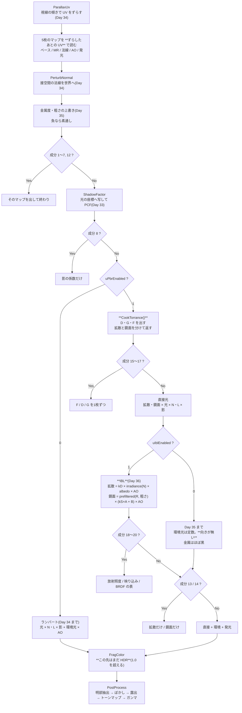

**読み取ってほしいのは順番の必然性**で、上から下へ「動かせない理由」がある。

| 段 | なぜここでなければならないか |
|---|---|
| UV が先 | ずらす前の UV で1枚でも読むと、その成分だけ凹凸から浮く(Day 34) |
| 法線が次 | BRDF の入力が N なので、差し替えは呼ぶ前に済んでいる必要がある |
| 上書きはその後 | マップを読んでから潰す。逆にすると上書きがマップに掛け算されてしまう |
| BRDF は影の後 | 影は BRDF の中身に関係しない**係数**なので、外で掛けるほうが式が澄む |
| 環境光は最後 | 直接光と足すだけ。**AO は環境光にしか掛けない**(Day 33 の要点) |
| IBL はその中 | **定数の環境光を差し替えただけ**。直接光側は1行も変わっていない |

**`CookTorrance` が `out` を5つ持っている**のがこの図のいちばん不格好なところで、
拡散・鏡面・D・G・F を全部外へ出している。

戻り値1つで済ませるほうがきれいだが、それだと
「金属なのに拡散が残っている」「非金属なのに鏡面が色付き」といった取り違えが
**合成した絵からは絶対に見えなくなる**。
成分 13〜17 は、そのために外へ出した5つをそのまま画面に出しているだけ。

**分岐が多いのは GPU では本来まずい**。
GPU は近くの画素をまとめて動かすので、
枝が分かれると**両方の枝を実行してから片方を捨てる**ことがある。
本番のエンジンはこれを `#define` を変えた**シェーダバリアント**に分けるが、
今日は「1本のシェーダで全部見られる」ことを優先した。
成分の分岐は画面全体で同じ値を取る(uniform 分岐)ので、実際には安く済んでいる。

**Day 36 で差し替わったのは環境光の枝だけ**。
直接光(`CookTorrance`)も影も法線マップも視差も、今日は1行も触っていない。
「環境光は定数」という一行が「環境光には向きがある」になっただけで
金属の見え方が一変する——**押さえるべきは差分の小ささのほう**。

**`FragColor` はまだ HDR**。金属のハイライトは 1.0 を軽く超えて出る。
Day 31 で RGBA16F のシーンバッファを用意しておいたので、
ここで切られずに後処理まで届く——
**8bit(Shift+1)に落とすと、粗さの左端が全部同じ白になる**のを確かめられる。
PBR と HDR が対で語られるのはこのため。

### HDR パイプラインの中身 — 10 回のフルスクリーンパス

`_post.End()` の中で何が起きているか。**入力と出力を全部書き出す**と、
ping-pong の必然性がそのまま見える。

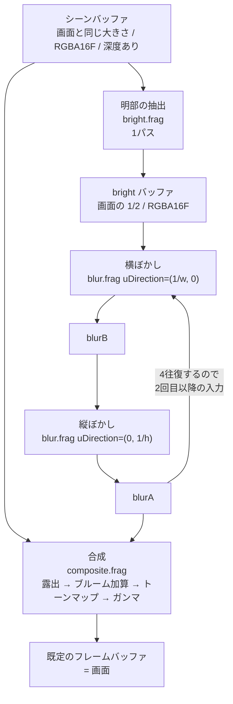

パスの数は **1(明部)+ 4×2(ぼかし)+ 1(合成)= 10**。
画面に出ている `パス:10` はこれを数えている。

**なぜ `blurA` と `blurB` の2枚が要るのか**。
GPU は「同じテクスチャを読みながら同じテクスチャへ書く」ことを許さない
(読み書きの順序が保証されないので結果が未定義になる)。
だから横ぼかしの結果を別の場所に置き、それを読んで縦ぼかしを書く、を繰り返す。
これが ping-pong で、後処理を書き始めると必ず最初にぶつかる制約になる。

**`bright` を `blurA`/`blurB` と別に持っている**のは、
中間バッファの表示(Shift+4)で「ぼかす前の明部」を見たいから。
表示のためだけに 1/2 サイズのバッファ1枚(1920x1080 なら 4MB)を払っている。
本番用に絞るなら、`bright` を捨てて `blurA` に直接書けば1枚減らせる。

**バッファの大きさが2種類ある**ことにも意味がある。

| バッファ | 大きさ | 形式 | 深度 | なぜ |
|---|---|---|---|---|
| scene | 画面と同じ | RGBA16F | あり | 3D を描くので深度が要る。原寸でないと絵がぼける |
| bright / blurA / blurB | 画面の 1/2 | RGBA16F | **なし** | **ぼかしたものを縮めても分からない**。板1枚なので深度も要らない |

半分にするとピクセル数が 1/4 になり、ぼかし 8 パスのコストがそのまま 1/4 になる。
おまけに「縮めて拡大する」こと自体が弱いぼかしとして働くので、
同じタップ数でより広く滲む。**質を落とさずに 4 倍安くなる**、後処理では珍しく素直な最適化。

### FixedUpdate の中身 — 入力の出どころと3つのバックエンド

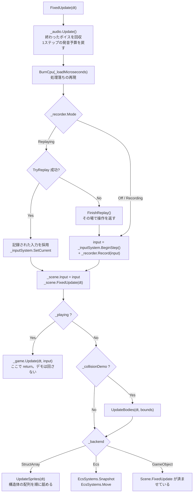

**音の後始末を先頭に置いた**のは、音を要求するのがこの下だから。
予算を戻す場所と使う場所を近くに置くと、「いつリセットされるのか」を追う必要がなくなる。
描画側(`OnRender`)に置くと、シミュレーションが 5Hz のときに
「1フレームに複数ステップぶんの音が要求されるのに予算は 1 回ぶん」というずれが起きる。

**入力がどこから来たかを、この関数から下は誰も気にしない**のがポイント(Day 20 の要点1)。
`InputSnapshot` という値に畳んであるので、記録の再生と実操作を1行で差し替えられる。

`Scene.FixedUpdate` を `_backend` の分岐より前で必ず呼んでいるのは、
**プレイヤーと階層の実演がどのモードでも Scene 側にいる**ため。

### Scene.FixedUpdate の4段階

順番に意味がある。入れ替えると壊れる。

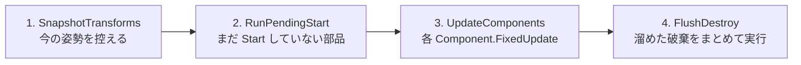

| 段 | なぜその位置か |
|---|---|
| 1 | **動かす前**に控えないと、補間の始点が終点と同じになって補間が効かない |
| 2 | `Start` の中で新しいオブジェクトが生まれるので、**開始時点の件数だけ**回す |
| 3 | ここも開始時点の件数で止める。このステップで生まれたものは次のステップから |
| 4 | 更新中にリストから消すと**走査中のインデックスがずれる**(Day 22 の要点5)。<br/>まとめて `RemoveAll` するのは、1個ずつ消すと O(n^2) になるため |

### 非同期テクスチャロードの流れ

`Q` キーで走る道。**GL を呼ぶ部分と呼ばない部分の境目**が、
そのままスレッドの境目になっている(Day 21 の要点5)。

```mermaid
sequenceDiagram
    participant P as Program
    participant RM as RenderResources
    participant TP as スレッドプール
    participant Q as _decoded キュー
    participant GL as OnRender(描画スレッド)

    P->>RM: LoadTextureAsync(path)
    RM->>RM: 仮の絵でスロットを確保
    RM-->>P: Handle を即返す
    RM->>TP: Task.Run(復号)
    Note over P,GL: この間もフレームは止まらない<br/>ハンドルを解くと仮の絵が出る
    TP->>TP: Texture.DecodeFile(GL を呼ばない)
    TP->>Q: DecodedJob を積む
    GL->>RM: Update()
    RM->>Q: TryDequeue
    RM->>RM: IsAlive で生存確認
    RM->>GL: Texture.FromPixels でアップロード
    RM->>RM: Replace(handle, texture)
    Note over P,GL: 次のフレームから本物が出る<br/>呼び出し側のコードは一切変わらない
```

`Update()` が `MaxUploadsPerFrame` で枚数を絞っているのが肝で、
**復号を非同期にしても、アップロードをまとめてやるとそこでカクつく**(Day 21 の要点6)。

### 衝突判定の3段 — ブロードフェーズが割り込んだ

Day 25 の `UpdateBodies` は「動かす → 総当たり → 押し戻す」の3段だった。
今日、真ん中が**「組を絞る」と「絞った組を判定する」に割れる**。

```mermaid
flowchart TD
    S["UpdateBodies(dt, bounds)"] --> MV["1. 全体を動かす<br/>位置と回転を進め、壁で跳ね返す<br/>壁は外接 AABB で見る"]
    MV --> SFX{"壁に当たった<br/>かつ _collisionSfx ?"}
    SFX -->|Yes| PB["PlayBounce<br/>X 位置で左右に振る<br/>大きさでピッチを変える<br/>速さで音量を変える"]
    SFX -->|No| BP
    PB --> BP{"_broadphase"}

    BP -->|BruteForce| BF["2a. 全部の組<br/>for i, for j = i+1<br/>n(n-1)/2 組"]
    BP -->|UniformGrid| GB["2b. 外接 AABB を作る<br/>_bodyBounds に詰める"]
    GB --> GC["Grid.Configure<br/>マスの大きさを決める"]
    GC --> GD["Grid.Build<br/>数える→接頭辞和→詰める"]
    GD --> GP["Grid.CollectPairs<br/>候補の組だけを集める"]

    BF --> NR["3. Resolve i, j<br/>方式が違っても同じ関数"]
    GP --> NR
    NR --> T["Test(in Body a, in Body b)<br/>形の組で振り分け"]
    T --> H{"contact.Hit ?"}
    H -->|No| NR
    H -->|Yes| CNT["接触数を数える<br/>色を赤にする"]
    CNT --> RV{"_resolveOverlap ?"}
    RV -->|Yes| PS["4. 半分ずつ押し戻す<br/>a -= n*d/2 , b += n*d/2"]
    RV -->|No| NR
    PS --> NR
```

発音の要求が**移動の段にある**ことに注意。
「壁に当たった」はブロードフェーズの外で分かることなので、
組の絞り込みとは無関係にここで出る。
体どうしの接触音を鳴らすなら `Resolve` の中になるが、
2000 体で 7,425 組が接触しているので**要求だけで 7,425 回**になる。
要点3の 7.3μs を掛けると 54ms。今日は壁だけにしてある。

図で見てほしいのは**2つの経路が `Resolve` で合流している**ところ。
方式ごとにナローフェーズを書き分けると、
「答えが違う」となったときに原因がブロードフェーズなのか判定なのか分からなくなる。
合流させておけば、**違いが出たら必ず組の選び方が原因**と言い切れる。
`F12` の自己チェックが「接触数が一致」だけで意味を持つのはこの形のおかげ。

もうひとつ、**押し戻し(4段目)がグリッドの構築より後にある**ことに注意。
押し戻すと位置が動くので、ステップの頭で組んだ格子は少しずつ古くなる。
押し戻し量は 1 ステップぶんの重なりぶんしかないので実用上は問題にならないが、
厳密にやるなら「判定を全部済ませてから、まとめて押し戻す」形にする。
Phase 7 のインパルス解決がその形になる。

### 均一グリッドの中身 — 2つの関数しかない

`SpatialGrid` の公開メソッドは実質 `Build` と `CollectPairs` の2つだけ。
中で何が起きているかは、コードを読むより図のほうが早い。

```mermaid
flowchart TD
    subgraph B["Build(bounds) — 格子を組む"]
        B1["パス1: 数える<br/>各体の AABB が触れるマスに +1<br/>_cellStart[cell+1]++"]
        B2["パス2: 接頭辞和<br/>個数を開始位置に変える<br/>_cellStart[c] += _cellStart[c-1]"]
        B3["パス3: 詰める<br/>もう一度なめて _entries へ書く<br/>書き込み位置は _cursor が持つ"]
        B1 --> B2 --> B3
    end

    subgraph C["CollectPairs(bounds) — 候補を集める"]
        C1["体 i について<br/>stamp = ++_stamp"]
        C2["i が触れるマスを順に見る"]
        C3{"j > i ?"}
        C4{"_mark[j] == stamp ?"}
        C5["_mark[j] = stamp<br/>同居 1 組と数える"]
        C6{"AABB が重なる ?"}
        C7["_pairs に積む"]
        C1 --> C2 --> C3
        C3 -->|No| C2
        C3 -->|Yes| C4
        C4 -->|Yes| C2
        C4 -->|No| C5 --> C6
        C6 -->|No| C2
        C6 -->|Yes| C7 --> C2
    end

    B3 --> C1
```

3つの絞りが直列に並んでいるのが分かる。

| 絞り | 落とすもの | 4000 体での実測(マス 32px) |
|---|---|---|
| 格子 | 別のマスにいる組 | 7,998,000 → 72,527 |
| `j > i` と印 | 同じ組の重複 | (上の数に含まれる) |
| AABB | 同じマスだが離れている組 | 72,527 → 24,733 |

**最後の AABB がまだ 3 分の 1 に減らしている**のが面白いところで、
「同じマスにいる」は「近い」でしかない。
7.4ns の AABB 判定を挟むことで、24〜120ns のナローフェーズを 5 万回節約している。

`j > i` の条件だけでは重複が消えないことは、実際に印を外すと確かめられる
(自己チェックの「重複した組が無い」が落ちる)。

`Test(in Body, in Body)` の中身は形の組み合わせ表そのもの。**3種類で6通り**になる。

| a \ b | Circle | Box | RotatedBox |
|---|---|---|---|
| **Circle** | `Test(Circle, Circle)` | `Test(Circle, Aabb)` | `Test(Circle, Obb)` |
| **Box** | 上を**符号反転** | `Test(Aabb, Aabb)` | OBB 同士へ寄せる |
| **RotatedBox** | 上を**符号反転** | OBB 同士へ寄せる | `Test(Obb, Obb)` SAT |

- **専用の速い経路**(AABB 同士、円同士)と**一般形**(OBB 同士の SAT)を併存させ、
  組み合わせの穴は一般形で埋める。`F9` の自己チェックで**両者の答えが一致すること**を確認している
- 引数の順が逆になる組(`Test(Box, Circle)`)は**法線の符号を反転**して返す。
  ここを間違えると物体がめり込む方向へ押される(要点6)
- 種類を1つ足すと表が1行1列増える。3D で球・箱・カプセル・平面・地形と並べると 15 通りになり、
  **その表を埋めることが物理エンジンを書くこと**になる(Phase 7)

### 音を1発鳴らすまで — 3つの関門

`Play` を呼んでから実際に音が出るまでに、3回ふるいにかけられる。
**呼んだのに鳴らないことは普通に起きる**ので、どこで落ちたかを数えられるようにしてある。

```mermaid
flowchart TD
    S["Play(clip, volume, pitch, pan)"] --> A{"IsAvailable ?"}
    A -->|No| N1["VoiceId.None<br/>音の出ない環境。例外は投げない"]
    A -->|Yes| B{"クリップは生きている ?"}
    B -->|No| N2["VoiceId.None"]
    B -->|Yes| C{"このステップで<br/>同じクリップを<br/>上限まで鳴らした ?"}
    C -->|Yes| N3["間引き<br/>CulledLastStep++"]
    C -->|No| D["AcquireVoice(priority)"]
    D --> E{"空きがある ?"}
    E -->|Yes| G["ボイスを設定する<br/>Buffer / Gain / Pitch / Position"]
    E -->|No| F{"奪える相手がいる ?<br/>ループ以外で<br/>優先度が自分以下"}
    F -->|No| N4["諦める<br/>CulledLastStep++"]
    F -->|Yes| ST["いちばん低い優先度<br/>同点なら最古を止める<br/>StolenLastStep++"]
    ST --> G
    G --> H["alSourcePlay<br/>7.3us かかる"]
    H --> I["VoiceId を返す<br/>添字 + 世代"]
```

**「諦める」が2箇所ある**のが要点。
間引き(`C`)は「同じ音が多すぎる」で落とし、
`F` は「ボイスが足りず、しかも自分より偉い音しか鳴っていない」で落とす。
前者は音として意味が無いから落とすので**積極的**、
後者は資源が足りないから落とすので**消極的**。
タイトルバーで両方を分けて数えているのは、この2つが違う対処を要求するため
(前者は上限を調整する、後者はボイスを増やす)。

### 1文字が画面に出るまで — 4つの層を通り抜ける

`Draw("あ", ...)` を呼んでから画面に出るまでに何が起きるか。
**初回だけ通る道**(焼く)と、**毎回通る道**(引く・積む)が分かれているのが要点。

```mermaid
sequenceDiagram
    participant P as Program
    participant TR as TextRenderer
    participant GA as GlyphAtlas
    participant FF as FontFace
    participant TX as Texture
    participant SB as SpriteBatch

    P->>TR: Draw(batch, "あ", 位置, 16px, 色)
    TR->>TR: 行に切る / ベースラインを出す
    TR->>GA: GetOrAdd(0x3042, 16)

    alt 初回だけ
        GA->>FF: GlyphIndexOf(0x3042)
        GA->>FF: Measure(グリフ番号, scale)
        FF-->>GA: 幅 11 / 高さ 11 / 送り 16
        GA->>GA: 棚に場所を取る
        GA->>FF: Rasterize(作業用バッファへ)
        GA->>GA: 上下をひっくり返す
        GA->>TX: UploadR8(x, y, 11, 11)
        Note over GA,TX: 実測 14.3us。ここだけが高い
    end

    GA-->>TR: Glyph(切り出し位置 + 寸法)
    Note over TR,GA: 2回目からは辞書を引くだけ。61ns

    TR->>TR: penX + OffsetX / baseline + OffsetY
    TR->>TR: 整数に丸める(PixelSnap)
    TR->>SB: Draw(領域, 中心, 大きさ, 色)
    Note over SB: ここから先はスプライトと同じ道
```

図で見てほしいのは、**`alt` の中が初回にしか走らない**こと。
14.3us と 61ns の差は 234 倍あり、**キャッシュを持つかどうかがそのまま性能**になる。
だからアトラスは「使い回すためのもの」であって、
描画をまとめるため(Day 17 の動機)だけのものではない。

もうひとつ、**`TextRenderer` から `Texture` への線が無い**。
グリフを焼く判断も、GL を触るのも、全部 `GlyphAtlas` の中で閉じている。
`TextRenderer` から見れば「文字を渡すと切り出し位置が返ってくる」だけで、

### ゲームの1ステップ — 11 段の順番と、格子の使い回し

`SurvivorGame.Update` は 11 段でできている。**順番に意味がある**。

```mermaid
flowchart TD
    S["Update(dt, input)"] --> LU{"Phase == LevelUp ?"}
    LU -->|Yes| C1["上下で選択肢を動かすだけ<br/>時間は進まない"]
    LU -->|No| P1["1. プレイヤーを動かす<br/>カメラが遅れて追う"]
    P1 --> P2["2. 敵を湧かせる<br/>画面の外の円周上"]
    P2 --> P3["3. 敵を動かす<br/>プレイヤーへ向かう / 遠すぎたら消す"]
    P3 --> P4["4. 格子を組む<br/>Configure + Build"]
    P4 --> P5["5. 敵どうしを押し離す<br/>CollectPairs"]
    P5 --> P6["6. 狙う敵を探して撃つ<br/>Query"]
    P6 --> P7["7. 弾を進めて当てる<br/>弾ごとに Query"]
    P7 --> P8["8. プレイヤーの被弾<br/>Query"]
    P8 --> P9["9. ジェムを吸い寄せて拾う"]
    P9 --> P10["10. レベルアップ判定"]
    P10 --> P11{"11. HP <= 0 ?"}
    P11 -->|Yes| GO["GameOver"]
    P11 -->|No| E["おわり"]
    P10 -.->|レベルが上がったら| LV["選択肢を3つ引いて<br/>Phase = LevelUp"]
```

**10 でレベルが上がったら、そこで止まる**。
Day 29 は `while` で一気に上げていたが、選択を挟むならそれはできない——
1回に1レベルずつ処理して、選び終わってから次のレベルを見る。

入れ替えると壊れるところ:

| 順番 | なぜそこか |
|---|---|
| 4 が 3 の後 | 動かす前に組むと、**1ステップ古い位置**で判定することになる |
| 5〜8 が 4 の後 | 全部**同じ格子**を使う。組み直すと4倍のコストになる |
| 10 が 9 の後 | ジェムを拾ってからでないと、レベルが1ステップ遅れる |

**格子を1回組んで4通りに使う**のが今日いちばんの節約になっている。

```mermaid
flowchart LR
    B["Grid.Build<br/>敵の外接 AABB を詰める"]
    B --> Q1["CollectPairs<br/>敵どうしの押し合い"]
    B --> Q2["Query 1回<br/>狙う敵を探す"]
    B --> Q3["Query × 弾の数<br/>当たった敵を探す"]
    B --> Q4["Query 1回<br/>プレイヤーに触れた敵"]
```

実測(敵 509 体):

| | 組の数 |
|---|---|
| 総当たりなら | 129,286 組 |
| 格子の候補 | **594 組** |

**99.5% 減っている**。押し合いは「全員対全員」なので、
格子が無ければこの演出はそもそも載らない(Day 26 の要点5)。

そして 2〜4 は `CollectPairs` ではなく `Query` を使う。
**1対多は組の列挙では表せない**——
弾1発について「近くにいる敵」を知りたいだけなので、
全部の組を作ってから絞るのは無駄になる。

### 武器3種 — 当たり判定をどこに置くか

3つの武器の違いは、突き詰めると<b>当たり判定をどこに置くか</b>だけになる。

```mermaid
flowchart TD
    W["UpdateWeapons(dt)"] --> K{"武器の種類"}

    K -->|Bolt| B1["タイマーを刻む"]
    B1 --> B2["いちばん近い敵を Query で探す"]
    B2 --> B3["Projectile を Count 発ぶん作る<br/>少しずつ角度をずらす"]
    B3 --> B4["**当たり判定は UpdateProjectiles 側**<br/>飛んでいる間ずっと残る"]

    K -->|Orbit| O1["角度を進める<br/>Angle += Speed * dt"]
    O1 --> O2["**毎ステップ**判定する<br/>刻むとすり抜ける"]
    O2 --> O3["球ごとに Query → 円判定"]
    O3 --> O4["**Damage は毎秒**<br/>dt を掛けて削る"]

    K -->|Aura| A1["タイマーを刻む"]
    A1 --> A2["半径 Radius の円で Query"]
    A2 --> A3["範囲の敵をまとめて削る<br/>**位置すら持たない**"]
```

| | 当たり判定の置き場所 | 残るか | 刻むか |
|---|---|---|---|
| ボルト | `Projectile` の配列 | 寿命まで残る | 発射を刻む |
| オービット | その場で計算 | **残らない** | **刻まない**(毎ステップ) |
| オーラ | プレイヤーの周り | 残らない | 削りを刻む |

**「武器 = 弾を出すもの」と決めつけて設計すると、オービットとオーラが入らない**
(Day 29 の改造課題3で触れた分かれ道)。
今日の形は、`WeaponState` を「種類とレベルとタイマー」だけにして、
<b>当たり方は種類ごとの関数に任せる</b>——
つまり案A(enum + 分岐)を選んでいる。

3種類のうちはこれが読みやすい。5種類を超えたら、
`WeaponStats` のフィールドの意味が武器ごとに違うのが苦しくなるので、
そこが案C(完全にデータで持つ)へ移る目安になる。

### オービットだけ刻まない理由

これは実装中に実際に踏んだところ。**最初は 0.22 秒ごとに判定していて、
オービットだけで 40 秒遊んで撃破 0 体**になった。

```mermaid
flowchart LR
    T1["t=0.00s<br/>球はここ"] -->|"0.22秒で 50px 進む"| T2["t=0.22s<br/>球はここ"]
    E["敵はこの間にいた<br/>**一度も判定されない**"]
    T1 -.-> E
    T2 -.-> E
```

球は 1 秒に 200px 以上動く。0.22 秒ごとに位置を見ると、
**1回の判定の間に 50px 飛ぶ**。球の直径は 22px しかないので、
その間にいた敵はすり抜ける。

Day 25 の改造課題3(速い弾が細い壁をすり抜ける)とまったく同じ話が、
**攻撃側で起きた**ことになる。直し方も同じ2択で、

1. 移動前と移動後を結んだ範囲で判定する(連続衝突判定)
2. **毎ステップ判定して、ダメージを時間で割る**

ここでは 2 を採った。触れている間ずっと削る形になるので、
「巻き付いて削る武器」という手触りにも合う。
そのぶん `WeaponStats.Damage` の単位が武器で変わる
(オービットだけ「毎秒」)——**気持ち悪いが、揃えると片方が嘘になる**。

## 完成条件

```
dotnet run --project reference/Day36 -c Release
```

起動すると DamagedHelmet が出る。**背景が黒くなくなっている**のがまず目に入るはず。
そして兜の金属部分に、空と地面が映り込んでいる。

コンソールに焼いた結果が出る。

```
環境マップ: 空 1024x512 → キューブ 256 / 放射照度 32 / 事前フィルタ 128x5段 / BRDF表 128
  焼き 762ms(空の生成 44ms / BRDF表 701ms)  3.8MB
```

**大半が BRDF の表**なのが分かる。GPU のパスは全部合わせて 20ms 足らずで、
CPU で 1600 万回の重点サンプリングを回しているところが効いている。

### 1. `Ctrl+Alt+9`: 材質グリッド + IBL

**今日の到達点はこの1枚**。Day 35 で真っ黒だった上の行(金属)に景色が映る。

| 見るところ | 期待 |
|---|---|
| **左上(鏡の金属)** | 空と地面が丸ごと映る。**球面鏡そのもの** |
| 上の行を右へ | 映り込みがぼけていく。粗さ 1.0 では「空の平均色」になる |
| 下の行(非金属) | 全体がわずかに明るくなる。映り込みは縁だけ |
| どの球も下半分 | 地面の色を拾って暗い。**環境光に向きがある**ことの現れ |

### 2. `Ctrl+Alt+1`: IBL を切る

**金属の行が黒に戻る**。Day 35 の絵がそのまま戻ってくるので、
今日の差分が1押しで分かる。

参考までに、材質グリッドの画素を読み出して比べた実測値
(金属度 1.0 の行、粗さ 0 → 1)。

```
  IBL ON   168 → 210 → 126     空が映るので、粗さによらず明るい
  IBL OFF  111 → 188 →  86     ハイライト以外はほぼ環境光の定数だけ
```

### 3. `Ctrl+Alt+4`: 事前フィルタの段を空に出す

空が段ごとにぼけていく。**粗さ 0.25 刻みでどれだけぼけるか**が直接見える。

これを見ておくと、材質グリッドの「右へ行くほど映り込みがぼける」が
どこから来ているのかが腑に落ちる——
**球ごとに違う段を引いているだけ**で、ぼかしはすべて焼くときに済んでいる。

### 4. `Ctrl+Alt+8`: 事前フィルタを使わない

粗さを無視して原寸を引くようにすると、**粗い金属まで鏡になる**。
さらに太陽の反射が点として散り、動かすとちらつく。

事前フィルタが何をしているかの裏返しで、
「ぼかしておく」という一手間がどれだけ効いているかが分かる。

### 5. `Ctrl+Alt+6`: 空を 8bit に落として焼き直す

**環境光がのっぺりする**。金属の映り込みから太陽が消え、全体が均一な明るさになる。

Day 31 で「シーンバッファを 8bit にすると露出を下げても上の段が戻らない」を見た。
今度は**光源の側**で同じことが起きる——
1.0 で切った時点で、環境光の大半を担っていた太陽が失われている。

### 6. `Ctrl+Alt+5`: 太陽を回す

空・影・映り込みが**同時に**動く。手で焼いた空の太陽を
平行光源と同じ向きから作っているので、最初から辻褄が合っている。

そして **700ms 前後フレームが止まる**。IBL は「環境が動かない」前提の技法だ、
ということが体で分かる(要点7)。

### 7. `Ctrl+Alt+7`: 焼いた3枚を1枚ずつ見る

| 成分 | 見え方 | 読み取れること |
|---|---|---|
| 18 放射照度 | ぼんやりした色。上向きの面が青、下向きが暗い | **法線だけで決まる**ことが分かる |
| 19 映り込み | 空と地面が球面に映る | 粗いところほどぼけている |
| 20 BRDF の表 | 赤(A)と緑(B)の帯 | 縁(N・V 小)で B が立ち上がる |

### 8. `Ctrl+Alt+0`: 自己チェック

11 項目。**焼いたものが正しいかは絵からは判定できない**ので、
数字で確かめる。

| 項目 | なぜ大事か |
|---|---|
| 焼いたキューブが元の空と一致 | **上下反転と方位のずれ**をここで捕まえる |
| いちばん明るいテクセルが太陽の向き | 同上。方位のずれは絵から気づけない |
| 放射照度が CPU の半球積分と一致 | **まったく違う書き方で同じ積分**をした2つを突き合わせる |
| BRDF の表: A + B が 1 以下 | 光を作り出していないこと |

## 改造課題

### 課題1(易): 空を差し替えて、シーンの印象を変える

`SkyImage.Sample` を書き換える。夕暮れ(地平線が赤く、太陽が低い)、
曇り(太陽を消して全天を均一に)、屋内(上が暗く、窓の方向だけ明るい)など。

**焼き直しは `Ctrl+Alt+5` を2回押せばよい**(60 度回って戻ってこないが、
太陽の位置が変わるだけなので確認には足りる)。
起動し直すのがいちばん確実。

見どころは<b>金属の球</b>。空を変えると、金属だけが劇的に変わって
非金属はほとんど変わらない——「金属は映り込みしか返さない」が絵として出る。

曇りにすると影が消えたようになる(平行光源は残るので完全には消えない)。
**環境光だけで陰影が付く**ことが確かめられるのは、この課題がいちばん分かりやすい。

### 課題2(中): 本物の HDRI を読み込む

Radiance の `.hdr` 形式(RGBE)を読む。仕様は単純で、
テキストのヘッダ + RLE 圧縮されたスキャンライン。
1画素 4 バイトで、RGB の仮数部と共通の指数部が入っている:

```
  色 = (R, G, B) * 2^(E - 128) / 256
```

読めたら `SkyImage.Create` の戻り値と差し替えるだけで、
**それ以外は1行も変えずに動く**——正距円筒の float 配列という
同じ形にしてあるのはこのため。

[Poly Haven](https://polyhaven.com/hdris) の CC0 HDRI を 2K で落としてくるとよい。
**`.gitattributes` は既に `.hdr` を LFS に送るようになっている**(Day 32 で用意した)。

ここまでやると Day 39(デモの組み上げ)の入口が済む。

### 課題3(難): 動く太陽に耐えられるようにする

`Ctrl+Alt+5` の 700ms を、フレームを止めずに払えるようにする。方針はいくつかある。

1. **1フレームに1面ずつ焼く**。6面 x 3枚 = 18 フレームに分散する。
   途中の状態が見えるので、切り替わりが不自然にならないか確かめること
2. **放射照度を球面調和(SH)で持つ**。9 係数で拡散ぶんが表せるので、
   キューブマップを焼く代わりに係数を積分する。
   **係数どうしを補間できる**のが大きく、時間帯の遷移が滑らかになる
3. **時間帯ごとに焼いておいて補間する**。いちばん素朴だが、VRAM を食う

2 が本命で、実際のエンジンはたいてい拡散を SH、鏡面をキューブマップで持っている。
9 個の float で半球ぶんの光が表せる、というのは初見だと信じがたいが、
**放射照度がとても滑らかだから**(要点3)成り立つ話になっている。

## 動作確認済み環境

- Windows 11 Home / .NET 10
- GL_RENDERER: NVIDIA GeForce RTX 3070/PCIe/SSE2
- GL_VERSION: 3.3.0 NVIDIA 596.49

### 自己チェック(11 項目すべて合格)

```
[IBL の自己チェック]
  [OK] 3枚 + 表がそろっている
  [OK] 事前フィルタが5段ある(粗さ 0 / 0.25 / 0.5 / 0.75 / 1.0)  5 段 / 128x128
  [OK] 焼いたキューブが元の空と一致(上下反転も方位のずれもここで出る)
       1,528 点 / 最大誤差 0.2%(+X)
  [OK] いちばん明るいテクセルが太陽の向き(方位の取り違えが出る)
       ずれ 0.53 度  明るさ 307
  [OK] 上の面が下の面より明るい(空と地面が逆さまでない)  上 0.768 / 下 0.070
  [OK] 放射照度が CPU の半球積分と一致(誤差 15% 未満)  最大誤差 0.8%(+Y)
  [OK] 放射照度は環境マップよりばらつきが小さい  環境 16.108 → 放射照度 0.146
  [OK] 事前フィルタは段が進むほどぼけている  15.921 → 3.156 → 0.680 → 0.266 → 0.155
  [OK] BRDF の表: 粗さ 0・正面で (A, B) ≒ (1, 0)  (1.0000, 0.0000)
  [OK] BRDF の表: A + B が 1 を超えない  最大 0.9999
  [OK] 鏡の金属に映る環境が 0 でない  上向きの鏡が受け取る明るさ 1.994
  所要 100ms
  すべて合格
```

放射照度は**6面とも 1% 以内**で一致した。まったく違う書き方の2つが
ここまで揃うと、両方が正しいと言ってよい。

| 面 | 焼いた値(R) | CPU の積分(R) |
|---|---|---|
| +X | 1.0625 | 1.0506 |
| -X | 0.7974 | 0.7980 |
| +Y(空) | 0.9932 | 1.0048 |
| -Y(地面) | 0.3960 | 0.3971 |

それでも閾値を 15% と緩めに置いてあるのは、**太陽の扱いに余地があるから**。
太陽は 0.045 ラジアンしかないのに対し、シェーダの刻みは 0.025 ラジアン——
3x3 点でしか捉えられないので、太陽が半球に入る向き(+Y 側)では
当たり方で数 % 動きうる。式の間違いではなく標本化の話なので、
**そこを見込んだ閾値**にしてある。

### 焼く時間と容量

| 段 | 実測 |
|---|---|
| 空の生成(CPU / 1024x512) | 44 ms |
| 正距円筒 → キューブ(256、6面) | 数 ms |
| 放射照度(32、6面 x 15,876 サンプル) | 十数 ms |
| 事前フィルタ(128、5段 x 6面 x 1024 サンプル) | 十数 ms |
| **BRDF の表(CPU / 128x128 x 1024 サンプル)** | **701 ms** |
| 合計 | **762 ms** / 3.8MB |

**9 割が BRDF の表**。GPU に移せば 10ms を切るが、今日は CPU に置いた——
Day 35 で書いた重点サンプリングがそのまま使え、シェーダを1本増やさずに済み、
自己チェックで中身を直接確かめられる。
**環境が変わっても焼き直さなくてよい**(材質の性質しか入っていない)ので、
`Ctrl+Alt+5` の焼き直しには入っていない。

描画そのものは重くならない。IBL が増やしたのは
**テクスチャの読み込み3回**(キューブ2枚 + 表1枚)だけで、
フレーム時間に有意な差は出なかった。

### 検証の途中で分かったこと

**正距円筒の方位が 180 度ずれていた。**

`SkyImage` は `phi = u * 2π` で絵を作り、`equirect.frag` は
`u = atan2(z, x) / 2π + 0.5` で読んでいた。
`atan2` が返すのは -π〜π なので、0〜1 に写すために 0.5 を足すのは正しい。
**足したぶんを作る側で戻していなかった**。

厄介なのは、この空が方位に対してほぼ一様なこと(色は仰角だけで決まる)。
**絵を見ても分からない**——太陽の位置だけが真裏に行くので、
「空はそれらしいのに影と反射が合わない」という形で出る。

最初に書いた自己チェックは「6面の中心テクセルが、その面の向きの空の色と一致するか」
だったが、これも**方位に一様なので通ってしまった**。
テクセルごとに向きを計算して比べる形(`CubeTexelDirection`)に書き直し、
併せて「いちばん明るいテクセルが太陽の向きか」を足したところで、ようやく捕まった。

**確かめ方が対象の性質に引きずられる**、という教訓になっている。

**放射照度が下向きの面だけ 80% ずれていた。**

側面(±X / ±Z)は 0.1% 以下で一致するのに、真下を向く面だけ大きく外れた。
しかも**青が過剰**——つまり空の光が下半球に漏れている。

原因は `irradiance.frag` の `texture()`。
環境マップにはミップを作ってある(事前フィルタが要るため)。
`texture()` は隣の画素との UV の差から段を自動で選ぶが、
ここでの方向はループの中で大きく動くので、**GPU がとても粗い段を選んでいた**。
その結果、地平線の明るい空が地面側までにじんでいた。

`textureLod(..., 0.0)` で段を 0 に固定したら、全面が 1% 以内で一致した。

絵としては「なんとなく柔らかい環境光」にしか見えないので、
**CPU の積分と突き合わせるまで気づけなかった**。
Day 35 で「同じ式を2か所に持つ」と決めたことが、ここで効いている。

**空の地平線に 7 倍の段差があった。**

最初は「地面は空の 0.35 倍」と書いていた。絵としては地平線に硬い線が入るだけだが、
**キューブへ焼くと検算が通らなくなった**——
1テクセル(0.006 ラジアン)の間に明るさが 7 倍変わるので、
元の絵(1024x512)とキューブ(256)で標本化の結果が食い違う。

現実の地面も、地平線のすぐ近くは空とほとんど同じ明るさに見える。
空の値から始めて下を向くほど暗くする形(`Lerp(horizon * 2.4, ground, pow(-up, 0.45))`)
に直したら、誤差が桁で落ちた。

**「検算しやすい素材は、たいてい物理的にも素直」**という経験則の一例。

**材質グリッドが IBL で白飛びした。**

Day 35 で「見本を撮る露出」として直接光を 0.30 倍に絞ってあった。
そこへ IBL を素の強さで足したら、49 個が軒並み 230〜245 になり、
**また材質が読めなくなった**(画素を読み出して気づいた)。

露出は「その絵に入る光すべて」に掛けるものなので、
環境光にも同じ倍率を掛けるようにした(`RenderMaterialGrid`)。
直したあとは 126〜210 に収まっている。

**空と太陽は二重に数えている。**

環境マップには太陽が焼き込まれていて、それとは別に平行光源がある。
つまり**同じ太陽を2回足している**。

実務では、
  - HDRI に太陽を残して平行光源を置かない(影が出せない)
  - HDRI から太陽を抜いて、代わりに平行光源を置く(**こちらが主流**)
のどちらかにする。今日は前者の便利さ(金属の映り込みに太陽が出る)を取って、
二重計上を承知で残してある。
`SkyImage` の太陽の明るさ(300)が実際の比率(空の 10 万倍以上)より
だいぶ控えめなのも、二重計上を目立たせないための調整になっている。

**まっとうに直すなら Day 39**(デモのライティングを組む日)。
そこで本物の HDRI を入れるときに、同じ問題にもう一度当たることになる。
