# Day 39: デモ v1 組み上げ(1) — シーン構築と、絵から測る太陽

Phase 6 の9日目。**Day 31〜38 で積んだものが、初めて本番の絵の上で動く**。

## 今日のゴール

`Ctrl+Shift+F12` で、**夕暮れの裏通り**が出る。
本物の HDRI が空に張られ、その絵から測った太陽が壁を斜めに舐め、
小物が長い影を引いている。

```
  Ctrl+Shift+F12  デモ v1 の決めの構図。**今日の到達点はこの1枚**
  Ctrl+Shift+F1   デモ v1 ON / OFF(OFF で Day 38 までの絵に戻る)
  Ctrl+Shift+F2   空: HDRI / 手焼き(Day 36 の空)
  Ctrl+Shift+F3   HDRI を回す(3枚。**太陽の写り方が3通り**)
  Ctrl+Shift+F4   平行光源: HDRI から抽出 / 手書き(**影の向きが空と食い違う**)
  Ctrl+Shift+F5   環境マップから太陽を抜く(**二重計上を消す**)
  Ctrl+Shift+F6   太陽のしきい値(0.30 / 0.10 / 0.05 / 0.02)
  Ctrl+Shift+F7   影を落とす設定を一括で無視(**接地感が消える**)
  Ctrl+Shift+F8   スクリーンショットを PNG で保存
  Ctrl+Shift+F9   シーンの内訳をコンソールへ
  Ctrl+Shift+F10  シーンを読み直す(**JSON を書き換えて押す**)
  Ctrl+Shift+F11  空の回転 ON / OFF
  Ctrl+Alt+F12    今日の自己チェック
```

Day 31 から8日間、足してきたのは全部**描画の機能**だった。
HDR、glTF、影、法線、PBR、IBL、SSAO、FXAA。
どれも「その機能が見える最小のセット」——立方体と床、材質グリッド、モデル1体——
の上で確かめてきた。

今日はそれを本番の絵に載せる。載せてみて初めて分かることが3つある。

1つ目。**HDRI を1枚拾ってきて貼るだけでは絵にならない**。
絵の中には太陽が写っているのに、影を落とす平行光源は別の値のままなので、
「空はきれいなのに、影の向きだけが合っていない」という状態になる。
Day 36 の `SkyImage` に「買ってきた HDRI だとそうなる」と書いてあった、まさにそれ。
今日は**絵のほうから太陽を測って**、それを平行光源にする。

2つ目。**太陽を2回数えてしまう**。IBL の環境マップの中にも太陽が入っているので、
そこから抽出した平行光源を足すと 2 倍になる。
とくに影の中が明るくなりすぎる——影とは「平行光源が届かない場所」なのに、
IBL の中の太陽は届いてしまう。

3つ目。**シーンをコードに書くと絵作りが回らない**。
「ゴミ箱をあと 30cm 右へ」を試すたびにビルドを待つのは作業として成立しない。
シーンは JSON に出して、キー1つで読み直せるようにする。

## 事前に読む資料

- [Bruce Walter, "Real Pixels" の RGBE 参照実装](https://www.graphics.cornell.edu/~bjw/rgbe.html)
  **今日の本命その1**。Greg Ward が Graphics Gems II(1991)で発表した RGBE の、
  作者公認の C 実装。読むのは `rgbe.c` の `RGBE2float` と
  `RGBE_ReadPixels_RLE` の2つだけでよい。今日書くのはこれの C# 版
- [Radiance のファイル形式(公式仕様)](https://floyd.lbl.gov/radiance/refer/filefmts.pdf)
  ヘッダの書式と、走査線の**2つの形式**(新 RLE と旧形式)の決まり。
  17 ページ目あたりの `RADIANCE Picture` の節だけ
- [Sébastien Lagarde, Charles de Rousiers, "Moving Frostbite to PBR" (SIGGRAPH 2014)](https://seblagarde.wordpress.com/2015/07/14/siggraph-2014-moving-frostbite-to-physically-based-rendering/)
  **今日の本命その2**。4.9 節に「IBL と解析光源をどう足すか」が書いてある。
  **太陽を環境マップから抜く**理由も、単位(放射照度)の扱いもここが出どころ
- [Brian Karis, "Real Shading in Unreal Engine 4" (SIGGRAPH 2013)](https://cdn2.unrealengine.com/Resources/files/2013SiggraphPresentationsNotes-26915738.pdf)
  Day 36 で分割和近似を読んだ資料。今日は
  **面光源の representative point**(太陽を光源として別に持つやり方)のほうを見ておくとよい。
  改造課題3の下敷き
- [glTF 2.0 仕様 — `occlusionTexture`](https://registry.khronos.org/glTF/specs/2.0/glTF-2.0.html#reference-material-occlusiontextureinfo)
  「AO とメタリック・ラフネスを1枚に詰めてよい」と書いてある箇所。
  Poly Haven の `_arm` がそのまま使える理由の裏取り
- [Poly Haven](https://polyhaven.com/) と [その公開 API](https://redocly.github.io/redoc/?url=https://api.polyhaven.com/api-docs.json)
  今日の素材の出どころ。CC0。`https://api.polyhaven.com/files/<スラッグ>` で
  ダウンロード URL が全部返ってくるので、差し替えも自動化できる
- [PNG の仕様(W3C)](https://www.w3.org/TR/png/)
  スクリーンショットを書き出すのに使う。読むのは
  「5. Datastream structure」と「11.2.2 IHDR」だけ。**チャンクの形が全部**

## 理論の要点

### 1. RGBE — 3色で1つの指数を共有する

`.hdr` の1画素は 4 バイト。`(R, G, B, E)` で、実際の色は

```
  色 = (R, G, B) x 2^(E - 128 - 8)
```

`E` は**3色で共有する指数**。128 は下駄(指数を符号なしバイトで持つため)、
8 は「仮数を 0〜255 の整数で持っているぶんを 0〜1 に戻す」ぶん。
`E = 0` だけは特別扱いで真っ黒を表す。

これで **1 画素 4 バイトのまま 10 の何十乗という幅**が入る。
float を3つ並べる(12 バイト)より 3 倍小さく、8bit PNG より桁違いに広い。

弱点も一緒に見ておく。指数が共有なので、
**3色のうち一番大きい成分の精度で他の2色も決まる**。
夕焼けのように R が B より2桁大きい絵では、B の下位ビットがごっそり落ちる。
OpenEXR(半精度 float x 3)がプロの現場で使われるのはこのため。

今日 `.hdr` を選んだのは、**自分で読み切れる大きさだから**でしかない。
仕様全体でも 200 行で書ける。

### 2. 走査線は成分ごとに固めてから RLE を掛ける

`.hdr` の本体は、1本の走査線ごとに

```
  02 02 (幅の上位) (幅の下位)   ← 新形式の目印
  R の 1 行ぶん(RLE)
  G の 1 行ぶん(RLE)
  B の 1 行ぶん(RLE)
  E の 1 行ぶん(RLE)
```

という並びになっている。RLE は 1 バイトで、
**128 より大きければ「次の1バイトを (count - 128) 回」**、
128 以下なら「そのまま count バイト」。

**なぜ成分ごとに固めるのか**が読みどころ。RGBE を画素順に並べると
隣の画素と R・G・B・E が交互に来るので、同じ値が続きにくい。
成分ごとに分けると、たとえば E(指数)は空の広い面積でほぼ同じ値になり、
**ランが一気に長くなる**。これだけで `.hdr` は 2〜3 倍縮む。

「圧縮する前にデータを並べ替える」——同じ発想が
PNG のフィルタにも、頂点属性のインターリーブ解除にも出てくる。

### 3. 正距円筒の1画素が張る立体角には `sinθ` が要る

横 W・縦 H の正距円筒で、`(x, y)` の画素が張る立体角は

```
  dω = (2π/W) x (π/H) x sinθ        θ = (y + 0.5) / H x π
```

**`sinθ` が肝**。極(天頂・真下)に近い行ほど画素は横に引き伸ばされていて、
実際に占める立体角は小さい。地球儀の緯線が極で短くなるのと同じ。

これを掛け忘れると、全部足したときに 4π(= 12.566)ではなく
π²(= 9.87)になる。つまり **合計が 4π になるかどうかで検算できる**。

```
  Σ dω = 4π                     ← 掛け忘れると 9.87、2.7 もずれる
```

今日の自己チェックがまずこれを見ている。
**掛け忘れても絵はそれらしく出る**——太陽の向きも空の色も一応それらしくなり、
放射照度だけが静かに 2〜3 割ずれる。数字でしか見つけられない類の間違い。

なお、**float で 200 万回足すと 2e-4 ずれる**。
1回ぶんの立体角(1e-5 程度)を 12 まで育った合計に足すので、
下位ビットが毎回こぼれる。倍精度で足せば消える。
残るのは中点則の打ち切り誤差 `(π/H)²/24 x 4π = 4.9e-6` だけで、実測もぴったりそこに乗る。

### 4. 太陽は「絵から測る」— しきい値ひとつでよいが、破綻もする

やることは3行で書ける。

1. いちばん明るい画素の輝度を求める(ピーク)
2. ピークの 5% を超える画素を「太陽」とする
3. その画素たちについて、**向きは輝度で重み付けした平均**、
   **強さは放射照度 `E = Σ L dω`**

3 で出てくる `E` が、そのまま平行光源の色になる。
「太陽のほうを向いた面が受け取る光の量」なので、単位が合っている。

`spruit_sunrise` で実際に測るとこうなる。

| 量 | 値 |
|---|---|
| ピーク輝度 | 245026 |
| 太陽と判定した画素 | 9 個(2048x1024 のうち) |
| 立体角 | 0.000084 sr |
| **見かけの半径** | **0.30 度**(本物の太陽は 0.27 度) |
| 放射照度 | (16.72, 11.41, 3.36) |
| 全天の光に占める割合 | 75% |

見かけの半径が本物とほぼ一致するのが気持ちよいところで、
**この1つの数字で「取り出せたかどうか」が判定できる**。

そして**破綻もする**。露出段数の足りない HDRI
(撮影時に太陽が飽和しているもの)だと、太陽の芯も空も同じくらいの値になっていて、
しきい値をどこに置いても空の半分が「太陽」になる。

| HDRI | ピーク輝度 | 見かけの半径 | 判定 |
|---|---|---|---|
| `spruit_sunrise` | 245026 | **0.30 度** | 取り出せている |
| `venice_sunset` | 2639 | 0.37 度 | 取り出せてはいるが、担う光は全体の 4% |
| `the_sky_is_on_fire` | **16** | **53.4 度** | **破綻**。空の半分を太陽と判定 |

`Ctrl+Shift+F3` で3枚を回すと、この差がそのまま絵に出る。
**検出できたことにするほうが危ない**ので、半径を必ず表示するようにしてある。

### 5. 二重計上 — IBL の中にも太陽が入っている

平行光源を足すと絵が明るくなるが、**環境マップの中にも同じ太陽が居る**。
何もしないと 2 回数えることになる。

いちばん分かりやすい症状は**影の中が明るくなりすぎる**こと。
影とは「平行光源が届かない場所」なのに、IBL の中の太陽は遮蔽を知らないので届いてしまう。

対処は「環境マップを焼く前に、太陽の画素を近所の色で埋める」。
埋め草には**すぐ外側の輪の平均**を使う。空の平均で埋めると、
太陽のまわりが明るい絵ではそこだけ暗い染みになって穴が開く。

**抜く基準は抽出したときと同じにする**のが要点。
「明るさで選んだものを、明るさで抜く」ので、
平行光源に足したぶんと環境マップから消したぶんが必ず一致する。
自己チェックがこれを数字で確かめている。

```
  抜く前の全天  (20.67, 15.45, 7.28)
  太陽ぶん      (16.72, 11.41, 3.36)
  抜いた後      ( 3.96,  4.05, 3.92)   ← 引き算とぴったり合う
```

**今日の実装の限界**も書いておく。抜けるのは芯だけで、
しきい値のすぐ下のにじみ(グレア)は残る。
太陽の芯の 5% でも空の 3 万倍あるので、粗い金属にはうっすら太陽が映り続ける。
まじめにやるなら、抜いた太陽を**面光源として別に持ち**、
鏡面では解析的に評価する(Karis 2013 の representative point)。改造課題3。

### 6. 空を回す — HDRI の太陽の方位はシーンの都合と無関係

HDRI の太陽は「その写真を撮った場所での方位」に居る。
`spruit_sunrise` なら方位 35.8 度。
組んだシーンで日を当てたい向きとは、当然なんの関係も無い。

対処は2つあって、

1. **シーンのほうを回す** … 太陽の方位が HDRI ごとに違うので、差し替えるたびにやり直し
2. **空のほうを回す** … HDRI ごとに1つの角度で済む

2 を採る。しかも「何度回すか」ではなく
**「太陽にこの方位へ来てほしい」**と書けるようにしておくと、

```
  空の回転 = 測った方位 - 来てほしい方位
```

の1行で済み、**HDRI を差し替えても太陽の位置が動かない**。
`Ctrl+Shift+F3` で3枚を回したときに向きが固定されるので、
**光の質だけ**を見比べられる。

実装は焼き込みパス(`equirect.frag`)で方向を回すだけ。
そこで作ったキューブを放射照度も事前フィルタもスカイボックスも見るので、
**1か所直せば全部が付いてくる**。

### 7. 太陽の仰角が、シーンの形を決める

これは理論というより、今日実際にぶつかった話。

最初は「両側に壁のある路地」を組んだ。ところが `spruit_sunrise` の
太陽は**仰角が 8 度しかない**。高さ 5.5m の壁が落とす影は

```
  5.5 / tan(8度) = 39m
```

進む。路地の幅が 7m なら、**床には一片の日も当たらない**。
両側に壁を立てられるのは、太陽の仰角が
`atan(壁の高さ / 路地の幅)` を超えているときだけ——
幅と同じ高さの壁なら 45 度、つまり真昼しか成立しない。

なので**片側を開けた**。壁は左と突き当りだけで、右は空。
「夕方のシーンは壁を減らす」は絵作りの定石だが、
**太陽の仰角を測ってから決められる**のが今日のやり方の値打ちで、
勘で置いて暗い絵を作ってから悩む、を1周省ける。

同じ理由でシャドウマップの範囲も広げた。既定の半径 6m のままだと
遠くの影が箱から出て途中で切れる——Day 33 で
「実際のエンジンは箱を何段も作る」と書いたカスケードが要る理由が、
そのまま絵に出る(`shadowRadius` を 6 に戻すと再現できる)。

## 前Dayからの差分概要

### 新規ファイル

| ファイル | 役割 |
|---|---|
| `Render/HdrImage.cs` | Radiance の `.hdr`(RGBE)を読む。**今日の主役その1** |
| `Render/SkyAnalysis.cs` | 正距円筒の HDR から太陽を取り出す / 環境マップから抜く。**主役その2** |
| `Demo/DemoScene.cs` | シーン記述(JSON)を読んで組み立てる。**主役その3** |
| `Render/Screenshot.cs` | 画面を PNG で保存する。zlib だけ .NET に任せて自分で書く |

`Demo/` は今日できたフォルダ。**エンジンではなく、エンジンを使う側**という点で
`Game/`(卒業制作)と同じ位置に居る。

### 変更ファイル

| ファイル | 変更 |
|---|---|
| `shaders/equirect.frag` | `uSkyYaw`。焼き込みのときに方向を回す |
| `Render/Mesh.cs` | `IndexCount` を公開。三角形の枚数を数えるため |
| `Model/Model.cs` | `Part` に境界箱を追加。ノードを選り分けたときの大きさと足元 |
| `Model/GltfLoader.cs` | その境界箱をパーツごとに記録 |
| `Render/SkyImage.cs` | `Create` から `clampToLdr` を外す(頭打ちは `EnvironmentMap` へ)+ 説明の追記 |
| `Render/EnvironmentMap.cs` | `BakeFromPixels`(画像から焼く)/ `SkyYaw` / `SourceLabel` |
| `Program.cs` | デモの読み込み・光合わせ・3パスへの組み込み・キー・HUD・自己チェック |
| `Day39.csproj` | ファイル名のみ(`Day38.csproj` からリネーム) |

素材(写経の対象外):

| 置き場所 | 中身 |
|---|---|
| `assets/hdri/` | Poly Haven の HDRI 3枚(2k、CC0)。約 17MB |
| `assets/models/<5種>/` | Poly Haven の CC0 モデル 5 点(1k)。約 18MB |
| `assets/textures/pbr/<2種>/` | 舗装とれんが(1k、diff / nor_gl / arm / disp)。約 5MB |
| `assets/scenes/demo-v1.json` | シーン記述。**これを書き換えて `Ctrl+Shift+F10`** |
| `assets/POLYHAVEN.md` | 出典と作者、解像度の選び方 |
| `.gitattributes` | 新しい `.jpg` / `.bin` を LFS へ(**パスで区切って既存を巻き込まない**) |
| `.gitignore` | `screenshots/` |

### 写経する順番

依存の順に並べてある。上から順に写すと、途中でビルドが通らない状態にならない。

1. **`Render/HdrImage.cs`**(新規)
   `.hdr` を読む。**誰にも依存しない**ので、いちばん先に写せる。
   ヘッダ → 解像度行 → 走査線の3段。走査線の2形式は分けて書く
2. **`Render/SkyAnalysis.cs`**(新規)
   太陽を取り出す。こちらも `System.Numerics` だけで動く。
   `DirectionAt` が `SkyImage.Create` と裏返しの関係にあることを確かめながら写す
3. **`shaders/equirect.frag`**
   `uSkyYaw` を足す。**引く向きに回す**(符号を1つ間違えると太陽が反対へ行く)
4. **`Render/SkyImage.cs`**
   `Create` の引数から `clampToLdr` を落とす。頭打ちの処理は次で受け取る。
   クラスの説明にも Day 39 のぶんを追記(差分0にしたいなら合わせておく)
5. **`Render/EnvironmentMap.cs`**
   `BakeFromPixels` を足し、`Bake` をその上に載せ直す。`SkyYaw` と `SourceLabel` も。
   **4 より後**でないと `SkyImage.Create` の呼び出しでビルドが止まる
6. **`Render/Mesh.cs`**
   `IndexCount` を1つ足すだけ
7. **`Model/Model.cs`**
   `Part` に `BoundsMin` / `BoundsMax` を足す。**レコードの引数が増える**ので、
   次の `GltfLoader` を直すまでビルドが通らない
8. **`Model/GltfLoader.cs`**
   パーツごとの境界箱を取り、`Part` に渡す。ここまでで 7 のビルドが復旧する
9. **`Render/Screenshot.cs`**(新規)
   PNG を書き出す。`GL` にしか依存しないので、この位置ならどこでもよい
10. **`Demo/DemoScene.cs`**(新規)
    JSON を読んでシーンを組む。**6・7・8 より後**——
    `Mesh.IndexCount` と `Part.BoundsMin` / `Part.BoundsMax` を使う
    (`SkyAnalysis` と `Screenshot` は使わないので、そちらとの前後は自由)
11. **`Program.cs`**
    最後。上の全部を呼ぶ。中身は7つに分かれる:
    1. フィールド(デモの状態。HDRI の一覧・しきい値・手書きの光の控え)
    2. `OnLoad`(手書きの光を控える / 起動時は手焼きの空から始める / キー一覧の表示)
    3. `LoadDemoScene` / `UnloadDemoScene` / `BakeSky` / `DescribeSky` /
       `ApplyDemoLighting` / `FrameDemoScene` / `RenderDemoScene` / `DescribeDemoScene`
    4. `OnRender` の分岐(**デモをいちばん外側に**)と、影パス・SSAO パス・`Render3D` への組み込み
    5. キー(`Ctrl+Shift+F1`〜`F12` と `Ctrl+Alt+F12`。**switch の先頭に置く**)
    6. `DemoLabel`(HUD)と `RunSceneCheck` / `WrapDegrees`(自己チェック)
    7. `OnClosing` に `_demo?.Dispose()`

**`Program.cs` に1か所だけ、今日の機能と関係ない修正**が入っている。
`RenderModel` の直前にある `/// <summary>` が Day 32 から二重になっていて、
そのぶん `RenderEmitters` の説明から開き括弧が消えていた。
XML コメントとして壊れているだけで動作に影響は無いが、Day 39 で直してある
(コメントのみ。差分0にしたいなら合わせておく)。
**Day 32〜38 の reference には残したまま**なので、
そちらとの `git diff` にはこの2行が出る。

## 設計書

**層が1つ増えた**(`Demo/`)。Phase 6 に入ってから8日間、
足したものは全部 `Render/` の中に収まっていたので、これは久しぶりの構造の変化になる。

| 増えたもの | どこに | 何をするか |
|---|---|---|
| `Demo/DemoScene` | **新しい層** | シーン記述(JSON)を読んで「メッシュ・マテリアル・行列」の平らな並びにする |
| `DemoScene.Item` | 同上 | 描くもの1つぶん。`CastShadow` を持つ |
| `Render/HdrImage` | `Render/` | Radiance の `.hdr` を読む。**GL を1回も呼ばない** |
| `Render/SkyAnalysis` | `Render/` | 正距円筒の HDR から太陽を取り出す。**こちらも GL を呼ばない** |
| `Render/Screenshot` | `Render/` | 画面を PNG で保存する |

| 変わったもの | 何が増えたか |
|---|---|
| `Render/EnvironmentMap` | `BakeFromPixels` / `SkyYaw` / `SourceLabel`。**空の出どころが2つになった** |
| `Render/SkyImage` | `Create` の `clampToLdr` が無くなった(頭打ちは `EnvironmentMap` へ) |
| `Render/Mesh` | `IndexCount` |
| `Model/Model` | `Part` に境界箱 |

### `Demo/` を新しい層にした理由

`DemoScene` を `Scene/` に入れる案もあった。名前もそちらのほうが素直に見える。
入れなかった理由は2つ。

1つ目。**`Scene/` は毎フレーム更新されるものの入れ物**で、
`GameObject` と `Component` と `FixedUpdate` が前提にある(Day 22〜24)。
デモの背景は静止しているので、要るのは
「メッシュ・マテリアル・行列」の平らな並びだけ。
`Model` が glTF のノードの木を平らにしたのとまったく同じ理屈で、
**動かないものに階層は要らない**。

2つ目。**デモはエンジンではない**。`Game/`(卒業制作)と同じ、
エンジンを使う側の層に置きたかった。
実際 `DemoScene` が知っているのは `Render/` と `Model/` と `Core/` だけで、
`Scene/` も `Ecs/` も `Physics/` も知らない。

```
  Game/ … エンジンで作ったゲーム        (Day 29〜30)
  Demo/ … エンジンで作った見せもの      (今日)
```

キャラクターが歩き回る Day 51 では、**動くものだけが `Scene/` に載る**。
背景は今日の形のままでよい。

### `HdrImage` と `SkyAnalysis` は GL を1回も呼ばない

`Render/` に置いてあるが、この2つは `Silk.NET.OpenGL` を using していない。
入力は `float[]`、出力も `float[]` か構造体だけ。

これは `SkyImage`(Day 36)と `SurfaceMaps`(Day 34)と同じ性格で、
**「絵を作る/読む CPU 側の道具」**という一群になっている。

| クラス | 入口 | 出口 | GL |
|---|---|---|---|
| `SurfaceMaps` | パラメータ | `byte[]` x3 | 呼ばない |
| `SkyImage` | 太陽の向き | `float[]` | 呼ばない |
| `HdrImage` | ファイルのパス | `float[]` | 呼ばない |
| `SkyAnalysis` | `float[]` | `Sun` / `float[]` | 呼ばない |

GL を呼ばないことの配当がはっきり出るのが**自己チェック**で、
`RunSceneCheck` の前半は窓もコンテキストも要らずに走る。
「立体角の合計が 4π か」「RGBE の格子に乗っているか」は
**描かなくても確かめられる**種類の問いなので、そこを分けておくと検算が軽くなる。

### 空の出どころが2つになった

Day 36 の `EnvironmentMap.Bake` は「太陽の向きを渡すと空を焼いてくれる」形だった。
今日から HDRI も入るので、こう割れた。

```
  Bake(sunDirection, w, h)
      └→ SkyImage.Create で作る ──┐
                                  ├→ BakeFromPixels(pixels, w, h, screen, label)
  HdrImage.Load(path)  ───────────┘        └→ キューブ → ミップ → 放射照度 → 事前フィルタ
```

**2 段目から先はまったく同じ道**を通る。
Day 36 の設計書に「Day 39 で本物の HDRI を差し込むときは
**この層を差し替えるだけ**で済む」と書いた読みが、そのとおりに効いた形。

ついでに `SkyImage.Create` から `clampToLdr` の引数を外した。
1.0 で頭打ちにする処理(`Ctrl+Alt+6`)は `BakeFromPixels` へ移してある——
出どころが2つになったので、**どちらから来た画像でも同じ場所で切る**ほうが辻褄が合う。

### 影を落とすかどうかが、データになった

Day 33 の `RenderShadowPass` にはこう書いてあった。

> 実際のエンジンはこれをマテリアルかコンポーネントのフラグ(`CastShadow`)で持つ。
> ここで手書きの分岐にしてあるのは、まず「選ぶ必要がある」ことを見るためで、
> フラグにするのはシーン側に影を載せる Day 39 の仕事になる。

その宿題が片付いた。`DemoScene.Item` が `CastShadow` を持ち、
深度パスはそれを見るだけになる。

効き目は「分岐が消えた」ことより、**3つのパスが同じ並びを回るようになった**ことのほうが大きい。

| パス | 何を回すか | 選び方 |
|---|---|---|
| 深度(影) | `Items` | `CastShadow` が true のものだけ |
| 幾何(SSAO) | `Items` | **全部**。そこにある物は必ず周りを遮る |
| 本描画 | `Items` | 全部 |

SSAO に選択の余地が無いのが対比として面白いところで、
影は「落とす側/受ける側」を選べるが、環境遮蔽は選べない。
地面を外すと壁との入隅に暗がりが出なくなる。

Day 38 の設計書を丸ごと引き継ぎ、差分の当たった図にだけ手を入れてある。
変わった図は次の5つ。

| 図 | 何が変わったか |
|---|---|
| 全体構成 | **`Demo/` が増えた**。矢印は `Render` / `Model` / `Core` へ |
| `Render` のクラス図 | `HdrImage` / `SkyAnalysis` / `Screenshot` を追加。`EnvironmentMap` に追記 |
| `Model` のクラス図 | `Part` に境界箱 |
| 1フレームの流れ | **デモの枝が最優先で入った**。3つのパスが `Items` を回る |
| IBL が焼き上がるまで | 入口が2つ(手焼き / HDRI)になり、**空の回転**が挟まった |

新しく足した図が3つ。

| 図 | 何を描いたか |
|---|---|
| `Demo` のクラス図 | `DemoScene` と `Item`。**誰が何を持っているか** |
| シーンが1つ組み上がるまで | JSON → マテリアル → 板 → glTF → 足元合わせ |
| HDRI から太陽が出るまで | 読み込み → 解析 → 抜く → 焼く → 光に入れる の5段 |

写経の前に読み込む必要はない。**途中で「これは誰が呼ぶんだったか」と迷ったときに戻ってくる場所**として使う。

### 全体構成 — 9つの層と、その上のゲームとデモ

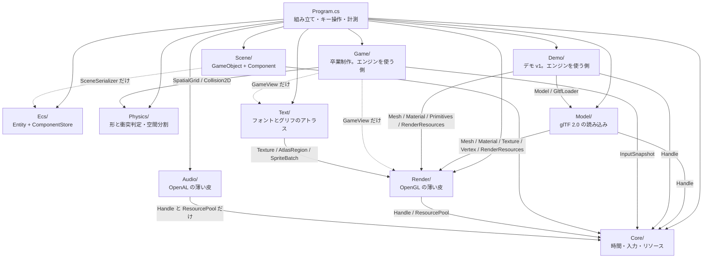
```mermaid
graph TD
    DM["Demo/<br/>デモ v1。エンジンを使う側"]
    G["Game/<br/>卒業制作。エンジンを使う側"]
    P["Program.cs<br/>組み立て・キー操作・計測"]
    S["Scene/<br/>GameObject + Component"]
    E["Ecs/<br/>Entity + ComponentStore"]
    PH["Physics/<br/>形と衝突判定・空間分割"]
    T["Text/<br/>フォントとグリフのアトラス"]
    MD["Model/<br/>glTF 2.0 の読み込み"]
    R["Render/<br/>OpenGL の薄い皮"]
    A["Audio/<br/>OpenAL の薄い皮"]
    C["Core/<br/>時間・入力・リソース"]

    P --> DM
    P --> G
    P --> S
    P --> E
    P --> PH
    P --> T
    P --> MD
    P --> R
    P --> A
    P --> C
    MD -->|"Mesh / Material / Texture / Vertex / RenderResources"| R
    MD -->|"Handle"| C
    DM -->|"Mesh / Material / Primitives / RenderResources"| R
    DM -->|"Model / GltfLoader"| MD
    DM -->|"Handle"| C
    G -->|SpatialGrid / Collision2D| PH
    G -->|InputSnapshot| C
    G -.->|GameView だけ| T
    G -.->|GameView だけ| R
    S --> C
    S -.->|SceneSerializer だけ| E
    T -->|Texture / AtlasRegion / SpriteBatch| R
    R -->|Handle / ResourcePool| C
    A -->|Handle と ResourcePool だけ| C
```

**Day 39 で層が1つ増えた**。Phase 6 に入ってから8日間、
足したものは全部 `Render/` の中に収まっていたので、久しぶりの構造の変化になる。

`Demo/` は `Game/` とまったく同じ位置に入る——
**`Program` から呼ばれ、`Render` と `Model` と `Core` を使い、
誰からも知られていない**。「エンジンを使う側」の層が2つ並んだ形。

`Game/` との違いは、下に伸びる矢印の先。

| | 使うもの | 使わないもの |
|---|---|---|
| `Game/` | `Physics` / `Core`(+ `GameView` だけ `Text` と `Render`) | `Render` の 3D、`Model` |
| `Demo/` | `Render`(3D)/ `Model` / `Core` | `Physics` / `Ecs` / `Scene` / `Text` / `Audio` |

**両方とも `Scene/` を使っていない**のが今の姿。
ゲームは構造体の配列で足りていて(Day 29 の判断)、
デモは静止しているので階層が要らない。
`Scene/`(GameObject + Component)が本領を発揮するのは
**キャラクターが歩き回る Day 51** で、そこで初めて
「動くものだけが `Scene/` に載り、背景は `Demo/` のまま」という分業になる。

**Day 37 でもクラスの増減は無い**(`Ssao` は `Render/` の中)。
Phase 6 に入ってから7日間、層は8つのまま変わっていない——
`PostProcess` / `ShadowMap` / `EnvironmentMap` / `Ssao` はどれも
「`Render/` の中で、`GL` と `Framebuffer` と `Shader` しか知らないクラス」として収まった。
Day 25 で層を切り分けた配当が、いちばん機能を足した Phase でそのまま効いている。

**Day 34 でもクラスの増減は無い**(`SurfaceMaps` は `Render/` の中)。
層が増えないまま機能だけが積み上がるのは、
Day 25 で層を切り分けた配当が続いている、と読める。

**Day 33 でクラスの増減は無かった**(`ShadowMap` は `Render/` の中)。

**Day 32 で `Model/` が1つ増えた**。矢印の向きは変わっていない。

`Model/` は `Text/` とまったく同じ位置に入る——
**`Render/` の上に乗り、`Render/` からは知られていない**一方通行。
`Text/` がグリフを `Texture` に焼いて `SpriteBatch` に積むように、
`Model/` は glTF を `Mesh` と `Material` に変換する。
どちらも「素材の形式を、描画の言葉に翻訳する層」で、性格が揃っている。

**逆向き(`Render` が glTF を知っている)にしなかった**のが要点。
そうすると `Mesh` が「glTF から作られたか、コードで作られたか」を抱え込むことになり、
Day 41 で FBX を足したくなったときに `Render/` を触る羽目になる。
`Primitives`(コードで作る)と `GltfLoader`(ファイルから作る)が
**同じ `Mesh` を作る2つの入口**として並んでいるのが、今の形。

**Day 31 で矢印を1本直した**。層は Day 29 のままだが、
`Core` ⇔ `Render` の相互参照が `Render` → `Core` の一方通行になった——
`ResourceManager` を `Render/RenderResources` へ引っ越したのがそれ(下の「相互参照だった話」)。

`Core/` の中身を実際に調べると、`Silk.NET.OpenGL` を using しているファイルは1つも無い。
**いま `Core/` は本当に時間・入力・ハンドルだけの層**になっている。

後処理は `Render/` の中で閉じている。`PostProcess` が知っているのは
`GL` と `Framebuffer` と `Shader` と `RenderResources` だけで、
**シーンに何が入っているかを一切知らない**。だから
`Program` が「今日はゲームを描く」「今日はデモを描く」と切り替えても、
後処理側は1行も変わらない。

**Day 33 の `ShadowMap` は、この方針をそのまま踏襲している**。
持っているのは深度バッファと光源行列だけで、
「何を影として落とすか」は `Begin` と `End` の間で外から描いてもらう。

```csharp
_shadow.Begin(_lightDirection, _orbit.Target);
// ここで好きなものを _shadow.Draw(mesh, model) する
_shadow.End(width, height);
```

`PostProcess.Begin` / `End` と同じ形にしてあるので、
**「シーンを知らないパス」の作り方が2例そろった**ことになる。
2例あると形が見えてくるのがよいところで、
Day 37 の SSAO も Day 52 の G-Buffer も、この形で足せる。

**Day 37 の `Ssao` が、その予告どおりに入った**。

```csharp
_ssao.BeginGeometry(_camera);
// ここで好きなものを _ssao.Draw(mesh, model) する
_ssao.EndGeometry();
_ssao.Compute(_camera, width, height);
```

`ShadowMap` との違いは、`Begin` に渡すのが**光の向きではなくカメラ**であることと、
描き終えたあとに `Compute`(フルスクリーンのパス2枚)が続くこと。
形が同じなので、`Program` 側は影パスの真下にもう1本並べるだけで済んだ。

**これが Render To Texture のいちばんの配当**で、
画面全体に効く処理(影・SSAO・被写界深度・ディファード)は
今後すべてこの位置に差し込むことになる。

**`Game` から `Audio` への線が無い**のが Day 29 から見てほしいところ。
音は鳴るが、鳴らしているのは `Program` で、ゲームは
「弾を撃った」「敵が死んだ」を <c>OnEvent</c> で外へ投げるだけ。

```csharp
public Action<GameEvent, Vector2>? OnEvent { get; set; }
```

こうしておくと、**自己チェックで 600 秒ぶんを無音で回せる**。
`SurvivorGame` が直接 `_audio.Play` を呼んでいたら、
テストのたびにデバイスを開くことになり、
音の出ない環境ではそもそも動かせない。

同じ理由で `SurvivorGame` は `GameView` も知らない。
**状態を進めるものと、状態を見るもの**が分かれている(Day 19 の線)。

| 層 | 依存先 | 備考 |
|---|---|---|
| `Physics/` | **なし** | `System.Numerics` だけ。そのまま別プロジェクトへ持ち出せる |
| `Ecs/` | **なし** | 同上。Day 23 で「他に依存しないので先に5つ書ける」と書いたとおり |
| `Scene/` | `Core`(`InputSnapshot`)、`Ecs`(`SceneSerializer` のみ) | **描画を一切知らない**。`SpriteRenderer` は絵の種類と大きさを持つデータでしかない |
| `Render/` | `Core`(`Handle` / `ResourcePool`) | `RenderResources` が箱を借りる。**GL を触るのは全部この層** |
| `Text/` | `Render`(`Texture` / `AtlasRegion` / `SpriteBatch`) | **一方通行**。`Render` は `Text` を知らない |
| **`Model/`** | `Render`(`Mesh` / `Material` / `Texture` / `Vertex` / `RenderResources`)、`Core`(`Handle`) | **一方通行**。`Render` は glTF を知らない |
| `Audio/` | `Core`(`Handle` / `ResourcePool` **のみ**) | **一方通行**。`Core` は `Audio` を知らない |
| **`Game/`** | `Physics` / `Core`(入力)。描画側だけ `Render` と `Text` | **エンジンは `Game` を知らない**。窓も GL も音も知らない |
| `Core/` | **なし** | Day 31 の引っ越しで一方通行になった(下の「相互参照だった話」) |
| `Program.cs` | 全部 | 組み立て役。9500行あるが、その大半はデモ・計測・自己チェック |

`Game/` の中でも線が引いてある。

| ファイル | 知っていること | 知らないこと |
|---|---|---|
| `GameBalance` | プレイヤー・敵・湧き・経験値の数字 | 全部 |
| `Weapons` | 武器の成長カーブ(レベル → 性能) | ゲームの状態 |
| `UpgradeOption` | 選択肢の中身と、見せる文字 | 適用の仕方 |
| `SurvivorGame` | 形と当たり判定、空間分割、入力、成長 | 描画、音、窓、GL |
| `GameView` | スプライトの積み方、文字の出し方 | ゲームを進める方法(読むだけ) |

**`GameView` が状態を1文字も書き換えない**のは意図的で、
だから描画を丸ごと止めてもゲームは同じように進む。
自己チェックが窓を出さずに回せるのはこの性質のおかげ。

**`Text/` だけが他の層の上に乗っている**。
`Physics/` も `Audio/` も自分で完結していて、単体で別プロジェクトへ持ち出せるが、
`Text/` は `Render/` が無いと成立しない——グリフを置く先が `Texture` で、
積む先が `SpriteBatch` だから。

これは歪みではなく**素直な積み方**で、`Text` → `Render` の一方通行になっている。
逆向き(`SpriteBatch` が文字を知っている)にすると、
描画の中核が「文字とは何か」を抱え込むことになる。
`SpriteBatch` から見れば、文字は**ただの四角**でしかない。

**`Core` と `Render` が相互参照だった話**(Day 25 で見つけ、Day 31 で直した)。

`ResourceManager`(Core)が `Texture`(Render)を作り、
`Material`(Render)が `ResourceManager`(Core)を呼ぶ、という往復になっていた。
名前空間が `HonyaEngine` 1つなので動きはするが、
**アセンブリを分けようとした瞬間に破綻する**形だった。

直し方は Day 25 の設計書に書いたとおりで、
**`ResourcePool` と `Handle` だけを下層に残し、窓口は `Render/` へ上げる**。
Day 31 でそれを実行し、`Core/ResourceManager.cs` は `Render/RenderResources.cs` になった。
名前も変えたのは、中で持っているのが `Texture` と `Shader` だけ——
つまり全部 GL のもので、「全リソースの窓口」という名前が中身と合っていなかったため。

**Day 27 の判断**: 音を足すとき、この歪みを繰り返さないようにした。

音のリソースも「パスをキーにして使い回し、ハンドルで配る」という点でテクスチャと同じなので、
当時の `ResourceManager` に `LoadAudio` を足すのが自然に見える。
だがそうすると `ResourceManager`(= 当時は `Core`)が **GL と OpenAL の両方を握る**ことになり、
当時の相互参照が「`Core` ⇔ `Render` + `Core` ⇔ `Audio`」に増える。

そこで `AudioSystem` は、`Core` から**総称型の `ResourcePool<T>` と `Handle<T>` だけを借りて**、
音のリソースは自分で持つ形にした。`ResourcePool<T>` は `T` が何かを知らないので、
借りても依存が増えない。結果、`Audio/` → `Core/` の**一方通行**が保たれている。

図に描いておくと、こういう判断が「なんとなく」ではなくできるようになる。
**設計書は、次に何かを足すときのために書いている**。

### Core — 時間・入力・リソース

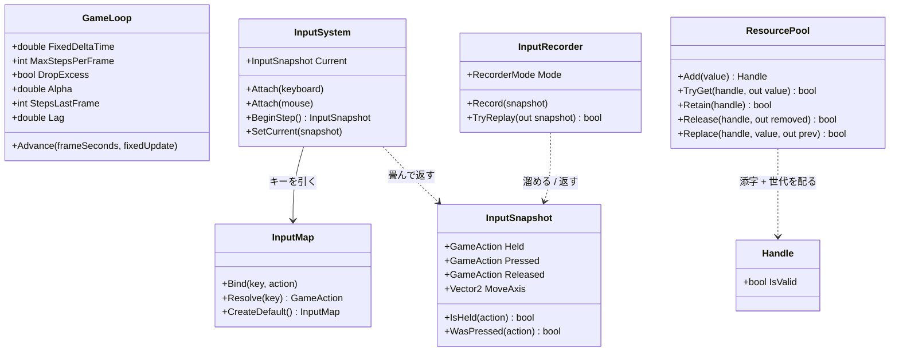
```mermaid
classDiagram
    class GameLoop {
        +double FixedDeltaTime
        +int MaxStepsPerFrame
        +bool DropExcess
        +double Alpha
        +int StepsLastFrame
        +double Lag
        +Advance(frameSeconds, fixedUpdate)
    }
    class InputSystem {
        +InputSnapshot Current
        +Attach(keyboard)
        +Attach(mouse)
        +BeginStep() InputSnapshot
        +SetCurrent(snapshot)
    }
    class InputMap {
        +Bind(key, action)
        +Resolve(key) GameAction
        +CreateDefault() InputMap
    }
    class InputSnapshot {
        +GameAction Held
        +GameAction Pressed
        +GameAction Released
        +Vector2 MoveAxis
        +IsHeld(action) bool
        +WasPressed(action) bool
    }
    class InputRecorder {
        +RecorderMode Mode
        +Record(snapshot)
        +TryReplay(out snapshot) bool
    }
    class Handle {
        +bool IsValid
    }
    class ResourcePool {
        +Add(value) Handle
        +TryGet(handle, out value) bool
        +Retain(handle) bool
        +Release(handle, out removed) bool
        +Replace(handle, value, out prev) bool
    }

    InputSystem --> InputMap : キーを引く
    InputSystem ..> InputSnapshot : 畳んで返す
    InputRecorder ..> InputSnapshot : 溜める / 返す
    ResourcePool ..> Handle : 添字 + 世代を配る
```

**`ResourceManager` がこの図から消えた**(Day 31 で `Render/RenderResources` へ引っ越した)。
実物は `Render` のクラス図のほうに載せてある。

`ResourcePool` と `Handle` は総称型(`ResourcePool<T>` / `Handle<T>`)。
`T` が何かを知らないまま添字と世代だけを管理するので、`Texture` にも `Shader` にも同じものが使える。
**`T` を知らないから下層に残せた**——引っ越しでこの2つだけ `Core/` に残したのはそのため。

この層で押さえるべき責務の線引き:

- **`GameLoop` は時間しか知らない**。何を更新するかは `Action<float>` で渡される
- **`InputSystem` はデバイスのイベントを畳むだけ**。ゲームとしての意味づけは `InputMap` が持つ
- **`InputSnapshot` は値**。だから記録・再生で丸ごと差し替えられる(Day 20 の肝)
- **`Core/` は GL を1行も知らない**。`Silk.NET.OpenGL` を using しているファイルが無い、が実際の姿

### Render — OpenGL の薄い皮


```mermaid
classDiagram
    class Camera {
        +Vector3 Position
        +Vector3 Target
        +ProjectionMode Mode
        +float AspectRatio
        +Matrix4x4 ViewProjection
        +CreateScreen(width, height) Matrix4x4
    }
    class OrbitCameraController {
        +float Yaw
        +float Pitch
        +float Distance
        +Apply()
    }
    class Shader {
        +Use()
        +SetInt(name, value)
        +SetVector3(name, value)
        +SetVector3Array(name, values)
        +SetVector4(name, value)
        +SetMatrix3(name, value)
        +SetMatrix4(name, value)
        +TryReload() bool
    }
    class Texture {
        +uint Handle
        +int Width
        +int Height
        +bool HasMipmaps
        +FromFile(gl, path) Texture
        +DecodeFile(path) DecodedImage
        +FromPixels(gl, pixels, w, h, mipmaps, srgb) Texture
        +FromFloatPixels(gl, data, w, h, components) Texture
        +DecodeBytes(encoded) DecodedImage
        +CreateR8(gl, w, h) Texture
        +CreateTarget(gl, w, h, format) Texture
        +CreateDepthTarget(gl, w, h) Texture
        +UploadR8(x, y, w, h, coverage)
        +SetFilter(filter)
        +SetWrap(wrap)
        +Bind(unit)
    }
    class TextureWrap {
        <<enumeration>>
        Repeat
        ClampToEdge
        ClampToBorder
    }
    class RenderResources {
        +int MaxUploadsPerFrame
        +int PendingCount
        +Texture Placeholder
        +LoadTexture(path, mipmaps, srgb) Handle
        +LoadTextureFromMemory(key, bytes, mipmaps, srgb) Handle
        +LoadTextureFromPixels(key, rgba, w, h, mipmaps, srgb) Handle
        +LoadTextureAsync(path) Handle
        +LoadShader(vert, frag) Handle
        +Update()
        +GetTexture(handle) Texture
        +GetShader(handle) Shader
        +Retain(handle) bool
        +Release(handle) bool
    }
    class RenderTargetFormat {
        <<enumeration>>
        Rgba8
        Rgba16F
        R8
    }
    class Framebuffer {
        +Texture Color
        +Texture Depth
        +int Width
        +int Height
        +RenderTargetFormat Format
        +long ByteSize
        +CreateDepthOnly(gl, w, h) Framebuffer
        +Bind()
        +BindDefault(gl, w, h)
        +Resize(w, h)
        +SetFormat(format)
    }
    class ShadowMap {
        +bool Enabled
        +int Resolution
        +Framebuffer Target
        +Matrix4x4 LightSpaceMatrix
        +int PcfRadius
        +int TapCount
        +float DepthBias
        +bool SlopeBias
        +bool CullFrontFaces
        +float Radius
        +float WorldPerTexel
        +bool ShowMap
        +int DrawCalls
        +long ByteSize
        +Begin(lightDirection, center)
        +Draw(mesh, model)
        +End(screenWidth, screenHeight)
        +Apply(shader, unit)
        +DrawDebug(screenWidth, screenHeight)
        +SetResolution(resolution)
    }
    class PostProcess {
        +RenderTargetFormat SceneFormat
        +bool BloomEnabled
        +ToneMapOperator ToneMap
        +PostDebugView DebugView
        +float Exposure
        +float BloomThreshold
        +float BloomIntensity
        +ColorGrade Grade
        +bool FxaaEnabled
        +FxaaQuality Quality
        +FxaaDebugView FxaaDebugView
        +float FxaaEdgeThreshold
        +float FxaaEdgeThresholdMin
        +float FxaaSpanMax
        +PostSplit Split
        +float SplitPosition
        +Framebuffer Scene
        +Framebuffer Ldr
        +int PassCount
        +long ByteSize
        +Begin(clearColor)
        +End(screenWidth, screenHeight)
        +EndToTarget(target)
        +SetFxaaQuality(quality)
        +Resize(w, h)
        +ReloadShaders()
    }
    class ColorGrade {
        +bool Enabled
        +float Temperature
        +float Tint
        +float Contrast
        +float Saturation
        +Vector3 Filter
        +GradePreset Preset
        +bool IsIdentity
        +Vector3 WhiteBalance
        +ApplyPreset(preset)
        +MarkCustom()
        +Apply(shader)
    }
    class GradePreset {
        <<enumeration>>
        Neutral
        Sunset
        Moonlight
        Bleach
        Monochrome
    }
    class FxaaQuality {
        <<enumeration>>
        Low
        Medium
        High
        Extreme
    }
    class FxaaDebugView {
        <<enumeration>>
        None
        Luma
        Edge
        Blend
    }
    class PostSplit {
        <<enumeration>>
        None
        Grade
        Fxaa
    }
    class ToneMapOperator {
        <<enumeration>>
        None
        Reinhard
        Aces
    }
    class PostDebugView {
        <<enumeration>>
        Final
        SceneOnly
        Bright
        Bloom
    }
    class TextureAtlas {
        +Texture Texture
        +FromFiles(gl, paths, padding) TextureAtlas
    }
    class AtlasRegion {
        +Texture Texture
        +Vector2 UvMin
        +Vector2 UvMax
    }
    class Material {
        +string Name
        +Handle Shader
        +Handle MainTexture
        +Vector4 Tint
        +Vector2 UvScale
        +Vector4 BaseColorFactor
        +float MetallicFactor
        +float RoughnessFactor
        +Handle MetallicRoughnessTexture
        +Handle NormalTexture
        +Handle OcclusionTexture
        +Handle EmissiveTexture
        +Vector3 EmissiveFactor
        +float NormalScale
        +Handle HeightTexture
        +float ParallaxScale
        +bool DoubleSided
        +string AlphaMode
        +Apply(resources)
    }
    class Mesh {
        +int VertexCount
        +int IndexCount
        +Draw()
        +ReadVertices() TVertex[]
        +ReadIndices() uint[]
        +Dispose()
    }
    class Vertex {
        +Vector3 Position
        +Vector2 TexCoord
        +Vector4 Color
        +Vector3 Normal
        +Vector4 Tangent
        +Attributes
    }
    class SurfaceMaps {
        <<static>>
        +int Size
        +float MortarWidth
        +CreateHeight() byte[]
        +CreateNormal(strength) byte[]
        +CreateBaseColor() byte[]
        -HeightAt(x, y) float
        -Noise(x, y, cells) float
        -Wrap(value, period) int
    }
    class SpriteVertex {
        +Vector2 Position
        +Vector2 TexCoord
        +uint Color
        +PackColor(color) uint
    }
    class VertexAttribute {
        +int ComponentCount
        +bool Normalized
        +int ByteSize
    }
    class SpriteBatch {
        +SpriteSortMode SortMode
        +int DrawCallCount
        +Begin(projection, sortMode)
        +Draw(texture, center, size, rotation, color, layer)
        +End()
    }
    class Primitives {
        +CreateQuad(gl) Mesh
        +CreateCube(gl) Mesh
        +CreateSphere(gl, slices, stacks) Mesh
    }
    class Pbr {
        <<static>>
        +float DielectricF0
        +float MinRoughness
        +Alpha(roughness, perceptual) float
        +DistributionGgx(nDotH, alpha) float
        +DirectK(roughness) float
        +GeometrySchlickGgx(nDotX, k) float
        +GeometrySmith(nDotV, nDotL, roughness) float
        +FresnelSchlick(cosTheta, f0) Vector3
        +F0Of(baseColor, metallic, dielectricF0) Vector3
        +Evaluate(n, v, l, baseColor, metallic, roughness) Vector3
        +IntegrateNdf(alpha, steps) double
        +Hammersley(i, count) Vector2
        +ImportanceSampleGgx(xi, n, alpha) Vector3
        +DirectionalAlbedo(n, v, baseColor, metallic, roughness) Vector3
        +IblK(roughness) float
        +GeometrySmithIbl(nDotV, nDotL, roughness) float
        +FresnelSchlickRoughness(cosTheta, f0, roughness) Vector3
        +IntegrateBrdf(nDotV, roughness, samples) Vector2
    }
    class CubeMap {
        +uint Handle
        +int Size
        +int MipLevels
        +long ByteSize
        +Create(gl, size, mipLevels) CubeMap
        +FullMipCount(size) int
        +EnableSeamless(gl)
        +FaceViews(eye) Matrix4x4[]
        +FaceProjection() Matrix4x4
        +Bind(unit)
        +GenerateMipmaps()
        +ReadFace(face, mip) float[]
    }
    class SkyImage {
        <<static>>
        +int Width
        +int Height
        +Create(sunDirection) float[]
        +Sample(direction, toSun) Vector3
        +IntegrateIrradiance(n, toSun, steps) Vector3
    }
    class HdrImage {
        <<static>>
        +Load(path) Result
        -ReadScanline(bytes, cursor, scanline, width, path)
        -ReadFlatScanline(bytes, cursor, scanline, width, path)
        -ReadLine(bytes, cursor) string
    }
    class HdrResult {
        <<record struct>>
        +float[] Pixels
        +int Width
        +int Height
        +float Exposure
    }
    class SkyAnalysis {
        <<static>>
        +DirectionAt(x, y, width, height) Vector3
        +Analyze(pixels, width, height, threshold) Result
        +RemoveSun(pixels, width, height, analysis) float[]
        -AngleTo(x, y, width, height, direction) float
    }
    class Sun {
        <<record struct>>
        +Vector3 Direction
        +Vector3 Irradiance
        +float SolidAngle
        +float AngularRadius
        +int PixelCount
        +float PeakLuminance
    }
    class SkyResult {
        <<record struct>>
        +Sun Sun
        +Vector3 TotalIrradiance
        +Vector3 SkyAverage
        +float SunShare
        +double SolidAngleSum
        +float Cutoff
        +int HalfFloatOverflow
    }
    class Screenshot {
        <<static>>
        +Save(gl, width, height, directory) string
        -WritePng(path, bottomUpRgb, width, height)
        -WriteChunk(stream, type, data)
        -Crc32(crc, data) uint
    }
    class EnvironmentMap {
        +int EnvironmentSize
        +int IrradianceSize
        +int PrefilterSize
        +int PrefilterMipCount
        +int BrdfLutSize
        +CubeMap Environment
        +CubeMap Irradiance
        +CubeMap Prefiltered
        +Texture BrdfLut
        +bool Enabled
        +bool SkyboxVisible
        +float Intensity
        +int SkyboxMip
        +bool UsePrefilter
        +bool ClampSkyToLdr
        +float SkyYaw
        +string SourceLabel
        +int SourceWidth
        +int SourceHeight
        +double BakeMilliseconds
        +long ByteSize
        +Bake(sunDirection, screenWidth, screenHeight)
        +BakeFromPixels(pixels, width, height, screenW, screenH, label)
        +Apply(shader)
        +DrawSkybox(camera, restoreDepthTest, restoreCulling)
    }

    class Ssao {
        +int MaxSamples
        +int NoiseSize
        +bool Enabled
        +float Radius
        +float Bias
        +float Strength
        +float Power
        +int SampleCount
        +bool BlurEnabled
        +bool HalfResolution
        +bool ApplyToDirectLight
        +SsaoDebugView DebugView
        +Framebuffer Geometry
        +Framebuffer Result
        +long ByteSize
        +BeginGeometry(camera)
        +Draw(mesh, model)
        +EndGeometry()
        +Compute(camera, w, h)
        +Apply(shader, unit)
        +DrawDebug(w, h, depthRange)
        +Resize(w, h)
        +SetHalfResolution(half)
    }
    class SsaoDebugView {
        <<enumeration>>
        None
        Occlusion
        Normal
        Depth
    }

    OrbitCameraController --> Camera : 球面座標で位置を書く
    Material ..> Shader : ハンドル経由
    Material ..> Texture : ハンドル経由
    Mesh ..> VertexAttribute : ストライドとオフセットを組む
    Vertex ..> VertexAttribute
    SpriteVertex ..> VertexAttribute
    Mesh ..> Vertex : 型引数
    Primitives ..> Mesh : 作る
    TextureAtlas *-- AtlasRegion
    TextureAtlas *-- Texture : 1枚に詰める
    SpriteBatch --> Shader
    SpriteBatch ..> SpriteVertex : 積む
    SpriteBatch ..> AtlasRegion : UV を受け取る
    Framebuffer *-- Texture : 描き込み先として所有
    Framebuffer ..> RenderTargetFormat
    Texture ..> TextureWrap
    PostProcess *-- Framebuffer : 5枚(シーン / 明部 / ぼかし2 / LDR)
    PostProcess *-- ColorGrade : つまみを所有
    PostProcess ..> Shader : 明部 / ぼかし / 合成 / FXAA
    PostProcess ..> ToneMapOperator
    PostProcess ..> PostDebugView
    PostProcess ..> FxaaQuality
    PostProcess ..> FxaaDebugView
    PostProcess ..> PostSplit
    PostProcess ..> RenderResources : シェーダを借りる
    ColorGrade ..> GradePreset
    ColorGrade ..> Shader : uniform を送る
    ShadowMap *-- Framebuffer : 深度専用を1枚
    ShadowMap ..> RenderResources : シェーダを借りる
    ShadowMap ..> Camera : 正射影行列を借りる
    ShadowMap ..> Shader : 深度 / 表示
    RenderResources ..> Texture : 作る / 配る
    RenderResources ..> Shader : 作る / 配る
    SurfaceMaps ..> RenderResources : 焼いたバイト列を預ける
    EnvironmentMap *-- CubeMap : 環境 / 放射照度 / 事前フィルタ の3枚
    EnvironmentMap *-- Texture : 元の正距円筒 と BRDF の表
    EnvironmentMap ..> RenderResources : シェーダを借りる
    EnvironmentMap ..> SkyImage : 空を焼いてもらう
    HdrImage ..> HdrResult : 返す
    SkyAnalysis ..> SkyResult : 返す
    SkyResult *-- Sun
    EnvironmentMap ..> Camera : 空を描くときのビュー射影
    EnvironmentMap ..> Primitives : 焼く用の立方体
    Ssao *-- Framebuffer : 幾何 1枚 + 遮蔽 2枚
    Ssao *-- Texture : 4x4 のノイズ
    Ssao ..> RenderResources : シェーダを借りる
    Ssao ..> Camera : ビュー行列と射影行列を読む
    Ssao ..> Shader : 幾何 / 遮蔽 / ぼかし / 表示
    Ssao ..> SsaoDebugView
    Ssao ..> RenderTargetFormat : R8 と Rgba16F
```

**`Ssao` の矢印は `ShadowMap` とほぼ同じ形**をしている。
違いは `Framebuffer` を3枚持つことと、`Texture` を自分で1枚作ること
(ノイズ。`RenderResources` に預けないのは、ファイルから来たものではないうえ、
このクラス以外が使うことが無いため)。

**`EnvironmentMap` だけが生の FBO を持っている**(Day 36 の歪み)のに対し、
`Ssao` は `Framebuffer` で足りている。キューブマップの面を挿す必要が無く、
ふつうの 2D テクスチャに描くだけだから。

**Day 39 で足した3つには矢印がほとんど無い**。これは図が手抜きなのではなく、
`HdrImage` と `SkyAnalysis` が**この層の他の誰も知らない**ため。
入口は `float[]`、出口も `float[]` か構造体だけで、
`GL` にも `Shader` にも `Texture` にも触らない。
`Screenshot` だけが `GL` を1回呼ぶ(`glReadPixels`)。

つないでいるのは `Program` で、

```csharp
HdrImage.Result image = HdrImage.Load(path);              // 読む
_skyAnalysis = SkyAnalysis.Analyze(image.Pixels, w, h);   // 測る
float[] pixels = SkyAnalysis.RemoveSun(image.Pixels, ...); // 抜く
_env.BakeFromPixels(pixels, w, h, ...);                    // 焼く
```

の4行だけ。**この並べ替えは `Program` の仕事**という線を引いてある。
`EnvironmentMap` が `.hdr` のパスを受け取る形にもできるが、
そうすると「太陽を抜くかどうか」「空を何度回すか」まで
環境マップが決めることになり、Day 36 で守った
「このクラスはシーンを知らない」が崩れる。

**`SkyAnalysis.DirectionAt` と `SkyImage.Create` は同じ式でなければならない**
(正距円筒 → 方向の変換)。コード上の依存は無いので、
図には線が引けない代わりに両方のコメントに相手を書いてある。
片方だけ直すと、手で焼いた空と読み込んだ HDRI で**太陽が別の場所に出る**——
しかも方位のずれは絵から気づけない。

**`Pbr` はどこからも矢印が出ていない**。これは描き忘れではなく、
**依存が1本も無い**ことをそのまま表している——
`GL` も `Handle` も `Material` も知らず、入力は `Vector3` と `float` だけ。

呼ぶのは `Program.RunPbrCheck` だけで、**本番の描画からは1度も呼ばれない**。
同じ式が `textured.frag` にあり、そちらが毎フレーム数百万回走る。

「同じものを2か所に書く」のは普段なら避けるべきだが、今日は取った。

| | GLSL 側(`textured.frag`) | C# 側(`Pbr`) |
|---|---|---|
| 役割 | **本番**。1フレームに数百万回 | **定義と検算**。押したときだけ |
| 確かめられること | 絵になった結果だけ | **半球を 8192 点に刻んだ積分** |
| 直したとき動くもの | 見た目 | 自己チェックの数字 |

GPU の中は覗けないので、「D の積分が 1 か」「入ってきた以上の光を返していないか」を
確かめる場所が CPU 側に要る。式が数行で、しかも**この先動かない**(物理の定義)ので、
二重管理の代償より検算できる価値のほうが大きいと判断した。

**片方だけ直す**のがいちばん怖い壊し方なので、自己チェックの最後で
`textured.frag` を実際に読んで、共有している定数(`MIN_ROUGHNESS`)と
`α = roughness²` の式が両方に入っていることを見ている。
値そのものは突き合わせられないが、**「同じ約束でいるか」は機械で確かめられる**。

**`Pbr` に IBL 用が4つ増えた**(Day 36)。
`GeometrySmithIbl` は `GeometrySmith` と **k だけが違う**——
直接光は `(r+1)²/8`、IBL は `α/2`。同じ幾何減衰なのに係数が2通りあるのは、
Day 35 の要点5 で触れた「理屈と当てはめのつぎはぎ」がそのまま出ているところ。
**取り違えると金属の縁が暗くなりすぎる**が、症状が地味なので気づきにくい。

`IntegrateBrdf` は Day 35 の `DirectionalAlbedo` とほとんど同じ積分で、
違うのは<b>フレネルを2つに割る</b>ことだけ。
Day 35 の計画書で「Day 36 の LUT がまさにそれ」と書いた回収になっている。

**`CubeMap` が抱えているのは「GL の約束」**(Day 36)。
面の並び、上下反転、90 度の画角、シームレス——
どれも**知らないと必ず踏む**が、一度書けば二度と考えたくない類のもの。
1つのクラスに閉じ込めておくと、
読む側(空・本描画・事前フィルタ)が素直に書ける。

**`SkyImage` は `SurfaceMaps`(Day 34)と同じ形**をしている。
GL を1行も知らず、返すのはただの配列で、テクスチャにするのは呼ぶ側の仕事。
違いは `byte[]` ではなく `float[]` なこと——**1.0 を超える値を運ぶ**ため。

そしてもう1つ、`SurfaceMaps` に無かったものを持っている:
<b>同じ関数を積分する CPU 版</b>(`IntegrateIrradiance`)。
GPU が焼いた放射照度が正しいかは絵からは判定できないので、
**答えを2通りの方法で出して突き合わせる**ために置いてある。
Day 35 で `Pbr` を CPU にも持った判断の、そのまま2例目になる。

**`Primitives` に球が入った**のは、材質を見比べる形が球しかないため。
立方体は面ごとに法線が一定なので、1つの面の中でハイライトが動かない——
粗さを変えても広がりが見えず、金属度の効きも読み取れない。
球は**法線があらゆる向きを1個の中で通る**ので、
フレネル(縁ほど明るい)も粗さ(ハイライトの広がり)も1個に全部出る。

そして球は、**接線を手で決められない最初の形**でもある。
板と立方体は「左下 → 右下 が U」と目で追えたが、曲面では
`∂P/∂u` を実際に計算するしかない。その結果 **`w` が -1 になる**——
Day 34 で入れた「符号1個を持つ」仕組みが、ここではじめて -1 の側で使われる。


**Day 28 で `Texture` に足したのは2つだけ**。
`CreateR8` が1チャンネルの空テクスチャを作り、`UploadR8` がその一部を書き換える。
どちらもグリフのために足したものだが、**`Texture` はグリフを知らない**——
「1チャンネル」「一部だけ更新」という一般の機能として置いてある。
同じものが Phase 6 のシャドウマップ(Day 33)でも要る。

**Day 32 で `Vertex` に法線が戻った**。Day 9 でソフトウェアラスタライザに持たせ、
Day 14 で GPU へ移したときに落としていたもの。陰影を付けていなかったので要らなかったが、
glTF のモデルは必ず持っているので、**無いと読んだデータの一部を捨てることになる**。

**末尾に足した**ので location は 0〜2 が動かず、既存のシェーダは無傷で済んだ。
位置の次に置くほうが意味の並びとしては素直だが、
そのために `sprite.vert` まで書き換える理由は無い。

**Day 34 で接線が同じやり方で足された**(location 4)。
2回続けて末尾に足せたので、この置き方は当たりだったと言える。
1頂点 64 バイトになり、DamagedHelmet で 930KB。

**`Vector4` なのは glTF の仕様に合わせたから**で、
w には ±1 しか入らない(要点3)。
「3本目の軸を持たずに済ませるための符号1個」がそのままフィールドになっている。

**`depth.vert`(Day 33)は無傷**なのも見どころ。
あちらは location 0 しか宣言していないので、
属性が4本になろうと5本になろうと影響を受けない。
**宣言しない自由**があるから、末尾に足す戦略が効き続けている。

**`SurfaceMaps` が GL を1行も知らない**のが、この層で新しい置き方。
返すのはただの `byte[]` で、テクスチャにするのは `RenderResources` の仕事になる。

```
SurfaceMaps.CreateNormal()  →  byte[]  →  RenderResources.LoadTextureFromPixels()  →  Handle
```

分けてあるので**スレッドを選ばない**(Day 21 の `Texture.DecodeFile` と同じ性質)。
起動時に3枚焼くだけなので今は同期でよいが、
枚数が増えたらそのまま `Task.Run` へ載せられる形になっている。

`Texture.FromPixels` を直接呼ばずに窓口を通すのは、
**寿命の管理とキャッシュを1箇所に残す**ため。
ここを通さずに `new` すると、そのテクスチャだけ `Dispose` の対象から外れる。

**`Mesh.ReadVertices` は「持たない」ほうへ倒した結果**(Day 34)。
自己チェックで頂点の中身を見たいが、CPU 側に控えを持つと
DamagedHelmet だけで 930KB を**使うかどうか分からないのに常に払う**。
GPU から読み返す(`glGetBufferSubData`)なら払うのは呼んだときだけで済む。
代わりに**遅い**(描画キューが空になるまで待つ)ので、検査専用の窓口になっている。

当たり判定やレイキャストで頂点が要り用になる Phase 7 で、
「持つ」へ倒し直すことを考えればよい。

**`Material` が急に太った**のが Day 32 でいちばん目に付く差分で、
これは glTF の材質定義をそのまま写したから。
「シェーダ + そのシェーダに渡す値」という Day 15 からの位置づけは変わっていない——
渡す値の種類が、仕様に合わせて増えただけになる。

**Day 31 で足したのは `CreateTarget` 1つ**。同じ理屈で、
`Texture` は「これがレンダーターゲットである」ことを知らない。
中身を渡さずに場所だけ確保し、ミップマップを作らず、ClampToEdge にする——
それだけの機能として置いてあるので、
影(Day 33)でも環境マップ(Day 36)でも G-Buffer(Day 52)でも同じものが使える。

**Day 33 で足したのは `CreateDepthTarget` 1つ**。
`CreateTarget` との違いは3つとも影のための必然になっている。

| | `CreateTarget`(Day 31) | `CreateDepthTarget`(Day 33) |
|---|---|---|
| 内部形式 | RGBA8 / RGBA16F | **DepthComponent24** |
| フィルタ | Linear | **Nearest**(深度を平均しても意味が無い。要点6) |
| ラップ | ClampToEdge | **ClampToBorder + 白**(箱の外は「遮るものなし」) |

`Texture` が「これがシャドウマップである」ことを知らないのは同じで、
Day 37 の SSAO が深度を読むときも、そのまま同じものが使える。

**`Framebuffer` が3つ目の形を持った**。
Day 31 の「カラーテクスチャ + 深度レンダーバッファ」に加えて、
**カラーを1枚も持たない**形が入った。
`Depth` プロパティが深度専用のときだけ入るので、
**「読むならテクスチャ、読まないならレンダーバッファ」の区別がそのまま型に出る**。

**`ShadowMap` が `Camera` を借りている**のが、この層で新しい関係。
光の正射影行列は `Camera.CreateOrthographic` がそのまま使える——
「カメラ」という名前だが中身は**投影行列の作り方の置き場**なので、
光の目に使っても筋が通る。Day 14 で `static` メソッドとして切り出しておいた形が効いた。

**`Framebuffer` が `Texture` を所有している**のは、今までの `Render/` に無かった関係。
`Material` は「持たない(ハンドルだけ)」で通してきたが、
フレームバッファのカラーアタッチメントは
**そのフレームバッファと同じ大きさ・同じ形式でなければならない**ので、
外から差し替えられると壊れる。**所有すべきものは所有する**。

**`PostProcess` と `ShadowMap` はシェーダだけ `RenderResources` に預けている**。
バッファ(4枚 / 1枚)は自分で持ち、シェーダは借りる——
シェーダは F5 でリロードしたいので、管理の窓口に載せておく必要がある。

**バッファを所有し、シェーダを借りる**——この分担が2クラスで一致しているのは偶然ではなく、
「大きさや形式に強い制約があるものは所有、共有して使い回すものは借りる」という
Day 21 からの線がそのまま出ている。

**`Material` が何も所有していない**のは Day 15 から一貫している(Day15.md の要点2)。
持っているのはハンドルだけで、実体の寿命は `RenderResources` にある。

**3D の道(`Mesh` + `Material`)と 2D の道(`SpriteBatch`)が並列**なのも見てのとおりで、
両者は `Shader` と `Texture` を共有しているだけで互いを知らない。
`Mesh` は「形が決まっていて毎フレーム変わらないもの」、
`SpriteBatch` は「毎フレーム頂点を作り直すもの」という使い分けになっている。

### Scene — GameObject + Component

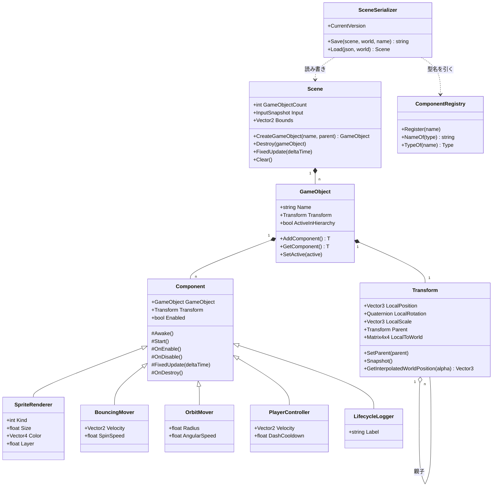
```mermaid
classDiagram
    class Scene {
        +int GameObjectCount
        +InputSnapshot Input
        +Vector2 Bounds
        +CreateGameObject(name, parent) GameObject
        +Destroy(gameObject)
        +FixedUpdate(deltaTime)
        +Clear()
    }
    class GameObject {
        +string Name
        +Transform Transform
        +bool ActiveInHierarchy
        +AddComponent() T
        +GetComponent() T
        +SetActive(active)
    }
    class Transform {
        +Vector3 LocalPosition
        +Quaternion LocalRotation
        +Vector3 LocalScale
        +Transform Parent
        +Matrix4x4 LocalToWorld
        +SetParent(parent)
        +Snapshot()
        +GetInterpolatedWorldPosition(alpha) Vector3
    }
    class Component {
        +GameObject GameObject
        +Transform Transform
        +bool Enabled
        #Awake()
        #Start()
        #OnEnable()
        #OnDisable()
        #FixedUpdate(deltaTime)
        #OnDestroy()
    }
    class SpriteRenderer {
        +int Kind
        +float Size
        +Vector4 Color
        +float Layer
    }
    class BouncingMover {
        +Vector2 Velocity
        +float SpinSpeed
    }
    class OrbitMover {
        +float Radius
        +float AngularSpeed
    }
    class PlayerController {
        +Vector2 Velocity
        +float DashCooldown
    }
    class LifecycleLogger {
        +string Label
    }
    class ComponentRegistry {
        +Register(name)
        +NameOf(type) string
        +TypeOf(name) Type
    }
    class SceneSerializer {
        +CurrentVersion
        +Save(scene, world, name) string
        +Load(json, world) Scene
    }

    Scene "1" *-- "n" GameObject
    GameObject "1" *-- "1" Transform
    GameObject "1" *-- "n" Component
    Transform "1" o-- "n" Transform : 親子
    Component <|-- SpriteRenderer
    Component <|-- BouncingMover
    Component <|-- OrbitMover
    Component <|-- PlayerController
    Component <|-- LifecycleLogger
    SceneSerializer ..> Scene : 読み書き
    SceneSerializer ..> ComponentRegistry : 型名を引く
```

`Transform` だけが `GameObject` の固定メンバーで、ほかは全部 `Component` として付け外しする
(Day 22 の要点2)。`SceneSerializer` が `ComponentRegistry` を経由するのは、
**JSON の文字列から直接 `Type` を作らせない**ため(Day 24 の要点2)。

### Ecs と Physics — どこにも依存しない2つ(今日 `Physics` が増えた)

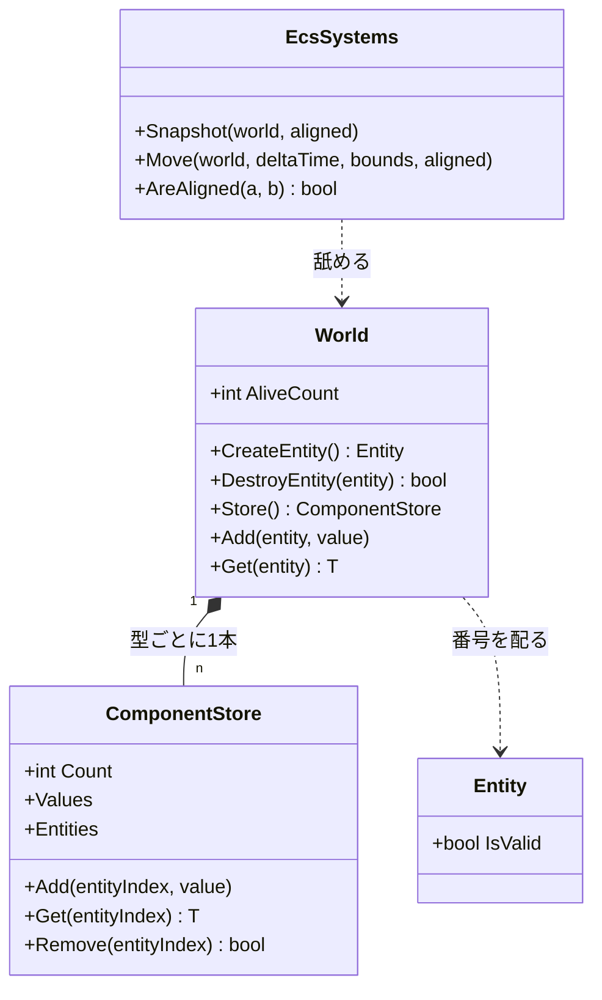
```mermaid
classDiagram
    class Entity {
        +bool IsValid
    }
    class World {
        +int AliveCount
        +CreateEntity() Entity
        +DestroyEntity(entity) bool
        +Store() ComponentStore
        +Add(entity, value)
        +Get(entity) T
    }
    class ComponentStore {
        +int Count
        +Values
        +Entities
        +Add(entityIndex, value)
        +Get(entityIndex) T
        +Remove(entityIndex) bool
    }
    class EcsSystems {
        +Snapshot(world, aligned)
        +Move(world, deltaTime, bounds, aligned)
        +AreAligned(a, b) bool
    }

    World "1" *-- "n" ComponentStore : 型ごとに1本
    World ..> Entity : 番号を配る
    EcsSystems ..> World : 舐める
```

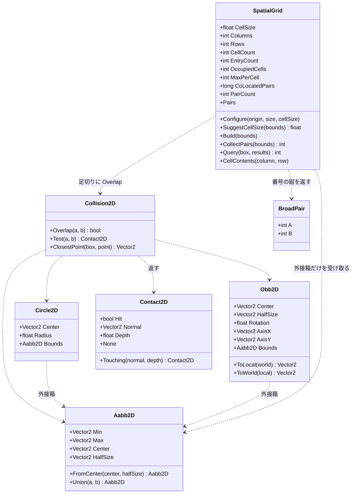
```mermaid
classDiagram
    class Aabb2D {
        +Vector2 Min
        +Vector2 Max
        +Vector2 Center
        +Vector2 HalfSize
        +FromCenter(center, halfSize) Aabb2D
        +Union(a, b) Aabb2D
    }
    class Circle2D {
        +Vector2 Center
        +float Radius
        +Aabb2D Bounds
    }
    class Obb2D {
        +Vector2 Center
        +Vector2 HalfSize
        +float Rotation
        +Vector2 AxisX
        +Vector2 AxisY
        +Aabb2D Bounds
        +ToLocal(world) Vector2
        +ToWorld(local) Vector2
    }
    class Contact2D {
        +bool Hit
        +Vector2 Normal
        +float Depth
        +None
        +Touching(normal, depth) Contact2D
    }
    class Collision2D {
        +Overlap(a, b) bool
        +Test(a, b) Contact2D
        +ClosestPoint(box, point) Vector2
    }
    class BroadPair {
        +int A
        +int B
    }
    class SpatialGrid {
        +float CellSize
        +int Columns
        +int Rows
        +int CellCount
        +int EntryCount
        +int OccupiedCells
        +int MaxPerCell
        +long CoLocatedPairs
        +int PairCount
        +Pairs
        +Configure(origin, size, cellSize)
        +SuggestCellSize(bounds) float
        +Build(bounds)
        +CollectPairs(bounds) int
        +Query(box, results) int
        +CellContents(column, row)
    }

    Collision2D ..> Aabb2D
    Collision2D ..> Circle2D
    Collision2D ..> Obb2D
    Collision2D ..> Contact2D : 返す
    Circle2D ..> Aabb2D : 外接箱
    Obb2D ..> Aabb2D : 外接箱
    SpatialGrid ..> Aabb2D : 外接箱だけを受け取る
    SpatialGrid ..> Collision2D : 足切りに Overlap
    SpatialGrid ..> BroadPair : 番号の組を返す
```

**形は全部 `readonly struct`、判定は `static` メソッドだけ**。状態を持たないので、
どのスレッドから何回呼んでも同じ答えが返る。Day 26 で空間分割を入れたとき、
この性質のおかげで**判定そのものには一切手を入れずに済んだ**——
`Collision2D.cs` と `Shapes2D.cs` の差分は 0 行になっている。

**Day 29 で足したのは `Query` だけ**。
`CollectPairs` が「全部の組」を返すのに対して、
`Query` は「この箱の近くにいるもの」を返す。
1回組んだ格子を、**総当たりの置き換え**としても
**単発の近傍探索**としても使えるようになった——
卒業制作では同じ格子を1ステップに4通りで使っている。

`SpatialGrid` だけが唯一 `class`(参照型)で、しかも状態を持つ。
配列を4本(`_cellStart` / `_cursor` / `_entries` / `_mark`)使い回すためで、
**毎フレーム作り直しても割り当てが起きない**ようにするにはこうするしかない。
そのぶん「1つのインスタンスを複数スレッドから同時に使えない」という制約が付く。
状態を持つと何が失われるかが、同じフォルダの中で見比べられる形になっている。

矢印の向きにも注目してほしい。**`SpatialGrid` から `Body` への線が無い**。
受け取るのは `ReadOnlySpan<Aabb2D>`、返すのは番号の組だけで、
速度も形も質量も知らない。この細さのおかげで、
Day 46 の 3D 版は `Aabb2D` を `Aabb3D` に変えるだけで済む。

### Audio — OpenAL の薄い皮

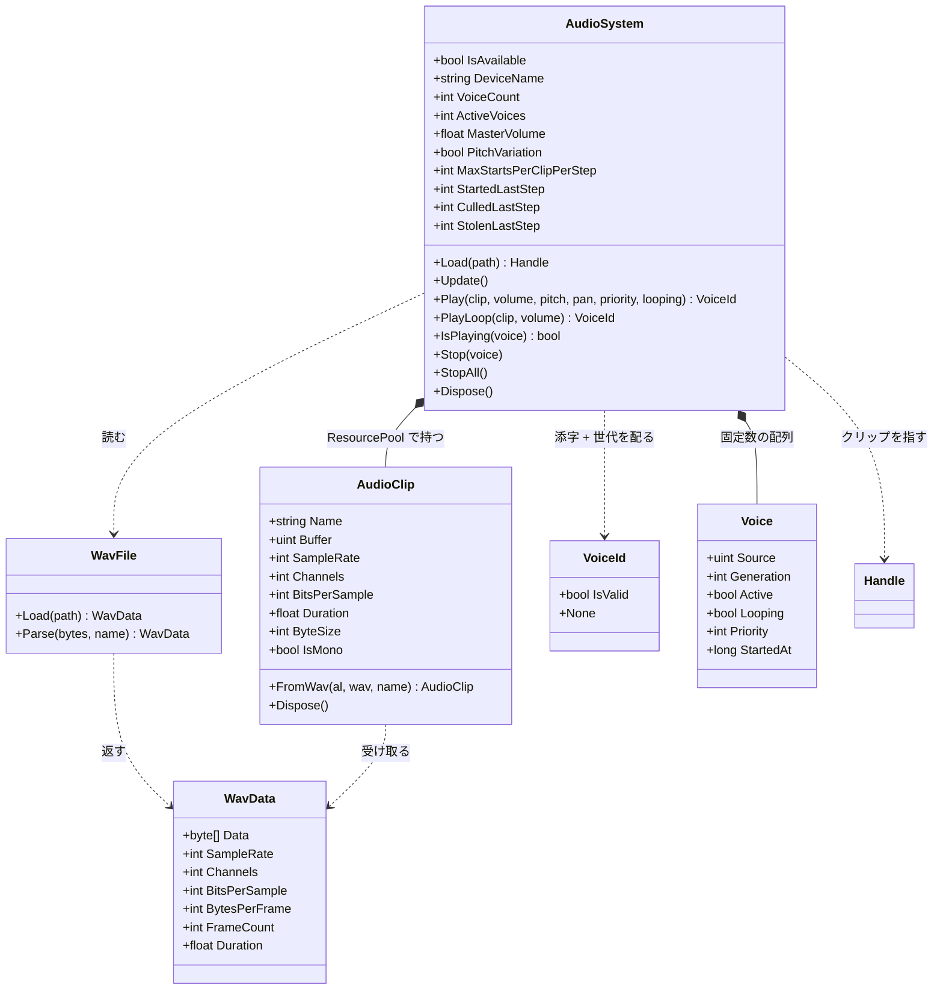
```mermaid
classDiagram
    class WavData {
        +byte[] Data
        +int SampleRate
        +int Channels
        +int BitsPerSample
        +int BytesPerFrame
        +int FrameCount
        +float Duration
    }
    class WavFile {
        +Load(path) WavData
        +Parse(bytes, name) WavData
    }
    class AudioClip {
        +string Name
        +uint Buffer
        +int SampleRate
        +int Channels
        +int BitsPerSample
        +float Duration
        +int ByteSize
        +bool IsMono
        +FromWav(al, wav, name) AudioClip
        +Dispose()
    }
    class VoiceId {
        +bool IsValid
        +None
    }
    class AudioSystem {
        +bool IsAvailable
        +string DeviceName
        +int VoiceCount
        +int ActiveVoices
        +float MasterVolume
        +bool PitchVariation
        +int MaxStartsPerClipPerStep
        +int StartedLastStep
        +int CulledLastStep
        +int StolenLastStep
        +Load(path) Handle
        +Update()
        +Play(clip, volume, pitch, pan, priority, looping) VoiceId
        +PlayLoop(clip, volume) VoiceId
        +IsPlaying(voice) bool
        +Stop(voice)
        +StopAll()
        +Dispose()
    }
    class Voice {
        +uint Source
        +int Generation
        +bool Active
        +bool Looping
        +int Priority
        +long StartedAt
    }

    WavFile ..> WavData : 返す
    AudioClip ..> WavData : 受け取る
    AudioSystem ..> WavFile : 読む
    AudioSystem *-- AudioClip : ResourcePool で持つ
    AudioSystem *-- Voice : 固定数の配列
    AudioSystem ..> VoiceId : 添字 + 世代を配る
    AudioSystem ..> Handle : クリップを指す
```

`Voice` は `AudioSystem` の中の `private struct`。外からは `VoiceId` 越しにしか触れない。

この層で押さえるべき線引きは3つ。

- **`WavFile` は OpenAL を知らない**。ただのバイト列パーサなので、
  ファイルが無くてもメモリ上のバイト列で試せる(自己チェックがそうしている)
- **`AudioClip` はデータ、`Voice` は再生**(要点2)。
  `Texture` と `Material`、`Mesh` と描画呼び出しと同じ分け方
- **`VoiceId` は `Handle<T>` と同じ構造**(添字 + 世代)だが**別の型**。
  `Handle<T>` は `ResourcePool<T>` のためのもので、ボイスはプールではないので流用しない。
  同じ手口を別の場所で使い直している、と読むのが正しい

### Text — Render の上に積む層

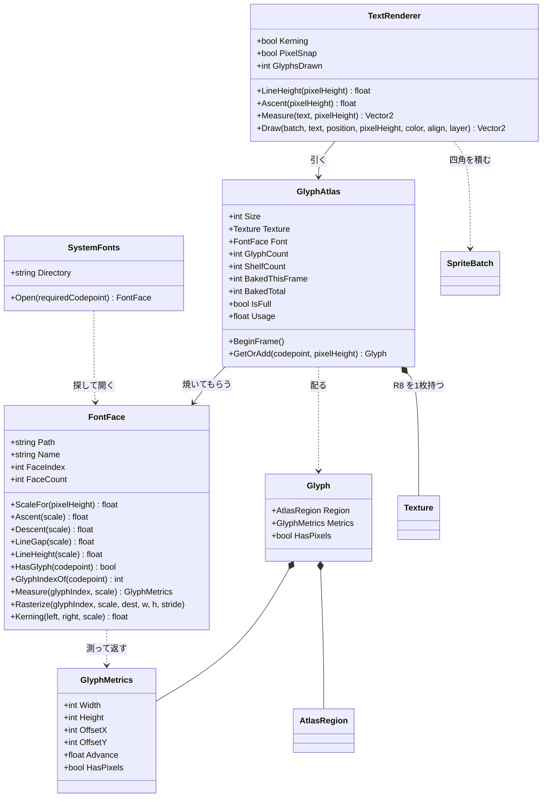
```mermaid
classDiagram
    class SystemFonts {
        +string Directory
        +Open(requiredCodepoint) FontFace
    }
    class FontFace {
        +string Path
        +string Name
        +int FaceIndex
        +int FaceCount
        +ScaleFor(pixelHeight) float
        +Ascent(scale) float
        +Descent(scale) float
        +LineGap(scale) float
        +LineHeight(scale) float
        +HasGlyph(codepoint) bool
        +GlyphIndexOf(codepoint) int
        +Measure(glyphIndex, scale) GlyphMetrics
        +Rasterize(glyphIndex, scale, dest, w, h, stride)
        +Kerning(left, right, scale) float
    }
    class GlyphMetrics {
        +int Width
        +int Height
        +int OffsetX
        +int OffsetY
        +float Advance
        +bool HasPixels
    }
    class Glyph {
        +AtlasRegion Region
        +GlyphMetrics Metrics
        +bool HasPixels
    }
    class GlyphAtlas {
        +int Size
        +Texture Texture
        +FontFace Font
        +int GlyphCount
        +int ShelfCount
        +int BakedThisFrame
        +int BakedTotal
        +bool IsFull
        +float Usage
        +BeginFrame()
        +GetOrAdd(codepoint, pixelHeight) Glyph
    }
    class TextRenderer {
        +bool Kerning
        +bool PixelSnap
        +int GlyphsDrawn
        +LineHeight(pixelHeight) float
        +Ascent(pixelHeight) float
        +Measure(text, pixelHeight) Vector2
        +Draw(batch, text, position, pixelHeight, color, align, layer) Vector2
    }

    SystemFonts ..> FontFace : 探して開く
    FontFace ..> GlyphMetrics : 測って返す
    GlyphAtlas --> FontFace : 焼いてもらう
    GlyphAtlas *-- Texture : R8 を1枚持つ
    GlyphAtlas ..> Glyph : 配る
    Glyph *-- AtlasRegion
    Glyph *-- GlyphMetrics
    TextRenderer --> GlyphAtlas : 引く
    TextRenderer ..> SpriteBatch : 四角を積む
```

4つのクラスが、**それぞれ1つのことしかしない**ように切ってある。

| クラス | 知っていること | 知らないこと |
|---|---|---|
| `SystemFonts` | どこにフォントがあるか | 描き方 |
| `FontFace` | フォントの中身(寸法とアウトライン) | GL、アトラス、レイアウト |
| `GlyphAtlas` | どこに置いたか、何を焼いたか | 文字の並べ方 |
| `TextRenderer` | 並べ方(送り・行送り・整列) | フォントの中身、GL |

この切り方の値打ちは、**差し替えたときにどこまで壊れるか**で分かる。
SDF に変える(改造課題3)なら `GlyphAtlas` と `text.frag` だけが変わり、
`TextRenderer` は 1 行も触らない。
フォントフォールバックを入れる(改造課題2)なら `FontFace` を複数持つだけで、
`GlyphAtlas` の棚詰めには影響しない。

**`GlyphMetrics` が `FontFace` と `TextRenderer` の共通語**になっている。
「原点からどれだけずらして、次にどれだけ進むか」——
この5つの数字さえあれば、フォントの実装が何であれ字を並べられる。

### Model — glTF を描画の言葉へ翻訳する層

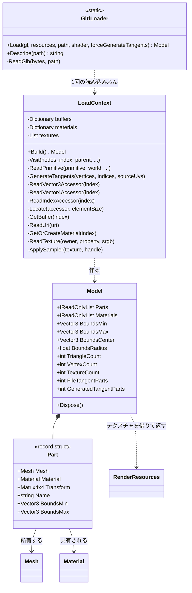
```mermaid
classDiagram
    class GltfLoader {
        <<static>>
        +Load(gl, resources, path, shader, forceGenerateTangents) Model
        +Describe(path) string
        -ReadGlb(bytes, path)
    }
    class LoadContext {
        -Dictionary buffers
        -Dictionary materials
        -List textures
        +Build() Model
        -Visit(nodes, index, parent, ...)
        -ReadPrimitive(primitive, world, ...)
        -GenerateTangents(vertices, indices, sourceUvs)
        -ReadVector3Accessor(index)
        -ReadVector4Accessor(index)
        -ReadIndexAccessor(index)
        -Locate(accessor, elementSize)
        -GetBuffer(index)
        -ReadUri(uri)
        -GetOrCreateMaterial(index)
        -ReadTexture(owner, property, srgb)
        -ApplySampler(texture, handle)
    }
    class Model {
        +IReadOnlyList Parts
        +IReadOnlyList Materials
        +Vector3 BoundsMin
        +Vector3 BoundsMax
        +Vector3 BoundsCenter
        +float BoundsRadius
        +int TriangleCount
        +int VertexCount
        +int TextureCount
        +int FileTangentParts
        +int GeneratedTangentParts
        +Dispose()
    }
    class Part {
        <<record struct>>
        +Mesh Mesh
        +Material Material
        +Matrix4x4 Transform
        +string Name
        +Vector3 BoundsMin
        +Vector3 BoundsMax
    }

    GltfLoader ..> LoadContext : 1回の読み込みぶん
    LoadContext ..> Model : 作る
    Model *-- Part
    Part --> Mesh : 所有する
    Part --> Material : 共有される
    Model ..> RenderResources : テクスチャを借りて返す
```

**Day 34 で `GenerateTangents` が入った**。ここに置いたのは、
**接線が「読み込みの一部」だから**——ファイルにあれば読み、無ければ作る、という
同じ場所で決まるべき話になる。

`Render/` 側(たとえば `Mesh` のコンストラクタ)で作る手もあるが、
そうすると `Mesh` が UV の反転規約(Day 32)を知る必要が出てくる。
**規約を知っているのはローダだけ**という線を守ると、置き場所は自然にここになる。

**Day 39 で `Part` に境界箱が入った**。モデル全体のぶん(`Model.BoundsMin`)は
Day 32 からあったが、それだけでは足りない場面が出た。

配布されているモデルには「きれいな版」と「錆びた版」が
**1ファイルに並べて入っている**ことがある(`fire_hydrant` / `metal_trash_can`)。
デモに置くときは片方だけが欲しいので、`DemoScene` がノード名で選り分ける——
すると残ったパーツの**大きさと足元が全体のものとは違う**。

`Part.Name`(glTF のノード名)も、この日から
「デバッグ表示用」ではなく**選り分けの鍵**という仕事を持った。

`Model` が接線の出どころ(ファイル / 生成)の数を持つのは、
**HUD と自己チェックで区別を出すため**。
「法線マップが効かない」の原因の筆頭がここなので、
数を見えるところに出しておく価値がある。

**`LoadContext` を切り出したのは、引数が増えすぎたから**。
`gl` / `resources` / `path` / `directory` / `root` / `embedded` / `shader` の7つを
静的メソッド間で渡し回すと、どの関数も先頭3行が引数の受け渡しになる。
**読み込み1回ぶんの寿命を持つ入れ物**にまとめると、
buffer のキャッシュとマテリアルの使い回しも自然にそこへ収まる。

**`Model` が木ではなく平らな一覧を持つ**のが設計の分かれ目。
glTF の中身はノードの木だが、**静的なモデルに階層は要らない**——
読み込み時に根から行列を掛け合わせて世界行列を確定させてしまえば、
描くときは順に回すだけになる。

木のまま持つべきなのは、あとから関節を動かす場合(スキニング。Day 41)。
そのときは `Model` に木を残す形へ戻すことになるが、
**要るまで持たない**ほうが今は読みやすい。

**`Model` が `RenderResources` を握っている**のは、
テクスチャの参照カウントを返すため(Day 21 の要点3)。
`Mesh` は自分で作ったので所有するが、テクスチャは借り物なので返す必要がある。
ここを忘れると、モデルを切り替えるたびに 2K テクスチャが数枚ずつ残り、
**絵は正しいのに VRAM だけ増え続ける**。
自己チェックの最後の1行(「全部畳んだらテクスチャの数が元に戻る」)は、これを見ている。

### glTF を1体読むまで — 3段の間接参照とノードの木

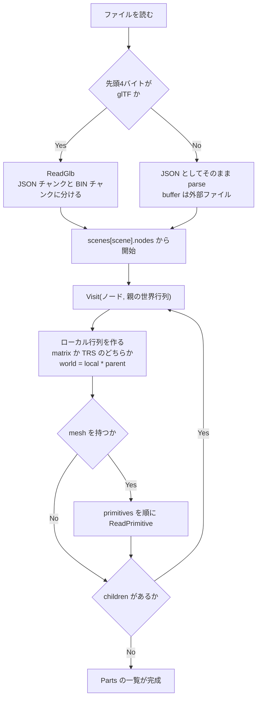
```mermaid
flowchart TD
    F["ファイルを読む"] --> M{"先頭4バイトが<br/>glTF か"}
    M -->|Yes| GLB["ReadGlb<br/>JSON チャンクと BIN チャンクに分ける"]
    M -->|No| TXT["JSON としてそのまま parse<br/>buffer は外部ファイル"]
    GLB --> SC["scenes[scene].nodes から開始"]
    TXT --> SC
    SC --> V["Visit(ノード, 親の世界行列)"]
    V --> TR["ローカル行列を作る<br/>matrix か TRS のどちらか<br/>world = local * parent"]
    TR --> HM{"mesh を持つか"}
    HM -->|Yes| PR["primitives を順に ReadPrimitive"]
    HM -->|No| CH
    PR --> CH{"children があるか"}
    CH -->|Yes| V
    CH -->|No| DONE["Parts の一覧が完成"]
```

ノードの処理は**行列を掛けながら降りるだけ**で、Day 22 の `Transform` と同じ話。
違うのは、こちらは**降り切った時点で結果を確定させてしまう**こと。

プリミティブ1個を頂点配列にするところが、glTF のいちばん機械的な部分になる。

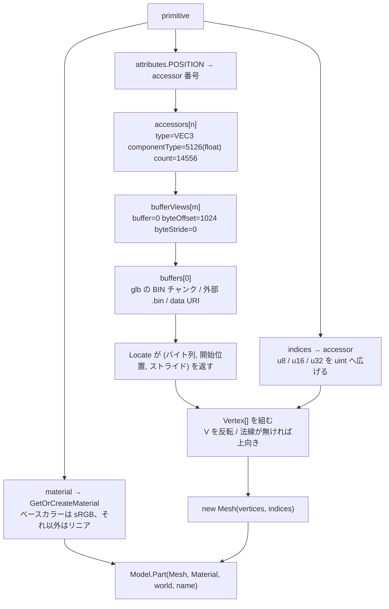
```mermaid
flowchart TD
    P["primitive"] --> A["attributes.POSITION → accessor 番号"]
    A --> AC["accessors[n]<br/>type=VEC3 componentType=5126(float) count=14556"]
    AC --> BV["bufferViews[m]<br/>buffer=0 byteOffset=1024 byteStride=0"]
    BV --> B["buffers[0]<br/>glb の BIN チャンク / 外部 .bin / data URI"]
    B --> READ["Locate が (バイト列, 開始位置, ストライド) を返す"]
    READ --> VTX["Vertex[] を組む<br/>V を反転 / 法線が無ければ上向き"]
    P --> IDX["indices → accessor<br/>u8 / u16 / u32 を uint へ広げる"]
    IDX --> VTX
    P --> MAT["material → GetOrCreateMaterial<br/>ベースカラーは sRGB、それ以外はリニア"]
    VTX --> MESH["new Mesh(vertices, indices)"]
    MAT --> PART["Model.Part(Mesh, Material, world, name)"]
    MESH --> PART
```

**`byteStride` が肝**。glTF は「位置・法線・UV を1頂点ずつ交互に並べる」書き方も許していて、
その場合 `bufferView` に `byteStride` が入る。0(または未指定)なら詰めて並んでいる。

これを無視して「詰めて並んでいる」と決め打ちしても、
**今日の4体は全部 stride 無しなので動いてしまう**。
つまり「動いたから正しい」が言えない類の分岐で、
仕様を読んでいないと存在にすら気づかない。

**`accessor` を経由する意味**は、1本のバイト列を複数の意味で切り出せること。
位置と法線と UV が同じ `buffer` に同居し、
それぞれの `bufferView` が違う範囲を指す。
OBJ が「v の配列」「vt の配列」を別々のテキスト行として持っていたのに対し、
glTF は**メモリ上の並びをそのまま記述している**ので、読み込み後の組み直しが要らない。

### Game — エンジンを使う側

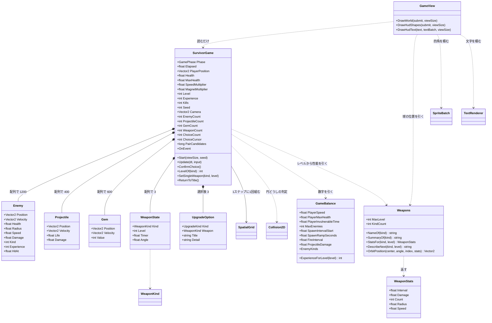
```mermaid
classDiagram
    class GameBalance {
        +float PlayerSpeed
        +float PlayerMaxHealth
        +float PlayerInvulnerableTime
        +int MaxEnemies
        +float SpawnIntervalStart
        +float SpawnRampSeconds
        +float FireInterval
        +float ProjectileDamage
        +EnemyKinds
        +ExperienceForLevel(level) int
    }
    class Enemy {
        +Vector2 Position
        +Vector2 Velocity
        +float Health
        +float Radius
        +float Speed
        +float Damage
        +int Kind
        +int Experience
        +float HitAt
    }
    class Projectile {
        +Vector2 Position
        +Vector2 Velocity
        +float Life
        +float Damage
    }
    class Gem {
        +Vector2 Position
        +Vector2 Velocity
        +int Value
    }
    class WeaponState {
        +WeaponKind Kind
        +int Level
        +float Timer
        +float Angle
    }
    class WeaponStats {
        +float Interval
        +float Damage
        +int Count
        +float Radius
        +float Speed
    }
    class Weapons {
        +int MaxLevel
        +int KindCount
        +NameOf(kind) string
        +SummaryOf(kind) string
        +StatsFor(kind, level) WeaponStats
        +DescribeNext(kind, level) string
        +OrbitPosition(center, angle, index, stats) Vector2
    }
    class UpgradeOption {
        +UpgradeKind Kind
        +WeaponKind Weapon
        +string Title
        +string Detail
    }
    class SurvivorGame {
        +GamePhase Phase
        +float Elapsed
        +Vector2 PlayerPosition
        +float Health
        +float MaxHealth
        +float SpeedMultiplier
        +float MagnetMultiplier
        +int Level
        +int Experience
        +int Kills
        +int Seed
        +Vector2 Camera
        +int EnemyCount
        +int ProjectileCount
        +int GemCount
        +int WeaponCount
        +int ChoiceCount
        +int ChoiceCursor
        +long PairCandidates
        +OnEvent
        +Start(viewSize, seed)
        +Update(dt, input)
        +ConfirmChoice()
        +LevelOf(kind) int
        +SetSingleWeapon(kind, level)
        +ReturnToTitle()
    }
    class GameView {
        +DrawWorld(submit, viewSize)
        +DrawHudShapes(submit, viewSize)
        +DrawHudText(text, textBatch, viewSize)
    }

    SurvivorGame *-- Enemy : 配列で 1200
    SurvivorGame *-- Projectile : 配列で 400
    SurvivorGame *-- Gem : 配列で 600
    SurvivorGame *-- WeaponState : 配列で 3
    SurvivorGame *-- UpgradeOption : 選択肢 3
    SurvivorGame --> SpatialGrid : 1ステップに1回組む
    SurvivorGame ..> Collision2D : 円どうしの判定
    SurvivorGame ..> GameBalance : 数字を引く
    SurvivorGame ..> Weapons : レベルから性能を引く
    WeaponState ..> WeaponKind
    Weapons ..> WeaponStats : 返す
    GameView ..> SurvivorGame : 読むだけ
    GameView ..> Weapons : 球の位置を引く
    GameView ..> SpriteBatch : 四角を積む
    GameView ..> TextRenderer : 文字を積む
```

**`WeaponState` が3つのフィールドしか持っていない**のが Day 30 の設計の要。
威力も間隔も個数も持たず、`Weapons.StatsFor(kind, level)` が
**レベルから計算して返す**。

```
状態として持つもの   … 種類・レベル・タイマー・角度
状態から決まるもの   … 威力・間隔・個数・半径・速度
```

分けておくと、成長カーブを触るときに `StatsFor` の1箇所で済む。
逆に `WeaponState` に威力を持たせると、
レベルアップのたびに「どの数字をいくつ足すか」があちこちに散らばる。

**`GameView` から `Weapons` への線**にも意味がある。
オービットの球の位置は当たり判定と絵の両方が要るので、
`Weapons.OrbitPosition` という1つの式を両方から呼ぶ。
別々に書くと、**見えているところと当たるところがずれる**——
しかもずれは小さいので、しばらく気づかない。

**`Enemy` / `Projectile` / `Gem` が `struct`** なのが要点。
1200 体ぶんの参照を辿ると、メモリ上ばらばらの場所を読むことになる
(Day 22 で実測した 17 倍がこれ)。構造体の配列なら、
更新ループは連続したメモリを頭から舐めるだけで済む。

**Day 23 の ECS は使っていない**。
ECS が効くのは「部品の組み合わせが実行時に変わる」ときで、
今日のように<b>敵は敵、弾は弾と決まっている</b>なら、
種類ごとに配列を1本持つほうが素直で速い。
Day 23 で「ECS は構造体の配列の一般化」と書いたが、
**一般化が要らない場面では特殊形のままでよい**——
これは ECS が無駄だったという話ではなく、
<b>どちらを選ぶかを判断できるようになった</b>という話になる。

`GameBalance` に矢印が集まっているのも意図したもの。
遊んで気になったことは全部ここを触ることになるので、
**数字がコードの中に散らばっていると調整が苦行になる**。

### Demo — エンジンを使う側の、もう1つの層

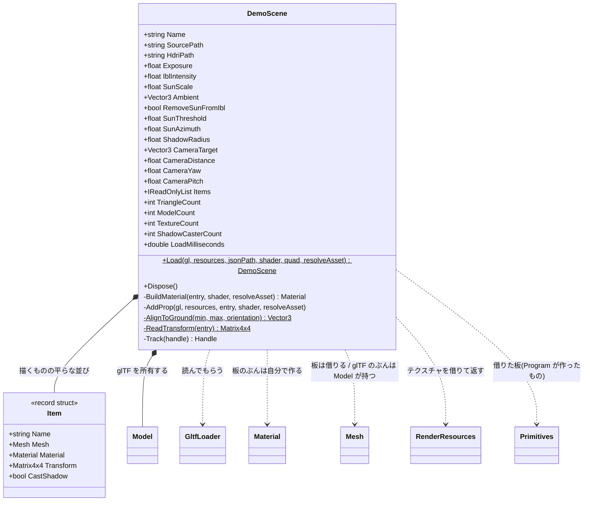
```mermaid
classDiagram
    class DemoScene {
        +string Name
        +string SourcePath
        +string HdriPath
        +float Exposure
        +float IblIntensity
        +float SunScale
        +Vector3 Ambient
        +bool RemoveSunFromIbl
        +float SunThreshold
        +float SunAzimuth
        +float ShadowRadius
        +Vector3 CameraTarget
        +float CameraDistance
        +float CameraYaw
        +float CameraPitch
        +IReadOnlyList Items
        +int TriangleCount
        +int ModelCount
        +int TextureCount
        +int ShadowCasterCount
        +double LoadMilliseconds
        +Load(gl, resources, jsonPath, shader, quad, resolveAsset) DemoScene$
        +Dispose()
        -BuildMaterial(entry, shader, resolveAsset) Material
        -AddProp(gl, resources, entry, shader, resolveAsset)
        -AlignToGround(min, max, orientation) Vector3$
        -ReadTransform(entry) Matrix4x4$
        -Track(handle) Handle
    }
    class Item {
        <<record struct>>
        +string Name
        +Mesh Mesh
        +Material Material
        +Matrix4x4 Transform
        +bool CastShadow
    }

    DemoScene *-- Item : 描くものの平らな並び
    DemoScene *-- Model : glTF を所有する
    DemoScene ..> GltfLoader : 読んでもらう
    DemoScene ..> Material : 板のぶんは自分で作る
    DemoScene ..> Mesh : 板は借りる / glTF のぶんは Model が持つ
    DemoScene ..> RenderResources : テクスチャを借りて返す
    DemoScene ..> Primitives : 借りた板(Program が作ったもの)
```

**`Item` が平らな並びである**ことが、このクラスの全部と言ってよい。
JSON には「マテリアルの一覧」「板の一覧」「glTF の一覧」という
3種類の入れ物があるが、読み終わった時点でそれは1本のリストに潰れる。

```
  materials[]  ─┐
  surfaces[]   ─┼→  Items[]  ──→ 深度パス / 幾何パス / 本描画
  props[]      ─┘
```

<b>誰が何を持っているか</b>が、このクラスでいちばん気を使ったところ。

| もの | 持ち主 | 理由 |
|---|---|---|
| 板のメッシュ | **`Program`**(借りている) | `Primitives.CreateQuad` の1枚を全員で使い回す |
| 板のマテリアル | `DemoScene` | JSON にしか書いていないので、他に持ち主がいない |
| 板のテクスチャ | `RenderResources`(**参照カウントを借りる**) | Day 21 の作法。`Dispose` で同じ数だけ返す |
| glTF のメッシュ | `Model`(`DemoScene` が所有) | `GltfLoader` が作ったもの |
| glTF のマテリアル | `Model` | 同上 |

**板のメッシュだけ借りている**のが例外に見えるが、
これは `Primitives.CreateQuad` が返す 4 頂点の板を
地面にも壁にも使い回しているため。行列と `uvScale` が違うだけで、
頂点は全部同じ——**1枚あれば足りるものを人数分作らない**。

`Load` が `Func<string, string> resolveAsset` を受け取るのは、
**`assets/` をどこから探すかの規則をこのクラスに持ち込まないため**。
`Program.ResolveAssetPath` は「実行ファイルの場所から親へ辿る」という
このリポジトリ固有の作法なので、`Demo/` が知る必要は無い。

### シーンが1つ組み上がるまで — JSON からドローコールの並びへ

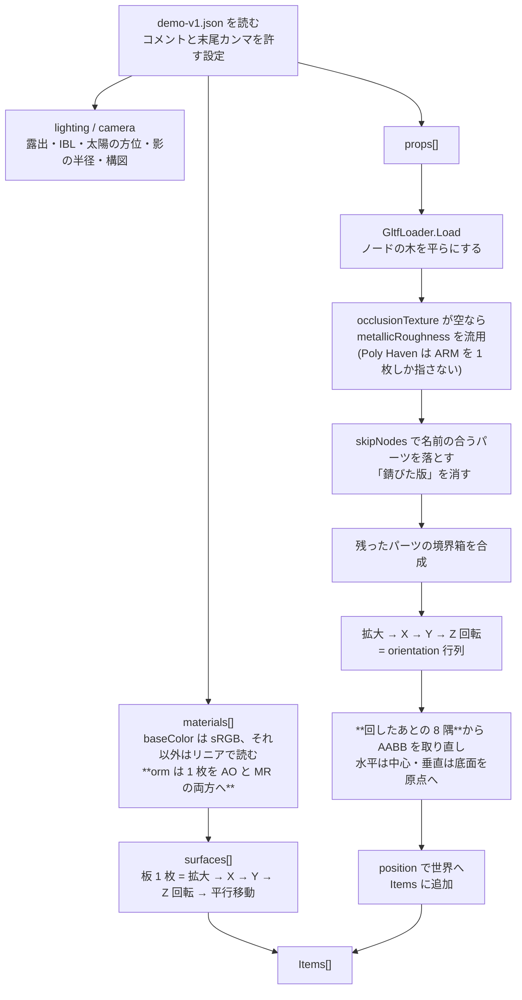
```mermaid
flowchart TD
    J["demo-v1.json を読む<br/>コメントと末尾カンマを許す設定"]
    J --> LG["lighting / camera<br/>露出・IBL・太陽の方位・影の半径・構図"]
    J --> M["materials[]<br/>baseColor は sRGB、それ以外はリニアで読む<br/>**orm は 1 枚を AO と MR の両方へ**"]
    M --> SF["surfaces[]<br/>板 1 枚 = 拡大 → X → Y → Z 回転 → 平行移動"]
    J --> PR["props[]"]
    PR --> GL["GltfLoader.Load<br/>ノードの木を平らにする"]
    GL --> AO["occlusionTexture が空なら<br/>metallicRoughness を流用<br/>(Poly Haven は ARM を 1 枚しか指さない)"]
    AO --> SK["skipNodes で名前の合うパーツを落とす<br/>「錆びた版」を消す"]
    SK --> BB["残ったパーツの境界箱を合成"]
    BB --> OR["拡大 → X → Y → Z 回転<br/>= orientation 行列"]
    OR --> AL["**回したあとの 8 隅**から AABB を取り直し<br/>水平は中心・垂直は底面を原点へ"]
    AL --> PL["position で世界へ<br/>Items に追加"]
    SF --> IT["Items[]"]
    PL --> IT
```

**足元合わせを回転より後に置く**のが今日の学び。
先に合わせてから回すと、タイヤを寝かせた瞬間に半分が床へ沈む——
「合わせた足元」は回転で別の場所へ行ってしまうから。

```
  ✗  足元合わせ → 拡大 → 回転 → 平行移動     … 回すと沈む
  ○  拡大 → 回転 → 足元合わせ → 平行移動     … どんな向きでも床に乗る
```

回したあとの箱を取るには **8 隅を全部変換する**。
中心と大きさだけを回しても正しい箱にならない
(斜めに回した AABB は元より必ず大きくなる)。

配当は JSON 側に出る。`rotation: [90, 0, 20]` と書くだけで
タイヤが寝て床に乗り、`y` を手で調整する行が1つも要らない。
自己チェックの「**床より下に沈んでいるものが無い**」がこれを見張っている。

### 1フレームの流れ

Silk.NET のウィンドウから `OnUpdate` と `OnRender` が交互に呼ばれる。
**状態を変えるのは `OnUpdate` 側だけ**、というのが Day 19 で引いた線。

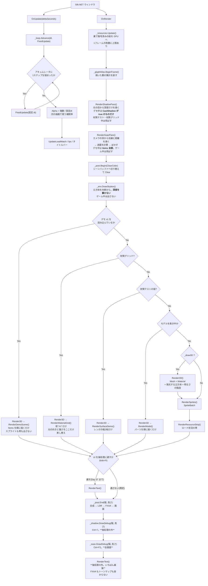
```mermaid
flowchart TD
    W["Silk.NET ウィンドウ"] --> U["OnUpdate(deltaSeconds)"]
    U --> A["_loop.Advance(dt, FixedUpdate)"]
    A --> Q{"アキュムレータに<br/>1ステップ分溜まったか"}
    Q -->|Yes| F["FixedUpdate(固定 dt)"]
    F --> Q
    Q -->|No| AL["Alpha = 端数 / 固定dt<br/>次の描画で使う補間率"]
    AL --> LW["UpdateLoadWatch / fps / タイトルバー"]

    W --> R["OnRender"]
    R --> RU["_resources.Update()<br/>裏で復号済みの絵を GPU へ<br/>1フレームの枚数に上限あり"]
    RU --> GA["_glyphAtlas.BeginFrame()<br/>焼いた数の集計を戻す"]
    GA --> SP["RenderShadowPass()<br/>光の目から深度だけを焼く<br/>デモ中は <b>CastShadow が true のものだけ</b><br/>材質テスト・材質グリッド中は飛ばす"]
    SP --> SS["RenderSsaoPass()<br/>カメラの目から法線と距離を焼く<br/>→ 遮蔽を計算 → ぼかす<br/>デモ中は <b>Items 全部</b>。ゲーム中は飛ばす"]
    SS --> PB["_post.Begin(ClearColor)<br/>シーンバッファへ切り替えて Clear"]
    PB --> SKY["_env.DrawSkybox()<br/>立方体を内側から。<b>深度を書かない</b><br/>ゲーム中は出さない"]
    SKY --> DQ{"デモ v1 を<br/>読み込んでいるか"}
    DQ -->|Yes| RD["Render3D → RenderDemoScene()<br/>Items を順に描くだけ<br/>スプライトも帯も出さない"]
    DQ -->|No| MG{"材質グリッド?"}
    MG -->|Yes| RG["Render3D → RenderMaterialGrid()<br/>球 7x7 だけ<br/>光の向きと強さをここだけ差し替え"]
    MG -->|No| SF{"材質テストの板?"}
    SF -->|Yes| RS2["Render3D → RenderSurfaceDemo()<br/>レンガの板2枚だけ"]
    SF -->|No| MD{"モデルを表示中か"}
    MD -->|Yes| RM["Render3D → RenderModel()<br/>パーツを順に描くだけ"]
    MD -->|No| D3{"_draw3D ?"}
    D3 -->|Yes| R3["Render3D()<br/>Mesh + Material<br/>+ 発光する立方体 + 明るさの階段"]
    D3 -->|No| RS
    R3 --> RS["RenderSprites()<br/>SpriteBatch"]
    RS --> ST["RenderResourceStrip()<br/>ロード状況の帯"]
    ST --> UQ
    RD --> UQ
    RM --> UQ
    RG --> UQ
    RS2 --> UQ
    UQ{"UI を後処理に通すか<br/>Shift+F5"}
    UQ -->|"通す(Day 37 まで)"| TX1["RenderText()"]
    TX1 --> PE
    UQ -->|"通さない(既定)"| PE["_post.End(幅, 高さ)<br/>合成 → LDR → FXAA → 画面"]
    PE --> SD["_shadow.DrawDebug(幅, 高さ)<br/>Ctrl+7。**後処理の外**"]
    SD --> AD["_ssao.DrawDebug(幅, 高さ)<br/>Ctrl+F2。**全画面**"]
    AD --> TX2["RenderText()<br/>**後処理の外。いちばん最後**<br/>FXAA もトーンマップも掛からない"]
```

**Day 33 で先頭に1パス増えた**。`RenderShadowPass` が
`_post.Begin` より前に来るのは、**画面にもシーンバッファにも描かない**から。
行き先はシャドウマップで、後処理とはまったく別の道になる。

**Day 37 でその真下にもう1本増えた**。`RenderSsaoPass` が
`_post.Begin` より前でなければならない理由は、影パスより強い。

遮蔽率は**環境光に掛けるもの**なので、シーンを描き始める時点で
もう出来上がっていないと間に合わない。
「描いてから画面全体に暗さを掛ける」形にすれば1パス減らせるが、
それだと**発光するものも空も暗くなる**——
AO は環境光にだけ掛かるものなので、掛ける場所を選べる本描画の中に入れる必要がある。

**`_ssao.DrawDebug` は全画面**に出す。影の隅出しと違うのは、
AO の善し悪しが**1画素単位のノイズと暗がりの広がり方**で決まるから。
縮めて見ても、半径が大きすぎるのか下駄が足りないのか判断できない。

**`DrawDebug` は後処理の外**に置いてある。
シャドウマップの表示は「見たままの値」であってほしいので、
露出やトーンマップを通してはいけない。
HUD の文字が後処理を通ってしまう(下の弱点)のとは、扱いを分けた。

**Day 29 で分岐が1つ増えた**。ゲームモード(Enter)のときは
`Render3D` も `RenderSprites` も `RenderResourceStrip` も通らず、
`RenderGame()` だけになる。
デモの重い部分を裏で回したまま遊ぶと、
「ゲームが重い」のか「デモが重い」のか分からなくなるため。

**`RenderText` がいちばん最後**なのは、UI が何よりも手前に出るものだから。
**Day 38 でその「最後」が `_post.End` の外へ出た**。
`_ssao.DrawDebug` は画面いっぱいに出るので、
文字はそれよりさらに後ろでなければ塗り潰される。

バッチが別なのは、シェーダが違うため——
グリフのアトラスは1チャンネルなので `sprite.frag` では真っ黒になる。
**バッチは「同じ設定で描けるものをまとめる」仕組み**なので、
シェーダが違えば別のバッチになるのは定義どおりの帰結。

`OnRender` の先頭で `_resources.Update()` を呼ぶのが要点で、
**GL は描画スレッドからしか触れない**ため、裏で復号し終えた画素をここで GPU に上げている
(Day 21 の要点5・6)。

**Day 34 でまた分岐が1つ増えた**。材質テストの板(Alt+5)を出している間は、
モデルもデモも出さない。理由は Day 32・33 と同じで、
**重ねると、どの陰影がどこから来ているのか分からなくなる**。

**Day 35 でさらに1つ増えて4段になった**。材質グリッド(Ctrl+Shift+5)がいちばん外側に来る。

そして今日の分岐は、**中で uniform を差し替える**のが今までと違う。
`RenderMaterialGrid` は光の向きと強さを自分で上書きしてから描く——
デモの太陽は画面の奥から手前へ進むので、正面から見るグリッドが逆光になるため
(「検証の途中で分かったこと」)。

分岐の中で全体設定を書き換えるのは本来まずい形で、
**次にどこかで `uLightDirection` を読む人が居たら破綻する**。
いまは1フレームに1回しか描かないので成り立っているが、
Day 39 で光源が複数になったら「ライトの集合をパスごとに持つ」形へ整理する必要がある。

**Day 39 で分岐がもう1段外側に増えて5段になった**。デモ v1 がいちばん外側に来る。

理由は Day 32〜35 と同じ——**重ねると何を見ているのか分からなくなる**。
デモの絵に 1000 枚のスプライトが重なったら、それはもうデモではない。

置き場所にも Day 35 と同じ判断が入っている。
分岐そのものは `Render3D` の中にもあるが、
**`OnRender` の側にも上げてある**——`Render3D` の中だけだと
`_draw3D`(G キー)でまるごと消えてしまい、
「デモを出せ」と言われたのに 3D 背景のスイッチで消えるのは筋が通らない。

そして Day 35 の宿題が1つ片付いた。設計書にはこう書いてあった。

> 分岐の中で全体設定を書き換えるのは本来まずい形で、
> **次にどこかで `uLightDirection` を読む人が居たら破綻する**。
> いまは1フレームに1回しか描かないので成り立っているが、
> Day 39 で光源が複数になったら「ライトの集合をパスごとに持つ」形へ整理する必要がある。

**光源は複数にならなかった**ので、整理はまだ要らない。
ただし危うさの形は変わっていて、今日は
「`_lightDirection` を**シーンの読み込み時に上書きする**」という書き方が入った。
デモから抜けるときに書き戻す(`_manualLightDirection` に控えてある)ことで凌いでいるが、
**控えて戻す**は状態が増えるたびに漏れる書き方でもある。
光源をまとめて持つ形にするのは、点光源が入る Day 56(多光源化)が本番になる。

**Day 36 で先頭にもう1つ増えた**。空(`_env.DrawSkybox`)が
分岐より前に来るのは、**どの分岐でも背景が要る**から。

深度を書かずに描いているので、あとから描いたものが必ず手前に来る。
いちばん最後に描いて深度テストで隠れた画素を省くほうが速いが、
**分岐が4つある末尾すべてに足す**ことになるので、前に1回置くほうを取った。
フルスクリーン1枚ぶんの塗りつぶしなので、実測でも差が出ない。

**ゲームモードでは出さない**。見下ろし型の 2D に空が映っても意味が無く、
「エンジンの機能のうちゲームが要るものだけを通る」という Day 29 の線から外れる。

分岐が4段になったのは、**デモが増えるたびに「それだけを見せる」を選んできた**結果。
「全部同時に出す」ほうがコードは短いが、学習用としては
1つずつ切り分けて見られるほうが値打ちがある、という判断が積み重なっている。

**Day 32 で分岐が1つ増えた**。モデルを表示している間は、
スプライトの群れも明るさの階段も出さない。
ゲームモード(`_playing`)で同じことをしているのと理由も同じで、
**重ねると、どちらの陰影を見ているのか分からなくなる**。
Day 31 までのデモは `Shift+0` を「モデル無し」まで回すと戻る。

**Day 31 で `Clear` が `_post.Begin` に変わった**。
`Begin` と `End` の間にあるコードは1行も変わっていない——
`Clear` の代わりにフレームバッファを差し替えるようになっただけで、
`Render3D` も `RenderSprites` も `RenderText` も「自分がどこへ描いているか」を知らない。

そのぶん**UI もトーンマップを通ってしまう**——というのが Day 37 までの弱点だった。
露出を上げれば HUD の文字も白飛びする。

**Day 38 でここを分けた**。決め手は色ではなく FXAA で、
**字は1画素幅の線の塊**なので、輪郭を均す処理といちばん相性が悪い(要点5)。
`Shift+F5` で Day 37 までの置き方に戻せるようにしてあるので、
露出を上げて文字が飛ぶところと、モノクロにして文字まで灰色になるところを見比べられる。

分けたことで、UI の色は**表示空間の値がそのまま画面に出る**ようになった。
前はガンマ(1/2.2 乗)を通っていたので 0.95 が 0.977 に持ち上がっていた——
**Day 37 までより文字がわずかに暗く見える**のはそのためで、
UI の色は表示空間で決めるものなので、こちらのほうが筋が通っている。

### 影が1枚出るまで — 2つのパスと、5つの落とし穴

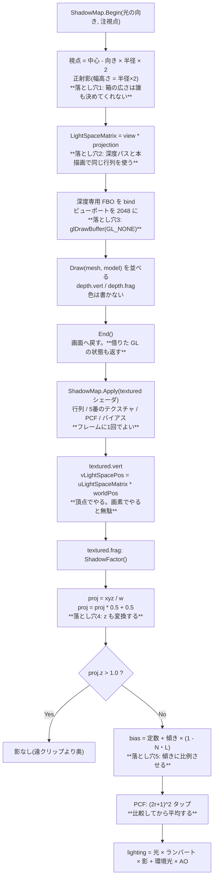
```mermaid
flowchart TD
    B["ShadowMap.Begin(光の向き, 注視点)"]
    B --> M1["視点 = 中心 - 向き × 半径 × 2<br/>正射影(幅高さ = 半径×2)<br/>**落とし穴1: 箱の広さは誰も決めてくれない**"]
    M1 --> M2["LightSpaceMatrix = view * projection<br/>**落とし穴2: 深度パスと本描画で同じ行列を使う**"]
    M2 --> FB["深度専用 FBO を bind<br/>ビューポートを 2048 に<br/>**落とし穴3: glDrawBuffer(GL_NONE)**"]
    FB --> DR["Draw(mesh, model) を並べる<br/>depth.vert / depth.frag<br/>色は書かない"]
    DR --> E["End()<br/>画面へ戻す。**借りた GL の状態も返す**"]

    E --> AP["ShadowMap.Apply(textured シェーダ)<br/>行列 / 5番のテクスチャ / PCF / バイアス<br/>**フレームに1回でよい**"]
    AP --> VS["textured.vert<br/>vLightSpacePos = uLightSpaceMatrix * worldPos<br/>**頂点でやる。画素でやると無駄**"]
    VS --> FS["textured.frag: ShadowFactor()"]
    FS --> P1["proj = xyz / w<br/>proj = proj * 0.5 + 0.5<br/>**落とし穴4: z も変換する**"]
    P1 --> P2{"proj.z > 1.0 ?"}
    P2 -->|Yes| LIT["影なし(遠クリップより奥)"]
    P2 -->|No| BI["bias = 定数 + 傾き × (1 - N・L)<br/>**落とし穴5: 傾きに比例させる**"]
    BI --> PC["PCF: (2r+1)^2 タップ<br/>**比較してから平均する**"]
    PC --> OUT["lighting = 光 × ランバート × 影 + 環境光 × AO"]
```

**落とし穴が5つとも「絵からは原因が読めない」**のが、影を難しくしている。

| 落とし穴 | 症状 | 見分け方 |
|---|---|---|
| 1. 箱が広すぎ/狭すぎ | ギザギザ / 画面の端で影が消える | HUD の `cm/tx` を見る |
| 2. 行列がずれる | 影が丸ごとずれる | `Ctrl+7` でマップは焼けているのに合わない |
| 3. `glDrawBuffer` 忘れ | 影がまったく出ない | **例外が出る**(完全性チェック。Day 31 の配当) |
| 4. `z` を変換し忘れ | 全部影 / まったく影なし | `Shift+9` を8回で係数を見ると一目 |
| 5. バイアス無し/過多 | 縞模様 / 影が浮く | `Ctrl+4` で 0 と 0.006 を往復する |

**3 だけが例外で教えてくれる**。残り4つは「影がおかしい」としか分からないので、
`Ctrl+7`(マップを見る)と `Shift+9`×8(係数を見る)の2つを先に作っておく。
デバッグ表示は本体より先に書いてよい類のもので、
今日はそれが**キー2つで済む**ところまで来ている。

### 接空間ができるまで — CPU とシェーダにまたがる1本の道

法線マップが1枚効くまでに、**4つの場所**を通る。
どこか1つでも規約がずれると、絵は出るが凹凸だけがおかしくなる。

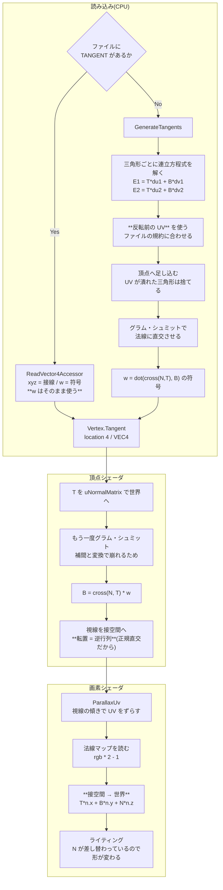
```mermaid
flowchart TD
    subgraph CPU["読み込み(CPU)"]
        F{"ファイルに<br/>TANGENT があるか"}
        F -->|Yes| RD["ReadVector4Accessor<br/>xyz = 接線 / w = 符号<br/>**w はそのまま使う**"]
        F -->|No| GEN["GenerateTangents"]
        GEN --> G1["三角形ごとに連立方程式を解く<br/>E1 = T*du1 + B*dv1<br/>E2 = T*du2 + B*dv2"]
        G1 --> G2["**反転前の UV** を使う<br/>ファイルの規約に合わせる"]
        G2 --> G3["頂点へ足し込む<br/>UV が潰れた三角形は捨てる"]
        G3 --> G4["グラム・シュミットで<br/>法線に直交させる"]
        G4 --> G5["w = dot(cross(N,T), B) の符号"]
        RD --> V["Vertex.Tangent<br/>location 4 / VEC4"]
        G5 --> V
    end

    subgraph VS["頂点シェーダ"]
        V --> S1["T を uNormalMatrix で世界へ"]
        S1 --> S2["もう一度グラム・シュミット<br/>補間と変換で崩れるため"]
        S2 --> S3["B = cross(N, T) * w"]
        S3 --> S4["視線を接空間へ<br/>**転置 = 逆行列**(正規直交だから)"]
    end

    subgraph FS["画素シェーダ"]
        S4 --> P1["ParallaxUv<br/>視線の傾きで UV をずらす"]
        P1 --> P2["法線マップを読む<br/>rgb * 2 - 1"]
        P2 --> P3["**接空間 → 世界**<br/>T*n.x + B*n.y + N*n.z"]
        P3 --> P4["ライティング<br/>N が差し替わっているので形が変わる"]
    end
```

**規約が食い違いやすい場所が4つある**。どれも絵は出るので、間違いに気づきにくい。

| 場所 | 間違えると | 気づき方 |
|---|---|---|
| UV の V を反転したときの `w` | **凹凸が全部裏返る** | 出っ張りが出っ張って見えるか |
| 生成に使う UV(反転前 / 後) | **モデルによって効いたり効かなかったり** | ファイル有りと無しで見比べる |
| 法線マップの緑の流儀 | 凹凸が裏返る(上と同じ症状) | `Alt+8` でわざと再現できる |
| `cross(N, T)` の順序 | 従接線が逆を向く | 自己チェックの「V の増える向きと一致」 |

**症状が全部同じ**(凹凸が裏返る)なのが厄介なところで、
だから今日の自己チェック(Alt+0)は
「立方体の6面すべてで `cross(N,T)*w` が V の向きと一致するか」を見ている。
**手で答えが書ける形**で1つ確かめておくと、切り分けの起点になる。

### IBL が焼き上がるまで — 5段の事前計算

`EnvironmentMap.Bake` の中身。**順番は動かせない**——前の結果が次の入力になる。

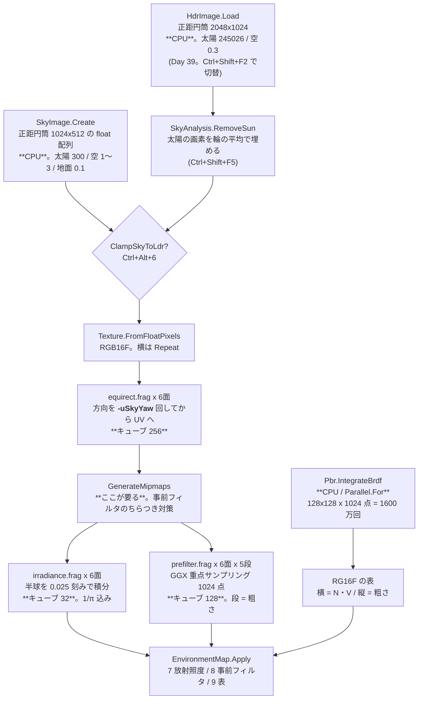
```mermaid
flowchart TD
    S["SkyImage.Create<br/>正距円筒 1024x512 の float 配列<br/>**CPU**。太陽 300 / 空 1〜3 / 地面 0.1"]
    H["HdrImage.Load<br/>正距円筒 2048x1024<br/>**CPU**。太陽 245026 / 空 0.3<br/>(Day 39。Ctrl+Shift+F2 で切替)"]
    S --> CL
    H --> RS["SkyAnalysis.RemoveSun<br/>太陽の画素を輪の平均で埋める<br/>(Ctrl+Shift+F5)"]
    RS --> CL{"ClampSkyToLdr?<br/>Ctrl+Alt+6"}
    CL --> T["Texture.FromFloatPixels<br/>RGB16F。横は Repeat"]
    T --> E["equirect.frag x 6面<br/>方向を <b>-uSkyYaw</b> 回してから UV へ<br/>**キューブ 256**"]
    E --> M["GenerateMipmaps<br/>**ここが要る**。事前フィルタのちらつき対策"]
    M --> I["irradiance.frag x 6面<br/>半球を 0.025 刻みで積分<br/>**キューブ 32**。1/π 込み"]
    M --> P["prefilter.frag x 6面 x 5段<br/>GGX 重点サンプリング 1024 点<br/>**キューブ 128**。段 = 粗さ"]
    L["Pbr.IntegrateBrdf<br/>**CPU / Parallel.For**<br/>128x128 x 1024 点 = 1600 万回"]
    L --> LT["RG16F の表<br/>横 = N・V / 縦 = 粗さ"]

    I --> A["EnvironmentMap.Apply<br/>7 放射照度 / 8 事前フィルタ / 9 表"]
    P --> A
    LT --> A
```

**入れ替えられない理由**が段ごとにある。

| 段 | 前の段に何を依存しているか |
|---|---|
| 正距円筒 → キューブ | 空の絵が要る。**ここで方位と上下の約束が確定する** |
| 空の回転 | **この段でしか掛からない**。以降は全部このキューブを見る |
| ミップ生成 | キューブが要る。**飛ばすと事前フィルタに白い点が散る** |
| 放射照度 | キューブが要る。**ミップは引かない**(`textureLod` で 0 に固定) |
| 事前フィルタ | キューブとそのミップが要る |
| BRDF の表 | **何にも依存しない**。だから初回だけ焼けばよい |

いちばん最後だけが独立しているのは、**そこに環境の情報が入っていない**から。
入っているのは「この材質は、あらゆる方向から来る光をどれだけ返すか」という
材質の性質だけで、空を差し替えても変わらない(要点4)。

**`Ctrl+Alt+5` の焼き直しに BRDF の表が入っていない**のはこのため。
1600 万回の積分が毎回走ったら、太陽を回すたびに 700ms ではなく 1.5 秒止まることになる。

**ミップ生成が真ん中に挟まる**のがいちばん見落としやすい。
事前フィルタは 1024 点をランダムに引くので、太陽(1テクセルで 300)に
当たった数点だけが桁違いに効き、**隣のテクセルで当たり外れが変わる**。
「1サンプルが担当する立体角に見合った大きさのミップから引く」ことで均すのだが、
そのミップが無ければ何も起きない——**エラーも出ない**。
症状は「ぼかしたはずの面に白い点が散る」で、
ファイアフライ(firefly)と呼ばれる、モンテカルロ積分では定番の壊れ方になる。

**放射照度だけがミップを引いてはいけない**、というのが裏返しの落とし穴。
こちらは `texture()` を使うと GPU が勝手に粗い段を選び、
地平線の明るい空が地面側へにじむ。
同じキューブマップに対して、**片方はミップを使い、片方は使ってはいけない**——
用途で正解が反対になるので、コメントに理由を書いておかないと後で必ず迷う
(「検証の途中で分かったこと」)。

**Day 39 で入口が2つになった**。手焼き(`SkyImage`)と HDRI(`HdrImage`)で、
**2段目から先はまったく同じ道**を通る。
Day 36 の設計書に「Day 39 で本物の HDRI を差し込むときは
この層を差し替えるだけで済む」と書いた読みが、そのとおりに効いた。

**空の回転が焼き込みパスの中でだけ起きる**のが、今日の置き方の要点。
`equirect.frag` が方向を `-uSkyYaw` 回してから UV を引くので、
出来上がったキューブがもう回っている。
放射照度も事前フィルタもスカイボックスも**そのキューブしか見ない**ので、
**1か所直せば全部が付いてくる**。

裏返しの注意が1つ。**`RemoveSun` は回す前の座標で動く**。
正距円筒の画素を直接触るので、回転を挟むと抜く場所がずれる。
順番は「読む → 測る → 抜く → 焼く(ここで回る)」で固定。

**焼く先の差し替えは生の FBO でやっている**。
`glFramebufferTexture2D` に「面」と「ミップ」を直接渡せるので、
6面 x 5段 = 30 通りの描き込み先を1つの FBO で回せる。
`Framebuffer` を使わない理由は設計書の冒頭に書いたとおりで、
**外のテクスチャを挿す口が無い**から。

### HDRI から太陽が出るまで — 絵を測って光にする5段

`Program.BakeSky` と `ApplyDemoLighting` の中身。
**絵の中の太陽と、影を落とす平行光源を一致させる**のが目的。

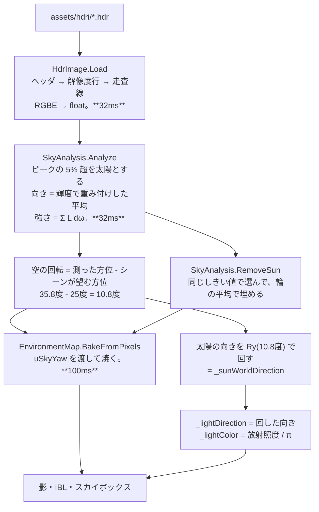
```mermaid
flowchart TD
    F["assets/hdri/*.hdr"] --> L["HdrImage.Load<br/>ヘッダ → 解像度行 → 走査線<br/>RGBE → float。**32ms**"]
    L --> A["SkyAnalysis.Analyze<br/>ピークの 5% 超を太陽とする<br/>向き = 輝度で重み付けした平均<br/>強さ = Σ L dω。**32ms**"]
    A --> Y["空の回転 = 測った方位 - シーンが望む方位<br/>35.8度 - 25度 = 10.8度"]
    A --> R["SkyAnalysis.RemoveSun<br/>同じしきい値で選んで、輪の平均で埋める"]
    Y --> B["EnvironmentMap.BakeFromPixels<br/>uSkyYaw を渡して焼く。**100ms**"]
    R --> B
    Y --> D["太陽の向きを Ry(10.8度) で回す<br/>= _sunWorldDirection"]
    D --> P["_lightDirection = 回した向き<br/>_lightColor = 放射照度 / π"]
    B --> S["影・IBL・スカイボックス"]
    P --> S
```

**`/ π` が入っている**のが引っかかりどころ。`Render3D` は PBR のとき
`_lightColor` を π 倍して送っている——あれは
「Day 34 までのランバートと明るさを揃える」ための辻褄合わせ(Day 35 の要点)で、
物理としては**放射照度をそのまま入れるのが正しい**。
抽出値をそのまま渡すと π 倍されて 3 倍明るくなるので、先に割ってある。

**測るのは回す前の画像**、**回すのは焼くときと平行光源の向き**、
という分け方をひとことで言うとこうなる。

| 段 | 座標系 |
|---|---|
| `Analyze` / `RemoveSun` | **HDRI の座標**(撮影時の方位) |
| `equirect.frag` / `_sunWorldDirection` | **シーンの座標**(回したあと) |

`_skyYaw` を境に世界が切り替わる、と覚えておくと迷わない。
**片方だけ回すのがいちばんありがちな壊れ方**で、
空を回して光を回し忘れると「太陽が写っている方向と影の向きが違う」、
逆にすると「空だけ元の方位のまま」になる。
自己チェックの最後の項目がこれを見張っている。

実測(`spruit_sunrise_2k`)。

```
  太陽: 仰角 8.0度 / 方位 35.8度  放射照度 (16.72, 11.41, 3.36)  全体の 75%
  空の回転 10.8度 → シーンでの方位 25.0度
  見かけの半径 0.30度(9 画素 / 立体角 0.000084sr)  ピーク輝度 245026
  立体角の合計 12.5664(4π = 12.5664)  ※ 65504 を超える画素が 9 個(RGB16F で頭打ち)
```

最後の1行が地味に効く。**太陽の芯は半精度 float の上限を超える**ので、
`RGB16F` へ上げた時点で 65504 に頭打ちになる。
今日はその太陽を環境マップから抜いているので実害が無いが、
`Ctrl+Shift+F5` で抜くのをやめると、
**IBL に入る太陽は本来の 4 分の 1 の明るさ**になっている。
「抜かないと二重計上」「抜かないと頭打ち」の両方が同じ方向を向いているのは、
たまたまではなく**太陽が桁違いに明るいことの帰結**。

### AO が1枚できるまで — 3つのパスと、画面に写っていないものの話

`RenderSsaoPass()` の中で何が起きているか。
**入力と出力を全部書き出す**と、幾何バッファが2回読まれることが見える。

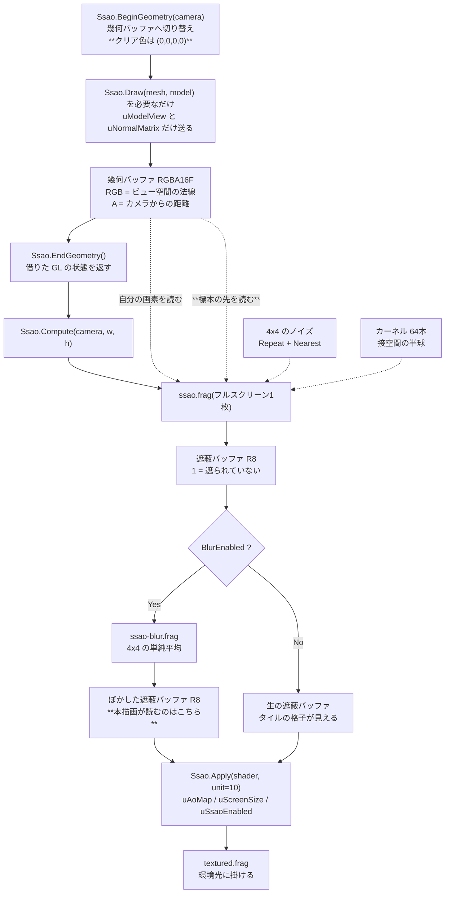
```mermaid
flowchart TD
    B["Ssao.BeginGeometry(camera)<br/>幾何バッファへ切り替え<br/>**クリア色は (0,0,0,0)**"]
    B --> D["Ssao.Draw(mesh, model) を必要なだけ<br/>uModelView と uNormalMatrix だけ送る"]
    D --> G["幾何バッファ RGBA16F<br/>RGB = ビュー空間の法線<br/>A = カメラからの距離"]
    G --> E["Ssao.EndGeometry()<br/>借りた GL の状態を返す"]
    E --> C["Ssao.Compute(camera, w, h)"]

    C --> P2["ssao.frag(フルスクリーン1枚)"]
    G -.->|"自分の画素を読む"| P2
    G -.->|"**標本の先を読む**"| P2
    N["4x4 のノイズ<br/>Repeat + Nearest"] -.-> P2
    K["カーネル 64本<br/>接空間の半球"] -.-> P2

    P2 --> O["遮蔽バッファ R8<br/>1 = 遮られていない"]
    O --> BL{"BlurEnabled ?"}
    BL -->|Yes| P3["ssao-blur.frag<br/>4x4 の単純平均"]
    P3 --> R["ぼかした遮蔽バッファ R8<br/>**本描画が読むのはこちら**"]
    BL -->|No| R2["生の遮蔽バッファ<br/>タイルの格子が見える"]

    R --> AP["Ssao.Apply(shader, unit=10)<br/>uAoMap / uScreenSize / uSsaoEnabled"]
    R2 --> AP
    AP --> TF["textured.frag<br/>環境光に掛ける"]
```

**幾何バッファから出ている点線が2本ある**のが、この図でいちばん見てほしいところ。

| どちらの読み | 何を答える |
|---|---|
| 自分の画素 | この点はどこにあり、どちらを向いているか |
| 標本の先の画素 | **その方向に何か写っているか** |

2本目が SSAO の全部で、当たり判定の代わりをしている。
だから**画面に写っていないものは絶対に遮蔽しない**——
画面の外の柱も、手前の物の裏側も、深度バッファには存在しない。

**なぜ遮蔽バッファが2枚あるか**は `PostProcess` のぼかしと同じ理由で、
**同じテクスチャを読みながら同じテクスチャに書けない**から
(GPU は読み書きの順序を保証しない)。
あちらは4往復するので ping-pong だったが、こちらは1回で済むので
`_occlusion` → `_blurred` の一方通行になっている。

**ぼかしを切ると `Result` が `_occlusion` を指す**。
バッファを2枚持ったまま片方を使わない形にしてあるのは、
切り替えのたびに確保し直すより、2MB(R8 なら)を持ち続けるほうが安いため。

パスの数と代償(960x640、標本 32 本、RTX 3070)。

| 段 | 何回 | 実測 |
|---|---|---|
| 幾何パス | 描くものの数だけ(デモは 7 回) | — |
| 遮蔽の計算 | フルスクリーン1枚 | — |
| ぼかし | フルスクリーン1枚 | — |
| **合計** | | **0.29〜0.38ms** |

VRAM は 960x640 で 7.6MB。内訳は**幾何 6.4MB**(色 RGBA16F で 4.7MB +
深度レンダーバッファ 1.8MB)と**遮蔽 0.6MB x2**。

**幾何バッファが 85% を占める**ので、`Ctrl+F6` で遮蔽を半分にしても
6.7MB にしか減らない——ここが「AO だけ半解像度」の限界で、
本当に節約したいなら G バッファを本描画と共有する(Day 52)ことになる。

### 1画素の色が決まるまで — BRDF が座っている場所

`textured.frag` の `main` が、1画素につき1回走る。
Day 31 から積み上げてきたものが**全部この1本の中**に並んでいるので、
今日足した BRDF がどこに座っているのかを1枚にしておく。

```mermaid
flowchart TD
    UV["ParallaxUv<br/>視線の傾きで UV をずらす(Day 34)"]
    UV --> TEX["5枚のマップを **ずらしたあとの UV** で読む<br/>ベース / MR / 法線 / AO / 発光"]
    TEX --> AO["**ScreenSpaceOcclusion()**(Day 37)<br/>gl_FragCoord / 画面の大きさ で引く<br/>マップの AO と掛け合わせる"]
    AO --> NM["PerturbNormal<br/>接空間の法線を世界へ(Day 34)"]
    NM --> OV["金属度・粗さの上書き(Day 35)<br/>負なら素通し"]
    OV --> DBG1{"成分 1〜7, 12, 21 ?"}
    DBG1 -->|Yes| OUT1["そのマップ(または遮蔽率)を出して終わり"]
    DBG1 -->|No| SH["ShadowFactor<br/>光の座標へ写して PCF(Day 33)"]
    SH --> DBG2{"成分 8 ?"}
    DBG2 -->|Yes| OUT2["影の係数だけ"]
    DBG2 -->|No| PBR{"uPbrEnabled ?"}

    PBR -->|"0"| LAM["ランバート(Day 34 まで)<br/>光 × N・L × 影 + 環境光 × <b>AO×SSAO</b>"]
    PBR -->|"1"| CT["**CookTorrance()**<br/>D・G・F を出す<br/>拡散と鏡面を分けて返す"]

    CT --> DBG3{"成分 15〜17 ?"}
    DBG3 -->|Yes| OUT3["F / D / G を1枚ずつ"]
    DBG3 -->|No| DIR["直接光<br/>拡散・鏡面 × 光 × N・L × 影"]
    DIR --> IBL{"uIblEnabled ?"}
    IBL -->|"1"| AMB["**IBL**(Day 36)<br/>拡散 = kD × irradiance(N) × albedo × <b>AO×SSAO</b><br/>鏡面 = prefiltered(R, 粗さ) × (kS×A + B) × <b>AO×SSAO</b>"]
    IBL -->|"0"| AMB2["Day 35 まで<br/>環境光は定数。**向きが無い**<br/>金属はほぼ黒"]
    AMB --> DBG5{"成分 18〜20 ?"}
    DBG5 -->|Yes| OUT5["放射照度 / 映り込み / BRDF の表"]
    DBG5 -->|No| DBG4{"成分 13 / 14 ?"}
    AMB2 --> DBG4
    DBG4 -->|Yes| OUT4["拡散だけ / 鏡面だけ"]
    DBG4 -->|No| SUM["直接 + 環境 + 発光"]

    LAM --> FB["FragColor<br/>**この先はまだ HDR**(1.0 を超える)"]
    SUM --> FB
    FB --> PP["PostProcess<br/>明部抽出 → ぼかし → 露出 → トーンマップ → ガンマ"]
```

**読み取ってほしいのは順番の必然性**で、上から下へ「動かせない理由」がある。

| 段 | なぜここでなければならないか |
|---|---|
| UV が先 | ずらす前の UV で1枚でも読むと、その成分だけ凹凸から浮く(Day 34) |
| 法線が次 | BRDF の入力が N なので、差し替えは呼ぶ前に済んでいる必要がある |
| 上書きはその後 | マップを読んでから潰す。逆にすると上書きがマップに掛け算されてしまう |
| BRDF は影の後 | 影は BRDF の中身に関係しない**係数**なので、外で掛けるほうが式が澄む |
| 環境光は最後 | 直接光と足すだけ。**AO は環境光にしか掛けない**(Day 33 の要点) |
| IBL はその中 | **定数の環境光を差し替えただけ**。直接光側は1行も変わっていない |
| SSAO はどこでもよい | 画面座標だけで決まるので、UV も法線も要らない。**上流に何の制約も課さない** |

**SSAO の段だけ、置く場所に必然性が無い**のが面白いところ。
他の段は全部「前の段の結果が要る」から順番が決まっているが、
`ScreenSpaceOcclusion()` の入力は `gl_FragCoord` だけ——
視差でずらす前でも後でも、法線を差し替える前でも後でも、同じ値が返る。

これがスクリーンスペースの技法の性格そのもので、
**世界の側の事情を何も知らない**代わりに、
どんなシェーダにも1行で差し込める。

**`CookTorrance` が `out` を5つ持っている**のがこの図のいちばん不格好なところで、
拡散・鏡面・D・G・F を全部外へ出している。

戻り値1つで済ませるほうがきれいだが、それだと
「金属なのに拡散が残っている」「非金属なのに鏡面が色付き」といった取り違えが
**合成した絵からは絶対に見えなくなる**。
成分 13〜17 は、そのために外へ出した5つをそのまま画面に出しているだけ。

**分岐が多いのは GPU では本来まずい**。
GPU は近くの画素をまとめて動かすので、
枝が分かれると**両方の枝を実行してから片方を捨てる**ことがある。
本番のエンジンはこれを `#define` を変えた**シェーダバリアント**に分けるが、
今日は「1本のシェーダで全部見られる」ことを優先した。
成分の分岐は画面全体で同じ値を取る(uniform 分岐)ので、実際には安く済んでいる。

**Day 37 で差し替わったのは掛け算1つ**。`occlusion` と書いてあった箇所が
`ambientOcclusion`(= マップの AO × 画面から作った AO)になっただけで、
BRDF も IBL も影も1行も触っていない。

2つの AO を掛け合わせるのは厳密には正しくない(同じ遮蔽を二重に数えうる)が、
実務ではこうする。**細かさの担当範囲が違う**ためで、
焼いた AO は物の中の溝を、SSAO は物どうしの隙間を受け持っている。

**Day 36 で差し替わったのは環境光の枝だけ**。
直接光(`CookTorrance`)も影も法線マップも視差も、今日は1行も触っていない。
「環境光は定数」という一行が「環境光には向きがある」になっただけで
金属の見え方が一変する——**押さえるべきは差分の小ささのほう**。

**`FragColor` はまだ HDR**。金属のハイライトは 1.0 を軽く超えて出る。
Day 31 で RGBA16F のシーンバッファを用意しておいたので、
ここで切られずに後処理まで届く——
**8bit(Shift+1)に落とすと、粗さの左端が全部同じ白になる**のを確かめられる。
PBR と HDR が対で語られるのはこのため。

### HDR パイプラインの中身 — 11 回のフルスクリーンパス

`_post.End()` の中で何が起きているか。**入力と出力を全部書き出す**と、
ping-pong の必然性がそのまま見える。

```mermaid
flowchart TD
    SC["シーンバッファ<br/>画面と同じ大きさ / RGBA16F / 深度あり"]
    SC --> BR["明部の抽出<br/>bright.frag<br/>1パス"]
    BR --> BF["bright バッファ<br/>画面の 1/2 / RGBA16F"]
    BF --> H1["横ぼかし<br/>blur.frag uDirection=(1/w, 0)"]
    H1 --> BB["blurB"]
    BB --> V1["縦ぼかし<br/>blur.frag uDirection=(0, 1/h)"]
    V1 --> BA["blurA"]
    BA -->|"4往復するので<br/>2回目以降の入力"| H1
    SC --> CO["合成 composite.frag<br/>露出 → ブルーム加算 → <b>グレーディング</b><br/>→ トーンマップ → ガンマ"]
    BA --> CO
    CO --> FQ{"FXAA を掛けるか<br/>Shift+F1"}
    FQ -->|No| OUT["既定のフレームバッファ<br/>= 画面"]
    FQ -->|Yes| LD["LDR バッファ<br/>画面と同じ大きさ / <b>RGBA8</b> / 深度なし"]
    LD --> FX["FXAA fxaa.frag<br/>輝度で段差を見つけ<br/>縁に沿って混ぜる"]
    FX --> OUT
```

パスの数は **1(明部)+ 4×2(ぼかし)+ 1(合成)+ 1(FXAA)= 11**。
画面に出ている `パス:11` はこれを数えている
(`Shift+F1` で FXAA を切ると 10 に戻る)。

**グレーディングはこの図に現れない**。合成パスの中に数行入っただけで、
パスもバッファも増えていない——**すでに全画素を1回触っているところに便乗**している。
FXAA が丸ごと1パスと 8.3MB を要求するのと対照的で、
「後処理を1つ足す」と言っても値段はまるで違う。

**FXAA の入力が RGBA8 なのは節約ではなく必然**。
ここに来る値はトーンマップとガンマを通ったあとで、すでに 0〜1 に畳まれている。
畳んだあとの値に 16bit の幅は要らない。
さらに FXAA は**ガンマ後の輝度**で段差を測る手法なので(要点3)、
そもそもこの位置——リニアな明るさが display-referred な値に変わった直後——
にしか置けない。

**なぜ `blurA` と `blurB` の2枚が要るのか**。
GPU は「同じテクスチャを読みながら同じテクスチャへ書く」ことを許さない
(読み書きの順序が保証されないので結果が未定義になる)。
だから横ぼかしの結果を別の場所に置き、それを読んで縦ぼかしを書く、を繰り返す。
これが ping-pong で、後処理を書き始めると必ず最初にぶつかる制約になる。

**`bright` を `blurA`/`blurB` と別に持っている**のは、
中間バッファの表示(Shift+4)で「ぼかす前の明部」を見たいから。
表示のためだけに 1/2 サイズのバッファ1枚(1920x1080 なら 4MB)を払っている。
本番用に絞るなら、`bright` を捨てて `blurA` に直接書けば1枚減らせる。

**バッファの大きさが2種類ある**ことにも意味がある。

| バッファ | 大きさ | 形式 | 深度 | なぜ |
|---|---|---|---|---|
| scene | 画面と同じ | RGBA16F | あり | 3D を描くので深度が要る。原寸でないと絵がぼける |
| bright / blurA / blurB | 画面の 1/2 | RGBA16F | **なし** | **ぼかしたものを縮めても分からない**。板1枚なので深度も要らない |
| ldr | 画面と同じ | **RGBA8** | なし | **1画素の精度そのものが仕事**(縮めたら階段が戻る)。畳んだ後なので 8bit で足りる |

半分にするとピクセル数が 1/4 になり、ぼかし 8 パスのコストがそのまま 1/4 になる。
おまけに「縮めて拡大する」こと自体が弱いぼかしとして働くので、
同じタップ数でより広く滲む。**質を落とさずに 4 倍安くなる**、後処理では珍しく素直な最適化。

**3行目だけ縮められない**のが Day 38 の対比になっている。
ブルームは「ぼけたものを縮めても分からない」から半分でよかった。
FXAA は逆で、**1画素ずれているかどうかを見るのが仕事**なので、
縮めた瞬間に見るべきものが消える。
「後処理のバッファは半分でよい」は経験則であって規則ではない、という例。

### FixedUpdate の中身 — 入力の出どころと3つのバックエンド

```mermaid
flowchart TD
    S["FixedUpdate(dt)"] --> AU["_audio.Update()<br/>終わったボイスを回収<br/>1ステップの発音予算を戻す"]
    AU --> B["BurnCpu(_loadMicroseconds)<br/>処理落ちの再現"]
    B --> M{"_recorder.Mode"}
    M -->|Replaying| TR{"TryReplay 成功?"}
    TR -->|Yes| SC["記録された入力を採用<br/>_inputSystem.SetCurrent"]
    TR -->|No| FR["FinishReplay()<br/>その場で操作を返す"]
    FR --> BS
    M -->|Off / Recording| BS["input = _inputSystem.BeginStep()<br/>+ _recorder.Record(input)"]
    SC --> SF
    BS --> SF["_scene.Input = input<br/>_scene.FixedUpdate(dt)"]
    SF --> PG{"_playing ?"}
    PG -->|Yes| GM["_game.Update(dt, input)<br/>ここで return。デモは回さない"]
    PG -->|No| CD{"_collisionDemo ?"}
    CD -->|Yes| UB["UpdateBodies(dt, bounds)"]
    CD -->|No| BK
    UB --> BK{"_backend"}
    BK -->|StructArray| US["UpdateSprites(dt)<br/>構造体の配列を順に舐める"]
    BK -->|Ecs| ES["EcsSystems.Snapshot<br/>EcsSystems.Move"]
    BK -->|GameObject| GO["Scene.FixedUpdate が済ませている"]
```

**音の後始末を先頭に置いた**のは、音を要求するのがこの下だから。
予算を戻す場所と使う場所を近くに置くと、「いつリセットされるのか」を追う必要がなくなる。
描画側(`OnRender`)に置くと、シミュレーションが 5Hz のときに
「1フレームに複数ステップぶんの音が要求されるのに予算は 1 回ぶん」というずれが起きる。

**入力がどこから来たかを、この関数から下は誰も気にしない**のがポイント(Day 20 の要点1)。
`InputSnapshot` という値に畳んであるので、記録の再生と実操作を1行で差し替えられる。

`Scene.FixedUpdate` を `_backend` の分岐より前で必ず呼んでいるのは、
**プレイヤーと階層の実演がどのモードでも Scene 側にいる**ため。

### Scene.FixedUpdate の4段階

順番に意味がある。入れ替えると壊れる。

```mermaid
flowchart LR
    A["1. SnapshotTransforms<br/>今の姿勢を控える"]
    B["2. RunPendingStart<br/>まだ Start していない部品"]
    C["3. UpdateComponents<br/>各 Component.FixedUpdate"]
    D["4. FlushDestroy<br/>溜めた破棄をまとめて実行"]
    A --> B --> C --> D
```

| 段 | なぜその位置か |
|---|---|
| 1 | **動かす前**に控えないと、補間の始点が終点と同じになって補間が効かない |
| 2 | `Start` の中で新しいオブジェクトが生まれるので、**開始時点の件数だけ**回す |
| 3 | ここも開始時点の件数で止める。このステップで生まれたものは次のステップから |
| 4 | 更新中にリストから消すと**走査中のインデックスがずれる**(Day 22 の要点5)。<br/>まとめて `RemoveAll` するのは、1個ずつ消すと O(n^2) になるため |

### 非同期テクスチャロードの流れ

`Q` キーで走る道。**GL を呼ぶ部分と呼ばない部分の境目**が、
そのままスレッドの境目になっている(Day 21 の要点5)。

```mermaid
sequenceDiagram
    participant P as Program
    participant RM as RenderResources
    participant TP as スレッドプール
    participant Q as _decoded キュー
    participant GL as OnRender(描画スレッド)

    P->>RM: LoadTextureAsync(path)
    RM->>RM: 仮の絵でスロットを確保
    RM-->>P: Handle を即返す
    RM->>TP: Task.Run(復号)
    Note over P,GL: この間もフレームは止まらない<br/>ハンドルを解くと仮の絵が出る
    TP->>TP: Texture.DecodeFile(GL を呼ばない)
    TP->>Q: DecodedJob を積む
    GL->>RM: Update()
    RM->>Q: TryDequeue
    RM->>RM: IsAlive で生存確認
    RM->>GL: Texture.FromPixels でアップロード
    RM->>RM: Replace(handle, texture)
    Note over P,GL: 次のフレームから本物が出る<br/>呼び出し側のコードは一切変わらない
```

`Update()` が `MaxUploadsPerFrame` で枚数を絞っているのが肝で、
**復号を非同期にしても、アップロードをまとめてやるとそこでカクつく**(Day 21 の要点6)。

### 衝突判定の3段 — ブロードフェーズが割り込んだ

Day 25 の `UpdateBodies` は「動かす → 総当たり → 押し戻す」の3段だった。
今日、真ん中が**「組を絞る」と「絞った組を判定する」に割れる**。

```mermaid
flowchart TD
    S["UpdateBodies(dt, bounds)"] --> MV["1. 全体を動かす<br/>位置と回転を進め、壁で跳ね返す<br/>壁は外接 AABB で見る"]
    MV --> SFX{"壁に当たった<br/>かつ _collisionSfx ?"}
    SFX -->|Yes| PB["PlayBounce<br/>X 位置で左右に振る<br/>大きさでピッチを変える<br/>速さで音量を変える"]
    SFX -->|No| BP
    PB --> BP{"_broadphase"}

    BP -->|BruteForce| BF["2a. 全部の組<br/>for i, for j = i+1<br/>n(n-1)/2 組"]
    BP -->|UniformGrid| GB["2b. 外接 AABB を作る<br/>_bodyBounds に詰める"]
    GB --> GC["Grid.Configure<br/>マスの大きさを決める"]
    GC --> GD["Grid.Build<br/>数える→接頭辞和→詰める"]
    GD --> GP["Grid.CollectPairs<br/>候補の組だけを集める"]

    BF --> NR["3. Resolve i, j<br/>方式が違っても同じ関数"]
    GP --> NR
    NR --> T["Test(in Body a, in Body b)<br/>形の組で振り分け"]
    T --> H{"contact.Hit ?"}
    H -->|No| NR
    H -->|Yes| CNT["接触数を数える<br/>色を赤にする"]
    CNT --> RV{"_resolveOverlap ?"}
    RV -->|Yes| PS["4. 半分ずつ押し戻す<br/>a -= n*d/2 , b += n*d/2"]
    RV -->|No| NR
    PS --> NR
```

発音の要求が**移動の段にある**ことに注意。
「壁に当たった」はブロードフェーズの外で分かることなので、
組の絞り込みとは無関係にここで出る。
体どうしの接触音を鳴らすなら `Resolve` の中になるが、
2000 体で 7,425 組が接触しているので**要求だけで 7,425 回**になる。
要点3の 7.3μs を掛けると 54ms。今日は壁だけにしてある。

図で見てほしいのは**2つの経路が `Resolve` で合流している**ところ。
方式ごとにナローフェーズを書き分けると、
「答えが違う」となったときに原因がブロードフェーズなのか判定なのか分からなくなる。
合流させておけば、**違いが出たら必ず組の選び方が原因**と言い切れる。
`F12` の自己チェックが「接触数が一致」だけで意味を持つのはこの形のおかげ。

もうひとつ、**押し戻し(4段目)がグリッドの構築より後にある**ことに注意。
押し戻すと位置が動くので、ステップの頭で組んだ格子は少しずつ古くなる。
押し戻し量は 1 ステップぶんの重なりぶんしかないので実用上は問題にならないが、
厳密にやるなら「判定を全部済ませてから、まとめて押し戻す」形にする。
Phase 7 のインパルス解決がその形になる。

### 均一グリッドの中身 — 2つの関数しかない

`SpatialGrid` の公開メソッドは実質 `Build` と `CollectPairs` の2つだけ。
中で何が起きているかは、コードを読むより図のほうが早い。

```mermaid
flowchart TD
    subgraph B["Build(bounds) — 格子を組む"]
        B1["パス1: 数える<br/>各体の AABB が触れるマスに +1<br/>_cellStart[cell+1]++"]
        B2["パス2: 接頭辞和<br/>個数を開始位置に変える<br/>_cellStart[c] += _cellStart[c-1]"]
        B3["パス3: 詰める<br/>もう一度なめて _entries へ書く<br/>書き込み位置は _cursor が持つ"]
        B1 --> B2 --> B3
    end

    subgraph C["CollectPairs(bounds) — 候補を集める"]
        C1["体 i について<br/>stamp = ++_stamp"]
        C2["i が触れるマスを順に見る"]
        C3{"j > i ?"}
        C4{"_mark[j] == stamp ?"}
        C5["_mark[j] = stamp<br/>同居 1 組と数える"]
        C6{"AABB が重なる ?"}
        C7["_pairs に積む"]
        C1 --> C2 --> C3
        C3 -->|No| C2
        C3 -->|Yes| C4
        C4 -->|Yes| C2
        C4 -->|No| C5 --> C6
        C6 -->|No| C2
        C6 -->|Yes| C7 --> C2
    end

    B3 --> C1
```

3つの絞りが直列に並んでいるのが分かる。

| 絞り | 落とすもの | 4000 体での実測(マス 32px) |
|---|---|---|
| 格子 | 別のマスにいる組 | 7,998,000 → 72,527 |
| `j > i` と印 | 同じ組の重複 | (上の数に含まれる) |
| AABB | 同じマスだが離れている組 | 72,527 → 24,733 |

**最後の AABB がまだ 3 分の 1 に減らしている**のが面白いところで、
「同じマスにいる」は「近い」でしかない。
7.4ns の AABB 判定を挟むことで、24〜120ns のナローフェーズを 5 万回節約している。

`j > i` の条件だけでは重複が消えないことは、実際に印を外すと確かめられる
(自己チェックの「重複した組が無い」が落ちる)。

`Test(in Body, in Body)` の中身は形の組み合わせ表そのもの。**3種類で6通り**になる。

| a \ b | Circle | Box | RotatedBox |
|---|---|---|---|
| **Circle** | `Test(Circle, Circle)` | `Test(Circle, Aabb)` | `Test(Circle, Obb)` |
| **Box** | 上を**符号反転** | `Test(Aabb, Aabb)` | OBB 同士へ寄せる |
| **RotatedBox** | 上を**符号反転** | OBB 同士へ寄せる | `Test(Obb, Obb)` SAT |

- **専用の速い経路**(AABB 同士、円同士)と**一般形**(OBB 同士の SAT)を併存させ、
  組み合わせの穴は一般形で埋める。`F9` の自己チェックで**両者の答えが一致すること**を確認している
- 引数の順が逆になる組(`Test(Box, Circle)`)は**法線の符号を反転**して返す。
  ここを間違えると物体がめり込む方向へ押される(要点6)
- 種類を1つ足すと表が1行1列増える。3D で球・箱・カプセル・平面・地形と並べると 15 通りになり、
  **その表を埋めることが物理エンジンを書くこと**になる(Phase 7)

### 音を1発鳴らすまで — 3つの関門

`Play` を呼んでから実際に音が出るまでに、3回ふるいにかけられる。
**呼んだのに鳴らないことは普通に起きる**ので、どこで落ちたかを数えられるようにしてある。

```mermaid
flowchart TD
    S["Play(clip, volume, pitch, pan)"] --> A{"IsAvailable ?"}
    A -->|No| N1["VoiceId.None<br/>音の出ない環境。例外は投げない"]
    A -->|Yes| B{"クリップは生きている ?"}
    B -->|No| N2["VoiceId.None"]
    B -->|Yes| C{"このステップで<br/>同じクリップを<br/>上限まで鳴らした ?"}
    C -->|Yes| N3["間引き<br/>CulledLastStep++"]
    C -->|No| D["AcquireVoice(priority)"]
    D --> E{"空きがある ?"}
    E -->|Yes| G["ボイスを設定する<br/>Buffer / Gain / Pitch / Position"]
    E -->|No| F{"奪える相手がいる ?<br/>ループ以外で<br/>優先度が自分以下"}
    F -->|No| N4["諦める<br/>CulledLastStep++"]
    F -->|Yes| ST["いちばん低い優先度<br/>同点なら最古を止める<br/>StolenLastStep++"]
    ST --> G
    G --> H["alSourcePlay<br/>7.3us かかる"]
    H --> I["VoiceId を返す<br/>添字 + 世代"]
```

**「諦める」が2箇所ある**のが要点。
間引き(`C`)は「同じ音が多すぎる」で落とし、
`F` は「ボイスが足りず、しかも自分より偉い音しか鳴っていない」で落とす。
前者は音として意味が無いから落とすので**積極的**、
後者は資源が足りないから落とすので**消極的**。
タイトルバーで両方を分けて数えているのは、この2つが違う対処を要求するため
(前者は上限を調整する、後者はボイスを増やす)。

### 1文字が画面に出るまで — 4つの層を通り抜ける

`Draw("あ", ...)` を呼んでから画面に出るまでに何が起きるか。
**初回だけ通る道**(焼く)と、**毎回通る道**(引く・積む)が分かれているのが要点。

```mermaid
sequenceDiagram
    participant P as Program
    participant TR as TextRenderer
    participant GA as GlyphAtlas
    participant FF as FontFace
    participant TX as Texture
    participant SB as SpriteBatch

    P->>TR: Draw(batch, "あ", 位置, 16px, 色)
    TR->>TR: 行に切る / ベースラインを出す
    TR->>GA: GetOrAdd(0x3042, 16)

    alt 初回だけ
        GA->>FF: GlyphIndexOf(0x3042)
        GA->>FF: Measure(グリフ番号, scale)
        FF-->>GA: 幅 11 / 高さ 11 / 送り 16
        GA->>GA: 棚に場所を取る
        GA->>FF: Rasterize(作業用バッファへ)
        GA->>GA: 上下をひっくり返す
        GA->>TX: UploadR8(x, y, 11, 11)
        Note over GA,TX: 実測 14.3us。ここだけが高い
    end

    GA-->>TR: Glyph(切り出し位置 + 寸法)
    Note over TR,GA: 2回目からは辞書を引くだけ。61ns

    TR->>TR: penX + OffsetX / baseline + OffsetY
    TR->>TR: 整数に丸める(PixelSnap)
    TR->>SB: Draw(領域, 中心, 大きさ, 色)
    Note over SB: ここから先はスプライトと同じ道
```

図で見てほしいのは、**`alt` の中が初回にしか走らない**こと。
14.3us と 61ns の差は 234 倍あり、**キャッシュを持つかどうかがそのまま性能**になる。
だからアトラスは「使い回すためのもの」であって、
描画をまとめるため(Day 17 の動機)だけのものではない。

もうひとつ、**`TextRenderer` から `Texture` への線が無い**。
グリフを焼く判断も、GL を触るのも、全部 `GlyphAtlas` の中で閉じている。
`TextRenderer` から見れば「文字を渡すと切り出し位置が返ってくる」だけで、

### ゲームの1ステップ — 11 段の順番と、格子の使い回し

`SurvivorGame.Update` は 11 段でできている。**順番に意味がある**。

```mermaid
flowchart TD
    S["Update(dt, input)"] --> LU{"Phase == LevelUp ?"}
    LU -->|Yes| C1["上下で選択肢を動かすだけ<br/>時間は進まない"]
    LU -->|No| P1["1. プレイヤーを動かす<br/>カメラが遅れて追う"]
    P1 --> P2["2. 敵を湧かせる<br/>画面の外の円周上"]
    P2 --> P3["3. 敵を動かす<br/>プレイヤーへ向かう / 遠すぎたら消す"]
    P3 --> P4["4. 格子を組む<br/>Configure + Build"]
    P4 --> P5["5. 敵どうしを押し離す<br/>CollectPairs"]
    P5 --> P6["6. 狙う敵を探して撃つ<br/>Query"]
    P6 --> P7["7. 弾を進めて当てる<br/>弾ごとに Query"]
    P7 --> P8["8. プレイヤーの被弾<br/>Query"]
    P8 --> P9["9. ジェムを吸い寄せて拾う"]
    P9 --> P10["10. レベルアップ判定"]
    P10 --> P11{"11. HP <= 0 ?"}
    P11 -->|Yes| GO["GameOver"]
    P11 -->|No| E["おわり"]
    P10 -.->|レベルが上がったら| LV["選択肢を3つ引いて<br/>Phase = LevelUp"]
```

**10 でレベルが上がったら、そこで止まる**。
Day 29 は `while` で一気に上げていたが、選択を挟むならそれはできない——
1回に1レベルずつ処理して、選び終わってから次のレベルを見る。

入れ替えると壊れるところ:

| 順番 | なぜそこか |
|---|---|
| 4 が 3 の後 | 動かす前に組むと、**1ステップ古い位置**で判定することになる |
| 5〜8 が 4 の後 | 全部**同じ格子**を使う。組み直すと4倍のコストになる |
| 10 が 9 の後 | ジェムを拾ってからでないと、レベルが1ステップ遅れる |

**格子を1回組んで4通りに使う**のが今日いちばんの節約になっている。

```mermaid
flowchart LR
    B["Grid.Build<br/>敵の外接 AABB を詰める"]
    B --> Q1["CollectPairs<br/>敵どうしの押し合い"]
    B --> Q2["Query 1回<br/>狙う敵を探す"]
    B --> Q3["Query × 弾の数<br/>当たった敵を探す"]
    B --> Q4["Query 1回<br/>プレイヤーに触れた敵"]
```

実測(敵 509 体):

| | 組の数 |
|---|---|
| 総当たりなら | 129,286 組 |
| 格子の候補 | **594 組** |

**99.5% 減っている**。押し合いは「全員対全員」なので、
格子が無ければこの演出はそもそも載らない(Day 26 の要点5)。

そして 2〜4 は `CollectPairs` ではなく `Query` を使う。
**1対多は組の列挙では表せない**——
弾1発について「近くにいる敵」を知りたいだけなので、
全部の組を作ってから絞るのは無駄になる。

### 武器3種 — 当たり判定をどこに置くか

3つの武器の違いは、突き詰めると<b>当たり判定をどこに置くか</b>だけになる。

```mermaid
flowchart TD
    W["UpdateWeapons(dt)"] --> K{"武器の種類"}

    K -->|Bolt| B1["タイマーを刻む"]
    B1 --> B2["いちばん近い敵を Query で探す"]
    B2 --> B3["Projectile を Count 発ぶん作る<br/>少しずつ角度をずらす"]
    B3 --> B4["**当たり判定は UpdateProjectiles 側**<br/>飛んでいる間ずっと残る"]

    K -->|Orbit| O1["角度を進める<br/>Angle += Speed * dt"]
    O1 --> O2["**毎ステップ**判定する<br/>刻むとすり抜ける"]
    O2 --> O3["球ごとに Query → 円判定"]
    O3 --> O4["**Damage は毎秒**<br/>dt を掛けて削る"]

    K -->|Aura| A1["タイマーを刻む"]
    A1 --> A2["半径 Radius の円で Query"]
    A2 --> A3["範囲の敵をまとめて削る<br/>**位置すら持たない**"]
```

| | 当たり判定の置き場所 | 残るか | 刻むか |
|---|---|---|---|
| ボルト | `Projectile` の配列 | 寿命まで残る | 発射を刻む |
| オービット | その場で計算 | **残らない** | **刻まない**(毎ステップ) |
| オーラ | プレイヤーの周り | 残らない | 削りを刻む |

**「武器 = 弾を出すもの」と決めつけて設計すると、オービットとオーラが入らない**
(Day 29 の改造課題3で触れた分かれ道)。
今日の形は、`WeaponState` を「種類とレベルとタイマー」だけにして、
<b>当たり方は種類ごとの関数に任せる</b>——
つまり案A(enum + 分岐)を選んでいる。

3種類のうちはこれが読みやすい。5種類を超えたら、
`WeaponStats` のフィールドの意味が武器ごとに違うのが苦しくなるので、
そこが案C(完全にデータで持つ)へ移る目安になる。

### オービットだけ刻まない理由

これは実装中に実際に踏んだところ。**最初は 0.22 秒ごとに判定していて、
オービットだけで 40 秒遊んで撃破 0 体**になった。

```mermaid
flowchart LR
    T1["t=0.00s<br/>球はここ"] -->|"0.22秒で 50px 進む"| T2["t=0.22s<br/>球はここ"]
    E["敵はこの間にいた<br/>**一度も判定されない**"]
    T1 -.-> E
    T2 -.-> E
```

球は 1 秒に 200px 以上動く。0.22 秒ごとに位置を見ると、
**1回の判定の間に 50px 飛ぶ**。球の直径は 22px しかないので、
その間にいた敵はすり抜ける。

Day 25 の改造課題3(速い弾が細い壁をすり抜ける)とまったく同じ話が、
**攻撃側で起きた**ことになる。直し方も同じ2択で、

1. 移動前と移動後を結んだ範囲で判定する(連続衝突判定)
2. **毎ステップ判定して、ダメージを時間で割る**

ここでは 2 を採った。触れている間ずっと削る形になるので、
「巻き付いて削る武器」という手触りにも合う。
そのぶん `WeaponStats.Damage` の単位が武器で変わる
(オービットだけ「毎秒」)——**気持ち悪いが、揃えると片方が嘘になる**。

## 完成条件

`dotnet run --project reference/Day39 -c Release` で起動する。
**必ず `-c Release`** ——`.hdr` の復号も太陽の抽出も CPU の総なめなので、
Debug だと読み込みが数倍かかる。

起動直後は Day 38 までの絵。デモは `Ctrl+Shift+F1` で入る。

### 1. `Ctrl+Shift+F12`: デモ v1 の決めの構図

**今日の到達点はこの1枚**。押すと次の状態に飛ぶ。

- シーンを読み込み(まだなら)、HDRI の空、HDRI から抽出した太陽
- 影 / SSAO / ブルーム / FXAA / IBL すべて ON、スプライトは 0 枚
- カメラは JSON の `camera`(注視点 (-1.2, 1.3, -1.5)、距離 10.5、方位 32度、仰角 10度)

見えるはずのもの:

- **れんがの壁が左から奥へ伸び、斜めから warm な光が舐めている**。
  目地の凹凸が影を作っているのは法線マップ+視差(Day 34)
- **小物が長い影を引いている**。太陽の仰角が 8 度なので、
  高さ 1m のゴミ箱の影が 7m 伸びる
- **ゴミ箱の胴に空が映っている**。金属なので拡散反射をせず、IBL が全部(Day 36)
- **物と物、物と地面が接するところに暗がりがある**(SSAO。Day 37)
- 壁の陰になっている側も真っ黒にはならない。**そこは IBL だけで照らされている**

コンソールに出るはずのもの:

```
デモ v1: 「夕暮れの裏通り」
  シーン 976ms(glTF 6 体 / 描画 25 回 / 三角形 154,424 枚 / テクスチャ 41 枚)
  影を落とすもの: 24 / 25

空: spruit_sunrise_2k 2048x1024  読み 32ms / 解析 32ms / 焼き 102ms
  太陽: 仰角 8.0度 / 方位 35.8度  放射照度 (16.72, 11.41, 3.36)  全体の 75%
  空の回転 10.8度 → シーンでの方位 25.0度(HDRI を差し替えてもここは動かない)
  見かけの半径 0.30度(9 画素 / 立体角 0.000084sr)  ピーク輝度 245026
  立体角の合計 12.5664(4π = 12.5664)  ※ 65504 を超える画素が 9 個(RGB16F で頭打ち)
  環境マップからは太陽を抜いてある(平行光源との二重計上を消すため)
```

### 2. `Ctrl+Shift+F2`: 空を手焼きに戻す

Day 36 の手焼きの空に切り替わる。

- **空が単調になる**。雲も地形も無い、上が青くて地平線が白いだけのグラデーション
- **ゴミ箱の胴に何も映らなくなる**。映るものが無いので、のっぺりした金属になる
- 影の向きは変わらない(手焼きの空は `_lightDirection` から作るので、最初から一致している)

**IBL の値打ちが「環境の絵の情報量」そのものである**ことが、ここでいちばんよく分かる。
同じコード、同じパス数で、変わったのは入力の1枚だけ。

### 3. `Ctrl+Shift+F3`: HDRI を回す(3枚)

押すたびに `spruit_sunrise` → `venice_sunset` → `the_sky_is_on_fire` と回る。
**太陽の方位は 25 度に固定されたまま**(空のほうを回しているので)、光の質だけが変わる。

| HDRI | コンソールに出る見かけの半径 | 絵 |
|---|---|---|
| `spruit_sunrise` | 0.30 度 | 濃い橙。影がはっきり出る |
| `venice_sunset` | 0.37 度 | **影がほとんど消える**。太陽が担う光が全体の 4% しかない |
| `the_sky_is_on_fire` | **53.4 度** | 影が消え、全体がぼんやり明るくなる。**抽出が破綻している** |

3枚目で「`← **大きすぎる。太陽を取り出せていない**`」という警告が付く。
**これが出る HDRI では、しきい値法は使えない**。

### 4. `Ctrl+Shift+F4`: 平行光源を手書きに戻す

**わざと食い違わせるための窓**。Day 38 までの `_lightDirection`
(手で決めた (-0.53, -0.72, 0.45))に戻る。

- **影の向きが空の太陽と合わなくなる**。空では右手前から差しているのに、
  影は別の方向へ伸びる
- 影が短くなる(手書きの光は仰角が 46 度あるので)
- 色も変わる。手書きの光はほぼ白 (1.15, 1.11, 1.04) なので、夕暮れ感が消える

Day 36 の `SkyImage` に書いてあった
「買ってきた HDRI だと絵の中の太陽とシーンの平行光源が別物になる」が、
そのまま目の前に出る。

### 5. `Ctrl+Shift+F5`: 環境マップから太陽を抜くのをやめる

**二重計上の実演**。

- 全体が明るくなる(太陽を2回数えているので)
- とくに**影の中が明るくなる**。影とは「平行光源が届かない場所」なのに、
  IBL の中の太陽は遮蔽を知らないので届いてしまう
- 一方で**粗い金属に太陽が映る**ようになる。今日の抜き方の副作用で、
  拡散の二重計上を消す代わりに鏡面の映り込みも消えている(改造課題3)

### 6. `Ctrl+Shift+F6`: 太陽のしきい値を回す

0.30 → 0.10 → 0.05(既定)→ 0.02 と回る。`spruit_sunrise` では
**どこに置いてもほとんど変わらない**(視半径 0.26〜0.40 度)。

太陽が桁違いに明るいと、しきい値は効かない——これが**うまくいっている印**。
`Ctrl+Shift+F3` で3枚目に移してから同じことをすると、
**視半径が 5.85 度から 90 度近くまで動く**。同じつまみが、
素性の良い入力では無反応で、悪い入力では暴れる。

### 7. `Ctrl+Shift+F7`: 影を全部落とさなくする

`castShadow` を一括で無視する。

- **物が床に置かれている感じが一気に消える**。宙に浮いて見える
- ただし**完全には浮かない**。物と床が接するところに SSAO の暗がりが残っているため。
  `Ctrl+F1` で SSAO も切ると、本当に浮く

Day 37 で「SSAO は接地感を作る」と書いたことと、
Day 33 で「影は物と物の関係を見せる」と書いたことの**役割分担**が、
2つのスイッチで切り分けられる。

### 8. `Ctrl+Shift+F10`: JSON を書き換えて読み直す

`assets/scenes/demo-v1.json` をエディタで開き、たとえば

```json
      "position": [-3.4, 0.0, -4.0],   ← 街灯。ここを [-3.4, 0.0, 0.0] に
```

と書き換えて保存 → `Ctrl+Shift+F10`。街灯が手前に来る。

**ビルドが要らない**のがこの日の実務上の値打ちで、
絵作りはこれが無いと回らない。試してほしいもの:

- `lighting.exposure` を 0.3 / 0.8 に(全体の明るさ)
- `lighting.sunAzimuth` を 90 / 160 に(**光の来る向きが変わり、影が回る**)
- `lighting.shadowRadius` を 6 に(**遠くの影が箱から出て途中で切れる**。カスケードが要る理由)
- `materials[].uvScale` を半分に(目地が倍の大きさになる)

### 9. `Ctrl+Shift+F8`: スクリーンショット

実行したディレクトリの `screenshots/` に PNG が落ちる。
**後処理を全部通したあとの絵**なので、トーンマップもガンマも FXAA も済んでいる。
同じ秒に2枚撮ると `-2`、`-3` と番号が付く。

### 10. `Ctrl+Alt+F12`: 自己チェック

14 項目。**すべて `[OK]` になること**。

### 11. Day 38 までの機能が全部生きていること

`Ctrl+Shift+F1` でデモを抜けると、Day 38 までの絵に戻る。
**手書きの光と露出も書き戻る**ので、
`Shift+F12`(FXAA の構図)も `Ctrl+F9`(SSAO の構図)も
`Ctrl+Alt+9`(材質グリッド + IBL)も、以前と同じ絵になること。

## 改造課題

### 課題1(易): 小物を1つ足して、影の付き方を確かめる

`assets/scenes/demo-v1.json` の `props` に1つ足すだけ。
`assets/models/` にある `DamagedHelmet.glb` を置いてみるのがよい。

```json
    {
      "name": "ヘルメット",
      "model": "models/DamagedHelmet.glb",
      "position": [0.6, 0.0, 2.0],
      "rotation": [0.0, -30.0, 0.0],
      "scale": 1.0
    }
```

見どころ:

- **`align` が効いて床に乗る**か。`DamagedHelmet` は原点が中心にあるモデルなので、
  足元合わせが無ければ半分埋まる。`"align": false` を足すと沈むのが確かめられる
- ヘルメットの金属部分に**夕焼けの空が映る**か(Day 36 の IBL)
- 発光する部分(`emissive`)が**ブルームで滲む**か(Day 31)

発展: `"rotation": [90, 0, 0]` にして横倒しにしても床に乗ることを確かめる。
乗らなかったら、`AlignToGround` を回転より前に呼んでいる。

### 課題2(中): 太陽を「重心」ではなく「最大の連結成分」で取り出す

いまの `SkyAnalysis.Analyze` は
「しきい値を超えた画素**全部**」を1つの太陽として扱っている。
だから画面のどこかに別の強い光(街灯、窓の反射)があると、
**その中間に太陽があることになる**。

連結成分ラベリング(4近傍でよい)を入れて、
**いちばん明るいかたまり1つだけ**を太陽とするように直す。

- 走査は上下だけつなげばよい(正距円筒なので**左右は端でつながる**——ここが罠)
- 出来上がったら、`the_sky_is_on_fire` で試す。
  **それでも破綻する**はずで、あちらは「太陽が1つのかたまりとして
  空の半分に広がっている」ので、連結成分では救えない
- 救えないことが分かるのが、この課題の到達点。
  露出段数が足りない HDRI は**そもそも太陽の情報を持っていない**

発展: 破綻を検出したら(視半径が 3 度を超えたら)
自動で `SunScale` を 0 にし、IBL だけで照らす形にフォールバックする。

### 課題3(難): 抜いた太陽を「面光源」として鏡面に戻す

いまは太陽を環境マップから抜いているので、
**粗い金属に太陽が映らなくなっている**(完成条件5の裏返し)。
プロの実装は、抜いた太陽を**面光源(円板)として別に持ち**、
鏡面反射だけ解析的に評価する。

Karis 2013 の **representative point** がいちばん短い解法。

1. 反射ベクトル `R` と太陽の中心方向 `L` から、
   円板の上で `R` にいちばん近い点 `L'` を求める

```
   centerToRay = dot(L, R) * R - L
   L' = normalize(L + centerToRay * clamp(sunRadius / length(centerToRay), 0, 1))
```

2. その `L'` を光の向きとして、いつもの Cook-Torrance を評価する
3. **エネルギーの正規化**を掛ける。点光源を円板に広げたぶん、
   ハイライトの面積が増えて明るくなりすぎるので

```
   alphaPrime = clamp(alpha + sunRadius / (2 * distance), 0, 1)
   normalization = (alpha / alphaPrime)^2
```

見どころは**粗さによる差**。粗さ 0.05 の金属では
「点だったハイライトが太陽の見かけの大きさに広がる」だけだが、
粗さ 0.4 を超えると **normalization が無いと 2 倍以上明るくなる**。

材質グリッド(`Ctrl+Shift+5`)を出しながら実装すると、
7x7 の全部で同時に確かめられる。

## 動作確認済み環境

- Windows 11 Home 26200 / .NET 10 / RTX 3070
- `dotnet build reference/Day39` 成功(警告 0)
- `dotnet format whitespace reference/Day39/Day39.csproj --verify-no-changes` 差分 0
- 960x640 の窓、Release、デモ v1 表示中で **160〜185fps**
- 描画 25 回 / 三角形 154,424 枚 / テクスチャ 41 枚

### 自己チェック(14 項目すべて合格)

```
[デモ v1(HDRI・太陽の抽出・シーン)の自己チェック]
  [OK] **正距円筒の縦横比が 2:1**(HDRI の約束)  2048x1024
  [OK] 画素の数が幅 x 高さ x 3 になっている  6,291,456 要素
  [OK] **すべての画素が RGBE(仮数 8bit + 共有指数)の格子の上に乗っている**
       2147/2147 画素  最大のずれ 0.00E+000
  [OK] **立体角の合計が 4π**(sinθ の重みが正しく入っている)
       12.56637554(4π = 12.56637061)  ずれ 4.93E-006  ※中点則の打ち切り誤差 4.93E-006
  [OK] **抽出した太陽の向きが、いちばん明るい画素と一致する**(1 度以内)  ずれ 0.028 度
  [OK] 見かけの半径が現実的(本物の太陽は 0.27 度。**3 度を超えたら取り出せていない**)
       0.296 度(9 画素)
  [OK] **太陽が全体の光の大半を担っている**(晴れた朝の HDRI なので)  74.8%
  [OK] **抜いたぶんがちょうど太陽の放射照度**(平行光源に足した量と釣り合う)
       (3.95, 4.05, 3.92) を期待して (3.96, 4.05, 3.92)  ずれ 0.005
  [OK] **残った画素はすべてしきい値より暗い**(選んだ基準と抜いた基準が同じ)
       ピーク 245026 → 10807.4(しきい値 12251.3)
  [OK] **太陽が飽和した HDRI では見かけの半径が跳ね上がる**
       (検出できたことにする方が危ない)  the_sky_is_on_fire_2k: 53.4 度(ピーク輝度 16)
  [OK] シーンに描くものが入っている  25 個 / 三角形 154,424 枚
  [OK] **影を落とすものと落とさないものが分かれている**(地面は受け手だけ)  24 / 25
  [OK] **床より下に沈んでいるものが無い**(回してから足元を合わせている)
       いちばん低い原点 -0.000m
  [OK] **空を回して太陽をシーンの指定した方位に持ってこられている**
       指定 25.0度 / 実際 25.0度(空の回転 10.8度)
  すべて合格
```

### 読み込みにかかる時間

| 段 | 時間 | 何をしているか |
|---|---|---|
| `.hdr` の復号(2048x1024) | **32ms** | 200 万画素の RLE 展開と RGBE → float |
| 太陽の抽出 + 抜く | **32ms** | 200 万画素を2回舐める |
| 環境マップを焼く | **100ms** | キューブ 6 面 + ミップ + 放射照度 + 事前フィルタ 5 段 |
| シーン(glTF 6 体 + テクスチャ 41 枚) | **976ms** | ほとんどが JPEG の復号と GPU への転送 |

**シーンの読み込みが飛び抜けて重い**。1k の JPEG が 29 枚あり、
1枚あたり 20〜30ms かかる。Day 21 の非同期ロードはテクスチャ1枚の仕組みなので
そのままでは載らない(`SetModel` と同じ事情)。
`Ctrl+Shift+F10` の読み直しでも毎回 1 秒止まる。

Day 40 でカメラワークを入れるときに、
**起動中に1回だけ止まる**のと**絵作りのたびに止まる**のでは意味が違ってくるので、
そこで非同期化を検討する。

### 検証の途中で分かったこと

**1. 立体角の合計が `float` では合わなかった。**

最初は積分を全部 `float` で足していた。すると 4π の検算が
`12.5637`(正解 `12.5664`、相対 2e-4)で通らない。

原因は**大きい数に小さい数を足し続けている**こと。
1回ぶんの立体角は 1e-5 程度で、合計は 12 まで育つ。
200 万回足すと下位ビットが毎回こぼれる。
倍精度にしたら `12.56637554` になり、残った差 4.93e-6 は
**中点則の打ち切り誤差 `(π/H)²/24 x 4π`** とぴったり一致した。

数値積分の誤差が計算どおりに出ると、
「実装が正しくて、あとは離散化の限界だけ」と言い切れる。
自己チェックのしきい値も、勘ではなくこの式から 1e-5 と決めてある。

**2. 「太陽を抜いたら空の平均が変わらない」は成り立たなかった。**

最初の自己チェックには「空の平均は動かない」という項目を入れていたが、
落ちた(0.314 → 0.272)。

理由は**判定が動くから**。太陽を抜くとピーク輝度が 245026 → 10807 に落ちるので、
`ピーク x 0.05` のしきい値も 1/23 になる。
すると今まで「空」だった画素の多くが「太陽」に分類され、
空の平均から抜けてしまう。**比べているものが同じではなかった**。

比べるべきは分類に依存しない量、つまり**全天の放射照度**。
「抜いた後 = 抜く前 - 太陽ぶん」なら、
平行光源に足した量と環境マップから引いた量が釣り合っている、と言える。
これに直したら 0.1% 以内で合った。

**チェック項目そのものが間違っていることがある**、という当たり前のことを、
2回目のチェックが落ちるまで疑わなかった。

**3. 両側に壁のある路地は成立しなかった。**

最初のシーンは「両側 5.5m の壁の路地」だった。組んで動かしたら**床が真っ暗**。

太陽の仰角が 8 度しかないので、5.5m の壁は 39m 先まで影を落とす。
路地の幅が 7m なら、床は全面が影。
壁の高さを 1.7m の塀に落としても 12m 進むので、やはり届かない。

両側に壁を立てられるのは仰角が `atan(高さ / 幅)` を超えるときだけ——
幅と同じ高さの壁なら 45 度、つまり真昼しか成立しない。
**夕方のシーンで壁を減らすのは絵作りの定石**だが、
理由が「仰角と幅の比」だと分かって置くのと、
勘で置いて暗い絵から悩むのとでは、次に応用が効くかどうかが違う。

**4. 低い塀は真っ黒に写った。**

上の対処として右側に 1.7m の塀を置いたが、
その内側の面(法線が -X)は**太陽と反対を向いている**ので直接光がゼロ。
IBL だけで照らされ、直接光が当たっている隣の壁との差が 500 倍になり、
トーンマップを通しても**ほぼ黒に潰れた**。

これは実装の不具合ではなく物理どおりで、
実際の夕方の路地も日陰の面はそう見える。ただし
**絵として読めないものを置いてもデモにならない**ので、塀は消して
コンクリートのバリア2つで空間を区切る形に変えた。
バリアは高さ 0.83m で上面が空を向いているぶん、IBL がよく効く。

**5. スクリーンショットの名前が同じ秒でぶつかった。**

連続で撮ったら1枚しか残らなかった。`yyyyMMdd-HHmmss` だけだと
同じ秒に撮った2枚目が上書きされる。空いている番号を探す形に直した。
**撮ったつもりのものが消えている**のはいちばん腹立たしい壊れ方なので、
ここは横着しないほうがよい。
