# Day 45a: カプセル — 球を線分に沿って滑らせた形

Day 45 の1日目で、reference は Day 44b の完全コピー + 差分。
Day 45 は差分が大きい(3,600 行を超える)ので、2日に分けてある。
**45a でカプセルを剛体の形として入れ、45b でそのカプセルをキャラクターにする**(キネマティックなキャラクターコントローラ)。

Day 44 は判定と接触点の生成だけで 700 行書いた。
今日、判定はその半分も要らない——**カプセルの判定4通りを足して 200 行に届かない**。
カプセルは「線分から一定の距離」でしかなく、**全部いったん球の判定に落とせる**から。

## 今日のゴール

**`Ctrl+Shift+Alt+1` で箱デモを出し、`Ctrl+Shift+Alt+2` を4回押すと「カプセルを落とす」になる。
傾きを振った5本のカプセルが落ちて、傾いていた4本は倒れ、端の2点で支えられて横倒しで止まる。**

| キー | 何が起きるか |
|---|---|
| `Ctrl+Shift+Alt+2` | 筋書き。**「カプセルを落とす」が5つ目に増えた**。今日の到達点 |
| `Ctrl+Alt+X` | カプセルを1つ降らせる(寸法を毎回変える) |
| `Ctrl+Shift+Alt+X` | 今日の自己チェック(28 項目) |
| `Ctrl+Shift+Alt+3` / `4` | Day 44a のまま。**寝たカプセルは光る玉が2つ**。上限を 1 にすると落ち着かない |

**X の段は今日から使い始める**。Day 44 で修飾キー3つの組み合わせを使い切ったので、
唯一まるごと空いていた文字キー X に移った。今日は2つだけで、残りは Day 45b のキャラクターが使う。

### 今日いちばん大事な2つ

**1つ目は「カプセルは球を滑らせたもの」**。
これ一言で、今日の判定4通りが全部片付く。

```csharp
// 球とカプセル: 線分の上へ球を滑らせて、球と球に落とす
public static Contact3D SphereCapsule(in Sphere3D sphere, in Capsule3D capsule) =>
    SphereSphere(sphere, capsule.SphereNear(sphere.Center));
```

カプセルとカプセルなら線分どうしの最近接点、
カプセルと箱なら線分と箱の最近接点。
**「どこへ滑らせるか」を決めれば、あとは Day 43 の球の判定がそのまま使える**。

**2つ目は「寝かせると接触点が2つになる」**。
Day 44a で「面で触れているものは面で支える」と書いたのが、
同じ物体が転がる間に 1 点 → 2 点と変わる形で見える。

```csharp
// カプセルと平面: いちばん深いのは必ず線分の端のどちらか
AddPlanePoint(ref manifold, capsule.Segment.Start, capsule.Radius, plane);
AddPlanePoint(ref manifold, capsule.Segment.End, capsule.Radius, plane);
```

### 今日もシェーダには触らない

差分は `Physics/` の既存4本への書き足しと、`Render/Primitives.cs` に円柱1つ、そして `Program.cs`。
`.vert` も `.frag` も 1 行も変わらない。

**物理は今日も絵を1ミリも知らない**。おかげで自己チェック(28 項目)は
窓を1枚も出さずに走る——Day 43 からの線がそのまま保たれている。

## 事前に読む資料

- **カプセル衝突の解説記事**(Wicked Engine)
  <https://wickedengine.net/2020/04/capsule-collision-detection/>
  ロードマップに挙げてある記事。カプセル同士・カプセルと三角形を図で説明していて、
  今日の `CapsuleCapsule` とほぼ同じ組み立て。図が分かりやすいので最初に読むとよい。
- Christer Ericson, *Real-Time Collision Detection* 5.1.9
  `ClosestPtSegmentSegment`。**今日の `Segment3D.ClosestPoints` はこれそのもの**。
  端で場合分けが要る理由(t を切り詰めたら s を求め直す)がきちんと書いてある。
- **Game Physics Engine Development**(Ian Millington)第 13 章
  接触の生成。カプセルは出てこないが、「形ごとに関数を足していく」構えは同じ。
- 慣性モーメントの表(カプセル)
  <https://en.wikipedia.org/wiki/List_of_moments_of_inertia>
  円柱と半球に割って平行軸の定理で足す、という要点5の出どころ。

## 理論の要点

### 1. カプセルとは「線分から一定の距離」

これが今日の全部の土台になる。

```
  カプセル = { x : dist(x, 線分) ≤ r }
```

球が「点から一定の距離」だったのを、点を線分に取り替えただけ。
別の言い方をすると、**球を線分に沿って滑らせた跡**。

この見方を採ると、判定が驚くほど簡単になる。
相手にいちばん近い位置へ球を1つ滑らせれば、
そこから先は Day 43 で書いた球の判定がそのまま使えるからで、

```csharp
public Sphere3D SphereNear(Vector3 point) => new(Segment.ClosestPoint(point), Radius);
```

これ1本で球・平面・箱・カプセルの4通りが片付く。

**なぜカプセルなのか**。人型を箱で囲うと角が地形に引っかかり、
球で囲うと背が足りない。カプセルなら「立った人の形」に近いうえに、
**どの向きから当たっても丸い**ので、階段でも坂でも段差でも引っかからずに滑る。
Unity の `CharacterController` も Unreal の `UCapsuleComponent` も中身はこの形。

**円柱ではない**のはロードマップに書いたとおりで、
円柱はフチ(側面と底面の境の円)の場合分けが多く工数対効果が悪い。

Day 44 の `Box3D` に「球 → 箱 → カプセルは、向きの効き方が 0 → 3 → 1」と書いた。
今日その 1 が来る——カプセルは**軸1本ぶんだけ**向きを持つ。

| | 球 | 箱(OBB) | カプセル |
|---|---|---|---|
| 向きの自由度 | 0 | 3 | **1** |
| 判定の重さ | 内積1回 | **15 本の軸 + クリップ** | 最近接点1回 |
| 慣性テンソル | 等方(1種類) | 3種類 | **2種類**(軸方向と横) |
| 角・辺 | 無い | ある | **無い** |

### 2. 線分どうしの最近接点 — 端で場合分けが要る

カプセルとカプセルの判定は、**2本の線分の距離**を測るだけになる。
中心線どうしの距離が半径の和より短ければ当たっている。

直線どうしなら Day 44 の `Sat.ClosestPointsOnLines` と同じで、
「最近接点を結ぶ線分はどちらの直線にも直交する」を連立方程式に書き下せば終わる。

```
  d1 = P1 - P0、d2 = Q1 - Q0、r = P0 - Q0
  a = d1·d1、b = d1·d2、c = d1·r、e = d2·d2、f = d2·r

  s = (b f - c e) / (a e - b²)      ← P 側のパラメータ
  t = (b s + f) / e                 ← Q 側のパラメータ
```

**線分だと、解いた (s, t) が 0〜1 を出ることがある**。そこは線分の外なので答えにならない。
手順はこうなる。

1. s を 0〜1 に切り詰める
2. その s に対する最適な t を求め、t も 0〜1 に切り詰める
3. **t を切り詰めたなら、s を求め直す**

**3 を省くのがいちばんよくある間違い**。t を端に留めた時点で
「t を固定したときの最適な s」は変わっているので、求め直さないと答えがずれる。
すれ違う2本のカプセルで接触点が端に寄りすぎる、という形で出る。

**平行なとき**は分母 `a e - b²` が 0 になり、最近接点が1つに決まらない。
`s = 0` を選んで t を決める。距離としては正しいので、
床に寝かせた2本のカプセルでも実害は無い(2点目は要点4で別に足す)。

### 3. 線分と箱の最近接点 — 距離が凸だから三分探索で詰まる

カプセルと箱の判定には「線分と箱の最近接点」が要る。
解析的に解こうとすると「線分の端 × 箱の 6 面 + 12 辺 + 8 頂点」の場合分けになって手に負えない。

**線分のパラメータ t を1つの変数と見て、最小化する**ほうが早い。

```
  f(t) = |seg(t) から箱までの距離|²      t ∈ [0, 1]
```

`f` は **t について凸**。凸集合までの距離は点について凸な関数で、
`t ↦ seg(t)` は一次(アフィン)なので、合成しても凸のまま。
凸なら谷は1つしかない——だから**三分探索**が効く。
区間を3等分して内側の2点を比べ、値の大きいほうを捨てるだけ。
1回で区間が 2/3 になるので、32 回で 10⁻⁶ 以下まで詰まる。

```csharp
for (int i = 0; i < 32; i++)
{
    float third = (high - low) / 3.0f;
    float a = low + third, b = high - third;
    if (D2(a) < D2(b)) high = b; else low = a;
}
```

**物体座標で解く**のが速さの肝。箱を軸に沿った箱に直してしまえば、
距離の計算は `Clamp` 1回で済む。回転の変換は最初と最後の3回だけで、
探索の内側には入らない。

#### 交互射影ではだめだった

最初はこう書いた——「片方の上の点をもう片方へ投げ、返ってきた点をまた投げる」を数回。
凸どうしなら最近接点対に収束することが知られている(Cheney–Goldstein)ので、
理屈としては正しい。

**ところが収束が絶望的に遅い**。実測すると、

| 回数 | 最悪誤差 | 1mm 以上ずれた件数(2,000 通り中) |
|---|---|---|
| 4 | 227mm | 581 |
| 8 | 149mm | 368 |
| 16 | 111mm | 201 |
| 64 | 53mm | 61 |

64 回まわしても 5cm ずれる配置が残る。箱と線分が浅い角度で向き合うと、
1回あたりの縮み方が 1 に近づくため。
**「凸だから収束する」と「実用の回数で収束する」は別の話**という、
今日いちばん高くついた教訓になった(自己チェックの総当たり比較で落ちて気づいた)。

三分探索なら回数ぶんだけ確実に区間が縮むので、**打ち切り回数を事前に決められる**。

### 4. 寝かせたカプセルは2点で支える

Day 44a の要点3に「面で触れているものは面で支えないと落ち着かない」と書いた。
カプセルでも同じことが起きる。

- **立てたカプセル** … 床と1点で触れる。これは正しい(実際に1点でしか触れない)
- **寝かせたカプセル** … 床と線で触れる。**1点で支えると転がって震える**

カプセルと平面なら、いちばん深く沈むのは必ず**線分の端のどちらか**になる。
平面は平らなので、線分上の深さは端から端へ一次に変わるだけ——中ほどが端より沈むことはない。
だから端を2つ見れば漏れがなく、しかも過不足がない。

箱やカプセルが相手のときは、まず最近接点で1点作ってから、
**端の球を実際に相手へ当ててみて**、当たっていれば足す。

```csharp
// 1. 端に球を置いて、本当に当たっているか確かめる(当たっていなければ足さない)
// 2. 深さは端の球が返した値ではなく、**基準の法線に沿って測り直す**
// 3. すでにある点に近すぎるものは捨てる
```

**2 が肝**。マニフォールドの法線は1本しか持てない(Day 44)ので、
端の球が別の向きの法線を返してもそれは使えない。
基準面(`基準点 = 接触点 + 法線 × 深さ/2` が相手の表面)からの距離で測り直せば、
点が何個あっても同じ向きの押し戻しになる。

**1 を省くと、棚の縁に寝かせたカプセルで宙に浮いた接触点が立つ**。
基準面をどこまでも延長して測ってしまい、箱の外へはみ出した端にも「めり込み」が出る。

**3 は立っているカプセルのため**。最近接点と下の端がほぼ同じ場所になるので、
そのまま足すと同じ点を2つ持つ。同じ場所に2点あると、
まとめて解くときに点の数で割る(Day 44a の要点5)ぶん**押し戻しが半分になって沈む**。

### 5. カプセルの慣性テンソル — 円柱 + 半球を平行軸の定理で足す

カプセルは1本の式で書ける形ではないので、**円柱1本と半球2つに割って足す**。
質量は体積の比で分ける(密度が一様なので、これで正しい)。

```
  L = 2h(円柱の高さ)、r = 半径
  V_c = π r² L、 V_s = 4/3 π r³
  m_c = m · V_c/(V_c+V_s)、 m_s = m · V_s/(V_c+V_s)

  I_y(軸まわり) = 1/2 m_c r²  +  2/5 m_s r²
  I_x = I_z      = m_c (L²/12 + r²/4)  +  m_s (2/5 r² + L²/4 + 3/8 L r)
```

**半球の項の `L²/4 + 3/8 L r` が平行軸の定理**。
半球の重心は球の中心から `3r/8` ずれているので、
「球の中心まわり → 半球の重心まわり → カプセルの中心まわり」と2段で運び直すと、
ずれの2乗の差としてこの形が残る。
ここを `L²/4` だけにすると、太くて短いカプセルで数 % 狂う——
絵では気づけない種類の間違い。

**確かめ方は「境界で既知の答えに戻るか」**。h = 0 にすると円柱の体積が 0 になり、
`I_y` も `I_x` も球の `2/5 m r²` にぴたりと戻る。
逆に r を細くしていくと、細長い棒の `1/12 m L²` に近づく。
どちらも自己チェックに入れてある——**式を書き終えたらいちばん安い検算**になる。

**軸まわりだけが極端に小さい**のがカプセルの性格で、
落としたカプセルが必ず横倒しで止まるのはこのため。

### 6. 描き方も判定と同じ分解 — 球2つ + 円柱1本

カプセルは寸法(半径・半分の高さ)ごとに形が変わるので、
1本のメッシュを拡大して描くことができない。
**Y だけ引き伸ばすと半球が楕円に潰れる**からで、非一様な拡大が使えない。

そこで**球2つ + 円柱1本**に分けて描く。

| 部品 | 拡大 | 正しく描ける理由 |
|---|---|---|
| 端の球 ×2 | 一様(直径) | 球は一様拡大なら球のまま |
| 胴の円柱 | XZ に直径、Y に線分の長さ | **円柱は非一様でも円柱のまま** |

これなら**どんな寸法のカプセルでもメッシュ2本で描ける**。
ドローコールは1体あたり3回になるが、カプセルは画面に数本しか出ない。

面白いのは、**この分け方が判定とぴったり同じ**であること。
`Collision3D` がカプセルの判定を球に落として解いているのと、
`Primitives` が円柱と球でカプセルを組み立てているのは、同じ「線分 + 半径」の言い換え。

### 7. 今日入れなかったもの

- **キャラクターコントローラ** … Day 45b。今日のカプセルは剛体として落ちて転がるだけ。
  同じカプセルを「力で動かさない」形で使うのが次の日の話になる
- **地形(Heightmap)** … Day 46。カプセルの判定は面ごとに凸なので、そのまま使い回せる
- **摩擦・スリープ** … Day 47。剛体として落としたカプセルは、
  止まって見えても細かく揺れ続けている(自己チェックが「ぴたりと 0 にはならない」と断っている)
- **円柱** … ロードマップのとおり対象外。フチの場合分けが多く、カプセルで近似する

## 前Dayからの差分概要

### 新規ファイル

**今日は新しいファイルが無い**。カプセルは既存のファイルへの書き足しだけで入る。

### 変更ファイル

| ファイル | 何が変わったか | 差分 |
|---|---|---|
| `Physics/Shapes3D.cs` | `Segment3D` / `Capsule3D` を追加。`Box3D` に線分との最近接点(三分探索) | +384 / -3 |
| `Physics/Collider.cs` | `ColliderKind.Capsule`、`Capsule` / `FromHeight`、カプセルの慣性テンソル | +130 / -2 |
| `Physics/RigidBody.cs` | `CreateCapsule` / `ToCapsule` | +23 / -0 |
| `Physics/Collision3D.cs` | カプセルの判定4通りと `CapsuleAgainst`、`Collide` に2行 | +300 / -16 |
| `Render/Primitives.cs` | `CreateCylinder`(カプセルの胴) | +136 / -0 |
| `Program.cs` | カプセルの筋書き、カプセルの描画と影、`X` の段(2つ)、自己チェック | +641 / -9 |
| `Day45a.csproj` | `Day44b.csproj` からのリネームのみ | — |

**`shaders/` は1文字も変わっていない**。

### 写経する順番

**依存の順に並べてある**。今日は**全部が足すだけ**なので、
途中でビルドが壊れることはない(Day 44a とはそこが違う)。

1. **`Physics/Shapes3D.cs`**(変更) — 次の順で
   - `Sphere3D` / `Box3D` の説明が現在形に変わっている(**コメントのみ**)
   - `Box3D.ClosestPoint(in Segment3D, out Vector3)` と `LocalDistanceSquared`
     — **三分探索**(要点3)。`ClosestPoint(Vector3)` の直後に置く
   - 末尾に `Segment3D`(`ClosestPoint` と `ClosestPoints`。**要点2の山場**)
   - 末尾に `Capsule3D`(`SphereNear` が今日の全部の入口)
2. **`Physics/Collider.cs`**(変更) — `ColliderKind.Capsule` を**末尾に**足してから
   - `HalfExtents` のコメント(カプセルと席を分け合う話)
   - `Capsule(radius, halfHeight)` / `FromHeight(radius, totalHeight)`
   - `BoundingRadius` に1行、`HalfHeight` / `TotalHeight`
   - `InertiaLocal` に枝を1つと、`CapsuleInertia`(要点5)
3. **`Physics/RigidBody.cs`**(変更) — `CreateCapsule` と `ToCapsule` の2本だけ
4. **`Physics/Collision3D.cs`**(変更) — クラスの説明を書き換えてから
   - `SphereCapsule`(**4行**)
   - `CapsulePlane` と `AddPlanePoint`(要点4。ここで2点が出る)
   - `CapsuleBox` / `CapsuleCapsule` / `AddCapsuleEnds`
   - `CapsuleAgainst`(カプセルを体1つに当てる窓口)
   - `Collide` に**カプセルの2行を、いちばん下に**足す
5. **`Render/Primitives.cs`**(変更) — `CreateCylinder`(`CreateSphere` の直後)
6. **`Program.cs`** — 最後。次の順に足す
   - `PhysicsScene` に `CapsuleDrop` を**末尾に**追加
   - フィールド `_capsuleSpawnCount`(Day 45 の見出しの下)と `_cylinder`
   - `OnLoad`: `_cylinder` の生成(`_sphere` の直後)、ヘルプの Day 45 の段
   - `BuildPhysicsScene` の `switch` に `CapsuleDrop`
   - `BuildBoxTumbleScene` の直後に Day 45 の塊
     (`BuildCapsuleDropScene` / `SpawnCapsule` / `DrawCapsule` / `RotationTo`)
   - `RenderPhysics` にカプセルの枝と、`InterpolatedCapsule`
   - `RenderShadowPass` にカプセルの枝と、`ShadowCapsule`
   - `BodyMesh` のコメント、`PhysicsSceneLabel` / `IsBoxScene` / `ShapeLabel`
   - `Ctrl+Shift+Alt+2` の巡回に `CapsuleDrop` を1つ
   - `RunCapsuleCheck` と `RandomPoint`(`RunBoxCollisionCheck` の直後)
   - キー(`X` の段の `Ctrl+Alt+X` と `Ctrl+Shift+Alt+X`)。**switch のいちばん上**に置くこと
   - Day 43・44 のヘルプの文言が「今日の到達点」から変わっている(**文言のみ**)
7. **`Day45a.csproj`** — `Day44b.csproj` からのリネームのみ

**キーの位置は今日も間違えやすい**。`case Key.X:` は今のところどこにも無いので
今日は事故らないが、**塊はいちばん上に置くこと**。
下に素の `case Key.X:` を足した日に、修飾キー付きが全部そちらへ吸われる。
Day 39 から毎日書いている「ガード付き case は具体的なものほど上」がそのまま続く。

## 設計書

**層は今日も増えていない**。`Physics/` の中で型が2つ増え、
既存の4つに書き足しただけ——矢印は1本も足していない。
`Physics/` は今日も**どこにも依存しない層**のまま。

| 増えたもの | どこに | 何をするか |
|---|---|---|
| `Physics/Segment3D` | `Physics/` | 線分。**カプセルの背骨**であり、今日の判定の入口(要点2) |
| `Physics/Capsule3D` | `Physics/` | カプセル。「線分から一定の距離」(要点1) |

| 変わったもの | 何が変わったか | 差分 |
|---|---|---|
| `Physics/Shapes3D` | `Segment3D` / `Capsule3D` が入り、`Box3D` に線分との最近接点 | +384 / -3 |
| `Physics/Collider` | 札に `Capsule` が増え、慣性テンソルが3つ目の枝を得た | +130 / -2 |
| `Physics/RigidBody` | `CreateCapsule` / `ToCapsule` の2本だけ | +23 / -0 |
| `Physics/Collision3D` | 判定が4通り増え、カプセルを体に当てる窓口ができた | +300 / -16 |
| `Render/Primitives` | `CreateCylinder`(カプセルの胴) | +136 / -0 |
| `Program.cs` | カプセルの筋書き、描画と影、`X` の段、自己チェック | +641 / -9 |

### `Physics/` が今日も何も知らないままであること

Day 26 で `Physics/` を作ったとき、「`System.Numerics` しか使っていないので
そのまま別プロジェクトへ持ち出せる」と書いた。**今日もそれが保たれている**。

```
  Physics/  →  依存先なし(System.Numerics だけ)
```

カプセルをどう描くか(球2つ + 円柱1本)は `Program.DrawCapsule` の仕事で、
`Capsule3D` は線分と半径を持っているだけ。**描き方を知っているのは描く側**、という線は Day 43 から変わらない。

配当は今日も自己チェックに出る。**28 項目が窓を1枚も出さずに走る**。

### 判定はカプセルでも1つの窓口から入る

Day 44a で `Collision3D.Collide(a, b)` に窓口を1つ作った。
今日そこへカプセルを足すのに、**枝は2行しか増えていない**。

```csharp
case (ColliderKind.Capsule, _): return CapsuleAgainst(a.ToCapsule(), b);
case (_, ColliderKind.Capsule): return CapsuleAgainst(b.ToCapsule(), a).Flipped();
```

カプセルの4組は `_`(何でもよい)で受けて、`CapsuleAgainst` が相手の形の札を見て振り分ける。
**この2行が下にあることに寄りかかっている**。上の枝に `Capsule` は1つも出てこないので、
ここまで落ちた時点で相手は球・箱・平面・カプセルのどれかに決まる。
順番を入れ替えると球と箱の組み合わせがカプセル扱いになって静かに壊れる——
Day 39 から書いている「具体的なものほど上」が、キーの `switch` 以外にも出てきた。

`CapsuleAgainst` が**体ではなく形(`Capsule3D`)を受け取る**のは、次の日のための布石。
Day 45b のキャラクターは剛体ではない(体の皮をかぶせたくない)ので、
「体になっていないカプセル」を世界の体に当てる入口が要る。今日のうちにその形にしておく。

### 5段の順番は変わっていない

`PhysicsWorld.Step` の5段は Day 43 のまま、中身も Day 44 のまま。
**2段目の判定でカプセルの4組が通るようになった**だけで、
3段目(4点の同時解法)も4段目(印で測り直す)も**1行も変えずに**カプセルを受け入れた。
Day 44a で「形を1つも知らない解決」にしておいた値打ちが、ここで出ている。

### 今日いちばん時間を溶かしたこと

**交互射影が収束しなかった**(要点3)。
線分と箱の最近接点を「投げ合って詰める」で書いたら、
64 回まわしても 5cm ずれる配置が 2,000 通り中 61 件残った。
凸集合どうしなら収束する、という定理は正しい。
**「収束する」と「実用の回数で収束する」は別**というだけの話で、
距離が t について凸なことに気づけば三分探索で確実に詰まる。

見つけられたのは、**自己チェックに総当たりとの突き合わせを入れてあった**から。
「線分を 400 等分して全部の点から箱への距離を測る」という、
実装としては論外だが答えとしては疑いようのないものと比べている。
**遅くて正しいものを1つ持っておく**のは、この種のアルゴリズムでは常に元が取れる。

### 今日残した歪み(2つ)

**1つ目: カプセルは3回に分けて描く**。
1本のメッシュを拡大して描けないので、球2つ + 円柱1本のドローコール3回になる(要点6)。
カプセルは画面に数本しか出ないので気にしていないが、
**「メッシュ1つ + 行列1つ」で表せない形**が描画の側に初めて入った。
影のパスにも同じ分け方(`ShadowCapsule`)を書き足す必要があり、描き方が2か所に割れている。

**2つ目: `Program.cs` が 17,003 行になった**。
Day 44b で 16,369 行、今日 634 行足した。

| 何 | 行数 |
|---|---|
| 自己チェック(`RunCapsuleCheck`) | 約 330 |
| デモの組み立て・描画・影 | 約 230 |
| キー操作(`X` の段の2つ)・ヘルプ・配線 | 約 70 |

**エンジンの機能そのものは1行も `Program.cs` に無い**——
今日の中身は全部 `Physics/` と `Render/Primitives` への追記に入っている。
切り出しの計画は Day 42 のまま(Day 51 で `Demo/DemoKeys.cs` /
`Demo/SelfChecks.cs` / `Demo/Hud.cs` へ)。

Day 44b の設計書を丸ごと引き継ぎ、差分の当たった図にだけ手を入れてある。
変わった図は次の2つ。

| 図 | 何が変わったか |
|---|---|
| `Ecs と Physics` のクラス図 | **3D の側にクラスが2つ増え、既存の4つが書き換わった** |
| `Render` のクラス図 | `Primitives` に `CreateCylinder` が増えた |

新しく足した図が1つ。

| 図 | 何を描いたか |
|---|---|
| カプセルが何かに当たるまで | 4通りの判定が**全部いったん球に落ちる**こと |

写経の前に読み込む必要はない。**途中で「これは誰が呼ぶんだったか」と迷ったときに戻ってくる場所**として使う。

### 全体構成 — 9つの層と、その上のゲームとデモ(Day 39 から変更なし)

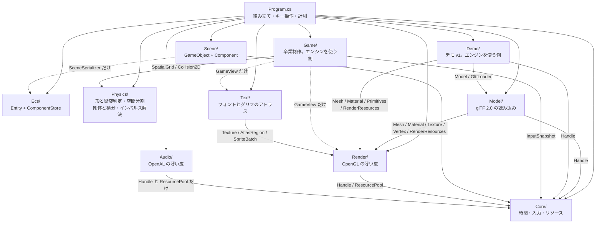
```mermaid
graph TD
    DM["Demo/<br/>デモ v1。エンジンを使う側"]
    G["Game/<br/>卒業制作。エンジンを使う側"]
    P["Program.cs<br/>組み立て・キー操作・計測"]
    S["Scene/<br/>GameObject + Component"]
    E["Ecs/<br/>Entity + ComponentStore"]
    PH["Physics/<br/>形と衝突判定・空間分割<br/>剛体と積分・インパルス解決"]
    T["Text/<br/>フォントとグリフのアトラス"]
    MD["Model/<br/>glTF 2.0 の読み込み"]
    R["Render/<br/>OpenGL の薄い皮"]
    A["Audio/<br/>OpenAL の薄い皮"]
    C["Core/<br/>時間・入力・リソース"]

    P --> DM
    P --> G
    P --> S
    P --> E
    P --> PH
    P --> T
    P --> MD
    P --> R
    P --> A
    P --> C
    MD -->|"Mesh / Material / Texture / Vertex / RenderResources"| R
    MD -->|"Handle"| C
    DM -->|"Mesh / Material / Primitives / RenderResources"| R
    DM -->|"Model / GltfLoader"| MD
    DM -->|"Handle"| C
    G -->|SpatialGrid / Collision2D| PH
    G -->|InputSnapshot| C
    G -.->|GameView だけ| T
    G -.->|GameView だけ| R
    S --> C
    S -.->|SceneSerializer だけ| E
    T -->|Texture / AtlasRegion / SpriteBatch| R
    R -->|Handle / ResourcePool| C
    A -->|Handle と ResourcePool だけ| C
```

**Day 43 でも層は増えていない**。増えたのは `Physics/` の中のクラス8つで、
矢印は1本も足していない——`Physics/` は今日も
**`System.Numerics` しか使わない、どこにも依存しない層**のまま。
物理エンジンは外の世界を知りたがる層なので、
ここが保たれているかは毎日確かめる価値がある(設計書の冒頭)。

**Day 40 でも層は増えていない**。増えたのは `Demo/` の中のクラス2つ
(`CameraPath` と `FeatureToggles`)だけで、矢印は1本も足していない。
`FeatureToggles` に至っては `Render` の型を1つも知らないので、
図の上では `Demo/` の箱の中に完全に収まっている。

**Day 39 で層が1つ増えた**。Phase 6 に入ってから8日間、
足したものは全部 `Render/` の中に収まっていたので、久しぶりの構造の変化になった。

`Demo/` は `Game/` とまったく同じ位置に入る——
**`Program` から呼ばれ、`Render` と `Model` と `Core` を使い、
誰からも知られていない**。「エンジンを使う側」の層が2つ並んだ形。

`Game/` との違いは、下に伸びる矢印の先。

| | 使うもの | 使わないもの |
|---|---|---|
| `Game/` | `Physics` / `Core`(+ `GameView` だけ `Text` と `Render`) | `Render` の 3D、`Model` |
| `Demo/` | `Render`(3D)/ `Model` / `Core` | `Physics` / `Ecs` / `Scene` / `Text` / `Audio` |

**両方とも `Scene/` を使っていない**のが今の姿。
ゲームは構造体の配列で足りていて(Day 29 の判断)、
デモは静止しているので階層が要らない。
`Scene/`(GameObject + Component)が本領を発揮するのは
**キャラクターが歩き回る Day 51** で、そこで初めて
「動くものだけが `Scene/` に載り、背景は `Demo/` のまま」という分業になる。

**Day 37 でもクラスの増減は無い**(`Ssao` は `Render/` の中)。
Phase 6 に入ってから7日間、層は8つのまま変わっていない——
`PostProcess` / `ShadowMap` / `EnvironmentMap` / `Ssao` はどれも
「`Render/` の中で、`GL` と `Framebuffer` と `Shader` しか知らないクラス」として収まった。
Day 25 で層を切り分けた配当が、いちばん機能を足した Phase でそのまま効いている。

**Day 34 でもクラスの増減は無い**(`SurfaceMaps` は `Render/` の中)。
層が増えないまま機能だけが積み上がるのは、
Day 25 で層を切り分けた配当が続いている、と読める。

**Day 33 でクラスの増減は無かった**(`ShadowMap` は `Render/` の中)。

**Day 32 で `Model/` が1つ増えた**。矢印の向きは変わっていない。

`Model/` は `Text/` とまったく同じ位置に入る——
**`Render/` の上に乗り、`Render/` からは知られていない**一方通行。
`Text/` がグリフを `Texture` に焼いて `SpriteBatch` に積むように、
`Model/` は glTF を `Mesh` と `Material` に変換する。
どちらも「素材の形式を、描画の言葉に翻訳する層」で、性格が揃っている。

**逆向き(`Render` が glTF を知っている)にしなかった**のが要点。
そうすると `Mesh` が「glTF から作られたか、コードで作られたか」を抱え込むことになり、
Day 41 で FBX を足したくなったときに `Render/` を触る羽目になる。
`Primitives`(コードで作る)と `GltfLoader`(ファイルから作る)が
**同じ `Mesh` を作る2つの入口**として並んでいるのが、今の形。

**Day 31 で矢印を1本直した**。層は Day 29 のままだが、
`Core` ⇔ `Render` の相互参照が `Render` → `Core` の一方通行になった——
`ResourceManager` を `Render/RenderResources` へ引っ越したのがそれ(下の「相互参照だった話」)。

`Core/` の中身を実際に調べると、`Silk.NET.OpenGL` を using しているファイルは1つも無い。
**いま `Core/` は本当に時間・入力・ハンドルだけの層**になっている。

後処理は `Render/` の中で閉じている。`PostProcess` が知っているのは
`GL` と `Framebuffer` と `Shader` と `RenderResources` だけで、
**シーンに何が入っているかを一切知らない**。だから
`Program` が「今日はゲームを描く」「今日はデモを描く」と切り替えても、
後処理側は1行も変わらない。

**Day 33 の `ShadowMap` は、この方針をそのまま踏襲している**。
持っているのは深度バッファと光源行列だけで、
「何を影として落とすか」は `Begin` と `End` の間で外から描いてもらう。

```csharp
_shadow.Begin(_lightDirection, _orbit.Target);
// ここで好きなものを _shadow.Draw(mesh, model) する
_shadow.End(width, height);
```

`PostProcess.Begin` / `End` と同じ形にしてあるので、
**「シーンを知らないパス」の作り方が2例そろった**ことになる。
2例あると形が見えてくるのがよいところで、
Day 37 の SSAO も Day 52 の G-Buffer も、この形で足せる。

**Day 37 の `Ssao` が、その予告どおりに入った**。

```csharp
_ssao.BeginGeometry(_camera);
// ここで好きなものを _ssao.Draw(mesh, model) する
_ssao.EndGeometry();
_ssao.Compute(_camera, width, height);
```

`ShadowMap` との違いは、`Begin` に渡すのが**光の向きではなくカメラ**であることと、
描き終えたあとに `Compute`(フルスクリーンのパス2枚)が続くこと。
形が同じなので、`Program` 側は影パスの真下にもう1本並べるだけで済んだ。

**これが Render To Texture のいちばんの配当**で、
画面全体に効く処理(影・SSAO・被写界深度・ディファード)は
今後すべてこの位置に差し込むことになる。

**`Game` から `Audio` への線が無い**のが Day 29 から見てほしいところ。
音は鳴るが、鳴らしているのは `Program` で、ゲームは
「弾を撃った」「敵が死んだ」を <c>OnEvent</c> で外へ投げるだけ。

```csharp
public Action<GameEvent, Vector2>? OnEvent { get; set; }
```

こうしておくと、**自己チェックで 600 秒ぶんを無音で回せる**。
`SurvivorGame` が直接 `_audio.Play` を呼んでいたら、
テストのたびにデバイスを開くことになり、
音の出ない環境ではそもそも動かせない。

同じ理由で `SurvivorGame` は `GameView` も知らない。
**状態を進めるものと、状態を見るもの**が分かれている(Day 19 の線)。

| 層 | 依存先 | 備考 |
|---|---|---|
| `Physics/` | **なし** | `System.Numerics` だけ。そのまま別プロジェクトへ持ち出せる。**Day 43 で剛体が入っても変わらず** |
| `Ecs/` | **なし** | 同上。Day 23 で「他に依存しないので先に5つ書ける」と書いたとおり |
| `Scene/` | `Core`(`InputSnapshot`)、`Ecs`(`SceneSerializer` のみ) | **描画を一切知らない**。`SpriteRenderer` は絵の種類と大きさを持つデータでしかない |
| `Render/` | `Core`(`Handle` / `ResourcePool`) | `RenderResources` が箱を借りる。**GL を触るのは全部この層** |
| `Text/` | `Render`(`Texture` / `AtlasRegion` / `SpriteBatch`) | **一方通行**。`Render` は `Text` を知らない |
| **`Model/`** | `Render`(`Mesh` / `Material` / `Texture` / `Vertex` / `RenderResources`)、`Core`(`Handle`) | **一方通行**。`Render` は glTF を知らない |
| `Audio/` | `Core`(`Handle` / `ResourcePool` **のみ**) | **一方通行**。`Core` は `Audio` を知らない |
| **`Game/`** | `Physics` / `Core`(入力)。描画側だけ `Render` と `Text` | **エンジンは `Game` を知らない**。窓も GL も音も知らない |
| `Core/` | **なし** | Day 31 の引っ越しで一方通行になった(下の「相互参照だった話」) |
| `Program.cs` | 全部 | 組み立て役。9500行あるが、その大半はデモ・計測・自己チェック |

`Game/` の中でも線が引いてある。

| ファイル | 知っていること | 知らないこと |
|---|---|---|
| `GameBalance` | プレイヤー・敵・湧き・経験値の数字 | 全部 |
| `Weapons` | 武器の成長カーブ(レベル → 性能) | ゲームの状態 |
| `UpgradeOption` | 選択肢の中身と、見せる文字 | 適用の仕方 |
| `SurvivorGame` | 形と当たり判定、空間分割、入力、成長 | 描画、音、窓、GL |
| `GameView` | スプライトの積み方、文字の出し方 | ゲームを進める方法(読むだけ) |

**`GameView` が状態を1文字も書き換えない**のは意図的で、
だから描画を丸ごと止めてもゲームは同じように進む。
自己チェックが窓を出さずに回せるのはこの性質のおかげ。

**`Text/` だけが他の層の上に乗っている**。
`Physics/` も `Audio/` も自分で完結していて、単体で別プロジェクトへ持ち出せるが、
`Text/` は `Render/` が無いと成立しない——グリフを置く先が `Texture` で、
積む先が `SpriteBatch` だから。

これは歪みではなく**素直な積み方**で、`Text` → `Render` の一方通行になっている。
逆向き(`SpriteBatch` が文字を知っている)にすると、
描画の中核が「文字とは何か」を抱え込むことになる。
`SpriteBatch` から見れば、文字は**ただの四角**でしかない。

**`Core` と `Render` が相互参照だった話**(Day 25 で見つけ、Day 31 で直した)。

`ResourceManager`(Core)が `Texture`(Render)を作り、
`Material`(Render)が `ResourceManager`(Core)を呼ぶ、という往復になっていた。
名前空間が `HonyaEngine` 1つなので動きはするが、
**アセンブリを分けようとした瞬間に破綻する**形だった。

直し方は Day 25 の設計書に書いたとおりで、
**`ResourcePool` と `Handle` だけを下層に残し、窓口は `Render/` へ上げる**。
Day 31 でそれを実行し、`Core/ResourceManager.cs` は `Render/RenderResources.cs` になった。
名前も変えたのは、中で持っているのが `Texture` と `Shader` だけ——
つまり全部 GL のもので、「全リソースの窓口」という名前が中身と合っていなかったため。

**Day 27 の判断**: 音を足すとき、この歪みを繰り返さないようにした。

音のリソースも「パスをキーにして使い回し、ハンドルで配る」という点でテクスチャと同じなので、
当時の `ResourceManager` に `LoadAudio` を足すのが自然に見える。
だがそうすると `ResourceManager`(= 当時は `Core`)が **GL と OpenAL の両方を握る**ことになり、
当時の相互参照が「`Core` ⇔ `Render` + `Core` ⇔ `Audio`」に増える。

そこで `AudioSystem` は、`Core` から**総称型の `ResourcePool<T>` と `Handle<T>` だけを借りて**、
音のリソースは自分で持つ形にした。`ResourcePool<T>` は `T` が何かを知らないので、
借りても依存が増えない。結果、`Audio/` → `Core/` の**一方通行**が保たれている。

図に描いておくと、こういう判断が「なんとなく」ではなくできるようになる。
**設計書は、次に何かを足すときのために書いている**。

### Core — 時間・入力・リソース

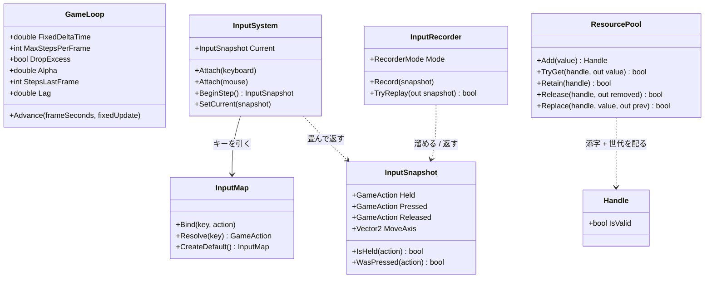
```mermaid
classDiagram
    class GameLoop {
        +double FixedDeltaTime
        +int MaxStepsPerFrame
        +bool DropExcess
        +double Alpha
        +int StepsLastFrame
        +double Lag
        +Advance(frameSeconds, fixedUpdate)
    }
    class InputSystem {
        +InputSnapshot Current
        +Attach(keyboard)
        +Attach(mouse)
        +BeginStep() InputSnapshot
        +SetCurrent(snapshot)
    }
    class InputMap {
        +Bind(key, action)
        +Resolve(key) GameAction
        +CreateDefault() InputMap
    }
    class InputSnapshot {
        +GameAction Held
        +GameAction Pressed
        +GameAction Released
        +Vector2 MoveAxis
        +IsHeld(action) bool
        +WasPressed(action) bool
    }
    class InputRecorder {
        +RecorderMode Mode
        +Record(snapshot)
        +TryReplay(out snapshot) bool
    }
    class Handle {
        +bool IsValid
    }
    class ResourcePool {
        +Add(value) Handle
        +TryGet(handle, out value) bool
        +Retain(handle) bool
        +Release(handle, out removed) bool
        +Replace(handle, value, out prev) bool
    }

    InputSystem --> InputMap : キーを引く
    InputSystem ..> InputSnapshot : 畳んで返す
    InputRecorder ..> InputSnapshot : 溜める / 返す
    ResourcePool ..> Handle : 添字 + 世代を配る
```

**`ResourceManager` がこの図から消えた**(Day 31 で `Render/RenderResources` へ引っ越した)。
実物は `Render` のクラス図のほうに載せてある。

`ResourcePool` と `Handle` は総称型(`ResourcePool<T>` / `Handle<T>`)。
`T` が何かを知らないまま添字と世代だけを管理するので、`Texture` にも `Shader` にも同じものが使える。
**`T` を知らないから下層に残せた**——引っ越しでこの2つだけ `Core/` に残したのはそのため。

この層で押さえるべき責務の線引き:

- **`GameLoop` は時間しか知らない**。何を更新するかは `Action<float>` で渡される
- **`InputSystem` はデバイスのイベントを畳むだけ**。ゲームとしての意味づけは `InputMap` が持つ
- **`InputSnapshot` は値**。だから記録・再生で丸ごと差し替えられる(Day 20 の肝)
- **`Core/` は GL を1行も知らない**。`Silk.NET.OpenGL` を using しているファイルが無い、が実際の姿

### Render — OpenGL の薄い皮(Day 45 で `Primitives` に円柱が増えた)

**カプセルのメッシュは作っていない**。カプセルは半径と半分の高さで形が変わるので、
1本のメッシュを拡大して描くことができない(Y だけ引き伸ばすと半球が楕円に潰れる)。
代わりに**球2つ + 円柱1本**に分けて描く——
円柱は「XZ に半径、Y に高さ」という非一様な拡大でも円柱のままなので、
これなら<b>どんな寸法のカプセルでもメッシュ2本で描ける</b>(要点6)。

面白いのは、**この分け方が判定とぴったり同じ**であること。
`Collision3D` がカプセルの判定を球に落として解いているのと、
`Primitives` が円柱と球でカプセルを組み立てているのは、
同じ「線分 + 半径」の言い換えになっている。


```mermaid
classDiagram
    class Camera {
        +Vector3 Position
        +Vector3 Target
        +ProjectionMode Mode
        +float FieldOfView
        +float AspectRatio
        +Matrix4x4 ViewProjection
        +CreateScreen(width, height) Matrix4x4
    }
    class OrbitCameraController {
        +float Yaw
        +float Pitch
        +float Distance
        +Vector3 Target
        +Apply()
        +EyePosition(target, distance, yaw, pitch) Vector3$
    }
    class Shader {
        +Use()
        +SetInt(name, value)
        +SetVector3(name, value)
        +SetVector3Array(name, values)
        +SetVector4(name, value)
        +SetMatrix3(name, value)
        +SetMatrix4(name, value)
        +SetMatrix4Array(name, values)
        +TryReload() bool
    }
    class Texture {
        +uint Handle
        +int Width
        +int Height
        +bool HasMipmaps
        +FromFile(gl, path) Texture
        +DecodeFile(path) DecodedImage
        +FromPixels(gl, pixels, w, h, mipmaps, srgb) Texture
        +FromFloatPixels(gl, data, w, h, components) Texture
        +DecodeBytes(encoded) DecodedImage
        +CreateR8(gl, w, h) Texture
        +CreateTarget(gl, w, h, format) Texture
        +CreateDepthTarget(gl, w, h) Texture
        +UploadR8(x, y, w, h, coverage)
        +SetFilter(filter)
        +SetWrap(wrap)
        +Bind(unit)
    }
    class TextureWrap {
        <<enumeration>>
        Repeat
        ClampToEdge
        ClampToBorder
    }
    class RenderResources {
        +int MaxUploadsPerFrame
        +int PendingCount
        +Texture Placeholder
        +LoadTexture(path, mipmaps, srgb) Handle
        +LoadTextureFromMemory(key, bytes, mipmaps, srgb) Handle
        +LoadTextureFromPixels(key, rgba, w, h, mipmaps, srgb) Handle
        +LoadTextureAsync(path) Handle
        +LoadShader(vert, frag) Handle
        +Update()
        +GetTexture(handle) Texture
        +GetShader(handle) Shader
        +Retain(handle) bool
        +Release(handle) bool
    }
    class RenderTargetFormat {
        <<enumeration>>
        Rgba8
        Rgba16F
        R8
    }
    class Framebuffer {
        +Texture Color
        +Texture Depth
        +int Width
        +int Height
        +RenderTargetFormat Format
        +long ByteSize
        +CreateDepthOnly(gl, w, h) Framebuffer
        +Bind()
        +BindDefault(gl, w, h)
        +Resize(w, h)
        +SetFormat(format)
    }
    class ShadowMap {
        +bool Enabled
        +int Resolution
        +Framebuffer Target
        +Matrix4x4 LightSpaceMatrix
        +int PcfRadius
        +int TapCount
        +float DepthBias
        +bool SlopeBias
        +bool CullFrontFaces
        +float Radius
        +float WorldPerTexel
        +bool ShowMap
        +int DrawCalls
        +long ByteSize
        +Begin(lightDirection, center)
        +Draw(mesh, model, joints)
        +End(screenWidth, screenHeight)
        +Apply(shader, unit)
        +DrawDebug(screenWidth, screenHeight)
        +SetResolution(resolution)
    }
    class PostProcess {
        +RenderTargetFormat SceneFormat
        +bool BloomEnabled
        +ToneMapOperator ToneMap
        +PostDebugView DebugView
        +float Exposure
        +float BloomThreshold
        +float BloomIntensity
        +ColorGrade Grade
        +bool FxaaEnabled
        +FxaaQuality Quality
        +FxaaDebugView FxaaDebugView
        +float FxaaEdgeThreshold
        +float FxaaEdgeThresholdMin
        +float FxaaSpanMax
        +PostSplit Split
        +float SplitPosition
        +Framebuffer Scene
        +Framebuffer Ldr
        +int PassCount
        +long ByteSize
        +Begin(clearColor)
        +End(screenWidth, screenHeight)
        +EndToTarget(target)
        +SetFxaaQuality(quality)
        +Resize(w, h)
        +ReloadShaders()
    }
    class ColorGrade {
        +bool Enabled
        +float Temperature
        +float Tint
        +float Contrast
        +float Saturation
        +Vector3 Filter
        +GradePreset Preset
        +bool IsIdentity
        +Vector3 WhiteBalance
        +ApplyPreset(preset)
        +MarkCustom()
        +Apply(shader)
    }
    class GradePreset {
        <<enumeration>>
        Neutral
        Sunset
        Moonlight
        Bleach
        Monochrome
    }
    class FxaaQuality {
        <<enumeration>>
        Low
        Medium
        High
        Extreme
    }
    class FxaaDebugView {
        <<enumeration>>
        None
        Luma
        Edge
        Blend
    }
    class PostSplit {
        <<enumeration>>
        None
        Grade
        Fxaa
    }
    class ToneMapOperator {
        <<enumeration>>
        None
        Reinhard
        Aces
    }
    class PostDebugView {
        <<enumeration>>
        Final
        SceneOnly
        Bright
        Bloom
    }
    class TextureAtlas {
        +Texture Texture
        +FromFiles(gl, paths, padding) TextureAtlas
    }
    class AtlasRegion {
        +Texture Texture
        +Vector2 UvMin
        +Vector2 UvMax
    }
    class Material {
        +string Name
        +Handle Shader
        +Handle MainTexture
        +Vector4 Tint
        +Vector2 UvScale
        +Vector4 BaseColorFactor
        +float MetallicFactor
        +float RoughnessFactor
        +Handle MetallicRoughnessTexture
        +Handle NormalTexture
        +Handle OcclusionTexture
        +Handle EmissiveTexture
        +Vector3 EmissiveFactor
        +float NormalScale
        +Handle HeightTexture
        +float ParallaxScale
        +bool DoubleSided
        +string AlphaMode
        +Apply(resources)
    }
    class Mesh {
        +int VertexCount
        +int IndexCount
        +Draw()
        +ReadVertices() TVertex[]
        +ReadIndices() uint[]
        +Dispose()
    }
    class Vertex {
        +Vector3 Position
        +Vector2 TexCoord
        +Vector4 Color
        +Vector3 Normal
        +Vector4 Tangent
        +Vector4 Joints
        +Vector4 Weights
        +Attributes
    }
    class SurfaceMaps {
        <<static>>
        +int Size
        +float MortarWidth
        +CreateHeight() byte[]
        +CreateNormal(strength) byte[]
        +CreateBaseColor() byte[]
        -HeightAt(x, y) float
        -Noise(x, y, cells) float
        -Wrap(value, period) int
    }
    class SpriteVertex {
        +Vector2 Position
        +Vector2 TexCoord
        +uint Color
        +PackColor(color) uint
    }
    class VertexAttribute {
        +int ComponentCount
        +bool Normalized
        +int ByteSize
    }
    class SpriteBatch {
        +SpriteSortMode SortMode
        +int DrawCallCount
        +Begin(projection, sortMode)
        +Draw(texture, center, size, rotation, color, layer)
        +End()
    }
    class Primitives {
        +CreateQuad(gl) Mesh
        +CreateCube(gl) Mesh
        +CreateSphere(gl, slices, stacks) Mesh
        +CreateCylinder(gl, slices) Mesh
    }
    class Pbr {
        <<static>>
        +float DielectricF0
        +float MinRoughness
        +Alpha(roughness, perceptual) float
        +DistributionGgx(nDotH, alpha) float
        +DirectK(roughness) float
        +GeometrySchlickGgx(nDotX, k) float
        +GeometrySmith(nDotV, nDotL, roughness) float
        +FresnelSchlick(cosTheta, f0) Vector3
        +F0Of(baseColor, metallic, dielectricF0) Vector3
        +Evaluate(n, v, l, baseColor, metallic, roughness) Vector3
        +IntegrateNdf(alpha, steps) double
        +Hammersley(i, count) Vector2
        +ImportanceSampleGgx(xi, n, alpha) Vector3
        +DirectionalAlbedo(n, v, baseColor, metallic, roughness) Vector3
        +IblK(roughness) float
        +GeometrySmithIbl(nDotV, nDotL, roughness) float
        +FresnelSchlickRoughness(cosTheta, f0, roughness) Vector3
        +IntegrateBrdf(nDotV, roughness, samples) Vector2
    }
    class CubeMap {
        +uint Handle
        +int Size
        +int MipLevels
        +long ByteSize
        +Create(gl, size, mipLevels) CubeMap
        +FullMipCount(size) int
        +EnableSeamless(gl)
        +FaceViews(eye) Matrix4x4[]
        +FaceProjection() Matrix4x4
        +Bind(unit)
        +GenerateMipmaps()
        +ReadFace(face, mip) float[]
    }
    class SkyImage {
        <<static>>
        +int Width
        +int Height
        +Create(sunDirection) float[]
        +Sample(direction, toSun) Vector3
        +IntegrateIrradiance(n, toSun, steps) Vector3
    }
    class HdrImage {
        <<static>>
        +Load(path) Result
        -ReadScanline(bytes, cursor, scanline, width, path)
        -ReadFlatScanline(bytes, cursor, scanline, width, path)
        -ReadLine(bytes, cursor) string
    }
    class HdrResult {
        <<record struct>>
        +float[] Pixels
        +int Width
        +int Height
        +float Exposure
    }
    class SkyAnalysis {
        <<static>>
        +DirectionAt(x, y, width, height) Vector3
        +Analyze(pixels, width, height, threshold) Result
        +RemoveSun(pixels, width, height, analysis) float[]
        -AngleTo(x, y, width, height, direction) float
    }
    class Sun {
        <<record struct>>
        +Vector3 Direction
        +Vector3 Irradiance
        +float SolidAngle
        +float AngularRadius
        +int PixelCount
        +float PeakLuminance
    }
    class SkyResult {
        <<record struct>>
        +Sun Sun
        +Vector3 TotalIrradiance
        +Vector3 SkyAverage
        +float SunShare
        +double SolidAngleSum
        +float Cutoff
        +int HalfFloatOverflow
    }
    class Screenshot {
        <<static>>
        +Save(gl, width, height, directory) string
        -WritePng(path, bottomUpRgb, width, height)
        -WriteChunk(stream, type, data)
        -Crc32(crc, data) uint
    }
    class EnvironmentMap {
        +int EnvironmentSize
        +int IrradianceSize
        +int PrefilterSize
        +int PrefilterMipCount
        +int BrdfLutSize
        +CubeMap Environment
        +CubeMap Irradiance
        +CubeMap Prefiltered
        +Texture BrdfLut
        +bool Enabled
        +bool SkyboxVisible
        +float Intensity
        +int SkyboxMip
        +bool UsePrefilter
        +bool ClampSkyToLdr
        +float SkyYaw
        +string SourceLabel
        +int SourceWidth
        +int SourceHeight
        +double BakeMilliseconds
        +long ByteSize
        +Bake(sunDirection, screenWidth, screenHeight)
        +BakeFromPixels(pixels, width, height, screenW, screenH, label)
        +Apply(shader)
        +DrawSkybox(camera, restoreDepthTest, restoreCulling)
    }

    class Ssao {
        +int MaxSamples
        +int NoiseSize
        +bool Enabled
        +float Radius
        +float Bias
        +float Strength
        +float Power
        +int SampleCount
        +bool BlurEnabled
        +bool HalfResolution
        +bool ApplyToDirectLight
        +SsaoDebugView DebugView
        +Framebuffer Geometry
        +Framebuffer Result
        +long ByteSize
        +BeginGeometry(camera)
        +Draw(mesh, model, joints)
        +EndGeometry()
        +Compute(camera, w, h)
        +Apply(shader, unit)
        +DrawDebug(w, h, depthRange)
        +Resize(w, h)
        +SetHalfResolution(half)
    }
    class SsaoDebugView {
        <<enumeration>>
        None
        Occlusion
        Normal
        Depth
    }

    OrbitCameraController --> Camera : 球面座標で位置を書く
    Material ..> Shader : ハンドル経由
    Material ..> Texture : ハンドル経由
    Mesh ..> VertexAttribute : ストライドとオフセットを組む
    Vertex ..> VertexAttribute
    SpriteVertex ..> VertexAttribute
    Mesh ..> Vertex : 型引数
    Primitives ..> Mesh : 作る
    TextureAtlas *-- AtlasRegion
    TextureAtlas *-- Texture : 1枚に詰める
    SpriteBatch --> Shader
    SpriteBatch ..> SpriteVertex : 積む
    SpriteBatch ..> AtlasRegion : UV を受け取る
    Framebuffer *-- Texture : 描き込み先として所有
    Framebuffer ..> RenderTargetFormat
    Texture ..> TextureWrap
    PostProcess *-- Framebuffer : 5枚(シーン / 明部 / ぼかし2 / LDR)
    PostProcess *-- ColorGrade : つまみを所有
    PostProcess ..> Shader : 明部 / ぼかし / 合成 / FXAA
    PostProcess ..> ToneMapOperator
    PostProcess ..> PostDebugView
    PostProcess ..> FxaaQuality
    PostProcess ..> FxaaDebugView
    PostProcess ..> PostSplit
    PostProcess ..> RenderResources : シェーダを借りる
    ColorGrade ..> GradePreset
    ColorGrade ..> Shader : uniform を送る
    ShadowMap *-- Framebuffer : 深度専用を1枚
    ShadowMap ..> RenderResources : シェーダを借りる
    ShadowMap ..> Camera : 正射影行列を借りる
    ShadowMap ..> Shader : 深度 / 表示
    RenderResources ..> Texture : 作る / 配る
    RenderResources ..> Shader : 作る / 配る
    SurfaceMaps ..> RenderResources : 焼いたバイト列を預ける
    EnvironmentMap *-- CubeMap : 環境 / 放射照度 / 事前フィルタ の3枚
    EnvironmentMap *-- Texture : 元の正距円筒 と BRDF の表
    EnvironmentMap ..> RenderResources : シェーダを借りる
    EnvironmentMap ..> SkyImage : 空を焼いてもらう
    HdrImage ..> HdrResult : 返す
    SkyAnalysis ..> SkyResult : 返す
    SkyResult *-- Sun
    EnvironmentMap ..> Camera : 空を描くときのビュー射影
    EnvironmentMap ..> Primitives : 焼く用の立方体
    Ssao *-- Framebuffer : 幾何 1枚 + 遮蔽 2枚
    Ssao *-- Texture : 4x4 のノイズ
    Ssao ..> RenderResources : シェーダを借りる
    Ssao ..> Camera : ビュー行列と射影行列を読む
    Ssao ..> Shader : 幾何 / 遮蔽 / ぼかし / 表示
    Ssao ..> SsaoDebugView
    Ssao ..> RenderTargetFormat : R8 と Rgba16F
```

**`Ssao` の矢印は `ShadowMap` とほぼ同じ形**をしている。
違いは `Framebuffer` を3枚持つことと、`Texture` を自分で1枚作ること
(ノイズ。`RenderResources` に預けないのは、ファイルから来たものではないうえ、
このクラス以外が使うことが無いため)。

**`EnvironmentMap` だけが生の FBO を持っている**(Day 36 の歪み)のに対し、
`Ssao` は `Framebuffer` で足りている。キューブマップの面を挿す必要が無く、
ふつうの 2D テクスチャに描くだけだから。

**Day 39 で足した3つには矢印がほとんど無い**。これは図が手抜きなのではなく、
`HdrImage` と `SkyAnalysis` が**この層の他の誰も知らない**ため。
入口は `float[]`、出口も `float[]` か構造体だけで、
`GL` にも `Shader` にも `Texture` にも触らない。
`Screenshot` だけが `GL` を1回呼ぶ(`glReadPixels`)。

つないでいるのは `Program` で、

```csharp
HdrImage.Result image = HdrImage.Load(path);              // 読む
_skyAnalysis = SkyAnalysis.Analyze(image.Pixels, w, h);   // 測る
float[] pixels = SkyAnalysis.RemoveSun(image.Pixels, ...); // 抜く
_env.BakeFromPixels(pixels, w, h, ...);                    // 焼く
```

の4行だけ。**この並べ替えは `Program` の仕事**という線を引いてある。
`EnvironmentMap` が `.hdr` のパスを受け取る形にもできるが、
そうすると「太陽を抜くかどうか」「空を何度回すか」まで
環境マップが決めることになり、Day 36 で守った
「このクラスはシーンを知らない」が崩れる。

**`SkyAnalysis.DirectionAt` と `SkyImage.Create` は同じ式でなければならない**
(正距円筒 → 方向の変換)。コード上の依存は無いので、
図には線が引けない代わりに両方のコメントに相手を書いてある。
片方だけ直すと、手で焼いた空と読み込んだ HDRI で**太陽が別の場所に出る**——
しかも方位のずれは絵から気づけない。

**`Pbr` はどこからも矢印が出ていない**。これは描き忘れではなく、
**依存が1本も無い**ことをそのまま表している——
`GL` も `Handle` も `Material` も知らず、入力は `Vector3` と `float` だけ。

呼ぶのは `Program.RunPbrCheck` だけで、**本番の描画からは1度も呼ばれない**。
同じ式が `textured.frag` にあり、そちらが毎フレーム数百万回走る。

「同じものを2か所に書く」のは普段なら避けるべきだが、今日は取った。

| | GLSL 側(`textured.frag`) | C# 側(`Pbr`) |
|---|---|---|
| 役割 | **本番**。1フレームに数百万回 | **定義と検算**。押したときだけ |
| 確かめられること | 絵になった結果だけ | **半球を 8192 点に刻んだ積分** |
| 直したとき動くもの | 見た目 | 自己チェックの数字 |

GPU の中は覗けないので、「D の積分が 1 か」「入ってきた以上の光を返していないか」を
確かめる場所が CPU 側に要る。式が数行で、しかも**この先動かない**(物理の定義)ので、
二重管理の代償より検算できる価値のほうが大きいと判断した。

**片方だけ直す**のがいちばん怖い壊し方なので、自己チェックの最後で
`textured.frag` を実際に読んで、共有している定数(`MIN_ROUGHNESS`)と
`α = roughness²` の式が両方に入っていることを見ている。
値そのものは突き合わせられないが、**「同じ約束でいるか」は機械で確かめられる**。

**`Pbr` に IBL 用が4つ増えた**(Day 36)。
`GeometrySmithIbl` は `GeometrySmith` と **k だけが違う**——
直接光は `(r+1)²/8`、IBL は `α/2`。同じ幾何減衰なのに係数が2通りあるのは、
Day 35 の要点5 で触れた「理屈と当てはめのつぎはぎ」がそのまま出ているところ。
**取り違えると金属の縁が暗くなりすぎる**が、症状が地味なので気づきにくい。

`IntegrateBrdf` は Day 35 の `DirectionalAlbedo` とほとんど同じ積分で、
違うのは<b>フレネルを2つに割る</b>ことだけ。
Day 35 の計画書で「Day 36 の LUT がまさにそれ」と書いた回収になっている。

**`CubeMap` が抱えているのは「GL の約束」**(Day 36)。
面の並び、上下反転、90 度の画角、シームレス——
どれも**知らないと必ず踏む**が、一度書けば二度と考えたくない類のもの。
1つのクラスに閉じ込めておくと、
読む側(空・本描画・事前フィルタ)が素直に書ける。

**`SkyImage` は `SurfaceMaps`(Day 34)と同じ形**をしている。
GL を1行も知らず、返すのはただの配列で、テクスチャにするのは呼ぶ側の仕事。
違いは `byte[]` ではなく `float[]` なこと——**1.0 を超える値を運ぶ**ため。

そしてもう1つ、`SurfaceMaps` に無かったものを持っている:
<b>同じ関数を積分する CPU 版</b>(`IntegrateIrradiance`)。
GPU が焼いた放射照度が正しいかは絵からは判定できないので、
**答えを2通りの方法で出して突き合わせる**ために置いてある。
Day 35 で `Pbr` を CPU にも持った判断の、そのまま2例目になる。

**`Primitives` に球が入った**のは、材質を見比べる形が球しかないため。
立方体は面ごとに法線が一定なので、1つの面の中でハイライトが動かない——
粗さを変えても広がりが見えず、金属度の効きも読み取れない。
球は**法線があらゆる向きを1個の中で通る**ので、
フレネル(縁ほど明るい)も粗さ(ハイライトの広がり)も1個に全部出る。

そして球は、**接線を手で決められない最初の形**でもある。
板と立方体は「左下 → 右下 が U」と目で追えたが、曲面では
`∂P/∂u` を実際に計算するしかない。その結果 **`w` が -1 になる**——
Day 34 で入れた「符号1個を持つ」仕組みが、ここではじめて -1 の側で使われる。

**Day 28 で `Texture` に足したのは2つだけ**。
`CreateR8` が1チャンネルの空テクスチャを作り、`UploadR8` がその一部を書き換える。
どちらもグリフのために足したものだが、**`Texture` はグリフを知らない**——
「1チャンネル」「一部だけ更新」という一般の機能として置いてある。
同じものが Phase 6 のシャドウマップ(Day 33)でも要る。

**Day 32 で `Vertex` に法線が戻った**。Day 9 でソフトウェアラスタライザに持たせ、
Day 14 で GPU へ移したときに落としていたもの。陰影を付けていなかったので要らなかったが、
glTF のモデルは必ず持っているので、**無いと読んだデータの一部を捨てることになる**。

**末尾に足した**ので location は 0〜2 が動かず、既存のシェーダは無傷で済んだ。
位置の次に置くほうが意味の並びとしては素直だが、
そのために `sprite.vert` まで書き換える理由は無い。

**Day 34 で接線が同じやり方で足された**(location 4)。
2回続けて末尾に足せたので、この置き方は当たりだったと言える。
1頂点 64 バイトになり、DamagedHelmet で 930KB。

**`Vector4` なのは glTF の仕様に合わせたから**で、
w には ±1 しか入らない(要点3)。
「3本目の軸を持たずに済ませるための符号1個」がそのままフィールドになっている。

**`depth.vert`(Day 33)は無傷**なのも見どころ。
あちらは location 0 しか宣言していないので、
属性が4本になろうと5本になろうと影響を受けない。
**宣言しない自由**があるから、末尾に足す戦略が効き続けている。

**`SurfaceMaps` が GL を1行も知らない**のが、この層で新しい置き方。
返すのはただの `byte[]` で、テクスチャにするのは `RenderResources` の仕事になる。

```
SurfaceMaps.CreateNormal()  →  byte[]  →  RenderResources.LoadTextureFromPixels()  →  Handle
```

分けてあるので**スレッドを選ばない**(Day 21 の `Texture.DecodeFile` と同じ性質)。
起動時に3枚焼くだけなので今は同期でよいが、
枚数が増えたらそのまま `Task.Run` へ載せられる形になっている。

`Texture.FromPixels` を直接呼ばずに窓口を通すのは、
**寿命の管理とキャッシュを1箇所に残す**ため。
ここを通さずに `new` すると、そのテクスチャだけ `Dispose` の対象から外れる。

**`Mesh.ReadVertices` は「持たない」ほうへ倒した結果**(Day 34)。
自己チェックで頂点の中身を見たいが、CPU 側に控えを持つと
DamagedHelmet だけで 930KB を**使うかどうか分からないのに常に払う**。
GPU から読み返す(`glGetBufferSubData`)なら払うのは呼んだときだけで済む。
代わりに**遅い**(描画キューが空になるまで待つ)ので、検査専用の窓口になっている。

当たり判定やレイキャストで頂点が要り用になる Phase 7 で、
「持つ」へ倒し直すことを考えればよい。

**`Material` が急に太った**のが Day 32 でいちばん目に付く差分で、
これは glTF の材質定義をそのまま写したから。
「シェーダ + そのシェーダに渡す値」という Day 15 からの位置づけは変わっていない——
渡す値の種類が、仕様に合わせて増えただけになる。

**Day 31 で足したのは `CreateTarget` 1つ**。同じ理屈で、
`Texture` は「これがレンダーターゲットである」ことを知らない。
中身を渡さずに場所だけ確保し、ミップマップを作らず、ClampToEdge にする——
それだけの機能として置いてあるので、
影(Day 33)でも環境マップ(Day 36)でも G-Buffer(Day 52)でも同じものが使える。

**Day 33 で足したのは `CreateDepthTarget` 1つ**。
`CreateTarget` との違いは3つとも影のための必然になっている。

| | `CreateTarget`(Day 31) | `CreateDepthTarget`(Day 33) |
|---|---|---|
| 内部形式 | RGBA8 / RGBA16F | **DepthComponent24** |
| フィルタ | Linear | **Nearest**(深度を平均しても意味が無い。要点6) |
| ラップ | ClampToEdge | **ClampToBorder + 白**(箱の外は「遮るものなし」) |

`Texture` が「これがシャドウマップである」ことを知らないのは同じで、
Day 37 の SSAO が深度を読むときも、そのまま同じものが使える。

**`Framebuffer` が3つ目の形を持った**。
Day 31 の「カラーテクスチャ + 深度レンダーバッファ」に加えて、
**カラーを1枚も持たない**形が入った。
`Depth` プロパティが深度専用のときだけ入るので、
**「読むならテクスチャ、読まないならレンダーバッファ」の区別がそのまま型に出る**。

**`ShadowMap` が `Camera` を借りている**のが、この層で新しい関係。
光の正射影行列は `Camera.CreateOrthographic` がそのまま使える——
「カメラ」という名前だが中身は**投影行列の作り方の置き場**なので、
光の目に使っても筋が通る。Day 14 で `static` メソッドとして切り出しておいた形が効いた。

**`Framebuffer` が `Texture` を所有している**のは、今までの `Render/` に無かった関係。
`Material` は「持たない(ハンドルだけ)」で通してきたが、
フレームバッファのカラーアタッチメントは
**そのフレームバッファと同じ大きさ・同じ形式でなければならない**ので、
外から差し替えられると壊れる。**所有すべきものは所有する**。

**`PostProcess` と `ShadowMap` はシェーダだけ `RenderResources` に預けている**。
バッファ(4枚 / 1枚)は自分で持ち、シェーダは借りる——
シェーダは F5 でリロードしたいので、管理の窓口に載せておく必要がある。

**バッファを所有し、シェーダを借りる**——この分担が2クラスで一致しているのは偶然ではなく、
「大きさや形式に強い制約があるものは所有、共有して使い回すものは借りる」という
Day 21 からの線がそのまま出ている。

**`Material` が何も所有していない**のは Day 15 から一貫している(Day15.md の要点2)。
持っているのはハンドルだけで、実体の寿命は `RenderResources` にある。

**3D の道(`Mesh` + `Material`)と 2D の道(`SpriteBatch`)が並列**なのも見てのとおりで、
両者は `Shader` と `Texture` を共有しているだけで互いを知らない。
`Mesh` は「形が決まっていて毎フレーム変わらないもの」、
`SpriteBatch` は「毎フレーム頂点を作り直すもの」という使い分けになっている。

### Scene — GameObject + Component

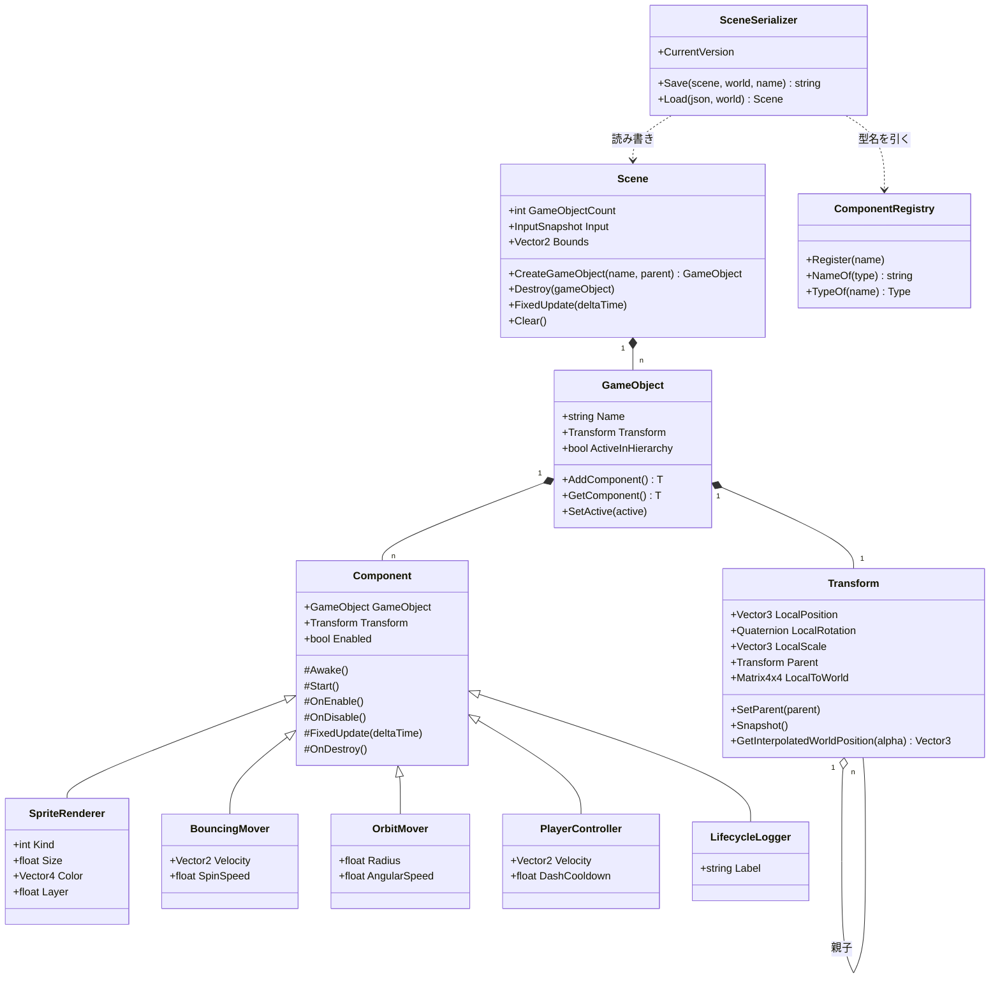
```mermaid
classDiagram
    class Scene {
        +int GameObjectCount
        +InputSnapshot Input
        +Vector2 Bounds
        +CreateGameObject(name, parent) GameObject
        +Destroy(gameObject)
        +FixedUpdate(deltaTime)
        +Clear()
    }
    class GameObject {
        +string Name
        +Transform Transform
        +bool ActiveInHierarchy
        +AddComponent() T
        +GetComponent() T
        +SetActive(active)
    }
    class Transform {
        +Vector3 LocalPosition
        +Quaternion LocalRotation
        +Vector3 LocalScale
        +Transform Parent
        +Matrix4x4 LocalToWorld
        +SetParent(parent)
        +Snapshot()
        +GetInterpolatedWorldPosition(alpha) Vector3
    }
    class Component {
        +GameObject GameObject
        +Transform Transform
        +bool Enabled
        #Awake()
        #Start()
        #OnEnable()
        #OnDisable()
        #FixedUpdate(deltaTime)
        #OnDestroy()
    }
    class SpriteRenderer {
        +int Kind
        +float Size
        +Vector4 Color
        +float Layer
    }
    class BouncingMover {
        +Vector2 Velocity
        +float SpinSpeed
    }
    class OrbitMover {
        +float Radius
        +float AngularSpeed
    }
    class PlayerController {
        +Vector2 Velocity
        +float DashCooldown
    }
    class LifecycleLogger {
        +string Label
    }
    class ComponentRegistry {
        +Register(name)
        +NameOf(type) string
        +TypeOf(name) Type
    }
    class SceneSerializer {
        +CurrentVersion
        +Save(scene, world, name) string
        +Load(json, world) Scene
    }

    Scene "1" *-- "n" GameObject
    GameObject "1" *-- "1" Transform
    GameObject "1" *-- "n" Component
    Transform "1" o-- "n" Transform : 親子
    Component <|-- SpriteRenderer
    Component <|-- BouncingMover
    Component <|-- OrbitMover
    Component <|-- PlayerController
    Component <|-- LifecycleLogger
    SceneSerializer ..> Scene : 読み書き
    SceneSerializer ..> ComponentRegistry : 型名を引く
```

`Transform` だけが `GameObject` の固定メンバーで、ほかは全部 `Component` として付け外しする
(Day 22 の要点2)。`SceneSerializer` が `ComponentRegistry` を経由するのは、
**JSON の文字列から直接 `Type` を作らせない**ため(Day 24 の要点2)。

### Ecs と Physics — どこにも依存しない2つ(今日 `Physics` にカプセルが入った)

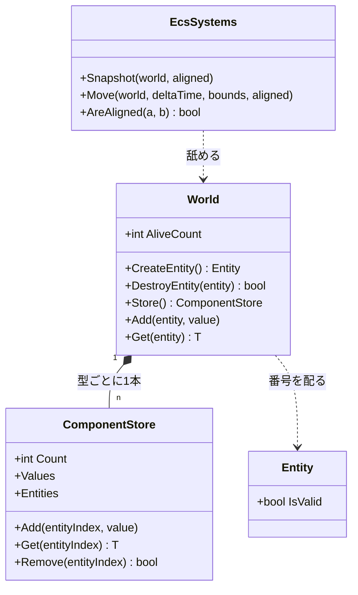
```mermaid
classDiagram
    class Entity {
        +bool IsValid
    }
    class World {
        +int AliveCount
        +CreateEntity() Entity
        +DestroyEntity(entity) bool
        +Store() ComponentStore
        +Add(entity, value)
        +Get(entity) T
    }
    class ComponentStore {
        +int Count
        +Values
        +Entities
        +Add(entityIndex, value)
        +Get(entityIndex) T
        +Remove(entityIndex) bool
    }
    class EcsSystems {
        +Snapshot(world, aligned)
        +Move(world, deltaTime, bounds, aligned)
        +AreAligned(a, b) bool
    }

    World "1" *-- "n" ComponentStore : 型ごとに1本
    World ..> Entity : 番号を配る
    EcsSystems ..> World : 舐める
```

#### 2D の側(Day 26。Day 43 から3日続けて1文字も変わっていない)

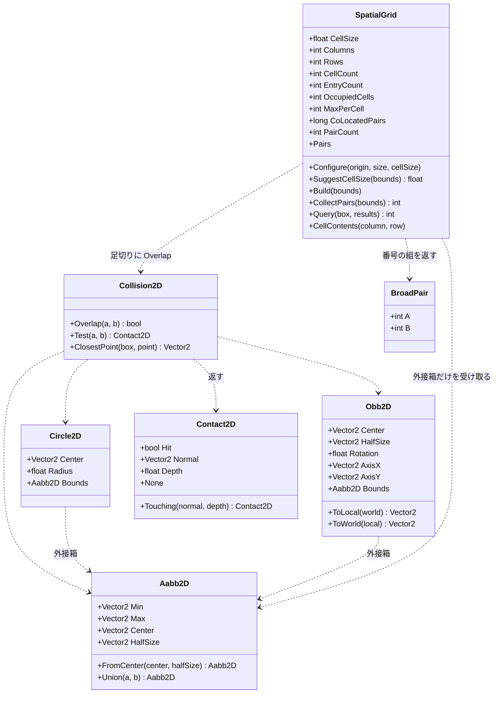
```mermaid
classDiagram
    class Aabb2D {
        +Vector2 Min
        +Vector2 Max
        +Vector2 Center
        +Vector2 HalfSize
        +FromCenter(center, halfSize) Aabb2D
        +Union(a, b) Aabb2D
    }
    class Circle2D {
        +Vector2 Center
        +float Radius
        +Aabb2D Bounds
    }
    class Obb2D {
        +Vector2 Center
        +Vector2 HalfSize
        +float Rotation
        +Vector2 AxisX
        +Vector2 AxisY
        +Aabb2D Bounds
        +ToLocal(world) Vector2
        +ToWorld(local) Vector2
    }
    class Contact2D {
        +bool Hit
        +Vector2 Normal
        +float Depth
        +None
        +Touching(normal, depth) Contact2D
    }
    class Collision2D {
        +Overlap(a, b) bool
        +Test(a, b) Contact2D
        +ClosestPoint(box, point) Vector2
    }
    class BroadPair {
        +int A
        +int B
    }
    class SpatialGrid {
        +float CellSize
        +int Columns
        +int Rows
        +int CellCount
        +int EntryCount
        +int OccupiedCells
        +int MaxPerCell
        +long CoLocatedPairs
        +int PairCount
        +Pairs
        +Configure(origin, size, cellSize)
        +SuggestCellSize(bounds) float
        +Build(bounds)
        +CollectPairs(bounds) int
        +Query(box, results) int
        +CellContents(column, row)
    }

    Collision2D ..> Aabb2D
    Collision2D ..> Circle2D
    Collision2D ..> Obb2D
    Collision2D ..> Contact2D : 返す
    Circle2D ..> Aabb2D : 外接箱
    Obb2D ..> Aabb2D : 外接箱
    SpatialGrid ..> Aabb2D : 外接箱だけを受け取る
    SpatialGrid ..> Collision2D : 足切りに Overlap
    SpatialGrid ..> BroadPair : 番号の組を返す
```

**形は全部 `readonly struct`、判定は `static` メソッドだけ**。状態を持たないので、
どのスレッドから何回呼んでも同じ答えが返る。Day 26 で空間分割を入れたとき、
この性質のおかげで**判定そのものには一切手を入れずに済んだ**——
`Collision2D.cs` と `Shapes2D.cs` の差分は 0 行になっている。

**Day 29 で足したのは `Query` だけ**。
`CollectPairs` が「全部の組」を返すのに対して、
`Query` は「この箱の近くにいるもの」を返す。
1回組んだ格子を、**総当たりの置き換え**としても
**単発の近傍探索**としても使えるようになった——
卒業制作では同じ格子を1ステップに4通りで使っている。

`SpatialGrid` だけが唯一 `class`(参照型)で、しかも状態を持つ。
配列を4本(`_cellStart` / `_cursor` / `_entries` / `_mark`)使い回すためで、
**毎フレーム作り直しても割り当てが起きない**ようにするにはこうするしかない。
そのぶん「1つのインスタンスを複数スレッドから同時に使えない」という制約が付く。
状態を持つと何が失われるかが、同じフォルダの中で見比べられる形になっている。

矢印の向きにも注目してほしい。**`SpatialGrid` から `Body` への線が無い**。
受け取るのは `ReadOnlySpan<Aabb2D>`、返すのは番号の組だけで、
速度も形も質量も知らない。この細さのおかげで、
Day 46 の 3D 版は `Aabb2D` を `Aabb3D` に変えるだけで済む。

#### 3D の側(Day 45a で2つ増え、4つが書き換わった)

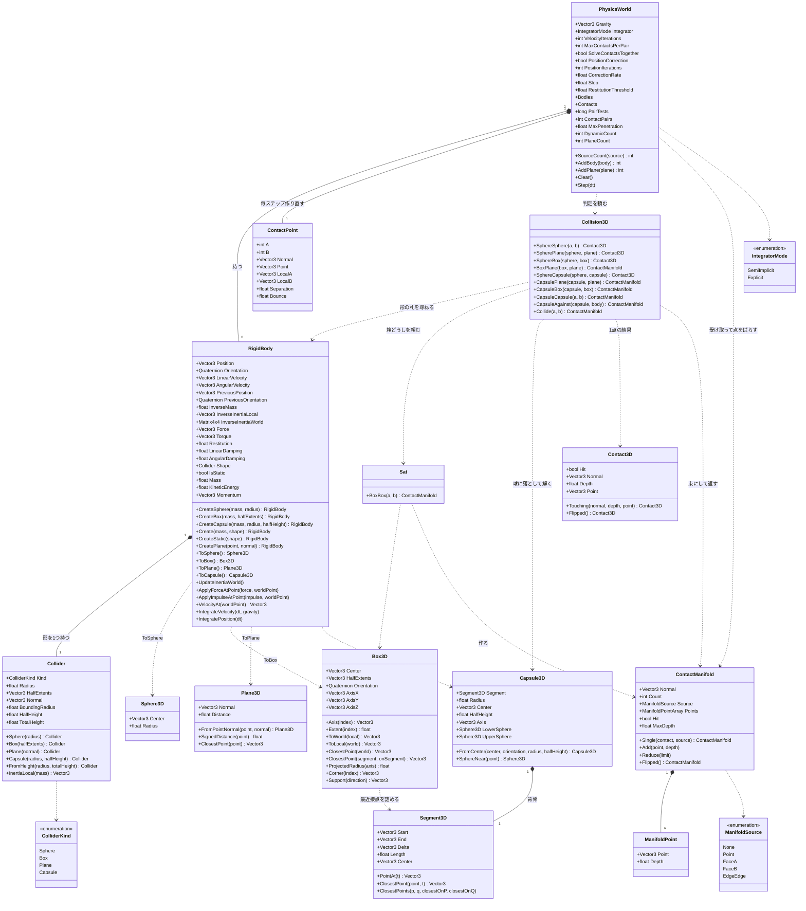
```mermaid
classDiagram
    class Sphere3D {
        +Vector3 Center
        +float Radius
    }
    class Plane3D {
        +Vector3 Normal
        +float Distance
        +FromPointNormal(point, normal) Plane3D
        +SignedDistance(point) float
        +ClosestPoint(point) Vector3
    }
    class Box3D {
        +Vector3 Center
        +Vector3 HalfExtents
        +Quaternion Orientation
        +Vector3 AxisX
        +Vector3 AxisY
        +Vector3 AxisZ
        +Axis(index) Vector3
        +Extent(index) float
        +ToWorld(local) Vector3
        +ToLocal(world) Vector3
        +ClosestPoint(world) Vector3
        +ClosestPoint(segment, onSegment) Vector3
        +ProjectedRadius(axis) float
        +Corner(index) Vector3
        +Support(direction) Vector3
    }
    class Segment3D {
        +Vector3 Start
        +Vector3 End
        +Vector3 Delta
        +float Length
        +Vector3 Center
        +PointAt(t) Vector3
        +ClosestPoint(point, t) Vector3
        +ClosestPoints(p, q, closestOnP, closestOnQ)
    }
    class Capsule3D {
        +Segment3D Segment
        +float Radius
        +Vector3 Center
        +float HalfHeight
        +Vector3 Axis
        +Sphere3D LowerSphere
        +Sphere3D UpperSphere
        +FromCenter(center, orientation, radius, halfHeight) Capsule3D
        +SphereNear(point) Sphere3D
    }
    class ColliderKind {
        <<enumeration>>
        Sphere
        Box
        Plane
        Capsule
    }
    class Collider {
        +ColliderKind Kind
        +float Radius
        +Vector3 HalfExtents
        +Vector3 Normal
        +float BoundingRadius
        +float HalfHeight
        +float TotalHeight
        +Sphere(radius) Collider
        +Box(halfExtents) Collider
        +Plane(normal) Collider
        +Capsule(radius, halfHeight) Collider
        +FromHeight(radius, totalHeight) Collider
        +InertiaLocal(mass) Vector3
    }
    class Contact3D {
        +bool Hit
        +Vector3 Normal
        +float Depth
        +Vector3 Point
        +Touching(normal, depth, point) Contact3D
        +Flipped() Contact3D
    }
    class ManifoldSource {
        <<enumeration>>
        None
        Point
        FaceA
        FaceB
        EdgeEdge
    }
    class ManifoldPoint {
        +Vector3 Point
        +float Depth
    }
    class ContactManifold {
        +Vector3 Normal
        +int Count
        +ManifoldSource Source
        +ManifoldPointArray Points
        +bool Hit
        +float MaxDepth
        +Single(contact, source) ContactManifold
        +Add(point, depth)
        +Reduce(limit)
        +Flipped() ContactManifold
    }
    class Sat {
        +BoxBox(a, b) ContactManifold
    }
    class Collision3D {
        +SphereSphere(a, b) Contact3D
        +SpherePlane(sphere, plane) Contact3D
        +SphereBox(sphere, box) Contact3D
        +BoxPlane(box, plane) ContactManifold
        +SphereCapsule(sphere, capsule) Contact3D
        +CapsulePlane(capsule, plane) ContactManifold
        +CapsuleBox(capsule, box) ContactManifold
        +CapsuleCapsule(a, b) ContactManifold
        +CapsuleAgainst(capsule, body) ContactManifold
        +Collide(a, b) ContactManifold
    }
    class RigidBody {
        +Vector3 Position
        +Quaternion Orientation
        +Vector3 LinearVelocity
        +Vector3 AngularVelocity
        +Vector3 PreviousPosition
        +Quaternion PreviousOrientation
        +float InverseMass
        +Vector3 InverseInertiaLocal
        +Matrix4x4 InverseInertiaWorld
        +Vector3 Force
        +Vector3 Torque
        +float Restitution
        +float LinearDamping
        +float AngularDamping
        +Collider Shape
        +bool IsStatic
        +float Mass
        +float KineticEnergy
        +Vector3 Momentum
        +CreateSphere(mass, radius) RigidBody
        +CreateBox(mass, halfExtents) RigidBody
        +CreateCapsule(mass, radius, halfHeight) RigidBody
        +Create(mass, shape) RigidBody
        +CreateStatic(shape) RigidBody
        +CreatePlane(point, normal) RigidBody
        +ToSphere() Sphere3D
        +ToBox() Box3D
        +ToPlane() Plane3D
        +ToCapsule() Capsule3D
        +UpdateInertiaWorld()
        +ApplyForceAtPoint(force, worldPoint)
        +ApplyImpulseAtPoint(impulse, worldPoint)
        +VelocityAt(worldPoint) Vector3
        +IntegrateVelocity(dt, gravity)
        +IntegratePosition(dt)
    }
    class ContactPoint {
        +int A
        +int B
        +Vector3 Normal
        +Vector3 Point
        +Vector3 LocalA
        +Vector3 LocalB
        +float Separation
        +float Bounce
    }
    class IntegratorMode {
        <<enumeration>>
        SemiImplicit
        Explicit
    }
    class PhysicsWorld {
        +Vector3 Gravity
        +IntegratorMode Integrator
        +int VelocityIterations
        +int MaxContactsPerPair
        +bool SolveContactsTogether
        +bool PositionCorrection
        +int PositionIterations
        +float CorrectionRate
        +float Slop
        +float RestitutionThreshold
        +Bodies
        +Contacts
        +long PairTests
        +int ContactPairs
        +float MaxPenetration
        +int DynamicCount
        +int PlaneCount
        +SourceCount(source) int
        +AddBody(body) int
        +AddPlane(plane) int
        +Clear()
        +Step(dt)
    }
    PhysicsWorld "1" *-- "n" RigidBody : 持つ
    PhysicsWorld "1" *-- "n" ContactPoint : 毎ステップ作り直す
    PhysicsWorld ..> Collision3D : 判定を頼む
    PhysicsWorld ..> ContactManifold : 受け取って点をばらす
    PhysicsWorld ..> IntegratorMode
    RigidBody "1" *-- "1" Collider : 形を1つ持つ
    Collider ..> ColliderKind
    RigidBody ..> Sphere3D : ToSphere
    RigidBody ..> Box3D : ToBox
    RigidBody ..> Plane3D : ToPlane
    RigidBody ..> Capsule3D : ToCapsule
    Capsule3D "1" *-- "1" Segment3D : 背骨
    Box3D ..> Segment3D : 最近接点を詰める
    Collision3D ..> RigidBody : 形の札を尋ねる
    Collision3D ..> Sat : 箱どうしを頼む
    Collision3D ..> Capsule3D : 球に落として解く
    Collision3D ..> Contact3D : 1点の結果
    Collision3D ..> ContactManifold : 束にして返す
    Sat ..> Box3D
    Sat ..> ContactManifold : 作る
    ContactManifold "1" *-- "n" ManifoldPoint
    ContactManifold ..> ManifoldSource
```

**3日ぶんの変化を並べる**とこうなる。

| | Day 43 | Day 44 | Day 45a |
|---|---|---|---|
| 形の持ち方 | `RigidBody.Radius` | `RigidBody.Shape`(札 + 寸法) | 同じ。**札が4つに** |
| 平面 | 別のリスト | 形の1つ。静的な体 | 同じ |
| 判定の戻り値 | `Contact3D`(1点) | `ContactManifold`(最大4点) | 同じ |

**2D 側との性格の違い**は Day 43 のまま変わっていない。

| | 2D(Day 26) | 3D(Day 43〜45) |
|---|---|---|
| 形 | `readonly struct` | 同じ |
| 判定 | `static` メソッドだけ | 同じ(ただし `Collide` は体を見る) |
| **状態** | `SpatialGrid` だけが持つ | **`RigidBody` と `PhysicsWorld` が持つ** |
| **時間** | 出てこない | `Step(dt)` が中心 |

**`Sat` だけが状態を1つも持っていない**のは意識して残した線。
`BoxBox(a, b)` は箱2つを受け取って束を返すだけで、体も世界も時間も知らない。
**今日足したカプセルの判定4本も同じ形**で、`Collision3D` の中に
`static` メソッドとして並んでいるだけ——
`CapsuleAgainst` だけが体を見るが、それは形の札を尋ねるためで、
世界も時間も知らないのは変わらない。

### 箱と箱が当たるまで — 15 本の軸と、2つの分かれ道

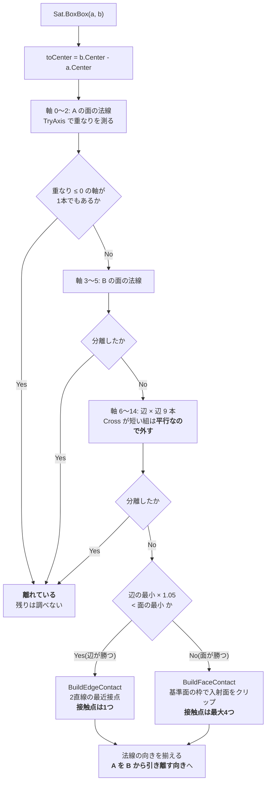
```mermaid
flowchart TD
    S["Sat.BoxBox(a, b)"] --> T["toCenter = b.Center - a.Center"]
    T --> FA["軸 0〜2: A の面の法線<br/>TryAxis で重なりを測る"]
    FA --> SEP1{"重なり ≤ 0 の軸が<br/>1本でもあるか"}
    SEP1 -->|Yes| OUT["<b>離れている</b><br/>残りは調べない"]
    SEP1 -->|No| FB["軸 3〜5: B の面の法線"]
    FB --> SEP2{"分離したか"}
    SEP2 -->|Yes| OUT
    SEP2 -->|No| EE["軸 6〜14: 辺 × 辺 9 本<br/>Cross が短い組は<b>平行なので外す</b>"]
    EE --> SEP3{"分離したか"}
    SEP3 -->|Yes| OUT
    SEP3 -->|No| PICK{"辺の最小 × 1.05<br/>&lt; 面の最小 か"}
    PICK -->|"Yes(辺が勝つ)"| EDGE["BuildEdgeContact<br/>2直線の最近接点<br/><b>接触点は1つ</b>"]
    PICK -->|"No(面が勝つ)"| FACE["BuildFaceContact<br/>基準面の枠で入射面をクリップ<br/><b>接触点は最大4つ</b>"]
    EDGE --> N["法線の向きを揃える<br/><b>A を B から引き離す向き</b>へ"]
    FACE --> N
```

**分かれ道が2つ**あるのが読みどころ。
1つ目は「どこかで分離したか」——15 本のどれか1本で隙間が見つかれば、そこで終わる。
2つ目は「面と辺のどちらが最小か」——ここで**接触点の作り方がまるごと変わる**。

`1.05` の下駄は、ほぼ平行な辺の外積が数値誤差で揺れるのを避けるためのもの
(Day 44b の要点1)。これを 1.0 にすると、床に置いた箱が
「面で4点」と「辺で1点」の間を行き来して震え出す。

### 接触点が4つできるまで — 基準面と入射面

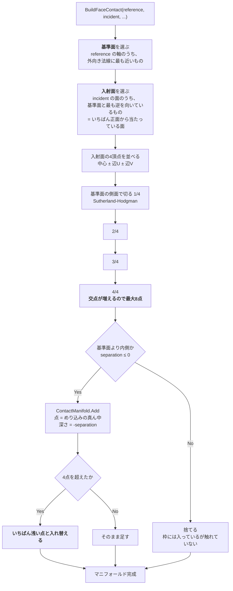
```mermaid
flowchart TD
    A["BuildFaceContact(reference, incident, ...)"] --> R["<b>基準面</b>を選ぶ<br/>reference の軸のうち、<br/>外向き法線に最も近いもの"]
    R --> I["<b>入射面</b>を選ぶ<br/>incident の面のうち、<br/>基準面と最も逆を向いているもの<br/>= いちばん正面から当たっている面"]
    I --> P["入射面の4頂点を並べる<br/>中心 ± 辺U ± 辺V"]
    P --> C1["基準面の側面で切る 1/4<br/>Sutherland-Hodgman"]
    C1 --> C2["2/4"]
    C2 --> C3["3/4"]
    C3 --> C4["4/4<br/><b>交点が増えるので最大8点</b>"]
    C4 --> F{"基準面より内側か<br/>separation ≤ 0"}
    F -->|No| DROP["捨てる<br/>枠には入っているが触れていない"]
    F -->|Yes| ADD["ContactManifold.Add<br/>点 = めり込みの真ん中<br/>深さ = -separation"]
    ADD --> LIM{"4点を超えたか"}
    LIM -->|Yes| SWAP["<b>いちばん浅い点と入れ替える</b>"]
    LIM -->|No| KEEP["そのまま足す"]
    SWAP --> E["マニフォールド完成"]
    KEEP --> E
    DROP --> E
```

**「入射面を基準面の枠で切る」で重なりが出る**のがこの図の要点。
床の上に箱をまるごと置けば4頂点がそのまま残り、
床から半分はみ出せば、はみ出した2点が切り落とされて
**代わりに床の縁の上に新しい2点が生まれる**。

<b>クリップで1点も残らないことがある</b>(ごく浅い接触や数値誤差)。
そのときは相手のいちばん突き出た点1つで代用している——
**接触を落とすと物が沈む**ので、0点で返すよりましだという判断。

### 剛体が1ステップ進むまで — 5段と、それぞれが書き換えるもの

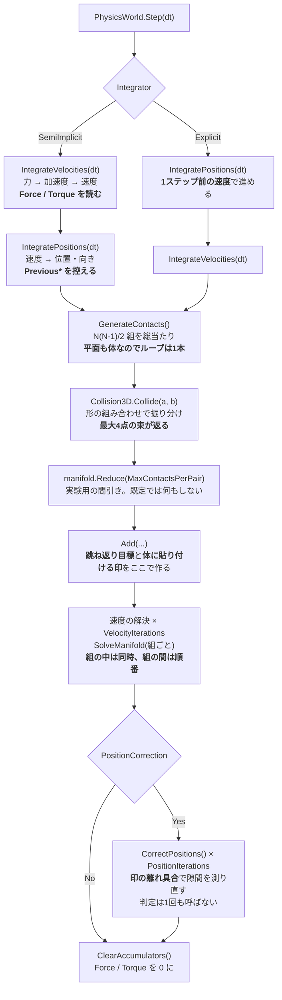
```mermaid
flowchart TD
    S["PhysicsWorld.Step(dt)"] --> I{"Integrator"}
    I -->|SemiImplicit| SV["IntegrateVelocities(dt)<br/>力 → 加速度 → 速度<br/><b>Force / Torque を読む</b>"]
    SV --> SP["IntegratePositions(dt)<br/>速度 → 位置・向き<br/><b>Previous* を控える</b>"]
    I -->|Explicit| EP["IntegratePositions(dt)<br/><b>1ステップ前の速度</b>で進める"]
    EP --> EV["IntegrateVelocities(dt)"]

    SP --> G["GenerateContacts()<br/>N(N-1)/2 組を総当たり<br/><b>平面も体なのでループは1本</b>"]
    EV --> G
    G --> CO["Collision3D.Collide(a, b)<br/>形の組み合わせで振り分け<br/><b>最大4点の束が返る</b>"]
    CO --> RD["manifold.Reduce(MaxContactsPerPair)<br/>実験用の間引き。既定では何もしない"]
    RD --> A["Add(...)<br/><b>跳ね返り目標</b>と<b>体に貼り付ける印</b>をここで作る"]
    A --> V["速度の解決 × VelocityIterations<br/>SolveManifold(組ごと)<br/><b>組の中は同時、組の間は順番</b>"]
    V --> PC{"PositionCorrection"}
    PC -->|Yes| CP["CorrectPositions() × PositionIterations<br/><b>印の離れ具合</b>で隙間を測り直す<br/>判定は1回も呼ばない"]
    PC -->|No| CL
    CP --> CL["ClearAccumulators()<br/>Force / Torque を 0 に"]
```

**書き換えるものが段ごとに分かれている**のは Day 43 のまま。

| 段 | 読むもの | 書くもの |
|---|---|---|
| 積分 | `Force` / `Torque` / `Gravity` | 速度、位置、向き、`Previous*` |
| 判定 | 位置、向き、形、速度 | 接触の配列 + **組の区切り** |
| 速度の解決 | 接触、速度 | **速度だけ** |
| 位置の補正 | 接触、位置、向き | **位置だけ** |

**組の区切り(`_manifolds`)が今日増えた**。接触点は組ごとに続けて並んでいるので、
「どこからどこまでが同じ組か」さえ覚えておけば、
速度の解決で4点をまとめて扱える。

### インパルスが決まるまで — 組の中は同時、組の間は順番

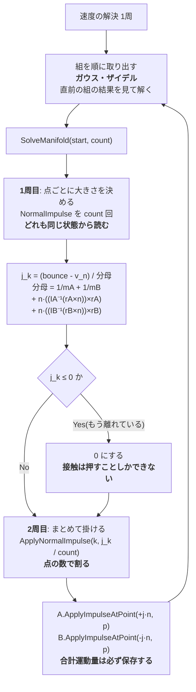
```mermaid
flowchart TD
    ST["速度の解決 1周"] --> LOOP["組を順に取り出す<br/><b>ガウス・ザイデル</b><br/>直前の組の結果を見て解く"]
    LOOP --> SM["SolveManifold(start, count)"]
    SM --> M1["<b>1周目</b>: 点ごとに大きさを決める<br/>NormalImpulse を count 回<br/><b>どれも同じ状態から読む</b>"]
    M1 --> DET["j_k = (bounce - v_n) / 分母<br/>分母 = 1/mA + 1/mB<br/>+ n·((IA⁻¹(rA×n))×rA)<br/>+ n·((IB⁻¹(rB×n))×rB)"]
    DET --> NEG{"j_k ≤ 0 か"}
    NEG -->|"Yes(もう離れている)"| SKIP["0 にする<br/><b>接触は押すことしかできない</b>"]
    NEG -->|No| M2
    SKIP --> M2["<b>2周目</b>: まとめて掛ける<br/>ApplyNormalImpulse(k, j_k / count)<br/><b>点の数で割る</b>"]
    M2 --> AP["A.ApplyImpulseAtPoint(+j·n, p)<br/>B.ApplyImpulseAtPoint(-j·n, p)<br/><b>合計運動量は必ず保存する</b>"]
    AP --> LOOP
```

**分母の下2行が、今日ようやく効き始めた**。
Day 43 の球どうしでは接触法線が両方の中心を通るので `rA × n = 0`、
回転の寄与は常に 0 だった。箱では接触点が中心からずれるので、
**同じ大きさのインパルスでも掛ける場所で効き方が変わる**——
角から着地した箱が起き上がるのは、この2行があるから。

**1周目と2周目が分かれている**のが Day 44a の肝(その日の要点5)。
1周目で全部の点を「同じ状態から」読むので、
対称な接触では4点が完全に同じ大きさになり、余計なトルクが立たない。
`Ctrl+Shift+Alt+7` でこの分割をやめると、
**1点目だけが全部を背負い、3段の柱が崩れる**。

### カプセルが何かに当たるまで — 全部いったん球に落ちる(Day 45)

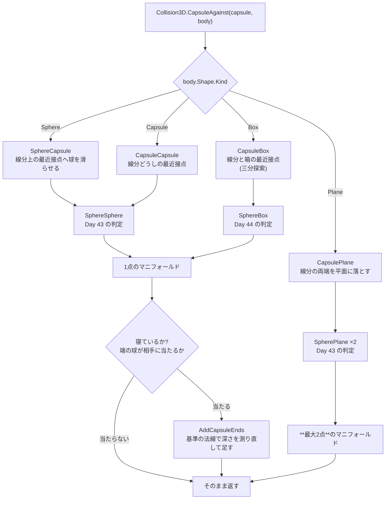
```mermaid
flowchart TD
    S["Collision3D.CapsuleAgainst(capsule, body)"] --> K{"body.Shape.Kind"}

    K -->|Sphere| SC["SphereCapsule<br/>線分上の最近接点へ球を滑らせる"]
    K -->|Plane| CP["CapsulePlane<br/>線分の両端を平面に落とす"]
    K -->|Box| CB["CapsuleBox<br/>線分と箱の最近接点<br/>(三分探索)"]
    K -->|Capsule| CC["CapsuleCapsule<br/>線分どうしの最近接点"]

    SC --> SS["SphereSphere<br/>Day 43 の判定"]
    CC --> SS
    CB --> SB["SphereBox<br/>Day 44 の判定"]
    CP --> SP["SpherePlane ×2<br/>Day 43 の判定"]

    SS --> W["1点のマニフォールド"]
    SB --> W
    SP --> M2["**最大2点**のマニフォールド"]

    W --> E{"寝ているか?<br/>端の球が相手に当たるか"}
    E -->|当たる| AE["AddCapsuleEnds<br/>基準の法線で深さを測り直して足す"]
    E -->|当たらない| OUT["そのまま返す"]
    AE --> OUT
    M2 --> OUT
```

**どの枝も最後は球の判定に落ちている**のが、この図でいちばん見てほしいところ。
カプセルが「線分から一定の距離」でしかないので、
新しく書いたのは<b>「どこへ球を滑らせるか」</b>だけになる。

**平面だけ別扱い**なのは、平らな面に対しては
「いちばん深いのは必ず線分の端」と言い切れるから。
端2つを見れば漏れも無駄も無いので、`AddCapsuleEnds` の出番がない。

**`AddCapsuleEnds` が要る理由**は Day 44a の要点3そのまま——
寝かせたカプセルを1点で支えると、転がって震え続ける。
足すときに<b>基準の法線で深さを測り直す</b>のは、
マニフォールドが法線を1本しか持てないため。

### Audio — OpenAL の薄い皮

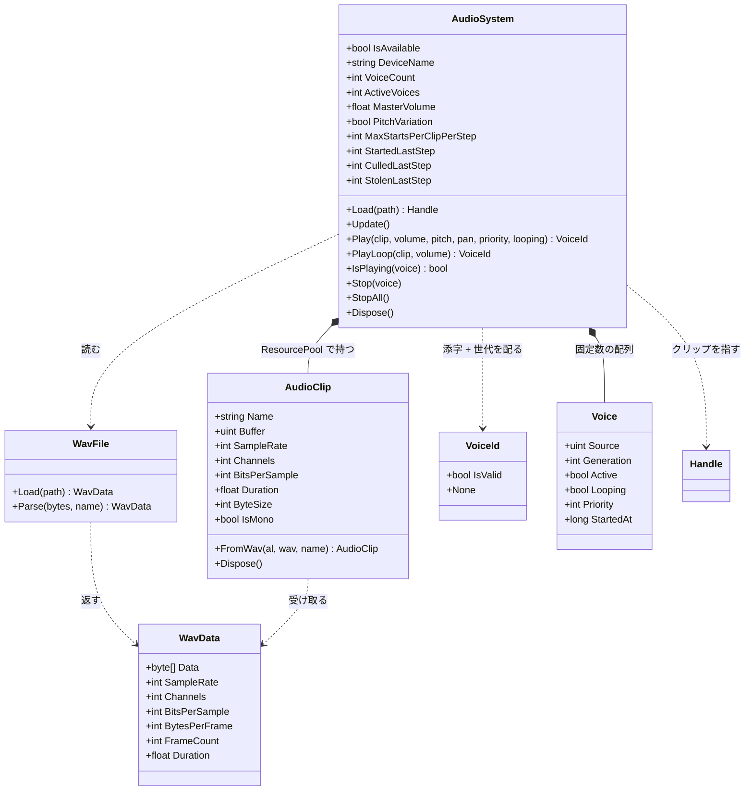
```mermaid
classDiagram
    class WavData {
        +byte[] Data
        +int SampleRate
        +int Channels
        +int BitsPerSample
        +int BytesPerFrame
        +int FrameCount
        +float Duration
    }
    class WavFile {
        +Load(path) WavData
        +Parse(bytes, name) WavData
    }
    class AudioClip {
        +string Name
        +uint Buffer
        +int SampleRate
        +int Channels
        +int BitsPerSample
        +float Duration
        +int ByteSize
        +bool IsMono
        +FromWav(al, wav, name) AudioClip
        +Dispose()
    }
    class VoiceId {
        +bool IsValid
        +None
    }
    class AudioSystem {
        +bool IsAvailable
        +string DeviceName
        +int VoiceCount
        +int ActiveVoices
        +float MasterVolume
        +bool PitchVariation
        +int MaxStartsPerClipPerStep
        +int StartedLastStep
        +int CulledLastStep
        +int StolenLastStep
        +Load(path) Handle
        +Update()
        +Play(clip, volume, pitch, pan, priority, looping) VoiceId
        +PlayLoop(clip, volume) VoiceId
        +IsPlaying(voice) bool
        +Stop(voice)
        +StopAll()
        +Dispose()
    }
    class Voice {
        +uint Source
        +int Generation
        +bool Active
        +bool Looping
        +int Priority
        +long StartedAt
    }

    WavFile ..> WavData : 返す
    AudioClip ..> WavData : 受け取る
    AudioSystem ..> WavFile : 読む
    AudioSystem *-- AudioClip : ResourcePool で持つ
    AudioSystem *-- Voice : 固定数の配列
    AudioSystem ..> VoiceId : 添字 + 世代を配る
    AudioSystem ..> Handle : クリップを指す
```

`Voice` は `AudioSystem` の中の `private struct`。外からは `VoiceId` 越しにしか触れない。

この層で押さえるべき線引きは3つ。

- **`WavFile` は OpenAL を知らない**。ただのバイト列パーサなので、
  ファイルが無くてもメモリ上のバイト列で試せる(自己チェックがそうしている)
- **`AudioClip` はデータ、`Voice` は再生**(要点2)。
  `Texture` と `Material`、`Mesh` と描画呼び出しと同じ分け方
- **`VoiceId` は `Handle<T>` と同じ構造**(添字 + 世代)だが**別の型**。
  `Handle<T>` は `ResourcePool<T>` のためのもので、ボイスはプールではないので流用しない。
  同じ手口を別の場所で使い直している、と読むのが正しい

### Text — Render の上に積む層

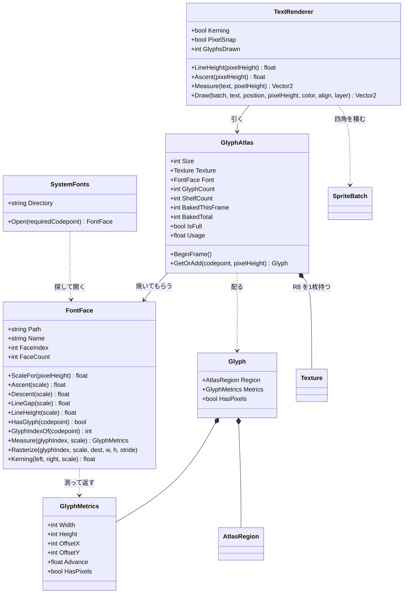
```mermaid
classDiagram
    class SystemFonts {
        +string Directory
        +Open(requiredCodepoint) FontFace
    }
    class FontFace {
        +string Path
        +string Name
        +int FaceIndex
        +int FaceCount
        +ScaleFor(pixelHeight) float
        +Ascent(scale) float
        +Descent(scale) float
        +LineGap(scale) float
        +LineHeight(scale) float
        +HasGlyph(codepoint) bool
        +GlyphIndexOf(codepoint) int
        +Measure(glyphIndex, scale) GlyphMetrics
        +Rasterize(glyphIndex, scale, dest, w, h, stride)
        +Kerning(left, right, scale) float
    }
    class GlyphMetrics {
        +int Width
        +int Height
        +int OffsetX
        +int OffsetY
        +float Advance
        +bool HasPixels
    }
    class Glyph {
        +AtlasRegion Region
        +GlyphMetrics Metrics
        +bool HasPixels
    }
    class GlyphAtlas {
        +int Size
        +Texture Texture
        +FontFace Font
        +int GlyphCount
        +int ShelfCount
        +int BakedThisFrame
        +int BakedTotal
        +bool IsFull
        +float Usage
        +BeginFrame()
        +GetOrAdd(codepoint, pixelHeight) Glyph
    }
    class TextRenderer {
        +bool Kerning
        +bool PixelSnap
        +int GlyphsDrawn
        +LineHeight(pixelHeight) float
        +Ascent(pixelHeight) float
        +Measure(text, pixelHeight) Vector2
        +Draw(batch, text, position, pixelHeight, color, align, layer) Vector2
    }

    SystemFonts ..> FontFace : 探して開く
    FontFace ..> GlyphMetrics : 測って返す
    GlyphAtlas --> FontFace : 焼いてもらう
    GlyphAtlas *-- Texture : R8 を1枚持つ
    GlyphAtlas ..> Glyph : 配る
    Glyph *-- AtlasRegion
    Glyph *-- GlyphMetrics
    TextRenderer --> GlyphAtlas : 引く
    TextRenderer ..> SpriteBatch : 四角を積む
```

4つのクラスが、**それぞれ1つのことしかしない**ように切ってある。

| クラス | 知っていること | 知らないこと |
|---|---|---|
| `SystemFonts` | どこにフォントがあるか | 描き方 |
| `FontFace` | フォントの中身(寸法とアウトライン) | GL、アトラス、レイアウト |
| `GlyphAtlas` | どこに置いたか、何を焼いたか | 文字の並べ方 |
| `TextRenderer` | 並べ方(送り・行送り・整列) | フォントの中身、GL |

この切り方の値打ちは、**差し替えたときにどこまで壊れるか**で分かる。
SDF に変える(改造課題3)なら `GlyphAtlas` と `text.frag` だけが変わり、
`TextRenderer` は 1 行も触らない。
フォントフォールバックを入れる(改造課題2)なら `FontFace` を複数持つだけで、
`GlyphAtlas` の棚詰めには影響しない。

**`GlyphMetrics` が `FontFace` と `TextRenderer` の共通語**になっている。
「原点からどれだけずらして、次にどれだけ進むか」——
この5つの数字さえあれば、フォントの実装が何であれ字を並べられる。

### Model — glTF を描画の言葉へ翻訳する層(Day 42 でさらにクラスが4つ増えた)

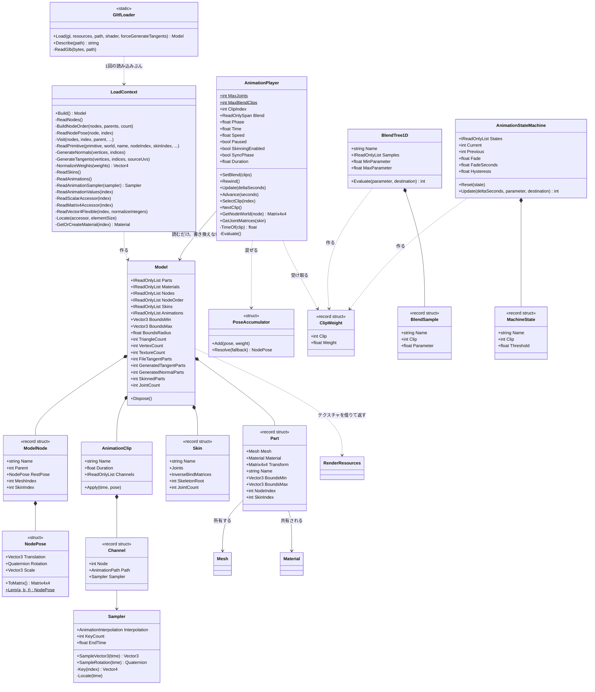
```mermaid
classDiagram
    class GltfLoader {
        <<static>>
        +Load(gl, resources, path, shader, forceGenerateTangents) Model
        +Describe(path) string
        -ReadGlb(bytes, path)
    }
    class LoadContext {
        +Build() Model
        -ReadNodes()
        -BuildNodeOrder(nodes, parents, count)
        -ReadNodePose(node, index)
        -Visit(nodes, index, parent, ...)
        -ReadPrimitive(primitive, world, name, nodeIndex, skinIndex, ...)
        -GenerateNormals(vertices, indices)
        -GenerateTangents(vertices, indices, sourceUvs)
        -NormalizeWeights(weights) Vector4
        -ReadSkins()
        -ReadAnimations()
        -ReadAnimationSampler(sampler) Sampler
        -ReadAnimationValues(index)
        -ReadScalarAccessor(index)
        -ReadMatrix4Accessor(index)
        -ReadVector4Flexible(index, normalizeIntegers)
        -Locate(accessor, elementSize)
        -GetOrCreateMaterial(index) Material
    }
    class Model {
        +IReadOnlyList Parts
        +IReadOnlyList Materials
        +IReadOnlyList Nodes
        +IReadOnlyList NodeOrder
        +IReadOnlyList Skins
        +IReadOnlyList Animations
        +Vector3 BoundsMin
        +Vector3 BoundsMax
        +float BoundsRadius
        +int TriangleCount
        +int VertexCount
        +int TextureCount
        +int FileTangentParts
        +int GeneratedTangentParts
        +int GeneratedNormalParts
        +int SkinnedParts
        +int JointCount
        +Dispose()
    }
    class Part {
        <<record struct>>
        +Mesh Mesh
        +Material Material
        +Matrix4x4 Transform
        +string Name
        +Vector3 BoundsMin
        +Vector3 BoundsMax
        +int NodeIndex
        +int SkinIndex
    }
    class ModelNode {
        <<record struct>>
        +string Name
        +int Parent
        +NodePose RestPose
        +int MeshIndex
        +int SkinIndex
    }
    class NodePose {
        <<struct>>
        +Vector3 Translation
        +Quaternion Rotation
        +Vector3 Scale
        +ToMatrix() Matrix4x4
        +Lerp(a, b, t) NodePose$
    }
    class PoseAccumulator {
        <<struct>>
        +Add(pose, weight)
        +Resolve(fallback) NodePose
    }
    class ClipWeight {
        <<record struct>>
        +int Clip
        +float Weight
    }
    class BlendTree1D {
        +string Name
        +IReadOnlyList Samples
        +float MinParameter
        +float MaxParameter
        +Evaluate(parameter, destination) int
    }
    class BlendSample {
        <<record struct>>
        +string Name
        +int Clip
        +float Parameter
    }
    class AnimationStateMachine {
        +IReadOnlyList States
        +int Current
        +int Previous
        +float Fade
        +float FadeSeconds
        +float Hysteresis
        +Reset(state)
        +Update(deltaSeconds, parameter, destination) int
    }
    class MachineState {
        <<record struct>>
        +string Name
        +int Clip
        +float Threshold
    }
    class Skin {
        <<record struct>>
        +string Name
        +Joints
        +InverseBindMatrices
        +int SkeletonRoot
        +int JointCount
    }
    class AnimationClip {
        +string Name
        +float Duration
        +IReadOnlyList Channels
        +Apply(time, pose)
    }
    class Channel {
        <<record struct>>
        +int Node
        +AnimationPath Path
        +Sampler Sampler
    }
    class Sampler {
        +AnimationInterpolation Interpolation
        +int KeyCount
        +float EndTime
        +SampleVector3(time) Vector3
        +SampleRotation(time) Quaternion
        -Key(index) Vector4
        -Locate(time)
    }
    class AnimationPlayer {
        +int MaxJoints$
        +int MaxBlendClips$
        +int ClipIndex
        +ReadOnlySpan Blend
        +float Phase
        +float Time
        +float Speed
        +bool Paused
        +bool SkinningEnabled
        +bool SyncPhase
        +float Duration
        +SetBlend(clips)
        +Rewind()
        +Update(deltaSeconds)
        +Advance(seconds)
        +SelectClip(index)
        +NextClip()
        +GetNodeWorld(node) Matrix4x4
        +GetJointMatrices(skin)
        -TimeOf(clip) float
        -Evaluate()
    }

    GltfLoader ..> LoadContext : 1回の読み込みぶん
    LoadContext ..> Model : 作る
    Model *-- Part
    Model *-- ModelNode
    Model *-- Skin
    Model *-- AnimationClip
    ModelNode *-- NodePose
    AnimationClip *-- Channel
    Channel --> Sampler
    Part --> Mesh : 所有する
    Part --> Material : 共有される
    Model ..> RenderResources : テクスチャを借りて返す
    AnimationPlayer --> Model : 読むだけ。書き換えない
    AnimationPlayer ..> PoseAccumulator : 混ぜる
    AnimationPlayer ..> ClipWeight : 受け取る
    BlendTree1D *-- BlendSample
    BlendTree1D ..> ClipWeight : 作る
    AnimationStateMachine *-- MachineState
    AnimationStateMachine ..> ClipWeight : 作る
```

<b>クラス図の都合で名前を変えてある</b>ものが2つある。
`BlendSample` は実際には `BlendTree1D.Sample`、`MachineState` は
`AnimationStateMachine.State`。mermaid の classDiagram は入れ子の型名を
そのまま書けないので、外に出して別名にした
(`AnimationClip.Channel` / `.Sampler` を `Channel` / `Sampler` と書いているのと同じ扱い)。

**Day 34 で `GenerateTangents` が入った**。ここに置いたのは、
**接線が「読み込みの一部」だから**——ファイルにあれば読み、無ければ作る、という
同じ場所で決まるべき話になる。

**Day 41 で `GenerateNormals` が隣に並んだ**のも同じ理由。
Fox が `NORMAL` を持っていないので、三角形の外積から作り直す。
接線より**先に**呼ぶのが決まりで、接線の生成が法線を使う
(グラム・シュミットで直交させる)ため。

**Day 39 で `Part` に境界箱が入った**。モデル全体のぶん(`Model.BoundsMin`)は
Day 32 からあったが、それだけでは足りない場面が出た。

配布されているモデルには「きれいな版」と「錆びた版」が
**1ファイルに並べて入っている**ことがある(`fire_hydrant` / `metal_trash_can`)。
デモに置くときは片方だけが欲しいので、`DemoScene` がノード名で選り分ける——
すると残ったパーツの**大きさと足元が全体のものとは違う**。

`Part.Name`(glTF のノード名)も、この日から
「デバッグ表示用」ではなく**選り分けの鍵**という仕事を持った。

`Model` が接線と法線の出どころ(ファイル / 生成)の数を持つのは、
**HUD と自己チェックで区別を出すため**。
「法線マップが効かない」の原因の筆頭がここなので、
数を見えるところに出しておく価値がある。

**`LoadContext` を切り出したのは、引数が増えすぎたから**。
`gl` / `resources` / `path` / `directory` / `root` / `embedded` / `shader` の7つを
静的メソッド間で渡し回すと、どの関数も先頭3行が引数の受け渡しになる。
**読み込み1回ぶんの寿命を持つ入れ物**にまとめると、
buffer のキャッシュとマテリアルの使い回しも自然にそこへ収まる。
Day 41 でここに `_nodes` / `_nodeOrder` / `_skins` / `_animations` が加わり、
**読み込みの結果を組み立てる場所**という性格がはっきりした。

### `Model` が木を持ち直したこと(Day 41)

Day 32 の `Model` は「メッシュ + マテリアル + 世界行列」の平らな一覧だった。
根から行列を掛け合わせて世界行列を確定させてしまえば、
描くときは順に回すだけ——**静的なモデルに階層は要らない**、という判断。

Day 41 でそれが足りなくなる。理由は2つとも「木を歩き直す必要がある」。

| 何のために | どう歩くか |
|---|---|
| アニメーション | ノードの TRS が毎フレーム書き換わる → 世界行列を作り直す |
| スキニング | 関節ノードの世界行列を集めて関節行列を作る |

そこで `Model` に `Nodes`(木の形と初期姿勢)と `NodeOrder`(親が先に来る並び)を戻した。
**平らな一覧も残してある**のが今日の判断で、
静的なモデル(Day 39 のデモシーンの小物)は Day 32 からの経路をそのまま通る。

`NodeOrder` を配列で持つのは、毎フレーム再帰で降りるのを避けるため。
**順番は読み込みの時点で決まっている**ので、1回並べ替えておけば
あとはキャッシュに乗る素直なループになる。

glTF の `nodes` の並びに順序の保証は無い(子が親より前に書かれているファイルは実在する)。
番号順に回すと**1フレーム古い親の行列**を掛けることになり、
「腕だけ1フレーム遅れてついてくる」という気味の悪い出方をする。

**`Model` が `RenderResources` を握っている**のは、
テクスチャの参照カウントを返すため(Day 21 の要点3)。
`Mesh` は自分で作ったので所有するが、テクスチャは借り物なので返す必要がある。
ここを忘れると、モデルを切り替えるたびに 2K テクスチャが数枚ずつ残り、
**絵は正しいのに VRAM だけ増え続ける**。

**`AnimationPlayer` は何も所有しない**のが対照的で、
持っているのは姿勢と行列の配列だけ。だから捨てるのではなく
参照を切れば済む(`Program.SetModel` の `_animation = null`)。
「Dispose が要るもの」と「要らないもの」の線が、この2つを並べるとはっきりする。

### glTF を1体読むまで — 3段の間接参照とノードの木

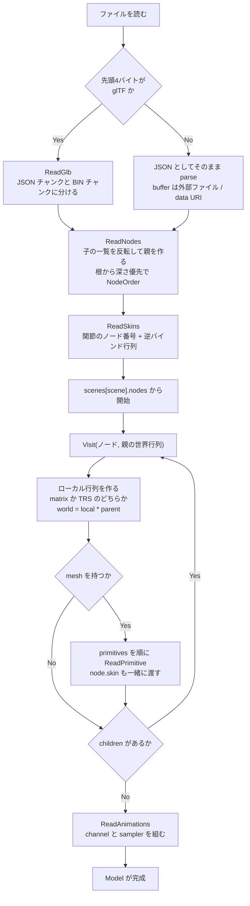
```mermaid
flowchart TD
    F["ファイルを読む"] --> M{"先頭4バイトが<br/>glTF か"}
    M -->|Yes| GLB["ReadGlb<br/>JSON チャンクと BIN チャンクに分ける"]
    M -->|No| TXT["JSON としてそのまま parse<br/>buffer は外部ファイル / data URI"]
    GLB --> ND["ReadNodes<br/>子の一覧を反転して親を作る<br/>根から深さ優先で NodeOrder"]
    TXT --> ND
    ND --> SK["ReadSkins<br/>関節のノード番号 + 逆バインド行列"]
    SK --> SC["scenes[scene].nodes から開始"]
    SC --> V["Visit(ノード, 親の世界行列)"]
    V --> TR["ローカル行列を作る<br/>matrix か TRS のどちらか<br/>world = local * parent"]
    TR --> HM{"mesh を持つか"}
    HM -->|Yes| PR["primitives を順に ReadPrimitive<br/>node.skin も一緒に渡す"]
    HM -->|No| CH
    PR --> CH{"children があるか"}
    CH -->|Yes| V
    CH -->|No| AN["ReadAnimations<br/>channel と sampler を組む"]
    AN --> DONE["Model が完成"]
```

**ノードを2回歩く**のが Day 41 の形。1回目(`ReadNodes`)は全ノードの
親と姿勢を確定させるため、2回目(`Visit`)はシーンに繋がったメッシュを拾うため。

分けたのは、**関節がシーングラフの外に置かれたファイルが実在する**から。
`Visit` だけで済ませると、そういうノードの姿勢が作られず、
アニメーションがノード番号で名指ししてきたときに書き込む先が無い。

プリミティブ1個を頂点配列にするところが、glTF のいちばん機械的な部分になる。

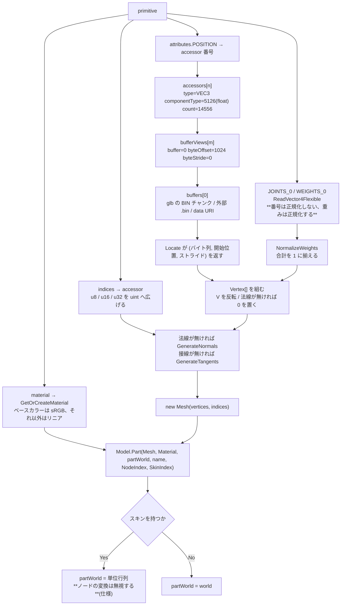
```mermaid
flowchart TD
    P["primitive"] --> A["attributes.POSITION → accessor 番号"]
    A --> AC["accessors[n]<br/>type=VEC3 componentType=5126(float) count=14556"]
    AC --> BV["bufferViews[m]<br/>buffer=0 byteOffset=1024 byteStride=0"]
    BV --> B["buffers[0]<br/>glb の BIN チャンク / 外部 .bin / data URI"]
    B --> READ["Locate が (バイト列, 開始位置, ストライド) を返す"]
    READ --> VTX["Vertex[] を組む<br/>V を反転 / 法線が無ければ 0 を置く"]
    P --> JW["JOINTS_0 / WEIGHTS_0<br/>ReadVector4Flexible<br/>**番号は正規化しない、重みは正規化する**"]
    JW --> NW["NormalizeWeights<br/>合計を 1 に揃える"]
    NW --> VTX
    P --> IDX["indices → accessor<br/>u8 / u16 / u32 を uint へ広げる"]
    IDX --> GN["法線が無ければ GenerateNormals<br/>接線が無ければ GenerateTangents"]
    VTX --> GN
    P --> MAT["material → GetOrCreateMaterial<br/>ベースカラーは sRGB、それ以外はリニア"]
    GN --> MESH["new Mesh(vertices, indices)"]
    MAT --> PART["Model.Part(Mesh, Material, partWorld, name, NodeIndex, SkinIndex)"]
    MESH --> PART
    PART --> SW{"スキンを持つか"}
    SW -->|Yes| ID["partWorld = 単位行列<br/>**ノードの変換は無視する**(仕様)"]
    SW -->|No| WD["partWorld = world"]
```

**`byteStride` が肝**。glTF は「位置・法線・UV を1頂点ずつ交互に並べる」書き方も許していて、
その場合 `bufferView` に `byteStride` が入る。0(または未指定)なら詰めて並んでいる。

Day 41 のモデルは**5体中3体が stride 付き**(RiggedSimple / CesiumMan / Fox)。
Day 32 の4体は全部 stride 無しだったので、
「対応を落としても動いてしまう」状態がここでようやく破れる。

**`accessor` を経由する意味**は、1本のバイト列を複数の意味で切り出せること。
位置と法線と UV が同じ `buffer` に同居し、
それぞれの `bufferView` が違う範囲を指す。
OBJ が「v の配列」「vt の配列」を別々のテキスト行として持っていたのに対し、
glTF は**メモリ上の並びをそのまま記述している**ので、読み込み後の組み直しが要らない。

**`ReadVector4Flexible` の引数1つが今日の落とし穴**。
`JOINTS_0` も `WEIGHTS_0` も VEC4 で、どちらも整数で入っていることがあるが、
**読み替え方が正反対**になる。

| | 成分の型 | 整数を 0〜1 に読み替えるか |
|---|---|---|
| `JOINTS_0` | unsigned byte / unsigned short | **しない**(3 は 3 のまま) |
| `WEIGHTS_0` | float / 正規化された整数 | **する**(255 → 1.0) |

取り違えると、関節の番号が全部 0 になって
**モデル全体が1本の骨にぶら下がる**という派手な壊れ方をする。

### 1フレームの姿勢が決まるまで — 時刻から関節行列へ5段(Day 42 で1段増えた)

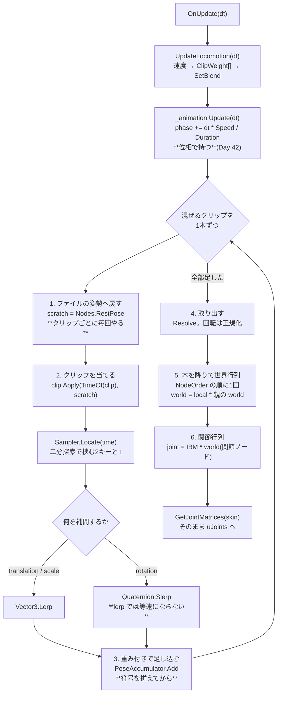
```mermaid
flowchart TD
    T["OnUpdate(dt)"] --> LC["UpdateLocomotion(dt)<br/>速度 → ClipWeight[] → SetBlend"]
    LC --> AD["_animation.Update(dt)<br/>phase += dt * Speed / Duration<br/>**位相で持つ**(Day 42)"]
    AD --> LOOP{"混ぜるクリップを<br/>1本ずつ"}
    LOOP --> R["1. ファイルの姿勢へ戻す<br/>scratch = Nodes.RestPose<br/>**クリップごとに毎回やる**"]
    R --> C["2. クリップを当てる<br/>clip.Apply(TimeOf(clip), scratch)"]
    C --> S["Sampler.Locate(time)<br/>二分探索で挟む2キーと t"]
    S --> I{"何を補間するか"}
    I -->|"translation / scale"| L["Vector3.Lerp"]
    I -->|"rotation"| SL["Quaternion.Slerp<br/>**lerp では等速にならない**"]
    L --> ACC["3. 重み付きで足し込む<br/>PoseAccumulator.Add<br/>**符号を揃えてから**"]
    SL --> ACC
    ACC --> LOOP
    LOOP -->|"全部足した"| RS["4. 取り出す<br/>Resolve。回転は正規化"]
    RS --> W["5. 木を降りて世界行列<br/>NodeOrder の順に1回<br/>world = local * 親の world"]
    W --> J["6. 関節行列<br/>joint = IBM * world(関節ノード)"]
    J --> OUT["GetJointMatrices(skin)<br/>そのまま uJoints へ"]
```

**5 と 6 は Day 41 から1文字も変わっていない**。
混ぜる場所を姿勢の段(1〜4)に置いたので、下流から見ると
「ポーズが1つ決まった」以上のことは起きていない。
**上流で混ぜる形にしておくと、何本混ぜても GPU 側は何も知らなくてよい**。

**1 を毎回やる**のが要点。クリップが触らないノードは
「前フレームの値」ではなく「ファイルの値」でなければならない。
戻さずに済ませると、クリップを切り替えたときに
**前のクリップが最後に書いた値が残る**——Fox で Walk → Survey にしたときに
腰の高さだけ前のまま、といった壊れ方になる。

**`TimeOf(clip)` が位相同期の実体**(Day 42)。

```
  同期 ON   time = phase * clip.Duration     全クリップが「1周のうち同じところ」
  同期 OFF  time = _clipTimes[clip]          各クリップが自分の秒で勝手に回る
```

**`SkinningEnabled` が false のときは 4 を単位行列で埋める**。
頂点は `Σw * I * p = p` になり、バインドポーズがそのまま出る
(重みの合計を 1 に正規化してあるから成り立つ)。

### 頂点が画面に出るまで — CPU と GPU が出会う場所

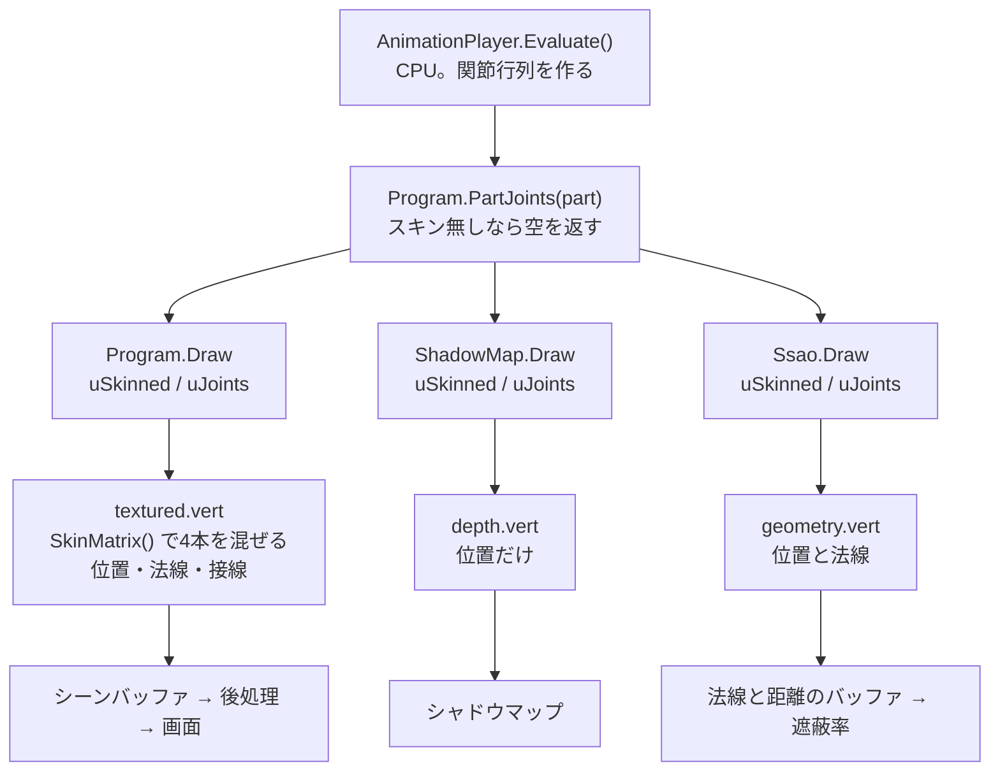
```mermaid
flowchart TD
    EV["AnimationPlayer.Evaluate()<br/>CPU。関節行列を作る"] --> PJ["Program.PartJoints(part)<br/>スキン無しなら空を返す"]
    PJ --> D1["Program.Draw<br/>uSkinned / uJoints"]
    PJ --> D2["ShadowMap.Draw<br/>uSkinned / uJoints"]
    PJ --> D3["Ssao.Draw<br/>uSkinned / uJoints"]
    D1 --> V1["textured.vert<br/>SkinMatrix() で4本を混ぜる<br/>位置・法線・接線"]
    D2 --> V2["depth.vert<br/>位置だけ"]
    D3 --> V3["geometry.vert<br/>位置と法線"]
    V1 --> SCR["シーンバッファ → 後処理 → 画面"]
    V2 --> SM["シャドウマップ"]
    V3 --> GB["法線と距離のバッファ → 遮蔽率"]
```

**同じ関節行列を3回送る**。冗長に見えるが、3つのパスが同じ頂点位置を見ることのほうが
桁違いに大事で、1つでも送り忘れると
「影だけバインドポーズ」「遮蔽だけ1歩ぶん置き去り」という壊れ方をする。

**行列を混ぜてから頂点に掛ける**のがシェーダ側の判断。
掛けてから混ぜても結果は同じ(積が線形なので分配できる)が、
混ぜてからのほうが行列とベクトルの積が1回で済む。

`Program.PartMatrix` / `PartJoints` を1か所に置いてあるのは、
**3か所に写すといつか1つだけ直し忘れる**から。
そのときの症状が「影だけずれる」なので、原因にたどり着くのに時間がかかる。

### 速度から重みが決まるまで — 2通りの決め方(Day 42)

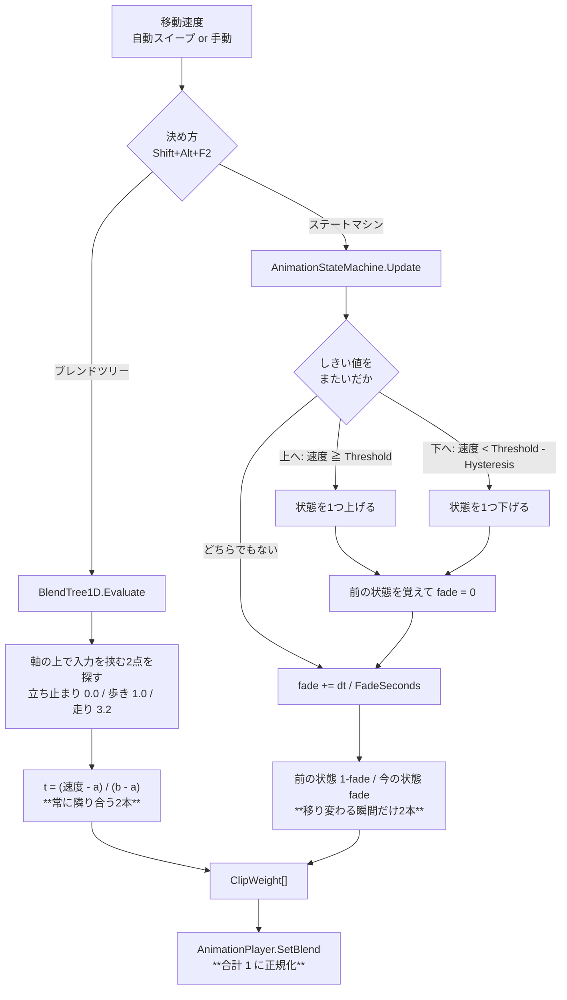
```mermaid
flowchart TD
    SP["移動速度<br/>自動スイープ or 手動"] --> MODE{"決め方<br/>Shift+Alt+F2"}

    MODE -->|"ブレンドツリー"| T1["BlendTree1D.Evaluate"]
    T1 --> T2["軸の上で入力を挟む2点を探す<br/>立ち止まり 0.0 / 歩き 1.0 / 走り 3.2"]
    T2 --> T3["t = (速度 - a) / (b - a)<br/>**常に隣り合う2本**"]
    T3 --> CW

    MODE -->|"ステートマシン"| S1["AnimationStateMachine.Update"]
    S1 --> S2{"しきい値を<br/>またいだか"}
    S2 -->|"上へ: 速度 ≧ Threshold"| S3["状態を1つ上げる"]
    S2 -->|"下へ: 速度 < Threshold - Hysteresis"| S4["状態を1つ下げる"]
    S2 -->|"どちらでもない"| S5
    S3 --> S6["前の状態を覚えて fade = 0"]
    S4 --> S6
    S6 --> S5["fade += dt / FadeSeconds"]
    S5 --> S7["前の状態 1-fade / 今の状態 fade<br/>**移り変わる瞬間だけ2本**"]
    S7 --> CW

    CW["ClipWeight[]"] --> SB["AnimationPlayer.SetBlend<br/>**合計 1 に正規化**"]
```

**2つの経路が同じ出口(`ClipWeight[]`)に落ちる**のが今日の設計の要。
`AnimationPlayer` は上の分岐を1つも知らない。

**ヒステリシスは下向きの矢印にしか付いていない**。
上がるときはしきい値そのまま、下がるときだけ深く。
両方向にずらすと「上がりにくく下がりにくい」ことになり、
反応が鈍く感じられる。**片方向だけ**が定石。

### Game — エンジンを使う側

```mermaid
classDiagram
    class GameBalance {
        +float PlayerSpeed
        +float PlayerMaxHealth
        +float PlayerInvulnerableTime
        +int MaxEnemies
        +float SpawnIntervalStart
        +float SpawnRampSeconds
        +float FireInterval
        +float ProjectileDamage
        +EnemyKinds
        +ExperienceForLevel(level) int
    }
    class Enemy {
        +Vector2 Position
        +Vector2 Velocity
        +float Health
        +float Radius
        +float Speed
        +float Damage
        +int Kind
        +int Experience
        +float HitAt
    }
    class Projectile {
        +Vector2 Position
        +Vector2 Velocity
        +float Life
        +float Damage
    }
    class Gem {
        +Vector2 Position
        +Vector2 Velocity
        +int Value
    }
    class WeaponState {
        +WeaponKind Kind
        +int Level
        +float Timer
        +float Angle
    }
    class WeaponStats {
        +float Interval
        +float Damage
        +int Count
        +float Radius
        +float Speed
    }
    class Weapons {
        +int MaxLevel
        +int KindCount
        +NameOf(kind) string
        +SummaryOf(kind) string
        +StatsFor(kind, level) WeaponStats
        +DescribeNext(kind, level) string
        +OrbitPosition(center, angle, index, stats) Vector2
    }
    class UpgradeOption {
        +UpgradeKind Kind
        +WeaponKind Weapon
        +string Title
        +string Detail
    }
    class SurvivorGame {
        +GamePhase Phase
        +float Elapsed
        +Vector2 PlayerPosition
        +float Health
        +float MaxHealth
        +float SpeedMultiplier
        +float MagnetMultiplier
        +int Level
        +int Experience
        +int Kills
        +int Seed
        +Vector2 Camera
        +int EnemyCount
        +int ProjectileCount
        +int GemCount
        +int WeaponCount
        +int ChoiceCount
        +int ChoiceCursor
        +long PairCandidates
        +OnEvent
        +Start(viewSize, seed)
        +Update(dt, input)
        +ConfirmChoice()
        +LevelOf(kind) int
        +SetSingleWeapon(kind, level)
        +ReturnToTitle()
    }
    class GameView {
        +DrawWorld(submit, viewSize)
        +DrawHudShapes(submit, viewSize)
        +DrawHudText(text, textBatch, viewSize)
    }

    SurvivorGame *-- Enemy : 配列で 1200
    SurvivorGame *-- Projectile : 配列で 400
    SurvivorGame *-- Gem : 配列で 600
    SurvivorGame *-- WeaponState : 配列で 3
    SurvivorGame *-- UpgradeOption : 選択肢 3
    SurvivorGame --> SpatialGrid : 1ステップに1回組む
    SurvivorGame ..> Collision2D : 円どうしの判定
    SurvivorGame ..> GameBalance : 数字を引く
    SurvivorGame ..> Weapons : レベルから性能を引く
    WeaponState ..> WeaponKind
    Weapons ..> WeaponStats : 返す
    GameView ..> SurvivorGame : 読むだけ
    GameView ..> Weapons : 球の位置を引く
    GameView ..> SpriteBatch : 四角を積む
    GameView ..> TextRenderer : 文字を積む
```

**`WeaponState` が3つのフィールドしか持っていない**のが Day 30 の設計の要。
威力も間隔も個数も持たず、`Weapons.StatsFor(kind, level)` が
**レベルから計算して返す**。

```
状態として持つもの   … 種類・レベル・タイマー・角度
状態から決まるもの   … 威力・間隔・個数・半径・速度
```

分けておくと、成長カーブを触るときに `StatsFor` の1箇所で済む。
逆に `WeaponState` に威力を持たせると、
レベルアップのたびに「どの数字をいくつ足すか」があちこちに散らばる。

**`GameView` から `Weapons` への線**にも意味がある。
オービットの球の位置は当たり判定と絵の両方が要るので、
`Weapons.OrbitPosition` という1つの式を両方から呼ぶ。
別々に書くと、**見えているところと当たるところがずれる**——
しかもずれは小さいので、しばらく気づかない。

**`Enemy` / `Projectile` / `Gem` が `struct`** なのが要点。
1200 体ぶんの参照を辿ると、メモリ上ばらばらの場所を読むことになる
(Day 22 で実測した 17 倍がこれ)。構造体の配列なら、
更新ループは連続したメモリを頭から舐めるだけで済む。

**Day 23 の ECS は使っていない**。
ECS が効くのは「部品の組み合わせが実行時に変わる」ときで、
今日のように<b>敵は敵、弾は弾と決まっている</b>なら、
種類ごとに配列を1本持つほうが素直で速い。
Day 23 で「ECS は構造体の配列の一般化」と書いたが、
**一般化が要らない場面では特殊形のままでよい**——
これは ECS が無駄だったという話ではなく、
<b>どちらを選ぶかを判断できるようになった</b>という話になる。

`GameBalance` に矢印が集まっているのも意図したもの。
遊んで気になったことは全部ここを触ることになるので、
**数字がコードの中に散らばっていると調整が苦行になる**。

### Demo — エンジンを使う側の、もう1つの層(Day 40 でクラスが2つ増えた)

```mermaid
classDiagram
    class DemoScene {
        +string Name
        +string SourcePath
        +string HdriPath
        +float Exposure
        +float IblIntensity
        +float SunScale
        +Vector3 Ambient
        +bool RemoveSunFromIbl
        +float SunThreshold
        +float SunAzimuth
        +float ShadowRadius
        +Vector3 CameraTarget
        +float CameraDistance
        +float CameraYaw
        +float CameraPitch
        +float CameraFieldOfView
        +CameraPath Shots
        +GradeSettings Grade
        +IReadOnlyList Items
        +int TriangleCount
        +int ModelCount
        +int TextureCount
        +int ShadowCasterCount
        +double LoadMilliseconds
        +Load(gl, resources, jsonPath, shader, quad, resolveAsset) DemoScene$
        +Dispose()
        -BuildMaterial(entry, shader, resolveAsset) Material
        -AddProp(gl, resources, entry, shader, resolveAsset)
        -AlignToGround(min, max, orientation) Vector3$
        -ReadTransform(entry) Matrix4x4$
        -ReadCameraPath(camera, scene) CameraPath$
        -Track(handle) Handle
    }
    class Item {
        <<record struct>>
        +string Name
        +Mesh Mesh
        +Material Material
        +Matrix4x4 Transform
        +bool CastShadow
    }
    class GradeSettings {
        <<record struct>>
        +bool Enabled
        +float Temperature
        +float Tint
        +float Contrast
        +float Saturation
    }
    class CameraPath {
        +IReadOnlyList Keys
        +int KeyCount
        +float TotalDuration
        +CameraInterpolation Interpolation
        +bool Ease
        +Sample(time) Pose
        +SpeedAt(time, step) tuple
        +IndexAt(time) int
        +StartTimeOf(index) float
        +Wrap(time) float
        +PoseOf(index) Pose
        +WrapAngle(radians) float$
        -Interpolate(index, u) Pose
        -CatmullRom(p0, p1, p2, p3, u) float$
    }
    class Key {
        <<record struct>>
        +string Name
        +Vector3 Target
        +float Distance
        +float Yaw
        +float Pitch
        +float FieldOfView
        +float Hold
        +float Travel
    }
    class Pose {
        <<record struct>>
        +Vector3 Target
        +float Distance
        +float Yaw
        +float Pitch
        +float FieldOfView
    }
    class CameraInterpolation {
        <<enumeration>>
        Linear
        CatmullRom
    }
    class FeatureToggles {
        +IReadOnlyList Features
        +int Selected
        +bool AllOn
        +int OnCount
        +bool TourActive
        +float TourInterval
        +Add(name, effect, get, set)
        +SelectNext()
        +ToggleSelected() Feature
        +SetAll(on)
        +Capture() bool[]
        +Restore(state)
        +BeginTour() string
        +EndTour()
        +Update(deltaSeconds) string
        +Describe() string
        +TourLabel() string
    }
    class Feature {
        +string Name
        +string Effect
        +Func Get
        +Action Set
        +bool Value
    }

    DemoScene *-- Item : 描くものの平らな並び
    DemoScene *-- GradeSettings : 色調整のつまみ
    DemoScene *-- CameraPath : カメラワーク(shots があれば)
    CameraPath *-- Key : キーフレームの並び
    CameraPath ..> Pose : 時刻から作って返す
    CameraPath ..> CameraInterpolation : 補間方式
    CameraPath ..> OrbitCameraController : EyePosition だけ借りる
    FeatureToggles *-- Feature : 機能の並び
    DemoScene *-- Model : glTF を所有する
    DemoScene ..> GltfLoader : 読んでもらう
    DemoScene ..> Material : 板のぶんは自分で作る
    DemoScene ..> Mesh : 板は借りる / glTF のぶんは Model が持つ
    DemoScene ..> RenderResources : テクスチャを借りて返す
    DemoScene ..> Primitives : 借りた板(Program が作ったもの)
```

**`Item` が平らな並びである**ことが、このクラスの全部と言ってよい。
JSON には「マテリアルの一覧」「板の一覧」「glTF の一覧」という
3種類の入れ物があるが、読み終わった時点でそれは1本のリストに潰れる。

```
  materials[]  ─┐
  surfaces[]   ─┼→  Items[]  ──→ 深度パス / 幾何パス / 本描画
  props[]      ─┘
```

<b>誰が何を持っているか</b>が、このクラスでいちばん気を使ったところ。

| もの | 持ち主 | 理由 |
|---|---|---|
| 板のメッシュ | **`Program`**(借りている) | `Primitives.CreateQuad` の1枚を全員で使い回す |
| 板のマテリアル | `DemoScene` | JSON にしか書いていないので、他に持ち主がいない |
| 板のテクスチャ | `RenderResources`(**参照カウントを借りる**) | Day 21 の作法。`Dispose` で同じ数だけ返す |
| glTF のメッシュ | `Model`(`DemoScene` が所有) | `GltfLoader` が作ったもの |
| glTF のマテリアル | `Model` | 同上 |

**板のメッシュだけ借りている**のが例外に見えるが、
これは `Primitives.CreateQuad` が返す 4 頂点の板を
地面にも壁にも使い回しているため。行列と `uvScale` が違うだけで、
頂点は全部同じ——**1枚あれば足りるものを人数分作らない**。

`Load` が `Func<string, string> resolveAsset` を受け取るのは、
**`assets/` をどこから探すかの規則をこのクラスに持ち込まないため**。
`Program.ResolveAssetPath` は「実行ファイルの場所から親へ辿る」という
このリポジトリ固有の作法なので、`Demo/` が知る必要は無い。

**Day 40 で入った2つ**は、どちらも `DemoScene` と横並びの位置に置いてある。

| クラス | 誰が持つか | 誰を知っているか |
|---|---|---|
| `CameraPath` | `DemoScene`(`Shots`。JSON に `shots` があれば) | `OrbitCameraController.EyePosition` だけ |
| `FeatureToggles` | **`Program`** | 何も知らない(`Func` と `Action` だけ) |

**持ち主が違う**のが読みどころ。カメラワークは「このシーンをどう見せるか」なので
シーンの持ち物になるが、機能の ON/OFF は
**シーンが1つも読まれていなくても意味がある**(Day 38 までの絵でも切り替えられる)。
だから `Program` が持ち、`OnLoad` で1度だけ組む。

`CameraPath` が `Camera` も `OrbitCameraController` のインスタンスも持たないのは、
**姿勢を返すだけで、誰に渡すかを決めない**ため。
渡す先を決めているのは `Program.ApplyCameraPose` のほうで、
Day 51 で三人称追従カメラに差し替えるときも、`CameraPath` は触らずに済む。

### カメラが1フレーム進むまで — 時刻から姿勢へ、5段

```mermaid
flowchart TD
    T["OnUpdate(deltaSeconds)<br/>**可変 dt**。固定ステップではない"]
    T --> AD["_cameraTime += dt x 再生速度<br/>1周したら Wrap で先頭へ"]
    AD --> IX["IndexAt(t)<br/>_starts[] を前から見て区間を決める"]
    IX --> HQ{"local <= Hold ?"}
    HQ -->|"静止中"| PO["PoseOf(i)<br/>**キーをそのまま返す**<br/>補間を1回も通らない"]
    HQ -->|"移動中"| U["u = (local - Hold) / Travel<br/>0〜1 の進み"]
    U --> EQ{"Ease ?"}
    EQ -->|Yes| SM["u = 3u² - 2u³<br/>両端で微分 0 = 静止と繋がる"]
    EQ -->|No| IP
    SM --> IP{"Interpolation ?"}
    IP -->|Linear| LI["Lerp(k1, k2, u)<br/>**方位だけ巻き取ってから**"]
    IP -->|CatmullRom| CR["前後 k0 / k3 も覗く<br/>方位を4つとも1本の数直線へ<br/>CatmullRom(k0, k1, k2, k3, u)"]
    LI --> AP
    CR --> AP
    PO --> AP["ApplyCameraPose(pose)"]
    AP --> OC["_orbit.Target / Distance / Yaw / Pitch<br/>_camera.FieldOfView<br/>→ _orbit.Apply()"]
    OC --> SP["SpeedAt(t) で m/s と 度/s を測る<br/>**HUD 専用**。前進差分"]
```

**静止中は補間を1回も通らない**のが、この図でいちばん効いている枝。
`hold` の間はキーをそのまま返すので、
どんな補間方式でも、どんなイージングでも、止まっている絵は完全に同じになる。
`Ctrl+Alt+F4` や `F5` を押しても静止中は何も起きないのはこのため——
**押しても効かないように見えるが、正しい**。

`SpeedAt` が最後にぶら下がっているのは、**HUD のためだけ**にあるから。
絵には1ミリも影響しない。それでも毎フレーム測っているのは、
補間方式の違いが**通過点の 0.1 秒にしか出ない**ので、
数字が無いと `Ctrl+Alt+F4` を押しても何が変わったか分からないため。

### 機能ツアーの2相 — 「1つ切る」と「全部戻す」

```mermaid
stateDiagram-v2
    [*] --> 停止
    停止 --> 切る : BeginTour()<br/>いまの状態を控えて SetAll(true)
    切る --> 戻す : TourInterval 経過<br/>SetAll(true)
    戻す --> 切る : TourInterval 経過<br/>index++ してから SetAll(true) → 1つ OFF
    切る --> 停止 : EndTour()<br/>控えた状態へ Restore
    戻す --> 停止 : EndTour()
```

**毎回 `SetAll(true)` から組み直す**のが実装上の要点。
「切ったものを憶えておいて戻す」形にすると、
途中で `Ctrl+Alt+F8` を押されたときに何を戻せばよいのか分からなくなる。
**常に全部 ON を基準にして、そこから1つ引く**なら、状態は `index` と相の2つで足りる。

その代わり、**走っている間に手で切り替えても数秒後に戻される**。
押しても効かないスイッチはバグにしか見えないので、
`Ctrl+Alt+F8` / `F9` / `F1` を押した時点でツアーのほうを終わらせている
(`Program.StopTourIfRunning`)。

「全部戻す」相を挟むのは**基準の絵を毎回見せるため**。
切りっぱなしで次へ進むと、2つ目からは何と比べているのか分からなくなる。

### シーンが1つ組み上がるまで — JSON からドローコールの並びへ

```mermaid
flowchart TD
    J["demo-v1.json を読む<br/>コメントと末尾カンマを許す設定"]
    J --> LG["lighting / camera<br/>露出・IBL・太陽の方位・影の半径・構図"]
    J --> M["materials[]<br/>baseColor は sRGB、それ以外はリニアで読む<br/>**orm は 1 枚を AO と MR の両方へ**"]
    M --> SF["surfaces[]<br/>板 1 枚 = 拡大 → X → Y → Z 回転 → 平行移動"]
    J --> PR["props[]"]
    PR --> GL["GltfLoader.Load<br/>ノードの木を平らにする"]
    GL --> AO["occlusionTexture が空なら<br/>metallicRoughness を流用<br/>(Poly Haven は ARM を 1 枚しか指さない)"]
    AO --> SK["skipNodes で名前の合うパーツを落とす<br/>「錆びた版」を消す"]
    SK --> BB["残ったパーツの境界箱を合成"]
    BB --> OR["拡大 → X → Y → Z 回転<br/>= orientation 行列"]
    OR --> AL["**回したあとの 8 隅**から AABB を取り直し<br/>水平は中心・垂直は底面を原点へ"]
    AL --> PL["position で世界へ<br/>Items に追加"]
    SF --> IT["Items[]"]
    PL --> IT
```

**足元合わせを回転より後に置く**のが今日の学び。
先に合わせてから回すと、タイヤを寝かせた瞬間に半分が床へ沈む——
「合わせた足元」は回転で別の場所へ行ってしまうから。

```
  ✗  足元合わせ → 拡大 → 回転 → 平行移動     … 回すと沈む
  ○  拡大 → 回転 → 足元合わせ → 平行移動     … どんな向きでも床に乗る
```

回したあとの箱を取るには **8 隅を全部変換する**。
中心と大きさだけを回しても正しい箱にならない
(斜めに回した AABB は元より必ず大きくなる)。

配当は JSON 側に出る。`rotation: [90, 0, 20]` と書くだけで
タイヤが寝て床に乗り、`y` を手で調整する行が1つも要らない。
自己チェックの「**床より下に沈んでいるものが無い**」がこれを見張っている。

### 1フレームの流れ

Silk.NET のウィンドウから `OnUpdate` と `OnRender` が交互に呼ばれる。
**状態を変えるのは `OnUpdate` 側だけ**、というのが Day 19 で引いた線。

```mermaid
flowchart TD
    W["Silk.NET ウィンドウ"] --> U["OnUpdate(deltaSeconds)"]
    U --> A["_loop.Advance(dt, FixedUpdate)"]
    A --> Q{"アキュムレータに<br/>1ステップ分溜まったか"}
    Q -->|Yes| F["FixedUpdate(固定 dt)"]
    F --> Q
    Q -->|No| AL["Alpha = 端数 / 固定dt<br/>次の描画で使う補間率"]
    AL --> LW["UpdateLoadWatch"]
    LW --> CM["UpdateDemoCamera(dt)<br/>**可変 dt**。カメラワークを進めて<br/>_orbit へ姿勢を書く"]
    CM --> LC["UpdateLocomotion(dt)<br/>速度 → ClipWeight[] → SetBlend<br/>**重みを先に決める**"]
    LC --> AN["_animation.Update(dt)<br/>**可変 dt**。位相を進めて<br/>混ぜる → 世界行列 → 関節行列"]
    AN --> FT["_features.Update(dt)<br/>機能ツアーの2相を回す"]
    FT --> FP["fps / タイトルバー"]

    W --> R["OnRender"]
    R --> RU["_resources.Update()<br/>裏で復号済みの絵を GPU へ<br/>1フレームの枚数に上限あり"]
    RU --> GA["_glyphAtlas.BeginFrame()<br/>焼いた数の集計を戻す"]
    GA --> SP["RenderShadowPass()<br/>光の目から深度だけを焼く<br/>デモ中は <b>CastShadow が true のものだけ</b><br/>材質テスト・材質グリッド中は飛ばす"]
    SP --> SS["RenderSsaoPass()<br/>カメラの目から法線と距離を焼く<br/>→ 遮蔽を計算 → ぼかす<br/>デモ中は <b>Items 全部</b>。ゲーム中は飛ばす"]
    SS --> PB["_post.Begin(ClearColor)<br/>シーンバッファへ切り替えて Clear"]
    PB --> SKY["_env.DrawSkybox()<br/>立方体を内側から。<b>深度を書かない</b><br/>ゲーム中は出さない"]
    SKY --> PQ{"物理デモ?"}
    PQ -->|Yes| RP["Render3D → RenderPhysics()<br/>床 + 縁石4本 + 体<br/>球なら球、箱なら立方体<br/><b>+ 接触点の光る玉</b>"]
    PQ -->|No| DQ{"デモ v1 を<br/>読み込んでいるか"}
    DQ -->|Yes| RD["Render3D → RenderDemoScene()<br/>Items を順に描くだけ<br/>スプライトも帯も出さない"]
    DQ -->|No| MG{"材質グリッド?"}
    MG -->|Yes| RG["Render3D → RenderMaterialGrid()<br/>球 7x7 だけ<br/>光の向きと強さをここだけ差し替え"]
    MG -->|No| SF{"材質テストの板?"}
    SF -->|Yes| RS2["Render3D → RenderSurfaceDemo()<br/>レンガの板2枚だけ"]
    SF -->|No| MD{"モデルを表示中か"}
    MD -->|Yes| RM["Render3D → RenderModel()<br/>パーツを順に描く<br/>**PartMatrix と PartJoints を添えて**"]
    MD -->|No| D3{"_draw3D ?"}
    D3 -->|Yes| R3["Render3D()<br/>Mesh + Material<br/>+ 発光する立方体 + 明るさの階段"]
    D3 -->|No| RS
    R3 --> RS["RenderSprites()<br/>SpriteBatch"]
    RS --> ST["RenderResourceStrip()<br/>ロード状況の帯"]
    ST --> UQ
    RP --> UQ
    RD --> UQ
    RM --> UQ
    RG --> UQ
    RS2 --> UQ
    UQ{"UI を後処理に通すか<br/>Shift+F5"}
    UQ -->|"通す(Day 37 まで)"| TX1["RenderText()"]
    TX1 --> PE
    UQ -->|"通さない(既定)"| PE["_post.End(幅, 高さ)<br/>合成 → LDR → FXAA → 画面"]
    PE --> SD["_shadow.DrawDebug(幅, 高さ)<br/>Ctrl+7。**後処理の外**"]
    SD --> AD["_ssao.DrawDebug(幅, 高さ)<br/>Ctrl+F2。**全画面**"]
    AD --> TX2["RenderText()<br/>**後処理の外。いちばん最後**<br/>FXAA もトーンマップも掛からない"]
```

**Day 43 で `OnRender` の側に分岐が1つ増えた**。`RenderPhysics` は
デモ v1 よりさらに優先される——物理デモが出ている間はこれだけを描く。
`OnUpdate` の側は1行も変わっていない(物理は `FixedUpdate` に入った)。

**Day 44 で `RenderPhysics` の中身が2つに分かれた**。
体を描く部分は形ごとにメッシュを選ぶようになり(`BodyMesh`)、
そのあとで `RenderContacts` が接触点を光る玉で並べる。
**平面は描かない**——無限に広いので描きようが無く、
床の板と縁石が位置の目印になっている。

**Day 42 で `OnUpdate` の側にもう1つ増えた**。`UpdateLocomotion` は
`_animation.Update` の**直前**に置く——逆にすると、速度が変わったフレームだけ
1フレーム古い重みで描かれる。1フレームの遅れなので絵では気づけないが、
**自己チェックで姿勢を比べたときに再現しない**という形で出てくる。

`_animation.Update` も
`UpdateDemoCamera` / `_features.Update` と並んで `_loop.Advance` の**外**にある——
つまり固定ステップではなく、可変 dt で呼ばれる。

Day 19 で引いた線がここで効く。

```
  ゲームの状態を変えるもの(移動・当たり判定・AI・タイマー)  → FixedUpdate
  見せ方だけのもの(補間・カメラ・エフェクトの見た目)        → 描画側 / 可変 dt
```

カメラワークもアニメーションも、今日のところは**誰の当たり判定にも影響しない**ので後者。

**ただしアニメーションについては今日までの話**。骨の位置を当たり判定に使い始めると
(Day 45 のキャラクターコントローラ、Day 51 のプレイアブルデモ)決定性が要るので、
そのときは `FixedUpdate` 側へ移すことになる。
「見せ方か、状態か」の線は固定ではなく、**その値を誰が読むかで動く**。

固定ステップに載せると 120Hz でも 20Hz でも同じ絵になる代わりに、
`1`〜`4` キーでシミュレーション周波数を落とした瞬間に**カメラまでカクつく**。
見せ方が計算の都合に引きずられるのは筋が悪い。

`_paused`(Space)のときだけは両方とも止める。
「止めたのに一部だけ動いている」ほうが分かりにくいので、
**見せ方であっても、止めると言われたら止める**。

**Day 33 で先頭に1パス増えた**。`RenderShadowPass` が
`_post.Begin` より前に来るのは、**画面にもシーンバッファにも描かない**から。
行き先はシャドウマップで、後処理とはまったく別の道になる。

**Day 37 でその真下にもう1本増えた**。`RenderSsaoPass` が
`_post.Begin` より前でなければならない理由は、影パスより強い。

遮蔽率は**環境光に掛けるもの**なので、シーンを描き始める時点で
もう出来上がっていないと間に合わない。
「描いてから画面全体に暗さを掛ける」形にすれば1パス減らせるが、
それだと**発光するものも空も暗くなる**——
AO は環境光にだけ掛かるものなので、掛ける場所を選べる本描画の中に入れる必要がある。

**`_ssao.DrawDebug` は全画面**に出す。影の隅出しと違うのは、
AO の善し悪しが**1画素単位のノイズと暗がりの広がり方**で決まるから。
縮めて見ても、半径が大きすぎるのか下駄が足りないのか判断できない。

**`DrawDebug` は後処理の外**に置いてある。
シャドウマップの表示は「見たままの値」であってほしいので、
露出やトーンマップを通してはいけない。
HUD の文字が後処理を通ってしまう(下の弱点)のとは、扱いを分けた。

**Day 29 で分岐が1つ増えた**。ゲームモード(Enter)のときは
`Render3D` も `RenderSprites` も `RenderResourceStrip` も通らず、
`RenderGame()` だけになる。
デモの重い部分を裏で回したまま遊ぶと、
「ゲームが重い」のか「デモが重い」のか分からなくなるため。

**`RenderText` がいちばん最後**なのは、UI が何よりも手前に出るものだから。
**Day 38 でその「最後」が `_post.End` の外へ出た**。
`_ssao.DrawDebug` は画面いっぱいに出るので、
文字はそれよりさらに後ろでなければ塗り潰される。

バッチが別なのは、シェーダが違うため——
グリフのアトラスは1チャンネルなので `sprite.frag` では真っ黒になる。
**バッチは「同じ設定で描けるものをまとめる」仕組み**なので、
シェーダが違えば別のバッチになるのは定義どおりの帰結。

`OnRender` の先頭で `_resources.Update()` を呼ぶのが要点で、
**GL は描画スレッドからしか触れない**ため、裏で復号し終えた画素をここで GPU に上げている
(Day 21 の要点5・6)。

**Day 34 でまた分岐が1つ増えた**。材質テストの板(Alt+5)を出している間は、
モデルもデモも出さない。理由は Day 32・33 と同じで、
**重ねると、どの陰影がどこから来ているのか分からなくなる**。

**Day 35 でさらに1つ増えて4段になった**。材質グリッド(Ctrl+Shift+5)がいちばん外側に来る。

そして今日の分岐は、**中で uniform を差し替える**のが今までと違う。
`RenderMaterialGrid` は光の向きと強さを自分で上書きしてから描く——
デモの太陽は画面の奥から手前へ進むので、正面から見るグリッドが逆光になるため
(「検証の途中で分かったこと」)。

分岐の中で全体設定を書き換えるのは本来まずい形で、
**次にどこかで `uLightDirection` を読む人が居たら破綻する**。
いまは1フレームに1回しか描かないので成り立っているが、
Day 39 で光源が複数になったら「ライトの集合をパスごとに持つ」形へ整理する必要がある。

**Day 39 で分岐がもう1段外側に増えて5段になった**。デモ v1 がいちばん外側に来る。

理由は Day 32〜35 と同じ——**重ねると何を見ているのか分からなくなる**。
デモの絵に 1000 枚のスプライトが重なったら、それはもうデモではない。

置き場所にも Day 35 と同じ判断が入っている。
分岐そのものは `Render3D` の中にもあるが、
**`OnRender` の側にも上げてある**——`Render3D` の中だけだと
`_draw3D`(G キー)でまるごと消えてしまい、
「デモを出せ」と言われたのに 3D 背景のスイッチで消えるのは筋が通らない。

そして Day 35 の宿題が1つ片付いた。設計書にはこう書いてあった。

> 分岐の中で全体設定を書き換えるのは本来まずい形で、
> **次にどこかで `uLightDirection` を読む人が居たら破綻する**。
> いまは1フレームに1回しか描かないので成り立っているが、
> Day 39 で光源が複数になったら「ライトの集合をパスごとに持つ」形へ整理する必要がある。

**光源は複数にならなかった**ので、整理はまだ要らない。
ただし危うさの形は変わっていて、今日は
「`_lightDirection` を**シーンの読み込み時に上書きする**」という書き方が入った。
デモから抜けるときに書き戻す(`_manualLightDirection` に控えてある)ことで凌いでいるが、
**控えて戻す**は状態が増えるたびに漏れる書き方でもある。
光源をまとめて持つ形にするのは、点光源が入る Day 56(多光源化)が本番になる。

**Day 36 で先頭にもう1つ増えた**。空(`_env.DrawSkybox`)が
分岐より前に来るのは、**どの分岐でも背景が要る**から。

深度を書かずに描いているので、あとから描いたものが必ず手前に来る。
いちばん最後に描いて深度テストで隠れた画素を省くほうが速いが、
**分岐が4つある末尾すべてに足す**ことになるので、前に1回置くほうを取った。
フルスクリーン1枚ぶんの塗りつぶしなので、実測でも差が出ない。

**ゲームモードでは出さない**。見下ろし型の 2D に空が映っても意味が無く、
「エンジンの機能のうちゲームが要るものだけを通る」という Day 29 の線から外れる。

分岐が4段になったのは、**デモが増えるたびに「それだけを見せる」を選んできた**結果。
「全部同時に出す」ほうがコードは短いが、学習用としては
1つずつ切り分けて見られるほうが値打ちがある、という判断が積み重なっている。

**Day 32 で分岐が1つ増えた**。モデルを表示している間は、
スプライトの群れも明るさの階段も出さない。
ゲームモード(`_playing`)で同じことをしているのと理由も同じで、
**重ねると、どちらの陰影を見ているのか分からなくなる**。
Day 31 までのデモは `Shift+0` を「モデル無し」まで回すと戻る。

**Day 31 で `Clear` が `_post.Begin` に変わった**。
`Begin` と `End` の間にあるコードは1行も変わっていない——
`Clear` の代わりにフレームバッファを差し替えるようになっただけで、
`Render3D` も `RenderSprites` も `RenderText` も「自分がどこへ描いているか」を知らない。

そのぶん**UI もトーンマップを通ってしまう**——というのが Day 37 までの弱点だった。
露出を上げれば HUD の文字も白飛びする。

**Day 38 でここを分けた**。決め手は色ではなく FXAA で、
**字は1画素幅の線の塊**なので、輪郭を均す処理といちばん相性が悪い(要点5)。
`Shift+F5` で Day 37 までの置き方に戻せるようにしてあるので、
露出を上げて文字が飛ぶところと、モノクロにして文字まで灰色になるところを見比べられる。

分けたことで、UI の色は**表示空間の値がそのまま画面に出る**ようになった。
前はガンマ(1/2.2 乗)を通っていたので 0.95 が 0.977 に持ち上がっていた——
**Day 37 までより文字がわずかに暗く見える**のはそのためで、
UI の色は表示空間で決めるものなので、こちらのほうが筋が通っている。

### 影が1枚出るまで — 2つのパスと、5つの落とし穴

```mermaid
flowchart TD
    B["ShadowMap.Begin(光の向き, 注視点)"]
    B --> M1["視点 = 中心 - 向き × 半径 × 2<br/>正射影(幅高さ = 半径×2)<br/>**落とし穴1: 箱の広さは誰も決めてくれない**"]
    M1 --> M2["LightSpaceMatrix = view * projection<br/>**落とし穴2: 深度パスと本描画で同じ行列を使う**"]
    M2 --> FB["深度専用 FBO を bind<br/>ビューポートを 2048 に<br/>**落とし穴3: glDrawBuffer(GL_NONE)**"]
    FB --> DR["Draw(mesh, model, joints) を並べる<br/>depth.vert / depth.frag<br/>色は書かない。<b>スキニングは本描画と同じ</b>"]
    DR --> E["End()<br/>画面へ戻す。**借りた GL の状態も返す**"]

    E --> AP["ShadowMap.Apply(textured シェーダ)<br/>行列 / 5番のテクスチャ / PCF / バイアス<br/>**フレームに1回でよい**"]
    AP --> VS["textured.vert<br/>vLightSpacePos = uLightSpaceMatrix * worldPos<br/>**頂点でやる。画素でやると無駄**"]
    VS --> FS["textured.frag: ShadowFactor()"]
    FS --> P1["proj = xyz / w<br/>proj = proj * 0.5 + 0.5<br/>**落とし穴4: z も変換する**"]
    P1 --> P2{"proj.z > 1.0 ?"}
    P2 -->|Yes| LIT["影なし(遠クリップより奥)"]
    P2 -->|No| BI["bias = 定数 + 傾き × (1 - N・L)<br/>**落とし穴5: 傾きに比例させる**"]
    BI --> PC["PCF: (2r+1)^2 タップ<br/>**比較してから平均する**"]
    PC --> OUT["lighting = 光 × ランバート × 影 + 環境光 × AO"]
```

**落とし穴が5つとも「絵からは原因が読めない」**のが、影を難しくしている。

| 落とし穴 | 症状 | 見分け方 |
|---|---|---|
| 1. 箱が広すぎ/狭すぎ | ギザギザ / 画面の端で影が消える | HUD の `cm/tx` を見る |
| 2. 行列がずれる | 影が丸ごとずれる | `Ctrl+7` でマップは焼けているのに合わない |
| 3. `glDrawBuffer` 忘れ | 影がまったく出ない | **例外が出る**(完全性チェック。Day 31 の配当) |
| 4. `z` を変換し忘れ | 全部影 / まったく影なし | `Shift+9` を8回で係数を見ると一目 |
| 5. バイアス無し/過多 | 縞模様 / 影が浮く | `Ctrl+4` で 0 と 0.006 を往復する |

**3 だけが例外で教えてくれる**。残り4つは「影がおかしい」としか分からないので、
`Ctrl+7`(マップを見る)と `Shift+9`×8(係数を見る)の2つを先に作っておく。
デバッグ表示は本体より先に書いてよい類のもので、
今日はそれが**キー2つで済む**ところまで来ている。

### 接空間ができるまで — CPU とシェーダにまたがる1本の道

法線マップが1枚効くまでに、**4つの場所**を通る。
どこか1つでも規約がずれると、絵は出るが凹凸だけがおかしくなる。

```mermaid
flowchart TD
    subgraph CPU["読み込み(CPU)"]
        F{"ファイルに<br/>TANGENT があるか"}
        F -->|Yes| RD["ReadVector4Accessor<br/>xyz = 接線 / w = 符号<br/>**w はそのまま使う**"]
        F -->|No| GEN["GenerateTangents"]
        GEN --> G1["三角形ごとに連立方程式を解く<br/>E1 = T*du1 + B*dv1<br/>E2 = T*du2 + B*dv2"]
        G1 --> G2["**反転前の UV** を使う<br/>ファイルの規約に合わせる"]
        G2 --> G3["頂点へ足し込む<br/>UV が潰れた三角形は捨てる"]
        G3 --> G4["グラム・シュミットで<br/>法線に直交させる"]
        G4 --> G5["w = dot(cross(N,T), B) の符号"]
        RD --> V["Vertex.Tangent<br/>location 4 / VEC4"]
        G5 --> V
    end

    subgraph VS["頂点シェーダ"]
        V --> S1["T を uNormalMatrix で世界へ"]
        S1 --> S2["もう一度グラム・シュミット<br/>補間と変換で崩れるため"]
        S2 --> S3["B = cross(N, T) * w"]
        S3 --> S4["視線を接空間へ<br/>**転置 = 逆行列**(正規直交だから)"]
    end

    subgraph FS["画素シェーダ"]
        S4 --> P1["ParallaxUv<br/>視線の傾きで UV をずらす"]
        P1 --> P2["法線マップを読む<br/>rgb * 2 - 1"]
        P2 --> P3["**接空間 → 世界**<br/>T*n.x + B*n.y + N*n.z"]
        P3 --> P4["ライティング<br/>N が差し替わっているので形が変わる"]
    end
```

**規約が食い違いやすい場所が4つある**。どれも絵は出るので、間違いに気づきにくい。

| 場所 | 間違えると | 気づき方 |
|---|---|---|
| UV の V を反転したときの `w` | **凹凸が全部裏返る** | 出っ張りが出っ張って見えるか |
| 生成に使う UV(反転前 / 後) | **モデルによって効いたり効かなかったり** | ファイル有りと無しで見比べる |
| 法線マップの緑の流儀 | 凹凸が裏返る(上と同じ症状) | `Alt+8` でわざと再現できる |
| `cross(N, T)` の順序 | 従接線が逆を向く | 自己チェックの「V の増える向きと一致」 |

**症状が全部同じ**(凹凸が裏返る)なのが厄介なところで、
だから今日の自己チェック(Alt+0)は
「立方体の6面すべてで `cross(N,T)*w` が V の向きと一致するか」を見ている。
**手で答えが書ける形**で1つ確かめておくと、切り分けの起点になる。

### IBL が焼き上がるまで — 5段の事前計算

`EnvironmentMap.Bake` の中身。**順番は動かせない**——前の結果が次の入力になる。

```mermaid
flowchart TD
    S["SkyImage.Create<br/>正距円筒 1024x512 の float 配列<br/>**CPU**。太陽 300 / 空 1〜3 / 地面 0.1"]
    H["HdrImage.Load<br/>正距円筒 2048x1024<br/>**CPU**。太陽 245026 / 空 0.3<br/>(Day 39。Ctrl+Shift+F2 で切替)"]
    S --> CL
    H --> RS["SkyAnalysis.RemoveSun<br/>太陽の画素を輪の平均で埋める<br/>(Ctrl+Shift+F5)"]
    RS --> CL{"ClampSkyToLdr?<br/>Ctrl+Alt+6"}
    CL --> T["Texture.FromFloatPixels<br/>RGB16F。横は Repeat"]
    T --> E["equirect.frag x 6面<br/>方向を <b>-uSkyYaw</b> 回してから UV へ<br/>**キューブ 256**"]
    E --> M["GenerateMipmaps<br/>**ここが要る**。事前フィルタのちらつき対策"]
    M --> I["irradiance.frag x 6面<br/>半球を 0.025 刻みで積分<br/>**キューブ 32**。1/π 込み"]
    M --> P["prefilter.frag x 6面 x 5段<br/>GGX 重点サンプリング 1024 点<br/>**キューブ 128**。段 = 粗さ"]
    L["Pbr.IntegrateBrdf<br/>**CPU / Parallel.For**<br/>128x128 x 1024 点 = 1600 万回"]
    L --> LT["RG16F の表<br/>横 = N・V / 縦 = 粗さ"]

    I --> A["EnvironmentMap.Apply<br/>7 放射照度 / 8 事前フィルタ / 9 表"]
    P --> A
    LT --> A
```

**入れ替えられない理由**が段ごとにある。

| 段 | 前の段に何を依存しているか |
|---|---|
| 正距円筒 → キューブ | 空の絵が要る。**ここで方位と上下の約束が確定する** |
| 空の回転 | **この段でしか掛からない**。以降は全部このキューブを見る |
| ミップ生成 | キューブが要る。**飛ばすと事前フィルタに白い点が散る** |
| 放射照度 | キューブが要る。**ミップは引かない**(`textureLod` で 0 に固定) |
| 事前フィルタ | キューブとそのミップが要る |
| BRDF の表 | **何にも依存しない**。だから初回だけ焼けばよい |

いちばん最後だけが独立しているのは、**そこに環境の情報が入っていない**から。
入っているのは「この材質は、あらゆる方向から来る光をどれだけ返すか」という
材質の性質だけで、空を差し替えても変わらない(要点4)。

**`Ctrl+Alt+5` の焼き直しに BRDF の表が入っていない**のはこのため。
1600 万回の積分が毎回走ったら、太陽を回すたびに 700ms ではなく 1.5 秒止まることになる。

**ミップ生成が真ん中に挟まる**のがいちばん見落としやすい。
事前フィルタは 1024 点をランダムに引くので、太陽(1テクセルで 300)に
当たった数点だけが桁違いに効き、**隣のテクセルで当たり外れが変わる**。
「1サンプルが担当する立体角に見合った大きさのミップから引く」ことで均すのだが、
そのミップが無ければ何も起きない——**エラーも出ない**。
症状は「ぼかしたはずの面に白い点が散る」で、
ファイアフライ(firefly)と呼ばれる、モンテカルロ積分では定番の壊れ方になる。

**放射照度だけがミップを引いてはいけない**、というのが裏返しの落とし穴。
こちらは `texture()` を使うと GPU が勝手に粗い段を選び、
地平線の明るい空が地面側へにじむ。
同じキューブマップに対して、**片方はミップを使い、片方は使ってはいけない**——
用途で正解が反対になるので、コメントに理由を書いておかないと後で必ず迷う
(「検証の途中で分かったこと」)。

**Day 39 で入口が2つになった**。手焼き(`SkyImage`)と HDRI(`HdrImage`)で、
**2段目から先はまったく同じ道**を通る。
Day 36 の設計書に「Day 39 で本物の HDRI を差し込むときは
この層を差し替えるだけで済む」と書いた読みが、そのとおりに効いた。

**空の回転が焼き込みパスの中でだけ起きる**のが、今日の置き方の要点。
`equirect.frag` が方向を `-uSkyYaw` 回してから UV を引くので、
出来上がったキューブがもう回っている。
放射照度も事前フィルタもスカイボックスも**そのキューブしか見ない**ので、
**1か所直せば全部が付いてくる**。

裏返しの注意が1つ。**`RemoveSun` は回す前の座標で動く**。
正距円筒の画素を直接触るので、回転を挟むと抜く場所がずれる。
順番は「読む → 測る → 抜く → 焼く(ここで回る)」で固定。

**焼く先の差し替えは生の FBO でやっている**。
`glFramebufferTexture2D` に「面」と「ミップ」を直接渡せるので、
6面 x 5段 = 30 通りの描き込み先を1つの FBO で回せる。
`Framebuffer` を使わない理由は設計書の冒頭に書いたとおりで、
**外のテクスチャを挿す口が無い**から。

### HDRI から太陽が出るまで — 絵を測って光にする5段

`Program.BakeSky` と `ApplyDemoLighting` の中身。
**絵の中の太陽と、影を落とす平行光源を一致させる**のが目的。

```mermaid
flowchart TD
    F["assets/hdri/*.hdr"] --> L["HdrImage.Load<br/>ヘッダ → 解像度行 → 走査線<br/>RGBE → float。**32ms**"]
    L --> A["SkyAnalysis.Analyze<br/>ピークの 5% 超を太陽とする<br/>向き = 輝度で重み付けした平均<br/>強さ = Σ L dω。**32ms**"]
    A --> Y["空の回転 = 測った方位 - シーンが望む方位<br/>35.8度 - 25度 = 10.8度"]
    A --> R["SkyAnalysis.RemoveSun<br/>同じしきい値で選んで、輪の平均で埋める"]
    Y --> B["EnvironmentMap.BakeFromPixels<br/>uSkyYaw を渡して焼く。**100ms**"]
    R --> B
    Y --> D["太陽の向きを Ry(10.8度) で回す<br/>= _sunWorldDirection"]
    D --> P["_lightDirection = 回した向き<br/>_lightColor = 放射照度 / π"]
    B --> S["影・IBL・スカイボックス"]
    P --> S
```

**`/ π` が入っている**のが引っかかりどころ。`Render3D` は PBR のとき
`_lightColor` を π 倍して送っている——あれは
「Day 34 までのランバートと明るさを揃える」ための辻褄合わせ(Day 35 の要点)で、
物理としては**放射照度をそのまま入れるのが正しい**。
抽出値をそのまま渡すと π 倍されて 3 倍明るくなるので、先に割ってある。

**測るのは回す前の画像**、**回すのは焼くときと平行光源の向き**、
という分け方をひとことで言うとこうなる。

| 段 | 座標系 |
|---|---|
| `Analyze` / `RemoveSun` | **HDRI の座標**(撮影時の方位) |
| `equirect.frag` / `_sunWorldDirection` | **シーンの座標**(回したあと) |

`_skyYaw` を境に世界が切り替わる、と覚えておくと迷わない。
**片方だけ回すのがいちばんありがちな壊れ方**で、
空を回して光を回し忘れると「太陽が写っている方向と影の向きが違う」、
逆にすると「空だけ元の方位のまま」になる。
自己チェックの最後の項目がこれを見張っている。

実測(`spruit_sunrise_2k`)。

```
  太陽: 仰角 8.0度 / 方位 35.8度  放射照度 (16.72, 11.41, 3.36)  全体の 75%
  空の回転 10.8度 → シーンでの方位 25.0度
  見かけの半径 0.30度(9 画素 / 立体角 0.000084sr)  ピーク輝度 245026
  立体角の合計 12.5664(4π = 12.5664)  ※ 65504 を超える画素が 9 個(RGB16F で頭打ち)
```

最後の1行が地味に効く。**太陽の芯は半精度 float の上限を超える**ので、
`RGB16F` へ上げた時点で 65504 に頭打ちになる。
今日はその太陽を環境マップから抜いているので実害が無いが、
`Ctrl+Shift+F5` で抜くのをやめると、
**IBL に入る太陽は本来の 4 分の 1 の明るさ**になっている。
「抜かないと二重計上」「抜かないと頭打ち」の両方が同じ方向を向いているのは、
たまたまではなく**太陽が桁違いに明るいことの帰結**。

### AO が1枚できるまで — 3つのパスと、画面に写っていないものの話

`RenderSsaoPass()` の中で何が起きているか。
**入力と出力を全部書き出す**と、幾何バッファが2回読まれることが見える。

```mermaid
flowchart TD
    B["Ssao.BeginGeometry(camera)<br/>幾何バッファへ切り替え<br/>**クリア色は (0,0,0,0)**"]
    B --> D["Ssao.Draw(mesh, model, joints) を必要なだけ<br/>uModelView と uNormalMatrix、<b>関節行列</b>"]
    D --> G["幾何バッファ RGBA16F<br/>RGB = ビュー空間の法線<br/>A = カメラからの距離"]
    G --> E["Ssao.EndGeometry()<br/>借りた GL の状態を返す"]
    E --> C["Ssao.Compute(camera, w, h)"]

    C --> P2["ssao.frag(フルスクリーン1枚)"]
    G -.->|"自分の画素を読む"| P2
    G -.->|"**標本の先を読む**"| P2
    N["4x4 のノイズ<br/>Repeat + Nearest"] -.-> P2
    K["カーネル 64本<br/>接空間の半球"] -.-> P2

    P2 --> O["遮蔽バッファ R8<br/>1 = 遮られていない"]
    O --> BL{"BlurEnabled ?"}
    BL -->|Yes| P3["ssao-blur.frag<br/>4x4 の単純平均"]
    P3 --> R["ぼかした遮蔽バッファ R8<br/>**本描画が読むのはこちら**"]
    BL -->|No| R2["生の遮蔽バッファ<br/>タイルの格子が見える"]

    R --> AP["Ssao.Apply(shader, unit=10)<br/>uAoMap / uScreenSize / uSsaoEnabled"]
    R2 --> AP
    AP --> TF["textured.frag<br/>環境光に掛ける"]
```

**幾何バッファから出ている点線が2本ある**のが、この図でいちばん見てほしいところ。

| どちらの読み | 何を答える |
|---|---|
| 自分の画素 | この点はどこにあり、どちらを向いているか |
| 標本の先の画素 | **その方向に何か写っているか** |

2本目が SSAO の全部で、当たり判定の代わりをしている。
だから**画面に写っていないものは絶対に遮蔽しない**——
画面の外の柱も、手前の物の裏側も、深度バッファには存在しない。

**なぜ遮蔽バッファが2枚あるか**は `PostProcess` のぼかしと同じ理由で、
**同じテクスチャを読みながら同じテクスチャに書けない**から
(GPU は読み書きの順序を保証しない)。
あちらは4往復するので ping-pong だったが、こちらは1回で済むので
`_occlusion` → `_blurred` の一方通行になっている。

**ぼかしを切ると `Result` が `_occlusion` を指す**。
バッファを2枚持ったまま片方を使わない形にしてあるのは、
切り替えのたびに確保し直すより、2MB(R8 なら)を持ち続けるほうが安いため。

パスの数と代償(960x640、標本 32 本、RTX 3070)。

| 段 | 何回 | 実測 |
|---|---|---|
| 幾何パス | 描くものの数だけ(デモは 7 回) | — |
| 遮蔽の計算 | フルスクリーン1枚 | — |
| ぼかし | フルスクリーン1枚 | — |
| **合計** | | **0.29〜0.38ms** |

VRAM は 960x640 で 7.6MB。内訳は**幾何 6.4MB**(色 RGBA16F で 4.7MB +
深度レンダーバッファ 1.8MB)と**遮蔽 0.6MB x2**。

**幾何バッファが 85% を占める**ので、`Ctrl+F6` で遮蔽を半分にしても
6.7MB にしか減らない——ここが「AO だけ半解像度」の限界で、
本当に節約したいなら G バッファを本描画と共有する(Day 52)ことになる。

### 1画素の色が決まるまで — BRDF が座っている場所

`textured.frag` の `main` が、1画素につき1回走る。
Day 31 から積み上げてきたものが**全部この1本の中**に並んでいるので、
今日足した BRDF がどこに座っているのかを1枚にしておく。

```mermaid
flowchart TD
    UV["ParallaxUv<br/>視線の傾きで UV をずらす(Day 34)"]
    UV --> TEX["5枚のマップを **ずらしたあとの UV** で読む<br/>ベース / MR / 法線 / AO / 発光"]
    TEX --> AO["**ScreenSpaceOcclusion()**(Day 37)<br/>gl_FragCoord / 画面の大きさ で引く<br/>マップの AO と掛け合わせる"]
    AO --> NM["PerturbNormal<br/>接空間の法線を世界へ(Day 34)"]
    NM --> OV["金属度・粗さの上書き(Day 35)<br/>負なら素通し"]
    OV --> DBG1{"成分 1〜7, 12, 21 ?"}
    DBG1 -->|Yes| OUT1["そのマップ(または遮蔽率)を出して終わり"]
    DBG1 -->|No| SH["ShadowFactor<br/>光の座標へ写して PCF(Day 33)"]
    SH --> DBG2{"成分 8 ?"}
    DBG2 -->|Yes| OUT2["影の係数だけ"]
    DBG2 -->|No| PBR{"uPbrEnabled ?"}

    PBR -->|"0"| LAM["ランバート(Day 34 まで)<br/>光 × N・L × 影 + 環境光 × <b>AO×SSAO</b>"]
    PBR -->|"1"| CT["**CookTorrance()**<br/>D・G・F を出す<br/>拡散と鏡面を分けて返す"]

    CT --> DBG3{"成分 15〜17 ?"}
    DBG3 -->|Yes| OUT3["F / D / G を1枚ずつ"]
    DBG3 -->|No| DIR["直接光<br/>拡散・鏡面 × 光 × N・L × 影"]
    DIR --> IBL{"uIblEnabled ?"}
    IBL -->|"1"| AMB["**IBL**(Day 36)<br/>拡散 = kD × irradiance(N) × albedo × <b>AO×SSAO</b><br/>鏡面 = prefiltered(R, 粗さ) × (kS×A + B) × <b>AO×SSAO</b>"]
    IBL -->|"0"| AMB2["Day 35 まで<br/>環境光は定数。**向きが無い**<br/>金属はほぼ黒"]
    AMB --> DBG5{"成分 18〜20 ?"}
    DBG5 -->|Yes| OUT5["放射照度 / 映り込み / BRDF の表"]
    DBG5 -->|No| DBG4{"成分 13 / 14 ?"}
    AMB2 --> DBG4
    DBG4 -->|Yes| OUT4["拡散だけ / 鏡面だけ"]
    DBG4 -->|No| SUM["直接 + 環境 + 発光"]

    LAM --> FB["FragColor<br/>**この先はまだ HDR**(1.0 を超える)"]
    SUM --> FB
    FB --> PP["PostProcess<br/>明部抽出 → ぼかし → 露出 → トーンマップ → ガンマ"]
```

**読み取ってほしいのは順番の必然性**で、上から下へ「動かせない理由」がある。

| 段 | なぜここでなければならないか |
|---|---|
| UV が先 | ずらす前の UV で1枚でも読むと、その成分だけ凹凸から浮く(Day 34) |
| 法線が次 | BRDF の入力が N なので、差し替えは呼ぶ前に済んでいる必要がある |
| 上書きはその後 | マップを読んでから潰す。逆にすると上書きがマップに掛け算されてしまう |
| BRDF は影の後 | 影は BRDF の中身に関係しない**係数**なので、外で掛けるほうが式が澄む |
| 環境光は最後 | 直接光と足すだけ。**AO は環境光にしか掛けない**(Day 33 の要点) |
| IBL はその中 | **定数の環境光を差し替えただけ**。直接光側は1行も変わっていない |
| SSAO はどこでもよい | 画面座標だけで決まるので、UV も法線も要らない。**上流に何の制約も課さない** |

**SSAO の段だけ、置く場所に必然性が無い**のが面白いところ。
他の段は全部「前の段の結果が要る」から順番が決まっているが、
`ScreenSpaceOcclusion()` の入力は `gl_FragCoord` だけ——
視差でずらす前でも後でも、法線を差し替える前でも後でも、同じ値が返る。

これがスクリーンスペースの技法の性格そのもので、
**世界の側の事情を何も知らない**代わりに、
どんなシェーダにも1行で差し込める。

**`CookTorrance` が `out` を5つ持っている**のがこの図のいちばん不格好なところで、
拡散・鏡面・D・G・F を全部外へ出している。

戻り値1つで済ませるほうがきれいだが、それだと
「金属なのに拡散が残っている」「非金属なのに鏡面が色付き」といった取り違えが
**合成した絵からは絶対に見えなくなる**。
成分 13〜17 は、そのために外へ出した5つをそのまま画面に出しているだけ。

**分岐が多いのは GPU では本来まずい**。
GPU は近くの画素をまとめて動かすので、
枝が分かれると**両方の枝を実行してから片方を捨てる**ことがある。
本番のエンジンはこれを `#define` を変えた**シェーダバリアント**に分けるが、
今日は「1本のシェーダで全部見られる」ことを優先した。
成分の分岐は画面全体で同じ値を取る(uniform 分岐)ので、実際には安く済んでいる。

**Day 37 で差し替わったのは掛け算1つ**。`occlusion` と書いてあった箇所が
`ambientOcclusion`(= マップの AO × 画面から作った AO)になっただけで、
BRDF も IBL も影も1行も触っていない。

2つの AO を掛け合わせるのは厳密には正しくない(同じ遮蔽を二重に数えうる)が、
実務ではこうする。**細かさの担当範囲が違う**ためで、
焼いた AO は物の中の溝を、SSAO は物どうしの隙間を受け持っている。

**Day 36 で差し替わったのは環境光の枝だけ**。
直接光(`CookTorrance`)も影も法線マップも視差も、今日は1行も触っていない。
「環境光は定数」という一行が「環境光には向きがある」になっただけで
金属の見え方が一変する——**押さえるべきは差分の小ささのほう**。

**`FragColor` はまだ HDR**。金属のハイライトは 1.0 を軽く超えて出る。
Day 31 で RGBA16F のシーンバッファを用意しておいたので、
ここで切られずに後処理まで届く——
**8bit(Shift+1)に落とすと、粗さの左端が全部同じ白になる**のを確かめられる。
PBR と HDR が対で語られるのはこのため。

### HDR パイプラインの中身 — 11 回のフルスクリーンパス

`_post.End()` の中で何が起きているか。**入力と出力を全部書き出す**と、
ping-pong の必然性がそのまま見える。

```mermaid
flowchart TD
    SC["シーンバッファ<br/>画面と同じ大きさ / RGBA16F / 深度あり"]
    SC --> BR["明部の抽出<br/>bright.frag<br/>1パス"]
    BR --> BF["bright バッファ<br/>画面の 1/2 / RGBA16F"]
    BF --> H1["横ぼかし<br/>blur.frag uDirection=(1/w, 0)"]
    H1 --> BB["blurB"]
    BB --> V1["縦ぼかし<br/>blur.frag uDirection=(0, 1/h)"]
    V1 --> BA["blurA"]
    BA -->|"4往復するので<br/>2回目以降の入力"| H1
    SC --> CO["合成 composite.frag<br/>露出 → ブルーム加算 → <b>グレーディング</b><br/>→ トーンマップ → ガンマ"]
    BA --> CO
    CO --> FQ{"FXAA を掛けるか<br/>Shift+F1"}
    FQ -->|No| OUT["既定のフレームバッファ<br/>= 画面"]
    FQ -->|Yes| LD["LDR バッファ<br/>画面と同じ大きさ / <b>RGBA8</b> / 深度なし"]
    LD --> FX["FXAA fxaa.frag<br/>輝度で段差を見つけ<br/>縁に沿って混ぜる"]
    FX --> OUT
```

パスの数は **1(明部)+ 4×2(ぼかし)+ 1(合成)+ 1(FXAA)= 11**。
画面に出ている `パス:11` はこれを数えている
(`Shift+F1` で FXAA を切ると 10 に戻る)。

**グレーディングはこの図に現れない**。合成パスの中に数行入っただけで、
パスもバッファも増えていない——**すでに全画素を1回触っているところに便乗**している。
FXAA が丸ごと1パスと 8.3MB を要求するのと対照的で、
「後処理を1つ足す」と言っても値段はまるで違う。

**FXAA の入力が RGBA8 なのは節約ではなく必然**。
ここに来る値はトーンマップとガンマを通ったあとで、すでに 0〜1 に畳まれている。
畳んだあとの値に 16bit の幅は要らない。
さらに FXAA は**ガンマ後の輝度**で段差を測る手法なので(要点3)、
そもそもこの位置——リニアな明るさが display-referred な値に変わった直後——
にしか置けない。

**なぜ `blurA` と `blurB` の2枚が要るのか**。
GPU は「同じテクスチャを読みながら同じテクスチャへ書く」ことを許さない
(読み書きの順序が保証されないので結果が未定義になる)。
だから横ぼかしの結果を別の場所に置き、それを読んで縦ぼかしを書く、を繰り返す。
これが ping-pong で、後処理を書き始めると必ず最初にぶつかる制約になる。

**`bright` を `blurA`/`blurB` と別に持っている**のは、
中間バッファの表示(Shift+4)で「ぼかす前の明部」を見たいから。
表示のためだけに 1/2 サイズのバッファ1枚(1920x1080 なら 4MB)を払っている。
本番用に絞るなら、`bright` を捨てて `blurA` に直接書けば1枚減らせる。

**バッファの大きさが2種類ある**ことにも意味がある。

| バッファ | 大きさ | 形式 | 深度 | なぜ |
|---|---|---|---|---|
| scene | 画面と同じ | RGBA16F | あり | 3D を描くので深度が要る。原寸でないと絵がぼける |
| bright / blurA / blurB | 画面の 1/2 | RGBA16F | **なし** | **ぼかしたものを縮めても分からない**。板1枚なので深度も要らない |
| ldr | 画面と同じ | **RGBA8** | なし | **1画素の精度そのものが仕事**(縮めたら階段が戻る)。畳んだ後なので 8bit で足りる |

半分にするとピクセル数が 1/4 になり、ぼかし 8 パスのコストがそのまま 1/4 になる。
おまけに「縮めて拡大する」こと自体が弱いぼかしとして働くので、
同じタップ数でより広く滲む。**質を落とさずに 4 倍安くなる**、後処理では珍しく素直な最適化。

**3行目だけ縮められない**のが Day 38 の対比になっている。
ブルームは「ぼけたものを縮めても分からない」から半分でよかった。
FXAA は逆で、**1画素ずれているかどうかを見るのが仕事**なので、
縮めた瞬間に見るべきものが消える。
「後処理のバッファは半分でよい」は経験則であって規則ではない、という例。

### FixedUpdate の中身 — 入力の出どころと3つのバックエンド

```mermaid
flowchart TD
    S["FixedUpdate(dt)"] --> AU["_audio.Update()<br/>終わったボイスを回収<br/>1ステップの発音予算を戻す"]
    AU --> B["BurnCpu(_loadMicroseconds)<br/>処理落ちの再現"]
    B --> M{"_recorder.Mode"}
    M -->|Replaying| TR{"TryReplay 成功?"}
    TR -->|Yes| SC["記録された入力を採用<br/>_inputSystem.SetCurrent"]
    TR -->|No| FR["FinishReplay()<br/>その場で操作を返す"]
    FR --> BS
    M -->|Off / Recording| BS["input = _inputSystem.BeginStep()<br/>+ _recorder.Record(input)"]
    SC --> SF
    BS --> SF["_scene.Input = input<br/>_scene.FixedUpdate(dt)"]
    SF --> PG{"_playing ?"}
    PG -->|Yes| GM["_game.Update(dt, input)<br/>ここで return。デモは回さない"]
    PG -->|No| CD{"_collisionDemo ?"}
    CD -->|Yes| UB["UpdateBodies(dt, bounds)<br/>2D の当たり判定デモ"]
    CD -->|No| UP
    UB --> UP["UpdatePhysics(dt)<br/><b>Day 43</b>。止めていなければ Physics.Step(dt)<br/>コマ送りのときは1回だけ通す"]
    UP --> BK{"_backend"}
    BK -->|StructArray| US["UpdateSprites(dt)<br/>構造体の配列を順に舐める"]
    BK -->|Ecs| ES["EcsSystems.Snapshot<br/>EcsSystems.Move"]
    BK -->|GameObject| GO["Scene.FixedUpdate が済ませている"]
```

**音の後始末を先頭に置いた**のは、音を要求するのがこの下だから。
予算を戻す場所と使う場所を近くに置くと、「いつリセットされるのか」を追う必要がなくなる。
描画側(`OnRender`)に置くと、シミュレーションが 5Hz のときに
「1フレームに複数ステップぶんの音が要求されるのに予算は 1 回ぶん」というずれが起きる。

**入力がどこから来たかを、この関数から下は誰も気にしない**のがポイント(Day 20 の要点1)。
`InputSnapshot` という値に畳んであるので、記録の再生と実操作を1行で差し替えられる。

`Scene.FixedUpdate` を `_backend` の分岐より前で必ず呼んでいるのは、
**プレイヤーと階層の実演がどのモードでも Scene 側にいる**ため。

**Day 43 の物理はここに入った**。可変 dt 側(`OnUpdate`)ではない。

Day 41〜42 のアニメーションを可変 dt に置いたのと逆の判断だが、線は Day 19 のまま。

```
  ゲームの状態を変えるもの(移動・当たり判定・AI・タイマー)  → FixedUpdate
  見せ方だけのもの(補間・カメラ・エフェクトの見た目)        → 描画側 / 可変 dt
```

物理は**まぎれもなく前者**。しかも他のものより厳しくて、
可変 dt で回すと**フレームレートが落ちた瞬間に球が床を突き抜ける**。
1ステップで半径ぶん以上動いてしまえば、次の判定のときにはもう反対側にいる。

代わりに払う代償が、描画とのずれ。60Hz で回している物理を 144Hz の画面に出すと、
そのままでは 2〜3 フレームに1回しか動かない。
だから `RigidBody` が `PreviousPosition` / `PreviousOrientation` を控えていて、
描画側は `Interpolate` で間を埋める(Day 19 の補間が、そのまま3Dで再利用されている)。
`I` キーで補間を切ると、**60Hz の粒**が見える。

**向きの補間だけは `Slerp`**。クォータニオンを成分ごとに直線で混ぜると
回る速さが一定にならない。1ステップぶん(16ms)の差なので普段は見えないが、
`Ctrl+Shift+Alt+F8` で撃った直後のように角速度が大きいときははっきり出る。

### Scene.FixedUpdate の4段階

順番に意味がある。入れ替えると壊れる。

```mermaid
flowchart LR
    A["1. SnapshotTransforms<br/>今の姿勢を控える"]
    B["2. RunPendingStart<br/>まだ Start していない部品"]
    C["3. UpdateComponents<br/>各 Component.FixedUpdate"]
    D["4. FlushDestroy<br/>溜めた破棄をまとめて実行"]
    A --> B --> C --> D
```

| 段 | なぜその位置か |
|---|---|
| 1 | **動かす前**に控えないと、補間の始点が終点と同じになって補間が効かない |
| 2 | `Start` の中で新しいオブジェクトが生まれるので、**開始時点の件数だけ**回す |
| 3 | ここも開始時点の件数で止める。このステップで生まれたものは次のステップから |
| 4 | 更新中にリストから消すと**走査中のインデックスがずれる**(Day 22 の要点5)。<br/>まとめて `RemoveAll` するのは、1個ずつ消すと O(n^2) になるため |

### 非同期テクスチャロードの流れ

`Q` キーで走る道。**GL を呼ぶ部分と呼ばない部分の境目**が、
そのままスレッドの境目になっている(Day 21 の要点5)。

```mermaid
sequenceDiagram
    participant P as Program
    participant RM as RenderResources
    participant TP as スレッドプール
    participant Q as _decoded キュー
    participant GL as OnRender(描画スレッド)

    P->>RM: LoadTextureAsync(path)
    RM->>RM: 仮の絵でスロットを確保
    RM-->>P: Handle を即返す
    RM->>TP: Task.Run(復号)
    Note over P,GL: この間もフレームは止まらない<br/>ハンドルを解くと仮の絵が出る
    TP->>TP: Texture.DecodeFile(GL を呼ばない)
    TP->>Q: DecodedJob を積む
    GL->>RM: Update()
    RM->>Q: TryDequeue
    RM->>RM: IsAlive で生存確認
    RM->>GL: Texture.FromPixels でアップロード
    RM->>RM: Replace(handle, texture)
    Note over P,GL: 次のフレームから本物が出る<br/>呼び出し側のコードは一切変わらない
```

`Update()` が `MaxUploadsPerFrame` で枚数を絞っているのが肝で、
**復号を非同期にしても、アップロードをまとめてやるとそこでカクつく**(Day 21 の要点6)。

### 衝突判定の3段 — ブロードフェーズが割り込んだ

Day 25 の `UpdateBodies` は「動かす → 総当たり → 押し戻す」の3段だった。
今日、真ん中が**「組を絞る」と「絞った組を判定する」に割れる**。

```mermaid
flowchart TD
    S["UpdateBodies(dt, bounds)"] --> MV["1. 全体を動かす<br/>位置と回転を進め、壁で跳ね返す<br/>壁は外接 AABB で見る"]
    MV --> SFX{"壁に当たった<br/>かつ _collisionSfx ?"}
    SFX -->|Yes| PB["PlayBounce<br/>X 位置で左右に振る<br/>大きさでピッチを変える<br/>速さで音量を変える"]
    SFX -->|No| BP
    PB --> BP{"_broadphase"}

    BP -->|BruteForce| BF["2a. 全部の組<br/>for i, for j = i+1<br/>n(n-1)/2 組"]
    BP -->|UniformGrid| GB["2b. 外接 AABB を作る<br/>_bodyBounds に詰める"]
    GB --> GC["Grid.Configure<br/>マスの大きさを決める"]
    GC --> GD["Grid.Build<br/>数える→接頭辞和→詰める"]
    GD --> GP["Grid.CollectPairs<br/>候補の組だけを集める"]

    BF --> NR["3. Resolve i, j<br/>方式が違っても同じ関数"]
    GP --> NR
    NR --> T["Test(in Body a, in Body b)<br/>形の組で振り分け"]
    T --> H{"contact.Hit ?"}
    H -->|No| NR
    H -->|Yes| CNT["接触数を数える<br/>色を赤にする"]
    CNT --> RV{"_resolveOverlap ?"}
    RV -->|Yes| PS["4. 半分ずつ押し戻す<br/>a -= n*d/2 , b += n*d/2"]
    RV -->|No| NR
    PS --> NR
```

発音の要求が**移動の段にある**ことに注意。
「壁に当たった」はブロードフェーズの外で分かることなので、
組の絞り込みとは無関係にここで出る。
体どうしの接触音を鳴らすなら `Resolve` の中になるが、
2000 体で 7,425 組が接触しているので**要求だけで 7,425 回**になる。
要点3の 7.3μs を掛けると 54ms。今日は壁だけにしてある。

図で見てほしいのは**2つの経路が `Resolve` で合流している**ところ。
方式ごとにナローフェーズを書き分けると、
「答えが違う」となったときに原因がブロードフェーズなのか判定なのか分からなくなる。
合流させておけば、**違いが出たら必ず組の選び方が原因**と言い切れる。
`F12` の自己チェックが「接触数が一致」だけで意味を持つのはこの形のおかげ。

もうひとつ、**押し戻し(4段目)がグリッドの構築より後にある**ことに注意。
押し戻すと位置が動くので、ステップの頭で組んだ格子は少しずつ古くなる。
押し戻し量は 1 ステップぶんの重なりぶんしかないので実用上は問題にならないが、
厳密にやるなら「判定を全部済ませてから、まとめて押し戻す」形にする。
Phase 7 のインパルス解決がその形になる。

**Day 43 の 3D 側は、まさにその形になった**。
`PhysicsWorld.Step` は判定を全部済ませて `_contacts` に溜めてから、
速度の解決と位置の補正をまとめてかける(設計書の「5段の順番」)。
代わりに**ブロードフェーズがまだ無い**——2D 側とは逆の順で積んでいることになる。

| | 2D(Day 25〜26) | 3D(Day 43〜44) |
|---|---|---|
| 先に作ったもの | 空間分割(数百体を捌く) | 解決(1体を正しく動かす) |
| 後回しにしたもの | 解決(押し戻すだけ) | 空間分割(Day 46) |

順序が逆なのは題材の違いで、2D は「数百体の弾と敵」が主題だったので
**速さが先**、3D は「キャラクターが歩き回れる」が主題なので
**正しさが先**になる。どちらが正しいということはない。

### 均一グリッドの中身 — 2つの関数しかない

`SpatialGrid` の公開メソッドは実質 `Build` と `CollectPairs` の2つだけ。
中で何が起きているかは、コードを読むより図のほうが早い。

```mermaid
flowchart TD
    subgraph B["Build(bounds) — 格子を組む"]
        B1["パス1: 数える<br/>各体の AABB が触れるマスに +1<br/>_cellStart[cell+1]++"]
        B2["パス2: 接頭辞和<br/>個数を開始位置に変える<br/>_cellStart[c] += _cellStart[c-1]"]
        B3["パス3: 詰める<br/>もう一度なめて _entries へ書く<br/>書き込み位置は _cursor が持つ"]
        B1 --> B2 --> B3
    end

    subgraph C["CollectPairs(bounds) — 候補を集める"]
        C1["体 i について<br/>stamp = ++_stamp"]
        C2["i が触れるマスを順に見る"]
        C3{"j > i ?"}
        C4{"_mark[j] == stamp ?"}
        C5["_mark[j] = stamp<br/>同居 1 組と数える"]
        C6{"AABB が重なる ?"}
        C7["_pairs に積む"]
        C1 --> C2 --> C3
        C3 -->|No| C2
        C3 -->|Yes| C4
        C4 -->|Yes| C2
        C4 -->|No| C5 --> C6
        C6 -->|No| C2
        C6 -->|Yes| C7 --> C2
    end

    B3 --> C1
```

3つの絞りが直列に並んでいるのが分かる。

| 絞り | 落とすもの | 4000 体での実測(マス 32px) |
|---|---|---|
| 格子 | 別のマスにいる組 | 7,998,000 → 72,527 |
| `j > i` と印 | 同じ組の重複 | (上の数に含まれる) |
| AABB | 同じマスだが離れている組 | 72,527 → 24,733 |

**最後の AABB がまだ 3 分の 1 に減らしている**のが面白いところで、
「同じマスにいる」は「近い」でしかない。
7.4ns の AABB 判定を挟むことで、24〜120ns のナローフェーズを 5 万回節約している。

`j > i` の条件だけでは重複が消えないことは、実際に印を外すと確かめられる
(自己チェックの「重複した組が無い」が落ちる)。

`Test(in Body, in Body)` の中身は形の組み合わせ表そのもの。**3種類で6通り**になる。

| a \ b | Circle | Box | RotatedBox |
|---|---|---|---|
| **Circle** | `Test(Circle, Circle)` | `Test(Circle, Aabb)` | `Test(Circle, Obb)` |
| **Box** | 上を**符号反転** | `Test(Aabb, Aabb)` | OBB 同士へ寄せる |
| **RotatedBox** | 上を**符号反転** | OBB 同士へ寄せる | `Test(Obb, Obb)` SAT |

- **専用の速い経路**(AABB 同士、円同士)と**一般形**(OBB 同士の SAT)を併存させ、
  組み合わせの穴は一般形で埋める。`F9` の自己チェックで**両者の答えが一致すること**を確認している
- 引数の順が逆になる組(`Test(Box, Circle)`)は**法線の符号を反転**して返す。
  ここを間違えると物体がめり込む方向へ押される(要点6)
- 種類を1つ足すと表が1行1列増える。3D で球・箱・カプセル・平面・地形と並べると 15 通りになり、
  **その表を埋めることが物理エンジンを書くこと**になる(Phase 7)。
  Day 43 で2通り、Day 44 で3通り増えて**5通りまで埋まった**

### 音を1発鳴らすまで — 3つの関門

`Play` を呼んでから実際に音が出るまでに、3回ふるいにかけられる。
**呼んだのに鳴らないことは普通に起きる**ので、どこで落ちたかを数えられるようにしてある。

```mermaid
flowchart TD
    S["Play(clip, volume, pitch, pan)"] --> A{"IsAvailable ?"}
    A -->|No| N1["VoiceId.None<br/>音の出ない環境。例外は投げない"]
    A -->|Yes| B{"クリップは生きている ?"}
    B -->|No| N2["VoiceId.None"]
    B -->|Yes| C{"このステップで<br/>同じクリップを<br/>上限まで鳴らした ?"}
    C -->|Yes| N3["間引き<br/>CulledLastStep++"]
    C -->|No| D["AcquireVoice(priority)"]
    D --> E{"空きがある ?"}
    E -->|Yes| G["ボイスを設定する<br/>Buffer / Gain / Pitch / Position"]
    E -->|No| F{"奪える相手がいる ?<br/>ループ以外で<br/>優先度が自分以下"}
    F -->|No| N4["諦める<br/>CulledLastStep++"]
    F -->|Yes| ST["いちばん低い優先度<br/>同点なら最古を止める<br/>StolenLastStep++"]
    ST --> G
    G --> H["alSourcePlay<br/>7.3us かかる"]
    H --> I["VoiceId を返す<br/>添字 + 世代"]
```

**「諦める」が2箇所ある**のが要点。
間引き(`C`)は「同じ音が多すぎる」で落とし、
`F` は「ボイスが足りず、しかも自分より偉い音しか鳴っていない」で落とす。
前者は音として意味が無いから落とすので**積極的**、
後者は資源が足りないから落とすので**消極的**。
タイトルバーで両方を分けて数えているのは、この2つが違う対処を要求するため
(前者は上限を調整する、後者はボイスを増やす)。

### 1文字が画面に出るまで — 4つの層を通り抜ける

`Draw("あ", ...)` を呼んでから画面に出るまでに何が起きるか。
**初回だけ通る道**(焼く)と、**毎回通る道**(引く・積む)が分かれているのが要点。

```mermaid
sequenceDiagram
    participant P as Program
    participant TR as TextRenderer
    participant GA as GlyphAtlas
    participant FF as FontFace
    participant TX as Texture
    participant SB as SpriteBatch

    P->>TR: Draw(batch, "あ", 位置, 16px, 色)
    TR->>TR: 行に切る / ベースラインを出す
    TR->>GA: GetOrAdd(0x3042, 16)

    alt 初回だけ
        GA->>FF: GlyphIndexOf(0x3042)
        GA->>FF: Measure(グリフ番号, scale)
        FF-->>GA: 幅 11 / 高さ 11 / 送り 16
        GA->>GA: 棚に場所を取る
        GA->>FF: Rasterize(作業用バッファへ)
        GA->>GA: 上下をひっくり返す
        GA->>TX: UploadR8(x, y, 11, 11)
        Note over GA,TX: 実測 14.3us。ここだけが高い
    end

    GA-->>TR: Glyph(切り出し位置 + 寸法)
    Note over TR,GA: 2回目からは辞書を引くだけ。61ns

    TR->>TR: penX + OffsetX / baseline + OffsetY
    TR->>TR: 整数に丸める(PixelSnap)
    TR->>SB: Draw(領域, 中心, 大きさ, 色)
    Note over SB: ここから先はスプライトと同じ道
```

図で見てほしいのは、**`alt` の中が初回にしか走らない**こと。
14.3us と 61ns の差は 234 倍あり、**キャッシュを持つかどうかがそのまま性能**になる。
だからアトラスは「使い回すためのもの」であって、
描画をまとめるため(Day 17 の動機)だけのものではない。

もうひとつ、**`TextRenderer` から `Texture` への線が無い**。
グリフを焼く判断も、GL を触るのも、全部 `GlyphAtlas` の中で閉じている。
`TextRenderer` から見れば「文字を渡すと切り出し位置が返ってくる」だけで、

### ゲームの1ステップ — 11 段の順番と、格子の使い回し

`SurvivorGame.Update` は 11 段でできている。**順番に意味がある**。

```mermaid
flowchart TD
    S["Update(dt, input)"] --> LU{"Phase == LevelUp ?"}
    LU -->|Yes| C1["上下で選択肢を動かすだけ<br/>時間は進まない"]
    LU -->|No| P1["1. プレイヤーを動かす<br/>カメラが遅れて追う"]
    P1 --> P2["2. 敵を湧かせる<br/>画面の外の円周上"]
    P2 --> P3["3. 敵を動かす<br/>プレイヤーへ向かう / 遠すぎたら消す"]
    P3 --> P4["4. 格子を組む<br/>Configure + Build"]
    P4 --> P5["5. 敵どうしを押し離す<br/>CollectPairs"]
    P5 --> P6["6. 狙う敵を探して撃つ<br/>Query"]
    P6 --> P7["7. 弾を進めて当てる<br/>弾ごとに Query"]
    P7 --> P8["8. プレイヤーの被弾<br/>Query"]
    P8 --> P9["9. ジェムを吸い寄せて拾う"]
    P9 --> P10["10. レベルアップ判定"]
    P10 --> P11{"11. HP <= 0 ?"}
    P11 -->|Yes| GO["GameOver"]
    P11 -->|No| E["おわり"]
    P10 -.->|レベルが上がったら| LV["選択肢を3つ引いて<br/>Phase = LevelUp"]
```

**10 でレベルが上がったら、そこで止まる**。
Day 29 は `while` で一気に上げていたが、選択を挟むならそれはできない——
1回に1レベルずつ処理して、選び終わってから次のレベルを見る。

入れ替えると壊れるところ:

| 順番 | なぜそこか |
|---|---|
| 4 が 3 の後 | 動かす前に組むと、**1ステップ古い位置**で判定することになる |
| 5〜8 が 4 の後 | 全部**同じ格子**を使う。組み直すと4倍のコストになる |
| 10 が 9 の後 | ジェムを拾ってからでないと、レベルが1ステップ遅れる |

**格子を1回組んで4通りに使う**のが今日いちばんの節約になっている。

```mermaid
flowchart LR
    B["Grid.Build<br/>敵の外接 AABB を詰める"]
    B --> Q1["CollectPairs<br/>敵どうしの押し合い"]
    B --> Q2["Query 1回<br/>狙う敵を探す"]
    B --> Q3["Query × 弾の数<br/>当たった敵を探す"]
    B --> Q4["Query 1回<br/>プレイヤーに触れた敵"]
```

実測(敵 509 体):

| | 組の数 |
|---|---|
| 総当たりなら | 129,286 組 |
| 格子の候補 | **594 組** |

**99.5% 減っている**。押し合いは「全員対全員」なので、
格子が無ければこの演出はそもそも載らない(Day 26 の要点5)。

そして 2〜4 は `CollectPairs` ではなく `Query` を使う。
**1対多は組の列挙では表せない**——
弾1発について「近くにいる敵」を知りたいだけなので、
全部の組を作ってから絞るのは無駄になる。

### 武器3種 — 当たり判定をどこに置くか

3つの武器の違いは、突き詰めると<b>当たり判定をどこに置くか</b>だけになる。

```mermaid
flowchart TD
    W["UpdateWeapons(dt)"] --> K{"武器の種類"}

    K -->|Bolt| B1["タイマーを刻む"]
    B1 --> B2["いちばん近い敵を Query で探す"]
    B2 --> B3["Projectile を Count 発ぶん作る<br/>少しずつ角度をずらす"]
    B3 --> B4["**当たり判定は UpdateProjectiles 側**<br/>飛んでいる間ずっと残る"]

    K -->|Orbit| O1["角度を進める<br/>Angle += Speed * dt"]
    O1 --> O2["**毎ステップ**判定する<br/>刻むとすり抜ける"]
    O2 --> O3["球ごとに Query → 円判定"]
    O3 --> O4["**Damage は毎秒**<br/>dt を掛けて削る"]

    K -->|Aura| A1["タイマーを刻む"]
    A1 --> A2["半径 Radius の円で Query"]
    A2 --> A3["範囲の敵をまとめて削る<br/>**位置すら持たない**"]
```

| | 当たり判定の置き場所 | 残るか | 刻むか |
|---|---|---|---|
| ボルト | `Projectile` の配列 | 寿命まで残る | 発射を刻む |
| オービット | その場で計算 | **残らない** | **刻まない**(毎ステップ) |
| オーラ | プレイヤーの周り | 残らない | 削りを刻む |

**「武器 = 弾を出すもの」と決めつけて設計すると、オービットとオーラが入らない**
(Day 29 の改造課題3で触れた分かれ道)。
今日の形は、`WeaponState` を「種類とレベルとタイマー」だけにして、
<b>当たり方は種類ごとの関数に任せる</b>——
つまり案A(enum + 分岐)を選んでいる。

3種類のうちはこれが読みやすい。5種類を超えたら、
`WeaponStats` のフィールドの意味が武器ごとに違うのが苦しくなるので、
そこが案C(完全にデータで持つ)へ移る目安になる。

### オービットだけ刻まない理由

これは実装中に実際に踏んだところ。**最初は 0.22 秒ごとに判定していて、
オービットだけで 40 秒遊んで撃破 0 体**になった。

```mermaid
flowchart LR
    T1["t=0.00s<br/>球はここ"] -->|"0.22秒で 50px 進む"| T2["t=0.22s<br/>球はここ"]
    E["敵はこの間にいた<br/>**一度も判定されない**"]
    T1 -.-> E
    T2 -.-> E
```

球は 1 秒に 200px 以上動く。0.22 秒ごとに位置を見ると、
**1回の判定の間に 50px 飛ぶ**。球の直径は 22px しかないので、
その間にいた敵はすり抜ける。

Day 25 の改造課題3(速い弾が細い壁をすり抜ける)とまったく同じ話が、
**攻撃側で起きた**ことになる。直し方も同じ2択で、

1. 移動前と移動後を結んだ範囲で判定する(連続衝突判定)
2. **毎ステップ判定して、ダメージを時間で割る**

ここでは 2 を採った。触れている間ずっと削る形になるので、
「巻き付いて削る武器」という手触りにも合う。
そのぶん `WeaponStats.Damage` の単位が武器で変わる
(オービットだけ「毎秒」)——**気持ち悪いが、揃えると片方が嘘になる**。

## 完成条件

`dotnet run --project reference/Day45a -c Release` で起動して、順に確かめる。

### 1. `Ctrl+Shift+Alt+1` → `Ctrl+Shift+Alt+2` を4回: カプセルを落とす

**今日の到達点**。Day 44 の箱デモの筋書きに1つ増えている。
傾き 0 / 0.25 / 0.6 / 1.1 / 90 度ぶん(π/2 rad)の5本のカプセルが落ちてくる。
色は水色(立っている)から橙(寝ている)へ。

- 傾いていた4本は**1点で着地して倒れ**、倒れ切ると**端2つで支えられて止まる**
- まっすぐ立てた1本目だけは、**倒れるきっかけが無いので立ったまま**(1点で支えられている)
- `Ctrl+Shift+Alt+3` で接触点を出しておくと、**光る玉が1つから2つに増える**瞬間が見える
- `Ctrl+Shift+Alt+4` で上限を 1 にすると、寝たカプセルが**転がって落ち着かなくなる**

止まったあとの HUD の2行目はこうなる(立った1本の1点 + 寝た4本の2点ずつ)。

```
接触[5組 9点 上限4]  面:5  辺:0  点:0  解き方:同時  表示:ON
```

### 2. `Ctrl+Alt+X`: カプセルを降らせる

寸法が毎回変わるカプセルが1本ずつ降ってくる。コンソールに半径・全高・質量が出る。
**細長いものほど転がりやすい**——軸まわりの慣性だけが小さいため(要点5)。

### 3. カプセルの描き方を確かめる

カメラを寄せると、カプセルが**球2つ + 円柱1本**でできているのが継ぎ目のなさで分かる
(継ぎ目が見えたら、円柱の拡大か位置がずれている)。
**影も同じ形**で落ちている——影だけ丸い棒や箱になっていたら `ShadowCapsule` の分け方がずれている(要点6)。

### 4. Day 44b までの機能が全部生きていること

`Ctrl+Shift+Alt+1`(箱デモ。`2` で箱を積む・球と箱・箱が転がる)、`Ctrl+Shift+Alt+F1`(球デモ)、
`Shift+Alt+F1`(アニメーションのブレンド)、`Ctrl+Shift+F1`(デモ v1)、
`Enter`(卒業制作)——どれも今までどおり動く。

### 5. `Ctrl+Shift+Alt+X`: 今日の自己チェック(28 項目すべて合格)

窓を1枚も出さずに走る。内訳は次のとおり。

| 節 | 何を確かめるか | 項目 |
|---|---|---|
| 1 | 線分と最近接点(**総当たりとの突き合わせ**を含む) | 6 |
| 2 | カプセルの形と慣性テンソル(球・棒の極限に戻るか) | 6 |
| 3 | カプセルの判定4通り(**寝ると2点**) | 12 |
| 4 | 剛体としてのカプセル(横倒しで止まる) | 4 |

Day 43(`Ctrl+Shift+Alt+F12`)と Day 44(`Ctrl+Shift+Alt+0`)の自己チェックも
**全項目そのまま合格**することを確かめる。

## 改造課題

### 課題1(易): 寸法を振って、転がりやすさを比べる

`SpawnCapsule` の半径と半分の高さを極端な値にして、`Ctrl+Alt+X` で落とす。

- 半分の高さ 0(= 球)… 着地してから止まるまでの様子は、球のデモとどう違うか
- 半径 0.05・半分の高さ 1.0(細い棒)… 寝たあと、軸まわりにどれだけ転がり続けるか

**軸まわりの慣性 `I_y` だけが小さい**のがカプセルの性格(要点5)。
細い棒ほど `I_y` と `I_x` の差が開くので、少し押されただけで軸まわりに長く転がる。
コンソールに出る寸法と、転がり方の差を並べて書き出してみる。

### 課題2(中): 慣性テンソルの間違いを、自己チェックで捕まえる

`CapsuleInertia` の半球の項 `L²/4 + 3/8 L r` を、わざと `L²/4` だけにしてみる。
**今の自己チェックは全部通ってしまう**——球(h = 0)と細い棒(r → 0)の極限では、
どちらも消える項だから。要点5で「絵では気づけない種類の間違い」と書いたのがこれ。

捕まえる項目を1つ足す。

1. カプセルの中を細かい格子(1辺 1cm 程度)で埋め、カプセルに入る点だけを数える
2. 点ごとに `m/N · (軸からの距離)²` を足して、`I_x` を**数値積分**で求める
3. 太くて短いカプセル(半径 0.5・半分の高さ 0.3 など)で、式の値と 1% 以内で一致するかを見る

**遅くて正しいものを1つ持っておく**(設計書の「時間を溶かしたこと」)の2つ目の実例になる。
式を正しい形に戻して、足した項目が通ることまで確かめる。

### 課題3(難): 交互射影で書いて、三分探索と比べる

要点3で「使えなかった」と書いた交互射影を、自分で書いて確かめる。

```csharp
// 線分上の点 p と、箱の上の点 q を交互に投げ合う
for (int i = 0; i < iterations; i++)
{
    q = box.ClosestPoint(p);            // 線分上の点を箱へ
    p = segment.ClosestPoint(q, out _); // 箱の上の点を線分へ
}
```

`iterations` を 4 / 8 / 16 / 64 と変えて、自己チェックの総当たり比較(節3の最後)と同じ 400 通りで
**最悪の誤差**と**1mm 以上ずれた件数**を数える。
要点3の表(64 回でも最悪 53mm)が再現できたら、
**どんな配置のときに収束が遅いか**を1つ取り出して、2つの点の動きを毎回コンソールに出してみる。
箱と線分が浅い角度で向き合うと、1回あたりの縮み方が 1 に近づくのが数字で見える。

## 動作確認済み環境

- Windows 11 Home 26200 / .NET 10.0
- ビルド: `dotnet build reference/Day45a`(警告 0・エラー 0)
- 整形: `dotnet format whitespace reference/Day45a/Day45a.csproj --verify-no-changes` 差分なし
- 実行: `dotnet run --project reference/Day45a -c Release`

### 自己チェック(28 項目すべて合格)

窓を出さずに走るので、`Ctrl+Shift+Alt+X` を押すだけでコンソールに出る。
主な数字を抜き出しておく。

| 項目 | 実測 |
|---|---|
| 線分どうしの最近接点(2,000 通りの総当たりと比較) | 最悪 0.0001mm |
| 線分と箱の三分探索(400 通りの総当たりと比較) | 最悪 0.0024mm |
| 半分の高さ 0 のカプセルの慣性 | (0.2, 0.2, 0.2)= 球の 2/5 m r² |
| 細いカプセルの横慣性 | 0.3424(全長 2m の棒なら 0.3333) |
| 寝かせたカプセルと床 | **2点**、深さは両方 0.05m |
| 落としたカプセル | 軸の Y 成分 -0.0044(= 横倒し)、高さ 0.2971m、**2点で支持** |

### 検証の途中で分かったこと

**交互射影は使えなかった**(要点3)。
線分と箱の最近接点を「投げ合って詰める」で書いたところ、
自己チェックの総当たり比較が 2,000 通り中 581 件で落ちた(最悪 227mm)。
回数を 64 まで増やしても 61 件残る。三分探索に置き換えて 0.0024mm になった。

**まっすぐ立てたカプセルは倒れなかった**。
落とす筋書きの説明には最初「立てた1本は1点で着地して倒れる」と書いていたが、
実際に走らせると傾き 0 の1本だけは立ったまま止まる。
接触点が軸の真下に1つだけ立つので、押し戻しのインパルスが重心を通り、**トルクが立たない**。
理屈どおりの挙動で、間違っていたのは説明のほうだった(Day 45 を2日に分けたときに直した)。
自己チェックの「横倒しで止まる」がわざと 0.35 rad 傾けて落としているのも同じ理由。
