# Day 46a: Heightmap コライダ(地形)— 形ではなく高さの関数

Day 46 の1日目で、reference は Day 45b の完全コピー + 差分。
Day 46 は差分が大きい(3,900 行を超える)うえに、**関係の無い2つ**(地形の判定と候補の絞り込み)を
1日に入れていたので、2日に分けてある。**46a で地形を入れ、46b でブロードフェーズ(均一グリッド)を入れる**。
順番はこの向きがよい——地形という「世界じゅうを覆う形」が先にあると、
46b で格子を作るときに「格子に入らないもの」の問題がそのまま目の前に出てくる。

もう1つ、今日は**Day 44 から埋まっていた不具合が地形のおかげで表に出た**。
静的な体の逆慣性テンソルが単位行列のままで、
接触点が体の位置から離れているほど押し戻しが効かなくなっていた。
壁(±5m)では 10 倍ほど弱まる程度で気づけなかったが、
地形(隅が原点で、接触点が 30m 先)では**物が地面をすり抜けて落ちていく**形で出た。

> **既に Day 44・Day 45 を写経した人へ**
> この不具合は**その4日(44a・44b・45a・45b)の reference を直してある**(Day 46a の差分には出てこない)。
> `work/HonyaEngine/Physics/RigidBody.cs` の `CreateStatic` と `CreatePlane` が
> 式形式(`=> new() { ... };`)のままなら、ブロックに直して
> `body.UpdateInertiaWorld();` を呼ぶこと。**4行**で済む。
> 詳しくは要点5。

## 今日のゴール

**`Ctrl+G` を押すと起伏のある地形が出て、その上をキャラクターが歩き回れる。
緩い丘(29 度)は登れて、急な丘(58 度)は登れない。**

| キー | 何が起きるか |
|---|---|
| `Ctrl+G` | 地形デモ ON/OFF。**今日の到達点** |
| 矢印キー / `X` / `Space` | 歩く / 走る / ジャンプ(Day 45b と同じ) |
| `Alt+X` | 坂の上限(Day 45b)。**切ると急な丘も登れる** |
| `Ctrl+Shift+Alt+G` | 今日の自己チェック(44 項目) |
| `Ctrl+Shift+Alt+2` | 剛体の筋書きに**「地形に落とす」が増えた**(60 個が谷に集まる) |
| `Shift+X` | キャラクターの筋書きに**「地形」が増えた** |

**G の段は今日から使い始める**。今日は2つだけで、残りは Day 46b のブロードフェーズが使う。
素の `G`(3D 背景の ON/OFF)は今までどおり。

### 今日いちばん大事な3つ

**1つ目は「地形は形ではなく関数」**。
高さの格子(ハイトマップ)が安いのは、容量でも描画でもなく**問いへの答え方**が違うから。

```csharp
// この (x, z) の地面の高さは? → 割り算2回と補間1回で終わる
terrain.TryHeightAt(x, z, out float ground);

// この箱はどの三角形に触れうるか? → やはり割り算2回
terrain.CellRange(bounds, out int x0, out int z0, out int x1, out int z1);
```

一般の三角形メッシュなら、前者はレイキャスト、後者は BVH を降りることになる。
**「1つの (x, z) に高さが1つ」という制約を受け入れた見返り**がこれで、
洞窟もオーバーハングも表せない代わりに、地形を使う側がいちばん欲しい問いが即答できる。

**2つ目は「内部エッジ問題」**。
平らな地面を三角形2枚で作って球を転がすと、対角線をまたぐ瞬間だけ横へ蹴られる。
最近接点が辺に乗ると、法線が「面の向き」ではなく「辺から球へ」の向きになるため。

```csharp
// 素直に書くと辺で横向きの法線が出る。**面の法線に取り替える**のが答え
return Contact3D.Touching(
    triangle.Normal, sphere.Radius - MathF.Sqrt(squared), closest);
```

三角形メッシュの地形を書いた人が必ず1度は踏む罠で、
Bullet には `btInternalEdgeUtility` という専用の道具まである。
**高さの格子なら内部の縁しか無い**ので、ここまで割り切ってよい。

**3つ目は「マニフォールドの法線は1本、でも三角形はそれぞれ違う向き」**。
谷の底にはまった球は、左右の斜面から別の向きに押される。
いちばん深いものを基準にして、**向きの近いものだけを足す**(要点4)。

### 今日もシェーダには触らない

差分は `Physics/` に新しいファイル1本(`HeightField.cs`、412 行)と既存5本の書き足し、
`Render/Primitives.cs` に地形のメッシュ、そして `Program.cs`。
`.vert` も `.frag` も 1 行も変わらない。

## 事前に読む資料

- **Real-Time Collision Detection**(Christer Ericson)5.1.5 `ClosestPtPointTriangle`
  — 今日の `Triangle3D.ClosestPoint` そのもの。7つの領域に分けて解く
- [Bullet の内部エッジ対策](https://github.com/bulletphysics/bullet3/blob/master/src/BulletCollision/CollisionDispatch/btInternalEdgeUtility.cpp)
  — 一般のメッシュで内部エッジをどう見分けるか。**今日はここまでやらない**理由が読むと分かる
- [Wicked Engine: Capsule Collision Detection](https://wickedengine.net/2020/04/capsule-collision-detection/)
  — Day 45a と同じ記事。三角形との判定の節が今日の範囲

## 理論の要点

### 1. 地形は「形」ではなく「高さの関数」

高さの格子(ハイトマップ)は、格子点ごとに高さを1つだけ持つ。

```
  h[z][x]   x = 0..Columns-1、z = 0..Rows-1
  世界座標 = Origin + (x * CellSize, h[z][x], z * CellSize)
```

これだけで地形になる。**1つの (x, z) に高さが1つに決まる**——
つまり洞窟もオーバーハングも表せない。その制約と引き換えに3つが手に入る。

| | 高さの格子 | 一般の三角形メッシュ |
|---|---|---|
| 容量(頂点1つ) | **4 バイト**(float 1個) | 30 バイト以上(位置 + 法線 + 索引) |
| 「どの面に触れうるか」 | **割り算2回** | BVH を降りる |
| 「この (x, z) の高さは?」 | **補間1回** | レイキャスト |

3つ目がいちばん効く。地形を使う側がほしい問いは、たいてい
「キャラクターの足元の地面の高さは」「ここに木を植えたい」「カメラが地面に潜らないように」で、
**どれも判定を1回も走らせずに答えが出る**。

**マスは必ず2枚の三角形に割る**。4つの格子点が同じ平面に乗っている保証が無いから。

```
      (0,1) --- (1,1)        割り方: (0,0)-(1,1) の対角線
        |  \      |          0 枚目: (0,0) (0,1) (1,1)
        |    \    |          1 枚目: (0,0) (1,1) (1,0)
      (0,0) --- (1,0)
```

**割り方を変えると地形の形が変わる**。4隅の高さが同じでも、
対角線の取り方しだいで尾根になったり谷になったりする。
だから割り方は1箇所に決めて、判定(`Terrain3D.Triangle`)と
描画(`Primitives.CreateHeightField`)の両方が同じ約束に従う。

**高さの問い合わせを「双一次補間」で書いてはいけない**、というのが今日いちばん地味な落とし穴。
双一次補間の面は曲面(双曲放物面)で、実際に判定に使っている
2枚の平らな三角形とは一致しない。正しくは
「マス内の位置 (u, w) が `w >= u` なら 0 枚目、そうでなければ 1 枚目」と
先に決めてから、その平面の上で補間する。
自己チェックでは 25,000 点を三角形の平面式と突き合わせて、
差が 0.0002mm 以内であることを確かめてある。

### 2. 点と三角形の最近接点 — 7つの領域

三角形のまわりの空間は、最近接点がどこになるかで**7つに分かれる**。
頂点3つ・辺3つ・面1つ。

```
        \  A の頂点領域  /
         \             /
    ------ A --------- B ------
   AB の辺 |   面の中   | ...
```

素直に書くと「3頂点と3辺と面に落として、いちばん近いものを選ぶ」で7回の計算になるが、
**領域を順に潰していけば1回で済む**。判定に使うのは全部内積で、
割り算は最後の1〜2回だけ(Ericson 5.1.5 `ClosestPtPointTriangle`)。

戻り値のほかに**「面の内側だったか」を返す**のが今日の細工。
これが false ということは「三角形の縁か角が最近接」——
つまり**隣の三角形の受け持ちかもしれない**ということで、要点3の分かれ道になる。

**線分との最近接点は Day 45 の三分探索がそのまま使える**。
三角形は凸なので「線分上の点から三角形までの距離」は
パラメータ t について凸な関数になり、区間を3等分して詰めれば確実に収束する。
箱のときと違って物体座標へ移す必要が無いのが少し楽なところ。

### 3. 内部エッジ問題 — 法線を面の向きに取り替える

平らな地面を三角形2枚で作って、その上を球を滑らせる。
**対角線をまたぐ瞬間だけ、球が横へ蹴られる**。

原因は法線の決め方にある。素直に書くと

```csharp
normal = Vector3.Normalize(sphere.Center - closest);
```

だが、最近接点が**辺の上**に乗ったときは、これは「辺から球へ」の向きになる。
球が辺の真上にあれば真上を向くが、わずかにずれていれば横向きの成分が混ざる。
**その辺は地面の内側の縁で、本当は壁でも何でもない**のに、壁として押し返してしまう。

これが有名な「内部エッジ問題」。一般の三角形メッシュでは
「本当の縁(外周や崖)」と「内部の縁(平らな面を割っただけ)」を見分ける必要があり、
Bullet には `btInternalEdgeUtility` という専用の道具がある。

**高さの格子なら、端以外は全部内部の縁**。だから見分けずに、
いつでも面の法線を使ってよい。

```csharp
// 法線は必ず三角形の面の法線。深さは実際の距離から測る
return Contact3D.Touching(triangle.Normal, sphere.Radius - distance, closest);
```

代償として「本当の縁」でも上向きに押してしまうが、地形の中ではそれはごく一部。
自己チェックでは平らな地形を 401 点なめて、**法線が一度も真上から傾かない**ことを確かめている。

**地面に潜った物体は別に扱う**。深く潜ると最近接点までの距離が半径を超えて、
素直に書くと「当たっていない」と答えてしまい、そのまま落ちていく。
面の裏側にいるときは、**真上から見てこの三角形の中にいるか**で拾うかどうかを決める。
「最近接点が面の内側か」で決めると、格子点の真下に潜った球が
周りの4マス全部から「縁が最近接」と言われて**どの三角形も受け持たない穴**ができる。

### 4. マニフォールドの法線は1本 — でも三角形はそれぞれ違う向きを向く

Day 44 で「マニフォールドは法線を1本しか持たない」と決めた。
面と面が触れているとき、点ごとに違う向きへ押すと物が震えるからだった。

**地形ではその前提が素直には成り立たない**。谷の底にはまった球は、
左の斜面と右の斜面から別の向きに押される。

答えは「いちばん深いものを基準にして、向きの近いものだけを足す」。

```
1. 触れうるマスの三角形を全部当てて、当たったものを控える
2. いちばん深いものを選ぶ。**その法線がマニフォールドの法線**
3. 向きが 60 度以内(cos > 0.5)の接触だけを足す
4. 深さは法線に沿って測り直す(depth × cosθ)
5. 近すぎる点は捨てる
```

**3 で捨てられた面は次のステップで拾われる**。押し戻されて浅くなれば、
今度は別の面がいちばん深くなるので、数ステップで谷の底に落ち着く。
**1ステップで完全に解こうとしない**のは Day 43 から一貫している構えで、
速度の反復も位置の補正も同じ考え方でできている。

**5 は Day 45 で踏んだ落とし穴と同じ**。隣り合う三角形は辺を共有しているので、
球がその辺の上に乗っていると2枚とも同じ点を返す。
まとめて解くときに点の数で割る(Day 44a の要点5)ので、
同じ点が2つあると押し戻しがちょうど半分になって沈む。

**箱だけはまったく違う解き方をしている**。箱と三角形をまともに当てると
分離軸が 13 本、さらに面のクリップが要る——Day 44 の SAT がもう1本要ることになる。
地形が高さの関数であることを使えば、**8つの角の下に地面があるかを見るだけ**で済む。

```csharp
foreach (角) {
    terrain.TryHeightAt(角.X, 角.Z, out float ground);
    if (角.Y < ground) { 押し上げる }
}
```

床に置いた箱は4つの角が同時に沈むので、
Day 44 で欲しかった「面で支える4点」が自然に出る。
代償は「角が1つも沈んでいないのに、面の途中が尖った峰に刺さっている」配置を見逃すこと。
**地形のマスより小さい箱しか置かない**という約束で回避してある(改造課題3で直す)。

### 5. 見つかった不具合 — 静的な体の逆慣性テンソル

**今日いちばんの収穫は、地形を入れたら物が地面をすり抜けたこと**。
200 体を落として 188 体が地面の下へ消えた。

原因は Day 44 から埋まっていた。`RigidBody.CreateStatic` と `CreatePlane` が
オブジェクト初期化子で作られていて、**`UpdateInertiaWorld()` を呼んでいなかった**。
`InverseInertiaWorld` の初期値は単位行列なので、
「回しにくさ 0」ではなく「回しにくさ 1」の体になっていた。

インパルスの分母はこうなっている(Day 43 の要点6)。

```
  分母 = 1/mA + 1/mB + n·((I_A⁻¹(rA × n)) × rA) + n·((I_B⁻¹(rB × n)) × rB)
```

`I⁻¹` が単位行列だと、第3項が `|r × n|²` をそのまま返す。
**接触点が体の位置から離れているほど分母が大きくなり、押し戻しが効かなくなる**。

| | r | 分母 | 押し戻しの強さ |
|---|---|---|---|
| Day 43 の床(原点、球は近く) | 0.5m | 1.25 | 80% |
| Day 44・45 の壁(±5m) | 3〜5m | 10〜26 | **4〜10%** |
| 今日の地形(隅が原点) | 最大 30m | 900 | **0.1%** |

**壁では「なんとなく沈む」程度で気づけなかった**ものが、
地形では「すり抜けて落ちる」という形で表に出た。

直し方は4行。**不具合が入った Day 44 から直す**ので、
Day 46a の差分にはコメントの変更しか出てこない。

```csharp
// 式形式(=> new() { ... };)をブロックに直して、最後に1行足すだけ
public static RigidBody CreateStatic(in Collider shape)
{
    var body = new RigidBody { ... };
    body.UpdateInertiaWorld();   // ← これ
    return body;
}
```

`reference/Day44a`・`Day44b`・`Day45a`・`Day45b` に同じ直しを当ててある
(`CreateStatic` と `CreatePlane` の2箇所ずつ)。
**work 側が既にその2日を写経済みなら、そちらも直すこと**。
Day 44・45 の自己チェックは直した後も全項目合格する——
**壁の沈み込みを見ていた項目が無かった**ということでもあり、
自己チェックの穴が1つ見つかったことにもなる。

教訓は2つ。**初期値が「無害な値」でないと、初期化を忘れたときに静かに壊れる**——
`Matrix4x4.Identity` は行列としては自然な初期値だが、
逆慣性テンソルとしては「回しにくさ 1」という意味を持ってしまう。
もう1つは、**症状が出る場所と原因の場所が離れていると、規模が変わるまで気づけない**こと。

### 6. 今日入れなかったもの

- **ブロードフェーズ** … Day 46b。今日の判定はまだ**全部の組を試す総当たり**のままで、
  「地形に落とす」の 66 体なら毎ステップ 2,130 組を試している。
  地形は全部の体と毎回当てているが、`CellRange` で触れうるマスだけを見るので、それでも速い
- **掃引(スイープ)** … 地形には厚みが無いので、1ステップで自分の厚みより深く潜ると抜けうる。
  今日は要点3の「潜った物体は真上から見て拾い直す」で手当てしてある
- **箱と三角形の SAT** … 箱は8つの角だけで判定している。
  地形のマスより大きい箱を置くと、峰が面を突き抜ける(改造課題3)
- **地形の LOD・テクスチャのブレンド** … 描画側の話。今日は1枚のメッシュで済ませている
- **地形の穴・複数レイヤー** … 高さの格子では表せない。洞窟は別のメッシュを重ねることになる
- **摩擦・スリープ** … Day 47。今日の地形の上でも、坂の物は滑り続けて止まらない

## 前Dayからの差分概要

### 新規ファイル

| ファイル | 行数 | 役割 |
|---|---|---|
| `Physics/HeightField.cs` | 412 | 高さの格子(`HeightField`)と、世界に置いた地形(`Terrain3D`)(要点1) |

### 変更ファイル

| ファイル | 何が変わったか | 差分 |
|---|---|---|
| `Physics/Shapes3D.cs` | `Aabb3D` / `Triangle3D` を追加。球・箱・カプセルに `Bounds` | +345 / -0 |
| `Physics/Collider.cs` | `ColliderKind.HeightField` と `Field`(**はじめての参照型のフィールド**) | +56 / -1 |
| `Physics/RigidBody.cs` | `CreateTerrain` / `ToTerrain`(**逆慣性の直しは Day 44・45 側へ**。要点5) | +49 / -4 |
| `Physics/Collision3D.cs` | 三角形と地形の判定5本、`Collide` と `CapsuleAgainst` に枝 | +393 / -1 |
| `Physics/PhysicsWorld.cs` | `AddTerrain` と `TerrainCount` だけ | +27 / -0 |
| `Render/Primitives.cs` | `CreateHeightField`(地形のメッシュ) | +113 / -0 |
| `Program.cs` | 地形デモ2つ、`G` の段(2つ)、自己チェック 44 項目 | +1,084 / -11 |
| `Day46a.csproj` | `Day45b.csproj` からのリネームのみ | — |

**`shaders/` は1文字も変わっていない**。

### 写経する順番

**依存の順に並べてある**。全部が足すだけなので、途中でビルドが壊れることはない。

1. **`Physics/Shapes3D.cs`**(変更) — 次の順で
   - 先頭に `Aabb3D`(`Sphere3D` の直前。**地形の三角形を探す窓**)
   - `Sphere3D.Bounds` / `Box3D.Bounds` / `Capsule3D.Bounds`
     — 箱のものは `ProjectedRadius` を使うので、その後ろに置く
   - `Segment3D` の直前に `Triangle3D`(**要点2の山場**。
     `ClosestPoint` の7領域 → `ContainsColumn` → 線分との三分探索の順)
2. **`Physics/HeightField.cs`**(新規) — 次の順で
   - `HeightField`(データだけ。コンストラクタで最小・最大を1回だけ数える)
   - `Terrain3D`(世界に置いた地形。`Bounds` → `Vertex` → `Triangle` →
     `CellRange` → `TryHeightAt` → `TryNormalAt`)
   - **`Triangle` と `TryHeightAt` の割り方を一致させること**(要点1)
3. **`Physics/Collider.cs`**(変更) — `ColliderKind.HeightField` を**末尾に**足してから
   - `Field` フィールド(**この構造体で唯一の参照型**)とコンストラクタの引数
   - `Terrain(field)` / `BoundingRadius` のコメント
4. **`Physics/RigidBody.cs`**(変更) — 次の順で
   - `CreateTerrain` / `ToTerrain`
   - `CreateStatic` の説明のコメント(**Day 44・45 側で直したので差分はコメントだけ**。
     work 側がまだ式形式なら、そちらを先に直すこと。要点5)
5. **`Physics/Collision3D.cs`**(変更) — `CapsuleAgainst` の直前に Day 46 の塊を置いてから
   - `MaxTerrainTriangles` / `SphereTriangle`(**要点3**)/ `CapsuleTriangle`
   - `SphereTerrain` / `CapsuleTerrain` / `BoxTerrain`
   - `GatherTerrain` / `BuildTerrainManifold`(**要点4**)
   - `CapsuleAgainst` に `HeightField` の枝を1つ
   - `Collide` に地形の4つの枝。**カプセルの2行より上に置くこと**
6. **`Physics/PhysicsWorld.cs`**(変更) — `TerrainCount`(`PlaneCount` の後)と `AddTerrain`(`AddPlane` の後)
7. **`Render/Primitives.cs`**(変更) — `CreateHeightField`(`CreateCylinder` の直後)
8. **`Program.cs`** — 最後。次の順に足す
   - `PhysicsScene` に `Terrain`、`CharacterScene` に `Terrain`(どちらも**末尾に**)
   - Day 46 のフィールド(`TerrainCells` / `TerrainCellSize` / `TerrainSpan` /
     `_terrain` / `_terrainMesh` / `_terrainOrigin` / `_terrainMaterial` / `_terrainSpawnCount`)
   - `OnLoad`: `_terrainMaterial`(`_characterMaterial` の直後)、ヘルプの Day 46 の段
   - `DescribeCharacter` の直後に Day 46 の塊
     (`TerrainHeightAt` / `AddTerrain` / `DisposeTerrain` /
      `BuildTerrainScene` / `SpawnTerrainBodies` / `BuildTerrainCourse` / `RenderTerrain`)
   - `BuildPhysicsScene` / `BuildCharacterScene` に地形の枝(**床と縁石を張る前に return**)
   - `ShowPhysicsDemo` / `ShowCharacterDemo` のカメラ、OFF の3か所に `DisposeTerrain()`
   - `RenderPhysics`(地形の枝・`HeightField` を飛ばす)
   - `RenderShadowPass`(`HeightField` を飛ばす・地形のメッシュを落とす)
   - `PhysicsSceneLabel` / `CharacterSceneLabel` / `ShapeLabel`
   - `Ctrl+Shift+Alt+2` の巡回に `Terrain` を1つ
   - `RunTerrainCheck` と `BuildTerrainOnlyWorld` / `BuildTestField` /
     `BuildTerrainDropWorld` / `WalkTowardHill`(`RandomPoint` の直前。
     `RandomPoint` にも要約コメントを付ける)
   - キー(`G` の段の `Ctrl+G` と `Ctrl+Shift+Alt+G`)。**素の `case Key.G:` より上に置くこと**
9. **`Day46a.csproj`** — `Day45b.csproj` からのリネームのみ

**キーの位置は今日が今までよりも危ない**。`case Key.G:`(3D 背景の ON/OFF)は
**ガードが付いていないので、下に置くと修飾キー付きが全部そちらに吸われる**。
Day 45 の `X` は素の case がまるごと無かったので事故らなかったが、今日は違う。
Day 39 から毎日書いている「ガード付き case は具体的なものほど上」が、
**はじめて「既に使われている文字キー」に対して効く**。

## 設計書

**層は今日も増えていない**。`Physics/` の中で型が4つ増え、既存の5つが書き換わっただけ——
矢印は1本も足していない。`Physics/` は今日も**どこにも依存しない層**のまま。

| 増えたもの | どこに | 何をするか |
|---|---|---|
| `Physics/Aabb3D` | `Physics/` | 軸に平行な直方体。**外接箱**。今日は地形の三角形を探す窓(要点1) |
| `Physics/Triangle3D` | `Physics/` | 三角形。地形を構成する面(要点2) |
| `Physics/HeightField` | `Physics/` | 高さの格子。**この型だけが配列を持つ**(要点1) |
| `Physics/Terrain3D` | `Physics/` | 世界に置いた地形。`HeightField` に位置を与えたもの |

| 変わったもの | 何が変わったか | 差分 |
|---|---|---|
| `Physics/Shapes3D` | `Aabb3D` / `Triangle3D` が入り、3つの形に `Bounds` | +345 / -0 |
| `Physics/Collider` | 札に `HeightField` が増え、**はじめて参照型のフィールドを持った** | +56 / -1 |
| `Physics/RigidBody` | `CreateTerrain` / `ToTerrain` | +49 / -4 |
| `Physics/Collision3D` | 三角形と地形の判定が5本、窓口2つに枝 | +393 / -1 |
| `Physics/PhysicsWorld` | `AddTerrain` / `TerrainCount` だけ | +27 / -0 |
| `Render/Primitives` | `CreateHeightField`(地形のメッシュ) | +113 / -0 |
| `Program.cs` | 地形デモ2つ、`G` の段、自己チェック 44 項目 | +1,084 / -11 |

### 形が値でなくなった日

Day 44a で `Collider` を作ったとき、こう書いた——
「中身は数個の数だけで、継承したい振る舞いも無い。だから構造体にする」。
**今日その前提が崩れた**。

```csharp
internal readonly struct Collider
{
    public readonly ColliderKind Kind;
    public readonly float Radius;
    public readonly Vector3 HalfExtents;
    public readonly Vector3 Normal;
    public readonly HeightField? Field;   // ← これだけが参照
}
```

高さの格子は 49×49 = 2,401 個(デモの地形)の配列で、値では持てない。
**構造体の中に参照が1本入った**ことで、次の3つが変わる。

| | 前(Day 44〜45) | 今日から |
|---|---|---|
| 大きさ | 32 バイト | 40 バイト(判定の内側でコピーされる) |
| 共有 | 起きない(値のコピー) | **同じ地形を複数の体が指せる**(タイル状の世界) |
| GC | 一切関わらない | 地形が生きている間だけ参照が残る |

2つ目は積極的な値打ちでもある。高さの配列は読むだけなので、共有しても壊れない。

**`Terrain3D` を別に立てた**のがこの日の設計の核。

```
  HeightField : 高さのデータだけ。「どこに置くか」を知らない
  Terrain3D   : HeightField + 世界での隅の位置。世界座標で答える
```

`Sphere3D` / `Box3D` / `Capsule3D` が世界座標の形で、
`Collider` が物体座標の寸法だった——その分け方をそのまま踏襲している。
`RigidBody.ToTerrain()` が2つを組み合わせるのも、他の `ToXxx` と揃っている。

**この分け方をしないとどうなるか**。`HeightField` に `Origin` を持たせると、
同じ地形を2箇所に置けなくなる。実際のゲームでは地形をタイル状に並べるので、
「データ1つ・置き場所いくつでも」は素直に効く。

### 外接箱を今日のうちに入れたこと

`Aabb3D` と、球・箱・カプセルの `Bounds` は、**今日は地形のマス探しにしか使っていない**。
`Terrain3D.CellRange(bounds)` が外接箱の x と z をマスの大きさで割り、
触れうるマスの三角形だけを当てる。

```
  球・カプセル・箱  →  Bounds(外接箱)  →  CellRange  →  そのマスの三角形だけ
```

同じ外接箱が、Day 46b のブロードフェーズの入口にもなる。
**「形を共通の粗い表現(外接箱)に落としてから扱う」**という考え方を、
今日は地形の内側で、明日は世界全体で使うことになる。

### 判定の窓口に、地形の枝が入った

Day 44a で作った `Collide` の表と、Day 45a で作った `CapsuleAgainst` に、それぞれ地形の枝を足した。
**地形は静的な体の1つ**(`RigidBody.CreateTerrain`)なので、`PhysicsWorld` の側は
`AddTerrain` という薄い包みと `TerrainCount` を足しただけで、解決の段は1行も変わっていない。
キャラクターの問い合わせ(`QueryCapsule`)も `CapsuleAgainst` 経由なので、**何もしなくても地形の上を歩ける**。

`Collide` の地形の枝は**カプセルの2行より上**に置く。
カプセルの2行は `_`(何でもよい)で受けているので、下に置くと
「カプセルと地形」が地形の枝に届く前にカプセルの枝へ吸われる(Day 45a の設計書)。

### 今日残した歪み(3つ)

**1つ目: 箱と地形の判定が角だけ**(要点4)。
地形のマスより大きい箱を置くと、峰が面を突き抜ける。
まともに直すには箱と三角形の SAT(13 軸)と面のクリップが要るので、
**Day 44b の `Sat.cs` がもう1本**になる。改造課題3に置いた。

**2つ目: まだ総当たり**。
「地形に落とす」の 66 体で、毎ステップ 2,130 組を試している。
自己チェックが地形に落とす 200 体の世界なら 2 万組になる。
地形のマス探しは速くても、**組の数そのものが n² で増える**のは Day 43 から変わっていない。
これを片付けるのが Day 46b のブロードフェーズ。

**3つ目: `Program.cs` が 19,139 行になった**。
Day 45b で 18,066 行、今日 1,073 行足した。

| 何 | 行数 |
|---|---|
| 自己チェック(`RunTerrainCheck` + 補助4本) | 約 650 |
| デモの組み立て・描画 | 約 340 |
| キー操作(`G` の段の2つ)・ヘルプ・配線 | 約 80 |

**エンジンの機能そのものは1行も `Program.cs` に無い**のは Day 45 と同じ。
切り出しの計画も変わらない(Day 51 で `Demo/DemoKeys.cs` /
`Demo/SelfChecks.cs` / `Demo/Hud.cs` へ)。

Day 45b の設計書を丸ごと引き継ぎ、差分の当たった図にだけ手を入れてある。
変わった図は次の2つ。

| 図 | 何が変わったか |
|---|---|
| `Ecs と Physics` のクラス図 | **3D の側にクラスが4つ増え、既存の5つが書き換わった**。図を形の側と判定・世界の側の2枚に分けた |
| `Render` のクラス図 | `Primitives` に `CreateHeightField` が増えた |

新しく足した図が2つ。

| 図 | 何を描いたか |
|---|---|
| 地形に当たるまで | 触れうるマスを出して、三角形ごとに当てて、1本の法線にまとめる |
| 高さを1つ答えるまで | 割り算2回と、**どちらの三角形か**の分かれ道 |

写経の前に読み込む必要はない。**途中で「これは誰が呼ぶんだったか」と迷ったときに戻ってくる場所**として使う。

### 全体構成 — 9つの層と、その上のゲームとデモ(Day 39 から変更なし)

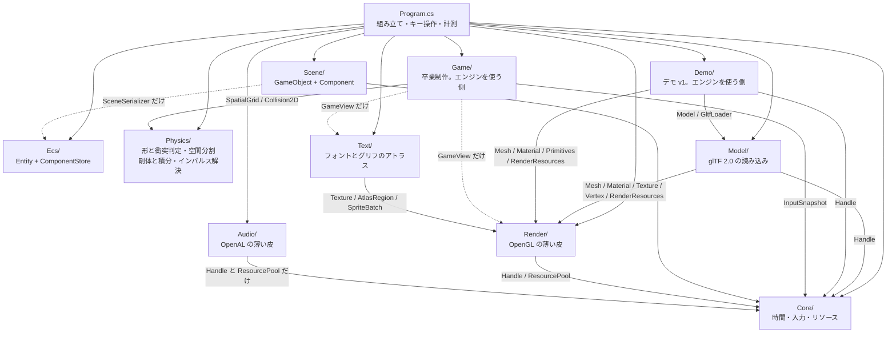
```mermaid
graph TD
    DM["Demo/<br/>デモ v1。エンジンを使う側"]
    G["Game/<br/>卒業制作。エンジンを使う側"]
    P["Program.cs<br/>組み立て・キー操作・計測"]
    S["Scene/<br/>GameObject + Component"]
    E["Ecs/<br/>Entity + ComponentStore"]
    PH["Physics/<br/>形と衝突判定・空間分割<br/>剛体と積分・インパルス解決"]
    T["Text/<br/>フォントとグリフのアトラス"]
    MD["Model/<br/>glTF 2.0 の読み込み"]
    R["Render/<br/>OpenGL の薄い皮"]
    A["Audio/<br/>OpenAL の薄い皮"]
    C["Core/<br/>時間・入力・リソース"]

    P --> DM
    P --> G
    P --> S
    P --> E
    P --> PH
    P --> T
    P --> MD
    P --> R
    P --> A
    P --> C
    MD -->|"Mesh / Material / Texture / Vertex / RenderResources"| R
    MD -->|"Handle"| C
    DM -->|"Mesh / Material / Primitives / RenderResources"| R
    DM -->|"Model / GltfLoader"| MD
    DM -->|"Handle"| C
    G -->|SpatialGrid / Collision2D| PH
    G -->|InputSnapshot| C
    G -.->|GameView だけ| T
    G -.->|GameView だけ| R
    S --> C
    S -.->|SceneSerializer だけ| E
    T -->|Texture / AtlasRegion / SpriteBatch| R
    R -->|Handle / ResourcePool| C
    A -->|Handle と ResourcePool だけ| C
```

**Day 43 でも層は増えていない**。増えたのは `Physics/` の中のクラス8つで、
矢印は1本も足していない——`Physics/` は今日も
**`System.Numerics` しか使わない、どこにも依存しない層**のまま。
物理エンジンは外の世界を知りたがる層なので、
ここが保たれているかは毎日確かめる価値がある(設計書の冒頭)。

**Day 40 でも層は増えていない**。増えたのは `Demo/` の中のクラス2つ
(`CameraPath` と `FeatureToggles`)だけで、矢印は1本も足していない。
`FeatureToggles` に至っては `Render` の型を1つも知らないので、
図の上では `Demo/` の箱の中に完全に収まっている。

**Day 39 で層が1つ増えた**。Phase 6 に入ってから8日間、
足したものは全部 `Render/` の中に収まっていたので、久しぶりの構造の変化になった。

`Demo/` は `Game/` とまったく同じ位置に入る——
**`Program` から呼ばれ、`Render` と `Model` と `Core` を使い、
誰からも知られていない**。「エンジンを使う側」の層が2つ並んだ形。

`Game/` との違いは、下に伸びる矢印の先。

| | 使うもの | 使わないもの |
|---|---|---|
| `Game/` | `Physics` / `Core`(+ `GameView` だけ `Text` と `Render`) | `Render` の 3D、`Model` |
| `Demo/` | `Render`(3D)/ `Model` / `Core` | `Physics` / `Ecs` / `Scene` / `Text` / `Audio` |

**両方とも `Scene/` を使っていない**のが今の姿。
ゲームは構造体の配列で足りていて(Day 29 の判断)、
デモは静止しているので階層が要らない。
`Scene/`(GameObject + Component)が本領を発揮するのは
**キャラクターが歩き回る Day 51** で、そこで初めて
「動くものだけが `Scene/` に載り、背景は `Demo/` のまま」という分業になる。

**Day 37 でもクラスの増減は無い**(`Ssao` は `Render/` の中)。
Phase 6 に入ってから7日間、層は8つのまま変わっていない——
`PostProcess` / `ShadowMap` / `EnvironmentMap` / `Ssao` はどれも
「`Render/` の中で、`GL` と `Framebuffer` と `Shader` しか知らないクラス」として収まった。
Day 25 で層を切り分けた配当が、いちばん機能を足した Phase でそのまま効いている。

**Day 34 でもクラスの増減は無い**(`SurfaceMaps` は `Render/` の中)。
層が増えないまま機能だけが積み上がるのは、
Day 25 で層を切り分けた配当が続いている、と読める。

**Day 33 でクラスの増減は無かった**(`ShadowMap` は `Render/` の中)。

**Day 32 で `Model/` が1つ増えた**。矢印の向きは変わっていない。

`Model/` は `Text/` とまったく同じ位置に入る——
**`Render/` の上に乗り、`Render/` からは知られていない**一方通行。
`Text/` がグリフを `Texture` に焼いて `SpriteBatch` に積むように、
`Model/` は glTF を `Mesh` と `Material` に変換する。
どちらも「素材の形式を、描画の言葉に翻訳する層」で、性格が揃っている。

**逆向き(`Render` が glTF を知っている)にしなかった**のが要点。
そうすると `Mesh` が「glTF から作られたか、コードで作られたか」を抱え込むことになり、
Day 41 で FBX を足したくなったときに `Render/` を触る羽目になる。
`Primitives`(コードで作る)と `GltfLoader`(ファイルから作る)が
**同じ `Mesh` を作る2つの入口**として並んでいるのが、今の形。

**Day 31 で矢印を1本直した**。層は Day 29 のままだが、
`Core` ⇔ `Render` の相互参照が `Render` → `Core` の一方通行になった——
`ResourceManager` を `Render/RenderResources` へ引っ越したのがそれ(下の「相互参照だった話」)。

`Core/` の中身を実際に調べると、`Silk.NET.OpenGL` を using しているファイルは1つも無い。
**いま `Core/` は本当に時間・入力・ハンドルだけの層**になっている。

後処理は `Render/` の中で閉じている。`PostProcess` が知っているのは
`GL` と `Framebuffer` と `Shader` と `RenderResources` だけで、
**シーンに何が入っているかを一切知らない**。だから
`Program` が「今日はゲームを描く」「今日はデモを描く」と切り替えても、
後処理側は1行も変わらない。

**Day 33 の `ShadowMap` は、この方針をそのまま踏襲している**。
持っているのは深度バッファと光源行列だけで、
「何を影として落とすか」は `Begin` と `End` の間で外から描いてもらう。

```csharp
_shadow.Begin(_lightDirection, _orbit.Target);
// ここで好きなものを _shadow.Draw(mesh, model) する
_shadow.End(width, height);
```

`PostProcess.Begin` / `End` と同じ形にしてあるので、
**「シーンを知らないパス」の作り方が2例そろった**ことになる。
2例あると形が見えてくるのがよいところで、
Day 37 の SSAO も Day 52 の G-Buffer も、この形で足せる。

**Day 37 の `Ssao` が、その予告どおりに入った**。

```csharp
_ssao.BeginGeometry(_camera);
// ここで好きなものを _ssao.Draw(mesh, model) する
_ssao.EndGeometry();
_ssao.Compute(_camera, width, height);
```

`ShadowMap` との違いは、`Begin` に渡すのが**光の向きではなくカメラ**であることと、
描き終えたあとに `Compute`(フルスクリーンのパス2枚)が続くこと。
形が同じなので、`Program` 側は影パスの真下にもう1本並べるだけで済んだ。

**これが Render To Texture のいちばんの配当**で、
画面全体に効く処理(影・SSAO・被写界深度・ディファード)は
今後すべてこの位置に差し込むことになる。

**`Game` から `Audio` への線が無い**のが Day 29 から見てほしいところ。
音は鳴るが、鳴らしているのは `Program` で、ゲームは
「弾を撃った」「敵が死んだ」を <c>OnEvent</c> で外へ投げるだけ。

```csharp
public Action<GameEvent, Vector2>? OnEvent { get; set; }
```

こうしておくと、**自己チェックで 600 秒ぶんを無音で回せる**。
`SurvivorGame` が直接 `_audio.Play` を呼んでいたら、
テストのたびにデバイスを開くことになり、
音の出ない環境ではそもそも動かせない。

同じ理由で `SurvivorGame` は `GameView` も知らない。
**状態を進めるものと、状態を見るもの**が分かれている(Day 19 の線)。

| 層 | 依存先 | 備考 |
|---|---|---|
| `Physics/` | **なし** | `System.Numerics` だけ。そのまま別プロジェクトへ持ち出せる。**Day 43 で剛体が入っても変わらず** |
| `Ecs/` | **なし** | 同上。Day 23 で「他に依存しないので先に5つ書ける」と書いたとおり |
| `Scene/` | `Core`(`InputSnapshot`)、`Ecs`(`SceneSerializer` のみ) | **描画を一切知らない**。`SpriteRenderer` は絵の種類と大きさを持つデータでしかない |
| `Render/` | `Core`(`Handle` / `ResourcePool`) | `RenderResources` が箱を借りる。**GL を触るのは全部この層** |
| `Text/` | `Render`(`Texture` / `AtlasRegion` / `SpriteBatch`) | **一方通行**。`Render` は `Text` を知らない |
| **`Model/`** | `Render`(`Mesh` / `Material` / `Texture` / `Vertex` / `RenderResources`)、`Core`(`Handle`) | **一方通行**。`Render` は glTF を知らない |
| `Audio/` | `Core`(`Handle` / `ResourcePool` **のみ**) | **一方通行**。`Core` は `Audio` を知らない |
| **`Game/`** | `Physics` / `Core`(入力)。描画側だけ `Render` と `Text` | **エンジンは `Game` を知らない**。窓も GL も音も知らない |
| `Core/` | **なし** | Day 31 の引っ越しで一方通行になった(下の「相互参照だった話」) |
| `Program.cs` | 全部 | 組み立て役。9500行あるが、その大半はデモ・計測・自己チェック |

`Game/` の中でも線が引いてある。

| ファイル | 知っていること | 知らないこと |
|---|---|---|
| `GameBalance` | プレイヤー・敵・湧き・経験値の数字 | 全部 |
| `Weapons` | 武器の成長カーブ(レベル → 性能) | ゲームの状態 |
| `UpgradeOption` | 選択肢の中身と、見せる文字 | 適用の仕方 |
| `SurvivorGame` | 形と当たり判定、空間分割、入力、成長 | 描画、音、窓、GL |
| `GameView` | スプライトの積み方、文字の出し方 | ゲームを進める方法(読むだけ) |

**`GameView` が状態を1文字も書き換えない**のは意図的で、
だから描画を丸ごと止めてもゲームは同じように進む。
自己チェックが窓を出さずに回せるのはこの性質のおかげ。

**`Text/` だけが他の層の上に乗っている**。
`Physics/` も `Audio/` も自分で完結していて、単体で別プロジェクトへ持ち出せるが、
`Text/` は `Render/` が無いと成立しない——グリフを置く先が `Texture` で、
積む先が `SpriteBatch` だから。

これは歪みではなく**素直な積み方**で、`Text` → `Render` の一方通行になっている。
逆向き(`SpriteBatch` が文字を知っている)にすると、
描画の中核が「文字とは何か」を抱え込むことになる。
`SpriteBatch` から見れば、文字は**ただの四角**でしかない。

**`Core` と `Render` が相互参照だった話**(Day 25 で見つけ、Day 31 で直した)。

`ResourceManager`(Core)が `Texture`(Render)を作り、
`Material`(Render)が `ResourceManager`(Core)を呼ぶ、という往復になっていた。
名前空間が `HonyaEngine` 1つなので動きはするが、
**アセンブリを分けようとした瞬間に破綻する**形だった。

直し方は Day 25 の設計書に書いたとおりで、
**`ResourcePool` と `Handle` だけを下層に残し、窓口は `Render/` へ上げる**。
Day 31 でそれを実行し、`Core/ResourceManager.cs` は `Render/RenderResources.cs` になった。
名前も変えたのは、中で持っているのが `Texture` と `Shader` だけ——
つまり全部 GL のもので、「全リソースの窓口」という名前が中身と合っていなかったため。

**Day 27 の判断**: 音を足すとき、この歪みを繰り返さないようにした。

音のリソースも「パスをキーにして使い回し、ハンドルで配る」という点でテクスチャと同じなので、
当時の `ResourceManager` に `LoadAudio` を足すのが自然に見える。
だがそうすると `ResourceManager`(= 当時は `Core`)が **GL と OpenAL の両方を握る**ことになり、
当時の相互参照が「`Core` ⇔ `Render` + `Core` ⇔ `Audio`」に増える。

そこで `AudioSystem` は、`Core` から**総称型の `ResourcePool<T>` と `Handle<T>` だけを借りて**、
音のリソースは自分で持つ形にした。`ResourcePool<T>` は `T` が何かを知らないので、
借りても依存が増えない。結果、`Audio/` → `Core/` の**一方通行**が保たれている。

図に描いておくと、こういう判断が「なんとなく」ではなくできるようになる。
**設計書は、次に何かを足すときのために書いている**。

### Core — 時間・入力・リソース(Day 45 で `GameAction` に `Jump` が増えた)

`GameAction` は `[Flags]` の `uint` なので 32 個までしか作れない。
Day 18 で `MoveLeft`〜`Dash` の5つを置いてから、今日ようやく6つ目。
**`Space` はデバッグ用の一時停止と衝突する**ので、
キャラクターデモの間だけ `Program.OnKeyDown` が横取りしている——
Day 18 に「本来はデバッグ用の入力を別のマップに分けるのが筋」と書いた宿題が、
今日ついに実害として出た形になる。

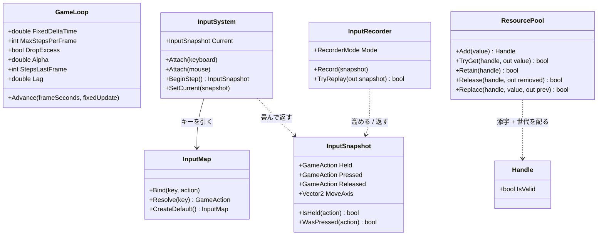
```mermaid
classDiagram
    class GameLoop {
        +double FixedDeltaTime
        +int MaxStepsPerFrame
        +bool DropExcess
        +double Alpha
        +int StepsLastFrame
        +double Lag
        +Advance(frameSeconds, fixedUpdate)
    }
    class InputSystem {
        +InputSnapshot Current
        +Attach(keyboard)
        +Attach(mouse)
        +BeginStep() InputSnapshot
        +SetCurrent(snapshot)
    }
    class InputMap {
        +Bind(key, action)
        +Resolve(key) GameAction
        +CreateDefault() InputMap
    }
    class InputSnapshot {
        +GameAction Held
        +GameAction Pressed
        +GameAction Released
        +Vector2 MoveAxis
        +IsHeld(action) bool
        +WasPressed(action) bool
    }
    class InputRecorder {
        +RecorderMode Mode
        +Record(snapshot)
        +TryReplay(out snapshot) bool
    }
    class Handle {
        +bool IsValid
    }
    class ResourcePool {
        +Add(value) Handle
        +TryGet(handle, out value) bool
        +Retain(handle) bool
        +Release(handle, out removed) bool
        +Replace(handle, value, out prev) bool
    }

    InputSystem --> InputMap : キーを引く
    InputSystem ..> InputSnapshot : 畳んで返す
    InputRecorder ..> InputSnapshot : 溜める / 返す
    ResourcePool ..> Handle : 添字 + 世代を配る
```

**`ResourceManager` がこの図から消えた**(Day 31 で `Render/RenderResources` へ引っ越した)。
実物は `Render` のクラス図のほうに載せてある。

`ResourcePool` と `Handle` は総称型(`ResourcePool<T>` / `Handle<T>`)。
`T` が何かを知らないまま添字と世代だけを管理するので、`Texture` にも `Shader` にも同じものが使える。
**`T` を知らないから下層に残せた**——引っ越しでこの2つだけ `Core/` に残したのはそのため。

この層で押さえるべき責務の線引き:

- **`GameLoop` は時間しか知らない**。何を更新するかは `Action<float>` で渡される
- **`InputSystem` はデバイスのイベントを畳むだけ**。ゲームとしての意味づけは `InputMap` が持つ
- **`InputSnapshot` は値**。だから記録・再生で丸ごと差し替えられる(Day 20 の肝)
- **`Core/` は GL を1行も知らない**。`Silk.NET.OpenGL` を using しているファイルが無い、が実際の姿

### Render — OpenGL の薄い皮(Day 46 で `Primitives` に地形が増えた)

**カプセルのメッシュは作っていない**。カプセルは半径と半分の高さで形が変わるので、
1本のメッシュを拡大して描くことができない(Y だけ引き伸ばすと半球が楕円に潰れる)。
代わりに**球2つ + 円柱1本**に分けて描く——
円柱は「XZ に半径、Y に高さ」という非一様な拡大でも円柱のままなので、
これなら<b>どんな寸法のカプセルでもメッシュ2本で描ける</b>(Day 45a の要点6)。

面白いのは、**この分け方が判定とぴったり同じ**であること。
`Collision3D` がカプセルの判定を球に落として解いているのと、
`Primitives` が円柱と球でカプセルを組み立てているのは、
同じ「線分 + 半径」の言い換えになっている。


```mermaid
classDiagram
    class Camera {
        +Vector3 Position
        +Vector3 Target
        +ProjectionMode Mode
        +float FieldOfView
        +float AspectRatio
        +Matrix4x4 ViewProjection
        +CreateScreen(width, height) Matrix4x4
    }
    class OrbitCameraController {
        +float Yaw
        +float Pitch
        +float Distance
        +Vector3 Target
        +Apply()
        +EyePosition(target, distance, yaw, pitch) Vector3$
    }
    class Shader {
        +Use()
        +SetInt(name, value)
        +SetVector3(name, value)
        +SetVector3Array(name, values)
        +SetVector4(name, value)
        +SetMatrix3(name, value)
        +SetMatrix4(name, value)
        +SetMatrix4Array(name, values)
        +TryReload() bool
    }
    class Texture {
        +uint Handle
        +int Width
        +int Height
        +bool HasMipmaps
        +FromFile(gl, path) Texture
        +DecodeFile(path) DecodedImage
        +FromPixels(gl, pixels, w, h, mipmaps, srgb) Texture
        +FromFloatPixels(gl, data, w, h, components) Texture
        +DecodeBytes(encoded) DecodedImage
        +CreateR8(gl, w, h) Texture
        +CreateTarget(gl, w, h, format) Texture
        +CreateDepthTarget(gl, w, h) Texture
        +UploadR8(x, y, w, h, coverage)
        +SetFilter(filter)
        +SetWrap(wrap)
        +Bind(unit)
    }
    class TextureWrap {
        <<enumeration>>
        Repeat
        ClampToEdge
        ClampToBorder
    }
    class RenderResources {
        +int MaxUploadsPerFrame
        +int PendingCount
        +Texture Placeholder
        +LoadTexture(path, mipmaps, srgb) Handle
        +LoadTextureFromMemory(key, bytes, mipmaps, srgb) Handle
        +LoadTextureFromPixels(key, rgba, w, h, mipmaps, srgb) Handle
        +LoadTextureAsync(path) Handle
        +LoadShader(vert, frag) Handle
        +Update()
        +GetTexture(handle) Texture
        +GetShader(handle) Shader
        +Retain(handle) bool
        +Release(handle) bool
    }
    class RenderTargetFormat {
        <<enumeration>>
        Rgba8
        Rgba16F
        R8
    }
    class Framebuffer {
        +Texture Color
        +Texture Depth
        +int Width
        +int Height
        +RenderTargetFormat Format
        +long ByteSize
        +CreateDepthOnly(gl, w, h) Framebuffer
        +Bind()
        +BindDefault(gl, w, h)
        +Resize(w, h)
        +SetFormat(format)
    }
    class ShadowMap {
        +bool Enabled
        +int Resolution
        +Framebuffer Target
        +Matrix4x4 LightSpaceMatrix
        +int PcfRadius
        +int TapCount
        +float DepthBias
        +bool SlopeBias
        +bool CullFrontFaces
        +float Radius
        +float WorldPerTexel
        +bool ShowMap
        +int DrawCalls
        +long ByteSize
        +Begin(lightDirection, center)
        +Draw(mesh, model, joints)
        +End(screenWidth, screenHeight)
        +Apply(shader, unit)
        +DrawDebug(screenWidth, screenHeight)
        +SetResolution(resolution)
    }
    class PostProcess {
        +RenderTargetFormat SceneFormat
        +bool BloomEnabled
        +ToneMapOperator ToneMap
        +PostDebugView DebugView
        +float Exposure
        +float BloomThreshold
        +float BloomIntensity
        +ColorGrade Grade
        +bool FxaaEnabled
        +FxaaQuality Quality
        +FxaaDebugView FxaaDebugView
        +float FxaaEdgeThreshold
        +float FxaaEdgeThresholdMin
        +float FxaaSpanMax
        +PostSplit Split
        +float SplitPosition
        +Framebuffer Scene
        +Framebuffer Ldr
        +int PassCount
        +long ByteSize
        +Begin(clearColor)
        +End(screenWidth, screenHeight)
        +EndToTarget(target)
        +SetFxaaQuality(quality)
        +Resize(w, h)
        +ReloadShaders()
    }
    class ColorGrade {
        +bool Enabled
        +float Temperature
        +float Tint
        +float Contrast
        +float Saturation
        +Vector3 Filter
        +GradePreset Preset
        +bool IsIdentity
        +Vector3 WhiteBalance
        +ApplyPreset(preset)
        +MarkCustom()
        +Apply(shader)
    }
    class GradePreset {
        <<enumeration>>
        Neutral
        Sunset
        Moonlight
        Bleach
        Monochrome
    }
    class FxaaQuality {
        <<enumeration>>
        Low
        Medium
        High
        Extreme
    }
    class FxaaDebugView {
        <<enumeration>>
        None
        Luma
        Edge
        Blend
    }
    class PostSplit {
        <<enumeration>>
        None
        Grade
        Fxaa
    }
    class ToneMapOperator {
        <<enumeration>>
        None
        Reinhard
        Aces
    }
    class PostDebugView {
        <<enumeration>>
        Final
        SceneOnly
        Bright
        Bloom
    }
    class TextureAtlas {
        +Texture Texture
        +FromFiles(gl, paths, padding) TextureAtlas
    }
    class AtlasRegion {
        +Texture Texture
        +Vector2 UvMin
        +Vector2 UvMax
    }
    class Material {
        +string Name
        +Handle Shader
        +Handle MainTexture
        +Vector4 Tint
        +Vector2 UvScale
        +Vector4 BaseColorFactor
        +float MetallicFactor
        +float RoughnessFactor
        +Handle MetallicRoughnessTexture
        +Handle NormalTexture
        +Handle OcclusionTexture
        +Handle EmissiveTexture
        +Vector3 EmissiveFactor
        +float NormalScale
        +Handle HeightTexture
        +float ParallaxScale
        +bool DoubleSided
        +string AlphaMode
        +Apply(resources)
    }
    class Mesh {
        +int VertexCount
        +int IndexCount
        +Draw()
        +ReadVertices() TVertex[]
        +ReadIndices() uint[]
        +Dispose()
    }
    class Vertex {
        +Vector3 Position
        +Vector2 TexCoord
        +Vector4 Color
        +Vector3 Normal
        +Vector4 Tangent
        +Vector4 Joints
        +Vector4 Weights
        +Attributes
    }
    class SurfaceMaps {
        <<static>>
        +int Size
        +float MortarWidth
        +CreateHeight() byte[]
        +CreateNormal(strength) byte[]
        +CreateBaseColor() byte[]
        -HeightAt(x, y) float
        -Noise(x, y, cells) float
        -Wrap(value, period) int
    }
    class SpriteVertex {
        +Vector2 Position
        +Vector2 TexCoord
        +uint Color
        +PackColor(color) uint
    }
    class VertexAttribute {
        +int ComponentCount
        +bool Normalized
        +int ByteSize
    }
    class SpriteBatch {
        +SpriteSortMode SortMode
        +int DrawCallCount
        +Begin(projection, sortMode)
        +Draw(texture, center, size, rotation, color, layer)
        +End()
    }
    class Primitives {
        +CreateQuad(gl) Mesh
        +CreateCube(gl) Mesh
        +CreateSphere(gl, slices, stacks) Mesh
        +CreateCylinder(gl, slices) Mesh
        +CreateHeightField(gl, heights, columns, rows, cellSize, uvScale) Mesh
    }
    class Pbr {
        <<static>>
        +float DielectricF0
        +float MinRoughness
        +Alpha(roughness, perceptual) float
        +DistributionGgx(nDotH, alpha) float
        +DirectK(roughness) float
        +GeometrySchlickGgx(nDotX, k) float
        +GeometrySmith(nDotV, nDotL, roughness) float
        +FresnelSchlick(cosTheta, f0) Vector3
        +F0Of(baseColor, metallic, dielectricF0) Vector3
        +Evaluate(n, v, l, baseColor, metallic, roughness) Vector3
        +IntegrateNdf(alpha, steps) double
        +Hammersley(i, count) Vector2
        +ImportanceSampleGgx(xi, n, alpha) Vector3
        +DirectionalAlbedo(n, v, baseColor, metallic, roughness) Vector3
        +IblK(roughness) float
        +GeometrySmithIbl(nDotV, nDotL, roughness) float
        +FresnelSchlickRoughness(cosTheta, f0, roughness) Vector3
        +IntegrateBrdf(nDotV, roughness, samples) Vector2
    }
    class CubeMap {
        +uint Handle
        +int Size
        +int MipLevels
        +long ByteSize
        +Create(gl, size, mipLevels) CubeMap
        +FullMipCount(size) int
        +EnableSeamless(gl)
        +FaceViews(eye) Matrix4x4[]
        +FaceProjection() Matrix4x4
        +Bind(unit)
        +GenerateMipmaps()
        +ReadFace(face, mip) float[]
    }
    class SkyImage {
        <<static>>
        +int Width
        +int Height
        +Create(sunDirection) float[]
        +Sample(direction, toSun) Vector3
        +IntegrateIrradiance(n, toSun, steps) Vector3
    }
    class HdrImage {
        <<static>>
        +Load(path) Result
        -ReadScanline(bytes, cursor, scanline, width, path)
        -ReadFlatScanline(bytes, cursor, scanline, width, path)
        -ReadLine(bytes, cursor) string
    }
    class HdrResult {
        <<record struct>>
        +float[] Pixels
        +int Width
        +int Height
        +float Exposure
    }
    class SkyAnalysis {
        <<static>>
        +DirectionAt(x, y, width, height) Vector3
        +Analyze(pixels, width, height, threshold) Result
        +RemoveSun(pixels, width, height, analysis) float[]
        -AngleTo(x, y, width, height, direction) float
    }
    class Sun {
        <<record struct>>
        +Vector3 Direction
        +Vector3 Irradiance
        +float SolidAngle
        +float AngularRadius
        +int PixelCount
        +float PeakLuminance
    }
    class SkyResult {
        <<record struct>>
        +Sun Sun
        +Vector3 TotalIrradiance
        +Vector3 SkyAverage
        +float SunShare
        +double SolidAngleSum
        +float Cutoff
        +int HalfFloatOverflow
    }
    class Screenshot {
        <<static>>
        +Save(gl, width, height, directory) string
        -WritePng(path, bottomUpRgb, width, height)
        -WriteChunk(stream, type, data)
        -Crc32(crc, data) uint
    }
    class EnvironmentMap {
        +int EnvironmentSize
        +int IrradianceSize
        +int PrefilterSize
        +int PrefilterMipCount
        +int BrdfLutSize
        +CubeMap Environment
        +CubeMap Irradiance
        +CubeMap Prefiltered
        +Texture BrdfLut
        +bool Enabled
        +bool SkyboxVisible
        +float Intensity
        +int SkyboxMip
        +bool UsePrefilter
        +bool ClampSkyToLdr
        +float SkyYaw
        +string SourceLabel
        +int SourceWidth
        +int SourceHeight
        +double BakeMilliseconds
        +long ByteSize
        +Bake(sunDirection, screenWidth, screenHeight)
        +BakeFromPixels(pixels, width, height, screenW, screenH, label)
        +Apply(shader)
        +DrawSkybox(camera, restoreDepthTest, restoreCulling)
    }

    class Ssao {
        +int MaxSamples
        +int NoiseSize
        +bool Enabled
        +float Radius
        +float Bias
        +float Strength
        +float Power
        +int SampleCount
        +bool BlurEnabled
        +bool HalfResolution
        +bool ApplyToDirectLight
        +SsaoDebugView DebugView
        +Framebuffer Geometry
        +Framebuffer Result
        +long ByteSize
        +BeginGeometry(camera)
        +Draw(mesh, model, joints)
        +EndGeometry()
        +Compute(camera, w, h)
        +Apply(shader, unit)
        +DrawDebug(w, h, depthRange)
        +Resize(w, h)
        +SetHalfResolution(half)
    }
    class SsaoDebugView {
        <<enumeration>>
        None
        Occlusion
        Normal
        Depth
    }

    OrbitCameraController --> Camera : 球面座標で位置を書く
    Material ..> Shader : ハンドル経由
    Material ..> Texture : ハンドル経由
    Mesh ..> VertexAttribute : ストライドとオフセットを組む
    Vertex ..> VertexAttribute
    SpriteVertex ..> VertexAttribute
    Mesh ..> Vertex : 型引数
    Primitives ..> Mesh : 作る
    TextureAtlas *-- AtlasRegion
    TextureAtlas *-- Texture : 1枚に詰める
    SpriteBatch --> Shader
    SpriteBatch ..> SpriteVertex : 積む
    SpriteBatch ..> AtlasRegion : UV を受け取る
    Framebuffer *-- Texture : 描き込み先として所有
    Framebuffer ..> RenderTargetFormat
    Texture ..> TextureWrap
    PostProcess *-- Framebuffer : 5枚(シーン / 明部 / ぼかし2 / LDR)
    PostProcess *-- ColorGrade : つまみを所有
    PostProcess ..> Shader : 明部 / ぼかし / 合成 / FXAA
    PostProcess ..> ToneMapOperator
    PostProcess ..> PostDebugView
    PostProcess ..> FxaaQuality
    PostProcess ..> FxaaDebugView
    PostProcess ..> PostSplit
    PostProcess ..> RenderResources : シェーダを借りる
    ColorGrade ..> GradePreset
    ColorGrade ..> Shader : uniform を送る
    ShadowMap *-- Framebuffer : 深度専用を1枚
    ShadowMap ..> RenderResources : シェーダを借りる
    ShadowMap ..> Camera : 正射影行列を借りる
    ShadowMap ..> Shader : 深度 / 表示
    RenderResources ..> Texture : 作る / 配る
    RenderResources ..> Shader : 作る / 配る
    SurfaceMaps ..> RenderResources : 焼いたバイト列を預ける
    EnvironmentMap *-- CubeMap : 環境 / 放射照度 / 事前フィルタ の3枚
    EnvironmentMap *-- Texture : 元の正距円筒 と BRDF の表
    EnvironmentMap ..> RenderResources : シェーダを借りる
    EnvironmentMap ..> SkyImage : 空を焼いてもらう
    HdrImage ..> HdrResult : 返す
    SkyAnalysis ..> SkyResult : 返す
    SkyResult *-- Sun
    EnvironmentMap ..> Camera : 空を描くときのビュー射影
    EnvironmentMap ..> Primitives : 焼く用の立方体
    Ssao *-- Framebuffer : 幾何 1枚 + 遮蔽 2枚
    Ssao *-- Texture : 4x4 のノイズ
    Ssao ..> RenderResources : シェーダを借りる
    Ssao ..> Camera : ビュー行列と射影行列を読む
    Ssao ..> Shader : 幾何 / 遮蔽 / ぼかし / 表示
    Ssao ..> SsaoDebugView
    Ssao ..> RenderTargetFormat : R8 と Rgba16F
```

**`Ssao` の矢印は `ShadowMap` とほぼ同じ形**をしている。
違いは `Framebuffer` を3枚持つことと、`Texture` を自分で1枚作ること
(ノイズ。`RenderResources` に預けないのは、ファイルから来たものではないうえ、
このクラス以外が使うことが無いため)。

**`EnvironmentMap` だけが生の FBO を持っている**(Day 36 の歪み)のに対し、
`Ssao` は `Framebuffer` で足りている。キューブマップの面を挿す必要が無く、
ふつうの 2D テクスチャに描くだけだから。

**Day 39 で足した3つには矢印がほとんど無い**。これは図が手抜きなのではなく、
`HdrImage` と `SkyAnalysis` が**この層の他の誰も知らない**ため。
入口は `float[]`、出口も `float[]` か構造体だけで、
`GL` にも `Shader` にも `Texture` にも触らない。
`Screenshot` だけが `GL` を1回呼ぶ(`glReadPixels`)。

つないでいるのは `Program` で、

```csharp
HdrImage.Result image = HdrImage.Load(path);              // 読む
_skyAnalysis = SkyAnalysis.Analyze(image.Pixels, w, h);   // 測る
float[] pixels = SkyAnalysis.RemoveSun(image.Pixels, ...); // 抜く
_env.BakeFromPixels(pixels, w, h, ...);                    // 焼く
```

の4行だけ。**この並べ替えは `Program` の仕事**という線を引いてある。
`EnvironmentMap` が `.hdr` のパスを受け取る形にもできるが、
そうすると「太陽を抜くかどうか」「空を何度回すか」まで
環境マップが決めることになり、Day 36 で守った
「このクラスはシーンを知らない」が崩れる。

**`SkyAnalysis.DirectionAt` と `SkyImage.Create` は同じ式でなければならない**
(正距円筒 → 方向の変換)。コード上の依存は無いので、
図には線が引けない代わりに両方のコメントに相手を書いてある。
片方だけ直すと、手で焼いた空と読み込んだ HDRI で**太陽が別の場所に出る**——
しかも方位のずれは絵から気づけない。

**`Pbr` はどこからも矢印が出ていない**。これは描き忘れではなく、
**依存が1本も無い**ことをそのまま表している——
`GL` も `Handle` も `Material` も知らず、入力は `Vector3` と `float` だけ。

呼ぶのは `Program.RunPbrCheck` だけで、**本番の描画からは1度も呼ばれない**。
同じ式が `textured.frag` にあり、そちらが毎フレーム数百万回走る。

「同じものを2か所に書く」のは普段なら避けるべきだが、今日は取った。

| | GLSL 側(`textured.frag`) | C# 側(`Pbr`) |
|---|---|---|
| 役割 | **本番**。1フレームに数百万回 | **定義と検算**。押したときだけ |
| 確かめられること | 絵になった結果だけ | **半球を 8192 点に刻んだ積分** |
| 直したとき動くもの | 見た目 | 自己チェックの数字 |

GPU の中は覗けないので、「D の積分が 1 か」「入ってきた以上の光を返していないか」を
確かめる場所が CPU 側に要る。式が数行で、しかも**この先動かない**(物理の定義)ので、
二重管理の代償より検算できる価値のほうが大きいと判断した。

**片方だけ直す**のがいちばん怖い壊し方なので、自己チェックの最後で
`textured.frag` を実際に読んで、共有している定数(`MIN_ROUGHNESS`)と
`α = roughness²` の式が両方に入っていることを見ている。
値そのものは突き合わせられないが、**「同じ約束でいるか」は機械で確かめられる**。

**`Pbr` に IBL 用が4つ増えた**(Day 36)。
`GeometrySmithIbl` は `GeometrySmith` と **k だけが違う**——
直接光は `(r+1)²/8`、IBL は `α/2`。同じ幾何減衰なのに係数が2通りあるのは、
Day 35 の要点5 で触れた「理屈と当てはめのつぎはぎ」がそのまま出ているところ。
**取り違えると金属の縁が暗くなりすぎる**が、症状が地味なので気づきにくい。

`IntegrateBrdf` は Day 35 の `DirectionalAlbedo` とほとんど同じ積分で、
違うのは<b>フレネルを2つに割る</b>ことだけ。
Day 35 の計画書で「Day 36 の LUT がまさにそれ」と書いた回収になっている。

**`CubeMap` が抱えているのは「GL の約束」**(Day 36)。
面の並び、上下反転、90 度の画角、シームレス——
どれも**知らないと必ず踏む**が、一度書けば二度と考えたくない類のもの。
1つのクラスに閉じ込めておくと、
読む側(空・本描画・事前フィルタ)が素直に書ける。

**`SkyImage` は `SurfaceMaps`(Day 34)と同じ形**をしている。
GL を1行も知らず、返すのはただの配列で、テクスチャにするのは呼ぶ側の仕事。
違いは `byte[]` ではなく `float[]` なこと——**1.0 を超える値を運ぶ**ため。

そしてもう1つ、`SurfaceMaps` に無かったものを持っている:
<b>同じ関数を積分する CPU 版</b>(`IntegrateIrradiance`)。
GPU が焼いた放射照度が正しいかは絵からは判定できないので、
**答えを2通りの方法で出して突き合わせる**ために置いてある。
Day 35 で `Pbr` を CPU にも持った判断の、そのまま2例目になる。

**`Primitives` に球が入った**のは、材質を見比べる形が球しかないため。
立方体は面ごとに法線が一定なので、1つの面の中でハイライトが動かない——
粗さを変えても広がりが見えず、金属度の効きも読み取れない。
球は**法線があらゆる向きを1個の中で通る**ので、
フレネル(縁ほど明るい)も粗さ(ハイライトの広がり)も1個に全部出る。

そして球は、**接線を手で決められない最初の形**でもある。
板と立方体は「左下 → 右下 が U」と目で追えたが、曲面では
`∂P/∂u` を実際に計算するしかない。その結果 **`w` が -1 になる**——
Day 34 で入れた「符号1個を持つ」仕組みが、ここではじめて -1 の側で使われる。

**Day 28 で `Texture` に足したのは2つだけ**。
`CreateR8` が1チャンネルの空テクスチャを作り、`UploadR8` がその一部を書き換える。
どちらもグリフのために足したものだが、**`Texture` はグリフを知らない**——
「1チャンネル」「一部だけ更新」という一般の機能として置いてある。
同じものが Phase 6 のシャドウマップ(Day 33)でも要る。

**Day 32 で `Vertex` に法線が戻った**。Day 9 でソフトウェアラスタライザに持たせ、
Day 14 で GPU へ移したときに落としていたもの。陰影を付けていなかったので要らなかったが、
glTF のモデルは必ず持っているので、**無いと読んだデータの一部を捨てることになる**。

**末尾に足した**ので location は 0〜2 が動かず、既存のシェーダは無傷で済んだ。
位置の次に置くほうが意味の並びとしては素直だが、
そのために `sprite.vert` まで書き換える理由は無い。

**Day 34 で接線が同じやり方で足された**(location 4)。
2回続けて末尾に足せたので、この置き方は当たりだったと言える。
1頂点 64 バイトになり、DamagedHelmet で 930KB。

**`Vector4` なのは glTF の仕様に合わせたから**で、
w には ±1 しか入らない(要点3)。
「3本目の軸を持たずに済ませるための符号1個」がそのままフィールドになっている。

**`depth.vert`(Day 33)は無傷**なのも見どころ。
あちらは location 0 しか宣言していないので、
属性が4本になろうと5本になろうと影響を受けない。
**宣言しない自由**があるから、末尾に足す戦略が効き続けている。

**`SurfaceMaps` が GL を1行も知らない**のが、この層で新しい置き方。
返すのはただの `byte[]` で、テクスチャにするのは `RenderResources` の仕事になる。

```
SurfaceMaps.CreateNormal()  →  byte[]  →  RenderResources.LoadTextureFromPixels()  →  Handle
```

分けてあるので**スレッドを選ばない**(Day 21 の `Texture.DecodeFile` と同じ性質)。
起動時に3枚焼くだけなので今は同期でよいが、
枚数が増えたらそのまま `Task.Run` へ載せられる形になっている。

`Texture.FromPixels` を直接呼ばずに窓口を通すのは、
**寿命の管理とキャッシュを1箇所に残す**ため。
ここを通さずに `new` すると、そのテクスチャだけ `Dispose` の対象から外れる。

**`Mesh.ReadVertices` は「持たない」ほうへ倒した結果**(Day 34)。
自己チェックで頂点の中身を見たいが、CPU 側に控えを持つと
DamagedHelmet だけで 930KB を**使うかどうか分からないのに常に払う**。
GPU から読み返す(`glGetBufferSubData`)なら払うのは呼んだときだけで済む。
代わりに**遅い**(描画キューが空になるまで待つ)ので、検査専用の窓口になっている。

当たり判定やレイキャストで頂点が要り用になる Phase 7 で、
「持つ」へ倒し直すことを考えればよい。

**`Material` が急に太った**のが Day 32 でいちばん目に付く差分で、
これは glTF の材質定義をそのまま写したから。
「シェーダ + そのシェーダに渡す値」という Day 15 からの位置づけは変わっていない——
渡す値の種類が、仕様に合わせて増えただけになる。

**Day 31 で足したのは `CreateTarget` 1つ**。同じ理屈で、
`Texture` は「これがレンダーターゲットである」ことを知らない。
中身を渡さずに場所だけ確保し、ミップマップを作らず、ClampToEdge にする——
それだけの機能として置いてあるので、
影(Day 33)でも環境マップ(Day 36)でも G-Buffer(Day 52)でも同じものが使える。

**Day 33 で足したのは `CreateDepthTarget` 1つ**。
`CreateTarget` との違いは3つとも影のための必然になっている。

| | `CreateTarget`(Day 31) | `CreateDepthTarget`(Day 33) |
|---|---|---|
| 内部形式 | RGBA8 / RGBA16F | **DepthComponent24** |
| フィルタ | Linear | **Nearest**(深度を平均しても意味が無い。要点6) |
| ラップ | ClampToEdge | **ClampToBorder + 白**(箱の外は「遮るものなし」) |

`Texture` が「これがシャドウマップである」ことを知らないのは同じで、
Day 37 の SSAO が深度を読むときも、そのまま同じものが使える。

**`Framebuffer` が3つ目の形を持った**。
Day 31 の「カラーテクスチャ + 深度レンダーバッファ」に加えて、
**カラーを1枚も持たない**形が入った。
`Depth` プロパティが深度専用のときだけ入るので、
**「読むならテクスチャ、読まないならレンダーバッファ」の区別がそのまま型に出る**。

**`ShadowMap` が `Camera` を借りている**のが、この層で新しい関係。
光の正射影行列は `Camera.CreateOrthographic` がそのまま使える——
「カメラ」という名前だが中身は**投影行列の作り方の置き場**なので、
光の目に使っても筋が通る。Day 14 で `static` メソッドとして切り出しておいた形が効いた。

**`Framebuffer` が `Texture` を所有している**のは、今までの `Render/` に無かった関係。
`Material` は「持たない(ハンドルだけ)」で通してきたが、
フレームバッファのカラーアタッチメントは
**そのフレームバッファと同じ大きさ・同じ形式でなければならない**ので、
外から差し替えられると壊れる。**所有すべきものは所有する**。

**`PostProcess` と `ShadowMap` はシェーダだけ `RenderResources` に預けている**。
バッファ(4枚 / 1枚)は自分で持ち、シェーダは借りる——
シェーダは F5 でリロードしたいので、管理の窓口に載せておく必要がある。

**バッファを所有し、シェーダを借りる**——この分担が2クラスで一致しているのは偶然ではなく、
「大きさや形式に強い制約があるものは所有、共有して使い回すものは借りる」という
Day 21 からの線がそのまま出ている。

**`Material` が何も所有していない**のは Day 15 から一貫している(Day15.md の要点2)。
持っているのはハンドルだけで、実体の寿命は `RenderResources` にある。

**3D の道(`Mesh` + `Material`)と 2D の道(`SpriteBatch`)が並列**なのも見てのとおりで、
両者は `Shader` と `Texture` を共有しているだけで互いを知らない。
`Mesh` は「形が決まっていて毎フレーム変わらないもの」、
`SpriteBatch` は「毎フレーム頂点を作り直すもの」という使い分けになっている。

### Scene — GameObject + Component

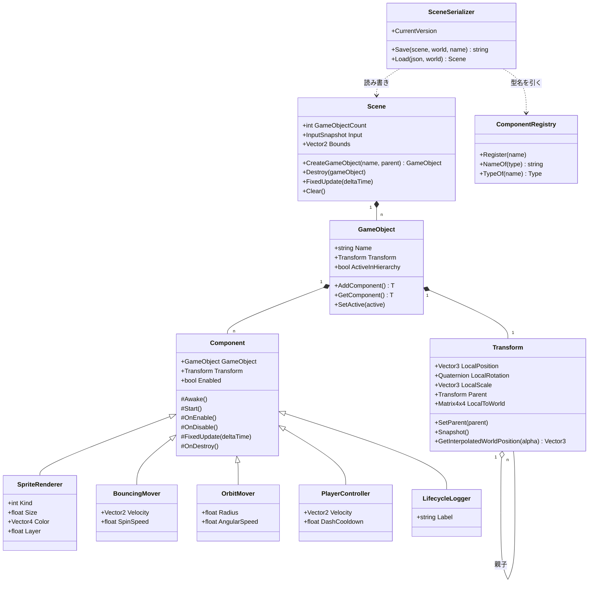
```mermaid
classDiagram
    class Scene {
        +int GameObjectCount
        +InputSnapshot Input
        +Vector2 Bounds
        +CreateGameObject(name, parent) GameObject
        +Destroy(gameObject)
        +FixedUpdate(deltaTime)
        +Clear()
    }
    class GameObject {
        +string Name
        +Transform Transform
        +bool ActiveInHierarchy
        +AddComponent() T
        +GetComponent() T
        +SetActive(active)
    }
    class Transform {
        +Vector3 LocalPosition
        +Quaternion LocalRotation
        +Vector3 LocalScale
        +Transform Parent
        +Matrix4x4 LocalToWorld
        +SetParent(parent)
        +Snapshot()
        +GetInterpolatedWorldPosition(alpha) Vector3
    }
    class Component {
        +GameObject GameObject
        +Transform Transform
        +bool Enabled
        #Awake()
        #Start()
        #OnEnable()
        #OnDisable()
        #FixedUpdate(deltaTime)
        #OnDestroy()
    }
    class SpriteRenderer {
        +int Kind
        +float Size
        +Vector4 Color
        +float Layer
    }
    class BouncingMover {
        +Vector2 Velocity
        +float SpinSpeed
    }
    class OrbitMover {
        +float Radius
        +float AngularSpeed
    }
    class PlayerController {
        +Vector2 Velocity
        +float DashCooldown
    }
    class LifecycleLogger {
        +string Label
    }
    class ComponentRegistry {
        +Register(name)
        +NameOf(type) string
        +TypeOf(name) Type
    }
    class SceneSerializer {
        +CurrentVersion
        +Save(scene, world, name) string
        +Load(json, world) Scene
    }

    Scene "1" *-- "n" GameObject
    GameObject "1" *-- "1" Transform
    GameObject "1" *-- "n" Component
    Transform "1" o-- "n" Transform : 親子
    Component <|-- SpriteRenderer
    Component <|-- BouncingMover
    Component <|-- OrbitMover
    Component <|-- PlayerController
    Component <|-- LifecycleLogger
    SceneSerializer ..> Scene : 読み書き
    SceneSerializer ..> ComponentRegistry : 型名を引く
```

`Transform` だけが `GameObject` の固定メンバーで、ほかは全部 `Component` として付け外しする
(Day 22 の要点2)。`SceneSerializer` が `ComponentRegistry` を経由するのは、
**JSON の文字列から直接 `Type` を作らせない**ため(Day 24 の要点2)。

### Ecs と Physics — どこにも依存しない2つ(今日 `Physics` に地形が入った)

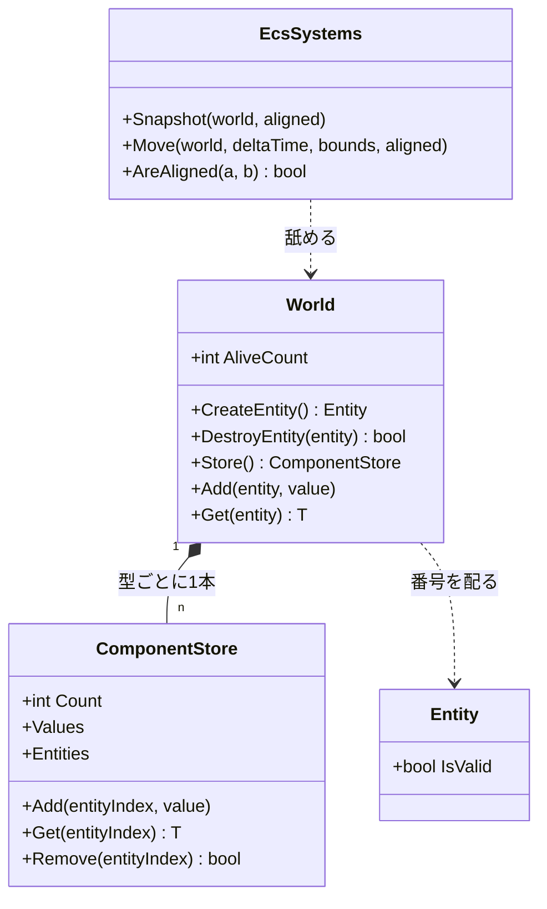
```mermaid
classDiagram
    class Entity {
        +bool IsValid
    }
    class World {
        +int AliveCount
        +CreateEntity() Entity
        +DestroyEntity(entity) bool
        +Store() ComponentStore
        +Add(entity, value)
        +Get(entity) T
    }
    class ComponentStore {
        +int Count
        +Values
        +Entities
        +Add(entityIndex, value)
        +Get(entityIndex) T
        +Remove(entityIndex) bool
    }
    class EcsSystems {
        +Snapshot(world, aligned)
        +Move(world, deltaTime, bounds, aligned)
        +AreAligned(a, b) bool
    }

    World "1" *-- "n" ComponentStore : 型ごとに1本
    World ..> Entity : 番号を配る
    EcsSystems ..> World : 舐める
```

#### 2D の側(Day 26。Day 43 から4日続けて1文字も変わっていない)

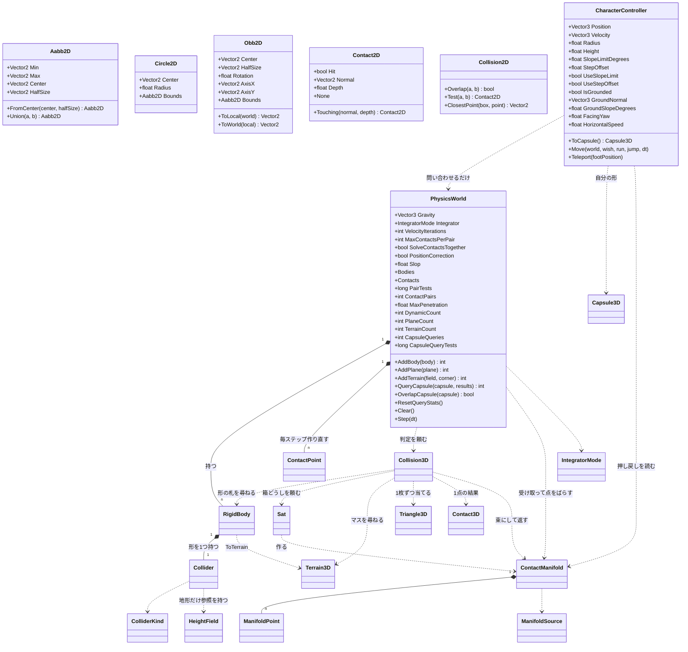
```mermaid
classDiagram
    class Aabb2D {
        +Vector2 Min
        +Vector2 Max
        +Vector2 Center
        +Vector2 HalfSize
        +FromCenter(center, halfSize) Aabb2D
        +Union(a, b) Aabb2D
    }
    class Circle2D {
        +Vector2 Center
        +float Radius
        +Aabb2D Bounds
    }
    class Obb2D {
        +Vector2 Center
        +Vector2 HalfSize
        +float Rotation
        +Vector2 AxisX
        +Vector2 AxisY
        +Aabb2D Bounds
        +ToLocal(world) Vector2
        +ToWorld(local) Vector2
    }
    class Contact2D {
        +bool Hit
        +Vector2 Normal
        +float Depth
        +None
        +Touching(normal, depth) Contact2D
    }
    class Collision2D {
        +Overlap(a, b) bool
        +Test(a, b) Contact2D
        +ClosestPoint(box, point) Vector2
    }
    class PhysicsWorld {
        +Vector3 Gravity
        +IntegratorMode Integrator
        +int VelocityIterations
        +int MaxContactsPerPair
        +bool SolveContactsTogether
        +bool PositionCorrection
        +float Slop
        +Bodies
        +Contacts
        +long PairTests
        +int ContactPairs
        +float MaxPenetration
        +int DynamicCount
        +int PlaneCount
        +int TerrainCount
        +int CapsuleQueries
        +long CapsuleQueryTests
        +AddBody(body) int
        +AddPlane(plane) int
        +AddTerrain(field, corner) int
        +QueryCapsule(capsule, results) int
        +OverlapCapsule(capsule) bool
        +ResetQueryStats()
        +Clear()
        +Step(dt)
    }
    class CharacterController {
        +Vector3 Position
        +Vector3 Velocity
        +float Radius
        +float Height
        +float SlopeLimitDegrees
        +float StepOffset
        +bool UseSlopeLimit
        +bool UseStepOffset
        +bool IsGrounded
        +Vector3 GroundNormal
        +float GroundSlopeDegrees
        +float FacingYaw
        +float HorizontalSpeed
        +ToCapsule() Capsule3D
        +Move(world, wish, run, jump, dt)
        +Teleport(footPosition)
    }

    PhysicsWorld "1" *-- "n" RigidBody : 持つ
    PhysicsWorld "1" *-- "n" ContactPoint : 毎ステップ作り直す
    PhysicsWorld ..> Collision3D : 判定を頼む
    PhysicsWorld ..> ContactManifold : 受け取って点をばらす
    PhysicsWorld ..> IntegratorMode
    RigidBody "1" *-- "1" Collider : 形を1つ持つ
    Collider ..> ColliderKind
    Collider ..> HeightField : 地形だけ参照を持つ
    RigidBody ..> Terrain3D : ToTerrain
    Collision3D ..> RigidBody : 形の札を尋ねる
    Collision3D ..> Sat : 箱どうしを頼む
    Collision3D ..> Terrain3D : マスを尋ねる
    Collision3D ..> Triangle3D : 1枚ずつ当てる
    Collision3D ..> Contact3D : 1点の結果
    Collision3D ..> ContactManifold : 束にして返す
    Sat ..> ContactManifold : 作る
    ContactManifold "1" *-- "n" ManifoldPoint
    ContactManifold ..> ManifoldSource
    CharacterController ..> PhysicsWorld : 問い合わせるだけ
    CharacterController ..> Capsule3D : 自分の形
    CharacterController ..> ContactManifold : 押し戻しを読む
```

**4日ぶんの変化を並べる**とこうなる。

| | Day 43 | Day 44 | Day 45 | Day 46a |
|---|---|---|---|---|
| 形の持ち方 | `RigidBody.Radius` | 札 + 寸法 | 札が4つに | **札が5つ。はじめて参照を持つ** |
| 平面 | 別のリスト | 形の1つ | 同じ | 同じ |
| 判定の戻り値 | `Contact3D` | `ContactManifold` | 同じ | 同じ |
| 世界への入口 | `Step(dt)` | 同じ | `QueryCapsule` が増えた | 同じ |
| 候補の作り方 | 総当たり | 総当たり | 総当たり | 総当たり(**Day 46b で格子**) |
| 動くもの | `RigidBody` | 同じ | `CharacterController` が外から | 同じ |

**2D 側との性格の違い**も更新しておく。

| | 2D(Day 26) | 3D(Day 43〜46) |
|---|---|---|
| 形 | `readonly struct` | 同じ(**`HeightField` だけ `class`**) |
| 判定 | `static` メソッドだけ | 同じ(ただし `Collide` は体を見る) |
| **状態** | `SpatialGrid` だけが持つ | `RigidBody` / `PhysicsWorld` / `CharacterController` |
| **時間** | 出てこない | `Step(dt)` と `Move(..., dt)` が中心 |

### 箱と箱が当たるまで — 15 本の軸と、2つの分かれ道

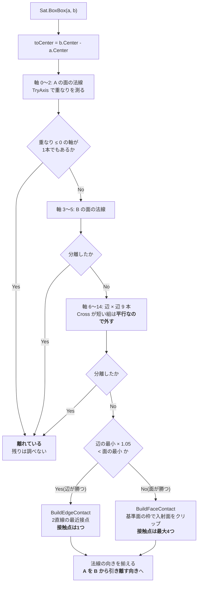
```mermaid
flowchart TD
    S["Sat.BoxBox(a, b)"] --> T["toCenter = b.Center - a.Center"]
    T --> FA["軸 0〜2: A の面の法線<br/>TryAxis で重なりを測る"]
    FA --> SEP1{"重なり ≤ 0 の軸が<br/>1本でもあるか"}
    SEP1 -->|Yes| OUT["<b>離れている</b><br/>残りは調べない"]
    SEP1 -->|No| FB["軸 3〜5: B の面の法線"]
    FB --> SEP2{"分離したか"}
    SEP2 -->|Yes| OUT
    SEP2 -->|No| EE["軸 6〜14: 辺 × 辺 9 本<br/>Cross が短い組は<b>平行なので外す</b>"]
    EE --> SEP3{"分離したか"}
    SEP3 -->|Yes| OUT
    SEP3 -->|No| PICK{"辺の最小 × 1.05<br/>&lt; 面の最小 か"}
    PICK -->|"Yes(辺が勝つ)"| EDGE["BuildEdgeContact<br/>2直線の最近接点<br/><b>接触点は1つ</b>"]
    PICK -->|"No(面が勝つ)"| FACE["BuildFaceContact<br/>基準面の枠で入射面をクリップ<br/><b>接触点は最大4つ</b>"]
    EDGE --> N["法線の向きを揃える<br/><b>A を B から引き離す向き</b>へ"]
    FACE --> N
```

**分かれ道が2つ**あるのが読みどころ。
1つ目は「どこかで分離したか」——15 本のどれか1本で隙間が見つかれば、そこで終わる。
2つ目は「面と辺のどちらが最小か」——ここで**接触点の作り方がまるごと変わる**。

`1.05` の下駄は、ほぼ平行な辺の外積が数値誤差で揺れるのを避けるためのもの
(Day 44b の要点1)。これを 1.0 にすると、床に置いた箱が
「面で4点」と「辺で1点」の間を行き来して震え出す。

### 接触点が4つできるまで — 基準面と入射面

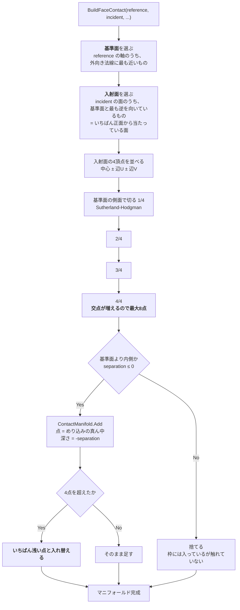
```mermaid
flowchart TD
    A["BuildFaceContact(reference, incident, ...)"] --> R["<b>基準面</b>を選ぶ<br/>reference の軸のうち、<br/>外向き法線に最も近いもの"]
    R --> I["<b>入射面</b>を選ぶ<br/>incident の面のうち、<br/>基準面と最も逆を向いているもの<br/>= いちばん正面から当たっている面"]
    I --> P["入射面の4頂点を並べる<br/>中心 ± 辺U ± 辺V"]
    P --> C1["基準面の側面で切る 1/4<br/>Sutherland-Hodgman"]
    C1 --> C2["2/4"]
    C2 --> C3["3/4"]
    C3 --> C4["4/4<br/><b>交点が増えるので最大8点</b>"]
    C4 --> F{"基準面より内側か<br/>separation ≤ 0"}
    F -->|No| DROP["捨てる<br/>枠には入っているが触れていない"]
    F -->|Yes| ADD["ContactManifold.Add<br/>点 = めり込みの真ん中<br/>深さ = -separation"]
    ADD --> LIM{"4点を超えたか"}
    LIM -->|Yes| SWAP["<b>いちばん浅い点と入れ替える</b>"]
    LIM -->|No| KEEP["そのまま足す"]
    SWAP --> E["マニフォールド完成"]
    KEEP --> E
    DROP --> E
```

**「入射面を基準面の枠で切る」で重なりが出る**のがこの図の要点。
床の上に箱をまるごと置けば4頂点がそのまま残り、
床から半分はみ出せば、はみ出した2点が切り落とされて
**代わりに床の縁の上に新しい2点が生まれる**。

<b>クリップで1点も残らないことがある</b>(ごく浅い接触や数値誤差)。
そのときは相手のいちばん突き出た点1つで代用している——
**接触を落とすと物が沈む**ので、0点で返すよりましだという判断。

### 剛体が1ステップ進むまで — 5段と、それぞれが書き換えるもの

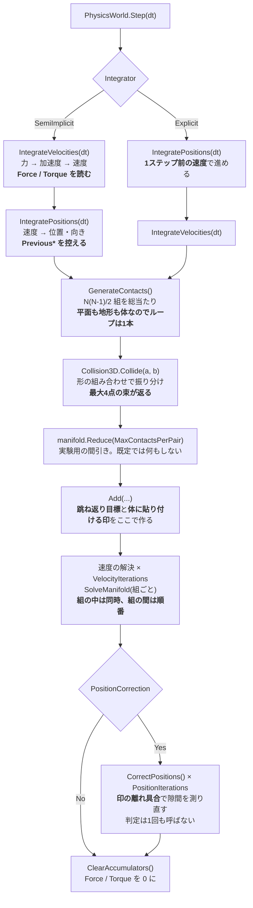
```mermaid
flowchart TD
    S["PhysicsWorld.Step(dt)"] --> I{"Integrator"}
    I -->|SemiImplicit| SV["IntegrateVelocities(dt)<br/>力 → 加速度 → 速度<br/><b>Force / Torque を読む</b>"]
    SV --> SP["IntegratePositions(dt)<br/>速度 → 位置・向き<br/><b>Previous* を控える</b>"]
    I -->|Explicit| EP["IntegratePositions(dt)<br/><b>1ステップ前の速度</b>で進める"]
    EP --> EV["IntegrateVelocities(dt)"]

    SP --> G["GenerateContacts()<br/>N(N-1)/2 組を総当たり<br/><b>平面も地形も体なのでループは1本</b>"]
    EV --> G
    G --> CO["Collision3D.Collide(a, b)<br/>形の組み合わせで振り分け<br/><b>最大4点の束が返る</b>"]
    CO --> RD["manifold.Reduce(MaxContactsPerPair)<br/>実験用の間引き。既定では何もしない"]
    RD --> A["Add(...)<br/><b>跳ね返り目標</b>と<b>体に貼り付ける印</b>をここで作る"]
    A --> V["速度の解決 × VelocityIterations<br/>SolveManifold(組ごと)<br/><b>組の中は同時、組の間は順番</b>"]
    V --> PC{"PositionCorrection"}
    PC -->|Yes| CP["CorrectPositions() × PositionIterations<br/><b>印の離れ具合</b>で隙間を測り直す<br/>判定は1回も呼ばない"]
    PC -->|No| CL
    CP --> CL["ClearAccumulators()<br/>Force / Torque を 0 に"]
```

**書き換えるものが段ごとに分かれている**のは Day 43 のまま。

| 段 | 読むもの | 書くもの |
|---|---|---|
| 積分 | `Force` / `Torque` / `Gravity` | 速度、位置、向き、`Previous*` |
| 判定 | 位置、向き、形、速度 | 接触の配列 + **組の区切り** |
| 速度の解決 | 接触、速度 | **速度だけ** |
| 位置の補正 | 接触、位置、向き | **位置だけ** |

**組の区切り(`_manifolds`)は Day 44a で増えたもの**。接触点は組ごとに続けて並んでいるので、
「どこからどこまでが同じ組か」さえ覚えておけば、
速度の解決で4点をまとめて扱える。

### インパルスが決まるまで — 組の中は同時、組の間は順番

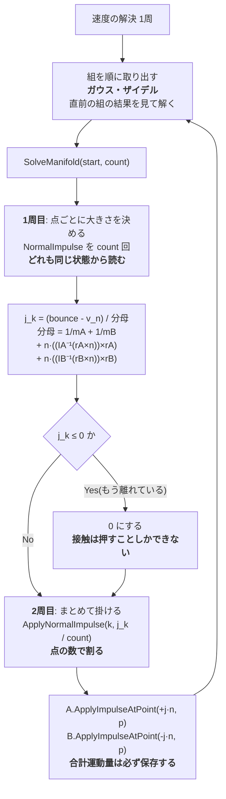
```mermaid
flowchart TD
    ST["速度の解決 1周"] --> LOOP["組を順に取り出す<br/><b>ガウス・ザイデル</b><br/>直前の組の結果を見て解く"]
    LOOP --> SM["SolveManifold(start, count)"]
    SM --> M1["<b>1周目</b>: 点ごとに大きさを決める<br/>NormalImpulse を count 回<br/><b>どれも同じ状態から読む</b>"]
    M1 --> DET["j_k = (bounce - v_n) / 分母<br/>分母 = 1/mA + 1/mB<br/>+ n·((IA⁻¹(rA×n))×rA)<br/>+ n·((IB⁻¹(rB×n))×rB)"]
    DET --> NEG{"j_k ≤ 0 か"}
    NEG -->|"Yes(もう離れている)"| SKIP["0 にする<br/><b>接触は押すことしかできない</b>"]
    NEG -->|No| M2
    SKIP --> M2["<b>2周目</b>: まとめて掛ける<br/>ApplyNormalImpulse(k, j_k / count)<br/><b>点の数で割る</b>"]
    M2 --> AP["A.ApplyImpulseAtPoint(+j·n, p)<br/>B.ApplyImpulseAtPoint(-j·n, p)<br/><b>合計運動量は必ず保存する</b>"]
    AP --> LOOP
```

**分母の下2行が、Day 44 でようやく効き始めた**。
Day 43 の球どうしでは接触法線が両方の中心を通るので `rA × n = 0`、
回転の寄与は常に 0 だった。箱では接触点が中心からずれるので、
**同じ大きさのインパルスでも掛ける場所で効き方が変わる**——
角から着地した箱が起き上がるのは、この2行があるから。

**1周目と2周目が分かれている**のが Day 44a の肝(その日の要点5)。
1周目で全部の点を「同じ状態から」読むので、
対称な接触では4点が完全に同じ大きさになり、余計なトルクが立たない。
`Ctrl+Shift+Alt+7` でこの分割をやめると、
**1点目だけが全部を背負い、3段の柱が崩れる**。

### カプセルが何かに当たるまで — 全部いったん球に落ちる(Day 45)

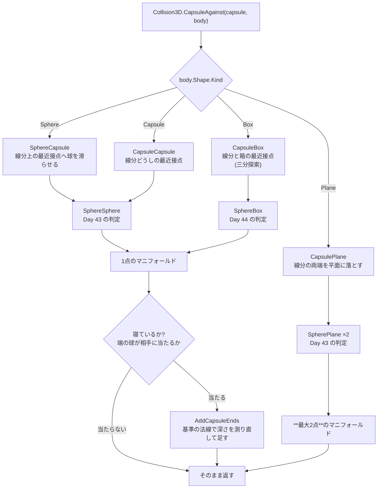
```mermaid
flowchart TD
    S["Collision3D.CapsuleAgainst(capsule, body)"] --> K{"body.Shape.Kind"}

    K -->|Sphere| SC["SphereCapsule<br/>線分上の最近接点へ球を滑らせる"]
    K -->|Plane| CP["CapsulePlane<br/>線分の両端を平面に落とす"]
    K -->|Box| CB["CapsuleBox<br/>線分と箱の最近接点<br/>(三分探索)"]
    K -->|Capsule| CC["CapsuleCapsule<br/>線分どうしの最近接点"]

    SC --> SS["SphereSphere<br/>Day 43 の判定"]
    CC --> SS
    CB --> SB["SphereBox<br/>Day 44 の判定"]
    CP --> SP["SpherePlane ×2<br/>Day 43 の判定"]

    SS --> W["1点のマニフォールド"]
    SB --> W
    SP --> M2["**最大2点**のマニフォールド"]

    W --> E{"寝ているか?<br/>端の球が相手に当たるか"}
    E -->|当たる| AE["AddCapsuleEnds<br/>基準の法線で深さを測り直して足す"]
    E -->|当たらない| OUT["そのまま返す"]
    AE --> OUT
    M2 --> OUT
```

**どの枝も最後は球の判定に落ちている**のが、この図でいちばん見てほしいところ。
カプセルが「線分から一定の距離」でしかないので、
新しく書いたのは<b>「どこへ球を滑らせるか」</b>だけになる。

**平面だけ別扱い**なのは、平らな面に対しては
「いちばん深いのは必ず線分の端」と言い切れるから。
端2つを見れば漏れも無駄も無いので、`AddCapsuleEnds` の出番がない。

**`AddCapsuleEnds` が要る理由**は Day 44a の要点3そのまま——
寝かせたカプセルを1点で支えると、転がって震え続ける。
足すときに<b>基準の法線で深さを測り直す</b>のは、
マニフォールドが法線を1本しか持てないため。

### キャラクターが1ステップ動くまで — 水平と垂直を分ける(Day 45)

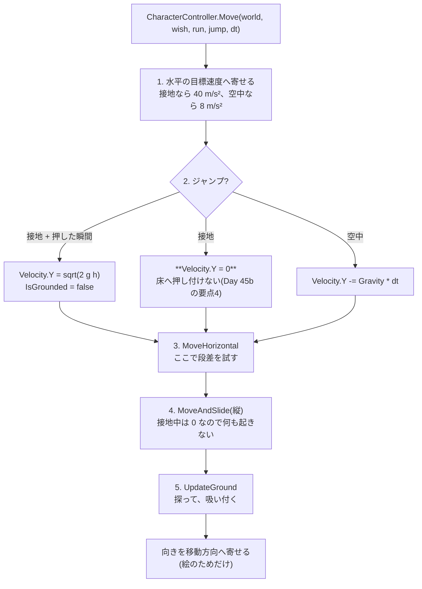
```mermaid
flowchart TD
    S["CharacterController.Move(world, wish, run, jump, dt)"]
    S --> V1["1. 水平の目標速度へ寄せる<br/>接地なら 40 m/s²、空中なら 8 m/s²"]
    V1 --> V2{"2. ジャンプ?"}
    V2 -->|接地 + 押した瞬間| J["Velocity.Y = sqrt(2 g h)<br/>IsGrounded = false"]
    V2 -->|接地| Z["**Velocity.Y = 0**<br/>床へ押し付けない(Day 45b の要点4)"]
    V2 -->|空中| G["Velocity.Y -= Gravity * dt"]

    J --> H
    Z --> H
    G --> H["3. MoveHorizontal<br/>ここで段差を試す"]
    H --> VM["4. MoveAndSlide(縦)<br/>接地中は 0 なので何も起きない"]
    VM --> UG["5. UpdateGround<br/>探って、吸い付く"]
    UG --> F["向きを移動方向へ寄せる<br/>(絵のためだけ)"]
```

**3 と 4 を分けるのが肝**(Day 45b の要点3)。一度に動かすと、
段差に当たったときに「壁にぶつかったのか、床に着いたのか」が区別できない。
分けておけば、水平の移動が止められたときだけ段差を試せばよくなる。
Quake の `PM_StepSlideMove` から続く定石で、
**斜めに走って段を上がる**ような場面でも破綻しない。

**2 で「接地中は縦に動かさない」**のが Day 45 でいちばん手こずった判断。
床へ軽く押し付ける実装にすると、段の縁にめり込んで横へ押し戻され、
前進がちょうど帳消しになる(Day 45b の要点4)。

### 押し戻しの中身 — 床は真上へ、壁は法線へ(Day 45)

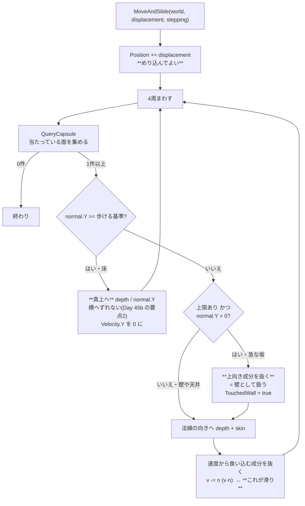
```mermaid
flowchart TD
    S["MoveAndSlide(world, displacement, stepping)"] --> P["Position += displacement<br/>**めり込んでよい**"]
    P --> L["4周まわす"]
    L --> Q["QueryCapsule<br/>当たっている面を集める"]
    Q -->|0件| OUT["終わり"]
    Q -->|1件以上| C{"normal.Y >= 歩ける基準?"}

    C -->|はい・床| U["**真上へ** depth / normal.Y<br/>横へずれない(Day 45b の要点2)<br/>Velocity.Y を 0 に"]
    C -->|いいえ| SL{"上限あり かつ<br/>normal.Y > 0?"}

    SL -->|はい・急な坂| CL["**上向き成分を抜く**<br/>= 壁として扱う<br/>TouchedWall = true"]
    SL -->|いいえ・壁や天井| N
    CL --> N["法線の向きへ depth + skin"]
    N --> VS["速度から食い込む成分を抜く<br/>v -= n (v·n)  ← **これが滑り**"]

    U --> L
    VS --> L
```

**床だけ真上へ押す**のが Day 45b の要点2。法線の向きへ押すと、
坂に立っているだけで横成分のぶん滑り落ちてしまう(摩擦を入れていないので止まらない)。
真上へ `深さ / 法線のY` なら、めり込みは同じだけ解けて横へは動かない。

**4周まわすのは押し戻しが打ち消し合うから**。部屋の角では2枚の壁に同時に当たり、
片方を押し戻すともう片方へ深く入る。
Day 44 の `PositionIterations` と同じ事情で、**周ごとに当たり直しから測り直す**。

`stepping` が true(段差を降ろしている最中)のときだけ、
「歩ける基準」を 0.1 まで緩める——段の角に触れたときの法線は寝ているので、
普段の基準では「登れない壁」に見えてしまう。

### 段差を越えるまで — 覗いて、持ち上げて、進む(Day 45)

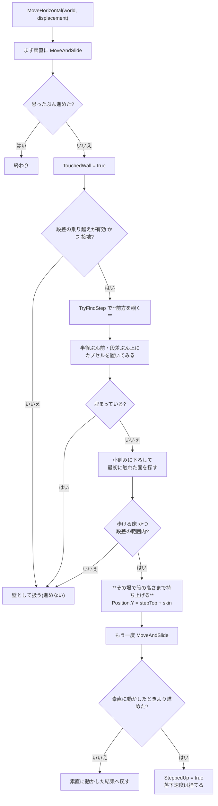
```mermaid
flowchart TD
    S["MoveHorizontal(world, displacement)"] --> P["まず素直に MoveAndSlide"]
    P --> Q{"思ったぶん進めた?"}
    Q -->|はい| OUT["終わり"]
    Q -->|いいえ| W["TouchedWall = true"]
    W --> G{"段差の乗り越えが有効 かつ 接地?"}
    G -->|いいえ| OUT2["壁として扱う(進めない)"]
    G -->|はい| T["TryFindStep で**前方を覗く**"]

    T --> T1["半径ぶん前・段差ぶん上に<br/>カプセルを置いてみる"]
    T1 --> T2{"埋まっている?"}
    T2 -->|はい| OUT2
    T2 -->|いいえ| T3["小刻みに下ろして<br/>最初に触れた面を探す"]
    T3 --> T4{"歩ける床 かつ<br/>段差の範囲内?"}
    T4 -->|いいえ| OUT2
    T4 -->|はい| R["**その場で段の高さまで持ち上げる**<br/>Position.Y = stepTop + skin"]

    R --> R2["もう一度 MoveAndSlide"]
    R2 --> R3{"素直に動かしたときより進めた?"}
    R3 -->|いいえ| BACK["素直に動かした結果へ戻す"]
    R3 -->|はい| OK["SteppedUp = true<br/>落下速度は捨てる"]
```

**落とさない**のが Day 45b の答え(要点3)。
「持ち上げて・進んで・落とす」と書くと、カプセルの丸い底が段の角に当たって止まり、
そのときの法線が寝ているので「壁」と判定されて押し戻される——
1フレームで進める 5cm では角を越えられないので、何フレームかけても越えられない。

**覗く位置が坂を弾く**。急な坂では半径ぶん前方の地面が段差ぶんより高く上がっているので、
覗いた位置が坂の中に埋まる。**「段か坂か」を、法線ではなく覗いた先の形で決めている**。

持ち上げたあと落とさないので、足が段の縁に乗るまでの数フレーム(0.05 秒ほど)は
段の上の空中を歩くことになる。絵としては「滑らかに段を登った」ように見える。

### 接地を決めるまで — 探って、吸い付いて、取り消す(Day 45)

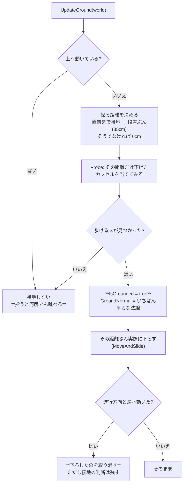
```mermaid
flowchart TD
    S["UpdateGround(world)"] --> U{"上へ動いている?"}
    U -->|はい| NG["接地しない<br/>**拾うと何度でも跳べる**"]
    U -->|いいえ| R["探る距離を決める<br/>直前まで接地 → 段差ぶん(35cm)<br/>そうでなければ 6cm"]

    R --> P["Probe: その距離だけ下げた<br/>カプセルを当ててみる"]
    P --> F{"歩ける床が見つかった?"}
    F -->|いいえ| NG
    F -->|はい| SET["**IsGrounded = true**<br/>GroundNormal = いちばん平らな法線"]

    SET --> SNAP["その距離ぶん実際に下ろす<br/>(MoveAndSlide)"]
    SNAP --> B{"進行方向と逆へ動いた?"}
    B -->|はい| UNDO["**下ろしたのを取り消す**<br/>ただし接地の判断は残す"]
    B -->|いいえ| DONE["そのまま"]
```

**探るだけで位置は動かさない**のが `Probe` の性格。
形が値(`readonly struct`)なので、本体を動かさずに何度でも試せる——
`ToCapsule(footPosition)` を用意したのはこのため。

**吸い付きが無いと階段を降りるときに毎段跳ねる**。
自己チェックでは、切ると 180 ステップ中 22 ステップが空中になるのが測れる。

**取り消すのは「動き」だけで、「接地している」という判断は残す**のが Day 45b の要点4。
真下に床があることは `Probe` が確かめているので、
段の縁に引っかかって少し浮いているだけなら接地扱いのままでよい。
ここを落とすと、段を登りかけたキャラクターが空中扱いになり、
段差の処理が走らなくなって**永久に登れない**。

### 地形に当たるまで — マスを出して、1枚ずつ当てて、1本にまとめる(Day 46)

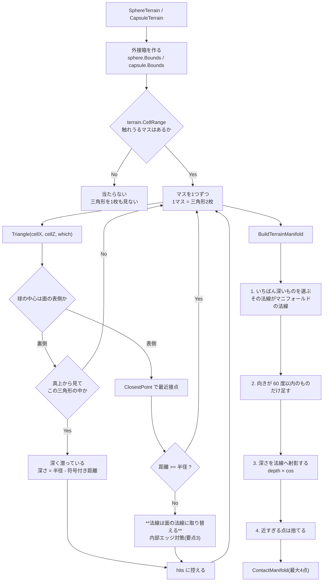
```mermaid
flowchart TD
    S["SphereTerrain / CapsuleTerrain"] --> BB["外接箱を作る<br/>sphere.Bounds / capsule.Bounds"]
    BB --> CR{"terrain.CellRange<br/>触れうるマスはあるか"}
    CR -->|No| NONE["当たらない<br/>三角形を1枚も見ない"]
    CR -->|Yes| LOOP["マスを1つずつ<br/>1マス = 三角形2枚"]

    LOOP --> TRI["Triangle(cellX, cellZ, which)"]
    TRI --> SGN{"球の中心は面の表側か"}

    SGN -->|裏側| COL{"真上から見て<br/>この三角形の中か"}
    COL -->|No| LOOP
    COL -->|Yes| DEEP["深く潜っている<br/>深さ = 半径 - 符号付き距離"]

    SGN -->|表側| CP["ClosestPoint で最近接点"]
    CP --> FAR{"距離 >= 半径 ?"}
    FAR -->|Yes| LOOP
    FAR -->|No| SNAP["**法線は面の法線に取り替える**<br/>内部エッジ対策(要点3)"]

    DEEP --> HITS["hits に控える"]
    SNAP --> HITS
    HITS --> LOOP

    LOOP --> BUILD["BuildTerrainManifold"]
    BUILD --> D1["1. いちばん深いものを選ぶ<br/>その法線がマニフォールドの法線"]
    D1 --> D2["2. 向きが 60 度以内のものだけ足す"]
    D2 --> D3["3. 深さを法線へ射影する<br/>depth × cos"]
    D3 --> D4["4. 近すぎる点は捨てる"]
    D4 --> OUT["ContactManifold(最大4点)"]
```

**分かれ道は2つだけ**。「表か裏か」と「面の法線に取り替えるか」。
前者が要るのは、地面に潜った物体を拾い直すため(要点3)。
後者が内部エッジ対策そのもので、**ここを素直に書くと球が対角線で蹴られる**。

**箱だけはこの図を通らない**。8つの角の下に地面があるかを見るだけで、
`Triangle3D` すら出てこない——`TryHeightAt` の答えと角の高さを比べるだけ(要点4)。
同じ「地形との判定」が形によってまったく違う道を通るのは、
**地形が形であると同時に関数でもある**ことの現れになっている。

### 高さを1つ答えるまで — 割り算2回と、どちらの三角形か(Day 46)

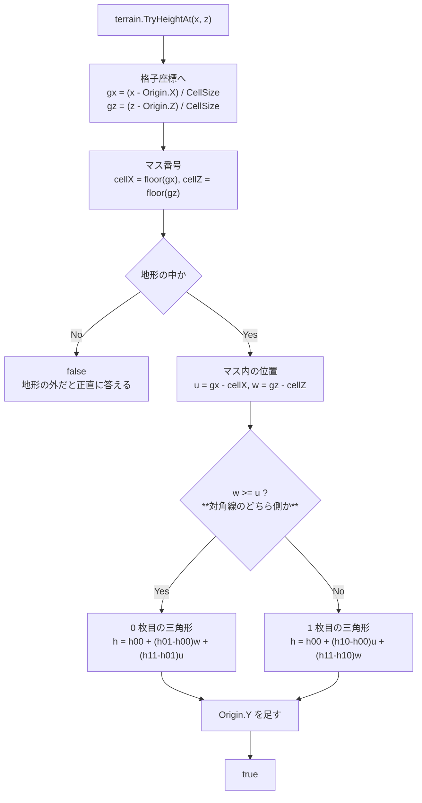
```mermaid
flowchart TD
    S["terrain.TryHeightAt(x, z)"] --> G["格子座標へ<br/>gx = (x - Origin.X) / CellSize<br/>gz = (z - Origin.Z) / CellSize"]
    G --> C["マス番号<br/>cellX = floor(gx), cellZ = floor(gz)"]
    C --> R{"地形の中か"}
    R -->|No| F["false<br/>地形の外だと正直に答える"]
    R -->|Yes| U["マス内の位置<br/>u = gx - cellX, w = gz - cellZ"]
    U --> D{"w >= u ?<br/>**対角線のどちら側か**"}
    D -->|Yes| T0["0 枚目の三角形<br/>h = h00 + (h01-h00)w + (h11-h01)u"]
    D -->|No| T1["1 枚目の三角形<br/>h = h00 + (h10-h00)u + (h11-h10)w"]
    T0 --> ADD["Origin.Y を足す"]
    T1 --> ADD
    ADD --> OK["true"]
```

**分岐が1つしか無い**。それが `w >= u`——マスを割った対角線のどちら側か。
ここを省いて4隅を双一次補間すると、**判定に使っている三角形と一致しない**面ができる
(要点1)。どちらの式も (0,0) と (1,1) では同じ値を返すので、
対角線をまたいでも高さは飛ばない。

**この関数が判定を1回も呼んでいない**のが、高さの格子を選ぶ最大の理由。
一般の三角形メッシュでこの問いに答えるにはレイキャストが要る。
`BoxTerrain` が SAT を書かずに済んでいるのも、`CharacterController` の足元が軽いのも、
元をたどるとこの5行に行き着く。

### Audio — OpenAL の薄い皮

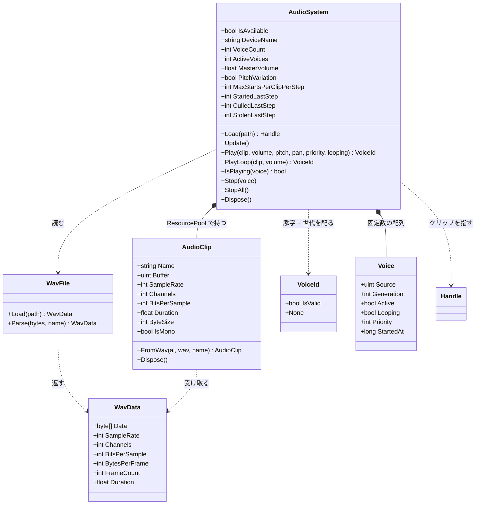
```mermaid
classDiagram
    class WavData {
        +byte[] Data
        +int SampleRate
        +int Channels
        +int BitsPerSample
        +int BytesPerFrame
        +int FrameCount
        +float Duration
    }
    class WavFile {
        +Load(path) WavData
        +Parse(bytes, name) WavData
    }
    class AudioClip {
        +string Name
        +uint Buffer
        +int SampleRate
        +int Channels
        +int BitsPerSample
        +float Duration
        +int ByteSize
        +bool IsMono
        +FromWav(al, wav, name) AudioClip
        +Dispose()
    }
    class VoiceId {
        +bool IsValid
        +None
    }
    class AudioSystem {
        +bool IsAvailable
        +string DeviceName
        +int VoiceCount
        +int ActiveVoices
        +float MasterVolume
        +bool PitchVariation
        +int MaxStartsPerClipPerStep
        +int StartedLastStep
        +int CulledLastStep
        +int StolenLastStep
        +Load(path) Handle
        +Update()
        +Play(clip, volume, pitch, pan, priority, looping) VoiceId
        +PlayLoop(clip, volume) VoiceId
        +IsPlaying(voice) bool
        +Stop(voice)
        +StopAll()
        +Dispose()
    }
    class Voice {
        +uint Source
        +int Generation
        +bool Active
        +bool Looping
        +int Priority
        +long StartedAt
    }

    WavFile ..> WavData : 返す
    AudioClip ..> WavData : 受け取る
    AudioSystem ..> WavFile : 読む
    AudioSystem *-- AudioClip : ResourcePool で持つ
    AudioSystem *-- Voice : 固定数の配列
    AudioSystem ..> VoiceId : 添字 + 世代を配る
    AudioSystem ..> Handle : クリップを指す
```

`Voice` は `AudioSystem` の中の `private struct`。外からは `VoiceId` 越しにしか触れない。

この層で押さえるべき線引きは3つ。

- **`WavFile` は OpenAL を知らない**。ただのバイト列パーサなので、
  ファイルが無くてもメモリ上のバイト列で試せる(自己チェックがそうしている)
- **`AudioClip` はデータ、`Voice` は再生**(要点2)。
  `Texture` と `Material`、`Mesh` と描画呼び出しと同じ分け方
- **`VoiceId` は `Handle<T>` と同じ構造**(添字 + 世代)だが**別の型**。
  `Handle<T>` は `ResourcePool<T>` のためのもので、ボイスはプールではないので流用しない。
  同じ手口を別の場所で使い直している、と読むのが正しい

### Text — Render の上に積む層

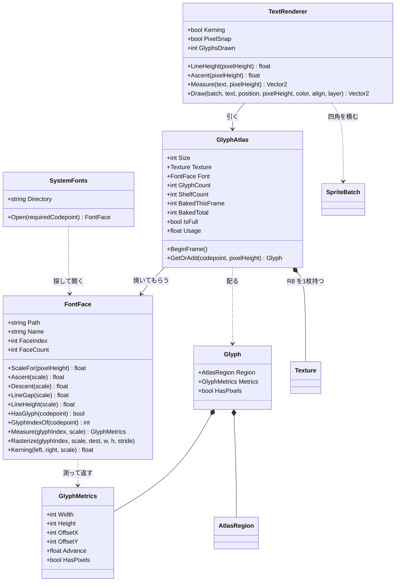
```mermaid
classDiagram
    class SystemFonts {
        +string Directory
        +Open(requiredCodepoint) FontFace
    }
    class FontFace {
        +string Path
        +string Name
        +int FaceIndex
        +int FaceCount
        +ScaleFor(pixelHeight) float
        +Ascent(scale) float
        +Descent(scale) float
        +LineGap(scale) float
        +LineHeight(scale) float
        +HasGlyph(codepoint) bool
        +GlyphIndexOf(codepoint) int
        +Measure(glyphIndex, scale) GlyphMetrics
        +Rasterize(glyphIndex, scale, dest, w, h, stride)
        +Kerning(left, right, scale) float
    }
    class GlyphMetrics {
        +int Width
        +int Height
        +int OffsetX
        +int OffsetY
        +float Advance
        +bool HasPixels
    }
    class Glyph {
        +AtlasRegion Region
        +GlyphMetrics Metrics
        +bool HasPixels
    }
    class GlyphAtlas {
        +int Size
        +Texture Texture
        +FontFace Font
        +int GlyphCount
        +int ShelfCount
        +int BakedThisFrame
        +int BakedTotal
        +bool IsFull
        +float Usage
        +BeginFrame()
        +GetOrAdd(codepoint, pixelHeight) Glyph
    }
    class TextRenderer {
        +bool Kerning
        +bool PixelSnap
        +int GlyphsDrawn
        +LineHeight(pixelHeight) float
        +Ascent(pixelHeight) float
        +Measure(text, pixelHeight) Vector2
        +Draw(batch, text, position, pixelHeight, color, align, layer) Vector2
    }

    SystemFonts ..> FontFace : 探して開く
    FontFace ..> GlyphMetrics : 測って返す
    GlyphAtlas --> FontFace : 焼いてもらう
    GlyphAtlas *-- Texture : R8 を1枚持つ
    GlyphAtlas ..> Glyph : 配る
    Glyph *-- AtlasRegion
    Glyph *-- GlyphMetrics
    TextRenderer --> GlyphAtlas : 引く
    TextRenderer ..> SpriteBatch : 四角を積む
```

4つのクラスが、**それぞれ1つのことしかしない**ように切ってある。

| クラス | 知っていること | 知らないこと |
|---|---|---|
| `SystemFonts` | どこにフォントがあるか | 描き方 |
| `FontFace` | フォントの中身(寸法とアウトライン) | GL、アトラス、レイアウト |
| `GlyphAtlas` | どこに置いたか、何を焼いたか | 文字の並べ方 |
| `TextRenderer` | 並べ方(送り・行送り・整列) | フォントの中身、GL |

この切り方の値打ちは、**差し替えたときにどこまで壊れるか**で分かる。
SDF に変える(改造課題3)なら `GlyphAtlas` と `text.frag` だけが変わり、
`TextRenderer` は 1 行も触らない。
フォントフォールバックを入れる(改造課題2)なら `FontFace` を複数持つだけで、
`GlyphAtlas` の棚詰めには影響しない。

**`GlyphMetrics` が `FontFace` と `TextRenderer` の共通語**になっている。
「原点からどれだけずらして、次にどれだけ進むか」——
この5つの数字さえあれば、フォントの実装が何であれ字を並べられる。

### Model — glTF を描画の言葉へ翻訳する層(Day 42 でさらにクラスが4つ増えた)

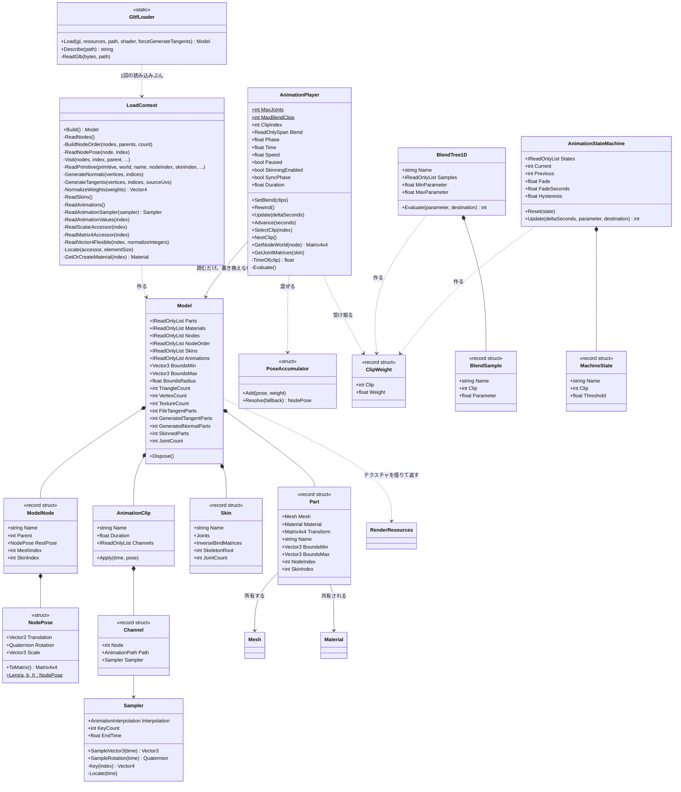
```mermaid
classDiagram
    class GltfLoader {
        <<static>>
        +Load(gl, resources, path, shader, forceGenerateTangents) Model
        +Describe(path) string
        -ReadGlb(bytes, path)
    }
    class LoadContext {
        +Build() Model
        -ReadNodes()
        -BuildNodeOrder(nodes, parents, count)
        -ReadNodePose(node, index)
        -Visit(nodes, index, parent, ...)
        -ReadPrimitive(primitive, world, name, nodeIndex, skinIndex, ...)
        -GenerateNormals(vertices, indices)
        -GenerateTangents(vertices, indices, sourceUvs)
        -NormalizeWeights(weights) Vector4
        -ReadSkins()
        -ReadAnimations()
        -ReadAnimationSampler(sampler) Sampler
        -ReadAnimationValues(index)
        -ReadScalarAccessor(index)
        -ReadMatrix4Accessor(index)
        -ReadVector4Flexible(index, normalizeIntegers)
        -Locate(accessor, elementSize)
        -GetOrCreateMaterial(index) Material
    }
    class Model {
        +IReadOnlyList Parts
        +IReadOnlyList Materials
        +IReadOnlyList Nodes
        +IReadOnlyList NodeOrder
        +IReadOnlyList Skins
        +IReadOnlyList Animations
        +Vector3 BoundsMin
        +Vector3 BoundsMax
        +float BoundsRadius
        +int TriangleCount
        +int VertexCount
        +int TextureCount
        +int FileTangentParts
        +int GeneratedTangentParts
        +int GeneratedNormalParts
        +int SkinnedParts
        +int JointCount
        +Dispose()
    }
    class Part {
        <<record struct>>
        +Mesh Mesh
        +Material Material
        +Matrix4x4 Transform
        +string Name
        +Vector3 BoundsMin
        +Vector3 BoundsMax
        +int NodeIndex
        +int SkinIndex
    }
    class ModelNode {
        <<record struct>>
        +string Name
        +int Parent
        +NodePose RestPose
        +int MeshIndex
        +int SkinIndex
    }
    class NodePose {
        <<struct>>
        +Vector3 Translation
        +Quaternion Rotation
        +Vector3 Scale
        +ToMatrix() Matrix4x4
        +Lerp(a, b, t) NodePose$
    }
    class PoseAccumulator {
        <<struct>>
        +Add(pose, weight)
        +Resolve(fallback) NodePose
    }
    class ClipWeight {
        <<record struct>>
        +int Clip
        +float Weight
    }
    class BlendTree1D {
        +string Name
        +IReadOnlyList Samples
        +float MinParameter
        +float MaxParameter
        +Evaluate(parameter, destination) int
    }
    class BlendSample {
        <<record struct>>
        +string Name
        +int Clip
        +float Parameter
    }
    class AnimationStateMachine {
        +IReadOnlyList States
        +int Current
        +int Previous
        +float Fade
        +float FadeSeconds
        +float Hysteresis
        +Reset(state)
        +Update(deltaSeconds, parameter, destination) int
    }
    class MachineState {
        <<record struct>>
        +string Name
        +int Clip
        +float Threshold
    }
    class Skin {
        <<record struct>>
        +string Name
        +Joints
        +InverseBindMatrices
        +int SkeletonRoot
        +int JointCount
    }
    class AnimationClip {
        +string Name
        +float Duration
        +IReadOnlyList Channels
        +Apply(time, pose)
    }
    class Channel {
        <<record struct>>
        +int Node
        +AnimationPath Path
        +Sampler Sampler
    }
    class Sampler {
        +AnimationInterpolation Interpolation
        +int KeyCount
        +float EndTime
        +SampleVector3(time) Vector3
        +SampleRotation(time) Quaternion
        -Key(index) Vector4
        -Locate(time)
    }
    class AnimationPlayer {
        +int MaxJoints$
        +int MaxBlendClips$
        +int ClipIndex
        +ReadOnlySpan Blend
        +float Phase
        +float Time
        +float Speed
        +bool Paused
        +bool SkinningEnabled
        +bool SyncPhase
        +float Duration
        +SetBlend(clips)
        +Rewind()
        +Update(deltaSeconds)
        +Advance(seconds)
        +SelectClip(index)
        +NextClip()
        +GetNodeWorld(node) Matrix4x4
        +GetJointMatrices(skin)
        -TimeOf(clip) float
        -Evaluate()
    }

    GltfLoader ..> LoadContext : 1回の読み込みぶん
    LoadContext ..> Model : 作る
    Model *-- Part
    Model *-- ModelNode
    Model *-- Skin
    Model *-- AnimationClip
    ModelNode *-- NodePose
    AnimationClip *-- Channel
    Channel --> Sampler
    Part --> Mesh : 所有する
    Part --> Material : 共有される
    Model ..> RenderResources : テクスチャを借りて返す
    AnimationPlayer --> Model : 読むだけ。書き換えない
    AnimationPlayer ..> PoseAccumulator : 混ぜる
    AnimationPlayer ..> ClipWeight : 受け取る
    BlendTree1D *-- BlendSample
    BlendTree1D ..> ClipWeight : 作る
    AnimationStateMachine *-- MachineState
    AnimationStateMachine ..> ClipWeight : 作る
```

<b>クラス図の都合で名前を変えてある</b>ものが2つある。
`BlendSample` は実際には `BlendTree1D.Sample`、`MachineState` は
`AnimationStateMachine.State`。mermaid の classDiagram は入れ子の型名を
そのまま書けないので、外に出して別名にした
(`AnimationClip.Channel` / `.Sampler` を `Channel` / `Sampler` と書いているのと同じ扱い)。

**Day 34 で `GenerateTangents` が入った**。ここに置いたのは、
**接線が「読み込みの一部」だから**——ファイルにあれば読み、無ければ作る、という
同じ場所で決まるべき話になる。

**Day 41 で `GenerateNormals` が隣に並んだ**のも同じ理由。
Fox が `NORMAL` を持っていないので、三角形の外積から作り直す。
接線より**先に**呼ぶのが決まりで、接線の生成が法線を使う
(グラム・シュミットで直交させる)ため。

**Day 39 で `Part` に境界箱が入った**。モデル全体のぶん(`Model.BoundsMin`)は
Day 32 からあったが、それだけでは足りない場面が出た。

配布されているモデルには「きれいな版」と「錆びた版」が
**1ファイルに並べて入っている**ことがある(`fire_hydrant` / `metal_trash_can`)。
デモに置くときは片方だけが欲しいので、`DemoScene` がノード名で選り分ける——
すると残ったパーツの**大きさと足元が全体のものとは違う**。

`Part.Name`(glTF のノード名)も、この日から
「デバッグ表示用」ではなく**選り分けの鍵**という仕事を持った。

`Model` が接線と法線の出どころ(ファイル / 生成)の数を持つのは、
**HUD と自己チェックで区別を出すため**。
「法線マップが効かない」の原因の筆頭がここなので、
数を見えるところに出しておく価値がある。

**`LoadContext` を切り出したのは、引数が増えすぎたから**。
`gl` / `resources` / `path` / `directory` / `root` / `embedded` / `shader` の7つを
静的メソッド間で渡し回すと、どの関数も先頭3行が引数の受け渡しになる。
**読み込み1回ぶんの寿命を持つ入れ物**にまとめると、
buffer のキャッシュとマテリアルの使い回しも自然にそこへ収まる。
Day 41 でここに `_nodes` / `_nodeOrder` / `_skins` / `_animations` が加わり、
**読み込みの結果を組み立てる場所**という性格がはっきりした。

### `Model` が木を持ち直したこと(Day 41)

Day 32 の `Model` は「メッシュ + マテリアル + 世界行列」の平らな一覧だった。
根から行列を掛け合わせて世界行列を確定させてしまえば、
描くときは順に回すだけ——**静的なモデルに階層は要らない**、という判断。

Day 41 でそれが足りなくなる。理由は2つとも「木を歩き直す必要がある」。

| 何のために | どう歩くか |
|---|---|
| アニメーション | ノードの TRS が毎フレーム書き換わる → 世界行列を作り直す |
| スキニング | 関節ノードの世界行列を集めて関節行列を作る |

そこで `Model` に `Nodes`(木の形と初期姿勢)と `NodeOrder`(親が先に来る並び)を戻した。
**平らな一覧も残してある**のが今日の判断で、
静的なモデル(Day 39 のデモシーンの小物)は Day 32 からの経路をそのまま通る。

`NodeOrder` を配列で持つのは、毎フレーム再帰で降りるのを避けるため。
**順番は読み込みの時点で決まっている**ので、1回並べ替えておけば
あとはキャッシュに乗る素直なループになる。

glTF の `nodes` の並びに順序の保証は無い(子が親より前に書かれているファイルは実在する)。
番号順に回すと**1フレーム古い親の行列**を掛けることになり、
「腕だけ1フレーム遅れてついてくる」という気味の悪い出方をする。

**`Model` が `RenderResources` を握っている**のは、
テクスチャの参照カウントを返すため(Day 21 の要点3)。
`Mesh` は自分で作ったので所有するが、テクスチャは借り物なので返す必要がある。
ここを忘れると、モデルを切り替えるたびに 2K テクスチャが数枚ずつ残り、
**絵は正しいのに VRAM だけ増え続ける**。

**`AnimationPlayer` は何も所有しない**のが対照的で、
持っているのは姿勢と行列の配列だけ。だから捨てるのではなく
参照を切れば済む(`Program.SetModel` の `_animation = null`)。
「Dispose が要るもの」と「要らないもの」の線が、この2つを並べるとはっきりする。

### glTF を1体読むまで — 3段の間接参照とノードの木

```mermaid
flowchart TD
    F["ファイルを読む"] --> M{"先頭4バイトが<br/>glTF か"}
    M -->|Yes| GLB["ReadGlb<br/>JSON チャンクと BIN チャンクに分ける"]
    M -->|No| TXT["JSON としてそのまま parse<br/>buffer は外部ファイル / data URI"]
    GLB --> ND["ReadNodes<br/>子の一覧を反転して親を作る<br/>根から深さ優先で NodeOrder"]
    TXT --> ND
    ND --> SK["ReadSkins<br/>関節のノード番号 + 逆バインド行列"]
    SK --> SC["scenes[scene].nodes から開始"]
    SC --> V["Visit(ノード, 親の世界行列)"]
    V --> TR["ローカル行列を作る<br/>matrix か TRS のどちらか<br/>world = local * parent"]
    TR --> HM{"mesh を持つか"}
    HM -->|Yes| PR["primitives を順に ReadPrimitive<br/>node.skin も一緒に渡す"]
    HM -->|No| CH
    PR --> CH{"children があるか"}
    CH -->|Yes| V
    CH -->|No| AN["ReadAnimations<br/>channel と sampler を組む"]
    AN --> DONE["Model が完成"]
```

**ノードを2回歩く**のが Day 41 の形。1回目(`ReadNodes`)は全ノードの
親と姿勢を確定させるため、2回目(`Visit`)はシーンに繋がったメッシュを拾うため。

分けたのは、**関節がシーングラフの外に置かれたファイルが実在する**から。
`Visit` だけで済ませると、そういうノードの姿勢が作られず、
アニメーションがノード番号で名指ししてきたときに書き込む先が無い。

プリミティブ1個を頂点配列にするところが、glTF のいちばん機械的な部分になる。

```mermaid
flowchart TD
    P["primitive"] --> A["attributes.POSITION → accessor 番号"]
    A --> AC["accessors[n]<br/>type=VEC3 componentType=5126(float) count=14556"]
    AC --> BV["bufferViews[m]<br/>buffer=0 byteOffset=1024 byteStride=0"]
    BV --> B["buffers[0]<br/>glb の BIN チャンク / 外部 .bin / data URI"]
    B --> READ["Locate が (バイト列, 開始位置, ストライド) を返す"]
    READ --> VTX["Vertex[] を組む<br/>V を反転 / 法線が無ければ 0 を置く"]
    P --> JW["JOINTS_0 / WEIGHTS_0<br/>ReadVector4Flexible<br/>**番号は正規化しない、重みは正規化する**"]
    JW --> NW["NormalizeWeights<br/>合計を 1 に揃える"]
    NW --> VTX
    P --> IDX["indices → accessor<br/>u8 / u16 / u32 を uint へ広げる"]
    IDX --> GN["法線が無ければ GenerateNormals<br/>接線が無ければ GenerateTangents"]
    VTX --> GN
    P --> MAT["material → GetOrCreateMaterial<br/>ベースカラーは sRGB、それ以外はリニア"]
    GN --> MESH["new Mesh(vertices, indices)"]
    MAT --> PART["Model.Part(Mesh, Material, partWorld, name, NodeIndex, SkinIndex)"]
    MESH --> PART
    PART --> SW{"スキンを持つか"}
    SW -->|Yes| ID["partWorld = 単位行列<br/>**ノードの変換は無視する**(仕様)"]
    SW -->|No| WD["partWorld = world"]
```

**`byteStride` が肝**。glTF は「位置・法線・UV を1頂点ずつ交互に並べる」書き方も許していて、
その場合 `bufferView` に `byteStride` が入る。0(または未指定)なら詰めて並んでいる。

Day 41 のモデルは**5体中3体が stride 付き**(RiggedSimple / CesiumMan / Fox)。
Day 32 の4体は全部 stride 無しだったので、
「対応を落としても動いてしまう」状態がここでようやく破れる。

**`accessor` を経由する意味**は、1本のバイト列を複数の意味で切り出せること。
位置と法線と UV が同じ `buffer` に同居し、
それぞれの `bufferView` が違う範囲を指す。
OBJ が「v の配列」「vt の配列」を別々のテキスト行として持っていたのに対し、
glTF は**メモリ上の並びをそのまま記述している**ので、読み込み後の組み直しが要らない。

**`ReadVector4Flexible` の引数1つが今日の落とし穴**。
`JOINTS_0` も `WEIGHTS_0` も VEC4 で、どちらも整数で入っていることがあるが、
**読み替え方が正反対**になる。

| | 成分の型 | 整数を 0〜1 に読み替えるか |
|---|---|---|
| `JOINTS_0` | unsigned byte / unsigned short | **しない**(3 は 3 のまま) |
| `WEIGHTS_0` | float / 正規化された整数 | **する**(255 → 1.0) |

取り違えると、関節の番号が全部 0 になって
**モデル全体が1本の骨にぶら下がる**という派手な壊れ方をする。

### 1フレームの姿勢が決まるまで — 時刻から関節行列へ5段(Day 42 で1段増えた)

```mermaid
flowchart TD
    T["OnUpdate(dt)"] --> LC["UpdateLocomotion(dt)<br/>速度 → ClipWeight[] → SetBlend"]
    LC --> AD["_animation.Update(dt)<br/>phase += dt * Speed / Duration<br/>**位相で持つ**(Day 42)"]
    AD --> LOOP{"混ぜるクリップを<br/>1本ずつ"}
    LOOP --> R["1. ファイルの姿勢へ戻す<br/>scratch = Nodes.RestPose<br/>**クリップごとに毎回やる**"]
    R --> C["2. クリップを当てる<br/>clip.Apply(TimeOf(clip), scratch)"]
    C --> S["Sampler.Locate(time)<br/>二分探索で挟む2キーと t"]
    S --> I{"何を補間するか"}
    I -->|"translation / scale"| L["Vector3.Lerp"]
    I -->|"rotation"| SL["Quaternion.Slerp<br/>**lerp では等速にならない**"]
    L --> ACC["3. 重み付きで足し込む<br/>PoseAccumulator.Add<br/>**符号を揃えてから**"]
    SL --> ACC
    ACC --> LOOP
    LOOP -->|"全部足した"| RS["4. 取り出す<br/>Resolve。回転は正規化"]
    RS --> W["5. 木を降りて世界行列<br/>NodeOrder の順に1回<br/>world = local * 親の world"]
    W --> J["6. 関節行列<br/>joint = IBM * world(関節ノード)"]
    J --> OUT["GetJointMatrices(skin)<br/>そのまま uJoints へ"]
```

**5 と 6 は Day 41 から1文字も変わっていない**。
混ぜる場所を姿勢の段(1〜4)に置いたので、下流から見ると
「ポーズが1つ決まった」以上のことは起きていない。
**上流で混ぜる形にしておくと、何本混ぜても GPU 側は何も知らなくてよい**。

**1 を毎回やる**のが要点。クリップが触らないノードは
「前フレームの値」ではなく「ファイルの値」でなければならない。
戻さずに済ませると、クリップを切り替えたときに
**前のクリップが最後に書いた値が残る**——Fox で Walk → Survey にしたときに
腰の高さだけ前のまま、といった壊れ方になる。

**`TimeOf(clip)` が位相同期の実体**(Day 42)。

```
  同期 ON   time = phase * clip.Duration     全クリップが「1周のうち同じところ」
  同期 OFF  time = _clipTimes[clip]          各クリップが自分の秒で勝手に回る
```

**`SkinningEnabled` が false のときは 4 を単位行列で埋める**。
頂点は `Σw * I * p = p` になり、バインドポーズがそのまま出る
(重みの合計を 1 に正規化してあるから成り立つ)。

### 頂点が画面に出るまで — CPU と GPU が出会う場所

```mermaid
flowchart TD
    EV["AnimationPlayer.Evaluate()<br/>CPU。関節行列を作る"] --> PJ["Program.PartJoints(part)<br/>スキン無しなら空を返す"]
    PJ --> D1["Program.Draw<br/>uSkinned / uJoints"]
    PJ --> D2["ShadowMap.Draw<br/>uSkinned / uJoints"]
    PJ --> D3["Ssao.Draw<br/>uSkinned / uJoints"]
    D1 --> V1["textured.vert<br/>SkinMatrix() で4本を混ぜる<br/>位置・法線・接線"]
    D2 --> V2["depth.vert<br/>位置だけ"]
    D3 --> V3["geometry.vert<br/>位置と法線"]
    V1 --> SCR["シーンバッファ → 後処理 → 画面"]
    V2 --> SM["シャドウマップ"]
    V3 --> GB["法線と距離のバッファ → 遮蔽率"]
```

**同じ関節行列を3回送る**。冗長に見えるが、3つのパスが同じ頂点位置を見ることのほうが
桁違いに大事で、1つでも送り忘れると
「影だけバインドポーズ」「遮蔽だけ1歩ぶん置き去り」という壊れ方をする。

**行列を混ぜてから頂点に掛ける**のがシェーダ側の判断。
掛けてから混ぜても結果は同じ(積が線形なので分配できる)が、
混ぜてからのほうが行列とベクトルの積が1回で済む。

`Program.PartMatrix` / `PartJoints` を1か所に置いてあるのは、
**3か所に写すといつか1つだけ直し忘れる**から。
そのときの症状が「影だけずれる」なので、原因にたどり着くのに時間がかかる。

### 速度から重みが決まるまで — 2通りの決め方(Day 42)

```mermaid
flowchart TD
    SP["移動速度<br/>自動スイープ or 手動"] --> MODE{"決め方<br/>Shift+Alt+F2"}

    MODE -->|"ブレンドツリー"| T1["BlendTree1D.Evaluate"]
    T1 --> T2["軸の上で入力を挟む2点を探す<br/>立ち止まり 0.0 / 歩き 1.0 / 走り 3.2"]
    T2 --> T3["t = (速度 - a) / (b - a)<br/>**常に隣り合う2本**"]
    T3 --> CW

    MODE -->|"ステートマシン"| S1["AnimationStateMachine.Update"]
    S1 --> S2{"しきい値を<br/>またいだか"}
    S2 -->|"上へ: 速度 ≧ Threshold"| S3["状態を1つ上げる"]
    S2 -->|"下へ: 速度 < Threshold - Hysteresis"| S4["状態を1つ下げる"]
    S2 -->|"どちらでもない"| S5
    S3 --> S6["前の状態を覚えて fade = 0"]
    S4 --> S6
    S6 --> S5["fade += dt / FadeSeconds"]
    S5 --> S7["前の状態 1-fade / 今の状態 fade<br/>**移り変わる瞬間だけ2本**"]
    S7 --> CW

    CW["ClipWeight[]"] --> SB["AnimationPlayer.SetBlend<br/>**合計 1 に正規化**"]
```

**2つの経路が同じ出口(`ClipWeight[]`)に落ちる**のが今日の設計の要。
`AnimationPlayer` は上の分岐を1つも知らない。

**ヒステリシスは下向きの矢印にしか付いていない**。
上がるときはしきい値そのまま、下がるときだけ深く。
両方向にずらすと「上がりにくく下がりにくい」ことになり、
反応が鈍く感じられる。**片方向だけ**が定石。

### Game — エンジンを使う側

```mermaid
classDiagram
    class GameBalance {
        +float PlayerSpeed
        +float PlayerMaxHealth
        +float PlayerInvulnerableTime
        +int MaxEnemies
        +float SpawnIntervalStart
        +float SpawnRampSeconds
        +float FireInterval
        +float ProjectileDamage
        +EnemyKinds
        +ExperienceForLevel(level) int
    }
    class Enemy {
        +Vector2 Position
        +Vector2 Velocity
        +float Health
        +float Radius
        +float Speed
        +float Damage
        +int Kind
        +int Experience
        +float HitAt
    }
    class Projectile {
        +Vector2 Position
        +Vector2 Velocity
        +float Life
        +float Damage
    }
    class Gem {
        +Vector2 Position
        +Vector2 Velocity
        +int Value
    }
    class WeaponState {
        +WeaponKind Kind
        +int Level
        +float Timer
        +float Angle
    }
    class WeaponStats {
        +float Interval
        +float Damage
        +int Count
        +float Radius
        +float Speed
    }
    class Weapons {
        +int MaxLevel
        +int KindCount
        +NameOf(kind) string
        +SummaryOf(kind) string
        +StatsFor(kind, level) WeaponStats
        +DescribeNext(kind, level) string
        +OrbitPosition(center, angle, index, stats) Vector2
    }
    class UpgradeOption {
        +UpgradeKind Kind
        +WeaponKind Weapon
        +string Title
        +string Detail
    }
    class SurvivorGame {
        +GamePhase Phase
        +float Elapsed
        +Vector2 PlayerPosition
        +float Health
        +float MaxHealth
        +float SpeedMultiplier
        +float MagnetMultiplier
        +int Level
        +int Experience
        +int Kills
        +int Seed
        +Vector2 Camera
        +int EnemyCount
        +int ProjectileCount
        +int GemCount
        +int WeaponCount
        +int ChoiceCount
        +int ChoiceCursor
        +long PairCandidates
        +OnEvent
        +Start(viewSize, seed)
        +Update(dt, input)
        +ConfirmChoice()
        +LevelOf(kind) int
        +SetSingleWeapon(kind, level)
        +ReturnToTitle()
    }
    class GameView {
        +DrawWorld(submit, viewSize)
        +DrawHudShapes(submit, viewSize)
        +DrawHudText(text, textBatch, viewSize)
    }

    SurvivorGame *-- Enemy : 配列で 1200
    SurvivorGame *-- Projectile : 配列で 400
    SurvivorGame *-- Gem : 配列で 600
    SurvivorGame *-- WeaponState : 配列で 3
    SurvivorGame *-- UpgradeOption : 選択肢 3
    SurvivorGame --> SpatialGrid : 1ステップに1回組む
    SurvivorGame ..> Collision2D : 円どうしの判定
    SurvivorGame ..> GameBalance : 数字を引く
    SurvivorGame ..> Weapons : レベルから性能を引く
    WeaponState ..> WeaponKind
    Weapons ..> WeaponStats : 返す
    GameView ..> SurvivorGame : 読むだけ
    GameView ..> Weapons : 球の位置を引く
    GameView ..> SpriteBatch : 四角を積む
    GameView ..> TextRenderer : 文字を積む
```

**`WeaponState` が3つのフィールドしか持っていない**のが Day 30 の設計の要。
威力も間隔も個数も持たず、`Weapons.StatsFor(kind, level)` が
**レベルから計算して返す**。

```
状態として持つもの   … 種類・レベル・タイマー・角度
状態から決まるもの   … 威力・間隔・個数・半径・速度
```

分けておくと、成長カーブを触るときに `StatsFor` の1箇所で済む。
逆に `WeaponState` に威力を持たせると、
レベルアップのたびに「どの数字をいくつ足すか」があちこちに散らばる。

**`GameView` から `Weapons` への線**にも意味がある。
オービットの球の位置は当たり判定と絵の両方が要るので、
`Weapons.OrbitPosition` という1つの式を両方から呼ぶ。
別々に書くと、**見えているところと当たるところがずれる**——
しかもずれは小さいので、しばらく気づかない。

**`Enemy` / `Projectile` / `Gem` が `struct`** なのが要点。
1200 体ぶんの参照を辿ると、メモリ上ばらばらの場所を読むことになる
(Day 22 で実測した 17 倍がこれ)。構造体の配列なら、
更新ループは連続したメモリを頭から舐めるだけで済む。

**Day 23 の ECS は使っていない**。
ECS が効くのは「部品の組み合わせが実行時に変わる」ときで、
今日のように<b>敵は敵、弾は弾と決まっている</b>なら、
種類ごとに配列を1本持つほうが素直で速い。
Day 23 で「ECS は構造体の配列の一般化」と書いたが、
**一般化が要らない場面では特殊形のままでよい**——
これは ECS が無駄だったという話ではなく、
<b>どちらを選ぶかを判断できるようになった</b>という話になる。

`GameBalance` に矢印が集まっているのも意図したもの。
遊んで気になったことは全部ここを触ることになるので、
**数字がコードの中に散らばっていると調整が苦行になる**。

### Demo — エンジンを使う側の、もう1つの層(Day 40 でクラスが2つ増えた)

```mermaid
classDiagram
    class DemoScene {
        +string Name
        +string SourcePath
        +string HdriPath
        +float Exposure
        +float IblIntensity
        +float SunScale
        +Vector3 Ambient
        +bool RemoveSunFromIbl
        +float SunThreshold
        +float SunAzimuth
        +float ShadowRadius
        +Vector3 CameraTarget
        +float CameraDistance
        +float CameraYaw
        +float CameraPitch
        +float CameraFieldOfView
        +CameraPath Shots
        +GradeSettings Grade
        +IReadOnlyList Items
        +int TriangleCount
        +int ModelCount
        +int TextureCount
        +int ShadowCasterCount
        +double LoadMilliseconds
        +Load(gl, resources, jsonPath, shader, quad, resolveAsset) DemoScene$
        +Dispose()
        -BuildMaterial(entry, shader, resolveAsset) Material
        -AddProp(gl, resources, entry, shader, resolveAsset)
        -AlignToGround(min, max, orientation) Vector3$
        -ReadTransform(entry) Matrix4x4$
        -ReadCameraPath(camera, scene) CameraPath$
        -Track(handle) Handle
    }
    class Item {
        <<record struct>>
        +string Name
        +Mesh Mesh
        +Material Material
        +Matrix4x4 Transform
        +bool CastShadow
    }
    class GradeSettings {
        <<record struct>>
        +bool Enabled
        +float Temperature
        +float Tint
        +float Contrast
        +float Saturation
    }
    class CameraPath {
        +IReadOnlyList Keys
        +int KeyCount
        +float TotalDuration
        +CameraInterpolation Interpolation
        +bool Ease
        +Sample(time) Pose
        +SpeedAt(time, step) tuple
        +IndexAt(time) int
        +StartTimeOf(index) float
        +Wrap(time) float
        +PoseOf(index) Pose
        +WrapAngle(radians) float$
        -Interpolate(index, u) Pose
        -CatmullRom(p0, p1, p2, p3, u) float$
    }
    class Key {
        <<record struct>>
        +string Name
        +Vector3 Target
        +float Distance
        +float Yaw
        +float Pitch
        +float FieldOfView
        +float Hold
        +float Travel
    }
    class Pose {
        <<record struct>>
        +Vector3 Target
        +float Distance
        +float Yaw
        +float Pitch
        +float FieldOfView
    }
    class CameraInterpolation {
        <<enumeration>>
        Linear
        CatmullRom
    }
    class FeatureToggles {
        +IReadOnlyList Features
        +int Selected
        +bool AllOn
        +int OnCount
        +bool TourActive
        +float TourInterval
        +Add(name, effect, get, set)
        +SelectNext()
        +ToggleSelected() Feature
        +SetAll(on)
        +Capture() bool[]
        +Restore(state)
        +BeginTour() string
        +EndTour()
        +Update(deltaSeconds) string
        +Describe() string
        +TourLabel() string
    }
    class Feature {
        +string Name
        +string Effect
        +Func Get
        +Action Set
        +bool Value
    }

    DemoScene *-- Item : 描くものの平らな並び
    DemoScene *-- GradeSettings : 色調整のつまみ
    DemoScene *-- CameraPath : カメラワーク(shots があれば)
    CameraPath *-- Key : キーフレームの並び
    CameraPath ..> Pose : 時刻から作って返す
    CameraPath ..> CameraInterpolation : 補間方式
    CameraPath ..> OrbitCameraController : EyePosition だけ借りる
    FeatureToggles *-- Feature : 機能の並び
    DemoScene *-- Model : glTF を所有する
    DemoScene ..> GltfLoader : 読んでもらう
    DemoScene ..> Material : 板のぶんは自分で作る
    DemoScene ..> Mesh : 板は借りる / glTF のぶんは Model が持つ
    DemoScene ..> RenderResources : テクスチャを借りて返す
    DemoScene ..> Primitives : 借りた板(Program が作ったもの)
```

**`Item` が平らな並びである**ことが、このクラスの全部と言ってよい。
JSON には「マテリアルの一覧」「板の一覧」「glTF の一覧」という
3種類の入れ物があるが、読み終わった時点でそれは1本のリストに潰れる。

```
  materials[]  ─┐
  surfaces[]   ─┼→  Items[]  ──→ 深度パス / 幾何パス / 本描画
  props[]      ─┘
```

<b>誰が何を持っているか</b>が、このクラスでいちばん気を使ったところ。

| もの | 持ち主 | 理由 |
|---|---|---|
| 板のメッシュ | **`Program`**(借りている) | `Primitives.CreateQuad` の1枚を全員で使い回す |
| 板のマテリアル | `DemoScene` | JSON にしか書いていないので、他に持ち主がいない |
| 板のテクスチャ | `RenderResources`(**参照カウントを借りる**) | Day 21 の作法。`Dispose` で同じ数だけ返す |
| glTF のメッシュ | `Model`(`DemoScene` が所有) | `GltfLoader` が作ったもの |
| glTF のマテリアル | `Model` | 同上 |

**板のメッシュだけ借りている**のが例外に見えるが、
これは `Primitives.CreateQuad` が返す 4 頂点の板を
地面にも壁にも使い回しているため。行列と `uvScale` が違うだけで、
頂点は全部同じ——**1枚あれば足りるものを人数分作らない**。

`Load` が `Func<string, string> resolveAsset` を受け取るのは、
**`assets/` をどこから探すかの規則をこのクラスに持ち込まないため**。
`Program.ResolveAssetPath` は「実行ファイルの場所から親へ辿る」という
このリポジトリ固有の作法なので、`Demo/` が知る必要は無い。

**Day 40 で入った2つ**は、どちらも `DemoScene` と横並びの位置に置いてある。

| クラス | 誰が持つか | 誰を知っているか |
|---|---|---|
| `CameraPath` | `DemoScene`(`Shots`。JSON に `shots` があれば) | `OrbitCameraController.EyePosition` だけ |
| `FeatureToggles` | **`Program`** | 何も知らない(`Func` と `Action` だけ) |

**持ち主が違う**のが読みどころ。カメラワークは「このシーンをどう見せるか」なので
シーンの持ち物になるが、機能の ON/OFF は
**シーンが1つも読まれていなくても意味がある**(Day 38 までの絵でも切り替えられる)。
だから `Program` が持ち、`OnLoad` で1度だけ組む。

`CameraPath` が `Camera` も `OrbitCameraController` のインスタンスも持たないのは、
**姿勢を返すだけで、誰に渡すかを決めない**ため。
渡す先を決めているのは `Program.ApplyCameraPose` のほうで、
Day 51 で三人称追従カメラに差し替えるときも、`CameraPath` は触らずに済む。

### カメラが1フレーム進むまで — 時刻から姿勢へ、5段

```mermaid
flowchart TD
    T["OnUpdate(deltaSeconds)<br/>**可変 dt**。固定ステップではない"]
    T --> AD["_cameraTime += dt x 再生速度<br/>1周したら Wrap で先頭へ"]
    AD --> IX["IndexAt(t)<br/>_starts[] を前から見て区間を決める"]
    IX --> HQ{"local <= Hold ?"}
    HQ -->|"静止中"| PO["PoseOf(i)<br/>**キーをそのまま返す**<br/>補間を1回も通らない"]
    HQ -->|"移動中"| U["u = (local - Hold) / Travel<br/>0〜1 の進み"]
    U --> EQ{"Ease ?"}
    EQ -->|Yes| SM["u = 3u² - 2u³<br/>両端で微分 0 = 静止と繋がる"]
    EQ -->|No| IP
    SM --> IP{"Interpolation ?"}
    IP -->|Linear| LI["Lerp(k1, k2, u)<br/>**方位だけ巻き取ってから**"]
    IP -->|CatmullRom| CR["前後 k0 / k3 も覗く<br/>方位を4つとも1本の数直線へ<br/>CatmullRom(k0, k1, k2, k3, u)"]
    LI --> AP
    CR --> AP
    PO --> AP["ApplyCameraPose(pose)"]
    AP --> OC["_orbit.Target / Distance / Yaw / Pitch<br/>_camera.FieldOfView<br/>→ _orbit.Apply()"]
    OC --> SP["SpeedAt(t) で m/s と 度/s を測る<br/>**HUD 専用**。前進差分"]
```

**静止中は補間を1回も通らない**のが、この図でいちばん効いている枝。
`hold` の間はキーをそのまま返すので、
どんな補間方式でも、どんなイージングでも、止まっている絵は完全に同じになる。
`Ctrl+Alt+F4` や `F5` を押しても静止中は何も起きないのはこのため——
**押しても効かないように見えるが、正しい**。

`SpeedAt` が最後にぶら下がっているのは、**HUD のためだけ**にあるから。
絵には1ミリも影響しない。それでも毎フレーム測っているのは、
補間方式の違いが**通過点の 0.1 秒にしか出ない**ので、
数字が無いと `Ctrl+Alt+F4` を押しても何が変わったか分からないため。

### 機能ツアーの2相 — 「1つ切る」と「全部戻す」

```mermaid
stateDiagram-v2
    [*] --> 停止
    停止 --> 切る : BeginTour()<br/>いまの状態を控えて SetAll(true)
    切る --> 戻す : TourInterval 経過<br/>SetAll(true)
    戻す --> 切る : TourInterval 経過<br/>index++ してから SetAll(true) → 1つ OFF
    切る --> 停止 : EndTour()<br/>控えた状態へ Restore
    戻す --> 停止 : EndTour()
```

**毎回 `SetAll(true)` から組み直す**のが実装上の要点。
「切ったものを憶えておいて戻す」形にすると、
途中で `Ctrl+Alt+F8` を押されたときに何を戻せばよいのか分からなくなる。
**常に全部 ON を基準にして、そこから1つ引く**なら、状態は `index` と相の2つで足りる。

その代わり、**走っている間に手で切り替えても数秒後に戻される**。
押しても効かないスイッチはバグにしか見えないので、
`Ctrl+Alt+F8` / `F9` / `F1` を押した時点でツアーのほうを終わらせている
(`Program.StopTourIfRunning`)。

「全部戻す」相を挟むのは**基準の絵を毎回見せるため**。
切りっぱなしで次へ進むと、2つ目からは何と比べているのか分からなくなる。

### シーンが1つ組み上がるまで — JSON からドローコールの並びへ

```mermaid
flowchart TD
    J["demo-v1.json を読む<br/>コメントと末尾カンマを許す設定"]
    J --> LG["lighting / camera<br/>露出・IBL・太陽の方位・影の半径・構図"]
    J --> M["materials[]<br/>baseColor は sRGB、それ以外はリニアで読む<br/>**orm は 1 枚を AO と MR の両方へ**"]
    M --> SF["surfaces[]<br/>板 1 枚 = 拡大 → X → Y → Z 回転 → 平行移動"]
    J --> PR["props[]"]
    PR --> GL["GltfLoader.Load<br/>ノードの木を平らにする"]
    GL --> AO["occlusionTexture が空なら<br/>metallicRoughness を流用<br/>(Poly Haven は ARM を 1 枚しか指さない)"]
    AO --> SK["skipNodes で名前の合うパーツを落とす<br/>「錆びた版」を消す"]
    SK --> BB["残ったパーツの境界箱を合成"]
    BB --> OR["拡大 → X → Y → Z 回転<br/>= orientation 行列"]
    OR --> AL["**回したあとの 8 隅**から AABB を取り直し<br/>水平は中心・垂直は底面を原点へ"]
    AL --> PL["position で世界へ<br/>Items に追加"]
    SF --> IT["Items[]"]
    PL --> IT
```

**足元合わせを回転より後に置く**のが今日の学び。
先に合わせてから回すと、タイヤを寝かせた瞬間に半分が床へ沈む——
「合わせた足元」は回転で別の場所へ行ってしまうから。

```
  ✗  足元合わせ → 拡大 → 回転 → 平行移動     … 回すと沈む
  ○  拡大 → 回転 → 足元合わせ → 平行移動     … どんな向きでも床に乗る
```

回したあとの箱を取るには **8 隅を全部変換する**。
中心と大きさだけを回しても正しい箱にならない
(斜めに回した AABB は元より必ず大きくなる)。

配当は JSON 側に出る。`rotation: [90, 0, 20]` と書くだけで
タイヤが寝て床に乗り、`y` を手で調整する行が1つも要らない。
自己チェックの「**床より下に沈んでいるものが無い**」がこれを見張っている。

### 1フレームの流れ

Silk.NET のウィンドウから `OnUpdate` と `OnRender` が交互に呼ばれる。
**状態を変えるのは `OnUpdate` 側だけ**、というのが Day 19 で引いた線。

```mermaid
flowchart TD
    W["Silk.NET ウィンドウ"] --> U["OnUpdate(deltaSeconds)"]
    U --> A["_loop.Advance(dt, FixedUpdate)"]
    A --> Q{"アキュムレータに<br/>1ステップ分溜まったか"}
    Q -->|Yes| F["FixedUpdate(固定 dt)"]
    F --> Q
    Q -->|No| AL["Alpha = 端数 / 固定dt<br/>次の描画で使う補間率"]
    AL --> LW["UpdateLoadWatch"]
    LW --> CM["UpdateDemoCamera(dt)<br/>**可変 dt**。カメラワークを進めて<br/>_orbit へ姿勢を書く"]
    CM --> LC["UpdateLocomotion(dt)<br/>速度 → ClipWeight[] → SetBlend<br/>**重みを先に決める**"]
    LC --> AN["_animation.Update(dt)<br/>**可変 dt**。位相を進めて<br/>混ぜる → 世界行列 → 関節行列"]
    AN --> FT["_features.Update(dt)<br/>機能ツアーの2相を回す"]
    FT --> FP["fps / タイトルバー"]

    W --> R["OnRender"]
    R --> RU["_resources.Update()<br/>裏で復号済みの絵を GPU へ<br/>1フレームの枚数に上限あり"]
    RU --> GA["_glyphAtlas.BeginFrame()<br/>焼いた数の集計を戻す"]
    GA --> SP["RenderShadowPass()<br/>光の目から深度だけを焼く<br/>デモ中は <b>CastShadow が true のものだけ</b><br/>材質テスト・材質グリッド中は飛ばす"]
    SP --> SS["RenderSsaoPass()<br/>カメラの目から法線と距離を焼く<br/>→ 遮蔽を計算 → ぼかす<br/>デモ中は <b>Items 全部</b>。ゲーム中は飛ばす"]
    SS --> PB["_post.Begin(ClearColor)<br/>シーンバッファへ切り替えて Clear"]
    PB --> SKY["_env.DrawSkybox()<br/>立方体を内側から。<b>深度を書かない</b><br/>ゲーム中は出さない"]
    SKY --> PQ{"物理デモ?"}
    PQ -->|Yes| RP["Render3D → RenderPhysics()<br/>床 + 縁石4本 + 体<br/>球なら球、箱なら立方体<br/><b>+ 接触点の光る玉</b>"]
    PQ -->|No| DQ{"デモ v1 を<br/>読み込んでいるか"}
    DQ -->|Yes| RD["Render3D → RenderDemoScene()<br/>Items を順に描くだけ<br/>スプライトも帯も出さない"]
    DQ -->|No| MG{"材質グリッド?"}
    MG -->|Yes| RG["Render3D → RenderMaterialGrid()<br/>球 7x7 だけ<br/>光の向きと強さをここだけ差し替え"]
    MG -->|No| SF{"材質テストの板?"}
    SF -->|Yes| RS2["Render3D → RenderSurfaceDemo()<br/>レンガの板2枚だけ"]
    SF -->|No| MD{"モデルを表示中か"}
    MD -->|Yes| RM["Render3D → RenderModel()<br/>パーツを順に描く<br/>**PartMatrix と PartJoints を添えて**"]
    MD -->|No| D3{"_draw3D ?"}
    D3 -->|Yes| R3["Render3D()<br/>Mesh + Material<br/>+ 発光する立方体 + 明るさの階段"]
    D3 -->|No| RS
    R3 --> RS["RenderSprites()<br/>SpriteBatch"]
    RS --> ST["RenderResourceStrip()<br/>ロード状況の帯"]
    ST --> UQ
    RP --> UQ
    RD --> UQ
    RM --> UQ
    RG --> UQ
    RS2 --> UQ
    UQ{"UI を後処理に通すか<br/>Shift+F5"}
    UQ -->|"通す(Day 37 まで)"| TX1["RenderText()"]
    TX1 --> PE
    UQ -->|"通さない(既定)"| PE["_post.End(幅, 高さ)<br/>合成 → LDR → FXAA → 画面"]
    PE --> SD["_shadow.DrawDebug(幅, 高さ)<br/>Ctrl+7。**後処理の外**"]
    SD --> AD["_ssao.DrawDebug(幅, 高さ)<br/>Ctrl+F2。**全画面**"]
    AD --> TX2["RenderText()<br/>**後処理の外。いちばん最後**<br/>FXAA もトーンマップも掛からない"]
```

**Day 43 で `OnRender` の側に分岐が1つ増えた**。`RenderPhysics` は
デモ v1 よりさらに優先される——物理デモが出ている間はこれだけを描く。
`OnUpdate` の側は1行も変わっていない(物理は `FixedUpdate` に入った)。

**Day 44 で `RenderPhysics` の中身が2つに分かれた**。
体を描く部分は形ごとにメッシュを選ぶようになり(`BodyMesh`)、
そのあとで `RenderContacts` が接触点を光る玉で並べる。
**平面は描かない**——無限に広いので描きようが無く、
床の板と縁石が位置の目印になっている。

**Day 42 で `OnUpdate` の側にもう1つ増えた**。`UpdateLocomotion` は
`_animation.Update` の**直前**に置く——逆にすると、速度が変わったフレームだけ
1フレーム古い重みで描かれる。1フレームの遅れなので絵では気づけないが、
**自己チェックで姿勢を比べたときに再現しない**という形で出てくる。

`_animation.Update` も
`UpdateDemoCamera` / `_features.Update` と並んで `_loop.Advance` の**外**にある——
つまり固定ステップではなく、可変 dt で呼ばれる。

Day 19 で引いた線がここで効く。

```
  ゲームの状態を変えるもの(移動・当たり判定・AI・タイマー)  → FixedUpdate
  見せ方だけのもの(補間・カメラ・エフェクトの見た目)        → 描画側 / 可変 dt
```

カメラワークもアニメーションも、今日のところは**誰の当たり判定にも影響しない**ので後者。

**ただしアニメーションについては今日までの話**。骨の位置を当たり判定に使い始めると
(Day 45 のキャラクターコントローラ、Day 51 のプレイアブルデモ)決定性が要るので、
そのときは `FixedUpdate` 側へ移すことになる。
「見せ方か、状態か」の線は固定ではなく、**その値を誰が読むかで動く**。

固定ステップに載せると 120Hz でも 20Hz でも同じ絵になる代わりに、
`1`〜`4` キーでシミュレーション周波数を落とした瞬間に**カメラまでカクつく**。
見せ方が計算の都合に引きずられるのは筋が悪い。

`_paused`(Space)のときだけは両方とも止める。
「止めたのに一部だけ動いている」ほうが分かりにくいので、
**見せ方であっても、止めると言われたら止める**。

**Day 33 で先頭に1パス増えた**。`RenderShadowPass` が
`_post.Begin` より前に来るのは、**画面にもシーンバッファにも描かない**から。
行き先はシャドウマップで、後処理とはまったく別の道になる。

**Day 37 でその真下にもう1本増えた**。`RenderSsaoPass` が
`_post.Begin` より前でなければならない理由は、影パスより強い。

遮蔽率は**環境光に掛けるもの**なので、シーンを描き始める時点で
もう出来上がっていないと間に合わない。
「描いてから画面全体に暗さを掛ける」形にすれば1パス減らせるが、
それだと**発光するものも空も暗くなる**——
AO は環境光にだけ掛かるものなので、掛ける場所を選べる本描画の中に入れる必要がある。

**`_ssao.DrawDebug` は全画面**に出す。影の隅出しと違うのは、
AO の善し悪しが**1画素単位のノイズと暗がりの広がり方**で決まるから。
縮めて見ても、半径が大きすぎるのか下駄が足りないのか判断できない。

**`DrawDebug` は後処理の外**に置いてある。
シャドウマップの表示は「見たままの値」であってほしいので、
露出やトーンマップを通してはいけない。
HUD の文字が後処理を通ってしまう(下の弱点)のとは、扱いを分けた。

**Day 29 で分岐が1つ増えた**。ゲームモード(Enter)のときは
`Render3D` も `RenderSprites` も `RenderResourceStrip` も通らず、
`RenderGame()` だけになる。
デモの重い部分を裏で回したまま遊ぶと、
「ゲームが重い」のか「デモが重い」のか分からなくなるため。

**`RenderText` がいちばん最後**なのは、UI が何よりも手前に出るものだから。
**Day 38 でその「最後」が `_post.End` の外へ出た**。
`_ssao.DrawDebug` は画面いっぱいに出るので、
文字はそれよりさらに後ろでなければ塗り潰される。

バッチが別なのは、シェーダが違うため——
グリフのアトラスは1チャンネルなので `sprite.frag` では真っ黒になる。
**バッチは「同じ設定で描けるものをまとめる」仕組み**なので、
シェーダが違えば別のバッチになるのは定義どおりの帰結。

`OnRender` の先頭で `_resources.Update()` を呼ぶのが要点で、
**GL は描画スレッドからしか触れない**ため、裏で復号し終えた画素をここで GPU に上げている
(Day 21 の要点5・6)。

**Day 34 でまた分岐が1つ増えた**。材質テストの板(Alt+5)を出している間は、
モデルもデモも出さない。理由は Day 32・33 と同じで、
**重ねると、どの陰影がどこから来ているのか分からなくなる**。

**Day 35 でさらに1つ増えて4段になった**。材質グリッド(Ctrl+Shift+5)がいちばん外側に来る。

そして今日の分岐は、**中で uniform を差し替える**のが今までと違う。
`RenderMaterialGrid` は光の向きと強さを自分で上書きしてから描く——
デモの太陽は画面の奥から手前へ進むので、正面から見るグリッドが逆光になるため
(「検証の途中で分かったこと」)。

分岐の中で全体設定を書き換えるのは本来まずい形で、
**次にどこかで `uLightDirection` を読む人が居たら破綻する**。
いまは1フレームに1回しか描かないので成り立っているが、
Day 39 で光源が複数になったら「ライトの集合をパスごとに持つ」形へ整理する必要がある。

**Day 39 で分岐がもう1段外側に増えて5段になった**。デモ v1 がいちばん外側に来る。

理由は Day 32〜35 と同じ——**重ねると何を見ているのか分からなくなる**。
デモの絵に 1000 枚のスプライトが重なったら、それはもうデモではない。

置き場所にも Day 35 と同じ判断が入っている。
分岐そのものは `Render3D` の中にもあるが、
**`OnRender` の側にも上げてある**——`Render3D` の中だけだと
`_draw3D`(G キー)でまるごと消えてしまい、
「デモを出せ」と言われたのに 3D 背景のスイッチで消えるのは筋が通らない。

そして Day 35 の宿題が1つ片付いた。設計書にはこう書いてあった。

> 分岐の中で全体設定を書き換えるのは本来まずい形で、
> **次にどこかで `uLightDirection` を読む人が居たら破綻する**。
> いまは1フレームに1回しか描かないので成り立っているが、
> Day 39 で光源が複数になったら「ライトの集合をパスごとに持つ」形へ整理する必要がある。

**光源は複数にならなかった**ので、整理はまだ要らない。
ただし危うさの形は変わっていて、今日は
「`_lightDirection` を**シーンの読み込み時に上書きする**」という書き方が入った。
デモから抜けるときに書き戻す(`_manualLightDirection` に控えてある)ことで凌いでいるが、
**控えて戻す**は状態が増えるたびに漏れる書き方でもある。
光源をまとめて持つ形にするのは、点光源が入る Day 56(多光源化)が本番になる。

**Day 36 で先頭にもう1つ増えた**。空(`_env.DrawSkybox`)が
分岐より前に来るのは、**どの分岐でも背景が要る**から。

深度を書かずに描いているので、あとから描いたものが必ず手前に来る。
いちばん最後に描いて深度テストで隠れた画素を省くほうが速いが、
**分岐が4つある末尾すべてに足す**ことになるので、前に1回置くほうを取った。
フルスクリーン1枚ぶんの塗りつぶしなので、実測でも差が出ない。

**ゲームモードでは出さない**。見下ろし型の 2D に空が映っても意味が無く、
「エンジンの機能のうちゲームが要るものだけを通る」という Day 29 の線から外れる。

分岐が4段になったのは、**デモが増えるたびに「それだけを見せる」を選んできた**結果。
「全部同時に出す」ほうがコードは短いが、学習用としては
1つずつ切り分けて見られるほうが値打ちがある、という判断が積み重なっている。

**Day 32 で分岐が1つ増えた**。モデルを表示している間は、
スプライトの群れも明るさの階段も出さない。
ゲームモード(`_playing`)で同じことをしているのと理由も同じで、
**重ねると、どちらの陰影を見ているのか分からなくなる**。
Day 31 までのデモは `Shift+0` を「モデル無し」まで回すと戻る。

**Day 31 で `Clear` が `_post.Begin` に変わった**。
`Begin` と `End` の間にあるコードは1行も変わっていない——
`Clear` の代わりにフレームバッファを差し替えるようになっただけで、
`Render3D` も `RenderSprites` も `RenderText` も「自分がどこへ描いているか」を知らない。

そのぶん**UI もトーンマップを通ってしまう**——というのが Day 37 までの弱点だった。
露出を上げれば HUD の文字も白飛びする。

**Day 38 でここを分けた**。決め手は色ではなく FXAA で、
**字は1画素幅の線の塊**なので、輪郭を均す処理といちばん相性が悪い(要点5)。
`Shift+F5` で Day 37 までの置き方に戻せるようにしてあるので、
露出を上げて文字が飛ぶところと、モノクロにして文字まで灰色になるところを見比べられる。

分けたことで、UI の色は**表示空間の値がそのまま画面に出る**ようになった。
前はガンマ(1/2.2 乗)を通っていたので 0.95 が 0.977 に持ち上がっていた——
**Day 37 までより文字がわずかに暗く見える**のはそのためで、
UI の色は表示空間で決めるものなので、こちらのほうが筋が通っている。

### 影が1枚出るまで — 2つのパスと、5つの落とし穴

```mermaid
flowchart TD
    B["ShadowMap.Begin(光の向き, 注視点)"]
    B --> M1["視点 = 中心 - 向き × 半径 × 2<br/>正射影(幅高さ = 半径×2)<br/>**落とし穴1: 箱の広さは誰も決めてくれない**"]
    M1 --> M2["LightSpaceMatrix = view * projection<br/>**落とし穴2: 深度パスと本描画で同じ行列を使う**"]
    M2 --> FB["深度専用 FBO を bind<br/>ビューポートを 2048 に<br/>**落とし穴3: glDrawBuffer(GL_NONE)**"]
    FB --> DR["Draw(mesh, model, joints) を並べる<br/>depth.vert / depth.frag<br/>色は書かない。<b>スキニングは本描画と同じ</b>"]
    DR --> E["End()<br/>画面へ戻す。**借りた GL の状態も返す**"]

    E --> AP["ShadowMap.Apply(textured シェーダ)<br/>行列 / 5番のテクスチャ / PCF / バイアス<br/>**フレームに1回でよい**"]
    AP --> VS["textured.vert<br/>vLightSpacePos = uLightSpaceMatrix * worldPos<br/>**頂点でやる。画素でやると無駄**"]
    VS --> FS["textured.frag: ShadowFactor()"]
    FS --> P1["proj = xyz / w<br/>proj = proj * 0.5 + 0.5<br/>**落とし穴4: z も変換する**"]
    P1 --> P2{"proj.z > 1.0 ?"}
    P2 -->|Yes| LIT["影なし(遠クリップより奥)"]
    P2 -->|No| BI["bias = 定数 + 傾き × (1 - N・L)<br/>**落とし穴5: 傾きに比例させる**"]
    BI --> PC["PCF: (2r+1)^2 タップ<br/>**比較してから平均する**"]
    PC --> OUT["lighting = 光 × ランバート × 影 + 環境光 × AO"]
```

**落とし穴が5つとも「絵からは原因が読めない」**のが、影を難しくしている。

| 落とし穴 | 症状 | 見分け方 |
|---|---|---|
| 1. 箱が広すぎ/狭すぎ | ギザギザ / 画面の端で影が消える | HUD の `cm/tx` を見る |
| 2. 行列がずれる | 影が丸ごとずれる | `Ctrl+7` でマップは焼けているのに合わない |
| 3. `glDrawBuffer` 忘れ | 影がまったく出ない | **例外が出る**(完全性チェック。Day 31 の配当) |
| 4. `z` を変換し忘れ | 全部影 / まったく影なし | `Shift+9` を8回で係数を見ると一目 |
| 5. バイアス無し/過多 | 縞模様 / 影が浮く | `Ctrl+4` で 0 と 0.006 を往復する |

**3 だけが例外で教えてくれる**。残り4つは「影がおかしい」としか分からないので、
`Ctrl+7`(マップを見る)と `Shift+9`×8(係数を見る)の2つを先に作っておく。
デバッグ表示は本体より先に書いてよい類のもので、
今日はそれが**キー2つで済む**ところまで来ている。

### 接空間ができるまで — CPU とシェーダにまたがる1本の道

法線マップが1枚効くまでに、**4つの場所**を通る。
どこか1つでも規約がずれると、絵は出るが凹凸だけがおかしくなる。

```mermaid
flowchart TD
    subgraph CPU["読み込み(CPU)"]
        F{"ファイルに<br/>TANGENT があるか"}
        F -->|Yes| RD["ReadVector4Accessor<br/>xyz = 接線 / w = 符号<br/>**w はそのまま使う**"]
        F -->|No| GEN["GenerateTangents"]
        GEN --> G1["三角形ごとに連立方程式を解く<br/>E1 = T*du1 + B*dv1<br/>E2 = T*du2 + B*dv2"]
        G1 --> G2["**反転前の UV** を使う<br/>ファイルの規約に合わせる"]
        G2 --> G3["頂点へ足し込む<br/>UV が潰れた三角形は捨てる"]
        G3 --> G4["グラム・シュミットで<br/>法線に直交させる"]
        G4 --> G5["w = dot(cross(N,T), B) の符号"]
        RD --> V["Vertex.Tangent<br/>location 4 / VEC4"]
        G5 --> V
    end

    subgraph VS["頂点シェーダ"]
        V --> S1["T を uNormalMatrix で世界へ"]
        S1 --> S2["もう一度グラム・シュミット<br/>補間と変換で崩れるため"]
        S2 --> S3["B = cross(N, T) * w"]
        S3 --> S4["視線を接空間へ<br/>**転置 = 逆行列**(正規直交だから)"]
    end

    subgraph FS["画素シェーダ"]
        S4 --> P1["ParallaxUv<br/>視線の傾きで UV をずらす"]
        P1 --> P2["法線マップを読む<br/>rgb * 2 - 1"]
        P2 --> P3["**接空間 → 世界**<br/>T*n.x + B*n.y + N*n.z"]
        P3 --> P4["ライティング<br/>N が差し替わっているので形が変わる"]
    end
```

**規約が食い違いやすい場所が4つある**。どれも絵は出るので、間違いに気づきにくい。

| 場所 | 間違えると | 気づき方 |
|---|---|---|
| UV の V を反転したときの `w` | **凹凸が全部裏返る** | 出っ張りが出っ張って見えるか |
| 生成に使う UV(反転前 / 後) | **モデルによって効いたり効かなかったり** | ファイル有りと無しで見比べる |
| 法線マップの緑の流儀 | 凹凸が裏返る(上と同じ症状) | `Alt+8` でわざと再現できる |
| `cross(N, T)` の順序 | 従接線が逆を向く | 自己チェックの「V の増える向きと一致」 |

**症状が全部同じ**(凹凸が裏返る)なのが厄介なところで、
だから今日の自己チェック(Alt+0)は
「立方体の6面すべてで `cross(N,T)*w` が V の向きと一致するか」を見ている。
**手で答えが書ける形**で1つ確かめておくと、切り分けの起点になる。

### IBL が焼き上がるまで — 5段の事前計算

`EnvironmentMap.Bake` の中身。**順番は動かせない**——前の結果が次の入力になる。

```mermaid
flowchart TD
    S["SkyImage.Create<br/>正距円筒 1024x512 の float 配列<br/>**CPU**。太陽 300 / 空 1〜3 / 地面 0.1"]
    H["HdrImage.Load<br/>正距円筒 2048x1024<br/>**CPU**。太陽 245026 / 空 0.3<br/>(Day 39。Ctrl+Shift+F2 で切替)"]
    S --> CL
    H --> RS["SkyAnalysis.RemoveSun<br/>太陽の画素を輪の平均で埋める<br/>(Ctrl+Shift+F5)"]
    RS --> CL{"ClampSkyToLdr?<br/>Ctrl+Alt+6"}
    CL --> T["Texture.FromFloatPixels<br/>RGB16F。横は Repeat"]
    T --> E["equirect.frag x 6面<br/>方向を <b>-uSkyYaw</b> 回してから UV へ<br/>**キューブ 256**"]
    E --> M["GenerateMipmaps<br/>**ここが要る**。事前フィルタのちらつき対策"]
    M --> I["irradiance.frag x 6面<br/>半球を 0.025 刻みで積分<br/>**キューブ 32**。1/π 込み"]
    M --> P["prefilter.frag x 6面 x 5段<br/>GGX 重点サンプリング 1024 点<br/>**キューブ 128**。段 = 粗さ"]
    L["Pbr.IntegrateBrdf<br/>**CPU / Parallel.For**<br/>128x128 x 1024 点 = 1600 万回"]
    L --> LT["RG16F の表<br/>横 = N・V / 縦 = 粗さ"]

    I --> A["EnvironmentMap.Apply<br/>7 放射照度 / 8 事前フィルタ / 9 表"]
    P --> A
    LT --> A
```

**入れ替えられない理由**が段ごとにある。

| 段 | 前の段に何を依存しているか |
|---|---|
| 正距円筒 → キューブ | 空の絵が要る。**ここで方位と上下の約束が確定する** |
| 空の回転 | **この段でしか掛からない**。以降は全部このキューブを見る |
| ミップ生成 | キューブが要る。**飛ばすと事前フィルタに白い点が散る** |
| 放射照度 | キューブが要る。**ミップは引かない**(`textureLod` で 0 に固定) |
| 事前フィルタ | キューブとそのミップが要る |
| BRDF の表 | **何にも依存しない**。だから初回だけ焼けばよい |

いちばん最後だけが独立しているのは、**そこに環境の情報が入っていない**から。
入っているのは「この材質は、あらゆる方向から来る光をどれだけ返すか」という
材質の性質だけで、空を差し替えても変わらない(要点4)。

**`Ctrl+Alt+5` の焼き直しに BRDF の表が入っていない**のはこのため。
1600 万回の積分が毎回走ったら、太陽を回すたびに 700ms ではなく 1.5 秒止まることになる。

**ミップ生成が真ん中に挟まる**のがいちばん見落としやすい。
事前フィルタは 1024 点をランダムに引くので、太陽(1テクセルで 300)に
当たった数点だけが桁違いに効き、**隣のテクセルで当たり外れが変わる**。
「1サンプルが担当する立体角に見合った大きさのミップから引く」ことで均すのだが、
そのミップが無ければ何も起きない——**エラーも出ない**。
症状は「ぼかしたはずの面に白い点が散る」で、
ファイアフライ(firefly)と呼ばれる、モンテカルロ積分では定番の壊れ方になる。

**放射照度だけがミップを引いてはいけない**、というのが裏返しの落とし穴。
こちらは `texture()` を使うと GPU が勝手に粗い段を選び、
地平線の明るい空が地面側へにじむ。
同じキューブマップに対して、**片方はミップを使い、片方は使ってはいけない**——
用途で正解が反対になるので、コメントに理由を書いておかないと後で必ず迷う
(「検証の途中で分かったこと」)。

**Day 39 で入口が2つになった**。手焼き(`SkyImage`)と HDRI(`HdrImage`)で、
**2段目から先はまったく同じ道**を通る。
Day 36 の設計書に「Day 39 で本物の HDRI を差し込むときは
この層を差し替えるだけで済む」と書いた読みが、そのとおりに効いた。

**空の回転が焼き込みパスの中でだけ起きる**のが、今日の置き方の要点。
`equirect.frag` が方向を `-uSkyYaw` 回してから UV を引くので、
出来上がったキューブがもう回っている。
放射照度も事前フィルタもスカイボックスも**そのキューブしか見ない**ので、
**1か所直せば全部が付いてくる**。

裏返しの注意が1つ。**`RemoveSun` は回す前の座標で動く**。
正距円筒の画素を直接触るので、回転を挟むと抜く場所がずれる。
順番は「読む → 測る → 抜く → 焼く(ここで回る)」で固定。

**焼く先の差し替えは生の FBO でやっている**。
`glFramebufferTexture2D` に「面」と「ミップ」を直接渡せるので、
6面 x 5段 = 30 通りの描き込み先を1つの FBO で回せる。
`Framebuffer` を使わない理由は設計書の冒頭に書いたとおりで、
**外のテクスチャを挿す口が無い**から。

### HDRI から太陽が出るまで — 絵を測って光にする5段

`Program.BakeSky` と `ApplyDemoLighting` の中身。
**絵の中の太陽と、影を落とす平行光源を一致させる**のが目的。

```mermaid
flowchart TD
    F["assets/hdri/*.hdr"] --> L["HdrImage.Load<br/>ヘッダ → 解像度行 → 走査線<br/>RGBE → float。**32ms**"]
    L --> A["SkyAnalysis.Analyze<br/>ピークの 5% 超を太陽とする<br/>向き = 輝度で重み付けした平均<br/>強さ = Σ L dω。**32ms**"]
    A --> Y["空の回転 = 測った方位 - シーンが望む方位<br/>35.8度 - 25度 = 10.8度"]
    A --> R["SkyAnalysis.RemoveSun<br/>同じしきい値で選んで、輪の平均で埋める"]
    Y --> B["EnvironmentMap.BakeFromPixels<br/>uSkyYaw を渡して焼く。**100ms**"]
    R --> B
    Y --> D["太陽の向きを Ry(10.8度) で回す<br/>= _sunWorldDirection"]
    D --> P["_lightDirection = 回した向き<br/>_lightColor = 放射照度 / π"]
    B --> S["影・IBL・スカイボックス"]
    P --> S
```

**`/ π` が入っている**のが引っかかりどころ。`Render3D` は PBR のとき
`_lightColor` を π 倍して送っている——あれは
「Day 34 までのランバートと明るさを揃える」ための辻褄合わせ(Day 35 の要点)で、
物理としては**放射照度をそのまま入れるのが正しい**。
抽出値をそのまま渡すと π 倍されて 3 倍明るくなるので、先に割ってある。

**測るのは回す前の画像**、**回すのは焼くときと平行光源の向き**、
という分け方をひとことで言うとこうなる。

| 段 | 座標系 |
|---|---|
| `Analyze` / `RemoveSun` | **HDRI の座標**(撮影時の方位) |
| `equirect.frag` / `_sunWorldDirection` | **シーンの座標**(回したあと) |

`_skyYaw` を境に世界が切り替わる、と覚えておくと迷わない。
**片方だけ回すのがいちばんありがちな壊れ方**で、
空を回して光を回し忘れると「太陽が写っている方向と影の向きが違う」、
逆にすると「空だけ元の方位のまま」になる。
自己チェックの最後の項目がこれを見張っている。

実測(`spruit_sunrise_2k`)。

```
  太陽: 仰角 8.0度 / 方位 35.8度  放射照度 (16.72, 11.41, 3.36)  全体の 75%
  空の回転 10.8度 → シーンでの方位 25.0度
  見かけの半径 0.30度(9 画素 / 立体角 0.000084sr)  ピーク輝度 245026
  立体角の合計 12.5664(4π = 12.5664)  ※ 65504 を超える画素が 9 個(RGB16F で頭打ち)
```

最後の1行が地味に効く。**太陽の芯は半精度 float の上限を超える**ので、
`RGB16F` へ上げた時点で 65504 に頭打ちになる。
今日はその太陽を環境マップから抜いているので実害が無いが、
`Ctrl+Shift+F5` で抜くのをやめると、
**IBL に入る太陽は本来の 4 分の 1 の明るさ**になっている。
「抜かないと二重計上」「抜かないと頭打ち」の両方が同じ方向を向いているのは、
たまたまではなく**太陽が桁違いに明るいことの帰結**。

### AO が1枚できるまで — 3つのパスと、画面に写っていないものの話

`RenderSsaoPass()` の中で何が起きているか。
**入力と出力を全部書き出す**と、幾何バッファが2回読まれることが見える。

```mermaid
flowchart TD
    B["Ssao.BeginGeometry(camera)<br/>幾何バッファへ切り替え<br/>**クリア色は (0,0,0,0)**"]
    B --> D["Ssao.Draw(mesh, model, joints) を必要なだけ<br/>uModelView と uNormalMatrix、<b>関節行列</b>"]
    D --> G["幾何バッファ RGBA16F<br/>RGB = ビュー空間の法線<br/>A = カメラからの距離"]
    G --> E["Ssao.EndGeometry()<br/>借りた GL の状態を返す"]
    E --> C["Ssao.Compute(camera, w, h)"]

    C --> P2["ssao.frag(フルスクリーン1枚)"]
    G -.->|"自分の画素を読む"| P2
    G -.->|"**標本の先を読む**"| P2
    N["4x4 のノイズ<br/>Repeat + Nearest"] -.-> P2
    K["カーネル 64本<br/>接空間の半球"] -.-> P2

    P2 --> O["遮蔽バッファ R8<br/>1 = 遮られていない"]
    O --> BL{"BlurEnabled ?"}
    BL -->|Yes| P3["ssao-blur.frag<br/>4x4 の単純平均"]
    P3 --> R["ぼかした遮蔽バッファ R8<br/>**本描画が読むのはこちら**"]
    BL -->|No| R2["生の遮蔽バッファ<br/>タイルの格子が見える"]

    R --> AP["Ssao.Apply(shader, unit=10)<br/>uAoMap / uScreenSize / uSsaoEnabled"]
    R2 --> AP
    AP --> TF["textured.frag<br/>環境光に掛ける"]
```

**幾何バッファから出ている点線が2本ある**のが、この図でいちばん見てほしいところ。

| どちらの読み | 何を答える |
|---|---|
| 自分の画素 | この点はどこにあり、どちらを向いているか |
| 標本の先の画素 | **その方向に何か写っているか** |

2本目が SSAO の全部で、当たり判定の代わりをしている。
だから**画面に写っていないものは絶対に遮蔽しない**——
画面の外の柱も、手前の物の裏側も、深度バッファには存在しない。

**なぜ遮蔽バッファが2枚あるか**は `PostProcess` のぼかしと同じ理由で、
**同じテクスチャを読みながら同じテクスチャに書けない**から
(GPU は読み書きの順序を保証しない)。
あちらは4往復するので ping-pong だったが、こちらは1回で済むので
`_occlusion` → `_blurred` の一方通行になっている。

**ぼかしを切ると `Result` が `_occlusion` を指す**。
バッファを2枚持ったまま片方を使わない形にしてあるのは、
切り替えのたびに確保し直すより、2MB(R8 なら)を持ち続けるほうが安いため。

パスの数と代償(960x640、標本 32 本、RTX 3070)。

| 段 | 何回 | 実測 |
|---|---|---|
| 幾何パス | 描くものの数だけ(デモは 7 回) | — |
| 遮蔽の計算 | フルスクリーン1枚 | — |
| ぼかし | フルスクリーン1枚 | — |
| **合計** | | **0.29〜0.38ms** |

VRAM は 960x640 で 7.6MB。内訳は**幾何 6.4MB**(色 RGBA16F で 4.7MB +
深度レンダーバッファ 1.8MB)と**遮蔽 0.6MB x2**。

**幾何バッファが 85% を占める**ので、`Ctrl+F6` で遮蔽を半分にしても
6.7MB にしか減らない——ここが「AO だけ半解像度」の限界で、
本当に節約したいなら G バッファを本描画と共有する(Day 52)ことになる。

### 1画素の色が決まるまで — BRDF が座っている場所

`textured.frag` の `main` が、1画素につき1回走る。
Day 31 から積み上げてきたものが**全部この1本の中**に並んでいるので、
今日足した BRDF がどこに座っているのかを1枚にしておく。

```mermaid
flowchart TD
    UV["ParallaxUv<br/>視線の傾きで UV をずらす(Day 34)"]
    UV --> TEX["5枚のマップを **ずらしたあとの UV** で読む<br/>ベース / MR / 法線 / AO / 発光"]
    TEX --> AO["**ScreenSpaceOcclusion()**(Day 37)<br/>gl_FragCoord / 画面の大きさ で引く<br/>マップの AO と掛け合わせる"]
    AO --> NM["PerturbNormal<br/>接空間の法線を世界へ(Day 34)"]
    NM --> OV["金属度・粗さの上書き(Day 35)<br/>負なら素通し"]
    OV --> DBG1{"成分 1〜7, 12, 21 ?"}
    DBG1 -->|Yes| OUT1["そのマップ(または遮蔽率)を出して終わり"]
    DBG1 -->|No| SH["ShadowFactor<br/>光の座標へ写して PCF(Day 33)"]
    SH --> DBG2{"成分 8 ?"}
    DBG2 -->|Yes| OUT2["影の係数だけ"]
    DBG2 -->|No| PBR{"uPbrEnabled ?"}

    PBR -->|"0"| LAM["ランバート(Day 34 まで)<br/>光 × N・L × 影 + 環境光 × <b>AO×SSAO</b>"]
    PBR -->|"1"| CT["**CookTorrance()**<br/>D・G・F を出す<br/>拡散と鏡面を分けて返す"]

    CT --> DBG3{"成分 15〜17 ?"}
    DBG3 -->|Yes| OUT3["F / D / G を1枚ずつ"]
    DBG3 -->|No| DIR["直接光<br/>拡散・鏡面 × 光 × N・L × 影"]
    DIR --> IBL{"uIblEnabled ?"}
    IBL -->|"1"| AMB["**IBL**(Day 36)<br/>拡散 = kD × irradiance(N) × albedo × <b>AO×SSAO</b><br/>鏡面 = prefiltered(R, 粗さ) × (kS×A + B) × <b>AO×SSAO</b>"]
    IBL -->|"0"| AMB2["Day 35 まで<br/>環境光は定数。**向きが無い**<br/>金属はほぼ黒"]
    AMB --> DBG5{"成分 18〜20 ?"}
    DBG5 -->|Yes| OUT5["放射照度 / 映り込み / BRDF の表"]
    DBG5 -->|No| DBG4{"成分 13 / 14 ?"}
    AMB2 --> DBG4
    DBG4 -->|Yes| OUT4["拡散だけ / 鏡面だけ"]
    DBG4 -->|No| SUM["直接 + 環境 + 発光"]

    LAM --> FB["FragColor<br/>**この先はまだ HDR**(1.0 を超える)"]
    SUM --> FB
    FB --> PP["PostProcess<br/>明部抽出 → ぼかし → 露出 → トーンマップ → ガンマ"]
```

**読み取ってほしいのは順番の必然性**で、上から下へ「動かせない理由」がある。

| 段 | なぜここでなければならないか |
|---|---|
| UV が先 | ずらす前の UV で1枚でも読むと、その成分だけ凹凸から浮く(Day 34) |
| 法線が次 | BRDF の入力が N なので、差し替えは呼ぶ前に済んでいる必要がある |
| 上書きはその後 | マップを読んでから潰す。逆にすると上書きがマップに掛け算されてしまう |
| BRDF は影の後 | 影は BRDF の中身に関係しない**係数**なので、外で掛けるほうが式が澄む |
| 環境光は最後 | 直接光と足すだけ。**AO は環境光にしか掛けない**(Day 33 の要点) |
| IBL はその中 | **定数の環境光を差し替えただけ**。直接光側は1行も変わっていない |
| SSAO はどこでもよい | 画面座標だけで決まるので、UV も法線も要らない。**上流に何の制約も課さない** |

**SSAO の段だけ、置く場所に必然性が無い**のが面白いところ。
他の段は全部「前の段の結果が要る」から順番が決まっているが、
`ScreenSpaceOcclusion()` の入力は `gl_FragCoord` だけ——
視差でずらす前でも後でも、法線を差し替える前でも後でも、同じ値が返る。

これがスクリーンスペースの技法の性格そのもので、
**世界の側の事情を何も知らない**代わりに、
どんなシェーダにも1行で差し込める。

**`CookTorrance` が `out` を5つ持っている**のがこの図のいちばん不格好なところで、
拡散・鏡面・D・G・F を全部外へ出している。

戻り値1つで済ませるほうがきれいだが、それだと
「金属なのに拡散が残っている」「非金属なのに鏡面が色付き」といった取り違えが
**合成した絵からは絶対に見えなくなる**。
成分 13〜17 は、そのために外へ出した5つをそのまま画面に出しているだけ。

**分岐が多いのは GPU では本来まずい**。
GPU は近くの画素をまとめて動かすので、
枝が分かれると**両方の枝を実行してから片方を捨てる**ことがある。
本番のエンジンはこれを `#define` を変えた**シェーダバリアント**に分けるが、
今日は「1本のシェーダで全部見られる」ことを優先した。
成分の分岐は画面全体で同じ値を取る(uniform 分岐)ので、実際には安く済んでいる。

**Day 37 で差し替わったのは掛け算1つ**。`occlusion` と書いてあった箇所が
`ambientOcclusion`(= マップの AO × 画面から作った AO)になっただけで、
BRDF も IBL も影も1行も触っていない。

2つの AO を掛け合わせるのは厳密には正しくない(同じ遮蔽を二重に数えうる)が、
実務ではこうする。**細かさの担当範囲が違う**ためで、
焼いた AO は物の中の溝を、SSAO は物どうしの隙間を受け持っている。

**Day 36 で差し替わったのは環境光の枝だけ**。
直接光(`CookTorrance`)も影も法線マップも視差も、今日は1行も触っていない。
「環境光は定数」という一行が「環境光には向きがある」になっただけで
金属の見え方が一変する——**押さえるべきは差分の小ささのほう**。

**`FragColor` はまだ HDR**。金属のハイライトは 1.0 を軽く超えて出る。
Day 31 で RGBA16F のシーンバッファを用意しておいたので、
ここで切られずに後処理まで届く——
**8bit(Shift+1)に落とすと、粗さの左端が全部同じ白になる**のを確かめられる。
PBR と HDR が対で語られるのはこのため。

### HDR パイプラインの中身 — 11 回のフルスクリーンパス

`_post.End()` の中で何が起きているか。**入力と出力を全部書き出す**と、
ping-pong の必然性がそのまま見える。

```mermaid
flowchart TD
    SC["シーンバッファ<br/>画面と同じ大きさ / RGBA16F / 深度あり"]
    SC --> BR["明部の抽出<br/>bright.frag<br/>1パス"]
    BR --> BF["bright バッファ<br/>画面の 1/2 / RGBA16F"]
    BF --> H1["横ぼかし<br/>blur.frag uDirection=(1/w, 0)"]
    H1 --> BB["blurB"]
    BB --> V1["縦ぼかし<br/>blur.frag uDirection=(0, 1/h)"]
    V1 --> BA["blurA"]
    BA -->|"4往復するので<br/>2回目以降の入力"| H1
    SC --> CO["合成 composite.frag<br/>露出 → ブルーム加算 → <b>グレーディング</b><br/>→ トーンマップ → ガンマ"]
    BA --> CO
    CO --> FQ{"FXAA を掛けるか<br/>Shift+F1"}
    FQ -->|No| OUT["既定のフレームバッファ<br/>= 画面"]
    FQ -->|Yes| LD["LDR バッファ<br/>画面と同じ大きさ / <b>RGBA8</b> / 深度なし"]
    LD --> FX["FXAA fxaa.frag<br/>輝度で段差を見つけ<br/>縁に沿って混ぜる"]
    FX --> OUT
```

パスの数は **1(明部)+ 4×2(ぼかし)+ 1(合成)+ 1(FXAA)= 11**。
画面に出ている `パス:11` はこれを数えている
(`Shift+F1` で FXAA を切ると 10 に戻る)。

**グレーディングはこの図に現れない**。合成パスの中に数行入っただけで、
パスもバッファも増えていない——**すでに全画素を1回触っているところに便乗**している。
FXAA が丸ごと1パスと 8.3MB を要求するのと対照的で、
「後処理を1つ足す」と言っても値段はまるで違う。

**FXAA の入力が RGBA8 なのは節約ではなく必然**。
ここに来る値はトーンマップとガンマを通ったあとで、すでに 0〜1 に畳まれている。
畳んだあとの値に 16bit の幅は要らない。
さらに FXAA は**ガンマ後の輝度**で段差を測る手法なので(要点3)、
そもそもこの位置——リニアな明るさが display-referred な値に変わった直後——
にしか置けない。

**なぜ `blurA` と `blurB` の2枚が要るのか**。
GPU は「同じテクスチャを読みながら同じテクスチャへ書く」ことを許さない
(読み書きの順序が保証されないので結果が未定義になる)。
だから横ぼかしの結果を別の場所に置き、それを読んで縦ぼかしを書く、を繰り返す。
これが ping-pong で、後処理を書き始めると必ず最初にぶつかる制約になる。

**`bright` を `blurA`/`blurB` と別に持っている**のは、
中間バッファの表示(Shift+4)で「ぼかす前の明部」を見たいから。
表示のためだけに 1/2 サイズのバッファ1枚(1920x1080 なら 4MB)を払っている。
本番用に絞るなら、`bright` を捨てて `blurA` に直接書けば1枚減らせる。

**バッファの大きさが2種類ある**ことにも意味がある。

| バッファ | 大きさ | 形式 | 深度 | なぜ |
|---|---|---|---|---|
| scene | 画面と同じ | RGBA16F | あり | 3D を描くので深度が要る。原寸でないと絵がぼける |
| bright / blurA / blurB | 画面の 1/2 | RGBA16F | **なし** | **ぼかしたものを縮めても分からない**。板1枚なので深度も要らない |
| ldr | 画面と同じ | **RGBA8** | なし | **1画素の精度そのものが仕事**(縮めたら階段が戻る)。畳んだ後なので 8bit で足りる |

半分にするとピクセル数が 1/4 になり、ぼかし 8 パスのコストがそのまま 1/4 になる。
おまけに「縮めて拡大する」こと自体が弱いぼかしとして働くので、
同じタップ数でより広く滲む。**質を落とさずに 4 倍安くなる**、後処理では珍しく素直な最適化。

**3行目だけ縮められない**のが Day 38 の対比になっている。
ブルームは「ぼけたものを縮めても分からない」から半分でよかった。
FXAA は逆で、**1画素ずれているかどうかを見るのが仕事**なので、
縮めた瞬間に見るべきものが消える。
「後処理のバッファは半分でよい」は経験則であって規則ではない、という例。

### FixedUpdate の中身 — 入力の出どころと3つのバックエンド

```mermaid
flowchart TD
    S["FixedUpdate(dt)"] --> AU["_audio.Update()<br/>終わったボイスを回収<br/>1ステップの発音予算を戻す"]
    AU --> B["BurnCpu(_loadMicroseconds)<br/>処理落ちの再現"]
    B --> M{"_recorder.Mode"}
    M -->|Replaying| TR{"TryReplay 成功?"}
    TR -->|Yes| SC["記録された入力を採用<br/>_inputSystem.SetCurrent"]
    TR -->|No| FR["FinishReplay()<br/>その場で操作を返す"]
    FR --> BS
    M -->|Off / Recording| BS["input = _inputSystem.BeginStep()<br/>+ _recorder.Record(input)"]
    SC --> SF
    BS --> SF["_scene.Input = input<br/><b>Day 45</b>: キャラクターデモ中は空の入力<br/>_scene.FixedUpdate(dt)"]
    SF --> PG{"_playing ?"}
    PG -->|Yes| GM["_game.Update(dt, input)<br/>ここで return。デモは回さない"]
    PG -->|No| CD{"_collisionDemo ?"}
    CD -->|Yes| UB["UpdateBodies(dt, bounds)<br/>2D の当たり判定デモ"]
    CD -->|No| UP
    UB --> UP["UpdatePhysics(dt)<br/><b>Day 43</b>。止めていなければ Physics.Step(dt)<br/>コマ送りのときは1回だけ通す"]
    UP --> UC["UpdateCharacter(dt, input)<br/><b>Day 45</b>。入力をカメラ基準に直して Character.Move<br/><b>物理のあと</b>——動き終わった世界に当たりを取る"]
    UC --> BK{"_backend"}
    BK -->|StructArray| US["UpdateSprites(dt)<br/>構造体の配列を順に舐める"]
    BK -->|Ecs| ES["EcsSystems.Snapshot<br/>EcsSystems.Move"]
    BK -->|GameObject| GO["Scene.FixedUpdate が済ませている"]
```

**音の後始末を先頭に置いた**のは、音を要求するのがこの下だから。
予算を戻す場所と使う場所を近くに置くと、「いつリセットされるのか」を追う必要がなくなる。
描画側(`OnRender`)に置くと、シミュレーションが 5Hz のときに
「1フレームに複数ステップぶんの音が要求されるのに予算は 1 回ぶん」というずれが起きる。

**入力がどこから来たかを、この関数から下は誰も気にしない**のがポイント(Day 20 の要点1)。
`InputSnapshot` という値に畳んであるので、記録の再生と実操作を1行で差し替えられる。

`Scene.FixedUpdate` を `_backend` の分岐より前で必ず呼んでいるのは、
**プレイヤーと階層の実演がどのモードでも Scene 側にいる**ため。

**Day 43 の物理はここに入った**。可変 dt 側(`OnUpdate`)ではない。

Day 41〜42 のアニメーションを可変 dt に置いたのと逆の判断だが、線は Day 19 のまま。

```
  ゲームの状態を変えるもの(移動・当たり判定・AI・タイマー)  → FixedUpdate
  見せ方だけのもの(補間・カメラ・エフェクトの見た目)        → 描画側 / 可変 dt
```

物理は**まぎれもなく前者**。しかも他のものより厳しくて、
可変 dt で回すと**フレームレートが落ちた瞬間に球が床を突き抜ける**。
1ステップで半径ぶん以上動いてしまえば、次の判定のときにはもう反対側にいる。

代わりに払う代償が、描画とのずれ。60Hz で回している物理を 144Hz の画面に出すと、
そのままでは 2〜3 フレームに1回しか動かない。
だから `RigidBody` が `PreviousPosition` / `PreviousOrientation` を控えていて、
描画側は `Interpolate` で間を埋める(Day 19 の補間が、そのまま3Dで再利用されている)。
`I` キーで補間を切ると、**60Hz の粒**が見える。

**向きの補間だけは `Slerp`**。クォータニオンを成分ごとに直線で混ぜると
回る速さが一定にならない。1ステップぶん(16ms)の差なので普段は見えないが、
`Ctrl+Shift+Alt+F8` で撃った直後のように角速度が大きいときははっきり出る。

### Scene.FixedUpdate の4段階

順番に意味がある。入れ替えると壊れる。

```mermaid
flowchart LR
    A["1. SnapshotTransforms<br/>今の姿勢を控える"]
    B["2. RunPendingStart<br/>まだ Start していない部品"]
    C["3. UpdateComponents<br/>各 Component.FixedUpdate"]
    D["4. FlushDestroy<br/>溜めた破棄をまとめて実行"]
    A --> B --> C --> D
```

| 段 | なぜその位置か |
|---|---|
| 1 | **動かす前**に控えないと、補間の始点が終点と同じになって補間が効かない |
| 2 | `Start` の中で新しいオブジェクトが生まれるので、**開始時点の件数だけ**回す |
| 3 | ここも開始時点の件数で止める。このステップで生まれたものは次のステップから |
| 4 | 更新中にリストから消すと**走査中のインデックスがずれる**(Day 22 の要点5)。<br/>まとめて `RemoveAll` するのは、1個ずつ消すと O(n^2) になるため |

### 非同期テクスチャロードの流れ

`Q` キーで走る道。**GL を呼ぶ部分と呼ばない部分の境目**が、
そのままスレッドの境目になっている(Day 21 の要点5)。

```mermaid
sequenceDiagram
    participant P as Program
    participant RM as RenderResources
    participant TP as スレッドプール
    participant Q as _decoded キュー
    participant GL as OnRender(描画スレッド)

    P->>RM: LoadTextureAsync(path)
    RM->>RM: 仮の絵でスロットを確保
    RM-->>P: Handle を即返す
    RM->>TP: Task.Run(復号)
    Note over P,GL: この間もフレームは止まらない<br/>ハンドルを解くと仮の絵が出る
    TP->>TP: Texture.DecodeFile(GL を呼ばない)
    TP->>Q: DecodedJob を積む
    GL->>RM: Update()
    RM->>Q: TryDequeue
    RM->>RM: IsAlive で生存確認
    RM->>GL: Texture.FromPixels でアップロード
    RM->>RM: Replace(handle, texture)
    Note over P,GL: 次のフレームから本物が出る<br/>呼び出し側のコードは一切変わらない
```

`Update()` が `MaxUploadsPerFrame` で枚数を絞っているのが肝で、
**復号を非同期にしても、アップロードをまとめてやるとそこでカクつく**(Day 21 の要点6)。

### 衝突判定の3段 — ブロードフェーズが割り込んだ

Day 25 の `UpdateBodies` は「動かす → 総当たり → 押し戻す」の3段だった。
今日、真ん中が**「組を絞る」と「絞った組を判定する」に割れる**。

```mermaid
flowchart TD
    S["UpdateBodies(dt, bounds)"] --> MV["1. 全体を動かす<br/>位置と回転を進め、壁で跳ね返す<br/>壁は外接 AABB で見る"]
    MV --> SFX{"壁に当たった<br/>かつ _collisionSfx ?"}
    SFX -->|Yes| PB["PlayBounce<br/>X 位置で左右に振る<br/>大きさでピッチを変える<br/>速さで音量を変える"]
    SFX -->|No| BP
    PB --> BP{"_broadphase"}

    BP -->|BruteForce| BF["2a. 全部の組<br/>for i, for j = i+1<br/>n(n-1)/2 組"]
    BP -->|UniformGrid| GB["2b. 外接 AABB を作る<br/>_bodyBounds に詰める"]
    GB --> GC["Grid.Configure<br/>マスの大きさを決める"]
    GC --> GD["Grid.Build<br/>数える→接頭辞和→詰める"]
    GD --> GP["Grid.CollectPairs<br/>候補の組だけを集める"]

    BF --> NR["3. Resolve i, j<br/>方式が違っても同じ関数"]
    GP --> NR
    NR --> T["Test(in Body a, in Body b)<br/>形の組で振り分け"]
    T --> H{"contact.Hit ?"}
    H -->|No| NR
    H -->|Yes| CNT["接触数を数える<br/>色を赤にする"]
    CNT --> RV{"_resolveOverlap ?"}
    RV -->|Yes| PS["4. 半分ずつ押し戻す<br/>a -= n*d/2 , b += n*d/2"]
    RV -->|No| NR
    PS --> NR
```

発音の要求が**移動の段にある**ことに注意。
「壁に当たった」はブロードフェーズの外で分かることなので、
組の絞り込みとは無関係にここで出る。
体どうしの接触音を鳴らすなら `Resolve` の中になるが、
2000 体で 7,425 組が接触しているので**要求だけで 7,425 回**になる。
要点3の 7.3μs を掛けると 54ms。今日は壁だけにしてある。

図で見てほしいのは**2つの経路が `Resolve` で合流している**ところ。
方式ごとにナローフェーズを書き分けると、
「答えが違う」となったときに原因がブロードフェーズなのか判定なのか分からなくなる。
合流させておけば、**違いが出たら必ず組の選び方が原因**と言い切れる。
`F12` の自己チェックが「接触数が一致」だけで意味を持つのはこの形のおかげ。

もうひとつ、**押し戻し(4段目)がグリッドの構築より後にある**ことに注意。
押し戻すと位置が動くので、ステップの頭で組んだ格子は少しずつ古くなる。
押し戻し量は 1 ステップぶんの重なりぶんしかないので実用上は問題にならないが、
厳密にやるなら「判定を全部済ませてから、まとめて押し戻す」形にする。
Phase 7 のインパルス解決がその形になる。

**Day 43 の 3D 側は、まさにその形になった**。
`PhysicsWorld.Step` は判定を全部済ませて `_contacts` に溜めてから、
速度の解決と位置の補正をまとめてかける(設計書の「5段の順番」)。
代わりに**ブロードフェーズがまだ無い**——2D 側とは逆の順で積んでいることになる。

| | 2D(Day 25〜26) | 3D(Day 43〜44) |
|---|---|---|
| 先に作ったもの | 空間分割(数百体を捌く) | 解決(1体を正しく動かす) |
| 後回しにしたもの | 解決(押し戻すだけ) | 空間分割(Day 46) |

順序が逆なのは題材の違いで、2D は「数百体の弾と敵」が主題だったので
**速さが先**、3D は「キャラクターが歩き回れる」が主題なので
**正しさが先**になる。どちらが正しいということはない。

### 均一グリッドの中身 — 2つの関数しかない

`SpatialGrid` の公開メソッドは実質 `Build` と `CollectPairs` の2つだけ。
中で何が起きているかは、コードを読むより図のほうが早い。

```mermaid
flowchart TD
    subgraph B["Build(bounds) — 格子を組む"]
        B1["パス1: 数える<br/>各体の AABB が触れるマスに +1<br/>_cellStart[cell+1]++"]
        B2["パス2: 接頭辞和<br/>個数を開始位置に変える<br/>_cellStart[c] += _cellStart[c-1]"]
        B3["パス3: 詰める<br/>もう一度なめて _entries へ書く<br/>書き込み位置は _cursor が持つ"]
        B1 --> B2 --> B3
    end

    subgraph C["CollectPairs(bounds) — 候補を集める"]
        C1["体 i について<br/>stamp = ++_stamp"]
        C2["i が触れるマスを順に見る"]
        C3{"j > i ?"}
        C4{"_mark[j] == stamp ?"}
        C5["_mark[j] = stamp<br/>同居 1 組と数える"]
        C6{"AABB が重なる ?"}
        C7["_pairs に積む"]
        C1 --> C2 --> C3
        C3 -->|No| C2
        C3 -->|Yes| C4
        C4 -->|Yes| C2
        C4 -->|No| C5 --> C6
        C6 -->|No| C2
        C6 -->|Yes| C7 --> C2
    end

    B3 --> C1
```

3つの絞りが直列に並んでいるのが分かる。

| 絞り | 落とすもの | 4000 体での実測(マス 32px) |
|---|---|---|
| 格子 | 別のマスにいる組 | 7,998,000 → 72,527 |
| `j > i` と印 | 同じ組の重複 | (上の数に含まれる) |
| AABB | 同じマスだが離れている組 | 72,527 → 24,733 |

**最後の AABB がまだ 3 分の 1 に減らしている**のが面白いところで、
「同じマスにいる」は「近い」でしかない。
7.4ns の AABB 判定を挟むことで、24〜120ns のナローフェーズを 5 万回節約している。

`j > i` の条件だけでは重複が消えないことは、実際に印を外すと確かめられる
(自己チェックの「重複した組が無い」が落ちる)。

`Test(in Body, in Body)` の中身は形の組み合わせ表そのもの。**3種類で6通り**になる。

| a \ b | Circle | Box | RotatedBox |
|---|---|---|---|
| **Circle** | `Test(Circle, Circle)` | `Test(Circle, Aabb)` | `Test(Circle, Obb)` |
| **Box** | 上を**符号反転** | `Test(Aabb, Aabb)` | OBB 同士へ寄せる |
| **RotatedBox** | 上を**符号反転** | OBB 同士へ寄せる | `Test(Obb, Obb)` SAT |

- **専用の速い経路**(AABB 同士、円同士)と**一般形**(OBB 同士の SAT)を併存させ、
  組み合わせの穴は一般形で埋める。`F9` の自己チェックで**両者の答えが一致すること**を確認している
- 引数の順が逆になる組(`Test(Box, Circle)`)は**法線の符号を反転**して返す。
  ここを間違えると物体がめり込む方向へ押される(要点6)
- 種類を1つ足すと表が1行1列増える。3D で球・箱・カプセル・平面・地形と並べると 15 通りになり、
  **その表を埋めることが物理エンジンを書くこと**になる(Phase 7)。
  Day 43 で2通り、Day 44 で3通り増えて**5通りまで埋まった**

### 音を1発鳴らすまで — 3つの関門

`Play` を呼んでから実際に音が出るまでに、3回ふるいにかけられる。
**呼んだのに鳴らないことは普通に起きる**ので、どこで落ちたかを数えられるようにしてある。

```mermaid
flowchart TD
    S["Play(clip, volume, pitch, pan)"] --> A{"IsAvailable ?"}
    A -->|No| N1["VoiceId.None<br/>音の出ない環境。例外は投げない"]
    A -->|Yes| B{"クリップは生きている ?"}
    B -->|No| N2["VoiceId.None"]
    B -->|Yes| C{"このステップで<br/>同じクリップを<br/>上限まで鳴らした ?"}
    C -->|Yes| N3["間引き<br/>CulledLastStep++"]
    C -->|No| D["AcquireVoice(priority)"]
    D --> E{"空きがある ?"}
    E -->|Yes| G["ボイスを設定する<br/>Buffer / Gain / Pitch / Position"]
    E -->|No| F{"奪える相手がいる ?<br/>ループ以外で<br/>優先度が自分以下"}
    F -->|No| N4["諦める<br/>CulledLastStep++"]
    F -->|Yes| ST["いちばん低い優先度<br/>同点なら最古を止める<br/>StolenLastStep++"]
    ST --> G
    G --> H["alSourcePlay<br/>7.3us かかる"]
    H --> I["VoiceId を返す<br/>添字 + 世代"]
```

**「諦める」が2箇所ある**のが要点。
間引き(`C`)は「同じ音が多すぎる」で落とし、
`F` は「ボイスが足りず、しかも自分より偉い音しか鳴っていない」で落とす。
前者は音として意味が無いから落とすので**積極的**、
後者は資源が足りないから落とすので**消極的**。
タイトルバーで両方を分けて数えているのは、この2つが違う対処を要求するため
(前者は上限を調整する、後者はボイスを増やす)。

### 1文字が画面に出るまで — 4つの層を通り抜ける

`Draw("あ", ...)` を呼んでから画面に出るまでに何が起きるか。
**初回だけ通る道**(焼く)と、**毎回通る道**(引く・積む)が分かれているのが要点。

```mermaid
sequenceDiagram
    participant P as Program
    participant TR as TextRenderer
    participant GA as GlyphAtlas
    participant FF as FontFace
    participant TX as Texture
    participant SB as SpriteBatch

    P->>TR: Draw(batch, "あ", 位置, 16px, 色)
    TR->>TR: 行に切る / ベースラインを出す
    TR->>GA: GetOrAdd(0x3042, 16)

    alt 初回だけ
        GA->>FF: GlyphIndexOf(0x3042)
        GA->>FF: Measure(グリフ番号, scale)
        FF-->>GA: 幅 11 / 高さ 11 / 送り 16
        GA->>GA: 棚に場所を取る
        GA->>FF: Rasterize(作業用バッファへ)
        GA->>GA: 上下をひっくり返す
        GA->>TX: UploadR8(x, y, 11, 11)
        Note over GA,TX: 実測 14.3us。ここだけが高い
    end

    GA-->>TR: Glyph(切り出し位置 + 寸法)
    Note over TR,GA: 2回目からは辞書を引くだけ。61ns

    TR->>TR: penX + OffsetX / baseline + OffsetY
    TR->>TR: 整数に丸める(PixelSnap)
    TR->>SB: Draw(領域, 中心, 大きさ, 色)
    Note over SB: ここから先はスプライトと同じ道
```

図で見てほしいのは、**`alt` の中が初回にしか走らない**こと。
14.3us と 61ns の差は 234 倍あり、**キャッシュを持つかどうかがそのまま性能**になる。
だからアトラスは「使い回すためのもの」であって、
描画をまとめるため(Day 17 の動機)だけのものではない。

もうひとつ、**`TextRenderer` から `Texture` への線が無い**。
グリフを焼く判断も、GL を触るのも、全部 `GlyphAtlas` の中で閉じている。
`TextRenderer` から見れば「文字を渡すと切り出し位置が返ってくる」だけで、

### ゲームの1ステップ — 11 段の順番と、格子の使い回し

`SurvivorGame.Update` は 11 段でできている。**順番に意味がある**。

```mermaid
flowchart TD
    S["Update(dt, input)"] --> LU{"Phase == LevelUp ?"}
    LU -->|Yes| C1["上下で選択肢を動かすだけ<br/>時間は進まない"]
    LU -->|No| P1["1. プレイヤーを動かす<br/>カメラが遅れて追う"]
    P1 --> P2["2. 敵を湧かせる<br/>画面の外の円周上"]
    P2 --> P3["3. 敵を動かす<br/>プレイヤーへ向かう / 遠すぎたら消す"]
    P3 --> P4["4. 格子を組む<br/>Configure + Build"]
    P4 --> P5["5. 敵どうしを押し離す<br/>CollectPairs"]
    P5 --> P6["6. 狙う敵を探して撃つ<br/>Query"]
    P6 --> P7["7. 弾を進めて当てる<br/>弾ごとに Query"]
    P7 --> P8["8. プレイヤーの被弾<br/>Query"]
    P8 --> P9["9. ジェムを吸い寄せて拾う"]
    P9 --> P10["10. レベルアップ判定"]
    P10 --> P11{"11. HP <= 0 ?"}
    P11 -->|Yes| GO["GameOver"]
    P11 -->|No| E["おわり"]
    P10 -.->|レベルが上がったら| LV["選択肢を3つ引いて<br/>Phase = LevelUp"]
```

**10 でレベルが上がったら、そこで止まる**。
Day 29 は `while` で一気に上げていたが、選択を挟むならそれはできない——
1回に1レベルずつ処理して、選び終わってから次のレベルを見る。

入れ替えると壊れるところ:

| 順番 | なぜそこか |
|---|---|
| 4 が 3 の後 | 動かす前に組むと、**1ステップ古い位置**で判定することになる |
| 5〜8 が 4 の後 | 全部**同じ格子**を使う。組み直すと4倍のコストになる |
| 10 が 9 の後 | ジェムを拾ってからでないと、レベルが1ステップ遅れる |

**格子を1回組んで4通りに使う**のが今日いちばんの節約になっている。

```mermaid
flowchart LR
    B["Grid.Build<br/>敵の外接 AABB を詰める"]
    B --> Q1["CollectPairs<br/>敵どうしの押し合い"]
    B --> Q2["Query 1回<br/>狙う敵を探す"]
    B --> Q3["Query × 弾の数<br/>当たった敵を探す"]
    B --> Q4["Query 1回<br/>プレイヤーに触れた敵"]
```

実測(敵 509 体):

| | 組の数 |
|---|---|
| 総当たりなら | 129,286 組 |
| 格子の候補 | **594 組** |

**99.5% 減っている**。押し合いは「全員対全員」なので、
格子が無ければこの演出はそもそも載らない(Day 26 の要点5)。

そして 2〜4 は `CollectPairs` ではなく `Query` を使う。
**1対多は組の列挙では表せない**——
弾1発について「近くにいる敵」を知りたいだけなので、
全部の組を作ってから絞るのは無駄になる。

### 武器3種 — 当たり判定をどこに置くか

3つの武器の違いは、突き詰めると<b>当たり判定をどこに置くか</b>だけになる。

```mermaid
flowchart TD
    W["UpdateWeapons(dt)"] --> K{"武器の種類"}

    K -->|Bolt| B1["タイマーを刻む"]
    B1 --> B2["いちばん近い敵を Query で探す"]
    B2 --> B3["Projectile を Count 発ぶん作る<br/>少しずつ角度をずらす"]
    B3 --> B4["**当たり判定は UpdateProjectiles 側**<br/>飛んでいる間ずっと残る"]

    K -->|Orbit| O1["角度を進める<br/>Angle += Speed * dt"]
    O1 --> O2["**毎ステップ**判定する<br/>刻むとすり抜ける"]
    O2 --> O3["球ごとに Query → 円判定"]
    O3 --> O4["**Damage は毎秒**<br/>dt を掛けて削る"]

    K -->|Aura| A1["タイマーを刻む"]
    A1 --> A2["半径 Radius の円で Query"]
    A2 --> A3["範囲の敵をまとめて削る<br/>**位置すら持たない**"]
```

| | 当たり判定の置き場所 | 残るか | 刻むか |
|---|---|---|---|
| ボルト | `Projectile` の配列 | 寿命まで残る | 発射を刻む |
| オービット | その場で計算 | **残らない** | **刻まない**(毎ステップ) |
| オーラ | プレイヤーの周り | 残らない | 削りを刻む |

**「武器 = 弾を出すもの」と決めつけて設計すると、オービットとオーラが入らない**
(Day 29 の改造課題3で触れた分かれ道)。
今日の形は、`WeaponState` を「種類とレベルとタイマー」だけにして、
<b>当たり方は種類ごとの関数に任せる</b>——
つまり案A(enum + 分岐)を選んでいる。

3種類のうちはこれが読みやすい。5種類を超えたら、
`WeaponStats` のフィールドの意味が武器ごとに違うのが苦しくなるので、
そこが案C(完全にデータで持つ)へ移る目安になる。

### オービットだけ刻まない理由

これは実装中に実際に踏んだところ。**最初は 0.22 秒ごとに判定していて、
オービットだけで 40 秒遊んで撃破 0 体**になった。

```mermaid
flowchart LR
    T1["t=0.00s<br/>球はここ"] -->|"0.22秒で 50px 進む"| T2["t=0.22s<br/>球はここ"]
    E["敵はこの間にいた<br/>**一度も判定されない**"]
    T1 -.-> E
    T2 -.-> E
```

球は 1 秒に 200px 以上動く。0.22 秒ごとに位置を見ると、
**1回の判定の間に 50px 飛ぶ**。球の直径は 22px しかないので、
その間にいた敵はすり抜ける。

Day 25 の改造課題3(速い弾が細い壁をすり抜ける)とまったく同じ話が、
**攻撃側で起きた**ことになる。直し方も同じ2択で、

1. 移動前と移動後を結んだ範囲で判定する(連続衝突判定)
2. **毎ステップ判定して、ダメージを時間で割る**

ここでは 2 を採った。触れている間ずっと削る形になるので、
「巻き付いて削る武器」という手触りにも合う。
そのぶん `WeaponStats.Damage` の単位が武器で変わる
(オービットだけ「毎秒」)——**気持ち悪いが、揃えると片方が嘘になる**。

## 完成条件

`dotnet run --project reference/Day46a -c Release` で起動して、次を順に確かめる。

### 1. `Ctrl+G`: 地形が出て、その上を歩ける

起伏のある 24m 四方の地形が出て、水色のカプセルが手前の平らなところに立っている。
矢印キーで歩くと、**斜面を登り降りするたびに HUD の「傾き」が連続に変わる**。
Day 45b の坂(静的な箱4枚)は 15/30/45/60 度の4通りしか無かったが、
地形では場所ごとに違う値が出る。

コンソールに次が出ていること。

```
地形デモ: **起伏の上を歩ける**(矢印キー / X で走る / Space でジャンプ)
  手前の緩い丘(**29 度**)は登れて、奥の急な丘(**58 度**)は登れない。Alt+X で坂の上限を切ると登れる
```

### 2. 緩い丘を登る

手前(カメラから見て左寄り)の丸い丘へ歩いていく。**登れる**。
頂上に立つと HUD の「高さ」が 1.5m 前後、「傾き」が 0 度近くになる。
登っている途中は 25〜32 度あたり。

### 3. 急な丘に登れない

奥(右寄り)の尖った丘へ歩いていく。**裾で止まる**。
HUD の「傾き」が 55 度前後を示し、「接地」のままなのに前へ進まない。

`Alt+X`(Day 45b の坂の上限)を切ると**登れるようになる**。
物理が変わったわけではなく、`CharacterController` が
「この面は壁として扱う」という判断をやめただけ——
**登れる坂かどうかは決めごと**であることが、地形でも同じように確かめられる。

### 4. `Ctrl+Shift+Alt+2` を6回 → 「地形に落とす」

球・箱・カプセルが 60 個、起伏の上に降ってくる。
谷に転がり集まり、丘の斜面には残らない。**地形をすり抜ける物が1つも無い**こと。

`Ctrl+Shift+Alt+F9`(Day 43 の内訳)で「試した組」を見ると **2,130 組**。
体 66 個(うち静的 6 個)の総当たりで、`n(n-1)/2 - 15` そのもの。
**今日はまだ全部の組を試している**——この数字を減らすのが Day 46b。

### 5. Day 45b までの機能が全部生きていること

- `Ctrl+X` → 坂のコース(Day 45b)。**地形が消えて平らな床に戻る**
- `Shift+X` を3回 → 坂 / 階段 / 障害物 / **地形**の4通りを巡回する
- `Ctrl+Shift+Alt+F1` → Day 43 の球のデモ。地形は下りている
- `Ctrl+Shift+Alt+1` → Day 44 の箱のデモ
- `Ctrl+Shift+Alt+F12` / `Ctrl+Shift+Alt+0` / `Ctrl+Shift+Alt+X` の自己チェックが全部合格する

**素の `G`(3D 背景の ON/OFF)が今までどおり効く**ことも確かめる。
修飾キー付きだけが今日のものになっている。

### 6. `Ctrl+Shift+Alt+G`: 今日の自己チェック(44 項目すべて合格)

窓を1枚も出さずに走る。いちばん大事なのは次の2つ。

```
[OK] **高さの問い合わせが三角形の平面とぴったり一致**(双一次補間ではない。25,000 点)  最悪 0.0002mm
[OK] **内部エッジで蹴られない**(平らな地形を 401 点なめて、法線は常に真上)  最悪の傾き 0.00000度
```

| 範囲 | 何を確かめているか | 項目数 |
|---|---|---|
| AABB | 重なり判定、3つの形の外接箱が形を包むこと | 7 |
| 三角形 | 法線の向き、7領域の最近接点、**総当たりとの突き合わせ**(点と線分) | 7 |
| 高さの格子 | マスの数、外接箱、**高さの問い合わせが三角形と一致すること**、マスの範囲 | 10 |
| 地形の判定 | 平地・坂・潜った球・**内部エッジ**・カプセル・箱の4点接触、デモの丘の角度 | 14 |
| 通しで動かす | 200 体を 400 ステップ落として**すり抜けと爆発が無いこと**、地形の上を歩けること | 6 |

## 改造課題

### 課題1(易): 丘の傾きを変えて、登れる境目を探す

`TerrainHeightAt` の緩い丘は円錐で、傾きは `atan(0.55)` ≒ 29 度。
係数 `0.55` を変えて、坂の上限(50 度)の前後で登れるかどうかを確かめる。

- `1.0`(45 度)… 登れるか
- `1.2`(50.2 度)… 上限をわずかに超える。登れなくなるか
- `1.19`(49.96 度)… 上限をわずかに下回る。登れるか

自己チェックの「デモの緩い丘は坂の上限より緩い」が、どの値で落ちるかも見る。
**円錐にしてあるのは、傾きがどこでも一定だから**(`TerrainHeightAt` のコメント)——
ガウス型の丘では境目の実験ができない理由も、ここで分かる。

### 課題2(中): 内部エッジ対策を外してみる

`SphereTriangle` の法線を、面の法線ではなく**「最近接点から球の中心へ」**の向きに変える(要点3の「素直に書くと」の形)。

- 自己チェックの「内部エッジで蹴られない」が何度の傾きを出して落ちるか
- 平らなところに球を置いて転がしたとき、対角線の上で横へ蹴られるのが見えるか
  (`Ctrl+Shift+Alt+F8` で撃つと分かりやすい)
- キャラクターを平らなところで歩かせたとき、足元が対角線で引っかかったり横へずれたりするか
  (カプセルの判定も `CapsuleTriangle` → `SphereTriangle` を通るので、同じ法線を使っている)

**「素直な式」がどこで破れるか**を自分の目で見てから、面の法線に戻す。

### 課題3(難): 箱と三角形の SAT を書いて、角だけの判定を置き換える

`BoxTerrain` は8つの角の下に地面があるかを見るだけなので、
**地形のマスより大きい箱を置くと峰が面を突き抜ける**(要点4)。

確かめ方から入るとよい。

```csharp
// 1マス 0.5m の地形に、一辺 2m の箱を尖った丘の上へ落とす
RigidBody big = RigidBody.CreateBox(5.0f, new Vector3(1.0f));
```

角が全部宙に浮いたまま、面の真ん中が丘に刺さって止まらないのが見える。

直すには箱と三角形の SAT を書く。軸は 13 本。

```
  箱の面の法線     3本
  三角形の面の法線 1本
  辺 × 辺          3 × 3 = 9本
```

Day 44b の `Sat.BoxBox`(15 軸)がほぼそのまま下敷きになるが、
**接触点の作り方が違う**——三角形は面が1枚しか無いので、
基準面が三角形側に決まったときのクリップを別に書くことになる。

**まず SAT の「当たったか」だけを書いて、深さと接触点は角の方式のまま使う**、
という段階的な進め方を勧める。当たり判定だけなら 60 行ほどで書けるので、
「刺さっているのに当たっていないと答えている」ことを先に数字で確認できる。

## 動作確認済み環境

- Windows 11 / .NET 10 / NVIDIA GeForce RTX 3070 / OpenGL 3.3

### 自己チェック(44 項目すべて合格)

`Ctrl+Shift+Alt+G`。窓を1枚も出さずに走る。とくに強いのは次の3つ。

- **点と三角形の最近接点を、重心座標を 60 分割した総当たり(1,891 点)と突き合わせる**
  — 400 通りで最悪 0.0002mm。7領域の場合分けを1つ間違えると必ず落ちる
- **高さの問い合わせを、その点が乗っている三角形の平面式と突き合わせる**
  — 25,000 点で最悪 0.0002mm。双一次補間で書くと 25cm ずれて落ちる
- **平らな地形を 401 点なめて、法線が一度も傾かない**
  — 内部エッジ対策を外すと、対角線をまたぐたびに横向きの成分が出て落ちる

200 体を 400 ステップ落とす項目は、今日は**総当たりのまま**走る(1.8 秒ほど)。
すり抜け 0 個、最速 2.83m/s、めり込み 21.1mm。

### 検証の途中で分かったこと

**1. 静的な体の逆慣性テンソルが単位行列のままだった**(要点5)。

200 体を地形に落としたら 188 体が地面をすり抜けた。
原因は Day 44 から埋まっていて、`CreateStatic` / `CreatePlane` が
オブジェクト初期化子で作られていて `UpdateInertiaWorld()` を呼んでいなかった。
**接触点が体の位置から離れているほど押し戻しが効かなくなる**という形で出るので、
壁(±5m)では気づけず、地形(隅が原点で接触点が 30m 先)ではじめて表に出た。
Day 44a〜45b の reference にも同じ直しを当ててある。

**2. 格子点の真下に潜った球を、どの三角形も受け持たなかった**。

「面の裏側にいる物体は、最近接点が面の内側なら押し上げる」と書いたら、
**格子点(4マスの角)の真下**に潜った球だけが拾われなかった。
周りの4マスすべてから見て「頂点がいちばん近い」= 面の内側ではない、になるため。
真上から見た内外(`ContainsColumn`)で決めるように変えて塞いだ。

**3. 摩擦が無いので、地形の上の物は止まらない**。

400 ステップ落としても、何体かは 1〜3m/s で滑り続けていた。
斜面に乗った物は滑り、壁で跳ね返って戻ってくる。
**これは不具合ではなく、摩擦もスリープもまだ無い(Day 47)から**。
自己チェックの条件は「止まること」ではなく「吹き飛ばないこと」(6m/s 未満)にしてある。
