# Day 50: エフェクト応用(トレイル・ソフトパーティクル・土埃/ヒット/爆発)

昨日で粒を撒けるようになった。今日はそれを<b>ゲームのエフェクトにする</b>。

Phase 7 で残っているのは今日と Day 51(プレイアブルデモの組み上げ)だけ。
今日足す3つ——<b>トレイル</b>・<b>ソフトパーティクル</b>・<b>一発もののエフェクト</b>——は、
どれも Day 51 で「キャラクターが走ると足元から土埃が上がる」を作るための部品になる。

昨日との違いは、**粒がシーンの一部として置かれる**ことになる。
Day 49 の焚き火は「箱の上で燃えているものを眺める」絵で、
床とも箱とも交わっていなかった。地面に落ちる土埃はそうはいかない——
<b>必ず床を貫く</b>。そこで初めて、パーティクルが**板の集まりでしかない**ことが絵に出る。

> **今日の実装でいちばん引っかかったのは「深度を読めない」だった**
> ソフトパーティクルはシーンの深度を読む技法だが、
> その深度は<b>いま描き込み先として挿さっている</b>ものになる。
> 挿さっているテクスチャを同じ描画で読むのは OpenGL では未定義で、
> しかも<b>エラーは出ない</b>。逃げ方は「読む用のコピーを1枚持つ」で、
> 実際のエンジンもそうしている(要点3)。

## 今日のゴール

**メニューの「エフェクト」ページを開いて `F2` を押すと、
床すれすれを回る発生源が土埃を落とし、通った跡に青白いリボンが残る。
`F3` でソフトパーティクルを切ると、土埃の丸が床を貫いた
<b>まっすぐな切り口</b>が現れて、「地面に刺さった板」に見える。**

| キー(「エフェクト」ページ) | 何が起きるか |
|---|---|
| `F2` | エフェクトデモ ON/OFF |
| `F3` | ソフトパーティクル ON/OFF。**今日の到達点** |
| `F4` | フェード距離(0.1 / 0.35 / 0.8 / 2.0m) |
| `F5` | トレイル ON/OFF |
| `F6` | 尾の長さ(0.15 / 0.35 / 0.7 / 1.2 秒) |
| `F7` | 着弾を1発(加算) |
| `F8` | 爆発を1発(**閃光 + 煙で放出口2本**) |
| `F9` | 足元の土埃 ON/OFF(「カプセルとキャラクタ」デモと連動) |
| `F10` | 内訳(貸出中の本数・節の数・深度の写しの代償) |
| `F11` | 今日の自己チェック(37 項目) |

### 今日いちばん大事な3つ

**1つ目はソフトパーティクル**。粒は<b>カメラを向いた四角形</b>なので、
床と交わったところに<b>直線の切り口</b>が出る。
これが「板が地面に刺さっている」ように見える正体になる。

```glsl
float sceneDistance    = LinearizeDepth(texture(uSceneDepth, screenUv).r);
float particleDistance = LinearizeDepth(gl_FragCoord.z);

return clamp((sceneDistance - particleDistance) / uSoftFade, 0.0, 1.0);
```

<b>手前にある面に近い画素ほど薄くする</b>。それだけで交線が消える。
薄めるのは<b>アルファだけ</b>で、RGB を薄めるとアルファ合成の土埃が黒ずむ(要点1)。

**2つ目は「読むために写す」**。上の `uSceneDepth` は、
いま描き込んでいるフレームバッファの深度<b>そのものではない</b>。

```csharp
_post.CaptureDepth();   // glBlitFramebuffer で深度だけコピー
_particles.SetSceneDepth(_post.SceneDepth, near, far, width, height);
```

挿さっているテクスチャを同じ描画で読むのは<b>フィードバックループ</b>で、
OpenGL では結果が未定義になる。しかも<b>エラーは出ない</b>——
ドライバによっては動いてしまうので、いちばん気づきにくい種類の間違いになる(要点3)。

**3つ目はリングバッファ**。トレイルは節を順に繋いでリボンを張るので、
Day 49 の swap-remove(死んだ粒を末尾と入れ替える)が<b>使えない</b>。

```csharp
// 粒: 順番が壊れてよいので、末尾と入れ替えて O(1)
_particles[i] = _particles[--Count];

// 節: 順番が命なので、いちばん古いものを指す添字を進めて O(1)
_start = (_start + 1) % _points.Length;
```

同じ「詰め直しを O(1) で」という目的でも、
<b>順番を保つという制約が1つ増えるだけで答えが別のものになる</b>(要点4)。

### 今日も物理には触らない

差分は `Render/` に新規2本と変更4本、`shaders/` に1本、そして `Program.cs`。
`Physics/` も `Model/` も `Scene/` も `Ecs/` も1行も変わっていない。

足元の土埃は `Physics/CharacterController.cs` ではなく
`Program.UpdateFootsteps` から出している。
コントローラは<b>接地しているか・どの面に立っているか</b>を公開しているので、
それを読んで撒く側は外に置ける——
Day 45 で「カメラ基準に直すのは呼ぶ側の仕事」と決めたのと同じ線引きになる。

## 事前に読む資料

- [Soft Particles(NVIDIA, Tristan Lorach 2007)](https://developer.download.nvidia.com/whitepapers/2007/SDK10/SoftParticles_hi.pdf)
  — **今日の一次資料**。深度差でアルファを落とす、という発想がここで整理された
- [Rendering Feedback Loops(OpenGL Wiki)](https://www.khronos.org/opengl/wiki/Framebuffer_Object#Feedback_Loops)
  — **要点3の根拠**。「挿さっているテクスチャを読むと未定義」がどこに書いてあるか
- [Learn OpenGL: Depth testing(深度の非線形性)](https://learnopengl.com/Advanced-OpenGL/Depth-testing)
  — 深度バッファがなぜ 1/z なのか、`LinearizeDepth` の式がどこから来るか(要点2)
- [Catmull-Rom と押し出しリボン(Unity TrailRenderer のドキュメント)](https://docs.unity3d.com/Manual/class-TrailRenderer.html)
  — 実際のエンジンがトレイルに何を持たせているか(最小距離・寿命・幅カーブ)。
  今日作るものはこの最小構成にあたる
- **Day 49 の計画書 要点1・2・4**(このリポジトリ)
  — ビルボード・混ぜ方・深度を書かないこと。今日はこの3つの上に積む

## 理論の要点

### 1. ソフトパーティクル — 手前の面に近い画素を薄くする

粒はカメラを向いた四角形なので、床と斜めに交わる。
交わったところは<b>四角形と平面の交線</b>——つまり<b>直線</b>になり、
「もやもやした煙」の中に不自然にまっすぐな縁が現れる。
これがパーティクルが板だと分かってしまう瞬間で、
土埃・霧・煙のように<b>地面に接するもの</b>では必ず出る。

直し方は拍子抜けするほど単純で、
<b>その画素の奥にある不透明な面までの距離</b>を測り、近いほど薄くする。

```
  fade = clamp((面までの距離 − 粒までの距離) / フェード距離, 0, 1)
```

交線の上では両者が一致するので `fade = 0`、つまり<b>ちょうど交わる線が消える</b>。
そこから離れるにつれて 1 に戻るので、境目がぼやけて溶ける。

**薄めるのはアルファだけ**にする。RGB を薄めると、
加算合成では同じ結果になるが(`dst + src·a` の `src` を縮めても `a` を縮めても同じ)、
アルファ合成では<b>黒へ寄る</b>ことになって土埃が床の手前で黒ずむ。
アルファだけなら、どちらの混ぜ方でも「消える」に落ちる。

| フェード距離 | 見え方 |
|---|---|
| 0.1m | 切り口が消えきらない。よく見ると線が残る |
| 0.35m(既定) | 交線が溶ける。粒の存在感はそのまま |
| 0.8m | 床の近くが全体に薄い。「地面から離れたところにしか埃が無い」 |
| 2.0m | **粒がほとんど見えない**。カメラから 2m 以内の面がすべて消しゴムになる |

<b>粒の大きさと同じくらい</b>が目安になる。土埃の直径が 0.7m なら 0.3〜0.5m。

### 2. 深度バッファは線形ではない

上の式は<b>距離の引き算</b>なので、深度バッファの値をそのまま引いてはいけない。

射影行列は z を 1/z に近い形へ潰して深度バッファへ書く。
手前に精度を厚く配るための仕掛けで、そのぶん<b>値の差が距離の差に比例しない</b>。

```
  near = 0.1、far = 100 のとき
    深度 0.0  →  0.100m
    深度 0.5  →  0.200m     ← **距離の真ん中(50m)ではない**
    深度 0.9  →  0.909m
    深度 1.0  →  100.0m
```

深度の半分がもう near のすぐ先、というのが実感しにくいところで、
自己チェックにそのまま項目として入れてある。

戻す式はこれ1本。

```glsl
float LinearizeDepth(float depth01)
{
    float ndc = depth01 * 2.0 - 1.0;
    return 2.0 * near * far / (far + near - ndc * (far - near));
}
```

**同じ式を C# 側にも置いてある**(`ParticleRenderer.LinearizeDepth`)。
GPU の中身は読めないので、<b>片方を CPU に持ってきて数で確かめる</b>のが唯一の手になる。
2箇所に同じ式があるのは重複だが、
「シェーダの式が合っているか」を確かめる方法が他に無い以上、これは払う価値のある重複になる。

**遠くでは効かない**のも覚えておく。深度の精度が遠方でスカスカなので、
カメラから 50m 先の煙に細かいフェードは掛からない。
気になるなら深度を 32bit float にするか、
ビュー空間の z を別のバッファへ書く(Day 52 の G-Buffer がそれになる)。

### 3. 読むために写す — フィードバックループ

<b>今日いちばん危ない箇所</b>。ソフトパーティクルが読みたい深度は、
まさに<b>いま描き込み先として挿さっている</b>ものになる。

```
  [シーンバッファ]  カラー(RGBA16F) + 深度(レンダーバッファ)
        ↑ 粒はここへ描く                ↑ 粒はここを読みたい
```

OpenGL では、<b>描き込み先に挿さっているテクスチャを同じ描画で読む</b>と結果が未定義になる。
「深度は書いていない(`DepthMask(false)`)から大丈夫では?」と思うところだが、
GL 3.3 の仕様ではそれでも未定義で、
GL 4.4 で「書き込みマスクが 0 なら安全」という緩和が入った経緯がある。

そして<b>エラーは出ない</b>。ドライバによっては動いてしまい、
別の環境で真っ黒になる。いちばん見つけにくい種類の間違いになる。

逃げ方は<b>読む用のコピーを1枚持つ</b>。

```csharp
_gl.BindFramebuffer(FramebufferTarget.ReadFramebuffer, シーン);
_gl.BindFramebuffer(FramebufferTarget.DrawFramebuffer, コピー);
_gl.BlitFramebuffer(0, 0, w, h, 0, 0, w, h,
    ClearBufferMask.DepthBufferBit, BlitFramebufferFilter.Nearest);
```

これは実際のエンジンでもそうで、Unity の `_CameraDepthTexture` はまさにこれになる。
`glBlitFramebuffer` は GPU の中のコピーなので CPU は待たないが、
<b>画面1枚ぶんの帯域</b>は毎フレーム消える(1920x1080 の 24bit 深度で 5.9MB)。

| 制約 | 理由 |
|---|---|
| フィルタは `Nearest` 必須 | `Linear` を指定すると `GL_INVALID_OPERATION`。深度の平均に意味が無い |
| 呼ぶのは<b>不透明を全部描いたあと</b> | 早いと床や箱が入っていない |
| 呼ぶのは<b>半透明を描く前</b> | 遅いと粒どうしが互いを消し合う |
| 終わったらシーンへ描き戻せる状態にする | `BlitFramebuffer` は読み書きの割り当てを変える |

**確保は遅延にしてある**。ソフトパーティクルを一度も使わないなら 5.9MB を払う理由が無い。
おかげで HUD の VRAM が<b>切り替えた瞬間に増える</b>のが目で見える。

### 4. トレイルはリングバッファ — 順番が命だから

Day 49 の `ParticleEmitter` は、死んだ粒を<b>末尾の生きた粒と入れ替えて</b>詰めていた。
詰め直しが O(1) で済み、生きている粒が常に先頭から連続する。
代償は順番が保たれないことだが、加算合成では足し算の順番が結果を変えないので困らなかった。

トレイルではこれが<b>使えない</b>。節を順に繋いでリボンを張るので、
1つでも入れ替わると<b>リボンがねじれて自分自身を横切る</b>。

順番を保ったまま O(1) で捨てるには、
<b>いちばん古いものを指す添字を進める</b>——リングバッファになる。

```csharp
public TrailPoint this[int index] => _points[(_start + index) % _points.Length];

private void Push(Vector3 position)
{
    if (Count == _points.Length)
    {
        _start = (_start + 1) % _points.Length;   // いちばん古いものを捨てる
        Count--;
    }
    _points[(_start + Count) % _points.Length] = new TrailPoint { Position = position };
    Count++;
}
```

**寿命で捨てるほうは `while` 1本で済む**。節は置かれた順に並んでいるので、
<b>いちばん古いものが寿命内なら、その先も寿命内</b>——全部を舐める必要が無い。
粒は順番がバラバラなので、こちらは全部見なければならなかった。
順番を保つ制約は、捨てるときには<b>逆に効く</b>。

### 5. 先端だけは特別扱い — 節を置くのは距離、動かすのは毎フレーム

素朴に「毎フレーム節を1つ置く」と、fps でリボンの節の数が変わる。
「一定距離ごとに置く」にすると、今度は<b>ゆっくり動いているときにリボンの先が本体から遅れる</b>——
剣先とリボンの間に隙間が空くのがいちばん目に付く不具合になる。

答えは両方で、<b>最後の節は常に「いまの位置」に貼り付けておく</b>。

```csharp
Vector3 committed = this[Count - 2].Position;   // 直前に「固めた」節

if (Vector3.DistanceSquared(position, committed) >= MinDistance * MinDistance)
{
    Push(position);            // 離れた: 新しい先端を足す
}
else
{
    tip.Position = position;   // 近い: 先端を動かすだけ
}
```

**距離を測る相手が「先端の1つ手前」**なのが要点になる。
先端から測ると、先端は毎フレーム動くので距離が常に 0 で、<b>節が永久に増えない</b>。

節の数の見積もりは粒とまったく同じ形になる。

```
  釣り合いの節数 = 速さ ÷ 最小距離 × 寿命
    2.2m/s ÷ 0.06m × 0.35秒 = 13 節
```

Day 49 の「放出 × 寿命」と同じで、
<b>容量を超えると尾が寿命より短くなる</b>(HUD の「捨てた節」が増える)。

### 6. リボンの横方向 — ビルボードとの違い

ビルボード(Day 49 の要点1)は<b>カメラの右と上</b>で四角形を張っていた。
縦も横もカメラが決めてよかったからで、そのおかげで粒は常に正面を向く。

リボンはそうはいかない。帯は<b>進行方向に沿っていなければならない</b>ので、
縦(長さ方向)は動きが決めてしまう。選べるのは横だけになり、
「進行方向に垂直」かつ「カメラから見ていちばん広く見える」向き——
つまり<b>進行方向 × カメラへの向き</b>になる。

```csharp
Vector3 side = Vector3.Normalize(Vector3.Cross(direction, toCamera));
```

**縮退点が1つある**。剣先がカメラへ真っ直ぐ向かってくると2本が平行になり、
外積が 0 に潰れる。正規化すると 0/0 で NaN が出て、
<b>リボンが丸ごと画面から消える</b>(NaN の頂点はクリップ段で落ちる)。
この1点のためだけに逃げ道が要る、というのがビルボードとの実装上の差になる。

**横方向は節ごとに1回だけ出す**。帯ごとに計算すると、
隣り合う2枚が共有するはずの辺がわずかに違う場所に来て、継ぎ目に隙間が開く。
節の向きは<b>前後の節を結んだ向き</b>にする(端は片側だけ)——
曲がり角で入る向きと出る向きの中間を取ることになり、
これが無いと<b>急カーブの外側で帯が折れて尖る</b>。

### 7. 混ぜ方を切り替えると、そこがドローコールの境目になる

Day 49 の混ぜ方は `Begin` で1回決めるだけだった。
筋書きごとに加算かアルファのどちらかを選べばよかったからで、
「同じフレームに炎と煙を出す」は<b>できない</b>まま残してあった(Day 49 の歪み1つ目)。

エフェクトを扱い始めるとこれが通らない。
爆発は<b>閃光(加算)と煙(アルファ)</b>の両方で1つの出来事になる。

混ぜ方は GL の状態なので、途中で変えるには
<b>それまでに積んだぶんを描き切ってから</b>でないといけない。
テクスチャの切り替えとまったく同じ理屈で、
<b>切り替えの回数がそのままドローコールの数</b>になる。

だから `EffectSystem.Draw` は<b>混ぜ方でまとめて</b>回す。

```csharp
DrawGroup(renderer, ParticleBlend.Additive, dot, smoke);   // 光るものを全部
DrawGroup(renderer, ParticleBlend.Alpha,    dot, smoke);   // 濁るものを全部
```

出た順に回すと、爆発と土埃が交互に並んだときに毎回フラッシュする。
2周するだけで、<b>何本出ていてもドローコールは 2 回</b>に収まる。
半透明どうしの前後関係は正しくならないが、
<b>光るものを先に敷いて濁るものを重ねる</b>ほうが絵としても素直になる。

なお Day 49 の改造課題2(事前乗算で1パスに畳む)は今日も有効な手で、
そちらへ寄せるとドローコールは 1 回になる。今日は
<b>「切り替えると何回になるか」が数字で見えるほう</b>を選んだ。

### 8. 一発ものはプールから借りて、自分で返す

`ParticleEmitter` は「1つの放出口をずっと出しっぱなし」の道具だった。
ゲームで要るのはそうではなく、
<b>出来事のたびに1回だけ出て、勝手に片付くもの</b>になる——
足が着いた、弾が当たった、樽が爆発した。

呼ばれるたびに `new ParticleEmitter` すると、
256 個の構造体配列の確保が毎回走って GC が刻む。
あらかじめ何本か作っておいて、空いているものを貸す。

| 段 | やること |
|---|---|
| 借りる | `Active` でない本を探す。**無ければ数えて諦める** |
| 設定する | `Configure` が種類ごとの設定を丸ごと入れる。`EmitRate = 0` / `Emitting = false` |
| 撒く | `Burst(n)` で一気に |
| 返す | `Update` で `Count == 0` になったら `Active = false` |

**空きが無いときに古いものを潰さない**のが1つの判断になる。
潰すと、いちばん見てほしい爆発が足音に横取りされて消える。
出せなかったことを数えて HUD に出すほうが、あとから容量を決められる。

**`EmitRate = 0` と `Emitting = false` を忘れると本が永久に返らない**。
撒き続ける放出口は `Count` が 0 にならないので、プールが埋まって
「しばらく遊んでいるとエフェクトが出なくなる」という形で出る。
自己チェックに項目として入れてある。

### 9. 距離で刻む — 足取りとフレームレート

「歩いている間ずっと土埃を出す」だと、止まっているときも出続けるし、
走ると<b>フレームレートのぶんだけ濃くなる</b>。
実際の足音がそうであるように、<b>距離を刻んで一歩ごとに1回</b>にする。

```csharp
_carry += distance;
int steps = (int)(_carry / Stride);
_carry -= steps * Stride;
return steps;
```

端数を持ち越すのは Day 49 の `ParticleEmitter._carry` とまったく同じ形になる。
切り捨てると、1フレームで進む距離が歩幅より短いときに<b>永久に一歩も出ない</b>。

**上限も要る**。ブレークポイントで止めたあとの巨大な dt で
何十歩ぶんも一度に出ないよう、1回の呼び出しで 4 歩までにしてある。

**走ると歩幅を広げる**のも見た目のうち。同じ歩幅のままだと、
速いぶんだけ土埃の数が増えて煙幕になる。

### 10. 明るさ倍率は加算のためのもの

Day 49 の `ParticleRenderer.Intensity` は<b>加算のための倍率</b>だった。
RGB を持ち上げたぶんが素直に明るさになり、
1.0 を超えればブルームのしきい値を越えてにじむ。

ところが<b>アルファ合成の粒に同じ倍率を掛けると色が飛ぶ</b>。
土埃の色 (0.62, 0.55, 0.44) を 2 倍すると (1.24, 1.10, 0.88) で、
3成分とも 1.0 付近に張り付いて<b>土の色が消える</b>——
おまけにブルームも拾うので、足元だけが白く光る。

Day 49 は加算の粒しか同時に出さなかったので表に出なかった。
<b>加算とアルファが同居した今日、初めて症状が出た</b>箇所になる。

```csharp
private float IntensityFor(ParticleBlend blend) =>
    blend == ParticleBlend.Alpha ? 1.0f : Intensity;
```

アルファの粒を明るくしたいなら `StartColor` のほうを上げる。
<b>「明るさ」と「色」を混ぜない</b>ための線引きになる。

### 11. 今日入れなかったもの

| 入れなかったもの | なぜ | いつ |
|---|---|---|
| 半解像度でのパーティクル描画 | 粒の塗り面積(オーバードロー)がまだ問題になっていない | 必要になったら。深度のダウンサンプルとアップサンプルが要る |
| ソフトパーティクルの深度を 32bit に | 遠方の精度が問題になっていない | Day 52 の G-Buffer でビュー空間 z を持つようになれば自然に解決 |
| トレイルの Catmull-Rom 補間 | 最小距離 0.06m なら折れ線で十分滑らか | 改造課題2 |
| 粒どうしの正しい前後関係 | 放出口をまたいだ並べ替えが要る(Day 49 の歪み2つ目) | 加算主体のうちは表に出ない |
| GPU での更新 | CPU で 0.02ms | 教養編 Day 57 |

## 前Dayからの差分概要

### 新規ファイル

| ファイル | 役割 |
|---|---|
| `Render/Trail.cs` | 節(`TrailPoint`)を溜めるリングバッファ。**272 行**(要点4・5・6) |
| `Render/EffectSystem.cs` | 一発もののエフェクトのプールと表、`FootstepTracker`。**459 行**(要点8・9) |

### 変更ファイル

| ファイル | 何を足したか | 差分 |
|---|---|---|
| `Render/Framebuffer.cs` | `Handle` と `BlitDepthTo`(深度だけ転送) | +52 |
| `Render/PostProcess.cs` | 深度のコピー(遅延確保)、`CaptureDepth` / `SceneDepth` / `DepthCopyMilliseconds` | +76 / -1 |
| `shaders/particle.frag` | ソフトパーティクル(uniform 4本 + `LinearizeDepth` + `SoftFadeFactor`) | +68 / -1 |
| `Render/ParticleTextures.cs` | `CreateTrailStrip`(帯の断面) | +42 |
| `Render/ParticleRenderer.cs` | 深度の受け口、混ぜ方の切り替え、トレイルの `Draw`、静的な検算用の2本 | +326 / -13 |
| `Program.cs` | エフェクトデモ、メニュー 10 項目、HUD 1行、足元の土埃、自己チェック 37 項目 | +851 / -6 |

`Program.cs` の内訳(おおよそ)。

| 中身 | 行 |
|---|---|
| 自己チェック(`RunEffectCheck`) | 約 290 |
| メニューのページ1枚(10 項目) | 約 95 |
| デモの出し入れ(`ShowEffectDemo` / `HideEffectDemo` / `ApplyTrailSettings`) | 約 90 |
| 更新と描画(`UpdateEffects` / `UpdateFootsteps` / `RenderParticles` の作り直し) | 約 130 |
| 内訳と HUD(`DescribeEffects` / `EffectLabel`) | 約 75 |
| フィールドと初期化 | 約 70 |

### 写経する順番

**下から上へ積む**。`Framebuffer` → `PostProcess` が深度のコピーの土台で、
`Trail` は `ParticleRenderer` が使うので先に要る。
`EffectSystem` は `ParticleRenderer.Draw(emitter, texture, blend)` を呼ぶので最後に近い。

1. **`Render/Framebuffer.cs`**(変更) — `Handle` プロパティ(`Color` の直前)と
   `BlitDepthTo`(`Create` の直前)。**次の `PostProcess` が呼ぶので先に置く**
2. **`Render/PostProcess.cs`**(変更) — 4箇所
   - `_depthCopy` フィールド(`_scene` の直後。**遅延確保なので `Framebuffer?`**)
   - `SceneDepth` / `DepthCopyMilliseconds` プロパティと `ByteSize` の足し込み
   - `CaptureDepth()`(`End` の直前)
   - `Resize` と `Dispose` に1行ずつ
3. **`shaders/particle.frag`**(変更) — uniform 4本(`uSceneDepth` / `uSoftFade` /
   `uNearFar` / `uScreenSize`)、`LinearizeDepth` と `SoftFadeFactor`、
   `main` の `color.a *= SoftFadeFactor();`。
   **`uIntensity` を掛ける前**に置くこと(要点1)
4. **`Render/ParticleTextures.cs`**(変更) — `CreateTrailStrip` を
   `CreateSmokeFlipbook` の手前に足す
5. **`Render/Trail.cs`**(新規) — 上から順に
   - `TrailPoint`(構造体。位置と経過秒だけ)
   - `Trail`: リングバッファ(`_start` / `Count` / インデクサ)→ `Move` → `Update` →
     `WidthAt` / `ColorAt` → `Side`(static)→ `Push`(private)
6. **`Render/ParticleRenderer.cs`**(変更) — 上から順に
   - フィールド: `_jointSide` / `_currentBlend` / `_sceneDepth` / `_near` / `_far` / `_screenSize`
   - プロパティ: `SoftParticles` / `SoftFadeDistance` / `TrailSegmentCount`
   - `SetSceneDepth`(`Begin` の直前)
   - `Begin`: `uIntensity` の行を消して、ソフトパーティクルの4つと `_currentBlend` を設定
   - `Draw(emitter, texture)` を1行の転送にして、`Draw(emitter, texture, blend)` を新設
   - `Draw(trail, texture, blend)`(`End` の直前)
   - `SetState` と `Flush` の深度バインド、`IntensityFor`
   - `LinearizeDepth` / `SoftFade`(static)、`ApplyBlend` を引数付きに
7. **`Render/EffectSystem.cs`**(新規) — 上から順に
   - `EffectKind`(5つ)→ `FootstepTracker`(要点9)→ `EffectSystem`
   - `EffectSystem` は `Slot`(private)→ プロパティ → `Spawn` → `Update` →
     `Draw` → `ActiveEffects` → `Clear` → `Configure`(static。**表**)→ private 2本
8. **`Program.cs` のフィールド**(変更) — `_particleMilliseconds` の直後に
   `_effectMilliseconds`、その下に Day 50 の 11 個
9. **`Program.cs` の初期化**(変更) — `ApplyParticleScene()` の直後に
   トレイルのテクスチャ・`EffectSystem`・`Trail`・`ApplyTrailSettings()`
10. **`Program.cs` の Day 50 の節**(新規) — `ParticleLabel()` の直前にまとめて置く。
    `EffectSourcePosition` → `ShowEffectDemo` → `HideEffectDemo` → `ApplyTrailSettings` →
    `UpdateEffects` → `UpdateFootsteps` → `EffectSpawnPoint` → `EffectLabel`
11. **`Program.cs` の `RenderParticles`**(変更) — 丸ごと書き直し。
    早期 return の条件、深度の写し、トレイルとエフェクトの `Draw`
12. **`Program.cs` の `DescribeEffects` / `RunEffectCheck`**(新規) —
    `CheckList` クラスの直前に置く。37 項目
13. **`Program.cs` のメニュー**(変更) — `BuildDebugMenu` の `return menu;` の直前に
    「エフェクト」ページ(10 項目)
14. **`Program.cs` の呼び出し口**(変更) — 2箇所
    - `OnUpdate` の可変 dt 側、`UpdateParticles(...)` の直後に `UpdateEffects`
    - `UpdateCharacter` の `Character.Move(...)` の直後に `UpdateFootsteps(dt)`、
      落下時の `Teleport` の直後に `_footsteps.Reset()`
15. **`Program.cs` の HUD**(変更) — `ParticleLabel()` の直後に `EffectLabel()` を1行
16. **`Program.cs` のデモの出し入れ**(変更) — 3箇所に1〜2行ずつ
    - `ShowPhysicsDemo`: `_physicsDemo = true;` の直前に `HideEffectDemo();`
    - `ShowCharacterDemo`: `_physicsDemo = true;` の直前に `HideEffectDemo();` と
      `_footsteps.Reset(); _wasGrounded = true;`
    - `ShowParticleDemo`: `_materialGrid = false;` の直前に `HideEffectDemo();`

## 設計書

**層は今日も増えていない**。`Render/` に型が5つ増えて、既存の3つに口が増えただけ。
`Physics/` も `Model/` も `Scene/` も `Ecs/` も1行も変わっていない。

| 増えたもの | どこに | 何をするか |
|---|---|---|
| `Render/TrailPoint` | `Render/` | 節1つ。位置と経過秒だけ(**構造体**) |
| `Render/Trail` | `Render/` | 節のリングバッファ。**272 行**(要点4・5・6) |
| `Render/EffectKind` | `Render/` | 出せるエフェクトの種類(足元 / 着地 / 着弾 / 爆発 / 煙) |
| `Render/FootstepTracker` | `Render/` | 一定距離ごとに1回だけ発火させる目盛り(**構造体**) |
| `Render/EffectSystem` | `Render/` | 放出口のプールと、種類ごとの設定の表。**459 行** |

| 変わったもの | 何が変わったか | 差分 |
|---|---|---|
| `Render/Framebuffer` | `Handle` と `BlitDepthTo`。**深度だけを別の FBO へ写す** | +52 |
| `Render/PostProcess` | 深度のコピー(遅延確保)と `CaptureDepth` | +76 / -1 |
| `Render/ParticleRenderer` | 深度の受け口、混ぜ方の切り替え、トレイルの `Draw` | +326 / -13 |
| `Render/ParticleTextures` | `CreateTrailStrip` | +42 |
| `shaders/particle.frag` | ソフトパーティクル | +68 / -1 |
| `Program.cs` | デモ1つ、メニュー 10 項目、HUD 1行、足元の土埃、自己チェック 37 項目 | +851 / -6 |

### 今日の3つが、昨日のどこに乗ったか

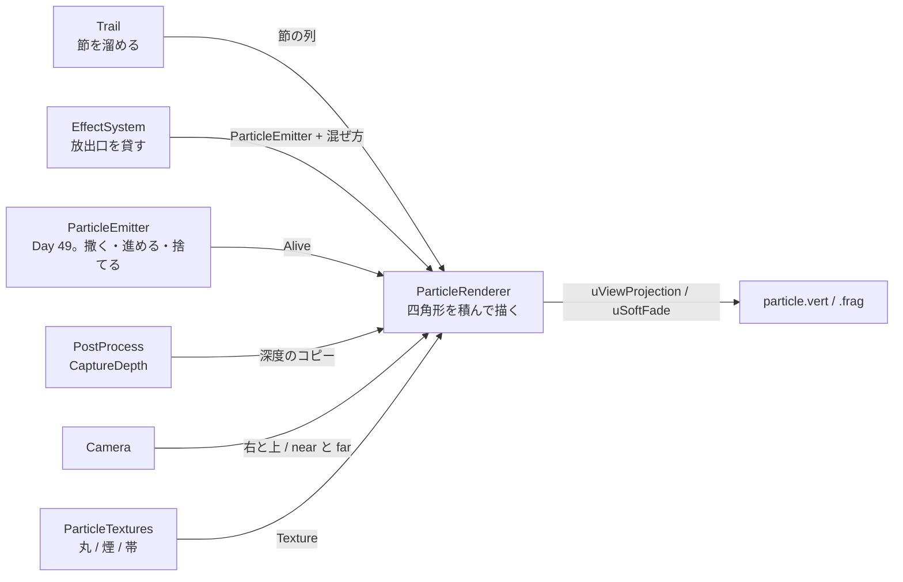
```mermaid
flowchart LR
    T["Trail<br/>節を溜める"] -- "節の列" --> PR["ParticleRenderer<br/>四角形を積んで描く"]
    ES["EffectSystem<br/>放出口を貸す"] -- "ParticleEmitter + 混ぜ方" --> PR
    E["ParticleEmitter<br/>Day 49。撒く・進める・捨てる"] -- "Alive" --> PR
    PR -- "uViewProjection / uSoftFade" --> S["particle.vert / .frag"]
    PP["PostProcess<br/>CaptureDepth"] -- "深度のコピー" --> PR
    C["Camera"] -- "右と上 / near と far" --> PR
    TX["ParticleTextures<br/>丸 / 煙 / 帯"] -- "Texture" --> PR
```

**`ParticleRenderer` に入る矢印が4本になった**のが今日の姿になる。
昨日は `ParticleEmitter` と `Camera` と `Texture` の3本だったところへ、
`Trail`(別の形の四角形)と `PostProcess`(深度)が足された。

<b>出ていく矢印は1本のまま</b>なのが大事なところ。
`Trail` も `EffectSystem` も `GL` を1行も知らず、
`ParticleRenderer` だけが GL を触る——Day 49 で引いた線がそのまま通っている。
おかげで今日の自己チェック 37 項目は<b>全部が窓を開かずに走る</b>
(昨日は 27 項目中 20 項目だった)。

### 「刺さり」が消えるまで

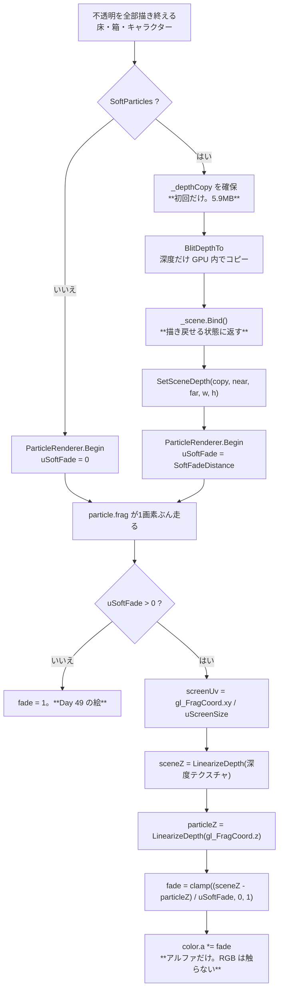
```mermaid
flowchart TD
    OP["不透明を全部描き終える<br/>床・箱・キャラクター"] --> CD{"SoftParticles ?"}
    CD -- "いいえ" --> BG["ParticleRenderer.Begin<br/>uSoftFade = 0"]
    CD -- "はい" --> AL["_depthCopy を確保<br/>**初回だけ。5.9MB**"]
    AL --> BL["BlitDepthTo<br/>深度だけ GPU 内でコピー"]
    BL --> RB["_scene.Bind&lpar;&rpar;<br/>**描き戻せる状態に返す**"]
    RB --> SD["SetSceneDepth&lpar;copy, near, far, w, h&rpar;"]
    SD --> BG2["ParticleRenderer.Begin<br/>uSoftFade = SoftFadeDistance"]
    BG --> FR
    BG2 --> FR["particle.frag が1画素ぶん走る"]
    FR --> Q{"uSoftFade &gt; 0 ?"}
    Q -- "いいえ" --> OUT["fade = 1。**Day 49 の絵**"]
    Q -- "はい" --> UV["screenUv = gl_FragCoord.xy / uScreenSize"]
    UV --> SZ["sceneZ = LinearizeDepth&lpar;深度テクスチャ&rpar;"]
    SZ --> PZ["particleZ = LinearizeDepth&lpar;gl_FragCoord.z&rpar;"]
    PZ --> FD["fade = clamp&lpar;&lpar;sceneZ - particleZ&rpar; / uSoftFade, 0, 1&rpar;"]
    FD --> OUT2["color.a *= fade<br/>**アルファだけ。RGB は触らない**"]
```

**`_scene.Bind()` を忘れると症状が遠くに出る**。
`BlitFramebuffer` は読み書きの割り当てを変えるので、
戻さないまま続きを描くと<b>粒が画面へ直接描かれ</b>、後処理を1つも通らない。
「ソフトパーティクルを ON にしたらブルームが効かなくなった」という形で出るので、
深度のコピーを疑うところまで辿り着きにくい。

**`LinearizeDepth` が2箇所にある**(`particle.frag` と `ParticleRenderer`)。
重複だが、<b>シェーダの式が合っているかを確かめる方法が他に無い</b>——
GPU の中身は読めないので、片方を CPU に持ってきて数で確かめるしかない。
自己チェックの1〜3項目がそれになる。

### トレイルの節が1つ増えるまで

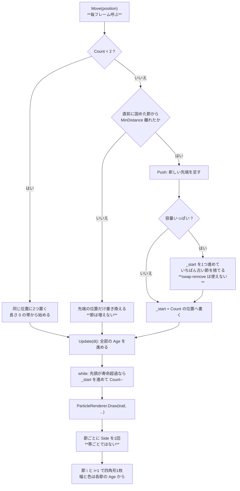
```mermaid
flowchart TD
    M["Move&lpar;position&rpar;<br/>**毎フレーム呼ぶ**"] --> C0{"Count &lt; 2 ?"}
    C0 -- "はい" --> P2["同じ位置に2つ置く<br/>長さ 0 の帯から始める"]
    C0 -- "いいえ" --> D{"直前に固めた節から<br/>MinDistance 離れたか"}
    D -- "はい" --> PU["Push: 新しい先端を足す"]
    D -- "いいえ" --> TP["先端の位置だけ書き換える<br/>**節は増えない**"]
    PU --> FULL{"容量いっぱい ?"}
    FULL -- "はい" --> DR["_start を1つ進めて<br/>いちばん古い節を捨てる<br/>**swap-remove は使えない**"]
    FULL -- "いいえ" --> OK["_start + Count の位置へ書く"]
    DR --> OK
    P2 --> UP
    TP --> UP
    OK --> UP["Update&lpar;dt&rpar;: 全部の Age を進める"]
    UP --> WH["while: 先頭が寿命超過なら<br/>_start を進めて Count--"]
    WH --> DRW["ParticleRenderer.Draw&lpar;trail, ...&rpar;"]
    DRW --> SI["節ごとに Side を1回<br/>**帯ごとではない**"]
    SI --> QD["節 i と i+1 で四角形1枚<br/>幅と色は各節の Age から"]
```

**`while` 1本で捨てられる**のがリングバッファの配当になる。
節は置かれた順に並んでいるので、
いちばん古いものが寿命内ならその先も寿命内——全部を舐める必要が無い。
粒(Day 49)は順番がバラバラなので全部見る必要があった。
<b>順番を保つ制約は、捨てるときには逆に効く</b>。

**`Side` を節ごとに出す**のは継ぎ目のため。
帯ごとに計算すると、隣り合う2枚が共有するはずの辺がわずかに違う場所に来て隙間が開く。
節で1つに決めておけば、両側の帯が同じ2点を使うので必ず閉じる。

### エフェクトが1つ出て、自分で片付くまで

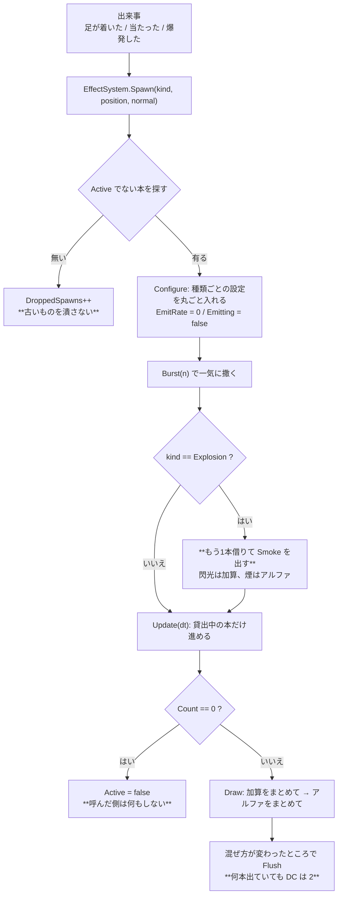
```mermaid
flowchart TD
    EV["出来事<br/>足が着いた / 当たった / 爆発した"] --> SP["EffectSystem.Spawn&lpar;kind, position, normal&rpar;"]
    SP --> FIND{"Active でない本を探す"}
    FIND -- "無い" --> DROP["DroppedSpawns++<br/>**古いものを潰さない**"]
    FIND -- "有る" --> CFG["Configure: 種類ごとの設定を丸ごと入れる<br/>EmitRate = 0 / Emitting = false"]
    CFG --> BU["Burst&lpar;n&rpar; で一気に撒く"]
    BU --> EXP{"kind == Explosion ?"}
    EXP -- "はい" --> SM["**もう1本借りて Smoke を出す**<br/>閃光は加算、煙はアルファ"]
    EXP -- "いいえ" --> UPD
    SM --> UPD["Update&lpar;dt&rpar;: 貸出中の本だけ進める"]
    UPD --> Z{"Count == 0 ?"}
    Z -- "はい" --> RET["Active = false<br/>**呼んだ側は何もしない**"]
    Z -- "いいえ" --> DR2["Draw: 加算をまとめて → アルファをまとめて"]
    DR2 --> DC["混ぜ方が変わったところで Flush<br/>**何本出ていても DC は 2**"]
```

**`EmitRate = 0` と `Emitting = false` が生命線**になる。
撒き続ける放出口は `Count` が 0 にならないので本が返らず、
「しばらく遊んでいるとエフェクトが出なくなる」という形で出る。
自己チェックの「一発ものは放出を止めてある」がこれを見ている。

**爆発だけが2本使う**のは、閃光(加算)と煙(アルファ)が
1つの放出口に同居できないため。実際のエンジンでも
1つのプレハブに ParticleSystem が何個もぶら下がるのは同じ理由になる。

### 設定の表をどちらに置いたか

Day 49 は筋書きの設定を `Program.ApplyParticleScene`(使う側)に置いた。
「火とはこういうものだ」という判断をエンジンに入れたくなかったからで、
`ParticleEmitter` は<b>撒いて進めて捨てるだけ</b>にしてある。

今日の `EffectSystem.Configure` は<b>エンジン側</b>に置いた。判断が逆に見えるが、
分かれ目は<b>誰が何度呼ぶか</b>になる。

| | Day 49 の筋書き | Day 50 のエフェクト |
|---|---|---|
| 誰が呼ぶか | メニュー(人が押したとき) | ゲームのロジック(**毎秒何度でも**) |
| いくつあるか | 5つ(デモの都合) | 5つ(ゲームの語彙) |
| 変わるか | デモを作り替えれば消える | **Day 51 以降ずっと使う** |

「足が着いた」「当たった」はゲームの語彙であって、デモの都合ではない。
呼ぶ側が毎回 12 行の設定を書くことになるなら、それは表にする頃合いになる——
Day 48 で `OnKeyDown` の 159 個を表にしたのと同じ判断が、
スケールを変えてもう一度出てきた形になる。

### 今日残した歪み(3つ)

**1つ目: 深度のコピーが全画面のまま**。
`CaptureDepth` は毎フレーム画面1枚ぶんの帯域を使う。
粒が1つも出ていないフレームでは呼ばないようにしてあるが、
出ている間は解像度なりに掛かる。
本気で削るなら<b>粒を半解像度で描いて、深度も半分に落とす</b>ことになり、
そうすると今度は縁のアップサンプルが要る(bilateral upsample)。
オーバードローが問題になった日に手を付ける。

**2つ目: 混ぜ方の切り替えがドローコールを増やす**。
要点7で書いたとおり、加算とアルファの同居は 2 回で済ませてある。
Day 49 の改造課題2(事前乗算に寄せる)を通せば 1 回になるが、
今日は<b>切り替えの代償が数字で見えるほう</b>を残した。
`EffectSystem.Draw` が混ぜ方でまとめている前提が崩れると
(たとえば正しい前後関係のために出た順に描くと)ここは一気に増える。

**3つ目: トレイルが1本しか無い**。
`Program` が `_trail` を1本だけ持っていて、複数のトレイルを扱う仕組みが無い。
`EffectSystem` と同じようにプール化すればよいが、
今日の時点で2本目が要る場面が無いので入れていない。
Day 51 でキャラクターの手足に付けたくなったら、
<b>`EffectSystem` とまったく同じ形</b>で `TrailSystem` を書くことになる。

Day 49 の設計書を丸ごと引き継ぎ、差分の当たった図にだけ手を入れてある。
変わった図は次の3つ。

| 図 | 何が変わったか |
|---|---|
| `Render` のクラス図 | **トレイルとエフェクトの5つの型が増えた**。`Framebuffer` / `PostProcess` / `ParticleRenderer` に口が増えた |
| `1フレームの流れ` | 粒のパスの手前に**深度の写しが挟まった** |
| `Demo` のクラス図 | ページが 17 枚から **18 枚**になった |

新しく足した図が4つ(この節の上に並べたもの)。

| 図 | 何を描いたか |
|---|---|
| 今日の3つが乗った場所 | `ParticleRenderer` に入る矢印が4本になったこと |
| 「刺さり」が消えるまで | 深度のコピー → 線形化 → フェード |
| トレイルの節が1つ増えるまで | 先端の書き換えと、リングバッファの捨て方 |
| エフェクトが出て片付くまで | 借りる → 撒く → 返る、と混ぜ方でまとめる描画 |

`Physics/` と `Model/` と `Ecs/` の図は**昨日のまま**で、今日は1つも触っていない。

### 全体構成 — 9つの層と、その上のゲームとデモ(Day 39 から変更なし)

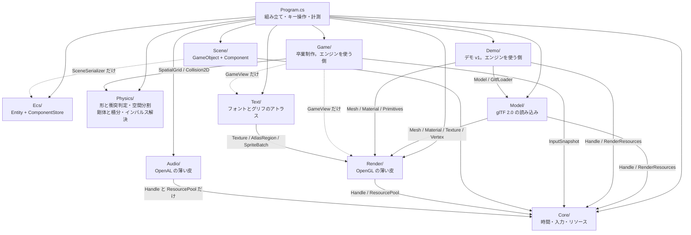
```mermaid
graph TD
    DM["Demo/<br/>デモ v1。エンジンを使う側"]
    G["Game/<br/>卒業制作。エンジンを使う側"]
    P["Program.cs<br/>組み立て・キー操作・計測"]
    S["Scene/<br/>GameObject + Component"]
    E["Ecs/<br/>Entity + ComponentStore"]
    PH["Physics/<br/>形と衝突判定・空間分割<br/>剛体と積分・インパルス解決"]
    T["Text/<br/>フォントとグリフのアトラス"]
    MD["Model/<br/>glTF 2.0 の読み込み"]
    R["Render/<br/>OpenGL の薄い皮"]
    A["Audio/<br/>OpenAL の薄い皮"]
    C["Core/<br/>時間・入力・リソース"]

    P --> DM
    P --> G
    P --> S
    P --> E
    P --> PH
    P --> T
    P --> MD
    P --> R
    P --> A
    P --> C
    MD -->|"Mesh / Material / Texture / Vertex"| R
    MD -->|"Handle / RenderResources"| C
    DM -->|"Mesh / Material / Primitives"| R
    DM -->|"Model / GltfLoader"| MD
    DM -->|"Handle / RenderResources"| C
    G -->|SpatialGrid / Collision2D| PH
    G -->|InputSnapshot| C
    G -.->|GameView だけ| T
    G -.->|GameView だけ| R
    S --> C
    S -.->|SceneSerializer だけ| E
    T -->|Texture / AtlasRegion / SpriteBatch| R
    R -->|Handle / ResourcePool| C
    A -->|Handle と ResourcePool だけ| C
```

**Day 43 でも層は増えていない**。増えたのは `Physics/` の中のクラス8つで、
矢印は1本も足していない——`Physics/` は今日も
**`System.Numerics` しか使わない、どこにも依存しない層**のまま。
物理エンジンは外の世界を知りたがる層なので、
ここが保たれているかは毎日確かめる価値がある(設計書の冒頭)。

**Day 40 でも層は増えていない**。増えたのは `Demo/` の中のクラス2つ
(`CameraPath` と `FeatureToggles`)だけで、矢印は1本も足していない。
`FeatureToggles` に至っては `Render` の型を1つも知らないので、
図の上では `Demo/` の箱の中に完全に収まっている。

**Day 39 で層が1つ増えた**。Phase 6 に入ってから8日間、
足したものは全部 `Render/` の中に収まっていたので、久しぶりの構造の変化になった。

`Demo/` は `Game/` とまったく同じ位置に入る——
**`Program` から呼ばれ、`Render` と `Model` と `Core` を使い、
誰からも知られていない**。「エンジンを使う側」の層が2つ並んだ形。

`Game/` との違いは、下に伸びる矢印の先。

| | 使うもの | 使わないもの |
|---|---|---|
| `Game/` | `Physics` / `Core`(+ `GameView` だけ `Text` と `Render`) | `Render` の 3D、`Model` |
| `Demo/` | `Render`(3D)/ `Model` / `Core` | `Physics` / `Ecs` / `Scene` / `Text` / `Audio` |

**両方とも `Scene/` を使っていない**のが今の姿。
ゲームは構造体の配列で足りていて(Day 29 の判断)、
デモは静止しているので階層が要らない。
`Scene/`(GameObject + Component)が本領を発揮するのは
**キャラクターが歩き回る Day 51** で、そこで初めて
「動くものだけが `Scene/` に載り、背景は `Demo/` のまま」という分業になる。

**Day 37 でもクラスの増減は無い**(`Ssao` は `Render/` の中)。
Phase 6 に入ってから7日間、層は8つのまま変わっていない——
`PostProcess` / `ShadowMap` / `EnvironmentMap` / `Ssao` はどれも
「`Render/` の中で、`GL` と `Framebuffer` と `Shader` しか知らないクラス」として収まった。
Day 25 で層を切り分けた配当が、いちばん機能を足した Phase でそのまま効いている。

**Day 34 でもクラスの増減は無い**(`SurfaceMaps` は `Render/` の中)。
層が増えないまま機能だけが積み上がるのは、
Day 25 で層を切り分けた配当が続いている、と読める。

**Day 33 でクラスの増減は無かった**(`ShadowMap` は `Render/` の中)。
代わりに**矢印を1本直した**。`Core` ⇔ `Render` の相互参照が、
実は Day 31 の時点で解消されていた——
`ResourceManager` を `Render/RenderResources` へ引っ越したのがそれで、
設計書のほうが2日ぶん追随していなかった。

`Core/` の中身を実際に調べると、`Silk.NET.OpenGL` を using しているファイルは1つも無い。
**いま `Core/` は本当に時間・入力・ハンドルだけの層**になっている。

**Day 32 で `Model/` が1つ増えた**。矢印の向きは変わっていない。

`Model/` は `Text/` とまったく同じ位置に入る——
**`Render/` の上に乗り、`Render/` からは知られていない**一方通行。
`Text/` がグリフを `Texture` に焼いて `SpriteBatch` に積むように、
`Model/` は glTF を `Mesh` と `Material` に変換する。
どちらも「素材の形式を、描画の言葉に翻訳する層」で、性格が揃っている。

**逆向き(`Render` が glTF を知っている)にしなかった**のが要点。
そうすると `Mesh` が「glTF から作られたか、コードで作られたか」を抱え込むことになり、
Day 41 で FBX を足したくなったときに `Render/` を触る羽目になる。
`Primitives`(コードで作る)と `GltfLoader`(ファイルから作る)が
**同じ `Mesh` を作る2つの入口**として並んでいるのが、今の形。

後処理は `Render/` の中で閉じている。`PostProcess` が知っているのは
`GL` と `Framebuffer` と `Shader` と `RenderResources` だけで、
**シーンに何が入っているかを一切知らない**。だから
`Program` が「今日はゲームを描く」「今日はデモを描く」と切り替えても、
後処理側は1行も変わらない。

**Day 33 の `ShadowMap` は、この方針をそのまま踏襲している**。
持っているのは深度バッファと光源行列だけで、
「何を影として落とすか」は `Begin` と `End` の間で外から描いてもらう。

```csharp
_shadow.Begin(_lightDirection, _orbit.Target);
// ここで好きなものを _shadow.Draw(mesh, model) する
_shadow.End(width, height);
```

`PostProcess.Begin` / `End` と同じ形にしてあるので、
**「シーンを知らないパス」の作り方が2例そろった**ことになる。
2例あると形が見えてくるのがよいところで、
Day 37 の SSAO も Day 52 の G-Buffer も、この形で足せる。

**Day 37 の `Ssao` が、その予告どおりに入った**。

```csharp
_ssao.BeginGeometry(_camera);
// ここで好きなものを _ssao.Draw(mesh, model) する
_ssao.EndGeometry();
_ssao.Compute(_camera, width, height);
```

`ShadowMap` との違いは、`Begin` に渡すのが**光の向きではなくカメラ**であることと、
描き終えたあとに `Compute`(フルスクリーンのパス2枚)が続くこと。
形が同じなので、`Program` 側は影パスの真下にもう1本並べるだけで済んだ。

**これが Render To Texture のいちばんの配当**で、
画面全体に効く処理(影・SSAO・被写界深度・ディファード)は
今後すべてこの位置に差し込むことになる。

**`Game` から `Audio` への線が無い**のが Day 29 から見てほしいところ。
音は鳴るが、鳴らしているのは `Program` で、ゲームは
「弾を撃った」「敵が死んだ」を <c>OnEvent</c> で外へ投げるだけ。

```csharp
public Action<GameEvent, Vector2>? OnEvent { get; set; }
```

こうしておくと、**自己チェックで 600 秒ぶんを無音で回せる**。
`SurvivorGame` が直接 `_audio.Play` を呼んでいたら、
テストのたびにデバイスを開くことになり、
音の出ない環境ではそもそも動かせない。

同じ理由で `SurvivorGame` は `GameView` も知らない。
**状態を進めるものと、状態を見るもの**が分かれている(Day 19 の線)。

| 層 | 依存先 | 備考 |
|---|---|---|
| `Physics/` | **なし** | `System.Numerics` だけ。そのまま別プロジェクトへ持ち出せる。**Day 43 で剛体が入っても変わらず** |
| `Ecs/` | **なし** | 同上。Day 23 で「他に依存しないので先に5つ書ける」と書いたとおり |
| `Scene/` | `Core`(`InputSnapshot`)、`Ecs`(`SceneSerializer` のみ) | **描画を一切知らない**。`SpriteRenderer` は絵の種類と大きさを持つデータでしかない |
| `Render/` | `Core`(`Handle` / `ResourcePool`) | `RenderResources` が箱を借りる。**GL を触るのは全部この層** |
| `Text/` | `Render`(`Texture` / `AtlasRegion` / `SpriteBatch`) | **一方通行**。`Render` は `Text` を知らない |
| **`Model/`** | `Render`(`Mesh` / `Material` / `Texture` / `Vertex` / `RenderResources`)、`Core`(`Handle`) | **一方通行**。`Render` は glTF を知らない |
| `Audio/` | `Core`(`Handle` / `ResourcePool` **のみ**) | **一方通行**。`Core` は `Audio` を知らない |
| **`Game/`** | `Physics` / `Core`(入力)。描画側だけ `Render` と `Text` | **エンジンは `Game` を知らない**。窓も GL も音も知らない |
| `Core/` | **なし** | Day 31 の引っ越しで一方通行になった(下の「相互参照だった話」) |
| `Program.cs` | 全部 | 組み立て役。9500行あるが、その大半はデモ・計測・自己チェック |

`Game/` の中でも線が引いてある。

| ファイル | 知っていること | 知らないこと |
|---|---|---|
| `GameBalance` | プレイヤー・敵・湧き・経験値の数字 | 全部 |
| `Weapons` | 武器の成長カーブ(レベル → 性能) | ゲームの状態 |
| `UpgradeOption` | 選択肢の中身と、見せる文字 | 適用の仕方 |
| `SurvivorGame` | 形と当たり判定、空間分割、入力、成長 | 描画、音、窓、GL |
| `GameView` | スプライトの積み方、文字の出し方 | ゲームを進める方法(読むだけ) |

**`GameView` が状態を1文字も書き換えない**のは意図的で、
だから描画を丸ごと止めてもゲームは同じように進む。
自己チェックが窓を出さずに回せるのはこの性質のおかげ。

**`Text/` だけが他の層の上に乗っている**。
`Physics/` も `Audio/` も自分で完結していて、単体で別プロジェクトへ持ち出せるが、
`Text/` は `Render/` が無いと成立しない——グリフを置く先が `Texture` で、
積む先が `SpriteBatch` だから。

これは歪みではなく**素直な積み方**で、`Text` → `Render` の一方通行になっている。
逆向き(`SpriteBatch` が文字を知っている)にすると、
描画の中核が「文字とは何か」を抱え込むことになる。
`SpriteBatch` から見れば、文字は**ただの四角**でしかない。

**`Core` と `Render` が相互参照だった話**(Day 25 で見つけ、Day 31 で直した)。

`ResourceManager`(Core)が `Texture`(Render)を作り、
`Material`(Render)が `ResourceManager`(Core)を呼ぶ、という往復になっていた。
名前空間が `HonyaEngine` 1つなので動きはするが、
**アセンブリを分けようとした瞬間に破綻する**形だった。

直し方は Day 25 の設計書に書いたとおりで、
**`ResourcePool` と `Handle` だけを下層に残し、窓口は `Render/` へ上げる**。
Day 31 でそれを実行し、`Core/ResourceManager.cs` は `Render/RenderResources.cs` になった。
名前も変えたのは、中で持っているのが `Texture` と `Shader` だけ——
つまり全部 GL のもので、「全リソースの窓口」という名前が中身と合っていなかったため。

**設計書のほうは2日ぶん直し忘れていた**(Day 31・32 の図に `Core/ResourceManager` が残っていた)。
図は実装から起こし直さないと、**コードより先に図が嘘になる**。
今日そこを直したので、この節は「歪みの記録」ではなく「直した記録」になった。

**Day 27 の判断**: 音を足すとき、この歪みを繰り返さないようにした。

音のリソースも「パスをキーにして使い回し、ハンドルで配る」という点でテクスチャと同じなので、
当時の `ResourceManager` に `LoadAudio` を足すのが自然に見える。
だがそうすると `ResourceManager`(= 当時は `Core`)が **GL と OpenAL の両方を握る**ことになり、
当時の相互参照が「`Core` ⇔ `Render` + `Core` ⇔ `Audio`」に増える。

そこで `AudioSystem` は、`Core` から**総称型の `ResourcePool<T>` と `Handle<T>` だけを借りて**、
音のリソースは自分で持つ形にした。`ResourcePool<T>` は `T` が何かを知らないので、
借りても依存が増えない。結果、`Audio/` → `Core/` の**一方通行**が保たれている。

図に描いておくと、こういう判断が「なんとなく」ではなくできるようになる。
**設計書は、次に何かを足すときのために書いている**。

### Core — 時間・入力・リソース(Day 45 で `GameAction` に `Jump` が増えた)

`GameAction` は `[Flags]` の `uint` なので 32 個までしか作れない。
Day 18 で `MoveLeft`〜`Dash` の5つを置いてから、今日ようやく6つ目。
**`Space` はデバッグ用の一時停止と衝突する**ので、
キャラクターデモの間だけ `Program.OnKeyDown` が横取りしている——
Day 18 に「本来はデバッグ用の入力を別のマップに分けるのが筋」と書いた宿題が、
今日ついに実害として出た形になる。

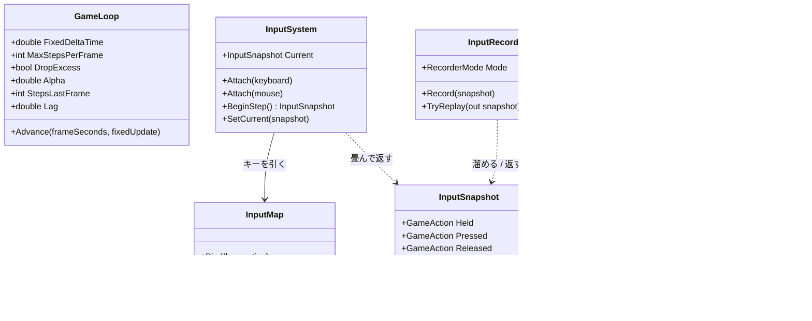
```mermaid
classDiagram
    class GameLoop {
        +double FixedDeltaTime
        +int MaxStepsPerFrame
        +bool DropExcess
        +double Alpha
        +int StepsLastFrame
        +double Lag
        +Advance(frameSeconds, fixedUpdate)
    }
    class InputSystem {
        +InputSnapshot Current
        +Attach(keyboard)
        +Attach(mouse)
        +BeginStep() InputSnapshot
        +SetCurrent(snapshot)
    }
    class InputMap {
        +Bind(key, action)
        +Resolve(key) GameAction
        +CreateDefault() InputMap
    }
    class InputSnapshot {
        +GameAction Held
        +GameAction Pressed
        +GameAction Released
        +Vector2 MoveAxis
        +IsHeld(action) bool
        +WasPressed(action) bool
    }
    class InputRecorder {
        +RecorderMode Mode
        +Record(snapshot)
        +TryReplay(out snapshot) bool
    }
    class Handle {
        +bool IsValid
    }
    class ResourcePool {
        +Add(value) Handle
        +TryGet(handle, out value) bool
        +Retain(handle) bool
        +Release(handle, out removed) bool
        +Replace(handle, value, out prev) bool
    }

    InputSystem --> InputMap : キーを引く
    InputSystem ..> InputSnapshot : 畳んで返す
    InputRecorder ..> InputSnapshot : 溜める / 返す
    ResourcePool ..> Handle : 添字 + 世代を配る
```

**`ResourceManager` がこの図から消えた**(Day 33 で図を直した)。
Day 31 で `Render/RenderResources` へ引っ越していたのに、
Day 31・32 の設計書には `Core` に居るままで描いてあった。
実物は `Render` のクラス図のほうに載せてある。

`ResourcePool` と `Handle` は総称型(`ResourcePool<T>` / `Handle<T>`)。
`T` が何かを知らないまま添字と世代だけを管理するので、`Texture` にも `Shader` にも同じものが使える。
**`T` を知らないから下層に残せた**——引っ越しでこの2つだけ `Core/` に残したのはそのため。

この層で押さえるべき責務の線引き:

- **`GameLoop` は時間しか知らない**。何を更新するかは `Action<float>` で渡される
- **`InputSystem` はデバイスのイベントを畳むだけ**。ゲームとしての意味づけは `InputMap` が持つ
- **`InputSnapshot` は値**。だから記録・再生で丸ごと差し替えられる(Day 20 の肝)
- **`Core/` は GL を1行も知らない**。`Silk.NET.OpenGL` を using しているファイルが無い、が実際の姿

### Render — OpenGL の薄い皮(Day 50 でトレイルとエフェクトの5つが増えた)

**カプセルのメッシュは作っていない**。カプセルは半径と半分の高さで形が変わるので、
1本のメッシュを拡大して描くことができない(Y だけ引き伸ばすと半球が楕円に潰れる)。
代わりに**球2つ + 円柱1本**に分けて描く——
円柱は「XZ に半径、Y に高さ」という非一様な拡大でも円柱のままなので、
これなら<b>どんな寸法のカプセルでもメッシュ2本で描ける</b>(要点10)。

面白いのは、**この分け方が判定とぴったり同じ**であること。
`Collision3D` がカプセルの判定を球に落として解いているのと、
`Primitives` が円柱と球でカプセルを組み立てているのは、
同じ「線分 + 半径」の言い換えになっている。



```mermaid
classDiagram
    class Camera {
        +Vector3 Position
        +Vector3 Target
        +ProjectionMode Mode
        +float FieldOfView
        +float AspectRatio
        +Matrix4x4 ViewProjection
        +CreateScreen(width, height) Matrix4x4
    }
    class OrbitCameraController {
        +float Yaw
        +float Pitch
        +float Distance
        +Vector3 Target
        +Apply()
        +EyePosition(target, distance, yaw, pitch) Vector3$
    }
    class Shader {
        +Use()
        +SetInt(name, value)
        +SetVector3(name, value)
        +SetVector3Array(name, values)
        +SetVector4(name, value)
        +SetMatrix3(name, value)
        +SetMatrix4(name, value)
        +SetMatrix4Array(name, values)
        +TryReload() bool
    }
    class Texture {
        +uint Handle
        +int Width
        +int Height
        +bool HasMipmaps
        +FromFile(gl, path) Texture
        +DecodeFile(path) DecodedImage
        +FromPixels(gl, pixels, w, h, mipmaps, srgb) Texture
        +FromFloatPixels(gl, data, w, h, components) Texture
        +DecodeBytes(encoded) DecodedImage
        +CreateR8(gl, w, h) Texture
        +CreateTarget(gl, w, h, format) Texture
        +CreateDepthTarget(gl, w, h) Texture
        +UploadR8(x, y, w, h, coverage)
        +SetFilter(filter)
        +SetWrap(wrap)
        +Bind(unit)
    }
    class TextureWrap {
        <<enumeration>>
        Repeat
        ClampToEdge
        ClampToBorder
    }
    class RenderResources {
        +int MaxUploadsPerFrame
        +int PendingCount
        +Texture Placeholder
        +LoadTexture(path, mipmaps, srgb) Handle
        +LoadTextureFromMemory(key, bytes, mipmaps, srgb) Handle
        +LoadTextureFromPixels(key, rgba, w, h, mipmaps, srgb) Handle
        +LoadTextureAsync(path) Handle
        +LoadShader(vert, frag) Handle
        +Update()
        +GetTexture(handle) Texture
        +GetShader(handle) Shader
        +Retain(handle) bool
        +Release(handle) bool
    }
    class RenderTargetFormat {
        <<enumeration>>
        Rgba8
        Rgba16F
        R8
    }
    class Framebuffer {
        +uint Handle
        +Texture Color
        +Texture Depth
        +int Width
        +int Height
        +RenderTargetFormat Format
        +long ByteSize
        +CreateDepthOnly(gl, w, h) Framebuffer
        +Bind()
        +BindDefault(gl, w, h)
        +BlitDepthTo(destination)
        +Resize(w, h)
        +SetFormat(format)
    }
    class ShadowMap {
        +bool Enabled
        +int Resolution
        +Framebuffer Target
        +Matrix4x4 LightSpaceMatrix
        +int PcfRadius
        +int TapCount
        +float DepthBias
        +bool SlopeBias
        +bool CullFrontFaces
        +float Radius
        +float WorldPerTexel
        +bool ShowMap
        +int DrawCalls
        +long ByteSize
        +Begin(lightDirection, center)
        +Draw(mesh, model, joints)
        +End(screenWidth, screenHeight)
        +Apply(shader, unit)
        +DrawDebug(screenWidth, screenHeight)
        +SetResolution(resolution)
    }
    class PostProcess {
        +RenderTargetFormat SceneFormat
        +bool BloomEnabled
        +ToneMapOperator ToneMap
        +PostDebugView DebugView
        +float Exposure
        +float BloomThreshold
        +float BloomIntensity
        +ColorGrade Grade
        +bool FxaaEnabled
        +FxaaQuality Quality
        +FxaaDebugView FxaaDebugView
        +float FxaaEdgeThreshold
        +float FxaaEdgeThresholdMin
        +float FxaaSpanMax
        +PostSplit Split
        +float SplitPosition
        +Framebuffer Scene
        +Framebuffer Ldr
        +Texture SceneDepth
        +double DepthCopyMilliseconds
        +int PassCount
        +long ByteSize
        +Begin(clearColor)
        +CaptureDepth()
        +End(screenWidth, screenHeight)
        +EndToTarget(target)
        +SetFxaaQuality(quality)
        +Resize(w, h)
        +ReloadShaders()
    }
    class ColorGrade {
        +bool Enabled
        +float Temperature
        +float Tint
        +float Contrast
        +float Saturation
        +Vector3 Filter
        +GradePreset Preset
        +bool IsIdentity
        +Vector3 WhiteBalance
        +ApplyPreset(preset)
        +MarkCustom()
        +Apply(shader)
    }
    class GradePreset {
        <<enumeration>>
        Neutral
        Sunset
        Moonlight
        Bleach
        Monochrome
    }
    class FxaaQuality {
        <<enumeration>>
        Low
        Medium
        High
        Extreme
    }
    class FxaaDebugView {
        <<enumeration>>
        None
        Luma
        Edge
        Blend
    }
    class PostSplit {
        <<enumeration>>
        None
        Grade
        Fxaa
    }
    class ToneMapOperator {
        <<enumeration>>
        None
        Reinhard
        Aces
    }
    class PostDebugView {
        <<enumeration>>
        Final
        SceneOnly
        Bright
        Bloom
    }
    class TextureAtlas {
        +Texture Texture
        +FromFiles(gl, paths, padding) TextureAtlas
    }
    class AtlasRegion {
        +Texture Texture
        +Vector2 UvMin
        +Vector2 UvMax
    }
    class Material {
        +string Name
        +Handle Shader
        +Handle MainTexture
        +Vector4 Tint
        +Vector2 UvScale
        +Vector4 BaseColorFactor
        +float MetallicFactor
        +float RoughnessFactor
        +Handle MetallicRoughnessTexture
        +Handle NormalTexture
        +Handle OcclusionTexture
        +Handle EmissiveTexture
        +Vector3 EmissiveFactor
        +float NormalScale
        +Handle HeightTexture
        +float ParallaxScale
        +bool DoubleSided
        +string AlphaMode
        +Apply(resources)
    }
    class Mesh {
        +int VertexCount
        +int IndexCount
        +Draw()
        +ReadVertices() TVertex[]
        +ReadIndices() uint[]
        +Dispose()
    }
    class Vertex {
        +Vector3 Position
        +Vector2 TexCoord
        +Vector4 Color
        +Vector3 Normal
        +Vector4 Tangent
        +Vector4 Joints
        +Vector4 Weights
        +Attributes
    }
    class SurfaceMaps {
        <<static>>
        +int Size
        +float MortarWidth
        +CreateHeight() byte[]
        +CreateNormal(strength) byte[]
        +CreateBaseColor() byte[]
        -HeightAt(x, y) float
        -Noise(x, y, cells) float
        -Wrap(value, period) int
    }
    class SpriteVertex {
        +Vector2 Position
        +Vector2 TexCoord
        +uint Color
        +PackColor(color) uint
    }
    class VertexAttribute {
        +int ComponentCount
        +bool Normalized
        +int ByteSize
    }
    class SpriteBatch {
        +SpriteSortMode SortMode
        +int DrawCallCount
        +Begin(projection, sortMode)
        +Draw(texture, center, size, rotation, color, layer)
        +End()
    }
    class Primitives {
        +CreateQuad(gl) Mesh
        +CreateCube(gl) Mesh
        +CreateSphere(gl, slices, stacks) Mesh
        +CreateCylinder(gl, slices) Mesh
        +CreateHeightField(gl, heights, columns, rows, cellSize, uvScale) Mesh
    }
    class Pbr {
        <<static>>
        +float DielectricF0
        +float MinRoughness
        +Alpha(roughness, perceptual) float
        +DistributionGgx(nDotH, alpha) float
        +DirectK(roughness) float
        +GeometrySchlickGgx(nDotX, k) float
        +GeometrySmith(nDotV, nDotL, roughness) float
        +FresnelSchlick(cosTheta, f0) Vector3
        +F0Of(baseColor, metallic, dielectricF0) Vector3
        +Evaluate(n, v, l, baseColor, metallic, roughness) Vector3
        +IntegrateNdf(alpha, steps) double
        +Hammersley(i, count) Vector2
        +ImportanceSampleGgx(xi, n, alpha) Vector3
        +DirectionalAlbedo(n, v, baseColor, metallic, roughness) Vector3
        +IblK(roughness) float
        +GeometrySmithIbl(nDotV, nDotL, roughness) float
        +FresnelSchlickRoughness(cosTheta, f0, roughness) Vector3
        +IntegrateBrdf(nDotV, roughness, samples) Vector2
    }
    class CubeMap {
        +uint Handle
        +int Size
        +int MipLevels
        +long ByteSize
        +Create(gl, size, mipLevels) CubeMap
        +FullMipCount(size) int
        +EnableSeamless(gl)
        +FaceViews(eye) Matrix4x4[]
        +FaceProjection() Matrix4x4
        +Bind(unit)
        +GenerateMipmaps()
        +ReadFace(face, mip) float[]
    }
    class SkyImage {
        <<static>>
        +int Width
        +int Height
        +Create(sunDirection) float[]
        +Sample(direction, toSun) Vector3
        +IntegrateIrradiance(n, toSun, steps) Vector3
    }
    class HdrImage {
        <<static>>
        +Load(path) Result
        -ReadScanline(bytes, cursor, scanline, width, path)
        -ReadFlatScanline(bytes, cursor, scanline, width, path)
        -ReadLine(bytes, cursor) string
    }
    class HdrResult {
        <<record struct>>
        +float[] Pixels
        +int Width
        +int Height
        +float Exposure
    }
    class SkyAnalysis {
        <<static>>
        +DirectionAt(x, y, width, height) Vector3
        +Analyze(pixels, width, height, threshold) Result
        +RemoveSun(pixels, width, height, analysis) float[]
        -AngleTo(x, y, width, height, direction) float
    }
    class Sun {
        <<record struct>>
        +Vector3 Direction
        +Vector3 Irradiance
        +float SolidAngle
        +float AngularRadius
        +int PixelCount
        +float PeakLuminance
    }
    class SkyResult {
        <<record struct>>
        +Sun Sun
        +Vector3 TotalIrradiance
        +Vector3 SkyAverage
        +float SunShare
        +double SolidAngleSum
        +float Cutoff
        +int HalfFloatOverflow
    }
    class Screenshot {
        <<static>>
        +Save(gl, width, height, directory) string
        -WritePng(path, bottomUpRgb, width, height)
        -WriteChunk(stream, type, data)
        -Crc32(crc, data) uint
    }
    class EnvironmentMap {
        +int EnvironmentSize
        +int IrradianceSize
        +int PrefilterSize
        +int PrefilterMipCount
        +int BrdfLutSize
        +CubeMap Environment
        +CubeMap Irradiance
        +CubeMap Prefiltered
        +Texture BrdfLut
        +bool Enabled
        +bool SkyboxVisible
        +float Intensity
        +int SkyboxMip
        +bool UsePrefilter
        +bool ClampSkyToLdr
        +float SkyYaw
        +string SourceLabel
        +int SourceWidth
        +int SourceHeight
        +double BakeMilliseconds
        +long ByteSize
        +Bake(sunDirection, screenWidth, screenHeight)
        +BakeFromPixels(pixels, width, height, screenW, screenH, label)
        +Apply(shader)
        +DrawSkybox(camera, restoreDepthTest, restoreCulling)
    }

    class Ssao {
        +int MaxSamples
        +int NoiseSize
        +bool Enabled
        +float Radius
        +float Bias
        +float Strength
        +float Power
        +int SampleCount
        +bool BlurEnabled
        +bool HalfResolution
        +bool ApplyToDirectLight
        +SsaoDebugView DebugView
        +Framebuffer Geometry
        +Framebuffer Result
        +long ByteSize
        +BeginGeometry(camera)
        +Draw(mesh, model, joints)
        +EndGeometry()
        +Compute(camera, w, h)
        +Apply(shader, unit)
        +DrawDebug(w, h, depthRange)
        +Resize(w, h)
        +SetHalfResolution(half)
    }
    class SsaoDebugView {
        <<enumeration>>
        None
        Occlusion
        Normal
        Depth
    }

    OrbitCameraController --> Camera : 球面座標で位置を書く
    Material ..> Shader : ハンドル経由
    Material ..> Texture : ハンドル経由
    Mesh ..> VertexAttribute : ストライドとオフセットを組む
    Vertex ..> VertexAttribute
    SpriteVertex ..> VertexAttribute
    Mesh ..> Vertex : 型引数
    Primitives ..> Mesh : 作る
    TextureAtlas *-- AtlasRegion
    TextureAtlas *-- Texture : 1枚に詰める
    SpriteBatch --> Shader
    SpriteBatch ..> SpriteVertex : 積む
    SpriteBatch ..> AtlasRegion : UV を受け取る
    Framebuffer *-- Texture : 描き込み先として所有
    Framebuffer ..> RenderTargetFormat
    Texture ..> TextureWrap
    PostProcess *-- Framebuffer : 6枚(シーン / 明部 / ぼかし2 / LDR / 深度の写し)
    PostProcess *-- ColorGrade : つまみを所有
    PostProcess ..> Shader : 明部 / ぼかし / 合成 / FXAA
    PostProcess ..> ToneMapOperator
    PostProcess ..> PostDebugView
    PostProcess ..> FxaaQuality
    PostProcess ..> FxaaDebugView
    PostProcess ..> PostSplit
    PostProcess ..> RenderResources : シェーダを借りる
    ColorGrade ..> GradePreset
    ColorGrade ..> Shader : uniform を送る
    ShadowMap *-- Framebuffer : 深度専用を1枚
    ShadowMap ..> RenderResources : シェーダを借りる
    ShadowMap ..> Camera : 正射影行列を借りる
    ShadowMap ..> Shader : 深度 / 表示
    RenderResources ..> Texture : 作る / 配る
    RenderResources ..> Shader : 作る / 配る
    SurfaceMaps ..> RenderResources : 焼いたバイト列を預ける
    EnvironmentMap *-- CubeMap : 環境 / 放射照度 / 事前フィルタ の3枚
    EnvironmentMap *-- Texture : 元の正距円筒 と BRDF の表
    EnvironmentMap ..> RenderResources : シェーダを借りる
    EnvironmentMap ..> SkyImage : 空を焼いてもらう
    HdrImage ..> HdrResult : 返す
    SkyAnalysis ..> SkyResult : 返す
    SkyResult *-- Sun
    EnvironmentMap ..> Camera : 空を描くときのビュー射影
    EnvironmentMap ..> Primitives : 焼く用の立方体
    Ssao *-- Framebuffer : 幾何 1枚 + 遮蔽 2枚
    Ssao *-- Texture : 4x4 のノイズ
    Ssao ..> RenderResources : シェーダを借りる
    Ssao ..> Camera : ビュー行列と射影行列を読む
    Ssao ..> Shader : 幾何 / 遮蔽 / ぼかし / 表示
    Ssao ..> SsaoDebugView
    Ssao ..> RenderTargetFormat : R8 と Rgba16F

    ParticleEmitter *-- Particle : 生きている粒の配列
    ParticleEmitter ..> ParticleShape : 撒く形
    ParticleRenderer *-- ParticleVertex : 4頂点 × 粒
    ParticleRenderer ..> ParticleBlend : 混ぜ方
    ParticleRenderer ..> ParticleEmitter : Alive を読むだけ
    ParticleRenderer ..> Camera : ビュー行列から右と上
    ParticleRenderer ..> Texture : 粒の絵を借りる
    ParticleRenderer ..> Shader : particle.vert / .frag
    ParticleTextures ..> ParticleRenderer : 数式で作った絵を渡す

    Trail *-- TrailPoint : 節のリングバッファ
    ParticleRenderer ..> Trail : 節の列を読むだけ
    ParticleRenderer ..> PostProcess : 深度の写しを受け取る
    EffectSystem *-- ParticleEmitter : 貸し出す放出口のプール
    EffectSystem ..> EffectKind : 種類ごとの設定の表
    EffectSystem ..> ParticleBlend : 混ぜ方でまとめて描く
    EffectSystem ..> ParticleRenderer : Draw を呼ぶだけ
    EffectSystem ..> Texture : 引数で受け取るだけで持たない
```

**パーティクルの5つは、`Render/` の中でも一段外側**に居る(Day 49)。
`ParticleEmitter` は `GL` も `Camera` も `Texture` も知らず、
`ParticleRenderer` は粒を1つも持たない。
この分け方は `PhysicsWorld` と `RenderPhysics` の関係と同じで、理由も同じ——
**片方だけをテストしたい**。Day 49 の自己チェック 27 項目のうち
20 項目が窓を開かずに走るのは、`ParticleEmitter` が GL を知らないおかげになる。

**Day 50 の5つも同じ外側に並んでいる**。`Trail` も `EffectSystem` も
`FootstepTracker` も `GL` を1行も知らない——
`EffectSystem` は描くときに `Texture` を<b>引数で</b>受け取るだけで、持ってすらいない。
おかげで今日の自己チェックは<b>37 項目すべて</b>が窓を開かずに走る。

**`ParticleRenderer` から `PostProcess` へ矢印が1本増えた**のが、
今日いちばん気になる線になる。ソフトパーティクルのために深度の写しが要るからで、
向きは「受け取るだけ」なので循環はしていない
(`PostProcess` は `ParticleRenderer` を知らない)。
とはいえ<b>`Render/` の中で層が1つ深くなった</b>ことは確かで、
半解像度のパーティクル(改造課題3)まで行くと、
粒は「後処理のパスの1つ」に近づいていく。

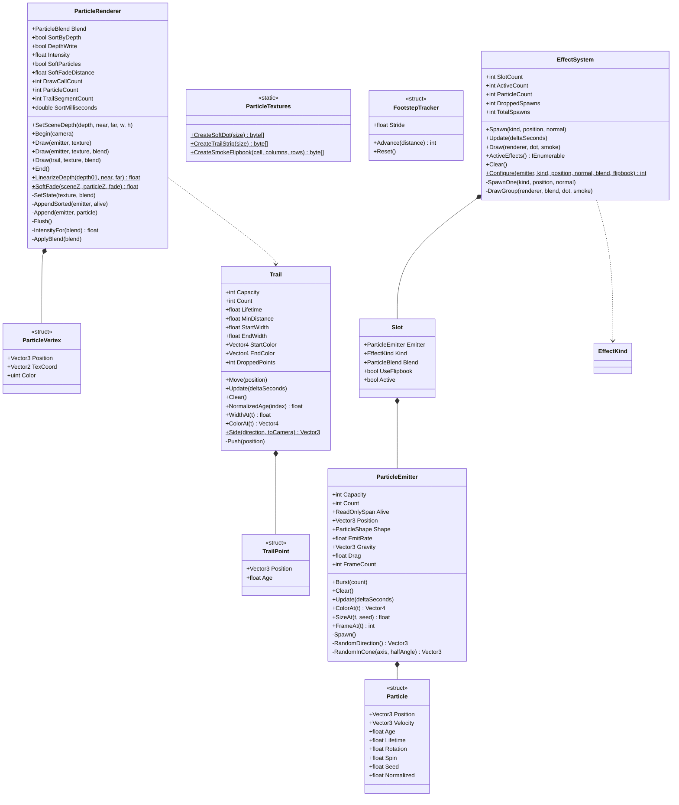
```mermaid
classDiagram
    class Particle {
        <<struct>>
        +Vector3 Position
        +Vector3 Velocity
        +float Age
        +float Lifetime
        +float Rotation
        +float Spin
        +float Seed
        +float Normalized
    }
    class ParticleEmitter {
        +int Capacity
        +int Count
        +ReadOnlySpan Alive
        +Vector3 Position
        +ParticleShape Shape
        +float EmitRate
        +Vector3 Gravity
        +float Drag
        +int FrameCount
        +Burst(count)
        +Clear()
        +Update(deltaSeconds)
        +ColorAt(t) Vector4
        +SizeAt(t, seed) float
        +FrameAt(t) int
        -Spawn()
        -RandomDirection() Vector3
        -RandomInCone(axis, halfAngle) Vector3
    }
    class ParticleRenderer {
        +ParticleBlend Blend
        +bool SortByDepth
        +bool DepthWrite
        +float Intensity
        +bool SoftParticles
        +float SoftFadeDistance
        +int DrawCallCount
        +int ParticleCount
        +int TrailSegmentCount
        +double SortMilliseconds
        +SetSceneDepth(depth, near, far, w, h)
        +Begin(camera)
        +Draw(emitter, texture)
        +Draw(emitter, texture, blend)
        +Draw(trail, texture, blend)
        +End()
        +LinearizeDepth(depth01, near, far) float$
        +SoftFade(sceneZ, particleZ, fade) float$
        -SetState(texture, blend)
        -AppendSorted(emitter, alive)
        -Append(emitter, particle)
        -Flush()
        -IntensityFor(blend) float
        -ApplyBlend(blend)
    }
    class ParticleVertex {
        <<struct>>
        +Vector3 Position
        +Vector2 TexCoord
        +uint Color
    }
    class ParticleTextures {
        <<static>>
        +CreateSoftDot(size) byte[]$
        +CreateTrailStrip(size) byte[]$
        +CreateSmokeFlipbook(cell, columns, rows) byte[]$
    }
    class TrailPoint {
        <<struct>>
        +Vector3 Position
        +float Age
    }
    class Trail {
        +int Capacity
        +int Count
        +float Lifetime
        +float MinDistance
        +float StartWidth
        +float EndWidth
        +Vector4 StartColor
        +Vector4 EndColor
        +int DroppedPoints
        +Move(position)
        +Update(deltaSeconds)
        +Clear()
        +NormalizedAge(index) float
        +WidthAt(t) float
        +ColorAt(t) Vector4
        +Side(direction, toCamera) Vector3$
        -Push(position)
    }
    class FootstepTracker {
        <<struct>>
        +float Stride
        +Advance(distance) int
        +Reset()
    }
    class EffectSystem {
        +int SlotCount
        +int ActiveCount
        +int ParticleCount
        +int DroppedSpawns
        +int TotalSpawns
        +Spawn(kind, position, normal)
        +Update(deltaSeconds)
        +Draw(renderer, dot, smoke)
        +ActiveEffects() IEnumerable
        +Clear()
        +Configure(emitter, kind, position, normal, blend, flipbook) int$
        -SpawnOne(kind, position, normal)
        -DrawGroup(renderer, blend, dot, smoke)
    }
    class Slot {
        +ParticleEmitter Emitter
        +EffectKind Kind
        +ParticleBlend Blend
        +bool UseFlipbook
        +bool Active
    }

    ParticleEmitter *-- Particle
    ParticleRenderer *-- ParticleVertex
    Trail *-- TrailPoint
    EffectSystem *-- Slot
    Slot *-- ParticleEmitter
    ParticleRenderer ..> Trail
    EffectSystem ..> EffectKind
```

**`EffectSystem` の中の `Slot` が、今日の設計でいちばん地味に効いている**。
放出口だけを配列で持ってもよかったが、
<b>「どの混ぜ方で、どのテクスチャで描くか」も一緒に借りる</b>形にしてある。
そうしないと、描く側が種類から混ぜ方を引き直すことになり、
表(`Configure`)を2回読むことになる。

**`Slot` を外へ見せていない**のは `Active` を守るため。
外から書き換えられると `ActiveCount` の数え方が壊れるので、
読みたい人には `ActiveEffects()` が種類と粒数だけを返す。

**`FootstepTracker` が `EffectSystem.cs` に同居している**のは、
足取りとエフェクトが<b>いつも一緒に出てくる</b>ため。
`Trail` のように別ファイルにするほどの大きさでもない
(プロパティ1つとメソッド2つ)。
「距離で刻む」という道具そのものは足音にも足跡にも使えるので、
3つ目の用途が出てきたら切り出す。

**`Ssao` の矢印は `ShadowMap` とほぼ同じ形**をしている。
違いは `Framebuffer` を3枚持つことと、`Texture` を自分で1枚作ること
(ノイズ。`RenderResources` に預けないのは、ファイルから来たものではないうえ、
このクラス以外が使うことが無いため)。

**`EnvironmentMap` だけが生の FBO を持っている**(Day 36 の歪み)のに対し、
`Ssao` は `Framebuffer` で足りている。キューブマップの面を挿す必要が無く、
ふつうの 2D テクスチャに描くだけだから。

**Day 39 で足した3つには矢印がほとんど無い**。これは図が手抜きなのではなく、
`HdrImage` と `SkyAnalysis` が**この層の他の誰も知らない**ため。
入口は `float[]`、出口も `float[]` か構造体だけで、
`GL` にも `Shader` にも `Texture` にも触らない。
`Screenshot` だけが `GL` を1回呼ぶ(`glReadPixels`)。

つないでいるのは `Program` で、

```csharp
HdrImage.Result image = HdrImage.Load(path);              // 読む
_skyAnalysis = SkyAnalysis.Analyze(image.Pixels, w, h);   // 測る
float[] pixels = SkyAnalysis.RemoveSun(image.Pixels, ...); // 抜く
_env.BakeFromPixels(pixels, w, h, ...);                    // 焼く
```

の4行だけ。**この並べ替えは `Program` の仕事**という線を引いてある。
`EnvironmentMap` が `.hdr` のパスを受け取る形にもできるが、
そうすると「太陽を抜くかどうか」「空を何度回すか」まで
環境マップが決めることになり、Day 36 で守った
「このクラスはシーンを知らない」が崩れる。

**`SkyAnalysis.DirectionAt` と `SkyImage.Create` は同じ式でなければならない**
(正距円筒 → 方向の変換)。コード上の依存は無いので、
図には線が引けない代わりに両方のコメントに相手を書いてある。
片方だけ直すと、手で焼いた空と読み込んだ HDRI で**太陽が別の場所に出る**——
しかも方位のずれは絵から気づけない。

**`Pbr` はどこからも矢印が出ていない**。これは描き忘れではなく、
**依存が1本も無い**ことをそのまま表している——
`GL` も `Handle` も `Material` も知らず、入力は `Vector3` と `float` だけ。

呼ぶのは `Program.RunPbrCheck` だけで、**本番の描画からは1度も呼ばれない**。
同じ式が `textured.frag` にあり、そちらが毎フレーム数百万回走る。

「同じものを2か所に書く」のは普段なら避けるべきだが、今日は取った。

| | GLSL 側(`textured.frag`) | C# 側(`Pbr`) |
|---|---|---|
| 役割 | **本番**。1フレームに数百万回 | **定義と検算**。押したときだけ |
| 確かめられること | 絵になった結果だけ | **半球を 8192 点に刻んだ積分** |
| 直したとき動くもの | 見た目 | 自己チェックの数字 |

GPU の中は覗けないので、「D の積分が 1 か」「入ってきた以上の光を返していないか」を
確かめる場所が CPU 側に要る。式が数行で、しかも**この先動かない**(物理の定義)ので、
二重管理の代償より検算できる価値のほうが大きいと判断した。

**片方だけ直す**のがいちばん怖い壊し方なので、自己チェックの最後で
`textured.frag` を実際に読んで、共有している定数(`MIN_ROUGHNESS`)と
`α = roughness²` の式が両方に入っていることを見ている。
値そのものは突き合わせられないが、**「同じ約束でいるか」は機械で確かめられる**。

**`Pbr` に IBL 用が4つ増えた**(Day 36)。
`GeometrySmithIbl` は `GeometrySmith` と **k だけが違う**——
直接光は `(r+1)²/8`、IBL は `α/2`。同じ幾何減衰なのに係数が2通りあるのは、
Day 35 の要点5 で触れた「理屈と当てはめのつぎはぎ」がそのまま出ているところ。
**取り違えると金属の縁が暗くなりすぎる**が、症状が地味なので気づきにくい。

`IntegrateBrdf` は Day 35 の `DirectionalAlbedo` とほとんど同じ積分で、
違うのは<b>フレネルを2つに割る</b>ことだけ。
Day 35 の計画書で「Day 36 の LUT がまさにそれ」と書いた回収になっている。

**`CubeMap` が抱えているのは「GL の約束」**(Day 36)。
面の並び、上下反転、90 度の画角、シームレス——
どれも**知らないと必ず踏む**が、一度書けば二度と考えたくない類のもの。
1つのクラスに閉じ込めておくと、
読む側(空・本描画・事前フィルタ)が素直に書ける。

**`SkyImage` は `SurfaceMaps`(Day 34)と同じ形**をしている。
GL を1行も知らず、返すのはただの配列で、テクスチャにするのは呼ぶ側の仕事。
違いは `byte[]` ではなく `float[]` なこと——**1.0 を超える値を運ぶ**ため。

そしてもう1つ、`SurfaceMaps` に無かったものを持っている:
<b>同じ関数を積分する CPU 版</b>(`IntegrateIrradiance`)。
GPU が焼いた放射照度が正しいかは絵からは判定できないので、
**答えを2通りの方法で出して突き合わせる**ために置いてある。
Day 35 で `Pbr` を CPU にも持った判断の、そのまま2例目になる。

**`Primitives` に球が入った**のは、材質を見比べる形が球しかないため。
立方体は面ごとに法線が一定なので、1つの面の中でハイライトが動かない——
粗さを変えても広がりが見えず、金属度の効きも読み取れない。
球は**法線があらゆる向きを1個の中で通る**ので、
フレネル(縁ほど明るい)も粗さ(ハイライトの広がり)も1個に全部出る。

そして球は、**接線を手で決められない最初の形**でもある。
板と立方体は「左下 → 右下 が U」と目で追えたが、曲面では
`∂P/∂u` を実際に計算するしかない。その結果 **`w` が -1 になる**——
Day 34 で入れた「符号1個を持つ」仕組みが、ここではじめて -1 の側で使われる。


**Day 28 で `Texture` に足したのは2つだけ**。
`CreateR8` が1チャンネルの空テクスチャを作り、`UploadR8` がその一部を書き換える。
どちらもグリフのために足したものだが、**`Texture` はグリフを知らない**——
「1チャンネル」「一部だけ更新」という一般の機能として置いてある。
同じものが Phase 6 のシャドウマップ(Day 33)でも要る。

**Day 32 で `Vertex` に法線が戻った**。Day 9 でソフトウェアラスタライザに持たせ、
Day 14 で GPU へ移したときに落としていたもの。陰影を付けていなかったので要らなかったが、
glTF のモデルは必ず持っているので、**無いと読んだデータの一部を捨てることになる**。

**末尾に足した**ので location は 0〜2 が動かず、既存のシェーダは無傷で済んだ。
位置の次に置くほうが意味の並びとしては素直だが、
そのために `sprite.vert` まで書き換える理由は無い。

**Day 34 で接線が同じやり方で足された**(location 4)。
2回続けて末尾に足せたので、この置き方は当たりだったと言える。
1頂点 64 バイトになり、DamagedHelmet で 930KB。

**`Vector4` なのは glTF の仕様に合わせたから**で、
w には ±1 しか入らない(要点3)。
「3本目の軸を持たずに済ませるための符号1個」がそのままフィールドになっている。

**`depth.vert`(Day 33)は無傷**なのも見どころ。
あちらは location 0 しか宣言していないので、
属性が4本になろうと5本になろうと影響を受けない。
**宣言しない自由**があるから、末尾に足す戦略が効き続けている。

**`SurfaceMaps` が GL を1行も知らない**のが、この層で新しい置き方。
返すのはただの `byte[]` で、テクスチャにするのは `RenderResources` の仕事になる。

```
SurfaceMaps.CreateNormal()  →  byte[]  →  RenderResources.LoadTextureFromPixels()  →  Handle
```

分けてあるので**スレッドを選ばない**(Day 21 の `Texture.DecodeFile` と同じ性質)。
起動時に3枚焼くだけなので今は同期でよいが、
枚数が増えたらそのまま `Task.Run` へ載せられる形になっている。

`Texture.FromPixels` を直接呼ばずに窓口を通すのは、
**寿命の管理とキャッシュを1箇所に残す**ため。
ここを通さずに `new` すると、そのテクスチャだけ `Dispose` の対象から外れる。

**`Mesh.ReadVertices` は「持たない」ほうへ倒した結果**(Day 34)。
自己チェックで頂点の中身を見たいが、CPU 側に控えを持つと
DamagedHelmet だけで 930KB を**使うかどうか分からないのに常に払う**。
GPU から読み返す(`glGetBufferSubData`)なら払うのは呼んだときだけで済む。
代わりに**遅い**(描画キューが空になるまで待つ)ので、検査専用の窓口になっている。

当たり判定やレイキャストで頂点が要り用になる Phase 7 で、
「持つ」へ倒し直すことを考えればよい。

**`Material` が急に太った**のが Day 32 でいちばん目に付く差分で、
これは glTF の材質定義をそのまま写したから。
「シェーダ + そのシェーダに渡す値」という Day 15 からの位置づけは変わっていない——
渡す値の種類が、仕様に合わせて増えただけになる。

**Day 31 で足したのは `CreateTarget` 1つ**。同じ理屈で、
`Texture` は「これがレンダーターゲットである」ことを知らない。
中身を渡さずに場所だけ確保し、ミップマップを作らず、ClampToEdge にする——
それだけの機能として置いてあるので、
影(Day 33)でも環境マップ(Day 36)でも G-Buffer(Day 52)でも同じものが使える。

**Day 33 で足したのは `CreateDepthTarget` 1つ**。
`CreateTarget` との違いは3つとも影のための必然になっている。

| | `CreateTarget`(Day 31) | `CreateDepthTarget`(Day 33) |
|---|---|---|
| 内部形式 | RGBA8 / RGBA16F | **DepthComponent24** |
| フィルタ | Linear | **Nearest**(深度を平均しても意味が無い。要点6) |
| ラップ | ClampToEdge | **ClampToBorder + 白**(箱の外は「遮るものなし」) |

`Texture` が「これがシャドウマップである」ことを知らないのは同じで、
Day 37 の SSAO が深度を読むときも、そのまま同じものが使える。

**`Framebuffer` が3つ目の形を持った**。
Day 31 の「カラーテクスチャ + 深度レンダーバッファ」に加えて、
**カラーを1枚も持たない**形が入った。
`Depth` プロパティが深度専用のときだけ入るので、
**「読むならテクスチャ、読まないならレンダーバッファ」の区別がそのまま型に出る**。

**`ShadowMap` が `Camera` を借りている**のが、この層で新しい関係。
光の正射影行列は `Camera.CreateOrthographic` がそのまま使える——
「カメラ」という名前だが中身は**投影行列の作り方の置き場**なので、
光の目に使っても筋が通る。Day 14 で `static` メソッドとして切り出しておいた形が効いた。

**`Framebuffer` が `Texture` を所有している**のは、今までの `Render/` に無かった関係。
`Material` は「持たない(ハンドルだけ)」で通してきたが、
フレームバッファのカラーアタッチメントは
**そのフレームバッファと同じ大きさ・同じ形式でなければならない**ので、
外から差し替えられると壊れる。**所有すべきものは所有する**。

**`PostProcess` と `ShadowMap` はシェーダだけ `RenderResources` に預けている**。
バッファ(4枚 / 1枚)は自分で持ち、シェーダは借りる——
シェーダは F5 でリロードしたいので、管理の窓口に載せておく必要がある。

**バッファを所有し、シェーダを借りる**——この分担が2クラスで一致しているのは偶然ではなく、
「大きさや形式に強い制約があるものは所有、共有して使い回すものは借りる」という
Day 21 からの線がそのまま出ている。

**`Material` が何も所有していない**のは Day 15 から一貫している(Day15.md の要点2)。
持っているのはハンドルだけで、実体の寿命は `RenderResources` にある。

**3D の道(`Mesh` + `Material`)と 2D の道(`SpriteBatch`)が並列**なのも見てのとおりで、
両者は `Shader` と `Texture` を共有しているだけで互いを知らない。
`Mesh` は「形が決まっていて毎フレーム変わらないもの」、
`SpriteBatch` は「毎フレーム頂点を作り直すもの」という使い分けになっている。

### Scene — GameObject + Component

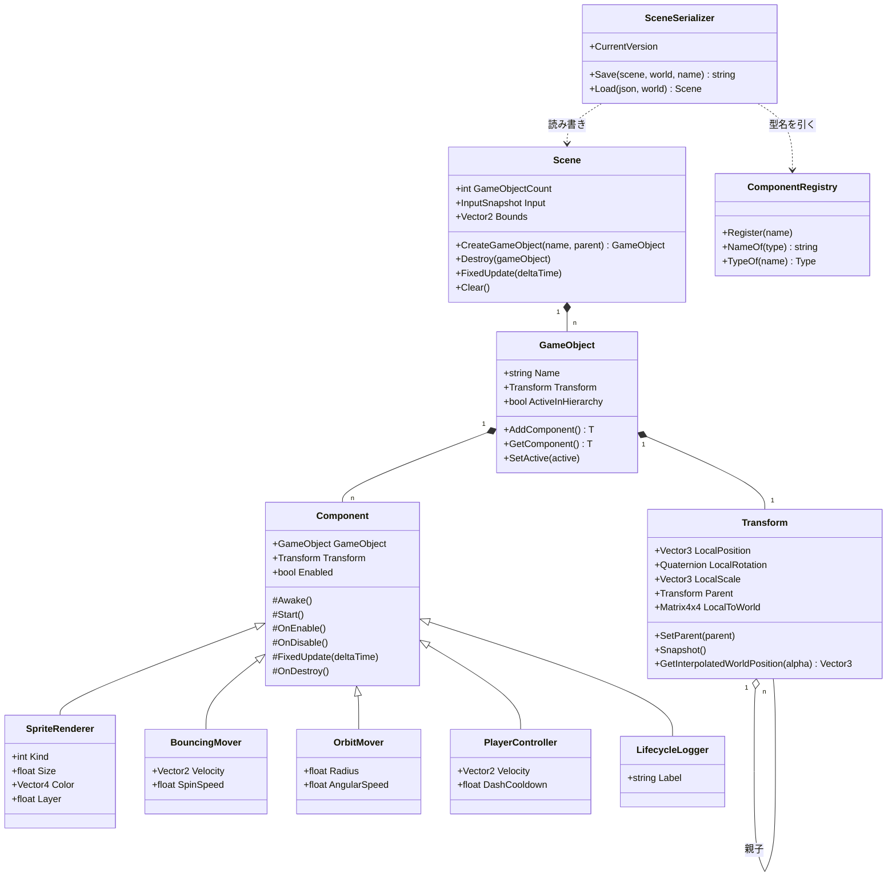
```mermaid
classDiagram
    class Scene {
        +int GameObjectCount
        +InputSnapshot Input
        +Vector2 Bounds
        +CreateGameObject(name, parent) GameObject
        +Destroy(gameObject)
        +FixedUpdate(deltaTime)
        +Clear()
    }
    class GameObject {
        +string Name
        +Transform Transform
        +bool ActiveInHierarchy
        +AddComponent() T
        +GetComponent() T
        +SetActive(active)
    }
    class Transform {
        +Vector3 LocalPosition
        +Quaternion LocalRotation
        +Vector3 LocalScale
        +Transform Parent
        +Matrix4x4 LocalToWorld
        +SetParent(parent)
        +Snapshot()
        +GetInterpolatedWorldPosition(alpha) Vector3
    }
    class Component {
        +GameObject GameObject
        +Transform Transform
        +bool Enabled
        #Awake()
        #Start()
        #OnEnable()
        #OnDisable()
        #FixedUpdate(deltaTime)
        #OnDestroy()
    }
    class SpriteRenderer {
        +int Kind
        +float Size
        +Vector4 Color
        +float Layer
    }
    class BouncingMover {
        +Vector2 Velocity
        +float SpinSpeed
    }
    class OrbitMover {
        +float Radius
        +float AngularSpeed
    }
    class PlayerController {
        +Vector2 Velocity
        +float DashCooldown
    }
    class LifecycleLogger {
        +string Label
    }
    class ComponentRegistry {
        +Register(name)
        +NameOf(type) string
        +TypeOf(name) Type
    }
    class SceneSerializer {
        +CurrentVersion
        +Save(scene, world, name) string
        +Load(json, world) Scene
    }

    Scene "1" *-- "n" GameObject
    GameObject "1" *-- "1" Transform
    GameObject "1" *-- "n" Component
    Transform "1" o-- "n" Transform : 親子
    Component <|-- SpriteRenderer
    Component <|-- BouncingMover
    Component <|-- OrbitMover
    Component <|-- PlayerController
    Component <|-- LifecycleLogger
    SceneSerializer ..> Scene : 読み書き
    SceneSerializer ..> ComponentRegistry : 型名を引く
```

`Transform` だけが `GameObject` の固定メンバーで、ほかは全部 `Component` として付け外しする
(Day 22 の要点2)。`SceneSerializer` が `ComponentRegistry` を経由するのは、
**JSON の文字列から直接 `Type` を作らせない**ため(Day 24 の要点2)。

### Ecs と Physics — どこにも依存しない2つ(今日 `Physics` に持ち越しと島が入った)

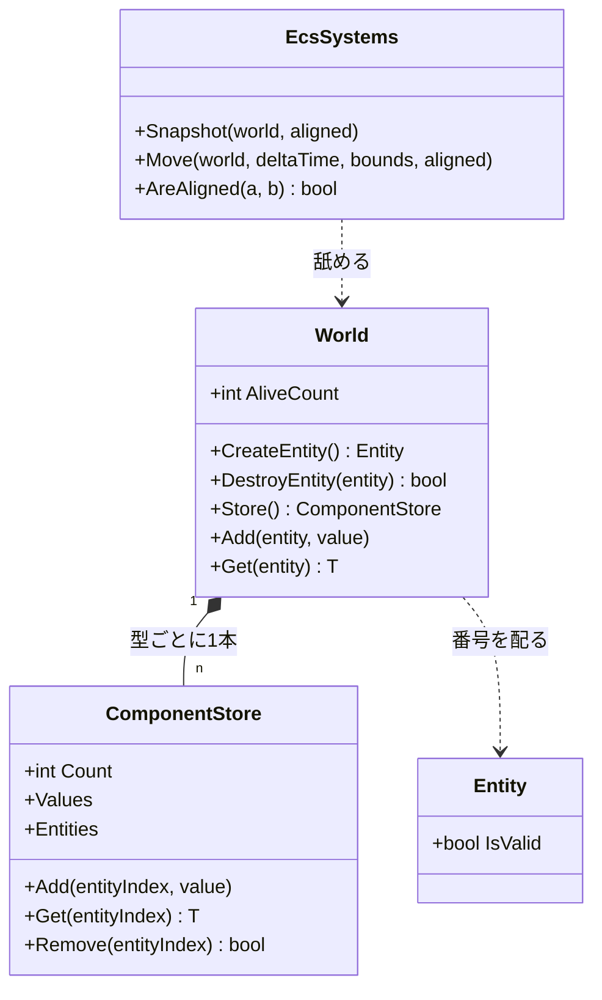
```mermaid
classDiagram
    class Entity {
        +bool IsValid
    }
    class World {
        +int AliveCount
        +CreateEntity() Entity
        +DestroyEntity(entity) bool
        +Store() ComponentStore
        +Add(entity, value)
        +Get(entity) T
    }
    class ComponentStore {
        +int Count
        +Values
        +Entities
        +Add(entityIndex, value)
        +Get(entityIndex) T
        +Remove(entityIndex) bool
    }
    class EcsSystems {
        +Snapshot(world, aligned)
        +Move(world, deltaTime, bounds, aligned)
        +AreAligned(a, b) bool
    }

    World "1" *-- "n" ComponentStore : 型ごとに1本
    World ..> Entity : 番号を配る
    EcsSystems ..> World : 舐める
```

#### 2D の側(Day 26。Day 43 から5日続けて1文字も変わっていない)

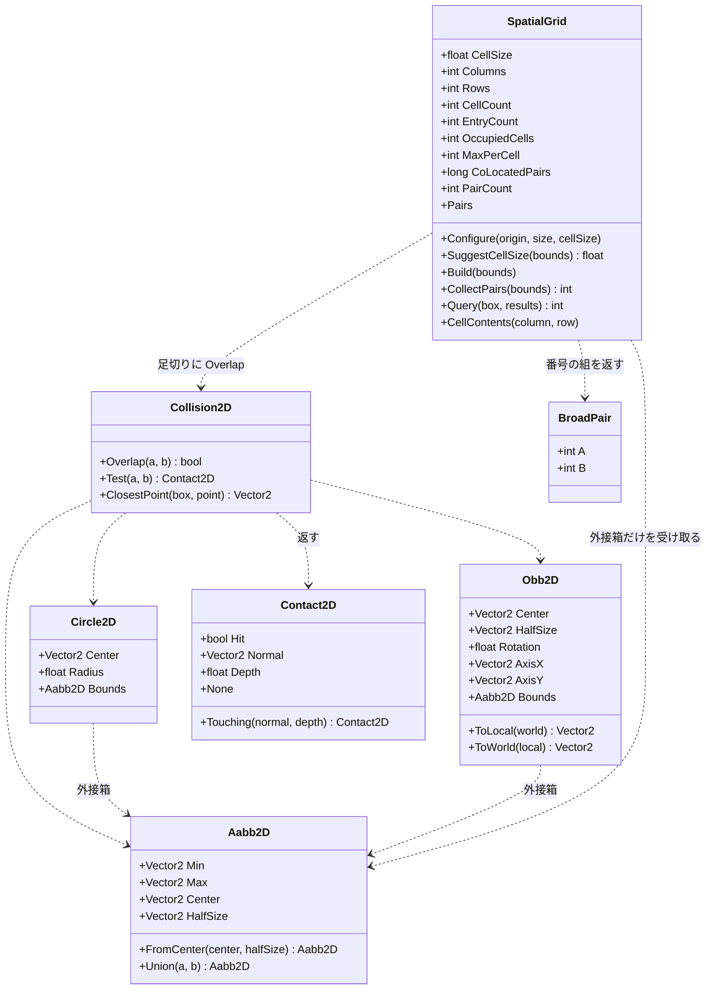
```mermaid
classDiagram
    class Aabb2D {
        +Vector2 Min
        +Vector2 Max
        +Vector2 Center
        +Vector2 HalfSize
        +FromCenter(center, halfSize) Aabb2D
        +Union(a, b) Aabb2D
    }
    class Circle2D {
        +Vector2 Center
        +float Radius
        +Aabb2D Bounds
    }
    class Obb2D {
        +Vector2 Center
        +Vector2 HalfSize
        +float Rotation
        +Vector2 AxisX
        +Vector2 AxisY
        +Aabb2D Bounds
        +ToLocal(world) Vector2
        +ToWorld(local) Vector2
    }
    class Contact2D {
        +bool Hit
        +Vector2 Normal
        +float Depth
        +None
        +Touching(normal, depth) Contact2D
    }
    class Collision2D {
        +Overlap(a, b) bool
        +Test(a, b) Contact2D
        +ClosestPoint(box, point) Vector2
    }
    class BroadPair {
        +int A
        +int B
    }
    class SpatialGrid {
        +float CellSize
        +int Columns
        +int Rows
        +int CellCount
        +int EntryCount
        +int OccupiedCells
        +int MaxPerCell
        +long CoLocatedPairs
        +int PairCount
        +Pairs
        +Configure(origin, size, cellSize)
        +SuggestCellSize(bounds) float
        +Build(bounds)
        +CollectPairs(bounds) int
        +Query(box, results) int
        +CellContents(column, row)
    }

    Collision2D ..> Aabb2D
    Collision2D ..> Circle2D
    Collision2D ..> Obb2D
    Collision2D ..> Contact2D : 返す
    Circle2D ..> Aabb2D : 外接箱
    Obb2D ..> Aabb2D : 外接箱
    SpatialGrid ..> Aabb2D : 外接箱だけを受け取る
    SpatialGrid ..> Collision2D : 足切りに Overlap
    SpatialGrid ..> BroadPair : 番号の組を返す
```

**形は全部 `readonly struct`、判定は `static` メソッドだけ**。状態を持たないので、
どのスレッドから何回呼んでも同じ答えが返る。Day 26 で空間分割を入れたとき、
この性質のおかげで**判定そのものには一切手を入れずに済んだ**——
`Collision2D.cs` と `Shapes2D.cs` の差分は 0 行になっている。

**Day 29 で足したのは `Query` だけ**。
`CollectPairs` が「全部の組」を返すのに対して、
`Query` は「この箱の近くにいるもの」を返す。
1回組んだ格子を、**総当たりの置き換え**としても
**単発の近傍探索**としても使えるようになった——
卒業制作では同じ格子を1ステップに4通りで使っている。

`SpatialGrid` だけが唯一 `class`(参照型)で、しかも状態を持つ。
配列を4本(`_cellStart` / `_cursor` / `_entries` / `_mark`)使い回すためで、
**毎フレーム作り直しても割り当てが起きない**ようにするにはこうするしかない。
そのぶん「1つのインスタンスを複数スレッドから同時に使えない」という制約が付く。
状態を持つと何が失われるかが、同じフォルダの中で見比べられる形になっている。

矢印の向きにも注目してほしい。**`SpatialGrid` から `Body` への線が無い**。
受け取るのは `ReadOnlySpan<Aabb2D>`、返すのは番号の組だけで、
速度も形も質量も知らない。

Day 26 でここに「この細さのおかげで、Day 46 の 3D 版は
`Aabb2D` を `Aabb3D` に変えるだけで済む」と書いた。
**半分当たって、半分外れた**——判定の中身は本当に型を変えるだけで済んだが、
**「格子に入らないもの」という問題が新しく生えた**(要点6)。
2D のときは体が全部同じくらいの大きさの円と箱だったので気づけなかった。
20 日前の予告が外れた理由が「次元」ではなく
**「世界に置くものの種類」**だった、というのが Day 46 の学びだった。

#### 3D の側(Day 47 でさらに4つ増え、3つが書き換わった)

形の側(`Shapes3D` / `HeightField`)から先に。**今日はここが1文字も変わっていない**——
差分は全部「解く側」に閉じている。

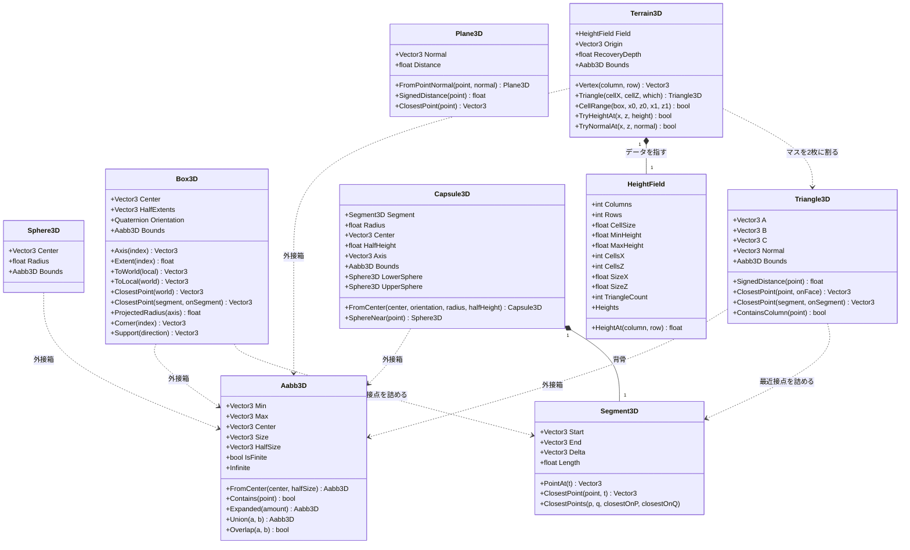
```mermaid
classDiagram
    class Aabb3D {
        +Vector3 Min
        +Vector3 Max
        +Vector3 Center
        +Vector3 Size
        +Vector3 HalfSize
        +bool IsFinite
        +Infinite
        +FromCenter(center, halfSize) Aabb3D
        +Contains(point) bool
        +Expanded(amount) Aabb3D
        +Union(a, b) Aabb3D
        +Overlap(a, b) bool
    }
    class Sphere3D {
        +Vector3 Center
        +float Radius
        +Aabb3D Bounds
    }
    class Plane3D {
        +Vector3 Normal
        +float Distance
        +FromPointNormal(point, normal) Plane3D
        +SignedDistance(point) float
        +ClosestPoint(point) Vector3
    }
    class Box3D {
        +Vector3 Center
        +Vector3 HalfExtents
        +Quaternion Orientation
        +Aabb3D Bounds
        +Axis(index) Vector3
        +Extent(index) float
        +ToWorld(local) Vector3
        +ToLocal(world) Vector3
        +ClosestPoint(world) Vector3
        +ClosestPoint(segment, onSegment) Vector3
        +ProjectedRadius(axis) float
        +Corner(index) Vector3
        +Support(direction) Vector3
    }
    class Triangle3D {
        +Vector3 A
        +Vector3 B
        +Vector3 C
        +Vector3 Normal
        +Aabb3D Bounds
        +SignedDistance(point) float
        +ClosestPoint(point, onFace) Vector3
        +ClosestPoint(segment, onSegment) Vector3
        +ContainsColumn(point) bool
    }
    class Segment3D {
        +Vector3 Start
        +Vector3 End
        +Vector3 Delta
        +float Length
        +PointAt(t) Vector3
        +ClosestPoint(point, t) Vector3
        +ClosestPoints(p, q, closestOnP, closestOnQ)
    }
    class Capsule3D {
        +Segment3D Segment
        +float Radius
        +Vector3 Center
        +float HalfHeight
        +Vector3 Axis
        +Aabb3D Bounds
        +Sphere3D LowerSphere
        +Sphere3D UpperSphere
        +FromCenter(center, orientation, radius, halfHeight) Capsule3D
        +SphereNear(point) Sphere3D
    }
    class HeightField {
        +int Columns
        +int Rows
        +float CellSize
        +float MinHeight
        +float MaxHeight
        +int CellsX
        +int CellsZ
        +float SizeX
        +float SizeZ
        +int TriangleCount
        +Heights
        +HeightAt(column, row) float
    }
    class Terrain3D {
        +HeightField Field
        +Vector3 Origin
        +float RecoveryDepth
        +Aabb3D Bounds
        +Vertex(column, row) Vector3
        +Triangle(cellX, cellZ, which) Triangle3D
        +CellRange(box, x0, z0, x1, z1) bool
        +TryHeightAt(x, z, height) bool
        +TryNormalAt(x, z, normal) bool
    }

    Sphere3D ..> Aabb3D : 外接箱
    Box3D ..> Aabb3D : 外接箱
    Capsule3D ..> Aabb3D : 外接箱
    Triangle3D ..> Aabb3D : 外接箱
    Terrain3D ..> Aabb3D : 外接箱
    Capsule3D "1" *-- "1" Segment3D : 背骨
    Box3D ..> Segment3D : 最近接点を詰める
    Triangle3D ..> Segment3D : 最近接点を詰める
    Terrain3D "1" *-- "1" HeightField : データを指す
    Terrain3D ..> Triangle3D : マスを2枚に割る
```

**`HeightField` だけが `class`(参照型)**。ほかは全部 `readonly struct` で、
高さの配列を持つこの型だけが値で持てない。
`Terrain3D` は構造体に戻っていて、「データへの参照 + 世界での位置」という
16 バイトほどの薄い皮になっている——**重いのはデータ1つだけ**という形。

**`Aabb3D` に矢印が集中している**のが Day 46 でできた形。
5つの形が全部ここへ落ちてきて、その先(`SpatialGrid3D`)は形を知らずに済む。
**「共通の粗い表現へ落としてから扱う」**という、
ブロードフェーズという層そのものの考え方が矢印の形に出ている。

次に、判定と世界の側。

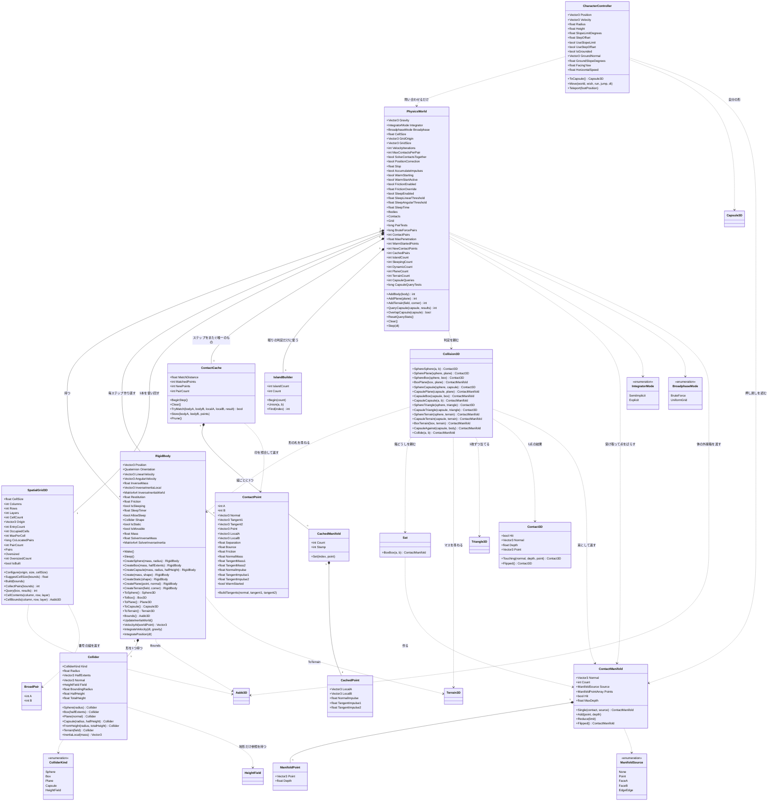
```mermaid
classDiagram
    class ColliderKind {
        <<enumeration>>
        Sphere
        Box
        Plane
        Capsule
        HeightField
    }
    class Collider {
        +ColliderKind Kind
        +float Radius
        +Vector3 HalfExtents
        +Vector3 Normal
        +HeightField Field
        +float BoundingRadius
        +float HalfHeight
        +float TotalHeight
        +Sphere(radius) Collider
        +Box(halfExtents) Collider
        +Plane(normal) Collider
        +Capsule(radius, halfHeight) Collider
        +FromHeight(radius, totalHeight) Collider
        +Terrain(field) Collider
        +InertiaLocal(mass) Vector3
    }
    class Contact3D {
        +bool Hit
        +Vector3 Normal
        +float Depth
        +Vector3 Point
        +Touching(normal, depth, point) Contact3D
        +Flipped() Contact3D
    }
    class ManifoldSource {
        <<enumeration>>
        None
        Point
        FaceA
        FaceB
        EdgeEdge
    }
    class ManifoldPoint {
        +Vector3 Point
        +float Depth
    }
    class ContactManifold {
        +Vector3 Normal
        +int Count
        +ManifoldSource Source
        +ManifoldPointArray Points
        +bool Hit
        +float MaxDepth
        +Single(contact, source) ContactManifold
        +Add(point, depth)
        +Reduce(limit)
        +Flipped() ContactManifold
    }
    class Sat {
        +BoxBox(a, b) ContactManifold
    }
    class Collision3D {
        +SphereSphere(a, b) Contact3D
        +SpherePlane(sphere, plane) Contact3D
        +SphereBox(sphere, box) Contact3D
        +BoxPlane(box, plane) ContactManifold
        +SphereCapsule(sphere, capsule) Contact3D
        +CapsulePlane(capsule, plane) ContactManifold
        +CapsuleBox(capsule, box) ContactManifold
        +CapsuleCapsule(a, b) ContactManifold
        +SphereTriangle(sphere, triangle) Contact3D
        +CapsuleTriangle(capsule, triangle) Contact3D
        +SphereTerrain(sphere, terrain) ContactManifold
        +CapsuleTerrain(capsule, terrain) ContactManifold
        +BoxTerrain(box, terrain) ContactManifold
        +CapsuleAgainst(capsule, body) ContactManifold
        +Collide(a, b) ContactManifold
    }
    class RigidBody {
        +Vector3 Position
        +Quaternion Orientation
        +Vector3 LinearVelocity
        +Vector3 AngularVelocity
        +float InverseMass
        +Vector3 InverseInertiaLocal
        +Matrix4x4 InverseInertiaWorld
        +float Restitution
        +float Friction
        +bool IsSleeping
        +float SleepTimer
        +bool AllowSleep
        +Collider Shape
        +bool IsStatic
        +bool IsMovable
        +float Mass
        +float SolverInverseMass
        +Matrix4x4 SolverInverseInertia
        +Wake()
        +Sleep()
        +CreateSphere(mass, radius) RigidBody
        +CreateBox(mass, halfExtents) RigidBody
        +CreateCapsule(mass, radius, halfHeight) RigidBody
        +Create(mass, shape) RigidBody
        +CreateStatic(shape) RigidBody
        +CreatePlane(point, normal) RigidBody
        +CreateTerrain(field, corner) RigidBody
        +ToSphere() Sphere3D
        +ToBox() Box3D
        +ToPlane() Plane3D
        +ToCapsule() Capsule3D
        +ToTerrain() Terrain3D
        +Bounds() Aabb3D
        +UpdateInertiaWorld()
        +VelocityAt(worldPoint) Vector3
        +IntegrateVelocity(dt, gravity)
        +IntegratePosition(dt)
    }
    class BroadPair {
        +int A
        +int B
    }
    class SpatialGrid3D {
        +float CellSize
        +int Columns
        +int Rows
        +int Layers
        +int CellCount
        +Vector3 Origin
        +int EntryCount
        +int OccupiedCells
        +int MaxPerCell
        +long CoLocatedPairs
        +int PairCount
        +Pairs
        +Oversized
        +int OversizedCount
        +bool IsBuilt
        +Configure(origin, size, cellSize)
        +SuggestCellSize(bounds) float
        +Build(bounds)
        +CollectPairs(bounds) int
        +Query(box, results) int
        +CellContents(column, row, layer)
        +CellBounds(column, row, layer) Aabb3D
    }
    class BroadphaseMode {
        <<enumeration>>
        BruteForce
        UniformGrid
    }
    class ContactPoint {
        +int A
        +int B
        +Vector3 Normal
        +Vector3 Tangent1
        +Vector3 Tangent2
        +Vector3 Point
        +Vector3 LocalA
        +Vector3 LocalB
        +float Separation
        +float Bounce
        +float Friction
        +float NormalMass
        +float TangentMass1
        +float TangentMass2
        +float NormalImpulse
        +float TangentImpulse1
        +float TangentImpulse2
        +bool WarmStarted
        +BuildTangents(normal, tangent1, tangent2)
    }
    class CachedPoint {
        +Vector3 LocalA
        +Vector3 LocalB
        +float NormalImpulse
        +float TangentImpulse1
        +float TangentImpulse2
    }
    class CachedManifold {
        +int Count
        +int Stamp
        +Set(index, point)
    }
    class ContactCache {
        +float MatchDistance
        +int MatchedPoints
        +int NewPoints
        +int PairCount
        +BeginStep()
        +Clear()
        +TryMatch(bodyA, bodyB, localA, localB, result) bool
        +Store(bodyA, bodyB, points)
        +Prune()
    }
    class IslandBuilder {
        +int IslandCount
        +int Count
        +Begin(count)
        +Union(a, b)
        +Find(index) int
    }
    class IntegratorMode {
        <<enumeration>>
        SemiImplicit
        Explicit
    }
    class PhysicsWorld {
        +Vector3 Gravity
        +IntegratorMode Integrator
        +BroadphaseMode Broadphase
        +float CellSize
        +Vector3 GridOrigin
        +Vector3 GridSize
        +int VelocityIterations
        +int MaxContactsPerPair
        +bool SolveContactsTogether
        +bool PositionCorrection
        +float Slop
        +bool AccumulateImpulses
        +bool WarmStarting
        +bool WarmStartActive
        +bool FrictionEnabled
        +float FrictionOverride
        +bool SleepEnabled
        +float SleepLinearThreshold
        +float SleepAngularThreshold
        +float SleepTime
        +Bodies
        +Contacts
        +Grid
        +long PairTests
        +long BruteForcePairs
        +int ContactPairs
        +float MaxPenetration
        +int WarmStartedPoints
        +int NewContactPoints
        +int CachedPairs
        +int IslandCount
        +int SleepingCount
        +int DynamicCount
        +int PlaneCount
        +int TerrainCount
        +int CapsuleQueries
        +long CapsuleQueryTests
        +AddBody(body) int
        +AddPlane(plane) int
        +AddTerrain(field, corner) int
        +QueryCapsule(capsule, results) int
        +OverlapCapsule(capsule) bool
        +ResetQueryStats()
        +Clear()
        +Step(dt)
    }
    class CharacterController {
        +Vector3 Position
        +Vector3 Velocity
        +float Radius
        +float Height
        +float SlopeLimitDegrees
        +float StepOffset
        +bool UseSlopeLimit
        +bool UseStepOffset
        +bool IsGrounded
        +Vector3 GroundNormal
        +float GroundSlopeDegrees
        +float FacingYaw
        +float HorizontalSpeed
        +ToCapsule() Capsule3D
        +Move(world, wish, run, jump, dt)
        +Teleport(footPosition)
    }

    PhysicsWorld "1" *-- "n" RigidBody : 持つ
    PhysicsWorld "1" *-- "n" ContactPoint : 毎ステップ作り直す
    PhysicsWorld "1" *-- "1" SpatialGrid3D : 1本を使い回す
    PhysicsWorld "1" *-- "1" ContactCache : ステップをまたぐ唯一のもの
    PhysicsWorld "1" *-- "1" IslandBuilder : 眠りの判定だけに使う
    ContactCache "1" *-- "n" CachedManifold : 組ごとに1つ
    CachedManifold "1" *-- "4" CachedPoint
    ContactCache ..> ContactPoint : 印を照合して返す
    PhysicsWorld ..> Collision3D : 判定を頼む
    PhysicsWorld ..> ContactManifold : 受け取って点をばらす
    PhysicsWorld ..> IntegratorMode
    PhysicsWorld ..> BroadphaseMode
    PhysicsWorld ..> Aabb3D : 体の外接箱を渡す
    SpatialGrid3D ..> Aabb3D : 外接箱だけを受け取る
    SpatialGrid3D ..> BroadPair : 番号の組を返す
    RigidBody "1" *-- "1" Collider : 形を1つ持つ
    RigidBody ..> Aabb3D : Bounds
    Collider ..> ColliderKind
    Collider ..> HeightField : 地形だけ参照を持つ
    RigidBody ..> Terrain3D : ToTerrain
    Collision3D ..> RigidBody : 形の札を尋ねる
    Collision3D ..> Sat : 箱どうしを頼む
    Collision3D ..> Terrain3D : マスを尋ねる
    Collision3D ..> Triangle3D : 1枚ずつ当てる
    Collision3D ..> Contact3D : 1点の結果
    Collision3D ..> ContactManifold : 束にして返す
    Sat ..> ContactManifold : 作る
    ContactManifold "1" *-- "n" ManifoldPoint
    ContactManifold ..> ManifoldSource
    CharacterController ..> PhysicsWorld : 問い合わせるだけ
    CharacterController ..> Capsule3D : 自分の形
    CharacterController ..> ContactManifold : 押し戻しを読む
```

**5日ぶんの変化を並べる**とこうなる。

| | Day 43 | Day 44 | Day 45 | Day 46 | Day 47 |
|---|---|---|---|---|---|
| 形の持ち方 | `RigidBody.Radius` | 札 + 寸法 | 札が4つに | 札が5つ。参照を持つ | 同じ(**1文字も変わらない**) |
| 平面 | 別のリスト | 形の1つ | 同じ | 同じ(格子には入らない) | 同じ |
| 判定の戻り値 | `Contact3D` | `ContactManifold` | 同じ | 同じ | 同じ |
| 世界への入口 | `Step(dt)` | 同じ | `QueryCapsule` が増えた | 同じ | 同じ(**段が5→8**) |
| 候補の作り方 | 総当たり | 総当たり | 総当たり | 総当たり / 均一グリッド | 同じ |
| 接触点の性格 | 判定の結果 | 同じ | 同じ | 同じ | **解くときの状態を持つ** |
| ステップをまたぐもの | 無し | 無し | 無し | 無し | **インパルスの持ち越し** |
| 動くもの | `RigidBody` | 同じ | `CharacterController` が外から | 同じ | 同じ(**眠るようになった**) |

**今日の差分の形が Day 44〜46 と違う**のがこの表の読みどころ。
3日間は「形が増える → 判定が増える」だったが、今日は形も判定も1文字も変わらず、
**解く側だけが厚くなった**。物理エンジンが「形の話」と「解き方の話」の
2つでできていることが、5日並べるとはっきり見える。

**2D 側との性格の違い**も更新しておく。

| | 2D(Day 26) | 3D(Day 43〜47) |
|---|---|---|
| 形 | `readonly struct` | 同じ(**`HeightField` だけ `class`**) |
| 判定 | `static` メソッドだけ | 同じ(ただし `Collide` は体を見る) |
| **状態** | `SpatialGrid` だけが持つ | `RigidBody` / `PhysicsWorld` / `CharacterController` / `SpatialGrid3D` / **`ContactCache`** |
| **時間** | 出てこない | `Step(dt)` と `Move(..., dt)` が中心 |
| **記憶** | 毎フレーム作り直す | 同じ。ただし **`ContactCache` だけがまたぐ** |

**`SpatialGrid3D` は `SpatialGrid` とほぼ同じ形**をしている。
`class` で、配列を使い回し、毎フレーム作り直しても割り当てが起きない。
違いは3つだけ——マスが3重の添字になったこと、
`Oversized`(格子に入らないもの)が増えたこと、
`IsBuilt` が増えたこと。

**2本並べて置いてある**のは意図的で、共通化していない。
`Vector2` と `Vector3`、`Aabb2D` と `Aabb3D` を総称型で束ねると、
「マスの数え方」も「またぎ方」も抽象の向こうへ行ってしまう。
**2D と 3D で罰の重さが違う**(辺の比の2乗か3乗か)ことを
コードの形で見比べられるほうが、この repository では値打ちがある。

### 箱と箱が当たるまで — 15 本の軸と、2つの分かれ道

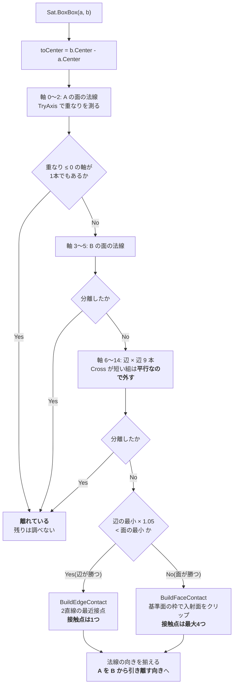
```mermaid
flowchart TD
    S["Sat.BoxBox(a, b)"] --> T["toCenter = b.Center - a.Center"]
    T --> FA["軸 0〜2: A の面の法線<br/>TryAxis で重なりを測る"]
    FA --> SEP1{"重なり ≤ 0 の軸が<br/>1本でもあるか"}
    SEP1 -->|Yes| OUT["<b>離れている</b><br/>残りは調べない"]
    SEP1 -->|No| FB["軸 3〜5: B の面の法線"]
    FB --> SEP2{"分離したか"}
    SEP2 -->|Yes| OUT
    SEP2 -->|No| EE["軸 6〜14: 辺 × 辺 9 本<br/>Cross が短い組は<b>平行なので外す</b>"]
    EE --> SEP3{"分離したか"}
    SEP3 -->|Yes| OUT
    SEP3 -->|No| PICK{"辺の最小 × 1.05<br/>&lt; 面の最小 か"}
    PICK -->|"Yes(辺が勝つ)"| EDGE["BuildEdgeContact<br/>2直線の最近接点<br/><b>接触点は1つ</b>"]
    PICK -->|"No(面が勝つ)"| FACE["BuildFaceContact<br/>基準面の枠で入射面をクリップ<br/><b>接触点は最大4つ</b>"]
    EDGE --> N["法線の向きを揃える<br/><b>A を B から引き離す向き</b>へ"]
    FACE --> N
```

**分かれ道が2つ**あるのが読みどころ。
1つ目は「どこかで分離したか」——15 本のどれか1本で隙間が見つかれば、そこで終わる。
2つ目は「面と辺のどちらが最小か」——ここで**接触点の作り方がまるごと変わる**。

`1.05` の下駄は、ほぼ平行な辺の外積が数値誤差で揺れるのを避けるためのもの
(要点2)。これを 1.0 にすると、床に置いた箱が
「面で4点」と「辺で1点」の間を行き来して震え出す。

### 接触点が4つできるまで — 基準面と入射面

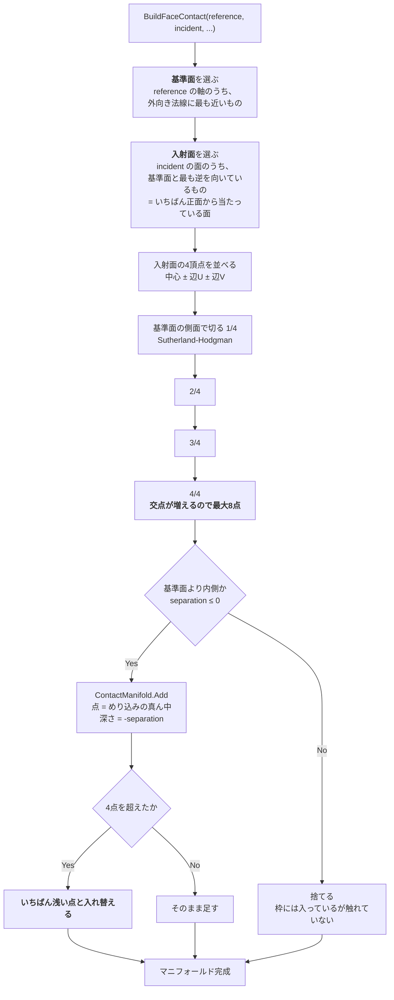
```mermaid
flowchart TD
    A["BuildFaceContact(reference, incident, ...)"] --> R["<b>基準面</b>を選ぶ<br/>reference の軸のうち、<br/>外向き法線に最も近いもの"]
    R --> I["<b>入射面</b>を選ぶ<br/>incident の面のうち、<br/>基準面と最も逆を向いているもの<br/>= いちばん正面から当たっている面"]
    I --> P["入射面の4頂点を並べる<br/>中心 ± 辺U ± 辺V"]
    P --> C1["基準面の側面で切る 1/4<br/>Sutherland-Hodgman"]
    C1 --> C2["2/4"]
    C2 --> C3["3/4"]
    C3 --> C4["4/4<br/><b>交点が増えるので最大8点</b>"]
    C4 --> F{"基準面より内側か<br/>separation ≤ 0"}
    F -->|No| DROP["捨てる<br/>枠には入っているが触れていない"]
    F -->|Yes| ADD["ContactManifold.Add<br/>点 = めり込みの真ん中<br/>深さ = -separation"]
    ADD --> LIM{"4点を超えたか"}
    LIM -->|Yes| SWAP["<b>いちばん浅い点と入れ替える</b>"]
    LIM -->|No| KEEP["そのまま足す"]
    SWAP --> E["マニフォールド完成"]
    KEEP --> E
    DROP --> E
```

**「入射面を基準面の枠で切る」で重なりが出る**のがこの図の要点。
床の上に箱をまるごと置けば4頂点がそのまま残り、
床から半分はみ出せば、はみ出した2点が切り落とされて
**代わりに床の縁の上に新しい2点が生まれる**。

<b>クリップで1点も残らないことがある</b>(ごく浅い接触や数値誤差)。
そのときは相手のいちばん突き出た点1つで代用している——
**接触を落とすと物が沈む**ので、0点で返すよりましだという判断。

### 剛体が1ステップ進むまで — 8段と、それぞれが書き換えるもの(Day 47 で組み替えた)

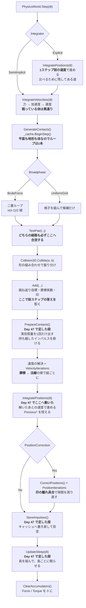
```mermaid
flowchart TD
    S["PhysicsWorld.Step(dt)"] --> I{"Integrator"}
    I -->|Explicit| EP["IntegratePositions(dt)<br/><b>1ステップ前の速度</b>で進める<br/>比べるために残してある道"]
    I -->|SemiImplicit| IV
    EP --> IV["IntegrateVelocities(dt)<br/>力 → 加速度 → 速度<br/><b>眠っている体は素通り</b>"]

    IV --> G["GenerateContacts()<br/>_cache.BeginStep()<br/><b>平面も地形も体なのでループは1本</b>"]
    G --> BP{"Broadphase"}
    BP -->|BruteForce| BR["二重ループ<br/>n(n-1)/2 組"]
    BP -->|UniformGrid| GR["格子を組んで候補だけ"]
    BR --> TP["TestPair(i, j)<br/><b>どちらの経路も必ずここへ合流する</b>"]
    GR --> TP
    TP --> CO["Collision3D.Collide(a, b)<br/>形の組み合わせで振り分け"]
    CO --> A["Add(...)<br/>跳ね返り目標・摩擦係数・印<br/><b>ここで前ステップの答えを引く</b>"]

    A --> PR["PrepareContacts()<br/><b>Day 47 で足した段</b><br/>実効質量を1回だけ出す<br/>持ち越したインパルスを掛ける"]
    PR --> V["速度の解決 × VelocityIterations<br/><b>摩擦 → 法線</b>の順で組ごとに"]
    V --> POS["IntegratePositions(dt)<br/><b>Day 47 でここへ動いた</b><br/>解いたあとの速度で進める<br/>Previous* を控える"]
    POS --> PC{"PositionCorrection"}
    PC -->|Yes| CP["CorrectPositions() × PositionIterations<br/><b>印の離れ具合</b>で隙間を測り直す"]
    PC -->|No| ST
    CP --> ST["StoreImpulses()<br/><b>Day 47 で足した段</b><br/>キャッシュへ書き戻して剪定"]
    ST --> SL["UpdateSleep(dt)<br/><b>Day 47 で足した段</b><br/>島を組んで、島ごとに眠らせる"]
    SL --> CL["ClearAccumulators()<br/>Force / Torque を 0 に"]
```

**書き換えるものが段ごとに分かれている**のは Day 43 のまま。

| 段 | 読むもの | 書くもの |
|---|---|---|
| 速度の積分 | `Force` / `Torque` / `Gravity` | **速度だけ** |
| 判定 | 位置、向き、形、速度 | 接触の配列 + 組の区切り |
| 下ごしらえ | 接触、位置、向き、**キャッシュ** | 実効質量、蓄積インパルス、速度 |
| 速度の解決 | 接触、速度 | **速度と蓄積インパルス** |
| 位置の積分 | 速度 | 位置、向き、`Previous*` |
| 位置の補正 | 接触、位置、向き | **位置だけ** |
| 持ち越し | 接触 | **キャッシュだけ** |
| 眠り | 接触、速度 | **眠りの状態だけ** |

**Day 47 で動いたのは「位置の積分」の1段**(要点4)。
Day 46 までは速度の積分とくっついて段2にあり、
**解く前の速度で位置を進めていた**。傾いた面で毎ステップ `g·dt²·sinθ` ずつ滑るのがその代償で、
摩擦を入れてはじめて表に出た。

**増えたのは前後の3段**。下ごしらえと持ち越しが反復を挟んで対になっているのは、
反復法が「良い初期値から始めて、次の初期値を残す」形をしているから。
眠りだけは性格が違い、**次のステップで計算する対象を減らす**ための段になる。

### インパルスが決まるまで — 摩擦が先、法線が後、クランプは合計に(Day 47)

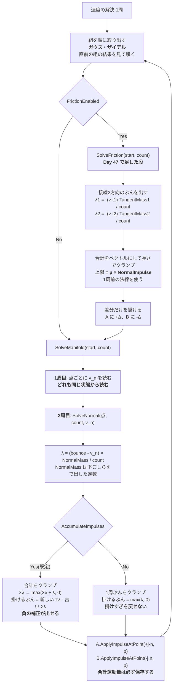
```mermaid
flowchart TD
    ST["速度の解決 1周"] --> LOOP["組を順に取り出す<br/><b>ガウス・ザイデル</b><br/>直前の組の結果を見て解く"]
    LOOP --> FR{"FrictionEnabled"}
    FR -->|Yes| SF["SolveFriction(start, count)<br/><b>Day 47 で足した段</b>"]
    FR -->|No| SM
    SF --> T1["接線2方向のぶんを出す<br/>λ1 = -(v·t1)·TangentMass1 / count<br/>λ2 = -(v·t2)·TangentMass2 / count"]
    T1 --> CONE["合計をベクトルにして長さでクランプ<br/><b>上限 = μ × NormalImpulse</b><br/>1周前の法線を使う"]
    CONE --> TAP["差分だけを掛ける<br/>A に +Δ、B に -Δ"]
    TAP --> SM["SolveManifold(start, count)"]

    SM --> M1["<b>1周目</b>: 点ごとに v_n を読む<br/><b>どれも同じ状態から読む</b>"]
    M1 --> M2["<b>2周目</b>: SolveNormal(点, count, v_n)"]
    M2 --> LAM["λ = (bounce - v_n) × NormalMass / count<br/>NormalMass は下ごしらえで出した逆数"]
    LAM --> ACC{"AccumulateImpulses"}
    ACC -->|"Yes(既定)"| AC["合計をクランプ<br/>Σλ ← max(Σλ + λ, 0)<br/>掛けるぶん = 新しい Σλ - 古い Σλ<br/><b>負の補正が出せる</b>"]
    ACC -->|No| NA["1周ぶんをクランプ<br/>掛けるぶん = max(λ, 0)<br/><b>掛けすぎを戻せない</b>"]
    AC --> AP
    NA --> AP["A.ApplyImpulseAtPoint(+j·n, p)<br/>B.ApplyImpulseAtPoint(-j·n, p)<br/><b>合計運動量は必ず保存する</b>"]
    AP --> LOOP
```

**分岐が1つ増えただけに見えて、意味がまるで違う**(要点1)。
`max` を「1周ぶん」に掛けるか「合計」に掛けるかで、
反復が収束するかしないかが分かれる。
接触の条件は**合計が押す向きであること**だけなので、
途中の周で負の補正を出すのは物理的に何も間違っていない。

**摩擦を先に解く**のは Box2D と同じ順(要点3)。
上限に使う法線インパルスが1周ぶん古くなるが、
逆順にすると**着地の瞬間だけ摩擦が過剰に効いて物が張り付く**。

**1周目と2周目が分かれている**のは Day 44 の肝(その日の要点7)。
1周目で全部の点を「同じ状態から」読むので、
対称な接触では4点が完全に同じ大きさになり、余計なトルクが立たない。

### 前のステップの答えが引き継がれるまで — 5段のループ(Day 47)

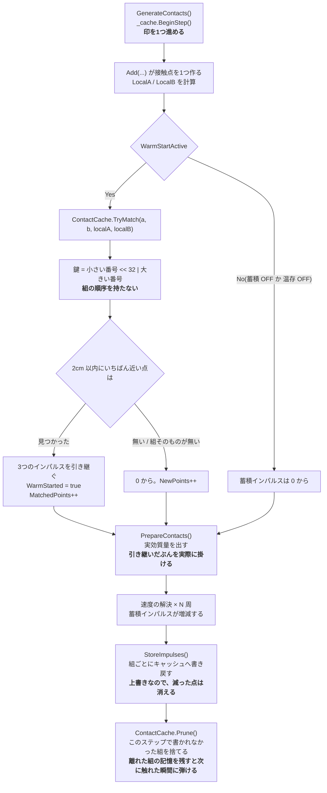
```mermaid
flowchart TD
    B["GenerateContacts()<br/>_cache.BeginStep()<br/><b>印を1つ進める</b>"] --> ADD["Add(...) が接触点を1つ作る<br/>LocalA / LocalB を計算"]
    ADD --> W{"WarmStartActive"}
    W -->|"No(蓄積 OFF か 温存 OFF)"| ZERO["蓄積インパルスは 0 から"]
    W -->|Yes| TM["ContactCache.TryMatch(a, b, localA, localB)"]
    TM --> K["鍵 = 小さい番号 &lt;&lt; 32 | 大きい番号<br/><b>組の順序を持たない</b>"]
    K --> FIND{"2cm 以内にいちばん近い点は"}
    FIND -->|"見つかった"| HIT["3つのインパルスを引き継ぐ<br/>WarmStarted = true<br/>MatchedPoints++"]
    FIND -->|"無い / 組そのものが無い"| MISS["0 から。NewPoints++"]
    HIT --> PREP
    MISS --> PREP
    ZERO --> PREP["PrepareContacts()<br/>実効質量を出す<br/><b>引き継いだぶんを実際に掛ける</b>"]
    PREP --> SOLVE["速度の解決 × N 周<br/>蓄積インパルスが増減する"]
    SOLVE --> STORE["StoreImpulses()<br/>組ごとにキャッシュへ書き戻す<br/><b>上書きなので、減った点は消える</b>"]
    STORE --> PRUNE["ContactCache.Prune()<br/>このステップで書かれなかった組を捨てる<br/><b>離れた組の記憶を残すと次に触れた瞬間に弾ける</b>"]
```

**照合の鍵が `LocalA` と `LocalB` の両方**なのが引っかかりどころ。
片方だけで見ると、薄い板の表と裏のように
「A では同じ場所、B では別の場所」を取り違える。
距離は2つの大きいほうを採る——**どちらも近いことの確認**になる。

**`Prune` を忘れるとどうなるか**。一度でも触れた組の記憶が永久に残る。
地形の上に 200 個降らせる筋書きでは組が毎ステップ入れ替わるので、
辞書が際限なく太っていく。HUD の「組」が接触の組の数より
ずっと大きくなっていたら、まずここを疑う。

### 眠りが決まるまで — 島を組んで、いちばん浅い時計に合わせる(Day 47)

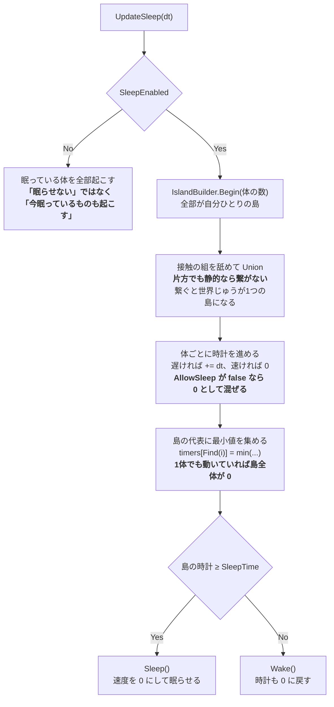
```mermaid
flowchart TD
    U["UpdateSleep(dt)"] --> EN{"SleepEnabled"}
    EN -->|No| WAKE["眠っている体を全部起こす<br/><b>「眠らせない」ではなく「今眠っているものも起こす」</b>"]
    EN -->|Yes| BEGIN["IslandBuilder.Begin(体の数)<br/>全部が自分ひとりの島"]
    BEGIN --> UNION["接触の組を舐めて Union<br/><b>片方でも静的なら繋がない</b><br/>繋ぐと世界じゅうが1つの島になる"]
    UNION --> TIMER["体ごとに時計を進める<br/>遅ければ += dt、速ければ 0<br/><b>AllowSleep が false なら 0 として混ぜる</b>"]
    TIMER --> MIN["島の代表に最小値を集める<br/>timers[Find(i)] = min(...)<br/><b>1体でも動いていれば島全体が 0</b>"]
    MIN --> DECIDE{"島の時計 ≥ SleepTime"}
    DECIDE -->|Yes| SLEEP["Sleep()<br/>速度を 0 にして眠らせる"]
    DECIDE -->|No| AWAKE["Wake()<br/>時計も 0 に戻す"]
```

**静的な体を繋がない**のがこの図でいちばん大事な1行(要点5)。
床は世界じゅうの物と触れているので、繋いだ瞬間に全部が1つの島になり、
どこかで誰かが動いている限り誰も眠れない。

**眠らせるときに速度を 0 にする**のも忘れやすい。
速度を残したまま眠らせると、起きた瞬間にその速度で動き出す——
何時間も止まっていた箱が、触った途端に横へ飛ぶ。

**起こすときに時計も 0 に戻す**。起こすだけだと、
次のステップでしきい値を超えたままなのでまた即座に眠る。
「起こす」は状態を1つ変えることではなく、**止まっていた記録を捨てること**。

### カプセルが何かに当たるまで — 全部いったん球に落ちる(Day 45)

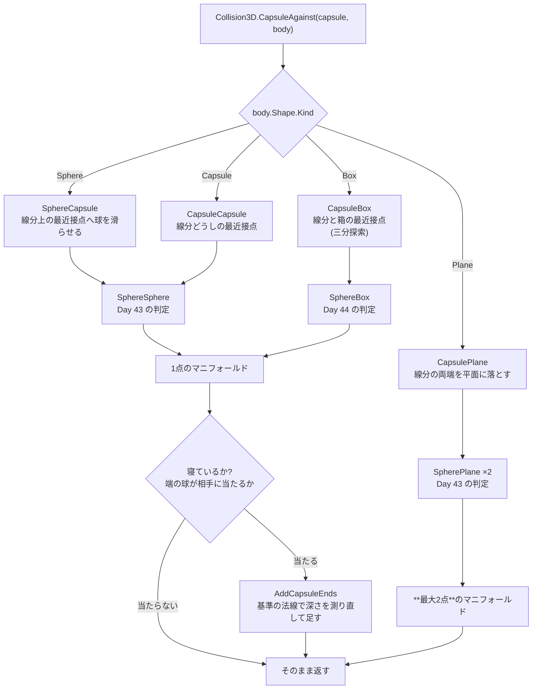
```mermaid
flowchart TD
    S["Collision3D.CapsuleAgainst(capsule, body)"] --> K{"body.Shape.Kind"}

    K -->|Sphere| SC["SphereCapsule<br/>線分上の最近接点へ球を滑らせる"]
    K -->|Plane| CP["CapsulePlane<br/>線分の両端を平面に落とす"]
    K -->|Box| CB["CapsuleBox<br/>線分と箱の最近接点<br/>(三分探索)"]
    K -->|Capsule| CC["CapsuleCapsule<br/>線分どうしの最近接点"]

    SC --> SS["SphereSphere<br/>Day 43 の判定"]
    CC --> SS
    CB --> SB["SphereBox<br/>Day 44 の判定"]
    CP --> SP["SpherePlane ×2<br/>Day 43 の判定"]

    SS --> W["1点のマニフォールド"]
    SB --> W
    SP --> M2["**最大2点**のマニフォールド"]

    W --> E{"寝ているか?<br/>端の球が相手に当たるか"}
    E -->|当たる| AE["AddCapsuleEnds<br/>基準の法線で深さを測り直して足す"]
    E -->|当たらない| OUT["そのまま返す"]
    AE --> OUT
    M2 --> OUT
```

**どの枝も最後は球の判定に落ちている**のが、この図でいちばん見てほしいところ。
カプセルが「線分から一定の距離」でしかないので、
新しく書いたのは<b>「どこへ球を滑らせるか」</b>だけになる。

**平面だけ別扱い**なのは、平らな面に対しては
「いちばん深いのは必ず線分の端」と言い切れるから。
端2つを見れば漏れも無駄も無いので、`AddCapsuleEnds` の出番がない。

**`AddCapsuleEnds` が要る理由**は Day 44 の要点4そのまま——
寝かせたカプセルを1点で支えると、転がって震え続ける。
足すときに<b>基準の法線で深さを測り直す</b>のは、
マニフォールドが法線を1本しか持てないため。

### キャラクターが1ステップ動くまで — 水平と垂直を分ける(Day 45)

```mermaid
flowchart TD
    S["CharacterController.Move(world, wish, run, jump, dt)"]
    S --> V1["1. 水平の目標速度へ寄せる<br/>接地なら 40 m/s²、空中なら 8 m/s²"]
    V1 --> V2{"2. ジャンプ?"}
    V2 -->|接地 + 押した瞬間| J["Velocity.Y = sqrt(2 g h)<br/>IsGrounded = false"]
    V2 -->|接地| Z["**Velocity.Y = 0**<br/>床へ押し付けない(要点9)"]
    V2 -->|空中| G["Velocity.Y -= Gravity * dt"]

    J --> H
    Z --> H
    G --> H["3. MoveHorizontal<br/>ここで段差を試す"]
    H --> VM["4. MoveAndSlide(縦)<br/>接地中は 0 なので何も起きない"]
    VM --> UG["5. UpdateGround<br/>探って、吸い付く"]
    UG --> F["向きを移動方向へ寄せる<br/>(絵のためだけ)"]
```

**3 と 4 を分けるのが肝**(要点8)。一度に動かすと、
段差に当たったときに「壁にぶつかったのか、床に着いたのか」が区別できない。
分けておけば、水平の移動が止められたときだけ段差を試せばよくなる。
Quake の `PM_StepSlideMove` から続く定石で、
**斜めに走って段を上がる**ような場面でも破綻しない。

**2 で「接地中は縦に動かさない」**のが Day 45 でいちばん手こずった判断。
床へ軽く押し付ける実装にすると、段の縁にめり込んで横へ押し戻され、
前進がちょうど帳消しになる(要点9)。

### 押し戻しの中身 — 床は真上へ、壁は法線へ(Day 45)

```mermaid
flowchart TD
    S["MoveAndSlide(world, displacement, stepping)"] --> P["Position += displacement<br/>**めり込んでよい**"]
    P --> L["4周まわす"]
    L --> Q["QueryCapsule<br/>当たっている面を集める"]
    Q -->|0件| OUT["終わり"]
    Q -->|1件以上| C{"normal.Y >= 歩ける基準?"}

    C -->|はい・床| U["**真上へ** depth / normal.Y<br/>横へずれない(要点7)<br/>Velocity.Y を 0 に"]
    C -->|いいえ| SL{"上限あり かつ<br/>normal.Y > 0?"}

    SL -->|はい・急な坂| CL["**上向き成分を抜く**<br/>= 壁として扱う<br/>TouchedWall = true"]
    SL -->|いいえ・壁や天井| N
    CL --> N["法線の向きへ depth + skin"]
    N --> VS["速度から食い込む成分を抜く<br/>v -= n (v·n)  ← **これが滑り**"]

    U --> L
    VS --> L
```

**床だけ真上へ押す**のが要点7。法線の向きへ押すと、
坂に立っているだけで横成分のぶん滑り落ちてしまう(摩擦を入れていないので止まらない)。
真上へ `深さ / 法線のY` なら、めり込みは同じだけ解けて横へは動かない。

**4周まわすのは押し戻しが打ち消し合うから**。部屋の角では2枚の壁に同時に当たり、
片方を押し戻すともう片方へ深く入る。
Day 44 の `PositionIterations` と同じ事情で、**周ごとに当たり直しから測り直す**。

`stepping` が true(段差を降ろしている最中)のときだけ、
「歩ける基準」を 0.1 まで緩める——段の角に触れたときの法線は寝ているので、
普段の基準では「登れない壁」に見えてしまう。

### 段差を越えるまで — 覗いて、持ち上げて、進む(Day 45)

```mermaid
flowchart TD
    S["MoveHorizontal(world, displacement)"] --> P["まず素直に MoveAndSlide"]
    P --> Q{"思ったぶん進めた?"}
    Q -->|はい| OUT["終わり"]
    Q -->|いいえ| W["TouchedWall = true"]
    W --> G{"段差の乗り越えが有効 かつ 接地?"}
    G -->|いいえ| OUT2["壁として扱う(進めない)"]
    G -->|はい| T["TryFindStep で**前方を覗く**"]

    T --> T1["半径ぶん前・段差ぶん上に<br/>カプセルを置いてみる"]
    T1 --> T2{"埋まっている?"}
    T2 -->|はい| OUT2
    T2 -->|いいえ| T3["小刻みに下ろして<br/>最初に触れた面を探す"]
    T3 --> T4{"歩ける床 かつ<br/>段差の範囲内?"}
    T4 -->|いいえ| OUT2
    T4 -->|はい| R["**その場で段の高さまで持ち上げる**<br/>Position.Y = stepTop + skin"]

    R --> R2["もう一度 MoveAndSlide"]
    R2 --> R3{"素直に動かしたときより進めた?"}
    R3 -->|いいえ| BACK["素直に動かした結果へ戻す"]
    R3 -->|はい| OK["SteppedUp = true<br/>落下速度は捨てる"]
```

**落とさない**のが Day 45 の答え(要点8)。
「持ち上げて・進んで・落とす」と書くと、カプセルの丸い底が段の角に当たって止まり、
そのときの法線が寝ているので「壁」と判定されて押し戻される——
1フレームで進める 5cm では角を越えられないので、何フレームかけても越えられない。

**覗く位置が坂を弾く**。急な坂では半径ぶん前方の地面が段差ぶんより高く上がっているので、
覗いた位置が坂の中に埋まる。**「段か坂か」を、法線ではなく覗いた先の形で決めている**。

持ち上げたあと落とさないので、足が段の縁に乗るまでの数フレーム(0.05 秒ほど)は
段の上の空中を歩くことになる。絵としては「滑らかに段を登った」ように見える。

### 接地を決めるまで — 探って、吸い付いて、取り消す(Day 45)

```mermaid
flowchart TD
    S["UpdateGround(world)"] --> U{"上へ動いている?"}
    U -->|はい| NG["接地しない<br/>**拾うと何度でも跳べる**"]
    U -->|いいえ| R["探る距離を決める<br/>直前まで接地 → 段差ぶん(35cm)<br/>そうでなければ 6cm"]

    R --> P["Probe: その距離だけ下げた<br/>カプセルを当ててみる"]
    P --> F{"歩ける床が見つかった?"}
    F -->|いいえ| NG
    F -->|はい| SET["**IsGrounded = true**<br/>GroundNormal = いちばん平らな法線"]

    SET --> SNAP["その距離ぶん実際に下ろす<br/>(MoveAndSlide)"]
    SNAP --> B{"進行方向と逆へ動いた?"}
    B -->|はい| UNDO["**下ろしたのを取り消す**<br/>ただし接地の判断は残す"]
    B -->|いいえ| DONE["そのまま"]
```

**探るだけで位置は動かさない**のが `Probe` の性格。
形が値(`readonly struct`)なので、本体を動かさずに何度でも試せる——
`ToCapsule(footPosition)` を用意したのはこのため。

**吸い付きが無いと階段を降りるときに毎段跳ねる**。
自己チェックでは、切ると 180 ステップ中 22 ステップが空中になるのが測れる。

**取り消すのは「動き」だけで、「接地している」という判断は残す**のが要点9。
真下に床があることは `Probe` が確かめているので、
段の縁に引っかかって少し浮いているだけなら接地扱いのままでよい。
ここを落とすと、段を登りかけたキャラクターが空中扱いになり、
段差の処理が走らなくなって**永久に登れない**。

### 地形に当たるまで — マスを出して、1枚ずつ当てて、1本にまとめる(Day 46)

```mermaid
flowchart TD
    S["SphereTerrain / CapsuleTerrain"] --> BB["外接箱を作る<br/>sphere.Bounds / capsule.Bounds"]
    BB --> CR{"terrain.CellRange<br/>触れうるマスはあるか"}
    CR -->|No| NONE["当たらない<br/>三角形を1枚も見ない"]
    CR -->|Yes| LOOP["マスを1つずつ<br/>1マス = 三角形2枚"]

    LOOP --> TRI["Triangle(cellX, cellZ, which)"]
    TRI --> SGN{"球の中心は面の表側か"}

    SGN -->|裏側| COL{"真上から見て<br/>この三角形の中か"}
    COL -->|No| LOOP
    COL -->|Yes| DEEP["深く潜っている<br/>深さ = 半径 - 符号付き距離"]

    SGN -->|表側| CP["ClosestPoint で最近接点"]
    CP --> FAR{"距離 >= 半径 ?"}
    FAR -->|Yes| LOOP
    FAR -->|No| SNAP["**法線は面の法線に取り替える**<br/>内部エッジ対策(要点3)"]

    DEEP --> HITS["hits に控える"]
    SNAP --> HITS
    HITS --> LOOP

    LOOP --> BUILD["BuildTerrainManifold"]
    BUILD --> D1["1. いちばん深いものを選ぶ<br/>その法線がマニフォールドの法線"]
    D1 --> D2["2. 向きが 60 度以内のものだけ足す"]
    D2 --> D3["3. 深さを法線へ射影する<br/>depth × cos"]
    D3 --> D4["4. 近すぎる点は捨てる"]
    D4 --> OUT["ContactManifold(最大4点)"]
```

**分かれ道は2つだけ**。「表か裏か」と「面の法線に取り替えるか」。
前者が要るのは、地面に潜った物体を拾い直すため(要点3)。
後者が内部エッジ対策そのもので、**ここを素直に書くと球が対角線で蹴られる**。

**箱だけはこの図を通らない**。8つの角の下に地面があるかを見るだけで、
`Triangle3D` すら出てこない——`TryHeightAt` の答えと角の高さを比べるだけ(要点4)。
同じ「地形との判定」が形によってまったく違う道を通るのは、
**地形が形であると同時に関数でもある**ことの現れになっている。

### ブロードフェーズが1ステップで組まれるまで(Day 46)

```mermaid
flowchart TD
    S["PhysicsWorld.GenerateContacts()"] --> BF{"Broadphase"}

    BF -->|BruteForce| L1["二重ループ<br/>for i, for j = i+1<br/>n(n-1)/2 組"]
    L1 --> TP

    BF -->|UniformGrid| UB["UpdateBounds()<br/>体ごとに外接箱を1回だけ作る"]
    UB --> CFG["Grid.Configure<br/>origin / size / cellSize"]
    CFG --> BUILD["Grid.Build(bounds)"]

    BUILD --> FIT{"Fits ?<br/>有限で、64 マス以下か"}
    FIT -->|No| OVER["はみ出し組へ<br/>平面5枚 + 地形1枚"]
    FIT -->|Yes| P1["パス1: マスごとに数える"]
    P1 --> P2["パス2: 接頭辞和"]
    P2 --> P3["パス3: _entries へ詰める"]

    OVER --> CP["Grid.CollectPairs(bounds)"]
    P3 --> CP

    CP --> G1["格子の中: 同じマスの j > i<br/>印で重複を潰す"]
    G1 --> G2["AABB で足切り"]
    G2 --> PAIRS["_pairs に積む"]

    CP --> O1["**はみ出し組は全員と組にする**<br/>取りこぼすと床をすり抜ける"]
    O1 --> PAIRS

    PAIRS --> TP["TestPair(i, j)<br/>**総当たりと共通**"]
    TP --> NR["Collision3D.Collide<br/>ここから先は Day 45 と同じ"]
```

**2つの経路が `TestPair` で合流している**のが今日いちばん大事な形。
Day 26 の 2D で `Resolve` に合流させたのとまったく同じ理由で、
**違いが出たら必ず組の選び方が原因**と言い切れるようにしてある。

`UpdateBounds` を独立させたのは、外接箱を**2回作らないため**。
`Build` と `CollectPairs` が同じ列をなめるので、
その場で作ると箱のクォータニオン変換が2回走る。

### 高さを1つ答えるまで — 割り算2回と、どちらの三角形か(Day 46)

```mermaid
flowchart TD
    S["terrain.TryHeightAt(x, z)"] --> G["格子座標へ<br/>gx = (x - Origin.X) / CellSize<br/>gz = (z - Origin.Z) / CellSize"]
    G --> C["マス番号<br/>cellX = floor(gx), cellZ = floor(gz)"]
    C --> R{"地形の中か"}
    R -->|No| F["false<br/>地形の外だと正直に答える"]
    R -->|Yes| U["マス内の位置<br/>u = gx - cellX, w = gz - cellZ"]
    U --> D{"w >= u ?<br/>**対角線のどちら側か**"}
    D -->|Yes| T0["0 枚目の三角形<br/>h = h00 + (h01-h00)w + (h11-h01)u"]
    D -->|No| T1["1 枚目の三角形<br/>h = h00 + (h10-h00)u + (h11-h10)w"]
    T0 --> ADD["Origin.Y を足す"]
    T1 --> ADD
    ADD --> OK["true"]
```

**分岐が1つしか無い**。それが `w >= u`——マスを割った対角線のどちら側か。
ここを省いて4隅を双一次補間すると、**判定に使っている三角形と一致しない**面ができる
(要点1)。どちらの式も (0,0) と (1,1) では同じ値を返すので、
対角線をまたいでも高さは飛ばない。

**この関数が判定を1回も呼んでいない**のが、高さの格子を選ぶ最大の理由。
一般の三角形メッシュでこの問いに答えるにはレイキャストが要る。
`BoxTerrain` が SAT を書かずに済んでいるのも、`CharacterController` の足元が軽いのも、
元をたどるとこの5行に行き着く。

### Audio — OpenAL の薄い皮

```mermaid
classDiagram
    class WavData {
        +byte[] Data
        +int SampleRate
        +int Channels
        +int BitsPerSample
        +int BytesPerFrame
        +int FrameCount
        +float Duration
    }
    class WavFile {
        +Load(path) WavData
        +Parse(bytes, name) WavData
    }
    class AudioClip {
        +string Name
        +uint Buffer
        +int SampleRate
        +int Channels
        +int BitsPerSample
        +float Duration
        +int ByteSize
        +bool IsMono
        +FromWav(al, wav, name) AudioClip
        +Dispose()
    }
    class VoiceId {
        +bool IsValid
        +None
    }
    class AudioSystem {
        +bool IsAvailable
        +string DeviceName
        +int VoiceCount
        +int ActiveVoices
        +float MasterVolume
        +bool PitchVariation
        +int MaxStartsPerClipPerStep
        +int StartedLastStep
        +int CulledLastStep
        +int StolenLastStep
        +Load(path) Handle
        +Update()
        +Play(clip, volume, pitch, pan, priority, looping) VoiceId
        +PlayLoop(clip, volume) VoiceId
        +IsPlaying(voice) bool
        +Stop(voice)
        +StopAll()
        +Dispose()
    }
    class Voice {
        +uint Source
        +int Generation
        +bool Active
        +bool Looping
        +int Priority
        +long StartedAt
    }

    WavFile ..> WavData : 返す
    AudioClip ..> WavData : 受け取る
    AudioSystem ..> WavFile : 読む
    AudioSystem *-- AudioClip : ResourcePool で持つ
    AudioSystem *-- Voice : 固定数の配列
    AudioSystem ..> VoiceId : 添字 + 世代を配る
    AudioSystem ..> Handle : クリップを指す
```

`Voice` は `AudioSystem` の中の `private struct`。外からは `VoiceId` 越しにしか触れない。

この層で押さえるべき線引きは3つ。

- **`WavFile` は OpenAL を知らない**。ただのバイト列パーサなので、
  ファイルが無くてもメモリ上のバイト列で試せる(自己チェックがそうしている)
- **`AudioClip` はデータ、`Voice` は再生**(要点2)。
  `Texture` と `Material`、`Mesh` と描画呼び出しと同じ分け方
- **`VoiceId` は `Handle<T>` と同じ構造**(添字 + 世代)だが**別の型**。
  `Handle<T>` は `ResourcePool<T>` のためのもので、ボイスはプールではないので流用しない。
  同じ手口を別の場所で使い直している、と読むのが正しい

### Text — Render の上に積む層

```mermaid
classDiagram
    class SystemFonts {
        +string Directory
        +Open(requiredCodepoint) FontFace
    }
    class FontFace {
        +string Path
        +string Name
        +int FaceIndex
        +int FaceCount
        +ScaleFor(pixelHeight) float
        +Ascent(scale) float
        +Descent(scale) float
        +LineGap(scale) float
        +LineHeight(scale) float
        +HasGlyph(codepoint) bool
        +GlyphIndexOf(codepoint) int
        +Measure(glyphIndex, scale) GlyphMetrics
        +Rasterize(glyphIndex, scale, dest, w, h, stride)
        +Kerning(left, right, scale) float
    }
    class GlyphMetrics {
        +int Width
        +int Height
        +int OffsetX
        +int OffsetY
        +float Advance
        +bool HasPixels
    }
    class Glyph {
        +AtlasRegion Region
        +GlyphMetrics Metrics
        +bool HasPixels
    }
    class GlyphAtlas {
        +int Size
        +Texture Texture
        +FontFace Font
        +int GlyphCount
        +int ShelfCount
        +int BakedThisFrame
        +int BakedTotal
        +bool IsFull
        +float Usage
        +BeginFrame()
        +GetOrAdd(codepoint, pixelHeight) Glyph
    }
    class TextRenderer {
        +bool Kerning
        +bool PixelSnap
        +int GlyphsDrawn
        +LineHeight(pixelHeight) float
        +Ascent(pixelHeight) float
        +Measure(text, pixelHeight) Vector2
        +Draw(batch, text, position, pixelHeight, color, align, layer) Vector2
    }

    SystemFonts ..> FontFace : 探して開く
    FontFace ..> GlyphMetrics : 測って返す
    GlyphAtlas --> FontFace : 焼いてもらう
    GlyphAtlas *-- Texture : R8 を1枚持つ
    GlyphAtlas ..> Glyph : 配る
    Glyph *-- AtlasRegion
    Glyph *-- GlyphMetrics
    TextRenderer --> GlyphAtlas : 引く
    TextRenderer ..> SpriteBatch : 四角を積む
```

4つのクラスが、**それぞれ1つのことしかしない**ように切ってある。

| クラス | 知っていること | 知らないこと |
|---|---|---|
| `SystemFonts` | どこにフォントがあるか | 描き方 |
| `FontFace` | フォントの中身(寸法とアウトライン) | GL、アトラス、レイアウト |
| `GlyphAtlas` | どこに置いたか、何を焼いたか | 文字の並べ方 |
| `TextRenderer` | 並べ方(送り・行送り・整列) | フォントの中身、GL |

この切り方の値打ちは、**差し替えたときにどこまで壊れるか**で分かる。
SDF に変える(改造課題3)なら `GlyphAtlas` と `text.frag` だけが変わり、
`TextRenderer` は 1 行も触らない。
フォントフォールバックを入れる(改造課題2)なら `FontFace` を複数持つだけで、
`GlyphAtlas` の棚詰めには影響しない。

**`GlyphMetrics` が `FontFace` と `TextRenderer` の共通語**になっている。
「原点からどれだけずらして、次にどれだけ進むか」——
この5つの数字さえあれば、フォントの実装が何であれ字を並べられる。

### Model — glTF を描画の言葉へ翻訳する層(Day 42 でさらにクラスが4つ増えた)

```mermaid
classDiagram
    class GltfLoader {
        <<static>>
        +Load(gl, resources, path, shader, forceGenerateTangents) Model
        +Describe(path) string
        -ReadGlb(bytes, path)
    }
    class LoadContext {
        +Build() Model
        -ReadNodes()
        -BuildNodeOrder(nodes, parents, count)
        -ReadNodePose(node, index)
        -Visit(nodes, index, parent, ...)
        -ReadPrimitive(primitive, world, name, nodeIndex, skinIndex, ...)
        -GenerateNormals(vertices, indices)
        -GenerateTangents(vertices, indices, sourceUvs)
        -NormalizeWeights(weights) Vector4
        -ReadSkins()
        -ReadAnimations()
        -ReadAnimationSampler(sampler) Sampler
        -ReadAnimationValues(index)
        -ReadScalarAccessor(index)
        -ReadMatrix4Accessor(index)
        -ReadVector4Flexible(index, normalizeIntegers)
        -Locate(accessor, elementSize)
        -GetOrCreateMaterial(index) Material
    }
    class Model {
        +IReadOnlyList Parts
        +IReadOnlyList Materials
        +IReadOnlyList Nodes
        +IReadOnlyList NodeOrder
        +IReadOnlyList Skins
        +IReadOnlyList Animations
        +Vector3 BoundsMin
        +Vector3 BoundsMax
        +float BoundsRadius
        +int TriangleCount
        +int VertexCount
        +int TextureCount
        +int FileTangentParts
        +int GeneratedTangentParts
        +int GeneratedNormalParts
        +int SkinnedParts
        +int JointCount
        +Dispose()
    }
    class Part {
        <<record struct>>
        +Mesh Mesh
        +Material Material
        +Matrix4x4 Transform
        +string Name
        +Vector3 BoundsMin
        +Vector3 BoundsMax
        +int NodeIndex
        +int SkinIndex
    }
    class ModelNode {
        <<record struct>>
        +string Name
        +int Parent
        +NodePose RestPose
        +int MeshIndex
        +int SkinIndex
    }
    class NodePose {
        <<struct>>
        +Vector3 Translation
        +Quaternion Rotation
        +Vector3 Scale
        +ToMatrix() Matrix4x4
        +Lerp(a, b, t) NodePose$
    }
    class PoseAccumulator {
        <<struct>>
        +Add(pose, weight)
        +Resolve(fallback) NodePose
    }
    class ClipWeight {
        <<record struct>>
        +int Clip
        +float Weight
    }
    class BlendTree1D {
        +string Name
        +IReadOnlyList Samples
        +float MinParameter
        +float MaxParameter
        +Evaluate(parameter, destination) int
    }
    class BlendSample {
        <<record struct>>
        +string Name
        +int Clip
        +float Parameter
    }
    class AnimationStateMachine {
        +IReadOnlyList States
        +int Current
        +int Previous
        +float Fade
        +float FadeSeconds
        +float Hysteresis
        +Reset(state)
        +Update(deltaSeconds, parameter, destination) int
    }
    class MachineState {
        <<record struct>>
        +string Name
        +int Clip
        +float Threshold
    }
    class Skin {
        <<record struct>>
        +string Name
        +Joints
        +InverseBindMatrices
        +int SkeletonRoot
        +int JointCount
    }
    class AnimationClip {
        +string Name
        +float Duration
        +IReadOnlyList Channels
        +Apply(time, pose)
    }
    class Channel {
        <<record struct>>
        +int Node
        +AnimationPath Path
        +Sampler Sampler
    }
    class Sampler {
        +AnimationInterpolation Interpolation
        +int KeyCount
        +float EndTime
        +SampleVector3(time) Vector3
        +SampleRotation(time) Quaternion
        -Key(index) Vector4
        -Locate(time)
    }
    class AnimationPlayer {
        +int MaxJoints$
        +int MaxBlendClips$
        +int ClipIndex
        +ReadOnlySpan Blend
        +float Phase
        +float Time
        +float Speed
        +bool Paused
        +bool SkinningEnabled
        +bool SyncPhase
        +float Duration
        +SetBlend(clips)
        +Rewind()
        +Update(deltaSeconds)
        +Advance(seconds)
        +SelectClip(index)
        +NextClip()
        +GetNodeWorld(node) Matrix4x4
        +GetJointMatrices(skin)
        -TimeOf(clip) float
        -Evaluate()
    }

    GltfLoader ..> LoadContext : 1回の読み込みぶん
    LoadContext ..> Model : 作る
    Model *-- Part
    Model *-- ModelNode
    Model *-- Skin
    Model *-- AnimationClip
    ModelNode *-- NodePose
    AnimationClip *-- Channel
    Channel --> Sampler
    Part --> Mesh : 所有する
    Part --> Material : 共有される
    Model ..> RenderResources : テクスチャを借りて返す
    AnimationPlayer --> Model : 読むだけ。書き換えない
    AnimationPlayer ..> PoseAccumulator : 混ぜる
    AnimationPlayer ..> ClipWeight : 受け取る
    BlendTree1D *-- BlendSample
    BlendTree1D ..> ClipWeight : 作る
    AnimationStateMachine *-- MachineState
    AnimationStateMachine ..> ClipWeight : 作る
```

<b>クラス図の都合で名前を変えてある</b>ものが2つある。
`BlendSample` は実際には `BlendTree1D.Sample`、`MachineState` は
`AnimationStateMachine.State`。mermaid の classDiagram は入れ子の型名を
そのまま書けないので、外に出して別名にした
(`AnimationClip.Channel` / `.Sampler` を `Channel` / `Sampler` と書いているのと同じ扱い)。

**Day 34 で `GenerateTangents` が入った**。ここに置いたのは、
**接線が「読み込みの一部」だから**——ファイルにあれば読み、無ければ作る、という
同じ場所で決まるべき話になる。

**Day 41 で `GenerateNormals` が隣に並んだ**のも同じ理由。
Fox が `NORMAL` を持っていないので、三角形の外積から作り直す。
接線より**先に**呼ぶのが決まりで、接線の生成が法線を使う
(グラム・シュミットで直交させる)ため。

**Day 39 で `Part` に境界箱が入った**。モデル全体のぶん(`Model.BoundsMin`)は
Day 32 からあったが、それだけでは足りない場面が出た。

配布されているモデルには「きれいな版」と「錆びた版」が
**1ファイルに並べて入っている**ことがある(`fire_hydrant` / `metal_trash_can`)。
デモに置くときは片方だけが欲しいので、`DemoScene` がノード名で選り分ける——
すると残ったパーツの**大きさと足元が全体のものとは違う**。

`Part.Name`(glTF のノード名)も、この日から
「デバッグ表示用」ではなく**選り分けの鍵**という仕事を持った。

`Model` が接線と法線の出どころ(ファイル / 生成)の数を持つのは、
**HUD と自己チェックで区別を出すため**。
「法線マップが効かない」の原因の筆頭がここなので、
数を見えるところに出しておく価値がある。

**`LoadContext` を切り出したのは、引数が増えすぎたから**。
`gl` / `resources` / `path` / `directory` / `root` / `embedded` / `shader` の7つを
静的メソッド間で渡し回すと、どの関数も先頭3行が引数の受け渡しになる。
**読み込み1回ぶんの寿命を持つ入れ物**にまとめると、
buffer のキャッシュとマテリアルの使い回しも自然にそこへ収まる。
Day 41 でここに `_nodes` / `_nodeOrder` / `_skins` / `_animations` が加わり、
**読み込みの結果を組み立てる場所**という性格がはっきりした。

### `Model` が木を持ち直したこと(Day 41)

Day 32 の `Model` は「メッシュ + マテリアル + 世界行列」の平らな一覧だった。
根から行列を掛け合わせて世界行列を確定させてしまえば、
描くときは順に回すだけ——**静的なモデルに階層は要らない**、という判断。

Day 41 でそれが足りなくなる。理由は2つとも「木を歩き直す必要がある」。

| 何のために | どう歩くか |
|---|---|
| アニメーション | ノードの TRS が毎フレーム書き換わる → 世界行列を作り直す |
| スキニング | 関節ノードの世界行列を集めて関節行列を作る |

そこで `Model` に `Nodes`(木の形と初期姿勢)と `NodeOrder`(親が先に来る並び)を戻した。
**平らな一覧も残してある**のが今日の判断で、
静的なモデル(Day 39 のデモシーンの小物)は Day 32 からの経路をそのまま通る。

`NodeOrder` を配列で持つのは、毎フレーム再帰で降りるのを避けるため。
**順番は読み込みの時点で決まっている**ので、1回並べ替えておけば
あとはキャッシュに乗る素直なループになる。

glTF の `nodes` の並びに順序の保証は無い(子が親より前に書かれているファイルは実在する)。
番号順に回すと**1フレーム古い親の行列**を掛けることになり、
「腕だけ1フレーム遅れてついてくる」という気味の悪い出方をする。

**`Model` が `RenderResources` を握っている**のは、
テクスチャの参照カウントを返すため(Day 21 の要点3)。
`Mesh` は自分で作ったので所有するが、テクスチャは借り物なので返す必要がある。
ここを忘れると、モデルを切り替えるたびに 2K テクスチャが数枚ずつ残り、
**絵は正しいのに VRAM だけ増え続ける**。

**`AnimationPlayer` は何も所有しない**のが対照的で、
持っているのは姿勢と行列の配列だけ。だから捨てるのではなく
参照を切れば済む(`Program.SetModel` の `_animation = null`)。
「Dispose が要るもの」と「要らないもの」の線が、この2つを並べるとはっきりする。

### glTF を1体読むまで — 3段の間接参照とノードの木

```mermaid
flowchart TD
    F["ファイルを読む"] --> M{"先頭4バイトが<br/>glTF か"}
    M -->|Yes| GLB["ReadGlb<br/>JSON チャンクと BIN チャンクに分ける"]
    M -->|No| TXT["JSON としてそのまま parse<br/>buffer は外部ファイル / data URI"]
    GLB --> ND["ReadNodes<br/>子の一覧を反転して親を作る<br/>根から深さ優先で NodeOrder"]
    TXT --> ND
    ND --> SK["ReadSkins<br/>関節のノード番号 + 逆バインド行列"]
    SK --> SC["scenes[scene].nodes から開始"]
    SC --> V["Visit(ノード, 親の世界行列)"]
    V --> TR["ローカル行列を作る<br/>matrix か TRS のどちらか<br/>world = local * parent"]
    TR --> HM{"mesh を持つか"}
    HM -->|Yes| PR["primitives を順に ReadPrimitive<br/>node.skin も一緒に渡す"]
    HM -->|No| CH
    PR --> CH{"children があるか"}
    CH -->|Yes| V
    CH -->|No| AN["ReadAnimations<br/>channel と sampler を組む"]
    AN --> DONE["Model が完成"]
```

**ノードを2回歩く**のが Day 41 の形。1回目(`ReadNodes`)は全ノードの
親と姿勢を確定させるため、2回目(`Visit`)はシーンに繋がったメッシュを拾うため。

分けたのは、**関節がシーングラフの外に置かれたファイルが実在する**から。
`Visit` だけで済ませると、そういうノードの姿勢が作られず、
アニメーションがノード番号で名指ししてきたときに書き込む先が無い。

プリミティブ1個を頂点配列にするところが、glTF のいちばん機械的な部分になる。

```mermaid
flowchart TD
    P["primitive"] --> A["attributes.POSITION → accessor 番号"]
    A --> AC["accessors[n]<br/>type=VEC3 componentType=5126(float) count=14556"]
    AC --> BV["bufferViews[m]<br/>buffer=0 byteOffset=1024 byteStride=0"]
    BV --> B["buffers[0]<br/>glb の BIN チャンク / 外部 .bin / data URI"]
    B --> READ["Locate が (バイト列, 開始位置, ストライド) を返す"]
    READ --> VTX["Vertex[] を組む<br/>V を反転 / 法線が無ければ 0 を置く"]
    P --> JW["JOINTS_0 / WEIGHTS_0<br/>ReadVector4Flexible<br/>**番号は正規化しない、重みは正規化する**"]
    JW --> NW["NormalizeWeights<br/>合計を 1 に揃える"]
    NW --> VTX
    P --> IDX["indices → accessor<br/>u8 / u16 / u32 を uint へ広げる"]
    IDX --> GN["法線が無ければ GenerateNormals<br/>接線が無ければ GenerateTangents"]
    VTX --> GN
    P --> MAT["material → GetOrCreateMaterial<br/>ベースカラーは sRGB、それ以外はリニア"]
    GN --> MESH["new Mesh(vertices, indices)"]
    MAT --> PART["Model.Part(Mesh, Material, partWorld, name, NodeIndex, SkinIndex)"]
    MESH --> PART
    PART --> SW{"スキンを持つか"}
    SW -->|Yes| ID["partWorld = 単位行列<br/>**ノードの変換は無視する**(仕様)"]
    SW -->|No| WD["partWorld = world"]
```

**`byteStride` が肝**。glTF は「位置・法線・UV を1頂点ずつ交互に並べる」書き方も許していて、
その場合 `bufferView` に `byteStride` が入る。0(または未指定)なら詰めて並んでいる。

Day 41 のモデルは**5体中3体が stride 付き**(RiggedSimple / CesiumMan / Fox)。
Day 32 の4体は全部 stride 無しだったので、
「対応を落としても動いてしまう」状態がここでようやく破れる。

**`accessor` を経由する意味**は、1本のバイト列を複数の意味で切り出せること。
位置と法線と UV が同じ `buffer` に同居し、
それぞれの `bufferView` が違う範囲を指す。
OBJ が「v の配列」「vt の配列」を別々のテキスト行として持っていたのに対し、
glTF は**メモリ上の並びをそのまま記述している**ので、読み込み後の組み直しが要らない。

**`ReadVector4Flexible` の引数1つが今日の落とし穴**。
`JOINTS_0` も `WEIGHTS_0` も VEC4 で、どちらも整数で入っていることがあるが、
**読み替え方が正反対**になる。

| | 成分の型 | 整数を 0〜1 に読み替えるか |
|---|---|---|
| `JOINTS_0` | unsigned byte / unsigned short | **しない**(3 は 3 のまま) |
| `WEIGHTS_0` | float / 正規化された整数 | **する**(255 → 1.0) |

取り違えると、関節の番号が全部 0 になって
**モデル全体が1本の骨にぶら下がる**という派手な壊れ方をする。

### 1フレームの姿勢が決まるまで — 時刻から関節行列へ5段(Day 42 で1段増えた)

```mermaid
flowchart TD
    T["OnUpdate(dt)"] --> LC["UpdateLocomotion(dt)<br/>速度 → ClipWeight[] → SetBlend"]
    LC --> AD["_animation.Update(dt)<br/>phase += dt * Speed / Duration<br/>**位相で持つ**(Day 42)"]
    AD --> LOOP{"混ぜるクリップを<br/>1本ずつ"}
    LOOP --> R["1. ファイルの姿勢へ戻す<br/>scratch = Nodes.RestPose<br/>**クリップごとに毎回やる**"]
    R --> C["2. クリップを当てる<br/>clip.Apply(TimeOf(clip), scratch)"]
    C --> S["Sampler.Locate(time)<br/>二分探索で挟む2キーと t"]
    S --> I{"何を補間するか"}
    I -->|"translation / scale"| L["Vector3.Lerp"]
    I -->|"rotation"| SL["Quaternion.Slerp<br/>**lerp では等速にならない**"]
    L --> ACC["3. 重み付きで足し込む<br/>PoseAccumulator.Add<br/>**符号を揃えてから**"]
    SL --> ACC
    ACC --> LOOP
    LOOP -->|"全部足した"| RS["4. 取り出す<br/>Resolve。回転は正規化"]
    RS --> W["5. 木を降りて世界行列<br/>NodeOrder の順に1回<br/>world = local * 親の world"]
    W --> J["6. 関節行列<br/>joint = IBM * world(関節ノード)"]
    J --> OUT["GetJointMatrices(skin)<br/>そのまま uJoints へ"]
```

**5 と 6 は Day 41 から1文字も変わっていない**。
混ぜる場所を姿勢の段(1〜4)に置いたので、下流から見ると
「ポーズが1つ決まった」以上のことは起きていない。
**上流で混ぜる形にしておくと、何本混ぜても GPU 側は何も知らなくてよい**。

**1 を毎回やる**のが要点。クリップが触らないノードは
「前フレームの値」ではなく「ファイルの値」でなければならない。
戻さずに済ませると、クリップを切り替えたときに
**前のクリップが最後に書いた値が残る**——Fox で Walk → Survey にしたときに
腰の高さだけ前のまま、といった壊れ方になる。

**`TimeOf(clip)` が位相同期の実体**(Day 42)。

```
  同期 ON   time = phase * clip.Duration     全クリップが「1周のうち同じところ」
  同期 OFF  time = _clipTimes[clip]          各クリップが自分の秒で勝手に回る
```

**`SkinningEnabled` が false のときは 4 を単位行列で埋める**。
頂点は `Σw * I * p = p` になり、バインドポーズがそのまま出る
(重みの合計を 1 に正規化してあるから成り立つ)。

### 頂点が画面に出るまで — CPU と GPU が出会う場所

```mermaid
flowchart TD
    EV["AnimationPlayer.Evaluate()<br/>CPU。関節行列を作る"] --> PJ["Program.PartJoints(part)<br/>スキン無しなら空を返す"]
    PJ --> D1["Program.Draw<br/>uSkinned / uJoints"]
    PJ --> D2["ShadowMap.Draw<br/>uSkinned / uJoints"]
    PJ --> D3["Ssao.Draw<br/>uSkinned / uJoints"]
    D1 --> V1["textured.vert<br/>SkinMatrix() で4本を混ぜる<br/>位置・法線・接線"]
    D2 --> V2["depth.vert<br/>位置だけ"]
    D3 --> V3["geometry.vert<br/>位置と法線"]
    V1 --> SCR["シーンバッファ → 後処理 → 画面"]
    V2 --> SM["シャドウマップ"]
    V3 --> GB["法線と距離のバッファ → 遮蔽率"]
```

**同じ関節行列を3回送る**。冗長に見えるが、3つのパスが同じ頂点位置を見ることのほうが
桁違いに大事で、1つでも送り忘れると
「影だけバインドポーズ」「遮蔽だけ1歩ぶん置き去り」という壊れ方をする。

**行列を混ぜてから頂点に掛ける**のがシェーダ側の判断。
掛けてから混ぜても結果は同じ(積が線形なので分配できる)が、
混ぜてからのほうが行列とベクトルの積が1回で済む。

`Program.PartMatrix` / `PartJoints` を1か所に置いてあるのは、
**3か所に写すといつか1つだけ直し忘れる**から。
そのときの症状が「影だけずれる」なので、原因にたどり着くのに時間がかかる。

### 速度から重みが決まるまで — 2通りの決め方(Day 42)

```mermaid
flowchart TD
    SP["移動速度<br/>自動スイープ or 手動"] --> MODE{"決め方<br/>「アニメのブレンド」の F3"}

    MODE -->|"ブレンドツリー"| T1["BlendTree1D.Evaluate"]
    T1 --> T2["軸の上で入力を挟む2点を探す<br/>立ち止まり 0.0 / 歩き 1.0 / 走り 3.2"]
    T2 --> T3["t = (速度 - a) / (b - a)<br/>**常に隣り合う2本**"]
    T3 --> CW

    MODE -->|"ステートマシン"| S1["AnimationStateMachine.Update"]
    S1 --> S2{"しきい値を<br/>またいだか"}
    S2 -->|"上へ: 速度 ≧ Threshold"| S3["状態を1つ上げる"]
    S2 -->|"下へ: 速度 < Threshold - Hysteresis"| S4["状態を1つ下げる"]
    S2 -->|"どちらでもない"| S5
    S3 --> S6["前の状態を覚えて fade = 0"]
    S4 --> S6
    S6 --> S5["fade += dt / FadeSeconds"]
    S5 --> S7["前の状態 1-fade / 今の状態 fade<br/>**移り変わる瞬間だけ2本**"]
    S7 --> CW

    CW["ClipWeight[]"] --> SB["AnimationPlayer.SetBlend<br/>**合計 1 に正規化**"]
```

**2つの経路が同じ出口(`ClipWeight[]`)に落ちる**のが今日の設計の要。
`AnimationPlayer` は上の分岐を1つも知らない。

**ヒステリシスは下向きの矢印にしか付いていない**。
上がるときはしきい値そのまま、下がるときだけ深く。
両方向にずらすと「上がりにくく下がりにくい」ことになり、
反応が鈍く感じられる。**片方向だけ**が定石。

### Game — エンジンを使う側

```mermaid
classDiagram
    class GameBalance {
        +float PlayerSpeed
        +float PlayerMaxHealth
        +float PlayerInvulnerableTime
        +int MaxEnemies
        +float SpawnIntervalStart
        +float SpawnRampSeconds
        +float FireInterval
        +float ProjectileDamage
        +EnemyKinds
        +ExperienceForLevel(level) int
    }
    class Enemy {
        +Vector2 Position
        +Vector2 Velocity
        +float Health
        +float Radius
        +float Speed
        +float Damage
        +int Kind
        +int Experience
        +float HitAt
    }
    class Projectile {
        +Vector2 Position
        +Vector2 Velocity
        +float Life
        +float Damage
    }
    class Gem {
        +Vector2 Position
        +Vector2 Velocity
        +int Value
    }
    class WeaponState {
        +WeaponKind Kind
        +int Level
        +float Timer
        +float Angle
    }
    class WeaponStats {
        +float Interval
        +float Damage
        +int Count
        +float Radius
        +float Speed
    }
    class Weapons {
        +int MaxLevel
        +int KindCount
        +NameOf(kind) string
        +SummaryOf(kind) string
        +StatsFor(kind, level) WeaponStats
        +DescribeNext(kind, level) string
        +OrbitPosition(center, angle, index, stats) Vector2
    }
    class UpgradeOption {
        +UpgradeKind Kind
        +WeaponKind Weapon
        +string Title
        +string Detail
    }
    class SurvivorGame {
        +GamePhase Phase
        +float Elapsed
        +Vector2 PlayerPosition
        +float Health
        +float MaxHealth
        +float SpeedMultiplier
        +float MagnetMultiplier
        +int Level
        +int Experience
        +int Kills
        +int Seed
        +Vector2 Camera
        +int EnemyCount
        +int ProjectileCount
        +int GemCount
        +int WeaponCount
        +int ChoiceCount
        +int ChoiceCursor
        +long PairCandidates
        +OnEvent
        +Start(viewSize, seed)
        +Update(dt, input)
        +ConfirmChoice()
        +LevelOf(kind) int
        +SetSingleWeapon(kind, level)
        +ReturnToTitle()
    }
    class GameView {
        +DrawWorld(submit, viewSize)
        +DrawHudShapes(submit, viewSize)
        +DrawHudText(text, textBatch, viewSize)
    }

    SurvivorGame *-- Enemy : 配列で 1200
    SurvivorGame *-- Projectile : 配列で 400
    SurvivorGame *-- Gem : 配列で 600
    SurvivorGame *-- WeaponState : 配列で 3
    SurvivorGame *-- UpgradeOption : 選択肢 3
    SurvivorGame --> SpatialGrid : 1ステップに1回組む
    SurvivorGame ..> Collision2D : 円どうしの判定
    SurvivorGame ..> GameBalance : 数字を引く
    SurvivorGame ..> Weapons : レベルから性能を引く
    WeaponState ..> WeaponKind
    Weapons ..> WeaponStats : 返す
    GameView ..> SurvivorGame : 読むだけ
    GameView ..> Weapons : 球の位置を引く
    GameView ..> SpriteBatch : 四角を積む
    GameView ..> TextRenderer : 文字を積む
```

**`WeaponState` が3つのフィールドしか持っていない**のが Day 30 の設計の要。
威力も間隔も個数も持たず、`Weapons.StatsFor(kind, level)` が
**レベルから計算して返す**。

```
状態として持つもの   … 種類・レベル・タイマー・角度
状態から決まるもの   … 威力・間隔・個数・半径・速度
```

分けておくと、成長カーブを触るときに `StatsFor` の1箇所で済む。
逆に `WeaponState` に威力を持たせると、
レベルアップのたびに「どの数字をいくつ足すか」があちこちに散らばる。

**`GameView` から `Weapons` への線**にも意味がある。
オービットの球の位置は当たり判定と絵の両方が要るので、
`Weapons.OrbitPosition` という1つの式を両方から呼ぶ。
別々に書くと、**見えているところと当たるところがずれる**——
しかもずれは小さいので、しばらく気づかない。

**`Enemy` / `Projectile` / `Gem` が `struct`** なのが要点。
1200 体ぶんの参照を辿ると、メモリ上ばらばらの場所を読むことになる
(Day 22 で実測した 17 倍がこれ)。構造体の配列なら、
更新ループは連続したメモリを頭から舐めるだけで済む。

**Day 23 の ECS は使っていない**。
ECS が効くのは「部品の組み合わせが実行時に変わる」ときで、
今日のように<b>敵は敵、弾は弾と決まっている</b>なら、
種類ごとに配列を1本持つほうが素直で速い。
Day 23 で「ECS は構造体の配列の一般化」と書いたが、
**一般化が要らない場面では特殊形のままでよい**——
これは ECS が無駄だったという話ではなく、
<b>どちらを選ぶかを判断できるようになった</b>という話になる。

`GameBalance` に矢印が集まっているのも意図したもの。
遊んで気になったことは全部ここを触ることになるので、
**数字がコードの中に散らばっていると調整が苦行になる**。

### Demo — エンジンを使う側の、もう1つの層(Day 48 で `DebugMenu` が増えた)

```mermaid
classDiagram
    class DemoScene {
        +string Name
        +string SourcePath
        +string HdriPath
        +float Exposure
        +float IblIntensity
        +float SunScale
        +Vector3 Ambient
        +bool RemoveSunFromIbl
        +float SunThreshold
        +float SunAzimuth
        +float ShadowRadius
        +Vector3 CameraTarget
        +float CameraDistance
        +float CameraYaw
        +float CameraPitch
        +float CameraFieldOfView
        +CameraPath Shots
        +GradeSettings Grade
        +IReadOnlyList Items
        +int TriangleCount
        +int ModelCount
        +int TextureCount
        +int ShadowCasterCount
        +double LoadMilliseconds
        +Load(gl, resources, jsonPath, shader, quad, resolveAsset) DemoScene$
        +Dispose()
        -BuildMaterial(entry, shader, resolveAsset) Material
        -AddProp(gl, resources, entry, shader, resolveAsset)
        -AlignToGround(min, max, orientation) Vector3$
        -ReadTransform(entry) Matrix4x4$
        -ReadCameraPath(camera, scene) CameraPath$
        -Track(handle) Handle
    }
    class Item {
        <<record struct>>
        +string Name
        +Mesh Mesh
        +Material Material
        +Matrix4x4 Transform
        +bool CastShadow
    }
    class GradeSettings {
        <<record struct>>
        +bool Enabled
        +float Temperature
        +float Tint
        +float Contrast
        +float Saturation
    }
    class CameraPath {
        +IReadOnlyList Keys
        +int KeyCount
        +float TotalDuration
        +CameraInterpolation Interpolation
        +bool Ease
        +Sample(time) Pose
        +SpeedAt(time, step) tuple
        +IndexAt(time) int
        +StartTimeOf(index) float
        +Wrap(time) float
        +PoseOf(index) Pose
        +WrapAngle(radians) float$
        -Interpolate(index, u) Pose
        -CatmullRom(p0, p1, p2, p3, u) float$
    }
    class Key {
        <<record struct>>
        +string Name
        +Vector3 Target
        +float Distance
        +float Yaw
        +float Pitch
        +float FieldOfView
        +float Hold
        +float Travel
    }
    class Pose {
        <<record struct>>
        +Vector3 Target
        +float Distance
        +float Yaw
        +float Pitch
        +float FieldOfView
    }
    class CameraInterpolation {
        <<enumeration>>
        Linear
        CatmullRom
    }
    class FeatureToggles {
        +IReadOnlyList Features
        +int Selected
        +bool AllOn
        +int OnCount
        +bool TourActive
        +float TourInterval
        +Add(name, effect, get, set)
        +SelectNext()
        +ToggleSelected() Feature
        +SetAll(on)
        +Capture() bool[]
        +Restore(state)
        +BeginTour() string
        +EndTour()
        +Update(deltaSeconds) string
        +Describe() string
        +TourLabel() string
    }
    class Feature {
        +string Name
        +string Effect
        +Func Get
        +Action Set
        +bool Value
    }
    class DebugMenu {
        +Key[] Slots$
        +int SlotCount$
        +int Index
        +IReadOnlyList Pages
        +Page Current
        +Add(name, summary) Page
        +Next()
        +Previous()
        +TryInvoke(key) bool
        +PrintCurrent()
        +PrintIndex()
        +HudLine() string
        +KeyLabel(key) string$
    }
    class Page {
        +string Name
        +string Summary
        +IReadOnlyList Entries
        +Add(name, effect, action) Page
    }
    class Entry {
        +Key Key
        +string Name
        +string Effect
        +Action Action
    }

    DemoScene *-- Item : 描くものの平らな並び
    DemoScene *-- GradeSettings : 色調整のつまみ
    DemoScene *-- CameraPath : カメラワーク(shots があれば)
    CameraPath *-- Key : キーフレームの並び
    CameraPath ..> Pose : 時刻から作って返す
    CameraPath ..> CameraInterpolation : 補間方式
    CameraPath ..> OrbitCameraController : EyePosition だけ借りる
    FeatureToggles *-- Feature : 機能の並び
    DebugMenu *-- Page : ページの並び(18 枚)
    Page *-- Entry : 割り当ての並び(席の順)
    DemoScene *-- Model : glTF を所有する
    DemoScene ..> GltfLoader : 読んでもらう
    DemoScene ..> Material : 板のぶんは自分で作る
    DemoScene ..> Mesh : 板は借りる / glTF のぶんは Model が持つ
    DemoScene ..> RenderResources : テクスチャを借りて返す
    DemoScene ..> Primitives : 借りた板(Program が作ったもの)
```

**`DebugMenu` が `FeatureToggles` の隣に並んでいる**のが Day 48 の姿になる。
どちらも「表は状態を持たない」形で、`Demo/` の中だけで完結していて、
エンジン側のクラスを1つも知らない。違いは**何を表にしたか**だけ——
`FeatureToggles` は機能の ON/OFF を、`DebugMenu` はキーの割り当てを表にしている。

`Entry.Action` の先は `Program` の中のラムダなので、
クラス図には出てこない矢印が1本ある(`Entry ..> Program`)。
描いていないのは、**それが `Demo/` から外を指す唯一の線**であり、
かつ `Action` という一般的な型で切ってあるので、
`DebugMenu` 側からは何も見えていないため。ここを具体的な型で受けると、
表がエンジンの中身を知ってしまう。

**`Item` が平らな並びである**ことが、`DemoScene` の全部と言ってよい。
JSON には「マテリアルの一覧」「板の一覧」「glTF の一覧」という
3種類の入れ物があるが、読み終わった時点でそれは1本のリストに潰れる。

```
  materials[]  ─┐
  surfaces[]   ─┼→  Items[]  ──→ 深度パス / 幾何パス / 本描画
  props[]      ─┘
```

<b>誰が何を持っているか</b>が、このクラスでいちばん気を使ったところ。

| もの | 持ち主 | 理由 |
|---|---|---|
| 板のメッシュ | **`Program`**(借りている) | `Primitives.CreateQuad` の1枚を全員で使い回す |
| 板のマテリアル | `DemoScene` | JSON にしか書いていないので、他に持ち主がいない |
| 板のテクスチャ | `RenderResources`(**参照カウントを借りる**) | Day 21 の作法。`Dispose` で同じ数だけ返す |
| glTF のメッシュ | `Model`(`DemoScene` が所有) | `GltfLoader` が作ったもの |
| glTF のマテリアル | `Model` | 同上 |

**板のメッシュだけ借りている**のが例外に見えるが、
これは `Primitives.CreateQuad` が返す 4 頂点の板を
地面にも壁にも使い回しているため。行列と `uvScale` が違うだけで、
頂点は全部同じ——**1枚あれば足りるものを人数分作らない**。

`Load` が `Func<string, string> resolveAsset` を受け取るのは、
**`assets/` をどこから探すかの規則をこのクラスに持ち込まないため**。
`Program.ResolveAssetPath` は「実行ファイルの場所から親へ辿る」という
このリポジトリ固有の作法なので、`Demo/` が知る必要は無い。

**Day 40 で入った2つ**は、どちらも `DemoScene` と横並びの位置に置いてある。

| クラス | 誰が持つか | 誰を知っているか |
|---|---|---|
| `CameraPath` | `DemoScene`(`Shots`。JSON に `shots` があれば) | `OrbitCameraController.EyePosition` だけ |
| `FeatureToggles` | **`Program`** | 何も知らない(`Func` と `Action` だけ) |

**持ち主が違う**のが読みどころ。カメラワークは「このシーンをどう見せるか」なので
シーンの持ち物になるが、機能の ON/OFF は
**シーンが1つも読まれていなくても意味がある**(Day 38 までの絵でも切り替えられる)。
だから `Program` が持ち、`OnLoad` で1度だけ組む。

`CameraPath` が `Camera` も `OrbitCameraController` のインスタンスも持たないのは、
**姿勢を返すだけで、誰に渡すかを決めない**ため。
渡す先を決めているのは `Program.ApplyCameraPose` のほうで、
Day 51 で三人称追従カメラに差し替えるときも、`CameraPath` は触らずに済む。

### カメラが1フレーム進むまで — 時刻から姿勢へ、5段

```mermaid
flowchart TD
    T["OnUpdate(deltaSeconds)<br/>**可変 dt**。固定ステップではない"]
    T --> AD["_cameraTime += dt x 再生速度<br/>1周したら Wrap で先頭へ"]
    AD --> IX["IndexAt(t)<br/>_starts[] を前から見て区間を決める"]
    IX --> HQ{"local <= Hold ?"}
    HQ -->|"静止中"| PO["PoseOf(i)<br/>**キーをそのまま返す**<br/>補間を1回も通らない"]
    HQ -->|"移動中"| U["u = (local - Hold) / Travel<br/>0〜1 の進み"]
    U --> EQ{"Ease ?"}
    EQ -->|Yes| SM["u = 3u² - 2u³<br/>両端で微分 0 = 静止と繋がる"]
    EQ -->|No| IP
    SM --> IP{"Interpolation ?"}
    IP -->|Linear| LI["Lerp(k1, k2, u)<br/>**方位だけ巻き取ってから**"]
    IP -->|CatmullRom| CR["前後 k0 / k3 も覗く<br/>方位を4つとも1本の数直線へ<br/>CatmullRom(k0, k1, k2, k3, u)"]
    LI --> AP
    CR --> AP
    PO --> AP["ApplyCameraPose(pose)"]
    AP --> OC["_orbit.Target / Distance / Yaw / Pitch<br/>_camera.FieldOfView<br/>→ _orbit.Apply()"]
    OC --> SP["SpeedAt(t) で m/s と 度/s を測る<br/>**HUD 専用**。前進差分"]
```

**静止中は補間を1回も通らない**のが、この図でいちばん効いている枝。
`hold` の間はキーをそのまま返すので、
どんな補間方式でも、どんなイージングでも、止まっている絵は完全に同じになる。
`「カメラワークと機能」の F5` や `F5` を押しても静止中は何も起きないのはこのため——
**押しても効かないように見えるが、正しい**。

`SpeedAt` が最後にぶら下がっているのは、**HUD のためだけ**にあるから。
絵には1ミリも影響しない。それでも毎フレーム測っているのは、
補間方式の違いが**通過点の 0.1 秒にしか出ない**ので、
数字が無いと `「カメラワークと機能」の F5` を押しても何が変わったか分からないため。

### 機能ツアーの2相 — 「1つ切る」と「全部戻す」

```mermaid
stateDiagram-v2
    [*] --> 停止
    停止 --> 切る : BeginTour()<br/>いまの状態を控えて SetAll(true)
    切る --> 戻す : TourInterval 経過<br/>SetAll(true)
    戻す --> 切る : TourInterval 経過<br/>index++ してから SetAll(true) → 1つ OFF
    切る --> 停止 : EndTour()<br/>控えた状態へ Restore
    戻す --> 停止 : EndTour()
```

**毎回 `SetAll(true)` から組み直す**のが実装上の要点。
「切ったものを憶えておいて戻す」形にすると、
途中で `「カメラワークと機能」の F9` を押されたときに何を戻せばよいのか分からなくなる。
**常に全部 ON を基準にして、そこから1つ引く**なら、状態は `index` と相の2つで足りる。

その代わり、**走っている間に手で切り替えても数秒後に戻される**。
押しても効かないスイッチはバグにしか見えないので、
`「カメラワークと機能」の F9` / `F9` / `F1` を押した時点でツアーのほうを終わらせている
(`Program.StopTourIfRunning`)。

「全部戻す」相を挟むのは**基準の絵を毎回見せるため**。
切りっぱなしで次へ進むと、2つ目からは何と比べているのか分からなくなる。

### シーンが1つ組み上がるまで — JSON からドローコールの並びへ

```mermaid
flowchart TD
    J["demo-v1.json を読む<br/>コメントと末尾カンマを許す設定"]
    J --> LG["lighting / camera<br/>露出・IBL・太陽の方位・影の半径・構図"]
    J --> M["materials[]<br/>baseColor は sRGB、それ以外はリニアで読む<br/>**orm は 1 枚を AO と MR の両方へ**"]
    M --> SF["surfaces[]<br/>板 1 枚 = 拡大 → X → Y → Z 回転 → 平行移動"]
    J --> PR["props[]"]
    PR --> GL["GltfLoader.Load<br/>ノードの木を平らにする"]
    GL --> AO["occlusionTexture が空なら<br/>metallicRoughness を流用<br/>(Poly Haven は ARM を 1 枚しか指さない)"]
    AO --> SK["skipNodes で名前の合うパーツを落とす<br/>「錆びた版」を消す"]
    SK --> BB["残ったパーツの境界箱を合成"]
    BB --> OR["拡大 → X → Y → Z 回転<br/>= orientation 行列"]
    OR --> AL["**回したあとの 8 隅**から AABB を取り直し<br/>水平は中心・垂直は底面を原点へ"]
    AL --> PL["position で世界へ<br/>Items に追加"]
    SF --> IT["Items[]"]
    PL --> IT
```

**足元合わせを回転より後に置く**のが今日の学び。
先に合わせてから回すと、タイヤを寝かせた瞬間に半分が床へ沈む——
「合わせた足元」は回転で別の場所へ行ってしまうから。

```
  ✗  足元合わせ → 拡大 → 回転 → 平行移動     … 回すと沈む
  ○  拡大 → 回転 → 足元合わせ → 平行移動     … どんな向きでも床に乗る
```

回したあとの箱を取るには **8 隅を全部変換する**。
中心と大きさだけを回しても正しい箱にならない
(斜めに回した AABB は元より必ず大きくなる)。

配当は JSON 側に出る。`rotation: [90, 0, 20]` と書くだけで
タイヤが寝て床に乗り、`y` を手で調整する行が1つも要らない。
自己チェックの「**床より下に沈んでいるものが無い**」がこれを見張っている。

### 1フレームの流れ

Silk.NET のウィンドウから `OnUpdate` と `OnRender` が交互に呼ばれる。
**状態を変えるのは `OnUpdate` 側だけ**、というのが Day 19 で引いた線。

```mermaid
flowchart TD
    W["Silk.NET ウィンドウ"] --> U["OnUpdate(deltaSeconds)"]
    U --> A["_loop.Advance(dt, FixedUpdate)"]
    A --> Q{"アキュムレータに<br/>1ステップ分溜まったか"}
    Q -->|Yes| F["FixedUpdate(固定 dt)"]
    F --> Q
    Q -->|No| AL["Alpha = 端数 / 固定dt<br/>次の描画で使う補間率"]
    AL --> LW["UpdateLoadWatch"]
    LW --> CM["UpdateDemoCamera(dt)<br/>**可変 dt**。カメラワークを進めて<br/>_orbit へ姿勢を書く"]
    CM --> LC["UpdateLocomotion(dt)<br/>速度 → ClipWeight[] → SetBlend<br/>**重みを先に決める**"]
    LC --> AN["_animation.Update(dt)<br/>**可変 dt**。位相を進めて<br/>混ぜる → 世界行列 → 関節行列"]
    AN --> FT["_features.Update(dt)<br/>機能ツアーの2相を回す"]
    FT --> FP["fps / タイトルバー"]

    W --> R["OnRender"]
    R --> RU["_resources.Update()<br/>裏で復号済みの絵を GPU へ<br/>1フレームの枚数に上限あり"]
    RU --> GA["_glyphAtlas.BeginFrame()<br/>焼いた数の集計を戻す"]
    GA --> SP["RenderShadowPass()<br/>光の目から深度だけを焼く<br/>デモ中は <b>CastShadow が true のものだけ</b><br/>材質テスト・材質グリッド中は飛ばす"]
    SP --> SS["RenderSsaoPass()<br/>カメラの目から法線と距離を焼く<br/>→ 遮蔽を計算 → ぼかす<br/>デモ中は <b>Items 全部</b>。ゲーム中は飛ばす"]
    SS --> PB["_post.Begin(ClearColor)<br/>シーンバッファへ切り替えて Clear"]
    PB --> SKY["_env.DrawSkybox()<br/>立方体を内側から。<b>深度を書かない</b><br/>ゲーム中は出さない"]
    SKY --> PQ{"物理デモ?"}
    PQ -->|Yes| RP["Render3D → RenderPhysics()<br/>床 + 縁石4本 + 体<br/>球なら球、箱なら立方体<br/><b>+ 接触点の光る玉</b>"]
    PQ -->|No| DQ{"デモ v1 を<br/>読み込んでいるか"}
    DQ -->|Yes| RD["Render3D → RenderDemoScene()<br/>Items を順に描くだけ<br/>スプライトも帯も出さない"]
    DQ -->|No| MG{"材質グリッド?"}
    MG -->|Yes| RG["Render3D → RenderMaterialGrid()<br/>球 7x7 だけ<br/>光の向きと強さをここだけ差し替え"]
    MG -->|No| SF{"材質テストの板?"}
    SF -->|Yes| RS2["Render3D → RenderSurfaceDemo()<br/>レンガの板2枚だけ"]
    SF -->|No| MD{"モデルを表示中か"}
    MD -->|Yes| RM["Render3D → RenderModel()<br/>パーツを順に描く<br/>**PartMatrix と PartJoints を添えて**"]
    MD -->|No| D3{"_draw3D ?"}
    D3 -->|Yes| R3["Render3D()<br/>Mesh + Material<br/>+ 発光する立方体 + 明るさの階段"]
    D3 -->|No| RS
    R3 --> RS["RenderSprites()<br/>SpriteBatch"]
    RS --> ST["RenderResourceStrip()<br/>ロード状況の帯"]
    ST --> PT
    RP --> PT
    RD --> PT
    RM --> PT
    RG --> PT
    RS2 --> PT
    PT["RenderParticles&lpar;&rpar;<br/><b>不透明を全部描いたあと</b><br/>1. _post.CaptureDepth&lpar;&rpar; 深度を1枚写す<br/>2. 粒 → トレイル → エフェクト<br/>深度は読むが書かない<br/>_post の中なのでブルームに乗る"]
    PT --> UQ
    UQ{"UI を後処理に通すか<br/>「FXAA と色調整」の F5"}
    UQ -->|"通す(Day 37 まで)"| TX1["RenderText()"]
    TX1 --> PE
    UQ -->|"通さない(既定)"| PE["_post.End(幅, 高さ)<br/>合成 → LDR → FXAA → 画面"]
    PE --> SD["_shadow.DrawDebug(幅, 高さ)<br/>「シャドウマップ」の F8。**後処理の外**"]
    SD --> AD["_ssao.DrawDebug(幅, 高さ)<br/>「SSAO」の F3。**全画面**"]
    AD --> TX2["RenderText()<br/>**後処理の外。いちばん最後**<br/>FXAA もトーンマップも掛からない"]
```

**Day 43 で `OnRender` の側に分岐が1つ増えた**。`RenderPhysics` は
デモ v1 よりさらに優先される——物理デモが出ている間はこれだけを描く。
`OnUpdate` の側は1行も変わっていない(物理は `FixedUpdate` に入った)。

**Day 44 で `RenderPhysics` の中身が2つに分かれた**。
体を描く部分は形ごとにメッシュを選ぶようになり(`BodyMesh`)、
そのあとで `RenderContacts` が接触点を光る玉で並べる。
**平面は描かない**——無限に広いので描きようが無く、
床の板と縁石が位置の目印になっている。

**Day 42 で `OnUpdate` の側にもう1つ増えた**。`UpdateLocomotion` は
`_animation.Update` の**直前**に置く——逆にすると、速度が変わったフレームだけ
1フレーム古い重みで描かれる。1フレームの遅れなので絵では気づけないが、
**自己チェックで姿勢を比べたときに再現しない**という形で出てくる。

`_animation.Update` も
`UpdateDemoCamera` / `_features.Update` と並んで `_loop.Advance` の**外**にある——
つまり固定ステップではなく、可変 dt で呼ばれる。

Day 19 で引いた線がここで効く。

```
  ゲームの状態を変えるもの(移動・当たり判定・AI・タイマー)  → FixedUpdate
  見せ方だけのもの(補間・カメラ・エフェクトの見た目)        → 描画側 / 可変 dt
```

カメラワークもアニメーションも、今日のところは**誰の当たり判定にも影響しない**ので後者。

**ただしアニメーションについては今日までの話**。骨の位置を当たり判定に使い始めると
(Day 45 のキャラクターコントローラ、Day 51 のプレイアブルデモ)決定性が要るので、
そのときは `FixedUpdate` 側へ移すことになる。
「見せ方か、状態か」の線は固定ではなく、**その値を誰が読むかで動く**。

固定ステップに載せると 120Hz でも 20Hz でも同じ絵になる代わりに、
`1`〜`4` キーでシミュレーション周波数を落とした瞬間に**カメラまでカクつく**。
見せ方が計算の都合に引きずられるのは筋が悪い。

`_paused`(Space)のときだけは両方とも止める。
「止めたのに一部だけ動いている」ほうが分かりにくいので、
**見せ方であっても、止めると言われたら止める**。

**Day 33 で先頭に1パス増えた**。`RenderShadowPass` が
`_post.Begin` より前に来るのは、**画面にもシーンバッファにも描かない**から。
行き先はシャドウマップで、後処理とはまったく別の道になる。

**Day 37 でその真下にもう1本増えた**。`RenderSsaoPass` が
`_post.Begin` より前でなければならない理由は、影パスより強い。

遮蔽率は**環境光に掛けるもの**なので、シーンを描き始める時点で
もう出来上がっていないと間に合わない。
「描いてから画面全体に暗さを掛ける」形にすれば1パス減らせるが、
それだと**発光するものも空も暗くなる**——
AO は環境光にだけ掛かるものなので、掛ける場所を選べる本描画の中に入れる必要がある。

**`_ssao.DrawDebug` は全画面**に出す。影の隅出しと違うのは、
AO の善し悪しが**1画素単位のノイズと暗がりの広がり方**で決まるから。
縮めて見ても、半径が大きすぎるのか下駄が足りないのか判断できない。

**`DrawDebug` は後処理の外**に置いてある。
シャドウマップの表示は「見たままの値」であってほしいので、
露出やトーンマップを通してはいけない。
HUD の文字が後処理を通ってしまう(下の弱点)のとは、扱いを分けた。

**Day 29 で分岐が1つ増えた**。ゲームモード(Enter)のときは
`Render3D` も `RenderSprites` も `RenderResourceStrip` も通らず、
`RenderGame()` だけになる。
デモの重い部分を裏で回したまま遊ぶと、
「ゲームが重い」のか「デモが重い」のか分からなくなるため。

**`RenderText` がいちばん最後**なのは、UI が何よりも手前に出るものだから。
**Day 38 でその「最後」が `_post.End` の外へ出た**。
`_ssao.DrawDebug` は画面いっぱいに出るので、
文字はそれよりさらに後ろでなければ塗り潰される。

バッチが別なのは、シェーダが違うため——
グリフのアトラスは1チャンネルなので `sprite.frag` では真っ黒になる。
**バッチは「同じ設定で描けるものをまとめる」仕組み**なので、
シェーダが違えば別のバッチになるのは定義どおりの帰結。

`OnRender` の先頭で `_resources.Update()` を呼ぶのが要点で、
**GL は描画スレッドからしか触れない**ため、裏で復号し終えた画素をここで GPU に上げている
(Day 21 の要点5・6)。

**Day 34 でまた分岐が1つ増えた**。材質テストの板(「法線マップと視差」の F6)を出している間は、
モデルもデモも出さない。理由は Day 32・33 と同じで、
**重ねると、どの陰影がどこから来ているのか分からなくなる**。

**Day 35 でさらに1つ増えて4段になった**。材質グリッド(「PBR」の F6)がいちばん外側に来る。

そして今日の分岐は、**中で uniform を差し替える**のが今までと違う。
`RenderMaterialGrid` は光の向きと強さを自分で上書きしてから描く——
デモの太陽は画面の奥から手前へ進むので、正面から見るグリッドが逆光になるため
(「検証の途中で分かったこと」)。

分岐の中で全体設定を書き換えるのは本来まずい形で、
**次にどこかで `uLightDirection` を読む人が居たら破綻する**。
いまは1フレームに1回しか描かないので成り立っているが、
Day 39 で光源が複数になったら「ライトの集合をパスごとに持つ」形へ整理する必要がある。

**Day 39 で分岐がもう1段外側に増えて5段になった**。デモ v1 がいちばん外側に来る。

理由は Day 32〜35 と同じ——**重ねると何を見ているのか分からなくなる**。
デモの絵に 1000 枚のスプライトが重なったら、それはもうデモではない。

置き場所にも Day 35 と同じ判断が入っている。
分岐そのものは `Render3D` の中にもあるが、
**`OnRender` の側にも上げてある**——`Render3D` の中だけだと
`_draw3D`(G キー)でまるごと消えてしまい、
「デモを出せ」と言われたのに 3D 背景のスイッチで消えるのは筋が通らない。

そして Day 35 の宿題が1つ片付いた。設計書にはこう書いてあった。

> 分岐の中で全体設定を書き換えるのは本来まずい形で、
> **次にどこかで `uLightDirection` を読む人が居たら破綻する**。
> いまは1フレームに1回しか描かないので成り立っているが、
> Day 39 で光源が複数になったら「ライトの集合をパスごとに持つ」形へ整理する必要がある。

**光源は複数にならなかった**ので、整理はまだ要らない。
ただし危うさの形は変わっていて、今日は
「`_lightDirection` を**シーンの読み込み時に上書きする**」という書き方が入った。
デモから抜けるときに書き戻す(`_manualLightDirection` に控えてある)ことで凌いでいるが、
**控えて戻す**は状態が増えるたびに漏れる書き方でもある。
光源をまとめて持つ形にするのは、点光源が入る Day 56(多光源化)が本番になる。

**Day 36 で先頭にもう1つ増えた**。空(`_env.DrawSkybox`)が
分岐より前に来るのは、**どの分岐でも背景が要る**から。

深度を書かずに描いているので、あとから描いたものが必ず手前に来る。
いちばん最後に描いて深度テストで隠れた画素を省くほうが速いが、
**分岐が4つある末尾すべてに足す**ことになるので、前に1回置くほうを取った。
フルスクリーン1枚ぶんの塗りつぶしなので、実測でも差が出ない。

**ゲームモードでは出さない**。見下ろし型の 2D に空が映っても意味が無く、
「エンジンの機能のうちゲームが要るものだけを通る」という Day 29 の線から外れる。

分岐が4段になったのは、**デモが増えるたびに「それだけを見せる」を選んできた**結果。
「全部同時に出す」ほうがコードは短いが、学習用としては
1つずつ切り分けて見られるほうが値打ちがある、という判断が積み重なっている。

**Day 32 で分岐が1つ増えた**。モデルを表示している間は、
スプライトの群れも明るさの階段も出さない。
ゲームモード(`_playing`)で同じことをしているのと理由も同じで、
**重ねると、どちらの陰影を見ているのか分からなくなる**。
Day 31 までのデモは `「HDR とブルーム」の F11` を「モデル無し」まで回すと戻る。

**Day 31 で `Clear` が `_post.Begin` に変わった**。
`Begin` と `End` の間にあるコードは1行も変わっていない——
`Clear` の代わりにフレームバッファを差し替えるようになっただけで、
`Render3D` も `RenderSprites` も `RenderText` も「自分がどこへ描いているか」を知らない。

そのぶん**UI もトーンマップを通ってしまう**——というのが Day 37 までの弱点だった。
露出を上げれば HUD の文字も白飛びする。

**Day 38 でここを分けた**。決め手は色ではなく FXAA で、
**字は1画素幅の線の塊**なので、輪郭を均す処理といちばん相性が悪い(要点5)。
`「FXAA と色調整」の F5` で Day 37 までの置き方に戻せるようにしてあるので、
露出を上げて文字が飛ぶところと、モノクロにして文字まで灰色になるところを見比べられる。

分けたことで、UI の色は**表示空間の値がそのまま画面に出る**ようになった。
前はガンマ(1/2.2 乗)を通っていたので 0.95 が 0.977 に持ち上がっていた——
**Day 37 までより文字がわずかに暗く見える**のはそのためで、
UI の色は表示空間で決めるものなので、こちらのほうが筋が通っている。

### 影が1枚出るまで — 2つのパスと、5つの落とし穴

```mermaid
flowchart TD
    B["ShadowMap.Begin(光の向き, 注視点)"]
    B --> M1["視点 = 中心 - 向き × 半径 × 2<br/>正射影(幅高さ = 半径×2)<br/>**落とし穴1: 箱の広さは誰も決めてくれない**"]
    M1 --> M2["LightSpaceMatrix = view * projection<br/>**落とし穴2: 深度パスと本描画で同じ行列を使う**"]
    M2 --> FB["深度専用 FBO を bind<br/>ビューポートを 2048 に<br/>**落とし穴3: glDrawBuffer(GL_NONE)**"]
    FB --> DR["Draw(mesh, model, joints) を並べる<br/>depth.vert / depth.frag<br/>色は書かない。<b>スキニングは本描画と同じ</b>"]
    DR --> E["End()<br/>画面へ戻す。**借りた GL の状態も返す**"]

    E --> AP["ShadowMap.Apply(textured シェーダ)<br/>行列 / 5番のテクスチャ / PCF / バイアス<br/>**フレームに1回でよい**"]
    AP --> VS["textured.vert<br/>vLightSpacePos = uLightSpaceMatrix * worldPos<br/>**頂点でやる。画素でやると無駄**"]
    VS --> FS["textured.frag: ShadowFactor()"]
    FS --> P1["proj = xyz / w<br/>proj = proj * 0.5 + 0.5<br/>**落とし穴4: z も変換する**"]
    P1 --> P2{"proj.z > 1.0 ?"}
    P2 -->|Yes| LIT["影なし(遠クリップより奥)"]
    P2 -->|No| BI["bias = 定数 + 傾き × (1 - N・L)<br/>**落とし穴5: 傾きに比例させる**"]
    BI --> PC["PCF: (2r+1)^2 タップ<br/>**比較してから平均する**"]
    PC --> OUT["lighting = 光 × ランバート × 影 + 環境光 × AO"]
```

**落とし穴が5つとも「絵からは原因が読めない」**のが、影を難しくしている。

| 落とし穴 | 症状 | 見分け方 |
|---|---|---|
| 1. 箱が広すぎ/狭すぎ | ギザギザ / 画面の端で影が消える | HUD の `cm/tx` を見る |
| 2. 行列がずれる | 影が丸ごとずれる | `「シャドウマップ」の F8` でマップは焼けているのに合わない |
| 3. `glDrawBuffer` 忘れ | 影がまったく出ない | **例外が出る**(完全性チェック。Day 31 の配当) |
| 4. `z` を変換し忘れ | 全部影 / まったく影なし | `「HDR とブルーム」の F10` を8回で係数を見ると一目 |
| 5. バイアス無し/過多 | 縞模様 / 影が浮く | `「シャドウマップ」の F5` で 0 と 0.006 を往復する |

**3 だけが例外で教えてくれる**。残り4つは「影がおかしい」としか分からないので、
`「シャドウマップ」の F8`(マップを見る)と `「HDR とブルーム」の F10`×8(係数を見る)の2つを先に作っておく。
デバッグ表示は本体より先に書いてよい類のもので、
今日はそれが**キー2つで済む**ところまで来ている。

### 接空間ができるまで — CPU とシェーダにまたがる1本の道

法線マップが1枚効くまでに、**4つの場所**を通る。
どこか1つでも規約がずれると、絵は出るが凹凸だけがおかしくなる。

```mermaid
flowchart TD
    subgraph CPU["読み込み(CPU)"]
        F{"ファイルに<br/>TANGENT があるか"}
        F -->|Yes| RD["ReadVector4Accessor<br/>xyz = 接線 / w = 符号<br/>**w はそのまま使う**"]
        F -->|No| GEN["GenerateTangents"]
        GEN --> G1["三角形ごとに連立方程式を解く<br/>E1 = T*du1 + B*dv1<br/>E2 = T*du2 + B*dv2"]
        G1 --> G2["**反転前の UV** を使う<br/>ファイルの規約に合わせる"]
        G2 --> G3["頂点へ足し込む<br/>UV が潰れた三角形は捨てる"]
        G3 --> G4["グラム・シュミットで<br/>法線に直交させる"]
        G4 --> G5["w = dot(cross(N,T), B) の符号"]
        RD --> V["Vertex.Tangent<br/>location 4 / VEC4"]
        G5 --> V
    end

    subgraph VS["頂点シェーダ"]
        V --> S1["T を uNormalMatrix で世界へ"]
        S1 --> S2["もう一度グラム・シュミット<br/>補間と変換で崩れるため"]
        S2 --> S3["B = cross(N, T) * w"]
        S3 --> S4["視線を接空間へ<br/>**転置 = 逆行列**(正規直交だから)"]
    end

    subgraph FS["画素シェーダ"]
        S4 --> P1["ParallaxUv<br/>視線の傾きで UV をずらす"]
        P1 --> P2["法線マップを読む<br/>rgb * 2 - 1"]
        P2 --> P3["**接空間 → 世界**<br/>T*n.x + B*n.y + N*n.z"]
        P3 --> P4["ライティング<br/>N が差し替わっているので形が変わる"]
    end
```

**規約が食い違いやすい場所が4つある**。どれも絵は出るので、間違いに気づきにくい。

| 場所 | 間違えると | 気づき方 |
|---|---|---|
| UV の V を反転したときの `w` | **凹凸が全部裏返る** | 出っ張りが出っ張って見えるか |
| 生成に使う UV(反転前 / 後) | **モデルによって効いたり効かなかったり** | ファイル有りと無しで見比べる |
| 法線マップの緑の流儀 | 凹凸が裏返る(上と同じ症状) | `「法線マップと視差」の F9` でわざと再現できる |
| `cross(N, T)` の順序 | 従接線が逆を向く | 自己チェックの「V の増える向きと一致」 |

**症状が全部同じ**(凹凸が裏返る)なのが厄介なところで、
だから今日の自己チェック(「法線マップと視差」の F11)は
「立方体の6面すべてで `cross(N,T)*w` が V の向きと一致するか」を見ている。
**手で答えが書ける形**で1つ確かめておくと、切り分けの起点になる。

### IBL が焼き上がるまで — 5段の事前計算

`EnvironmentMap.Bake` の中身。**順番は動かせない**——前の結果が次の入力になる。

```mermaid
flowchart TD
    S["SkyImage.Create<br/>正距円筒 1024x512 の float 配列<br/>**CPU**。太陽 300 / 空 1〜3 / 地面 0.1"]
    H["HdrImage.Load<br/>正距円筒 2048x1024<br/>**CPU**。太陽 245026 / 空 0.3<br/>(Day 39。「デモ v1」の F3 で切替)"]
    S --> CL
    H --> RS["SkyAnalysis.RemoveSun<br/>太陽の画素を輪の平均で埋める<br/>(「デモ v1」の F6)"]
    RS --> CL{"ClampSkyToLdr?<br/>「IBL と環境マップ」の F7"}
    CL --> T["Texture.FromFloatPixels<br/>RGB16F。横は Repeat"]
    T --> E["equirect.frag x 6面<br/>方向を <b>-uSkyYaw</b> 回してから UV へ<br/>**キューブ 256**"]
    E --> M["GenerateMipmaps<br/>**ここが要る**。事前フィルタのちらつき対策"]
    M --> I["irradiance.frag x 6面<br/>半球を 0.025 刻みで積分<br/>**キューブ 32**。1/π 込み"]
    M --> P["prefilter.frag x 6面 x 5段<br/>GGX 重点サンプリング 1024 点<br/>**キューブ 128**。段 = 粗さ"]
    L["Pbr.IntegrateBrdf<br/>**CPU / Parallel.For**<br/>128x128 x 1024 点 = 1600 万回"]
    L --> LT["RG16F の表<br/>横 = N・V / 縦 = 粗さ"]

    I --> A["EnvironmentMap.Apply<br/>7 放射照度 / 8 事前フィルタ / 9 表"]
    P --> A
    LT --> A
```

**入れ替えられない理由**が段ごとにある。

| 段 | 前の段に何を依存しているか |
|---|---|
| 正距円筒 → キューブ | 空の絵が要る。**ここで方位と上下の約束が確定する** |
| 空の回転 | **この段でしか掛からない**。以降は全部このキューブを見る |
| ミップ生成 | キューブが要る。**飛ばすと事前フィルタに白い点が散る** |
| 放射照度 | キューブが要る。**ミップは引かない**(`textureLod` で 0 に固定) |
| 事前フィルタ | キューブとそのミップが要る |
| BRDF の表 | **何にも依存しない**。だから初回だけ焼けばよい |

いちばん最後だけが独立しているのは、**そこに環境の情報が入っていない**から。
入っているのは「この材質は、あらゆる方向から来る光をどれだけ返すか」という
材質の性質だけで、空を差し替えても変わらない(要点4)。

**`「IBL と環境マップ」の F6` の焼き直しに BRDF の表が入っていない**のはこのため。
1600 万回の積分が毎回走ったら、太陽を回すたびに 700ms ではなく 1.5 秒止まることになる。

**ミップ生成が真ん中に挟まる**のがいちばん見落としやすい。
事前フィルタは 1024 点をランダムに引くので、太陽(1テクセルで 300)に
当たった数点だけが桁違いに効き、**隣のテクセルで当たり外れが変わる**。
「1サンプルが担当する立体角に見合った大きさのミップから引く」ことで均すのだが、
そのミップが無ければ何も起きない——**エラーも出ない**。
症状は「ぼかしたはずの面に白い点が散る」で、
ファイアフライ(firefly)と呼ばれる、モンテカルロ積分では定番の壊れ方になる。

**放射照度だけがミップを引いてはいけない**、というのが裏返しの落とし穴。
こちらは `texture()` を使うと GPU が勝手に粗い段を選び、
地平線の明るい空が地面側へにじむ。
同じキューブマップに対して、**片方はミップを使い、片方は使ってはいけない**——
用途で正解が反対になるので、コメントに理由を書いておかないと後で必ず迷う
(「検証の途中で分かったこと」)。

**Day 39 で入口が2つになった**。手焼き(`SkyImage`)と HDRI(`HdrImage`)で、
**2段目から先はまったく同じ道**を通る。
Day 36 の設計書に「Day 39 で本物の HDRI を差し込むときは
この層を差し替えるだけで済む」と書いた読みが、そのとおりに効いた。

**空の回転が焼き込みパスの中でだけ起きる**のが、今日の置き方の要点。
`equirect.frag` が方向を `-uSkyYaw` 回してから UV を引くので、
出来上がったキューブがもう回っている。
放射照度も事前フィルタもスカイボックスも**そのキューブしか見ない**ので、
**1か所直せば全部が付いてくる**。

裏返しの注意が1つ。**`RemoveSun` は回す前の座標で動く**。
正距円筒の画素を直接触るので、回転を挟むと抜く場所がずれる。
順番は「読む → 測る → 抜く → 焼く(ここで回る)」で固定。

**焼く先の差し替えは生の FBO でやっている**。
`glFramebufferTexture2D` に「面」と「ミップ」を直接渡せるので、
6面 x 5段 = 30 通りの描き込み先を1つの FBO で回せる。
`Framebuffer` を使わない理由は設計書の冒頭に書いたとおりで、
**外のテクスチャを挿す口が無い**から。

### HDRI から太陽が出るまで — 絵を測って光にする5段

`Program.BakeSky` と `ApplyDemoLighting` の中身。
**絵の中の太陽と、影を落とす平行光源を一致させる**のが目的。

```mermaid
flowchart TD
    F["assets/hdri/*.hdr"] --> L["HdrImage.Load<br/>ヘッダ → 解像度行 → 走査線<br/>RGBE → float。**32ms**"]
    L --> A["SkyAnalysis.Analyze<br/>ピークの 5% 超を太陽とする<br/>向き = 輝度で重み付けした平均<br/>強さ = Σ L dω。**32ms**"]
    A --> Y["空の回転 = 測った方位 - シーンが望む方位<br/>35.8度 - 25度 = 10.8度"]
    A --> R["SkyAnalysis.RemoveSun<br/>同じしきい値で選んで、輪の平均で埋める"]
    Y --> B["EnvironmentMap.BakeFromPixels<br/>uSkyYaw を渡して焼く。**100ms**"]
    R --> B
    Y --> D["太陽の向きを Ry(10.8度) で回す<br/>= _sunWorldDirection"]
    D --> P["_lightDirection = 回した向き<br/>_lightColor = 放射照度 / π"]
    B --> S["影・IBL・スカイボックス"]
    P --> S
```

**`/ π` が入っている**のが引っかかりどころ。`Render3D` は PBR のとき
`_lightColor` を π 倍して送っている——あれは
「Day 34 までのランバートと明るさを揃える」ための辻褄合わせ(Day 35 の要点)で、
物理としては**放射照度をそのまま入れるのが正しい**。
抽出値をそのまま渡すと π 倍されて 3 倍明るくなるので、先に割ってある。

**測るのは回す前の画像**、**回すのは焼くときと平行光源の向き**、
という分け方をひとことで言うとこうなる。

| 段 | 座標系 |
|---|---|
| `Analyze` / `RemoveSun` | **HDRI の座標**(撮影時の方位) |
| `equirect.frag` / `_sunWorldDirection` | **シーンの座標**(回したあと) |

`_skyYaw` を境に世界が切り替わる、と覚えておくと迷わない。
**片方だけ回すのがいちばんありがちな壊れ方**で、
空を回して光を回し忘れると「太陽が写っている方向と影の向きが違う」、
逆にすると「空だけ元の方位のまま」になる。
自己チェックの最後の項目がこれを見張っている。

実測(`spruit_sunrise_2k`)。

```
  太陽: 仰角 8.0度 / 方位 35.8度  放射照度 (16.72, 11.41, 3.36)  全体の 75%
  空の回転 10.8度 → シーンでの方位 25.0度
  見かけの半径 0.30度(9 画素 / 立体角 0.000084sr)  ピーク輝度 245026
  立体角の合計 12.5664(4π = 12.5664)  ※ 65504 を超える画素が 9 個(RGB16F で頭打ち)
```

最後の1行が地味に効く。**太陽の芯は半精度 float の上限を超える**ので、
`RGB16F` へ上げた時点で 65504 に頭打ちになる。
今日はその太陽を環境マップから抜いているので実害が無いが、
`「デモ v1」の F6` で抜くのをやめると、
**IBL に入る太陽は本来の 4 分の 1 の明るさ**になっている。
「抜かないと二重計上」「抜かないと頭打ち」の両方が同じ方向を向いているのは、
たまたまではなく**太陽が桁違いに明るいことの帰結**。

### AO が1枚できるまで — 3つのパスと、画面に写っていないものの話

`RenderSsaoPass()` の中で何が起きているか。
**入力と出力を全部書き出す**と、幾何バッファが2回読まれることが見える。

```mermaid
flowchart TD
    B["Ssao.BeginGeometry(camera)<br/>幾何バッファへ切り替え<br/>**クリア色は (0,0,0,0)**"]
    B --> D["Ssao.Draw(mesh, model, joints) を必要なだけ<br/>uModelView と uNormalMatrix、<b>関節行列</b>"]
    D --> G["幾何バッファ RGBA16F<br/>RGB = ビュー空間の法線<br/>A = カメラからの距離"]
    G --> E["Ssao.EndGeometry()<br/>借りた GL の状態を返す"]
    E --> C["Ssao.Compute(camera, w, h)"]

    C --> P2["ssao.frag(フルスクリーン1枚)"]
    G -.->|"自分の画素を読む"| P2
    G -.->|"**標本の先を読む**"| P2
    N["4x4 のノイズ<br/>Repeat + Nearest"] -.-> P2
    K["カーネル 64本<br/>接空間の半球"] -.-> P2

    P2 --> O["遮蔽バッファ R8<br/>1 = 遮られていない"]
    O --> BL{"BlurEnabled ?"}
    BL -->|Yes| P3["ssao-blur.frag<br/>4x4 の単純平均"]
    P3 --> R["ぼかした遮蔽バッファ R8<br/>**本描画が読むのはこちら**"]
    BL -->|No| R2["生の遮蔽バッファ<br/>タイルの格子が見える"]

    R --> AP["Ssao.Apply(shader, unit=10)<br/>uAoMap / uScreenSize / uSsaoEnabled"]
    R2 --> AP
    AP --> TF["textured.frag<br/>環境光に掛ける"]
```

**幾何バッファから出ている点線が2本ある**のが、この図でいちばん見てほしいところ。

| どちらの読み | 何を答える |
|---|---|
| 自分の画素 | この点はどこにあり、どちらを向いているか |
| 標本の先の画素 | **その方向に何か写っているか** |

2本目が SSAO の全部で、当たり判定の代わりをしている。
だから**画面に写っていないものは絶対に遮蔽しない**——
画面の外の柱も、手前の物の裏側も、深度バッファには存在しない。

**なぜ遮蔽バッファが2枚あるか**は `PostProcess` のぼかしと同じ理由で、
**同じテクスチャを読みながら同じテクスチャに書けない**から
(GPU は読み書きの順序を保証しない)。
あちらは4往復するので ping-pong だったが、こちらは1回で済むので
`_occlusion` → `_blurred` の一方通行になっている。

**ぼかしを切ると `Result` が `_occlusion` を指す**。
バッファを2枚持ったまま片方を使わない形にしてあるのは、
切り替えのたびに確保し直すより、2MB(R8 なら)を持ち続けるほうが安いため。

パスの数と代償(960x640、標本 32 本、RTX 3070)。

| 段 | 何回 | 実測 |
|---|---|---|
| 幾何パス | 描くものの数だけ(デモは 7 回) | — |
| 遮蔽の計算 | フルスクリーン1枚 | — |
| ぼかし | フルスクリーン1枚 | — |
| **合計** | | **0.29〜0.38ms** |

VRAM は 960x640 で 7.6MB。内訳は**幾何 6.4MB**(色 RGBA16F で 4.7MB +
深度レンダーバッファ 1.8MB)と**遮蔽 0.6MB x2**。

**幾何バッファが 85% を占める**ので、`「SSAO」の F7` で遮蔽を半分にしても
6.7MB にしか減らない——ここが「AO だけ半解像度」の限界で、
本当に節約したいなら G バッファを本描画と共有する(Day 52)ことになる。

### 1画素の色が決まるまで — BRDF が座っている場所

`textured.frag` の `main` が、1画素につき1回走る。
Day 31 から積み上げてきたものが**全部この1本の中**に並んでいるので、
今日足した BRDF がどこに座っているのかを1枚にしておく。

```mermaid
flowchart TD
    UV["ParallaxUv<br/>視線の傾きで UV をずらす(Day 34)"]
    UV --> TEX["5枚のマップを **ずらしたあとの UV** で読む<br/>ベース / MR / 法線 / AO / 発光"]
    TEX --> AO["**ScreenSpaceOcclusion()**(Day 37)<br/>gl_FragCoord / 画面の大きさ で引く<br/>マップの AO と掛け合わせる"]
    AO --> NM["PerturbNormal<br/>接空間の法線を世界へ(Day 34)"]
    NM --> OV["金属度・粗さの上書き(Day 35)<br/>負なら素通し"]
    OV --> DBG1{"成分 1〜7, 12, 21 ?"}
    DBG1 -->|Yes| OUT1["そのマップ(または遮蔽率)を出して終わり"]
    DBG1 -->|No| SH["ShadowFactor<br/>光の座標へ写して PCF(Day 33)"]
    SH --> DBG2{"成分 8 ?"}
    DBG2 -->|Yes| OUT2["影の係数だけ"]
    DBG2 -->|No| PBR{"uPbrEnabled ?"}

    PBR -->|"0"| LAM["ランバート(Day 34 まで)<br/>光 × N・L × 影 + 環境光 × <b>AO×SSAO</b>"]
    PBR -->|"1"| CT["**CookTorrance()**<br/>D・G・F を出す<br/>拡散と鏡面を分けて返す"]

    CT --> DBG3{"成分 15〜17 ?"}
    DBG3 -->|Yes| OUT3["F / D / G を1枚ずつ"]
    DBG3 -->|No| DIR["直接光<br/>拡散・鏡面 × 光 × N・L × 影"]
    DIR --> IBL{"uIblEnabled ?"}
    IBL -->|"1"| AMB["**IBL**(Day 36)<br/>拡散 = kD × irradiance(N) × albedo × <b>AO×SSAO</b><br/>鏡面 = prefiltered(R, 粗さ) × (kS×A + B) × <b>AO×SSAO</b>"]
    IBL -->|"0"| AMB2["Day 35 まで<br/>環境光は定数。**向きが無い**<br/>金属はほぼ黒"]
    AMB --> DBG5{"成分 18〜20 ?"}
    DBG5 -->|Yes| OUT5["放射照度 / 映り込み / BRDF の表"]
    DBG5 -->|No| DBG4{"成分 13 / 14 ?"}
    AMB2 --> DBG4
    DBG4 -->|Yes| OUT4["拡散だけ / 鏡面だけ"]
    DBG4 -->|No| SUM["直接 + 環境 + 発光"]

    LAM --> FB["FragColor<br/>**この先はまだ HDR**(1.0 を超える)"]
    SUM --> FB
    FB --> PP["PostProcess<br/>明部抽出 → ぼかし → 露出 → トーンマップ → ガンマ"]
```

**読み取ってほしいのは順番の必然性**で、上から下へ「動かせない理由」がある。

| 段 | なぜここでなければならないか |
|---|---|
| UV が先 | ずらす前の UV で1枚でも読むと、その成分だけ凹凸から浮く(Day 34) |
| 法線が次 | BRDF の入力が N なので、差し替えは呼ぶ前に済んでいる必要がある |
| 上書きはその後 | マップを読んでから潰す。逆にすると上書きがマップに掛け算されてしまう |
| BRDF は影の後 | 影は BRDF の中身に関係しない**係数**なので、外で掛けるほうが式が澄む |
| 環境光は最後 | 直接光と足すだけ。**AO は環境光にしか掛けない**(Day 33 の要点) |
| IBL はその中 | **定数の環境光を差し替えただけ**。直接光側は1行も変わっていない |
| SSAO はどこでもよい | 画面座標だけで決まるので、UV も法線も要らない。**上流に何の制約も課さない** |

**SSAO の段だけ、置く場所に必然性が無い**のが面白いところ。
他の段は全部「前の段の結果が要る」から順番が決まっているが、
`ScreenSpaceOcclusion()` の入力は `gl_FragCoord` だけ——
視差でずらす前でも後でも、法線を差し替える前でも後でも、同じ値が返る。

これがスクリーンスペースの技法の性格そのもので、
**世界の側の事情を何も知らない**代わりに、
どんなシェーダにも1行で差し込める。

**`CookTorrance` が `out` を5つ持っている**のがこの図のいちばん不格好なところで、
拡散・鏡面・D・G・F を全部外へ出している。

戻り値1つで済ませるほうがきれいだが、それだと
「金属なのに拡散が残っている」「非金属なのに鏡面が色付き」といった取り違えが
**合成した絵からは絶対に見えなくなる**。
成分 13〜17 は、そのために外へ出した5つをそのまま画面に出しているだけ。

**分岐が多いのは GPU では本来まずい**。
GPU は近くの画素をまとめて動かすので、
枝が分かれると**両方の枝を実行してから片方を捨てる**ことがある。
本番のエンジンはこれを `#define` を変えた**シェーダバリアント**に分けるが、
今日は「1本のシェーダで全部見られる」ことを優先した。
成分の分岐は画面全体で同じ値を取る(uniform 分岐)ので、実際には安く済んでいる。

**Day 37 で差し替わったのは掛け算1つ**。`occlusion` と書いてあった箇所が
`ambientOcclusion`(= マップの AO × 画面から作った AO)になっただけで、
BRDF も IBL も影も1行も触っていない。

2つの AO を掛け合わせるのは厳密には正しくない(同じ遮蔽を二重に数えうる)が、
実務ではこうする。**細かさの担当範囲が違う**ためで、
焼いた AO は物の中の溝を、SSAO は物どうしの隙間を受け持っている。

**Day 36 で差し替わったのは環境光の枝だけ**。
直接光(`CookTorrance`)も影も法線マップも視差も、今日は1行も触っていない。
「環境光は定数」という一行が「環境光には向きがある」になっただけで
金属の見え方が一変する——**押さえるべきは差分の小ささのほう**。

**`FragColor` はまだ HDR**。金属のハイライトは 1.0 を軽く超えて出る。
Day 31 で RGBA16F のシーンバッファを用意しておいたので、
ここで切られずに後処理まで届く——
**8bit(「HDR とブルーム」の F2)に落とすと、粗さの左端が全部同じ白になる**のを確かめられる。
PBR と HDR が対で語られるのはこのため。

### HDR パイプラインの中身 — 11 回のフルスクリーンパス

`_post.End()` の中で何が起きているか。**入力と出力を全部書き出す**と、
ping-pong の必然性がそのまま見える。

```mermaid
flowchart TD
    SC["シーンバッファ<br/>画面と同じ大きさ / RGBA16F / 深度あり"]
    SC --> BR["明部の抽出<br/>bright.frag<br/>1パス"]
    BR --> BF["bright バッファ<br/>画面の 1/2 / RGBA16F"]
    BF --> H1["横ぼかし<br/>blur.frag uDirection=(1/w, 0)"]
    H1 --> BB["blurB"]
    BB --> V1["縦ぼかし<br/>blur.frag uDirection=(0, 1/h)"]
    V1 --> BA["blurA"]
    BA -->|"4往復するので<br/>2回目以降の入力"| H1
    SC --> CO["合成 composite.frag<br/>露出 → ブルーム加算 → <b>グレーディング</b><br/>→ トーンマップ → ガンマ"]
    BA --> CO
    CO --> FQ{"FXAA を掛けるか<br/>「FXAA と色調整」の F2"}
    FQ -->|No| OUT["既定のフレームバッファ<br/>= 画面"]
    FQ -->|Yes| LD["LDR バッファ<br/>画面と同じ大きさ / <b>RGBA8</b> / 深度なし"]
    LD --> FX["FXAA fxaa.frag<br/>輝度で段差を見つけ<br/>縁に沿って混ぜる"]
    FX --> OUT
```

パスの数は **1(明部)+ 4×2(ぼかし)+ 1(合成)+ 1(FXAA)= 11**。
画面に出ている `パス:11` はこれを数えている
(`「FXAA と色調整」の F2` で FXAA を切ると 10 に戻る)。

**グレーディングはこの図に現れない**。合成パスの中に数行入っただけで、
パスもバッファも増えていない——**すでに全画素を1回触っているところに便乗**している。
FXAA が丸ごと1パスと 8.3MB を要求するのと対照的で、
「後処理を1つ足す」と言っても値段はまるで違う。

**FXAA の入力が RGBA8 なのは節約ではなく必然**。
ここに来る値はトーンマップとガンマを通ったあとで、すでに 0〜1 に畳まれている。
畳んだあとの値に 16bit の幅は要らない。
さらに FXAA は**ガンマ後の輝度**で段差を測る手法なので(要点3)、
そもそもこの位置——リニアな明るさが display-referred な値に変わった直後——
にしか置けない。

**なぜ `blurA` と `blurB` の2枚が要るのか**。
GPU は「同じテクスチャを読みながら同じテクスチャへ書く」ことを許さない
(読み書きの順序が保証されないので結果が未定義になる)。
だから横ぼかしの結果を別の場所に置き、それを読んで縦ぼかしを書く、を繰り返す。
これが ping-pong で、後処理を書き始めると必ず最初にぶつかる制約になる。

**`bright` を `blurA`/`blurB` と別に持っている**のは、
中間バッファの表示(「HDR とブルーム」の F5)で「ぼかす前の明部」を見たいから。
表示のためだけに 1/2 サイズのバッファ1枚(1920x1080 なら 4MB)を払っている。
本番用に絞るなら、`bright` を捨てて `blurA` に直接書けば1枚減らせる。

**バッファの大きさが2種類ある**ことにも意味がある。

| バッファ | 大きさ | 形式 | 深度 | なぜ |
|---|---|---|---|---|
| scene | 画面と同じ | RGBA16F | あり | 3D を描くので深度が要る。原寸でないと絵がぼける |
| bright / blurA / blurB | 画面の 1/2 | RGBA16F | **なし** | **ぼかしたものを縮めても分からない**。板1枚なので深度も要らない |
| ldr | 画面と同じ | **RGBA8** | なし | **1画素の精度そのものが仕事**(縮めたら階段が戻る)。畳んだ後なので 8bit で足りる |

半分にするとピクセル数が 1/4 になり、ぼかし 8 パスのコストがそのまま 1/4 になる。
おまけに「縮めて拡大する」こと自体が弱いぼかしとして働くので、
同じタップ数でより広く滲む。**質を落とさずに 4 倍安くなる**、後処理では珍しく素直な最適化。

**3行目だけ縮められない**のが Day 38 の対比になっている。
ブルームは「ぼけたものを縮めても分からない」から半分でよかった。
FXAA は逆で、**1画素ずれているかどうかを見るのが仕事**なので、
縮めた瞬間に見るべきものが消える。
「後処理のバッファは半分でよい」は経験則であって規則ではない、という例。

### FixedUpdate の中身 — 入力の出どころと3つのバックエンド

```mermaid
flowchart TD
    S["FixedUpdate(dt)"] --> AU["_audio.Update()<br/>終わったボイスを回収<br/>1ステップの発音予算を戻す"]
    AU --> B["BurnCpu(_loadMicroseconds)<br/>処理落ちの再現"]
    B --> M{"_recorder.Mode"}
    M -->|Replaying| TR{"TryReplay 成功?"}
    TR -->|Yes| SC["記録された入力を採用<br/>_inputSystem.SetCurrent"]
    TR -->|No| FR["FinishReplay()<br/>その場で操作を返す"]
    FR --> BS
    M -->|Off / Recording| BS["input = _inputSystem.BeginStep()<br/>+ _recorder.Record(input)"]
    SC --> SF
    BS --> SF["_scene.Input = input<br/><b>Day 45</b>: キャラクターデモ中は空の入力<br/>_scene.FixedUpdate(dt)"]
    SF --> PG{"_playing ?"}
    PG -->|Yes| GM["_game.Update(dt, input)<br/>ここで return。デモは回さない"]
    PG -->|No| CD{"_collisionDemo ?"}
    CD -->|Yes| UB["UpdateBodies(dt, bounds)<br/>2D の当たり判定デモ"]
    CD -->|No| UP
    UB --> UP["UpdatePhysics(dt)<br/><b>Day 43</b>。止めていなければ Physics.Step(dt)<br/>コマ送りのときは1回だけ通す"]
    UP --> UC["UpdateCharacter(dt, input)<br/><b>Day 45</b>。入力をカメラ基準に直して Character.Move<br/><b>物理のあと</b>——動き終わった世界に当たりを取る"]
    UC --> BK{"_backend"}
    BK -->|StructArray| US["UpdateSprites(dt)<br/>構造体の配列を順に舐める"]
    BK -->|Ecs| ES["EcsSystems.Snapshot<br/>EcsSystems.Move"]
    BK -->|GameObject| GO["Scene.FixedUpdate が済ませている"]
```

**音の後始末を先頭に置いた**のは、音を要求するのがこの下だから。
予算を戻す場所と使う場所を近くに置くと、「いつリセットされるのか」を追う必要がなくなる。
描画側(`OnRender`)に置くと、シミュレーションが 5Hz のときに
「1フレームに複数ステップぶんの音が要求されるのに予算は 1 回ぶん」というずれが起きる。

**入力がどこから来たかを、この関数から下は誰も気にしない**のがポイント(Day 20 の要点1)。
`InputSnapshot` という値に畳んであるので、記録の再生と実操作を1行で差し替えられる。

`Scene.FixedUpdate` を `_backend` の分岐より前で必ず呼んでいるのは、
**プレイヤーと階層の実演がどのモードでも Scene 側にいる**ため。

**Day 43 の物理はここに入った**。可変 dt 側(`OnUpdate`)ではない。

Day 41〜42 のアニメーションを可変 dt に置いたのと逆の判断だが、線は Day 19 のまま。

```
  ゲームの状態を変えるもの(移動・当たり判定・AI・タイマー)  → FixedUpdate
  見せ方だけのもの(補間・カメラ・エフェクトの見た目)        → 描画側 / 可変 dt
```

物理は**まぎれもなく前者**。しかも他のものより厳しくて、
可変 dt で回すと**フレームレートが落ちた瞬間に球が床を突き抜ける**。
1ステップで半径ぶん以上動いてしまえば、次の判定のときにはもう反対側にいる。

代わりに払う代償が、描画とのずれ。60Hz で回している物理を 144Hz の画面に出すと、
そのままでは 2〜3 フレームに1回しか動かない。
だから `RigidBody` が `PreviousPosition` / `PreviousOrientation` を控えていて、
描画側は `Interpolate` で間を埋める(Day 19 の補間が、そのまま3Dで再利用されている)。
`I` キーで補間を切ると、**60Hz の粒**が見える。

**向きの補間だけは `Slerp`**。クォータニオンを成分ごとに直線で混ぜると
回る速さが一定にならない。1ステップぶん(16ms)の差なので普段は見えないが、
`「剛体力学」の F9` で撃った直後のように角速度が大きいときははっきり出る。

### Scene.FixedUpdate の4段階

順番に意味がある。入れ替えると壊れる。

```mermaid
flowchart LR
    A["1. SnapshotTransforms<br/>今の姿勢を控える"]
    B["2. RunPendingStart<br/>まだ Start していない部品"]
    C["3. UpdateComponents<br/>各 Component.FixedUpdate"]
    D["4. FlushDestroy<br/>溜めた破棄をまとめて実行"]
    A --> B --> C --> D
```

| 段 | なぜその位置か |
|---|---|
| 1 | **動かす前**に控えないと、補間の始点が終点と同じになって補間が効かない |
| 2 | `Start` の中で新しいオブジェクトが生まれるので、**開始時点の件数だけ**回す |
| 3 | ここも開始時点の件数で止める。このステップで生まれたものは次のステップから |
| 4 | 更新中にリストから消すと**走査中のインデックスがずれる**(Day 22 の要点5)。<br/>まとめて `RemoveAll` するのは、1個ずつ消すと O(n^2) になるため |

### 非同期テクスチャロードの流れ

`Q` キーで走る道。**GL を呼ぶ部分と呼ばない部分の境目**が、
そのままスレッドの境目になっている(Day 21 の要点5)。

```mermaid
sequenceDiagram
    participant P as Program
    participant RM as RenderResources
    participant TP as スレッドプール
    participant Q as _decoded キュー
    participant GL as OnRender(描画スレッド)

    P->>RM: LoadTextureAsync(path)
    RM->>RM: 仮の絵でスロットを確保
    RM-->>P: Handle を即返す
    RM->>TP: Task.Run(復号)
    Note over P,GL: この間もフレームは止まらない<br/>ハンドルを解くと仮の絵が出る
    TP->>TP: Texture.DecodeFile(GL を呼ばない)
    TP->>Q: DecodedJob を積む
    GL->>RM: Update()
    RM->>Q: TryDequeue
    RM->>RM: IsAlive で生存確認
    RM->>GL: Texture.FromPixels でアップロード
    RM->>RM: Replace(handle, texture)
    Note over P,GL: 次のフレームから本物が出る<br/>呼び出し側のコードは一切変わらない
```

`Update()` が `MaxUploadsPerFrame` で枚数を絞っているのが肝で、
**復号を非同期にしても、アップロードをまとめてやるとそこでカクつく**(Day 21 の要点6)。

### 衝突判定の3段 — ブロードフェーズが割り込んだ

Day 25 の `UpdateBodies` は「動かす → 総当たり → 押し戻す」の3段だった。
今日、真ん中が**「組を絞る」と「絞った組を判定する」に割れる**。

```mermaid
flowchart TD
    S["UpdateBodies(dt, bounds)"] --> MV["1. 全体を動かす<br/>位置と回転を進め、壁で跳ね返す<br/>壁は外接 AABB で見る"]
    MV --> SFX{"壁に当たった<br/>かつ _collisionSfx ?"}
    SFX -->|Yes| PB["PlayBounce<br/>X 位置で左右に振る<br/>大きさでピッチを変える<br/>速さで音量を変える"]
    SFX -->|No| BP
    PB --> BP{"_broadphase"}

    BP -->|BruteForce| BF["2a. 全部の組<br/>for i, for j = i+1<br/>n(n-1)/2 組"]
    BP -->|UniformGrid| GB["2b. 外接 AABB を作る<br/>_bodyBounds に詰める"]
    GB --> GC["Grid.Configure<br/>マスの大きさを決める"]
    GC --> GD["Grid.Build<br/>数える→接頭辞和→詰める"]
    GD --> GP["Grid.CollectPairs<br/>候補の組だけを集める"]

    BF --> NR["3. Resolve i, j<br/>方式が違っても同じ関数"]
    GP --> NR
    NR --> T["Test(in Body a, in Body b)<br/>形の組で振り分け"]
    T --> H{"contact.Hit ?"}
    H -->|No| NR
    H -->|Yes| CNT["接触数を数える<br/>色を赤にする"]
    CNT --> RV{"_resolveOverlap ?"}
    RV -->|Yes| PS["4. 半分ずつ押し戻す<br/>a -= n*d/2 , b += n*d/2"]
    RV -->|No| NR
    PS --> NR
```

発音の要求が**移動の段にある**ことに注意。
「壁に当たった」はブロードフェーズの外で分かることなので、
組の絞り込みとは無関係にここで出る。
体どうしの接触音を鳴らすなら `Resolve` の中になるが、
2000 体で 7,425 組が接触しているので**要求だけで 7,425 回**になる。
要点3の 7.3μs を掛けると 54ms。今日は壁だけにしてある。

図で見てほしいのは**2つの経路が `Resolve` で合流している**ところ。
方式ごとにナローフェーズを書き分けると、
「答えが違う」となったときに原因がブロードフェーズなのか判定なのか分からなくなる。
合流させておけば、**違いが出たら必ず組の選び方が原因**と言い切れる。
`F12` の自己チェックが「接触数が一致」だけで意味を持つのはこの形のおかげ。

もうひとつ、**押し戻し(4段目)がグリッドの構築より後にある**ことに注意。
押し戻すと位置が動くので、ステップの頭で組んだ格子は少しずつ古くなる
(3D 側では Day 47 でここに**位置の積分**も加わったので、ずれはさらに1ステップぶん増えた。
`PhysicsWorld.QueryMargin` の 5cm はそのための余裕)。
押し戻し量は 1 ステップぶんの重なりぶんしかないので実用上は問題にならないが、
厳密にやるなら「判定を全部済ませてから、まとめて押し戻す」形にする。
Phase 7 のインパルス解決がその形になる。

**Day 43 の 3D 側は、まさにその形になった**。
`PhysicsWorld.Step` は判定を全部済ませて `_contacts` に溜めてから、
速度の解決と位置の補正をまとめてかける(設計書の「5段の順番」)。

**そして Day 46 で、3D 側にもブロードフェーズが入った**。
2D と 3D で積んだ順が逆になっていたのが、そこでようやく揃ったことになる。

| | 2D(Day 25〜26) | 3D(Day 43〜47) |
|---|---|---|
| 先に作ったもの | 空間分割(数百体を捌く) | 解決(1体を正しく動かす) |
| 後から足したもの | 解決(押し戻すだけ) | 空間分割(Day 46) |
| 押し戻しの位置 | 判定のたびにその場で | 判定を全部済ませてからまとめて |
| 反復の質 | 1回だけ押し戻す | **蓄積クランプ + 温存(Day 47)** |

順序が逆だったのは題材の違いで、2D は「数百体の弾と敵」が主題だったので
**速さが先**、3D は「キャラクターが歩き回れる」が主題なので
**正しさが先**になった。どちらが正しいということはない。

**後から足すほうが楽だった**、というのは記録しておきたい。
3D 側は解決が先に固まっていたので、
Day 46 は `TestPair` を切り出して候補の作り方だけを差し替えれば済んだ——
判定も解決も1行も変わっていない。

**Day 47 はその逆をやった**。解く側だけを厚くして、
判定にも候補の作り方にも1行も触っていない。
**「形の話」と「解き方の話」が本当に分かれていた**ことが、
2日続けて片方だけを差し替えられたという形で確かめられた。
2D 側は逆に、Day 26 で空間分割を入れたときに
`Collision2D.cs` と `Shapes2D.cs` の差分が 0 行だった。
**どちらの順でも、層の線がちゃんと引けていれば片方は動かない**。

### 均一グリッドの中身 — 2つの関数しかない

`SpatialGrid` の公開メソッドは実質 `Build` と `CollectPairs` の2つだけ。
中で何が起きているかは、コードを読むより図のほうが早い。

```mermaid
flowchart TD
    subgraph B["Build(bounds) — 格子を組む"]
        B1["パス1: 数える<br/>各体の AABB が触れるマスに +1<br/>_cellStart[cell+1]++"]
        B2["パス2: 接頭辞和<br/>個数を開始位置に変える<br/>_cellStart[c] += _cellStart[c-1]"]
        B3["パス3: 詰める<br/>もう一度なめて _entries へ書く<br/>書き込み位置は _cursor が持つ"]
        B1 --> B2 --> B3
    end

    subgraph C["CollectPairs(bounds) — 候補を集める"]
        C1["体 i について<br/>stamp = ++_stamp"]
        C2["i が触れるマスを順に見る"]
        C3{"j > i ?"}
        C4{"_mark[j] == stamp ?"}
        C5["_mark[j] = stamp<br/>同居 1 組と数える"]
        C6{"AABB が重なる ?"}
        C7["_pairs に積む"]
        C1 --> C2 --> C3
        C3 -->|No| C2
        C3 -->|Yes| C4
        C4 -->|Yes| C2
        C4 -->|No| C5 --> C6
        C6 -->|No| C2
        C6 -->|Yes| C7 --> C2
    end

    B3 --> C1
```

3つの絞りが直列に並んでいるのが分かる。

| 絞り | 落とすもの | 4000 体での実測(マス 32px) |
|---|---|---|
| 格子 | 別のマスにいる組 | 7,998,000 → 72,527 |
| `j > i` と印 | 同じ組の重複 | (上の数に含まれる) |
| AABB | 同じマスだが離れている組 | 72,527 → 24,733 |

**最後の AABB がまだ 3 分の 1 に減らしている**のが面白いところで、
「同じマスにいる」は「近い」でしかない。
7.4ns の AABB 判定を挟むことで、24〜120ns のナローフェーズを 5 万回節約している。

`j > i` の条件だけでは重複が消えないことは、実際に印を外すと確かめられる
(自己チェックの「重複した組が無い」が落ちる)。

`Test(in Body, in Body)` の中身は形の組み合わせ表そのもの。**3種類で6通り**になる。

| a \ b | Circle | Box | RotatedBox |
|---|---|---|---|
| **Circle** | `Test(Circle, Circle)` | `Test(Circle, Aabb)` | `Test(Circle, Obb)` |
| **Box** | 上を**符号反転** | `Test(Aabb, Aabb)` | OBB 同士へ寄せる |
| **RotatedBox** | 上を**符号反転** | OBB 同士へ寄せる | `Test(Obb, Obb)` SAT |

- **専用の速い経路**(AABB 同士、円同士)と**一般形**(OBB 同士の SAT)を併存させ、
  組み合わせの穴は一般形で埋める。`F9` の自己チェックで**両者の答えが一致すること**を確認している
- 引数の順が逆になる組(`Test(Box, Circle)`)は**法線の符号を反転**して返す。
  ここを間違えると物体がめり込む方向へ押される(要点6)
- 種類を1つ足すと表が1行1列増える。3D で球・箱・カプセル・平面・地形と並べると 15 通りになり、
  **その表を埋めることが物理エンジンを書くこと**になる(Phase 7)。
  Day 43 で2通り、Day 44 で3通り増えて**5通りまで埋まった**

#### 3D の格子で変わったこと(Day 46)

`SpatialGrid3D` の `Build` と `CollectPairs` は、上の図とほぼ同じ形をしている。
違いは**マスが3重の添字になったこと**と、
**「格子に入らないもの」の列が増えたこと**の2つだけ。

```mermaid
flowchart TD
    subgraph B3["Build(bounds) — 3D 版"]
        F{"Fits(bounds[i]) ?"}
        F -->|"無限(平面)"| O["_oversized へ"]
        F -->|"64 マス超(地形)"| O
        F -->|Yes| P1["パス1: 数える<br/>cell = (z*rows + y)*columns + x"]
        P1 --> P2["パス2: 接頭辞和"]
        P2 --> P3["パス3: 詰める"]
    end

    subgraph C3["CollectPairs(bounds) — 3D 版"]
        G["格子の中の組<br/>2D とまったく同じ3つの絞り"]
        OV["**はみ出し組 × 全員**<br/>無限の AABB は必ず重なる"]
    end

    P3 --> G
    O --> OV
```

絞りの表も 3D 版を並べておく(自己チェックの 206 体の世界。マス 2m)。

| 絞り | 落とすもの | 実測 |
|---|---|---|
| 格子 + はみ出し | 別のマスにいる組 | 21,100 → 約 2,600(同居) |
| AABB | 同じマスだが離れている組 | 約 2,600 → **1,008** |

**総当たりの 4.8%** まで落ちている。
2D(4000 体で 0.3%)より率が悪いのは、体が 200 個しか無いのと、
**はみ出し組(平面5 + 地形1)が 1,200 組を占めている**ため。
壁を有限の箱にすればここは減らせる(設計書の「今日残した歪み」)。

**もう1つ、`Query` の側の効きが大きい**。
キャラクターは1ステップに 10 回以上「今この形を置いたら何に当たるか」を問う。

| | Day 45 | Day 46 |
|---|---|---|
| 1回の問い合わせで試す体 | **206 体**(全部) | **6 体**(足元のマス + はみ出し) |

絵にはまったく出ないが、体が増えるほど効いてくる数字になる。

### 音を1発鳴らすまで — 3つの関門

`Play` を呼んでから実際に音が出るまでに、3回ふるいにかけられる。
**呼んだのに鳴らないことは普通に起きる**ので、どこで落ちたかを数えられるようにしてある。

```mermaid
flowchart TD
    S["Play(clip, volume, pitch, pan)"] --> A{"IsAvailable ?"}
    A -->|No| N1["VoiceId.None<br/>音の出ない環境。例外は投げない"]
    A -->|Yes| B{"クリップは生きている ?"}
    B -->|No| N2["VoiceId.None"]
    B -->|Yes| C{"このステップで<br/>同じクリップを<br/>上限まで鳴らした ?"}
    C -->|Yes| N3["間引き<br/>CulledLastStep++"]
    C -->|No| D["AcquireVoice(priority)"]
    D --> E{"空きがある ?"}
    E -->|Yes| G["ボイスを設定する<br/>Buffer / Gain / Pitch / Position"]
    E -->|No| F{"奪える相手がいる ?<br/>ループ以外で<br/>優先度が自分以下"}
    F -->|No| N4["諦める<br/>CulledLastStep++"]
    F -->|Yes| ST["いちばん低い優先度<br/>同点なら最古を止める<br/>StolenLastStep++"]
    ST --> G
    G --> H["alSourcePlay<br/>7.3us かかる"]
    H --> I["VoiceId を返す<br/>添字 + 世代"]
```

**「諦める」が2箇所ある**のが要点。
間引き(`C`)は「同じ音が多すぎる」で落とし、
`F` は「ボイスが足りず、しかも自分より偉い音しか鳴っていない」で落とす。
前者は音として意味が無いから落とすので**積極的**、
後者は資源が足りないから落とすので**消極的**。
タイトルバーで両方を分けて数えているのは、この2つが違う対処を要求するため
(前者は上限を調整する、後者はボイスを増やす)。

### 1文字が画面に出るまで — 4つの層を通り抜ける

`Draw("あ", ...)` を呼んでから画面に出るまでに何が起きるか。
**初回だけ通る道**(焼く)と、**毎回通る道**(引く・積む)が分かれているのが要点。

```mermaid
sequenceDiagram
    participant P as Program
    participant TR as TextRenderer
    participant GA as GlyphAtlas
    participant FF as FontFace
    participant TX as Texture
    participant SB as SpriteBatch

    P->>TR: Draw(batch, "あ", 位置, 16px, 色)
    TR->>TR: 行に切る / ベースラインを出す
    TR->>GA: GetOrAdd(0x3042, 16)

    alt 初回だけ
        GA->>FF: GlyphIndexOf(0x3042)
        GA->>FF: Measure(グリフ番号, scale)
        FF-->>GA: 幅 11 / 高さ 11 / 送り 16
        GA->>GA: 棚に場所を取る
        GA->>FF: Rasterize(作業用バッファへ)
        GA->>GA: 上下をひっくり返す
        GA->>TX: UploadR8(x, y, 11, 11)
        Note over GA,TX: 実測 14.3us。ここだけが高い
    end

    GA-->>TR: Glyph(切り出し位置 + 寸法)
    Note over TR,GA: 2回目からは辞書を引くだけ。61ns

    TR->>TR: penX + OffsetX / baseline + OffsetY
    TR->>TR: 整数に丸める(PixelSnap)
    TR->>SB: Draw(領域, 中心, 大きさ, 色)
    Note over SB: ここから先はスプライトと同じ道
```

図で見てほしいのは、**`alt` の中が初回にしか走らない**こと。
14.3us と 61ns の差は 234 倍あり、**キャッシュを持つかどうかがそのまま性能**になる。
だからアトラスは「使い回すためのもの」であって、
描画をまとめるため(Day 17 の動機)だけのものではない。

もうひとつ、**`TextRenderer` から `Texture` への線が無い**。
グリフを焼く判断も、GL を触るのも、全部 `GlyphAtlas` の中で閉じている。
`TextRenderer` から見れば「文字を渡すと切り出し位置が返ってくる」だけで、

### ゲームの1ステップ — 11 段の順番と、格子の使い回し

`SurvivorGame.Update` は 11 段でできている。**順番に意味がある**。

```mermaid
flowchart TD
    S["Update(dt, input)"] --> LU{"Phase == LevelUp ?"}
    LU -->|Yes| C1["上下で選択肢を動かすだけ<br/>時間は進まない"]
    LU -->|No| P1["1. プレイヤーを動かす<br/>カメラが遅れて追う"]
    P1 --> P2["2. 敵を湧かせる<br/>画面の外の円周上"]
    P2 --> P3["3. 敵を動かす<br/>プレイヤーへ向かう / 遠すぎたら消す"]
    P3 --> P4["4. 格子を組む<br/>Configure + Build"]
    P4 --> P5["5. 敵どうしを押し離す<br/>CollectPairs"]
    P5 --> P6["6. 狙う敵を探して撃つ<br/>Query"]
    P6 --> P7["7. 弾を進めて当てる<br/>弾ごとに Query"]
    P7 --> P8["8. プレイヤーの被弾<br/>Query"]
    P8 --> P9["9. ジェムを吸い寄せて拾う"]
    P9 --> P10["10. レベルアップ判定"]
    P10 --> P11{"11. HP <= 0 ?"}
    P11 -->|Yes| GO["GameOver"]
    P11 -->|No| E["おわり"]
    P10 -.->|レベルが上がったら| LV["選択肢を3つ引いて<br/>Phase = LevelUp"]
```

**10 でレベルが上がったら、そこで止まる**。
Day 29 は `while` で一気に上げていたが、選択を挟むならそれはできない——
1回に1レベルずつ処理して、選び終わってから次のレベルを見る。

入れ替えると壊れるところ:

| 順番 | なぜそこか |
|---|---|
| 4 が 3 の後 | 動かす前に組むと、**1ステップ古い位置**で判定することになる |
| 5〜8 が 4 の後 | 全部**同じ格子**を使う。組み直すと4倍のコストになる |
| 10 が 9 の後 | ジェムを拾ってからでないと、レベルが1ステップ遅れる |

**格子を1回組んで4通りに使う**のが今日いちばんの節約になっている。

```mermaid
flowchart LR
    B["Grid.Build<br/>敵の外接 AABB を詰める"]
    B --> Q1["CollectPairs<br/>敵どうしの押し合い"]
    B --> Q2["Query 1回<br/>狙う敵を探す"]
    B --> Q3["Query × 弾の数<br/>当たった敵を探す"]
    B --> Q4["Query 1回<br/>プレイヤーに触れた敵"]
```

実測(敵 509 体):

| | 組の数 |
|---|---|
| 総当たりなら | 129,286 組 |
| 格子の候補 | **594 組** |

**99.5% 減っている**。押し合いは「全員対全員」なので、
格子が無ければこの演出はそもそも載らない(Day 26 の要点5)。

そして 2〜4 は `CollectPairs` ではなく `Query` を使う。
**1対多は組の列挙では表せない**——
弾1発について「近くにいる敵」を知りたいだけなので、
全部の組を作ってから絞るのは無駄になる。

### 武器3種 — 当たり判定をどこに置くか

3つの武器の違いは、突き詰めると<b>当たり判定をどこに置くか</b>だけになる。

```mermaid
flowchart TD
    W["UpdateWeapons(dt)"] --> K{"武器の種類"}

    K -->|Bolt| B1["タイマーを刻む"]
    B1 --> B2["いちばん近い敵を Query で探す"]
    B2 --> B3["Projectile を Count 発ぶん作る<br/>少しずつ角度をずらす"]
    B3 --> B4["**当たり判定は UpdateProjectiles 側**<br/>飛んでいる間ずっと残る"]

    K -->|Orbit| O1["角度を進める<br/>Angle += Speed * dt"]
    O1 --> O2["**毎ステップ**判定する<br/>刻むとすり抜ける"]
    O2 --> O3["球ごとに Query → 円判定"]
    O3 --> O4["**Damage は毎秒**<br/>dt を掛けて削る"]

    K -->|Aura| A1["タイマーを刻む"]
    A1 --> A2["半径 Radius の円で Query"]
    A2 --> A3["範囲の敵をまとめて削る<br/>**位置すら持たない**"]
```

| | 当たり判定の置き場所 | 残るか | 刻むか |
|---|---|---|---|
| ボルト | `Projectile` の配列 | 寿命まで残る | 発射を刻む |
| オービット | その場で計算 | **残らない** | **刻まない**(毎ステップ) |
| オーラ | プレイヤーの周り | 残らない | 削りを刻む |

**「武器 = 弾を出すもの」と決めつけて設計すると、オービットとオーラが入らない**
(Day 29 の改造課題3で触れた分かれ道)。
今日の形は、`WeaponState` を「種類とレベルとタイマー」だけにして、
<b>当たり方は種類ごとの関数に任せる</b>——
つまり案A(enum + 分岐)を選んでいる。

3種類のうちはこれが読みやすい。5種類を超えたら、
`WeaponStats` のフィールドの意味が武器ごとに違うのが苦しくなるので、
そこが案C(完全にデータで持つ)へ移る目安になる。

### オービットだけ刻まない理由

これは実装中に実際に踏んだところ。**最初は 0.22 秒ごとに判定していて、
オービットだけで 40 秒遊んで撃破 0 体**になった。

```mermaid
flowchart LR
    T1["t=0.00s<br/>球はここ"] -->|"0.22秒で 50px 進む"| T2["t=0.22s<br/>球はここ"]
    E["敵はこの間にいた<br/>**一度も判定されない**"]
    T1 -.-> E
    T2 -.-> E
```

球は 1 秒に 200px 以上動く。0.22 秒ごとに位置を見ると、
**1回の判定の間に 50px 飛ぶ**。球の直径は 22px しかないので、
その間にいた敵はすり抜ける。

Day 25 の改造課題3(速い弾が細い壁をすり抜ける)とまったく同じ話が、
**攻撃側で起きた**ことになる。直し方も同じ2択で、

1. 移動前と移動後を結んだ範囲で判定する(連続衝突判定)
2. **毎ステップ判定して、ダメージを時間で割る**

ここでは 2 を採った。触れている間ずっと削る形になるので、
「巻き付いて削る武器」という手触りにも合う。
そのぶん `WeaponStats.Damage` の単位が武器で変わる
(オービットだけ「毎秒」)——**気持ち悪いが、揃えると片方が嘘になる**。

## 完成条件

`dotnet run --project reference/Day50 -c Release` で起動して、次が確かめられること。
**メニューは 18 ページ 181 項目になっている**(`Ctrl+F1` で目次)。

### 1. 「エフェクト」ページの `F2`: 床の上で土埃が舞い、跡にリボンが残る

空が消えて背景が黒くなり、中央の箱の手前(z = 1.5 を中心とする半径 1.4m の円)を
発生源が回り始める。

- 発生源の真下、床(y = -0.5)の上に**土埃**が 0.4m ごとに1回ずつ落ちる
- 発生源の軌跡に**青白いリボン**が残り、0.35 秒で消える
- HUD に `効果:5/12本 粒:123  尾:12/96節 帯:11  DC:2  ソフト:ON 0.35m 深度写し:0.022ms`

**`DC:2` が要点**。トレイル(加算)と土埃(アルファ)で混ぜ方が違うので、
<b>ドローコールが2回に分かれている</b>(要点7)。
`EffectSystem` が混ぜ方でまとめているので、土埃が何本出ていてもここは増えない。

**空が消えるのは Day 49 と同じ理由**。着弾と爆発が加算なので、明るい空の前では見えない。

### 2. `F3`: ソフトパーティクルを切ると、土埃が床に刺さる

**今日の到達点**。切った瞬間、土埃の丸が床を貫いたところに
<b>まっすぐな縁</b>が現れ、「もや」だったものが「地面に刺さった板」に見える。

| | ソフト ON | ソフト OFF |
|---|---|---|
| 床との交わり | 溶けて見えない | **直線の切り口が出る** |
| HUD の VRAM | 14.1MB | 12.3MB(**深度のコピー 1.8MB ぶん減る**) |
| `深度写し` | 0.02ms 前後 | 表示されない |

**VRAM が動くのは遅延確保だから**(要点3)。使わないなら1バイトも払わない、
という判断が HUD の数字にそのまま出る。960x640 なら 1.8MB、
1920x1080 なら 5.9MB になる。

### 3. `F4`: フェード距離を振ると、効きすぎる側も見える

| 距離 | 見え方 |
|---|---|
| 0.10m | 切り口が消えきらない。目を凝らすと線が残る |
| 0.35m | ちょうどよい。**粒の大きさと同じくらい**が目安 |
| 0.80m | 床の近くが全体に薄い |
| 2.00m | **土埃がほとんど見えなくなる**。カメラから 2m 以内の面が消しゴムになる |

「効かない」だけでなく<b>「効きすぎると消える」</b>を1回見ておくと、
このつまみが何をしているのかが腑に落ちる。

### 4. `F5` / `F6`: トレイル

- `F5` で切ると、溜まっている節が寿命ぶんだけ残ってから消える(**急に消えない**)
- `F6` で尾の寿命を 1.2 秒にすると、リボンが円をほぼ一周ぶん残す
- 内訳(`F10`)の「尾の釣り合い」が `2.2m/s ÷ 0.06m × 1.20秒 = 44 節` と出て、
  HUD の `尾:44/96節` と合う

**寿命を 1.2 秒にしても「捨てた節」が 0 のまま**であることを確かめる。
容量 96 に対して釣り合いが 44 なので余裕がある——
`MinDistance` を 0.02m まで下げると<b>足りなくなって尾が短くなる</b>。

### 5. `F7` / `F8`: 着弾と爆発

- `F7`(着弾): 発生源の位置でオレンジの火花が円錐 62 度に散り、0.3 秒で消える
- `F8`(爆発): 閃光が球状に飛び、そのあとに**灰色の煙が昇る**

**爆発で `効果:` の本数が2つ増える**のが要点(要点8)。
閃光は加算、煙はアルファなので、1つの放出口には同居できない。

`F8` を連打して<b>12 本を使い切る</b>と、HUD に `**出せず:n**` が出る。
古いものを潰していないので、いま出ている爆発は最後まで見える。

### 6. `F9` + 「カプセルとキャラクタ」の `F2`: 歩くと足元から土埃

「エフェクト」の `F9` を ON(既定)にしたまま「カプセルとキャラクタ」ページへ移り、
`F2` でキャラクターデモを出して `WASD` で歩く。

- **一歩ごと**(歩幅 0.85m)に足元から低い土埃が出る
- `Shift` で走ると歩幅が 1.3m に広がる——**速いのに土埃は濃くならない**
- `Space` で跳んで着地すると、**大きい土埃が1回**出る(`Landing`)
- 坂の上では土埃が<b>坂に沿って寝る</b>(`GroundNormal` を渡しているため)

**止まると土埃も止まる**ことを確かめる。
時間ではなく距離で刻んでいるので、その場で向きだけ変えても出ない(要点9)。

### 7. `F10`: 内訳

```
--- エフェクトの内訳(Day 50)---
  貸出中: 5 / 12 本  粒 123 個  累計 37 回  出せなかった 0 回
    Landing: 30 粒
    ...
  トレイル: 12 / 96 節  寿命 0.35秒  間隔 0.060m  幅 0.26→0.02m  捨てた節 0
  **尾の釣り合い**: 速さ 2.2m/s ÷ 間隔 0.060m × 寿命 0.35秒 = 13 節(容量を超えると尾が寿命より短くなる)
  ソフトパーティクル: ON  フェード 0.35m  near/far 0.10/100
  深度の写し: 1.8MB  0.024ms/フレーム(CPU 側の積み込みだけ)
  ドローコール: 2 回  帯 11 枚  粒 123 個
```

### 8. `F11`: 自己チェックが 37 項目すべて合格

```
--- Day 50: エフェクトの自己チェック ---
  [OK] 深度 0 が near、深度 1 が far に戻る  0.1000m / 100.00m
  [OK] **深度の真ん中は距離の真ん中ではない**(手前に精度が偏っている)  深度 0.5 = 0.200m(距離の真ん中なら 50m)
  ...
  [OK] **溢れても並びが古い順のまま**(リングバッファ)  先頭 3.6 → 先端 12.0
  [OK] **真正面から見ても NaN にならない**(縮退の逃げ道)  (-1.00, 0.00, 0.00)
  [OK] **細かく進めても取りこぼさない**(端数を持ち越している)  10m を 0.1m 刻みで 10 歩(理論 10)
  [OK] **空きが無ければ黙って潰さず数える**  貸出 1 本 / 出せず 1 回
  すべて合格
```

### 9. Day 49 と Day 48 の自己チェックも合格

- 「パーティクル」の `1`: 27 項目すべて合格(**昨日と同じ数字が出ること**)
- 「メニュー」の `Alt+F1`: **項目数が 171 から 181 に増えている**ので、
  `RunDebugMenuCheck` の期待値を直していないとここで落ちる。
  18 ページ 181 項目で全項目合格になること

## 改造課題

### 課題1(易): 着地の強さを落下速度に応じて変える

いまの `EffectKind.Landing` は<b>いつも同じ大きさ</b>で出る。
1cm 落ちても 10m 落ちても同じ土埃なので、高さが伝わらない。

```csharp
// UpdateFootsteps の着地の枝
float impact = MathF.Max(0.0f, -_previousVerticalVelocity);   // 着地直前の落下速度
if (impact > 1.0f)
{
    _effects.Spawn(EffectKind.Landing, Character.Position, Character.GroundNormal, impact);
}
```

`EffectSystem.Spawn` に強さ(0〜1)を足して、
`Configure` の中で `Radius` / `SpeedMax` / バーストの数に掛ける。

**確かめること**: 段差(35cm)を降りたときはほとんど出ず、
高いところから落ちたときだけ大きく出ること。
そして<b>坂を下っているだけでは出ない</b>こと——
接地が途切れていないので着地の枝に入らない(Day 45 の吸い付きが効いている)。

### 課題2(中): トレイルを Catmull-Rom で滑らかにする

`MinDistance` を 0.3m くらいまで上げると、リボンが<b>目に見えて折れ線になる</b>。
節を減らしたいが角は丸めたい、というのがトレイルでは普通の要求になる。

節の間に補間点を入れる。Day 40 のカメラワークで使った Catmull-Rom がそのまま使える
(`Demo/CameraPath.cs` の要点を参照)。

```csharp
// 節 i と i+1 の間を n 分割し、i-1 と i+2 を制御点に使う
Vector3 CatmullRom(Vector3 p0, Vector3 p1, Vector3 p2, Vector3 p3, float t)
```

`ParticleRenderer.Draw(trail, ...)` の中で、
<b>節の列を補間した列に置き換えてから</b>帯を張る。
`Side` と幅は補間後の点で出し直す。

**確かめること**: `MinDistance` を 0.3m にしても角が出ないこと。
節の数は変わらないのに<b>帯の枚数(HUD の `帯:`)だけが増える</b>こと。
そして端(最初と最後の節)で制御点が足りない場合に落ちないこと。

### 課題3(難): 粒を半解像度で描いて合成する

土埃を画面いっぱいに出すと、<b>塗る画素の数(オーバードロー)</b>が効いてくる。
1粒 0.7m を 30 個重ねると、同じ画素を何十回も塗ることになる。

半分の大きさのバッファに粒だけを描いて、最後に拡大して合成する。

1. 半解像度の `Framebuffer`(RGBA16F、深度なし)を1枚
2. 深度も半分に落とす。**`Nearest` で間引くのではなく、
   2x2 のうち<b>いちばん奥</b>を採る**——手前を採ると縁が欠ける
3. そこへ粒を描く(ソフトパーティクルは半分の深度を読む)
4. 拡大してシーンへ加算 / アルファ合成

**難所は4段目**になる。素直に bilinear で拡大すると、
<b>物の輪郭で半分の解像度が透ける</b>(近くの床と遠くの空が混ざる)。
実際のエンジンは <b>bilateral upsample</b>——
深度が近い画素だけを重み付けして混ぜる——を使う。

**確かめること**: 塗る画素が 1/4 になっても絵がほぼ変わらないこと。
そして<b>箱の輪郭で粒がにじまない</b>こと。
にじむなら4段目の重み付けができていない。

**手を出す前に読む**: [Bandwidth-Efficient Rendering(Bavoil, NVIDIA)](https://developer.nvidia.com/sites/default/files/akamai/gamedev/files/gdc12/GDC12_Bavoil_ByteWiseRendering.pdf)。
「粒は帯域の問題」という見方が最初から最後まで通っている。

## 動作確認済み環境

- Windows 11 / .NET 10 / NVIDIA GeForce RTX 3070 / OpenGL 3.3
- 960x640 / Release で 330〜1100fps(粒の数と塗る面積で大きく振れる)

### 自己チェック(37 項目すべて合格)

`F11`(「エフェクト」ページ)。**37 項目すべてが窓を開かずに走る**——
`Trail` も `EffectSystem` も `FootstepTracker` も GL を知らず、
深度の式は `ParticleRenderer` の static メソッドに置いてあるため。

| 範囲 | 何を確かめているか | 項目数 |
|---|---|---|
| 深度の線形化 | 両端が near / far、**真ん中が真ん中ではない**、単調 | 3 |
| ソフトフェード | 一致で 0、フェード距離で 1、半分で半分、**負でクランプ**、0 で切れる | 5 |
| トレイルのリングバッファ | 最初の2節、間隔未満で増えない、越えたら増える、容量、**並びが古い順**、溢れを数える、寿命で古いほうから | 8 |
| リボンの横方向 | 長さ1、**両方に垂直**、**縮退で NaN にならない**、長さ 0、幅のテーパ | 5 |
| 足取りの目盛り | **端数を持ち越す**、まとめて返る、0 歩、**上限**、Reset | 5 |
| エフェクトのプール | 借りる、返らない、**自分で返る**、**爆発は2本**、**空きが無ければ数える** | 5 |
| エフェクトの表 | 土埃はアルファ、着弾は加算、**放出を止めてある**、法線が軸 | 4 |
| トレイルの絵 | 中心が濃い、**長さ方向に濃淡を持たない** | 2 |

とくに強いのは次の4つ。

- **深度 0.5 が 0.200m** — 深度バッファの真ん中はもう near のすぐ先。
  線形化を忘れたまま引き算しても<b>それらしくフェードする</b>ので、
  絵では気づけない。数字で見ると桁が違う
- **溢れても並びが古い順のまま** — swap-remove で書いていたらここで落ちる。
  絵では、速く動かしたときだけリボンがねじれるという形で出る
- **真正面から見ても NaN にならない** — 剣先がカメラへ真っ直ぐ向かう1点だけの症状で、
  <b>リボンが丸ごと消える</b>。手で再現するのは難しく、数なら確実に踏める
- **空きが無ければ黙って潰さず数える** — 潰す実装にすると、
  見せたい爆発が足音に横取りされる。数が出ていれば容量を決められる

### 検証の途中で分かったこと

**1. 明るさ倍率がアルファの粒を白く飛ばしていた**(要点10)。

土埃を出したら<b>足元だけが白く光った</b>。色を暗くしても変わらない。
原因は Day 49 から引き継いだ `uIntensity`(既定 2 倍)で、
土の色 (0.62, 0.55, 0.44) が (1.24, 1.10, 0.88) になって 1.0 に張り付き、
ついでにブルームのしきい値も越えていた。

Day 49 は加算の粒しか同時に出していなかったので表に出ていない。
<b>加算とアルファが同居した今日、初めて症状が出た</b>形になる。
`IntensityFor(blend)` で分けて直した。

**2. カメラを 34 度回しただけで、隅の箱の中に潜り込んでいた**。

最初、エフェクトデモのカメラを `Yaw = 0.6`(34 度)にしていたら、
画面の右半分が<b>市松模様で埋まった</b>。
Day 31 の背景の箱は (±3, 0, ±3) に置いてあるので、
距離 5.2m・仰角 4 度で斜めから覗くと、カメラの座標がちょうど箱の中に入る。

正面(`Yaw = 0`)へ直した。**低い視点は「刺さり」を見るために要る**ので、
高さのほうは動かせない——見る向きのほうを譲った。

**3. 「刺さり」を見せるには、粒を床に置くだけでは足りない**。

最初は発生源(高さ 0.2m あたりを回るもの)の位置にそのまま土埃を出していた。
床から離れているので四角形が床と交わらず、
ソフトパーティクルを切っても<b>絵が1ピクセルも変わらなかった</b>。

<b>発生源の真下の床</b>(y = -0.46)へ落とすように直したら、
0.7m の粒が床を貫いて切り口が出た。
**技法の効き目を見せる**には、その技法が効く状況を作りに行く必要がある、
という当たり前のことを1回踏んだ。
