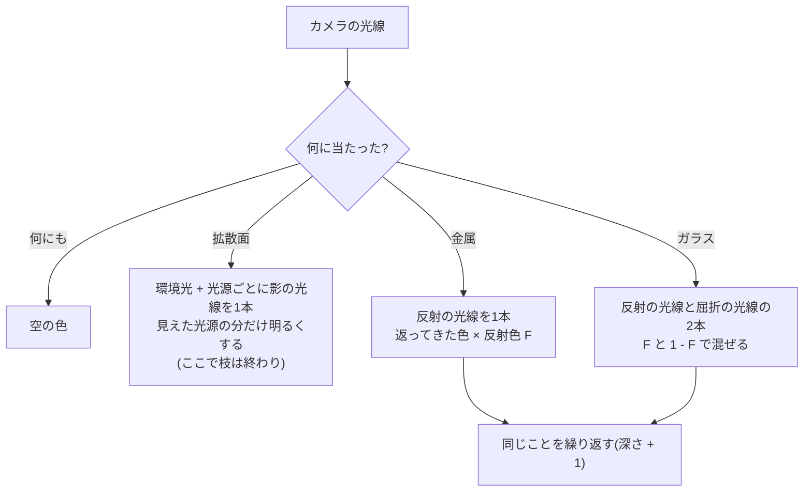
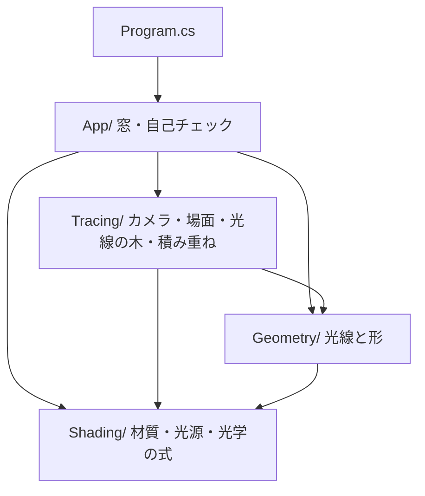
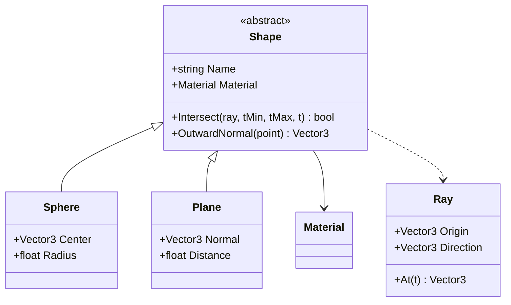
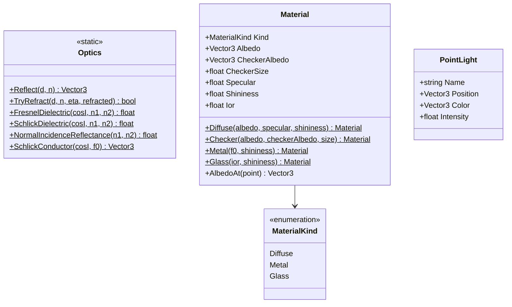
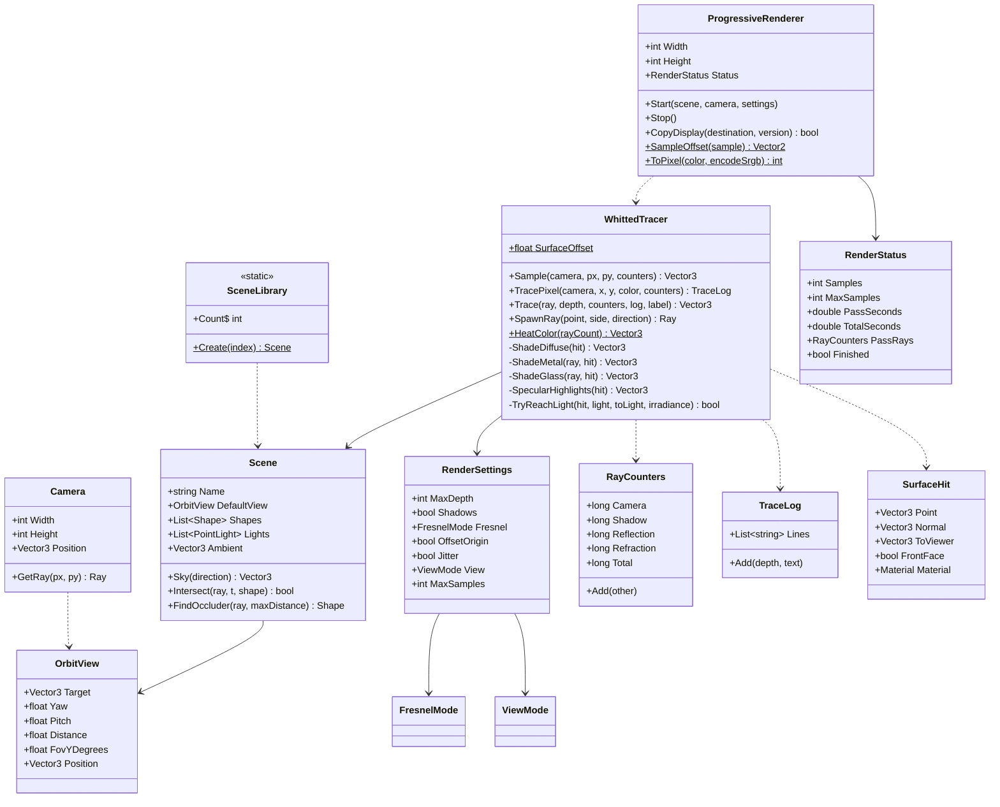
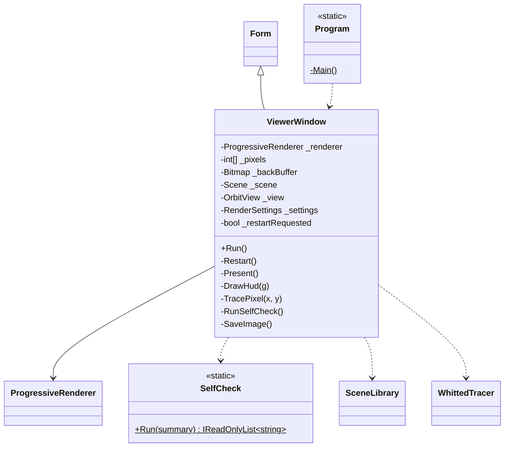
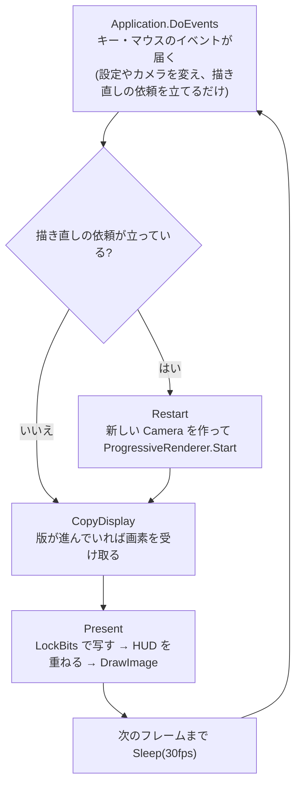
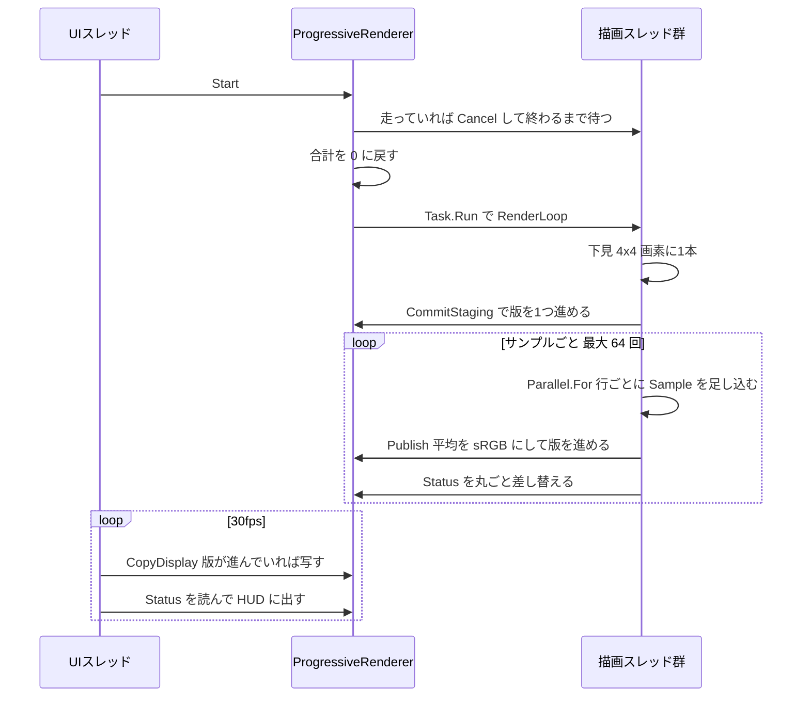
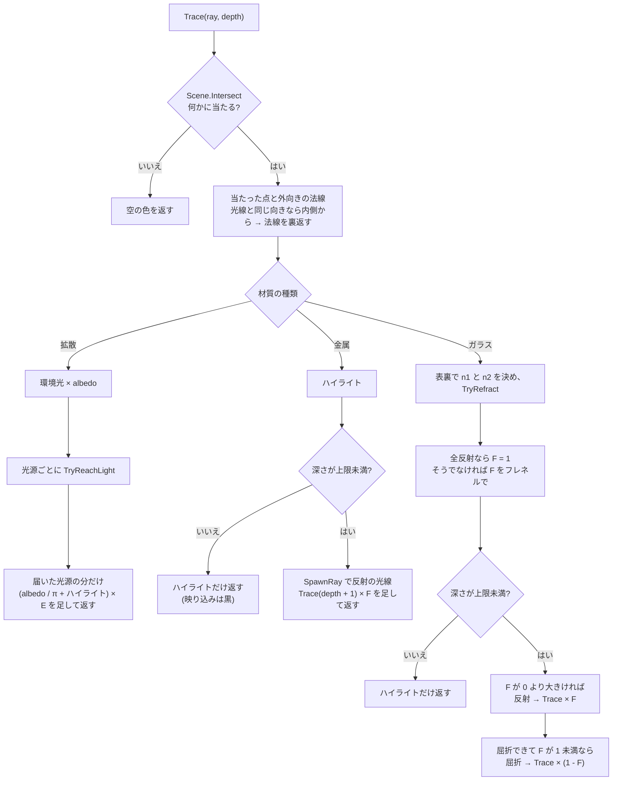
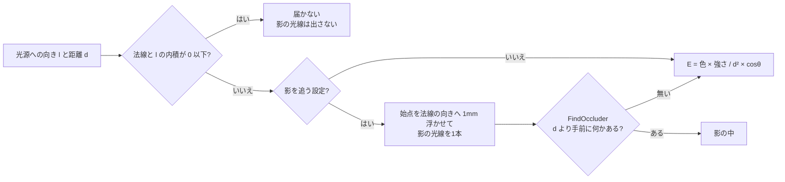

# Day 59: CPU レイトレーサ(1) — 球と平面、反射・屈折(光線の木で1画素を決める)

**教養編の3日目**で、**`Labs` の最初の日**。Day 57・58 と違ってエンジン(HonyaEngine)には一切触れず、
新しいプロジェクト `CpuRayTracer` をゼロから始める。**GPU は1行も使わない**。

今日やることは1つ。**画素から光線を出し、当たった面から影・反射・屈折の光線を枝分かれさせて、画素の色を「光線の木」で決める**
(Turner Whitted, 1980)。

| | ラスタライズ(Day 1〜56) | レイマーチング(Day 58) | レイトレース(Day 59) |
|---|---|---|---|
| 向き | 物体 → 画素(三角形を画面へ写す) | 画素 → 物体(距離関数を頼りに歩く) | **画素 → 物体(式を解いて一発で当てる)** |
| 形の持ち方 | 三角形の並び | 距離関数1本 | **交差の式を持つ形**(球・平面) |
| 影 | シャドウマップ(Day 33。光の目からもう1回描く) | 光へ向けてもう1本歩く | **光へ向けてもう1本撃つ**(影の光線) |
| 映り込み | 環境マップ(Day 36。周りを先に焼いておく) | (やっていない) | **反射の向きへもう1本撃つ**。映り込みの中の映り込みも出る |
| 屈折 | 描けない(画面に写っていないものは見えない) | (やっていない) | **スネルの法則で曲げた向きへもう1本撃つ** |
| どこで動くか | GPU | GPU(画素シェーダ1枚) | **CPU**(C# の `Parallel.For`) |

今日の差分は**新規 17 ファイル**(C# 16 本と csproj)。コメント込みで 2,678 行、コメントと空行を除くと 1,543 行。

> **今日いちばん意外だったのは、「向きの長さは 1」という約束が、ガラス玉の中で反射を繰り返すと 1回ごとに約 17 倍ずつ崩れていくこと**
> 場面3(合わせ鏡)で深さの上限を 16 に上げたら、**ガラス玉だけが真っ白に飛んだ**。1画素を追うと、深さ 10 で色が **3.8×10¹⁶** になっていた。
> 原因は浮動小数の丸め誤差で、光線の向きの長さが 1 から 1e-7 ずれると、球の交差の式(長さ 1 を前提に解いている)が**面から少し外れた点**を返し、
> その点から作った法線の長さが **4 倍**ずれ、その法線で反射した向きの長さがさらに **4 倍**ずれる。ほぼ垂直に往復する光線では、これが1回の反射ごとに掛かる。
> 1e-7 から始まったずれは **5 回目で 1% を超え**、6 回目で 24% になり、その先は光線が玉の外へ出てしまう。
> 直し方は1行で、**反射・屈折の光線を作るたびに向きを正規化し直す**(`WhittedTracer.SpawnRay`)。自己チェックの10項目めがこれを確かめている(要点7)。

## 今日のゴール

**起動すると、赤と黄の市松の床にガラス玉と鏡の玉と青い玉が並ぶ(Whitted の論文の1枚のまね)。1〜2 秒で 64 サンプルが重なり、地平線まで滑らかになる。
ガラス玉の中に床が逆さまに映り、鏡の玉にガラス玉と空が映る。右クリックした画素の「光線の木」が、枝の1本ずつまで文字で出る。**

| キー | 何が起きるか |
|---|---|
| `1` / `2` / `3` | 場面(Whitted 1980 / 屈折率と金属 / 合わせ鏡) |
| `[` / `]`(`↓` / `↑` でも可) | 深さの上限(反射・屈折を何段まで追うか。0〜32、既定 5)。**場面3で上げ下げすると、鏡の奥の何枚目から黒くなるかが変わる** |
| `S` | 影の光線 ON / OFF |
| `F` | フレネル(正確 / シュリック / なし)。**場面2の「屈折率 1.00」の玉が、シュリックでだけ見える** |
| `E` | 次の光線の始点を面から浮かせる ON / OFF。**切ると影のにきびが出る** |
| `J` | 画素内のずらし ON / OFF。**切ると 64 サンプル重ねてもギザギザが消えない** |
| `V` | 表示(陰影 / 法線 / 光線の数)。**光線の数が今日の目** |
| 右クリック | **1画素を追う**。その画素の光線の木を全部、字下げした行で出す |
| 左ドラッグ / ホイール / `R` | カメラを回す / 寄る / 戻す |
| `C` | 今日の自己チェック(10 項目) |
| `P` | PNG で保存(実行ファイルの隣の `captures/`) |
| `X` / `H` / `Esc` | 下の欄を消す / 文字を消す / 終了 |

### 今日いちばん大事な3つ

**1つ目は「画素の色は、光線の木の葉を足したもの」**。カメラから出た1本の光線は、面に当たるたびに枝分かれする。
拡散面なら光源へ影の光線を出して終わり、金属なら反射の光線を1本、ガラスなら反射と屈折の2本。
**枝ごとに「その向きからやって来る光」を同じ関数(`Trace`)で聞き直す**ので、映り込みの中の映り込みも、ガラスの中の床も、特別なことをせずに出る(要点3)。

```csharp
// WhittedTracer.ShadeGlass。**1本の光線が2本に分かれる場所**
bool canRefract = Optics.TryRefract(ray.Direction, hit.Normal, n1 / n2, out Vector3 refracted);
float reflectance = canRefract ? DielectricFresnel(cosI, n1, n2) : 1.0f;   // 跳ね返る割合 F(全反射なら 1)

if (reflectance > 0.0f)
{
    Ray reflectedRay = SpawnRay(hit.Point, hit.Normal, Optics.Reflect(ray.Direction, hit.Normal));
    color += reflectance * Trace(reflectedRay, depth + 1, ...);             // ← 自分自身を呼ぶ
}

if (canRefract && reflectance < 1.0f)
{
    Ray refractedRay = SpawnRay(hit.Point, -hit.Normal, refracted);         // ← 始点は面の向こう側へ浮かせる
    color += (1.0f - reflectance) * Trace(refractedRay, depth + 1, ...);
}
```

**2つ目は「当たりは、式を解けば一発で出る」**。Day 58 のレイマーチングは距離関数を頼りに何十歩も歩いたが、
球と平面は**光線の式を代入すると2次方程式・1次方程式になる**ので、解の公式1回で当たる距離が出る(要点2)。
その代わり、**形ごとに式を用意しなければならない**(Day 58 は距離関数さえ書ければどんな形でも歩けた)。

**3つ目は「浮動小数の誤差は、放っておくと光線の木を伝って増える」**。今日は2か所でそれを踏んだ(要点7)。

- **影のにきび** … 当たった点が面の内側にずれると、そこから出た影の光線が**自分の面に当たる**。光の側を向いた点の 26.4% がこうなる。
  始点を法線の向きへ 1mm 浮かせると 0 になる
- **向きの長さの崩れ** … 上の囲みのとおり。反射・屈折のたびに正規化し直すと、30 回反射しても 1.2×10⁻⁷ に留まる

### 今日から Labs — 新しいプロジェクトを始める

CLAUDE.md の取り決め(「エンジンと独立した題材(Day 59〜62・67)は `Labs` に置く」)どおり、今日の reference は **Day 58 のコピーではない**。

| | どうするか |
|---|---|
| reference | `reference/Day59/` を新しく作った。**Day 60・61 は Day 59 の完全コピー + 差分**になる(同じ題材の中でつなぐ) |
| work | **`work/Labs/CpuRayTracer/`** を作る。csproj は `reference/Day59/Day59.csproj` を `CpuRayTracer.csproj` という名前でコピーする |
| 名前空間 | `CpuRayTracer`(Day 59〜61 で固定。Day 61 で GPU 版が入っても変えない) |
| 表示 | Day 1〜10 と同じ **WinForms + LockBits**。GPU を使わない構成にしておくと「絵の全部を CPU が計算した」ことが疑いようもなくなり、Day 61 の比べる基準になる |
| 差分の確認 | `reference/diff.sh Day59` が `work/Labs/CpuRayTracer` と比べるように直した(Day 59〜61) |
| 実行 | `dotnet run --project reference/Day59 -c Release`。**Debug は約 8 倍遅い**(1パス 15ms → 120ms) |

README の `Labs/` の Day 番号(ロードマップの番号が1つずれる前のままだった)と、CLAUDE.md の名前空間の一覧・コピーの例外も合わせて直してある。

## 事前に読む資料

- [Peter Shirley ほか「Ray Tracing in One Weekend」](https://raytracing.github.io/books/RayTracingInOneWeekend.html)
  — **今日の骨組みの一次資料**。読むのは「Rays, a Simple Camera, and Background」「Adding a Sphere」「Surface Normals and Multiple Objects」
  「Antialiasing」「Metal」「Dielectrics」と、「Diffuse Materials」の中の **shadow acne の節だけ**。
  **Diffuse Materials の本体(乱数で跳ね返す拡散)は今日は読み飛ばす**——あれは Day 60 のパストレーシングそのものだから(要点3)。
  RTIOW の Dielectrics のシュリック近似は、ガラスの内側からでも入射角の cos を使っていて、臨界角の手前で大きく外れる(要点5。今日のコードは直してある)
- [Turner Whitted, "An Improved Illumination Model for Shaded Display", Communications of the ACM 23(6), 1980](https://doi.org/10.1145/358876.358882)
  — 要点3の元の論文。**光線の木**(反射・屈折・影の光線)を初めて書いたもの。図の市松模様の床とガラス玉が場面1の元ネタ。
  論文の明るさの式にも、周りから届く光を一定値で済ませる環境光の項がある(要点3のごまかしの1つ目)
- [Scratchapixel: Ray-Sphere Intersection](https://www.scratchapixel.com/lessons/3d-basic-rendering/minimal-ray-tracer-rendering-simple-shapes/ray-sphere-intersection.html)
  — 要点2。幾何で解く方法と、2次方程式で解く方法の両方。今日は後者(RTIOW の half-b の形)
- [Scratchapixel: Reflection, Refraction and Fresnel](https://www.scratchapixel.com/lessons/3d-basic-rendering/introduction-to-shading/reflection-refraction-fresnel.html)
  — 要点3〜5。反射・屈折の向きの式、フレネルの式、導体と誘電体の違い
- [Bram de Greve, "Reflections and Refractions in Ray Tracing"(2006, PDF)](https://graphics.stanford.edu/courses/cs148-10-summer/docs/2006--degreve--reflection_refraction.pdf)
  — **要点4・5をいちばん短く正確に書いた資料**。スネルの法則のベクトル形の導き方、全反射、フレネルの式、
  シュリック近似で **n1 &gt; n2 のときは透過角を使う**ことまで、数ページにまとまっている
- [Ray Tracing Gems(2019)](https://www.realtimerendering.com/raytracinggems/rtg/index.html) の
  6章「A Fast and Robust Method for Avoiding Self-Intersection」と 7章「Precision Improvements for Ray/Sphere Intersection」
  — 要点7。始点を浮かせる幅を場面の大きさに合わせて決める方法と、球の交差の式の丸め誤差。無料で PDF が読める
- **Day 33 の計画書**(シャドウマップの影のアクネと深度バイアス)・**Day 35 の計画書**(Cook-Torrance のフレネル項)・
  **Day 54 の計画書 要点2**(Halton のずらし) — 今日は「同じ問題を光線で解くとどうなるか」の見比べになる

## 理論の要点

### 1. 画素から光線を作る — ピンホールカメラ

ラスタライズは、点にビュー行列と射影行列を掛けて**画面へ写した**(Day 6)。レイトレースは逆に、**画面の点から世界へ向かう向き**を作る。
行列は要らず、カメラの3つの軸(前・右・上)を組み合わせるだけで済む。

```csharp
// Camera.GetRay。(px, py) は画素の座標(左上の角が整数、真ん中は +0.5)
float ndcX = px / Width * 2.0f - 1.0f;                    // -1〜+1
float ndcY = 1.0f - py / Height * 2.0f;                   // y は画面では下向き、世界では上向き
Vector3 direction = _forward + _right * (ndcX * _halfWidth) + _up * (ndcY * _halfHeight);
return new Ray(Position, Vector3.Normalize(direction));
```

`_halfHeight = tan(縦の画角 / 2)` は、**前へ 1 進んだところに置いた画面**の半分の高さ。`_halfWidth` はそれに縦横比を掛けたもの。
3軸は Day 6 の `LookAt` と同じく外積2回で作る(ワールドの上と前から右を作り、右と前から「本当の上」を作り直す)。

座標を小数で受け取るのは、**1画素の中のどこを通すかをずらして何本も撃つ**ため(要点6)。

| | ラスタライズ | レイトレース |
|---|---|---|
| 1画素に対してやること | 覆っている三角形を塗る | **光線を1本撃って、当たったものを聞く** |
| 画面に写っていないもの | 存在しないのと同じ | **光線が届けば見える**(鏡の中の、カメラの後ろ) |
| 手間を決めるもの | 三角形の数 × 塗る画素 | **画素の数 × 1画素の光線の数 × 1本の光線が聞く形の数** |

### 2. 交差を解く — 球は2次方程式、平面は1次方程式

**光線** `P(t) = O + tD`(t ≥ 0)。**D は必ず長さ 1**にしておく約束で、そうすると t がそのまま距離(m)になる。

**球**(中心 C、半径 r)は `|P − C|² = r²`。光線を代入し、`oc = O − C` と置くと

```
(D·D) t² + 2 (oc·D) t + (oc·oc − r²) = 0
```

D が長さ 1 なので `D·D = 1`。1次の係数を `2b`(`b = oc·D`)と置くと、解の公式の 2 と 4 が消えて **`t = −b ± √(b² − c)`**(RTIOW の half-b)。

| 判別式・解 | 意味 |
|---|---|
| `b² − c < 0` | 光線の直線が球をかすりもしない |
| 小さいほうの解 `−b − √` | 球に**入る**点。普通はこちら |
| 大きいほうの解 `−b + √` | 球から**出る**点。**始点が球の中にある**(ガラスの中を進む屈折の光線)ときはこちら |

**`D·D = 1` を仮定している**ことを覚えておくこと。要点7の2つ目の罠はここから始まる。

**平面**(`N·P = d`)は `t = (d − N·O) / (N·D)`。分母 `N·D` は「光線が面に向かう速さ」で、0 なら平行で当たらない。
ラスタライズでは無限の床を描けなかった(大きな板で代用した)が、**式1本で本当に無限**になる。

場面には形が何個もあるので、**いちばん近いもの**を探す。当たるたびに探す範囲の上限を縮めていくのが要点で、奥の形は範囲の外の解をすぐ捨てられる。

```csharp
// Scene.Intersect(カメラ・反射・屈折の光線)
float closest = float.PositiveInfinity;
foreach (Shape candidate in Shapes)
{
    if (candidate.Intersect(ray, 0.0f, closest, out float hitT)) { closest = hitT; shape = candidate; }
}
```

**影の光線は別の問い合わせ**(`FindOccluder`)にしてある。知りたいのは「光源までの間に何か1つでもあるか」だけなので、**最初に見つかった時点で抜けてよい**。
上限を光源までの距離にしておくのは、**光源より向こうの物体を影にしない**ため。

形のほうは聞き方を2段に分けてある(`Shape.Intersect` は t だけ、`OutwardNormal` は法線だけ)。
法線は**いちばん近かった1つにだけ**聞けばよいので、形が N 個あっても法線の計算は1本の光線につき1回で済む。

### 3. 光線の木 — Whitted 法(1980)

1本の光線が面に当たったら、**材質で枝の出し方を決める**。



**金属とガラスの反射の向き**は `r = d − 2(d·n)n`(`Optics.Reflect`)。d を「面に沿う成分」と「面に垂直な成分 `(d·n)n`」に分けると、
反射は**垂直な成分だけを反転する**ことで、反転 = 2回引く、なので係数が 2 になる(Day 9 のスペキュラで使った `Vec3.Reflect` と同じ式)。

**拡散面**の色は、見えた光源ごとに

```
(albedo / π + ハイライト) × 光の色 × 強さ / 距離² × cosθ
```

を足したもの。`1/π` は、半球の全部の向きへ均等に散らした光を合計するとちょうど albedo 倍になる割り方で、**点光源の強さ(W/sr)と単位が揃う**。
Day 60 のパストレーシングも同じ BRDF を使うので、同じ場面の直接光の明るさが今日と揃う。`/ 距離²` は逆2乗則
(場面1の地平線の近くの床が暗いのはこれ。光源から遠い)。

右クリックで場面1のガラス玉(画素 (560, 300))を追うと、こう出る。**光線は 17 本**(カメラ 1 / 影 6 / 反射 5 / 屈折 5)。

```
カメラ → ガラス玉  5.465m 先
   屈折率 1.00 → 1.50  入射角 66.4度  反射 0.133 / 透過 0.867
   影 → 光1: 届いた                                ← ハイライト(下の「ごまかし」の2つ目)
   影: 光2 は面の裏側。光線は出さない
   反射 → 床(市松)  2.922m 先                      ← 13.3% はここから
      影 → 光1: 届いた
      影 → 光2: 届いた
   屈折 → ガラス玉  1.583m 先(内側から)             ← 86.7% はガラスの中へ
      屈折率 1.50 → 1.00  入射角 37.6度  反射 0.132 / 透過 0.868
      反射 → ガラス玉  1.584m 先(内側から)          ← 玉の中で跳ね返り続ける
         屈折率 1.50 → 1.00  入射角 37.6度  反射 0.130 / 透過 0.870
         反射 → ガラス玉  1.585m 先(内側から)
            ...(あと2回、玉の中で跳ね返る)
                  反射・屈折: 深さの上限なので追わない(黒)
               屈折 → 鏡の玉  2.011m 先
            屈折 → 床(市松)  6.530m 先
         屈折 → 空
      屈折 → 空
```

**玉の中の反射は、入射角が毎回ほぼ同じ**(37.6 → 37.4 度)になっている。球の中の弦は、どこで跳ね返っても面と同じ角度を作るから
(わずかに減っていくのは、始点を 1mm 内側へ浮かせているぶん)。

**この方法には「ごまかし」が3つある**。どれも「光線1本では聞けないもの」を一定値で埋めている。

| ごまかし | なぜ要るか | 今日の見え方 | 本当は(Day 60) |
|---|---|---|---|
| **環境光**(一定の色を足す) | 拡散面は光をあらゆる向きへ散らすので、反射の光線1本では周りから届く光を聞けない | 影の中が一様な暗さ | 散らばる向きを乱数で選んで何本も平均する |
| **金属・ガラスのハイライト** | 点光源は大きさが 0 なので、反射の光線がちょうど光源に当たる確率も 0 | 鏡の玉に光源が小さな白い点として映る | 面光源にすると、反射の光線が本当に光源に当たる |
| **ガラスも影を落とす** | 影の光線はまっすぐ光源へ向かうので、ガラスで曲がって届く光は聞けない | **ガラス玉の影が真っ黒**。**屈折率 1.00 の見えない玉にも影だけ落ちる**(場面2) | ガラスを通って床に集まる光(集光・コースティクス)が出る |

### 4. 屈折 — スネルの法則をベクトルで書く

スネルの法則は `n1 sinθi = n2 sinθt`(n は屈折率。空気 1.00 / 水 1.33 / ガラス 1.5 / ダイヤモンド 2.42)。
角度を使わずベクトルで書くために、**向きを「面に沿う成分」と「面に垂直な成分」に分ける**。

- **面に沿う成分**の長さは sin。入射の沿う成分 `d + cosθi n` を **`eta = n1/n2` 倍**すれば、sin が eta 倍になる——スネルの法則の直訳
- **面に垂直な成分**は、長さ 1 に足りない分(`cosθt = √(1 − sin²θt)`)を面の奥へ補う

```csharp
// Optics.TryRefract。d は面へ向かう入射方向、n は入射側を向いた法線(どちらも長さ 1)
float cosI = -Vector3.Dot(d, n);
float sin2T = eta * eta * (1.0f - cosI * cosI);
if (sin2T > 1.0f) { return false; }                        // ← 全反射。透過の角度が存在しない
float cosT = MathF.Sqrt(1.0f - sin2T);
refracted = d * eta + n * (eta * cosI - cosT);
```

**全反射**は `sin²θt > 1`、つまり n1 &gt; n2(ガラスから空気へ出る)でしか起きない。ガラス(1.5)の臨界角は `asin(1/1.5) = 41.81°`。
自己チェックの5項目めは、**41.7° は屈折し(反射率 0.690)、41.9° は全反射する**ことを確かめている。臨界角の直前で反射率が急に 1 へ駆け上がる。

**内側から当たった光線では n1 と n2 を入れ替える**。`Trace` は「光線と外向きの法線の内積が正なら内側から」と判定し、
法線を光線の側へ裏返したうえで `FrontFace = false` を残す。`ShadeGlass` はそれを見て屈折率の比を逆にする。
**法線を裏返しておくおかげで、`TryRefract` も `Reflect` も表裏を気にしない1通りの式で済む**。

### 5. フレネル — 跳ね返る割合は角度で変わる

光は面に当たると、一部が跳ね返り(F)、残りが中へ入る(1 − F)。**消えも増えもしない**ので、ガラスの2本の枝は F と 1 − F で混ぜる。

**正確な式**(偏光していない光)は、S 波と P 波の反射率の平均。

```
rs = (n1 cosθi − n2 cosθt) / (n1 cosθi + n2 cosθt)
rp = (n2 cosθi − n1 cosθt) / (n2 cosθi + n1 cosθt)
F  = (rs² + rp²) / 2
```

| 性質 | 自己チェック6項目めの値 | 見え方 |
|---|---|---|
| 垂直に見ると **4%**(1.00 ↔ 1.50) | 外 0.0400 / 内 0.0400 | ガラス玉の真ん中はほとんど素通し |
| **かすめる角度で 100% に近づく** | cosθ = 0.001 で 0.9942 | **ガラス玉の縁が空を映して明るい**。水面を遠くまで見渡すと空が映るのと同じ |
| **行きと帰りで同じ**(θi で入る光と θt で出る光) | 差 1.7×10⁻⁵ | — |
| **屈折率が同じなら 0** | 0.0000 | **場面2の「屈折率 1.00」の玉は完全に見えない**(影だけ落ちる) |

**シュリック近似** `F = F0 + (1 − F0)(1 − cosθ)⁵`(`F0 = ((n1 − n2)/(n1 + n2))²`)は、Day 35 の Cook-Torrance でも使った式。
今日のコードで気をつけているのは **cosθ にどちらの角度を使うか**で、**屈折率の低い側(空気側)の角度**を使う。
ガラスの内側からなら、入射角ではなく**透過角**。反射率は行きと帰りで同じなので、空気側の角度で聞けば同じ近似が外からも内からも使える。

| シュリックの cosθ | 正確な式との差の最大(自己チェック7) | ガラスの内から 41.5°(臨界角の直前) |
|---|---|---|
| 外から(入射角) | 0.036 | — |
| **内から、透過角**(今日のコード) | **0.036** | 0.576(正確には 0.542) |
| 内から、入射角(RTIOW の書き方) | **0.849** | **0.041** |

RTIOW の書き方だと、臨界角の手前で「ほぼ素通し」と答えたあと、臨界角を越えた瞬間に全反射(1.0)へ跳ぶ。
**ガラス玉の縁の内側の明るい輪が、細く途切れた線になる**。

もう1つのシュリックの弱点は、**n1 = n2 を知らない**こと。F0 = 0 でも `(1 − cosθ)⁵` の項が残るので、`F` キーでシュリックにすると
**屈折率 1.00 の玉の縁がうっすら光って見えてしまう**(自己チェック9: 空とのずれ 正確 6.0×10⁻⁷ / シュリック 0.142)。

**金属**は光を中へ通さないので屈折の枝が無く、代わりに**反射の色 F0** を持つ。金・銅が色づいて見えるのは、色ごとに跳ね返る割合が違うから。
正確な式には複素屈折率が要るので、金属はシュリックだけにしてある。**かすめる角度ではどの金属も白に近づく**(場面2の金の玉の縁)。

| 金属 | F0(線形の RGB) |
|---|---|
| 金 | (1.00, 0.71, 0.29) |
| 銅 | (0.95, 0.64, 0.54) |
| アルミ | (0.91, 0.92, 0.92) |

`F` キーで「なし」にすると、角度によらず F0 を使う。場面2では **8.1% の画素**の色が変わる(ガラスの縁が暗くなり、金属の縁が白くならない)。

### 6. アンチエイリアス — 1画素の中の何か所も通して平均する

1画素に光線1本だと、その画素の**真ん中の1点だけ**を見て色を決めることになる(点で標本を取る)。
面の境目はギザギザになり、**地平線の近くの市松模様**は1画素に何十マスも入るのに1点しか見ないので、でたらめな模様(モアレ)になる。

直し方は、**1画素の中の違う場所を何回も通して平均する**こと。今日はこれを**積み重ね**(プログレッシブレンダリング)でやる。

```csharp
// ProgressiveRenderer.RenderLoop。1パス = 全画素に1本ずつ
for (int sample = 0; sample < settings.MaxSamples; sample++)
{
    Vector2 offset = settings.Jitter ? SampleOffset(sample) : new Vector2(0.5f);   // 0 番は真ん中、1 番から Halton(2, 3)
    Parallel.For(0, Height, options, y =>
    {
        for (int x = 0; x < Width; x++)
        {
            _accumulated[row + x] += tracer.Sample(camera, x + offset.X, y + offset.Y, ref rays);
        }
    });
    Publish(sample + 1, ...);                                   // 合計 / サンプル数 を sRGB にして画面へ
}
```

- **ずらしは Day 54 の TAA と同じ Halton(2, 3) 列**。TAA は毎フレーム動く絵にずらしを重ねたので、前のフレームを動きに合わせて引き寄せる(再投影)手間があった。
  今日は**止まった絵**に重ねるので、足して割るだけで済む
- **全部の画素が同じずらしを使う**。平均したいのは「1画素の中の位置」だけなので、画素ごとに違う点にする必要は無い
- **足し算は線形のまま、sRGB の曲線は画面に出す直前に1回だけ**。先に曲線を掛けてから平均すると、明るい画素と暗い画素の境目(アンチエイリアスした縁)が暗く沈む

`J` でずらしを切ると、64 サンプル重ねても**毎回同じ光線**になる。64 サンプルの絵と1サンプルの絵を比べると、**違う画素は 38 個**
(518,400 画素中。合計を 64 で割るときの丸めの差だけ)——つまり**本数を増やしても、通す場所が同じなら1本と何も変わらない**。

### 7. 浮動小数との付き合い — 始点を浮かせる、向きを正規化し直す

**(a) 影のにきび(shadow acne)**

当たった点 `O + tD` は浮動小数で計算するので、本当の面から 10⁻⁷ m ほどずれる。**面の内側にずれた点**から影の光線を出すと、
出てすぐ**自分の面に当たって**「影の中」と判定される。自己チェック8は、床と球の上の光の側を向いた 16,798 点のうち
**4,442 点(26.4%)が自分に当たる**ことを数えている。画面では、`E` を切った直後の1パス目で **11.4% の画素**が変わり、ざらざらの黒い点になる。

直し方は2通りあり、今日は2つ目を使っている。

| やり方 | 中身 | 弱点 |
|---|---|---|
| **tMin を 0 より大きくする**(RTIOW は 0.001) | 始点のすぐ近くの当たりを無視する | **かすめる光線に効かない**。面に対して角度 θ で出た光線は、誤差の幅 δ を抜けるまでに `δ / sinθ` 進むので、θ が小さいと tMin を超えてから自分に当たる |
| **法線の向きへ始点を浮かせる**(今日のコード。1mm) | 面から ε だけ離れた点から出す。どの向きへ出ても、面からの高さは `ε + t sinθ` で ε を下回らない | **1mm より薄い物や隙間**を飛び越える。場面の大きさが桁で変わるなら ε も変える(Ray Tracing Gems 6章) |

**屈折の光線だけは、法線の逆向き(面の向こう側)へ浮かせる**。手前側へ浮かせると、出てすぐ同じ面に当たり、ガラスの中へ入れないまま跳ね返り続ける。

なお、`E` を切ったまま 64 サンプル重ねると、**ざらざらは均されて「なんとなく暗い」に化ける**(サンプルごとに光線の位置がずれ、どの点が自分に当たるかも変わるため)。
**1パス目の絵を見る**か、`J` も切って比べること。Day 33 のシャドウマップのアクネと深度バイアスも、形は違うが同じ問題だった。

**(b) 向きの長さの崩れ**

冒頭の囲みの件。**`Ray` の約束「Direction は長さ 1」は、反射・屈折の式の上では保たれるのに、浮動小数では保たれない**。
しかもずれは次の反射で増幅される。

1. 向きの長さが `1 + e` だと、球の交差(`D·D = 1` を仮定)は**少し違う方程式**を解くことになり、当たった点が面から外れる
2. 外れた点から `(p − C) / r` で作った法線は、長さが `1 + 4e` 前後になる(実測で 4 倍)
3. 長さ `1 + δ` の法線で `d − 2(d·n)n` と反射すると、ほぼ垂直な入射では向きの長さが `1 + 4δ` 前後になる(実測で 4 倍)

2と3で1回の反射ごとに**約 17 倍**。double で測ると 16.8 倍が綺麗に並び、float では 1e-7 から始まったずれが 5 回目の反射で 1.5%、6 回目で 24% になった。
直し方は `SpawnRay` で**反射・屈折の光線を作るたびに `Vector3.Normalize`** するだけ。自己チェック10は、同じ状況で
**正規化すれば 30 回反射してもずれ 1.2×10⁻⁷、しなければ 5 回目で 1% を超える**ことを確かめている。

**場面1・2の既定(深さ 5)では出なかった**のがこの罠の嫌なところで、深さ 5 までなら 1.5% のずれは絵に出ない。深さを上げて初めて爆発する。

### 8. 光線の数 — 画素の数 × 木の大きさ × 形の数

`V` で「光線の数」にすると、1画素のために飛ばした光線の数(カメラ・影・反射・屈折の合計)が色になる。**2倍ごとに1段**
(1 紺 / 2 青 / 4 水色 / 8 緑 / 16 黄 / 32 赤 / 64 以上 白)。

| 場面1のどこ | 光線 | 内訳 |
|---|---|---|
| 空 | 1 | カメラだけ |
| 床 | 3 | カメラ 1 + 影 2(光源が2つ) |
| 青い玉の、片方の光源に背を向けた縁 | 2 | 裏を向いた光源には影の光線を出さない |
| 鏡の玉 | 4〜10 | 反射の先で、また影の光線 |
| ガラス玉 | 15〜30 | 2本ずつ分かれ、玉の中で跳ね返り続ける |

**深さの上限を上げたときの、1画素あたりの光線**(Release。1パス目 = 画素の真ん中を通したとき。HUD は最後のパスの値なので、ずらしのぶん 0.01 ほど違うことがある)。

| 深さの上限 | 0 | 1 | 5(既定) | 10 | 16 | 20 | 32 |
|---|---|---|---|---|---|---|---|
| 場面1 Whitted 1980 | 2.55 | 2.86 | **4.11** | 5.61 | 7.45 | 8.69 | 12.45 |
| 場面2 屈折率と金属 | 2.69 | 3.01 | **4.47** | 7.06 | 14.30 | 26.44 | **342.71** |
| 場面3 合わせ鏡 | 1.92 | 3.03 | **5.30** | 7.57 | 10.51 | 12.73 | 21.67 |

場面1と3は**深さに比例して**増えるのに、**場面2だけは深さ 12 を過ぎると4段ごとに倍になる**。
ガラス玉1つなら、玉の中で跳ね返る枝は1本のまま続き、外へ出た枝はたいてい床か空で終わる。
ところが場面2は**ガラス玉が5つ並び**、外へ出た枝が**隣のガラス玉に入って、また2本に分かれる**。木が指数で茂る。
深さ 32 では1パスに **12 秒**かかる(深さ 5 の 400 倍)。これが Whitted 法の木の弱点で、Day 60 のパストレーシングは**枝を1本しか出さない**(どちらへ進むかを F の割合で乱数で選ぶ)ことでこれを避ける。

**形の数も効く**。深さ 5 の1パスは、場面1(形 4 個)が 15ms・毎秒 1.4 億本、場面2(形 11 個)が 32ms・毎秒 0.7 億本。
1本の光線が全部の形に聞く(総当たり)ので、形が 3 倍近くになると1本の手間がほぼ倍になる。**Day 60 の BVH はここを削る**。

その他の数字。

- **1パス目だけ遅い**(場面1で 130ms、2パス目から 15ms)。.NET の JIT が、最初は手早いコードを作り、よく呼ばれるメソッドを後から最適化し直す(段階的コンパイル)ため
- **Debug ビルドは約 8 倍遅い**(場面1で 1パス 120ms、毎秒 1,800 万本)
- **行ごとに分けて並列にしている**。画素どうしが互いの結果を読まないので、どう分けても答えが変わらず、鍵も要らない。
  **この「画素ごとに独立」が、Day 61 でそのままコンピュートシェーダの1回の呼び出しになる**

## 前Dayからの差分概要

**Day 58 からの差分は無い**(新しいプロジェクト)。reference の中身は全部が新規で、Day 60 からは Day 59 のコピー + 差分になる。

### 新規ファイル

| ファイル | 行数(うちコード) | 役割 |
|---|---|---|
| `Day59.csproj` | 36 | WinExe / net10.0-windows / WinForms / PerMonitorV2。名前空間 `CpuRayTracer`。**NuGet パッケージは使わない** |
| `Geometry/Ray.cs` | 29(6) | 光線。`Origin` / `Direction`(長さ 1 の約束)/ `At(t)` |
| `Shading/Material.cs` | 112(54) | `MaterialKind`(拡散 / 金属 / ガラス)と `Material`。市松模様。作ったら変えない |
| `Shading/PointLight.cs` | 21(3) | 点光源。逆2乗で届く |
| `Shading/Optics.cs` | 162(64) | **反射・屈折・フレネル(正確 / シュリック / 金属)の純粋な関数**。形も場面も知らない |
| `Geometry/Shape.cs` | 53(14) | 形の基底。`Intersect`(t だけ)と `OutwardNormal`(法線だけ)の2段 |
| `Geometry/Sphere.cs` | 72(33) | 球。half-b の2次方程式 |
| `Geometry/Plane.cs` | 60(25) | 無限の平面(両面) |
| `Tracing/Camera.cs` | 88(38) | `OrbitView`(注視点・回転・距離・画角)と、画素から光線を作る `Camera` |
| `Tracing/Scene.cs` | 116(49) | 形・光源・環境光・空。`Intersect`(いちばん近い)と `FindOccluder`(何か1つ) |
| `Tracing/SceneLibrary.cs` | 150(90) | 3つの場面 |
| `Tracing/RenderSettings.cs` | 67(23) | `FresnelMode` / `ViewMode` / 設定の record(不変) |
| `Tracing/WhittedTracer.cs` | 451(248) | **今日の主役**。`RayCounters` / `TraceLog` / `SurfaceHit` と、光線の木を追う `WhittedTracer` |
| `Tracing/ProgressiveRenderer.cs` | 327(192) | 別スレッドで積み重ねる。下見・Halton のずらし・sRGB・取り消し |
| `App/SelfCheck.cs` | 445(336) | 自己チェック 10 項目。窓も描画スレッドも使わない |
| `App/ViewerWindow.cs` | 489(355) | 窓。ループ・転送・HUD・キーとマウス・1画素を追う・PNG 保存 |
| `Program.cs` | 36(13) | エントリポイント |

リポジトリの側で直したもの(**写経の対象ではない**): `reference/diff.sh`(Day 59〜61 を `work/Labs/CpuRayTracer` と比べる)、
`README.md`(`Labs/` の Day 番号)、`CLAUDE.md`(名前空間の一覧と、Labs の初日はコピーにしない例外)。

**今日の量は多い**(コードだけで 1,543 行)。重ければ、下の順番の **8 まで**(交差と光学の式)と **9 から**(光線の木・積み重ね・窓)で2回に分けるとよい。
**`App/SelfCheck.cs`(コード 336 行)は、写すより reference からコピーして読むだけにしてもよい**——式の答え合わせが役目で、今日の理論は全部ほかのファイルにある。

### 写経する順番

依存の向きに沿って並べてある。**`Program.cs`(`Main`)を写すまでは、ビルドすると CS5001(エントリポイントが無い)だけが出る**。
それ以外のエラーが出ないことを確かめながら進める。

0. **`work/Labs/CpuRayTracer/` を作り、`reference/Day59/Day59.csproj` を `CpuRayTracer.csproj` という名前でコピーする**。
   以降のファイルはこのフォルダの中に、reference と同じサブフォルダ(`Geometry/` `Shading/` `Tracing/` `App/`)で置く
1. **`Geometry/Ray.cs`** — どこにも依存しない
2. **`Shading/Material.cs`** — どこにも依存しない
3. **`Shading/PointLight.cs`** — どこにも依存しない
4. **`Shading/Optics.cs`** — どこにも依存しない。**要点4・5の式の全部**
5. **`Geometry/Shape.cs`** — 1・2 を使う
6. **`Geometry/Sphere.cs`** — 5 を継ぐ。要点2
7. **`Geometry/Plane.cs`** — 5 を継ぐ
8. **`Tracing/Camera.cs`** — 1 を使う(`OrbitView` もこのファイル)
9. **`Tracing/Scene.cs`** — 3・5・8(`OrbitView`)を使う
10. **`Tracing/SceneLibrary.cs`** — 2・3・6・7・8・9 を使う
11. **`Tracing/RenderSettings.cs`** — どこにも依存しない(ここで写すのは、次の 12 が使うから)
12. **`Tracing/WhittedTracer.cs`** — 4・8・9・11 を使う。**今日の主役**
13. **`Tracing/ProgressiveRenderer.cs`** — 12 を使う
14. **`App/SelfCheck.cs`** — 4・6・7・9・12(`SpawnRay`)を使う
15. **`App/ViewerWindow.cs`** — 10・13・14 を使う
16. **`Program.cs`** — 15 を使う。**ここで初めてビルドが通る**

## 設計書

**今日から `CpuRayTracer` の設計書を新しく始める**。HonyaEngine の設計書は Day 58 の計画書にある(エンジンは今日1行も変わっていない)。
Day 60・61 はこの設計書をコピーして差分を当てる。

### 全体構成と依存の向き



| 層 | 知っている層 | 知らない層 | 中身 |
|---|---|---|---|
| `Shading/` | **どこも知らない** | 形・場面・窓 | `Material` / `MaterialKind` / `PointLight` / `Optics` |
| `Geometry/` | Shading(形が材質を持つ) | 場面・窓 | `Ray` / `Shape` / `Sphere` / `Plane` |
| `Tracing/` | Geometry・Shading | **窓(WinForms)** | `OrbitView` / `Camera` / `Scene` / `SceneLibrary` / `RenderSettings` / `FresnelMode` / `ViewMode` / `WhittedTracer` / `RayCounters` / `TraceLog` / `SurfaceHit` / `ProgressiveRenderer` / `RenderStatus` |
| `App/` | 全部 | — | `ViewerWindow` / `SelfCheck` |

**循環参照は無い**(コメントを落として型名を拾い、確かめた)。いちばん大事なのは **`Tracing/` が WinForms を知らない**こと。
光線を追う側は `int[]` の画素を作るところまでで、それをどう画面に出すかは `App/` の仕事。だから:

- **自己チェックが窓なしで走る**(実際、検証では窓を開かないコンソールのプログラムから `Tracing/` をそのまま呼んで 3 つの場面を PNG にした)
- **Day 61 で GPU 版を足すとき**、`Tracing/` の横に並べるだけで、窓の作りを変えずに済む

`Shading/Optics` がどこにも依存しないのも意図してある。反射・屈折・フレネルは `Vector3` と `float` だけの式で、**Day 61 で GLSL へそのまま写す**。

### Geometry — 光線と形



`Shape` が2つのメソッドに分かれているのは要点2のとおり(t はすべての形に、法線はいちばん近い1つにだけ聞く)。
**法線は「外向き」を返し、表か裏かは決めない**。決めるのは光線の向きを知っている `WhittedTracer` で、
形の側は「自分はどちらが外か」だけを知っていればよい。平面は両面なので、外向きは作ったときの `Normal` のまま。

### Shading — 材質・光源・光学の式



`Material` は**種類ごとのクラスに分けず、1つのクラスに `Kind` を持たせた**。RTIOW は `lambertian` / `metal` / `dielectric` を別クラスにして
「散らし方」を仮想関数にしているが、今日の枝の出し方は `WhittedTracer` の `switch` に集めてある。
理由は Day 61 で、GPU には仮想関数が無く、材質は「種類の番号 + 数値の並び」で SSBO に置くことになるから。**今のうちから同じ形にしておく**。

`Albedo` が材質の種類によって意味を変える(拡散面の色 / 金属の F0 / ガラスでは使わない)のは、この割り切りの代償。

### Tracing — カメラ・場面・光線の木・積み重ね



**`Camera` / `Scene` / `RenderSettings` / `WhittedTracer` は、どれも作ったら変えない**。描画スレッド(CPU の論理コア数 − 1 本)が同じものを読むので、
途中で書き換わると1枚の絵の中で視点や設定が混ざる。キーを押したら**新しい設定を作って、描画を止めてやり直す**
(`RenderSettings` が record で、`_settings with { Shadows = !_settings.Shadows }` と書けるのはこのため)。
スレッドごとに書き換わるのは `RayCounters`(呼ぶ側が `ref` で渡す)と、`_accumulated` の自分の行だけ。

`WhittedTracer` の public なメソッドは入口が3つある。

| 入口 | 呼ぶ人 | 何をするか |
|---|---|---|
| `Sample` | `ProgressiveRenderer`(描画スレッド) | 1サンプル。表示が法線・光線の数ならその色を返す。**文字列を1つも作らない**(`log` は null) |
| `TracePixel` | `ViewerWindow`(UI スレッド、右クリック) | 画素の真ん中を1本だけ追い、木を `TraceLog` に全部書く |
| `Trace` / `SpawnRay` | 自分自身(再帰)と `SelfCheck` | 光線1本を追う / 反射・屈折の光線を作る |

### App — 窓と自己チェック



### 1フレームの流れ — UI スレッドは光線を1本も追わない



Day 1〜10 の GameWindow と同じ「自前のループ + LockBits で転送」だが、**`Render` にあたる段が無い**。
ラスタライザは毎フレーム全部を描き直したが、レイトレーサの絵は1パスごと(Release で 15〜35ms)にしか変わらないので、
描くのは別スレッドに任せ、UI スレッドは「できたところまで」を見せ続けるだけにした。

**描き直しの依頼をフラグにしてある**のは、マウスを動かすと1秒に何百回もイベントが来るから。イベントのたびに `Start` すると、
止めて始め直すことだけを繰り返して下見すら終わらない。**ループの頭で1フレームに1回だけ**やり直す。

Day 1 のスピン待ち(最後の数 ms を CPU を回して待つ)はしていない。ぴったり 30fps に合わせるより、描画スレッドに CPU を譲るほうが大事。

### 描き直しが始まってから絵が出るまで — 2つのスレッドの受け渡し



受け渡しは3か所で、それぞれ守り方が違う。

| 何を | どう守るか | なぜそれで足りるか |
|---|---|---|
| 画素(`_display`) | **鍵**(`lock`)の中で丸ごとコピー | 描画スレッドは作業場(`_staging`)で作ってから写すので、鍵を持つのはコピーの一瞬だけ |
| 進み具合(`RenderStatus`) | **参照の差し替え**(`Volatile.Write`) | record を毎回作り直すので、読む側には古いか新しいかのどちらか一方が丸ごと届く |
| 取り消し | `CancellationToken` | `Parallel.For` が**行の切れ目**で見る。止まるまで最大1行ぶん待つ(普段は 1ms 足らず) |

**下見(4x4 画素に1本)**は積み重ねに入れない。カメラを回している最中の描き直しで、1パス目が終わる前に次の描き直しが来ても、何かが見えるようにするためのもの。

### 1本の光線を追うまで — Trace の中身



光源が見えるかどうかは、拡散面もハイライトも同じ `TryReachLight` で聞く。



**内積の判定が影の光線より先にある**のが小さな工夫。面が光源に背を向けていれば遮るものが無くても光は届かないので、光線を1本節約できる
(場面1の青い玉の縁で光線が2本になるのはこれ。要点8)。

### 今日残した歪み(4つ)

**1. 形が材質を参照で持っている**(`Geometry` → `Shading`)。RTIOW と同じ形で、C# では素直だが、
**Day 61 で GPU に移すと参照が持てない**。形の配列と材質の配列を分け、形には「材質の番号」を持たせることになる。
そのとき `Geometry` から `Shading` への矢印が消える。直すのは Day 61。

**2. `WhittedTracer` が、光線の木のほかに「表示の切り替え」と「1画素の記録」を抱えている**。
Day 60 でパストレーサを足すと、`Sample` の中の表示の切り替え(法線・光線の数)と `HeatColor` は両方に要る。
**光線の木の追い方(Whitted / パストレース)だけを差し替えられる形**に、Day 60 で分ける。

**3. `ProgressiveRenderer` が `WhittedTracer` を直接 `new` している**。2と同じ理由で、Day 60 で「どちらの追い方で描くか」を受け取るようにする。

**4. `Scene` の問い合わせが総当たり**。要点8のとおり、形 4 個 → 11 個で毎秒の光線が半分になった。
`Scene.Intersect` と `FindOccluder` の中だけを BVH に替えれば、呼ぶ側(`WhittedTracer`)は何も変わらない。これが Day 60 の後半。

## 完成条件

`dotnet run --project reference/Day59 -c Release` で起動する(Debug でも動くが、1パスが約 8 倍遅い)。
960x540 の窓が開き、左上に HUD が出る。

### 1. 起動: 場面1「Whitted 1980」

一瞬だけ 4x4 画素のブロックの絵(下見)が出て、すぐ滑らかになる。**1〜2 秒で 64 サンプルが重なって止まる**。

```
場面 1/3: Whitted 1980    サンプル 64 / 64(完了)
1パス 0.016 秒   合計 1.6 秒   毎秒 13212 万本
1パスの光線: カメラ 51.8万 / 影 108.9万 / 反射 26.5万 / 屈折 25.4万   1画素あたり 4.10 本
深さの上限 5 ([ ])   影 ON (S)   フレネル 正確 (F)   始点を浮かせる ON (E)   画素内のずらし ON (J)   表示 陰影 (V)
```

(1パスの時間・毎秒の本数は機械で変わる。上は 12 スレッドの CPU で、描画に 11 本を使ったとき)

- 赤と黄の市松の床が地平線まで続き、**地平線の近くの模様が細かい灰色に溶けている**(アンチエイリアス)
- 手前の**ガラス玉の中に、床の市松が逆さまに小さく映る**。縁は空を映して白っぽく明るい
- 右奥の**鏡の玉に、ガラス玉・床・空が映る**
- 左の青い玉に白いハイライトが2つ(光源が2つ)
- **ガラス玉の影は、ほかの玉の影と同じように暗い**(要点3のごまかしの3つ目)

### 2. 右クリック: 1画素を追う

- **床**を右クリック → `光線 3 本(カメラ 1 / 影 2 / 反射 0 / 屈折 0)`。木は3行(床に当たり、光1・光2 に届いた)
- **ガラス玉の真ん中より右寄り**を右クリック → 光線 15〜30 本。要点3の木が出る。
  `屈折 → ガラス玉 …(内側から)` の行が続き、`反射・屈折: 深さの上限なので追わない(黒)` で終わる枝がある。
  入りきらない行は `…(あと N 行)` になる

右クリックした画素に赤い十字が付く。`X` で欄と十字が消える。

### 3. `V`: 表示を回す

- **法線** … 床が一面の淡い緑(上向き)、玉は赤・緑・青のグラデーション。空は黒
- **光線の数** … 空が紺、床が青と水色の間(3本)。**ガラス玉が黄〜橙**(16〜32本)、鏡の玉が水色〜緑。
  青い玉は床と同じ色で見えなくなり、**光源に背を向けた三日月形の縁だけが**浮かぶ(片方に背を向けていれば青の2本、両方なら紺の1本)

もう1回押すと陰影に戻る。

### 4. `S`: 影を切る

すべての影が消え、HUD の `1画素あたり` が **4.10 → 2.00 本**になる(影の光線が 0 に)。

### 5. `E`: 始点を浮かせるのを切る

**押した直後、玉と床の全体にざらざらの黒い点**が出る(影のにきび。1パス目で 11.4% の画素が変わる)。ガラス玉と青い玉がとくに目立つ。
サンプルが重なると点は均されて、**全体がうっすら暗い**絵に落ち着く(要点7)。もう一度 `E` で戻す。

### 6. `J`: 画素内のずらしを切る

64 サンプル重なっても、**地平線の近くの市松がモアレのまま**残り、玉の輪郭がギザギザのままになる。もう一度 `J` で戻す。

### 7. `2`: 場面2「屈折率と金属」、そして `F`

手前にガラス玉が**左から屈折率 1.00 / 1.10 / 1.33 / 1.50 / 2.42**、奥に**白(つや消し)/ 赤(つや)/ 金 / 銅 / アルミ**の玉が並ぶ。

- **いちばん左の手前(屈折率 1.00)には玉が見えない**。床に影だけが落ちている
- 屈折率 1.10 の玉は**縁の細い輪**のように見え、屈折率が上がるほど玉の中の床が小さく逆さまになる
- 2.42(ダイヤモンド)は玉の中で全反射を繰り返し、細かくきらめく
- 金・銅の玉は、**縁へ行くほど白っぽくなる**

`F` を1回押す(シュリック)と、**屈折率 1.00 の玉の輪郭がうっすら現れる**(下半分に床の暗い映り込み)。
もう1回(なし)で、ガラスの縁の明るい輪が消え、金属の縁が白くならなくなる。もう1回で正確に戻る。

### 8. `3`: 場面3「合わせ鏡」と、深さの上限

床と天井と、左右の鏡に挟まれた廊下。手前に赤い玉、左にガラス玉、右に金の玉。**画面の左半分は、鏡(x=+1.6)に映った廊下**で、赤い玉とガラス玉が奥へ並んで小さくなっていく
(カメラは −Z 側から +Z の向きを見ているので、+X が画面の左になる)。

- `[` を4回押して**深さ 1** → 鏡の中の鏡が黒くなり、映り込みが1段だけになる。ガラス玉も黒っぽくなる(中を追えない)
- `]` を 15 回押して**深さ 16** → 映り込みが遠くまで続き、奥の消失点へ向かって暗い緑に沈む。`1画素あたり` が **5.30(深さ 5)→ 10.51 本**
- `V` で光線の数にすると、**鏡に映った部分の奥ほど赤〜白**、手前の本物の赤い玉は紺と青

### 9. `2` のまま深さを上げる: 木が指数で茂る

場面2で深さを 5 → 12 → 16 → 20 と上げると、`1画素あたり` がおよそ **4.5 → 8.7 → 14.3 → 26.4 本**、1パスが 32ms → 87ms → 235ms → 628ms 前後になる(要点8)。
**深さ 32 にすると1パス 12 秒**かかる(止めたいときは `[` を押せば、1行ぶん待ってすぐ描き直しになる)。

### 10. `C`: 自己チェック(10 項目すべて合格)

```
自己チェック: 10 項目中 10 項目 OK   (X で消す)
OK  1. 球との交差(中心 z = 5、半径 1)
        正面から t = 4.00000(期待 4) / 中心から奥の解 t = 1.00000(期待 1) / 1mm 外: 外れ / 後ろ: 外れ / tMax 3.9 で打ち切り: 外れ
OK  2. 平面に当たる距離
        高さ 1 から 45 度下へ t = 1.41421(期待 1.41421) / 床と平行: 外れ / 上向き: 外れ
OK  3. 反射(1万本)
        長さのずれ 5.4E-007 / cos(入射角) と cos(反射角) の差 4.2E-007 / 入射面からのはみ出し 9.7E-008
OK  4. スネルの法則(空気からガラス 1.5 へ 1万本。屈折 10000 本)
        n1 sin(入射角) と n2 sin(透過角) の差 3.0E-007 / 長さのずれ 1.8E-007 / 入射面からのはみ出し 1.2E-007
OK  5. 全反射(ガラスから空気へ。臨界角 41.81 度)
        41.7 度は屈折する(反射 0.690) / 41.9 度は全反射(反射 1.000)
OK  6. 正確なフレネル
        垂直 外 0.0400 / 内 0.0400(期待 0.04) / かすめる 0.9942 / 屈折率が同じなら最大 0.0000 / 行きと帰りの差 1.7E-005
OK  7. シュリックと正確な式の差の最大: 外から 0.036 / 内から(透過角の cos)0.036 / 内から(入射角の cos)0.849
        ガラスの内から 41.5 度: 正確 0.542 / 透過角の cos 0.576 / 入射角の cos 0.041
OK  8. 影のにきび(光の側を向いた点から、光源へ影の光線を出す)
        16798 点のうち、浮かせないと 4442 本(26.4%)が自分に当たる / 1mm 浮かせると 0 本
OK  9. 屈折率 1.00 の玉は見えない(玉を通した 5000 本の色を、空の色と比べる)
        ずれ 正確 6.0E-007(反射の枝 0 本・屈折 9996 本) / シュリック 0.142(反射の枝 24990 本)
OK  10. 向きの長さ(半径 0.35 のガラス玉の中で、ほぼ垂直に 30 回反射させる)
        作るたびに正規化: 長さのずれ最大 1.2E-007 / 正規化しない: 5 回目で 1% を超えた(30 回の中の最大 9.1E-001)
```

**どれも窓も描画スレッドも使わない**(式を、答えの分かっている入力で呼んで比べるだけ)。乱数の種を固定しているので、何度押しても同じ数字が出る。

いちばん値打ちがあるのは **7項目めと10項目め**。どちらも「それらしい絵が出てしまう」間違いを数字で捕まえている。
7 はシュリックの cos を入射角にしても、ガラス玉は普通に描ける(縁の内側の輪が少し細くなるだけ)。
10 は深さ 5 の既定の場面では絵に出ない(深さを上げて初めて爆発する)。

### 11. その他

- **左ドラッグで回す / ホイールで寄る**: 動かしている間は粗い絵(4x4 のブロックか、1サンプルだけのギザギザの絵)になり、止めると滑らかになる。`R` で元のカメラに戻る
- **`P`**: `PNG を保存した` と、保存先(`reference/Day59/bin/Release/net10.0-windows/captures/day59-scene1-64spp-….png`)が出る。HUD は写らない
- **`H`**: 文字が全部消える

### 検証の途中で分かったこと

**1. 場面3で深さを 16 にしたら、ガラス玉が真っ白に飛んだ**。要点7(b)と冒頭の囲みの件。
最初は `SpawnRay` が無く、反射・屈折の向きを正規化せずに `new Ray(...)` していた。画素 (250, 380) を深さを変えて追うと、
深さ 8 までは色 (0.51, 0.55, 0.53) で変わらないのに、**深さ 10 で 3.8×10¹⁶** になった。木を出すと、玉の中の反射が数回続いたあと
`反射 → ガラス玉 0.000m 先`(**内側を進んでいたはずの光線が、外から玉に当たっている**)の行があり、そこから先の枝がでたらめだった。
光線の向きの長さを1回ごとに出したら 1.000004 → 1.000060 → 1.000986 → 1.016 → 1.12 → 2.14 と増えていて、原因が分かった。
場面1・2の深さ 5 で気づかなかったのは、5 回ではまだ 1.5% のずれで、絵に出ないから。

**2. 屈折率 1.00 の玉で、反射の枝が 11,022 本出ていた**。自己チェック9の最初の版で「反射の枝 0 本」を条件にしたら落ちた。
正確なフレネルの式に n1 = n2 を入れると、平方根の丸めで 10⁻¹⁵ ほどの値が残り、`reflectance > 0` を満たしてしまう。
絵には何も足されない(10⁻¹⁵ 倍)のに、光線だけは飛んでいた。`FresnelDielectric` の頭で **n1 = n2 なら 0 を返す**ようにした。

**3. 最初の場面3は、空が真っ黒だった**。最初は天井が無く、無限に高い2枚の鏡の間に玉を置いていた。
**上を向いた光線は2枚の鏡の間を往復し続け、鏡が上へ無限に続くので空へ抜けられない**。どれだけ往復しても深さの上限で黒になる。
正しい振る舞いだが、上限の話より「なぜ空が黒いのか」が先に気になる絵になるので、天井を足して廊下にした。

**4. 深さ 32 の場面2は、1パスに 12 秒かかった**。深さを全部の場面で 32 まで回して絵が壊れないか確かめていて見つけた。
場面1・3は1パス 50〜160ms なのに、場面2だけ 250 倍。要点8の表を作るきっかけになった。

## 改造課題

### 課題1(易): ガラスの影を透かす

要点3のごまかしの3つ目を、**別のごまかし**に置き換えてみる。

1. `Scene.FindOccluder` で、`Material.Kind == MaterialKind.Glass` の形を**遮るものとして数えない**ようにする
2. 場面2で、屈折率 1.00 の玉の影が消えることを確かめる。自己チェックは全部通るか
3. 場面1のガラス玉の影も消えて、**床が玉の真下まで明るくなる**ことを見る

これは正しいか。現実のガラス玉の影は、真っ黒でも無くもなく、**縁が暗く、真ん中に光が集まって明るい点ができる**(虫眼鏡)。
今日の方法ではどちらのごまかしも正解にならず、その理由(影の光線はまっすぐ光源へ向かうので、曲がって届く光を聞けない)を説明できれば要点3は読めている。
Day 60 のパストレーシングで、この明るい点が(ノイズまみれで)出てくる。

### 課題2(中): 重みで木を刈る

要点8のとおり、場面2で深さを上げると木が指数で茂る。ところが**枝の先ほど、画素の色への影響は小さい**
(ガラスの内側の反射は F ≒ 0.04 なので、2回跳ね返った枝は 0.0016 倍しか効かない)。

1. `Trace` に `float weight`(カメラの光線は 1)を足し、反射の枝には `weight × F`、屈折の枝には `weight × (1 − F)`、金属には `weight × F の最大の成分` を渡す
2. 枝を出す前に、**渡す重みが 0.01 未満なら出さない**
3. 場面2・深さ 20 で `1画素あたり` がいくつになるか、`P` で保存した絵が刈る前とどれだけ違うかを見る
   (違いを数えるなら、2枚の PNG を読んで画素を引き算する小さなプログラムを書く)
4. 閾値を 0.1 / 0.001 に変えて、光線の数と絵の違いの関係を見る

古くからある「木の深さを適応的に決める」(adaptive tree depth)考え方のいちばん小さい形。**刈った枝のぶん、絵はわずかに暗くなる**(刈った枝が運ぶはずだった光が消える)。
Day 60 のロシアンルーレットは、刈った枝のぶんを**生き残った枝を重くして補い、平均では暗くならない**ようにする——その差を体感しておくのが目的。

### 課題3(難): 薄レンズでボケを出す

RTIOW の「Defocus Blur」の章。**積み重ねの仕組みがあるので、カメラに数行足すだけで被写界深度が出る**。

1. `OrbitView` に絞りの大きさ(`Aperture`)を足し、ピントの距離は注視点までの距離(`Distance`)にする
2. `Camera.GetRay` に「レンズの上のどこを通すか」(0〜1 の2つの数)を受け取る引数を足す。
   始点をレンズ(カメラの右・上の軸が張る円板)の上の点にずらし、向きは**ピント面の上の同じ点**へ向け直す
3. `ProgressiveRenderer` で、レンズの上の位置もサンプル番号から決める(画素内のずらしが Halton(2, 3) なので、**Halton(5, 7)** を使う。
   同じ基数を使うと、画素内の位置とレンズの位置が連動してボケが筋になる)
4. 場面1で注視点をガラス玉に置き、奥の鏡の玉と地平線がボケることを見る。`[` `]` の代わりに絞りを変えるキーを足してもよい

**Day 55 の被写界深度と見比べる**。Day 55 は描き終わった絵と深度バッファから「ボケていそうな絵」を作ったので、
**1回の絵に写っていないもの(手前の物の縁の向こう側)は出せない**(Day 55 の要点10)。深度バッファにはガラスの面の深さしか無いので、
ガラスの中に映った像も、ガラスの面と同じだけしかボケない。
光線でレンズを通すと、手前の物の縁の向こうも見え、ガラス玉の中に映った床まで、その像までの本当の距離でボケる。
