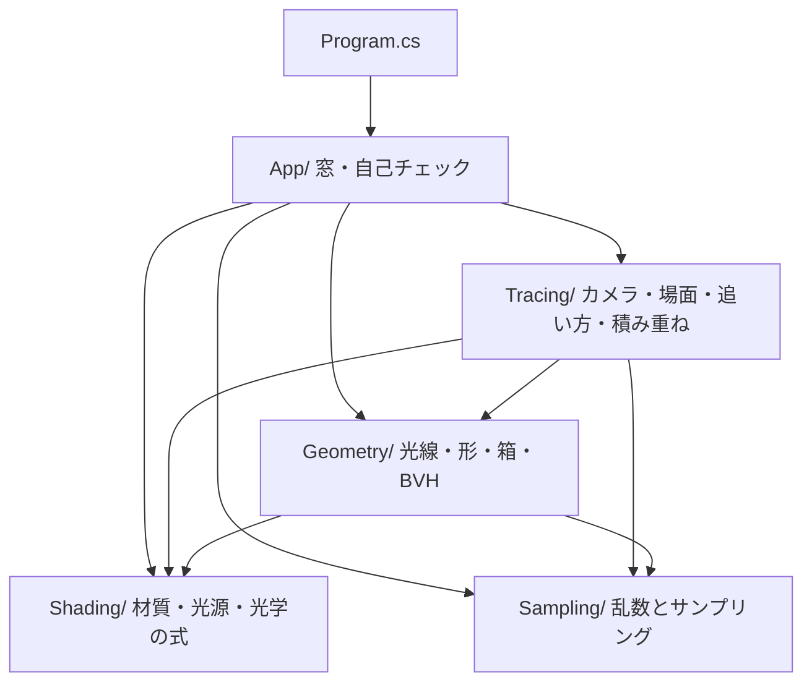
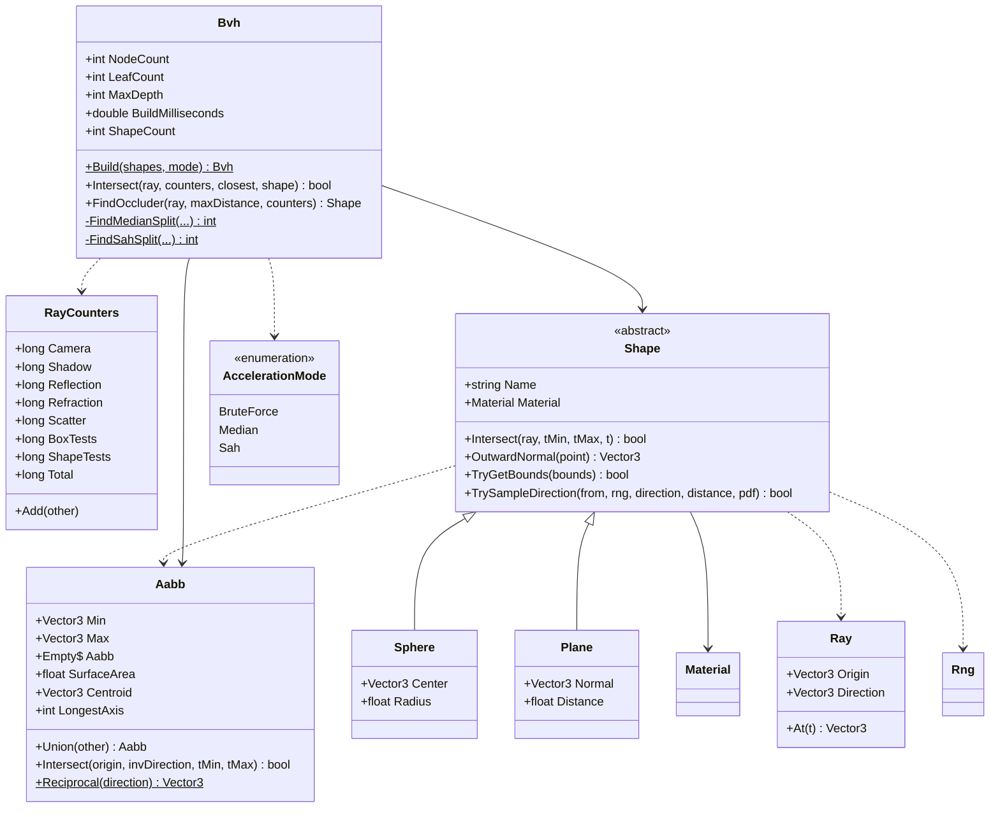
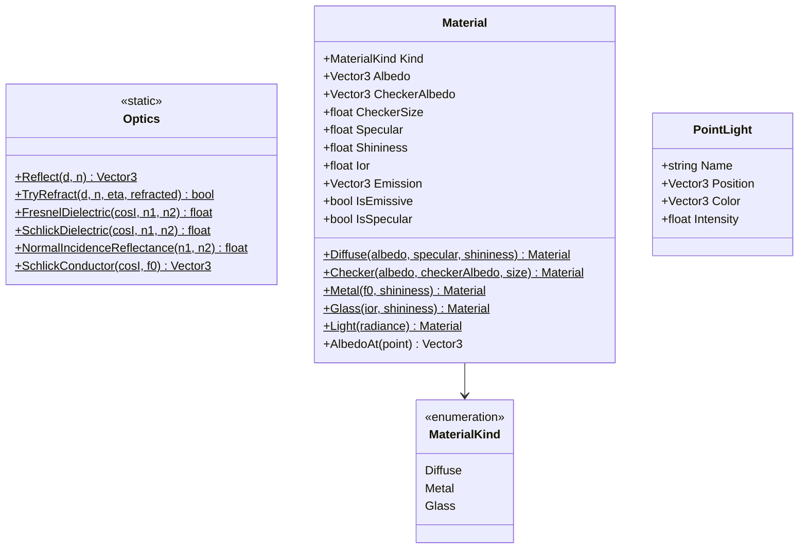
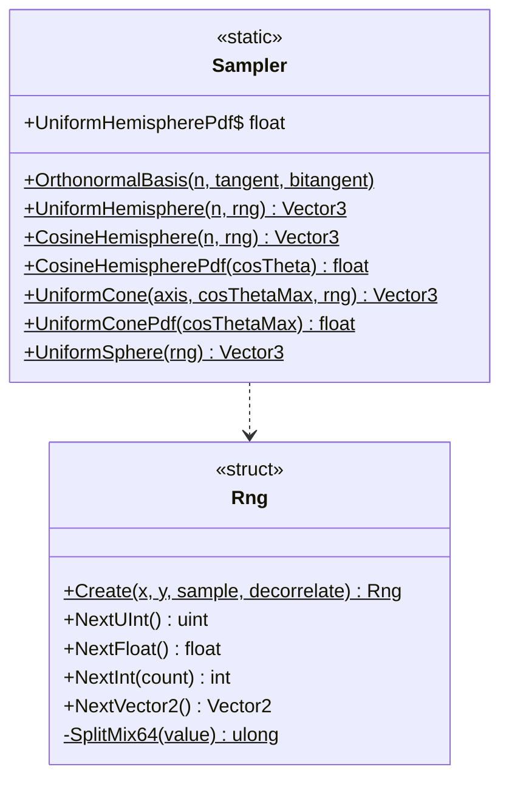
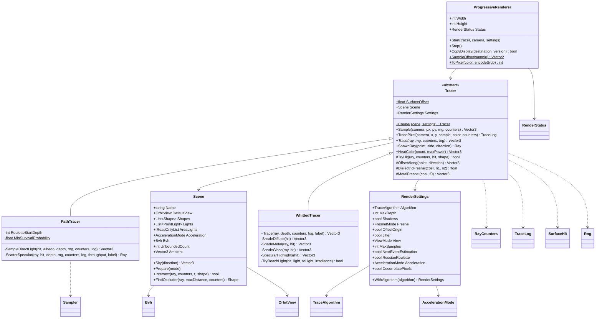
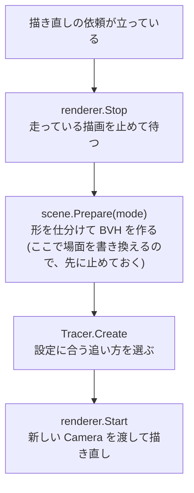
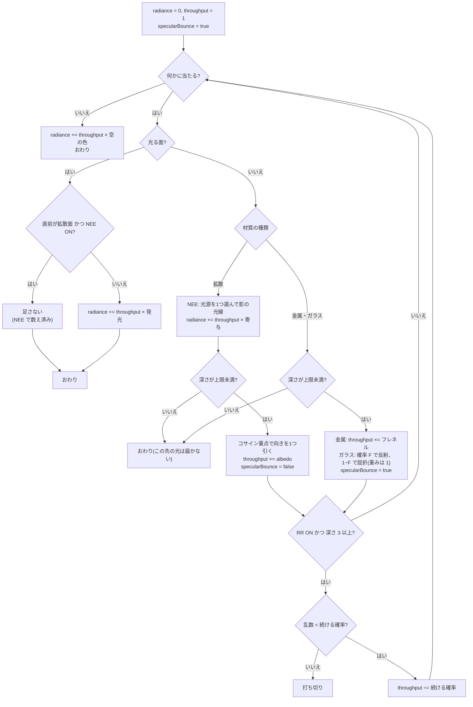
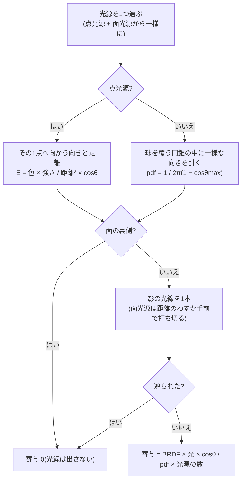

# Day 60: CPU レイトレーサ(2) — パストレーシング、モンテカルロ積分、BVH(木をやめて道にする)

**教養編の4日目**。Day 59 の `CpuRayTracer` の続きで、reference は Day 59 の完全コピー + 差分。GPU はまだ1行も使わない。

今日やることは2つ。前半は**パストレーシング**——面に当たったときに枝分かれするのをやめ、**行き先を乱数で1つだけ引いて、何千本も平均する**
(Kajiya, 1986 のレンダリング方程式を、モンテカルロ積分で解く)。後半は **BVH**——形が 466 個になって総当たりが秒単位になるので、
形を箱の木に入れて「通らない箱の中身を丸ごと飛ばす」。

| | Whitted(Day 59) | パストレーシング(Day 60) |
|---|---|---|
| 面に当たったら | **枝分かれ**(影 + 反射 + 屈折) | **行き先を1つ引く**(道は1本) |
| 光線の数 | 深さに対して**指数**(場面2の深さ 20 で1画素 26 本) | 深さに対して**線形**(深さ 8 で1画素 8.8 本) |
| 拡散面から先 | 追わない。周りからの光は**環境光の一定値** | 乱数で1本追う。**周りからの光を本当に数える** |
| 光源 | 点光源(大きさ 0)。影は硬い | **面光源**(大きさがある)。影の縁がぼける |
| 鏡に映る光源 | 映らない。**鋭いハイライトで代用** | **本当に映る** |
| ガラスの影 | 真っ黒 | **集光**(虫眼鏡の明るい点)が出る |
| 1枚の絵 | 64 サンプルで完成 | 何千サンプルでも撃つほど綺麗になる(誤差は **1/√N**) |
| 絵の出来かた | 最初から正しい絵が、だんだん滑らかになる | **ノイズだらけの絵が、だんだん正しい絵になる** |

今日の差分は**新規 7 ファイル**(1,463 行、うちコード 757 行)と**変更 13 ファイル**(+1,367 / −297 行)。

> **今日いちばん意外だったのは、乱数の種に画素の番号を混ぜるのをやめると、ノイズが「模様」になること**
> `K` キーで切ると、コーネルボックスが**石鹸の泡のような渦巻きだらけ**になる(完成条件7)。粒が粗くなるのではない。**絵の上に、場面をずらして写した幽霊が何枚も重なる**。
> 理由は単純で、全部の画素が同じ数列を使うと、**全部の画素が同じ順番で同じ向きへ散る**から。
> 隣り合う画素の1本目は「ほぼ同じ向き」を見ているので、隣どうしが似た色になり、ノイズが画素ごとにばらけずに
> 画面をまたいだ構造になる。散らした先が見ている像が、そのまま絵の上に重なって見える。
> 平均としては正しい値に収束する(不偏)ので**間違いではない**——16 サンプルでの見た目だけが別物になる。
> 自己チェック11 が、隣り合う画素の最初の乱数の相関を測っている:画素ごとに種を変えると **−0.0005**、変えないと **1.0000**。

## 今日のゴール

**起動すると、赤と緑の壁のコーネルボックスが出る。天井の光る球1つだけで照らされていて、20 秒ほどで 250 サンプルが重なる。
白い玉の赤い壁側がうっすら赤みを帯び(色移り)、影の縁がぼけ、鏡の玉に光る球そのものが映る。
`A` を押して Whitted に切り替えると、同じ場面が「のっぺりした灰色 + 真っ白な円」になる。**

| キー | 何が起きるか |
|---|---|
| `1`〜`6` | 場面(Whitted 1980 / 屈折率と金属 / 合わせ鏡 / **コーネルボックス** / **球がたくさん** / **ガラスの集光**) |
| `A` | 追い方(**パストレーシング** / Whitted)。**今日の目** |
| `N` | NEE(直接光を光源へ直接つなぐ)ON / OFF。**切ると同じ絵が 10 倍ノイズまみれになる** |
| `U` | ロシアンルーレット ON / OFF。**切っても明るさは変わらないまま、光線が 1.8 倍(深さ 32 なら 5.5 倍)に増える** |
| `B` | 探し方(BVH(SAH) / 総当たり / BVH(中央分割))。**場面5で 1パス 53ms が 399ms になる。絵は1画素も変わらない** |
| `K` | 乱数の種に画素の番号を混ぜる ON / OFF。**切ると上の囲みの渦巻きが出る** |
| `[` / `]`(`↓` / `↑`) | 深さの上限(0〜32、既定 8)。**上げるほど明るくなり、8 で止まる** |
| `V` | 表示(陰影 / 法線 / 光線の数 / **交差判定の数**)。最後のが今日の後半の目 |
| 右クリック | **1画素を追う**。押すたびに違う道が出る(それ自体が要点2の実演) |
| `PageUp` / `PageDown` | 下の欄をめくる(自己チェックは 36 行ある) |
| `S` `F` `E` `J` | Day 59 のまま(影 / フレネル / 始点を浮かせる / 画素内のずらし) |
| 左ドラッグ / ホイール / `R` | カメラを回す / 寄る / 戻す |
| `C` / `P` / `X` / `H` / `Esc` | 自己チェック(18 項目)/ PNG 保存 / 下の欄を消す / 文字を消す / 終了 |

### 今日いちばん大事な3つ

**1つ目は「積分を、1つ引いて確率で割ることに置き換える」**。レンダリング方程式は

```
  L(x, 出る向き) = Le + ∫[半球] BRDF × L(x, 入る向き) × cosθ dω
```

で、右辺の中にまた L がいる(無限に入れ子)。この積分を、**半球の全部の向きを足す代わりに、向きを1つ引いて確率密度で割る**ことで済ませる(要点2)。
1本ずつは当たり外れが激しいが、**何千本の平均は正しい値に近づく**。これが今日のコード全部の土台。

```csharp
// PathTracer.Trace。**再帰ではなくループ**。持ち回るのは2つだけ
Vector3 radiance = Vector3.Zero;      // ここまでに拾った光(答え)
Vector3 throughput = Vector3.One;     // この先で拾った光が画素にどれだけ効くか

for (int depth = 0; ; depth++)
{
    if (!TryHit(...)) { radiance += throughput * Scene.Sky(...); break; }   // 空に抜けた
    if (発光) { radiance += throughput * 発光; break; }                     // 光源に当たった
    radiance += throughput * SampleDirectLight(...);                        // NEE(要点4)
    Vector3 scattered = Sampler.CosineHemisphere(hit.Normal, ref rng);      // 行き先を1つ引く
    throughput *= albedo;                                                   // BRDF × cos / pdf(要点3)
    current = SpawnRay(hit.Point, hit.Normal, scattered);
}
```

**2つ目は「重みと同じ形で引けば、重みが消える」**(重点サンプリング。要点3)。
拡散面の散乱は本来 `BRDF × cosθ / pdf` を掛けるが、**pdf を `cosθ/π` にしておくと**
`(albedo/π) × cosθ / (cosθ/π) = albedo` になり、**π も cos も約分で消える**。上のコードが `throughput *= albedo;` の1行で済むのはこのため。
一様に引くと `albedo × 2cosθ` が残り、斜めの向きほど暗いばらつきが乗る(自己チェック13で、同じサンプル数の誤差が **0.52 倍**になることを測っている)。

**3つ目は「絵ではなく数で確かめる」**(要点9)。パストレーシングの答えはノイズに埋もれているので、
**係数が 2 倍ずれていても「そういう絵」に見えてしまう**。今日足した自己チェックは、答えが解析的に分かっている入力だけを選んである。
いちばん鋭いのが**白い炉**(自己チェック14)——反射率 1 の面だけを一様な明るさ L の空に置くと、
どこをどう見ても**1本ごとに厳密に L** が返るはず。実測 **6.0×10⁻⁸** のずれ。π を落としても cos を2回掛けても、ここで一発で落ちる。

## 事前に読む資料

- [Peter Shirley ほか「Ray Tracing in One Weekend」](https://raytracing.github.io/books/RayTracingInOneWeekend.html) の
  **「Diffuse Materials」**(Day 59 では読み飛ばした章)と **「A Final Render」**
  — 乱数で跳ね返す拡散と、今日の場面5のもとになった絵
- [同 「Ray Tracing: The Next Week」](https://raytracing.github.io/books/RayTracingTheNextWeek.html) の
  **「Bounding Volume Hierarchies」** — 要点7。今日の BVH の骨組み(ただし本書は中央分割で、SAH は扱っていない)
- [同 「Ray Tracing: The Rest of Your Life」](https://raytracing.github.io/books/RayTracingTheRestOfYourLife.html)
  — **今日の前半の一次資料**。モンテカルロ積分・pdf・重点サンプリング・光源のサンプリングを、
  1冊まるごとかけて説明している。「A Simple Monte Carlo Program」「Importance Sampling」「Sampling Lights Directly」を読む
- [James T. Kajiya, "The Rendering Equation", SIGGRAPH 1986](https://doi.org/10.1145/15922.15902)
  — 要点1の元の論文。**この式の右辺に L が入っている**ことが今日の全部の出発点
- [Cindy M. Goral ほか, "Modeling the Interaction of Light Between Diffuse Surfaces", SIGGRAPH 1984](https://doi.org/10.1145/964965.808601)
  — 場面4のコーネルボックスの初出。「計算した絵」と「実際に箱を作って撮った写真」を並べた論文
- [PBRT 4th edition(全文が無料で読める)](https://pbr-book.org/4ed/contents) の
  **13章 Light Transport I: Surface Reflection**(パストレーシングと NEE)、
  **A.5 Russian Roulette**、**7.3 Bounding Volume Hierarchies**(SAH の費用の式)、**6.8.2 Ray–Bounds Intersections**(スラブ法と NaN)
- [Ingo Wald ほか, "Ray Tracing Deformable Scenes using Dynamic Bounding Volume Hierarchies"(2007)](https://doi.org/10.1145/1276377.1276406)
  — 要点8。BVH をどう作るか(SAH、ビン化)の定番
- [Melissa E. O'Neill, "PCG: A Family of Simple Fast Space-Efficient Statistically Good Algorithms for Random Number Generation"(2014)](https://www.pcg-random.org/paper.html)
  — 要点6。今日の乱数器。**Day 61 で GLSL に写せる形**であることが選んだ理由
- **Day 59 の計画書**(交差・反射・屈折・フレネル・影のにきび)・**Day 35 の計画書**(Cook-Torrance と BRDF の正規化)・
  **Day 53 の計画書**(ライトカリング。空間を区切る話の比較対象) — 今日はこれらの上に乗る

## 理論の要点

### 1. レンダリング方程式 — Whitted は何を捨てていたか

ある点 x から、ある向きへ出ていく光の量は次の式で書ける(Kajiya, 1986)。

```
  L(x, ωo) = Le(x, ωo) + ∫[半球] f(x, ωi, ωo) × L(x', ωi) × cosθi dωi
             ~~~~~~~~~   ~~~~~~~~~~~~~~~~~~~   ~~~~~~~~~   ~~~~~~
             自分で光る   BRDF(どう跳ね返すか)   入ってくる光  斜めの薄まり
```

言葉にすると「**出ていく光 = 自分で光る分 + 周り全部から入ってくる光を、跳ね返し方で重みを付けて足したもの**」。
やっかいなのは**右辺にまた L がいる**こと。x に入る光は、別の点 x' から出ていく光で、それを求めるにはまた同じ式が要る。

Day 59 の Whitted 法は、この積分を次の3つで**置き換えて**いた。

| 積分のうち | Whitted 法は | 何が起きるか |
|---|---|---|
| 光源から直接来る分 | **影の光線で正確に**求める | ここは正しい |
| 鏡面(反射・屈折)の向きから来る分 | **その1本だけ**追う | 鏡とガラスは正しい(積分が1点に集中しているので) |
| **拡散面から跳ね返って来る分** | **一定値(環境光)で済ませる** | 色移りが出ない。影の中がのっぺり |

3つ目が今日の主題。拡散面は光をあらゆる向きへ散らすので、1本では表せない——だから Whitted は諦めて定数で埋めた。
パストレーシングは、**その半球の中から向きを1つ乱数で引く**ことで、この積分を正面から解く。

> `Scene.Ambient` は `PathTracer` からは1行も読まれない。あれは「諦めた印」なので。
> A キーで切り替えると、コーネルボックスの平均の明るさが **0.158(Whitted)→ 0.554(パストレーシング)**になる。

### 2. モンテカルロ積分 — 1つ引いて、確率で割る

積分 `∫ g(x) dx` を求めたいが、g が何段も入れ子になっていて式で解けない。このとき

```
  ∫ g(x) dx ≒ (1/N) Σ g(xi) / p(xi)        xi は確率密度 p から引いた点
```

が使える。**1点の値を、その点が選ばれる確率密度で割ったもの**の平均が、積分の値に近づく(大数の法則)。
`p` で割るのは「濃く引いたところを薄く数える」ため——たくさん引かれる場所を割り引かないと、その場所ばかり数えたことになる。

この推定は**不偏**(期待値がぴったり答え)だが、**ばらつきがある**。誤差は

```
  誤差 ≒ σ / √N          σ は1サンプルのばらつき
```

で減る。ここが今日いちばん痛い性質で、**サンプルを 4 倍にしても誤差は半分**にしかならない。
自己チェック13で ∫cos²θ dω = 2.0944 を推定すると:

| サンプル数 N | 誤差(16 回の二乗平均) |
|---|---|
| 64 | 0.2796 |
| 4,096(64 倍) | 0.0436(**1/6.4**) |
| 262,144(さらに 64 倍) | 0.0031(**1/14.1**) |

N を 64 倍で誤差は理論上 1/8。16 回しか試していないので上下にぶれるが、**1/64 にはならない**ことははっきり出る。
**ノイズを半分にするには4倍の時間が要る**——これがパストレーシングの絵がなかなか綺麗にならない理由(要点9)。

打てる手は2つしかない。**N を増やす**(時間)か、**σ を小さくする**(工夫)。今日やる工夫が要点3(重点サンプリング)と要点4(NEE)。

### 3. コサイン重点サンプリング — 重みと同じ形で引く

拡散面の積分は `∫ (albedo/π) × L(ωi) × cosθi dωi`。向きを引く確率密度 p を何にするかは自由だが、
**被積分関数の形に似せるほどばらつきが小さくなる**。L は分からないが、`cosθ` は分かっている。そこで `p(ω) = cosθ/π` で引く。

```csharp
// Sampler.CosineHemisphere。Malley の方法: 円板に一様に打ってから、半球へまっすぐ持ち上げる
float radius = MathF.Sqrt(u1);                      // √u。u をそのまま使うと中心に偏る
float phi = 2.0f * MathF.PI * u2;
float x = radius * MathF.Cos(phi);
float y = radius * MathF.Sin(phi);
float z = MathF.Sqrt(MathF.Max(0.0f, 1.0f - u1));   // x² + y² = u1 なので、これで長さ 1
```

すると推定量の1項が

```
  BRDF × cosθ / pdf = (albedo/π) × cosθ / (cosθ/π) = albedo
```

になり、**π も cos も消える**。コードは `throughput *= albedo;` の1行。

| 引き方 | pdf | 1項の重み | 同じ N での誤差(自己チェック13) |
|---|---|---|---|
| 半球に一様 | 1/(2π) | albedo × 2cosθ | 0.0031 |
| **cos 重み付き** | cosθ/π | **albedo** | **0.0016(0.52 倍)** |

pdf が名乗りどおりかは必ず数で確かめる(自己チェック12)。`cosθ/π` なら「cosθ が c 未満になる確率」は `c²` になるはずで、
実測のずれは 0.0009。**ここがずれると、絵が一様に明るく(暗く)なるだけで、見た目には壊れて見えない**。

### 4. 面光源と NEE — 影の光線の一般化

大きさのある光源(<c>Material.Emission</c> を持つ形)を置くと、Day 59 のごまかしが2つ消える。

- **影の縁がぼける**。光源の一部だけが見える点ができるから(半影)
- **鏡に光源が映る**。反射の光線が本当に光源に当たるから(点光源は大きさ 0 なので、当たる確率が 0 だった)

ここで「放射輝度」(<c>Emission</c> の単位)が距離で薄まらない量であることが効く。遠くの光源が暗いのは、
**見かけの大きさ(立体角)が小さくなる**からで、逆2乗則はそこから自然に出てくる。

散乱した光線が偶然光源に当たるのを待つだけでも答えは出るが、光源が小さいと当たる確率が小さく、ノイズがひどい。
そこで **NEE**(next event estimation)——**拡散面に当たるたびに、光源へ直接1本つなぐ**。Day 59 の影の光線とほぼ同じもので、
違いは「光源の上のどこへ向けるかを乱数で引く」ところ。

```csharp
// Sphere.TrySampleDirection。**球が空を覆っている円錐の中に一様**に引く
float sin2 = Radius * Radius / (distanceToCenter * distanceToCenter);
float cosThetaMax = MathF.Sqrt(MathF.Max(0.0f, 1.0f - sin2));      // sinθmax = r/d
direction = Sampler.UniformCone(axis, cosThetaMax, ref rng);
pdf = Sampler.UniformConePdf(cosThetaMax);                          // 1 / (2π(1 − cosθmax))
```

寄与は `BRDF × 発光 × cosθ / pdf`。**この式に逆2乗則は書かれていない**——遠い光源ほど円錐が細くなって pdf が大きくなり、
割った結果が自動的に小さくなる。逆2乗則は立体角の式に溶けている。

**2重に数えないための規則**が1つだけ要る。NEE で数えた光を、散乱した光線が偶然その光源に当たったときにも足すと、**光源が2倍明るくなる**。
そこで「**直前の跳ね返りが拡散面だったら、光源に当たっても足さない**」(そこで NEE 済みだから)。
鏡面(金属・ガラス)の後は NEE が使えていない(跳ね返る向きが1つに決まっているので、光源のほうへ跳ね返る確率が 0)ので、**足す**。

```csharp
bool alreadyCounted = Settings.NextEventEstimation && !specularBounce;
if (!alreadyCounted) { radiance += throughput * material.Emission; }
```

この規則のおかげで、**「拡散 → ガラス → ガラス → 光源」の集光の経路は正しく拾える**(直前が鏡面なので足す)。場面6がそれ。

> 点光源は大きさ 0 なので、散乱の光線が当たることは決して無い。**NEE を切ると点光源の光が丸ごと消える**——
> 場面1〜3・5 で `N` を切ると、空の光だけになる。「点光源は NEE 無しでは扱えない」が目で分かる。

### 5. 木を道にする — 確率で枝を選ぶ / ロシアンルーレット

**ガラス**では Whitted 法が反射と屈折の2本に分けていた。パストレーシングは**確率 F で反射、1−F で屈折**と1本に潰す。

```
  反射を選んだ寄与 = F × L反射 / F       = L反射
  屈折を選んだ寄与 = (1−F) × L屈折 / (1−F) = L屈折
```

**どちらも重みが 1 のまま**で、平均すれば木と同じになる。これで枝分かれが消え、光線の数が深さに対して**線形**になる。
(Day 59 の場面2で深さ 20 にすると1画素 26 本だったのが、パストレーシングでは深さ 20 でも1画素 数本で済む。)

**ロシアンルーレット**は同じ手口を「続けるかどうか」に使う。暗くなった道ほど画素への影響が小さいので、確率 q で打ち切り、
生き残った道を 1/q 倍に重くする。

```csharp
float survival = Math.Clamp(throughput の最大成分, 0.05f, 1.0f);
if (rng.NextFloat() >= survival) { break; }      // 打ち切り
throughput /= survival;                          // 生き残ったぶんを重くする
```

平均は変わらない(不偏)まま、光線が減る。**深さの上限を上げるほど効く**——場面4での実測:

| 深さの上限 | RR あり | RR なし | 明るさ(あり / なし) |
|---|---|---|---|
| 6 | 8.70 本 / 80ms | 12.56 本 / 126ms | 0.5508 / 0.5511 |
| 8 | 8.80 本 / 82ms | 15.87 本 / 166ms | 0.5528 / 0.5532 |
| 16 | **8.85 本 / 82ms** | 28.16 本 / 290ms | 0.5537 / 0.5542 |
| 32 | **8.85 本 / 82ms** | 48.67 本 / 501ms | 0.5537 / 0.5542 |

**RR ありは 8.85 本で頭打ち**(暗くなった道は勝手に切れるので、上限をいくら上げても道が伸びない)。
なしは上限に比例して増え、深さ 32 では **5.5 倍の光線と 6 倍の時間**を使って、**同じ明るさ**にたどり着く。
自己チェック16 でも、平均が **1.0313 → 1.0316(差 0.0%)**のまま光線が **0.69 倍**になることを測っている。

下限 0.05 を入れてあるのは、q を 0 まで許すと生き残ったときの重み 1/q が跳ね上がり、
**たまに1画素だけ極端に明るい点**(firefly)が出るから(要点9)。

### 6. 乱数 — 状態を持ち回さず、番号から作る

1パスで 50 万画素 × 十数本の乱数が要る。<see cref="System.Random"/> を使わない理由は3つある。

1. **クラスなので画素ごとに作ると GC の仕事が増える**
2. **種から数列への散らばり方が保証されていない**。隣り合う種から似た数列が出ると隣の画素が同じ向きへ散る
3. **Day 61 で GLSL に写せない**。GPU には状態を持つ乱数器が無い

今日の <c>Rng</c> は PCG32(掛け算1回 + 右回転1回)で、**状態を持ち回さず (画素, サンプル番号) から作り直す**。

```csharp
public static Rng Create(int x, int y, int sample, bool decorrelate = true)
{
    ulong seed = (ulong)(uint)sample * GoldenRatio;
    if (decorrelate) { seed ^= SplitMix64(((ulong)(uint)y << 32) | (uint)x); }
    return new Rng(SplitMix64(seed));
}
```

作り直す形にしておくと、**どのスレッドがどの行を受け持っても絵が変わらない**(`Parallel.For` の割り当ては毎回違う)。
「同じ設定なら必ず同じ絵」でないと、NEE のあり・なしを引き算して比べる自己チェックが書けない。

画素の番号を**そのまま足すのではなく、先に SplitMix64 で混ぜてから XOR する**のが要点。
(x, y) を 32 ビットずつ並べただけの値は隣の画素と 1 ビットしか違わず、LCG は「近い種から近い数列」を出す。

`K` で画素の番号を混ぜるのをやめると、冒頭の囲みの渦巻きが出る。自己チェック11 が隣り合う画素の相関を測っていて、
**混ぜると −0.0005、混ぜないと 1.0000**。

### 7. AABB とスラブ法 — 箱に当たるかを掛け算だけで

ここから後半。BVH の箱は**軸に平行な直方体**(AABB)にする。ぴったり囲むことより、**1回の判定が安いこと**が効くから
(光線1本につき十数回も聞く)。

箱を「3対の平行な板(スラブ)の重なり」と見て、軸ごとに**板に入る t と出る t** を求め、
3軸ぶんの「入る」のいちばん遅いものと「出る」のいちばん早いものを比べる。

```csharp
// Aabb.Slab。**MathF.Min / MathF.Max ではなく比較で書いてある**のが肝
float t0 = (low - origin) * invDirection;
float t1 = (high - origin) * invDirection;
if (t0 > t1) { (t0, t1) = (t1, t0); }
if (t0 > enter) { enter = t0; }      // NaN なら false → その軸の制約を無視する
if (t1 < exit) { exit = t1; }
```

割り算ではなく `invDirection`(向きの逆数)を光線1本につき1回だけ作って掛ける。向きの成分が 0 なら ±∞ になるが、それでよい。

**踏む罠**: 光線が板と平行(`invDirection` が ±∞)で、しかも**始点がちょうど板の上**にあると `0 × ∞ = NaN` が出る。
`MathF.Max(NaN, x)` は NaN を返すので、素朴に書くと `enter` が NaN になり、最後の `enter <= exit` が false ——
**箱の中にいるのに「外れ」**になる。比較で書けば NaN との比較は全部 false なので、その軸を無視することになり答えが正しくなる
(PBRT と同じ書き方。自己チェック17 が、Min/Max 版だと外れることまで確かめている)。

**無限の平面は箱で囲めない**。巨大な箱で囲むことはできるが、その箱は場面の全部と重なるので、
BVH のどの枝を辿っても必ず葉まで降りることになり、木の意味が無くなる。
だから `Shape.TryGetBounds` が false を返す形は BVH に入れず、毎回総当たりで聞く(今日の場面ではせいぜい6枚)。

### 8. BVH — 形のほうを木に入れる

形を箱で囲み、その箱をさらに大きな箱で囲む、を繰り返した木。光線は根から辿り、**通らない箱に出会ったら中身を丸ごと飛ばす**。

「空間を区切る」方法(BSP・kd 木・八分木。Day 53 のライトカリングもこちら側)と違い、BVH は**形のほうを木に入れる**。

| | 空間を区切る | **BVH** |
|---|---|---|
| 境目にまたがる形 | 複数の区画に**重複して**入る | **必ずどれか1つの葉**に入る |
| 兄弟の領域 | 重ならない | **重なってよい**(そのぶん両方の子を見ることがある) |
| 節点の数 | 事前に読めない | **形の数から決まる**(葉が最大 N、内側が N−1)ので配列で確保できる |

木は**配列1本**に平らに詰める。**左の子は必ず自分の次**に置く決まりにすると、節点が覚えるのは右の子の番号だけでよい。

**どこで割るか**の決め方を2つ入れてある(`B` キー)。

- **中央分割** … いちばん長い軸で、重心の中央値で半分ずつ。作るのは速いが**形の疎密を見ていない**
- **SAH**(表面積ヒューリスティック) … 割った後の費用を見積もって、いちばん安い割り方を選ぶ

```
  費用(割る)   = 箱を辿る手間 + (左の箱の表面積 × 左の数 + 右の箱の表面積 × 右の数) / 親の箱の表面積
  費用(葉にする) = 形の数
```

「でたらめな光線が子の箱に入る確率は、表面積の比」という見積もりに基づく(凸な立体に対する Cauchy の公式)。
**葉にするほうが安ければ割らない**ので、木の深さも自動で決まる。

場面5(形 466 個、うち BVH に入るのは 465 個。無限の床だけが外)での実測:

| 探し方 | 1パス | 1光線あたりの交差判定 | 節点(葉)深さ | 作成 |
|---|---|---|---|---|
| 総当たり | **399 ms** | 形 458.0 回 | — | — |
| BVH(中央分割) | **63 ms** | 箱 14.1 + 形 4.4 = 18.4 回 | 255(128)深さ 8 | 3.6 ms |
| BVH(SAH) | **53 ms** | 箱 12.1 + 形 3.3 = **15.4 回** | 301(151)深さ 9 | 4.0 ms |

**交差判定は 30 分の1 になったのに、全体は 7.5 倍にしかならない**。これがアムダールの法則で、
残りの時間(乱数・散乱の向き作り・色の足し算・画素への書き込み)は BVH では減らないから。
「30 倍速くなるはず」と思って測ると必ずこの差に出会う。

**形が少ないと BVH は損**。場面4(形 9 個、うち BVH に入るのは球 3 個)では **76 ms → 89 ms** と遅くなる。
木を辿る手間が、9 個に総当たりする手間より高い。

### 9. ノイズとの付き合い — 何で正しさを確かめるか

パストレーシングの絵は**常に間違っている**(サンプルが有限なので)。だから「絵を見て正しそう」は根拠にならない。
今日の自己チェックで使った、**答えが解析的に分かっている入力**を並べておく。

| 確かめ方 | 何が捕まるか |
|---|---|
| **白い炉**(反射率 1 の面を一様な明るさの空に置く) | BRDF × cos / pdf の打ち消しのずれ。**1本ごとに厳密に一致**するので最強 |
| **既知の積分**(∫cos²θ dω = 2π/3) | サンプリングと pdf の食い違い。1/√N の確認も同時にできる |
| **深さ 0 で Whitted と一致** | NEE の式(BRDF・逆2乗則・cos)が Day 59 と同じか |
| **NEE あり/なしで同じ平均** | 2重に数えていないか、pdf の割り忘れが無いか |
| **RR あり/なしで同じ平均** | 打ち切りの補正(1/q)が正しいか |
| **BVH と総当たりが完全一致** | 箱の取りこぼし。**絵ではほとんど見えない**ので数で見るしかない |

ノイズの量そのものも測れる。自己チェック16 では **1画素の平均の標準誤差(σ/√N)を全画素で平均**した値を使っている。
サンプル数が違う設定どうしを比べられるよう、1サンプルあたりに揃えてある。NEE を入れると **0.32 倍**。

**firefly**(たまに1画素だけ極端に明るい点)は、確率の小さい経路が大きな重みで当たったときに出る。
不偏だが目に付くので、実務ではクランプ(ある値を超えた寄与を切る)で潰すことが多い——ただしそれは**偏り**を入れる(改造課題3)。

## 前Dayからの差分概要

### 新規ファイル

| ファイル | 行数(うちコード) | 役割 |
|---|---|---|
| `Sampling/Rng.cs` | 123(40) | PCG32。**(画素, サンプル番号) から作り直す**乱数器(要点6) |
| `Sampling/Sampler.cs` | 132(53) | 正規直交基底 / 半球一様 / **コサイン重点** / 円錐一様 / 球面一様 と、それぞれの pdf(要点3・4) |
| `Geometry/Aabb.cs` | 152(71) | AABB と**スラブ法**(要点7)。NaN を無視する書き方 |
| `Geometry/Bvh.cs` | 448(278) | `AccelerationMode` と **BVH**(中央分割 / SAH の構築、スタックで辿る走査)(要点7・8) |
| `Geometry/RayCounters.cs` | 51(22) | Day 59 の `WhittedTracer.cs` から**移動**。散乱・箱・形の判定回数を追加 |
| `Tracing/Tracer.cs` | 224(111) | **追い方の共通部分**(Day 59 の歪み2・3 を直したもの)。`TraceLog` / `SurfaceHit` もここへ移動 |
| `Tracing/PathTracer.cs` | 333(182) | **今日の主役**。レンダリング方程式をループで解く。NEE・ロシアンルーレット |

### 変更ファイル

| ファイル | 差分 | 何をした |
|---|---|---|
| `Day60.csproj` | +4 −3 | コメントだけ(Day 59 のコピーであること、高DPIの理由) |
| `Program.cs` | +12 −9 | コメントだけ(今日の主題の説明) |
| `Geometry/Shape.cs` | +47 −3 | `TryGetBounds`(BVH 用)と `TrySampleDirection`(面光源用)を追加 |
| `Geometry/Sphere.cs` | +57 −0 | 上の2つを実装。球へ向かう**円錐一様サンプリング**(要点4) |
| `Geometry/Plane.cs` | +10 −0 | `TryGetBounds` は false(無限は囲めない) |
| `Shading/Material.cs` | +50 −0 | `Emission` / `IsEmissive` / `IsSpecular` と `Light()` |
| `Tracing/Scene.cs` | +91 −15 | `Prepare`(形の仕分けと BVH の構築)、`AreaLights`、問い合わせに `RayCounters` |
| `Tracing/SceneLibrary.cs` | +206 −2 | 場面4〜6(コーネルボックス / 球がたくさん / ガラスの集光) |
| `Tracing/RenderSettings.cs` | +97 −9 | `TraceAlgorithm` / NEE / ロシアンルーレット / 探し方 / 乱数の相関 / `ViewMode.Cost` |
| `Tracing/WhittedTracer.cs` | +37 −216 | `Tracer` を継ぐ形に。共通部分を親へ移し、発光を足せるようにした。**木の追い方は Day 59 のまま** |
| `Tracing/ProgressiveRenderer.cs` | +17 −7 | `Tracer` を引数で受け取る。画素ごとに `Rng` を作る |
| `App/SelfCheck.cs` | +606 −7 | 項目 11〜18 を追加(要点9) |
| `App/ViewerWindow.cs` | +133 −26 | 新しいキー、HUD、下の欄のページめくり、場面 1〜6 |

**今日の量は多い**(自己チェックを除いてもコード 1,100 行ほど)。区切り方は下の「写経する順番」の末尾に書いた。
**`App/SelfCheck.cs` は、写すより reference からコピーして読むだけにしてもよい**——式の答え合わせが役目で、今日の理論は全部ほかのファイルにある。

### 写経する順番

依存の向きに沿って並べてある。**今日は途中でビルドが通らない区間が長い**——
型の引っ越し(`RayCounters` / `TraceLog` / `SurfaceHit`)と親クラスの切り出し(`Tracer`)が絡むので、
**8 から 18 までは一続き**になる。エラーの数が減っていくのを目印に進める。

1. **`Sampling/Rng.cs`** — 新規。どこにも依存しない。要点6
2. **`Sampling/Sampler.cs`** — 新規。1 を使う。要点3・4の式
3. **`Geometry/Aabb.cs`** — 新規。どこにも依存しない。要点7
4. **`Shading/Material.cs`** — `Emission` / `IsEmissive` / `IsSpecular` / `Light()` を足す
5. **`Geometry/Shape.cs`** — `TryGetBounds` と `TrySampleDirection` を足す(1・3・4 を使う)。
   **抽象メソッドが増えるので、6・7 を写すまで `Sphere` と `Plane` がエラーになる**。
   `<see cref="WhittedTracer"/>` を `Tracer` に直した箇所もある(コメントだけの変更)
6. **`Geometry/Sphere.cs`** — 5 の2つを実装。球へ向かう円錐サンプリング(要点4)
7. **`Geometry/Plane.cs`** — 5 の `TryGetBounds` を false で実装(無限は囲めない)
   — **ここまでは足すだけなので、7 を写し終えるとビルドが通る**
8. **`Geometry/RayCounters.cs`** — 新規。`Tracing/WhittedTracer.cs` の先頭にあった `RayCounters` を**そのまま移して**、
   `Scatter` / `BoxTests` / `ShapeTests` を足したもの(移した理由は設計書と、ファイルのコメントに書いてある)。
   **13 で元のほうを消すまで二重定義になる。ここから 18 までビルドは通らない**
9. **`Geometry/Bvh.cs`** — 新規。3・5・8 を使う。要点7・8。**今日いちばん長い(278 行)**
10. **`Tracing/Scene.cs`** — 8・9 を使う。`Prepare` / `AreaLights` / 問い合わせの引数
11. **`Tracing/RenderSettings.cs`** — 9(`AccelerationMode`)を使う。つまみの追加
12. **`Tracing/Tracer.cs`** — 新規。1・8・10・11 を使う。`TraceLog` / `SurfaceHit` は
    `WhittedTracer.cs` から**そのまま移動**(`SurfaceHit` に `Distance` が1つ増えている)
13. **`Tracing/WhittedTracer.cs`** — 12 を継ぐ形に書き換える。**Day 59 から消える行のほうが多い**
    (`RayCounters` / `TraceLog` / `SurfaceHit` / `Sample` / `TracePixel` / `SpawnRay` / `HeatColor` などが 12 へ移った)
14. **`Tracing/PathTracer.cs`** — 新規。2・12 を使う。**今日の主役**。これで `Tracer.Create` の両方が揃う
15. **`Tracing/ProgressiveRenderer.cs`** — 12 を使う。`Start` の引数と、画素ごとの `Rng`
16. **`Tracing/SceneLibrary.cs`** — 4・6・7・10 を使う。場面4〜6
17. **`App/SelfCheck.cs`** — 上の全部を使う。項目 11〜18
18. **`App/ViewerWindow.cs`** — 15・16・17 を使う。キーと HUD — **ここでビルドが戻る**
19. **`Program.cs`** — コメントのみ。差分0にしたいなら合わせておく
20. **`CpuRayTracer.csproj`**(reference では `Day60.csproj`) — コメントのみ。同上

**区切るなら 7 まで**(足すだけで、ビルドが通る状態で止められる)。8 以降を1回で終える自信が無ければ、
**9(`Bvh.cs`)と 17(`App/SelfCheck.cs`)だけ先に reference からコピーしておく**と、自分で書く量が 1,000 行ほど減る
(9 は要点7・8 を読んだあとで改めて写す、でもよい)。

## 設計書

**Day 59 の設計書に差分を当てたもの**。変わったのは3か所。

- **`Sampling/` が増えた**(乱数とサンプリング)
- **`Tracer` を親に立てて、`WhittedTracer` と `PathTracer` を並べた**(Day 59 の歪み2・3 を解消)
- **`RayCounters` が `Tracing/` から `Geometry/` へ移った**(`Bvh` が数えるようになったので。下で説明する)

### 全体構成と依存の向き



| 層 | 知っている層 | 知らない層 | 中身 |
|---|---|---|---|
| `Sampling/` | **どこも知らない** | 形・材質・場面・窓 | `Rng` / `Sampler` |
| `Shading/` | **どこも知らない** | 形・場面・窓 | `Material` / `MaterialKind` / `PointLight` / `Optics` |
| `Geometry/` | Shading・Sampling | 場面・窓 | `Ray` / `RayCounters` / `Shape` / `Sphere` / `Plane` / `Aabb` / `Bvh` / `AccelerationMode` |
| `Tracing/` | Geometry・Shading・Sampling | **窓(WinForms)** | `OrbitView` / `Camera` / `Scene` / `SceneLibrary` / `RenderSettings` ほか設定の enum / **`Tracer`** / `WhittedTracer` / **`PathTracer`** / `TraceLog` / `SurfaceHit` / `ProgressiveRenderer` / `RenderStatus` |
| `App/` | 全部 | — | `ViewerWindow` / `SelfCheck` |

**循環参照は無い**(コメントを落として型名を拾い、確かめた)。`Tracing/` が WinForms を知らないのも Day 59 のまま
(そのおかげで、検証では窓を開かないコンソールのプログラムから `Tracing/` を呼んで 6 つの場面を PNG にできた)。

**`RayCounters` を `Geometry/` へ移した理由**がこの節でいちばん大事なところ。
Day 60 で `Bvh` が「箱を何回見たか」「形を何回調べたか」を数えるようになり、`Geometry/` からも `RayCounters` を使うことになった。
Day 59 の場所(`Tracing/WhittedTracer.cs`)のままだと **`Geometry → Tracing → Geometry` の循環**ができる。
数えているのは「光線」と「交差判定」で、どちらも `Geometry/` の言葉——カメラ・影・反射といった**名前**を付けているのが `Tracing/` 側、という切り分けにした。

`Sampling/` がどこにも依存しないのも意図してある。`Optics` と同じく `Vector3` と `float` だけの式なので、**Day 61 で GLSL へそのまま写す**。

### Geometry — 光線・形・箱・BVH



`Shape` に増えた2つは性格が違う。

- **`TryGetBounds`** … 抽象メソッド。**全部の形が答えなければならない**(「囲めない」と答えるのも答えのうち)
- **`TrySampleDirection`** … 既定で false を返す仮想メソッド。**球だけが実装している**。
  平面は無限に広いので、その上に一様な点を引くこと自体ができない

`Bvh` の節点を「葉か内側か」で分けず、**`Count` が 0 かどうかで見分ける**(葉は `Index` が形の開始位置、内側は右の子の番号)。
1つの構造体に詰めることでキャッシュに載りやすくなる。**左の子は必ず自分の次**という決まりも同じ狙い。

### Shading — 材質・光源・光学の式



`Material` に**光源の種類を足さなかった**のがここの判断。「面光源」は種類ではなく、**拡散面が `Emission` を持っているだけ**。
こうしておくと「光りながら反射もする面」が自然に書ける(今日は使っていない。`Light()` は albedo 0 で作る)。

`IsSpecular` を材質に持たせたのは、`PathTracer` が**2か所で同じ判定をする**から——
NEE でつなげるか(つなげない)と、光源に当たったときに数えるか(数える)。

### Sampling — 乱数とサンプリング



**サンプリングの関数と pdf の関数を必ず対で書く**のが、この2つのクラスの約束。
片方だけ直すと絵が一様に明るく(暗く)なり、見た目には壊れて見えないので、自己チェック12・13 が対応を数で確かめている。

`Rng` を `struct` にしてあるのは、画素ごとに作るから(1パスで 50 万個)。`ref` で持ち回る。

### Tracing — カメラ・場面・追い方・積み重ね



(`OrbitView` / `Camera` / `SceneLibrary` / `RenderStatus` / `TraceLog` / `SurfaceHit` / `FresnelMode` / `ViewMode` は Day 59 の設計書のまま。
`SurfaceHit` に `Distance` が1つ増えただけ。)

**`Tracer` を親に立てたのが今日の構造の変更点**。Day 59 の設計書で「歪み2」として挙げたとおり、
`WhittedTracer` が「追い方」と「表示の切り替え」と「1画素の記録」を1つのクラスで抱えていた。パストレーサを足すとそこが丸ごと重複する。

| どこに置いたか | 中身 | なぜ |
|---|---|---|
| `Tracer`(親) | `Sample`(表示の切り替え)/ `TracePixel` / `TryHit` / `SpawnRay` / フレネルの切り替え / `HeatColor` | **追い方によらず同じ**。法線の裏返しや始点の浮かせ方まで両方で同じでないと、比べる意味が無くなる |
| `WhittedTracer` | 木を追う `Trace`(再帰) | Day 59 のまま |
| `PathTracer` | 道を歩く `Trace`(ループ)/ NEE / 鏡面の選択 | 今日の主役 |

**`ProgressiveRenderer` が `Tracer` を引数で受け取るようになった**のが歪み3の解消(Day 59 は中で `new WhittedTracer` していた)。
どちらで描くかを決めるのは `Tracer.Create` 1か所だけになり、`ProgressiveRenderer` は「受け取った1つを回す」だけになった。

**`Scene.Prepare` が場面を書き換える**のは、この設計で唯一きれいでないところ。
場面は描画中「変わらないもの」として全スレッドで共有するので、`ViewerWindow.Restart` は
**`_renderer.Stop()` してから `Prepare` を呼ぶ**という約束で守っている(下の「今日残した歪み」の2つ目)。

### App — 窓と自己チェック

Day 59 から、`ViewerWindow` に**下の欄のページめくり**(`_panelScroll`)と、追い方を切り替える `Tracer.Create` が増えただけ。
クラス図は Day 59 の設計書のまま(`WhittedTracer` への点線が `Tracer` への点線になる)。

### 1フレームの流れ

Day 59 から変更なし。UI スレッドは光線を1本も追わず、描き直しの依頼をフラグにして**ループの頭で1フレームに1回だけ**やり直す。
1つだけ増えたのが `Restart` の中身。



### 1本の道を歩くまで — PathTracer.Trace の中身

Day 59 の「1本の光線を追うまで」に対応する図。**枝が1本も分かれない**のが Whitted 法との違い。



**`specularBounce` の扱いが要**(要点4)。カメラの光線を「鏡面の後」と同じ扱いにしているのは、
そうしないと**光源を直接見ているのに光らない**から。

### NEE の中身



最後の「× 光源の数」が、**1つだけ選んだぶんの割り戻し**。全部の光源につなぐと影の光線が光源の数だけ要るが、
1つを 1/N の確率で選んで N 倍すれば平均は同じで光線は1本で済む——これも要点2の同じ手口。

### 今日残した歪み(3つ)

**1. 形が材質を参照で持っている**(`Geometry` → `Shading`)。Day 59 から持ち越し。
**Day 61 で GPU に移すと参照が持てない**ので、形の配列と材質の配列を分け、形には「材質の番号」を持たせることになる。
そのとき `Geometry` から `Shading` への矢印が消える。直すのは Day 61。

**2. `Scene.Prepare` が場面を書き換える**。BVH を作り直すのに、不変のはずの `Scene` を後から書き換えている。
いまは「`ViewerWindow.Restart` が `Stop()` してから呼ぶ」という**約束**でしか守られておらず、型では守られていない。
`Scene` を「形の一覧」と「探し方を組んだ結果」の2つに分ければ型で守れるが、Day 61 で場面を GPU のバッファへ送る形に作り直すので、そこでまとめて直す。

**3. `PathTracer` が拡散面と鏡面を `switch` で分けている**。RTIOW のように材質ごとに「散らし方」を仮想関数にすれば
`PathTracer` はもっと短くなる。それをしないのは Day 59 と同じ理由(GPU には仮想関数が無い)だが、
**ざらざらした金属(GGX)を足そうとすると、この `switch` が破綻する**——鏡面と拡散の中間が要るので。
今日の形のままで足すなら、`Material` に「散らし方」を表す小さな構造体を持たせることになる(改造課題ではない。Day 61 の GPU 版で向き合う)。

## 完成条件

`dotnet run --project reference/Day60 -c Release` で起動する(**Debug は使わない**。パストレーシングは1パスが約 10 倍遅くなる)。
960x540 の窓が開き、左上に HUD が出る。

### 1. 起動: 場面4「コーネルボックス」、パストレーシング

一瞬だけ 4x4 画素のブロックの絵(下見)が出て、すぐノイズだらけの絵になり、**だんだんノイズが消えていく**。
Day 59 と逆で、**最初から正しい絵が滑らかになる**のではなく、**間違った絵が正しくなっていく**。

```
場面 4/6: コーネルボックス    サンプル 273 / 4096
1パス 0.083 秒   合計 24.2 秒   毎秒 5493 万本
1パスの光線: カメラ 51.8万 / 影 195.9万 / 反射 8.1万 / 屈折 0.0万 / 散乱 199.8万   1画素あたり 8.79 本
追い方 パストレーシング (A)   深さの上限 8 ([ ])   NEE ON (N)   ロシアンルーレット ON (U)   乱数を画素ごと ON (K)
探し方 BVH(SAH) (B)   形 9 個(BVH 3 / 外 6) 節点 1 深さ 1 作成 0.4ms   1光線あたり 箱 0.9 / 形 7.3 回
フレネル 正確 (F)   始点を浮かせる ON (E)   画素内のずらし ON (J)   表示 陰影 (V)
```

(1パスの時間は機械で変わる。上は 12 スレッドの CPU で、描画に 11 本を使ったとき。20 秒で 250 サンプルほど)

- 赤い壁と緑の壁に挟まれた白い箱。天井の下に**光る球**が1つ浮いている
- **白い玉の赤い壁側がうっすら赤い**(色移り)。床の左半分もはっきり赤みを帯びている
- **玉の影の縁がぼけている**(光る球に大きさがあるので半影ができる)
- **鏡の玉に、赤い壁・緑の壁・床・そして光る球そのものが映る**
- HUD が絵の上 1/4 を隠すので、全体を見るときは `H` で文字を消す

### 2. `A`: Whitted に切り替える(今日いちばんの見比べ)

**同じ場面が、のっぺりした灰色の箱と、真っ白な円に変わる**。

- 壁の赤と緑はほとんど見えない(環境光 0.05 を掛けただけなので暗い)
- **影が1つも無い**(点光源が無いので影の光線を出す相手がいない)
- 玉に陰影が無い(どこも同じ明るさ)
- **鏡の玉にだけ光る球が映る**(反射の光線が偶然そこに当たるから)
- HUD の `1画素あたり` が **8.79 → 1.04 本**。1パスが **0.083 → 0.007 秒**

画面全体の明るさの平均は **0.554 → 0.158**。`A` でパストレーシングに戻す。

### 3. 右クリック: 1画素を追う

床のあたり(画面の下半分)を右クリックすると、道が1本ぶん出る。

```
1画素を追う (300, 480) 1 回目   光線 9 本(カメラ 1 / 影 4 / 反射 0 / 屈折 0 / 散乱 4)   色 (1.501, 1.542, 1.280)
カメラ → 床  4.024m 先
   NEE → 光る球: 届いた  pdf 15.224  寄与 (0.313, 0.298, 0.270)
   散乱(拡散) 重み (0.73, 0.73, 0.73) → 累積 (0.730, 0.730, 0.730)
   散乱 → 天井  3.177m 先(内側から)
      NEE → 光る球: 届いた  pdf 2.194  寄与 (1.302, 1.243, 1.124)
      散乱(拡散) 重み (0.73, 0.73, 0.73) → 累積 (0.533, 0.533, 0.533)
      散乱 → 床  2.800m 先
         NEE → 光る球: 届いた  pdf 13.975  寄与 (0.348, 0.333, 0.301)
         ...
         ロシアンルーレット: 続ける確率 0.175 → 打ち切り
```

**同じ画素を続けて押すと、毎回違う道が出て、色が大きくばらつく**(0.3 のときも 1.5 のときもある)。
画面に見えている色は、そのばらつきを何百回も平均したもの——要点2をいちばん直に見られるのがこれ。

`(内側から)` が壁や天井に付くのは、無限の平面には表裏の区別が無く、
「作ったときの法線のどちら側から当たったか」を出しているだけ(箱の中から見ると天井は裏から当たる)。

### 4. `N`: NEE を切る

**同じ絵が、目を疑うほどノイズまみれになる**。白と黒の砂嵐の中に、かろうじて赤と緑の壁が見える程度。
サンプルを 16 → 256 と重ねると少しずつ収まるが、NEE ありの 16 サンプルにも追いつかない。

同じ 64 サンプルでの2枚の差(二乗平均)は **0.163**。これは「絵が違う」のではなく**ノイズの量が違う**だけで、
十分に重ねれば同じ絵に収束する(自己チェック16 で、平均が 1.0545 と 1.0313、差 2.2% まで一致することを確かめている)。

`1画素あたり` が **8.79 → 5.01 本**に減る(影の光線を出さないので)のに遅いほうがノイズが多い、というのが NEE の値打ち。

**場面1〜3・5 で `N` を切ると、点光源の光が丸ごと消える**(要点4)。場面1は空の光だけのぼんやりした絵になる。

### 5. `U`: ロシアンルーレットを切る

**絵は変わらない**。256 サンプルでの2枚の平均が **0.5542 と 0.5543**(差 0.02%)。
変わるのは HUD の `1画素あたり` と `1パス` で、**深さの上限を上げるほど差が開く**(要点5の表)。

- 深さ 8(既定): **8.80 → 15.87 本**、1パス **0.082 → 0.166 秒**
- `]` を8回押して深さ 16: **8.85 → 28.16 本**、1パス **0.082 → 0.290 秒**
- さらに深さ 32: **8.85 → 48.67 本**、1パス **0.082 → 0.501 秒**。**それでも明るさは同じ**

RR ありが 8.85 本で頭打ちになるのは、暗くなった道が勝手に切れるから。上限をいくら上げても道が伸びない。

### 6. `[` `]`: 深さの上限を変える

上げるほど**明るくなり、8 あたりで止まる**(打ち切った先の光が届かなくなるので、上限が低いほど暗い)。
Whitted のように黒い穴が開くのではなく、**全体がじわっと暗くなる**のが違い。

| 深さの上限 | 画面の平均の明るさ | 1画素あたりの光線 |
|---|---|---|
| 0(直接光だけ) | 0.380 | 1.92 本 |
| 1 | 0.482 | 3.78 本 |
| 2 | 0.520 | 5.60 本 |
| 3 | 0.537 | 7.38 本 |
| 4 | 0.545 | 8.41 本 |
| **8(既定)** | **0.554** | **8.80 本** |
| 16 | 0.555 | 8.85 本 |

深さ 4 でもう 98% に届いている。**閉じた白い箱でこれ**なので、開けた場面(場面5)ならもっと浅くて足りる。
深さを上げても光線がほとんど増えないのはロシアンルーレットが効いているから(要点5)。

### 7. `K`: 乱数の種に画素の番号を混ぜるのをやめる

**冒頭の囲みの絵**。ノイズが粗くなるのではなく、**石鹸の泡のような渦巻きが画面いっぱいに出る**。
壁にも玉にも、場面をずらして写した幽霊のような像が何枚も重なって見える。

16 サンプルで比べるといちばん分かりやすい。もう一度 `K` で戻すと、ただの砂目に戻る。
同じ 64 サンプルでの2枚の差は **0.049**。**どちらも十分に重ねれば同じ絵に収束する**(不偏)。

### 8. `5`: 場面5「球がたくさん」と `B`(BVH)

小さな玉が 465 個並ぶ。空(と点光源1つ)で照らしているので、影が上から柔らかく落ちる。

`V` を3回押して**交差判定の数**の表示にしてから、`B` で探し方を回す。

| 探し方 | 1パス | 1光線あたり | 交差判定の数の絵 |
|---|---|---|---|
| BVH(SAH) | **0.053 秒** | 箱 12.1 / 形 3.3 回 | 緑〜黄 |
| 総当たり | **0.399 秒** | 箱 0.0 / **形 458.1 回** | **ほぼ真っ白**(1000 回以上の色) |
| BVH(中央分割) | 0.063 秒 | 箱 14.1 / 形 4.4 回 | SAH よりわずかに黄が多い |

(1パスは窓を開かないハーネスでの実測。窓の HUD では 1〜1.4 倍遅く出る——UI スレッドが1コア使うので)

**陰影の表示に戻すと、3つとも1画素も違わない絵になる**(検証で画素を1つずつ突き合わせて確かめた。差 0.0%)。
BVH は「速くするための仕掛け」であって、答えを変えてはいけない——それが目で確かめられる。

HUD の `探し方` の行に、節点の数(SAH は 301、葉 151、深さ 9)と作成にかかった時間(4.0ms)も出る。
**`形 466 個(BVH 465 / 外 1)` の「外 1」が無限の床**。箱で囲めないので BVH に入らない(要点7)。

### 9. `6`: 場面6「ガラスの集光」

床の上にガラス玉が浮いていて、その真下に**明るい点**ができる。Day 59 の改造課題1で予告した絵。

- **ガラス玉の影の真ん中が、周りより明るい**(集光)。虫眼鏡で紙を焦がすときのあれ
- **その周りはひどくノイズが多い**(2048 サンプル重ねてもざらつきが残る)。
  この明るい点に効く経路は「拡散 → ガラス → ガラス → 光源」で、拡散面から引いた向きがちょうどガラス玉を通って光源に届く確率が小さいから
- 左の白い玉の影は、同じサンプル数でとっくに滑らか。**難しいのはガラスを通る光だけ**
- `A` で Whitted にすると、**ガラス玉の影は真っ黒**に戻る(Day 59 の限界)

### 10. `C`: 自己チェック(18 項目すべて合格、1.8 秒)

1〜10 は Day 59 のまま。11〜18 が今日ぶん。`PageUp` / `PageDown` でめくる。

```
自己チェック: 18 項目中 18 項目 OK   (11〜28 / 36 行。PageUp PageDown でめくる、X で消す)
OK  11. 乱数(PCG32)。100万個の平均 0.49971(期待 0.5)/ 16 分割のずれ 0.68% / 範囲外 なし
        隣り合う画素の相関: 画素ごとに種を変える -0.0005 / 変えないと 1.0000(全部の画素が同じ数列になる)
OK  12. コサイン重点サンプリング(100万本)。面の裏へ出た向き なし / 長さのずれ 1.2E-007
        cos の平均 0.66690(期待 0.66667)/ 分布と c² のずれ 0.0009 / pdf の半球積分 0.99940(期待 1)
OK  13. モンテカルロの収束(∫cos²θ dω = 2.0944 を 16 回ずつ推定。N を 64 倍で誤差 1/8 が理論値)
        一様 N=64 0.2796 → 4096 0.0436(1/6.4)→ 262144 0.0031(1/14.1)/ 同じ N で重点は 0.0016 = 一様の 0.52 倍
OK  14. 白い炉(反射率 1 の床と球を、一様な明るさ 0.6 の空に置く。19994 本)
        空の色とのずれの最大 6.0E-008(期待 0。1本ごとに厳密)/ 跳ね返り 1.37 回 / 球の中に閉じ込められた道 6 本は除いた
OK  15. パストレーサの直接光 = Whitted(拡散だけ・点光源1つ・深さ 0。5000 本)
        色の差の最大 0.0E+000(期待 0) / 何かに当たった 2516 本 / 影の中だった 123 本
OK  16. NEE とロシアンルーレット(コーネルボックス 40x24。平均が一致すれば不偏)
        平均 なし 1.0545 / NEE 1.0313(差 2.2%)/ +RR 1.0316(差 0.0%)/ ノイズは NEE で 0.32 倍 / 光線は RR で 0.69 倍
OK  17. AABB のスラブ法(一辺 2 の箱)。正面 当たり / 中から 当たり / 後ろ 外れ / 1mm 内 当たり / 1mm 外 外れ / tMax 3.9 外れ
        板の上を板と平行に進む光線(0 かける無限大 = NaN): 当たり。Min/Max で書くと 外れ / 箱の外を平行に: 外れ
OK  18. BVH と総当たりが一致(形 466 個の場面へ 20000 本。当たり 15948 本、食い違い 0 件)
        1本あたりの交差判定: 総当たり 466.0 → 中央分割 18.3(25.5 分の1)→ SAH 14.9(31.3 分の1)/ 節点 中央分割 255 深さ 8 / SAH 301 深さ 9
```

いちばん値打ちがあるのは **14(白い炉)と 15(Whitted との一致)**。

14 は `BRDF × cosθ / pdf` の打ち消しがどこか1か所でもずれていれば落ちる。**1本ごとに厳密に一致する**ので、
モンテカルロのばらつきに紛れない——π を落としても、cos を2回掛けても、pdf を間違えても、すぐ分かる。

15 は「パストレーシングは Whitted の置き換えではなく、Whitted を含む一般化」であることの証拠。
拡散面だけ・点光源1つ・深さ 0 にすると、両方とも「当たった面の直接光だけ」を計算するので、**1本ごとに同じ値**になるはず。
実測の差は **0**(ビット単位で一致)。

### 11. その他

- **`V` で交差判定の数**: 場面4では床と壁(BVH に入らない平面6枚)がどこも同じ色になり、玉のあたりだけ少し高い
- **`P`**: `reference/Day60/bin/Release/net10.0-windows/captures/day60-scene4-512spp-….png` に保存。HUD は写らない
- **カメラを回す**: 場面4は箱の中なので、**上へ回しすぎるとカメラが天井を突き抜ける**(外から天井の裏を見ることになる)。`R` で戻す
- **`S` `F` `E` `J`** は Day 59 のまま効く。`E`(始点を浮かせるのを切る)はパストレーシングでも影のにきびが出る

## 検証の途中で分かったこと

**1. 白い炉のテストが、2万本のうち 6 本で落ちた**。原因は**球の輪郭をかすめる光線**。
判別式がほぼ 0 になり、丸め誤差で `Sphere.Intersect` が奥の解を返すことがある——つまり「**球の内側から当たった**」と判定される。
そうなると散乱の向きが球の中を向き、**反射率 1 の閉じた空洞に閉じ込められて二度と出られない**。
1画素を追うと `カメラ → 球 3.956m 先(内側から)` のあと `散乱 → 球` が 128 回続き、深さの上限で黒になっていた。

光線の追い方としては正しい振る舞い(反射率 1 の閉じた空洞は本当に光を返さない)なので、コードは直していない。
実際の場面では albedo が 1 未満なので、そういう道はすぐ暗くなって消え、**輪郭の1画素が少し暗くなる程度にしか出ない**。
自己チェック14 は、真っ黒で返ってきた道を数から外し、**その本数が全体のごく一部であること**を条件にしてある。

**2. NEE を切った絵の平均が、切らない絵と 2.2% ずれた**。自己チェック16 の最初の版は 1024 サンプルで比べていて、
「平均が一致する」の判定を 3% にしていたが、たまたま 2.9% まで振れることがあった。
**NEE なしの推定は収束がとても遅い**(たまに光源に当たった道だけが極端に明るい=分散が大きい)ので、
平均を突き合わせる相手として使うには本数が要る。NEE なしだけ 4096 サンプルに増やして 2.2% で落ち着かせた。
**「不偏」と「実用的に収束する」は別のこと**が、そのまま数字に出た件。

**3. BVH で交差判定が 30 分の1 になったのに、速さは 7.5 倍にしかならなかった**。
場面5の1パスが 399ms → 53ms。交差判定は 458 回 → 15.4 回なので 30 倍を期待したが、そうはならない。
残りの時間(乱数・散乱の向き作り・色の足し算・画素への書き込み)は BVH では減らないから(アムダールの法則)。要点8の表にした。

**4. 形が 9 個しかない場面では、BVH のほうが遅かった**。場面4(コーネルボックス)で 76ms → 89ms。
木を辿る手間が、9 個に総当たりする手間より高い。BVH を「常に入れるもの」と思っていると見落とす。

**5. コーネルボックスの最初の構図では、天井の光る球が HUD に隠れていた**。
カメラを 3.0m → 3.6m に引き、見下ろす角度を少し付けて収めた。ついでに白い玉を赤い壁へ 8cm 寄せて、色移りをはっきりさせた。

## 改造課題

### 課題1(易): 葉の大きさと木の形

`Bvh.MaxShapesPerLeaf`(既定 4)と `Bvh.TraversalCost`(既定 0.125)を変えて、場面5で測る。

1. `MaxShapesPerLeaf` を 1 / 2 / 8 / 16 にして、HUD の「節点」「深さ」「1光線あたり 箱 / 形」「1パス」を記録する
2. **箱の判定と形の判定は、どちらを減らすと速いか**。1 にすると形の判定は減るのに遅くなるのはなぜか
3. `TraversalCost` を 0.01 / 1.0 にすると木の形がどう変わるか(SAH のときだけ効く)
4. 中央分割(`B` で切り替え)では 1・3 の結果がどう違うか

SAH の費用の式が「箱を辿る手間」と「形を調べる手間」の比を入力に持っていることが、数字で分かる。
**表を作って、いちばん速い組み合わせを探す**のが目的。

### 課題2(中): 近い子から辿るのをやめてみる

`Bvh.Intersect` は、光線の向きの符号と節点を割った軸から**手前の子を先に辿る**(`rightFirst`)。
これを外して、いつも左の子から辿るようにするとどうなるか。

1. `rightFirst` を常に false にして、場面5で「1光線あたり 箱 / 形」と「1パス」を測る
2. 絵が変わらないことを確かめる(変わったら、それは別のバグ)
3. `FindOccluder` のほうには、はじめからこの工夫を入れていない。**なぜ入れなくてよいのか**を説明する
4. 余力があれば、節点に「入る t」も積んで、**スタックから取り出したときに `closest` より遠ければ捨てる**ようにしてみる

手前から辿ると `closest` が早く縮み、奥の箱は入る前に捨てられる。
「答えが同じで速さだけ変わる工夫」がどれだけ効くかを測る練習で、3 が分かれば影の光線の性質(Day 59 の要点3)も押さえられている。

### 課題3(難): firefly を潰す — 偏りと引き換えに

要点9の firefly(たまに1画素だけ極端に明るい点)を、実務でよく使われる方法で潰してみる。
場面6(ガラスの集光)がいちばん分かりやすい。

1. `PathTracer.Trace` の最後に、1サンプルの戻り値を上限 C で切る(`Vector3.Min(radiance, new Vector3(C))`)。C は 5 くらいから
2. 場面6を 512 サンプルで、クランプあり / なしで撮り、**明るい点の周りのざらつきがどれだけ減るか**を見る
3. **同じ2枚の平均の明るさを比べる**。クランプありのほうが暗くなっているはず——それが**偏り**(bias)。
   C を 50 / 500 と上げると、偏りは小さくなるがノイズも戻る
4. 自己チェック14(白い炉)を C = 0.5 にして走らせると落ちるはず。**何が落ちるのか**を説明する
5. 余力があれば、クランプの代わりに **`MinSurvivalProbability` を 0.05 → 0.3 に上げる**とどうなるかも見る
   (ロシアンルーレットの重み 1/q が跳ね上がらなくなるが、打ち切りが減って光線が増える)

**「不偏だが収束が遅い」と「偏っているが速く落ち着く」のどちらを取るか**は、レンダラを作るときに必ず出会う判断で、
実務ではほぼ必ず後者を選ぶ(映画でもゲームでもクランプは入っている)。
ただし**偏りが入ったことを知らずに使う**のと、**知って選ぶ**のは別のこと。4 の白い炉が、その差を数字で突きつけてくる。
