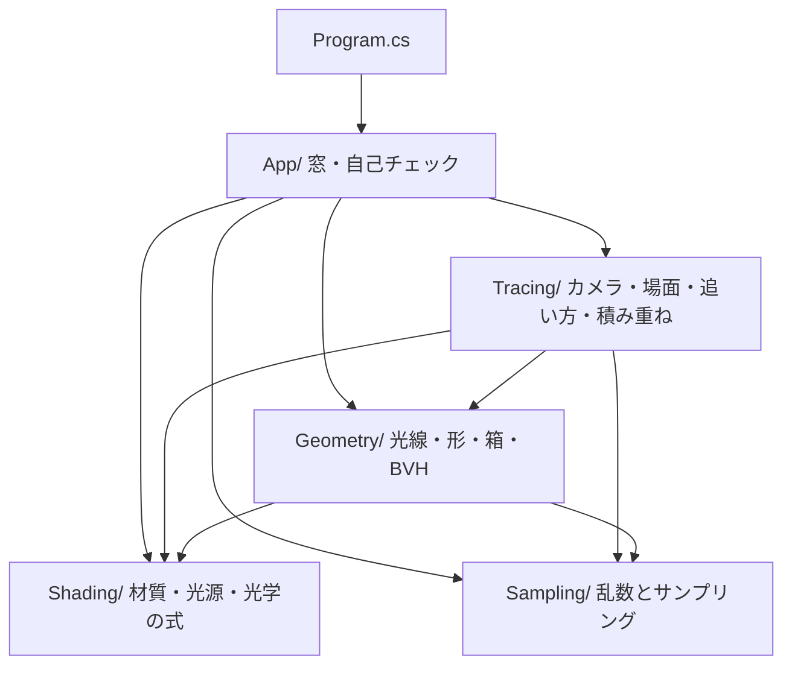
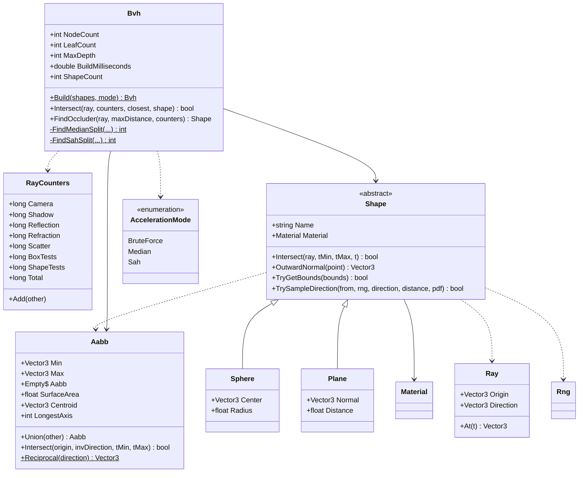
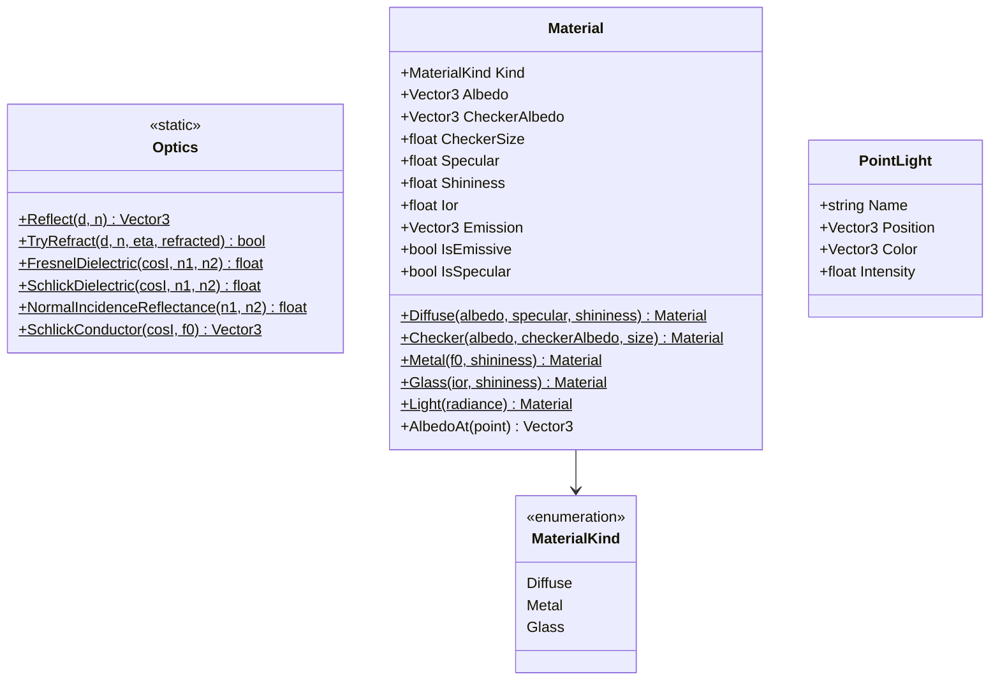
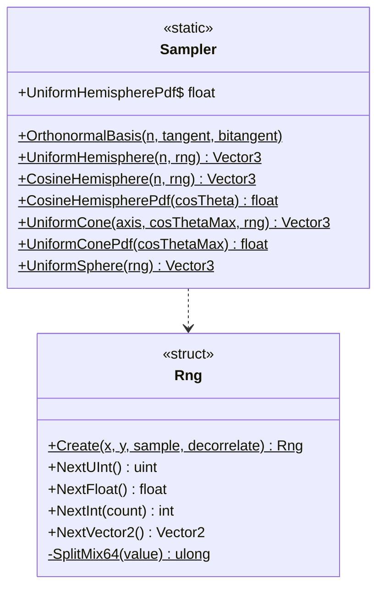
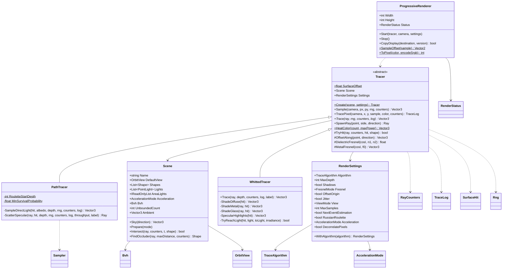
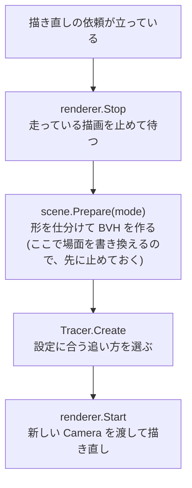
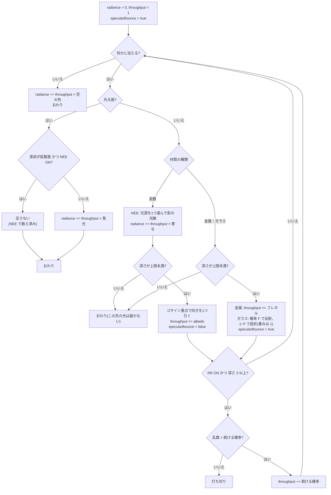
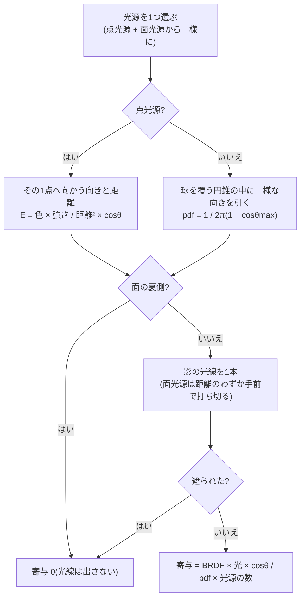

# Day 60b: CPU レイトレーサ(2) — BVH(形のほうを木に入れる)

Day 60 の2日目で、reference は Day 60a の完全コピー + 差分。
Day 60a でパストレーサができた。場面への問い合わせは Day 59 からずっと**総当たり**——光線1本につき、場面の全部の形に聞いている。
形が 11 個までなら困らなかったが、今日の場面5「球がたくさん」は**形が 466 個**あり、総当たりでは1パスが 0.4 秒かかる。

今日は形を**箱の木(BVH)**に入れて、「通らない箱の中身を丸ごと飛ばす」。これはレイトレースに固有の話ではなく、
**当たり判定・カリング・物理で同じ木が出てくる**(Day 46b のブロードフェーズは、同じ問題を「空間を区切る」側で解いたもの)。

| | 総当たり(Day 60a まで) | BVH(Day 60b) |
|---|---|---|
| 光線1本の問い合わせ | 形を全部調べる(場面5で 458 回) | 箱を辿り、通る箱の中の形だけ調べる(**箱 12.1 + 形 3.3 回**) |
| 場面5の1パス | **399 ms** | **53 ms**(SAH) |
| 無限の平面 | 全部と一緒に調べる | **箱で囲めない**ので、BVH の外で総当たり |
| 絵 | — | **1画素も変わらない**(変わったら BVH の不具合) |

**要点の番号は Day 60 の通し番号**にしてある(今日は 7〜9)。コードのコメントが「要点4」(NEE)や「要点7」(AABB)のように
Day 60 の番号で指しているため。**要点1〜6 は Day 60a の計画書**を見ること(Day 60a の要点7「ノイズとの付き合い」は、今日の要点9 に1行足したもの)。

> **今日いちばん意外だったのは、交差判定が 30 分の1 になったのに、速さは 7.5 倍にしかならなかったこと**
> 場面5の1パスが 399ms → 53ms。交差判定は 458 回 → 15.4 回なので 30 倍を期待したが、そうはならない。
> 残りの時間(乱数・散乱の向き作り・色の足し算・画素への書き込み)は BVH では減らないから(**アムダールの法則**。要点8、検証の途中で分かったこと 1)。
> 逆に、**形が 9 個しかないコーネルボックスでは BVH のほうが遅い**(76ms → 89ms)。木を辿る手間が、9 個に総当たりする手間より高い。

## 今日のゴール

**`5` で場面5「球がたくさん」を出す。`V` を3回押して「交差判定の数」の表示にし、`B` で探し方を回すと、
総当たりでは画面がほぼ真っ白(1画素に 1000 回以上)、BVH では緑〜黄になる。陰影の表示に戻すと、3つとも1画素も違わない。**

| キー | 何が起きるか |
|---|---|
| `1`〜`6` | 場面(Whitted 1980 / 屈折率と金属 / 合わせ鏡 / コーネルボックス / **球がたくさん** / ガラスの集光)。**集光は 5 から 6 へ移った** |
| `B` | 探し方(BVH(SAH) / 総当たり / BVH(中央分割))。**場面5で 1パス 53ms が 399ms になる。絵は1画素も変わらない** |
| `V` | 表示(陰影 / 法線 / 光線の数 / **交差判定の数**)。最後のが今日の目 |
| `C` | 自己チェック(**18 項目**)。`PageUp` / `PageDown` でめくる(36 行ある) |
| そのほか | Day 60a のまま(`A` `N` `U` `K` `[` `]` `S` `F` `E` `J`、右クリック、ドラッグ・ホイール・`R`、`P` `X` `H` `Esc`) |

HUD に**探し方の行**が1行増える(`探し方 BVH(SAH) (B)   形 466 個(BVH 465 / 外 1) 節点 301 深さ 9 作成 4.0ms   1光線あたり 箱 12.1 / 形 3.3 回`)。

### 今日いちばん大事な2つ

**1つ目は「空間ではなく、形のほうを木に入れる」**(要点8)。
形を箱で囲み、その箱をさらに大きな箱で囲む、を繰り返す。光線は根から辿り、**通らない箱に出会ったら中身を丸ごと飛ばす**。
空間を区切る木(kd 木・八分木。Day 46b の均一グリッドもこちら側)と違って、**どの形も必ずどれか1つの葉に入る**ので、
節点の数が形の数から決まり、配列1本に平らに詰められる。どこで割るかは、**割った後の費用を見積もって決める**(SAH)。

```
  費用(割る)   = 箱を辿る手間 + (左の箱の表面積 × 左の数 + 右の箱の表面積 × 右の数) / 親の箱の表面積
  費用(葉にする) = 形の数
```

**2つ目は「速くするための仕掛けは、答えを変えてはいけない」**(要点9)。BVH の取りこぼし(当たるはずの形を飛ばす)は、
**絵ではほとんど見えない**——ノイズの中の1画素が少し違っても誰も気づかない。だから数で確かめる。
自己チェック18 は、466 個の場面へ 2万本の光線を撃って**総当たりと1本ずつ突き合わせ、食い違い 0 件**を見ている。
分割の検証では、Day 60a(総当たり)で描いた 5 つの場面の絵と、今日の BVH で描いた絵を画素ごとに比べ、**全部 1画素も違わなかった**。

## 事前に読む資料

- [Peter Shirley ほか「Ray Tracing: The Next Week」](https://raytracing.github.io/books/RayTracingTheNextWeek.html) の
  **「Bounding Volume Hierarchies」** — 要点7・8。今日の BVH の骨組み(ただし本書は中央分割で、SAH は扱っていない)
- [同「Ray Tracing in One Weekend」](https://raytracing.github.io/books/RayTracingInOneWeekend.html) の **「A Final Render」** — 今日の場面5のもとになった絵
- [PBRT 4th edition(全文が無料で読める)](https://pbr-book.org/4ed/contents) の
  **7.3 Bounding Volume Hierarchies**(SAH の費用の式)と **6.8.2 Ray–Bounds Intersections**(スラブ法と NaN)
- [Ingo Wald ほか, "Ray Tracing Deformable Scenes using Dynamic Bounding Volume Hierarchies"(2007)](https://doi.org/10.1145/1276377.1276406)
  — 要点8。BVH をどう作るか(SAH、ビン化)と、**動く形のために木を作り直さず箱だけ直す**話(改造課題3)
- **Day 53 の計画書**(ライトカリング)・**Day 46b の計画書**(ブロードフェーズの均一グリッド) — 空間を区切る話の比較対象
- **Day 60a の計画書** — 要点1〜6(レンダリング方程式・モンテカルロ積分・重点サンプリング・NEE・ロシアンルーレット・乱数)

## 理論の要点

### 7. AABB とスラブ法 — 箱に当たるかを掛け算だけで

BVH の箱は**軸に平行な直方体**(AABB)にする。ぴったり囲むことより、**1回の判定が安いこと**が効くから
(光線1本につき十数回も聞く)。

箱を「3対の平行な板(スラブ)の重なり」と見て、軸ごとに**板に入る t と出る t** を求め、
3軸ぶんの「入る」のいちばん遅いものと「出る」のいちばん早いものを比べる。

```csharp
// Aabb.Slab。**MathF.Min / MathF.Max ではなく比較で書いてある**のが肝
float t0 = (low - origin) * invDirection;
float t1 = (high - origin) * invDirection;
if (t0 > t1) { (t0, t1) = (t1, t0); }
if (t0 > enter) { enter = t0; }      // NaN なら false → その軸の制約を無視する
if (t1 < exit) { exit = t1; }
```

割り算ではなく `invDirection`(向きの逆数)を光線1本につき1回だけ作って掛ける。向きの成分が 0 なら ±∞ になるが、それでよい。

**踏む罠**: 光線が板と平行(`invDirection` が ±∞)で、しかも**始点がちょうど板の上**にあると `0 × ∞ = NaN` が出る。
`MathF.Max(NaN, x)` は NaN を返すので、素朴に書くと `enter` が NaN になり、最後の `enter <= exit` が false ——
**箱の中にいるのに「外れ」**になる。比較で書けば NaN との比較は全部 false なので、その軸を無視することになり答えが正しくなる
(PBRT と同じ書き方。自己チェック17 が、Min/Max 版だと外れることまで確かめている)。

**無限の平面は箱で囲めない**。巨大な箱で囲むことはできるが、その箱は場面の全部と重なるので、
BVH のどの枝を辿っても必ず葉まで降りることになり、木の意味が無くなる。
だから `Shape.TryGetBounds` が false を返す形は BVH に入れず、毎回総当たりで聞く(今日の場面ではせいぜい6枚)。

### 8. BVH — 形のほうを木に入れる

形を箱で囲み、その箱をさらに大きな箱で囲む、を繰り返した木。光線は根から辿り、**通らない箱に出会ったら中身を丸ごと飛ばす**。

「空間を区切る」方法(BSP・kd 木・八分木。Day 53 のライトカリングもこちら側)と違い、BVH は**形のほうを木に入れる**。

| | 空間を区切る | **BVH** |
|---|---|---|
| 境目にまたがる形 | 複数の区画に**重複して**入る | **必ずどれか1つの葉**に入る |
| 兄弟の領域 | 重ならない | **重なってよい**(そのぶん両方の子を見ることがある) |
| 節点の数 | 事前に読めない | **形の数から決まる**(葉が最大 N、内側が N−1)ので配列で確保できる |

木は**配列1本**に平らに詰める。**左の子は必ず自分の次**に置く決まりにすると、節点が覚えるのは右の子の番号だけでよい。

**どこで割るか**の決め方を2つ入れてある(`B` キー)。

- **中央分割** … いちばん長い軸で、重心の中央値で半分ずつ。作るのは速いが**形の疎密を見ていない**
- **SAH**(表面積ヒューリスティック) … 割った後の費用を見積もって、いちばん安い割り方を選ぶ

```
  費用(割る)   = 箱を辿る手間 + (左の箱の表面積 × 左の数 + 右の箱の表面積 × 右の数) / 親の箱の表面積
  費用(葉にする) = 形の数
```

「でたらめな光線が子の箱に入る確率は、表面積の比」という見積もりに基づく(凸な立体に対する Cauchy の公式)。
**葉にするほうが安ければ割らない**ので、木の深さも自動で決まる。

場面5(形 466 個、うち BVH に入るのは 465 個。無限の床だけが外)での実測:

| 探し方 | 1パス | 1光線あたりの交差判定 | 節点(葉)深さ | 作成 |
|---|---|---|---|---|
| 総当たり | **399 ms** | 形 458.0 回 | — | — |
| BVH(中央分割) | **63 ms** | 箱 14.1 + 形 4.4 = 18.4 回 | 255(128)深さ 8 | 3.6 ms |
| BVH(SAH) | **53 ms** | 箱 12.1 + 形 3.3 = **15.4 回** | 301(151)深さ 9 | 4.0 ms |

**交差判定は 30 分の1 になったのに、全体は 7.5 倍にしかならない**。これがアムダールの法則で、
残りの時間(乱数・散乱の向き作り・色の足し算・画素への書き込み)は BVH では減らないから。
「30 倍速くなるはず」と思って測ると必ずこの差に出会う。

**形が少ないと BVH は損**。場面4(形 9 個、うち BVH に入るのは球 3 個)では **76 ms → 89 ms** と遅くなる。
木を辿る手間が、9 個に総当たりする手間より高い。

### 9. ノイズとの付き合い — 何で正しさを確かめるか

パストレーシングの絵は**常に間違っている**(サンプルが有限なので)。だから「絵を見て正しそう」は根拠にならない。
(Day 60a の要点7 と同じ表に、今日の1行「BVH と総当たりが完全一致」を足したもの。)
今日の自己チェックで使った、**答えが解析的に分かっている入力**を並べておく。

| 確かめ方 | 何が捕まるか |
|---|---|
| **白い炉**(反射率 1 の面を一様な明るさの空に置く) | BRDF × cos / pdf の打ち消しのずれ。**1本ごとに厳密に一致**するので最強 |
| **既知の積分**(∫cos²θ dω = 2π/3) | サンプリングと pdf の食い違い。1/√N の確認も同時にできる |
| **深さ 0 で Whitted と一致** | NEE の式(BRDF・逆2乗則・cos)が Day 59 と同じか |
| **NEE あり/なしで同じ平均** | 2重に数えていないか、pdf の割り忘れが無いか |
| **RR あり/なしで同じ平均** | 打ち切りの補正(1/q)が正しいか |
| **BVH と総当たりが完全一致** | 箱の取りこぼし。**絵ではほとんど見えない**ので数で見るしかない |

ノイズの量そのものも測れる。自己チェック16 では **1画素の平均の標準誤差(σ/√N)を全画素で平均**した値を使っている。
サンプル数が違う設定どうしを比べられるよう、1サンプルあたりに揃えてある。NEE を入れると **0.32 倍**。

**firefly**(たまに1画素だけ極端に明るい点)は、確率の小さい経路が大きな重みで当たったときに出る。
不偏だが目に付くので、実務ではクランプ(ある値を超えた寄与を切る)で潰すことが多い——ただしそれは**偏り**を入れる(Day 60a の改造課題3)。

### 10. 今日入れなかったもの

| 入れなかったもの | 何が起きるか | どこでやるか |
|---|---|---|
| 動く形のための木の更新 | 形が動いたら `Scene.Prepare` で木を丸ごと作り直す(場面5で 4ms)。毎フレーム動かすなら重い | 改造課題3(木の形はそのままで、箱だけを下から直す「refit」) |
| ビン化した SAH | SAH は割る候補を全部試している(重心で並べ替えて、すべての境目の費用を出す)。形が数万個になると作るのが遅い | 候補を十数個の区間(ビン)に丸める(Wald 2007) |
| 近い子の順に辿る工夫を影の光線にも | `FindOccluder` は左の子から辿るだけ | 改造課題2(なぜ要らないのかを考える) |
| BVH を作って辿る仕事を GPU に任せる | 今日は CPU が木を作り、CPU が辿る | Day 61(同じ木を配列のまま GPU へ送って辿る)・Day 62b(加速構造 BLAS/TLAS。作るのも辿るのもドライバと RT コアが肩代わりする) |

## 前Dayからの差分概要

### 新規ファイル

| ファイル | 行数(うちコード) | 役割 |
|---|---|---|
| `Geometry/Aabb.cs` | 152(71) | AABB と**スラブ法**(要点7)。NaN を無視する書き方 |
| `Geometry/Bvh.cs` | 448(278) | `AccelerationMode` と **BVH**(中央分割 / SAH の構築、スタックで辿る走査)(要点7・8) |

### 変更ファイル

| ファイル | 差分 | 何をした |
|---|---|---|
| `Geometry/Shape.cs` | +15 −3 | `TryGetBounds`(BVH 用の外接箱)を追加 |
| `Geometry/Sphere.cs` | +8 −0 | `TryGetBounds` を実装(中心から半径ぶん広げるだけ) |
| `Geometry/Plane.cs` | +10 −0 | `TryGetBounds` は false(無限は囲めない) |
| `Geometry/RayCounters.cs` | +12 −3 | 箱と形の判定の回数(`BoxTests` / `ShapeTests`)を追加。置き場所の理由が「BVH も数える」に変わった |
| `Tracing/Scene.cs` | +55 −13 | `Prepare(mode)`(形を仕分けて BVH を作る)、問い合わせに `RayCounters` |
| `Tracing/RenderSettings.cs` | +9 −0 | 探し方(`Acceleration`)と `ViewMode.Cost` |
| `Tracing/Tracer.cs` | +21 −9 | 交差判定の数の表示。`TryHit` に `RayCounters` を渡す |
| `Tracing/WhittedTracer.cs` / `PathTracer.cs` | +4 −3 / +5 −5 | 場面への問い合わせに `RayCounters` を渡すだけ。場面の番号(集光は 6) |
| `Tracing/SceneLibrary.cs` | +99 −6 | 場面5「球がたくさん」。集光は場面6へ |
| `App/SelfCheck.cs` | +146 −13 | 項目 17・18 を追加(要点7・8)。`Prepare` に探し方を渡す |
| `App/ViewerWindow.cs` | +46 −8 | `B` キー、探し方の行、交差判定の数の表示、場面 1〜6 |
| `Program.cs` | +4 −0 | コメントだけ(後半の BVH の説明) |

**Day 60a のコードに入った手直しは、ほぼ全部「問い合わせに `RayCounters` を渡す」**(差分の −63 行の大半)。
BVH が箱と形を何回調べたかを数えるので、`Scene.Intersect` と `FindOccluder` が `ref RayCounters` を受け取るようになり、
それを呼ぶ `Tracer.TryHit`・`WhittedTracer`・`PathTracer`・自己チェックが1行ずつ変わる。**追い方の中身は1行も変わっていない**。

### 写経する順番

1. **`Geometry/Aabb.cs`** — 新規。どこにも依存しない。要点7
2. **`Geometry/Shape.cs`** — `TryGetBounds` を足す(1 を使う)。
   **抽象メソッドが増えるので、3・4 を写すまで `Sphere` と `Plane` がエラーになる**
3. **`Geometry/Sphere.cs`** — 2 を実装
4. **`Geometry/Plane.cs`** — 2 を false で実装(無限は囲めない)
   — **ここまでは足すだけなので、4 を写し終えるとビルドが通る**
5. **`Geometry/RayCounters.cs`** — `BoxTests` / `ShapeTests` を足す
6. **`Geometry/Bvh.cs`** — 新規。1・2・5 を使う。要点7・8。**今日いちばん長い(278 行)**
7. **`Tracing/Scene.cs`** — 5・6 を使う。`Prepare(mode)` / 問い合わせの引数。**ここから 13 までビルドは通らない**(呼ぶ側の引数が足りない)
8. **`Tracing/RenderSettings.cs`** — 6(`AccelerationMode`)を使う。つまみの追加
9. **`Tracing/Tracer.cs`** — 交差判定の数の表示と、`TryHit` の引数
10. **`Tracing/WhittedTracer.cs`** / **`Tracing/PathTracer.cs`** — 問い合わせの引数(1行ずつ)
11. **`Tracing/SceneLibrary.cs`** — 場面5「球がたくさん」。集光を 6 へ
12. **`App/SelfCheck.cs`** — 項目 17・18。`Prepare` の引数
13. **`App/ViewerWindow.cs`** — `B` キーと探し方の行 — **ここでビルドが戻る**
14. **`Program.cs`** — コメントのみ

**区切るなら 4 まで**(足すだけで、ビルドが通る状態で止められる)。
6(`Bvh.cs`)は要点7・8 を読んだあとで写すと、`FindSahSplit` の掃引がそのまま SAH の式に見える。

## 設計書

**Day 60a の設計書に差分を当てたもの**。変わったのは2か所。

- **`Geometry/` に `Aabb` と `Bvh` が増えた**(`Shape` に `TryGetBounds`、`RayCounters` に箱と形の判定の回数)
- **`Scene` が形を2つに仕分けるようになった**(囲める形は BVH へ、囲めない形は総当たりのまま)

変わった図は次の4つ。

| 図 | 何が変わったか |
|---|---|
| 全体構成と依存の向き | `Geometry/` が「光線・形・箱・BVH」になった。**`RayCounters` を `Geometry/` に置いた理由**が「BVH も数えるから」に変わった |
| `Geometry` のクラス図 | `Aabb` / `Bvh` / `AccelerationMode` が増えた。`Shape` に `TryGetBounds`、`RayCounters` に `BoxTests` / `ShapeTests` |
| `Tracing` のクラス図 | `Scene` に `Acceleration` / `Bvh` / `UnboundedCount`、問い合わせに `counters`。`RenderSettings` に `Acceleration` |
| 1フレームの流れ | `scene.Prepare(mode)` が BVH を作る |

以下は Day 60 の設計書の全体(**要点1〜6 は Day 60a の計画書、7〜9 は今日の計画書**の番号)。

### 全体構成と依存の向き



| 層 | 知っている層 | 知らない層 | 中身 |
|---|---|---|---|
| `Sampling/` | **どこも知らない** | 形・材質・場面・窓 | `Rng` / `Sampler` |
| `Shading/` | **どこも知らない** | 形・場面・窓 | `Material` / `MaterialKind` / `PointLight` / `Optics` |
| `Geometry/` | Shading・Sampling | 場面・窓 | `Ray` / `RayCounters` / `Shape` / `Sphere` / `Plane` / `Aabb` / `Bvh` / `AccelerationMode` |
| `Tracing/` | Geometry・Shading・Sampling | **窓(WinForms)** | `OrbitView` / `Camera` / `Scene` / `SceneLibrary` / `RenderSettings` ほか設定の enum / **`Tracer`** / `WhittedTracer` / **`PathTracer`** / `TraceLog` / `SurfaceHit` / `ProgressiveRenderer` / `RenderStatus` |
| `App/` | 全部 | — | `ViewerWindow` / `SelfCheck` |

**循環参照は無い**(コメントを落として型名を拾い、確かめた)。`Tracing/` が WinForms を知らないのも Day 59 のまま
(そのおかげで、検証では窓を開かないコンソールのプログラムから `Tracing/` を呼んで 6 つの場面を PNG にできた)。

**`RayCounters` を `Geometry/` へ移した理由**がこの節でいちばん大事なところ。
Day 60 で `Bvh` が「箱を何回見たか」「形を何回調べたか」を数えるようになり、`Geometry/` からも `RayCounters` を使うことになった。
Day 59 の場所(`Tracing/WhittedTracer.cs`)のままだと **`Geometry → Tracing → Geometry` の循環**ができる。
数えているのは「光線」と「交差判定」で、どちらも `Geometry/` の言葉——カメラ・影・反射といった**名前**を付けているのが `Tracing/` 側、という切り分けにした。

`Sampling/` がどこにも依存しないのも意図してある。`Optics` と同じく `Vector3` と `float` だけの式なので、**Day 61 で GLSL へそのまま写す**。

### Geometry — 光線・形・箱・BVH



`Shape` に増えた2つは性格が違う。

- **`TryGetBounds`** … 抽象メソッド。**全部の形が答えなければならない**(「囲めない」と答えるのも答えのうち)
- **`TrySampleDirection`** … 既定で false を返す仮想メソッド。**球だけが実装している**。
  平面は無限に広いので、その上に一様な点を引くこと自体ができない

`Bvh` の節点を「葉か内側か」で分けず、**`Count` が 0 かどうかで見分ける**(葉は `Index` が形の開始位置、内側は右の子の番号)。
1つの構造体に詰めることでキャッシュに載りやすくなる。**左の子は必ず自分の次**という決まりも同じ狙い。

### Shading — 材質・光源・光学の式



`Material` に**光源の種類を足さなかった**のがここの判断。「面光源」は種類ではなく、**拡散面が `Emission` を持っているだけ**。
こうしておくと「光りながら反射もする面」が自然に書ける(今日は使っていない。`Light()` は albedo 0 で作る)。

`IsSpecular` を材質に持たせたのは、`PathTracer` が**2か所で同じ判定をする**から——
NEE でつなげるか(つなげない)と、光源に当たったときに数えるか(数える)。

### Sampling — 乱数とサンプリング



**サンプリングの関数と pdf の関数を必ず対で書く**のが、この2つのクラスの約束。
片方だけ直すと絵が一様に明るく(暗く)なり、見た目には壊れて見えないので、自己チェック12・13 が対応を数で確かめている。

`Rng` を `struct` にしてあるのは、画素ごとに作るから(1パスで 50 万個)。`ref` で持ち回る。

### Tracing — カメラ・場面・追い方・積み重ね



(`OrbitView` / `Camera` / `SceneLibrary` / `RenderStatus` / `TraceLog` / `SurfaceHit` / `FresnelMode` / `ViewMode` は Day 59 の設計書のまま。
`SurfaceHit` に `Distance` が1つ増えただけ。)

**`Tracer` を親に立てたのが今日の構造の変更点**。Day 59 の設計書で「歪み2」として挙げたとおり、
`WhittedTracer` が「追い方」と「表示の切り替え」と「1画素の記録」を1つのクラスで抱えていた。パストレーサを足すとそこが丸ごと重複する。

| どこに置いたか | 中身 | なぜ |
|---|---|---|
| `Tracer`(親) | `Sample`(表示の切り替え)/ `TracePixel` / `TryHit` / `SpawnRay` / フレネルの切り替え / `HeatColor` | **追い方によらず同じ**。法線の裏返しや始点の浮かせ方まで両方で同じでないと、比べる意味が無くなる |
| `WhittedTracer` | 木を追う `Trace`(再帰) | Day 59 のまま |
| `PathTracer` | 道を歩く `Trace`(ループ)/ NEE / 鏡面の選択 | 今日の主役 |

**`ProgressiveRenderer` が `Tracer` を引数で受け取るようになった**のが歪み3の解消(Day 59 は中で `new WhittedTracer` していた)。
どちらで描くかを決めるのは `Tracer.Create` 1か所だけになり、`ProgressiveRenderer` は「受け取った1つを回す」だけになった。

**`Scene.Prepare` が場面を書き換える**のは、この設計で唯一きれいでないところ。
場面は描画中「変わらないもの」として全スレッドで共有するので、`ViewerWindow.Restart` は
**`_renderer.Stop()` してから `Prepare` を呼ぶ**という約束で守っている(下の「今日残した歪み」の2つ目)。

### App — 窓と自己チェック

Day 59 から、`ViewerWindow` に**下の欄のページめくり**(`_panelScroll`)と、追い方を切り替える `Tracer.Create` が増えただけ。
クラス図は Day 59 の設計書のまま(`WhittedTracer` への点線が `Tracer` への点線になる)。

### 1フレームの流れ

Day 59 から変更なし。UI スレッドは光線を1本も追わず、描き直しの依頼をフラグにして**ループの頭で1フレームに1回だけ**やり直す。
1つだけ増えたのが `Restart` の中身。



### 1本の道を歩くまで — PathTracer.Trace の中身

Day 59 の「1本の光線を追うまで」に対応する図。**枝が1本も分かれない**のが Whitted 法との違い。



**`specularBounce` の扱いが要**(要点4)。カメラの光線を「鏡面の後」と同じ扱いにしているのは、
そうしないと**光源を直接見ているのに光らない**から。

### NEE の中身



最後の「× 光源の数」が、**1つだけ選んだぶんの割り戻し**。全部の光源につなぐと影の光線が光源の数だけ要るが、
1つを 1/N の確率で選んで N 倍すれば平均は同じで光線は1本で済む——これも要点2の同じ手口。

### 今日残した歪み(3つ)

**1. 形が材質を参照で持っている**(`Geometry` → `Shading`)。Day 59 から持ち越し。
**Day 61 で GPU に移すと参照が持てない**ので、形の配列と材質の配列を分け、形には「材質の番号」を持たせることになる。
そのとき `Geometry` から `Shading` への矢印が消える。直すのは Day 61。

**2. `Scene.Prepare` が場面を書き換える**。BVH を作り直すのに、不変のはずの `Scene` を後から書き換えている。
いまは「`ViewerWindow.Restart` が `Stop()` してから呼ぶ」という**約束**でしか守られておらず、型では守られていない。
`Scene` を「形の一覧」と「探し方を組んだ結果」の2つに分ければ型で守れるが、Day 61 で場面を GPU のバッファへ送る形に作り直すので、そこでまとめて直す。

**3. `PathTracer` が拡散面と鏡面を `switch` で分けている**。RTIOW のように材質ごとに「散らし方」を仮想関数にすれば
`PathTracer` はもっと短くなる。それをしないのは Day 59 と同じ理由(GPU には仮想関数が無い)だが、
**ざらざらした金属(GGX)を足そうとすると、この `switch` が破綻する**——鏡面と拡散の中間が要るので。
今日の形のままで足すなら、`Material` に「散らし方」を表す小さな構造体を持たせることになる(改造課題ではない。Day 61 の GPU 版で向き合う)。

## 完成条件

`dotnet run --project reference/Day60b -c Release` で起動する(**Debug は使わない**)。起動時の場面は Day 60a と同じコーネルボックス。

### 1. `5`: 場面5「球がたくさん」と `B`(BVH)

小さな玉が 465 個並ぶ。空(と点光源1つ)で照らしているので、影が上から柔らかく落ちる。

`V` を3回押して**交差判定の数**の表示にしてから、`B` で探し方を回す。

| 探し方 | 1パス | 1光線あたり | 交差判定の数の絵 |
|---|---|---|---|
| BVH(SAH) | **0.053 秒** | 箱 12.1 / 形 3.3 回 | 緑〜黄 |
| 総当たり | **0.399 秒** | 箱 0.0 / **形 458.1 回** | **ほぼ真っ白**(1000 回以上の色) |
| BVH(中央分割) | 0.063 秒 | 箱 14.1 / 形 4.4 回 | SAH よりわずかに黄が多い |

(1パスは窓を開かないハーネスでの実測。窓の HUD では 1〜1.4 倍遅く出る——UI スレッドが1コア使うので)

**陰影の表示に戻すと、3つとも1画素も違わない絵になる**(検証で画素を1つずつ突き合わせて確かめた。差 0.0%)。
BVH は「速くするための仕掛け」であって、答えを変えてはいけない——それが目で確かめられる。

HUD の `探し方` の行に、節点の数(SAH は 301、葉 151、深さ 9)と作成にかかった時間(4.0ms)も出る。
**`形 466 個(BVH 465 / 外 1)` の「外 1」が無限の床**。箱で囲めないので BVH に入らない(要点7)。

### 2. 場面4で `V` と `B` — 形が少ないと BVH は損

`4` でコーネルボックスに戻り、`V` で交差判定の数を出す。**床と壁(BVH に入らない平面6枚)がどこも同じ色**になり、玉のあたりだけ少し高い。
HUD の探し方の行は `形 9 個(BVH 3 / 外 6)`。BVH に入るのは球 3 個だけ。

`B` で総当たりにすると、1パスは **89 ms → 76 ms と速くなる**(要点8)。木を辿る手間が、9 個に総当たりする手間より高い。

### 3. `6`: 場面6「ガラスの集光」

Day 60a の場面5 が、番号だけ 6 に移った。絵は Day 60a と同じ(ガラス玉の影の真ん中の明るい点と、その周りのひどいノイズ)。

### 4. `C`: 自己チェック(18 項目すべて合格、1.8 秒)

1〜16 は Day 60a のまま。17・18 が今日ぶん。`PageUp` / `PageDown` でめくる。

```
自己チェック: 18 項目中 18 項目 OK
OK  17. AABB のスラブ法(一辺 2 の箱)。正面 当たり / 中から 当たり / 後ろ 外れ / 1mm 内 当たり / 1mm 外 外れ / tMax 3.9 外れ
        板の上を板と平行に進む光線(0 かける無限大 = NaN): 当たり。Min/Max で書くと 外れ / 箱の外を平行に: 外れ
OK  18. BVH と総当たりが一致(形 466 個の場面へ 20000 本。当たり 15948 本、食い違い 0 件)
        1本あたりの交差判定: 総当たり 466.0 → 中央分割 18.3(25.5 分の1)→ SAH 14.9(31.3 分の1)/ 節点 中央分割 255 深さ 8 / SAH 301 深さ 9
```

17 は、スラブ法の「板の上を板と平行に進む光線」で `0 × ∞ = NaN` が出たとき、**比較で書けば正しく当たり、Min/Max で書くと外れる**ことまで確かめている(要点7)。
18 は、466 個の場面へ 2万本を撃って、**総当たりと BVH の答え(当たる形と距離)が1本残らず一致する**ことを見ている。
BVH の取りこぼしは絵ではほとんど見えないので、ここで捕まえるしかない(要点9)。

### 5. Day 60a の絵と機能が1つも壊れていない

場面1〜4 と集光(Day 60a の場面5、今日の場面6)を、Day 60a(総当たり)と今日(BVH(SAH))で同じサンプル数ずつ描いて画素ごとに比べ、
**違う画素は 0**(検証の途中で分かったこと 3)。`A` `N` `U` `K` `[` `]` と右クリックは Day 60a のまま効く。

## 検証の途中で分かったこと

**1. BVH で交差判定が 30 分の1 になったのに、速さは 7.5 倍にしかならなかった**(今日の冒頭の話)。
場面5の1パスが 399ms → 53ms。交差判定は 458 回 → 15.4 回なので 30 倍を期待したが、そうはならない。
残りの時間(乱数・散乱の向き作り・色の足し算・画素への書き込み)は BVH では減らないから(アムダールの法則)。要点8の表にした。

**2. 形が 9 個しかない場面では、BVH のほうが遅かった**。場面4(コーネルボックス)で 76ms → 89ms。
木を辿る手間が、9 個に総当たりする手間より高い。BVH を「常に入れるもの」と思っていると見落とす。

**3. Day 60a(総当たり)と Day 60b(BVH)の絵は、1画素も違わなかった**。Day 60 を2日に分けたときの確かめ。
窓を開かないハーネスで、場面1〜3(256 サンプル)・場面4 と集光(512 サンプル)・Whitted 法の場面4 と集光(64 サンプル)を両方で描き、
PNG を画素ごとに比べて**違う画素 0**。乱数を (画素, サンプル番号) から作り直す形(Day 60a の要点6)なので、
同じ光線が同じ形に当たれば同じ道を歩く——探し方を変えても1ビットも変わらないのは、この作り方のおかげでもある。

## 改造課題

### 課題1(易): 葉の大きさと木の形

`Bvh.MaxShapesPerLeaf`(既定 4)と `Bvh.TraversalCost`(既定 0.125)を変えて、場面5で測る。

1. `MaxShapesPerLeaf` を 1 / 2 / 8 / 16 にして、HUD の「節点」「深さ」「1光線あたり 箱 / 形」「1パス」を記録する
2. **箱の判定と形の判定は、どちらを減らすと速いか**。1 にすると形の判定は減るのに遅くなるのはなぜか
3. `TraversalCost` を 0.01 / 1.0 にすると木の形がどう変わるか(SAH のときだけ効く)
4. 中央分割(`B` で切り替え)では 1・3 の結果がどう違うか

SAH の費用の式が「箱を辿る手間」と「形を調べる手間」の比を入力に持っていることが、数字で分かる。
**表を作って、いちばん速い組み合わせを探す**のが目的。

### 課題2(中): 近い子から辿るのをやめてみる

`Bvh.Intersect` は、光線の向きの符号と節点を割った軸から**手前の子を先に辿る**(`rightFirst`)。
これを外して、いつも左の子から辿るようにするとどうなるか。

1. `rightFirst` を常に false にして、場面5で「1光線あたり 箱 / 形」と「1パス」を測る
2. 絵が変わらないことを確かめる(変わったら、それは別のバグ)
3. `FindOccluder` のほうには、はじめからこの工夫を入れていない。**なぜ入れなくてよいのか**を説明する
4. 余力があれば、節点に「入る t」も積んで、**スタックから取り出したときに `closest` より遠ければ捨てる**ようにしてみる

手前から辿ると `closest` が早く縮み、奥の箱は入る前に捨てられる。
「答えが同じで速さだけ変わる工夫」がどれだけ効くかを測る練習で、3 が分かれば影の光線の性質(Day 59 の要点3)も押さえられている。

### 課題3(難): 動く玉のために、木を作り直さず箱だけ直す(refit)

場面5の玉を毎フレーム少しずつ動かす(例えば、小さな玉を上下に揺らす)。素直には毎回 `Scene.Prepare` で木を作り直すが、
作るのに 4ms かかり、描画の途中では書き換えられない(設計書「今日残した歪み」の2つ目)。

1. `Bvh` に `Refit()` を足す。**木の形(どの形がどの葉に入るか)はそのまま**で、葉の箱を形の今の外接箱から作り直し、
   内側の節点の箱を子の箱の和で作り直す。「左の子は必ず自分の次」の並びなので、**配列を後ろから1回なめれば子が先に直る**
2. 玉を動かしたあと、作り直した木と refit した木で**当たりが一致する**ことを自己チェック18 と同じ突き合わせで確かめる(一致しなければ、箱の直し漏れ)
3. 玉を大きく動かしていくと、refit した木の「1光線あたり 箱 / 形」がじわじわ増える。**なぜ増えるのか**(兄弟の箱の重なり)を説明し、
   何フレームかに1回だけ作り直す、という折衷を試す

物理のブロードフェーズ(Day 46b)で毎ステップ格子を組み直していたのと同じ問題で、ゲームエンジンの BVH(当たり判定やカリング)は
ほぼ必ずこの「refit と時々の作り直し」を持っている。
