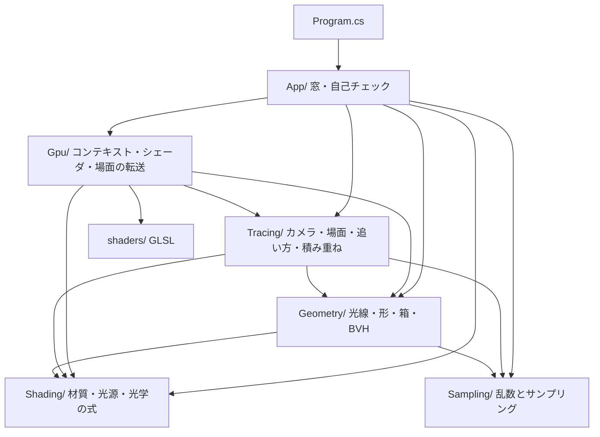
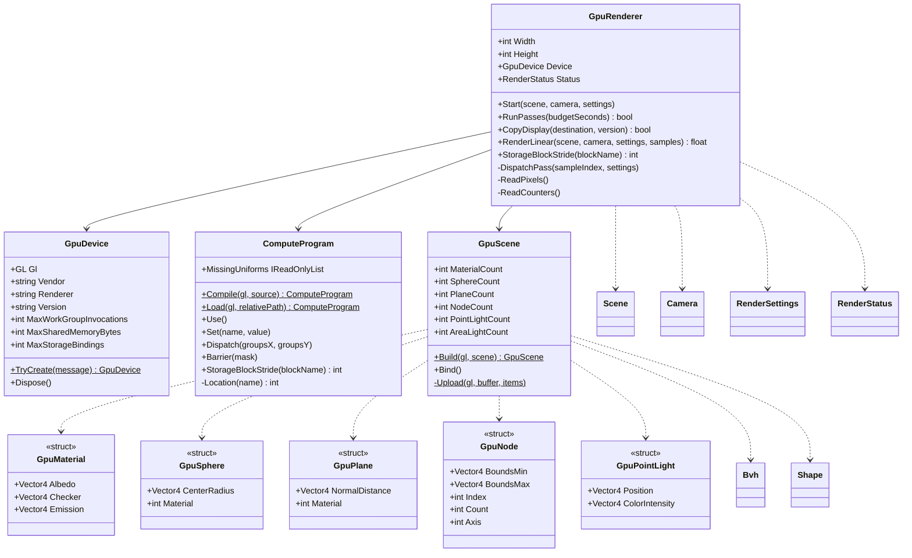
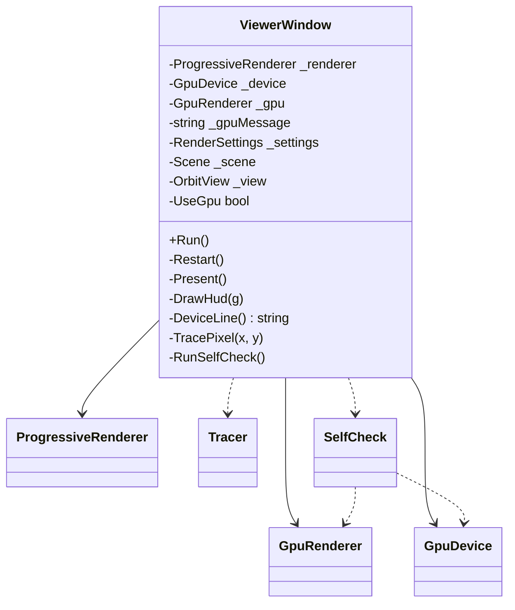
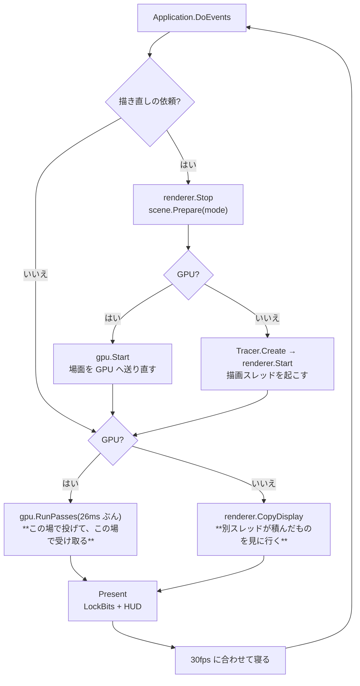
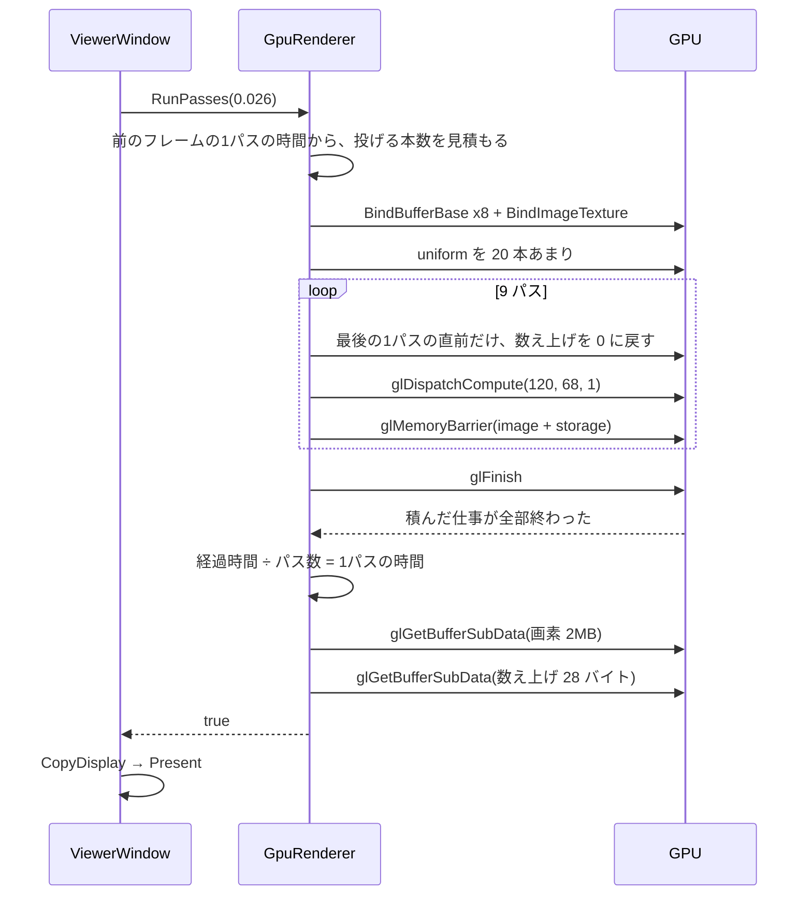
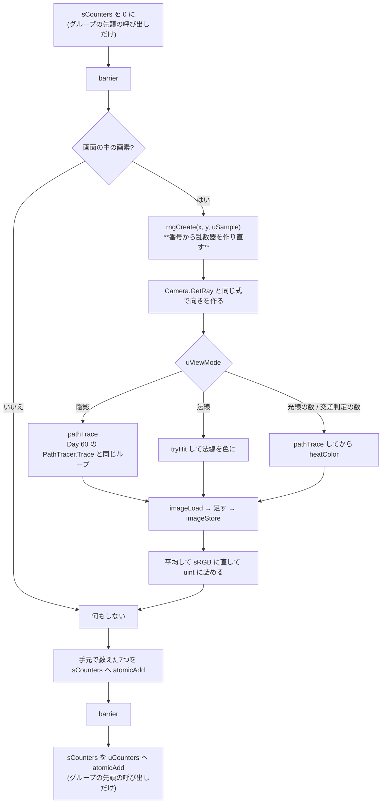

# Day 61: GPU パストレーサ化 — Day 60 をコンピュートシェーダに移す

**教養編の5日目**。Day 60 の `CpuRayTracer` の続きで、reference は Day 60b の完全コピー + 差分。
ついに GPU を使う——ただし**絵を描かせるためではなく、計算させるため**に。

今日やることは1つだけ。**Day 60 で書いたパストレーサを、式を1行も変えずに GLSL へ写す**。
場面も、つまみも、画面に出す道筋も Day 60 のまま。`G` キーで CPU 版と GPU 版を行き来して、
**同じ絵が 15〜30 倍の速さで出る**のを見る。

| | CPU(Day 60) | GPU(Day 61) |
|---|---|---|
| 1画素を担当するのは | `Parallel.For` が配った**行**の中の for ループ | **1回の呼び出し**(invocation)。行も for も無い |
| 同時に動く数 | 11 スレッド | **数万**(いまの GPU なら、走っている状態の呼び出しが数万本) |
| 誰が仕事を回すか | 描画スレッドが黙々と積む | **UI スレッドが投げる**。GPU が勝手に進める |
| 場面の持ち方 | `Shape` が `Material` を**参照**で持つ | 形の配列と材質の配列を分け、**番号**でつなぐ |
| 乱数 | 64 ビット PCG | **32 ビット PCG**(GLSL に 64 ビット整数が無い) |
| 1画素を追う(右クリック) | 木を文字列で記録できる | **できない**(文字列も例外も無い)。CPU に残す |
| 場面4の1パス | **86.4 ms** | **2.90 ms** |
| 4096 サンプル | **5.9 分** | **20 秒** |

今日の差分は**新規 5 ファイル**(1,983 行、うちコード 1,298 行。**うち GLSL が 1,008 行**)と
**変更 8 ファイル**(+617 / −85 行)。

> **今日いちばん厄介だったのは、CPU と GPU の絵が「合っているのに合っていない」状態**
> 平均の明るさは小数第4位まで一致し、収束した絵も見分けがつかないのに、
> **1サンプル目を1画素ずつ突き合わせると 96% がずれていた**(自己チェック20)。
> 原因は `-0.0`。C# の `MathF.CopySign(1, -0.0f)` は **−1** を返すが、GLSL で素直に書いた
> `n.z >= 0.0 ? 1.0 : -1.0` は `-0.0 >= 0.0` が true なので **+1** を返す。
> コーネルボックスの横の壁を内側から見たときの法線がちょうど `(-1, -0.0, -0.0)` で、
> **CPU と GPU が別の正規直交基底を作り、散る向きが丸ごと変わっていた**。
> どちらの基底も正しいので、**平均は合う。合わないのは1本ごとの道だけ**。
> 「絵が合っているから移植できている」がいかに当てにならないかが、この1文字で分かる(検証1)。

## 今日のゴール

**起動すると Day 60 とまったく同じコーネルボックスが出る。ただし 1パスが 86ms ではなく 2.9ms で、
20 秒待たずに 4096 サンプルまで積み終わって止まる。HUD の「計算」の行に GPU の機種名が出ている。
`G` を押すと同じ絵のまま CPU に戻り、ノイズの減り方が目に見えて遅くなる。**

| キー | 何が起きるか |
|---|---|
| `G` | **計算する場所(GPU / CPU)。今日の目** |
| `1`〜`6` | 場面(Day 60 と同じ6つ) |
| `A` | 追い方(パストレーシング / Whitted)。**Whitted は GPU に無い**ので、押すと CPU に落ちる |
| `B` | 探し方(BVH(SAH) / 総当たり / BVH(中央分割))。**GPU でも 458 回 → 15.4 回に減る** |
| `N` `U` `K` `[` `]` `S` `F` `E` `J` `V` | Day 60 のまま。**GPU 側も同じ uniform で効く** |
| 右クリック | 1画素を追う。**GPU モードでも CPU が追う**(GLSL から文字列は返せない) |
| 左ドラッグ / ホイール / `R` | カメラを回す / 寄る / 戻す |
| `C` / `P` / `X` / `H` / `PageUp` / `PageDown` / `Esc` | 自己チェック(**23 項目**)/ PNG 保存 / 下の欄を消す / 文字を消す / めくる / 終了 |

### 今日いちばん大事な3つ

**1つ目は「レイトレーサは GPU に載せやすい」**。Day 60 の `ProgressiveRenderer` の説明に
「画素どうしが互いを見ないので、どう分けても答えが変わらず、鍵(lock)も要らない」と書いた。
**その性質がそのままコンピュートシェーダの実行モデル**になっている(要点1)。
`Parallel.For` で行を配っていたところが `gl_GlobalInvocationID` になるだけで、
中の for ループは**丸ごと消える**——1回の呼び出しが1画素を受け持つので。

```glsl
// pathtrace.comp の main。Day 60 の RenderLoop の二重ループがここに畳まれている
ivec2 pixel = ivec2(gl_GlobalInvocationID.xy);
rngCreate(pixel.x, pixel.y, uSample, uDecorrelate);
vec3 color = pathTrace(uCameraPosition, direction);
imageStore(uAccum, pixel, vec4(imageLoad(uAccum, pixel).rgb + color, 1.0));
```

**2つ目は「移すときに困るのは理屈ではなく、言語の制約」**(要点2〜4)。
レンダリング方程式も BVH も1文字も変わらない。変わるのは**C# にあって GLSL に無いもの**の回し方。

| C# にあって GLSL に無いもの | どう回したか |
|---|---|
| **参照 / 継承 / 仮想関数** | 形の配列と材質の配列に分け、**番号**でつなぐ(`GpuScene`)。`Shape` の仮想関数は球用・平面用の関数に展開 |
| **64 ビット整数** | 乱数器を 32 ビット PCG に替えた。**CPU 側も揃えた**のが今日の検証の土台(要点3) |
| **再帰** | Day 60 の時点で `Trace` はループ、BVH は自前スタック。**そのまま写せた** |
| **例外 / 文字列 / `List`** | 1画素を追う機能は CPU に残した。配列の長さは uniform で渡す |

**3つ目は「同じかどうかを、絵ではなく数で確かめる」**(要点5・7)。
Day 60b の要点9 と同じ話が、GPU でさらに効いてくる——**ノイズと移植の間違いは見分けがつかない**。
今日は**乱数を CPU と GPU で1ビットまで揃えて**あるので、

```
同じ画素の、同じサンプル番号の色は、CPU でも GPU でもほぼ同じ値になるはず
```

が言える。自己チェック20 がこれを 14400 画素で突き合わせて、**差の平均 1.4×10⁻⁴**、
0.01 を超えた画素 **12 個(0.08%)** を出す。冒頭の `-0.0` の1文字は、この数字が
**0.34 と 96%** だったことで見つかった。

## 事前に読む資料

- **Day 57 の計画書**(コンピュートシェーダ入門)— 今日の前提。ワークグループ、共有メモリ、
  `glMemoryBarrier`、std430 の詰め方、共有メモリで畳んでから `atomicAdd`。
  **今日はそこで作った道具を、そっくりそのまま別の題材に使う**
- **Day 60a・60b の計画書**(パストレーシングと BVH)— 移す元。60a の要点1〜6 と 60b の要点7〜9 が今日のシェーダの中身そのもの
- **Day 11〜13 の計画書**(生 OpenGL バインディング)— 「窓を作ってコンテキストを作る儀式」を
  自分で書いた回。今日はそこを Silk.NET に任せるが、**何を任せているかは分かっている**状態で任せる
- [OpenGL 4.6 Core Profile 仕様](https://registry.khronos.org/OpenGL/specs/gl/glspec46.core.pdf) の
  **7.6.2.2 Standard Uniform Block Layout**(std140 / std430 の詰め方の規則)と
  **7.12 Shader Memory Access**(メモリバリアが何を保証するか)
- [GLSL 4.60 仕様](https://registry.khronos.org/OpenGL/specs/gl/GLSLangSpec.4.60.pdf) の
  **4.4.5 Shader Storage Blocks**、**8.1 Angle and Trigonometry Functions**
  (**組み込み関数の精度が「実装依存」としか書かれていない**ことを確かめる。要点5)
- [Melissa E. O'Neill, "PCG: A Family of Simple Fast Space-Efficient Statistically Good Algorithms
  for Random Number Generation"(2014)](https://www.pcg-random.org/paper.html) の
  **32 ビット版(RXS-M-XS)** — 要点3
- [Chris Wellons, "Prospecting for Hash Functions"(2018)](https://nullprogram.com/blog/2018/07/31/)
  — `triple32`。`SplitMix64` の 32 ビット版にあたる混ぜ関数(要点3)
- [David Goldberg, "What Every Computer Scientist Should Know About Floating-Point Arithmetic"](https://docs.oracle.com/cd/E19957-01/806-3568/ncg_goldberg.html)
  の **符号付きゼロ**の節 — 要点5。今日の `-0.0` はここに書いてあるとおりのことが起きた
- [Samuli Laine ほか, "Megakernels Considered Harmful: Wavefront Path Tracing on GPUs"(HPG 2013)](https://research.nvidia.com/publication/2013-07_megakernels-considered-harmful-wavefront-path-tracing-gpus)
  — **今日作るのがまさに「メガカーネル」**。なぜそれが良くないのか、次に何をするのかが書いてある(要点7)

## 理論の要点

### 1. GPGPU の実行モデル — 行の for ループが消える

Day 60 の1パスはこうだった。

```csharp
Parallel.For(0, Height, options, y =>      // 行を 11 スレッドに配る
{
    for (int x = 0; x < Width; x++)        // 1行を1スレッドが順に舐める
    {
        var rng = Rng.Create(x, y, sample, ...);
        _accumulated[row + x] += tracer.Sample(camera, x + offset.X, y + offset.Y, ref rng, ref rays);
    }
});
```

GPU では**両方の入れ子が消える**。

```glsl
layout(local_size_x = 8, local_size_y = 8) in;     // 8x8 = 64 呼び出しで1グループ
void main()
{
    ivec2 pixel = ivec2(gl_GlobalInvocationID.xy); // 「自分は何番目か」だけが降ってくる
    ...
}
```

C# 側は「何グループ走らせるか」だけを言う。

```csharp
_program.Dispatch((uint)((Width + 7) / 8), (uint)((Height + 7) / 8));   // 120 x 68 グループ
```

`(Height + 7) / 8` の切り上げに意味がある。540 は 8 で割り切れないので **68 グループ = 544 行ぶん**走り、
はみ出した4行は `if (pixel.y < uResolutionY)` で何もしない。
**`return` ではなく `if` で囲む**のが肝で、`return` すると後ろにある `barrier()` を通らない呼び出しが出る
(全員が揃うのを待つ命令なので、1人でも来ないと永久に待つ)。

**GPU が同時に抱えられる呼び出しの数**は、いまの GPU なら数万本(SM の数 × SM あたりの上限)。
960x540 = 518400 画素なので、**何回かに分けて全部を流す**ことになる。CPU の 11 スレッドとは3桁違う。

ただし**同時に走る呼び出しは、32 本(NVIDIA の warp)ずつ同じ命令を実行する**。
枝分かれすると、片方の枝を実行している間もう片方は休むことになる(**発散**)。
パストレーシングは「隣の画素が別の材質に当たる」「道の長さが画素ごとに違う」ので発散しやすい——
それでも 15〜30 倍出るのは、GPU の演算器の数がそれを補って余りあるから(要点7)。

### 2. GLSL に無いもの — 参照・継承・仮想関数

Day 60 の `Scene` は、形の一覧(`List<Shape>`)と、`Shape` から `Material` への参照でできていた。

```csharp
internal abstract class Shape { public Material Material { get; } ... }
internal sealed class Sphere : Shape { public override bool Intersect(...) }
```

GLSL には**クラスも参照も仮想関数も無い**。あるのは構造体と配列だけ。ほどき方は2つ。

**形の種類ごとに配列を分ける**。`Shape.Intersect` の仮想呼び出しは、
「球の配列を舐める関数」と「平面の配列を舐める関数」に展開する。

```glsl
// Scene.Intersect の GLSL 版。Day 60 の「囲めない形 → BVH」という二段構えはそのまま
for (int i = 0; i < uPlaneCount; i++) { if (planeHit(i, ...)) { ... } }
if (uNodeCount == 0) { for (...) sphereHit(i, ...); } else { /* BVH を辿る */ }
```

**参照を番号に変える**(`GpuScene`)。材質の配列を1本作り、形には材質の**番号**を持たせる。

```glsl
struct Sphere { vec4 centerRadius; ivec4 info; };   // info.x = 材質の番号
...
vec3 albedo = uMaterials[uSpheres[index].info.x].albedo.rgb;
```

これは Day 60b の設計書で「今日残した歪み1」として挙げたものの解消にあたる。
ただし**直したのは GPU 側だけ**で、CPU 側の `Shape` は参照を持ったまま——
番号でつなぐ形は書くのが面倒で、CPU では得が無いから(設計書の「今日残した歪み」を参照)。

### 3. 乱数を揃える — 移植の検証はここから始まる

**今日の検証の土台がこれ**。CPU と GPU で違う乱数を使うと、出てくる絵は
「同じ設定・違うノイズ」になり、**移植の間違いとノイズの区別がつかなくなる**。
絵を引き算しても、ノイズが残るだけで何も分からない。

そこで**乱数列を1ビットまで揃える**。Day 60 の PCG は状態が 64 ビットで、
種を散らす `SplitMix64` も 64 ビットの掛け算を使っていたので、そのままでは写せない
(GLSL に 64 ビット整数は、拡張なしでは無い)。32 ビット版に替える。

| | Day 60 | Day 61 |
|---|---|---|
| 本体 | PCG-XSH-RR 64/32 | **PCG-RXS-M-XS 32** |
| 種を散らす | SplitMix64 | **triple32**(Wellons) |
| `NextInt(n)` | `(ulong)v * n >> 32`(偏り 0) | **`v % n`**(偏り `n/2³²` ≒ 7×10⁻¹⁰) |
| 画素の混ぜ方 | `(y << 32) \| x` を SplitMix64 | **`(y << 16) ^ x`** を triple32(画面は 65536 画素四方まで) |

```glsl
// Sampling/Rng.cs と1行ずつ同じ。C# 側の uint 演算も GLSL の uint 演算も同じように巡回する
uint nextUint()
{
    uint old = gRngState;
    gRngState = old * 747796405u + 2891336453u;
    uint word = ((old >> ((old >> 28u) + 4u)) ^ old) * 277803737u;
    return (word >> 22u) ^ word;
}
```

**引く順番と回数まで合わせる**こと。`SampleDirectLight` は光源を選ぶのに必ず1個引き、
面光源なら円錐サンプリングで2個引く。**面の裏側だと分かって寄与 0 を返す場合も、引いた後に返す**——
ここで1個ずれると、その先の乱数が全部ずれて、絵が別物になる。

揃えたことの確認は自己チェック(乱数そのもので 4096 個、生成した向きで 1024 本)で行い、
**1ビットも違わない**ことを確かめてある。

### 4. 場面を平らにする — std430 と「番号でつなぐ」

送るのは6本の SSBO。**材質 / 球 / 平面 / BVH の節点 / 点光源 / 面光源の番号**。

```csharp
[StructLayout(LayoutKind.Sequential)]
internal struct GpuMaterial
{
    public Vector4 Albedo;    // rgb = 反射率、w = 市松の1マスの大きさ
    public Vector4 Checker;   // rgb = 市松のもう一方、w = 屈折率
    public Vector4 Emission;  // rgb = 発光、w = 種類(0 拡散 / 1 金属 / 2 ガラス)
}
```

**`vec4` を並べる形に詰め直す**のが std430 との付き合い方(Day 57 の `GpuParticle` と同じ手)。
std430 では `vec3` が 16 バイトに整列するので、`vec3` の後ろに `float` を置くと穴が空かない。
`MaterialKind` の enum も `float` に詰める——GLSL に enum は無い。

**ずれても絵は出る**。ずれたぶんだけ「半径を材質の番号として読む」ことになり、
真っ黒な玉が並ぶだけで、GL のエラーは1つも出ない。だから自己チェック19 が
`glGetProgramResource(GL_BUFFER_DATA_SIZE)` で**GPU 自身が思っている1要素のバイト数**を聞き、
C# の `Unsafe.SizeOf<T>()` と突き合わせる。

```
std430 のバイト数(C# = GPU): Material 48=48 / Sphere 32=32 / Plane 32=32 / Node 48=48 / PointLight 32=32
```

**球は BVH が並べ替えた順で送る**。葉が「何番目から何個」で指しているので、順が1つでも狂うと
まったく別の形を調べることになる。`Bvh.OrderedShapes` を Day 61 で公開したのはこのため。

そして **BVH の節点は配列そのまま**。Day 60 で「配列1本に平らに詰める」「左の子は必ず自分の次」
という決まりにしておいたおかげで、GPU へは**コピーするだけ**で済んだ。
ポインタで繋いだ木にしていたら、ここで組み直すことになっていた。

### 5. 同じ式でも同じ答えにならない — 浮動小数の3つの落とし穴

**移植が正しくても、CPU と GPU の答えはぴったり同じにはならない**。原因は3つある。

**(1) 組み込み関数の精度が違う**。GLSL 仕様は `sin` / `cos` / `sqrt` / `normalize` の精度を
「実装依存」としか決めていない。NVIDIA の `inversesqrt` は専用ハードウェア(SFU)で、
相対誤差が 2⁻²² 程度。C# の `Vector3.Normalize` は正確な平方根と除算なので 10⁻⁷ 程度。
**1回では 10⁻⁷ の差でも、跳ね返るたびに育つ**。

**(2) 演算の順番が変わる**。GLSL の組み込み `reflect(d, n)` は `d - 2*dot(n,d)*n`、
C# 側は `d - n * (2*dot(d,n))`。数学的には同じだが、掛ける順番が違うと最後の1ビットが変わる。
**だから GLSL 側でも組み込みを使わず、C# と同じ形で書いてある**。
`Vector3.Lerp(a,b,t)` = `a + (b-a)t` と GLSL の `mix(a,b,t)` = `a(1-t) + bt` も同じ理由で、
空の色は `mix` を使わず手で書いてある(**a と b が等しいとき、ぴったり a を返す保証が要る**——
白い炉のテストがそこを突く)。

**(3) `-0.0` がある**。これが今日いちばん高くついた。

```
  C#   : MathF.CopySign(1.0f, -0.0f)  ->  -1.0f   (符号ビットを見る)
  GLSL : -0.0 >= 0.0 ? 1.0 : -1.0     ->  +1.0    (値として比べると -0.0 == +0.0)
```

正規直交基底(Duff ほか, 2017)はこの符号で式を切り替えるので、**基底が丸ごと入れ替わる**。
コーネルボックスの横の壁を内側から見たときの法線が `(-1, -0.0, -0.0)` でまさにこれに当たり、
**散る向きが CPU と GPU で完全に別物**になっていた。直し方は符号ビットを直接見ること。

```glsl
float s = (floatBitsToUint(n.z) & 0x80000000u) != 0u ? -1.0 : 1.0;
```

**どちらの基底も正しいので、絵も収束先も合う**。合わないのは1本ごとの道だけ——
自己チェック20 が無ければ、まず見つからなかった(検証1)。

### 6. 積み重ねと非同期 — ディスパッチは「投げる」だけ

積算バッファは **`rgba32f` の image**(`imageLoad` / `imageStore`)。
画素ごとに自分の1つしか触らないので、同時に書き合うことは無い。

```glsl
vec3 sum = color;
if (uSample > 0) { sum += imageLoad(uAccum, pixel).rgb; }
imageStore(uAccum, pixel, vec4(sum, 1.0));
uPixels[pixel.y * uResolutionX + pixel.x] = packPixel(sum / float(uSample + 1), ...);
```

`uSample == 0` のときに読まないことで、**8MB のバッファを消す手間が丸ごと要らなくなる**。
16 ビット(`rgba16f`)にしないのは、何千サンプルも足し込むうちに
「足しても増えない」(丸めで消える)点が出るから(改造課題3)。

**平均して sRGB に直して 8 ビットに詰めるところまで GPU にやらせる**のも要点。
積算バッファを毎パス読み戻すと 8MB、画素だけなら 2MB。計算より転送が重くなるのを避ける。

そして**いちばん引っかかるのが、`glDispatchCompute` は仕事を積むだけで、すぐ返ってくる**こと。

```csharp
// これは動かない。elapsed はほぼ 0 のまま、何百パスも積んでしまう
while (clock.Elapsed.TotalSeconds < budget) { _program.Dispatch(...); }
```

だから **1フレームに投げる本数を、前のフレームで測った1パスの時間から見積もる**。
そして**時間を測るには `glFinish()` が要る**(積んだ仕事が終わるまで待つ)。
普段は使わない大鉈だが、これを外すと HUD の「1パス」が転送待ちの時間になってしまう。

`glMemoryBarrier` は**3か所**で要る(Day 57 の要点4)。

| どこで | 何のために |
|---|---|
| パスとパスの間 | 次のパスが、前のパスの書いた積算バッファを読むから |
| 読み戻す前 | CPU が SSBO を読むと宣言する(`BufferUpdateBarrierBit`)。忘れると**たまに1パス古い絵**が返る |
| 数え上げを 0 に戻す前 | `glBufferSubData` が、走っているシェーダの `atomicAdd` を追い越さないように |

### 7. 何が速くなって、何が速くならなかったか

同じ場面・同じ設定・同じサンプル数で測った(960x540、256 サンプル、RTX 3070 / 12 スレッドの CPU)。

| 場面 | CPU 1パス | GPU 1パス | 倍率 | 1画素あたりの光線 | 明るさの平均(CPU / GPU) |
|---|---|---|---|---|---|
| 1 Whitted 1980 | 18.0 ms | **0.69 ms** | 26 | 2.93 | 0.6435 / 0.6435 |
| 2 屈折率と金属 | 26.4 ms | **1.17 ms** | 22 | 3.21 | 0.6517 / 0.6517 |
| 3 合わせ鏡 | 53.0 ms | **2.16 ms** | 25 | 7.92 | 0.4405 / 0.4405 |
| 4 コーネルボックス | 86.4 ms | **2.90 ms** | **30** | 8.79 | 0.5542 / 0.5542 |
| 5 球がたくさん | 56.3 ms | **3.71 ms** | **15** | 3.09 | 0.6720 / 0.6720 |
| 6 ガラスの集光 | 25.0 ms | **0.80 ms** | 31 | 3.21 | 0.4428 / 0.4428 |

**明るさの平均が6場面すべて小数第4位まで一致している**のが、この表のいちばん大事なところ。
速さの話をする前に、**同じものを計算していることが先**。

倍率が場面によって2倍も違うことに、GPU の性格が出ている。

- **場面4(30 倍)が最良**。形が 9 個しかなく、道が長い(8.79 本)ので、
  **演算器を使う時間の割合が高い**。GPU がいちばん得意な形
- **場面5(15 倍)が最悪**。形が 466 個で BVH を辿る。木を辿るスタックは
  **呼び出しごとの局所メモリ**に載るので、同時に飛ばせる呼び出しの数(占有率)が落ちる。
  さらに隣の画素が別の枝を辿るので**メモリアクセスがばらける**

**アムダールの法則は GPU 側にもある**。Day 60 で「交差判定が 30 分の1 になったのに全体は 7.5 倍」
と測ったのと同じことが、ここでは「演算は 100 倍速いのに全体は 15〜30 倍」という形で出る。
残っているのは、メモリ待ちと、発散と、1フレームに1回の 2MB の読み戻し。

**ここから先へ行くには、カーネルの作り方そのものを変える**ことになる。
今日書いたのは全部入りの**メガカーネル**——1つのシェーダが交差判定も材質も乱数も抱えている。
レジスタを最も多く使う枝(ガラス)に全体が引きずられ、占有率が上がらない。
Laine ほか (2013) の**ウェーブフロント方式**は、道を「交差判定」「材質ごとの散乱」の段に分け、
段ごとに別のカーネルとキューで回す。それが Day 62(ハードウェア RT)と Day 65(GPU 駆動)への道筋になる。

## 前Dayからの差分概要

### 新規ファイル

| ファイル | 行数(うちコード) | 役割 |
|---|---|---|
| `Gpu/GpuDevice.cs` | 130(59) | **見えない窓**の上に OpenGL 4.3 のコンテキストを作る(要点1) |
| `Gpu/ComputeProgram.cs` | 159(79) | GLSL を組み立てて uniform を渡す薄い皮。std430 のバイト数を GPU に聞く口も |
| `Gpu/GpuScene.cs` | 330(193) | 場面を**番号でつないだ配列**に平らにする(要点4) |
| `Gpu/GpuRenderer.cs` | 356(217) | 積算バッファ・ディスパッチ・読み戻し・数え上げ(要点6) |
| `shaders/pathtrace.comp` | **1008(750)** | **今日の主役**。`PathTracer` + `Tracer` + `Scene` + `Bvh` + `Sampler` + `Optics` の GLSL 版 |

### 変更ファイル

| ファイル | 差分 | 何をした |
|---|---|---|
| `Day61.csproj` | +31 −8 | Silk.NET の2つ、`AllowUnsafeBlocks`、`shaders/` のコピー |
| `Sampling/Rng.cs` | +75 −48 | **32 ビット PCG に載せ替え**(要点3)。`NextInt` を剰余に |
| `Geometry/Bvh.cs` | +28 −0 | `OrderedShapes` と `GetNode`(GPU へ写すための読み出し口) |
| `Tracing/Camera.cs` | +14 −0 | 3軸と画面の半分の大きさを公開(シェーダへ渡すため) |
| `Tracing/RenderSettings.cs` | +26 −0 | `RenderDevice` と `Device`。`WithAlgorithm` が Whitted で CPU に落とす |
| `App/ViewerWindow.cs` | +96 −8 | `G` キー、GPU の描画経路、HUD の「計算」の行 |
| `App/SelfCheck.cs` | +326 −6 | 項目 19〜23(要点5)。隣接画素の相関の測り方も直した |
| `Program.cs` | +21 −15 | コメントのみ |

**今日の量は多い**(新規だけで 1,983 行)。ただし**その半分が GLSL で、中身は Day 60 の写し**なので、
「考えながら書く」量は行数ほどではない。区切り方は下の「写経する順番」の末尾に書いた。

### 写経する順番

依存の向きに沿って並べてある。**今日は途中でビルドが通らない区間がほとんど無い**——
GPU 側は既存のコードをほとんど触らない足し算なので、6 まではいつでも止められる。

1. **`Day61.csproj`** — Silk.NET の参照、`AllowUnsafeBlocks`、`shaders/` のコピー設定。
   **ここを先に入れないと以降が1行も通らない**
2. **`Sampling/Rng.cs`** — 32 ビット PCG に載せ替える(要点3)。**中身は全面的に書き換わる**が、
   外から見える形(`Create` / `NextFloat` / `NextInt` / `NextVector2`)は変わらないので、
   ここだけ写してもビルドは通るし、絵も出る(**ノイズの模様が変わるだけ**)
3. **`Geometry/Bvh.cs`** — `OrderedShapes` と `GetNode` を足す(足すだけ)
4. **`Tracing/Camera.cs`** — `Forward` / `Right` / `Up` / `HalfWidth` / `HalfHeight` を公開(足すだけ)
5. **`Tracing/RenderSettings.cs`** — `RenderDevice` の enum と `Device`、`WithAlgorithm` の1行
6. **`App/SelfCheck.cs` の `NeighborCorrelation`** — サンプル番号を `0` から `i` に変える2行だけ。
   **2 を写した時点でここが落ちる**(下の「検証の途中で分かったこと」の5を読んでから直すと面白い)
   — **ここまでは既存のコードの中だけ。GPU はまだ1行も出てこない**
7. **`Gpu/GpuDevice.cs`** — 新規。どこにも依存しない。要点1
8. **`Gpu/ComputeProgram.cs`** — 新規。7 を使う
9. **`Gpu/GpuScene.cs`** — 新規。3(`Bvh.OrderedShapes` / `GetNode`)を使う。要点4。
   **`GpuMaterial` ほか5つの構造体の並びが、次に写す GLSL と1バイトずつ同じ**であること
10. **`shaders/pathtrace.comp`** — 新規。**今日いちばん長い(1008 行)**。
    Day 60 の `Sampler` → `Optics` → `Sphere`/`Plane`/`Aabb` → `Scene`/`Bvh` → `Tracer` → `PathTracer`
    の順に並べてあるので、**Day 60 のファイルを横に開いて上から突き合わせる**のがよい
11. **`Gpu/GpuRenderer.cs`** — 新規。7・8・9・10 を使う。要点6
12. **`App/ViewerWindow.cs`** — 11 を使う。`G` キーと HUD — **ここで GPU の絵が出る**
13. **`App/SelfCheck.cs`** — 項目 19〜23。**11 を使う**(小さな `GpuRenderer` を自分で作る)。
    `Run` の引数が増えるので、12 の呼び出し側も合わせる
14. **`Program.cs`** — コメントのみ。差分0にしたいなら合わせておく

**区切るなら 6 まで**(既存のコードだけで完結し、絵も出る)。
**10(GLSL)は一気に写す**こと——途中で止めるとコンパイルエラーの山になり、
どれが本物の間違いか分からなくなる。
**13(`App/SelfCheck.cs`)は reference からコピーして読むだけにしてもよい**——
式の答え合わせが役目で、今日の理論は全部ほかのファイルにある。

## 設計書

**Day 60b の設計書に差分を当てたもの**。変わったのは3か所。

- **`Gpu/` と `shaders/` が増えた**(今日の主役)
- **`Sampling/Rng.cs` の中身が 32 ビットになった**(型としての姿は変わらない)
- **`ViewerWindow` が「2つの描き手」を持つようになった**(`ProgressiveRenderer` と `GpuRenderer`)

### 全体構成と依存の向き



| 層 | 知っている層 | 知らない層 | 中身 |
|---|---|---|---|
| `Sampling/` | **どこも知らない** | 形・材質・場面・窓・GPU | `Rng` / `Sampler` |
| `Shading/` | **どこも知らない** | 形・場面・窓・GPU | `Material` / `MaterialKind` / `PointLight` / `Optics` |
| `Geometry/` | Shading・Sampling | 場面・窓・**GPU** | `Ray` / `RayCounters` / `Shape` / `Sphere` / `Plane` / `Aabb` / `Bvh` / `AccelerationMode` |
| `Tracing/` | Geometry・Shading・Sampling | 窓・**GPU** | `OrbitView` / `Camera` / `Scene` / `SceneLibrary` / `RenderSettings` ほか enum / `Tracer` / `WhittedTracer` / `PathTracer` / `TraceLog` / `SurfaceHit` / `ProgressiveRenderer` / `RenderStatus` |
| **`Gpu/`** | Tracing・Geometry・Shading | 窓(WinForms) | `GpuDevice` / `ComputeProgram` / `GpuScene` / `GpuRenderer` / `GpuMaterial` ほか5つの構造体 |
| `App/` | 全部 | — | `ViewerWindow` / `SelfCheck` |

**循環参照は無い**(コメントを落として型名を拾い、確かめた)。ここでいちばん大事なのは
**`Tracing/` と `Geometry/` が `Gpu/` を1つも知らない**こと。矢印は片方向で、
**GPU 側が既存の層を読む**だけになっている。おかげで

- `Scene` も `Bvh` も `Camera` も、GPU のために1行も変えずに済んだ
  (`Bvh` に読み出し口を2つ足しただけ)
- **GPU が使えない環境でも、`Gpu/` を丸ごと消せば Day 60 のまま動く**

`Gpu/` が `Tracing/` を知っているのは、`Scene` / `Camera` / `RenderSettings` を読むため。
逆向きにしようとすると、`Scene` が「自分を GPU へ送る方法」を知ることになり、
**場面の定義に OpenGL が混ざる**。それは避けたい。

### Gpu — コンテキスト・シェーダ・場面の転送



4つのクラスの役割分担は、**寿命で分けてある**。

| クラス | いつ作る | いつ捨てる | なぜそこで切ったか |
|---|---|---|---|
| `GpuDevice` | 起動時に1回 | 終了時 | OpenGL のコンテキストは**作ったスレッドに貼り付く**。作り直すものではない |
| `ComputeProgram` | `GpuRenderer` を作るとき | 一緒に | GLSL の組み立ては 10〜50ms かかる。毎フレームやるものではない |
| `GpuScene` | **描き直すたび** | 次を作るとき | 場面 466 個で 30KB。「いつ作り直すべきか」を判定する仕掛けを持つより、毎回送るほうが安くて間違いが無い |
| `GpuRenderer` | 解像度ごとに1つ | 使い終わったら | 積算バッファの大きさが解像度で決まる。**自己チェックが小さいものを別に作る**ので、複数あってよい |

`GpuRenderer.RenderLinear` だけ毛色が違う——**画面に出す 8 ビットではなく、積算バッファの生の float を返す**。
自己チェック20 が 1e-4 の桁で CPU と突き合わせるためで、8 ビットに落とすと 1/255 = 0.004 より細かい差が全部消える。

### App — 2つの描き手



**`ViewerWindow` が2つの描き手を `if` で振り分けている**のが、今日いちばん気になる形
(下の「今日残した歪み」の1つ目)。`UseGpu` という1つのプロパティに判断を集めてあるので、
散らばってはいないが、共通の型でくくってはいない。

`_gpu` が `null` になりうるのも大事な点。**GPU が用意できなくても落とさない**——
`GpuDevice.TryCreate` が `null` を返したら、理由を `_gpuMessage` に入れて CPU に倒し、
HUD の「計算 CPU」の行にその理由を出す。Day 60 のコードはそのまま動くので、これで困らない。

### 1フレームの流れ

**Day 60 から、ここがいちばん変わった**。



**CPU 版では UI スレッドは光線を1本も追わない**(Day 59 からの約束)。
**GPU 版では UI スレッドが仕事を投げる**——が、投げた仕事は GPU が勝手に進めるので、
UI スレッドが持っていかれるのは「投げる」「終わるのを待つ」「読み戻す」の 26ms だけ。
実測で **25fps 前後、1フレームあたり 9 パス**、つまり毎秒 222 サンプル積んでいる
(15 秒で 370 フレーム・3325 サンプル)。

1フレームの予算を 30fps ぶんの**8割**にしてあるのは、窓の反応を保つため——
そして **GPU を 100% に張り付かせない**ため。パストレーサは電源に対していちばん厳しい種類の負荷になる。

### 1パスの中身 — C# と GLSL の分担



**数え上げを「最後の1パスだけ」にしてある**のが、図の中で一番説明が要るところ。
`uint` は 42 億で一周する。960x540 の総当たりでは1パスで 7.3 億回の交差判定があり、
**6 パスで溢れる**(検証3)。HUD に出すのは「1パスの光線」なので、直前で 0 に戻せばそれが答えになる。

### 1つの呼び出しの中 — pathtrace.comp



**`barrier()` が `if` の外にある**のが守るべき決まり。全員が揃うのを待つ命令なので、
画面からはみ出した呼び出しが `return` で抜けると、残りが永久に待つ。
だから「はみ出したら何もしない」を `if` で書き、`barrier()` は全員が通る場所に置く。

数え上げの畳み方は **Day 57 の要点6 そのまま**。呼び出しごとに `atomicAdd` すると
50 万本が7つの番地を奪い合うので、まずグループの共有メモリ(64 呼び出しぶん)に集め、
**グループにつき7回だけ**全体へ足す。120 x 68 = 8160 グループなので、全体へのアトミックは 57120 回で済む。

### 今日残した歪み(3つ)

**1. `ViewerWindow` が2つの描き手を `if` で振り分けている**。
`ProgressiveRenderer` と `GpuRenderer` は「積み重ねて描く」という同じ役目で、
`Status` / `CopyDisplay` / `Start` という同じ形の口を持っているのに、共通の型でくくっていない。
くくらなかったのは**回し方が本当に違う**から——CPU 版は `Start` したら別スレッドが勝手に進み、
GPU 版は毎フレーム `RunPasses` を呼ばないと1ミリも進まない。
`IRenderer` にまとめると「呼ばなくてもよい `RunPasses`」が生えて、かえって分かりにくくなる。
**Day 62 で Vulkan 版が3つ目の描き手として並ぶときに、改めて考える**。

**2. 材質を番号でつなぐ形にしたのは GPU 側だけ**。Day 60 の「歪み1」は半分しか直っていない。
CPU 側の `Shape` は `Material` を参照で持ったままで、`GpuScene` が毎回**参照から番号への辞書**を作り直している。
両方を番号に揃えれば辞書が要らなくなるが、CPU 側では番号にする得が無く、
場面を書くとき(`SceneLibrary`)が目に見えて面倒になる。**書きやすさを取って、変換を1か所に閉じた**。

**3. GLSL が Day 60 の6ファイルの写しになっている**。`Sampler` も `Optics` も `Sphere` も
`Bvh` も、C# と GLSL に同じ式が2つある。片方を直してもう片方を忘れると、
**絵は出るがずれる**という一番たちの悪い壊れ方をする——自己チェック20 はそのための番人。
本来は1つのソースから両方を生成したいところだが、そのための道具立て(共通の部分集合を決めて
変換器を書く)は今日の主題から遠すぎる。**「2つある」ことを自覚して、必ず数で突き合わせる**という運用にした。

## 完成条件

`dotnet run --project reference/Day61 -c Release` で起動する(**Debug は使わない**。CPU 版の比較が 10 倍遅くなる)。
960x540 の窓が開き、左上に HUD が出る。

### 1. 起動: 場面4「コーネルボックス」、GPU

**Day 60 とまったく同じ絵**が出る。違うのは**速さだけ**——ノイズが目で追えないほど速く消える。

```
場面 4/6: コーネルボックス    サンプル 34 / 4096
1パス 2.9 ms   合計 0.1 秒   毎秒 15.7 億本
1パスの光線: カメラ 51.8万 / 影 196.1万 / 反射 8.1万 / 屈折 0.0万 / 散乱 199.9万   1画素あたり 8.80 本
計算 GPU (G)   NVIDIA GeForce RTX 3070/PCIe/SSE2   ワークグループ 8x8   共有メモリ 48KB / 呼び出し上限 1024
追い方 パストレーシング (A)   深さの上限 8 ([ ])   NEE ON (N)   ロシアンルーレット ON (U)   乱数を画素ごと ON (K)
探し方 BVH(SAH) (B)   形 9 個(BVH 3 / 外 6) 節点 1 深さ 1 作成 0.5ms   1光線あたり 箱 0.9 / 形 7.3 回
フレネル 正確 (F)   始点を浮かせる ON (E)   画素内のずらし ON (J)   表示 陰影 (V)
```

- **20 秒ほどで「サンプル 4096 / 4096(完了)」になって止まる**。CPU 版は同じ 4096 に **5.9 分**かかる
  (窓を前面にして単独で走らせたときの実測が毎秒 222 サンプル。ほかの仕事と取り合うと落ちる)
- **`1画素あたり 8.80 本` が Day 60 と同じ**。同じ道を同じ本数だけ歩いている証拠
- **`毎秒 15.7 億本`**。Day 60 の `5427 万本` の 29 倍
- `探し方` の行の `1光線あたり 箱 0.9 / 形 7.3 回` も Day 60 と同じ数字が出る

### 2. `G`: CPU に切り替える(今日いちばんの見比べ)

**絵は変わらない。変わるのは HUD の数字と、ノイズの減る速さだけ**。

```
1パス 84.0 ms   合計 5.8 秒   毎秒 5427 万本
計算 CPU (G)   描画スレッド 11 / 12
```

- **`1パス 2.9 ms` → `84.0 ms`**(29 倍)
- 押した瞬間に積み上げが 0 に戻ってノイズだらけになり、**そこからの回復が目に見えて遅い**
- もう一度 `G` で GPU に戻る

### 3. `A`: Whitted に切り替える

**Whitted 法は GPU に移していない**(木の枝分かれを GLSL で書くのは別の話になる)ので、
`A` を押すと**計算する場所も黙って CPU に落ちる**。HUD の「計算」の行が `CPU` に変わる。
`A` でパストレーシングに戻しても CPU のままなので、GPU に戻すには `G` を押す。

### 4. `B`: 探し方を変える(GPU でも BVH は効く)

場面5(`5` キー)で `B` を回す。実測(960x540、8 サンプル):

| 探し方 | GPU 1パス | 1光線あたりの交差判定 | Day 60 の CPU |
|---|---|---|---|
| BVH(SAH) | **4.0 ms** | 箱 12.1 + 形 3.3 = **15.4 回** | 53 ms |
| BVH(中央分割) | 5.0 ms | 箱 14.1 + 形 4.4 = 18.4 回 | 63 ms |
| 総当たり | **25.3 ms** | 形 **458.1 回** | 399 ms |

**交差判定の回数が CPU とぴったり同じ数字になる**のが見どころ(要点4)。
形を BVH の並びのまま送っているので、辿る枝まで同じになっている。

**倍率は 6 倍ちょっとしかない**。CPU では総当たりが 7.5 倍遅かったのに対し、GPU では 6.3 倍。
総当たりのほうが**枝分かれが無くてメモリアクセスも素直**なので、GPU では相対的に不利さが薄まる。

### 5. `C`: 自己チェック(23 項目すべて合格、2.2 秒)

1〜18 は Day 60 のまま(11 の数字だけ、乱数を替えたので変わる)。19〜23 が今日ぶん。

```
自己チェック: 23 項目中 23 項目 OK
OK  19. GPU が使える(NVIDIA GeForce RTX 3070/PCIe/SSE2 / OpenGL 4.3.0 NVIDIA 596.49)。呼び出し上限 1024 / 共有メモリ 48KB / SSBO の口 96 本
        std430 のバイト数(C# = GPU): Material 48=48 / Sphere 32=32 / Plane 32=32 / Node 48=48 / PointLight 32=32 / 渡せなかった uniform なし
OK  20. CPU と GPU が同じ道を歩く(コーネルボックス 160x90 を 1 サンプルだけ。乱数は同じ数列)
        1成分あたりの差の平均 1.4E-004 / 最大 2.2E+000 / 0.01 を超えた画素 12 個(0.08%)。差の出どころは sin cos sqrt の最後の1ビット
OK  21. GPU の白い炉(反射率 1 の床と球を、一様な明るさ 0.6 の空に置く。4096 画素)
        空の色とのずれの最大 0.0E+000(期待 0)/ 跳ね返り 0.75 回 / 閉じ込められた画素 0 個は除いた
OK  22. CPU と GPU が同じ絵に落ち着く(コーネルボックス 320x180 を 24 サンプル)
        明るさの平均 CPU 0.9799 / GPU 0.9799(差 0.00%)/ 画素ごとの差の平均 0.0000 / 時間 CPU 256ms → GPU 13ms(20 倍)
OK  23. GPU の BVH と総当たりが一致(球がたくさん 160x90 を 8 サンプル)
        画素の差の最大 0.0E+000(期待 0。乱数が同じなので道まで同じ)/ 1光線あたりの交差判定 総当たり 458.0 → SAH 15.4(29.7 分の1)
```

**この4つは役割が違う**ので、どれも要る。

| 項目 | 何を捕まえるか | これだけでは捕まらないもの |
|---|---|---|
| 19 | **構造体の並び**と uniform の名前 | 式の間違い |
| 20 | **移植のずれ全部**(π、引く順番、材質の番号、基底の符号) | **CPU と GPU が同じように間違っている**場合 |
| 21 | **GPU 単体で式が合っているか**(白い炉は答えが解析的に分かる) | 場面の転送のずれ |
| 23 | **BVH の辿り方**(絵ではほとんど見えない) | 材質や光源の間違い |

いちばん鋭いのは **20**。1サンプルしか撃たないので、**ノイズが1つも混ざらない**。
`-0.0` の1文字を見つけたのもこれ(検証1)。
ただし 20 だけでは「両方が同じように間違っている」を見逃すので、**21 が GPU 単体の答え合わせをする**。

### 6. `V`: 交差判定の数 / 光線の数(GPU 側でも同じ絵)

`V` を回すと、Day 60 と同じ4つの表示が出る。**GPU 側でも同じ色になる**——
`heatColor` も `packPixel` も GLSL に写してあるので。

### 7. 右クリック: 1画素を追う(GPU モードでも CPU が追う)

GPU モードでも右クリックは効くが、**追っているのは CPU**。GLSL から文字列は返せないので、
`Tracer.TracePixel` をそのまま使っている。乱数を揃えてあるので、
**そこに出る道は GPU が歩いている道とほぼ同じ**(最後の1ビットだけ違う)。

### 8. その他

- **`P`**: `reference/Day61/bin/Release/net10.0-windows/captures/day61-scene4-gpu-4096spp-….png` に保存。
  ファイル名に `gpu` / `cpu` が入るので、後から見比べられる
- **GPU が無い環境**: HUD の「計算 CPU」の行に理由が出て、そのまま Day 60 として動く。
  自己チェックは 19〜23 が NG になる(飛ばした、と出る)
- **`1〜3` の場面**: 点光源だけなので、GPU でも Day 60 と同じ絵が出る。場面1は 0.69ms(26 倍)

## 検証の途中で分かったこと

**1. `-0.0` の1文字で、CPU と GPU が別の基底を作っていた**。冒頭の囲みのとおり。
症状は「平均の明るさは 0.11% しか違わないのに、1サンプル目は 96% の画素が 0.01 以上ずれる」。
`MathF.CopySign(1.0f, -0.0f)` が **−1**、`-0.0 >= 0.0 ? 1.0 : -1.0` が **+1** で、
コーネルボックスの横の壁(法線 `(-1, -0.0, -0.0)`)だけが食い違っていた。
**どちらの基底も正しい**ので絵は合う。だから「絵で確かめる」では絶対に見つからない。
直し方は符号ビットを直接見ること(要点5)。

**2. 空の SSBO に詰め物を足したら、場面に無いものが生えた**。
中身 0 バイトのバッファは挿しづらいので `Upload` が 1 要素ぶん確保するのだが、
最初の版は**渡された `List` に `default` を足して**いた。呼ぶ側はその後で `Count` を数えるので、

- コーネルボックスの**点光源が 0 個から 1 個**になり、真っ黒な点光源が生えた。
  NEE が2つの光源から1つ選ぶことになり、**半分の影の光線が寄与 0 で捨てられた**
- 総当たりのとき **BVH の節点が 0 個から 1 個**になり、中身が全部ゼロの節点を
  「内側の節点」と読んで**存在しない子を辿った**。1光線あたりの交差判定が 458 回から 2.0 回に化けた

どちらも**例外もエラーも出ず、それらしい絵が出る**。`Upload` が一覧を書き換えないようにして直した。
**「呼ばれた側が引数を書き換える」は、こういう形で返ってくる**。

**3. `uint` の数え上げが、6 パスで溢れた**。1フレームに何パスも投げてから読み戻す作りなので、
数え上げも何パスぶんも溜まる。960x540 の総当たりは1パスで 7.3 億回の交差判定があり、
**6 パスで 42 億を超える**。HUD の「1光線あたり 458 回」が「123 回」に化けて気づいた。
最後の1パスの直前に 0 に戻す形にして直した(`glBufferSubData` をディスパッチの間に挟むので、
**その前にメモリバリアが要る**)。

**4. GPU の速さは、窓の外から測れない**。これに一番時間を取られた。

- `glDispatchCompute` は**仕事を積むだけ**なので、時間を測るには `glFinish()` が要る
- 窓の HUD の「1パス」には**表示の仕事が混ざる**(LockBits、HUD の文字、30fps の待ち)
- **窓のスクリーンショットは古い絵を返すことがある**。
  5 秒・15 秒・25 秒に撮った3枚がバイト単位で同じで、「固まっている」と読み違えた。
  実際にはフレームごとにログを取ると **15 秒で 370 フレーム・3325 サンプル**積んでいた

だから**比べる数字は、窓を開かないハーネスで測ったものを使う**。
自己チェック22 の説明に「比べるならここの数字」と書いてあるのはこのため。

**5. 乱数を替えたら、Day 60 の自己チェック11 が落ちた——測り方のほうが落ちていた**。
「画素ごとに種を変えないと、隣の画素の相関が 1.0000 になる」という項目が **0.0000** を出した。
種を変えないと 10 万組が**全部同じ1つの値**になるので、**ばらつき 0 の数列どうしの相関**、
つまり 0 ÷ 0 を計算していた。64 ビットの乱数器では丸めの都合でたまたま 1.0000 に出ていただけ。
サンプル番号を固定(0)から `i` に変えて、どちらの設定でも数列がばらつくようにして直した。
**乱数は何も悪くなく、測り方が最初から怪しかった**——落ちて初めて分かる類の話。

**6. 市松模様だけは、原理的に CPU と一致しない**。`Material.AlbedoAt` は `long` で床の座標を
切り捨てて偶奇を見るが、GLSL には 64 ビット整数が無いので `float` のまま `mod` で見ている。
float の刻みが 1 を超える **840 万 m あたりから模様が潰れる**はず——
ただし6つの場面を 64 サンプルで撮って突き合わせたところ、
**明るさが 0.05 以上ずれた画素は1つも無かった**(画面に映る床がそこまで遠くないため)。
**今日は出ないが、地平線をもっと低く撮ると出る**性質として書き残しておく。

## 改造課題

### 課題1(易): ワークグループの形とスタックの深さ

`pathtrace.comp` の `local_size_x/y` と `Gpu/GpuRenderer.cs` の `GroupSize` は**対で変える**
(片方だけ変えると、画面の一部が描かれないか、二重に描かれる)。

1. `8x8` / `16x16` / `32x2` / `64x1` の4通りで、場面4と場面5の「1パス」を記録する
2. **場面4と場面5で、いちばん速い形が違うか**。違うならなぜか
   (場面5は BVH を辿る。隣の画素が同じ枝を辿るほうが得)
3. `STACK_SIZE` を 32 から 8 / 64 に変えて場面5を測る。**8 でも絵が壊れないのはなぜか**
   (HUD の「深さ」を見る)。64 にすると遅くなるなら、それは何が起きているか
4. 余力があれば `1x64`(縦長)も試す。**タイルの形が変わると何が変わるのか**を言葉にする

「呼び出しをどう束ねるか」だけで速さが変わることを、自分の手で測る課題。
**絵は1画素も変わらない**(変わったら、それは 1 の対を崩している)。

### 課題2(中): わざと1か所ずらして、自己チェック20 と 22 の役割を確かめる

要点5の話を、自分で再現する。

1. `pathtrace.comp` の `orthonormalBasis` の符号を、符号ビット版から
   `n.z >= 0.0 ? 1.0 : -1.0` に**戻す**
2. 自己チェックを走らせる。**20 が落ちて、21・22・23 は通る**はず。落ちた数字を記録する
3. 場面4を 4096 サンプルまで積んで、`P` で GPU 版と CPU 版を1枚ずつ保存し、**見比べる**。
   見分けがつくか
4. 次に `reflectDir` を GLSL 組み込みの `reflect(d, n)` に置き換えて、同じことをする。
   **20 はどのくらいずれるか**(基底の符号ほどではないはず)
5. 最後に、`pathTrace` の拡散面で `throughput *= albedo;` を `throughput *= albedo / PI;` に変える。
   **今度は 21(白い炉)も落ちる**。なぜ 4 では落ちなかったのに、5 では落ちるのかを説明する

**「同じ絵になる」と「同じ計算をしている」は別のこと**を、数字で突きつけられる課題。
5 が分かれば、20 と 21 を両方置いてある理由が腑に落ちる。

### 課題3(難): `glFinish` をやめる

いまの `GpuRenderer.RunPasses` は、時間を測るために毎フレーム `glFinish()` で
**パイプラインを完全に止めている**。実務ではまずやらない。

1. Day 57 の `GpuTimer`(`GL_TIME_ELAPSED` のクエリオブジェクト)を `Gpu/` に持ってきて、
   **ディスパッチを挟むだけ**にする。`glFinish` を消して1パスの時間を測れるようにする
2. 読み戻しも非同期にする。画素バッファを**2本用意して交互に使い**、
   `glFenceSync` + `glClientWaitSync`(待たない)で「前のフレームのぶんが読める状態か」を見る。
   読めていなければ**今のフレームは絵を更新しない**(1フレーム古い絵を出す)
3. 1・2 の前後で、**HUD の fps と「1パス」**がどう変わるかを測る。
   絵の更新が1フレーム遅れることに気づけるか
4. **`glFinish` を消すと、自己チェック22 の「時間 CPU → GPU」は測れなくなる**。
   代わりに何を測ればよいかを考える(ヒント: 1 で入れたクエリ)
5. 余力があれば、積算バッファを `rgba16f` にして、**何サンプルで「足しても増えない」画素が出るか**を測る。
   明るい画素(光源を直接見ている画素)から先に壊れるはず

「測るために止める」と「速く回すために止めない」は両立しない。
**実務のレンダラが必ず通る分かれ道**で、Day 62 以降の Vulkan では
この待ち合わせを自分で全部書くことになる。
