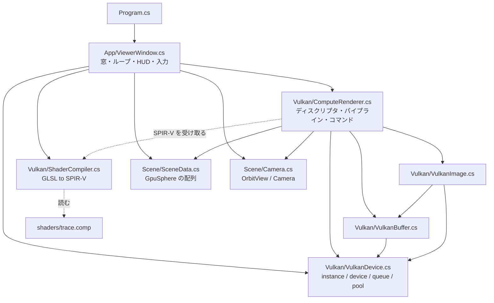
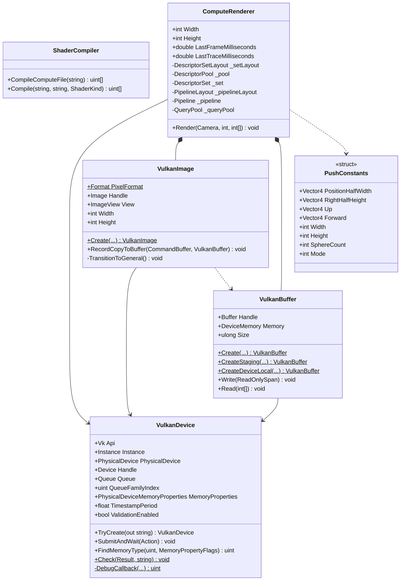
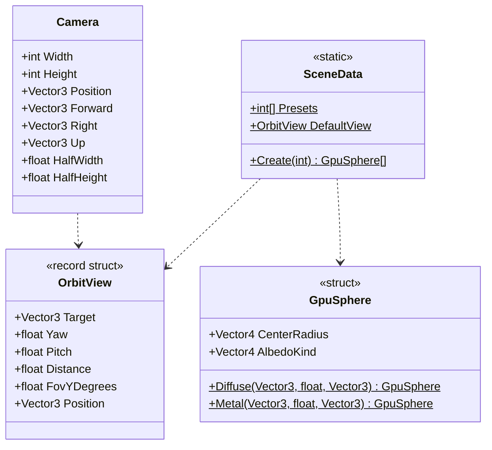
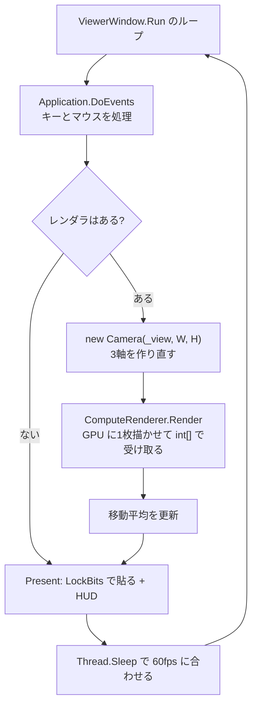
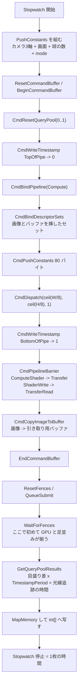
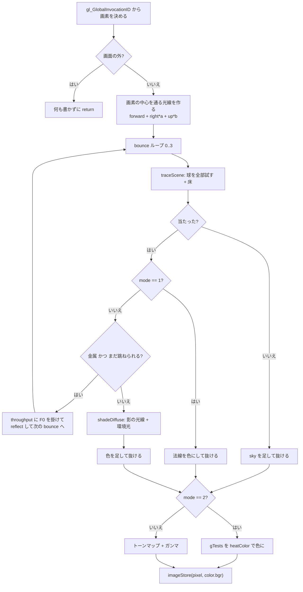

# Day 62a: Vulkan を立ち上げる — ハードウェアRTへの下ごしらえ

**教養編の6日目**。ロードマップの Day 62(ハードウェアレイトレーシング)は分量が1日に収まらないので、
**62a / 62b / 62c の3日に割った**。今日はその1日目。

| | 今日やること | 絵として何が出るか |
|---|---|---|
| **62a(今日)** | **Vulkan を立ち上げる**。device・メモリ・ディスクリプタ・コマンド・SPIR-V | 球と市松の床。探し方は**総当たり** |
| 62b | **BLAS/TLAS を建てて ray query に差し替える** | 同じ絵。**総当たりの費用が消える** |
| 62c | **レイトレーシングパイプラインと SBT** | 同じ絵。材質ごとに hit シェーダが分かれる |

今日書くコードは、**レイトレーシングとは何の関係も無い**。
Vulkan が動いていないとハードウェア RT の話に入れないので、そこだけを片付ける日。
ロードマップの狙い(BLAS/TLAS と RT コアが何を肩代わりするか)は 62b で回収する。

**Labs の新しいプロジェクト**として始める。Day 59〜61 の `CpuRayTracer`(CPU → OpenGL)とは
コードを1行も共有しない——コンテキストの作り方もメモリの持ち方もシェーダの渡し方も別物だから。
持ってくるのは**場面とカメラの式だけ**。

- 置き場所: `reference/Day62a/` / 写経先は `work/Labs/HardwareRayTracer/`
- 名前空間: `HardwareRayTracer`(62a / 62b / 62c で共通)

今日の差分は**新規 11 ファイル**(2,497 行、うち C# のコード 1,274 行、GLSL 282 行)。
**1日ぶんとしては重い**ので、`Vulkan/` の5ファイルを先に写して harness で動かし、
窓を後回しにしても構わない(下の「写経する順番」はその順に並べてある)。

> **Vulkan の長さは、ほぼ全部が「起動時の儀式」に寄っている**
> 今日書く 1,274 行のうち、**毎フレーム走るのは 60 行ほど**(`ComputeRenderer.Render`)。
> 残りは全部、起動時に1回だけ通る道。OpenGL が「ドローのたびに状態の組み合わせを検証して、
> 必要ならシェーダを作り直す」ことでやっていた仕事を、**Vulkan は事前に固めさせる**。
> 長さの正体はそこにある。そしてこの 1,200 行は、**Day 62b でも 62c でもほぼ 1 行も変わらない**。

## 今日のゴール

**起動すると 960x540 の窓に、市松の床と 120 個の球が出る。`3` を押すと 720 個に増える。
`M` を押すと「法線」「交差判定の回数」に切り替わる。HUD の「1枚」の行に2つの数が並んでいて、
球を 8 → 720 個に増やすと、**右の数(光線追跡)だけが 0.4ms → 7ms に伸びる**
(左の「1枚」は 10ms のままほとんど動かない)。**

| キー | 何が起きるか |
|---|---|
| `1` / `2` / `3` | 球の数(8 / 120 / 720)。**今日の目**——総当たりの費用が伸びるのを見る |
| `M` | 表示の種類(陰影 → 法線 → **交差判定の回数**)。3つ目が Day 62b の比較の土台 |
| 左ドラッグ / ホイール / `R` | カメラを回す / 寄る / 戻す |
| `H` / `Esc` | 文字を消す / 終了 |

### 今日いちばん大事な3つ

**1つ目は「Vulkan は画面と無関係に立ち上がる」**(要点1)。
Day 61 の `GpuDevice` は、GPGPU しかしないのに**見えない 16x16 の窓を作った**。
OpenGL のコンテキストは窓(描画先)の上にしか作れないからで、あれは OpenGL の歴史的な都合だった。
今日の `VulkanDevice.cs` には、**窓の話が1つも出てこない**。

```
OpenGL: 窓を作る → コンテキストを作る → そのスレッドに貼り付く → GL 関数が使える
Vulkan: インスタンス → 物理デバイスを選ぶ → 論理デバイス → キュー   (画面は一切関係しない)
```

画面に出したくなったときだけ `VkSurfaceKHR` と `VkSwapchainKHR` を足す、という足し算の構造になっている。
今日はそれを足さない(窓には Day 1 と同じ LockBits で貼る)。

**2つ目は「Vulkan は決めごとを全部こちらに書かせる」**(要点2〜5)。
OpenGL が黙ってやっていた4つが、それぞれ明示的な API になっている。

| OpenGL が黙ってやっていたこと | Vulkan で自分が書くこと | ファイル |
|---|---|---|
| GLSL をドライバが翻訳する | **SPIR-V を渡す**。GLSL → SPIR-V は自分で(shaderc) | `ShaderCompiler.cs` |
| `glBufferData` が置き場所を決める | **メモリの種類を選んで確保して貼る**の3段 | `VulkanBuffer.cs` |
| テクスチャの内部の並べ方を切り替える | **レイアウトを追跡して宣言する**(バリア) | `VulkanImage.cs` |
| ドローのたびに状態の組み合わせを検証する | **事前にレイアウトとパイプラインに固める** | `ComputeRenderer.cs` |

**3つ目は「GPU の時間は GPU に測らせる」**(要点6)。
今日いちばん引っかかったのがここ。CPU 側の `Stopwatch` で測ると、球 8 個でも 720 個でも
**8ms と 13ms** にしかならない——2MB の引き取りと提出の往復が 8ms あって、
光線を追う時間(0.05ms)を覆い隠してしまう。`vkCmdWriteTimestamp` でディスパッチだけを囲むと、

```
球   8 個:  frame 8.31 ms   trace 0.05 ms
球 120 個:  frame 8.89 ms   trace 0.67 ms    ( 球 15 倍 → 13 倍)
球 720 個:  frame 12.64 ms  trace 4.30 ms    ( 球 90 倍 → 86 倍)
```

**総当たりは球の数にきれいに比例する**、が数字で出る。Day 62b はこの `trace` の列を潰しに行く。

> **この表は「休みなく連続で描いたときの最小値」**(窓を出さない計測用の走らせ方)。
> **窓のアプリで見える数はこれより大きく、揺れる**——1枚が 1ms で終わると
> GPU は残りの 15ms を寝て過ごすので、クロックが下がったまま次のフレームを迎える。
> アプリ側の実測は下の「完成条件」に載せてある。
> 比べるのは**同じ測り方どうし**にすること。


## 事前に読む資料

- **[Vulkan Tutorial](https://vulkan-tutorial.com/)** の
  **Drawing a triangle → Setup**(Instance / Validation layers / Physical devices / Logical device)と
  **Vertex buffers → Vertex buffer creation / Staging buffer**。
  C++ だが、**今日書く C# はこの章立てとほぼ1対1**に並んでいる
- **[Vulkan Guide (KhronosGroup)](https://docs.vulkan.org/guide/latest/index.html)** の
  **Memory Allocation**、**Synchronization**、**Descriptor Sets** — 「なぜその形なのか」が書いてある。
  チュートリアルより短く、今日の要点3〜5 の背景が全部ここにある
- **[Vulkan 1.3 仕様](https://registry.khronos.org/vulkan/specs/1.3-extensions/html/vkspec.html)** の
  **7. Synchronization and Cache Control**(とくに 7.4 Memory Barriers の「実行の依存」と「メモリの依存」が
  別物だという説明)と **12.5 Image Layouts** — 要点5
- **[Sascha Willems, Vulkan examples](https://github.com/SaschaWillems/Vulkan)** の
  `examples/computeheadless` — **窓を作らずに計算だけする**最小の例。今日の構成とほぼ同じ
- **[Arseny Kapoulkine, "Writing an efficient Vulkan renderer"(GPU Zen 2)](https://zeux.io/2020/02/27/writing-an-efficient-vulkan-renderer/)**
  — メモリ確保とディスクリプタの現実的な扱い。**今日のコードがどこで手を抜いているか**が分かる
- **[shaderc](https://github.com/google/shaderc)** の README — GLSL → SPIR-V。
  本来はビルド時に `glslc` を叩く道具で、今日は実行時に呼んでいる(要点2)
- **[Silk.NET](https://github.com/dotnet/Silk.NET)** の `examples/CSharp/OpenGL Demos` ではなく
  **`src/Vulkan` の XML ドキュメント** — Silk.NET の Vulkan 束縛は**ほぼ生の C API**なので、
  上の C++ の資料がそのまま読める
- **Day 61 の計画書**(GPU パストレーサ化)— 要点1(GPGPU の実行モデル)と要点4(std430 の詰め方)は
  今日もそのまま効く。**GLSL 側の作法は Day 57・61 で済ませてあるので、今日は C# 側だけが新しい**
- **[NVIDIA Vulkan Ray Tracing Tutorial](https://nvpro-samples.github.io/vk_raytracing_tutorial_KHR/)**
  — **今日はまだ読まなくてよい**。62b・62c の本体。今日の `VulkanDevice` / `VulkanBuffer` は、
  この資料の `nvvk` が用意しているものを自前で書いているのだと思って読むと位置づけが分かる

## 理論の要点

### 1. Vulkan は画面と無関係に立ち上がる — 5段の儀式

OpenGL で GPGPU をするには窓が要った(Day 61 の `GpuDevice` は見えない窓を1つ作った)。
Vulkan にその制約は無い。代わりに、**OpenGL が黙って1つに畳んでいたものが5つに分かれている**。

| 段 | 何を決めるか | 間違えるとどうなるか |
|---|---|---|
| **インスタンス** | ローダとの接点。**使う拡張とレイヤ**をここで宣言する | 拡張を宣言し忘れると、後で関数ポインタが null になる |
| **物理デバイス** | 刺さっている GPU の一覧から1つ選ぶ | 素直に先頭を取ると、ノート PC では内蔵 GPU を掴む |
| **キューファミリ** | 仕事の受け口の種類(描画 / 計算 / 転送) | 計算できない口に計算を投げると未定義動作 |
| **論理デバイス** | 選んだ GPU への自分専用の窓口。**使う機能を明示的に有効化する** | 有効化していない機能を使うシェーダは未定義動作 |
| **コマンドプール** | コマンドバッファを切り出す元 | 同じプールのバッファを同時に触ると壊れる |

**「聞いてから使う」が徹底している**のが Vulkan の性格。物理デバイスが何をできるかは
`vkGetPhysicalDeviceFeatures` / `...Properties` / `...QueueFamilyProperties` で**聞かないと分からない**し、
使うと決めたものは `VkDeviceCreateInfo` で**明示的に有効化する**。
Day 62b で `VK_KHR_ray_tracing_pipeline` を足すのも、この同じ場所に1行足すだけになる。

**検証レイヤ**(`VK_LAYER_KHRONOS_validation`)は、この「聞いてから使う」の見張り番。
API 呼び出しの間に割り込んで仕様違反を教えてくれる、**Vulkan を書くときの実質的なコンパイラ**にあたる。
ただし**ドライバには付いてこない**——[LunarG の Vulkan SDK](https://vulkan.lunarg.com/sdk/home)
を入れると使えるようになる。今日のコードは「あれば使う、無ければ黙って諦める」にしてあり、
どちらかは HUD の1行目に出る。

> **入っていなくても今日は動く。が、自分で書き換えて詰まったら入れるべき。**
> Vulkan の失敗のほとんどは例外ではなく**画面が真っ黒**という形で出る。
> `SType` を1つ書き忘れた、バリアの段を間違えた、ディスクリプタの型が合っていない——
> どれも検証レイヤなら1行で教えてくれるが、無いと数時間溶ける。

### 2. ドライバは GLSL を受け取らない — SPIR-V と shaderc

OpenGL では `glShaderSource` に GLSL の文字列をそのまま渡せた。
**ドライバの中に GLSL コンパイラが入っていた**からで、それは裏返すと
「ベンダごとに別のコンパイラが別の解釈をする」ということでもあった。
同じシェーダが NVIDIA で通って AMD で通らない、という事故はここから来ていた。

Vulkan はそこを切った。ドライバが受け取るのは **SPIR-V**(32 ビット語の並びでできた中間表現)だけ。

```
  GLSL  --[glslang / shaderc]-->  SPIR-V  --[ドライバ]-->  その GPU の機械語
        ^ アプリ側の責任                   ^ ここから先がドライバ
```

**文法の解釈がアプリ側に移った**ので、「手元で通れば、どの GPU でも同じ形が届く」。
代わりに翻訳する道具が要る。本来は**ビルド時に** `glslc` を叩いて `.spv` を作り、
実行時はそれを読むだけにする。今日は `Silk.NET.Shaderc` + `...Shaderc.Native`(glslang を包んだ .dll が
NuGet で付いてくる)を使って**実行時に翻訳**している。理由は2つ:

- **Vulkan SDK を入れなくても動く**(手元の環境では実際に SDK は入っていない)
- **シェーダを書き換えて再実行するだけで試せる**(Day 61 と同じ方針。改造課題で効く)

翻訳するときに指定する2つは間違えやすい。

```csharp
_api.CompileOptionsSetTargetEnv(_options, TargetEnv.Vulkan, (uint)EnvVersion.Vulkan12);
_api.CompileOptionsSetTargetSpirv(_options, SpirvVersion.Shaderc15);   // SPIR-V 1.5
```

`TargetEnv` を OpenGL にすると `set = 0` の書き方が通らない。
`SpirvVersion` は、**Day 62b で使う ray query が SPIR-V 1.4 以上**を要求するので、
今から 1.5 にしておく。

### 3. メモリは自分で選ぶ — 「入れ物」と「メモリ」の分離

`glBufferData` は、入れ物を作ることとメモリを確保することと中身を書くことを1回でやっていた。
Vulkan はこれを3つに割る。

```csharp
vkCreateBuffer      // 大きさと使い道だけ宣言する。メモリはまだ1バイトも無い
vkAllocateMemory    // メモリを確保する。どの種類かはこちらが選ぶ
vkBindBufferMemory  // 入れ物とメモリを貼り合わせる
```

面倒に見えるが、これは**1つの大きなメモリを何本ものバッファで分け合う**ためにこの形になっている
(`vkAllocateMemory` の呼べる回数には上限があり、数千回しかない。実際のエンジンは 64MB 単位で確保して
自前で切り分ける。VulkanMemoryAllocator がやっているのはこれ)。
今日は本数が少ないので **1本につき1回確保する**という、素直だが実戦的でない形にしてある。

選ぶ「種類」でいちばん効くのは2つの性質の組み合わせ。

| 性質 | 意味 | 向き不向き |
|---|---|---|
| `DeviceLocal` | GPU の直近(VRAM) | GPU から読むのが速い。CPU からは触れないことが多い |
| `HostVisible` | CPU から `vkMapMemory` できる | GPU からは PCIe 越しで遅い |

両方立っている種類(ReBAR / Smart Access Memory)があれば理想だが、大きさが限られる。
ふつうは **「HostVisible に書いて、転送コマンドで DeviceLocal へ移す」の2段**を踏む(ステージング)。
今日の球の配列(`VulkanBuffer.CreateDeviceLocal`)がそれ。

**どの種類を選べるかは資源ごとに違う**。`vkGetBufferMemoryRequirements` が返す `MemoryTypeBits` が
「この資源はこの種類になら置ける」という GPU 側の制約で、そこに入っていない種類を選ぶと確保に失敗する。
だから探し方は必ず「**許された種類の中から、欲しい性質を全部持つ最初のもの**」になる。

### 4. 準備を前に寄せる — ディスクリプタとパイプライン

OpenGL でコンピュートを走らせるのは3行だった。

```csharp
gl.UseProgram(program);
gl.BindBufferBase(GLEnum.ShaderStorageBuffer, 0, ssbo);
gl.DispatchCompute(gx, gy, 1);
```

Vulkan は同じことに**5つの物**を要求する。

| 物 | 何か | いつ作るか |
|---|---|---|
| ディスクリプタ**セットレイアウト** | 「0 番に画像、1 番にバッファが来る」という**型の宣言** | 起動時 |
| ディスクリプタ**プール** | セットを切り出す元。何個・何種類かを先に申告 | 起動時 |
| ディスクリプタ**セット** | レイアウトに沿って実際の資源を挿した**実体** | 起動時 |
| **パイプラインレイアウト** | セットの並び + プッシュ定数の大きさ。シェーダとの契約 | 起動時 |
| **パイプライン** | シェーダとレイアウトを束ねた、GPU が実行できる形 | 起動時 |

**これが Vulkan が速い理由でもある**。OpenGL はドローのたびに「今バインドされているものの組み合わせ」を
検証していて、組み合わせによってはシェーダを作り直していた(ゲーム開始直後のカクつきの正体)。
Vulkan は組み合わせを事前に固めさせるので、実行時には検証も再コンパイルも起きない。

毎フレーム変わる少量の値(カメラ、画面の大きさ、表示の種類)は、バッファを作って転送するより
**プッシュ定数**が速い。コマンドバッファに値を直接埋め込む仕組みで、転送も同期も要らない。
ただし**保証される大きさは 128 バイトしかない**。今日は 80 バイト使っている。

```
vec4 positionHalfWidth   0..15    vec4 rightHalfHeight  16..31
vec4 up                 32..47    vec4 forward          48..63
int  width/height/sphereCount/mode  64..79
```

**C# 側の構造体と GLSL 側のブロックが1バイトも違ってはいけない**。
`vec3` を混ぜると 16 バイト境界に揃えられて詰め物が入るので、
**常に `vec4` で並べて端数を `w` に詰める**のが事故の少ない書き方(Day 61 の要点4 と同じ作法)。

### 5. 画像は「レイアウト」という状態を持つ

バッファと画像の決定的な違いはここ。GPU は画像を用途ごとに違う並べ方
(タイル状、圧縮あり/なし、深度用の特殊な形)で持っていて、
**いまどの並べ方かをアプリが追跡して宣言する**のが Vulkan の決まり。
OpenGL ではドライバが裏で切り替えていた(そしてその切り替えが、予期しない待ちを生んでいた)。

今日は**ずっと `General` のまま**にしてある。

- `General` は「何にでも使える代わりに、どれにも最適ではない」レイアウト
- **ストレージ画像は `General` でしか読み書きできない**ので、
  「シェーダが書く → 転送で引き取る」だけの今日は移し替える意味が無い
- 実際のハードウェア RT のコードでも、出力画像は `General` に置きっぱなしにするのがふつう

ただしバリアは要る。**バリアはレイアウトの宣言だけではなく、2つのことを同時に言っている**。

```csharp
CmdPipelineBarrier(cmd,
    PipelineStageFlags.ComputeShaderBit,   // この段が終わってから
    PipelineStageFlags.TransferBit,        //   この段を始めよ          ... 実行の依存
    ... SrcAccessMask = ShaderWriteBit,    // シェーダが書いた値を
        DstAccessMask = TransferReadBit);  //   転送から読めるようにせよ ... メモリの依存
```

**片方でも欠けると、たいていの場合は正しく動いてしまう**のが厄介なところ。
GPU が空いていれば順番どおりに走るので、負荷が上がったときだけ絵が1フレーム古くなる、
という形で出る。検証レイヤの同期チェックが拾ってくれる領域。

#### RGBA と BGRA — 画素の並びをどこで入れ替えるか

ストレージ画像として**必ず使える**形式は仕様で決まっていて、`R8G8B8A8_UNORM` はその1つ。
`B8G8R8A8_UNORM` は必須ではない。一方 WinForms の `Format32bppRgb` が欲しいバイトの並びは B, G, R, X。
差を埋める場所は2つある。

- CPU 側で 50 万画素ぶん入れ替える … 毎フレーム数 ms。もったいない
- **シェーダが書くときに入れ替える** … `imageStore(img, p, vec4(color.bgr, 1.0))` の1行

後者を採った。GPU 側では並べ替えの費用がほぼ 0 で、しかも「どこで入れ替えたか」がシェーダの1行に閉じる。
`shaders/trace.comp` のいちばん最後の行がそれ。

### 6. 同期は自分で書く — そして時間は GPU に測らせる

OpenGL の `glFinish` が暗黙にやっていたこと(投げた仕事が全部終わるまで待つ)を、
Vulkan は**フェンス**という形で明示する。「どの提出を待つか」を選べるぶん細かい。

```csharp
vk.ResetFences(device, 1, &fence);
vk.QueueSubmit(queue, 1, &submit, fence);
vk.WaitForFences(device, 1, &fence, true, ulong.MaxValue);   // ここで待つ
```

**待たずに読むと前のフレームの絵が混ざる**。しかもこれは検証レイヤも黙っている
(メモリの読み書きとしては合法なので)。

そして今日いちばんの落とし穴が**測り方**。CPU 側の `Stopwatch` で `Render` を囲むと、

| | CPU の Stopwatch | GPU のタイムスタンプ |
|---|---|---|
| 球 8 個 | 8.31 ms | **0.05 ms** |
| 球 120 個 | 8.89 ms | **0.67 ms** |
| 球 720 個 | 12.64 ms | **4.30 ms** |

(連続で描いたときの最小値。窓のアプリではもっと大きくなる——完成条件2を参照)

左の列は**2MB の引き取りと提出の往復**が 8ms あって、光線を追う時間を覆い隠している。
「球を 90 倍にしたら 86 倍重くなった」を見るには、**GPU の時計を読むしかない**。

```csharp
vk.CmdResetQueryPool(cmd, pool, 0, 2);                                     // 使う前に必ず reset
vk.CmdWriteTimestamp(cmd, PipelineStageFlags.TopOfPipeBit, pool, 0);
// ... CmdDispatch ...
vk.CmdWriteTimestamp(cmd, PipelineStageFlags.BottomOfPipeBit, pool, 1);
// フェンスを待った後で GetQueryPoolResults。目盛り数 x TimestampPeriod でナノ秒になる
```

`TimestampPeriod` は GPU ごとの「1目盛り何ナノ秒か」(NVIDIA は 1.0、AMD は 40 前後)。
これを掛け忘れると、AMD で 40 倍の値が出る。

### 7. 総当たりの費用 — Day 62b が潰しに行くもの

今日のシェーダは球を**先頭から1個ずつ**試す。Day 59 と同じ総当たりで、
Day 60 で CPU 版に BVH を入れたのと同じ問題がここにもある。

`M` を2回押した「交差判定の回数」の絵がいちばん雄弁で、**空の部分にも色が付いている**。
何にも当たらない光線でも、720 個の球を全部試しているということ。
**総当たりは「当たらなかったこと」を確かめるのにも満額の費用がかかる**。

| 球の数 | 光線追跡 | 1画素あたりの交差判定(一次光線のみ) |
|---|---|---|
| 8 | 0.05 ms | 8 回 |
| 120 | 0.67 ms | 120 回 |
| 720 | 4.30 ms | 720 回 |

Day 62b でこれを **BLAS(加速構造)** に入れ替えると、この表の右の列が
**log に落ちて、しかも数え方そのものがシェーダから見えなくなる**
(RT コアの中で何回試されたかは分からない)。そこが「RT コアが何を肩代わりするか」の答えになる。

## 前Dayからの差分概要

**新規プロジェクト**なので、11 ファイルすべてが新規。

### 新規ファイル

| ファイル | 行数 | 役割 |
|---|---|---|
| `Day62a.csproj` | 76 | Silk.NET.Vulkan / ...Extensions.KHR / ...EXT / Shaderc(+Native)。**Windowing は入れない** |
| `Scene/Camera.cs` | 67 | `OrbitView` と `Camera`。Day 59〜61 から**式だけ**持ってきた |
| `Scene/SceneData.cs` | 128 | `GpuSphere`(std430 の 32 バイト)と場面の生成。8 / 120 / 720 個 |
| `Vulkan/ShaderCompiler.cs` | 125 | shaderc で GLSL → SPIR-V(要点2) |
| `Vulkan/VulkanDevice.cs` | 548 | インスタンス・物理/論理デバイス・キュー・コマンドプール・検証レイヤ(要点1) |
| `Vulkan/VulkanBuffer.cs` | 191 | 入れ物 + メモリ + ステージング転送(要点3) |
| `Vulkan/VulkanImage.cs` | 238 | ストレージ画像・レイアウト・バリア・引き取り(要点5) |
| `Vulkan/ComputeRenderer.cs` | 446 | ディスクリプタ・パイプライン・コマンド・タイムスタンプ(要点4・6) |
| `shaders/trace.comp` | 282 | 総当たりのレイトレーサ。3つの表示(要点7) |
| `App/ViewerWindow.cs` | 342 | 窓・ループ・HUD・キー・マウス。**Vulkan の話は出てこない** |
| `Program.cs` | 54 | エントリポイント |

### 写経する順番

**`Vulkan/` の5ファイルを先に片付けると、残りは軽い**。
5ファイル目(`ComputeRenderer.cs`)まで来ると、`shaders/trace.comp` と合わせて
「窓なしで1枚描いて PNG に保存する」ところまで届く。窓はその後でよい。

| # | ファイル | 何が要るか / 気をつけるところ |
|---|---|---|
| 1 | `Day62a.csproj` | **先に作る**。NuGet が 5 つ。`Windowing` を入れないのが Day 61 との違い |
| 2 | `Scene/Camera.cs` | 依存なし。Day 61 の `Tracing/Camera.cs` から `OrbitView` と3軸だけ抜いたもの |
| 3 | `Scene/SceneData.cs` | 2 の `OrbitView` を使う。`GpuSphere` は **32 バイトちょうど**(`vec4` x 2) |
| 4 | `Vulkan/ShaderCompiler.cs` | 依存なし。`TargetEnv.Vulkan12` と `SpirvVersion.Shaderc15` を間違えない |
| 5 | `Vulkan/VulkanDevice.cs` | **今日いちばん長い**。上から順に「インスタンス → 検証レイヤ → 物理 → キュー → 論理 → プール」 |
| 6 | `Vulkan/VulkanBuffer.cs` | 5 の `FindMemoryType` / `SubmitAndWait` / `Check` を使う。`using Buffer = Silk.NET.Vulkan.Buffer;` を忘れない |
| 7 | `Vulkan/VulkanImage.cs` | 5 と 6 を使う。`using Image = ...` と `using ImageLayout = ...` の2本が要る |
| 8 | `shaders/trace.comp` | C# に依存しない。ただし `local_size` と `rgba8` と push 定数の並びは**後の 9 と一致させる** |
| 9 | `Vulkan/ComputeRenderer.cs` | 5〜8 のすべてを使う。`using ImageLayout = ...` が要る。1〜6 の番号付きコメントの順に読む |
| 10 | `App/ViewerWindow.cs` | 9 を使う。中身は Day 1 の GameWindow とほぼ同じ |
| 11 | `Program.cs` | 10 を呼ぶだけ |

> **途中で動かしたいなら**: 9 まで写した時点で、`Program.cs` の代わりに
> 「`VulkanDevice.TryCreate` → `ShaderCompiler` → `ComputeRenderer` → `Render` → PNG 保存」
> だけの 30 行の `Main` を書けば、窓なしで絵が出る。**Vulkan は窓が要らない**ので、これができる
> (これが要点1 の実感としていちばん効く)。

## 設計書

**Day 59〜61 の `CpuRayTracer` とは別のプロジェクト**なので、設計書もここから新しく始める。

### 全体構成と依存の向き



| 層 | 誰を知っているか | 誰に知られているか |
|---|---|---|
| `Scene/` | **誰も知らない**。ただの数 | `ComputeRenderer` と `ViewerWindow` |
| `Vulkan/VulkanDevice` | Silk.NET だけ | `Vulkan/` の全員と `ViewerWindow` |
| `Vulkan/VulkanBuffer` `VulkanImage` | `VulkanDevice` | `ComputeRenderer` |
| `Vulkan/ComputeRenderer` | `Vulkan/` の全員 + `Scene/` | `ViewerWindow` |
| `App/ViewerWindow` | 全員 | `Program` |

**向きが一方通行で、循環が1つも無い**。Day 25 で `Core` と `Render` の相互参照を見つけたときと違って、
今日は層が薄い(5層)ので素直に収まっている。

**入れ替えると何が壊れるか**を1つずつ見ると、この形にした理由が分かる。

- `Scene/` が `Vulkan/` を知ってしまうと、**場面を CPU 側で検算できなくなる**。
  `GpuSphere` はただの 32 バイトの構造体なので、Day 62b で BLAS に入れるときも同じ配列をそのまま渡せる
- `VulkanDevice` が `ComputeRenderer` を知ると循環になる。実際、**コマンドプールを2つ持っている**
  (`VulkanDevice` の使い回し用と `ComputeRenderer` の毎フレーム用)のは、この向きを守るため。
  1つにまとめると `VulkanDevice` が「誰がいつ使うか」を知る必要が出る
- `ViewerWindow` から `Vulkan/` を全部剥がすと、**窓なしのバッチ描画**になる。
  実際に harness はそうやって動かしている(写経メモの「途中で動かしたいなら」)

### Vulkan — 5つのクラス



`ComputeRenderer` が `VulkanImage` と `VulkanBuffer` を**所有**している(菱形)のが要点。
球の数を変えると `ViewerWindow` は `ComputeRenderer` を丸ごと作り直すが、
`VulkanDevice` は生きたまま——**デバイスは一度作ったら最後まで使う**、という Vulkan の普通の形。

`PushConstants` に `<<struct>>` と書いてあるのは、**参照ではなく値**であることが効くから。
この 80 バイトはコマンドバッファに直接埋め込まれる(要点4)。

### Scene — GPU に渡せる形



Day 59〜61 の `Shape` / `Sphere` / `Plane` / `Material` の**継承の木がまるごと消えている**。
GPU 側に継承も仮想関数も無いので(Day 61 の要点2)、最初から平らな構造体だけにした。
床の平面は配列にすら入れず、**シェーダに直接書いてある**——
無限に広がるものは箱で囲めないので、Day 62b で BLAS に入れられないから。

### 1フレームの流れ



**`Render` が返ってきた時点で絵は完成している**(中でフェンスを待っている)のが、
Day 59〜61 の `ProgressiveRenderer`(別スレッドが積んだものを見に行く)との違い。
1枚が 10ms 前後で終わるので、UI スレッドから投げて待つので足りる。

### Render の中 — コマンドバッファに何を積むか



**4つの Cmd と1つのバリアしか積んでいない**のが見どころ。Vulkan の長さは全部この前
(起動時)に寄っていて、毎フレームの仕事は短い。

順番で効くのは2か所。

- **`CmdWriteTimestamp(Bottom, 1)` はバリアより前**。バリアより後ろに置くと、
  引き取りの転送まで測ってしまって「光線追跡だけ」にならない
- **`CmdPipelineBarrier` は `CmdCopyImageToBuffer` の前**。省くと、
  GPU が空いているときは正しく動き、混んだときだけ古い絵が出る(要点5)

### trace.comp の中 — 1画素の流れ



再帰の代わりに `bounce` のループにしてあるのは Day 60・61 と同じ理由(GPU に再帰が無い)。
**`traceScene` が今日いちばん素朴な関数**で、Day 62b で `rayQueryEXT` の数行に置き換わる。
そのとき `gTests` は数えられなくなる——RT コアの中で何回試されたかはシェーダから見えないので、
`mode == 2` の絵は 62b では別の意味を持つことになる。

### 今日残した歪み(3つ)

**1. メモリを1本につき1回確保している**(`VulkanBuffer.Create`)。
`vkAllocateMemory` の回数には上限があり(数千)、実際のエンジンでは必ず自前で切り分ける。
今日はバッファが3本しか無いので問題にならないが、**Day 62b で BLAS を建てると一気に増える**ので、
そこで気になるようなら直す。

**2. 毎フレーム画像をまるごと CPU へ引き取っている**(2MB / フレーム)。
frame 時間の 8ms はほぼこれと提出の往復。スワップチェーンを使えば消えるが、
儀式が 300 行増えるので今日は踏み込まない。**62b・62c も同じままで進める**——
比べたいのは `trace` の列であって `frame` の列ではないので。

**3. `ViewerWindow` が Vulkan の資源の寿命を握っている**。
`Dispose` の順番(レンダラ → コンパイラ → デバイス)を間違えると落ちる。
Vulkan は参照を数えてくれないので、**誰が何を先に壊すか**は書いた人の責任。
層が増える 62c までにこれ以上ややこしくなるようなら、資源をまとめて持つクラスを1つ挟む。

## 完成条件

`dotnet run --project reference/Day62a -c Release` で確かめる。
**FPS を見るときは必ず `-c Release`**(Debug は C# 側の往復が目に見えて遅い)。

### 1. 起動: 球 120 個、陰影

- 960x540 の窓に、**市松の床**と**大きい球3つ(鏡・赤・金)**、まわりに小さい球が 117 個
- 地平線まで床が続いている(無限の平面)
- 球の右下に**硬い影**が落ちている
- HUD の1行目に GPU の機種名。末尾に「検証レイヤ あり / なし」
- HUD の「1枚」の行が **9 ms 前後、うち光線追跡 0.7 ms 前後**

> **HUD の1行目が「Vulkan のローダが見つかりません」になる場合**:
> GPU ドライバが古いか、Vulkan に対応していない。
> `vulkaninfo --summary` をコマンドラインで叩いて、Vulkan が入っているか確かめる。

### 2. `1` / `3`: 球の数を変える(今日の目)

| キー | 球 | 1枚 | **うち光線追跡** |
|---|---|---|---|
| `1` | 8 | 10.5 ms | **0.4 ms 前後** |
| `2` | 120 | 10.7 ms | **0.7 ms 前後** |
| `3` | 720 | 16.5 ms | **7 ms 前後** |

**左の数はほとんど動かず、右の数だけが 15〜20 倍になる**のを確かめる。
これが確かめられれば、今日の測り方(要点6)が正しく動いている。

押した直後は数が揺れるので、**5〜10 秒ほど待ってから読む**。

> **要点6 の表(0.05 / 0.67 / 4.30 ms)より大きい数が出るのは正常**。
> あちらは「休みなく連続で描いたときの最小値」で、こちらは窓のアプリの1フレーム。
> **1枚が 1ms で終わると GPU は残りの 15ms を寝て過ごす**ので、クロックが下がったまま
> 次のフレームを迎える。球 8 個で 0.4ms も掛かるのはそのため(計算そのものは 0.05ms で終わる)。
> 休みを削れば数字は近づくが、**GPU を 100% に張り付かせない**という今日の方針を崩すことになる。
>
> **倍率が 86 倍ではなく 15〜20 倍にしか見えない**のも同じ理由。
> 球が少ないほど「寝ている時間」の割合が大きく、下限に張り付く。

### 3. `M`: 表示を切り替える(3つ)

| 表示 | 見えるもの |
|---|---|
| 陰影 | 1 のとおり |
| 法線 | 球が赤・緑・青に塗り分けられる。床は**一様な緑**(法線が全部 (0,1,0) なので) |
| 交差判定の回数 | **空が青一色**(= 720 回)、床が緑(= 1440 回前後)、金属の球が**赤**(= 2160 回以上) |

3つ目で**空にも色が付いている**ことを必ず見ておく。
「何にも当たらない光線も、球を全部試している」が今日の最後の要点(要点7)で、
Day 62b で最初に消えるのがこの費用。

### 4. カメラ

- 左ドラッグで回る。**真上・真下の手前で止まる**(越えるとカメラの右方向を作る外積が壊れるので、
  ±1.45 rad で止めてある)
- ホイールで寄る / 離れる(2〜60m)
- `R` で戻る

### 5. シェーダを書き換えて、落ちないことを確かめる

`reference/Day62a/bin/Release/net10.0-windows/shaders/trace.comp` を開いて、
わざと構文を壊して(`vec3` を `vec4` にするなど)保存し、`3` → `2` と押して作り直させる。

- **窓は落ちず**、HUD にエラーが3行出る(`trace.comp:123: error: ...` の形)
- 絵は最後に成功したもののまま……ではなく**真っ黒**になる(レンダラごと捨てているので)
- 直して押し直すと戻る

これが動くと、改造課題がずっと楽になる。

## 検証の途中で分かったこと

### 検証1: CPU の Stopwatch では総当たりの費用が見えなかった

最初は `Render` を `Stopwatch` で囲んだだけだった。球 8 個で 8.4ms、720 個で 12.7ms。
**90 倍にして 1.5 倍**にしかならず、「GPU すごい」で済ませてしまうところだった。

タイムスタンプを入れて分かったのは、**8ms はほぼ全部が引き取りと提出の往復**だということ。
2MB の `CmdCopyImageToBuffer` と `MapMemory`、そして `QueueSubmit` → `WaitForFences` の
往復の待ち時間で、**光線の本数とは何の関係も無い**。

教訓は Day 60 の要点9 と同じ形をしている——
**測っているつもりのものを測れているか、別の手段で確かめる**。
ここでは「球を 90 倍にしたら 90 倍になるはず」という**予測**があったから気づけた。

### 検証2: 検証レイヤはドライバに付いてこない

`VK_LAYER_KHRONOS_validation` は**Vulkan SDK を入れないと存在しない**。
手元の環境(RTX 3070 / driver 596.49)で `vkEnumerateInstanceLayerProperties` が返したのは
NVIDIA Optimus、Steam のオーバーレイ、OBS のフックなど7つで、検証レイヤは無かった。

そこで「無ければ黙って諦める」形にした(`HasInstanceLayer` で聞いてから決める)。
**レイヤが無いのに `EnabledLayerCount = 1` で渡すと `vkCreateInstance` が
`ErrorLayerNotPresent` を返して、そこで終わる**——検証レイヤを前提に書かれたサンプルを
そのまま持ってくると、まずここで止まる。

### 検証3: 一様乱数の色は灰色になる

小さい球の色を `rng.NextDouble() * 0.7 + 0.2` の3成分で作ったら、**全部が灰色がかった**。
3つの独立な一様乱数は値が近くなりやすく、R ≈ G ≈ B になる確率が高いため。

RTIOW と同じく**2つの乱数を掛ける**形(`NextDouble() * NextDouble()`)に変えると、
値が小さいほうに寄って成分ごとの差が開き、色が付いた。
ノイズの話ではなく**見た目の話**だが、場面の写真写りは比較のときに効く。

## 改造課題

### 課題1(易): ワークグループの大きさを食い違わせる

`shaders/trace.comp` の `local_size_x/y` を 8 から 16 に変えて、
**C# 側の `ComputeRenderer.WorkGroupSize` は 8 のまま**にして走らせる。

1. 何が起きるか予想してから走らせる(ヒント: `CmdDispatch` に渡すのはワークグループの**個数**)
2. 逆に GLSL を 4、C# を 8 にすると何が起きるか
3. 両方を 16 に揃えると、光線追跡の時間はどう変わるか(球 720 個で比べる)
4. `32x32` にすると `vkCreateComputePipelines` が失敗することがある。なぜか
   (ヒント: `VkPhysicalDeviceLimits.maxComputeWorkGroupInvocations` の保証値は 1024)

**この2つは人間が揃えるしかない**——GLSL と C# の間に型検査は無い、というのが
Day 57・61 から続く一貫したつらさで、Vulkan でも変わらない。

### 課題2(中): 地平線のちらつきを消す(スーパーサンプリング)

地平線の近くの床がざらついているのは、**1画素につき光線を1本しか撃っていない**から
(Day 59 の要点6 と同じ問題)。1画素の中に 2x2 の光線を撃って平均する。

1. `main` の中で、画素の中を `(0.25, 0.25)` `(0.75, 0.25)` `(0.25, 0.75)` `(0.75, 0.75)` の
   4か所ずらして4本撃ち、色を平均する
2. 光線追跡の時間はどれだけ伸びるか。**4 倍ぴったりになるか**を球 720 個で確かめる
3. 4 倍にならないとしたら、なぜか(ヒント: 隣の画素は同じ球に当たる。キャッシュ)
4. プッシュ定数に「1辺あたりの本数」を足して、キーで 1 / 2 / 4 を切り替えられるようにする
   (**80 バイトに 4 バイト足すだけ**なので 128 バイトに収まる)

### 課題3(難): 引き取りの 8ms を削る

`frame` の 8ms のうち、どこまでが何なのかを分解して、減らせるところを減らす。

1. `VulkanBuffer.Read` の `MapMemory` / `UnmapMemory` を**起動時に1回だけ**にして、
   毎フレームは `Marshal.Copy` だけにする。何 ms 減ったか
2. 引き取り用バッファを2本にして、**前のフレームの結果を読みながら次のフレームを投げる**
   (フェンスも2本要る)。1枚あたりの時間はどうなるか。**絵は1フレーム古くなる**が、
   静止画で見分けがつくか
3. `CmdCopyImageToBuffer` をやめて、シェーダが**直接 HostVisible なバッファに書く**ようにしたら
   どうなるか(ストレージ画像をやめてストレージバッファにする)。速くなるか、遅くなるか、なぜか
4. ここまでやっても消えない待ち時間が残る。それは何か
   (ヒント: `QueueSubmit` から GPU が実際に走り出すまでの時間は、GPU の時計では測れない)

> **測るときは Release で、かつ何回か走らせて最小値を取る**。
> そして**長く回しっぱなしにしない**——1枚が数 ms で終わる設定は、電源に対してかなり厳しい負荷になる。

## 次(Day 62b)でやること

今日作った `Vulkan/` の5ファイルは**ほぼそのまま**使い、以下を足す。

- `VulkanDevice` に拡張を3つ(`VK_KHR_acceleration_structure` / `ray_query` / `deferred_host_operations`)と
  機能を2つ(`bufferDeviceAddress` / `accelerationStructure`)足す。**足す場所は今日作った1か所**
- `Vulkan/AccelerationStructure.cs` を新設して、球の AABB から **BLAS** を建て、**TLAS** で束ねる
- `shaders/trace.comp` の `traceScene` を **`rayQueryEXT` の数行**に置き換える

そして今日の表の `trace` の列がどうなるかを見る。
