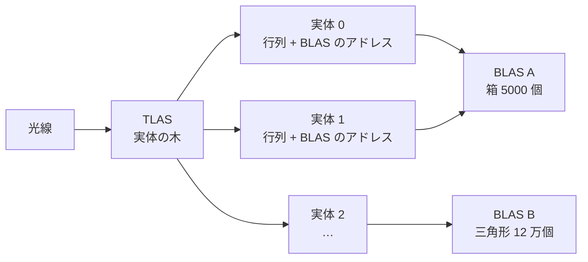
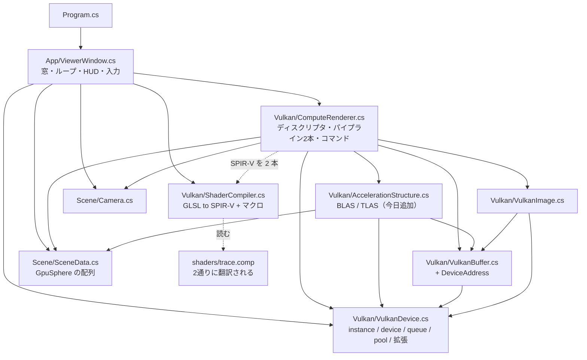
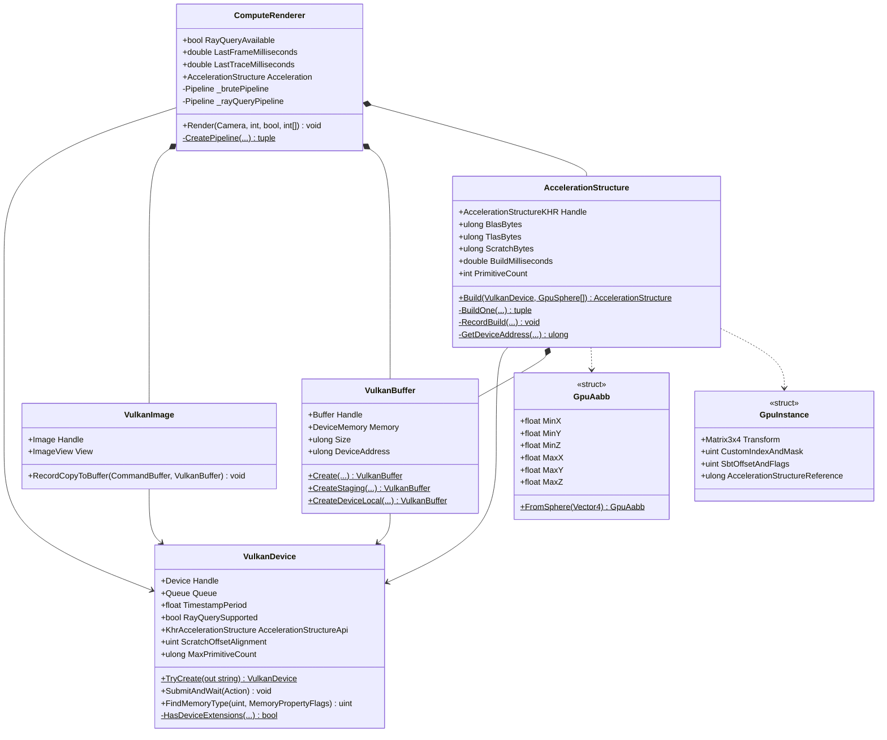
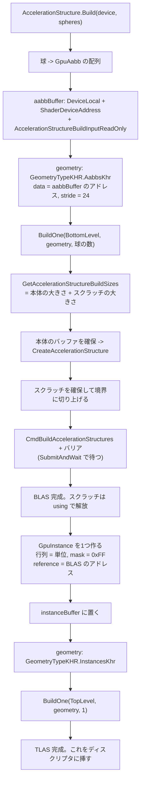
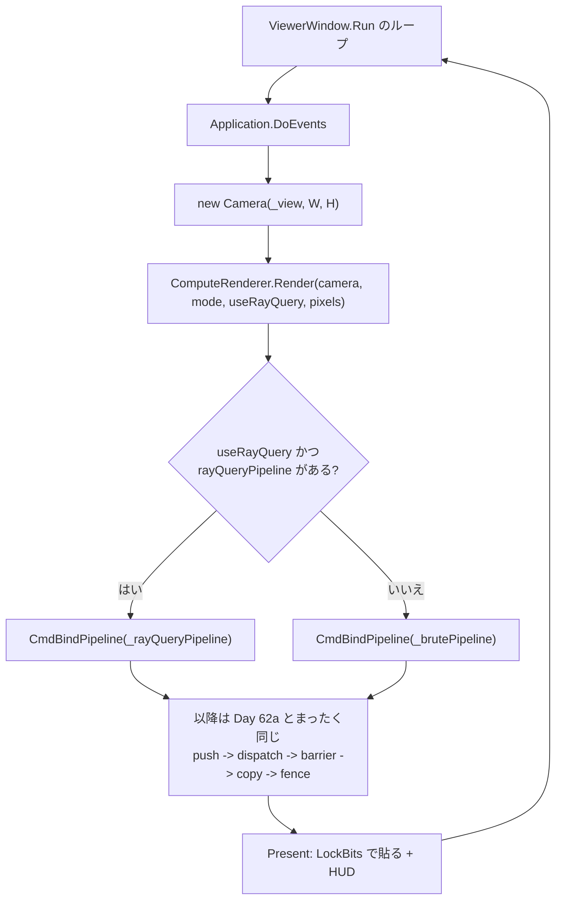
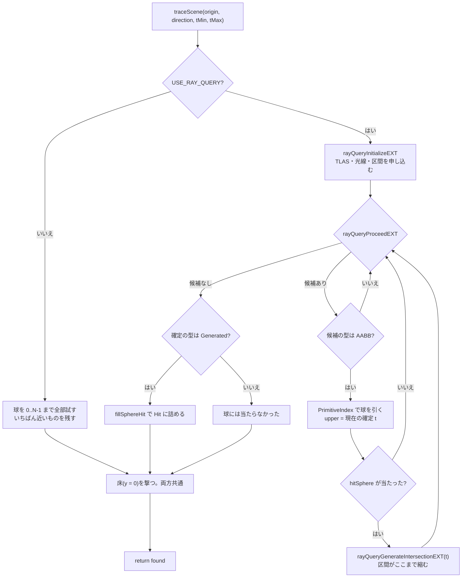

# Day 62b: 加速構造(BLAS/TLAS)と ray query — 探す仕事を RT コアに渡す

**教養編の7日目**。Day 62 の2日目で、reference は Day 62a の完全コピー + 差分。
ロードマップの Day 62 が狙っていた「**BLAS/TLAS とは何か、RT コアが何を肩代わりするか**」を、
今日ぜんぶ回収する。

Day 62a で立ち上げた Vulkan に足すのは3つだけ。

| # | 何を足すか | どこに |
|---|---|---|
| 1 | 拡張3つと機能3つを有効にする | `Vulkan/VulkanDevice.cs`(+175 行) |
| 2 | **BLAS と TLAS を建てる** | `Vulkan/AccelerationStructure.cs`(新規 433 行。今日の主役) |
| 3 | `traceScene` を `rayQueryEXT` に差し替える | `shaders/trace.comp`(+160 / −27 行) |

**絵は変わらない**。変わるのは「どう探すか」だけで、光線の作り方も材質も影もトーンマップも
1文字も触っていない。`B` キーで総当たりと ray query を行き来しながら、速さだけが変わるのを見る。

今日の差分は**新規 1 ファイル**(433 行)と**変更 8 ファイル**(+660 / −136 行)。

| 球の数 | 総当たり | **ray query** | 倍率 | BLAS の大きさ | 構築 |
|---|---|---|---|---|---|
| 8 | **0.05 ms** | 0.10 ms | **x0.5**(遅い!) | 1 KB(144 B/球) | 2.2 ms |
| 120 | 0.61 ms | 0.13 ms | x4.9 | 6 KB(53 B/球) | 2.2 ms |
| 720 | 4.03 ms | 0.19 ms | x21.6 | 28 KB(40 B/球) | 2.3 ms |
| 5000 | 29.82 ms | **0.20 ms** | **x146.8** | 185 KB(38 B/球) | 11.8 ms |

(連続で描いたときの最小値。**窓のアプリではもっと大きく、倍率も小さく出る**——完成条件2を参照)

> **ray query 側の列がほとんど動かない**のが今日の絵になる数字。
> 球を 8 個から 5000 個へ 625 倍にして、光線を追う時間は 0.10ms → 0.20ms の**2倍**。
> 総当たりは 0.05ms → 29.82ms の **600 倍**で、球の数にきれいに比例している。
> そして **8 個のときは加速構造のほうが遅い**——木をたどる手間が、8 回の球の判定より高くつく。

## 今日のゴール

**起動すると Day 62a とまったく同じ絵が出る。`4` を押して球を 5000 個にしても、
HUD の「うち光線追跡」は 2ms 足らずのまま。`B` を押して総当たりに切り替えると、
同じ絵のまま 35ms に跳ね上がる(x20)。`M` を2回押した「交差判定の回数」は、
総当たりでは真っ赤、ray query ではほぼ真っ黒になる。**

| キー | 何が起きるか |
|---|---|
| `B` | **探し方(ray query / 総当たり)。今日の目** |
| `1` / `2` / `3` / `4` | 球の数(8 / 120 / 720 / **5000**)。4 は今日追加 |
| `M` | 表示(陰影 → 法線 → 交差判定の回数 → **同・細かい目盛り**)。4つ目は今日追加 |
| 左ドラッグ / ホイール / `R` / `H` / `Esc` | Day 62a のまま |

### 今日いちばん大事な3つ

**1つ目は「加速構造は2階建て」**(要点3)。Day 60 で書いた BVH は1階建てだった。

```
  TLAS (top level)          … 「実体」の集まり。実体 = BLAS + 置き方(3x4 の行列)
    └ BLAS (bottom level)   … 図形そのものの集まり(三角形 or 箱)
```

分けてある理由は**動くものに強くするため**。物が動いても BLAS は建て直さず、
TLAS の行列を書き換えて TLAS だけ建て直す(実体が数千でも 1ms 程度)。
同じ BLAS を 1000 個の実体で使い回せば、木が 1000 本の森が**木1本ぶんのメモリ**で建つ。
今日の場面は動かないので、**実体1つ・単位行列**という階層を使わない使い方にしてある。

**2つ目は「RT コアは三角形と箱しか知らない」**(要点2)。
球を加速構造に入れる方法は1つしかなくて、**球を囲む箱(AABB)を登録する**。
そして**球との交差判定は自分で書く**。

| | RT コアがやること | 自分で書くこと |
|---|---|---|
| 三角形 | 木をたどる + **三角形と光線の交差** + 近い順の管理 | なし |
| **箱(procedural)** | 木をたどる + 箱と光線の交差 + 近い順の管理 | **球の式**(`rayQueryGenerateIntersectionEXT` で返す) |

これが「RT コアが何を肩代わりするか」の答えで、**肩代わりの中身は木の探索**であって
交差判定そのものではない(三角形だけはおまけで付いてくる)。

**3つ目は「絵が同じかどうかは、目ではなく数で確かめる」**(検証2)。
総当たりと ray query の絵を 518,400 画素すべて突き合わせると、
**720 個の場面で 38 画素(0.007%)が違っていた**。目では絶対に分からない。
段階を切り分けて測ったところ、

| 何を比べたか | 結果 |
|---|---|
| 一次光線の `t`(32 ビットそのまま) | **完全一致** |
| 影の光線の判定(影か否か) | **完全一致** |
| 最初に当たった球の材質と色 | **完全一致** |
| **反射した先の `t`** | **0.002% が不一致** |

つまり食い違うのは「曲面から出発した2本目以降の光線」だけ。
Day 61 の `-0.0` と同じで、**絵が合っていることは移植できている証拠にならない**。

## 事前に読む資料

- **[NVIDIA Vulkan Ray Tracing Tutorial](https://nvpro-samples.github.io/vk_raytracing_tutorial_KHR/)**
  の **Acceleration Structures** の章と、**[Intersection Shader の章](https://nvpro-samples.github.io/vk_raytracing_tutorial_KHR/vkrt_tuto_intersection.html)**
  — 今日の本体。後者が **AABB で球を入れる**話で、今日の `GpuAabb` と
  `rayQueryGenerateIntersectionEXT` に直接対応する
- **[Vulkan 1.3 仕様](https://registry.khronos.org/vulkan/specs/1.3-extensions/html/vkspec.html)** の
  **34. Acceleration Structures**(とくに 34.1 の BLAS/TLAS の定義と、
  34.3 の `VkAccelerationStructureInstanceKHR` の**ビットフィールドの並び**)
- **[GLSL_EXT_ray_query 拡張仕様](https://github.com/KhronosGroup/GLSL/blob/main/extensions/ext/GLSL_EXT_ray_query.txt)**
  — `rayQueryProceedEXT` / `rayQueryGenerateIntersectionEXT` の**呼んでよい条件**が書いてある。
  今日踏んだ落とし穴(検証3)はここに書いてある
- **[Vulkan Guide: Ray Tracing](https://docs.vulkan.org/guide/latest/extensions/ray_tracing.html)**
  — `ray_query` と `ray_tracing_pipeline` の**どちらを使うか**の整理。62c の位置づけが分かる
- **Day 60b の計画書**(BVH)の**要点7〜9** — 今日 GPU に渡すのは、Day 60 で自分で書いたあの木。
  「SAH で切る」「葉に何個入れる」をドライバがどう決めているか想像しながら読むと面白い
- **[Tero Karras, "Maximizing Parallelism in the Construction of BVHs, Octrees, and k-d Trees"(HPG 2012)](https://research.nvidia.com/publication/2012-06_maximizing-parallelism-construction-bvhs-octrees-and-k-d-trees)**
  — **GPU で BVH を建てる**方法(LBVH / Morton コード)。`vkCmdBuildAccelerationStructures` の中で
  起きていることの原型
- **[Aila & Laine, "Understanding the Efficiency of Ray Traversal on GPUs"(HPG 2009)](https://research.nvidia.com/publication/2009-08_understanding-efficiency-ray-traversal-gpus)**
  — RT コアが生まれる前に、**同じことをシェーダでやるとどこまで行けたか**。
  今日の x146 という数字の意味が分かる
- **[Vulkan Memory Model / bufferDeviceAddress](https://docs.vulkan.org/samples/latest/samples/extensions/buffer_device_address/README.html)**
  — 加速構造の入力を「ハンドル」ではなく「アドレス」で渡す理由(要点1)

## 理論の要点

### 1. 拡張を有効にする — 増えるのは C# の 30 行だけ

**NuGet は1つも増えない**。`VK_KHR_acceleration_structure` の関数は
`Silk.NET.Vulkan.Extensions.KHR` に最初から入っていて(Day 62a で既に参照済み)、
増えるのは「その拡張を使う」という宣言だけ。これは Vulkan の拡張の仕組みそのもので、
**拡張は別のライブラリではなく、同じローダから引く別の関数ポインタ**でしかない。

```csharp
private static readonly string[] RayTracingExtensions =
[
    KhrAccelerationStructure.ExtensionName,   // BLAS/TLAS を作る API 一式。本体
    "VK_KHR_ray_query",                       // どのシェーダからでも rayQueryEXT でたどれるようにする
    KhrDeferredHostOperations.ExtensionName,  // それ自体は使わないが、上が依存として要求する
];
```

`VK_KHR_ray_query` だけ名前を直に書いているのは、**関数を1つも増やさない拡張**だから
(増えるのは GLSL 側の `rayQueryEXT` だけ)。Silk.NET が包みのクラスを生成していない。

機能(features)のほうは **PNext で数珠つなぎ**にして渡す。

```
rayQueryFeatures  →  asFeatures  →  features12  →  DeviceCreateInfo
   rayQuery=true     accelerationStructure=true    bufferDeviceAddress=true
```

`bufferDeviceAddress` が要るのは、**加速構造の入力も出力も「GPU のアドレス」で指す**から。
AABB のバッファも、実体のバッファも、作業用のスクラッチも、全部アドレス。
ディスクリプタを経由しないのは、加速構造の中身が **GPU 側から作られる**
(`vkCmdBuildAccelerationStructures`)ため——GPU の中にはディスクリプタの概念が無い場所がある。

そして**宣言する前に聞く**。持っていない拡張を宣言すると `vkCreateDevice` が
`ErrorExtensionNotPresent` を返してそこで終わる。今日のコードは
`HasDeviceExtensions` で聞いてから決めるので、対応していない GPU では総当たりだけで動き続ける。

### 2. RT コアは三角形と箱しか知らない — procedural(AABB)で球を入れる

Day 60 の BVH には `Sphere` も `Plane` も入れられた(`TryGetBounds` が箱を返せば何でもよかった)。
RT コアはそうではなく、BLAS に入れられる図形は**2種類しかない**。

| 種類 | 入れるもの | 交差判定は誰が |
|---|---|---|
| `GeometryTypeKHR.TrianglesKhr` | 頂点と添字 | **RT コアが全部やる** |
| `GeometryTypeKHR.AabbsKhr` | 箱(min 3つ + max 3つ = 24 バイト) | **箱まで RT コア、中身はシェーダ** |

球は後者。`GpuAabb.FromSphere` が球を囲む箱を作り、シェーダ側がこうなる。

```glsl
while (rayQueryProceedEXT(query)) {
    if (rayQueryGetIntersectionTypeEXT(query, false) == gl_RayQueryCandidateIntersectionAABBEXT) {
        int index = rayQueryGetIntersectionPrimitiveIndexEXT(query, false);   // 何番目の箱か
        float upper = rayQueryGetIntersectionTEXT(query, true);               // いまの確定値
        if (hitSphere(origin, direction, center, radius, tMin, upper, t)) {
            rayQueryGenerateIntersectionEXT(query, t);                        // この t で確定候補に
        }
    }
}
```

**`while` が回るのが procedural ならではの往復**。三角形だけの BLAS なら
`rayQueryProceedEXT` を呼ぶだけで `while` が終わる(中身は空でよい)。
箱に当たるたびにシェーダへ戻ってくるので、**箱に当たって球には当たらなかった往復**が持ち出しになる。

その持ち出しは `M` を3回押した「細かい目盛り」の絵で**目に見える**。
ray query で見ると、**球のまわりに箱の形が浮かび上がる**——
箱の角の部分、つまり「箱には入ったが球には当たらなかった」領域が明るく光る。

> **三角形なら絶対に速い、というわけでもない**。
> 球を 1000 三角形で近似すると、BLAS は 38 B/球 ではなく数十 KB/球 になり、
> 交差判定の精度も落ちる。**解析的に解ける形は procedural のほうが有利**なことが多く、
> だから髪の毛(カーブ)やボリュームは procedural で入れる。

### 3. 2階建て — BLAS と TLAS



**実体が指す BLAS は共有できる**。同じ木の BLAS を位置違いで 1000 個並べても、
図形のメモリは1本ぶん。これが「TLAS を挟む」いちばんの理由。

もう1つの理由は**更新の粒度**。

| 何が起きた | 建て直すもの | かかる時間(今日の場面) |
|---|---|---|
| 物が動いた・回った | **TLAS だけ** | 1ms 未満 |
| 形そのものが変わった(スキニング、破壊) | その BLAS | 球 5000 個で 12ms |
| 何も変わらない | なし | 0 |

今日の場面は動かないので、両方を起動時に1回だけ建てる。
`GpuInstance` が1つで、変換は単位行列——**階層を使わない使い方**。

`GpuInstance`(= `VkAccelerationStructureInstanceKHR`)の 64 バイトは、
**ビットフィールドを手で詰める**ことになる。

```
float[12] transform                      // 48 バイト。3x4、行優先
uint  instanceCustomIndex:24 | mask:8    //  4 バイト
uint  sbtRecordOffset:24     | flags:8   //  4 バイト
ulong accelerationStructureReference     //  8 バイト。BLAS の**アドレス**
```

Silk.NET はこのビットフィールドを公開していないので、自分で並びを定義する。
気持ちは悪いが、**この 64 バイトの並びは仕様で固定されていてドライバが直接読む**
(ディスクリプタ越しではなく、GPU のアドレスで渡す)。1バイトずれると加速構造が丸ごと無意味になる。

`mask` は光線側のマスクと AND を取って 0 なら当たらない仕組み(影だけ無視する物などに使う)。
`sbtRecordOffset` は ray query では使われないが、**Day 62c ではここが
「どの hit シェーダを呼ぶか」を決める**。

### 4. 建てる手順は BLAS も TLAS も同じ4段

```
1. 入力(AABB の配列 / 実体の配列)を、GPU のアドレスで指せるバッファに置く
2. vkGetAccelerationStructureBuildSizes で **必要な大きさを聞く**
3. その大きさのバッファを確保して vkCreateAccelerationStructure
4. vkCmdBuildAccelerationStructures を投げる
```

**2 が Vulkan らしいところ**。加速構造が何バイトになるかは
「ドライバがどう分割するか」で決まるので、**自分で計算できない**。聞くしかない。
返ってくるのは2つの大きさで、

- `AccelerationStructureSize` … 加速構造そのもの。ずっと持っておく
- `BuildScratchSize` … **構築中だけ要る作業用**。建て終わったら捨ててよい

スクラッチには GPU ごとの境界の要求がある
(`minAccelerationStructureScratchOffsetAlignment`。手元の RTX 3070 は 128)。
守らないと構築がそのまま壊れる。

建てるときに1つだけ方針を伝える。

| フラグ | 意味 | 使い分け |
|---|---|---|
| `PreferFastTraceBitKhr` | **たどるのが速い**ように建てる。建てるのは遅い | 1回建てて何万フレームも使うもの(今日) |
| `PreferFastBuildBitKhr` | 建てるのが速い。たどるのは少し遅い | 毎フレーム建て直すもの(破壊、群衆) |
| `AllowUpdateBitKhr` | 後で「更新」できるようにする | 頂点が少し動くだけのもの(スキニング) |

これが Day 60 で自分で選んだ「SAH か中央分割か」に当たる。**方針だけ伝えて、中身は任せる**。

### 5. 「RT コアの仕事量」はシェーダから見えない

Day 62a の `M` 2回目(交差判定の回数)は、`gTests` というグローバル変数を
`hitSphere` の中で増やして数えていた。ray query に替えると、この数え方の意味が変わる。

| | 何を数えているか | 5000 個の場面での絵 |
|---|---|---|
| 総当たり | **シェーダがやった球の判定の回数**(= ほぼ球の数) | 空まで真っ赤 |
| ray query | **RT コアがシェーダに投げ返してきた回数**(箱に当たった回数) | ほぼ真っ黒 |

**木をたどるのに何回箱と交差したかは、原理的にシェーダから見えない**。
RT コアの中で起きていることで、シェーダに戻ってこないから。
だから ray query 側のこの絵は「RT コアの仕事量」ではなく
**「肩代わりされなかった残り」**を見ている——それがほぼ真っ黒だというのが今日の結論。

`M` の4つ目(細かい目盛り)は、その「残り」を 48 回で振り切る目盛りに切り替えて見るためのもの。
**球のまわりに箱の形が浮かぶ**絵になる。

### 6. 加速構造は小さい — 38 バイト / 球

| 球の数 | BLAS | 1球あたり | 参考: Day 60 の自前 BVH |
|---|---|---|---|
| 8 | 1 KB | 144 B | 節点 1つ 32 B(`Bvh.cs`) |
| 120 | 6 KB | 53 B | |
| 720 | 28 KB | 40 B | |
| 5000 | 185 KB | **38 B** | |

球 1 個ぶんの入力(AABB)が 24 バイトなので、**木の分は 14 バイト / 球**しかない。
Day 60 の自前 BVH(節点 1 つ 32 バイト、葉 1 個につきおよそ節点 2 つ = 64 バイト)より
かなり詰まっていて、これは NVIDIA が**木をたどる専用回路に合わせて圧縮した形**で持っているため
(公開されている形式ではない)。

TLAS は実体1つなので 2.0 KB で頭打ち。**実体が増えても数十バイトずつしか増えない**ので、
TLAS のメモリを気にする場面はまず無い。

### 7. 少ない図形では加速構造のほうが遅い

表のいちばん上の行が今日いちばん地味だが大事な数字。

```
球   8 個: 総当たり 0.05 ms   ray query 0.10 ms   ← **2倍遅い**
```

木をたどる手間(TLAS → 実体 → BLAS → 箱 → シェーダに戻る)が、
8 回の球の判定より高くつく。加速構造は**図形が増えたときに効く**道具で、
少ないうちは素直に総当たりのほうが速い。

Day 60 で CPU の BVH を作ったときにも同じことが起きていた
(`Day60b.md` の要点8。総当たりと BVH が入れ替わるのはおよそ 30 個のあたり)。
**加速構造を入れれば無条件に速くなる、ではない**ことは、GPU でも変わらない。

実戦では「図形が少ないから総当たり」という分岐は書かない
(場面は増える方向にしか動かないので)。ただし**シャドウマップと RT シャドウの選択**のような
形では、いまでも現役の判断になる。

## 前Dayからの差分概要

### 新規ファイル

| ファイル | 行数 | 役割 |
|---|---|---|
| `Vulkan/AccelerationStructure.cs` | 433 | **今日の主役**。`GpuAabb` / `GpuInstance` / `Matrix3x4` と、BLAS/TLAS の構築 |

### 変更ファイル

| ファイル | 差分 | 何を足したか |
|---|---|---|
| `Day62b.csproj` | コメントのみ | **NuGet は1つも増えない**ことの説明 |
| `Vulkan/VulkanDevice.cs` | +175 / −16 | 拡張3つ・機能3つ・`HasDeviceExtensions`・`RayQuerySupported`・スクラッチの境界 |
| `Vulkan/VulkanBuffer.cs` | +39 / −0 | `DeviceAddress` と `MemoryAllocateFlagsInfo`(要点1) |
| `Vulkan/ShaderCompiler.cs` | +41 / −4 | マクロ定義(1本の GLSL を2通りに翻訳する) |
| `shaders/trace.comp` | +160 / −27 | `#ifdef USE_RAY_QUERY` の2系統。`traceScene` と `inShadow` |
| `Vulkan/ComputeRenderer.cs` | +165 / −53 | TLAS のディスクリプタ、パイプライン2本、`Render` に `useRayQuery` |
| `Scene/SceneData.cs` | +17 / −7 | 5000 個のプリセット |
| `App/ViewerWindow.cs` | +48 / −10 | `B` キー、`4` キー、HUD に加速構造の行 |
| `Program.cs` | +15 / −19 | 説明の差し替え |

### 写経する順番

**下から上へ積む**。`VulkanDevice` の拡張を先に通さないと、その後が何も動かない。

| # | ファイル | 何が要るか / 気をつけるところ |
|---|---|---|
| 1 | `Day62b.csproj` | Day62a からリネームしただけ + コメント。**パッケージは変わらない** |
| 2 | `Vulkan/VulkanDevice.cs` | 拡張の定数 → `HasDeviceExtensions` → 機能の鎖 → `KhrAccelerationStructure` を引く → `ScratchOffsetAlignment`。`using Silk.NET.Vulkan.Extensions.KHR;` と `using System.Diagnostics.CodeAnalysis;` を忘れない |
| 3 | `Vulkan/VulkanBuffer.cs` | 2 を使う。`MemoryAllocateFlags.DeviceAddressBit` と `DeviceAddress` プロパティ |
| 4 | `Vulkan/AccelerationStructure.cs` | **新規**。2 と 3 を使う。`GpuAabb` → `GpuInstance` → `Matrix3x4` → `Build` → `BuildOne` → `RecordBuild` の順に読む |
| 5 | `Vulkan/ShaderCompiler.cs` | 依存なし。`CompileOptionsClone` を忘れると2回目も総当たりになる |
| 6 | `shaders/trace.comp` | C# に依存しない。`#ifdef` の入れ子を間違えやすいので、`traceScene` は**丸ごと差し替える**つもりで |
| 7 | `Vulkan/ComputeRenderer.cs` | 2〜6 のすべてを使う。ディスクリプタが3本、パイプラインが2本、`CreatePipeline` を切り出す |
| 8 | `Scene/SceneData.cs` | 7 とは独立。プリセットに 5000 を足し、`extent` を導入 |
| 9 | `App/ViewerWindow.cs` | 5・7・8 を使う。`B` キーと HUD の2行 |
| 10 | `Program.cs` | コメントのみ。差分0にしたいなら合わせておく |

> **途中で動かしたいなら**: 4 まで写せば、`AccelerationStructure.Build` を呼んで
> BLAS/TLAS の大きさと構築時間を出すところまでは動く(絵は総当たりのまま)。
> **加速構造は建つが誰も使っていない**という状態で、ここまでの 3 ファイルの検算ができる。

## 設計書

Day 62a から**クラスが1つ増えた**(`AccelerationStructure` と、その中の3つの構造体)。
それ以外の層の形は変わっていない。

### 全体構成と依存の向き



| 層 | Day 62a からの変化 |
|---|---|
| `Scene/` | 変わらず。**誰も知らない**ただの数 |
| `Vulkan/VulkanDevice` | 拡張の関数ポインタ(`KhrAccelerationStructure`)を持つようになった |
| `Vulkan/VulkanBuffer` | `DeviceAddress` が生えた |
| **`Vulkan/AccelerationStructure`** | **新規**。`VulkanDevice` と `VulkanBuffer` と `Scene/` を知る |
| `Vulkan/ComputeRenderer` | `AccelerationStructure` を**所有する**ようになった |
| `App/ViewerWindow` | 変わらず |

**循環は依然として無い**。`AccelerationStructure` が `ComputeRenderer` を知らないのが効いていて、
おかげで harness から「加速構造だけ建てて大きさを測る」ことができる(写経メモの「途中で動かしたいなら」)。

`AccelerationStructure` が `Scene/` を知っている(`GpuSphere` を受け取る)のは
少し気になるところ。**本当は「AABB の配列」だけを受け取るべき**で、球であることを知る必要は無い。
Day 62c で材質ごとに扱いを変えるようになったら、そこで切る。

### Vulkan — 6つのクラス



`AccelerationStructure` が `VulkanBuffer` を**4本所有している**のが目立つ
(AABB / BLAS 本体 / 実体 / TLAS 本体)。スクラッチは5本目だが、
**構築が終わったら捨てる**ので `using` で囲ってあり、フィールドには残っていない。

### 加速構造を建てる流れ



**BLAS と TLAS で `BuildOne` を共有している**のが要点。手順が同じで、
違うのは「何を入れるか(`geometry`)」と「型(`Type`)」だけ。

順番で効くのは1か所。**TLAS を建てる前に BLAS のアドレスを取る**必要があるので、
BLAS の構築が終わっていなければならない。今日は `SubmitAndWait` が毎回待つので自然に守られるが、
1本のコマンドバッファにまとめるなら `RecordBuild` のバリアが必須になる。

### 1フレームの流れ



**切り替えで起きるのは `CmdBindPipeline` に渡すハンドルが変わることだけ**。
作り直しも、ディスクリプタの挿し直しも、加速構造の建て直しも起きない
——2本のパイプラインは起動時に両方できている。これが Day 62a の要点4(準備を前に寄せる)の利き方。

### trace.comp の中 — 2通りの traceScene



**床の扱いが両方で共通**なのが大事なところ。無限の平面は箱で囲めないので
BLAS に入れられず、ray query でも**手で撃つ**しかない
(Day 60 の `Scene.Prepare` が平面を「囲めない側」に置いたのとまったく同じ線引き)。

### 今日残した歪み(3つ)

**1. `AccelerationStructure` が `GpuSphere` を知っている**。
本当は AABB の配列だけ受け取れば足りる。Day 62c で材質ごとの hit シェーダを作るときに
「どの図形がどの材質か」の対応が要るので、そこで整理する。

**2. 圧縮(compaction)をしていない**。
`AllowCompactionBitKhr` を立てて建て、`vkCmdCopyAccelerationStructure` で詰め直すと、
BLAS が 3〜5 割小さくなるのがふつう。手順が2段増える(建てる → 大きさを聞く → 詰め直す)ので
今日は踏み込まない。185 KB が 100 KB になっても今日の話は変わらない。

**3. スクラッチの境界を「確保の先頭が十分に揃っている」ことに頼っている**。
正式には `BuildScratchSize + alignment` を確保して先頭をずらす(今日のコードはそうしている)が、
`vkAllocateMemory` が返すアドレスの揃い方には仕様上の保証がある(256 バイト以上)ので、
実際には切り上げが効いたことはない。**保証に頼らず切り上げてある**のはそのため。

## 完成条件

`dotnet run --project reference/Day62b -c Release` で確かめる。

### 1. 起動: 球 120 個、ray query

- Day 62a とまったく同じ絵
- HUD の1行目の末尾が「**ハードウェアRT あり**」
- HUD に「探し方: ray query (BLAS/TLAS)」
- HUD に「加速構造: BLAS 6 KB / TLAS 2.0 KB / 構築 2.2 ms (53 B/球)」

> **「ハードウェアRT なし」になる場合**: GPU が対応していない
> (NVIDIA RTX 2000 系以降 / AMD RX 6000 系以降 / Intel Arc が必要)。
> その場合 `B` を押しても総当たりのままで、HUD にその旨が出る。
> **アプリは落ちない**——Day 62a の絵はそのまま出る。

### 2. `4` → `B`: 今日の山場

`4` を押して球を 5000 個にしてから、`B` を何度か押して行き来する。

| 探し方 | 1枚 | **うち光線追跡** |
|---|---|---|
| ray query | 11.8 ms 前後 | **1.8 ms 前後** |
| 総当たり | 51.0 ms 前後 | **35 ms 前後** |

**絵はまったく変わらない**ことを確かめる(押した直後に見比べる)。x20 前後の差になる。

> **冒頭の表(0.20 ms / x146.8)より小さい差に見えるのは正常**。
> あちらは「休みなく連続で描いたときの最小値」で、こちらは窓のアプリの1フレーム。
> **1枚が 1ms で終わると GPU は残りの 15ms を寝て過ごす**ので、
> ray query 側がクロックの下がったまま走って下限(1ms 前後)に張り付く。
> 総当たりは 35ms も掛かって GPU が常に忙しいので、クロックが上がって表の値に近づく。
> **速い側ほど損をする測り方**になっている、ということ。

`1` に戻して `B` を押し比べると、今度は**総当たりのほうが速い**(要点7)。
アプリ内では 8 個で 総当たり 0.3 ms 前後 / ray query 0.9 ms 前後。

### 3. `M` を2回: 交差判定の回数(共通の目盛り)

球 5000 個で、`B` を押しながら見比べる。

| 探し方 | 見えるもの |
|---|---|
| 総当たり | 空まで真っ赤。**何にも当たらない光線も 5000 個試している** |
| ray query | **ほぼ真っ黒**。シェーダに戻ってきた仕事がほとんど無い |

### 4. `M` を3回: 細かい目盛り(48 回で振り切る)

ray query のまま見る。**球のまわりに四角い箱の形が浮かび上がる**。

これが「箱には入ったが球には当たらなかった」費用で、
**procedural(AABB)を使うかぎり避けられない持ち出し**(要点2)。
三角形の BLAS ならここは 0 になる。

### 5. 加速構造の大きさと構築時間

`1` → `2` → `3` → `4` と押して、HUD の「加速構造」の行を読む。

| 球 | BLAS | 1球あたり | 構築 |
|---|---|---|---|
| 8 | 1 KB | 144 B | 2.2 ms |
| 120 | 6 KB | 53 B | 2.2 ms |
| 720 | 28 KB | 40 B | 2.3 ms |
| 5000 | 185 KB | 38 B | 11.8 ms |

**1球あたりが 144 B → 38 B に下がる**のは、木の根に近い部分の固定費が薄まるから。
構築時間が 720 個まで頭打ちなのは、**GPU が空いている時間のほうが支配的**だから
(実際に建てている時間は 1ms 未満で、残りは提出と待ちの往復)。

### 6. シェーダを壊しても落ちない

Day 62a と同じ。`shaders/trace.comp` の `#ifdef USE_RAY_QUERY` の中だけを壊して保存し、
`3` → `2` と押して作り直させると、HUD にエラーが出る。
**総当たり版の翻訳は通るのに ray query 版だけ落ちる**ので、
「2回翻訳している」ことが実感できる。

## 検証の途中で分かったこと

### 検証1: `rayQueryGenerateIntersectionEXT` は「いまの区間の中」でしか呼べない

いちばん最初に書いたコードは、候補の球を

```glsl
float upper = tMax;   // 光線の上限そのまま
if (hitSphere(origin, direction, cr.xyz, cr.w, tMin, upper, t)) {
    rayQueryGenerateIntersectionEXT(query, t);
}
```

としていた。**画素の 5.0% が壊れた**(球 720 個)。絵の上では、
手前の球の向こう側にあるはずの球が、手前に出てきているように見える。

原因は、確定済みの t より**遠い** t で `rayQueryGenerateIntersectionEXT` を呼んでいたこと。
拡張の仕様は「いまの区間の中の t」しか受け付けないと書いていて、外の t の振る舞いは未定義。
NVIDIA の実装は**そのまま上書きしてしまう**ので、近い交点が後から消える。

正しくは、上限に**いまの確定値**を使う。

```glsl
float upper = rayQueryGetIntersectionTEXT(query, true);   // 確定が無ければ光線の tMax が返る
```

| 上限 | 不一致の画素(球 720 個) |
|---|---|
| `tMax`(間違い) | **4.97%** |
| `rayQueryGetIntersectionTEXT(query, true)`(正しい) | 0.007% |

**「近い順に管理するのは RT コアの仕事」だと思い込んでいたのが間違い**で、
procedural では**こちらが区間を守る責任を持つ**。三角形なら RT コアが全部やるので、
この落とし穴は procedural にしか無い。

### 検証2: 残った 0.007% を段階で切り分ける

上を直しても、総当たりと ray query で **38 画素(0.007%)**が違ったままだった
(5000 個なら 62 画素、0.012%)。目で見ても分からない——だから段階を切って測った。

シェーダに一時的なモードを足して、**8ビットの色に潰さずビットのまま**比べる。

| 何を出したか | 結果 |
|---|---|
| 一次光線の `t` を `floatBitsToUint` で3バイトに | **完全一致** |
| `inShadow` の結果だけ(反射なし) | **完全一致** |
| 最初に当たった球の材質と色 | **完全一致** |
| **反射した先(bounce == 1)の `t`** | **0.002% が不一致** |

つまり食い違うのは**曲面から出発した2本目以降の光線だけ**。
一次光線は 51 万画素すべてで1ビットも違わない。

ここから先(どの浮動小数の演算で分かれるのか)は詰められなかった。確かめたのは2つ:

- **AABB を 1.0001 倍に膨らませても変わらない** → 箱の判定が grazing な光線を取りこぼしているのではない
- **`hitSphere` の `t` に `precise` を付けても変わらない** → FMA の縮約で式がずれているのでもない
  (総当たり側が 1.5 倍遅くなるだけだった)

いちばんありそうなのは、**確定した t より先の箱を RT コアが切り捨てるときの比較**が
RT コア側の精度で行われることで、`t` がちょうど境界に乗る光線でだけ判断が分かれる、という筋。
**改造課題3**にしてあるので、追いかけたい人は追える。

教訓は Day 61 の `-0.0` と同じ形をしている。
**絵が合っていることは、移植できている証拠にならない**。

### 検証3: 検証レイヤが無いまま拡張を触るのは危うかった

Day 62a で「検証レイヤは SDK を入れないと存在しない」と書いた。
今日それが効いてきて、**検証1 のバグは検証レイヤがあれば一発で出た**
(`rayQueryGenerateIntersectionEXT` の引数の範囲は検証の対象)。

加速構造まわりは「静かに壊れる」ことが Day 62a までよりずっと多い。

- `MemoryAllocateFlagsInfo` を忘れる → `vkGetBufferDeviceAddress` が未定義動作
- `GpuInstance` のビットを1つずらす → 加速構造が空になる(絵が全部空になる)
- スクラッチの境界を守らない → 構築が壊れる

どれも例外にならず、**絵が真っ黒になるか、何も起きない**。
自分で書き換えて詰まったら、まず SDK を入れるのが近道。

## 改造課題

### 課題1(易): 実体を増やして、階層の効き方を見る

いまの TLAS には実体が1つしか入っていない(単位行列)。これを**9つ**にして、
同じ BLAS を 3x3 のグリッドに並べる。

1. `AccelerationStructure.Build` で `GpuInstance` の配列を9つにする。
   `Transform` の `M03` / `M23`(平行移動の x と z)を ±30 ずらす
2. TLAS の `BuildOne` に渡す `primitiveCount` を 9 にする
3. **BLAS の大きさは変わらない**ことを HUD で確かめる。TLAS はどれだけ増えたか
4. 球の見かけの数は 9 倍になったのに、光線追跡の時間はどれだけ増えるか
5. `CustomIndexAndMask` の下位 24 ビットに実体の番号を入れ、
   シェーダで `rayQueryGetIntersectionInstanceCustomIndexEXT` を読んで、
   **実体ごとに色を変える**

> **注意**: 実体が違っても `PrimitiveIndex` は同じ(BLAS の中の番号なので)。
> 球の色は同じになる。それを変えたいなら 5 の `CustomIndex` が要る。

### 課題2(中): 三角形の BLAS を作って、procedural と比べる

球を三角形で近似して BLAS に入れ、**`while` の中身が空になる**のを確かめる。

1. 球を経緯度で分割して三角形にする C# のコード(緯度 16 / 経度 32 で 1024 三角形)
2. `GeometryTypeKHR.TrianglesKhr` の `AccelerationStructureGeometryTrianglesDataKHR` を組む
   (頂点の形式は `Format.R32G32B32Sfloat`、添字は `IndexType.Uint32`)
3. シェーダ側の `while` の中身を空にして、確定の型を
   `gl_RayQueryCommittedIntersectionTriangleEXT` で受ける。法線は
   `rayQueryGetIntersectionPrimitiveIndexEXT` から三角形を引いて計算する
4. **BLAS の大きさは何倍になったか**(38 B/球 と比べる)
5. **速くなったか、遅くなったか**。球 720 個で比べる
6. 絵はどう変わったか(球の輪郭を拡大して見る)

これが「解析的に解ける形は procedural のほうが有利」の実地検分になる。

### 課題3(難): 残った 0.007% を追い詰める

検証2 で残った「反射した先の `t` が 0.002% 違う」を、**どの1本の光線で何が起きているか**まで詰める。

1. 不一致の画素の座標を CPU 側で拾う(harness の `Compare` を書き換える)
2. その画素だけプッシュ定数で指定して、**シェーダから中間値をバッファに書き出す**
   (`gTests` と同じ要領で、デバッグ用の SSBO を1本足す)
3. 反射した光線の `origin` / `direction` を両方の版で出して、**ビットまで一致するか**確かめる
4. 一致するなら、次は「どの球が選ばれたか」を出す。**違う球なのか、同じ球の違う根なのか**
5. `gl_RayFlagsCullBackFacingTrianglesEXT` は三角形にしか効かないが、
   **`gl_RayFlagsNoOpaqueEXT` を立てると何が変わるか**も試す価値がある
6. 分かったことを Day 62b の計画書に足す

> **これは「正解が用意されていない課題」**。実測から仮説を立てて潰していく練習として置いてある。
> 途中で「そもそも一致させる必要があるのか」に行き着くのも正解のうち
> ——実際の RT 対応ゲームは、ラスタライズの絵と RT の絵を**一致させないまま**混ぜている。

## 次(Day 62c)でやること

今日の `Vulkan/` は**ほぼそのまま**使い、探し方ではなく**シェーダの呼ばれ方**を変える。

- `VK_KHR_ray_tracing_pipeline` を足す(拡張1つと機能1つ。今日と同じ場所に1行)
- `shaders/` を **5本に割る**: `raygen` / `miss` / `closesthit`(材質ごとに2本)/ `intersection`
- `Vulkan/RayTracingPipeline.cs` と `Vulkan/ShaderBindingTable.cs` を新設して、
  **「どの図形に当たったらどのシェーダを呼ぶか」の表**を GPU のメモリの上に作る
  (今日の `GpuInstance.SbtOffsetAndFlags` の下位 24 ビットが、そこで初めて効く)
- `vkCmdTraceRaysKHR` に替える

絵はまた変わらない。変わるのは**コードの形**で、
`if (kind == 1)` の分岐が**シェーダの分割**になる。
