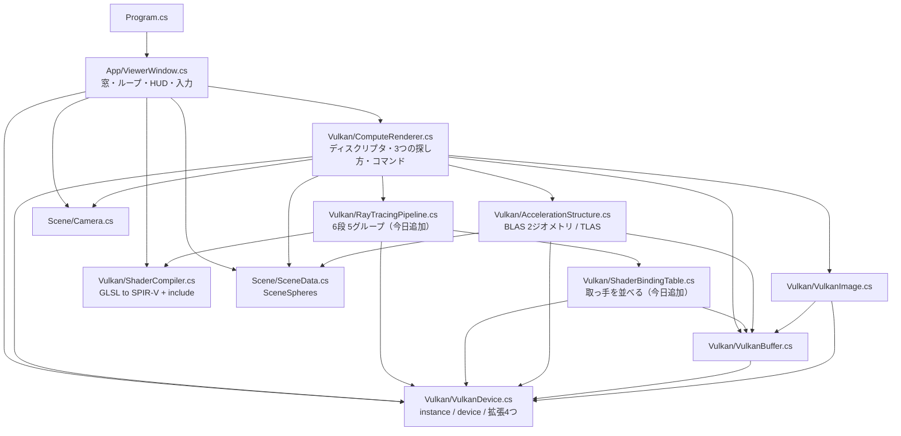
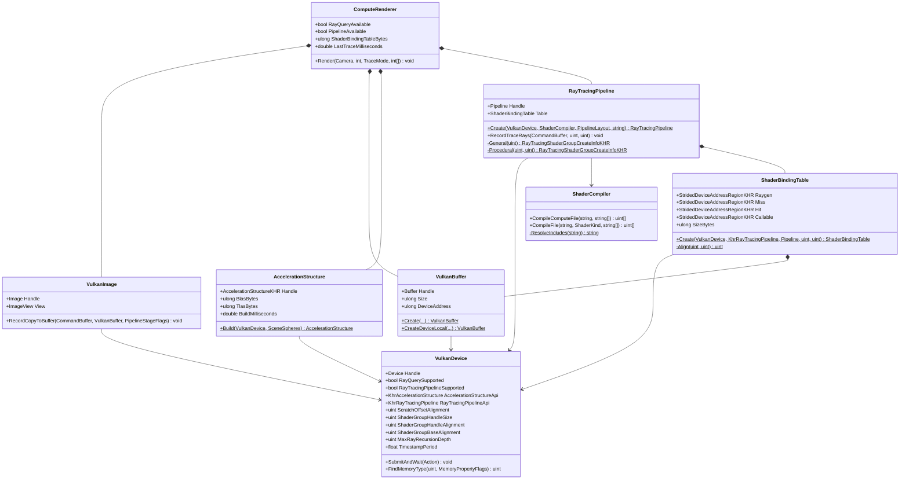
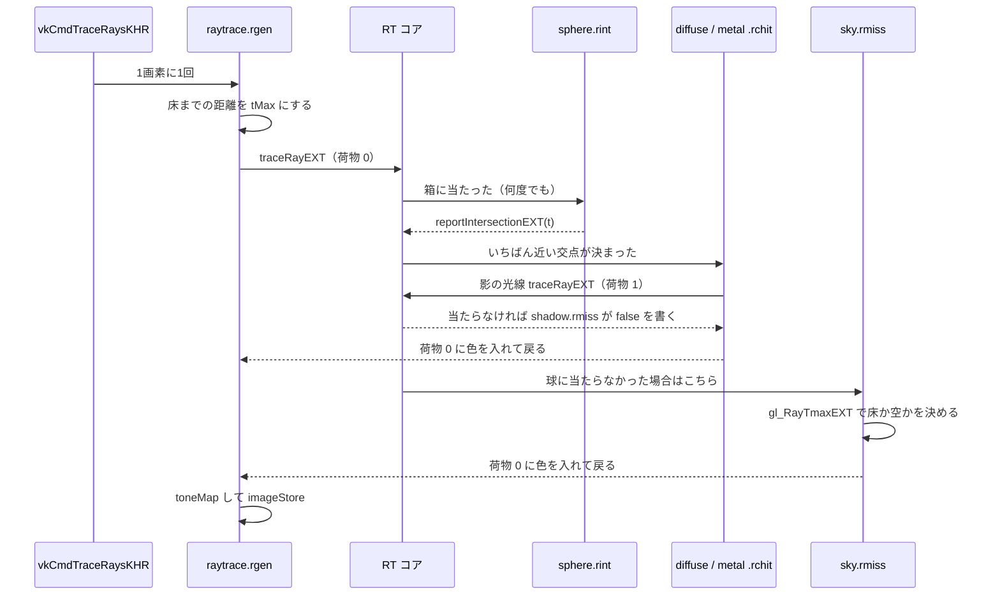
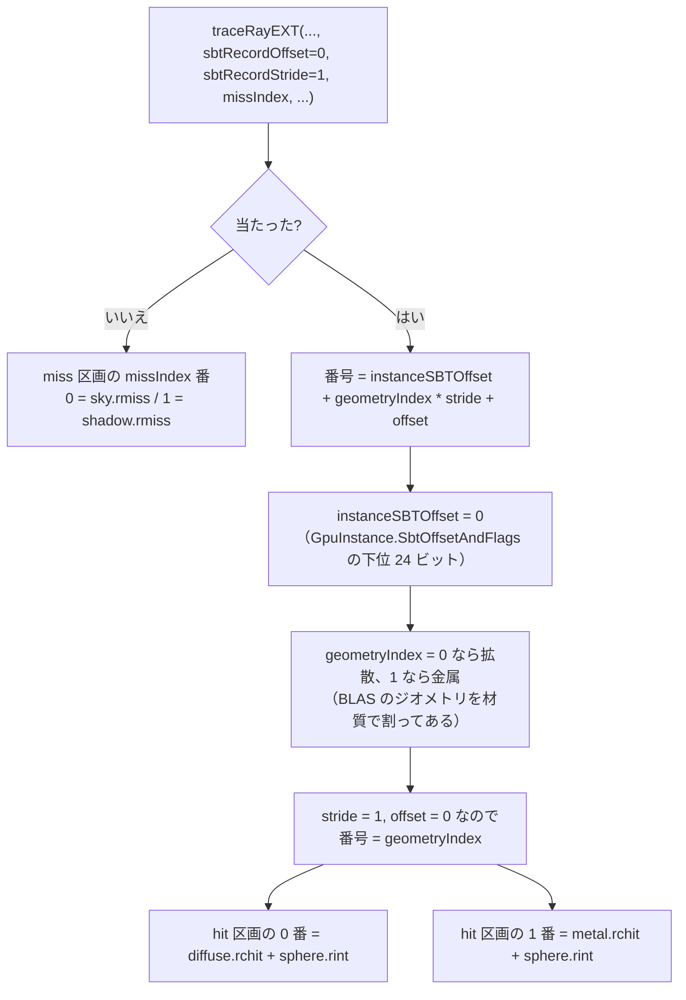
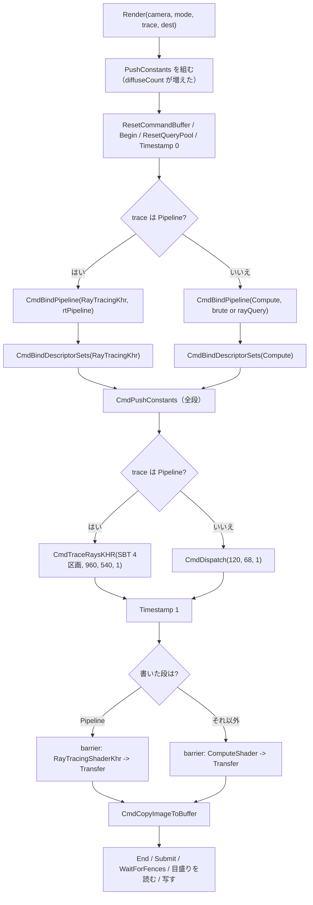

# Day 62c: レイトレーシングパイプラインと SBT — 分岐がシェーダの分割になる

**教養編の8日目**。Day 62 の3日目(最終日)で、reference は Day 62b の完全コピー + 差分。

Day 62b で「探す仕事を RT コアに渡す」ところまで来た。今日変えるのは**速さではなく形**。
同じ絵を、**もう1つの入口**から出す。

| | Day 62b: ray query | **Day 62c: RT パイプライン** |
|---|---|---|
| 入口 | コンピュートシェーダの中で**関数を呼ぶ** | **専用のパイプライン**を組んで `vkCmdTraceRaysKHR` |
| シェーダの本数 | 1本 | **6本**(raygen / miss x2 / closest-hit x2 / intersection) |
| 材質の切り替え | `if (hit.kind == 1)` の**分岐** | **SBT がどのシェーダを呼ぶか決める** |
| 反射 | `for` ループ + `throughput` の掛け算 | **本物の再帰**(シェーダが自分を呼び直す) |
| ワークグループの大きさ | `local_size_x = 8` と自分で書く | **書く場所が無い**(ドライバが決める) |
| 速さ(球 5000 個。連続計測) | 0.21 ms | **0.20 ms** |

**速さはほとんど変わらない**——同じ RT コアを違う呼び方で使っているだけだから。
Day 62b の x150 のような派手な数字は今日は出ない。今日の収穫は**コードの形が変わること**。

今日の差分は**新規 9 ファイル**(C# 422 行 + GLSL 472 行)と
**変更 10 ファイル**(+553 / −341 行)。`shaders/trace.comp` が 223 行減っているのは、
共通部分を `common.glsl` に追い出したため。

> **`if` が消えて、代わりに「表」が増えた**
> Day 62b の `trace.comp` にあった `if (hit.kind == 1)` という1行が、今日は
> `diffuse.rchit` と `metal.rchit` という**2本のシェーダ**になる。どちらが呼ばれるかは
> コードのどこにも書いていない——**BLAS のジオメトリ番号**と**SBT の並び**が決める。
> これは「分かりにくくなった」でもあるし、「材質が 50 種類あっても1本のシェーダが太らない」でもある。
> 現代の RT 対応ゲームがこの形をしている理由は、後者のほう。

## 今日のゴール

**起動すると Day 62a・62b とまったく同じ絵が出る。HUD の「探し方」が
「RT パイプライン + SBT」になっていて、`B` を押すと ray query → 総当たり → RT パイプライン と回る。
`4` で球を 5000 個にしても、RT パイプラインと ray query はどちらも 2ms 足らずのまま
(総当たりだけが 42ms に跳ね上がる)。HUD の「SBT」の行に **192 バイト**と出ている。**

| キー | 何が起きるか |
|---|---|
| `B` | **探し方(RT パイプライン → 総当たり → ray query)。今日の目** |
| `1` / `2` / `3` / `4` | 球の数(8 / 120 / 720 / 5000) |
| `M` | 表示(陰影 → 法線 → 交差判定の回数 → 同・細かい目盛り) |
| 左ドラッグ / ホイール / `R` / `H` / `Esc` | Day 62a のまま |

> **`M` の3つ目・4つ目は RT パイプラインでは意味を持たない**(真っ黒になる)。
> 交差判定の回数を数えている `gTests` は `trace.comp` の中の変数で、
> RT パイプライン側には数える場所が無い。その事実自体が要点5 の話になる。

### 今日いちばん大事な3つ

**1つ目は「段(stage)とグループ(group)は別物」**(要点2)。
レイトレーシングパイプラインには**シェーダが6本**入るが、SBT に並ぶのは**5つ**。

```
  段 0: raytrace.rgen      →  グループ 0: general       → SBT raygen 区画
  段 1: sky.rmiss          →  グループ 1: general       → SBT miss 区画 [0]
  段 2: shadow.rmiss       →  グループ 2: general       → SBT miss 区画 [1]
  段 3: diffuse.rchit   ┐
  段 5: sphere.rint     ┴─→  グループ 3: procedural    → SBT hit 区画 [0]
  段 4: metal.rchit     ┐
  段 5: sphere.rint     ┴─→  グループ 4: procedural    → SBT hit 区画 [1]
```

`sphere.rint` は**単独では呼べない**——箱の中で球を解く仕事は、
「当たったら何をするか(closest-hit)」とセットでないと意味が無いので、
**2つのグループに同じものが入る**。

**2つ目は「どのシェーダが呼ばれるかは、3つの数の足し算で決まる」**(要点3)。

```
  hit グループの番号 = instanceShaderBindingTableRecordOffset   ← TLAS の実体が持つ(今日は 0)
                     + geometryIndex * sbtRecordStride          ← BLAS のジオメトリ番号(0 か 1)
                     + sbtRecordOffset                          ← traceRayEXT の引数(今日は 0)
```

今日は `sbtRecordStride = 1` にしてあるので、**ジオメトリ番号がそのままグループの番号**になる。
だから Day 62c では **BLAS のジオメトリを材質で2つに割った**——
0 番に拡散の球、1 番に金属の球。場面の作り方が、シェーダの分割に引きずられる。

**3つ目は「再帰が書ける」**(要点4)。
コンピュート版では GPU に再帰が無いので、for ループと `throughput` の掛け算にしていた。

```glsl
// Day 62a/62b (trace.comp)              // Day 62c (metal.rchit)
for (int bounce = 0; ...) {              reflected.depth = payload.depth - 1;
    throughput *= hit.albedo;            traceRayEXT(..., 2);      // 自分が呼ばれうる
    origin = ...; direction = reflect(); payload.color = f0 * reflected.color;
    continue;
}
```

レイトレーシングパイプラインは**ハードウェアがスタックを持っている**ので、素直な再帰で書ける。
深さの上限はパイプラインを作るときに宣言する(`maxPipelineRayRecursionDepth`。今日は 5、
手元の RTX 3070 の上限は 31)。**宣言より深く潜ると未定義動作**なので、
シェーダ側でも `payload.depth` を数えて止める義務がある。

## 事前に読む資料

- **[NVIDIA Vulkan Ray Tracing Tutorial](https://nvpro-samples.github.io/vk_raytracing_tutorial_KHR/)**
  の本編(BLAS/TLAS の次の章)— raygen / miss / closest-hit と SBT の組み立て。
  **今日書くコードとほぼ1対1**に並ぶ。続けて
  [Intersection Shader の章](https://nvpro-samples.github.io/vk_raytracing_tutorial_KHR/vkrt_tuto_intersection.html)
  も(procedural の hit グループ)
- **[Vulkan 1.3 仕様](https://registry.khronos.org/vulkan/specs/1.3-extensions/html/vkspec.html)** の
  **40. Ray Tracing**(とくに **40.3 Shader Binding Table** の
  「hit グループの番号の決まり方」の式と、**40.1.1** の各シェーダ段の役割)
- **[GLSL_EXT_ray_tracing 拡張仕様](https://github.com/KhronosGroup/GLSL/blob/main/extensions/ext/GLSL_EXT_ray_tracing.txt)**
  — `rayPayloadEXT` / `rayPayloadInEXT` / `hitAttributeEXT` / `traceRayEXT` /
  `reportIntersectionEXT` の**どのシェーダで何が使えるか**の表。今日いちばん引く資料
- **[Will Usher, "The RTX Shader Binding Table Three Ways"](https://www.willusher.io/graphics/2019/11/20/the-sbt-three-ways)**
  — SBT を **DXR / OptiX / Vulkan の3つの言い方**で並べて説明している記事。
  「なぜこんな仕組みなのか」がいちばんよく分かる
- **[Ray Tracing Gems](https://www.realtimerendering.com/raytracinggems/)**(無料 PDF)の
  **第 3 章 "Introduction to DirectX Raytracing"** — DXR の話だが、
  raygen / miss / hit の分け方は Vulkan と同じ。用語の対応表として便利
- **[Ray Tracing Gems II](https://www.realtimerendering.com/raytracinggems/rtg2/index.html)** の
  **第 13〜14 章**(シェーダの分割とコヒーレンス)— **なぜ分けると速くなるのか**。
  今日の場面(材質2種類)では差が出ないが、そこが分かると 62c の意味が見える
- **Day 62b の計画書** — 今日の土台。加速構造まわりは 62b のまま
- **Day 57 の計画書**(コンピュートシェーダ入門)の**ワークグループ**の節 —
  今日は `local_size` を書く場所が無くなる。**なぜ無くてよいのか**を考える材料に

## 理論の要点

### 1. 入口が2つある — ray query と RT パイプライン

ハードウェア RT を使う入口は2つあって、**どちらも同じ RT コアを叩く**。

| | ray query(62b) | RT パイプライン(62c) |
|---|---|---|
| 拡張 | `VK_KHR_ray_query` | `VK_KHR_ray_tracing_pipeline` |
| どこから撃てるか | **どのシェーダからでも**(compute / fragment / …) | **専用のパイプラインの中だけ** |
| 呼び出し | `rayQueryEXT` の関数群 | `traceRayEXT` |
| 当たった後 | **その場で続きを書く** | **別のシェーダが呼ばれる** |
| 再帰 | できない(自分でループ) | **できる**(ハードウェアのスタック) |
| 向いている使い方 | **既存のシェーダに1本足す**(影、AO、反射) | **レイトレーシングが主役**のレンダラ |

実際のゲームは**両方使う**。ラスタライズした G-Buffer からフラグメントシェーダで影の光線を1本撃つ
(ray query)のがいちばん多く、パストレーシング丸ごと(Cyberpunk の Path Tracing モードなど)は
RT パイプライン。

今日の差分は「**62b のコードを一切壊さずに、3つ目の道を足す**」形になっている。
`B` キーで3つを行き来できるのはそのため。

### 2. 段(stage)とグループ(group)

パイプラインに渡すものが2種類あって、混同しやすい。

- **段(`VkPipelineShaderStageCreateInfo`)** … シェーダのモジュール1本。今日は6本
- **グループ(`VkRayTracingShaderGroupCreateInfoKHR`)** … **SBT に並ぶ単位**。今日は5つ

グループは2種類しかない。

| グループの型 | 中身 | 使い道 |
|---|---|---|
| `GeneralKhr` | 段を1本だけ | raygen、miss、callable |
| `TrianglesHitGroupKhr` | closest-hit + any-hit | 三角形。交差判定は RT コアがやる |
| `ProceduralHitGroupKhr` | closest-hit + any-hit + **intersection** | 箱。交差判定は intersection が書く |

使わない欄には `Vk.ShaderUnusedKhr` を入れる。**0 を入れてはいけない**——
0 は「0 番の段」という意味になってしまう(そして 0 番は raygen なので、盛大に壊れる)。

`sphere.rint` が**2つのグループに同じ番号で入る**のがこの構造の分かりやすい例。
段は1本だが、グループとしては2回使われる。

### 3. SBT — 「どのシェーダを呼ぶか」の表を自分で並べる

`vkGetRayTracingShaderGroupHandlesKHR` が返すのは**取っ手**(handle)。
手元の RTX 3070 では 32 バイトの不透明なバイト列で、**中身に意味を求めてはいけない**。
アプリがやるのは「取っ手を、決められた境界に沿って、決められた順に並べる」ことだけ。

```
   0 +--------------------+  raygen 区画(size 64)
     | raygen の取っ手     |  ← Stride == Size でなければならない(仕様)
  64 +--------------------+  miss 区画(stride 32, size 64)
     | [0] sky.rmiss      |  ← traceRayEXT の missIndex = 0
     | [1] shadow.rmiss   |  ← missIndex = 1
 128 +--------------------+  hit 区画(stride 32, size 64)
     | [0] diffuse + rint |  ← ジオメトリ 0(拡散の球)
     | [1] metal   + rint |  ← ジオメトリ 1(金属の球)
 192 +--------------------+  合計 192 バイト
```

境界の決まりが2つある。

| 値 | 手元の RTX 3070 | 何に効くか |
|---|---|---|
| `shaderGroupHandleSize` | 32 | 取っ手そのものの大きさ |
| `shaderGroupHandleAlignment` | 32 | **レコードの刻み幅**はこの倍数 |
| `shaderGroupBaseAlignment` | 64 | **区画の先頭**はこの倍数 |

`baseAlignment`(64)が `handleSize`(32)より大きいので、**区画の間には必ず隙間ができる**。
raygen は取っ手1つ(32 バイト)しか無いのに区画は 64 バイト取る。

そして**hit グループの番号の決まり方**がこの仕組みの核心。

```
  番号 = instanceShaderBindingTableRecordOffset   ← TLAS の実体が持つ(GpuInstance の下位 24 ビット)
       + geometryIndex * sbtRecordStride          ← BLAS のジオメトリ番号
       + sbtRecordOffset                          ← traceRayEXT の引数
```

3つの数のどこで切り替えるかは設計の選択で、

- **実体ごとに変えたい**(この建物は木、あの建物は石)→ `instanceSBTOffset`
- **ジオメトリごとに変えたい**(1つのメッシュの中で材質が違う)→ `geometryIndex`(今日はこれ)
- **光線の種類ごとに変えたい**(一次光線と影の光線で別の hit シェーダ)→ `sbtRecordOffset`

3つ目がいちばん面白くて、実際のエンジンは `stride = 2` にして
「偶数番 = 一次光線用、奇数番 = 影用」のように並べる。影の光線には
テクスチャのアルファ抜きだけを見る軽い hit シェーダを当てる、といった使い方になる。

### 4. 再帰 — for ループが消える

`metal.rchit` の中心はこの3行。

```glsl
reflected.depth = payload.depth - 1;
traceRayEXT(topLevel, gl_RayFlagsOpaqueEXT, 0xFF, 0, 1, 0, origin, 1e-4, direction, tMax, 2);
payload.color = f0 * reflected.color;
```

反射した先でまた金属に当たれば、**このシェーダが自分を呼び直す**。
コンピュート版の

```glsl
for (int bounce = 0; bounce <= MaxBounces; bounce++) {
    ...
    throughput *= hit.albedo;      // 反射率を掛けながら降りていく
    continue;
}
```

と比べると、**状態を自分で運ばなくてよい**のが違い。`throughput` に当たるものは
呼び出しの戻り値の掛け算として自然に出てくる。

払う代償は2つ。

- **荷物(payload)の番号を自分で管理する**。入ってきた荷物と、撃つ光線の荷物は
  **別の番号**でなければならない(`location 0` で受けて `location 2` で撃つ)
- **深さの上限を宣言する**。`maxPipelineRayRecursionDepth` を小さくするほど
  ドライバが確保するスタックが減って速くなるので、「足りるだけの最小」を書く。
  今日は 5(一次 1 → 反射 3 回で 4 → その先の影で 5)

> **再帰は「速い」から使うのではない**。むしろ深い再帰はレジスタとスタックを食うので、
> 実戦のパストレーサは **RT パイプラインでもループで書く**(raygen の中で
> `traceRayEXT` を繰り返す)。再帰が嬉しいのは**書きやすさ**で、
> Whitted 風の「反射と屈折で枝分かれする」ような構造にはよく合う。

### 5. RT パイプラインは「どのシェーダが呼ばれるか」が見えない

今日のコードを読んでも、**拡散の球に当たったときに `diffuse.rchit` が呼ばれる**とは
どこにも書いていない。決めているのは、

1. `SceneData.Create` が球を**拡散が先・金属が後ろ**に並べたこと
2. `AccelerationStructure.Build` が BLAS の**ジオメトリを2つに割った**こと
3. `RayTracingPipeline.Create` が**グループ 3 に diffuse、グループ 4 に metal** を入れたこと
4. `raytrace.rgen` が `sbtRecordStride = 1` で撃っていること

の4つの合わせ技。**1つでもずれると、静かに別のシェーダが呼ばれる**
(絵が全部金属になる、など)。

これは ray query と比べて明確に**分かりにくい**。代わりに得るものは、

- **シェーダが太らない**。材質が 50 種類でも、1本のシェーダに 50 分岐を抱えなくてよい
  (GPU では分岐が多いシェーダは、実際に通らない枝のぶんまでレジスタを確保する)
- **材質ごとに別のリソースを渡せる**。SBT のレコードは取っ手の後ろに
  好きなデータを詰められるので、「この材質はこのテクスチャ」を表に埋め込める
- **ドライバがまとめられる**。同じ hit シェーダを呼ぶ光線を束ねて走らせる余地がある

もう1つ、今日ぶつかる実際的な不便がある。**`gTests` が数えられない**。
`M` の3つ目・4つ目(交差判定の回数)は `trace.comp` の中のグローバル変数を数えていたが、
RT パイプラインではシェーダが分かれているので、数を持ち回る場所が無い
(やるなら SSBO に `atomicAdd` する)。**シェーダを割ると、シェーダをまたぐ情報は
自分で運ぶ必要がある**——これは分割の代償として一般的に効いてくる。

### 6. ワークグループの大きさを書く場所が無い

`vkCmdTraceRaysKHR` に渡すのは**幅・高さ・奥行き**で、**ワークグループの数ではない**。

```csharp
_api.CmdTraceRays(cmd, &raygen, &miss, &hit, &callable, 960, 540, 1);   // 画素の数そのまま
```

シェーダ側にも `local_size_x` を書く場所が無い。束ね方は**ドライバが決める**。

理由ははっきりしていて、**レイトレーシングは隣の画素と協調しない**から。
コンピュートシェーダのワークグループは「共有メモリとバリアで協調する単位」で、
Day 57 のパーティクルはそれを使い倒した。レイトレーシングにはその必要が無く、
むしろ**当たり先が同じ光線どうしを束ねたい**(コヒーレンス)ので、
アプリが画面の格子で束ねるより、ドライバに任せたほうがよい。

### 7. 床は miss シェーダで拾う

無限の平面は箱で囲めないので BLAS に入らない(Day 62b の要点2)。
ray query 版は「球を探した後に床を手で撃つ」で済んだが、RT パイプラインでは
**球に当たったら closest-hit が呼ばれて終わってしまう**——後から床を足す場所が無い。

そこで、光線を撃つ前に**床までの距離を tMax にしておく**。

```glsl
// raytrace.rgen
float tMax = 1e30;
float floorT = floorDistance(origin, direction);
if (floorT > 1e-4) { tMax = floorT; }
traceRayEXT(..., origin, 1e-4, direction, tMax, 0);
```

こうすると、

- 床より手前に球があれば → closest-hit が呼ばれる(床は見えないので正しい)
- 球が無ければ → **miss シェーダが呼ばれ、`gl_RayTmaxEXT` が床までの距離**になっている

`sky.rmiss` はそれを見て「床か、空か」を決める。

```glsl
if (gl_RayTmaxEXT >= 1e29) { payload.color = sky(direction); }   // 空
else { /* 床を塗る。影の光線もここから撃つ */ }
```

**BLAS に入らないものを miss で拾うのは実戦でもよくやる手**で、
スカイボックスや解析的な地面・霧はだいたいこの形になる。
miss シェーダから `traceRayEXT` を呼べる(床の影)のも、この設計が成り立つ理由。

## 前Dayからの差分概要

### 新規ファイル

| ファイル | 行数 | 役割 |
|---|---|---|
| `Vulkan/RayTracingPipeline.cs` | 240 | 6段 → 5グループのパイプライン。`vkCmdTraceRaysKHR` |
| `Vulkan/ShaderBindingTable.cs` | 182 | **今日いちばん分かりにくいところ**。取っ手を境界に沿って並べる |
| `shaders/common.glsl` | 170 | 7本のシェーダが `#include` する共通部分 |
| `shaders/raytrace.rgen` | 63 | 光線を作る。1画素に1回 |
| `shaders/sky.rmiss` | 52 | 何にも当たらなかったとき。**床もここで塗る**(要点7) |
| `shaders/shadow.rmiss` | 19 | 影の光線が抜けたとき。**今日いちばん短い**(1行) |
| `shaders/diffuse.rchit` | 48 | 拡散の球に当たったとき(SBT の hit グループ 0) |
| `shaders/metal.rchit` | 79 | 金属の球に当たったとき(hit グループ 1)。**再帰する** |
| `shaders/sphere.rint` | 41 | 箱の中で球の式を解く。2つの hit グループで共有 |

### 変更ファイル

| ファイル | 差分 | 何を足したか |
|---|---|---|
| `Day62c.csproj` | コメントのみ | shaders が 1 本から 7 本になったことの説明 |
| `Vulkan/VulkanDevice.cs` | +74 / −6 | 拡張1つ・機能1つ・**SBT に要る3つの数**と `maxRayRecursionDepth` |
| `Vulkan/ShaderCompiler.cs` | +61 / −3 | `#include` の解決、種類を指定する `CompileFile` |
| `Scene/SceneData.cs` | +46 / −3 | 球を**材質で並べ替える**。`SceneSpheres` レコード |
| `Vulkan/AccelerationStructure.cs` | +105 / −52 | BLAS の**ジオメトリを2つに割る**。`BuildOne` が配列を取る形へ |
| `Vulkan/VulkanImage.cs` | +8 / −2 | バリアの「書いた段」を引数に(RT では `RayTracingShaderBitKhr`) |
| `Vulkan/ComputeRenderer.cs` | +149 / −27 | `TraceMode` 3値、`StageFlags` に RT の段、bind point の切り替え |
| `shaders/trace.comp` | +49 / −223 | **共通部分を `common.glsl` へ追い出した**。`sphereIndex` で引き直す |
| `App/ViewerWindow.cs` | +41 / −11 | `B` キーが3値に、HUD に SBT の行 |
| `Program.cs` | +20 / −14 | 説明の差し替え |

### 写経する順番

**GLSL を先に片付けると C# が読みやすい**。シェーダが何を要求しているかが分かってから
パイプラインを組むほうが、SBT の並びの意味が入りやすい。

| # | ファイル | 何が要るか / 気をつけるところ |
|---|---|---|
| 1 | `Day62c.csproj` | Day62b からリネーム + コメント。**パッケージは変わらない** |
| 2 | `Vulkan/VulkanDevice.cs` | 拡張1つ・機能1つを既存の鎖に足す。`ShaderGroupHandleSize` ほか3つを聞く |
| 3 | `Vulkan/ShaderCompiler.cs` | `CompileFile` と `ResolveIncludes`。**入れ子は許さない**1段だけの実装 |
| 4 | `Scene/SceneData.cs` | `SceneSpheres` レコードを足し、`Create` の返り値を変える |
| 5 | `Vulkan/AccelerationStructure.cs` | 4 を使う。`BuildOne` が**配列を取る形**に変わる。`Finish` を切り出す |
| 6 | `shaders/common.glsl` | **新規**。`trace.comp` から切り出した共通部分 + `sphereIndex` |
| 7 | `shaders/trace.comp` | 6 を `#include` して、重複を消す。`sphereIndex` で球を引き直す |
| 8 | `shaders/sphere.rint` | 6 を使う。`hitAttributeEXT` に法線を入れる |
| 9 | `shaders/shadow.rmiss` | 依存なし(1行) |
| 10 | `shaders/diffuse.rchit` | 6・8 を前提に。`rayPayloadInEXT` と `rayPayloadEXT` の番号に注意 |
| 11 | `shaders/metal.rchit` | 10 とほぼ同じ形 + **再帰**。荷物は `location 2` |
| 12 | `shaders/sky.rmiss` | 6 を使う。`gl_RayTmaxEXT` で床か空かを決める(要点7) |
| 13 | `shaders/raytrace.rgen` | 6 を使う。tMax を床までにしておくのを忘れない |
| 14 | `Vulkan/ShaderBindingTable.cs` | **新規**。2 の3つの数を使う。境界の切り上げが全部 |
| 15 | `Vulkan/RayTracingPipeline.cs` | **新規**。3・8〜13・14 を使う。段の並びとグループの番号を合わせる |
| 16 | `Vulkan/VulkanImage.cs` | `RecordCopyToBuffer` に引数を1つ足すだけ |
| 17 | `Vulkan/ComputeRenderer.cs` | 4・5・15・16 を使う。`TraceMode` と bind point |
| 18 | `App/ViewerWindow.cs` | 17 を使う。`B` キーと HUD |
| 19 | `Program.cs` | コメントのみ。差分0にしたいなら合わせておく |

> **途中で動かしたいなら**: 7 まで写した時点で Day 62b と同じ状態に戻る
> (総当たりと ray query が動き、絵も変わらない)。**共通部分の切り出しが正しくできたか**を
> ここで確かめておくと、15 以降で詰まったときに切り分けが楽になる。

## 設計書

Day 62b から**クラスが2つ増えた**(`RayTracingPipeline` と `ShaderBindingTable`)。
層の形は変わっていない。

### 全体構成と依存の向き



| 層 | Day 62b からの変化 |
|---|---|
| `Scene/` | `SceneSpheres` になった。依然として**誰も知らない**ただの数 |
| `Vulkan/VulkanDevice` | RT パイプラインの API と、SBT に要る3つの数を持つ |
| `Vulkan/ShaderCompiler` | `#include` を解決するようになった(**ファイルを読む**ので IO を知る) |
| **`Vulkan/ShaderBindingTable`** | **新規**。`VulkanDevice` と `VulkanBuffer` だけを知る |
| **`Vulkan/RayTracingPipeline`** | **新規**。`ShaderBindingTable` を所有する |
| `Vulkan/ComputeRenderer` | `RayTracingPipeline` も所有するようになった |

**循環は依然として無い**。`RayTracingPipeline` が `ComputeRenderer` を知らないので、
パイプラインだけを作って SBT の中身を検算する、といったことができる。

**入れ替えると何が壊れるか**を2つ。

- `ShaderBindingTable` が `RayTracingPipeline` を知らない(`Pipeline` ハンドルを引数で受け取る)
  のは、**SBT の並べ方がパイプラインの作り方と独立**だから。
  パイプラインライブラリ(`VkPipelineLibrary`)で段を後から足す作りにしても、SBT 側は変わらない
- `RayTracingPipeline` が `ShaderCompiler` を知っているのは、**6本の翻訳をまとめて面倒見る**ため。
  ここを外に出すと、呼び出し側が「どのファイルがどの種類か」を知ることになって、
  段の並びとグループの番号の対応が2か所に散る

### Vulkan — 8つのクラス



### シェーダ6本の呼ばれ方



**`Chit` から `Rt` への矢印が2本ある**のが見どころ。
`metal.rchit` は影の光線だけでなく**反射の光線**も撃ち、その先でまた自分が呼ばれる
(図では省略してある)。この「シェーダから光線が生えている」形が、
ray query との最大の違い。

### SBT の番号の決まり方



**4つの値が別々の場所で決まっている**のがこの仕組みの難しさ
(TLAS の実体 / BLAS のジオメトリ / `traceRayEXT` の引数 / SBT の並べ方)。
どれか1つずれても検証レイヤは何も言わず、**静かに別のシェーダが呼ばれる**。

### Render の中 — 探し方で何が変わるか



**分岐が3か所**ある。bind point、撃ち方、そしてバリアの「書いた段」。
3つ目を間違えても**大抵は動いてしまう**のが怖いところで、
「書き終わる前に読む」が起きるのは GPU が混んだときだけ(Day 62a の要点5 と同じ話)。

### 今日残した歪み(3つ)

**1. クラス名が実態と合っていない**。`ComputeRenderer` はもう「コンピュート」だけではなく、
レイトレーシングパイプラインも抱えている。名前を変えると
`git diff --no-index` が 500 行の削除 + 追加になって、その日の変更が読めなくなるので据え置いた。
**Day 62 の3日が終わったら `Renderer` に直す**のが素直。

**2. `M` の3つ目・4つ目が RT パイプラインでは真っ黒**。
`gTests` は `trace.comp` の中のグローバル変数で、シェーダを割ると数える場所が無くなる(要点5)。
直すなら SSBO に `atomicAdd` するが、**そのために全シェーダにバッファを1本通す**ことになるので、
今日は「割ると情報が運べなくなる」という事実を見るだけにしてある。

**3. `#include` が1段しか効かない**。入れ子を許すと循環の検出が要る。
今日は `common.glsl` 1本しかないので足りているが、
本気でやるなら shaderc の include コールバックを使う(C の関数ポインタ2本、60 行ほど)。

## 完成条件

`dotnet run --project reference/Day62c -c Release` で確かめる。

### 1. 起動: 球 120 個、RT パイプライン

- Day 62a・62b とまったく同じ絵
- HUD の「探し方」が「**RT パイプライン + SBT**」
- HUD の「SBT」の行が「**192 バイト (取っ手 32 B x 5 グループ / 区画の境界 64 B)**」
- 「うち光線追跡」が **0.15 ms 前後**

### 2. `B` を3回押して一周する(今日の目)

球 5000 個(`4`)で回すと、

| 探し方 | 1枚 | 光線追跡(アプリ内) | 参考: 連続で描いたとき |
|---|---|---|---|
| RT パイプライン | 10.9 ms | **1.5 ms 前後** | 0.20 ms |
| 総当たり | 51.8 ms | **42 ms 前後** | 30 ms |
| ray query | 9.2 ms | **0.7〜1.8 ms** | 0.21 ms |

**RT パイプラインと ray query はほとんど同じ**——同じ RT コアを違う呼び方で使っているだけ。
そして**絵が3つとも同じ**であることを、押しながら見比べて確かめる。

> **アプリ内の数は右端の列より大きく、しかも揺れる**。
> 1枚が 1ms で終わると GPU は残りの 15ms を寝て過ごし、クロックが下がったまま次のフレームを迎えるため。
> **直前に総当たりを走らせた後は速く出る**(GPU が温まっている)のが分かりやすい例で、
> 上の表の ray query が 0.7ms なのは総当たりの直後に測ったから。
> 比べるときは**同じ順番で押して、10 秒ほど待ってから読む**。

### 3. `M`: 表示を切り替える

| 表示 | RT パイプライン | ray query |
|---|---|---|
| 陰影 | 同じ | 同じ |
| 法線 | 同じ | 同じ |
| 交差判定の回数 | **真っ黒**(数える場所が無い) | ほぼ真っ黒 |
| 同・細かい目盛り | **真っ黒** | 箱の形が浮かぶ |

3つ目・4つ目が真っ黒になるのは**壊れているのではない**。要点5 のとおり、
`gTests` を数えているのは `trace.comp` の中だけなので、RT パイプライン側には
数える場所が無い(`heatColor(0)` = いちばん暗い青が出る)。

### 4. シェーダを1本だけ壊す

`shaders/metal.rchit` の中をわざと壊して保存し、`3` → `2` と押して作り直させる。

- **総当たりと ray query は動いたまま**(それらは `trace.comp` しか使わない)
- HUD にエラーが出て、`B` を押しても RT パイプラインには切り替わらない

6本が別々に翻訳されていることが、これで確かめられる。

### 5. SBT の中身を数える

HUD の 192 バイトを、自分で計算して合わせてみる。

```
  raygen 区画 : 取っ手 32 B を 区画境界 64 B に切り上げ → 64
  miss   区画 : 32 B x 2 = 64 B を 64 に切り上げ        → 64
  hit    区画 : 32 B x 2 = 64 B を 64 に切り上げ        → 64
                                                  合計 → 192
```

**シェーダ6本ぶんの「どれを呼ぶか」が、192 バイトに収まっている**。

## 検証の途中で分かったこと

### 検証1: 3つの探し方の絵を突き合わせる

Day 62b と同じやり方で、3つの絵を 518,400 画素すべて突き合わせた(基準は総当たり)。

| 球 | 表示 | ray query | RT パイプライン |
|---|---|---|---|
| 8 | 陰影 | **完全一致** | 0.001% 不一致(maxDelta 57) |
| 8 | 法線 | **完全一致** | **完全一致** |
| 120 | 陰影 | 0.003% | 0.007% |
| 120 | 法線 | **完全一致** | 0.001%(**maxDelta 1**) |
| 720 | 陰影 | 0.007% | 0.025% |
| 720 | 法線 | **完全一致** | 0.005%(maxDelta 1) |
| 5000 | 陰影 | 0.012% | 0.033% |
| 5000 | 法線 | **完全一致** | 0.010%(maxDelta 1) |

**法線の不一致が maxDelta 1 しかない**のが手がかりになった。
法線は `sphere.rint` が `(position - center) / radius` で作り、
コンピュート版は `fillSphereHit` が**同じ式**で作る。同じ式なのに最下位ビットが違う。

`common.glsl` から同じソースを読ませているので、**式そのものは1文字も違わない**。
違うのは**別々に翻訳されたこと**で、ドライバが乗算と加算をどう縮約(FMA)するかは
コンパイル単位ごとに変わりうる(Day 61 の要点5 で読んだ「同じ式でも同じ答えにならない」)。

陰影の不一致(0.025〜0.033%)が法線の不一致(0.005〜0.010%)より多いのは、
その最下位ビットの差が**影の境目で在/不在に増幅される**から。
Day 62b の残り 0.007% も足し合わさっている。

### 検証2: 打ち切り方をそろえないと 0.1% ずれた

最初に書いた `metal.rchit` は、深さを使い切ったときに

```glsl
if (payload.depth <= 0) { payload.color = f0 * sky(direction); return; }   // 空で打ち切る
```

としていた。ところがコンピュート版(`trace.comp`)の for ループは、

```glsl
if (hit.kind == 1 && bounce < MaxBounces) { ...; continue; }
color += throughput * shadeSurface(hit.albedo, ...);   // ← 最後の1回は「拡散として塗る」
```

で、**金属を拡散として塗って終わる**。この食い違いで、4回目の反射が当たった画素だけ色が変わり、
不一致が **0.095%** になっていた。

打ち切り方をコンピュート版にそろえたら **0.025%** に下がった。
差の 0.07% が「4回目の反射が金属に当たった画素」の数だったことになる。

**どちらの打ち切り方が正しいということはない**(どちらも打ち切りの嘘)。
大事なのは、**3つの探し方を突き合わせるなら、嘘のつき方までそろえる必要がある**こと。
そうしないと「移植の間違い」と「仕様の違い」が見分けられない。

### 検証3: SBT の大きさは「確保した大きさ」ではない

HUD に最初 **256 バイト**と出ていた。計算では 192 のはずで、しばらく悩んだ。

原因は `VulkanBuffer.Size` が `vkGetBufferMemoryRequirements` の返した
**`requirements.Size`** だったこと。Vulkan は要求した大きさをそのまま確保するとは限らず、
境界に切り上げる。192 を頼んで 256 が返っていた。

SBT の話をするときに出したいのは「並べた結果の大きさ」なので、
`ShaderBindingTable` 側で合計を持つようにした。
**「確保した大きさ」と「使う大きさ」は違う**——メモリを自分で確保する API では
ずっと付いて回る区別で、Day 62a の要点3 の続きにあたる。

## 改造課題

### 課題1(易): SBT の並びをわざと入れ替える

`RayTracingPipeline.Create` のグループ 3 と 4 を入れ替える(diffuse と metal)。

1. 何が起きるか予想してから走らせる
2. **検証レイヤは何も言わない**ことを確かめる(入っていれば)。なぜ言えないのか
3. 元に戻して、今度は `raytrace.rgen` の `traceRayEXT` の `sbtRecordStride` を 1 から 0 にする。
   何が起きるか。**式に戻って**説明できるか
4. `missIndex` を 0 から 1 にすると何が起きるか(空が真っ黒になるはず。なぜ)

**4つの値が別々の場所で決まっている**ことを体で覚えるための課題。

### 課題2(中): 影の光線に専用の hit グループを当てる

いまは影の光線に `gl_RayFlagsSkipClosestHitShaderEXT` を立てて、
当たったら何も呼ばないようにしている。これを**専用の hit グループ**に変える。

1. `sbtRecordStride` を **2** にして、hit 区画を4レコードにする
   (拡散・一次 / 拡散・影 / 金属・一次 / 金属・影)
2. 影の光線を `sbtRecordOffset = 1` で撃つ
3. 影用の closest-hit(`shadow.rchit`)を作り、`shadowed = true` を書くだけにする。
   `SkipClosestHitShader` は外す
4. SBT は何バイトになったか。速さは変わったか
5. これができると何が嬉しいか考える
   (ヒント: 葉っぱのアルファ抜き。**影の光線だけテクスチャを見たい**場面がある)

### 課題3(難): 再帰をやめて、raygen のループにする

実戦のパストレーサは RT パイプラインでも**再帰を使わない**(要点4)。同じことをやってみる。

1. `metal.rchit` から `traceRayEXT` を消す。代わりに `payload` に
   「次に撃つべき光線の始点と向き、掛けるべき反射率」を入れて戻る
2. `raytrace.rgen` で `for` ループを回し、`payload` を見て次の光線を撃つ
3. `maxPipelineRayRecursionDepth` を **1** に下げる。それでも動くことを確かめる
4. **速くなったか、遅くなったか**。球 5000 個の金属だらけの場面(`SceneData` の
   金属の割合を 4 個に 1 個から 2 個に 1 個へ変える)で比べる
5. 荷物(payload)が太ったぶん、レジスタの使用量はどうなったか
   (`VK_KHR_pipeline_executable_properties` で覗けるが、手っ取り早くは速さで見る)
6. **どちらの書き方が読みやすいか**。答えは一つではない

> **測るときは Release で、かつ何回か走らせて最小値を取る**。
> そして長く回しっぱなしにしない(電源に対して厳しい負荷になる)。

## Day 62 の3日をふりかえって

| | 62a | 62b | 62c |
|---|---|---|---|
| 何を足したか | Vulkan 一式 | BLAS/TLAS + ray query | RT パイプライン + SBT |
| C# の行数 | 1,274 | +660 | +553 |
| 球 5000 個の光線追跡 | (総当たり 30 ms) | **0.21 ms** | **0.20 ms** |
| 一番の収穫 | 「準備を前に寄せる」設計 | **RT コアは木の探索を肩代わりする** | **分岐がシェーダの分割になる** |

ロードマップの問い「**BLAS/TLAS とは何か、RT コアが何を肩代わりするか**」の答えは、

- **BLAS/TLAS** は2階建ての加速構造。下が図形、上が「実体 = 図形 + 置き方」。
  動くものに強くするために分かれている
- **RT コアが肩代わりするのは、木をたどること・箱(と三角形)との交差・近い順の管理**。
  三角形以外の図形の式は肩代わりしてくれない
- そして**肩代わりの効き目は、図形が増えるほど大きい**(8 個では逆に遅い)

次の Day 63(ジオメトリシェーダ + テッセレーション)は、今日までとは逆に
**「もう主流ではないが教養として知っておく」技術**に入る。
GPU に仕事を任せるという点では同じ方向を向いていて、
Day 64(メッシュシェーダ)でそれが現代の形に合流する。
