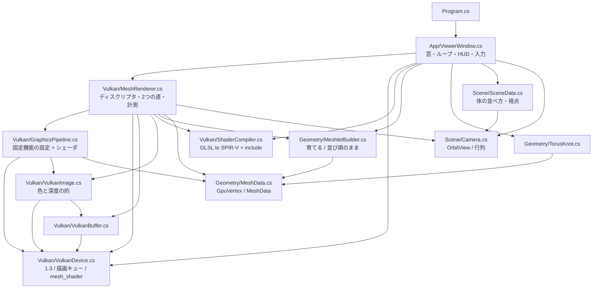
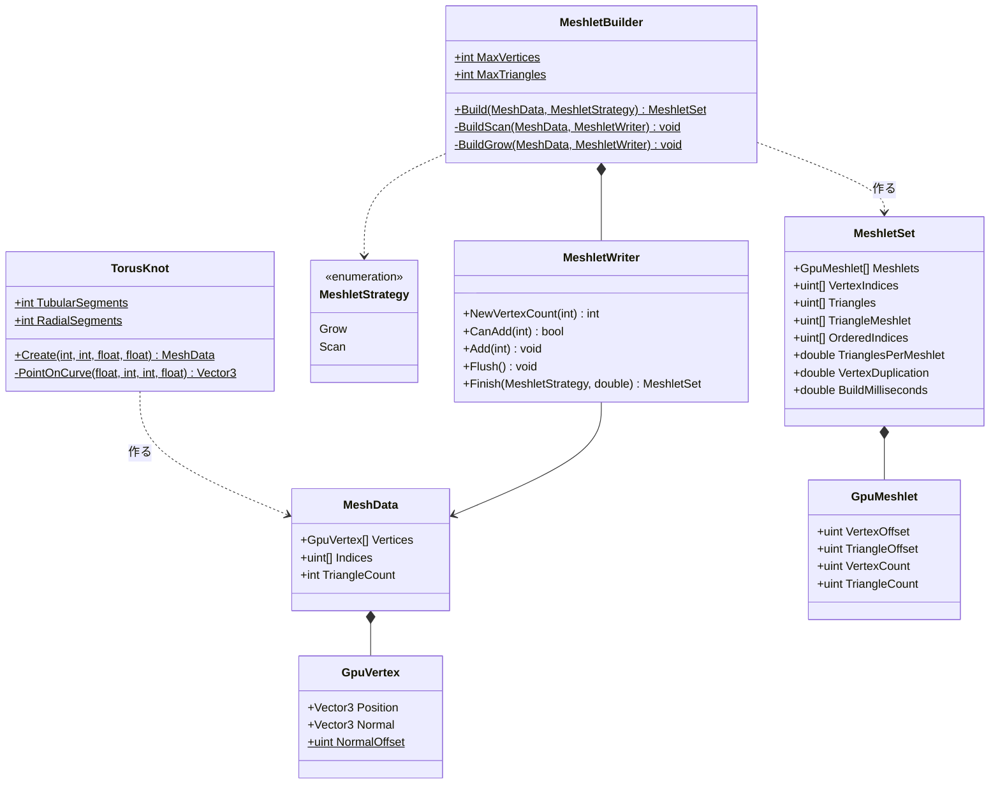
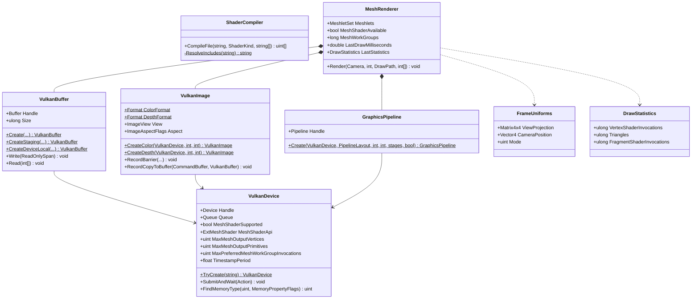
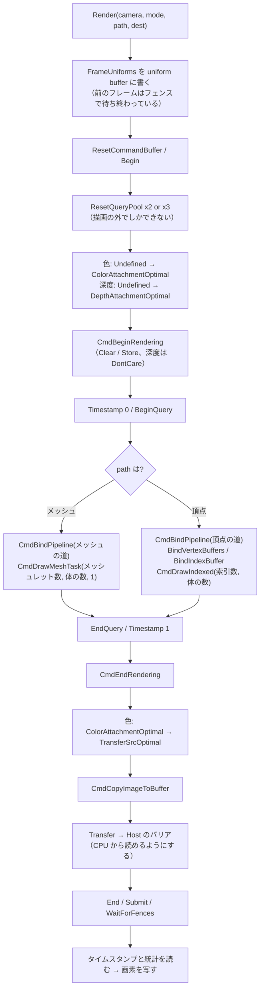
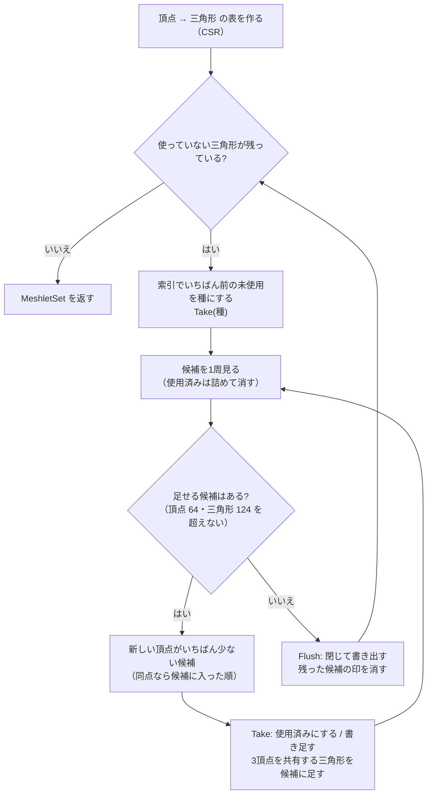
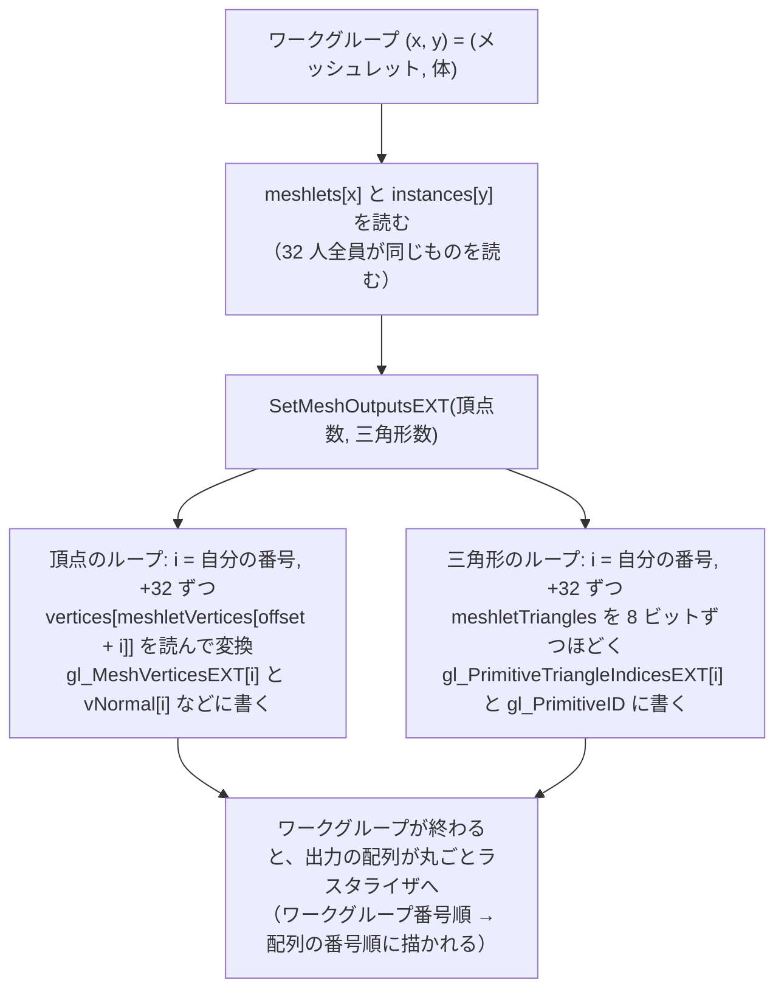

# Day 64a: メッシュシェーダ — 頂点を配らずに三角形を作る

**教養編。Day 64 の1日目**。ロードマップの Day 64(メッシュシェーダ)は1日に収まらないので、
Day 62・63 と同じく **64a / 64b の2日に割った**。

| | 今日やること | Day 63 の何と比べるか |
|---|---|---|
| **64a(今日)** | **Vulkan でラスタライズする**。メッシュレットに切って、**メッシュシェーダで描く** | 63a のジオメトリシェーダ(図形を作り直す段) |
| 64b | メッシュシェーダの手前に**タスクシェーダ**を置き、**メッシュレット単位で GPU カリング** | 63b のテッセレーション(増やす段) |

**Labs の新しいプロジェクト `MeshletRenderer`** として始める。ただし Vulkan の土台は
Day 62c の `HardwareRayTracer` から持ってくる(device・メモリ・ディスクリプタ・SPIR-V の話は Day 62a で済んでいる)。

- 置き場所: `reference/Day64a/` / 写経先は `work/Labs/MeshletRenderer/`
- 名前空間: `MeshletRenderer`(64a / 64b で共通)

今日やることは2つ。**Vulkan でラスタライズする**(Day 62 は一度もやっていない)ことと、
**同じ絵を2つの道で描いて比べる**こと。

```
  頂点シェーダの道: 索引 → [入力の回路] → 頂点シェーダ(1頂点ずつ) → ラスタライザ → 画素シェーダ
  メッシュの道    :                        メッシュシェーダ(32 人で小さなメッシュを丸ごと) → ラスタライザ → 画素シェーダ
```

Day 63a・63b の段は、どちらも**頂点シェーダの後ろに挟む**ものだった。入口(索引を読んで頂点を1つずつ配る回路)はそのまま。
メッシュシェーダは**入口ごと取り替える**。

| | ジオメトリシェーダ(63a) | テッセレーション(63b) | **メッシュシェーダ(64a)** |
|---|---|---|---|
| どこに入るか | 頂点シェーダの後ろ | 頂点シェーダの後ろ | **入力の回路と頂点シェーダの代わり** |
| 1回が受け持つもの | 図形1つ(1人) | パッチ1つ | **メッシュレット1つ(32 人)** |
| 出す量 | 実行してみるまで分からない | 回路が決める(6つの数から) | **上限を先に宣言する**(64 頂点・124 枚) |
| 出し方 | `EmitVertex` で**後ろに付け足す** | 回路が作る | **番号を指定して並行に書く** |
| 頂点の使い回し | 帯(strip)で出すので重なる | 回路が共有する | **局所番号の三角形で共有する** |
| 素通しの値段 | **4.89 倍**(OpenGL) | — | **0.80〜1.03 倍**(Vulkan、要点7) |

今日の差分は**新しく書く 10 ファイル + csproj**(C# 1,513 行 + GLSL 207 行)と、
Day 62c から持ってきて手を入れる**7 ファイル**(+363 / −512 行)。
**1日ぶんとしては重い**(Day 62a と同じくらい)。「写経する順番」は途中で区切れるように並べてある。

> **今日いちばん意外だったのは、「数える」だけでメッシュの道が 34 倍遅くなったこと**
> 2つの道を並べて測ったら、最初はメッシュの道が **2.4ms、頂点の道が 0.07ms** だった。
> シェーダの中身を削っていくと、**中身が空のメッシュシェーダでも 2.4ms** のまま——
> 犯人はシェーダではなく、「メッシュシェーダが何回走ったか」を GPU に数えさせる**パイプライン統計**だった。
> これを外すとメッシュの道は **0.070ms**、頂点の道と同じ速さになった(検証2)。
> Day 62a の「CPU の時計で測ると GPU の時間が見えない」と同じく、**測り方が測るものを変える**。

## 今日のゴール

**起動すると 960x540 の窓に、トーラスノット(結び目の形の管)が 16 体並ぶ。HUD の「描き方」が
「メッシュシェーダ」で、「内訳」の行に「メッシュシェーダ 5,488 組 x 32 人 / ラスタライザへ 三角形 524,288 枚」と出る。
`B` で頂点シェーダの道に切り替えても**絵は1画素も変わらず**、内訳が「頂点シェーダ 545,522 回」に変わる。
`M` で色をメッシュレットごとにすると、管の表面が不揃いな小片に塗り分けられる。`O` で切り方を変えると、輪切りの縞になる。**

| キー | 何が起きるか |
|---|---|
| `B` | **描き方(メッシュシェーダ ↔ 頂点シェーダ)。今日の目**。絵は変わらない |
| `M` | 表示(陰影 → メッシュレットごとの色 → 三角形ごとの色) |
| `O` | メッシュレットの切り方(育てる ↔ 並び順のまま) |
| `1` / `2` / `3` / `4` | 体の数(1 / 16 / 64 / 256)。三角形は 3 万 / 52 万 / 210 万 / 839 万枚 |
| 左ドラッグ / ホイール / `R` / `H` / `Esc` | Day 62 のまま |

### 今日いちばん大事な3つ

**1つ目は「入口ごと取り替える」**(要点1)。頂点シェーダの道では、GPU の**入力の回路**が索引を読み、
頂点を1つずつ頂点シェーダに配っていた。メッシュシェーダの道には**その回路が無い**。
パイプラインを作るコードでは、それが「2行が有るか無いか」として見える。

```csharp
// GraphicsPipeline.cs
PVertexInputState   = vertexInput ? &vertexInputState : null,   // 頂点バッファのどこに何があるか
PInputAssemblyState = vertexInput ? &inputAssembly   : null,   // 索引を3つずつ読んで三角形にする
```

代わりにメッシュシェーダは、**頂点も索引も自分でストレージバッファから読む**。

**2つ目は「小さなメッシュに切っておく」**(要点2)。メッシュシェーダの1ワークグループが出せるのは
頂点 64・三角形 124 まで(今日の設定)。だから元のメッシュを**その大きさの小片(メッシュレット)に起動前に切る**。
切り方で数が変わる。

| 切り方 | 1体あたり | 三角形 / 個 | 頂点 / 個 | 頂点の重複 |
|---|---|---|---|---|
| **育てる**(新しい頂点がいちばん増えない隣を足す) | **343 個** | 95.5 | 63.7 | **x1.33** |
| 並び順のまま | 512 個 | 64.0 | 64.0 | x2.00 |

**3つ目は「上限を先に宣言して、番号で書く」**(要点3)。Day 63a の GS は `EmitVertex()` で1つずつ後ろに付け足したので、
何個出るかが実行するまで分からなかった。メッシュシェーダは `max_vertices = 64, max_primitives = 124` を先に宣言し、
**何番目に書くかを自分で指定する**。だから 32 人が同時に書ける。

```glsl
SetMeshOutputsEXT(meshlet.vertexCount, meshlet.triangleCount);      // 実際の数(上限以下)
for (uint i = gl_LocalInvocationIndex; i < meshlet.vertexCount; i += 32u)
    gl_MeshVerticesEXT[i].gl_Position = ...;                         // i 番目に書く
for (uint i = gl_LocalInvocationIndex; i < meshlet.triangleCount; i += 32u)
    gl_PrimitiveTriangleIndicesEXT[i] = uvec3(...);                  // i 番目の三角形
```

## 事前に読む資料

- **[Khronos Blog: Mesh Shading for Vulkan](https://www.khronos.org/blog/mesh-shading-for-vulkan)** —
  VK_EXT_mesh_shader が出たときの紹介記事。**何が変わったのか**を最初に掴むのにちょうどよい長さ
- **[VK_EXT_mesh_shader の提案書(proposal)](https://github.com/KhronosGroup/Vulkan-Docs/blob/main/proposals/VK_EXT_mesh_shader.adoc)** —
  仕様になる前の「なぜこう決めたか」の文書。**Rasterization Order の節**(メッシュシェーダでも描く順番は決まっている)と、
  NV 版・D3D12 版との違いの節を読む
- **[GLSL_EXT_mesh_shader 拡張仕様](https://github.com/KhronosGroup/GLSL/blob/main/extensions/ext/GLSL_EXT_mesh_shader.txt)** —
  `SetMeshOutputsEXT` / `gl_MeshVerticesEXT` / `gl_PrimitiveTriangleIndicesEXT` / `gl_MeshPrimitivesEXT` の定義。
  **今日いちばん引く資料**。`SetMeshOutputsEXT` の「1回だけ、全員がそろって通る場所で」の決まりはここにある
- **[NVIDIA: Introduction to Turing Mesh Shaders](https://developer.nvidia.com/blog/introduction-turing-mesh-shaders/)** —
  NV 版の拡張の解説だが、**メッシュレットという考え方と 64 / 126 という数の由来**はここがいちばん詳しい
- **[Arseny Kapoulkine: Meshlet size tradeoffs](https://zeux.io/2023/01/16/meshlet-size-tradeoffs/)** —
  meshoptimizer の作者による、メッシュレットの大きさの考察。**「頂点 64 なら三角形はだいたい 98 枚」**の実測がある(要点2)
- **[AMD GPUOpen: From vertex shader to mesh shader](https://gpuopen.com/learn/mesh_shaders/mesh_shaders-from_vertex_shader_to_mesh_shader/)** —
  AMD 側から見た同じ話。**GPU の中で頂点シェーダがどう組まれていたか**の図がよい
- **[Vulkan Samples: Dynamic rendering](https://docs.vulkan.org/samples/latest/samples/extensions/dynamic_rendering/README.html)** —
  描画パスを作らずに描き始める仕組み(要点5)。今日のラスタライズの儀式はこれで短くなっている
- **[Vulkan 仕様: Queries](https://docs.vulkan.org/spec/latest/chapters/queries.html)** の
  **Pipeline Statistics Queries** と **Mesh Shader Queries** の節 — 要点6 の「数えられるものが道ごとに違う」
- **Day 63a の計画書**の冒頭の枠(GS の素通しが 4.89 倍になった理由)と、**Day 62a の計画書**の要点4〜6
  (ディスクリプタ、バリア、タイムスタンプ)。今日の Vulkan の書き方はそこからの続き

## 理論の要点

### 1. 入口ごと取り替える

頂点シェーダの道を GPU の側から見ると、こうなっている。

```
  索引バッファ ─→ [入力の回路] ─→ 頂点シェーダ ─→ [組み立て] ─→ ラスタライザ
                   │ 索引を読む              ↑ 1頂点に1回
                   │ 頂点バッファから属性を取り出す
                   └ 同じ索引が最近出ていたら、前の結果を使い回す(post-transform cache)
```

この**入力の回路**は固定機能で、プログラムできない。頂点シェーダが「自分がどの三角形の角か」を知らないのも、
隣の頂点が見えないのも、この回路が1頂点ずつ配っているから。

メッシュシェーダの道では、この回路と頂点シェーダが**丸ごと無くなり**、代わりに**コンピュートシェーダに近い段**が入る。

```
  (何も配られない) ─→ メッシュシェーダ ─→ ラスタライザ
                      ↑ ワークグループ1つ = メッシュレット1つ
                        頂点も索引も自分でストレージバッファから読む
                        三角形(3つの局所番号)も自分で書く
```

描く命令もそれに合わせて変わる。

```csharp
vk.CmdDrawIndexed(cmd, 索引の数, 体の数, 0, 0, 0);                  // 頂点の道: 「索引を何個」
meshApi.CmdDrawMeshTask(cmd, メッシュレットの数, 体の数, 1);         // メッシュの道: 「ワークグループを何組」
```

`CmdDrawMeshTask` に渡すのは**コンピュートの `CmdDispatch` と同じ、ワークグループの数**。
頂点バッファも索引バッファも挿さない(Silk.NET では `vkCmdDrawMeshTasksEXT` の末尾の s が落ちて
`CmdDrawMeshTask` という名前になっている)。

### 2. メッシュレット — 起動前に小さなメッシュに切る

メッシュシェーダの1ワークグループが出せる量には上限がある。手元の RTX 3070 では頂点 256・三角形 256 まで出せるが、
**NVIDIA の推奨は頂点 64・三角形 126**(NVIDIA のブログ)。今日は meshoptimizer に倣って **64 / 124** にした
(126 は「三角形の索引を 128 バイト単位で確保し、そこに数の 4 バイトも入る」から来た数で、
meshoptimizer は三角形の数を 4 の倍数に揃える作りなので 124 を使う)。

1つのメッシュレットが持つのは「どこから何個」の組が2つだけ(16 バイト)。

```
  GpuMeshlet { VertexOffset, TriangleOffset, VertexCount, TriangleCount }
                    │               │
                    │               └→ Triangles[]     … 局所番号3つを 8 ビットずつ詰めた uint
                    └→ VertexIndices[] … 局所番号 → 元の頂点番号
```

**局所番号が 0〜63 に収まる**のがミソで、三角形1枚が 4 バイト(元の索引は 32 ビット x 3 = 12 バイト)になる。

切り方は2つ用意した(`MeshletBuilder.cs`)。

- **並び順のまま**: 索引の先頭から三角形を詰めて、入らなくなったら次へ。10 行で済む
- **育てる**: 種の三角形から始めて、**頂点を共有している三角形のうち、新しく増える頂点がいちばん少ないもの**を足していく

トーラスノットは三角形が「管の断面を1周する帯」ごとに並んでいる(1周 32 升 = 三角形 64 枚・頂点 64 個)。
だから並び順のまま切ると、**1つのメッシュレットがちょうど1本の輪になる**(`O` で見える縞模様)。
輪の両側の円は隣のメッシュレットでも使うので、**頂点の重複率がちょうど 2.00**。

育てると、境目の短いひとつながりの小片になり、重複率は **1.33** まで下がる
(ただし**形は丸くない**。管の周りを回り込むように育つ——Day 64b で測って分かる)。

> **三角形 124 枚の上限には1つも届かない**(343 個中 0 個。頂点 64 の上限に届いたのが 340 個)。
> 格子状のメッシュでは、頂点 64 個で囲める三角形はだいたい 98 枚で(Kapoulkine の記事の実測と同じ)、
> 三角形の上限より先に頂点の上限に当たる。**平均 95.5 枚**はほぼその限界。
> 「頂点 64・三角形 124」は、上限を2つ並べておいて、先に当たったほうで切る、という意味の数。

### 3. 上限を先に宣言して、番号で書く — GS との違い

Day 63a の枠には、素通しの GS が 4.89 倍になった理由として
「出る数が実行してみるまで分からない」「出た順を守らなければならない」の2つが書いてある。
メッシュシェーダはこの2つをこう変えた。

| | GS(63a) | メッシュシェーダ(今日) |
|---|---|---|
| 出す量 | `EmitVertex` を何回呼ぶかは実行してみるまで分からない | **上限をシェーダの頭で宣言する**(`max_vertices` / `max_primitives`)。実数は `SetMeshOutputsEXT` で |
| 書く場所 | 1人が**後ろへ付け足す**(書いた時刻の順 = 出力の順) | **番号で指定する**(`gl_MeshVerticesEXT[i]`)。32 人が同時に、ばらばらの順で書いてよい |
| 描く順番 | 図形の順 → その中で付け足した順 | **ワークグループの番号順 → その中で配列の番号順**(提案書の Rasterization Order) |

**メッシュシェーダにも描く順番の約束はある**(ここを取り違えやすい)。違うのは、その順番が
**書いた時刻ではなく、配列の番号で決まる**こと。置き場所の大きさも最初から決まっている。
だから GPU は出力の場所を先に取っておけるし、中の人たちを待ち合わせさせずに書かせられる。

もう1つ、**三角形ごとの出力**が書ける。

```glsl
gl_MeshPrimitivesEXT[i].gl_PrimitiveID = int(meshlet.triangleOffset + i);
```

頂点シェーダは「頂点」しか出せないので、三角形ごとの値は作れなかった(GS はそのための段でもあった)。
今日は画素シェーダの色分けに使う番号を、これで渡している(要点7)。

### 4. 32 人で 64 頂点・124 枚 — ワークグループの組み方

`VulkanDevice` が聞いている値の中に、上限とは別に**推奨値**がある。

| 値 | 手元の RTX 3070 | 意味 |
|---|---|---|
| `maxMeshWorkGroupInvocations` | 128 | 1ワークグループの人数の上限 |
| **`maxPreferredMeshWorkGroupInvocations`** | **32** | **この人数で組むと速い**(NVIDIA のワープ1つ) |
| `maxMeshOutputVertices` / `Primitives` | 256 / 256 | 出せる量の上限 |

今日は推奨値に合わせて `local_size_x = 32` にした。64 頂点を 32 人で出すので、1人が 2 頂点、
124 枚を 32 人で出すので、1人が 4 枚(最後の組は欠ける)。ループは Day 57 のパーティクルと同じ
「自分の番号から始めて人数ぶん飛ぶ」形。

```glsl
for (uint i = gl_LocalInvocationIndex; i < meshlet.vertexCount; i += 32u)   // 0,32 / 1,33 / 2,34 / ...
```

こうすると**隣の人が隣の要素を読む**ので、メモリの読み込みが 32 人ぶん1回にまとまる。

### 5. Vulkan でラスタライズする — パイプライン・的・移し替え

Day 62 はコンピュートとレイトレーシングだけで、ラスタライザを1回も使っていない。今日はその儀式を足す。

**グラフィックスパイプライン**(`GraphicsPipeline.cs`)には、固定機能の段の設定が全部入る。
ビューポート、ラスタライズ(裏を捨てるか、表はどちら回りか)、深度、色の合成。
OpenGL で `glEnable(GL_DEPTH_TEST)` のように描く直前に変えていたものを、**作る時点で固める**。

**dynamic rendering**(Vulkan 1.3 のコア)で、描画パス(`VkRenderPass`)とフレームバッファのオブジェクトを作らずに済ませた。
パイプラインには「どの形式の的に描くか」(`PipelineRenderingCreateInfo`)だけを伝え、実物の画像は描くときに渡す。

```csharp
vk.CmdBeginRendering(cmd, &renderingInfo);   // 色の的・深度の的をここで渡す(Clear / Store も)
...描く...
vk.CmdEndRendering(cmd);
```

**画像のレイアウトの移し替え**が毎フレーム入る(`VulkanImage.RecordBarrier`)。
Day 62 の画像はシェーダが `imageStore` で書くストレージ画像で、General に置きっぱなしにできた。
ラスタライザが書く画像は**用途専用のレイアウト**に置く必要がある。

```
  色  : Undefined ─→ ColorAttachmentOptimal ─(描く)─→ TransferSrcOptimal ─(引き取る)
  深度: Undefined ─→ DepthAttachmentOptimal ─(描く)                     (引き取らない)
```

Undefined から移すのは「前の中身は捨ててよい」の意味(どうせ全部塗り直す)。

細かいが効いてくる点が2つある。

- **色の形式を `B8G8R8A8_UNORM` にできた**。Day 62 はストレージ画像にするため `R8G8B8A8` が必須で、
  シェーダの最後で `color.bgr` と並べ替えていた。ラスタライザの的なら BGRA も必須形式なので、
  WinForms が欲しい並びでそのまま描ける
- **Vulkan の画面は y が下向き**。`Camera.cs` で投影行列の y を裏返している(`projection.M22 = -projection.M22`)。
  裏返したあとも画面上の見た目は反時計回りのままなので、表の向きは `CounterClockwise` でよい
- **CPU で読む前にもバリアが1つ要る**。フェンスを待つだけでは、GPU が書いたものが CPU から見えるとは限らない
  (仕様の Fences の節の注記:「フェンスの作るメモリの依存関係は GPU の中のアクセスしか含まない」)。
  引き取りのあとに Transfer → Host のバリアを積む。**Day 62 はこれを省いていた**(NVIDIA では省いても困らなかった)

### 6. 数える — 数えられるものが道ごとに違う

HUD の「内訳」の行は、GPU に数えさせた値(パイプライン統計)。

| 道 | 数えているもの | 仕組み |
|---|---|---|
| 頂点 | 頂点シェーダの回数・クリップへ届いた三角形・画素シェーダの回数 | `QueryType.PipelineStatistics` |
| メッシュ | 画素シェーダの回数 | `QueryType.PipelineStatistics` |
| メッシュ | **メッシュシェーダが出した三角形** | `QueryType.MeshPrimitivesGeneratedExt`(別の種類のクエリ) |

**入れ物を道ごとに分けている**のには理由がある。仕様が、メッシュの描画の間に
**頂点シェーダ・入力の組み立て・クリップ**を数える統計を開いておくことを禁じている
(`VUID-vkCmdDrawMeshTasksEXT-pipelineStatistics-07076`)。メッシュの道にはそれらの段が無いから、というのが筋。
代わりに「メッシュシェーダが出した三角形の数」を数える専用のクエリがある。

そして**メッシュシェーダの回数は、数えられるが数えていない**。検証2 のとおり、それを数える統計を開いているだけで
メッシュの道が 34 倍遅くなったから。回数は「メッシュレットの数 x 体の数 x 32 人」と決まっているので、
HUD にはその計算値を出している。

数えた値から読めること(16 体、既定の視点)。

| | 頂点の道 | メッシュの道 |
|---|---|---|
| 頂点を変換した回数 | **545,522**(頂点シェーダの回数。数えた値) | **349,728**(メッシュレットの頂点の総数 x 16 体。計算) |
| 元の頂点の数 x 16 体 | 262,144 | 262,144 |
| 比 | **2.08 倍** | **1.33 倍** |
| ラスタライザへの三角形 | 524,288 | 524,288 |
| 画素シェーダ | 195,990 | 195,990 |

**頂点の道のほうが頂点を多く変換している**。post-transform cache(要点1)は索引の並びの「最近」しか覚えていないので、
帯の向こう側で同じ頂点がまた出てきたときには忘れている。メッシュレットは「このメッシュレットの頂点は 64 個」と
最初から決まっているので、中では1回ずつしか変換しない(境目の頂点だけが隣でもう1回)。

### 7. 同じ絵を出すための約束 — そして値段

2つの道の絵を、既定の条件で**全画素突き合わせて一致**させた(検証1)。そのために守っていることが3つある。

1. **頂点の道の索引を、メッシュレットの順に並べ直す**(`MeshletSet.OrderedIndices`)。
   こうすると「k 番目の三角形」が2つの道で同じ三角形を指す
2. **`gl_PrimitiveID` を揃える**。頂点の道では GPU が数える(1体ぶんの描画の中で何枚目か)。
   メッシュの道ではメッシュシェーダが `triangleOffset + i` を書く。どちらも「1. で並べ直した索引の k 番目」になる
3. **式の順番を揃える**。`world = model * p; clip = viewProj * world` の2段で、どちらのシェーダも同じ順に掛ける。
   `viewProj * model` を先に掛けると丸め方が変わって、深度の最下位ビットがずれる

その上で値段を比べた。**1フレームずつ交互に描いて**(同じ GPU のクロックの状態で比べるため)、16 回の最小値を取った。

| 体の数(三角形) | 育てる: メッシュ / 頂点 | 並び順のまま: メッシュ / 頂点 |
|---|---|---|
| 1(3 万) | 1.00 | 0.90 |
| 16(52 万) | 1.03 | 1.02〜1.03 |
| 64(210 万) | 0.87 | 0.89 |
| 256(839 万) | 0.88 | 0.80〜0.82 |

**素通しのメッシュシェーダは、頂点シェーダとほぼ同じ値段で、数が増えると少し速い**。
Day 63a の素通しの GS が 4.89 倍だったのと比べると、「GS をやめて作り直した」理由がこの数に出ている
(ただし 63a は OpenGL、今日は Vulkan で、API も場面も違う。比べてよいのは「倍率」まで)。

> **「育てる」のほうが速いわけではない**。重複率は育てるほうが低い(1.33 対 2.00)のに、
> 256 体では並び順のままのほうが 10% ほど速かった(検証3)。今日の場面では頂点の変換が詰まりどころではないらしい。
> **切り方の良し悪しが効いてくるのは Day 64b**——輪切りのメッシュレットは法線があらゆる向きを向いているので、
> 「丸ごと裏を向いている」と言えず、カリングが効かない。

## 前Dayからの差分概要

新しいプロジェクトなので、**前Day = Day 62c(Vulkan の土台の出どころ)**として差分を取っている。

### 新しく書くファイル

`SceneData.cs` と `common.glsl` は **Day 62c に同名のファイルがあるが、中身は別物**なので持ってこずに新しく書く。

| ファイル | 行数 | 役割 |
|---|---|---|
| `Day64a.csproj`(写経先では `MeshletRenderer.csproj`) | 73 | 名前空間 `MeshletRenderer`、**KHR のパッケージを入れない**、shaders の説明 |
| `Scene/SceneData.cs` | 63 | トーラスノットを格子に並べる置き方と視点 |
| `Geometry/MeshData.cs` | 48 | `GpuVertex`(32 バイト)と `MeshData`(頂点 + 索引) |
| `Geometry/TorusKnot.cs` | 108 | トーラスノットを作る。頂点 16,384・三角形 32,768 |
| `Geometry/MeshletBuilder.cs` | 431 | **今日の主役その1**。2つの切り方、`GpuMeshlet`、`MeshletSet` |
| `Vulkan/GraphicsPipeline.cs` | 250 | グラフィックスパイプライン。**2つの道の差は2行** |
| `Vulkan/MeshRenderer.cs` | 613 | ディスクリプタ・2本のパイプライン・毎フレームのコマンド・計測 |
| `shaders/common.glsl` | 58 | バッファの一覧(binding 0〜6)と色の関数 |
| `shaders/scene.vert` | 31 | 頂点シェーダ(比べるための従来の道) |
| `shaders/meshlet.mesh` | 68 | **今日の主役その2**。メッシュシェーダ |
| `shaders/shade.frag` | 50 | 画素シェーダ。2つの道で同じ1本 |

### Day 62c から持ってきて変えるファイル

| ファイル | 差分 | 何を変えたか |
|---|---|---|
| `Vulkan/VulkanDevice.cs` | +110 / −197 | 版 1.3、**描画キュー**、拡張を `VK_EXT_mesh_shader` 1つに、機能の鎖、メッシュシェーダの上限 |
| `Vulkan/VulkanBuffer.cs` | +3 / −42 | GPU のアドレス(`DeviceAddress`)まわりを外す(加速構造にしか使っていなかった) |
| `Vulkan/ShaderCompiler.cs` | +19 / −25 | `CompileComputeFile` を外し、`CompileFile` に説明を寄せる |
| `Vulkan/VulkanImage.cs` | +92 / −108 | **色と深度の的**になれるように。`RecordBarrier` を外に出す |
| `Scene/Camera.cs` | +44 / −22 | 光線の3軸 → **ビュー・投影の行列**(y を裏返す)。3軸は使わなくなったので消す |
| `App/ViewerWindow.cs` | +78 / −90 | `B` が描き方、`O` が増え、HUD に内訳 |
| `Program.cs` | +17 / −28 | 説明の差し替え(コメントのみ) |

差分の行数は、namespace の行を置き換えたあとの Day 62c と比べたもの。

### 持ってこないファイル

`Vulkan/AccelerationStructure.cs` / `ComputeRenderer.cs` / `RayTracingPipeline.cs` / `ShaderBindingTable.cs`、
`shaders/` の `trace.comp` と `.r*` の6本。レイトレーシング専用なので、新しいプロジェクトには持ってこない。

### 写経の始め方

1. `work/Labs/MeshletRenderer/` を作る
2. `work/Labs/HardwareRayTracer/` から次の7つをコピーする。**ほかは持ってこない**
   - `Vulkan/VulkanDevice.cs` / `VulkanBuffer.cs` / `VulkanImage.cs` / `ShaderCompiler.cs`
   - `Scene/Camera.cs`
   - `App/ViewerWindow.cs` / `Program.cs`
3. 7つの `namespace HardwareRayTracer;` を `namespace MeshletRenderer;` に置き換える
4. csproj は `reference/Day64a/Day64a.csproj` を見ながら `MeshletRenderer.csproj` として新しく書く
5. 以降は `./diff.sh Day64a` で差分を見ながら、下の順に写す

> **ビルドが通るのは 15 まで写した時点**(`ViewerWindow` が Day 62 の `ComputeRenderer` を呼んだままなので)。
> 途中で型の間違いを見たいときは `dotnet build` して、`ViewerWindow.cs` 以外にエラーが出ていないことを確かめればよい。

### 写経する順番

| # | ファイル | 何が要るか / 気をつけるところ |
|---|---|---|
| 1 | `MeshletRenderer.csproj`(= `Day64a.csproj`) | **新規**。`Extensions.KHR` を入れない。`RootNamespace` は `MeshletRenderer` |
| 2 | `Vulkan/VulkanDevice.cs` | 版 1.3、`FindGraphicsQueueFamily`、機能の鎖(meshShader → Vulkan13 → Features2)。**`GeometryShader = true` を忘れない**(検証4) |
| 3 | `Vulkan/VulkanBuffer.cs` | 消すだけ(`DeviceAddress` と `MemoryAllocateFlagsInfo`) |
| 4 | `Vulkan/ShaderCompiler.cs` | 消すだけ + コメント。翻訳先(Vulkan 1.2 / SPIR-V 1.5)は変えない |
| 5 | `Vulkan/VulkanImage.cs` | `CreateColor` / `CreateDepth` / `RecordBarrier`。`RecordCopyToBuffer` からバリアを外す |
| 6 | `Scene/Camera.cs` | 行列3つ。`projection.M22 = -projection.M22` |
| 7 | `Scene/SceneData.cs` | **新規**(Day 62c の同名とは別物)。6 の `OrbitView` を使う |
| 8 | `Geometry/MeshData.cs` | **新規**。`GpuVertex` は 32 バイト(`vec3` を 16 バイトに揃える) |
| 9 | `Geometry/TorusKnot.cs` | **新規**。8 を使う。三角形の並び(帯ごと)が 10 の「並び順のまま」の前提 |
| 10 | `Geometry/MeshletBuilder.cs` | **新規**。8 を使う。`MeshletWriter`(足す・閉じる)を先に書くと、2つの切り方が短く読める |
| 11 | `shaders/common.glsl` | **新規**(Day 62c の同名とは別物)。binding の番号を 14 と見比べながら |
| 12 | `shaders/scene.vert` / `shade.frag` / `meshlet.mesh` | **新規**。11 を `#include`。`meshlet.mesh` の `max_vertices` / `max_primitives` を 10 の定数と揃える |
| 13 | `Vulkan/GraphicsPipeline.cs` | **新規**。5・8 を使う。`PVertexInputState` / `PInputAssemblyState` の2行が今日の要点1 |
| 14 | `Vulkan/MeshRenderer.cs` | **新規**。2・5・6・10・13 を使う。統計の入れ物が道ごとに分かれている(要点6) |
| 15 | `App/ViewerWindow.cs` | 7・9・10・14 を使う。`B` / `O` / `M`、HUD の「分割」「内訳」 |
| 16 | `Program.cs` | コメントのみ。差分0にしたいなら合わせておく |

> **途中で動かしたいなら**: 14 まで写した時点で、`ViewerWindow.cs` の `RebuildRenderer` と `Render` の呼び出しだけを先に直すと、
> 頂点の道(`B`)で絵が出る。**頂点の道で絵が正しく出てから**メッシュの道を確かめると、
> 「Vulkan のラスタライズの儀式が間違っている」のか「メッシュシェーダが間違っている」のかを分けられる。

## 設計書

**新しいプロジェクトの初日**なので、全体を描き起こす。Day 62c の `HardwareRayTracer` と比べて、
`Scene/` と `Vulkan/` の形は引き継ぎ、**`Geometry/` が増えた**。

### 全体構成と依存の向き



| 層 | 知っているもの | 知らないもの |
|---|---|---|
| `Geometry/` | 自分の中だけ(`MeshData` が土台) | **Vulkan を知らない**。メッシュレットは CPU の配列として作る |
| `Scene/` | 自分の中だけ | 形も GPU も知らない。数と行列だけ |
| `Vulkan/` | `Geometry/` の型(`GpuVertex` / `MeshletSet`)と `Camera` | 窓を知らない。`MeshRenderer` は `int[]` に絵を返すだけ |
| `App/` | 全部 | — |

**循環は無い**。`Geometry/` が Vulkan を知らないので、メッシュレットの切り方だけを CPU で試して
数(個数・重複率)を比べる、ということができる(検証用のハーネスもそうしている)。

**入れ替えると何が壊れるか**を2つ。

- `GraphicsPipeline` が `GpuVertex` を知っているのは、**頂点の道の属性の宣言**(32 バイトずつ、16 バイト目に法線)のため。
  頂点の形式を変えるとここも変える必要がある(今日残した歪み1)
- `MeshRenderer` が `MeshletSet` を受け取るのは、**GPU に送る配列4本を丸ごと持っていく**ため。
  メッシュレットの作り方(`MeshletBuilder`)には依存していないので、切り方を差し替えても `MeshRenderer` は変わらない

### Geometry — 形とメッシュレット



`MeshletWriter` は `MeshletBuilder` の中の private クラス。**2つの切り方は「どの三角形をどの順に足すか」だけが違う**ので、
足す・閉じる・書き出すはここに1つだけ書いてある。

### Vulkan — 7つのクラス



`MeshRenderer` が持つ `GraphicsPipeline` は2本(頂点の道とメッシュの道)。どちらも同じディスクリプタセットと
パイプラインレイアウトを使う。**切り替えは `CmdBindPipeline` に渡すハンドルが変わるだけ**で、作り直しは起きない
(Day 62b の「準備を前に寄せる」と同じ)。

### GPU に挿さっているもの — binding の一覧

`common.glsl` と `MeshRenderer.cs` の `buffers` の並びが 1 対 1 に対応する。

| binding | 中身 | 型 | 読む段 |
|---|---|---|---|
| 0 | `Frame`(行列・目の位置・表示) | uniform | 全部 |
| 1 | 頂点(`GpuVertex[]`) | storage | メッシュ(頂点の道は**同じバッファを頂点バッファとして**読む) |
| 2 | 体ごとの行列 | storage | 頂点・メッシュ |
| 3 | メッシュレット(`GpuMeshlet[]`) | storage | メッシュ |
| 4 | 局所番号 → 元の頂点番号 | storage | メッシュ |
| 5 | 三角形(局所番号3つ) | storage | メッシュ |
| 6 | 三角形 → メッシュレット | storage | 画素(色分け) |
| — | 並べ直した索引(`OrderedIndices`) | **索引バッファ** | 頂点の道の入力の回路 |

**頂点のバッファ1本を2つの使い道で宣言している**(`VertexBufferBit | StorageBufferBit`)のが要点1 の見える形。
頂点の道では入力の回路が読み、メッシュの道ではメッシュシェーダが自分で読む。

### 1フレームの流れ — `MeshRenderer.Render`



**分岐は描く命令の1か所だけ**。的の用意も引き取りも、2つの道で同じ。
Day 62c の `Render` は分岐が3か所(bind point、撃ち方、バリアの段)あったのに比べると素直になった——
ラスタライザの後ろは2つの道で同じだから。

### メッシュレットが育つまで — `BuildGrow`



**点数は「新しく増える頂点の数」だけ**(0 / 1 / 2)。0 は隙間を埋める三角形、1 は縁に1枚貼り足す三角形で、
0 を優先するので隙間を残さずに広がる。ただし**同点なら候補に入った順**で選ぶので、形は丸くならない。
meshoptimizer はここに「中心からの距離」や「法線の揃い方」も混ぜている(改造課題3、Day 64b)。

### メッシュシェーダの1ワークグループの中



頂点のループと三角形のループは**互いを待たない**。三角形は局所番号で頂点を指すだけで、
頂点の中身が書き終わっているかどうかは気にしなくてよい(使われるのはワークグループが終わってから)。

### 今日残した歪み(3つ)

**1. `GraphicsPipeline` が頂点の形式を知っている**。頂点の道の属性の宣言(`GpuVertex` の 32 バイト)が
パイプラインを作るコードの中に書いてある。本来は「頂点の形式」を別の型にして渡すべきで、
形式が1つしかない今日は直していない。メッシュの道はこの宣言を**そもそも持たない**ので、
メッシュシェーダだけのエンジンならこの歪みは消える。

**2. 統計の入れ物を道ごとに持っている**。`_vertexStatistics` と `_meshStatistics` と `_meshPrimitives` の3つで、
読み出しも分岐している。仕様の制約(要点6)から来ているので避けられないが、Day 64b でタスクシェーダが入ると
**数えたいものがさらに変わる**(タスクシェーダが捨てたメッシュレットの数)。そこは統計ではなく
自分でバッファに数える形になる。

**3. メッシュレットを体ごとに持っていない**。1体ぶんのメッシュレットを全部の体で使い回している(インスタンシング)。
今日はこれで正しいが、**メッシュレットの境界の球や法線の向き**(Day 64b)も1体ぶんしか作らないので、
カリングのときに体の行列で動かしてから比べる必要がある。

## 完成条件

`dotnet run --project reference/Day64a -c Release` で確かめる。

### 1. 起動: 16 体、メッシュシェーダ

- 16 体のトーラスノットが、手前から奥へ並んで見える
- HUD の「描き方」が「**メッシュシェーダ**」
- 「分割」が「**育てる (O)  1体 343 個 / 三角形 95.5 枚・頂点 63.7 個 (個あたり) / 頂点の重複 x1.33**」
- 「内訳」が「**メッシュシェーダ 5,488 組 x 32 人 / ラスタライザへ 三角形 524,288 枚 / 画素シェーダ 195,990 回**」
- 「うち描画」が 0.2〜0.3 ms 前後(アプリ内。60 枚/秒に合わせて休んでいるので、GPU のクロックが下がって大きめに出る)

### 2. `B` を押す: 頂点シェーダの道(今日の目)

- **絵が変わらない**(全画素一致。検証1)
- 「内訳」が「**頂点シェーダ 545,522 回** / ラスタライザへ 三角形 524,288 枚 / 画素シェーダ 195,990 回」に変わる。
  三角形と画素は同じで、**変換した頂点の数だけが違う**(要点6)

### 3. `4` を押す: 256 体

- 三角形 839 万枚。見渡す限りトーラスノットが並ぶ
- アプリ内の「うち描画」: メッシュの道 **2.35 ms**、頂点の道 **2.52 ms**(`B` で行き来して、10 秒ほど待ってから読む)
- 「内訳」: メッシュの道 87,808 組 x 32 人 / 頂点の道 8,728,562 回。三角形はどちらも 8,388,608 枚

### 4. `M` と `O` で切り方を見る

`1` で1体にしてから `M` を1回押す(メッシュレットごとの色)。

- 育てる: 管の表面が**不揃いな小片**に塗り分けられる(1体 343 個)
- `O` で並び順のまま: **輪切りの縞**になる(1体 512 個、重複 x2.00)。1本の縞 = 1つのメッシュレット = 管の断面1周

`M` をもう1回押すと三角形ごとの色(1体 32,768 枚の細かさが見える)。この表示でも `B` で絵は変わらない。

### 5. シェーダを1本だけ壊す

`shaders/meshlet.mesh` の中をわざと壊して保存し、`2` → `1` と押して作り直させる。

- HUD にエラーが出て、レンダラが作られない(**頂点の道も描けなくなる**)。
  2本のパイプラインを同じ `MeshRenderer` の中でまとめて作っているため。Day 62c のように片方だけ生き残る作りにはしていない

## 検証の途中で分かったこと

窓の無いハーネス(reference のソースを取り込んで、`MeshRenderer` を直接呼ぶ)で確かめた。
環境は RTX 3070 / ドライバ 596.49、**検証レイヤなし**。

### 検証1: 2つの道の絵を突き合わせる

切り方 2 通り x 体の数 4 通り x 表示 3 通り = **24 通り**で、2つの道の絵を 518,400 画素すべて突き合わせた。

**24 通りとも完全一致**(1画素も違わない)。Day 62c の3つの探し方では最下位ビットのずれ(別々に翻訳したときの
FMA の縮約の違い)が残ったが、今日は要点7 の3つを守った結果、ずれが出なかった。

3つ目(式の順番)の効き目も確かめた。メッシュシェーダだけ `(frame.viewProj * model) * p` と先に行列どうしを掛けると、

| 体の数 | 頂点の道と違う画素 |
|---|---|
| 1 | 3 |
| 16 | 29 |
| 256 | 64 |

数は少ないが、**ゼロではなくなる**。数学的には同じ式でも、掛ける順が変われば丸め方が変わり、
2つの物が重なる縁で「どちらが手前か」の判定が入れ替わる。

### 検証2: 数えるだけで 34 倍遅くなった

最初の版は、メッシュの道の統計に**メッシュシェーダの回数**(`MeshShaderInvocationsBitExt`)も入れていた。
そのとき 16 体で測った GPU の時間(描く命令だけ、最小値)。

| メッシュシェーダの中身 | 描く命令 |
|---|---|
| そのまま | 2.419 ms |
| `gl_PrimitiveID` を書かない | 2.399 ms |
| 位置だけ出す | 2.442 ms |
| `frame.viewProj` を読まない | 2.421 ms |
| 頂点を読まない | 2.429 ms |
| **何もしない**(`SetMeshOutputsEXT(0, 0)` で返る) | **2.424 ms** |
| (頂点の道) | 0.071 ms |

中身を削っても何も変わらない。**ワークグループ1つあたり 0.44us** で、まるで1つずつ順番に走っているような数字。
そこで C# 側のクエリを1つずつ外した。

| 開いていたクエリ | メッシュの道 |
|---|---|
| 統計(画素 + メッシュシェーダの回数)+ 三角形の数 | 2.43 ms |
| 統計(**メッシュシェーダの回数だけ**) | **2.39 ms** |
| 統計(画素だけ)+ 三角形の数 | **0.072 ms** |
| 何も開かない | 0.070 ms |

**メッシュシェーダの回数を数える統計を開いているだけで 34 倍**。画素の回数と三角形の数は、数えてもただ。
仕様上は正しく数えられる項目で、値も正しかった(メッシュレット数 x 32 人と一致)。
ドライバがこの項目を数えるためにワークグループを1つずつ流している、というのが素直な推測だが、確かめる手段は無い。

HUD の数字は「数えているとき」の値でもあるので、**数えることで値段が変わるなら、その値段は測っていないのと同じ**。
今日はこの項目を外し、回数は計算で出している(`MeshRenderer.MeshWorkGroups`)。

### 検証3: 「並び順のまま」のほうが速かった

2つの道を1フレームずつ交互に 16 回ずつ描き、最小値を取った(2回走らせた)。

| 体の数 | 育てる: 頂点 / メッシュ(ms) | 並び順のまま: 頂点 / メッシュ(ms) |
|---|---|---|
| 1 | 0.010 / 0.010 | 0.010 / 0.009 |
| 16 | 0.070 / 0.072 | 0.063〜0.065 / 0.066 |
| 64 | 0.256 / 0.222〜0.223 | 0.548〜0.560 / 0.486〜0.499 |
| 256 | 2.49〜2.68 / 2.19〜2.35 | 2.44〜2.56 / 2.00〜2.05 |

2つのことが読める。

- **メッシュの道は頂点の道とほぼ同じで、数が増えると 10〜20% 速い**。要点7 の表はこの比
- **256 体では「並び順のまま」のほうが 10% ほど速い**。重複率は育てるほうが低い(1.33 対 2.00)ので、
  頂点の変換の量では説明できない。輪切りのメッシュレットは三角形 64 枚ちょうどで、出力の置き場所の粒度
  (`meshOutputPerPrimitiveGranularity` = 32)にぴったり収まる、1つのメッシュレットの三角形が画面の広い範囲に散る、
  などが考えられるが、**今日は切り分けていない**

> **絶対値は信用しないこと**。同じ条件でも走らせるたびに 1〜2 割動き、64 体の頂点の道が 0.256 と 0.548 に分かれたように、
> GPU のクロックの状態で倍近く変わることもある。**同じ走行の中で交互に描いた比**だけを比べる。
> アプリの HUD の値(60 枚/秒に合わせて休む)はさらに大きく出る(Day 62c の完成条件と同じ事情)。

### 検証4: `gl_PrimitiveID` には GeometryShader の機能が要る

`VulkanDevice` で `GeometryShader` を立てている理由を確かめるため、翻訳した SPIR-V を開いて
能力の宣言(`OpCapability`)を数えた。`shade.frag` には `Shader` のほかに **`Geometry`** が入っていた。

```
shade.frag   : capabilities [Shader, Geometry]
scene.vert   : capabilities [Shader]
meshlet.mesh : capabilities [MeshShadingEXT]
```

画素シェーダで `gl_PrimitiveID` を読むと、glslang は `Geometry` の能力を宣言する。Vulkan の決まりでは
**その能力を使うには `geometryShader` の機能を有効にしておく必要がある**。
ジオメトリシェーダを1本も使わないのに要る——「三角形の番号」はもともと GS の持ち物だった、という名残り。

試しに `GeometryShader = false` にして走らせると、**この環境(検証レイヤなし、NVIDIA)では何も言われずに同じ絵が出た**
(24 通りとも完全一致のまま)。仕様違反でも動いてしまう例で、別の GPU やドライバで同じとは限らない。
Vulkan で「動いたから正しい」と言えないのは、こういうところ。

## 改造課題

### 課題1(易): メッシュシェーダの回数を数えてみる

検証2 を自分の手で再現する。

1. `MeshRenderer` の `_meshStatistics` に `QueryPipelineStatisticFlags.MeshShaderInvocationsBitExt` を足す
2. 結果は**立てたビットの小さい順**に返る。`countLength` と、`DrawStatistics` への詰め方を直す
3. HUD の「うち描画」がどうなるか。`B` で頂点の道と行き来して比べる
4. 数えた値が「メッシュレット数 x 体の数 x 32」と一致することを確かめる
5. **数えたい値は、数えずに計算で出せないか**を先に考える習慣を付ける(今日の HUD がそうしている)

### 課題2(中): メッシュレットの大きさを変える

`MeshletBuilder.MaxVertices` / `MaxTriangles` と、`meshlet.mesh` の `max_vertices` / `max_primitives` を
**揃えて**変える(揃えないと、書き込み先が宣言より大きくなって未定義動作)。

| 頂点 / 三角形 | 予想 |
|---|---|
| 32 / 64 | |
| 64 / 124(今日) | 三角形 95.5 枚 / 重複 x1.33 |
| 128 / 256 | |

1. 表を埋める前に、「頂点 V 個で三角形はおよそ何枚か」を予想する(ヒント: 格子の中では三角形は頂点のおよそ2倍。縁の分だけ減る)
2. HUD の「分割」で答え合わせする
3. 256 体で2つの道の値段を比べる。**大きいほど良い**とは限らない理由を考える
   (ヒント: 出力の置き場所が大きいほど、1つの SM に同時に載せられるワークグループが減る)

### 課題3(難): 育て方の点数に「向き」を混ぜる

Day 64b の背面カリングは「メッシュレットの三角形の法線が、どれだけ揃っているか」で効き目が決まる。
今日の `BuildGrow` は新しい頂点の数しか見ていないので、管の表面を回り込むように育つことがある。

1. 候補の点数を「新しい頂点の数 + α x (メッシュレットの平均法線と候補の法線のなす角)」に変える
2. 各メッシュレットについて「法線のばらつき」(三角形の法線と平均法線の内積の最小値)を求め、全体の平均を出す
3. α を 0 / 0.5 / 2 と変えて、**重複率と法線のばらつき**がどう動くかを表にする。
   片方を良くするともう片方が悪くなるはず——それが meshoptimizer の `cone_weight` 引数の意味
4. Day 64b を作ったあとで、この α を入れた切り方でカリングの効き目がどう変わるかを見る
   (Day 64b では向きではなく「中心からの距離」を同点の決め方に使う。どちらがよく効くか比べるとよい)

> **測るときは Release で、1フレームずつ交互に描いて比べる**(検証3)。
> そして長く回しっぱなしにしない(電源に対して厳しい負荷になる)。
