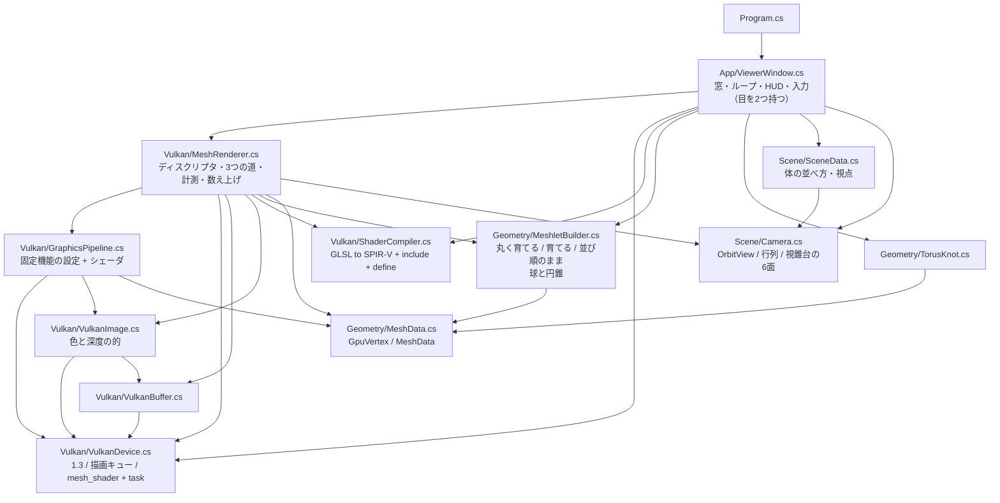
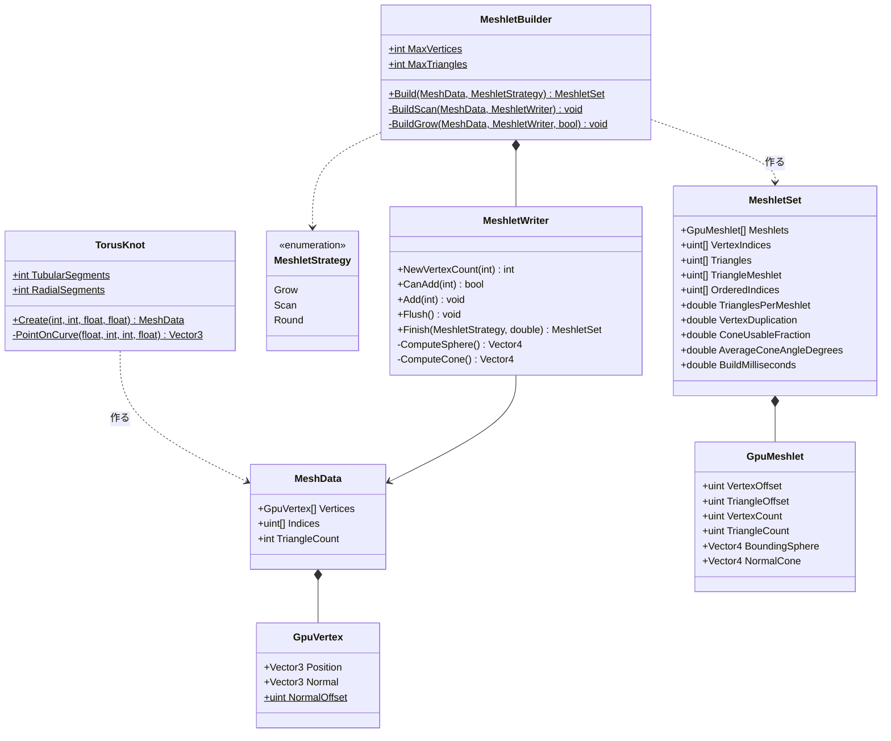
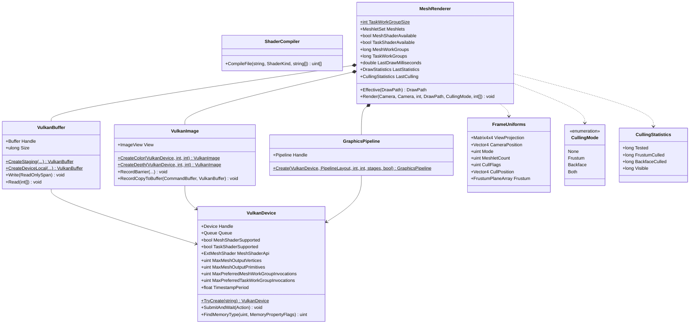
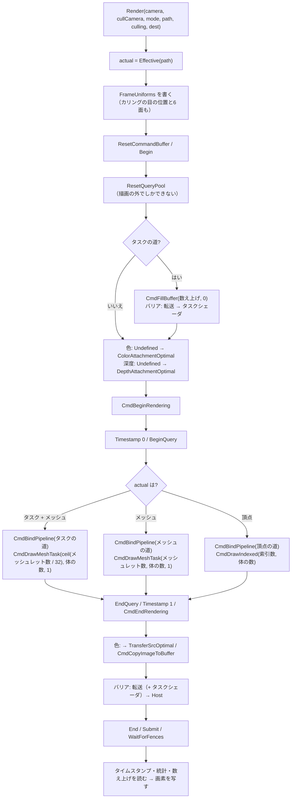
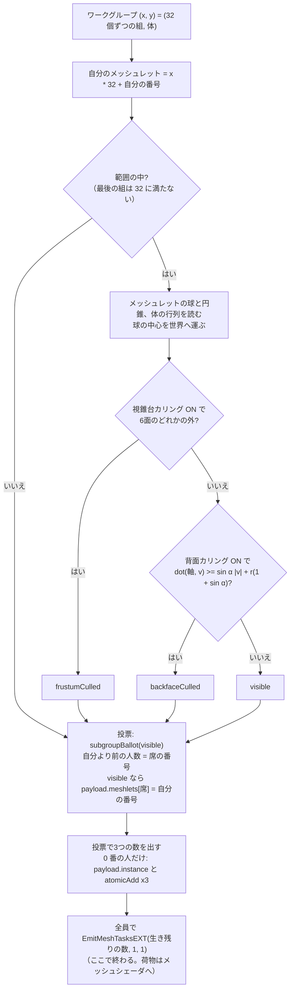
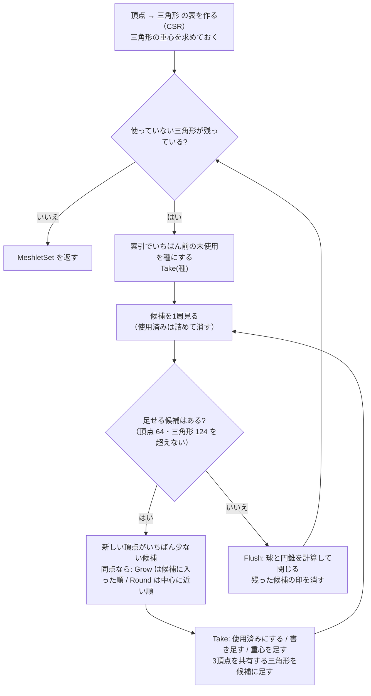
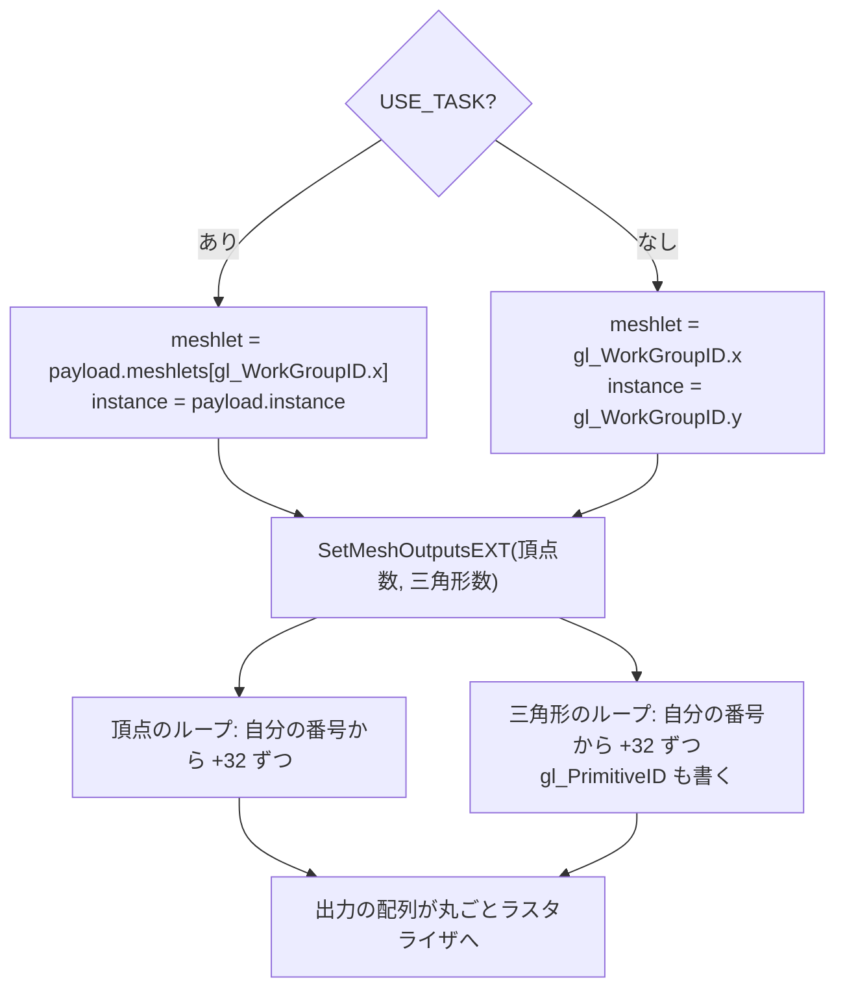

# Day 64b: タスクシェーダと GPU カリング — 要らないメッシュレットを GPU の上で捨てる

**教養編。Day 64 の2日目(最終日)**。reference は Day 64a の完全コピー + 差分。

Day 64a でメッシュシェーダの道を作った。メッシュレットは**描く前から小片に分かれている**ので、
小片ごとに「描く必要があるか」を決められる。それを GPU の上でやるのが、メッシュシェーダの手前に置く**タスクシェーダ**。

```
  Day 64a:                     メッシュシェーダ(全部のメッシュレット) → ラスタライザ(三角形1枚ずつ裏を捨てる)
  Day 64b: タスクシェーダ ─→ メッシュシェーダ(生き残りだけ)         → ラスタライザ
           ↑ 32 個ずつ調べて、画面の外と、丸ごと裏向きのものを捨てる
```

Day 63b のテッセレーションと並べると、「増やす段」の設計が2通りあることが分かる。

| | テッセレーション(63b) | **タスクシェーダ(64b)** |
|---|---|---|
| 何を決めるか | 1パッチを何枚に割るか | **メッシュシェーダを何組立ち上げるか** |
| 決めるのは | 固定機能の回路(制御シェーダは6つの数を渡すだけ) | **シェーダ自身**(`EmitMeshTasksEXT(n, 1, 1)`) |
| 数の範囲 | 1 〜 64(レベル) | **0 〜 上限**。増やすことも、減らすことも、0 にすることもできる |
| 1回が見るもの | パッチ1つ(4隅) | **メッシュレット 32 個の要約**(境界の球と法線の円錐) |
| 次の段に渡すもの | 割った点の (u, v) | **荷物**(payload。今日は 132 バイト) |
| 今日の使い道 | 距離で細かくする | **要らないものを捨てる** |

今日の差分は**新規 1 ファイル**(`meshlet.task`、126 行)と**変更 9 ファイル**
(C# +581 / −56 行、GLSL +42 / −2 行)。Day 64a より軽い。

> **今日いちばん意外だったのは、「裏向きのメッシュレットを捨てる」が 4% しか効かなかったこと**
> 視錐台カリング(画面の外を捨てる)は 256 体で 61% を捨てた。ところが背面カリングは、
> Day 64a の「育てる」で切ったメッシュレットでは **4.3%** しか捨てられなかった。
> 調べると、1つのメッシュレットが**管の周り 32 升のうち 12.7 升を回り込んで**いて、法線の円錐が平均 **64 度**も開いていた。
> 切り方の規則を1つだけ変える——新しい頂点の数が同点のとき、候補に入った順ではなく**中心に近い順**で選ぶ——と、
> 円錐は **31 度**に締まり、背面カリングは **30.7%** 効くようになった(検証2)。
> **カリングの効き目は、カリングの式ではなく、メッシュレットの切り方で決まっていた**。

## 今日のゴール

**起動すると Day 64a と同じ 16 体のトーラスノットが出る。HUD の「描き方」が「タスクシェーダ + メッシュシェーダ」、
「判定」の行に「7,488 個 → 画面の外 1.9% / 裏向き 29.9% / 描く 68.2%」と出る。
`4` で 256 体にすると「画面の外 61.4% / 裏向き 11.7% / 描く 26.8%」、ラスタライザへ渡る三角形は 839 万枚のうち **245 万枚**。
それでも**絵は1画素も欠けない**。`F` でカリングの目を止めてからドラッグで回り込むと、捨てられたメッシュレットが穴として見える。**

| キー | 何が起きるか |
|---|---|
| `C` | **カリング(視錐台 + 背面 → しない → 視錐台だけ → 背面だけ)。今日の目** |
| `F` | **カリングの目を止める / 戻す**。止めてから回ると、捨てられたものが穴として見える |
| `O` | 切り方(**丸く育てる** → 育てる(頂点の数だけ)→ 並び順のまま)。背面カリングの効き目がここで変わる |
| `B` | 描き方(タスク + メッシュ → メッシュ → 頂点)。カリングはタスクの道だけ |
| `M` / `1`〜`4` / ドラッグ / ホイール / `R` / `H` / `Esc` | Day 64a のまま |

### 今日いちばん大事な3つ

**1つ目は「何組立ち上げるかをシェーダが決める」**(要点1)。描く命令は Day 64a と同じ `CmdDrawMeshTask` だが、
パイプラインにタスクの段があると、立ち上がるのは**タスクシェーダ**のワークグループになる。
メッシュシェーダを何組立ち上げるかは、タスクシェーダが GPU の上で決める。

```glsl
// meshlet.task の最後の1行
EmitMeshTasksEXT(visibleCount, 1, 1);   // 0 なら1組も立ち上がらない
```

CPU は「何個描かれたか」を知らないまま次へ進む。**描く量を決める権限が CPU から GPU へ移った**のが今日の核心で、
これは Day 65(GPU 駆動レンダリング)の入口でもある。

**2つ目は「三角形を1枚も読まずに捨てる」**(要点2・3)。タスクシェーダが見るのは、メッシュレット1つにつき 32 バイトの**要約**だけ。

| 要約 | 中身 | 何を捨てるか |
|---|---|---|
| **境界の球** | 中心と半径 | 球が視錐台の外 → 丸ごと画面の外 |
| **法線の円錐** | 軸と半角 α | 目から見た向きが軸から (90° − α) 以内 → 三角形が**全部**裏向き |

捨てたメッシュレットは頂点を1つも読まれず、変換もされず、ラスタライザにも届かない。
Day 64a でラスタライザがやっていた裏向きの判定(三角形1枚ずつ、**変換した後**)を、**メッシュレット単位で、変換する前に**やる。

**3つ目は「切り方が効き目を決める」**(要点6)。同じカリングの式でも、切り方で結果がまるで違う。

| 切り方(`O`) | 円錐の半角 | 背面で捨てた割合(256 体) | ラスタライザへの三角形 |
|---|---|---|---|
| **丸く育てる**(今日の既定) | **31°** | **30.7%** | 839 万 → **634 万** |
| 育てる(頂点の数だけ。Day 64a) | 64° | 4.3% | 839 万 → 804 万 |
| 並び順のまま | 使えない(管を1周) | **0%** | 839 万 → 839 万 |

## 事前に読む資料

- **[NVIDIA: Introduction to Turing Mesh Shaders](https://developer.nvidia.com/blog/introduction-turing-mesh-shaders/)** の
  後半(Task shader と Cluster culling の節)— タスクシェーダでメッシュレットを捨てる、という使い方の原典。
  法線の円錐(cone culling)の図がある
- **[meshoptimizer の README](https://github.com/zeux/meshoptimizer/blob/master/README.md)** の **Mesh shading の節** —
  `meshopt_computeMeshletBounds`(境界の球と円錐を作る関数)の説明と、円錐の判定の1行。
  そして `meshopt_buildMeshletsFlex` の段落:「**高度なカリングを使うなら、メッシュレットが満杯にならなくても
  空間的にまとまっているほうが得になることがある**」——今日の検証2 がまさにこれ
- **[GLSL_EXT_mesh_shader 拡張仕様](https://github.com/KhronosGroup/GLSL/blob/main/extensions/ext/GLSL_EXT_mesh_shader.txt)** の
  `EmitMeshTasksEXT` と `taskPayloadSharedEXT` の節。「全員が1回だけ、そろって通る場所で呼ぶ」「呼んだら終わる」の決まり
- **[Khronos Blog: Vulkan Subgroup Tutorial](https://www.khronos.org/blog/vulkan-subgroup-tutorial)** —
  `subgroupBallot` と `subgroupBallotExclusiveBitCount`(要点4)。ワープ(NVIDIA)/ ウェーブ(AMD)を
  シェーダから直接使う仕組み
- **[Gribb & Hartmann: Fast Extraction of Viewing Frustum Planes from the World-View-Projection Matrix](https://www.gamedevs.org/uploads/fast-extraction-viewing-frustum-planes-from-world-view-projection-matrix.pdf)** —
  行列から視錐台の6面を取り出す方法(要点2)。4 ページの短い文書
- **Day 63b の計画書**の要点6・7(距離 LOD、値段はパッチの数で決まる)— 今日の比較相手
- **Day 64a の計画書**の要点2(メッシュレットの切り方)と検証3(並び順のままのほうが速かった)

## 理論の要点

### 1. タスクシェーダ — 「何組立ち上げるか」を決める段

タスクシェーダは**コンピュートシェーダとほぼ同じ形**をしている。ワークグループがあり、共有メモリがあり、
出力の頂点も三角形も持たない。違いは最後に1回だけ呼ぶ `EmitMeshTasksEXT` で、
これが「このあと、メッシュシェーダを何組立ち上げるか」を決める。

```
  CmdDrawMeshTask(15, 16, 1)   ← 15 = ceil(メッシュレット 468 / 32)、16 = 体の数
        │
        ├ タスクのワークグループ (0, 0) : メッシュレット 0〜31 を調べる → EmitMeshTasksEXT(21) → メッシュシェーダ 21 組
        ├ タスクのワークグループ (1, 0) : メッシュレット 32〜63 を調べる → EmitMeshTasksEXT(9)  → メッシュシェーダ 9 組
        └ ...                                                          (21 や 9 は一例。見る向きで毎フレーム変わる)
```

生まれたメッシュシェーダは、**生みの親のタスクシェーダが書いた荷物**(`taskPayloadSharedEXT`)を読める。
今日の荷物は「どの体か」と「生き残ったメッシュレットの番号 32 個ぶんの席」。

```glsl
struct TaskPayload { uint instance; uint meshlets[32]; };   // 132 バイト
```

メッシュシェーダの側は、`gl_WorkGroupID.x` が「生き残りの中で何番目か」になるので、荷物から本当の番号を引く。
Day 64a のメッシュシェーダ(`gl_WorkGroupID.x` がそのままメッシュレットの番号)とは読み方が違うので、
**同じ `meshlet.mesh` を `USE_TASK` あり/なしの2回翻訳している**(Day 62b の `trace.comp` と同じ手)。

描く順番の約束もある(VK_EXT_mesh_shader の提案書の Rasterization Order)。
**タスクのワークグループの番号順 → その中で生まれたメッシュシェーダの番号順 → その中で三角形の番号順**。
だから荷物の席を**元の順番のまま詰めれば**、カリングしても描く順は Day 64a と同じになる(要点4、検証1)。

### 2. 視錐台カリング — 球が6枚の面のどれかの外なら捨てる

視錐台の6枚の面は、**ビュー投影行列から直接取り出せる**(Gribb と Hartmann の方法。`Camera.FrustumPlanes`)。

点 p がクリップ座標で (x, y, z, w) になるとき、画面の内側の条件は

```
  −w ≤ x ≤ w,   −w ≤ y ≤ w,   0 ≤ z ≤ w     (Vulkan の深度は 0〜1)
```

x も w も p の一次式なので、たとえば `w + x ≥ 0` はそのまま**世界の中の平面の式**になる。
System.Numerics は「行ベクトル × 行列」なので、x を作るのは**行列の1列目**。

```csharp
var column0 = new Vector4(m.M11, m.M21, m.M31, m.M41);   // x
var column3 = new Vector4(m.M14, m.M24, m.M34, m.M44);   // w
Vector4 left = column3 + column0;                          // w + x ≥ 0
```

面の法線の長さで割っておくと、`dot(面, p) + 面.w` が**面までの距離(m)**になり、球の半径と比べられる。

```glsl
if (dot(frame.frustum[i].xyz, center) + frame.frustum[i].w < -radius) → 外
```

**6枚のどれか1枚の完全な外側にあれば外**。視錐台の角の近くでは「どの面の外でもないのに視錐台に入っていない」球が残るが、
捨てすぎることは無い(安全側に間違える)。

体の行列は回転と移動だけ(拡大しない)なので、球の中心だけを行列で運べば、半径はそのまま使える。

### 3. 背面カリング — 法線の円錐

三角形 1 枚が裏向きなのは、**目から三角形へ向かう向き v と、面の法線 n が同じ側を向く**とき(`dot(n, v) ≥ 0`)。

メッシュレットの三角形の法線が全部「軸 a から α 以内」に収まっているとする(**法線の円錐**)。
v が軸から (90° − α) 以内なら、円錐の中のどの n とのなす角も 90° 以下になり、**全部の三角形が裏向き**と言える。

```
  dot(a, v) ≥ |v| · cos(90° − α) = |v| · sin α
```

三角形は1点ではなく境界の球(中心 c、半径 r)の中に散らばっているので、球の中のどの点でも成り立つように安全側へ寄せる。

```glsl
// meshlet.task
vec3 v = center - frame.cullPos.xyz;
return dot(axis, v) >= sinAlpha * length(v) + radius * (1.0 + sinAlpha);
```

(p = c + d、|d| ≤ r とすると、左辺は dot(a, c − 目) − r 以上、右辺は sin α · (|c − 目| + r) 以下なので、これで足りる。)
meshoptimizer は球の代わりに**円錐の頂点(apex)**を使う式を載せている。考え方は同じ。

円錐は `MeshletBuilder.ComputeCone` が作る。**使う法線は頂点の法線ではなく面の法線**
(ラスタライザが裏を捨てるときに見るのは画面上の回り方で、それは面の法線と一致する)。

1. 軸 = 面の法線の平均の向き
2. cos α = min(法線 · 軸)
3. α ≥ 90° なら判定に使えない印(sin の欄に 1。式の右辺が必ず左辺より大きくなる)

**どれだけ捨てられるか**は α で決まる。見る向きが一様にばらつくとすると、裏向きと言える向きは
半角 (90° − α) の円錐の中で、その割合は

```
  (1 − cos(90° − α)) / 2 = (1 − sin α) / 2
```

| α | 捨てられる向きの割合 |
|---|---|
| 0°(平らなメッシュレット) | 50% |
| 31°(丸く育てる) | 24% |
| 64°(育てる) | 5% |
| 90° 以上 | 0% |

**半分より多くは決して捨てられない**(平らな面でも、裏から見る向きは全方向の半分)。
メッシュレット全部について平均を取った予想(丸く育てる 30.3% / 育てる 5.2%)は、実際に捨てた割合(30.7% / 4.3%)とよく合う。
丸く育てるの予想が 31° の表の値(24%)より高いのは、三角形1〜2枚の**欠片**(要点6)の円錐がほぼ 0° で、
それぞれが 50% 近く捨てられる勘定になり、平均を押し上げるから。

### 4. 生き残りを前から詰める — subgroup の投票

32 人がそれぞれ「自分のメッシュレットは生き残ったか」を決めたあと、生き残りの番号を荷物の席に**前から詰めて**書きたい。
ここで使うのが **subgroup の投票(ballot)**。

```glsl
uvec4 vote = subgroupBallot(visible);                                  // 誰が手を挙げたか(32 ビットの印)
if (visible) payload.meshlets[subgroupBallotExclusiveBitCount(vote)] = meshletIndex;
uint visibleCount = subgroupBallotBitCount(vote);                      // 手を挙げた人数
```

```
  番号        : 0 1 2 3 4 5 6 ...
  手を挙げた人: ○ ○ × × ○ × ○ ...
  自分より前の ○: 0 1       2   3 ...  ← これが席の番号
```

`subgroupBallotExclusiveBitCount` は「自分より番号の小さい人のうち、手を挙げた人数」。
共有メモリも atomic も使わずに、**元の順番を保ったまま**詰められる(atomic で席を取ると、順番が走るたびに変わる)。

subgroup(NVIDIA のワープ、AMD のウェーブ)は GPU が本当に1つの命令で動かしている組なので、
**ワークグループの 32 人が1つの subgroup に収まっている**必要がある。`VulkanDevice` は
「タスクの段で投票が使えるか」「subgroup が 32 人以上か」を聞き、満たさなければタスクの道を作らない
(`TaskShaderSupported`。手元の RTX 3070 は 32 人で、投票はタスクの段でも使える)。

### 5. 数える — タスクシェーダが自分で数える

Day 64a の要点6 のとおり、パイプライン統計で「タスクシェーダの回数」を数えると、それだけで遅くなるおそれがある。
今日はタスクシェーダが**自分でストレージバッファに数える**(binding 7)。

```glsl
uint frustumCount = subgroupBallotBitCount(subgroupBallot(frustumCulled));   // 投票は全員で
if (gl_LocalInvocationIndex == 0u) {                                         // 足すのは代表の1人だけ
    atomicAdd(counters.frustumCulled, frustumCount);
    ...
}
```

32 人がそれぞれ `atomicAdd` すると同じ番地の奪い合いになるので、**投票で数を出してから代表が1回足す**。

C# の側では、描く前に `CmdFillBuffer` で 0 に戻し、描いたあと CPU で読む。**その前後にバリアが要る**。

```
  CmdFillBuffer(数え上げ, 0)
     ↓ バリア: 転送の書き込み → タスクシェーダの読み書き
  CmdBeginRendering ... CmdDrawMeshTask ... CmdEndRendering
     ↓ バリア: タスクシェーダの書き込み(+ 引き取りの転送)→ CPU の読み込み
  WaitForFences → 読む
```

後ろのバリアは Day 64a で足した「CPU で読む前のバリア」に、書いた段(タスクシェーダ)と種類(シェーダの書き込み)を足したもの。

「ラスタライザへ渡った三角形」は、Day 64a と同じメッシュシェーダの三角形のクエリ(`MeshPrimitivesGeneratedExt`)で数えている。
**捨てたメッシュレットの三角形は、この数から消える**。

### 6. 切り方が効き目を決める

`O` で3つの切り方を比べられる。1つのメッシュレットが、管の周り(32 升)と長さ方向に何升ぶん広がっているかを数えると
(三角形の数で重みを付けた平均)、形の違いがはっきり出る。

| 切り方 | 周り(32 升中) | 長さ | 円錐の半角 | 背面で捨てた割合(256 体) |
|---|---|---|---|---|
| **丸く育てる** | **7.1** | 13.2 | **31°** | **30.7%** |
| 育てる(頂点の数だけ) | 12.7 | 9.0 | 64° | 4.3% |
| 並び順のまま | 32.0 | 2.0 | 使えない | 0% |

Day 64a の「育てる」は、同点のとき**候補に入った順**で選んでいた。トーラスノットの索引は管の周りの順に並んでいるので、
隣の三角形の一覧(CSR)も周りの順に並ぶ。候補に入った順で選ぶと、その並びに引きずられて周りへ伸びやすい
——と考えているが、確かめたのは結果(周り 12.7 升)のほうだけ。
**同点のときに中心に近い順で選ぶ**(`MeshletStrategy.Round`)と、周りは 7.1 升まで縮む。

代わりに払うものもある。

| | 丸く育てる | 育てる |
|---|---|---|
| メッシュレットの数(1体) | 468 | 343 |
| 三角形 / 個 | 70.0 | 95.5 |
| 頂点の重複 | x1.40 | x1.33 |
| 三角形 16 枚未満の**欠片** | **117 個** | 1 個 |

丸く育てると、丸い小片の間に**三角形 1〜2 枚だけの欠片**が取り残される。欠片もメッシュシェーダを1組使うので、
カリングしないときは「丸く育てる」のほうが遅い(検証3)。meshoptimizer の README が
`meshopt_buildMeshletsFlex` について書いている「満杯にならなくても空間的にまとまっているほうが、高度なカリングでは得」
というのは、この取り引きのこと。

### 7. テッセレーションとの比較 — 固定機能の増幅と、プログラムできる増幅

| | テッセレーション(63b) | タスクシェーダ(64b) |
|---|---|---|
| 増やし方の粒度 | パッチの中を均一に割る(レベルで決まる格子) | **メッシュシェーダの組の数**。中身はメッシュシェーダが自由に作る |
| 減らせるか | レベル 1 まで(0 にはできない。外側のレベルを 0 にすればパッチは捨てられるが) | **0 にできる**。今日の使い道はこちら |
| 隣との合意 | 必要(亀裂。63b の要点5) | 要らない(メッシュレットは頂点を共有しない。境目の頂点は両方で持つ) |
| 値段 | パッチあたりの固定費が大きい(レベル 1 で三角形1万枚あたり 573us) | 捨てないときの上乗せは 0〜5%(検証3) |

テッセレーションは「割り方」が固定機能に焼き付いているぶん、**割る以外のことはできない**。
タスクシェーダは「何組立ち上げるか」しか決めないぶん、**割ることも捨てることも LOD を選ぶこともできる**
(改造課題3 で距離 LOD を作ってみる)。ただし、テッセレーションのように「1パッチから 8,192 枚」を
回路が作ってくれるわけではなく、作る三角形はメッシュレットとして**事前に用意しておく**必要がある。

## 前Dayからの差分概要

### 新規ファイル

| ファイル | 行数 | 役割 |
|---|---|---|
| `shaders/meshlet.task` | 126 | **今日の主役**。32 個ずつ調べて、画面の外と裏向きを捨て、生き残りを詰めて渡す |

### 変更ファイル

| ファイル | 差分 | 何を足したか |
|---|---|---|
| `Day64b.csproj` | コメントのみ | shaders に `meshlet.task` が増えたことの説明 |
| `Vulkan/VulkanDevice.cs` | +47 / −4 | `TaskShader = true`、subgroup の投票が使えるかを聞く `TaskShaderSupported` |
| `Scene/Camera.cs` | +42 / −0 | `FrustumPlanes()`(行列から6面を取り出す) |
| `Geometry/MeshletBuilder.cs` | +173 / −6 | `GpuMeshlet` に球と円錐(48 バイトに)、`ComputeSphere` / `ComputeCone`、**`Round`(丸く育てる)** |
| `shaders/common.glsl` | +26 / −1 | `Frame` にカリングの目、`Meshlet` に球と円錐、`TaskPayload` |
| `shaders/meshlet.mesh` | +16 / −1 | `USE_TASK` のときは荷物からメッシュレットの番号を引く |
| `Vulkan/MeshRenderer.cs` | +202 / −13 | 3本目のパイプライン、`CullingMode`、数え上げのバッファとバリア、`Effective` |
| `App/ViewerWindow.cs` | +102 / −18 | `C` / `F`、`B` と `O` が3択に、HUD に「円錐」「判定」 |
| `Program.cs` | +15 / −15 | 説明の差し替え(コメントのみ) |

### 写経する順番

| # | ファイル | 何が要るか / 気をつけるところ |
|---|---|---|
| 1 | `Vulkan/VulkanDevice.cs` | 機能の鎖に `TaskShader = true`。`PhysicalDeviceVulkan11Properties` で subgroup を聞く |
| 2 | `Scene/Camera.cs` | 依存なし。**列**を取り出す(行ではない)。最後に法線の長さで割る |
| 3 | `Geometry/MeshletBuilder.cs` | `GpuMeshlet` に2つ足す(**16 バイト境界に乗る位置**なので `Vector4` をそのまま足せる)。`BuildGrow` に `round` 引数と重心 |
| 4 | `shaders/common.glsl` | 3 と並びを合わせる(`Meshlet` は 48 バイト)。`Frame` は 5 の `FrameUniforms` と合わせる |
| 5 | `shaders/meshlet.mesh` | 4 の `TaskPayload` を使う。`#ifdef USE_TASK` の2か所 |
| 6 | `shaders/meshlet.task` | **新規**。4 を使う。`EmitMeshTasksEXT` は最後に全員が1回 |
| 7 | `Vulkan/MeshRenderer.cs` | 1〜6 を使う。`FrameUniforms` の3つの `Padding` のうち2つが本物の値になる。バリアを2つ |
| 8 | `App/ViewerWindow.cs` | 2・3・7 を使う。`Render` に目を2つ渡す |
| 9 | `Program.cs` | コメントのみ。差分0にしたいなら合わせておく |
| 10 | `Day64b.csproj` | コメントのみ。差分0にしたいなら合わせておく |

> **動かすのは 8 まで写してから**(7 で `Render` の引数が変わるので、8 まで写さないとビルドが通らない)。
> 動いたら、`B` でメッシュの道 → タスクの道(`C` は「しない」)→ `C` で「視錐台だけ」→「背面だけ」の順に確かめる。
> どこで絵が欠けるか(あるいは崩れるか)で、壊れている場所が分かる。
> メッシュの道で崩れる → `GpuMeshlet` と `Meshlet` の並び(3・4)/ タスクの道で崩れる → 荷物の受け渡し(5・6)/
> 視錐台だけで欠ける → 6面の取り出し(2)/ 背面だけで欠ける → 円錐(3 の `ComputeCone` と 6 の `facingAway`)

## 設計書

Day 64a から**クラスは増えていない**(増えたのは列挙と記録と固定長の配列が3つ)。層の形も変わらない。
変わったのは、`MeshRenderer` の中の道が3本になったことと、メッシュレットが**要約**を持つようになったこと。

### 全体構成と依存の向き



| 層 | 知っているもの | 知らないもの | Day 64a からの変化 |
|---|---|---|---|
| `Geometry/` | 自分の中だけ | **Vulkan を知らない** | メッシュレットが球と円錐を持つ。切り方が3つに |
| `Scene/` | 自分の中だけ | 形も GPU も知らない | `Camera` が視錐台の6面を出せる |
| `Vulkan/` | `Geometry/` の型と `Camera` | 窓を知らない | 道が3本。カリングの数え上げを持つ |
| `App/` | 全部 | — | 描く目とカリングの目を別々に持つ |

**循環は依然として無い**。`Camera.FrustumPlanes` が `Vulkan/` を知らない(`Vector4[]` を返すだけ)ので、
視錐台の式は CPU だけで確かめられる。`FrameUniforms` に詰め替えるのは `MeshRenderer` の仕事。

**入れ替えると何が壊れるか**を2つ。

- **球と円錐を作るのが `MeshletBuilder`(CPU)で、使うのがタスクシェーダ(GPU)**。
  円錐の w に「sin α、使えないときは 1」を入れる約束が、C# の `ComputeCone` と GLSL の `facingAway` の2か所にまたがっている。
  片方だけ cos α に変えると、狭い円錐(45° 未満)では**捨てる数が減るだけで絵は崩れず**、
  広い円錐では逆に捨てすぎて穴が開く。前者は検証1 のやり方(画素の突き合わせ)でないと気づけない
- **カリングの目が描く目と別**なのは、`F` のためだけではない。影のパスのように「別の目から描く」ときも、
  カリングはその目でやる必要がある。`Render` が目を2つ受け取る形にしておくと、そのまま使い回せる

### Geometry — 形とメッシュレット(Day 64b で `GpuMeshlet` が 48 バイトに)



球と円錐は `MeshletWriter.Flush` の中で、**メッシュレットを閉じるときに1回だけ**計算する。
切り方(`BuildGrow` / `BuildScan`)は要約の作り方を知らないので、3つの切り方のどれにも同じ要約が付く。

### Vulkan — 7つのクラス(Day 64b で `MeshRenderer` が太った)



`MeshRenderer` が持つ `GraphicsPipeline` は**3本**(頂点の道・メッシュの道・タスク + メッシュの道)。
3本とも同じディスクリプタセットとパイプラインレイアウトを使い、切り替えは `CmdBindPipeline` のハンドルだけ。
`Effective` は「持っていない道を頼まれたら1段ずつ簡単な道に落ちる」判断で、HUD も同じものを使う
(Day 64a では `ViewerWindow` と `MeshRenderer` の2か所に同じ判断を書いていた)。

### GPU に挿さっているもの — binding の一覧(Day 64b で 7 番が増えた)

| binding | 中身 | 型 | 読む・書く段 |
|---|---|---|---|
| 0 | `Frame`(行列・目・表示・**カリングの目と6面**) | uniform | 全部 |
| 1 | 頂点(`GpuVertex[]`) | storage | メッシュ(頂点の道は同じバッファを頂点バッファとして) |
| 2 | 体ごとの行列 | storage | 頂点・**タスク**・メッシュ |
| 3 | メッシュレット(`GpuMeshlet[]`、**48 バイト**) | storage | **タスク**・メッシュ |
| 4 | 局所番号 → 元の頂点番号 | storage | メッシュ |
| 5 | 三角形(局所番号3つ) | storage | メッシュ |
| 6 | 三角形 → メッシュレット | storage | 画素(色分け) |
| **7** | **カリングの数え上げ**(uint 4つ) | storage | **タスクが書く、CPU が読む** |
| — | 並べ直した索引 | 索引バッファ | 頂点の道の入力の回路 |
| — | 荷物(`TaskPayload`) | **(ディスクリプタではない)** | タスクが書き、そこから生まれたメッシュが読む |

**7 番の宣言は `common.glsl` ではなく `meshlet.task` にある**。書き込むバッファを頂点シェーダから見える場所で宣言すると、
別の機能(`vertexPipelineStoresAndAtomics`)が要ることになるから。
荷物はディスクリプタを通らない。**タスクのワークグループ1つとそこから生まれたメッシュシェーダだけ**が見る、
共有メモリに近い置き場所。

### 1フレームの流れ — `MeshRenderer.Render`(Day 64b でタスクの道が入った)



**同じ `CmdDrawMeshTask` が2回出てくる**のが見どころ。渡す数も意味も違う——
タスクの道では「タスクシェーダを何組」、メッシュの道では「メッシュシェーダを何組」。
どちらになるかは、束ねたパイプラインにタスクの段があるかどうかだけで決まる。

### タスクシェーダの1ワークグループの中



**投票は全員が通る場所で呼ぶ**のが決まり(`if` の中で呼ぶと、そこに来なかった人の票が数えられない)。
だから「捨てたかどうか」を先に全員が決めてから、そろって投票する形になっている。

### メッシュレットが育つまで — `BuildGrow`(Day 64b で同点の決め方が選べるようになった)



### メッシュシェーダの1ワークグループの中(Day 64a から、番号の引き方だけが変わった)



### 今日残した歪み(3つ)

**1. 取り残された欠片**(Day 64a にはほぼ無かった)。丸く育てると、三角形 16 枚未満のメッシュレットが 468 個中 117 個できる。
1つずつがメッシュシェーダを1組使うので、カリングしないときの値段が上がる(検証3)。
直し方はいくつか試したが、**どれも円錐を広げてカリングの効き目を落とした**(検証2 の表)。改造課題2。

**2. 体ごとのカリングをしていない**。256 体のうち画面の外にいる体でも、その体の 468 個のメッシュレットを
1つずつタスクシェーダが調べて捨てている(15 組 x 32 人)。本来は**体ごとに1回**球を調べて、体ごと捨てたい。
それには「体ごとに、何組のタスクシェーダを立ち上げるか」を GPU が決める必要があり、
**`CmdDrawMeshTasksIndirect`(描く命令の引数自体を GPU が書く)**が要る。これが Day 65 の入口。

**3. 隠れているものを捨てていない**(オクルージョンカリング)。手前の体に隠れた奥の体も、
画面の中にいて表を向いていれば描いている。捨てるには「前のフレームの深度」を縮めた画像(Hi-Z)と比べる必要があり、
1フレームに2回描く仕組みが要る。これも Day 65(GPU 駆動)と Nanite の話。

### 引き継いだ図

次の図は Day 64a から変わっていないので、Day64a.md の設計書を参照。

- 「Geometry — 形とメッシュレット」のうち `GpuVertex` / `MeshData` / `TorusKnot`(上の図に再掲してある)

## 完成条件

`dotnet run --project reference/Day64b -c Release` で確かめる。

### 1. 起動: 16 体、タスク + メッシュ、両方のカリング

- 絵は Day 64a と同じ
- 「描き方」が「**タスクシェーダ + メッシュシェーダ**」、「カリング」が「**視錐台 + 背面 (C) / 目: 描く目と同じ**」
- 「分割」が「**丸く育てる (O)  1体 468 個 / 三角形 70.0 枚・頂点 48.9 個 (個あたり) / 頂点の重複 x1.40**」
- 「円錐」が「**裏の判定に使える 100% (半角の平均 31 度)**」
- 「判定」が「**7,488 個 → 画面の外 1.9% / 裏向き 29.9% / 描く 68.2%**」
- 「内訳」が「**タスクシェーダ 240 組 x 32 人 → メッシュシェーダ 5,107 組 / ラスタライザへ 三角形 391,278 枚 / 画素シェーダ 196,009 回**」

画素シェーダの回数は、カリングしないとき(196,009)と**同じ**。捨てたのは画面に1画素も出ないものだけだから。

### 2. `4` を押す: 256 体(今日の目)

- 「判定」: **119,808 個 → 画面の外 61.4% / 裏向き 11.7% / 描く 26.8%**
- 「内訳」: タスクシェーダ 3,840 組 x 32 人 → メッシュシェーダ 32,139 組 / 三角形 **2,453,947 枚**(839 万枚のうち)
- 「うち描画」: **1.41 ms 前後**(アプリ内)

`C` で切り替えて、三角形の数と時間を見比べる。

| カリング | 描く | ラスタライザへの三角形 | うち描画(アプリ内) |
|---|---|---|---|
| 視錐台 + 背面 | 26.8% | 2,453,947 | 1.41〜1.43 ms |
| しない | 100% | 8,388,608 | 2.70 ms |
| 視錐台だけ | 38.6% | 3,243,261 | 1.69 ms |
| 背面だけ | 69.3% | 6,342,015 | 2.47 ms |

(アプリ内の値は 60 枚/秒に合わせて休んでいるぶん、ハーネスの値より大きく出る。比べるのは同じ窓の中の値どうし。)

「視錐台 + 背面」で**裏向きが 11.7% に下がる**のは、画面の外で先に捨てた分は裏の判定まで行かないから(背面だけなら 30.7%)。

### 3. `O` で切り方を変える

256 体・両方のカリングのまま `O` を押していく。

| 切り方 | 円錐の半角 | 判定: 裏向き | 三角形 |
|---|---|---|---|
| 丸く育てる | 31 度 | 11.7% | 2,453,947 |
| 育てる(頂点の数だけ) | 64 度 | 1.8% | 3,114,232 |
| 並び順のまま | 0 度(使えない 0%) | 0.0% | 3,259,776 |

**並び順のままでは、背面カリングを入れても1つも捨てられない**(円錐が使えない)。

### 4. `F` で目を止めて回り込む

`1` で1体にし、`M` でメッシュレットごとの色にしてから `F` を押す(カリングの目が止まる)。
ドラッグで**反対側まで**回り込むと、管のところどころが**切り取られた穴**になっている。
止めた目から見て丸ごと裏向きだったメッシュレット(1体で 142 個)が捨てられたまま、裏側から眺めている状態。
`C` を「視錐台だけ」にすると穴が消える(1体では画面の外に出るメッシュレットが無い)。

16 体で同じことをすると、止めた目の画面の外(左右の端と後ろ)にいた体が**丸ごと、あるいは半分だけ**消えているのが見える。

### 5. `B` で道を回す

- タスク + メッシュ → メッシュ → 頂点 と回しても、**絵は変わらない**
- 「判定」はタスクの道以外では「全部描く(捨てるのはタスクシェーダの道だけ)」になり、三角形の数が 839 万に戻る

## 検証の途中で分かったこと

窓の無いハーネス(`MeshRenderer` を直接呼ぶ)で確かめた。RTX 3070 / ドライバ 596.49、検証レイヤなし。

### 検証1: カリングしても絵は1画素も変わらない

切り方 3 通り x 体の数 4 通り x 表示 3 通り = 36 の場面それぞれで、頂点の道の絵を基準に、
メッシュの道・タスクの道(カリング 4 通り)の **5 つを 518,400 画素すべて突き合わせた**。
**180 通りとも完全一致**。捨てたメッシュレットは1画素も寄与していなかった(カリングの式が安全側に効いている)し、
生き残りを前から詰めたので描く順番も変わらなかった(要点4)。

**突き合わせが本当に効いているか**も確かめた。タスクシェーダの背面の判定の符号をわざと逆にして
(表を向いたものを捨てる)同じことをすると、16 体の場面で **99,105 画素**が変わった。
一致は「何も比べていない」からではない。

タスクシェーダが数えた3つ(画面の外 + 裏向き + 描く)の和は、全部の場面で調べた数(メッシュレット数 x 体の数)と一致した。

### 検証2: 裏向きが 4% しか捨てられなかった

最初は Day 64a の「育てる」のまま背面カリングを入れた。256 体で捨てられたのは **4.3%**。
円錐の半角を数えると、343 個中 266 個が 60 度台で、平均 **64 度**。要点3 の式では、64 度の円錐が裏向きと言える向きは 5% しかない。

なぜそんなに開くのか、1つのメッシュレットが管の周り(32 升)と長さ方向に何升ぶん広がっているかを数えた(三角形の数で重み付け)。
**周り 12.7 升 x 長さ 9.0 升**。管の周りを 143 度ぶん回り込んでいた。候補を「入った順」で選ぶと、
周りへ回り込む三角形が一覧の前のほうに来て、周りへ周りへと育つ。

そこで同点の決め方を変える案をいくつか試した(1体、予想される背面の割合 = 各メッシュレットの (1 − sin α)/2 の平均)。

| 同点の決め方 / 種の選び方 | メッシュレット | 三角形 / 個 | 重複 | 16 枚未満の欠片 | 予想される背面の割合 |
|---|---|---|---|---|---|
| 候補に入った順(Day 64a の育てる) | 343 | 95.5 | x1.33 | 1 | 5.2% |
| **中心に近い順(丸く育てる)** | **468** | 70.0 | **x1.40** | **117** | **30.3%** |
| 中心に近い順 + 種を前のメッシュレットの縁から | 443 | 74.0 | x1.40 | 87 | 27.2% |
| 取り残されそうな三角形を先に + 中心に近い順 | 347 | 94.4 | x1.35 | 0 | 6.9% |
| 法線の向きを強く混ぜる(中心は見ない) | 526 | 62.3 | x1.74 | — | 38.8% |

- **中心に近い順**が、規則1つで予想 5% → 30% になった。今日はこれを採った
- 欠片を減らそうとすると、形がまた崩れて円錐が開く(縁から種を取ると 27%、取り残しを先に拾うと 7%)
- 法線の向きを点数に強く混ぜると背面の割合は 39% まで上がるが、重複が x1.74 に増える
  (Day 64a の改造課題3 で試すもの。meshoptimizer の `cone_weight` はこの取り引きのつまみ)

**どれを取っても何かを払う**。満杯・重複の少なさ・欠片の少なさ・円錐の狭さは同時には良くならない。

### 検証3: 値段

6 通りを1フレームずつ交互に 16 回ずつ描き、最小値を取った(2回走らせた)。256 体、頂点の道を 1.00 とした比。

| | メッシュ | タスク(捨てない) | 視錐台だけ | 背面だけ | 両方 |
|---|---|---|---|---|---|
| **丸く育てる** | 0.89〜1.01 | 0.90〜0.98 | 0.45〜0.50 | 0.72〜0.82 | **0.39〜0.43** |
| 育てる | 0.88 | 0.88〜0.89 | 0.47 | 0.86 | 0.45 |
| 並び順のまま | 0.80 | 0.84 | 0.45 | 0.84 | 0.45 |

(1回目の頂点の道: 3.49 / 3.15 / 3.10 ms。両方のカリングの丸く育てるは 1.36 ms。)

読めることは4つ。

- **タスクシェーダを挟むだけの上乗せは 0〜5%**。32 個に1組しか立ち上がらず、見るのは 32 バイトの要約だけなので安い
- **視錐台カリングはどの切り方でも効く**(0.45〜0.50)。61% を捨てれば時間もほぼ半分
- **背面カリングは丸く育てたときだけ効く**(0.72〜0.82)。育てる・並び順のままでは、捨てない場合とほぼ同じか、上乗せぶん遅い
- **捨てないときは丸く育てるのがいちばん遅い**(メッシュ 0.89〜1.01)。欠片 117 個ぶんメッシュシェーダの組が多い(歪み1)。
  カリングを入れて初めて元が取れる

> **64 体では1回目と2回目で丸く育てるの「背面だけ」が 0.87 と 1.31 に分かれた**。同じ条件で逆転するほど揺れることがあるので、
> 数の小さい場面の比は信用しすぎない(Day 64a の検証3 と同じ注意)。256 体では2回とも同じ並びになった。

## 改造課題

### 課題1(易): 背面の式の安全の幅を削る

`meshlet.task` の `facingAway` の右辺 `radius * (1.0 + sinAlpha)` を、meshoptimizer の球の式に近い `radius` に変える。

1. 捨てる数はどれだけ増えるか(HUD の「判定」)
2. **絵が1画素でも欠けないか**。目で見ても分からないので、`F` で止めて回り込み、縁のあたりを探す。
   あるいはハーネスを作って検証1 のやり方で突き合わせる
3. 欠けないなら、なぜ欠けないのか。欠けるなら、どんな形のメッシュレットで欠けるのかを考える
   (ヒント: 目がメッシュレットの近くにあるとき、球の中の点ごとに v の向きが大きく変わる)

### 課題2(中): 欠片を減らす

丸く育てたときの欠片(三角形 16 枚未満のメッシュレット 117 個)を減らす。検証2 の表の2つの手を実際に書いて確かめる。

1. **種を前のメッシュレットの縁から取る**: `Flush` の後に残っている候補(まだ使われていない三角形)のうち1つを次の種にする
2. **取り残されそうな三角形を先に拾う**: 候補の点数に「まだ使われていない隣の三角形の数」を足す(少ないほど先に)
3. それぞれについて、欠片の数・円錐の半角・256 体で両方のカリングを入れたときの三角形の数と時間を表にする
4. 欠片が減っても時間が良くならない場合がある。なぜか(ヒント: 円錐)

### 課題3(難): タスクシェーダで LOD を選ぶ

Day 63b の距離 LOD(距離でテッセレーションのレベルを決めた)を、タスクシェーダでやってみる。

1. `TorusKnot.Create` の刻み(512 x 32)を引数で変えられるようにし、**粗い版**(128 x 16 など)を作る
2. 細かい版と粗い版のメッシュレットを1本の配列につなげ、C# 側で「LOD ごとの先頭と数」を uniform で渡す
3. タスクシェーダで体の中心と目の距離を測り、遠い体は粗い版のメッシュレットを調べて `EmitMeshTasksEXT` する
   (組の数は細かい版に合わせて立ち上げ、粗い版では範囲の外の人が「描かない」になるようにすれば、描く命令は変えなくてよい)
4. 256 体で三角形の数と時間がどれだけ減るか。**切り替わる瞬間に形が跳ぶ(ポッピング)**のはどう見えるか
5. Day 63b では隣のパッチと辺のレベルを揃えないと**亀裂**が出た。今日の LOD で亀裂が出ないのはなぜか。
   代わりに何を諦めているか(ヒント: 1体の中で細かさを変えられない。Nanite はここを解いた)

> **測るときは Release で、1フレームずつ交互に描いて比べる**。そして長く回しっぱなしにしない(電源に対して厳しい負荷になる)。

## Day 64 の2日をふりかえって

| | 64a | 64b |
|---|---|---|
| 何を足したか | Vulkan のラスタライズ + メッシュレット + メッシュシェーダ | タスクシェーダ + 球と円錐 + 丸く育てる |
| C# の行数 | 新規 1,513 + 持ってきて変更 +363 / −512 | +581 / −56 |
| 256 体の描画(頂点の道 = 1.00) | メッシュの道 0.80〜0.88 | **タスク + 両方のカリング 0.39〜0.43** |
| 一番の収穫 | **入口ごと取り替えても値段は変わらない**(GS の 4.89 倍と対照的) | **描く量を GPU が決める。効き目は切り方で決まる** |

ロードマップの問い「**メッシュレット分割と GPU カリング。Day 63a・63b との設計思想比較**」の答えは、

- **メッシュレット分割**は「頂点 64・三角形 124 までの小片に、起動前に CPU で切っておく」こと。
  切り方は重複率だけでなく**形**が大事で、形が円錐の広さを通じてカリングの効き目を決める
- **GPU カリング**は、タスクシェーダが小片の**要約**(球と円錐)だけを見て、描く前に丸ごと捨てること。
  画面の外(61%)と丸ごと裏向き(丸く育てれば 31%)を合わせて、256 体で三角形の 7 割を捨てた
- **設計思想の比較**:
  GS(63a)は「頂点シェーダの後ろで図形を作り直す」ために、出る数も順番も実行してみるまで分からず、素通しで 4.89 倍かかった。
  テッセレーション(63b)は増やし方を固定機能に焼き付けて速くしたが、割る以外のことはできない。
  メッシュシェーダ(64a)は入口ごと取り替えて**上限を先に宣言**し、タスクシェーダ(64b)は**何組立ち上げるかをシェーダに任せた**。
  「GPU に決めさせる範囲を広げながら、決め方は宣言で縛る」——それが今の形

次の Day 65(GPU 駆動レンダリング)は、今日の歪み2・3 の続き。**体ごとのカリング**と**描く命令の引数を GPU が書く**
(indirect draw)ことで、CPU は「全部描け」と1回言うだけになる。Nanite はその上に、メッシュレットの**階層**を載せたもの。
