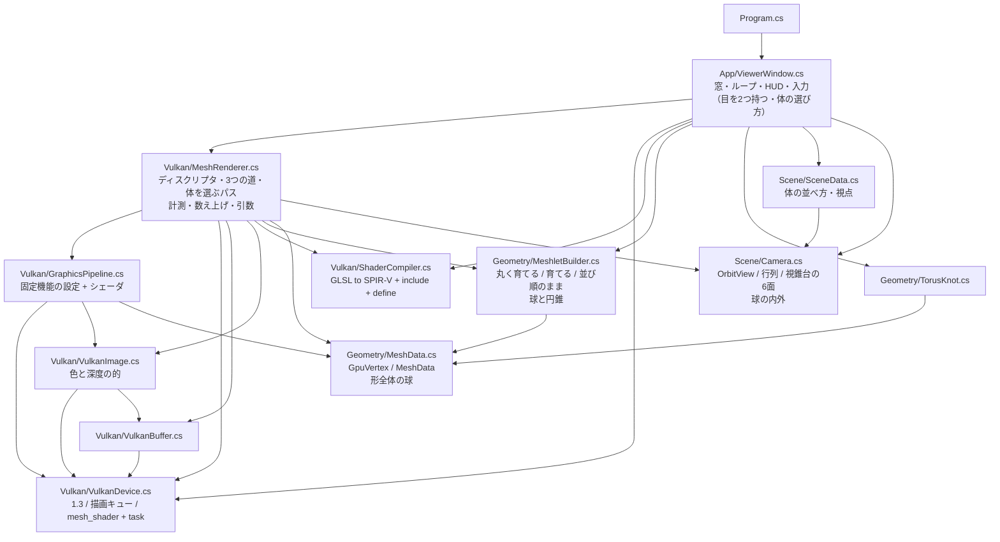
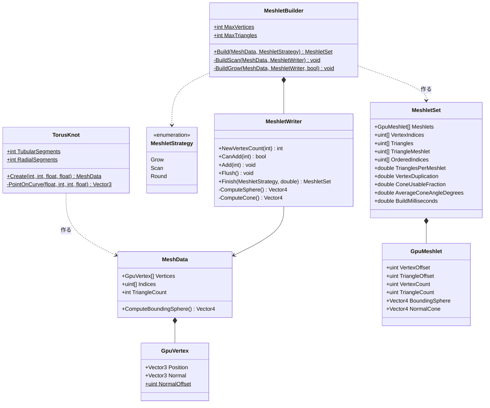
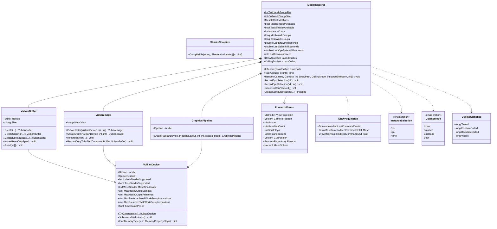
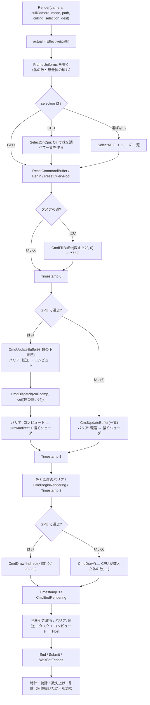
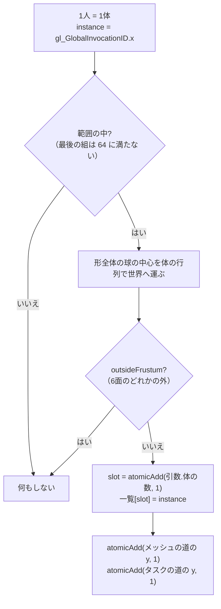
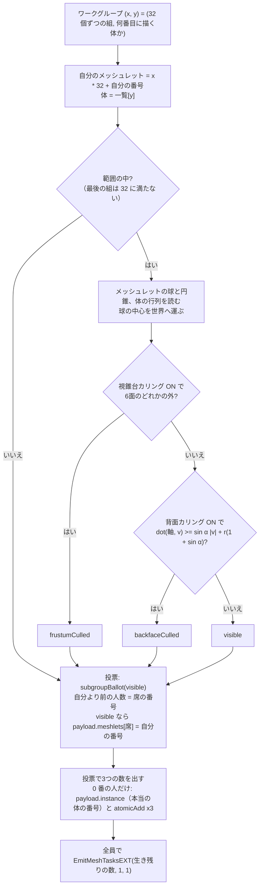
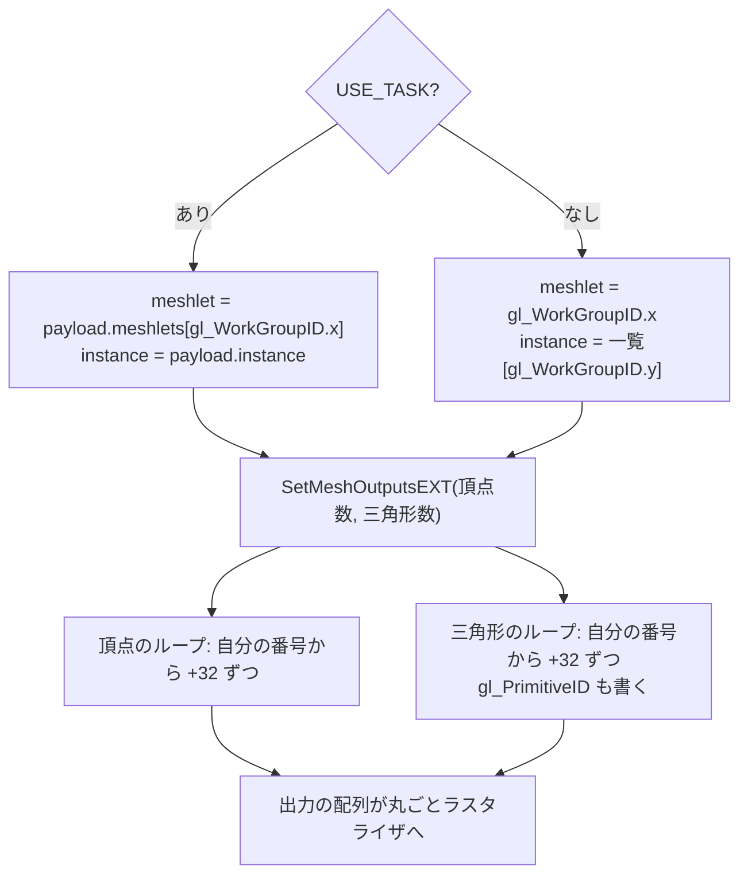

# Day 65a: GPU 駆動レンダリング(1) — 何体描くかを GPU が決め、描く命令の引数を GPU が書く

**教養編。Day 65 の1日目**。reference は Day 64b の完全コピー + 差分(`MeshletRenderer` の続き)。

Day 64b のタスクシェーダは、描く命令の**中で**「メッシュシェーダを何組立ち上げるか」を GPU に決めさせた。
ただ、描く命令そのもの——**何体ぶん描くか**——は、まだ CPU が数を書き込んでいた。
今日はその数も GPU に書かせる。描く前にコンピュートシェーダが体を1つずつ調べ、
**描く体の一覧と、描く命令の引数をバッファに書く**。CPU は「引数はあのバッファに書いてある」と言うだけ。

```
  Day 64b: CPU「256 体描け」 ───────────────→ タスクシェーダ(メッシュレットごとに捨てる)→ メッシュシェーダ → ラスタライザ
  Day 65a: コンピュート(体ごとに捨てる。引数を書く)→ CPU「引数を読んで描け」→ タスクシェーダ → メッシュシェーダ → ラスタライザ
           ↑ 256 体を 4 組 x 64 人で調べる                    ↑ CPU は何体描かれるかを知らない
```

| | Day 64b | **Day 65a** |
|---|---|---|
| 何体描くか | CPU が数を書く(`CmdDrawMeshTask(15, 256, 1)`) | **GPU が数を書く**(`CmdDrawMeshTasksIndirect(バッファ, 32, 1, 0)`) |
| 画面の外の体 | 468 個のメッシュレットを1つずつタスクシェーダが捨てる | **体ごとに1回**調べて丸ごと捨てる。タスクシェーダも立ち上がらない |
| 捨てる段 | メッシュレット → 三角形 | **体 → メッシュレット → 三角形**(階層カリング) |
| 頂点の道 | カリングなし(839 万枚を全部) | **頂点の道でも体ごとに捨てられる**(indirect の描く命令は Vulkan 1.0 からある) |

今日の差分は**新規 1 ファイル**(`cull.comp`、74 行)と**変更 10 ファイル**
(C# +515 / −37 行、GLSL +51 / −24 行)。量は Day 64b と同じくらい。
Day 65 は3日に分けた。**65a で「引数を GPU が書く」骨格を作り、65b で深度の山(Hi-Z)を作り、
65c でその骨格に「CPU が知らない情報で選ぶ」を載せる**(前のフレームの深度で、隠れた体を捨てる)。

> **今日いちばん意外だったのは、体を描く順番が変わっただけで、画素シェーダの回数が最大 20% 増えたこと**
> GPU で体を選ぶと、生き残った体は `atomicAdd` で一覧に席を取るので、**並び順がフレームごとに変わる**。
> 絵は1画素も変わらない(検証1)。ところが画素シェーダの回数は、CPU で選んだとき(番号順)の 337,434 回に対して、
> GPU で選ぶと **368,386〜406,348 回**の間でフレームごとに揺れた。
> では番号順が偉いのかというと、そうではない。**反対側から見ると、番号順のほうが 492,540 回で、GPU(404,863〜455,006 回)より悪い**。
> 番号順は、既定の視点からはたまたま「手前から奥へ」の順になっていただけだった(検証2)。
> **不透明な物は手前から描くと速い**——CPU が並べていたときはタダで手に入っていたものが、GPU に任せると消える。

## 今日のゴール

**起動すると Day 64b と同じ 16 体が出る。HUD に新しく「体」の行が増え、「GPU で選ぶ (indirect) (G)  16 体 → 描く 16 体」と出る。
`4` で 256 体にすると「256 体 → 描く 110 体」になり、タスクシェーダの組の数が 3,840 → 1,650 に減る。
`G` で CPU で選ぶ・選ばないに切り替えても、絵も三角形の数も変わらない。変わるのは「答えを知っているのが誰か」だけ。
`F` でカリングの目を止めて上から見下ろすと、止めた目の視錐台の形(扇形)に体が残り、その外の体は丸ごと消えている。**

| キー | 何が起きるか |
|---|---|
| `G` | **描く体をどう選ぶか(GPU で選ぶ → CPU で選ぶ → 選ばない)。今日の目** |
| `B` | 描き方(タスク + メッシュ → メッシュ → 頂点)。**`G` は3つの道のどれでも効く** |
| `C` / `F` / `O` / `M` / `1`〜`4` / ドラッグ / ホイール / `R` / `H` / `Esc` | Day 64b のまま |

### 今日いちばん大事な3つ

**1つ目は「描く命令の引数を GPU が書く」**(要点1・2)。描く命令に数を渡す代わりに、**数の書いてあるバッファの場所**を渡す。

```csharp
// Day 64b: 数を渡す。CPU がこの数を知っている必要がある
CmdDrawMeshTask(commands, 15, 256, 1);

// Day 65a: 場所を渡す。数は cull.comp が GPU の上で書く
CmdDrawMeshTasksIndirect(commands, drawArguments, 32, 1, 0);   // 32 = タスクの道の引数が始まるバイト位置
```

CPU は描く命令を積み終えて提出するまで、**何体描かれるかを一度も知らない**。
描き終わったあとに HUD のために引数のバッファを読んでいるが、それは描くのに要らなかった数。

**2つ目は「粗いものから順に捨てる」**(要点5)。体の球 → メッシュレットの球と円錐 → 三角形の順に調べる。256 体では、

| | 選ばない(Day 64b) | **GPU で選ぶ** |
|---|---|---|
| コンピュート | — | 256 人(4 組 x 64 人)が球を1つずつ |
| タスクシェーダ | 3,840 組 x 32 人 | **1,650 組** x 32 人 |
| メッシュレットの判定 | 119,808 個 → 画面の外 61.4% | **51,480 個** → 画面の外 10.2% |
| ラスタライザへの三角形 | 2,453,947 枚 | 2,453,947 枚(同じ) |

画面の外のメッシュレットの大半(61.4% → 10.2%)は、体ごとの判定で先に捨てられた。
残った 10.2% は「半分だけ画面に入っている体」の、はみ出した側のメッシュレット。

**3つ目は「CPU で選んでも GPU で選んでも同じ」**(要点6)。同じ式を C# と GLSL に書き、`G` で比べられるようにした。
**選ぶ体も、絵も、描く時間も同じ**(検証1・3)。違うのは答えを知っているのが誰かだけで、今日の場面では GPU に任せる得はほとんど無い。
それでも GPU に任せる骨格を作るのは、**CPU が知らない情報で選びたい**から。その代表が「前のフレームの深度」で、Day 65c で使う。

## 事前に読む資料

- **[Vulkan 仕様: Drawing Commands](https://docs.vulkan.org/spec/latest/chapters/drawing.html)** の
  `vkCmdDrawIndexedIndirect` と `VkDrawIndexedIndirectCommand`、そしてメッシュシェーダの節の
  `vkCmdDrawMeshTasksIndirectEXT` と `VkDrawMeshTasksIndirectCommandEXT`。
  **引数の構造体が、direct の描く命令の引数を並べただけ**であることを確かめる(要点1)
- **[Khronos: Synchronization Examples](https://github.com/KhronosGroup/Vulkan-Docs/wiki/Synchronization-Examples)** の
  「Dispatch writes into a storage buffer. Draw consumes that buffer as a draw indirect buffer.」——今日のバリアそのもの(要点4)
- **[A Trip Through the Graphics Pipeline 2011, part 2](https://fgiesen.wordpress.com/2011/07/02/a-trip-through-the-graphics-pipeline-2011-part-2/)**
  (Fabian Giesen)の **Command Processor** の節。描く命令は GPU の中の「命令を読む係」が順に読んでいく。
  indirect の描く命令では、その係が**描く直前に**引数をメモリから読みに行く
- **[Haar & Aaltonen: GPU-Driven Rendering Pipelines(SIGGRAPH 2015)](https://advances.realtimerendering.com/s2015/aaltonenhaar_siggraph2015_combined_final_footer_220dpi.pdf)** —
  Assassin's Creed Unity と Trials の GPU 駆動の講演。前半の「体(インスタンス)→ クラスタ(メッシュレット)→ 三角形」の
  階層カリングの図が、今日と Day 64b を合わせた形。後半の「前のフレームの深度で隠れたものを捨てる」は Day 65c で読む
- **[vkguide: GPU Driven Rendering Overview](https://vkguide.dev/docs/gpudriven/gpu_driven_engines/)** —
  Vulkan での GPU 駆動の全体像。形が何種類もある場面での「1本の大きなバッファ」と `DrawIndirectCount` の話は今日やらない(歪み3・改造課題3)
- **Day 64b の計画書**の「今日残した歪み」2 と 3 — 今日と Day 65b・65c の出発点
- **Day 57 の計画書**の要点(コンピュートシェーダの実行モデル)— ワークグループと `atomicAdd` の復習

## 理論の要点

### 1. indirect の描く命令 — 数の代わりに「数の書いてある場所」を渡す

描く命令の引数は、どれも数個の整数でしかない。indirect の描く命令は、**その整数の並びをバッファから読む**。

| direct(数を渡す) | indirect(場所を渡す) | バッファの中身(Vulkan が決めた構造体) |
|---|---|---|
| `vkCmdDrawIndexed(索引数, 体の数, 最初の索引, 頂点のずれ, 最初の体)` | `vkCmdDrawIndexedIndirect(バッファ, 位置, 回数, 間隔)` | `VkDrawIndexedIndirectCommand`(uint x 5、20 バイト) |
| `vkCmdDrawMeshTasksEXT(x, y, z)` | `vkCmdDrawMeshTasksIndirectEXT(バッファ, 位置, 回数, 間隔)` | `VkDrawMeshTasksIndirectCommandEXT`(uint x 3、12 バイト) |

構造体の中身は、direct の命令に渡していた数を**同じ順に並べただけ**。
今日は3つの道の分を1本のバッファに並べておき、道ごとに読み始める位置(オフセット)を変える。

```
  _drawArguments(44 バイト)
  ┌──────────────────── 0 ───────────────────┬────── 20 ──────┬────── 32 ──────┐
  │ 索引数 / 体の数 / 最初の索引 / ずれ / 最初の体 │ x / y / z       │ x / y / z       │
  │  頂点の道(DrawIndexedIndirectCommand)   │ メッシュの道    │ タスクの道      │
  └──────────────────────────────────────────┴────────────────┴────────────────┘
                ↑ 体の数                            ↑ y = 体の数      ↑ y = 体の数   ← cull.comp が足す
```

C# では Silk.NET の同名の構造体をそのまま並べる(`DrawArguments`)。位置は `Marshal.OffsetOf` で取る。

引数を読むのは、**GPU の中の「命令を読む係」**(Command Processor。事前資料 part 2)。
描く命令にたどり着いた時点でバッファを読み、そこに書いてある数で描き始める。
だから**その命令より前に積んだ GPU の仕事(今日は cull.comp)が書いた数**で描ける。CPU を経由しない。

最後の2つの引数(回数と間隔)は、構造体を**何個続けて読むか**と、その間の**バイト数**。今日は1個なので間隔は使われない。
何個も並べると形の違う物を1回の命令で描ける(`multiDrawIndirect`。歪み3・改造課題3)。

### 2. 引数を GPU が書く — 下書きと `atomicAdd`

cull.comp が書くのは**数の欄だけ**。索引数やメッシュレットの数は形で決まっていて、GPU が考える必要が無い。
そこで毎フレーム、C# が**数の欄だけ 0 にした下書き**を書き込み、cull.comp は生き残るたびに数の欄に 1 を足す。

```csharp
// MeshRenderer.RecordGpuSelection
var draft = new DrawArguments
{
    Vertex = new DrawIndexedIndirectCommand(indexCount: _indexCount, instanceCount: 0, ...),
    Mesh = new DrawMeshTasksIndirectCommandEXT(groupCountX: _meshletCount, groupCountY: 0, groupCountZ: 1),
    Task = new DrawMeshTasksIndirectCommandEXT(groupCountX: TaskGroupsPerInstance, groupCountY: 0, groupCountZ: 1),
};
vk.CmdUpdateBuffer(_commands, _drawArguments.Handle, 0, (ulong)Unsafe.SizeOf<DrawArguments>(), &draft);
```

`vkCmdUpdateBuffer` は**命令の中に値を埋めて送る**(64KB まで)。CPU が map して書く手もあるが、そうすると
「前のフレームの描く命令が、もう読み終わったか」を CPU が気にすることになる。命令として積めば、GPU の中で順番に処理される。

cull.comp の側は、生き残ったら `atomicAdd` で席を取り、3つの数の欄に足す。

```glsl
uint slot = atomicAdd(args.instanceCount, 1u);   // 足す前の値 = 自分の席
visibleInstances[slot] = instance;
atomicAdd(args.meshGroupsY, 1u);
atomicAdd(args.taskGroupsY, 1u);
```

3か所に足すのは、どの道で描いても同じ数になるようにするため。
どの道で描くかをシェーダが知っていれば1か所で済むが、そうすると描き方を変えるたびにシェーダも変わる。

### 3. 一覧で引き直す — 「何番目に描く体か」と「どの体か」を分ける

GPU で選ぶと、描く体は**飛び飛び**になる(256 体のうち 110 体)。ところが描く命令が立ち上げるのは
「0 番目から 109 番目まで」の連番。そこで**番号の一覧**(binding 8)を1枚挟む。

```
  描く命令が配る番号:   0    1    2    3   ...  109        ← gl_InstanceIndex / gl_WorkGroupID.y
  一覧(binding 8):     17   18    3   33   ...  240        ← cull.comp が詰めた本当の体の番号(値は一例)
                        ↓
  instances[visibleInstances[gl_InstanceIndex]]              ← 体の行列
```

3つの描くシェーダ(`scene.vert` / `meshlet.task` / `meshlet.mesh`)は全部この引き直しをする。
CPU で選ぶとき(と選ばないとき)は、C# が一覧を作って `vkCmdUpdateBuffer` で送る。**描くシェーダはどちらが書いたかを知らない**。

**一覧の順番は走るたびに変わる**。`atomicAdd` は先に着いた人から席を取るので、どの体が何番目になるかは GPU の都合で決まる。
Day 64b のタスクシェーダは投票(ballot)で元の順番を保ったが、今日は保たない。
不透明な物を深度テスト付きで描くなら、**体を描く順番が変わっても絵は変わらない**(深度テストが手前を残すので。検証1)。
ただし**速さは変わりうる**(検証2)。

### 4. バリア — 引数を読むのは「シェーダ」ではない

cull.comp が書いたものを、描く側は2通りに読む。

| 書いたもの | 読むのは誰か | 段(Stage) | 読み方(Access) |
|---|---|---|---|
| 引数(binding 9) | **描く命令そのもの**(命令を読む係) | `DrawIndirect` | `IndirectCommandRead` |
| 一覧(binding 8) | 描くシェーダ | `VertexShader` / `TaskShader` / `MeshShader` | `ShaderRead` |

```csharp
var toDraw = new MemoryBarrier
{
    SrcAccessMask = AccessFlags.ShaderWriteBit,
    DstAccessMask = AccessFlags.IndirectCommandReadBit | AccessFlags.ShaderReadBit,
};
vk.CmdPipelineBarrier(_commands,
    PipelineStageFlags.ComputeShaderBit,
    PipelineStageFlags.DrawIndirectBit | _drawShaderStages, ...);
```

**引数を読む段は、パイプラインのいちばん頭**(`DrawIndirect`)。頂点シェーダより前にある。
ここを `VertexShaderBit` だけにすると、描く命令は「まだ 0 のままの下書き」を読んで1体も描かないかもしれない
(この PC には検証レイヤが無いので、間違えても黙って動くことがある。だから仕様どおりに書く)。

`_drawShaderStages` は「持っている段だけ」を並べたもの。メッシュシェーダを持たない GPU で `MeshShaderBitExt` を挙げると仕様違反になる。

フレームの頭と終わりにもバリアがある。

```
  CmdUpdateBuffer(引数の下書き)
     ↓ バリア: 転送の書き込み → コンピュートの読み書き
  CmdDispatch(cull.comp)
     ↓ バリア: コンピュートの書き込み → DrawIndirect(引数)+ 描くシェーダ(一覧)
  CmdBeginRendering ... CmdDraw*Indirect ... CmdEndRendering
     ↓ バリア: 転送 + タスク + コンピュートの書き込み → Host
  WaitForFences → 引数を読む(HUD の「描く 110 体」)
```

### 5. 階層カリング — 体 → メッシュレット → 三角形

体ごとの判定に使うのは、**形全体の境界の球**(`MeshData.ComputeBoundingSphere`。中心 (0.159, 0, 0)、半径 1.875m)。
作り方はメッシュレットの球と同じで、頂点を囲む箱の中心から、いちばん遠い頂点まで。
体の行列は回転と移動だけなので、中心だけを行列で運べば半径はそのまま使える(Day 64b の要点2 と同じ)。

判定の式も Day 64b の視錐台カリングと同じ(`outsideFrustum` を `meshlet.task` から `common.glsl` へ移した)。
違うのは**調べる単位**だけ。

| 段 | 調べる単位 | 何で調べるか | 256 体での数 |
|---|---|---|---|
| **cull.comp**(今日) | 体 | 形全体の球 | 256 体 → 110 体 |
| meshlet.task(Day 64b) | メッシュレット | メッシュレットの球と円錐 | 51,480 個 → 32,139 個 |
| ラスタライザ | 三角形 | 画面の外と裏向き | 2,453,947 枚 → 画素へ |

**粗い段で捨てたものは、細かい段の手間を丸ごと省ける**。画面の外の体 146 体は、
Day 64b ではタスクシェーダが 146 x 468 = 68,328 個のメッシュレットを1つずつ捨てていた。今日は 146 回の球の判定で済む。

ただし**省ける手間の大きさは、細かい段が元々どれだけ高かったかで決まる**。タスクシェーダは元々安い(Day 64b の検証3 で上乗せ 0〜5%)ので、
タスクの道の描く時間は 4% しか縮まない。**頂点の道では半分**になる(検証3)——頂点の道にはそれまでカリングが1つも無かったから。

### 6. CPU で選ぶか、GPU で選ぶか

`G` の「CPU で選ぶ」は、cull.comp と同じ式を C# に書いたもの(`MeshRenderer.SelectOnCpu` と `Camera.IsOutside`)。

| | CPU で選ぶ | GPU で選ぶ |
|---|---|---|
| 式 | `Camera.IsOutside`(C#) | `outsideFrustum`(GLSL) |
| 選ぶのにかかる時間(256 体) | CPU で約 8 us(体の数に比例) | GPU で約 6 us(ほぼ一定。検証3) |
| 描く命令 | direct(数を CPU が書く) | indirect(数を GPU が書く) |
| 一覧の並び | 番号順 | 走るたびに変わる |
| 描く体・絵・描く時間 | **同じ** | **同じ** |
| CPU が知っている必要があるもの | **全部の体の置き場所**(`_instanceMatrices` の写し) | 何も無い |

今日の場面では、どちらで選んでも絵も時間も同じで、GPU に任せる得はほとんど無い。
GPU に任せる得が出るのは、**CPU が答えを出すのに必要な情報を持っていないとき**。

- **前のフレームの深度**(Day 65b・65c)。隠れているかどうかは深度を見ないと分からない。深度は GPU の中にあり、CPU へ読み戻すと1フレーム以上待つ
- **GPU が動かしている物の位置**(Day 57 のパーティクルのように、位置の計算自体が GPU にある場合)
- **体の数が多すぎるとき**。CPU の時間は体の数に比例する(256 体で 8 us なら、10 万体で 3ms)。GPU は数万人を並べて走らせる

逆に、**CPU が選べば、ついでに並べ替えもできる**(手前から順に)。GPU に任せるとそれが消える(検証2、改造課題1・2)。

## 前Dayからの差分概要

### 新規ファイル

| ファイル | 行数 | 役割 |
|---|---|---|
| `shaders/cull.comp` | 74 | **今日の主役**。体ごとに球を調べ、生き残りを一覧に詰めて、描く命令の引数に数を足す |

### 変更ファイル

| ファイル | 差分 | 何を足したか |
|---|---|---|
| `Day65a.csproj` | コメントのみ | shaders に `cull.comp` が増えたことの説明 |
| `Geometry/MeshData.cs` | +30 / −0 | `ComputeBoundingSphere`(形全体の球) |
| `Scene/Camera.cs` | +22 / −0 | `IsOutside`(球が視錐台の外か。CPU で選ぶとき用) |
| `shaders/common.glsl` | +37 / −3 | `Frame` に体の数と形全体の球、binding 8(一覧)、`outsideFrustum` を `meshlet.task` から移す |
| `shaders/meshlet.task` | +5 / −16 | `outsideFrustum` を消す(移したので)。体の番号を一覧で引く |
| `shaders/meshlet.mesh` | +3 / −2 | 体の番号を一覧で引く(タスクなしの道) |
| `shaders/scene.vert` | +6 / −3 | 体の番号を一覧で引く |
| `Vulkan/MeshRenderer.cs` | +415 / −20 | `DrawArguments` / `InstanceSelection`、コンピュートのパイプライン、一覧と引数のバッファ、バリア、indirect の描く命令、CPU で選ぶ |
| `App/ViewerWindow.cs` | +38 / −3 | `G`、HUD の「体」の行、`Render` に選び方を渡す |
| `Program.cs` | +10 / −14 | 説明の差し替え(コメントのみ) |

`MeshRenderer.cs` の +415 行のうち、半分ほどはコメント。コードとしての主役は `RecordGpuSelection`(約 50 行)と、
描く命令の分岐(indirect と direct の2通り x 3つの道)。

### 写経の始め方

`work/Labs/MeshletRenderer` をそのまま育てる(Day 64a から続いているプロジェクト)。差分は `./diff.sh Day65a` で見られる
(Day 65 は Day 64 と同じ `work/Labs/MeshletRenderer` に対応させた)。

### 写経する順番

| # | ファイル | 何が要るか / 気をつけるところ |
|---|---|---|
| 1 | `Geometry/MeshData.cs` | 依存なし。`MeshletBuilder.ComputeSphere` と同じ作り方 |
| 2 | `Scene/Camera.cs` | 依存なし。式は `meshlet.task` の `outsideFrustum` と同じ |
| 3 | `shaders/common.glsl` | `Frame` の `padding` を `instanceCount` にし、末尾に `meshSphere`。binding 8 は `#ifdef CULL_INSTANCES` で2通り。`outsideFrustum` をここへ |
| 4 | `shaders/meshlet.task` | **3 と同時に**。`outsideFrustum` を消さないと、同じ関数が2つになって翻訳が通らない |
| 5 | `shaders/meshlet.mesh` | 3 の一覧を使う。`#else` の側(タスクなしの道)だけ |
| 6 | `shaders/scene.vert` | 3 の一覧を使う。`vInstance` も本当の番号に |
| 7 | `shaders/cull.comp` | **新規**。3 を使う。`#define CULL_INSTANCES` を `#include` より**前**に |
| 8 | `Vulkan/MeshRenderer.cs` | 1〜7 を使う。`FrameUniforms` を 3 の `Frame` と合わせる。binding は 10 本に |
| 9 | `App/ViewerWindow.cs` | 8 を使う。`Render` の引数が1つ増える |
| 10 | `Program.cs` | コメントのみ。差分0にしたいなら合わせておく |
| 11 | `Day65a.csproj` | コメントのみ。差分0にしたいなら合わせておく |

> **動かすのは 9 まで写してから**(8 で `Render` の引数が変わるので、9 まで写さないとビルドが通らない)。
> シェーダは起動時に翻訳されるので、**3〜7 の間違いはビルドでは分からず、起動すると HUD に翻訳エラーが出る**。
> 動いたら、`G` を「選ばない」→「CPU で選ぶ」→「GPU で選ぶ」の順に確かめる。
> 選ばないで崩れる → 一覧の引き直し(5・6、`meshlet.task`)か `FrameUniforms` の並び(3・8)/
> CPU で選ぶと崩れる → `SelectOnCpu` と `RecordCpuSelection`(8)/
> GPU で選ぶと1体も出ない → 下書き・`cull.comp`・バリア(7・8)/ GPU で選ぶと体が足りない → `meshSphere` の渡し方(1・3・8)

## 設計書

Day 64b から**クラスは増えていない**(増えたのは列挙1つと、Vulkan の構造体を並べた構造体1つ)。層の形も変わらない。
変わったのは、`MeshRenderer.Render` の中で**描く前にコンピュートのパスが入った**ことと、
描く側のシェーダが体の番号を**一覧で引き直す**ようになったこと。

### 全体構成と依存の向き



| 層 | 知っているもの | 知らないもの | Day 64b からの変化 |
|---|---|---|---|
| `Geometry/` | 自分の中だけ | **Vulkan を知らない** | `MeshData` が形全体の球を出せる |
| `Scene/` | 自分の中だけ | 形も GPU も知らない | `Camera` が「球が視錐台の外か」を答えられる |
| `Vulkan/` | `Geometry/` の型と `Camera` | 窓を知らない | 描く前にコンピュートのパス。indirect の描く命令。CPU で選ぶ道も持つ |
| `App/` | 全部 | — | 体の選び方を持つ |

**循環は依然として無い**。矢印も1本も増えていない(`MeshRenderer` はもともと `Camera` と `MeshData` を知っていた)。

**入れ替えると何が壊れるか**を3つ。

- **同じ式が C# と GLSL の2か所にある**(`Camera.IsOutside` と `common.glsl` の `outsideFrustum`)。
  片方だけ直すと、`G` で切り替えたときに**描く体の数が食い違う**(HUD の「描く 110 体」が変わる)。
  Day 64b の「円錐の w の約束が C# と GLSL にまたがる」と同じ種類の危うさで、今日は HUD で気づける形にしてある
- **引数の構造体の並びが C# と GLSL の2か所にある**(`DrawArguments` と `cull.comp` の `DrawArguments` ブロック)。
  こちらは Vulkan が決めた並びなので勝手に変えられない。GLSL 側で欄を1つ飛ばすと、**数が別の欄(例えば「最初の索引」)に足されて**、
  描く命令がとんでもない位置の索引を読む。検証レイヤが無いと、落ちるか、絵が崩れるか、何も起きないかのどれか
- **描く命令は「何番目に描く体か」しか配らない**。3つの描くシェーダのどれかで一覧を引き忘れると、
  **選ばないとき(一覧 = 番号順)だけ正しく見える**。`G` を回して確かめる理由がこれ(検証1 のわざと壊した実験)

### Geometry — 形とメッシュレット(Day 65a で `MeshData` に球が付いた)



球が2種類になった。**形全体の球**(`MeshData.ComputeBoundingSphere`)は体ごとの判定に、
**メッシュレットの球**(`MeshletWriter.ComputeSphere`)はメッシュレットごとの判定に使う。作り方は同じ(箱の中心から、いちばん遠い頂点まで)。
同じ処理を2か所に書いているが、`MeshletWriter` が見るのは「いま閉じようとしているメッシュレットの頂点だけ」なので、
共通化すると引数が増えて読みにくくなる。今日はそのままにした。

### Vulkan — 7つのクラス(Day 65a で `MeshRenderer` がもう一段太った)



コンピュートのパイプラインは `GraphicsPipeline` のようなクラスにせず、`MeshRenderer` の中の
`CreateComputePipeline`(Day 62c の `ComputeRenderer` から持ってきたもの)で作って、ハンドルを2つ(パイプラインとモジュール)持つだけにした。
固定機能の設定が1つも無いので、クラスにするほどのものが無い。
**グラフィックスの3本と同じパイプラインレイアウト・同じディスクリプタセット**を使い、束ねる先(`PipelineBindPoint.Compute`)だけを変える。

`MeshRenderer` はそろそろ太すぎる(約 1,200 行。うち半分ほどはコメント)。
「体を選ぶ」部分(`RecordGpuSelection` / `RecordCpuSelection` / `SelectOnCpu` と2本のバッファ)は、Day 65b・65c で Hi-Z と2パスが加わると
もう一段増えるので、そこで `InstanceCuller` のような別のクラスに切り出すかを考える(歪み4)。

### GPU に挿さっているもの — binding の一覧(Day 65a で 8・9 番が増えた)

| binding | 中身 | 型 | 読む・書く段 |
|---|---|---|---|
| 0 | `Frame`(行列・目・表示・カリングの目と6面・**体の数・形全体の球**) | uniform | 全部 |
| 1 | 頂点(`GpuVertex[]`) | storage | メッシュ(頂点の道は同じバッファを頂点バッファとして) |
| 2 | 体ごとの行列 | storage | **コンピュート**・頂点・タスク・メッシュ |
| 3 | メッシュレット(`GpuMeshlet[]`、48 バイト) | storage | タスク・メッシュ |
| 4 | 局所番号 → 元の頂点番号 | storage | メッシュ |
| 5 | 三角形(局所番号3つ) | storage | メッシュ |
| 6 | 三角形 → メッシュレット | storage | 画素(色分け) |
| 7 | カリングの数え上げ(uint 4つ) | storage | タスクが書く、CPU が読む |
| **8** | **描く体の番号の一覧** | storage | **コンピュートが書く**(または C# が転送で)、頂点・タスク・メッシュが読む |
| **9** | **描く命令の引数**(`DrawArguments`、44 バイト) | storage + **indirect** | **コンピュートが書く**、**描く命令が読む**、CPU が読む |
| — | 並べ直した索引 | 索引バッファ | 頂点の道の入力の回路 |
| — | 荷物(`TaskPayload`) | (ディスクリプタではない) | タスクが書き、そこから生まれたメッシュが読む |

**8 番は宣言が2通りある**。`common.glsl` の中で、`CULL_INSTANCES` が定義されていれば `writeonly`、無ければ `readonly`。
書ける宣言を頂点シェーダから見える場所に置くと、別の機能(`vertexPipelineStoresAndAtomics`)が要るので
(Day 64b の 7 番と同じ理由)、書けるのは cull.comp だけにしてある。
**9 番は cull.comp の中でだけ宣言する**(描くシェーダは読まない。読むのは描く命令)。

**9 番は使い道を3つ宣言している**(`IndirectBufferBit | StorageBufferBit | TransferDstBit`)。
`IndirectBufferBit` が無いと、描く命令の引数としては読めない(Vulkan はバッファを作るときに使い道を全部宣言させる。Day 62a の要点3)。

### 1フレームの流れ — `MeshRenderer.Render`(Day 65a で描く前にコンピュートが入った)



**GPU で選ぶとき、CPU は描く体の数を一度も扱わない**。`CmdUpdateBuffer` で送る下書きの数の欄は 0 で、
描く命令にはバッファの位置だけを渡す。数が CPU の手に入るのは、フェンスを待った後の最後の箱だけ。

「CPU で選ぶ」「選ばない」も同じ形にそろえた(一覧を送って、数を指定して描く)。こうしておくと3つの違いが
**「一覧を書くのは誰か」と「描く命令が数を持っているか」の2点だけ**になり、`G` で比べやすい。

### cull.comp の1人の中(新規)



**投票も共有メモリも使わない**。Day 64b のタスクシェーダは 32 人が投票してから代表が1回だけ足したが、
cull.comp は生き残った人がそれぞれ `atomicAdd` する。256 体では奪い合いが問題になる数ではないので、読みやすいほうを採った。
代わりに一覧の順番は保たれない(歪み1)。

### タスクシェーダの1ワークグループの中(Day 65a で体の番号の引き方が変わった)



変わったのは2か所目の箱の「体 = 一覧[y]」だけ。**y の範囲(何体ぶん立ち上がるか)は、GPU で選ぶときは cull.comp が書いた数**。
荷物には一覧で引き直した**本当の体の番号**を入れるので、メッシュシェーダ(`USE_TASK` あり)は何も変わらない。

### メッシュシェーダの1ワークグループの中(Day 65a で、タスクなしの道の体の番号の引き方が変わった)



### 今日残した歪み(4つ)

**1. 体を描く順番が GPU 任せ**。`atomicAdd` で席を取るので、一覧の順番は走るたびに変わる。
絵は変わらないが、**手前から描くほど早期の深度テストで画素シェーダを省ける**ので、順番しだいで画素シェーダの回数が最大 20% 変わった(検証2)。
CPU で選んでいたときは、並べ替えは CPU がタダでできた。GPU で並べ替えるには前置和(prefix sum)やソートのパスが要る。改造課題1・2。

**2. 隠れているものを捨てていない**(Day 64b の歪み3 のまま)。手前の体に隠れた奥の体も、画面の中にいれば描いている。
これを捨てるのが Day 65c(Hi-Z は Day 65b で作る)。「前のフレームの深度」は GPU の中にしか無いので、**選ぶのは GPU でなければならない**——
今日作った indirect の骨格が、そこで初めて要るものになる。

**3. 形が1種類なので、描く命令が1つで済んでいる**。本物の GPU 駆動のエンジンは、形も材質も何百種類もある物を描く。
そのために「全部の形を1本の大きなバッファに入れる」「引数の構造体を形ごとに並べ、何個並べたかも GPU が書く」
(`vkCmdDrawIndexedIndirectCount`、`vkCmdDrawMeshTasksIndirectCountEXT`)という仕組みを使う。
今日の場面ではそこまで要らないので作っていない。改造課題3 で「細かい形と粗い形の2種類」にすると、この話の入口に立てる。

**4. `MeshRenderer` が太すぎる**(約 1,200 行)。描く道が3つ x 体の選び方が3つ、計測、数え上げを1つのクラスが持っている。
Day 65b・65c で Hi-Z と2パスが加わる前に、体を選ぶ部分を切り出すかを決める。

**持ち越し**: Day 64b の歪み1(取り残された欠片)はそのまま。

### 引き継いだ図

次の図は Day 64b から変わっていないので、Day64b.md の設計書を参照。

- 「メッシュレットが育つまで — `BuildGrow`」

## 完成条件

`dotnet run --project reference/Day65a -c Release` で確かめる。

### 1. 起動: 16 体、GPU で選ぶ

- 絵は Day 64b と同じ
- 新しい行「体」が「**GPU で選ぶ (indirect) (G)  16 体 → 描く 16 体 / 選ぶのに GPU 21 us**」前後
  (16 体は全部画面に入っているので、1体も捨てられない)
- 「判定」「内訳」は Day 64b と同じ(**7,488 個 → 画面の外 1.9% / 裏向き 29.9% / 描く 68.2%**、
  タスクシェーダ 240 組、三角形 391,278 枚、画素シェーダ 196,009 回)

「選ぶのに」の値は、アプリの中では 20〜26 us 前後に出る(60 枚/秒に合わせて休んでいるぶん GPU のクロックが下がるので、
ハーネスの値より大きい。検証3)。

### 2. `4` を押す: 256 体(今日の目)

- 「体」: **256 体 → 描く 110 体**
- 「判定」: **51,480 個 → 画面の外 10.2% / 裏向き 27.3% / 描く 62.4%**
- 「内訳」: タスクシェーダ **1,650 組** x 32 人 → メッシュシェーダ 32,139 組 / 三角形 **2,453,947 枚**

`G` で回して見比べる。

| 体の選び方 | 描く体 | タスクシェーダ | 判定(画面の外 / 裏向き / 描く) | 三角形 | 画素シェーダ |
|---|---|---|---|---|---|
| GPU で選ぶ | 110 | 1,650 組 | 51,480 個(10.2% / 27.3% / 62.4%) | 2,453,947 | **368,386〜406,348(揺れる)** |
| CPU で選ぶ | 110 | 1,650 組 | 51,480 個(10.2% / 27.3% / 62.4%) | 2,453,947 | 337,434 |
| 選ばない | 256 | 3,840 組 | 119,808 個(61.4% / 11.7% / 26.8%) | 2,453,947 | 337,434 |

- **三角形の数は3つとも同じ**。画面の外の体のメッシュレットは、選ばなくてもタスクシェーダが1つずつ捨てていたから
- 「選ぶのに」は、GPU で選ぶと GPU の時間(20〜26 us 前後)、CPU で選ぶと CPU の時間(4 us 前後)
- 「うち描画」はアプリ内で 3.2〜3.4 ms 前後で、3つとも見分けがつかない(検証3)
- **GPU で選ぶときだけ、画素シェーダの回数がフレームごとに変わる**(HUD の数字が揺れる)。検証2

### 3. `B` を2回押す: 頂点の道

- 「体」は変わらない(**110 体**)。**頂点の道でも体ごとのカリングが効く**
- 「内訳」: 頂点シェーダ **3,644,941 回** / 三角形 **3,604,480 枚**(選ばないと 8,482,797 回 / 8,388,608 枚)
- `G` で「選ばない」にすると三角形が 839 万枚に戻り、描く時間がほぼ倍になる

### 4. `F` で目を止めて見下ろす

256 体・GPU で選ぶのまま `F` を押し、ホイールで大きく引いて、ドラッグで上から見下ろす。
**止めた目の視錐台の形(扇形)に体が残り、その外の体は丸ごと消えている**。扇の縁の体は、半分はみ出していても丸ごと残っている
(形全体の球が少しでも視錐台に入れば描く)。`G` で「選ばない」にすると、扇の外にも体が戻る
(ただし `C` が「視錐台 + 背面」なら、扇の外の体のメッシュレットはタスクシェーダが捨てるので、やはり見えない。`C` で「しない」にすると全部戻る)。

## 検証の途中で分かったこと

窓の無いハーネス(`MeshRenderer` を直接呼ぶ)で確かめた。RTX 3070 / ドライバ 596.49、検証レイヤなし。

### 検証1: どの選び方でも絵は1画素も変わらない

体の数 4 通り x 見る向き 3 通り(yaw 0.6 / 2.2 / 4.0)x 表示 3 通り = 36 の場面それぞれで、
頂点の道・選ばない・カリングなしの絵を基準に、12 通り(頂点の道・メッシュの道・タスクの道(カリングなし / 両方))x(GPU / CPU / 選ばない)を
**518,400 画素すべて突き合わせた**。**432 通りとも完全一致**。

- 体ごとのカリングは、画面に1画素でも出る体を捨てていない(形全体の球が安全側に効いている)
- GPU で選んだときの**順番のばらつき**は、絵を1画素も変えなかった(深度テストが手前を残す。要点3)
- C# の `IsOutside` と GLSL の `outsideFrustum` は、全部の場面で同じ体を選んだ

**突き合わせが本当に効いているか**も確かめた。`scene.vert` で一覧を引かずに `gl_InstanceIndex` をそのまま体の番号にすると、
36 の場面で絵が変わった(256 体の場面で **149,115 画素**)。選ばないとき(一覧 = 番号順)は一致したまま——
設計書の「入れ替えると何が壊れるか」の3つ目がこれ。

### 検証2: 体を描く順番が画素シェーダの回数を変える

GPU で選ぶと、画素シェーダの回数がフレームごとに違った。同じ場面を 10 フレーム続けて描いた(タスクの道・両方のカリング)。

| 体の数 | 見る向き | GPU で選ぶ(10 フレーム) | CPU で選ぶ(番号順) |
|---|---|---|---|
| 16 | yaw 0.6(既定) | 196,009(10 回とも) | 196,009 |
| 64 | yaw 0.6 | **279,046 と 299,095 の2通り** | 279,046 |
| 256 | yaw 0.6 | **368,386〜406,348** | 337,434 |
| 256 | yaw 3.74(反対側) | **404,863〜455,006** | **492,540** |

- 深度テストは画素シェーダの**前にも**できる(早期の深度テスト)。**手前の物を先に描いておくと、奥の物の画素は画素シェーダまで行かずに捨てられる**。
  だから同じ絵でも、描く順番で画素シェーダの回数が変わる
- 体の番号は格子の奥行き方向(z)の順に振ってある(`SceneData.CreateInstances`)。既定の視点(yaw 0.6)は −z 側から見ているので、
  **番号順 = 手前から奥**になっていた。反対側(yaw 3.74)から見ると番号順は奥から手前になり、CPU で選んだほうが悪くなる
- GPU の順番は手前から奥でも奥から手前でもなく、その間のどこか。**番号順より良いことも悪いこともある**
- 16 体は 10 回とも同じ値、64 体は 2 通り。手元の GPU では、**同じワープ(32 人)の中の `atomicAdd` は番号の若い人から順に席が決まり**、
  ワープどうしの順番だけが揺れているように見える(16 体 = 1 ワープ、64 体 = 2 ワープ、256 体 = 8 ワープ)。
  仕様はこの順番を何も約束していないので、別の GPU では 16 体でも揺れるかもしれない

**画素シェーダの回数が 20% 変わっても、今日の描く時間はほとんど変わらなかった**(検証3 の task-cpu と task-gpu が同じ 0.400 ms)。
今日の画素シェーダは光の計算が数行しかなく、安いから。材質の重い場面(Day 35 の PBR など)では、これがそのまま時間の差になる。
**GPU 駆動のエンジンが「手前から順に」を取り戻すために、深度だけを先に描く(Z プリパス)か、GPU の上で並べ替える**のはこのため。

### 検証3: 値段

6 通りを1フレームずつ交互に 16 回ずつ描き、最小値を取った(描く命令だけの GPU の時間。頂点の道・選ばないを 1.00 とした比)。

| 体の数 | 頂点・選ばない | 頂点・CPU | 頂点・GPU | タスク・選ばない | タスク・CPU | タスク・GPU |
|---|---|---|---|---|---|---|
| 64 | 0.260 ms(1.00) | 0.72 | 0.72 | 0.61 | 0.59 | 0.60 |
| 256 | 1.024 ms(1.00) | **0.47** | **0.47** | 0.41 | 0.39 | 0.39 |

(タスクの道は両方のカリング付き。頂点の道にはメッシュレットのカリングが無い。)

読めることは4つ。

- **頂点の道では、体を選ぶだけで半分になる**(0.47)。256 体のうち 110 体しか描かないのだから当然だが、
  メッシュシェーダを持たない GPU でも indirect の描く命令は使えるので、**GPU 駆動の入口はメッシュシェーダを待たない**
- **タスクの道では 4〜5% しか縮まない**(0.41 → 0.39)。画面の外のメッシュレットは Day 64b のタスクシェーダがもう捨てていて、
  今日省けたのは「捨てる手間」だけ。その手間が元々安かった
- **CPU で選んでも GPU で選んでも、描く時間は同じ**(0.47 と 0.47、0.39 と 0.39)
- **選ぶ手間はどちらも数 us**。GPU の「選ぶパス」(下書き + バリア + cull.comp + バリア)は中央値 8.4〜9.2 us で、
  CPU で選ぶときの同じ区間(一覧の転送 + バリア)2.8〜3.4 us との差、**約 6 us** が cull.comp の値段。
  CPU で選ぶ C# の時間は 256 体で中央値 8 us 前後(64 体で 4 us)。どちらも描く時間(400 us)の 2% 程度

> ハーネスの絶対値(頂点・選ばない 1.024 ms)は、Day 64b の検証3(3.1〜3.5 ms)よりずっと小さい。GPU のクロックの状態が違うため。
> **比べるのは同じ走行の中の比だけ**にする(Day 64a の検証3 と同じ注意)。アプリ内の値(完成条件)はさらに大きく出る。

## 改造課題

### 課題1(易): CPU で手前から並べる

`MeshRenderer.SelectOnCpu` で、選んだ体をカリングの目からの距離が近い順に並べ替える(`Array.Sort` に距離の配列を添えればよい)。

1. yaw 3.74(反対側。`R` のあとドラッグで半周)で、CPU で選んだときの画素シェーダの回数が 492,540 からどれだけ減るか
2. 既定の視点(yaw 0.6)ではどうか。番号順(337,434)より良くなるか
3. 並べ替えにかかる CPU の時間(HUD の「選ぶのに CPU」)はどれだけ増えるか。体が 10 万体ならどうなりそうか

### 課題2(中): GPU で選んでも順番を保つ

cull.comp の `atomicAdd` をやめて、**番号順のまま**一覧に詰める。体が 256 以下なので、1 ワークグループ(256 人)で足りる。

1. `local_size_x` を 256 にし、共有メモリに「自分が生き残ったか(0 / 1)」を書く
2. 共有メモリの上で**前置和**(prefix sum。自分より前に生き残った人の数)を求める。
   Day 64b の `subgroupBallotExclusiveBitCount` はワープの中の前置和だった。ワープをまたぐには、ワープごとの合計をもう一度足し合わせる
3. 最後の人が合計を引数の数の欄に書く(`atomicAdd` は要らなくなる)
4. 画素シェーダの回数が、CPU で選ぶときと同じ値(337,434)で止まることを確かめる
5. 体が 256 を超えたらこのやり方はどう破綻するか。ワークグループをまたぐ前置和は何回のパスで作れるか

### 課題3(難): 粗い形を足して、引数を2つ並べる

Day 64b の改造課題3(タスクシェーダで LOD)を、**体ごと**に GPU で選ぶ形でやってみる。頂点の道でやるのがいちばん簡単。

1. `TorusKnot.Create` の刻みを引数で変えられるようにし、粗い版(128 x 16 など)を作って、細かい版の後ろに頂点と索引をつなげる
2. `DrawArguments` の頂点の道の欄を2つにする(細かい版と粗い版。`firstIndex` と `vertexOffset` がそれぞれ違う)
3. cull.comp で目からの距離を測り、近い体は細かい版の数の欄に、遠い体は粗い版の数の欄に足す。**一覧も2つに分ける**
   (粗い版の一覧を配列の後ろ半分に置き、`firstInstance` で読み始めをずらすのが1つの手。`drawIndirectFirstInstance` の機能が要る)
4. `vkCmdDrawIndexedIndirect` の回数を 2、間隔を 20 にする(`multiDrawIndirect` の機能が要る。`VulkanDevice` で有効にする)
5. 256 体で三角形の数と時間がどれだけ減るか。**何種類の形を描くかは CPU が決めている(回数 2)**が、
   これも GPU に決めさせたいときに `vkCmdDrawIndexedIndirectCount` がある——それが歪み3 の入口

> **測るときは Release で、1フレームずつ交互に描いて比べる**。そして長く回しっぱなしにしない(電源に対して厳しい負荷になる)。

## 次の Day 65b・65c へ

今日は、体を選ぶ権限を GPU に移し、描く命令の引数を GPU が書くようにした。ところが今日の場面では、CPU で選んでも同じだった。
**CPU で選べる情報(体の置き場所と視錐台)しか使っていない**から。

Day 65b・65c では、**CPU が持っていない情報**——前のフレームの深度——で選ぶ。

- Day 65b: 深度を、縦横半分ずつに縮めながら「いちばん奥の深度」を残した画像の山(Hi-Z)を作る
- Day 65c: 体(とメッシュレット)の球を画面に投影し、その大きさに合った段の Hi-Z と比べて、**確実に隠れているなら捨てる**
- 前のフレームの深度は「前のフレームに見えていた物」でしか作れないので、**2パス**にする
  (1. 前のフレームに見えていた物を描いて深度を作る → 2. その深度で残りを調べて、新しく見えた物を描く)
- どれも CPU には答えが出せないので、今日の indirect の骨格がそのまま要る
- そのうえで、UE5 の Nanite がこの形(クラスタの階層 + GPU の上の選択 + 2パスのオクルージョン)に何を足したのかを読む
