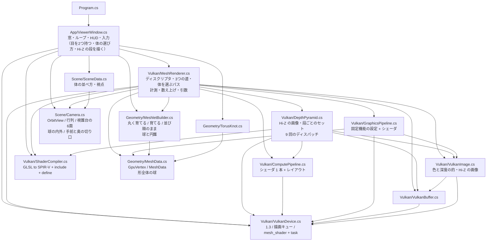
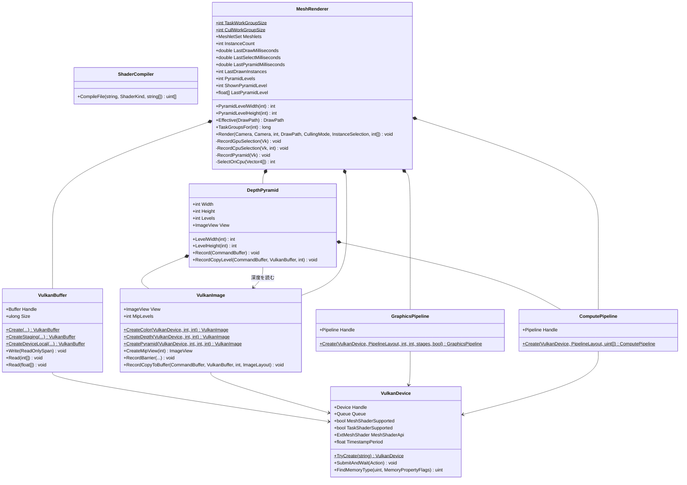
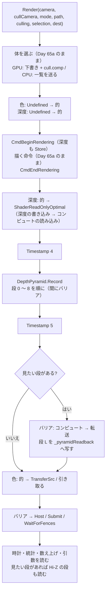
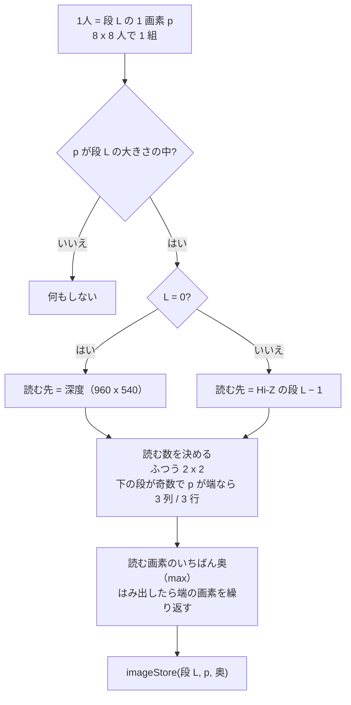

# Day 65b: GPU 駆動レンダリング(2) — 描き終わった深度を畳んで Hi-Z を作る

**教養編。Day 65 の2日目**。reference は Day 65a の完全コピー + 差分(`MeshletRenderer` の続き)。

Day 65a で「描く命令の引数を GPU が書く」骨格を作った。ところが選ぶのに使ったのは、体の置き場所と視錐台という
**CPU でも分かる情報**だけで、CPU で選んでも絵も速さも同じだった。
Day 65c では **CPU が持っていない情報——深度——で、隠れたものを捨てる**。今日はその下ごしらえで、
描き終わった深度を縦横半分ずつ畳み、「その範囲でいちばん奥の深度」を残した画像の山(**Hi-Z**)を毎フレーム作る。

```
  深度(960 x 540)
     │ 2x2 のうち、いちばん奥
     ▼
  段 0(480 x 270)→ 段 1(240 x 135)→ 段 2(120 x 67)→ ... → 段 8(1 x 1)
                                                   9 回のディスパッチ、合わせて 25 us 前後
```

| | Day 65a | **Day 65b** |
|---|---|---|
| 深度 | 描き終わったら捨てる(`DontCare`) | **残して(`Store`)、シェーダから読む** |
| 描いた後 | 色を引き取るだけ | **Hi-Z を作る**(`DepthPyramid` + `depth_reduce.comp`) |
| コンピュートのパイプライン | `MeshRenderer` の中の関数で作る | **`ComputePipeline` クラス**(使い手が2つになったので) |
| 画面 | 絵 | `Z` で **Hi-Z の段を絵の代わりに出せる** |

今日の差分は**新規 3 ファイル**(`DepthPyramid.cs` 238 行、`ComputePipeline.cs` 87 行、`depth_reduce.comp` 82 行)と
**変更 6 ファイル**(+265 / −75 行)。Day 65 は3日に分けた。

| | 何を作るか | 絵は変わるか |
|---|---|---|
| 65a | 描く命令の引数を GPU が書く(indirect)。体ごとのカリング | 変わらない |
| **65b** | **深度の山(Hi-Z)を作って、目で見る** | 変わらない(`Z` で Hi-Z を見られる) |
| 65c | 前のフレームに見えていたもの → Hi-Z → 隠れたものを捨てる2パス。Nanite の講読 | 変わらない(描く量が減る) |

> **今日いちばん意外だったのは、画像のミップは「切り上げ」で数えると作れないこと**
> 480 x 270 を半分ずつにしていくとき、最初は切り上げ(15 → 8)で数えて **10 段**の画像を作った。
> 何のエラーも出ず、絵も出た。ところが Day 65c の判定が1体だけ必ず「隠れている」と言うので調べると、
> **段 9 の大きさがシェーダから 0 x 0 に見えていた**。Vulkan のミップの大きさは**切り捨て**(`max(1, 大きさ >> 段)`)で、
> 480 x 270 から作れるのは **9 段まで**。10 段目は仕様違反で、検証レイヤの無いこの PC では黙って「無い段」になっていた。
> 切り捨てに合わせると、今度は奇数の段を半分にするたびに**端の1列が取り残される**。
> 取り残すと「そこに見えていた物」を隠れていると言いかねないので、端の画素だけ 3 列(3 行)読んで拾う(要点3)。

## 今日のゴール

**起動すると Day 65a と同じ 16 体が出る。HUD に「Hi-Z : 9 段 / 作るのに GPU 80〜110 us 前後 / 見ていない」の行が増える。
`Z` を押すたびに、絵の代わりに Hi-Z の段 0、1、2 … 8 が画面いっぱいに引き伸ばされて出る。
段を上がるほど粗いモザイクになり、**体の輪郭の内側まで黒(= 奥、何も無い)が食い込んでいく**。
9 回目の `Z` で絵に戻る。絵そのものは Day 65a と1画素も変わらない。**

| キー | 何が起きるか |
|---|---|
| `Z` | **Hi-Z の段を見る(見ない → 段 0 → 段 1 → … → 段 8 → 見ない)。今日の目** |
| `G` / `B` / `C` / `F` / `O` / `M` / `1`〜`4` / ドラッグ / ホイール / `R` / `H` / `Esc` | Day 65a のまま |

### 今日いちばん大事な3つ

**1つ目は「いちばん奥を残す」**(要点1)。Hi-Z の1画素は、それが受け持つ画面の範囲の**いちばん奥の深度**。
ある物のいちばん手前が、その物がかかる範囲の「いちばん奥」よりさらに奥なら、その物は**1画素も見えない**と言い切れる。
平均でも手前でもなく「奥」を残すのは、この「言い切れる」(安全側)のため。

**2つ目は「どんな大きさの範囲でも、読むのは 2x2 画素」**(要点2)。段 L の1画素は画面の 2^(L+1) 画素四方を受け持つ。
物が画面で覆う箱の差し渡しが 100 画素なら、段 6(128 画素四方)を選べば箱は多くても 2x2 画素にかかる。
何千画素の範囲でも、4 画素読めば「その範囲でいちばん奥」が分かる。これが山にしておく理由。

**3つ目は「作るのは安く、でも毎フレーム」**(要点4・検証3)。9 回のディスパッチで 25 us 前後(ハーネス)。
256 体を描く時間(400 us)の 6% ほど。ただし**深度はそのフレームの物**なので、毎フレーム作り直すしかない。

## 事前に読む資料

- **[RasterGrid: Hierarchical-Z map based occlusion culling](https://www.rastergrid.com/blog/2010/10/hierarchical-z-map-based-occlusion-culling/)** —
  Hi-Z を作って、物の箱と比べて隠れを判定する、という手法の定番の解説。「いちばん奥(max)を残す」理由と、
  **奇数の大きさの段で端を取りこぼす問題**(今日の要点3)も書いてある。今日は前半(作る)、Day 65c で後半(比べる)
- **[Vulkan 仕様: Resource Creation](https://docs.vulkan.org/spec/latest/chapters/resources.html)** の
  `VkImageCreateInfo` の `mipLevels` の決まり(`floor(log2(max(幅, 高さ))) + 1` 以下)と、
  **Image Mip Level Sizing** の節(段の大きさは `max(1, 幅 >> 段)`)。今日の「意外だったこと」はここに書いてある
- **[niagara](https://github.com/zeux/niagara)**(Arseny Kapoulkine の Vulkan レンダラ)の `src/shaders/depthreduce.comp.glsl` —
  同じことをする 20 行ほどのシェーダ。niagara は**サンプラーの縮約**(`VK_SAMPLER_REDUCTION_MODE_MIN`)で 2x2 を1回の読み出しで畳み、
  段 0 を画面より小さい 2 の累乗に取る。**深度を逆向き(手前 1、奥 0)にしているので、いちばん奥は MIN** になる。
  今日は texelFetch で1画素ずつ読む(要点3 の違いを参照)
- **Day 57 の計画書**の要点(コンピュートシェーダの実行モデル)と **Day 62a の計画書**の要点5(画像のレイアウトとバリア)

## 理論の要点

### 1. Hi-Z — 「その範囲でいちばん奥の深度」の山

深度の画像を縦横半分ずつ畳んでいく。畳むとき、2x2 画素のうち**いちばん奥(値が大きいほう。手前 0、奥 1)**を残す。

```
  段 0 の 2x2        段 1 の 1 画素
  ┌─────┬─────┐
  │0.97 │1.00 │      いちばん奥 = 1.00(ここには何も描かれていない画素がある)
  ├─────┼─────┤ ──→
  │0.96 │0.97 │
  └─────┴─────┘
```

こうしておくと、段 L の1画素は「画面の 2^(L+1) 画素四方の中で、いちばん奥の深度」になる。

**なぜ「奥」なのか**。Day 65c でやりたいのは「この物は隠れているから描かなくてよい」と**言い切る**こと。
物のいちばん手前の深度を d、物がかかる範囲の Hi-Z の値を z とする。

- **d > z**(物のいちばん手前が、範囲のいちばん奥よりさらに奥)→ 範囲のどの画素でも、すでに描いた物のほうが手前。**1画素も見えない**
- d ≤ z → 見えるかもしれない(見えないかもしれない)。**捨てない**

「平均」を残すと、範囲の一部に何も無い(深度 1)画素があっても平均は 1 より小さくなり、
その隙間から見えている物を「隠れている」と言ってしまう。**「奥」を残す限り、間違えるときは必ず「捨て損なう」側に倒れる**。

深度の形式(`D32_SFLOAT`)はストレージ画像にできない(シェーダから書けない)ので、Hi-Z は `R32_SFLOAT` の画像を別に作る
(`VulkanImage.CreatePyramid`)。深度はシェーダから**読むだけ**(Sampled)なので、深度の画像には `SampledBit` を足すだけで済む。

### 2. どの段を読むか — 箱の差し渡しで決める

Day 65c では、物(体やメッシュレット)を画面に投影した**箱**と Hi-Z を比べる。
箱の差し渡しが e 画素なら、1画素が e 画素四方以上を受け持つ段——**2^(L+1) ≥ e となる最小の L**——を選ぶ。

```
  e = 100 画素 → 2^(L+1) ≥ 100 → L = 6(1画素 = 128 画素四方)
  箱の左端 x0 = 300、右端 x1 = 400 → 300 / 128 = 2.3、400 / 128 = 3.1 → 画素 2 と 3 の2つにかかる
```

箱の差し渡しが1画素の幅以下なので、**箱は縦横それぞれ多くても 2 画素にかかる**。読むのは多くても 4 画素。
何千画素の範囲でも読む量が一定——これが「山」にしておく値打ち。

代わりに**粗くなる**。段 6 の1画素は 128 画素四方で、その中に1画素でも「何も無い」があれば値は 1 になる。
今日の場面(穴だらけのトーラスノット)では、段 5 まで上がると 98% の画素が 1 になった(検証2)。
**大きい物ほど粗い段で比べることになり、隠れていると言いにくい**。Day 65c で、体ごとより
メッシュレットごとの判定がずっと効く理由がこれ。

### 3. 段の大きさは切り捨て — 端の1列を取りこぼさない

Vulkan の画像のミップは、段ごとに大きさを**切り捨てで**半分にする(`max(1, 幅 >> 段)`)。480 x 270 なら

```
  480x270 → 240x135 → 120x67 → 60x33 → 30x16 → 15x8 → 7x4 → 3x2 → 1x1     (9 段)
```

135 → 67 のように奇数を半分にすると、下の段の**いちばん端の1行(134 行目)がどの出力にも入らない**
(出力の 66 行目が読むのは 132・133 行目)。取りこぼした行に「そこだけ見えていた物」があると、
Hi-Z はそれを知らないまま「奥はこの値」と言ってしまう。**安全側が崩れる**。

そこで `depth_reduce.comp` は、**下の段が奇数で、自分が端の出力なら、3 列目(3 行目)も読む**。

```glsl
int countX = (p.x == outputSize.x - 1 && (sourceSize.x & 1) != 0) ? 3 : 2;
int countY = (p.y == outputSize.y - 1 && (sourceSize.y & 1) != 0) ? 3 : 2;
```

すると段 L の画素 x は、画面の画素 [x · 2^(L+1), (x+1) · 2^(L+1)) を受け持ち、**いちばん右の画素だけは余った分(画面の右端まで)も受け持つ**。
画面の画素 p から Hi-Z の画素を引くときは `min(p >> (L+1), 幅 − 1)` でよい(`ViewerWindow.DrawPyramidLevel` と Day 65c の判定で同じ式)。

**切り上げで数えれば取りこぼしは起きない**(15 → 8 なら 2 画素ずつで 16 を覆う)が、その大きさの段は作れない。
「今日いちばん意外だったこと」の 10 段目がこれ。

niagara は段 0 を「画面より小さい 2 の累乗」(960 x 540 なら 512 x 256)に取る。すると段 1 から上は必ずぴったり半分になり、
奇数の端が出ない。段 0 だけは1画素が深度の 1.875 x 2.1 画素ぶんになるが、縮みが 2 倍以下なので
サンプラーの 2x2 の縮約1回で受け持つ範囲を覆える——と niagara のコードのコメントは説明している。
今日は段の大きさを**画像のミップの大きさにそのまま合わせ**、画面の画素と Hi-Z の画素の対応が `p >> (L+1)` の式1つで書けるほうを採った
(代わりに端の 3 列・3 行が要る)。どちらが良いかは改造課題2 で比べる。

### 4. 作る手順 — 9 回のディスパッチと、その間のバリア

```
  描き終わる
     ↓ バリア: 深度 DepthAttachmentOptimal → ShaderReadOnlyOptimal(深度の書き込み → コンピュートの読み込み)
  段 0 を作る(深度を読む)
     ↓ バリア: コンピュートの書き込み → コンピュートの読み込み
  段 1 を作る(段 0 を読む)
     ↓ …
  段 8 を作る(段 7 を読む)
     ↓ (見たい段があれば)バリア: コンピュートの書き込み → 転送の読み込み / 段 L をバッファへ写す
```

- **段と段の間にバリアが要る**。段 L は段 L − 1 を読むので、書き終わってから読む。9 回のディスパッチが直列に並ぶ
- **ディスクリプタセットは段の数だけ作る**。違うのは書き込み先(段 L だけを見るビュー)だけ。
  **ストレージ画像として挿せるのはミップ1段ぶんのビューだけ**なので、段ごとにビューを作る(`VulkanImage.CreateMipView`)
- **何段目を作っているかはプッシュ定数で渡す**(uint 1つ)。段 0 だけは深度を、ほかは1つ下の段を読むので、シェーダが分ける
- Hi-Z の画像は作った直後に **General** へ移し、置きっぱなしにする。書く(ストレージ画像)のも読む(サンプルする画像)のも、
  CPU へ写すコピーも、General のままでできる。深度だけは毎フレーム「的」と「読む」を行き来する

深度は Day 65a まで `StoreOp = DontCare`(描き終わったら捨ててよい)だった。今日は後で読むので **`Store`** にした。
タイル型の GPU(スマートフォン)では、深度をメモリへ書き戻す手間が増える。手元の RTX 3070 では描く時間は変わらなかった(検証3)。

### 5. 見えるようにする — Hi-Z の段を CPU へ引き取って描く

`Z` で選んだ段を、描き終わったあと CPU へ写し(`DepthPyramid.RecordCopyLevel`)、`ViewerWindow` が画面いっぱいに引き伸ばして描く。

深度の値(0〜1)は**手前に寄って詰まっている**。今日の投影(手前 0.1m、奥 200m)では、5m 先でもう 0.98。
そのまま灰色にすると、ほとんど真っ白の絵になる。そこで**目からの距離(m)に戻して**から明るさにする。

```
  距離 = 手前 x 奥 / (奥 − 深度 x (奥 − 手前))          (Camera の透視投影を逆にたどる)
  明るさ = 1 − 距離 / 60m                              (近いほど明るい。60m より先と、何も無い = 深度 1 は黒)
```

段を上がるたびに黒(= 奥)が体の輪郭の内側へ食い込んでいくのが見えるはず。それが「いちばん奥を残す」の見た目。

## 前Dayからの差分概要

### 新規ファイル

| ファイル | 行数 | 役割 |
|---|---|---|
| `Vulkan/ComputePipeline.cs` | 87 | コンピュートパイプライン1本。Day 65a の `MeshRenderer.CreateComputePipeline` をクラスにしたもの |
| `Vulkan/DepthPyramid.cs` | 238 | **今日の主役**。Hi-Z の画像・段ごとのビューとディスクリプタセット・9 回のディスパッチ |
| `shaders/depth_reduce.comp` | 82 | Hi-Z を1段作る。2x2(端は 3)のうちいちばん奥を残す |

### 変更ファイル

| ファイル | 差分 | 何を足したか |
|---|---|---|
| `Day65b.csproj` | コメントのみ | shaders に `depth_reduce.comp` が増えたことの説明 |
| `Vulkan/VulkanImage.cs` | +66 / −11 | 深度に `SampledBit`、ミップの段数(`MipLevels`)、`CreatePyramid`、`CreateMipView`、段を選べる `RecordCopyToBuffer` |
| `Vulkan/VulkanBuffer.cs` | +16 / −0 | `Read(float[])`(Hi-Z の1段を引き取る) |
| `Vulkan/MeshRenderer.cs` | +109 / −50 | `ComputePipeline` を使う(関数を消す)、`DepthPyramid` を持つ、深度を `Store`、`RecordPyramid`、時計を6目盛りに |
| `App/ViewerWindow.cs` | +61 / −1 | `Z`、`DrawPyramidLevel`、HUD の「Hi-Z」の行 |
| `Program.cs` | +6 / −13 | 説明の差し替え(コメントのみ) |

### 写経の始め方

`work/Labs/MeshletRenderer` をそのまま育てる(Day 64a から続いているプロジェクト)。差分は `./diff.sh Day65b` で見られる。

### 写経する順番

| # | ファイル | 何が要るか / 気をつけるところ |
|---|---|---|
| 1 | `Vulkan/ComputePipeline.cs` | **新規**。依存は `VulkanDevice` だけ。中身は Day 65a の `CreateComputePipeline` とほぼ同じ |
| 2 | `Vulkan/VulkanImage.cs` | 依存なし。`Create` に `mipLevels` を足し、ビューの `LevelCount` とバリアの範囲も段数に合わせる |
| 3 | `Vulkan/VulkanBuffer.cs` | 依存なし。`Read(int[])` の float 版 |
| 4 | `shaders/depth_reduce.comp` | **新規**。`common.glsl` は読まない(別のセットを使う)。端の 3 列・3 行を忘れない |
| 5 | `Vulkan/DepthPyramid.cs` | **新規**。1・2・4 を使う。段の数は**切り捨て**で数える(切り上げだと作れない段ができる) |
| 6 | `Vulkan/MeshRenderer.cs` | 1〜5 を使う。`CreateComputePipeline` を消して `ComputePipeline.Create` に。深度の `StoreOp` を `Store` に |
| 7 | `App/ViewerWindow.cs` | 6 の `ShownPyramidLevel` / `LastPyramidLevel` / `PyramidLevelWidth` を使う |
| 8 | `Program.cs` | コメントのみ。差分0にしたいなら合わせておく |
| 9 | `Day65b.csproj` | コメントのみ。差分0にしたいなら合わせておく |

> **動かすのは 6 まで写してから**(6 で `CreateComputePipeline` が消え、`ComputePipeline` に置き換わるので、途中ではビルドが通らない)。
> 7 を写す前でも起動はでき、HUD には何も増えないが Hi-Z は裏で作られている。
> 7 まで写したら `Z` で段 0 から順に見る。段 0 で体の形がそのまま出ていれば、深度の読み方とレイアウトは合っている。
> 段を上げて**急に真っ黒になる / 画面の端に黒い筋が出る**なら、段の大きさ(5)か端の 3 列(4)。

## 設計書

Day 65a から**クラスが2つ増えた**(`ComputePipeline` と `DepthPyramid`)。どちらも `Vulkan/` の中で、層の形は変わらない。
`MeshRenderer` は Hi-Z を**持つ**(作り方は `DepthPyramid` に任せる)。

### 全体構成と依存の向き



| 層 | 知っているもの | 知らないもの | Day 65a からの変化 |
|---|---|---|---|
| `Geometry/` | 自分の中だけ | **Vulkan を知らない** | なし |
| `Scene/` | 自分の中だけ | 形も GPU も知らない | なし(`Camera.Near` / `Far` を `ViewerWindow` が距離に戻すのに使う) |
| `Vulkan/` | `Geometry/` の型と `Camera` | 窓を知らない | `DepthPyramid` と `ComputePipeline` が増えた。`VulkanImage` がミップを持てる |
| `App/` | 全部 | — | Hi-Z の段を絵の代わりに描く |

**循環は依然として無い**。`DepthPyramid` は `MeshRenderer` を知らない(深度の `VulkanImage` を受け取るだけ)。
だから Day 65c で「早いパスと遅いパスの間で作る」ように呼ぶ場所を変えても、`DepthPyramid` は1行も変わらない。

**入れ替えると何が壊れるか**を3つ。

- **段の数の数え方**(`DepthPyramid` のコンストラクタ)と **段の大きさ**(`LevelWidth`)と **シェーダの `imageSize` / `textureSize`** の3か所が、
  同じ「切り捨て」の約束の上に立っている。1か所だけ切り上げにすると、作れない段を作ろうとするか(仕様違反)、
  CPU が引き取る大きさと GPU が書いた大きさが食い違って**絵が斜めにずれる**
- **深度のレイアウト**が毎フレーム「的 → 読む」と移り、次のフレームの頭で「Undefined → 的」に戻る。
  `DepthPyramid` のディスクリプタセットは深度を **`ShaderReadOnlyOptimal` で置いてある**と宣言して挿してある。
  移し替えのバリアを忘れると、その宣言と実際が食い違う(検証レイヤが無いと黙って動く。NVIDIA では多くの場合たまたま動く)
- **深度の `StoreOp`** を Day 65a の `DontCare` に戻すと、Hi-Z が読む深度の中身は「決まっていない」になる。
  手元では絵もたまたま正しく出るかもしれないが、検証1 のような突き合わせをしないと気づけない

### Vulkan — 9つのクラス(Day 65b で `ComputePipeline` と `DepthPyramid` が増えた)



(`FrameUniforms` / `DrawArguments` / `InstanceSelection` / `CullingMode` / `CullingStatistics` は Day 65a から変わっていないので、図から外した。Day65a.md の設計書を参照。)

`DepthPyramid` は `VulkanImage` と2通りの関わり方をする。**自分の Hi-Z の画像は持つ**(`*--`)、**深度の画像は借りて読む**(`-->`。持ち主は `MeshRenderer`)。
深度を借りているので、`MeshRenderer` は `DepthPyramid` を深度より先に壊す(`Dispose` の順番)。

`ComputePipeline` を切り出したのは「2つ目の使い手ができたから」。Day 65a の時点では `MeshRenderer` だけが使っていたので、
関数で十分だった。**使い手が1つのうちはクラスにしない**(置き場所を決めるのは2つ目が来てから)——Day 62c で
`ComputeRenderer` の中にあったものを今日まで持ち越した理由でもある。

### GPU に挿さっているもの — binding の一覧

**描くためのセットは Day 65a から変わっていない**(0〜9 番。Day65a.md の設計書を参照)。
今日増えたのは、`DepthPyramid` が持つ**別のセット**(段の数 = 9 組)。

| binding | 中身 | 型 | 置いてあるレイアウト |
|---|---|---|---|
| 0 | 深度(段 0 を作るときだけ読む) | sampled image | `ShaderReadOnlyOptimal` |
| 1 | Hi-Z 全体(段 L − 1 を読む) | sampled image | `General` |
| 2 | Hi-Z の段 L だけ(書き込み先) | storage image | `General` |
| push | 何段目か(uint) | プッシュ定数 | — |

9 組のセットは 2 番だけが違う。**ディスクリプタセットは「挿したものの組」**なので、組が違えばセットも別になる。
段ごとにセットを作っておけば、毎フレームは束ね直すだけで済む(書き換えない)。

サンプラーは使わない(`GL_EXT_samplerless_texture_functions` で `texture2D` から `texelFetch`)。
サンプラーの縮約(min / max)を使えば 2x2 を1回の読み出しで畳めるが、端の 3 列・3 行は読めない(要点3。niagara は段の大きさを 2 の累乗にして、端が出ないようにしている)。

### 1フレームの流れ — `MeshRenderer.Render`(Day 65b で描いた後に Hi-Z が入った)



**Hi-Z は、見ていなくても毎フレーム作る**。Day 65c では毎フレーム使うものなので、値段(HUD の「作るのに」)を今日から見えるようにしておく。
深度は「読む」レイアウトのままフレームを終える。次のフレームの頭で `Undefined` から的へ移す(中身は捨ててよい)ので、戻さない。

### depth_reduce.comp の1人の中(新規)



### 今日残した歪み(3つ)

**1. Hi-Z を作っても、まだ誰も使っていない**。今日は作って見るだけで、描く量は1枚も減らない(むしろ 25 us 増える)。
使うのは Day 65c。

**2. 1フレーム遅れの深度しか無い**。今日の Hi-Z は「このフレームを描き終えた深度」から作る。
次のフレームのカリングにそのまま使うと、カメラや物が動いた分だけずれる(前のフレームで見えていなかった物が、今は見えているかもしれない)。
Day 65c では「前のフレームに見えていたものを先に描き、**その深度で** Hi-Z を作る」2パスにして、このずれを消す。

**3. `MeshRenderer` はさらに太った**(約 1,250 行)。Hi-Z の作り方は `DepthPyramid` に出したが、
深度のレイアウトの移し替えと「いつ作るか」は `MeshRenderer` に残した。いつ作るかは描き方(1パス / 2パス)と絡むので、
Day 65c を書いてから切り出し方を考える(Day 65a の歪み4 の続き)。

**持ち越し**: Day 65a の歪み1(体を描く順番が GPU 任せ)・歪み3(形が1種類)と、Day 64b の歪み1(欠片)はそのまま。

### 引き継いだ図

次の図は Day 65a から変わっていないので、Day65a.md の設計書を参照。

- 「Geometry — 形とメッシュレット」
- 「GPU に挿さっているもの — binding の一覧」(描くためのセット)
- 「cull.comp の1人の中」「タスクシェーダの1ワークグループの中」「メッシュシェーダの1ワークグループの中」
- `FrameUniforms` / `DrawArguments` / `InstanceSelection` / `CullingMode` / `CullingStatistics`(Vulkan のクラス図のうち)

## 完成条件

`dotnet run --project reference/Day65b -c Release` で確かめる。

### 1. 起動: 絵は Day 65a のまま、HUD に「Hi-Z」の行

- 絵・「体」「判定」「内訳」の行は Day 65a と同じ
- 新しい行「**Hi-Z : 9 段 / 作るのに GPU 80〜110 us 前後 / 見ていない (Z で段 0 から順に見る)**」
  (アプリ内の値。60 枚/秒に合わせて休んでいるぶん GPU のクロックが下がるので、ハーネスの 25 us より大きく出る。検証3)

### 2. `4` を押してから `Z` を押していく(今日の目)

256 体にしてから `Z` を押す。

| `Z` の回数 | HUD | 見えるもの |
|---|---|---|
| 1 | 段 0 を表示中 (480 x 270、1画素 = 画面の 2 画素四方) | 絵とほぼ同じ形の灰色の絵。近い体ほど明るい。空は黒 |
| 2〜3 | 段 1・2 | 輪郭がぎざぎざになり、管の間の細い隙間が黒く埋まり始める |
| 4 | 段 3 (60 x 33、1画素 = 16 画素四方) | はっきりしたモザイク。**管の輪郭の内側まで黒が食い込む** |
| 5〜6 | 段 4・5 | 奥の体の列はほぼ真っ黒。手前の太い管だけが残る |
| 7〜9 | 段 6〜8 | ほぼ真っ黒。段 8 は 1 x 1 で画面全体が黒 |
| 10 | 見ていない | 絵に戻る |

**黒は「奥 = 何も無い」**。段を上がるほど黒が増えるのは、1画素が受け持つ範囲の中に1画素でも空があれば、その画素は奥(1.0)になるから。
256 体の既定の視点では、段 5 で画面の 98% が黒になる(検証2)。

### 3. `B` で道を回す / `G` で選び方を回す

どの道・どの選び方でも Hi-Z の見え方は変わらない(描いた深度が同じだから)。絵も Day 65a のまま。

## 検証の途中で分かったこと

窓の無いハーネス(`MeshRenderer` を直接呼ぶ)で確かめた。RTX 3070 / ドライバ 596.49、検証レイヤなし。

### 検証1: Hi-Z の各段は「受け持つ画素のいちばん奥」になっている

体の数 3 通り(1 / 16 / 256)x 視点 2 通り(既定 / 見下ろす角度を 0.12 に下げたもの)= 6 の場面で、
9 段すべてを CPU へ引き取り、2つのことを確かめた。

- **段と段**: 段 L の各画素が、段 L − 1 の受け持つ 2x2(端は 3)画素の max と**完全に一致**する — 6 場面すべてで食い違い 0
- **段 0 と絵**: 段 0 の各画素が受け持つ 2x2 画素の中に、絵で空の色の画素が1つでもあれば 1.0、1つも無ければ 1.0 未満 — 6 場面すべてで食い違い 0

段の大きさは 6 場面とも **480x270 → 240x135 → 120x67 → 60x33 → 30x16 → 15x8 → 7x4 → 3x2 → 1x1** の 9 段。

Hi-Z を足しても**絵は変わらない**ことも確かめた(体の数 4 通り x 描き方 3 通り x 選び方 3 通り x Hi-Z を見る / 見ない = 72 通り、
Day 65a と同じ基準の絵と全画素一致)。深度を `Store` にしても、段を引き取っても、色の絵には触っていない。

### 検証2: 粗い段はほとんど「何も無い」

段ごとに、値が 1.0(= 受け持つ範囲に空がある)の画素の割合を数えた。

| 場面 | 段 0 | 段 1 | 段 2 | 段 3 | 段 4 | 段 5 | 段 6 |
|---|---|---|---|---|---|---|---|
| 1 体 | 93% | 93% | 93% | 94% | 97% | 99% | 100% |
| 16 体 | 68% | 70% | 73% | 80% | 91% | **100%** | 100% |
| 256 体(既定の視点) | 45% | 48% | 53% | 64% | 83% | **98%** | 100% |
| 256 体(低い視点) | 48% | 49% | 51% | 54% | 63% | 78% | 86% |

- **段 5(1画素 = 64 画素四方)で、既定の視点ではほぼ全部が 1.0**。トーラスノットは管が細く穴だらけなので、
  64 画素四方の範囲に「管だけ」が詰まっていることはほとんど無い
- つまり Day 65c で**画面で 64 画素より大きい物は、ほぼ「隠れている」と言えない**。256 体の既定の視点では、
  体1つが画面で 100〜500 画素ある。**体ごとの判定はほとんど効かず、メッシュレット(数十画素)ごとの判定なら効く**、という予想が立つ
- 見下ろす角度を下げると(低い視点)、体が奥へ何列も重なって隙間が埋まり、粗い段でも 1.0 でない画素が残る(段 6 で 14%)

### 検証3: 値段

同じ場面を 32 回描いた最小値と中央値(ハーネス。4 ms ずつ休みながら)。

| 場面 | Hi-Z を作る | 描く(タスクの道・両方のカリング) |
|---|---|---|
| 16 体 | 23.6 us(中央値 24.6 us) | 0.071 ms |
| 256 体 | 25.6 us(中央値 26.6 us) | 0.400 ms |

- **体の数によらずほぼ一定**。画面の大きさ(960 x 540)だけで決まる。9 回のディスパッチのうち、段 0(480 x 270 画素を作る)がほとんど
- 256 体を描く時間の 6% ほど。Day 65c で描く量が 6% 以上減らなければ元が取れない
- **深度を `Store` にしても描く時間は変わらなかった**(256 体 0.400 ms。Day 65a の検証3 と同じ)
- アプリ内では 80〜110 us 前後に出る(GPU のクロックが下がっているので。Day 65a と同じ注意)

### 検証4: 切り上げで数えた 10 段目

最初は段の数を切り上げで数え(480 → 240 → … → 15 → 8 → 4 → 2 → 1 で 10 段)、10 段の画像を作っていた。
画像は作れてしまい、絵も出た。Day 65c の判定を書いてから、1体の場面で**その1体が必ず「隠れている」**になった。

判定のシェーダに一時的な書き出しを足して調べると、段 9 について `textureSize` が **0 x 0**、`texelFetch` が **0.0** を返していた
(`textureQueryLevels` は 9)。「何も無い段の値は 0(= いちばん手前)」なので、どんな物も「それより奥」になって隠れ扱いされた。

- Vulkan の決まりでは、480 x 270 の画像に作れるミップは `floor(log2(480)) + 1 = 9` 段まで。10 段は仕様違反
- **検証レイヤがあれば `vkCreateImage` の時点で止まった**はずのもの。無いと、壊れた結果だけが遠くに出る
- 直したあと、Day 65c の判定は正しく働いた(Day65c.md の検証1)

## 改造課題

### 課題1(易): 平均で畳んでみる

`depth_reduce.comp` の `max` を平均(読んだ値の和 / 個数)に変えて、`Z` で段を見る。

1. 段 3〜5 の見え方はどう変わるか。黒(何も無い)はどうなるか
2. 平均の Hi-Z で「物のいちばん手前 > Hi-Z の値なら隠れている」と判定すると、どんな物を間違って捨てるか。
   絵で言うと、どこに穴が開きそうか(要点1)
3. 逆に `min`(いちばん手前)で畳むと、何の役に立つか(ヒント: 「確実に見えている」と言いたいとき)

### 課題2(中): 段 0 を 2 の累乗にする

niagara と同じく、段 0 を「画面より小さい 2 の累乗」(512 x 256)にしてみる。検証1 のハーネスのやり方(段 0 と絵を突き合わせる)で、取りこぼしが無いかも確かめる。

1. `DepthPyramid` の段 0 の大きさと段の数を変える(512 x 256 なら 10 段)
2. 段 0 を作るとき、出力の1画素が受け持つ深度の範囲は 1.875 x 2.109 画素になる。**どの深度の画素をどの出力が読むか**を決め、
   取りこぼしが無いように書く(ヒント: 出力の画素の四隅を深度の座標に写し、かかる画素を全部読む)
3. `ViewerWindow.DrawPyramidLevel` の「画面の画素 → Hi-Z の画素」の式も変わる。どう変わるか
4. 奇数の端の 3 列はまだ要るか。2 の累乗にした得は何か(ヒント: 段と段の間)

### 課題3(難): Hi-Z で「隠れていそうな体」を数えてみる

Day 65c の先取り。`Z` で見ている段の Hi-Z(CPU へ引き取ったもの)を使って、**CPU で**「確実に隠れている体」を数える。

1. 体ごとに形全体の球(`MeshData.ComputeBoundingSphere`)を体の行列で運び、球を囲む立方体の8つの角を `camera.ViewProjection` で画面に投影する
2. 画面の上の箱と、いちばん手前の深度を出す。箱の差し渡しから段を選び(要点2)、かかる Hi-Z の画素のいちばん奥と比べる
3. 見ている段の Hi-Z しか引き取っていないので、段を固定して(例えば段 3)、「その段では判定できない大きさの箱」は数えない
4. 256 体・既定の視点と低い視点で、何体が「隠れている」になるか。**その数は Day 65c の結果と合うか**
5. これを CPU でやると、**Hi-Z は1フレーム前のもの**になる(描き終わってから引き取るので)。Day 65c の2パスはこの問題をどう避けるか

> **測るときは Release で、1フレームずつ交互に描いて比べる**。そして長く回しっぱなしにしない(電源に対して厳しい負荷になる)。

## 次の Day 65c へ

今日作った Hi-Z は、まだ誰も使っていない。Day 65c では2パスにして使う。

1. **早いパス**: 前のフレームで見えていたもの(体とメッシュレットに「見えた」印を GPU の上に残しておく)を描く
2. その深度から **Hi-Z を作る**(今日の `DepthPyramid` をそのまま、呼ぶ場所だけ変える)
3. **遅いパス**: 全部を Hi-Z と比べ直す。確実に隠れているものは捨て、早いパスで描いていない見えるものを描き足す。印を書き直す

どれも CPU には答えが出せない(深度は GPU の中にしか無い)ので、Day 65a の indirect の骨格がここで初めて要るものになる。
そのうえで、UE5 の Nanite がこの形(クラスタ + GPU の上の選択 + 2パスのオクルージョン)に何を足したのかを読む。
