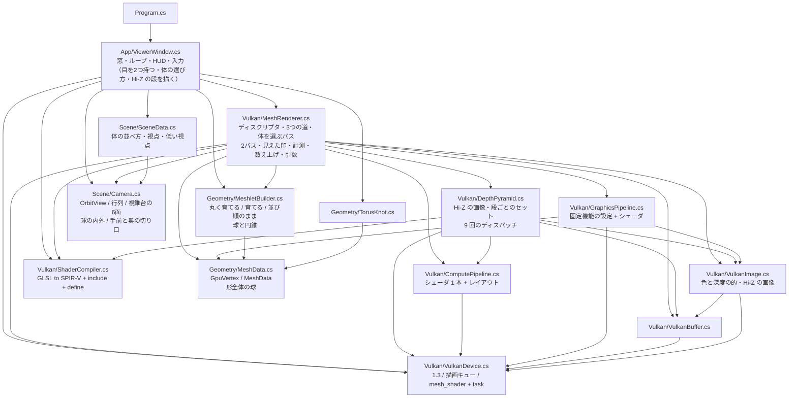
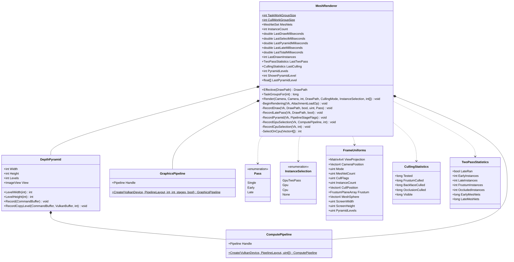
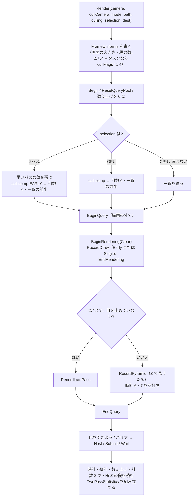
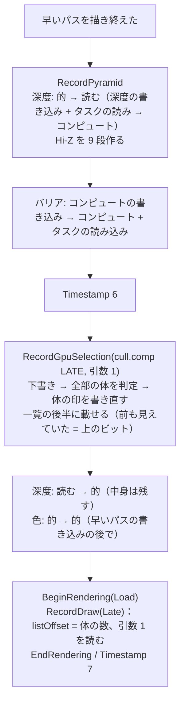
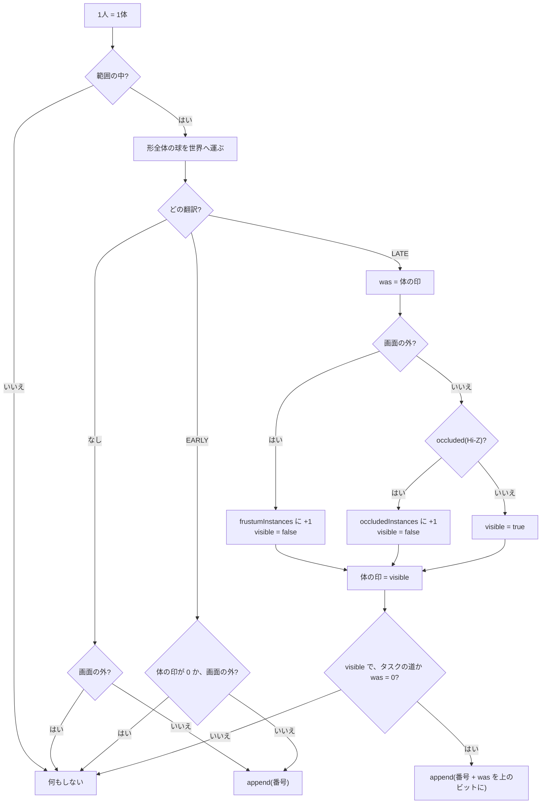
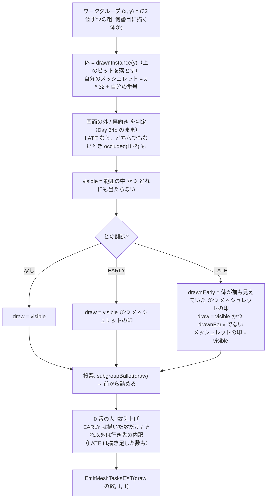

# Day 65c: GPU 駆動レンダリング(3) — Hi-Z で隠れたものを捨てる2パス(と Nanite 講読)

**教養編。Day 65 の3日目(最終日)**。reference は Day 65b の完全コピー + 差分(`MeshletRenderer` の続き)。

Day 65a で「描く命令の引数を GPU が書く」骨格を、Day 65b で深度の山(Hi-Z)を作った。今日は2つを組み合わせて、
**CPU が持っていない情報——深度——で、隠れたものを捨てる**。

困るのは「深度は描かないと無い」こと。隠れているかを知るには深度が要り、深度を作るには描く必要がある。
そこで**前のフレームに見えていたものを先に描いて**深度を作り、その深度で残りを調べる。1フレームを2回に分けて描く。

```
  早いパス: 前のフレームに見えていた体・メッシュレットを描く(隠れの判定はまだしない)
     ↓
  Hi-Z を作る(Day 65b の DepthPyramid をそのまま)
     ↓
  遅いパス: 全部を Hi-Z と比べ直す。確実に隠れているものは捨て、早いパスで描いていない見えるものを描き足す
            見えた / 見えなかったを書き残す → 次のフレームの早いパスが使う
```

| | Day 65b | **Day 65c** |
|---|---|---|
| 1フレームの描画 | 1回 | **2回**(早いパス + 遅いパス) |
| Hi-Z を作るとき | 描き終わった後(見るだけ) | **早いパスと遅いパスの間**(遅いパスが使う) |
| フレームをまたいで残るもの | 無し | **見えた印**(体ごと 256 個・メッシュレットごと 12 万個) |
| 選び方(`G`) | GPU / CPU / 選ばない | **2パス** / GPU / CPU / 選ばない |

今日の差分は**変更 10 ファイル**(C# +503 / −155 行、GLSL +265 / −33 行。新規ファイルは無い)。

> **今日いちばん意外だったのは、「隠れて丸ごと捨てられた体」が 256 体のうち 0 体だったこと**
> 手前の体が奥の体を隠している絵なのに、体ごとの判定では1体も捨てられなかった。
> トーラスノットは穴だらけで、体1つを画面に投影した箱(100〜500 画素)の中には必ず隙間があり、
> Hi-Z の粗い段ではその隙間が「何も無い(いちばん奥)」になる(Day 65b の検証2)。
> ところが**メッシュレットごと**に同じ判定をすると、既定の視点で 15%、見下ろす角度を下げた低い視点(`V`)では **45%** が隠れていて捨てられ、
> ラスタライザへ渡る三角形は 249 万枚から **80 万枚**に減り、GPU の時間は半分になった(検証2・3)。
> **隠れの判定は、調べる単位が小さいほど効く**。Nanite がクラスタ(メッシュレット)単位で隠れを調べるのはこのため(要点7)。

## 今日のゴール

**起動すると Day 65b と同じ 16 体が出る。「体」の行が「2パス (隠れたものも捨てる) (G)  16 体 → 画面の外 0 / 隠れている 0 / 見える 16」、
「判定」の行に「隠れている 5.3%」が増える。`4` で 256 体、`V` で低い視点にすると「隠れている 45.4%」、三角形は **80 万枚**。
`G` で1パス(GPU で選ぶ)に戻すと、絵は1画素も変わらずに三角形が 249 万枚に戻る。
`F` で目を止めてから回り込むと、止めた瞬間に見えていなかったもの(画面の外・裏向き・**隠れていたもの**)が全部穴になって見える。**

| キー | 何が起きるか |
|---|---|
| `G` | **描く体をどう選ぶか(2パス → GPU で選ぶ → CPU で選ぶ → 選ばない)。今日の目** |
| `V` | **低い視点**(見下ろす角度を 0.30 → 0.12 ラジアンに下げる)。体が奥へ何列も重なり、隠れるものが増える。`R` で戻る |
| `F` | カリングの目を止める。2パスでは**早いパスだけ**になり、見えた印も Hi-Z も止まる |
| `Z` | Hi-Z の段を見る(Day 65b)。2パスでは、遅いパスが使った Hi-Z(早いパスの深度から作ったもの)が見える |
| `B` / `C` / `O` / `M` / `1`〜`4` / ドラッグ / ホイール / `R` / `H` / `Esc` | Day 65b のまま |

### 今日いちばん大事な3つ

**1つ目は「前のフレームを当てにして、外れたら遅いパスで直す」**(要点1・2)。
早いパスは「前のフレームで見えていたもの」を**判定せずに**描く。カメラが動いて新しく見えたものは、遅いパスが全部を調べ直して拾う。
逆に、前は見えていたが今は隠れているものは、早いパスで**余計に描いてしまう**が、絵は壊れない(深度テストが手前を残す)。
**当てが外れても、遅くなるだけで絵は間違えない**——これがこの形の強み。

**2つ目は「隠れているとは、手前の深度が範囲のいちばん奥より奥なこと」**(要点3)。物の球を囲む立方体を画面に投影して箱にし、
箱の大きさに合った Hi-Z の段で「その範囲のいちばん奥」を読む。物のいちばん手前がそれより奥なら、1画素も見えない。

**3つ目は「調べる単位が小さいほど効く、でも値段は固定」**(要点5・6)。
メッシュレット単位の判定は低い視点で 45% を捨てるが、Hi-Z(26 us)と遅いパス(40 us)の分は隠れるものが無くても払う。
16 体の場面では**2パスのほうが遅い**(検証3)。

## 事前に読む資料

- **[RasterGrid: Hierarchical-Z map based occlusion culling](https://www.rastergrid.com/blog/2010/10/hierarchical-z-map-based-occlusion-culling/)** の後半 —
  物の箱を Hi-Z と比べて隠れを判定する部分。「箱の大きさで段を選び、2x2 だけ読む」(要点3)
- **[Haar & Aaltonen: GPU-Driven Rendering Pipelines(SIGGRAPH 2015)](https://advances.realtimerendering.com/s2015/aaltonenhaar_siggraph2015_combined_final_footer_220dpi.pdf)** の後半 —
  Day 65a で前半(階層カリング)を読んだ講演。後半はオクルージョンカリングの節。**深度をどこから持ってくるか**(前のフレームか、先に描いた物か)を
  今日の2パスと見比べながら読む
- **[niagara](https://github.com/zeux/niagara)** の `src/shaders/drawcull.comp.glsl` と `src/niagara.cpp` —
  今日と同じ2パス(niagara では early / late)を最小の形で書いた実装。niagara は `LATE` を**特殊化定数**(specialization constant)にして、
  1つの SPIR-V から2本のパイプラインを作る(今日は定義を変えて2回翻訳する)。遅いパスで「メッシュレットの隠れを調べるなら、
  前も見えていた体も一覧に載せる」という判断(要点4)も、`drawcull.comp.glsl` のコメントに同じことが書いてある。
  球を画面へ投影する関数(`projectSphere`。Mara と McGuire の「2D Polyhedral Bounds of a Clipped, Perspective-Projected 3D Sphere」2013 の式)は、
  今日の「立方体の8つの角」より箱が小さく出る(改造課題1)
- **[Karis: Nanite — A Deep Dive(SIGGRAPH 2021 Advances)](https://advances.realtimerendering.com/s2021/Karis_Nanite_SIGGRAPH_Advances_2021_final.pdf)** —
  **今日の講読の本題**(要点7)。クラスタの切り方・LOD の DAG・2パスのオクルージョン・小さい三角形のソフトウェアラスタライズ・visibility buffer。
  Day 64a〜65c でやったことが、どこにどう載っているかを探しながら読む
- **Day 65b の計画書**の要点2(どの段を読むか)と検証2(粗い段はほとんど「何も無い」)

## 理論の要点

### 1. 2パス — 「深度は描かないと無い」をどう解くか

隠れているかを知るには、そのフレームの深度が要る。でも深度は描いた後にしか無い。
**全部描いてから隠れを調べても、もう描いてしまっている**。

解き方は「**前のフレームとあまり変わらないだろう**」と当てにすること。

```
  フレーム N
    早いパス : 見えた印(フレーム N−1 の遅いパスが書いた)が立っているものを描く   ← 判定しない
    Hi-Z     : 早いパスの深度から作る
    遅いパス : 全部を Hi-Z と比べる
               ├ 見える、かつ早いパスで描いていない → 描き足す
               ├ 見える、かつ早いパスで描いた       → 何もしない(もう描いてある)
               └ 隠れている / 画面の外 / 裏向き     → 捨てる
               見えたかどうかを印に書く(→ フレーム N+1 の早いパスへ)
```

**絵が正しくなる理由**を順に確かめる。

- 遅いパスの Hi-Z は、**早いパスで実際に描いた物の深度だけ**でできている。そこで「隠れている」と言われたものは、
  早いパスで描いた物の後ろに本当に隠れている(Day 65b の要点1)。**描き足さなくても絵は同じ**
- 「見える」と言われたものは、早いパスで描いたか、遅いパスで描き足すかのどちらか。**見えるものは必ずどちらかで描かれる**
- 前のフレームで見えていて今は隠れているものは、早いパスで描かれる。深度テストで負けるので**絵には出ない**(値段だけ払う)

カメラを大きく振った直後のフレームは、早いパスがほとんど何も描かず(当てが外れる)、遅いパスが全部を描く——**1パスに戻るだけ**。
起動直後の最初のフレームもこれ(印は全部 0 から始まる)。

**カリングの目を止めた(`F`)とき**は、遅いパスを走らせない。Hi-Z は描く目の深度なので、止めた目の判定には使えないから。
すると早いパスが**止めた瞬間の印のまま**描き続けるので、回り込むと「止めたときに見えていなかったもの」が全部穴になって見える。
Day 64b の `F`(捨てた穴を横から見る)の2パス版。

### 2. 見えた印 — フレームをまたいで GPU の上に残す

「前のフレームで見えていたか」は、**GPU の上のバッファに書き残す**。CPU へは読み戻さない(読み戻すと1フレーム待つことになる)。

| 印 | 大きさ | 書く人 | 読む人 |
|---|---|---|---|
| 体ごと(binding 11) | uint x 256 | 遅いパスの cull.comp | 次のフレームの早いパスの cull.comp |
| メッシュレットごと(binding 10) | uint x 256 x 468 = 約 12 万 | 遅いパスのタスクシェーダ | 次のフレームの早いパスのタスクシェーダ |

どちらも**作ったときに 0 で埋める**(`MeshRenderer.CreateZeroed`)。今日の全部の状態のうち、フレームをまたいで残るのはこの2本だけ。

cull.comp とタスクシェーダは、定義を変えて**3通りに翻訳する**(Day 62b の `trace.comp`、Day 64b の `meshlet.mesh` と同じ手)。

| 定義 | cull.comp | meshlet.task |
|---|---|---|
| なし(1パス) | 画面の外の体を捨てる(Day 65a) | 画面の外と裏向きのメッシュレットを捨てる(Day 64b) |
| `EARLY` | 印が立っていて、画面の中にいる体 | 印が立っていて、画面の外でも裏向きでもないメッシュレット |
| `LATE` | 画面の外 / **隠れている**を判定。印を書き直す | 画面の外 / 裏向き / **隠れている**を判定。早いパスで描いていないものを描く。印を書き直す |

一覧と引数は、早いパス用と遅いパス用を**1本のバッファの前半と後半**に持つ(一覧は体の数 x 2、引数は `DrawArguments` x 2)。
描く命令は「どちらの半分を読むか」を**プッシュ定数**(`listOffset`)で受け取る。uniform buffer は1フレームに1回しか書き換えられないが、
プッシュ定数は**描く命令の合間に積める**——同じパイプラインのまま、1回目と2回目で値だけ変えられる。

### 3. 隠れの判定 — 球を箱にして、Hi-Z の 2x2 と比べる

`common.glsl` の `occluded(center, radius)`。遅いパス(`LATE`)の cull.comp とタスクシェーダだけが使う。

1. 球を囲む**立方体の8つの角**を、描く目の `viewProj` で画面に投影する → 画面の上の**箱**と、角の**いちばん手前の深度**
2. どれかの角が目の後ろ(`w ≤ 0`)や手前の切り口より手前(`z < 0`)にかかったら、投影が裏返って箱が壊れるので**判定しない**(見えるとする)
3. 箱の差し渡し e 画素から、2^(L+1) ≥ e となる段 L を選ぶ(Day 65b の要点2)。箱がかかる Hi-Z の画素は多くても 2x2
4. その画素の**いちばん奥**と、角のいちばん手前を比べる。**手前 > 奥なら隠れている**。等しいときは捨てない

```glsl
float extent = max(pmax.x - pmin.x, pmax.y - pmin.y);
int level = clamp(int(ceil(log2(max(extent, 1.0)))) - 1, 0, int(frame.screen.z) - 1);
float texel = exp2(float(level + 1));
ivec2 t0 = min(ivec2(floor(pmin / texel)), levelSize - 1);
ivec2 t1 = min(ivec2(floor(pmax / texel)), levelSize - 1);
// t0〜t1 の Hi-Z の画素のいちばん奥 → farthest
return nearest > farthest;
```

**立方体は球より大きい**ので、箱は少し大きく、深度は少し手前に出る。どちらも「隠れていない」側に倒れる(安全側)。
立方体の8つの角のいちばん手前は、球のいちばん手前以下になる(深度は目の奥行き方向の距離だけで決まり、立方体はその方向に球を覆っている)。

**比べる深度には余裕を持たせない**。手前 > 奥 − 0.002 のように少しでも甘くすると、576 回の突き合わせのうち 236 回(4 割)で絵が変わった(検証1 のわざと壊した実験)。
深度の値は奥で詰まっている(Day 65b の要点5)ので、0.002 は数十 cm〜数 m の差になる。

### 4. 遅いパスが描き足すもの — 体の印とメッシュレットの印

遅いパスは「見える、かつ早いパスで描いていない」ものを描く。**早いパスで描いたかどうか**の決め方が、道によって違う。

**頂点の道・メッシュの道**は体を丸ごと描く。早いパスで描いたかは**体の印だけ**で決まる。
遅いパスの cull.comp は「見える、かつ印が立っていなかった」体だけを一覧に載せる。

**タスクの道**は、体の中でメッシュレットごとに描く・描かないが分かれる。前のフレームで体は見えていても、
**その体のどのメッシュレットが見えていたか**は別。だから遅いパスの cull.comp は**見える体を全部**一覧に載せ、
タスクシェーダがメッシュレットの印で描き足すものを決める。

```glsl
// meshlet.task(LATE)
bool drawnEarly = drawnInstanceWasVisible(gl_WorkGroupID.y) && inRange && meshletVisible[visibilityIndex] != 0u;
bool draw = visible && !drawnEarly;
meshletVisible[visibilityIndex] = visible ? 1u : 0u;   // 次のフレームのために書き直す
```

「体が前のフレームで見えていたか」は、cull.comp が一覧の番号の**いちばん上のビット**に載せて渡す(`0x80000000`)。
遅いパスの cull.comp は体の印を書き直してしまうので、タスクシェーダが体の印を直接読むと**今のフレームの値**になってしまう。
だから書き直す前の値を番号に載せて運ぶ。番号を読む3つのシェーダは `drawnInstance()`(ビットを落とす)を通す。

早いパスと遅いパスは**同じ目・同じ式**で画面の外と裏向きを判定する。だから「早いパスで描いた」ものは、遅いパスでも必ず
(隠れの判定を足す前の段階で)「見える」側に入る。この前提が崩れると、早いパスで描いたものを遅いパスがもう一度描く
(絵は同じだが値段が倍になる)か、どちらでも描かない(穴が開く)。

### 5. 体ごとは効かない、メッシュレットごとは効く

256 体・タスクの道で、2つの単位の判定がそれぞれ何を捨てたか(遅いパスが数えた値)。

| 視点 | 隠れて捨てた体 | 隠れて捨てたメッシュレット | ラスタライザへの三角形(1パス → 2パス) |
|---|---|---|---|
| 既定(見下ろす角度 0.30) | **0 / 110** | 15.0% | 245 万 → 207 万 |
| 低い(0.12。`V`) | **0 / 111** | **45.4%** | 249 万 → **80 万** |
| もっと低い(0.02) | 2 / 111 | 56.3% | 250 万 → 30 万 |

体ごとの判定がほとんど効かないのは、Day 65b の検証2 のとおり。体1つは画面で 100〜500 画素あり、それを覆う Hi-Z の段(段 5〜7)は
ほぼ全部が「何も無い」になっている。トーラスノットの穴から奥の空が見えているから。
メッシュレットは画面で数十画素なので、段 3〜4 で比べられ、手前の管の「中」にすっぽり入るものが多い。

**1体だけの場面でも 4.7% が隠れて捨てられる**(検証2)。体は1つなのに——自分の手前の管が、自分の奥の管を隠している。
メッシュレット単位なら、1つの物の中の**自分で自分を隠す**部分も捨てられる。

### 6. 値段 — 隠れるものが無くても払う分

2パスにすると、隠れるものが1つも無くても次の分を払う。

| 追加で払うもの | 256 体での値段(ハーネス) |
|---|---|
| Hi-Z を作る(9 回のディスパッチ) | 25 us 前後(Day 65b) |
| 遅いパス(cull.comp をもう1回 + 見える体のタスクシェーダをもう1回) | 40 us 前後 |
| 描画を2回に分ける(描画の始めと終わり、深度のレイアウトの行き来) | 上に含まれる |

代わりに減るのは、隠れて捨てたメッシュレットの三角形。

- 低い視点・256 体: 描く時間が大きく減り、合わせて **0.447 → 0.212 ms**(0.47 倍)
- 既定の視点・256 体: **0.448 → 0.406 ms**(0.91 倍)
- 既定の視点・16 体: **0.109 → 0.127 ms**(1.17 倍。**遅くなる**)
- 頂点の道: 体が1つも隠れないので、描く量は変わらず、**2パスの分だけ遅い**(1.02〜1.04 倍)

(1パスの値にも Hi-Z を作る 25 us が入っている。Day 65b から、見ていなくても毎フレーム作っているので。)

**2パスが得になるのは、隠れるものが多い場面だけ**。AAA のゲームで2パスのオクルージョンカリングが当たり前なのは、
街や屋内のように**壁や建物が何でも隠す**場面が多いから。穴だらけの物を並べた今日の場面は、むしろ不利な側。

### 7. Nanite 講読 — Day 64a〜65c の上に何が載っているか

UE5 の Nanite(Karis 2021)は、今日までの材料をほぼ全部使い、その上に4つを足したもの。講演資料を読みながら、下の表の「今日まで」の列を確かめる。

| Nanite の部品 | 今日まで(Day 64a〜65c) | Nanite が足したもの |
|---|---|---|
| **クラスタ**(三角形 128 枚の小片) | メッシュレット(64 頂点・124 枚。Day 64a) | 同じ考え。切り方は「境界が短く、まとまった形」を狙う(Day 64b の丸く育てる) |
| **クラスタの LOD の DAG** | 無し(Day 64b の改造課題3 で体ごとの LOD の入口だけ) | クラスタを数個ずつまとめ、**まとまりの外周を動かさずに**三角形を半分に減らして切り直す。これを繰り返して粗い版を積み上げる。外周を動かさないので、**細かさの違うクラスタが隣り合っても亀裂が出ない**(Day 63b の亀裂と比べる) |
| **LOD の選び方** | 無し | クラスタごとに「自分の誤差」と「1段粗い版の誤差」を持たせ、画面での大きさに直して閾値と比べる。**「親の誤差 > 閾値 ≥ 自分の誤差」のクラスタだけを描く**。この条件はクラスタごとに独立に判定できるので、**全部を並べて GPU で一斉に**決められる |
| **階層カリング** | 体 → メッシュレット → 三角形(Day 65a) | クラスタのまとまりに BVH を作り、GPU の上で木を下りながら捨てる(常駐させたスレッドが仕事の列を回す) |
| **2パスのオクルージョン** | **今日**(早いパス → Hi-Z → 遅いパス) | 同じ。「前のフレームに見えていたクラスタ」を先に描いて Hi-Z(HZB)を作り、残りを調べる |
| **小さい三角形のラスタライズ** | 無し(全部ハードウェア) | 画面で数画素より小さい三角形は、**コンピュートシェーダで自前にラスタライズ**する。ハードウェアのラスタライザは 2x2 画素の組で動くので、1画素の三角形では 4 倍の手間になる |
| **visibility buffer** | 無し(画素シェーダで色まで出す) | 画素には「どのクラスタの何番目の三角形か」と深度だけを書き(64 ビットの atomic で深度と一緒に)、**材質の計算は後で画面の画素ごとに1回**だけやる |

読むときの問い:

1. **Nanite のクラスタが 128 枚なのはなぜか**。今日のメッシュレット(124 枚)とほぼ同じ大きさになっているのは偶然か(ヒント: Day 64a の要点——1ワークグループで扱える量)
2. **「親の誤差 > 閾値 ≥ 自分の誤差」がクラスタごとに独立に判定できるためには、誤差にどんな性質が要るか**(ヒント: 親は必ず子より粗い → 誤差は親のほうが大きい)
3. **今日の2パスで「隠れて丸ごと捨てた体」が 0 だった**のに対し、Nanite は何を単位に隠れを調べているか。今日の結果(要点5)と照らしてなぜそうするのか
4. **小さい三角形をソフトウェアでラスタライズする**のは、Day 63a のジオメトリシェーダや Day 63b のテッセレーションが「細かくするほど遅い」と分かったことと、どうつながるか

## 前Dayからの差分概要

### 新規ファイル

無し。

### 変更ファイル

| ファイル | 差分 | 何を足したか |
|---|---|---|
| `Day65c.csproj` | コメントのみ | cull.comp と meshlet.task を3通りに翻訳することの説明 |
| `shaders/common.glsl` | +117 / −3 | `Frame` に画面の大きさと段の数、プッシュ定数 `Pass`、数え上げ(binding 7)をここへ移して 8 欄に、`drawnInstance()`、Hi-Z(binding 12)と `occluded()` |
| `shaders/meshlet.task` | +61 / −15 | `TASK_STAGE`、数え上げの宣言を消す、メッシュレットの印(binding 10)、`EARLY` / `LATE`、隠れの判定 |
| `shaders/meshlet.mesh` | +1 / −1 | `drawnInstance()` を通す |
| `shaders/scene.vert` | +1 / −1 | `drawnInstance()` を通す |
| `shaders/cull.comp` | +85 / −13 | 引数を2つ、体の印(binding 11)、`append()`、`EARLY` / `LATE` |
| `Scene/SceneData.cs` | +7 / −0 | `LowView`(低い視点) |
| `Vulkan/MeshRenderer.cs` | +432 / −139 | `GpuTwoPass`、`TwoPassStatistics`、印のバッファ、パイプライン4本、binding 10〜12、プッシュ定数、`BeginRendering` / `RecordDraw` / `RecordLatePass` への切り出し、時計を8目盛りに |
| `App/ViewerWindow.cs` | +53 / −10 | `G` の先頭に2パス、`V`、HUD の「体」「判定」「1枚」「内訳」 |
| `Program.cs` | +11 / −6 | 説明の差し替え(コメントのみ) |

`MeshRenderer.cs` の +432 / −139 のうち 100 行ほどは、Day 65b の `Render` の中にあった描く命令のブロックと描き始めの設定を、
`RecordDraw` / `BeginRendering` へ**移しただけ**(中身はほぼ同じ)。差分を読むときは、移した先と移す前を並べて読むとよい。

### 写経の始め方

`work/Labs/MeshletRenderer` をそのまま育てる(Day 64a から続いているプロジェクト)。差分は `./diff.sh Day65c` で見られる。

### 写経する順番

| # | ファイル | 何が要るか / 気をつけるところ |
|---|---|---|
| 1 | `shaders/common.glsl` | `Frame` の末尾に `uvec4 screen`。数え上げ(binding 7)の宣言を `meshlet.task` から**ここへ移す**(`#if defined(CULL_INSTANCES) \|\| defined(TASK_STAGE)`)。`occluded()` は `#ifdef LATE` の中 |
| 2 | `shaders/meshlet.task` | **1 と同時に**。数え上げの宣言を消さないと同じブロックが2つになる。`#define TASK_STAGE` は `#include` より前 |
| 3 | `shaders/meshlet.mesh` | 1 の `drawnInstance()` を使う |
| 4 | `shaders/scene.vert` | 同じ |
| 5 | `shaders/cull.comp` | 1 を使う。引数のブロックを `DrawArguments args[2]` に。頭に `GL_EXT_samplerless_texture_functions` |
| 6 | `Scene/SceneData.cs` | 依存なし |
| 7 | `Vulkan/MeshRenderer.cs` | 1〜5 を使う。`FrameUniforms` を 1 の `Frame` と合わせる(末尾に uint 4つ)。binding は 13 本、12 番だけ画像 |
| 8 | `App/ViewerWindow.cs` | 6・7 を使う(`SceneData.LowView`、`LastTwoPass`、`LastTotalMilliseconds`、`CullingStatistics.OcclusionCulled`) |
| 9 | `Program.cs` | コメントのみ。差分0にしたいなら合わせておく |
| 10 | `Day65c.csproj` | コメントのみ。差分0にしたいなら合わせておく |

> **動かすのは 8 まで写してから**(7 まで写せばビルドは通るが、`G` の先頭に2パスが無いので、2パスを選ぶ手段が無い)。
> シェーダは起動時に翻訳されるので、1〜5 の間違いは起動すると HUD に翻訳エラーとして出る。
> 動いたら、`G` で「GPU で選ぶ」(1パス)が Day 65b と同じに動くことを先に確かめ、それから2パスに戻す。
> 2パスで**何も出ない** → 早いパスの印と遅いパスの一覧(5・7。遅いパスが走っているか HUD の「遅いパス」の体の数を見る)/
> **体がちらつく・一部が欠ける** → 遅いパスの `drawnEarly`(2)か、プッシュ定数の `listOffset`(7)/
> **欠けないが「隠れている」が 0%** → `occluded()` の段の選び方か、Hi-Z のディスクリプタ(1・7)

## 設計書

Day 65b から**クラスは増えていない**(増えたのは記録1つと、`MeshRenderer` の中の列挙1つ)。層の形も変わらない。
変わったのは、`MeshRenderer.Render` が**1フレームに2回描く**ようになったことと、GPU の上に**フレームをまたいで残る状態**(見えた印)ができたこと。

### 全体構成と依存の向き



| 層 | 知っているもの | 知らないもの | Day 65b からの変化 |
|---|---|---|---|
| `Geometry/` | 自分の中だけ | **Vulkan を知らない** | なし |
| `Scene/` | 自分の中だけ | 形も GPU も知らない | `SceneData` に低い視点 |
| `Vulkan/` | `Geometry/` の型と `Camera` | 窓を知らない | `MeshRenderer` が2パスを持つ。`DepthPyramid` は**1行も変わらない**(呼ぶ場所が変わっただけ) |
| `App/` | 全部 | — | 2パスの内訳を HUD に出す |

**循環は依然として無い**。Day 65b で `DepthPyramid` を `MeshRenderer` を知らない形にしておいたので、
「描き終わった後に作る」を「早いパスと遅いパスの間で作る」に変えても `DepthPyramid` は変わらなかった。

**入れ替えると何が壊れるか**を3つ。

- **早いパスと遅いパスで、画面の外と裏向きの判定を同じ目・同じ式でやる**という約束(要点4)。
  片方だけ式を変える(例えば遅いパスだけ背面カリングを切る)と、「早いパスで描いた」と「遅いパスで見える」が食い違う。
  早いパスで描かなかったのに遅いパスで「早いパスで描いた」扱いになるメッシュレットが出て、**そのフレームだけ穴が開く**
  (次のフレームで印が直るので、動かしたときだけちらつく。静止画の突き合わせでは見つからない)
- **一覧の番号のいちばん上のビット**(前のフレームでも見えていた)の約束が、cull.comp(載せる)と `common.glsl` の
  `drawnInstance()` / `drawnInstanceWasVisible()`(落とす・読む)の2か所にまたがっている。3つの描くシェーダのどれかが
  `visibleInstances[i]` を直接読むと、**遅いパスでだけ**体の番号が 2^31 ずれて、範囲の外の行列を読む
- **比べる深度の向き**(手前 0、奥 1。深度テストは Less)。深度を逆向き(手前 1、奥 0。reversed-Z)にすると精度は良くなるが、
  Hi-Z の max を min に、`nearest > farthest` を `<` に、立方体の角の「いちばん手前」を max に——と **3か所を一緒に**変える必要がある。
  1か所でも残すと、「隠れている」の判定が裏返って**見えているものを捨てる**

### Vulkan — 9つのクラス(Day 65c で `MeshRenderer` が2パスを持った)



(`VulkanDevice` / `VulkanBuffer` / `VulkanImage` / `ShaderCompiler` / `DrawArguments` / `CullingMode` は Day 65b から変わっていないので、図から外した。Day65b.md と Day65a.md の設計書を参照。)

`MeshRenderer` が持つパイプラインは**グラフィックス5本・コンピュート3本**になった(`DepthPyramid` の中のもう1本を合わせると 4 本)。

| | 1パス | 早いパス | 遅いパス |
|---|---|---|---|
| グラフィックス(タスクの道) | `_taskPipeline` | `_taskEarlyPipeline` | `_taskLatePipeline` |
| グラフィックス(メッシュ・頂点の道) | `_meshPipeline` / `_vertexPipeline`(3つのパスで共通) | ← | ← |
| コンピュート(cull.comp) | `_cullPipeline` | `_cullEarlyPipeline` | `_cullLatePipeline` |

全部が**同じパイプラインレイアウト・同じディスクリプタセット**を使う。レイアウトにはプッシュ定数が1つ(uint、全部の段から見える)。

`MeshRenderer` は約 1,550 行になった(うち半分ほどはコメント)。Day 65a の歪み4 で「Hi-Z が加わる前に切り出すかを決める」と書いたが、
実際に2パスを書いてみると、**描く命令・パス・パイプラインの選び方が1つの関数(`RecordDraw`)の中で絡んでいる**。
体を選ぶ部分だけを切り出しても、`RecordDraw` と `RecordLatePass` は `MeshRenderer` に残る。切り出すなら「パスを1つ描く」単位になる(歪み3)。

### GPU に挿さっているもの — binding の一覧(Day 65c で 10〜12 番とプッシュ定数が増えた)

| binding | 中身 | 型 | 読む・書く段 |
|---|---|---|---|
| 0 | `Frame`(…・形全体の球・**画面の大きさと段の数**) | uniform | 全部 |
| 1〜6 | 頂点・体の行列・メッシュレット・局所番号・三角形・三角形 → メッシュレット | storage | Day 65b のまま |
| 7 | カリングの数え上げ(uint **8 つ**) | storage | タスク・**コンピュート**が書く、CPU が読む |
| 8 | 描く体の番号の一覧(体の数 x **2**。前半 = 1パス / 早いパス、後半 = 遅いパス) | storage | コンピュート(か C#)が書く、描くシェーダが読む |
| 9 | 描く命令の引数(`DrawArguments` x **2**) | storage + indirect | コンピュートが書く、描く命令と CPU が読む |
| **10** | **メッシュレットごとの見えた印**(体の数 x メッシュレットの数) | storage | **タスク(EARLY が読む、LATE が読み書き)** |
| **11** | **体ごとの見えた印**(体の数) | storage | **コンピュート(EARLY が読む、LATE が読み書き)** |
| **12** | **Hi-Z**(`DepthPyramid.View`、General) | **sampled image** | **コンピュート(LATE)・タスク(LATE)が読む** |
| push | `listOffset`(uint。一覧の何番目から読むか) | プッシュ定数 | 描くシェーダ |

10 番は `meshlet.task` の中、11 番は `cull.comp` の中でだけ宣言する(書ける宣言を頂点シェーダから見える場所に置かない。Day 64b の 7 番と同じ理由)。
12 番は `common.glsl` の `#ifdef LATE` の中。

### 1フレームの流れ — `MeshRenderer.Render`(Day 65c で2パスになった)



### 遅いパス — `RecordLatePass`



**深度は1フレームの中で「的 → 読む → 的」と行き来する**。Day 65b では「的 → 読む」で終わっていた(次のフレームで捨てるので戻さなかった)。
今日は遅いパスが**早いパスの深度の上に**描き足すので、中身を残したまま的へ戻す(`Undefined` からは移さない)。
色は的のレイアウトのままだが、「早いパスの書き込みが終わってから遅いパスが読み書きする」順序だけはバリアで言う(`LoadOp = Load` は読むことになる)。

### cull.comp の1人の中(Day 65c で3通りになった)



`append()` は Day 65a の「席を取って3つの数の欄に足す」を関数にしたもの。どの引数・一覧の半分に書くかは翻訳ごとに決まっている(`LATE` なら後半)。

### タスクシェーダの1ワークグループの中(Day 65c で3通りになった)



**投票するのは「見えるか」ではなく「このパスで描くか」**(Day 64b では同じものだった)。

### 今日残した歪み(4つ)

**1. 穴だらけの物に不利**。体ごとの隠れの判定は、今日の場面では1体も捨てなかった(要点5)。遅いパスの cull.comp が
体ごとに Hi-Z を読む手間は、今日の場面では丸ごと無駄。壁や建物のような「中身の詰まった」隠す物がある場面なら効く。
隠す物(occluder)と隠される物を分けて考え、隠す物だけを早いパスで確実に描く、という作りも多い。

**2. 箱が大きい**。球を囲む立方体の8つの角で箱を作っているので、箱は球の投影より広く、深度は手前に出る(要点3)。
その分、捨て損なう。niagara の `projectSphere`(Mara と McGuire の式)なら箱がもっと小さくなる。改造課題1。

**3. `MeshRenderer` が約 1,550 行**。Day 65a の歪み4 の続き。パスを1つ描く(一覧 → 引数 → 描く命令)単位で切り出せそうだが、
深度と色のレイアウトの行き来(`RecordLatePass`)がパスの間にまたがっているので、切り出した後の境目をどこに置くかがまだ決まらない。
このリポジトリの Labs はここで終わりなので、答えは HonyaEngine 本体で GPU 駆動を入れるときに持ち越す。

**4. 動いている物が無い**。今日の体は全部止まっている。体が動く場面では、前のフレームの印は「前の場所で見えていた」ことしか言わない。
それでも絵は壊れない(遅いパスが直す)が、早いパスの当たりが減って遅いパスの仕事が増える。

**持ち越し**: Day 65a の歪み1(体を描く順番が GPU 任せ)・歪み3(形が1種類)と、Day 64b の歪み1(欠片)はそのまま。

### 引き継いだ図

次の図は Day 65b から変わっていないので、Day65b.md の設計書を参照。

- 「Vulkan — 9つのクラス」のうち `VulkanDevice` / `VulkanBuffer` / `VulkanImage` / `ShaderCompiler`
- 「depth_reduce.comp の1人の中」と、Hi-Z のセットの binding の表
- 「Geometry — 形とメッシュレット」(Day65a.md)
- 「メッシュシェーダの1ワークグループの中」(Day65a.md。`drawnInstance()` を通すようになっただけ)

## 完成条件

`dotnet run --project reference/Day65c -c Release` で確かめる。

### 1. 起動: 16 体、2パス

- 絵は Day 65b と同じ
- 「体」: **2パス (隠れたものも捨てる) (G)  16 体 → 画面の外 0 / 隠れている 0 / 見える 16  (早いパス 16 体・遅いパス 16 体)**
- 「判定」: **7,488 個 → 画面の外 1.9% / 裏向き 29.9% / 隠れている 5.3% / 描く 62.9%**
- 「内訳」: タスクシェーダ 480 組 → メッシュシェーダ **4,708 + 0 組** / 三角形 **382,751 枚**
  (「+ 0」は遅いパスで描き足したメッシュレット。止まっていれば、見えるものは全部早いパスで描けている)

`G` で「GPU で選ぶ」(1パス)にすると、隠れているが 0% に、三角形が 391,278 枚に戻る。**絵は変わらない**。

### 2. `4` で 256 体、`V` で低い視点(今日の目)

| 場面 | 体 | 判定(画面の外 / 裏向き / 隠れている / 描く) | 三角形 | 1パスでは |
|---|---|---|---|---|
| 256 体・既定の視点 | 画面の外 146 / **隠れている 0** / 見える 110 | 10.2% / 27.3% / **15.0%** / 47.4% | 2,066,457 | 2,453,947 |
| 256 体・低い視点(`V`) | 画面の外 145 / **隠れている 0** / 見える 111 | 9.8% / 27.5% / **45.4%** / 17.3% | **801,554** | 2,485,151 |

- **体ごとには1体も隠れない**。隠れているのは全部メッシュレットの単位(要点5)
- 「1枚」の行に、直前の1枚の内訳(早いパス + Hi-Z + 遅いパス)が出る。アプリ内の値は GPU のクロックで大きく揺れるので、
  比べるなら検証3 のハーネスの値を見る
- `G` で1パスに戻すと三角形が 249 万枚に戻る

### 3. `B` で頂点の道にする

- 「体」: 早いパス 111 体・**遅いパス 0 体**(止まっていれば、描き足す体が無い)
- 頂点の道には体ごとの判定しか無いので、描く量は1パスと同じ(三角形 3,637,248 枚)。**2パスの分だけ遅い**(検証3)

### 4. `Z` で Hi-Z を見る

2パスのまま `Z` を押すと、遅いパスが判定に使った Hi-Z(早いパスの深度から作ったもの)が見える。
低い視点では、段 3 でも画面の下半分が白く詰まっている——手前の太い管が画面を覆っていて、そこに隠れるメッシュレットが多い。

### 5. `F` で目を止めて回り込む

256 体・低い視点・`M` でメッシュレットごとの色にしてから `F` を押し、ドラッグで横へ回り込む。

- 「体」の行が「**早いパスだけ 111 体(目を止めている間は、見えた印も Hi-Z も止まる)**」になる
- 手前の体の**後ろ側**に回り込むと、奥の体の、手前の体に隠れていた部分が**メッシュレットの形の穴**になっている。
  画面の外だった体は丸ごと、裏向きだったメッシュレットも穴(Day 64b と同じ)
- `F` をもう一度押すと、次のフレームの遅いパスが穴を全部描き足し、印も今の目に合わせて書き直される

## 検証の途中で分かったこと

窓の無いハーネス(`MeshRenderer` を直接呼ぶ)で確かめた。RTX 3070 / ドライバ 596.49、検証レイヤなし。

### 検証1: 2パスでも絵は1画素も変わらない — 視点が飛んでも

体の数 4 通り x 描き方 3 通り x 表示 3 通り = 36 の組み合わせそれぞれで、**視点を 16 回動かしながら**2パスで描き、
毎回、同じ視点を頂点の道・選ばない・カリングなしで描いた絵と 518,400 画素すべて突き合わせた。

視点の動かし方は、少しずつ回す(12 回)→ **半周近く飛ぶ** → 飛んだ先で低く寄る → 高く引く → 元の視点。
飛んだ直後のフレームは、前のフレームの印がほとんど外れている(早いパスが的外れなものを描き、遅いパスが大半を描き足す)。

**576 回とも完全一致**。当てが外れても絵は壊れない(要点1)。

**突き合わせが本当に効いているか**も確かめた。`occluded()` の比べ方を `nearest > farthest - 0.002` と少しだけ甘くすると、
576 回のうち **236 回**で絵が変わった(256 体の場面で 1 回につき 2,000〜14,000 画素)。深度は奥で詰まっているので、
0.002 の甘さでも見えているメッシュレットを捨ててしまう。

### 検証2: どれだけ隠れて捨てられるか

遅いパスが数えた値(3 フレーム描いて印を落ち着かせた後)。タスクの道・画面の外と背面のカリングあり。

| 場面 | 隠れて捨てた体 | 隠れて捨てたメッシュレット | 三角形(1パス → 2パス) |
|---|---|---|---|
| 1 体 | 0 | 4.7% | 25,912 → 25,786 |
| 16 体 | 0 | 5.3% | 391,278 → 382,751 |
| 64 体 | 0 | 6.0% | 915,473 → 884,716 |
| 256 体 | 0 | 15.0% | 2,453,947 → 2,066,457 |
| 64 体・低い視点 | 0 | 28.3% | 935,467 → 543,298 |
| 256 体・低い視点 | 0 | **45.4%** | 2,485,151 → **801,554** |
| 256 体・もっと低い視点(0.02) | 2 | 56.3% | 2,496,528 → 295,484 |

- **1体でも 4.7% が隠れる**。自分の手前の管が、自分の奥の管を隠している(要点5)
- **隠れて捨てた体は、もっと低い視点でやっと 2 体**。Day 65b の検証2 の「粗い段はほとんど何も無い」がそのまま効いている
- 数え上げの4つ(画面の外 + 裏向き + 隠れている + 見える)の和は、どの場面でも調べた数(メッシュレット数 x 遅いパスの体の数)と一致した

### 検証3: 値段

同じ設定で2回続けて描き(印を落ち着かせる)、2回目の GPU の合計(選ぶ + 描く + Hi-Z + 遅いパス)を取る。
これを4通り交互に 16 回ずつやり、最小値を取った。1パスにも Hi-Z を作る 25 us が入っている(Day 65b から毎フレーム作るので)。

| 場面 | 頂点・1パス | 頂点・2パス | タスク・1パス | タスク・2パス |
|---|---|---|---|---|
| 64 体・低い視点 | 0.227 ms(1.00) | 0.236(1.04) | 0.200(0.88) | **0.150(0.66)** |
| 256 体・低い視点 | 0.525 ms(1.00) | 0.534(1.02) | 0.447(0.85) | **0.212(0.40)** |

同じやり方で既定の視点も測った(1回走らせた値)。

| 場面 | タスク・1パス | タスク・2パス | 比 |
|---|---|---|---|
| 16 体・既定 | 0.109 ms | 0.127 ms | **1.17(遅い)** |
| 256 体・既定 | 0.448 ms | 0.406 ms | 0.91 |
| 256 体・低い視点 | 0.452 ms | 0.216 ms | **0.48** |

2パスの内訳(256 体・低い視点): 早いパス(選ぶ + 描く)0.141 ms、Hi-Z 25〜27 us、遅いパス 0.039 ms。
**遅いパスは描き足すものが0でも 40 us かかる**(cull.comp をもう1回と、見える体 111 体ぶんのタスクシェーダをもう1回)。

- **頂点の道では 2〜4% 遅くなるだけ**。体が1つも隠れないので、2パスにしても描く量が変わらない
- **タスクの道は、隠れるものが多い場面でだけ大きく得をする**(低い視点で半分以下)。既定の視点でも 256 体なら少し得、16 体では損
- 「隠れるものが少ない場面では、2パスの固定の値段(Hi-Z + 遅いパスで 65 us 前後)を取り返せない」——要点6

## 改造課題

### 課題1(易): 箱を小さくする

`common.glsl` の `occluded()` の「立方体の8つの角」を、niagara の `projectSphere`(`src/shaders/math.h`)に置き換える。

1. 球の中心を**目の座標**に運ぶ必要がある(`Frame` に View 行列と、投影の P00・P11、手前の切り口を足す)。
   niagara は目の座標で z が前を向く(`-z` ではない)流儀なので、符号を合わせる
2. 箱の差し渡しはどれだけ小さくなるか(画面の端に近い球ほど差が出るはず)
3. 256 体・低い視点で「隠れている」の割合と三角形の数はどう変わるか。**絵が1画素も変わらないこと**は検証1 のやり方で確かめる
4. 箱が小さくなると、選ばれる段が下がる(細かくなる)ことがある。それが効き目にどう効くか

### 課題2(中): 隠す物を置く

穴だらけのトーラスノットではなく、**中身の詰まった隠す物**(壁)を置いて、体ごとの判定が効く場面を作る。

1. 地面に立つ板(薄い箱)を数枚、`TorusKnot` と同じ `MeshData` の形で作り、別の描く命令で**早いパスの前に毎フレーム必ず**描く
   (カリングしない。「隠す物は確実に描く」)
2. 板の後ろに隠れた体が「隠れている」で丸ごと捨てられることを HUD で確かめる
3. 板を早いパスで描かずに、ほかの体と同じ2パスに入れるとどうなるか。前のフレームの印で決まる早いパスに、板が入らないフレームがあるか

### 課題3(難): 印を持たない2パス

見えた印(binding 10・11)を捨てて、**前のフレームの Hi-Z そのもの**で早いパスを選ぶ作り方もある
(前のフレームの深度を今のフレームへ当てはめ直す、reprojection の流儀)。

1. フレームの終わりに Hi-Z を作って残しておき、次のフレームの早いパスの cull.comp で**前のフレームの Hi-Z と前のフレームの viewProj** を使って判定する
2. 早いパスで捨てたものを、今のフレームの Hi-Z で遅いパスがもう一度調べる
3. 印の2パスと比べて、カメラを動かしたときの「早いパスの当たり」はどちらが良いか。**前のフレームの Hi-Z を今の目で使うとき、何を直す必要があるか**
   (ヒント: 前のフレームの viewProj で投影し直すなら正しい。今の viewProj で投影すると、動いた分だけ間違える)

> **測るときは Release で、1フレームずつ交互に描いて比べる**。そして長く回しっぱなしにしない(電源に対して厳しい負荷になる)。

## Day 65 の3日をふりかえって

| | 65a | 65b | 65c |
|---|---|---|---|
| 何を足したか | indirect の描く命令 + 体ごとのカリング | Hi-Z(深度の山) | 2パスのオクルージョンカリング |
| 何が GPU に移ったか | 何体描くか | — | **何が見えていたか**(フレームをまたぐ印) |
| 256 体・低い視点の三角形 | 249 万(1パスと同じ) | 249 万 | **80 万** |
| 一番の収穫 | **CPU で選んでも GPU で選んでも同じ**。違うのは答えを知っているのが誰か | **ミップの大きさは切り捨て**。端を取りこぼすと安全側が崩れる | **隠れの判定は単位が小さいほど効く**。体ごとでは 0 体 |

ロードマップの問い「**CPU がドローコールを発行しない現代アーキテクチャ。UE5 Nanite の基礎理論**」の答えは、

- **CPU がドローコールを発行しない**とは、CPU が「何を・いくつ描くか」を知らないまま描く命令を積むこと。
  引数は GPU が書き(65a)、何が見えるかは GPU が深度で決め(65c)、その記憶も GPU の上に残す(65c の印)
- それが要るのは、**CPU が持っていない情報で選ぶため**。65a の時点では CPU で選んでも同じだった。深度という CPU に無い情報を使った 65c で初めて、
  GPU に任せることが「速さの差」になった
- **Nanite** は、その上にクラスタの LOD の DAG(細かさを GPU が選ぶ)、小さい三角形のソフトウェアラスタライズ、visibility buffer を載せたもの。
  隠れの判定をクラスタ単位でやるのは、今日の要点5 の「単位が小さいほど効く」の延長
