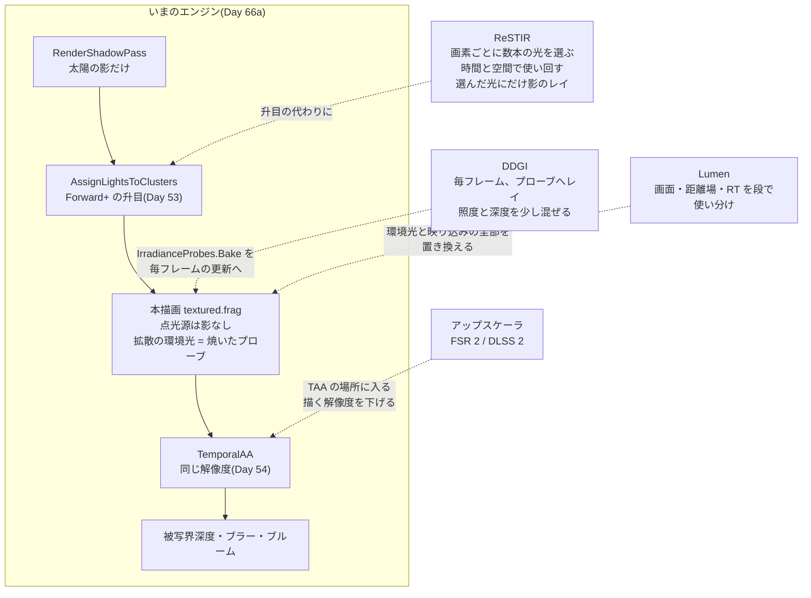

# Day 66b: モダンライティング理論講読(TAA の発展・アップスケーリング・DDGI・Lumen・ReSTIR)

**講読の日。コードは書かない**(`reference/Day66b` は作らない。写経も無い)。
教養編で作ってきたものが、いまのゲームエンジンの中でどう育っているかを、論文と講演資料で読む。

読むものは4つに分かれるが、**どれもこのリポジトリのどこかの Day の「続き」**として読める。
何もないところから読むと用語の山になるので、**必ず自分の書いたコードの横に置いて読む**。

| 読むもの | 続きになっている Day | 一言で言うと |
|---|---|---|
| TAA の発展 | Day 54a・54b(TAA) | 履歴を**どれだけ信じるか**の判断を、手書きの規則からもっと賢いものへ |
| アップスケーリング(FSR / DLSS) | Day 54a・54b(TAA)+ Day 55a(被写界深度) | **低い解像度で描いて**、TAA の履歴を高い解像度で持つ |
| DDGI | **Day 66a**(焼いたプローブ) | 66a のプローブを**毎フレームのレイで焼き直し、深度を持たせて光漏れを防いだもの** |
| Lumen | Day 66a + Day 58(SDF)+ Day 62(ハードウェア RT) | 動く光と動く物に付いてくる GI を、何段もの近似の組み合わせで |
| ReSTIR | Day 52b(1024 個の点光源)+ Day 53(Forward+)+ Day 60a(モンテカルロ) | 光を**全部回す**のでも**升目で選ぶ**のでもなく、**確率で数本選んで、選んだ結果を隣と前のフレームで使い回す** |

> **今日の読み方のいちばんの芯**
> 4つとも、**「前のフレームの答えを使い回す」**と**「全部を正しく計算せず、足りないぶんを使い回しで埋める」**の組み合わせでできている。
> Day 54 の TAA が「1画素 1 サンプルでも、8 フレーム溜めれば 8 サンプル」と言っていたのと同じ発想が、
> 解像度(アップスケーリング)・GI(DDGI・Lumen)・光源の数(ReSTIR)に広がっている。
> Day 66a の焼いたプローブは、その逆——**一度だけ全部計算して、あとはずっと使い回す**——の端にある。

## 今日のゴール

**4つの技術それぞれについて、「このリポジトリのどの Day の、何を、どう置き換えたものか」を1〜2文で言える。
とくに DDGI は、Day 66a の `IrradianceProbes` のどこを変えれば DDGI になるかを、関数の名前を挙げて説明できる。**

確かめ方は「完成条件」の問い(8 問)に、資料を閉じて答えられるか。

## 事前に読む資料

### DDGI(今日の中心)

- [Majercik, Guertin, Nowrouzezahrai, McGuire, "Dynamic Diffuse Global Illumination with Ray-Traced Irradiance Fields"(JCGT 2019)](https://jcgt.org/published/0008/02/01/)
  — **今日いちばん時間を使う資料**。Day 66a の計画書の「今日残した歪み」4つ目(壁の裏から覗くプローブ)と、
  要点5(重みが壁を知らない)に、この論文がどう答えているかを探しながら読む。
  読む順は、プローブの持ち物(照度と深度)→ 更新(レイを撃って混ぜる)→ 引き方(重み)→ 置き場所の自動調整

### Lumen

- [Wright, Narkowicz, Kelly, "Lumen: Real-time Global Illumination in Unreal Engine 5"(SIGGRAPH 2022 Advances in Real-Time Rendering)](https://advances.realtimerendering.com/s2022/index.html)
  — 講演資料([PDF](https://advances.realtimerendering.com/s2022/SIGGRAPH2022-Advances-Lumen-Wright%20et%20al.pdf))。
  分量が多いので、**全体の構成(何段の近似を重ねているか)**と、最後のほうの「品質を下げたときに何へ落ちるか」を先に読む
- [Krzysztof Narkowicz, "Journey to Lumen"(2022)](https://knarkowicz.wordpress.com/2022/08/18/journey-to-lumen/)
  — 開発者本人のブログ。**試して捨てた方式**が並んでいるので、「なぜこの形になったか」が講演資料より読みやすい

### ReSTIR

- [Bitterli, Wyman, Pharr, Shirley, Lefohn, Jarosz, "Spatiotemporal reservoir resampling for real-time ray tracing with dynamic direct lighting"(SIGGRAPH 2020)](https://benedikt-bitterli.me/restir/)
  — 論文の頁([PDF](https://research.nvidia.com/sites/default/files/pubs/2020-07_Spatiotemporal-reservoir-resampling/ReSTIR.pdf))。
  **重点的リサンプリング(RIS)→ 貯水池(リザーバ)→ 時間と空間での使い回し**の3段で読む。
  Day 60a の計画書(モンテカルロ積分・重点サンプリング)を隣に置く

### TAA の発展とアップスケーリング

- [Yang, Liu, Salvi, "A Survey of Temporal Antialiasing Techniques"(Eurographics 2020 STAR)](http://behindthepixels.io/assets/files/TemporalAA.pdf)
  — TAA を「サンプルを溜める」と「履歴を疑う」の2つに分けて整理したサーベイ。**Day 54a の要点3(混ぜる)と要点5(疑う)がそのまま章立てになっている**。
  後半の「アップスケーリング」と「残っている問題」を読む
- [Brian Karis, "High Quality Temporal Supersampling"(SIGGRAPH 2014 Advances)](https://advances.realtimerendering.com/s2014/)
  — Day 54a で読んだものの読み直し。今日は**「なぜ近所の色の箱で疑うのか」ではなく「それでも何が残るのか」**を拾う
- [AMD FidelityFX Super Resolution 1](https://gpuopen.com/fidelityfx-superresolution/) と
  [FidelityFX Super Resolution 2](https://gpuopen.com/fidelityfx-superresolution-2/)(GPUOpen)
  — FSR 1 は**1枚の絵だけで**拡大する(空間)、FSR 2 は**前のフレームを使う**(時間)。
  2 の[説明書](https://gpuopen.com/manuals/fidelityfx_sdk/techniques/super-resolution-temporal/)で、
  入力(低解像度の色・深度・速度・ずらし)が Day 54 の TAA とほぼ同じであることを確かめる
- [Edward Liu, "DLSS 2.0 - Image Reconstruction for Real-time Rendering with Deep Learning"(GTC 2020)](https://developer.download.nvidia.com/video/gputechconf/gtc/2020/presentations/s22698-dlss-image-reconstruction-for-real-time-rendering-with-deep-learning.pdf)
  — **手書きの規則のどこをネットワークに任せたか**だけを読めばよい(ネットワークの中身は今日の主題ではない)

### このリポジトリの中

- **Day 66a の計画書** 要点5・7 と「今日残した歪み」 — DDGI を読む前に必ず読み直す
- **Day 54a の計画書** 要点3・5、**Day 54b の計画書** 要点3・4 — TAA とアップスケーリングの土台
- **Day 52b・53 の計画書**(多光源と Forward+)と **Day 60a の計画書**(モンテカルロ) — ReSTIR の土台
- **西川善司「ゲーム制作者になるための3Dグラフィックス技術 改訂3版」Ch10**(大局照明技術) — 地図として

## 理論の要点

### 1. TAA の発展 — 「溜める」はほぼ完成していて、「疑う」が続いている

Day 54a の TAA は、1画素 1 サンプルを毎フレームずらして描き、指数移動平均で溜めた。
そして、使い回してはいけない履歴を**近所の色の箱**で疑い、箱の外に出た履歴を箱の中へ引き戻した(要点5)。

サーベイの整理では、TAA の研究は今も**ほとんどが「疑う」側**にある。溜め方(指数移動平均)はほぼ決まっていて、
問題になるのはいつも「この履歴は、いまの画素と同じものを見ていたか」。

| 疑い方 | Day 54 でやったか | 何を見て疑うか |
|---|---|---|
| 近所の色の箱(min / max、分散) | **やった**(Day 54a) | いまの画素のまわりの色の範囲 |
| 速度の食い違い | やっていない | 前のフレームで、その場所の速度が大きく違っていたか |
| 深度・物体 ID の食い違い | やっていない | 引き戻した先に、同じ物が写っていたか |
| 学習した重み | やっていない | 上の全部をネットワークに見せて、混ぜ方を決めさせる(DLSS) |

**色の箱で疑うことの限界**は、Day 54a で見たとおり、**細い線や小さな明るい点**。いまの画素の近所に写っていないものは、
正しい履歴でも「箱の外」に見えて捨てられる。これがちらつきとぼけの残りの正体で、ここを良くしようとすると
「色以外の手がかり」が要る——アップスケーリングでそれがさらに深刻になる。

### 2. アップスケーリング — 低い解像度で描き、TAA の履歴を高い解像度で持つ

Day 54 の TAA は、**描く解像度と履歴の解像度が同じ**だった。アップスケーラは、これを分ける。

```
  描く: 1280x720(画素の数は 4 分の1)  ─ずらし→  履歴: 2560x1440
         1フレームで 1 画素 1 サンプル              4 フレーム溜めれば、履歴の 1 画素に 1 サンプル
```

**ずらしを細かくすれば、低い解像度の画素でも、高い解像度の画素の中のいろいろな位置を順に踏める**。
Day 54a の「8 点のずらし」を増やし、履歴に書き込む位置を高い解像度の側で決めるのが、FSR 2 と DLSS 2 に共通する骨格。
入力は Day 54 の TAA とほぼ同じ(低解像度の色・深度・速度・ずらしの量)。

| | 何を使うか | 疑い方 |
|---|---|---|
| FSR 1 | **1枚の絵だけ**(空間)。縁を見て拡大し、鋭くする | 疑わない(履歴を持たない) |
| FSR 2 | 前のフレームの履歴(時間) | **手書きの規則**(色・深度・速度の食い違い、細いものを「固定」する) |
| DLSS 2 | 前のフレームの履歴(時間) | **ネットワーク**が混ぜ方を決める |

**解像度を下げると、「疑う」がずっと難しくなる**。いまの画素の近所の色の箱が、4倍粗い画素から作られるので、
細い線は箱にまったく入らなくなる。DLSS が「手書きの規則のどこをネットワークに任せたか」は、ほぼこの1点——
**どの履歴を捨てるか**——に集中している。

**被写界深度・モーションブラーとの順番**も読みどころ。Day 55 では TAA の直後に被写界深度とブラーを置いた。
アップスケーラは TAA の場所に入るので、その後ろの後処理は**高い解像度で走る**——高い解像度ぶん値段が上がる。
前に置けば安いが、ぼけた絵を拡大することになる。どちらを取るかは資料でも意見が分かれている。

### 3. DDGI — 66a のプローブを「毎フレーム、少しずつ」焼き直す

DDGI の骨格は Day 66a とまったく同じ。**格子にプローブを並べ、画素は囲む8点を混ぜて照度を引く**。違いは4つ。

| | Day 66a(焼いたプローブ) | DDGI |
|---|---|---|
| 1. 何で撮るか | ラスタライズ(6面 x 32x32) | **レイ**(1点あたり毎フレーム数百本) |
| 2. いつ撮るか | キーを押したとき、1回 | **毎フレーム**。前の値と混ぜる(ヒステリシス) |
| 3. 何を持つか | 照度(SH 9 係数) | 照度(**八面体マップ**)+ **深度**(平均と2乗平均) |
| 4. 置き場所 | 格子のまま | **動かす・止める**(壁の中や裏に居るものを直す) |

**2 がいちばん大事**。毎フレーム全部撮り直すのではなく、少しのレイで撮った結果を**前の値に少しだけ混ぜる**
(前の値の重みは 0.9 台後半)。これは **Day 54 の TAA とまったく同じ指数移動平均**で、TAA が画素の上でやったことを、
プローブの上でやっている。だから灯りが動けば、照り返しも数十フレームかけて付いてくる——
**66a の「焼いたものは付いてこない」(要点7)がここで外れる**。

**3 の深度が光漏れを防ぐ**。各プローブは「その向きに、いちばん近い面までどれだけあるか」の平均と2乗平均を持つ。
画素がプローブから見えているかを、**チェビシェフの不等式**(平均と分散から「この距離より奥にある確率」の上限を出す)で見積もり、
見えていなさそうなプローブの重みを下げる。Day 33 の影で言えば、分散シャドウマップと同じ考え方。
**66a の `ProbeIrradiance` の重み `w.x * w.y * w.z` に、もう1つ掛け算が増える**と読めばよい。

**4 は 66a の「今日残した歪み」4つ目への答え**。レイが裏面ばかりに当たるプローブは、壁の中か壁の裏に居る。
DDGI はそれを数えて、プローブを少し動かすか、使わないことにする。

**SH ではなく八面体マップで持つ**のは、毎フレーム少しずつ書き足すのに向くから(テクスチャの画素に混ぜるだけで済む)と、
深度は SH では持てない(要点4 の「小さく明るい光」と同じで、細かい変化を9個では表せない)から。

### 4. DDGI の値段と、それでも残るもの

DDGI はレイを撃つので、**ハードウェア RT(Day 62)が前提**になる。1点あたり毎フレーム数百本 x 数千点なので、
画面の画素の数よりずっと少ないレイで済むのが値打ち(画素ごとにレイを撃つパストレーシングの何百分の1)。

それでも残るものは、66a と同じ格子の弱点。

- **格子より細かい照り返しは出ない**。プローブの間隔が照り返しの解像度の上限
- **間隔を細かくすると、点の数は3乗で増える**(66a の `F5` で見た)。広い世界では、カメラのまわりだけ細かくする入れ子の格子(カスケード)にする
- **拡散だけ**。鏡面の映り込みは別の仕組み(画面空間の反射やレイの反射)が要る(66a の「今日残した歪み」3つ目と同じ)

### 5. Lumen — 何段もの近似を、遠さと値段で使い分ける

Lumen は「1つの方式」ではなく、**同じ問い(その点に、まわりからどれだけ光が来るか)に答える近似を何段も重ねたもの**。
レイを近いところから順に、安い方法で試し、当たらなければ次の方法へ渡す。

| 段 | 何で調べるか | このリポジトリで近いもの |
|---|---|---|
| 画面の中 | 深度バッファの上をたどる | Day 37(SSAO)——画面に写っているものだけ |
| 近くの物 | 物ごとの距離場(SDF)をたどる | **Day 58(レイマーチング)** |
| 遠くの物 | 世界全体の粗い距離場をたどる | 同上(粗い版) |
| ハードウェア RT(使えれば) | 三角形そのもの | **Day 62**(BLAS / TLAS) |

**当たった先の明るさは、面に貼った「サーフェスキャッシュ」から読む**。当たった点でもう一度光を計算し直すと高いので、
物の面の明るさを低い解像度で持っておき、それを読む——66a のプローブが「点で持つ」のに対して、「面に貼って持つ」。

**最後に画面の上で集める**(ファイナルギャザー)。画素ごとに何本もレイを撃つのは高いので、画面の上に間引いたプローブを置き、
そこで撃って、画素は近くのプローブから引く。**プローブが画面の上に移っただけで、66a の「囲む点を混ぜる」と同じ形**。

**品質を下げると、何へ落ちるか**が読みどころ。講演資料には、プローブと遮蔽を使う軽い版(Irradiance Fields with Probe Occlusion)が
出てくる——**つまり DDGI に近いもの**で、Lumen の最下段は 66a からそう遠くない。

### 6. ReSTIR — 光を全部回さず、確率で選んで、選んだ結果を使い回す

Day 52b では 1024 個の点光源を描いた。フォワードは画素ごとに全部を回し、Day 53 の Forward+ は画面を升目に切って
**升目にかかる光だけ**を回した。どちらも「届くかもしれない光を**全部**調べる」。

ReSTIR は、全部を調べない。**画素ごとに数本だけ、明るそうな光を確率で選ぶ**(重点サンプリング。Day 60a のモンテカルロと同じ)。
それだけではノイズだらけなので、2つを使い回す。

| 使い回し | 何をするか | このリポジトリで近いもの |
|---|---|---|
| 時間 | 前のフレームの同じ場所の「選んだ結果」を、今の選択に混ぜる | **Day 54 の TAA**(速度で前の場所を引き戻す) |
| 空間 | 隣の画素の「選んだ結果」も、自分の選択に混ぜる | Day 37 の SSAO のぼかし(近所を見る) |

**使い回すのは色ではなく「選んだ光」**というのが TAA との違い。貯水池(リザーバ)は「これまでに見た候補のうち1つと、その重みの合計」
だけを持つ小さな箱で、何本見ても大きさが変わらない。混ぜるときは箱と箱を合わせるだけなので、隣と前のフレームを何度でも足せる。
**選び直しの重みを正しく付ければ、推定は偏らない**(論文の主張の中心。同じ誤差で 6〜60 倍速い)。

**影が付く**のも、Day 52b / 53 との大きな違い。選んだ数本の光にだけ、レイ(影のレイ)を撃つので、1024 個の光すべてに影が付く。
Day 52 の点光源が影を持たなかったのは、全部の光に影を付けると値段が光の数だけ増えるから——ReSTIR はそれを「選ぶ」ことで外した。

### 7. 4つを並べると — 使い回すのは「何」か

| 技術 | 使い回すもの | どこから | 疑い方 |
|---|---|---|---|
| TAA(Day 54) | 色 | 前のフレーム・同じ画素 | 近所の色の箱 |
| アップスケーラ | 色(高い解像度で) | 前のフレーム | 手書きの規則 / ネットワーク |
| DDGI | 照度と深度 | 前のフレーム・同じプローブ | ほぼ疑わない(ゆっくり混ぜる) |
| Lumen | 面の明るさ・画面のプローブ | 前のフレーム・近くの面 | 物が動いたら、その面のぶんを捨てる |
| ReSTIR | **選んだ光** | 前のフレーム・隣の画素 | 選び直しの重み |
| **焼いたプローブ(Day 66a)** | 照度 | **焼いたとき**(ずっと) | **疑わない**(条件が変わっても使い続ける) |

**66a がいちばん下の行に居る**のが今日の結論。何も疑わず、ずっと使い回す。だから安く(毎フレーム +0.14ms)、
だから動く光には付いてこない。上の行へ行くほど、使い回す期間が短くなり、疑い方が賢くなり、値段が上がる。

## 前Dayからの差分概要

**差分なし**(講読の日)。`reference/Day66b` は作らない。写経も無い。

### 写経する順番

無し。**改造課題**が手を動かす場所になる(どれも Day 66a のコードの上でやる)。

## 設計書

**Day 66a から変更なし**(コードを書かない日なので、Day 66a の計画書の設計書をそのまま見ること)。

代わりに、今日読んだものを**いまのエンジンに入れるとしたら、どこが変わるか**を1枚にしておく。
改造課題を始める前の地図として使う。

### 読んだものが入る場所 — いまの1フレームのどこに差し込まれるか



**DDGI がいちばん近い**。`IrradianceProbes` の格子・テクスチャ・`ProbeIrradiance` の8点の補間はそのまま使え、
変わるのは「撮り方」(ラスタの6面 → レイ)・「持ち方」(SH → 八面体マップ + 深度)・「混ぜ方」(差し替え → 少しずつ混ぜる)・
「重み」(3軸の一次補間 → それに見えている確率を掛ける)の4つ。

**ReSTIR は Forward+ の升目を置き換える**が、影のレイが要るので、ハードウェア RT(Day 62 の Vulkan)か、
距離場のレイマーチング(Day 58)のどちらかが本描画の中から呼べる必要がある。**いまのエンジン(OpenGL 4.3)にはどちらの口も無い**。

**アップスケーラは TAA の場所に入り、`PostProcess` の中で解像度が2つに分かれる**。Day 31 から「シーンのバッファ = 画面の大きさ」で
揃えてきた前提(`Framebuffer.Resize` を画面の大きさで呼ぶ)が崩れるので、影響はいちばん広い。

## 完成条件

資料を閉じて、次の 8 問に答えられること。答えの要点は下に畳んである(先に自分で書いてから開く)。

1. Day 54 の TAA と、FSR 2 / DLSS 2 のいちばん大きな違いを1つ。入力で同じものを3つ
2. 解像度を下げると、TAA の「疑う」がなぜ難しくなるか
3. DDGI が Day 66a と違う4点。そのうち**光漏れ**を防いでいるのはどれか
4. DDGI のヒステリシスは、Day 54 の何と同じ式か。灯りを急に消したとき、DDGI の照り返しはどう振る舞うか
5. Day 66a の「今日残した歪み」4つ目(壁の裏から覗くプローブ)に、DDGI はどう答えているか
6. Lumen がレイを「段」で使い分けるのはなぜか。最下段が 66a に近いのはなぜか
7. ReSTIR が「使い回す」ものは、TAA が使い回すものとどう違うか
8. Day 52 の点光源が影を持たなかった理由と、ReSTIR でそれが外せる理由

<details>
<summary>答えの要点</summary>

1. **描く解像度と履歴の解像度が違う**(低く描いて高く溜める)。入力は色・深度・速度・ずらしの量(のうち3つ)
2. 疑う材料(いまの画素の近所の色の箱)が粗い画素から作られるので、細い線や小さな点が箱に入らず、正しい履歴まで捨ててしまう
3. レイで撮る・毎フレーム少しずつ混ぜる・深度も持つ・置き場所を直す。光漏れは**深度**(チェビシェフで見えている確率を出して重みを下げる)と、置き場所の調整
4. **指数移動平均**(TAA の混ぜる式と同じ)。消した瞬間には残り、数十フレームかけて消えていく(66a の「焼き直すまで残る」と、TAA のゴーストの中間)
5. レイが裏面ばかりに当たるプローブを見つけて、動かすか使わない
6. 近いところほど安く正確な方法があり(画面・物ごとの距離場)、遠いところは粗くてよいから。品質を下げると「プローブ + 遮蔽」の照度の場に落ちる——格子の点を混ぜる形は 66a と同じ
7. TAA は**色**、ReSTIR は**選んだ光(と重みの合計)**。色は混ぜるとぼけるが、選んだ光は選び直すだけなので偏らない
8. 全部の光に影を付けると値段が光の数だけ増えるから。ReSTIR は画素ごとに数本しか選ばないので、影のレイも数本で済む

</details>

## 改造課題

どれも **Day 66a のコードの上で**やる(`work/HonyaEngine` の 66a を写経し終えてから)。

### 課題1(易): 66a を「少しずつ焼き直す」にしたら何フレームかかるか

DDGI の「毎フレーム少しずつ」を、66a の数字で見積もる。

1. 66a の `F12`(値段)で、1回ぶんの焼きの内訳(撮る・読み返す・縮める)を読む
2. 1フレームに使ってよい時間を 1ms とする。448 点を何フレームで1周できるか(撮る時間だけで見積もる)
3. 1周するあいだに灯りが揺らぐと、照り返しのどこが遅れて見えるか
4. **読み返しが焼きの半分以上を占める**のはなぜか。DDGI が読み返しを必要としないのはなぜか(ヒント: 縮めるのをどこでやるか)

### 課題2(中): ヒステリシスを入れる

66a の `IrradianceProbes.Upload` の直前で、新しい係数を**前の係数と混ぜる**。

1. `next[i] = previous[i] * h + next[i] * (1 - h)`(`h` は 0.9)にする。初回(前が無い)は混ぜない
2. 灯りを消して(`F10`)、`F3` を 1 回ずつ押していく。照り返しが何回で半分になるか。`h` から計算した値と合うか
3. `h` を 0.97 にすると何回か。DDGI の既定が 0.9 台後半なのは、どちらを嫌っているからか(遅れか、ちらつきか)
4. 焼くたびに**揺らいだ灯りのまま**(満点ではなく、今の明るさで)焼くと、`h` の大きさで照り返しの揺らぎがどう変わるか

### 課題3(難): プローブに深度を持たせ、見えないプローブの重みを下げる

DDGI の光漏れ対策を、66a の撮り方のまま真似る。

1. `IrradianceProbes.Bake` で、撮った6面の**深度**も読み返す(撮る先の `Framebuffer` の深度から、プローブからの距離に直す)
2. プローブごとに、6方向(±X・±Y・±Z)それぞれの「いちばん近い面までの距離」の平均と2乗平均を持つ(6 方向 x 2 = 12 個の数)
3. `ProbeIrradiance`(`textured.frag` と `deferred.frag`)の重みに、**画素がプローブから見えている確率**(チェビシェフ)を掛ける。
   画素からプローブへの向きに近い方向の平均と2乗平均を使う。**重みの合計で割り直す**
4. 66a の `F9` + `F8` で、壁の外の暖色の帯が消えるか。**6 方向しか持たないと、どこで破綻するか**(DDGI が深度を細かい八面体マップで持つ理由)

見どころは 4。6 方向の平均では「壁の手前と奥」を同じ方向に混ぜてしまうことがあり、そこで漏れが戻る。
**深度を細かい向きで持つ**ことが DDGI の八面体マップの役目だと分かれば、今日の講読は済んでいる。

## 動作確認済み環境

講読の日なので、動かすものは無い。改造課題は Day 66a の reference(`dotnet run --project reference/Day66a -c Release`)と同じ環境で行う
(Day 66a の計画書「動作確認済み環境」を参照)。
