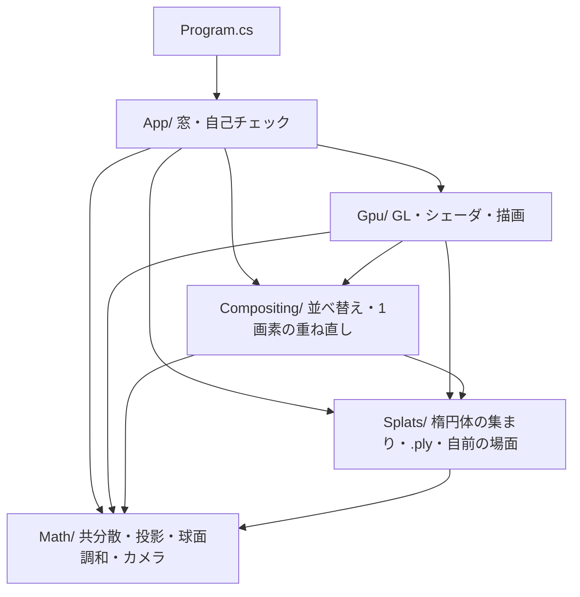
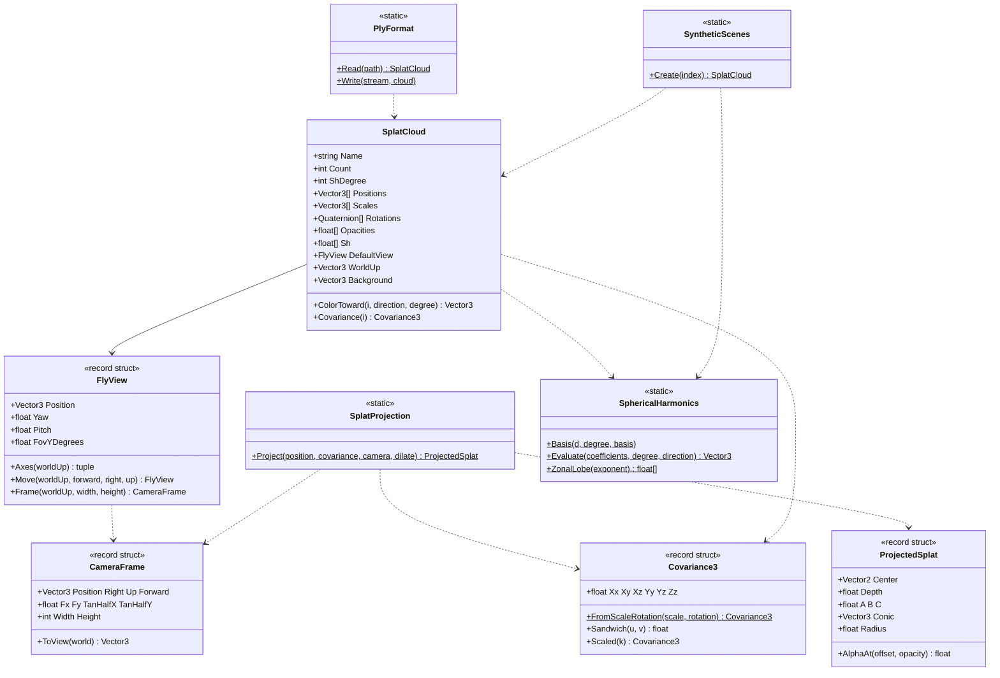
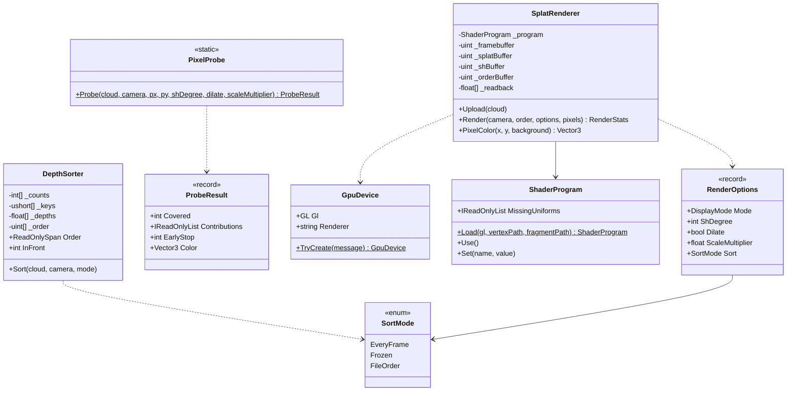
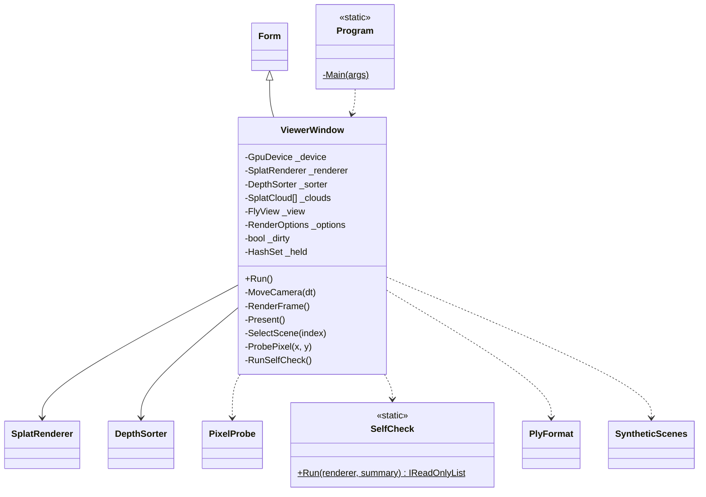
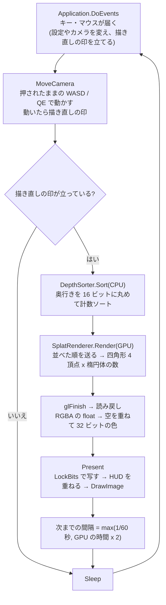
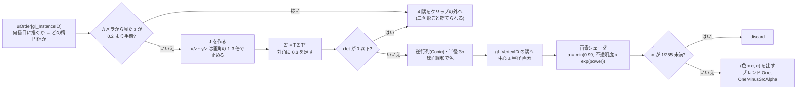

# Day 67: 3D Gaussian Splatting 簡易ビューア(面の無い絵を、楕円体の重ね塗りで作る)

**教養編の最終日**で、**`Labs` の4つ目の題材**。エンジン(HonyaEngine)にも、ほかの Labs にも触れず、
新しいプロジェクト `GaussianSplatting` をゼロから始める。

Day 1〜56 の絵は、すべて**三角形**でできていた。今日の絵には三角形が1枚も無い。
形は**半透明のぼやけた楕円体(3D のガウス分布)が何十万個も重なったもの**で、描くときは楕円体を1個ずつ画面へ写し、
奥から順に半透明のまま重ねる。写真から学習した楕円体を読めば、写真と見分けのつかない絵が出る。

| | ポリゴン(Day 14〜56) | 3D Gaussian Splatting(Day 67) |
|---|---|---|
| 形の持ち方 | 頂点と三角形。面がある | **楕円体の集まり**(位置・大きさ・回転・不透明度・色)。面も法線も無い |
| 色の決め方 | 材質と光源から毎フレーム計算する(PBR・影・IBL) | **写真に写っていた色そのもの**。光は計算しない。見る向きで変わるぶんは球面調和で持つ |
| 見えるものの選び方 | 深度バッファでいちばん手前の1枚を残す | **全部を奥から並べて、半透明で重ねる**。深度バッファは使わない |
| 1個を画面へ出す | 頂点を行列で写す(線形) | 楕円体を写すと楕円になる。**透視投影を1次式で近似して**写す(EWA splatting) |
| 作り方 | モデラーが作る | **写真から学習する**(今日はやらない。要点8) |
| 得意 | 動かす・照らし直す・ぶつける | **写真どおりの見た目を、そのまま歩き回れる** |

今日の差分は**新規 19 ファイル**(C# 16 本・GLSL 2 本・csproj)。コメント込みで 3,590 行、コメントと空行を除くと約 2,400 行。
**Day 59(1,543 行)より多い**ので、下の「写経する順番」で2回に分けることと、自己チェック(407 行)をコピーで済ませることを勧める。

> **今日いちばん意外だったのは、学習済みのシーンで1画素に掛かっている楕円体の 85% が、絵に何も足していなかったこと**
> 機関車のシーン(74 万個)を斜めから見て、画面を 144 点に間引いて CPU で数えた。**1画素あたり平均 813 個**の楕円体の四角形が掛かっていて、
> GPU はそのすべてで画素シェーダを走らせている。ところが濃さが 1/255 を超えて色を足していたのは **156 個**で、
> 手前から重ねていけば **122 個目**で残りの透明度が 0.0001 を切る(それより奥は、何を足しても見えない)。
> 813 回のうち要ったのは 122 回。**元論文が画面をタイルに区切り、手前から重ねて途中で打ち切る描き方をしている理由**が、この数字にある(要点8)。
> 今日のビューアはいちばん簡単な「四角形を奥から重ねる」形で描いていて、右クリックでこの数字を1画素ずつ見られる。

## 今日のゴール

**起動すると、赤・緑・青の大きな楕円体が3つ、ぼやけて重なって見える。`2` で床とトーラスと球が出て、それが 27 万枚の平たい楕円体でできていると分かる。
`4` で学習済みの機関車のシーンを読み、WASD とマウスで中を歩き回れる。右クリックした画素に効いている楕円体が、手前から順に全部並ぶ。**

| キー | 何が起きるか |
|---|---|
| `W` `A` `S` `D` / `Q` `E` / `Shift` | 前後左右に動く / 下・上に動く / 押している間は 4 倍の速さ |
| 左ドラッグ / ホイール | 見回す / 動く速さを変える |
| `1` / `2` / `3` / `4` | 場面(楕円体3つ / 円板で覆った形 / 見る向きで色が変わる / **.ply を読む**) |
| `V` | 表示(ふつう / 中心の点 / くっきりした楕円 / 楕円の輪郭 / **重なりの数**) |
| `O` | 並べ替え(毎フレーム / 止める / しない)。**止めてから回り込むと、重なりが崩れる** |
| `M` | 球面調和の次数(0〜3)。**場面3で 0 にすると、ハイライトが消える** |
| `F` | 0.3 の広げ ON / OFF。**切ると、遠くの床の市松がギザギザになる** |
| `[` / `]` | 楕円体の大きさの倍率(0.05〜4 倍)。**縮めると、中身が点の集まりだと分かる** |
| `U` | 上下を裏返す(場面4だけ。学習済みのシーンが逆さまに見えたとき) |
| 右クリック | **その画素に効いている楕円体**を、手前から全部並べる(CPU で重ね直す) |
| `R` | カメラを最初の位置に戻す |
| `C` | 今日の自己チェック(11 項目) |
| `P` | PNG で保存(実行ファイルの隣の `captures/`) |
| `X` / `H` / `Esc` | 下の欄を消す / 文字を消す / 終了 |

### 今日いちばん大事な3つ

**1つ目は「楕円体を写すと楕円になる——ただし近似で」**。楕円体の形は 3x3 の共分散行列 Σ で表せる。
これを画面へ写した形の共分散は `Σ' = J W Σ Wᵀ Jᵀ` で、W はカメラの回転、**J は透視投影(z で割る)を楕円体の中心のまわりで1次式に近似したもの**(要点2)。
透視投影は線形ではないので、楕円体の像は厳密には楕円にならない。「中心の近くで接線を引いて、楕円ということにする」のが 3DGS の描き方の芯になる。

```glsl
// splat.vert。T = J W の2本の行を、ワールドの向きとして作る(行列を組まずに、カメラの軸3本で書いてある)
vec3 row0 = (uFocal.x / z) * uRight + (-uFocal.x * tc.x / (z * z)) * uForward;
vec3 row1 = (uFocal.y / z) * uUp    + (-uFocal.y * tc.y / (z * z)) * uForward;
float a = dot(row0, sigma * row0) + uDilation;   // Σ' = T Σ Tᵀ(2x2 の対称行列なので3つだけ)
float b = dot(row0, sigma * row1);
float c = dot(row1, sigma * row1) + uDilation;
```

**2つ目は「深度バッファの代わりに、並べ替える」**。半透明の楕円体は、手前の1個だけが見えるのではなく**全部が少しずつ効く**。
重ねる式(`色 = 新しい色 × α + 今までの色 × (1 − α)`)は奥から順に重ねたときだけ正しいので、**毎フレーム全部をカメラから遠い順に並べ直す**(要点3)。
74 万個の並べ替えは、16 ビットの計数ソートで CPU 8ms。`O` で並べ替えを止めてから回り込むと、重なりの順が崩れて手前と奥が入れ替わる。

**3つ目は「光を計算しない」**。楕円体の色は、写真を撮ったときの光ごと焼き込まれた値で、
**見る向きで変わるぶん(映り込み・ハイライト)は球面調和の 16 個の係数で持つ**(要点5)。Day 66a で放射照度を持った道具と同じもの。
だから照らし直せない(ライトを動かしても何も変わらない)——ポリゴンのパイプラインと正反対の割り切りで、それが写真どおりの見た目の代わりに払ったもの(要点7)。

### 今日から新しい Labs — `GaussianSplatting`

CLAUDE.md の取り決め(「エンジンと独立した題材(Day 59〜62・64a〜65c・67)は `Labs` に置く」)どおり、今日の reference は **Day 66a のコピーではない**。

| | どうするか |
|---|---|
| reference | `reference/Day67/` を新しく作った |
| work | **`work/Labs/GaussianSplatting/`** を作る。csproj は `reference/Day67/Day67.csproj` を `GaussianSplatting.csproj` という名前でコピーする |
| 名前空間 | `GaussianSplatting` |
| 表示 | Day 59〜61 と同じ **WinForms + LockBits**。GPU は Day 61 と同じ「見えない窓の上の OpenGL 4.3」で使い、描いた絵を読み戻して窓に出す。HUD を GDI+ で重ねられ、CPU で重ね直した色と GPU の絵を数で突き合わせられる |
| 差分の確認 | `reference/diff.sh Day67` が `work/Labs/GaussianSplatting` と比べるように直した |
| 学習済みのシーン | **リポジトリに入れない**(数百 MB・ライセンスが配布元ごと)。`assets/splats/README.md` の手順でダウンロードして `assets/splats/` に置く(下の「学習済みのシーンを手に入れる」) |
| 実行 | `dotnet run --project reference/Day67 -c Release`。Debug でも動くが、並べ替えと読み込みが数倍遅い |

CLAUDE.md の名前空間の一覧と `.gitignore`(`assets/splats/*.ply`)も合わせて直してある。

### 学習済みのシーンを手に入れる

場面1〜3 は自前で作るので、何も用意しなくても動く。場面4(`4` キー)だけが .ply を要る。

```bash
# リポジトリ直下で(184 MB)
curl -L -o assets/splats/train-7000.ply \
  "https://huggingface.co/datasets/Voxel51/gaussian_splatting/resolve/main/FO_dataset/train/point_cloud/iteration_7000/point_cloud.ply"
```

[Voxel51/gaussian_splatting](https://huggingface.co/datasets/Voxel51/gaussian_splatting) の `train`(Tanks and Temples の機関車。元論文の実装で 7,000 回学習、**741,883 個・球面調和は次数 3**)。
この計画書の数字はすべてこのファイルで取った。ライセンスや、ほかのシーンについては `assets/splats/README.md`。

**自分で撮影して学習させるのは勧めない**。学習は GPU を数十分全開で回すので、電源の細い機械では落ちる(このリポジトリの開発機は、今日の検証の途中で1回落ちた。「検証の途中で分かったこと」の1)。

## 事前に読む資料

- [Kerbl ほか「3D Gaussian Splatting for Real-Time Radiance Field Rendering」(SIGGRAPH 2023)](https://repo-sam.inria.fr/fungraph/3d-gaussian-splatting/)
  — **今日の一次資料**。読むのは 1章(導入)・4章(楕円体の持ち方。式 (5) と (6) が要点1・2)・6章(タイル方式の描き方。要点8)。
  5章(学習と、分割・間引き)は要点8の講読で読む。7章の比較表で、NeRF 系と速さが3桁違うことを見ておく
- [graphdeco-inria/gaussian-splatting](https://github.com/graphdeco-inria/gaussian-splatting) と
  [diff-gaussian-rasterization の `cuda_rasterizer/forward.cu`](https://github.com/graphdeco-inria/diff-gaussian-rasterization/blob/main/cuda_rasterizer/forward.cu)
  — 元論文の実装。**`computeCov2D`・`computeColorFromSH`・`renderCUDA` の3つだけ**読めばよい。今日の `splat.vert` と `splat.frag` は、この3つを四角形の形に直したもの。
  0.3 の広げ・0.99 の頭打ち・1/255 で捨てる・画角の 1.3 倍で止める、の数字はすべてここから来ている
- [Zwicker ほか「EWA Splatting」(IEEE TVCG 2002, PDF)](https://www.cs.umd.edu/~zwicker/publications/EWASplatting-TVCG02.pdf)
  — 要点2・4 の元。3D のガウスを透視投影で写すときの 1次近似(局所アフィン近似)と、画素より小さい楕円のエイリアシングを低域フィルタで抑える話。3DGS はここから 20 年ぶりに掘り起こされた
- [antimatter15/splat](https://github.com/antimatter15/splat)
  — WebGL の 3DGS ビューア。**今日と同じ「1個 = 四角形1枚、CPU で並べ替え、奥から重ねる」形**。並べ替えを Web Worker(別スレッド)でやっている。`main.js` の頂点シェーダを読むと、今日の `splat.vert` とほぼ同じ式が並んでいる
- [Mildenhall ほか「NeRF」(ECCV 2020)](https://www.matthewtancik.com/nerf)
  — 3DGS の前の世代。**同じ「写真から見た目を学習する」問題を、ニューラルネットと光線のレイマーチングで解いた**(Day 58 のレイマーチングを思い出す)。
  1画素ごとに光線上の数百点でネットを評価するので、1枚に数秒かかった。3DGS はそれを「楕円体を写して重ねる」ラスタライズに置き換えて、毎秒数百枚にした
- **Day 66a の計画書 要点2〜4**(球面調和)と、そこで挙げた Sloan「Stupid Spherical Harmonics (SH) Tricks」 — 要点5。今日は放射照度ではなく「その楕円体が各方向へ出す色」を持つ
- **Day 6 の計画書**(透視投影)・**Day 31 の計画書**(アルファブレンド)・**Day 60 の計画書 要点2**(モンテカルロ) — 要点2・3 と自己チェック3の下敷き

## 理論の要点

### 1. 形は楕円体の集まり — 5つの値と、Σ = R S Sᵀ Rᵀ

1個の楕円体(3DGS の論文では「3D Gaussian」)が持つのは次の5つだけ。

| 値 | 何か | .ply の中の形(要点6) |
|---|---|---|
| 位置 | 中心(ガウス分布の平均) | そのまま |
| 大きさ | 楕円体の3本の軸の標準偏差 σ(メートル) | **log を取った値** |
| 回転 | その3本の軸の向き(四元数) | 長さ 1 とは限らない |
| 不透明度 | 中心での不透明さ(0〜1) | **シグモイドを掛ける前の値** |
| 色 | 見る向きごとの色(球面調和の係数 16 個 x RGB) | そのまま |

大きさと回転をまとめたものが、**3D の共分散 Σ**(3x3 の対称行列)。

```
Σ = R S Sᵀ Rᵀ          S = diag(σx, σy, σz)、R は四元数から作った回転行列
  = Σ_k σ_k² a_k a_kᵀ   a_k は R の k 列目(k 番目の軸を回した向き)
```

「半径 1 の球を軸ごとに σ 倍に伸ばし、それから回した形」の共分散。2行目は「3本の軸それぞれの向きに、σ² だけ広がっている」と読める。
自己チェック1で、好きな回転 1000 通りについて `Σ a_k = σ_k² a_k`(回した軸が固有ベクトル)を確かめている。

**なぜ Σ を直接持たないのか**。共分散は正定値(どの向きにも長さが正)でないと楕円体にならないが、6つの数を学習で好きに動かすと、すぐにこの条件を破る。
大きさ(exp で必ず正)と回転(正規化で必ず回転)に分けておけば、どう動かしても楕円体のままでいられる。**.ply の値が変な形をしているのも同じ理由**(要点6)。

描くときは、Σ の独立な6つの数を GPU へ送る(`SplatRenderer.Upload`)。大きさと回転のまま送って頂点シェーダで作ってもよいが、毎フレーム同じ計算をすることになる。

### 2. 画面へ写す — 透視投影を1次式で近似する(EWA splatting)

カメラから見た座標を `(x, y, z)`(右・上・前。z は前向きの距離)とすると、画面の中心からの画素は

```
u = fx · x / z        v = fy · y / z        (fx, fy は焦点距離を画素で表したもの)
```

Day 6 のビュー行列 → 射影行列 → ビューポートを1行にまとめたのと同じ。今日は行列を組まず、**カメラの軸3本と焦点距離だけで写す**(`CameraFrame`)。

点ならこれで終わりだが、楕円体は**広がり**を持っている。z で割る写し方は線形ではないので、楕円体を写した像は厳密には楕円にならない
(カメラに近い側が大きく、遠い側が小さく写って、卵形にゆがむ)。そこで**楕円体の中心のまわりで、写し方を1次式に近似する**。それが J(ヤコビアン)。

```
J = | ∂u/∂x  ∂u/∂y  ∂u/∂z |  =  | fx/z   0      −fx·x/z² |
    | ∂v/∂x  ∂v/∂y  ∂v/∂z |     | 0      fy/z   −fy·y/z² |

Σ' = J W Σ Wᵀ Jᵀ     (元論文の式 (5)。W はワールド → カメラの回転。Σ' は 2x2)
```

1次式で写したガウスは、またガウスになる。こうして**楕円体1個 → 画面の上の楕円1個(2D のガウス)**が決まる。

- **J は画面の端ほど大きくゆがむ**。x/z が大きいと第3列が効くので、端の楕円体は横に引き伸ばされる(広角レンズの端が伸びるのと同じ)。
  画面から大きくはみ出した楕円体で J が暴れないように、**x/z と y/z を画角の 1.3 倍で止める**(元論文の実装と同じ。止めるのは J の中だけ)
- **近似がどれだけ外れるか**を自己チェック3で測っている。3D のガウスから点を 4 万個ばらまき、1個ずつ正確に z で割って写し、
  近似で作った 2σ の楕円の内側に何割が入るかを数える(本物の 2D のガウスなら 1 − e⁻² = **86.5%**)

| 楕円体 | 画面の真ん中 | 画面の端 |
|---|---|---|
| σ 0.05m・距離 3m(学習済みのシーンの典型) | 86.4% | 86.3% |
| σ 0.5m・距離 2m(カメラに対して大きい) | **81.9%** | **82.6%** |

小さな楕円体では近似はほぼ完ぺき。カメラの近くの大きな楕円体ほど外れる——学習済みのシーンでカメラが「浮いたゴミ」(要点7)に近づくと形が不自然に見えるのは、これも一因。

楕円が決まったら、**それを包む正方形**を作る。長い軸の長さは Σ' の大きいほうの固有値の平方根で、その 3 倍(3σ)を正方形の半分の辺にする。
3σ の外はガウス関数が `exp(−4.5) ≒ 0.011` しかなく、不透明度を掛けるとほぼ 1/255 を下回る。

```
mid = (a + c) / 2
λ1 = mid + √(mid² − det)       // 大きいほうの固有値
半径 = ceil(3 √λ1)              // 画素
```

### 3. 重ねる — 奥から順に、半透明で。深度バッファは使わない

正方形の中の画素ごとに、中心からのずれ d(画素)で濃さを計算する。

```
α = min(0.99, 不透明度 × exp(−½ dᵀ Σ'⁻¹ d))       1/255 未満なら塗らない
```

Σ'⁻¹(`Conic`)を頂点シェーダで作っておき、画素シェーダは 2x2 の2次形式を1回計算するだけ。**0.99 で頭打ち**にするのは、1 にするとそれより奥が完全に消え、
学習のときに奥へ勾配が届かなくなるから(描くだけでも、学習した値と同じ式で描かないと絵が変わる)。

重ね方は、Day 31 のアルファブレンドと同じ「over」。

```
奥から: C ← c_i α_i + C (1 − α_i)                              (今日の GPU の重ね方)
手前から: C ← C + T c_i α_i、T ← T (1 − α_i)   T は「残りの透明度」   (元論文・右クリックの重ね方)
```

2つは式を変形すると同じ値になる(どちらも `Σ c_i α_i Π_{j が i より手前} (1 − α_j)`)。自己チェック9で、GPU(奥から)と CPU(手前から)の色が **5×10⁻⁵** 以内で一致するのを確かめている。

**深度バッファを使わない理由**。ポリゴンは不透明なので、深度バッファで「いちばん手前の1枚」を選べば済んだ。半透明の楕円体は手前の1個だけが見えるわけではなく、
**全部が少しずつ効く**。1個を選ぶのではなく、全部を正しい順に重ねなければならない。だから**毎フレーム全部を、カメラから遠い順に並べる**(`DepthSorter`)。

並べ方は**計数ソート**。奥行きを 16 ビット(0〜65535)の整数に丸め、「その値が何個あるか」を数えて、数の累積から書き込む場所を決める。
比べ合いが無いので速い(自己チェック8。場面2の 27 万個で **計数ソート 2.4ms / Array.Sort 36ms**)。74 万個の機関車は約 8ms。

**並べるのは楕円体の中心の奥行き**で、画素ごとの奥行きではない。2つの楕円体が交差していると、本当は画素によって前後が違うのに、
どの画素でも同じ順で重なる。カメラを動かして中心の奥行きの順が入れ替わった瞬間、**重なり方がぱっと変わる**(popping)。
3DGS の既知の弱点で、場面1(大きな楕円体3つ)で回り込むと見える。

`O` の3つのやり方で、並べ替えが何をしているかを確かめられる。

| `O` | 何をしているか | 何が見えるか |
|---|---|---|
| 毎フレーム | いまのカメラで奥から並べ直す | 正しい絵 |
| 止める | 止めた瞬間の順番のまま描く | 止めたまま回り込むと、**奥にあるはずの楕円体が手前に乗る** |
| しない | ファイルの順 | 場面2 で 3.7 万画素(7%)が変わる。自己チェック11 は奥から / 手前からの逆順で 16% の画素が変わるのを数えている |

### 4. 0.3 の広げ — 画素より小さい楕円

遠くの楕円体は、画面で 1 画素より小さくなる。σ が 0.1 画素の楕円は、画素の真ん中を通るかどうかで**塗られたり塗られなかったり**する。
カメラが少し動くだけで、遠くの床がちらつき、市松がギザギザになる(Day 38 のエイリアシングと同じ)。

元論文の実装は、**2D の共分散の対角に 0.3 を足す**。σ が √0.3 ≒ 0.55 画素より細くならないようにする、画素の大きさの低域フィルタ(EWA splatting の「再構成フィルタ」の名残)。

```glsl
float a = dot(row0, sigma * row0) + uDilation;   // uDilation = 0.3(F で 0 にできる)
```

場面2で `F` を押すと、画素の 12%(6.4 万画素)が変わり、**地平線の近くの市松がギザギザになる**。

ただしこの 0.3 は**楕円を太らせるだけで、不透明度は下げない**。小さい楕円体が見かけより濃く塗られるので、学習した解像度より遠くから見ると絵が太る。
これを直したのが Mip-Splatting(2024)などの後続の研究で、今日はやらない。

### 5. 見る向きで変わる色 — 球面調和(次数 3、16 個の係数)

写真の中の物は、見る向きで色が変わる。金属の映り込み、つやのあるハイライト、窓ガラス。3DGS は光を計算しないので、**楕円体ごとに「どの向きから見たら何色か」を関数で持つ**。
その関数を球面調和(Day 66a)で近似し、係数を持つ。

```
色(d) = max(0, 0.5 + Σ_k 係数_k × Y_k(d))       d はカメラ → 楕円体の向き(長さ 1)
```

- **次数 0**(係数 1 個)は、どの向きから見ても同じ色。**次数 3**(16 個)で、なだらかなハイライトまで表せる
- **0.5 を足す**のは、係数が全部 0 のとき灰色にするため(学習の出発点)。**0 未満を切る**のは、近似の波打ちで負の色が出るため
- 基底の式・定数・符号は元論文の実装と1文字も違わないように写してある。学習済みの係数はこの基底で学習されているので、**符号が1つ違っても色がおかしくなる**。
  自己チェック5で、16 個の基底を球面で数値積分して、互いに直交し長さ 1 であることを確かめている(ずれ 7×10⁻⁵)
- 16 個 x RGB = 48 個の float は、位置や形(12 個)の4倍ある。**3DGS のファイルの大半は色**

場面3の3つの球は、**光が面で跳ね返った向きから見たときに明るい**ハイライトを、次数 3 の係数で持たせてある(`SyntheticScenes.ViewDependentSpheres`)。
山は軸の周りに対称なので、Sloan の「帯調和の回転」の式で、山の鋭さごとに 4 つの数を計算すれば、どの向きの山も係数にできる。
自己チェック6の結果が、そのまま**次数 3 の限界**を示している。

| 山の鋭さ(指数) | 山の頂(本当は 1) | 差の2乗平均 | いちばん低いところ |
|---|---|---|---|
| 4(左の赤い球) | 0.854 | 0.040 | −0.083 |
| 16(真ん中の緑の球) | 0.382 | 0.077 | −0.076 |
| 64(右の青い球) | **0.116** | 0.055 | −0.027 |

**鋭いハイライトは、次数 3 では表せない**。16 個の係数で作れるのはなだらかな山と、その周りの負の波打ちだけ。右の青い球にはハイライトがほとんど出ない。
学習済みのシーンで、鏡のような映り込みがぼやけていたり、浮いた楕円体で「ごまかして」いたりするのはこのため。

### 6. .ply の中身 — 学習しやすい形のまま入っている

.ply はもともと点群・ポリゴンのための古い形式(Stanford, 1994)で、先頭に文字で「1行に何がどの順で並ぶか」を書き、その後ろにバイナリの行を並べる。
3DGS はこれを「1行 = 楕円体1個」として使っていて、次数 3 なら **62 列 = 248 バイト**。

```
x y z                   位置
nx ny nz                法線(いつも 0。点群の道具で開けるように置いてあるだけ)
f_dc_0 f_dc_1 f_dc_2    球面調和の0番の係数(RGB)
f_rest_0 … f_rest_44    1〜15 番の係数。R の 15 個、G の 15 個、B の 15 個の順
opacity                 シグモイドの前
scale_0 scale_1 scale_2 log を取った値
rot_0 rot_1 rot_2 rot_3 四元数。w, x, y, z の順
```

読むときに直すのは4つ(`PlyFormat.Read`)。

| 列 | 直し方 | 間違えるとどうなるか |
|---|---|---|
| `scale_*` | `exp` | 大きさが負や 0 になり、楕円体が消えるか、画面を覆う |
| `opacity` | `1 / (1 + e⁻ˣ)` | 全体が真っ白 / 真っ黒に飛ぶ |
| `rot_*` | (w, x, y, z) → System.Numerics の (x, y, z, w) に並べ替えて正規化 | 形が全部ねじれる(色は合っているのに、細部が崩れる) |
| `f_rest_*` | 「色ごとにまとまっている」のを「係数ごとに RGB」に並べ替える | 見る向きで色が虹色に変わる |

自己チェック7は、場面3(次数 3)を書き出して読み直し、全部の値が元に戻ることを確かめている(書くときは log・ロジット・逆の並べ替え)。

**座標の向き**。学習済みのシーンは COLMAP(写真からカメラの位置を求める道具)の座標で、**たいてい −Y が上**(カメラの y 軸が下向きの流儀で、最初の写真がワールドの軸を決めるため)。
今日のビューアは .ply を読んだら上を −Y にし、それでも逆さまなら `U` で裏返せるようにしてある。
**.ply には撮影したカメラの位置が入っていない**ので、最初の立ち位置は楕円体の位置の中央値から見当で決めている(`PlyFormat.GuessView`)。

### 7. 3DGS の得意と限界 — ポリゴンと並べて

機関車のシーンを歩き回ると、次のことが目で分かる。

- **撮影したカメラの通り道から離れると崩れる**。学習は「写真と同じ位置から描いた絵が、写真と一致するように」楕円体を動かすので、
  写真に写っていない向き・距離からの見た目は何の保証も無い。線路の上を低く飛ぶ、機関車の裏へ回り込む、空へ高く上がる——どれも絵が崩れる
- **浮いたゴミ(floater)**。カメラの近くの空中に、大きくて薄い楕円体が浮いている。どの写真でも「手前でぼんやり色を足しておくと誤差が減る」ので学習で残ったもの。
  写真の位置からは溶け込んでいて見えないが、ずれた位置から見ると、霧や汚れのように見える(最初の立ち位置を見当で決めたとき、引きすぎてこの中に立った。「検証の途中で分かったこと」の5)
- **面が無い**。`V` で「くっきりした楕円」「楕円の輪郭」にすると、機関車の車体でさえ、平たい楕円体の寄せ集めだと分かる。
  **当たり判定が作れない**(どこに面があるか分からない)。ゲームに使うなら、別にポリゴンの当たり用の形を用意することになる
- **照らし直せない**。色に光が焼き込まれているので、ライトを動かすことも、影を落とし直すことも、夜にすることもできない
- **重い**。74 万個で 184MB。ポリゴンなら同じ見た目を数 MB のメッシュ + テクスチャで持てる

| | ポリゴン(このリポジトリの最終デモ) | 3DGS |
|---|---|---|
| 見た目の本物らしさ | 作り込み次第(Day 56 で PBR・IBL・影・TAA を全部入れた) | **撮った写真そのもの**(細かい汚れ・錆・木の葉まで) |
| 作る手間 | モデリング・テクスチャ・ライティング | 写真を数百枚撮って学習(数十分) |
| 動かす / 照らし直す / ぶつける | できる | **できない**(研究段階) |
| 描く手間 | 三角形の数 × 塗る画素 | 楕円体の数 × **重なりの数**(要点8) |

「ゲームのエンジンで使う形」と「現実を撮って見せる形」は別物で、いまの AAA は前者が主役のまま。3DGS は、背景や実写の場所・物を取り込む用途から入り始めている。

### 8. 元論文の速い描き方と、学習(講読。今日は実装しない)

今日のビューアは「1個 = 四角形1枚、CPU で並べ替え、奥から重ねる」で、いちばん簡単な形。元論文の実装(CUDA)は、同じ絵をもっと速く出すために2つのことをしている。

**(a) 画面をタイルに区切り、手前から重ねて打ち切る**。Day 53 の Forward+ で「タイルに当たる光源のリスト」を作ったのと同じ発想で、
**「タイル(16x16 画素)に当たる楕円体のリスト」**を作る。

```
1. 楕円体ごとに、掛かるタイルを調べ、(タイル番号, 奥行き)の 64 ビットの鍵を作る(1個が 10 タイルに掛かれば鍵は 10 個)
2. 鍵を GPU の基数ソートで並べる → タイルごとに「手前から並んだリスト」ができる
3. タイル1つをワークグループ1つが受け持ち、リストを共有メモリへ少しずつ読みながら、画素ごとに手前から重ねる
4. 残りの透明度 T が 0.0001 を切った画素は、そこで止める
```

効くのは4の**打ち切り**。四角形を奥から重ねる今日の形では、奥から来る以上、手前が埋まったかどうかを知る手段が無く、全部を塗るしかない。
右クリックで、1画素ごとにその差が見える。機関車のシーンを斜めから見て、画面を 144 点に間引いて CPU で数えた結果が冒頭の囲み。

| 1画素あたり | 平均 |
|---|---|
| 四角形が掛かっていた(= 今日の GPU が画素シェーダを走らせた回数) | **813 回**(最大 2,508) |
| 濃さが 1/255 以上で、実際に色を足した | 156 個 |
| 手前から重ねて、T < 0.0001 で打ち切った場合に要る数 | **122 個**(144 点のうち 53 点で打ち切り) |

**(b) 学習**。写真の束(と、COLMAP で求めたそれぞれのカメラの位置)から、楕円体の値を少しずつ直していく。

```
1. COLMAP が作った粗い点群を、小さな球の楕円体として置く
2. 写真と同じカメラの位置から描く(上の (a) の描き方)
3. 描いた絵と写真の差を計算する
4. 差が減る向きに、全部の楕円体の値(位置・大きさ・回転・不透明度・色)を少しずつ動かす   ← 描く式を全部逆向きに微分する(微分可能なラスタライザ)
5. 数百回ごとに、誤差の大きいところの楕円体を分けて増やし(densification)、ほぼ透明なものを消す
6. 2 へ戻る。3 万回
```

**(a) のタイル方式は、4 の逆伝播のためでもある**。手前から重ねて打ち切った順を覚えておけば、逆向きにたどって、どの楕円体がどれだけ色に効いたかを計算できる。
要点1・6 で見た「大きさは log、不透明度はシグモイドの前」の形は、この 4 で好きな値に動かしても壊れないためのもの。

ビューアの側でこれ以上速くするなら、(a) を丸ごと入れるより先に、**並べ替えを GPU に移す**(Day 57 のコンピュートシェーダで計数ソート)ほうが手軽で、改造課題3にした。

## 前Dayからの差分概要

**Day 66a からの差分は無い**(新しいプロジェクト)。reference の中身は全部が新規。

### 新規ファイル

| ファイル | 行数(うちコード) | 役割 |
|---|---|---|
| `Day67.csproj` | 56 | WinExe / net10.0-windows / WinForms / PerMonitorV2 / unsafe。名前空間 `GaussianSplatting`。Silk.NET.Windowing と OpenGL(Day 61 と同じ)。`shaders/` を出力先へコピー |
| `Math/SphericalHarmonics.cs` | 173(100) | **基底 16 個の式と定数**・評価・帯調和の山の係数(要点5) |
| `Math/Covariance3.cs` | 67(31) | 3D の共分散。**`Σ = R S Sᵀ Rᵀ`**(要点1) |
| `Math/FlyView.cs` | 106(54) | 飛び回るカメラ(`FlyView`)と、投影に要る値(`CameraFrame`。軸3本と焦点距離) |
| `Math/SplatProjection.cs` | 127(55) | **楕円体 → 画面の楕円**(`ProjectedSplat`)。J・0.3 の広げ・半径・濃さ(要点2〜4)。GPU と同じ計算の CPU 版 |
| `Splats/SplatCloud.cs` | 130(52) | 楕円体の集まり。種類ごとの配列・上の向き・空の色・最初のカメラ |
| `Splats/PlyFormat.cs` | 352(252) | .ply を読む・書く(要点6)。最初の立ち位置の見当 |
| `Splats/SyntheticScenes.cs` | 290(201) | 自前の場面3つ(楕円体3つ / 円板で覆った形 / 見る向きで色が変わる) |
| `Compositing/DepthSorter.cs` | 130(77) | **奥から並べる計数ソート**(要点3)。`SortMode` |
| `Compositing/PixelProbe.cs` | 103(57) | 1画素に効いている楕円体を CPU で全部調べ、手前から重ねる(右クリック。要点8) |
| `Gpu/GpuDevice.cs` | 79(47) | 見えない窓の上の OpenGL 4.3(Day 61 と同じ) |
| `Gpu/ShaderProgram.cs` | 105(72) | 頂点 + 画素シェーダの薄い皮。見つからない uniform を覚える |
| `shaders/splat.vert` | 156(118) | **楕円体 → 四角形**。並べた順・J・Σ'・半径・球面調和の色 |
| `shaders/splat.frag` | 79(54) | **ガウス関数の濃さで塗る**。表示の切り替え(点・くっきり・輪郭・数える) |
| `Gpu/SplatRenderer.cs` | 366(238) | SSBO へ送る・インスタンス描画・ブレンド・タイマー・読み戻し・空を重ねる |
| `App/SelfCheck.cs` | 521(407) | 自己チェック 11 項目 |
| `App/ViewerWindow.cs` | 707(527) | 窓。ループ・移動・HUD・キーとマウス・右クリック・PNG |
| `Program.cs` | 39(13) | エントリポイント |

リポジトリの側で直したもの(**写経の対象ではない**): `reference/diff.sh`(Day 67 を `work/Labs/GaussianSplatting` と比べる)、
`CLAUDE.md`(Labs の名前空間の一覧)、`.gitignore`(`assets/splats/*.ply`)、`assets/splats/README.md`(学習済みのシーンの入手の手順)。

**今日の量は多い**(コードだけで約 2,400 行)。下の順番の **9 まで**(式と場面。窓なしで確かめられる部分)と、**10 から**(GPU と窓)で2回に分けるとよい。
**`App/SelfCheck.cs`(コード 407 行)は、写すより reference からコピーして読むだけにしてもよい**——式の答え合わせが役目で、今日の理論は全部ほかのファイルにある。

### 写経する順番

依存の向きに沿って並べてある。**`Program.cs`(`Main`)を写すまでは、ビルドすると CS5001(エントリポイントが無い)だけが出る**。
それ以外のエラーが出ないことを確かめながら進める。

0. **`work/Labs/GaussianSplatting/` を作り、`reference/Day67/Day67.csproj` を `GaussianSplatting.csproj` という名前でコピーする**。
   以降のファイルはこのフォルダの中に、reference と同じサブフォルダ(`Math/` `Splats/` `Compositing/` `Gpu/` `shaders/` `App/`)で置く
1. **`Math/SphericalHarmonics.cs`** — どこにも依存しない。**定数と符号を1文字も間違えない**(自己チェック5が見張っている)
2. **`Math/Covariance3.cs`** — どこにも依存しない。要点1
3. **`Math/FlyView.cs`** — どこにも依存しない(`CameraFrame` もこのファイル)
4. **`Math/SplatProjection.cs`** — 2・3 を使う。**要点2〜4 の式の全部**
5. **`Splats/SplatCloud.cs`** — 1・2・3 を使う
6. **`Splats/PlyFormat.cs`** — 3・5 を使う。要点6
7. **`Splats/SyntheticScenes.cs`** — 1・3・5 を使う
8. **`Compositing/DepthSorter.cs`** — 3・5 を使う。要点3
9. **`Compositing/PixelProbe.cs`** — 4・5 を使う。**ここまでで、GPU を使わない部分が全部そろう**
10. **`Gpu/GpuDevice.cs`** — どこにも依存しない(Day 61 とほぼ同じ)
11. **`Gpu/ShaderProgram.cs`** — どこにも依存しない
12. **`shaders/splat.vert`** — 4 と同じ計算を GLSL で。1 の定数もここにもう一度書く
13. **`shaders/splat.frag`** — 4 の `AlphaAt` と同じ式
14. **`Gpu/SplatRenderer.cs`** — 4・5・8(`SortMode`)・10・11 を使い、12・13 を読む
15. **`App/SelfCheck.cs`** — ここまでの全部を使う(コピーでもよい)
16. **`App/ViewerWindow.cs`** — 全部を使う
17. **`Program.cs`** — 16 を使う。**ここで初めてビルドが通る**

## 設計書

**今日から `GaussianSplatting` の設計書を新しく始める**。HonyaEngine の設計書は Day 66a の計画書にある(エンジンは今日1行も変わっていない)。

### 全体構成と依存の向き



| 層 | 知っている層 | 知らない層 | 中身 |
|---|---|---|---|
| `Math/` | **どこも知らない** | 楕円体の集まり・GPU・窓 | `SphericalHarmonics` / `Covariance3` / `FlyView` / `CameraFrame` / `SplatProjection` / `ProjectedSplat` |
| `Splats/` | Math | GPU・窓 | `SplatCloud` / `PlyFormat` / `SyntheticScenes` |
| `Compositing/` | Math・Splats | **GPU**・窓 | `DepthSorter` / `SortMode` / `PixelProbe` / `ProbeResult` / `Contribution` |
| `Gpu/` | Math・Splats・Compositing(`SortMode` だけ) | 窓 | `GpuDevice` / `ShaderProgram` / `SplatRenderer` / `RenderOptions` / `RenderStats` / `DisplayMode` |
| `App/` | 全部 | — | `ViewerWindow` / `SelfCheck` |

**循環参照は無い**(コメントを落として型名を拾い、確かめた)。大事なのは2つ。

- **`Math/` がどこにも依存しない**。楕円体を写す式(`SplatProjection`)と球面調和の式は `Vector3` と `float` だけで書いてあり、**GLSL へそのまま写してある**。
  C# 版があるので、右クリックの重ね直しと自己チェック9で、GPU の絵を数で答え合わせできる
- **`Compositing/` が GPU を知らない**。並べ替えは CPU の配列を作るところまでで、それを GPU へ送るのは `Gpu/` の仕事。
  改造課題3で並べ替えを GPU に移すときは、`DepthSorter` の代わりに `Gpu/` の中にコンピュートシェーダを足すことになる

### Math と Splats — 楕円体と、その写し方



**`SplatCloud` は種類ごとの配列**で持つ(1個を1つの struct にしない)。並べ替えは位置しか読まないので、位置だけが連続しているほうがキャッシュに優しい。
GPU へ送るときも、形(12 個の float)と色(48 個の float)を別のバッファにする。

**`CameraFrame` は行列を持たない**。軸3本と焦点距離だけで写す。J の式が「右・上・前の向きに、それぞれ何倍」という形で素直に書けるのと、
Day 6 の行列の鎖(ビュー → 射影 → ビューポート)が、実は1行の割り算だったことが見えるようにするため。

### Compositing と Gpu — 並べて、描いて、読み戻す



`SplatRenderer` の持つ GPU の資源は5つ。

| 資源 | 中身 | いつ作り直すか |
|---|---|---|
| 楕円体の SSBO(binding 0) | 1個 48 バイト。位置・不透明度・3D の共分散の6つ | 場面を替えたとき(`Upload`) |
| 色の SSBO(binding 1) | 1個 (次数 + 1)² x 3 個の float | 場面を替えたとき |
| 並べた順の SSBO(binding 2) | 1個 4 バイト | **毎フレーム**(74 万個で 3MB) |
| 描き込み先 | RGBA 32 ビット浮動小数のテクスチャ 960x540。**深度バッファは無い** | 作ったまま |
| タイマークエリ | 描画の時間を GPU に測らせる | 作ったまま |

描き込み先を 32 ビットの浮動小数にしてあるのは、薄い楕円体を数百枚重ねても丸めの誤差が積もらないようにするのと、「重なりの数」の表示で 1 ずつ足して数えるため。

### App — 窓と自己チェック



### 1フレームの流れ — 何か変わったフレームだけ描く



Day 59〜61 の窓と同じ「自前のループ + LockBits で転送」。違いは2つ。

- **何も変わらないフレームは描き直さない**。止まっている絵を毎フレーム描いても同じ絵が出るだけで、GPU を無駄に回す
- **GPU の時間の2倍は休む**。学習済みのシーンを「重なりの数」で見ると1枚 40ms 近くかかり、休まずに歩き回ると GPU が全開に張り付く。
  電源の細い機械はそれで落ちる(「検証の途中で分かったこと」の1)。そのぶん重い表示では 12fps 程度に落ちるが、見るための表示なので割り切った

### 楕円体1個が画素になるまで



頂点属性は1つも使わない。四角形の4隅は `gl_VertexID`(0〜3、TriangleStrip)、どの楕円体かは `gl_InstanceID` から決め、
データは全部 SSBO から読む。**1回の `glDrawArraysInstanced(4 頂点 x 楕円体の数)` で全部が出る**。

**頂点シェーダが同じ計算を4回やっている**(4隅それぞれで J・Σ'・球面調和を計算し直す)のが今日の形の無駄。
元論文の実装は、楕円体ごとの前処理(写す・色を決める)を1回だけ別の段でやってから描く。直すなら前処理をコンピュートシェーダにし、結果をバッファに書いておく。

### 今日残した歪み(3つ)

**1. 並べ替えが CPU で、描くのと同じスレッド**。74 万個で 8ms、描くより時間を食うことがある。antimatter15/splat は別スレッド(Web Worker)で並べ、
並べ終わった順を次のフレームで使う(1フレーム遅れる代わりに止まらない)。GPU に移すのが本筋で、改造課題3。

**2. `SplatRenderer` が「描く」と「読み戻して窓の色にする」を両方持っている**。重なりの数の色づけ(`ResolveOverdraw`)も中にある。
窓を WinForms にしている今日の都合で、GL の窓に直接描くなら読み戻しごと消える。

**3. `PlyFormat` が最初の立ち位置の見当(`GuessView`)を持っている**。読むことと、カメラをどこに置くかは別の話。
撮影したカメラの位置(元論文の実装が学習の出力に置く `cameras.json`)を読めるようにするなら、そちらへ出す。

## 完成条件

`dotnet run --project reference/Day67 -c Release` で起動する。960x540 の窓が開き、左上に HUD が出る。
**時間の数字(描画・読み戻し・並べ替え)は、GPU のクロックの状態で倍近く揺れる**。下の値は RTX 3070 での目安。

### 1. 起動: 場面1「楕円体3つ」

暗い灰色の背景に、**赤(斜めに長い)・緑(縦に長い)・青(平たい)の大きな楕円体が、ぼやけて重なって**見える。縁ははっきりせず、中心から外へなめらかに薄くなる。

```
場面 1/4: 楕円体3つ   楕円体 3 個(カメラの前 3)   作成 3 ms
並べ替え 毎フレーム (O) 0.1 ms   描画 0.36 ms(GPU)   読み戻し 4.7 ms   960x540
表示 ふつう (V)   球面調和の次数 0(この場面は 0 だけ) (M)   0.3 の広げ ON (F)   大きさ x1.00 ([ ])
位置 (0.00, 0.00, 4.00)   向き 0 度 / 0 度   速さ 1.50 m/秒(ホイール、Shift で 4 倍)   上 +Y
```

- 青が赤と緑の手前に、緑が赤の奥にある(青の中心が z = 0.5 でいちばん近い)
- **右クリック**すると、その画素に掛かっている楕円体が手前から並ぶ。たとえば青と緑の重なるところで
  `四角形が掛かっていた 3 個 … 色を足した 2 個 … 最後まで重ねても残りの透明度は 0.3577(空が透ける)` のように出て、
  `手前から 1 … 濃さ α 0.532 … 届いた割合 T 1.0000` `2 … 0.237 … 0.4685` と、**T が α の分だけ減っていく**のが読める(要点3)

### 2. `V`: 表示を回す

- **中心の点** … 3つの小さな点だけになる。**楕円体の「位置」だけを見ると点群**
- **くっきりした楕円(2σ、ぼかし無し)** … 3つの楕円が縁のくっきりした板になる。青が手前、緑が奥
- **楕円の輪郭(2σ)** … 3本の楕円の線
- **重なりの数** … 3つの楕円を包む**正方形**が見え、重なったところほど色が変わる。HUD に `1画素あたり平均 2.3 回 / 最大 3 回`。
  **GPU は楕円ではなく、それを包む正方形の全部で画素シェーダを走らせている**

もう1回押すと、ふつうに戻る。

### 3. 回り込む、そして `O`

WASD とマウスで3つの楕円体の周りを回る(左ドラッグで右を向き、`A` で左へ動く、を繰り返すと周りを回れる)。

- 回り込むと、**どの色が手前に来るかがある角度でぱっと入れ替わる**(中心の奥行きの順が入れ替わった瞬間。要点3の popping)
- `O` で **止めた** にしてから、反対側まで回り込む → **奥にあるはずの色が手前に乗った**ままの絵になる。`O` を2回押して毎フレームに戻すと直る
- `O` で **しない(ファイルの順)** … 正面からでも、赤・緑・青の順(ファイルの順)に重なる。正しい絵と 2.6 万画素(5%)違う

### 4. `2`: 場面2「円板で覆った形」

水色の空の下に、白と紺の市松の床、オレンジのトーラス、青緑の球。**光の当たり方で明るさが変わっているが、描くときには光の計算を1つもしていない**(色に焼き込んである)。

```
場面 2/4: 円板で覆った形   楕円体 274,935 個(カメラの前 206,435)   作成 51 ms
並べ替え 毎フレーム (O) 2.6 ms   描画 1〜8 ms(GPU)   読み戻し 5 ms
```

- **`[` を5回ほど押して大きさを 0.3 倍**にする → 床・トーラス・球が**細かい点の網**になり、空が透けて見える。27 万枚の平たい楕円体を敷き詰めて面に見せていたことが分かる。`]` で戻す
- `V` で**中心の点** → 同じく点の網。床の奥ほど点が詰まって見える
- `V` を2回(**楕円の輪郭**) → 近くの床に、少しずつ重なり合う楕円が並ぶ
- `V` で**重なりの数** → 床は緑〜黄(数十回)、トーラスの縁が黄。`1画素あたり平均 47 回 / 最大 342 回`。
  **遠くの床ほど楕円体が詰まっていて、重なりの数が増える**
- **`F` で 0.3 の広げを切る** → **地平線の近くの市松がギザギザ**になり、床の奥の縁が細くなる(画素の 12% が変わる。要点4)。カメラを少し動かすと、奥がちらつく

### 5. `3`: 場面3「見る向きで色が変わる」

暗い背景に、灰色の床と、赤・緑・青の球。**赤い球に白いハイライト、緑の球に淡いハイライト、青の球にはほとんど無い**(左から山が鋭くなり、次数 3 で表せなくなる。要点5)。

- **`A` / `D` で左右に動く**と、**ハイライトが球の上を滑るように動く**。ハイライトは面に貼り付いておらず、見る向きで決まっている
- `M` を押して次数を **0** にする → ハイライトが全部消え、つや消しの球になる(画素の 8% が変わる)。**`M` を 1・2・3 と押していくと、ハイライトが少しずつ戻る**
- 床は次数 0 の係数しか持っていないので、`M` で何も変わらない

### 6. `4`: 場面4「学習済みのシーン」

`assets/splats/` に `train-7000.ply` を置いてから `4` を押す(読み込みに 0.5〜2 秒)。無ければ下の欄に「.ply が見つからない」と入手の手順が出る。

```
場面 4/4: train-7000.ply   楕円体 741,883 個(カメラの前 629,613)   読み込み 470 ms
並べ替え 毎フレーム (O) 8 ms   描画 6〜11 ms(GPU)   読み戻し 5 ms
表示 ふつう (V)   球面調和の次数 3 / 3 (M)   0.3 の広げ ON (F)   大きさ x1.00 ([ ])
```

**緑に錆の浮いた機関車(Western Pacific)の側面**が目の前にあり、上に青空と木、下に砂利と線路。写真と見分けがつかない。

- **`D` で右へ、左ドラッグで左を向く**を繰り返して機関車の斜め前に回ると、**「713」の番号と「WESTERN PACIFIC」の文字、手前の赤いコーン**が見える
  (斜めの視点の例: 位置 (2.5, −0.8, −2.5)、向き −45 度。HUD の「位置」で確かめられる)
- **`S` で後ろへ下がり続ける**と、画面の手前に**青白いもやや、汚れのような大きな楕円体**が出てくる(浮いたゴミ。要点7)
- `Q` / `E` で上下に大きく動く、機関車の反対側へ回り込む → 絵が崩れる。**撮影したカメラが通らなかった場所**
- `V` で **中心の点** → 機関車が色の付いた点群になり、空は点がまばら(空の遠くは少数の大きな楕円体で塗っている)
- `V` で **くっきりした楕円** → 絵の具を塗り重ねた絵のようになり、**空に大きな楕円の縁が何重にも見える**。機関車の車体でさえ、平たい楕円体の寄せ集め
- **右クリック**で機関車の車体を調べる → `四角形が掛かっていた` が数百〜千、`色を足した` が百数十、`手前から N 個目で残りの透明度が 0.0001 を切る` が出る
  (斜めの視点の画面の真ん中で 1,031 / 171 / 157。要点8。74 万個を CPU で全部写すので、1回に 0.1 秒ほどかかる)
- `M` で次数を 0 にする → **ほとんど変わらない**。画素の 75% が変わるが、平均 3 目盛り(1%)ほどで、車体の明暗がわずかに平らになるだけ。
  **学習済みのシーンの色の大半は0番の係数(向きによらない色)が持っていて**、1〜15 番(48 個の float の 45 個)は、映り込みの細かい差を持っているだけ。
  場面3のように、つやの強い物が大きく写っていないと効きが見えない
- **`V` で重なりの数**にすると、1枚に 30〜40ms かかり、動かすとカクカクする(GPU を休ませるため。1フレームの流れを参照)。
  見終わったら、ふつうの表示に戻しておく

**逆さまに見えたら `U`** で上を裏返す(このシーンは −Y が上で、読み込んだ直後から正しい向き)。

### 7. `C`: 自己チェック(11 項目すべて合格)

```
自己チェック: 11 項目中 11 項目 OK
OK  1. 3D の共分散 Σ = R S Sᵀ Rᵀ
        σ (1, 2, 3) 回さない: 対角 (1.000, 4.000, 9.000)(期待 1, 4, 9) / z まわりに 90 度: 対角 (4.000, 1.000, 9.000)(期待 4, 1, 9)
        好きな回転 1000 通り: 回した軸 a が Σa = σ²a を満たす。ずれの最大 5.7E-007
OK  2. 楕円体を画面へ写す(真ん中の球)
        距離 5m・σ 0.1m・焦点距離 579.0 画素: 画面の σ (11.580, 11.580) 画素(期待 11.580)、xy 0.0E+000
        0.3 の広げ: 対角が 0.3000 増える / 半径 35 画素(3σ の切り上げ) / カメラの後ろは描かない: はい
OK  3. ヤコビアンの近似(写した点が、近似の 2σ の楕円に入る割合。本物のガウスなら 86.5%)
        σ 0.05m・距離 3m: 真ん中 86.4% / 画面の端 86.3%
        σ 0.5m・距離 2m: 真ん中 81.9% / 画面の端 82.6%(カメラに対して大きい楕円体ほど外れる)
OK  4. 逆行列・半径・濃さ(画面で σ (2.9, 1) 画素の楕円)
        Σ' Σ'⁻¹ = (1.0000, 0.0000; 0.0000, 1.0000) / 半径 9 画素(期待 9)
        濃さ(不透明度 1): 中心 0.990(0.99 で頭打ち) / 長い軸の 3σ 0.0111(期待 exp(-4.5) = 0.0111)
OK  5. 球面調和の基底(16 個)が正規直交か(球面で数値積分)
        ∫ Y_k² のずれの最大 7.2E-005(期待 0) / ∫ Y_j Y_k(j ≠ k)の最大 4.7E-005(期待 0)
OK  6. 次数 3 で山を近似する(帯調和の回転の式)
        指数  4: 山の頂 0.854(期待 1) / 差の2乗平均 0.0395 / いちばん低いところ -0.083
        指数 16: 山の頂 0.382(期待 1) / 差の2乗平均 0.0766 / いちばん低いところ -0.076
        指数 64: 山の頂 0.116(期待 1) / 差の2乗平均 0.0550 / いちばん低いところ -0.027
OK  7. .ply に書いて読み直す(場面3、次数 3)
        64,386 個・次数 3・15.2 MB(1個あたり 248.0 バイト)
        ずれの最大: 位置 0.0E+000 / 大きさ(比) 1.9E-007 / 回転 1.2E-007 / 不透明度 0.0E+000 / 係数 0.0E+000
OK  8. 奥から並べる(計数ソート、場面2)
        274,935 個: 重複 0 / 丸めの幅(0.30 mm)を超えて逆に並んだ所 0
        計数ソート 2.4 ms / Array.Sort 36.1 ms(同じ奥行きの配列を並べた場合)
OK  9. GPU の絵と、CPU で重ね直した色(35 画素 x 2 場面)
        場面1「楕円体3つ」: 35 画素の色の差の最大 9.1E-006
        場面3「見る向きで色が変わる」: 35 画素の色の差の最大 5.1E-005
OK  10. シェーダの uniform
        12 個とも見つかった
OK  11. 並べる向きで絵が変わる(場面1、奥から / 手前から)
        3 目盛りより大きく色が変わった画素 83,495(16.1%)
        手前から「over」で重ねると、奥の楕円体が手前の上に乗る
```

1〜8 は CPU だけ、9〜11 は GPU で描いて読み戻す(1秒ほどかかる。終わったあと、いまの場面を GPU へ送り直す)。

いちばん値打ちがあるのは **5 と 9**。5 は球面調和の定数・符号を1つ写し間違えると落ちる(学習済みのシーンは色がおかしくなるだけで、それらしく見えてしまう)。
9 は `splat.vert` / `splat.frag` と C# の式を突き合わせている——シェーダの式を1か所変えると、ここが落ちる。

### 8. その他

- **ホイール**で動く速さが 1.25 倍ずつ変わる。**Shift** を押している間は 4 倍
- **`R`** で最初の位置に戻る
- **`P`**: `PNG を保存した` と保存先(`reference/Day67/bin/Release/net10.0-windows/captures/day67-scene….png`)。HUD は写らない
- **`H`**: 文字が全部消える
- 起動の引数に .ply のパスを渡すと、場面4でそれを読む(`dotnet run --project reference/Day67 -c Release -- D:\どこか\point_cloud.ply`)

## 検証の途中で分かったこと

**1. 検証の途中で、開発機が落ちた**。窓なしのハーネスで、機関車のシーン(74 万個)を「重なりの数」表示(1枚 37ms の全開描画)で数枚、
続けてふつうの表示で数枚描いたところで電源が落ちた(Kernel-Power 41、BugcheckCode 0。これまでと同じハードの電源断)。
それで窓のループに**「GPU の時間の2倍は休む」**を入れ、重い表示の数字(要点8の 813 / 156 / 122)は **GPU を使わずに CPU で数え直した**。
学習済みのシーンは、並みのゲームより GPU を重く使う(画素あたり数百回の画素シェーダ)。電源に不安がある機械では、重なりの数の表示で歩き回らないこと。

**2. 「不透明な楕円」表示が、学習済みのシーンでは真っ黒な円だけになった**。最初は 2σ の内側を不透明度 1 で塗っていた。
場面1では楕円体の形がよく見えたが、機関車では**カメラの近くの大きくて薄い楕円体(不透明度 0.01 ほど)**が画面を丸ごと覆い、何も見えなかった。
不透明度は元のままにして、ぼかしだけを外す「くっきりした楕円」に変えた。学習済みのシーンには、見えない(薄い)大きな楕円体がたくさんある、という発見でもある。

**3. ヤコビアンの近似を「写した点の共分散」で測ったら、58% 外れていると出た**。自己チェック3の最初の版。σ 0.5m の楕円体を 2m 先に置いて点をばらまくと、
数個の点がカメラのすぐ近く(z が 0 に近い)へ来て、z で割ると画面のはるか遠くへ飛ぶ。分散はそういう点に振り回される。
「近似の 2σ の楕円に入る割合」に変えると、飛んだ点は「外」と数えられるだけになり、81.9% という落ち着いた数字になった。

**4. 半径が 9 ではなく 10 になった**。自己チェック4で、画面で σ がちょうど 3 画素の楕円を作ると、`3 × √9` が浮動小数の誤差で 9.0000005 になり、切り上げで 10 になった。
σ を 2.9 画素にして(3σ = 8.7 → 9)確かめている。GPU でも同じことが起きていて、ちょうどの値の近くでは四角形が1画素大きくなるが、害は無い(外側は濃さが 1/255 未満で捨てられる)。

**5. 最初の立ち位置を見当で決めたら、霧の中に立った**。楕円体の位置の真ん中の半分(25%〜75%)の広がりを「シーンの大きさ」として、その 1.5 倍だけ引いたところに立たせたら、
画面が青白いもやと黒い汚れで埋まった。撮影したカメラの輪より外側に出て、浮いたゴミ(要点7)の中に立っていた。0.6 倍に縮めて、機関車の側面が見えるようにした。
**.ply には撮影したカメラの位置が入っていない**ので、ほかのシーンではまた外れうる。

**6. 読み戻しの時間に、描く時間が混ざっていた**。最初は `glReadPixels` の直前から時間を測っていて、機関車で「読み戻し 14ms」と出た。
`glReadPixels` は GPU が描き終わるのを待つので、描く 8ms が入っていた。直前に `glFinish` を置いて分けると 5ms。

## 改造課題

### 課題1(易): 楕円に沿った長方形にする

今日の四角形は、楕円を包む**正方形**(辺は長い軸の 3σ の2倍)。細長い楕円体では、正方形のほとんどが楕円の外で、画素シェーダが空回りする。

1. `splat.vert` で Σ' の2つの固有ベクトル(長い軸・短い軸の向き)を求める。長い軸は `(b, λ1 − a)` を正規化したもの(b が 0 に近いときは x 軸)
2. 4隅を `中心 ± 3√λ1 × 長い軸 ± 3√λ2 × 短い軸` に置き、`vOffset` もその位置のずれにする
3. 場面2で `V` を重なりの数にして、`1画素あたり平均` が 47 回からどれだけ減るかを見る。自己チェック9(GPU と CPU の突き合わせ)は通るか。通らないなら、`PixelProbe` の「四角形が掛かっているか」の判定を直す

antimatter15/splat はこの形にしている。平たい楕円体の多い学習済みのシーンほど効く。

### 課題2(中): 手前から重ねる

要点3の「手前から」の式を、GPU のブレンドで書く。

1. `DepthSorter` の順を逆に(手前から)使う
2. ブレンドを `glBlendFunc(GL_ONE_MINUS_DST_ALPHA, GL_ONE)` にする(「under」。今までに溜まった不透明さの残りの分だけ、新しい色を足す)
3. 場面1・2・4 で、**奥から重ねた絵と画素が一致する**ことを確かめる(自己チェック11 を書き換えて、差の画素が 0 に近いことを見る)
4. 手前から重ねると、画素シェーダの中で「もう埋まった画素は捨てる」ができそうに見える。**なぜ今日の形ではできないか**を考える
   (ヒント: 画素シェーダはフレームバッファの今の値を読めない。読めたとしても、`discard` しても画素シェーダは走っている。要点8の (a) が共有メモリで画素ごとの T を持つ理由)

### 課題3(難): 並べ替えを GPU に移す

74 万個の並べ替え(CPU 8ms)を、Day 57 のコンピュートシェーダで GPU に移す。

1. **奥行きの鍵を作る**コンピュートシェーダ: 楕円体ごとに奥行きを 16 ビットに丸めて、鍵のバッファに書く。最小と最大は、前のフレームの値か、場面の大きさから決めてよい
2. **数える**: 鍵ごとの個数を `atomicAdd` で 65536 個の箱に数える
3. **累積和**: 65536 個の箱の累積和(ワークグループ1つで、共有メモリを使って段々に足す。Day 57 の共有メモリの節)
4. **置く**: 楕円体ごとに `atomicAdd(書き込み位置[鍵], 1)` で場所をもらい、並べた順のバッファへ書く。**同じ鍵の中の順は毎回変わる**が、同じ奥行きなので絵はほとんど変わらない
5. 並べた順のバッファを、そのまま `splat.vert` の binding 2 に挿す(CPU へ読み戻さない。`BufferSubData` が要らなくなる)
6. HUD の「並べ替え」を GPU のタイマーで測り、CPU の 8ms と比べる

元論文の実装は、ここでさらに (タイル, 奥行き) の 64 ビットの鍵を基数ソート(8 ビットずつ 8 回)で並べている。1〜4 を 8 ビットずつに分けて繰り返すと、その入り口になる。
